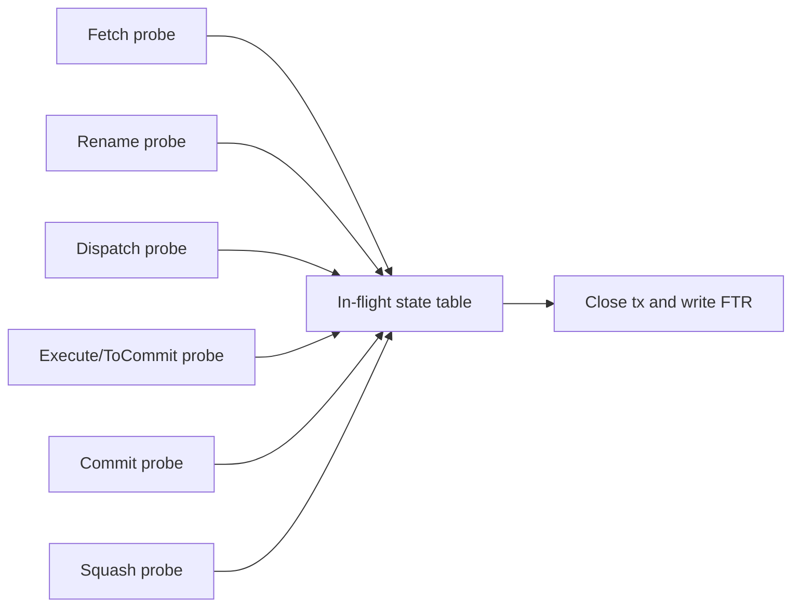

<!-- AI-generated by Codex/Claude. -->
# O3 CPU FTR Pipeline Trace Integration Spec

## 1. Feature overview

This feature adds structured FTR output for O3 pipeline traces.

When O3 pipeline tracing is enabled (`--debug-flags=O3PipeView`), gem5 must
continue writing the existing text stream (`trace.out`) and also emit a binary
`trace.ftr` in the output directory.

Expected outputs in a traced run:

| Output | Format | Primary consumer |
| --- | --- | --- |
| `trace.out` | text | `util/o3-pipeview.py`, manual debug |
| `trace.ftr` | binary (CBOR + LZ4) | FTR tooling and scripted analysis |

The FTR stream models each O3 dynamic instruction as a transaction:

- One FTR stream/fiber per SMT hardware thread (hart).
- One generator per hart.
- Transaction lifetime from fetch to retire (or squash fallback).
- Attributes include disassembly, sequence number, and per-stage timing
  equivalent to `docs/o3-pipeview.out` fields.

Design goals:

- O3PipeView parity: every timing datum in `trace.out` is available in FTR.
- Zero cost when disabled: no listener work outside trace-enabled runs.
- Minimal intrusion: integrate via probe listeners, not core stage rewrites.

Primary references:

- O3PipeView source records: `src/cpu/o3/dyn_inst.cc:221`
- Pipeline timing fields on `DynInst`: `src/cpu/o3/dyn_inst.hh:1020`
- Stage timestamp writers:
  - fetch: `src/cpu/o3/fetch.cc:1282`
  - decode: `src/cpu/o3/decode.cc:703`
  - rename: `src/cpu/o3/rename.cc:832`
  - dispatch: `src/cpu/o3/iew.cc:1095`
  - issue: `src/cpu/o3/inst_queue.cc:993`
  - complete: `src/cpu/o3/iew.cc:1559`
  - retire/commit: `src/cpu/o3/commit.cc:1276`
  - store-complete: `src/cpu/o3/lsq_unit.cc:1192`
- FTR writer API: `ext/ftr_trace/include/ftr/ftr_writer.h:531`

## 2. Usage scenarios

### 2.1 Single-thread pipeline debug

You run O3 with `O3PipeView` and inspect `trace.out` as usual, while tools that
consume FTR can load `trace.ftr` for structured filtering and timeline queries.

### 2.2 SMT fairness and starvation analysis

Each hart is emitted as an independent fiber, so stage delays and commit
latency can be compared per hart without parsing mixed text records.

### 2.3 Squash and recovery diagnosis

Instruction transactions include retire/squash outcome plus stage timestamps,
so you can isolate wrong-path work and where bubbles were introduced.

### 2.4 Automated regression analysis

Scripts can parse `trace.ftr` to compare stage-latency distributions across
runs and flag timing regressions without parsing multi-line text records.

### 2.5 Legacy compatibility

`trace.out` format remains unchanged and continues to feed
`util/o3-pipeview.py` (`util/o3-pipeview.py:157`).

## 3. Requirements and non-goals

### 3.1 Functional requirements

- Trigger condition: O3 pipeline tracing enabled (`debug::O3PipeView`).
- Output: `trace.ftr` in the same output directory resolution model used by
  other trace writers (`simout.resolve`, `src/base/output.hh:190`).
- One stream/fiber per O3 thread (`ThreadID`).
- One generator per hart stream.
- One instruction transaction per dynamic instruction in traced window.
- Stage timing attributes compatible with O3PipeView semantics (`fetch`,
  `decode`, `rename`, `dispatch`, `issue`, `complete`, `retire`, optional
  `store`).
- No measurable runtime overhead when O3 tracing is disabled.

### 3.2 Non-goals (phase 1)

- No replacement of `trace.out`.
- No cross-CPU global merge ordering guarantees beyond timestamp ordering.
- No GUI tooling in this change.

## 4. Proposed software architecture

### 4.1 High-level design

Introduce a dedicated O3 probe listener path for FTR emission. Keep data
collection decoupled from core pipeline logic:

- `O3FtrTrace` (new probe listener SimObject): subscribes to O3 probe points
  and forwards events.
- `O3FtrTraceManager` (new C++ helper): owns FTR writer and instruction state,
  materializes transactions.
- `O3FtrInstructionState` (new per-inflight record): stores IDs, lifecycle, and
  stage timing snapshot until close.

This mirrors existing O3 listener patterns such as `ElasticTrace`
(`src/cpu/o3/probe/elastic_trace.cc:104`).

### 4.2 Component placement

- New files under `src/cpu/o3/probe/`:
  - `FtrTrace.py`
  - `ftr_trace.hh`
  - `ftr_trace.cc`
- Build wiring in `src/cpu/o3/probe/SConscript` with `HAVE_FTR_TRACE` gate.
- Optional small support hooks in O3 stages only where probe coverage is
  missing for stage parity.

### 4.3 Ownership and lifecycle

#### 4.3.1 Writer ownership

`O3FtrTraceManager` owns `ftr::ftr_writer<true>` (compressed mode). The writer
is opened once and finalized once on simulator exit.

- Open path: `simout.resolve("trace.ftr")` style (see usage in
  `src/cpu/o3/probe/elastic_trace.cc:82`).
- Exit flush via `registerExitCallback` (`src/sim/core.hh:102`).

#### 4.3.2 Stream/generator bootstrapping

On startup:

- Call `writeInfo()` once (`ext/ftr_trace/include/ftr/ftr_writer.h:563`).
- For each O3 thread, call:
  - `writeStream(stream_id, name, "o3-hart-pipeline")`
  - `writeGenerator(generator_id, name, stream_id)`

IDs are deterministic and derived from `(cpu_id, thread_id)`.

Recommended ID encoding:

- `streamId = cpuId * maxThreads + tid`
- `generatorId = streamId` (one generator per hart stream)
- `txId = (streamId << 48) | nextLocalTxCounter++`

This keeps transaction IDs globally unique while preserving per-hart order.

### 4.4 Core data structures

#### 4.4.1 `O3FtrHartContext`

Per hart immutable/mutable state:

- `ThreadID tid`
- `uint64_t streamId`
- `uint64_t generatorId`
- `uint64_t nextLocalTxCounter`
- `InstSeqNum lastClosedSeqNum` (for diagnostics)

#### 4.4.2 `O3FtrInstructionState`

Per in-flight dynamic instruction:

- Identity:
  - `InstSeqNum seqNum`
  - `ThreadID tid`
  - `uint64_t txId`
- Static metadata snapshot:
  - `Addr pc`
  - `MicroPC upc`
  - `std::string disasm`
  - opcode class booleans (`isLoad`, `isStore`, `isControl`, ...)
- Timing snapshot (absolute tick domain):
  - `fetchTickAbs`
  - `decodeTickAbs`
  - `renameTickAbs`
  - `dispatchTickAbs`
  - `issueTickAbs`
  - `completeTickAbs`
  - `retireTickAbs`
  - `storeTickAbs`
- Lifecycle flags:
  - `seenFetchProbe`
  - `seenCommitProbe`
  - `seenSquashProbe`
  - `closed`

#### 4.4.3 `O3FtrInFlightTable`

- `unordered_map<InstSeqNum, O3FtrInstructionState>` per hart.
- Key choice is sequence number because O3 uses it as dynamic-instruction
  identity across pipeline and probes.

#### 4.4.4 `O3FtrStageNameTable`

Static map of canonical attribute names to avoid string drift:

- `stage.fetch`, `stage.decode`, `stage.rename`, `stage.dispatch`,
  `stage.issue`, `stage.complete`, `stage.retire`, `stage.store`
- `probe.fetch`, `probe.rename`, `probe.dispatch`, `probe.execute`,
  `probe.to_commit`, `probe.commit`, `probe.squash`

### 4.5 Event ingestion model

Probe registration points already present:

- `Fetch`: `src/cpu/o3/fetch.cc:191`
- `Rename`: `src/cpu/o3/rename.cc:202`
- `Dispatch/Execute/ToCommit`: `src/cpu/o3/iew.cc:138`
- `Commit/Squash`: `src/cpu/o3/commit.cc:160`

### 4.6 Transaction lifecycle

1. On first fetch event for `(tid, seqNum)`:
- Allocate state.
- Build deterministic `txId`.
- `startTransaction(txId, generatorId, streamId, fetchTickAbs)`.
- Write BEGIN attributes (identity and disassembly).

2. On intermediate probe events:
- Mark probe timestamps.
- Refresh stage timestamps from `DynInst` tick fields when available.

3. On commit:
- Compute absolute stage ticks from `fetchTick + relative_stage_delta` model
  used by O3PipeView (`src/cpu/o3/dyn_inst.cc:235`).
- Write RECORD attributes for all stage ticks and derived latencies.
- Write END attributes (`retired=true`, `squashed=false`).
- `endTransaction(txId, retireTickAbs)`.

4. On squash:
- Emit same stage attributes with missing stages as `0`/absent marker.
- END attributes (`retired=false`, `squashed=true`).
- End at best known lifetime tick (`squash tick` or latest known stage).

5. Shutdown fallback:
- Force-close any remaining in-flight states so writer does not leak open
  transactions (consistent with `ftr_writer` destructor behavior,
  `ext/ftr_trace/include/ftr/ftr_writer.h:546`).

### 4.7 Attribute schema (phase 1)

#### 4.7.1 BEGIN attributes

- `cpu_name` (string)
- `hart_id` (unsigned)
- `seq_num` (unsigned)
- `pc` (unsigned)
- `upc` (unsigned)
- `disasm` (string)
- `is_microop` (bool)
- `is_load` / `is_store` / `is_control` (bool)

#### 4.7.2 RECORD attributes

- Stage ticks compatible with O3PipeView:
  - `tick_fetch`
  - `tick_decode`
  - `tick_rename`
  - `tick_dispatch`
  - `tick_issue`
  - `tick_complete`
  - `tick_retire`
  - `tick_store`
- Per-stage latency deltas:
  - `lat_fetch_to_decode`
  - `lat_rename_to_dispatch`
  - `lat_complete_to_retire`
- Probe event ticks:
  - `probe_fetch` / `probe_rename` / ...

#### 4.7.3 END attributes

- `retired` (bool)
- `squashed` (bool)
- `faulted` (bool, if available)

#### 4.7.4 Naming conventions

- Stage timestamps use `tick_*`.
- Probe callbacks use `probe_*`.
- Classification bits use `is_*`.
- Use lowercase snake_case to avoid schema drift.

### 4.8 Time domain and units

- Internal collector uses gem5 ticks (`Tick`).
- FTR `writeInfo(timescale)` is set from simulator clock configuration.
  Preferred output is picosecond-equivalent to match FTR expectations and
  O3PipeView conventions.

<u>Weak point:</u> if global tick frequency is not exactly representable as a
single power-of-10 timescale, conversion introduces rounding. This is
unavoidable because FTR info stores one exponent, while gem5 allows arbitrary
`ticks/s` (`src/sim/core.hh:51`, `src/sim/core.cc:115`).

Mitigation: emit a one-time warning when configured tick frequency does not
match the declared FTR timescale. Raw tick attributes remain exact even if
human-readable unit interpretation is approximate.

### 4.9 Enablement and gating

#### 4.9.1 Runtime gate

FTR emission is active only when `debug::O3PipeView` is enabled, preserving
expected behavior and cost when pipeline tracing is off.

<u>Weak point:</u> tying enablement to a debug flag is semantically indirect.
It is still the least disruptive option because O3PipeView is already the
canonical switch for this data path (`src/cpu/o3/dyn_inst.cc:221`).

#### 4.9.2 Build gate

Compile only when `HAVE_FTR_TRACE` is available (lz4/header check in
`ext/ftr_trace/SConscript:12`).

If unavailable and O3PipeView is requested, gem5 keeps text tracing and emits a
single warning about disabled FTR output.

<u>Weak point:</u> behavior depends on host `lz4` availability.
No better in-tree alternative exists because `ftr_writer` depends on lz4 for
compressed chunks (`ext/ftr_trace/include/ftr/ftr_writer.h:27`).

### 4.10 Multi-thread and multi-CPU behavior

- SMT: one stream per `ThreadID` (hart).
- Multiple O3 CPUs: include `cpu_name` attribute and unique stream ID namespace
  over `(cpu_id, tid)`.

<u>Weak point:</u> a single shared `trace.ftr` requires centralized ownership to
avoid file write races if multiple O3 CPUs are present. Phase 1 assumes one
writer owner and deterministic registration order; this is sufficient for the
current O3 textbook workflow and avoids invasive global trace plumbing.

Implementation note: use a process-global writer registry where the first
`O3FtrTrace` instance opens the writer and subsequent instances register
streams/generators with that same writer.

### 4.11 Stage coverage gaps and mitigation

Current O3 probes do not emit a dedicated decode/issue/store-complete event.
Those values are available via `DynInst` timing fields.

<u>Weak point:</u> decode/issue/store timestamps are sampled from instruction
state rather than native probe notifications. This is the best achievable
fidelity without adding new probe points and touching more pipeline components.

Explicitly excluded probe points:

- `FetchRequest`: carries `RequestPtr`, not instruction lifecycle state.
- `SquashInRename`: register-renaming metadata, not stage timing.
- `Mispredict`: branch event, not per-squashed-instruction closure.
- `CommitStall`: useful diagnostics, but not a stage transition.

### 4.12 In-flight table boundedness

Most squashed callbacks are emitted when a squashed instruction reaches ROB
head retirement (`src/cpu/o3/commit.cc:954`, `src/cpu/o3/commit.cc:965`), so
fetched wrong-path instructions can outlive expectations in the table.

Mitigation:

- Keep per-hart in-flight maps keyed by `seqNum`.
- On commit/squash callbacks, run periodic GC for stale records older than the
  oldest still-live ROB sequence number.
- Track a `gcDropped` diagnostic counter and warn once if GC drops records.

<u>Weak point:</u> periodic GC adds bounded scan overhead, but this is better
than unbounded table growth in squash-heavy workloads.

## 5. Staged implementation plan

### Stage 0: skeleton and build plumbing

- Add `FtrTrace.py`, `ftr_trace.hh`, `ftr_trace.cc` under
  `src/cpu/o3/probe/`.
- Register SimObject and source in `src/cpu/o3/probe/SConscript` behind
  `HAVE_FTR_TRACE`.
- Add lightweight config attachment path analogous to existing
  `traceListener` usage (`configs/common/CpuConfig.py:59`).

Exit criteria:

- Build succeeds with and without `HAVE_FTR_TRACE`.

### Stage 1: minimal end-to-end transaction emission

- Implement per-hart stream/generator creation.
- Emit tx begin/end on fetch/commit with core identity attributes.
- Output file appears as `m5out/trace.ftr` when O3PipeView is active.

Exit criteria:

- FTR file generated and non-empty for a simple O3 run.

### Stage 2: full O3PipeView timing parity

- Add full stage timing attributes (`fetch..retire`, `store`) from `DynInst`
  fields.
- Add squash termination path and outcome flags.
- Add probe-event timestamp attributes.

Exit criteria:

- Attribute parity check passes against sampled `trace.out` lines.

### Stage 3: robustness and diagnostics

- Handle late tracing windows (`--debug-start`) and shutdown drain.
- Add periodic stale-record GC for squash-heavy paths with missing callbacks.
- Add counters/stats for emitted, squashed, force-closed, and dropped records.
- Add one-time warnings for missing optional data.

Exit criteria:

- No crashes/leaks on early-stop and debug windowed runs.

### Stage 4: polish and docs

- Document usage in `docs/probes.md` O3 trace listener section.
- Add a short decoder/inspection helper note if available.

Exit criteria:

- User-facing docs show exact command lines and expected outputs.

## 6. Test and verification methodology

### 6.1 Build matrix

- `scons build/NULL/gem5.debug` with `HAVE_FTR_TRACE=true`.
- `scons build/NULL/gem5.debug` with `HAVE_FTR_TRACE=false`.

Expected:

- With support: FTR listener compiled.
- Without support: build still succeeds, FTR feature disabled with warning.

### 6.2 Functional smoke tests

Run a small O3 SE workload with:

- `--debug-flags=O3PipeView --debug-file=trace.out`

Checks:

- `trace.out` exists and remains parseable by `util/o3-pipeview.py`.
- `trace.ftr` exists in the same output directory.
- Number of retired transactions approximately matches retired instructions in
  sampled O3PipeView window.

### 6.3 Parity checks vs O3PipeView

For sampled sequence numbers, verify:

- `pc/upc/disasm/seq_num` match `O3PipeView:fetch` record fields
  (`src/cpu/o3/dyn_inst.cc:228`).
- Stage ticks in FTR equal the same absolute ticks implied by O3PipeView
  (`fetch + delta` model in `src/cpu/o3/dyn_inst.cc:235`).
- Retired vs squashed semantics match O3PipeView retire=0 convention documented
  in `docs/o3-pipeview.out:18`.

### 6.4 SMT-specific checks

- Two-thread O3 run in SE mode.
- Confirm exactly two pipeline fibers in directory chunk.
- Confirm transactions for each `threadNumber` only appear in that hart’s
  stream.

### 6.5 Negative and edge cases

- `--debug-start` late activation: no crashes, partial windows tolerated.
- Early simulation exit: all in-flight transactions force-closed cleanly.
- `HAVE_FTR_TRACE=false`: no `trace.ftr`; `trace.out` unchanged.
- Squash-heavy run: in-flight table remains bounded due to stale-record GC.

### 6.6 Performance sanity

- Compare runtime with O3PipeView only vs O3PipeView+FTR on short benchmark.
- Track peak in-flight table size and emitted transaction count.

Acceptance target for phase 1:

- Overhead proportional to trace volume and acceptable for debug workflows.
- Incremental FTR cost should be below the existing O3PipeView text cost.

## 7. Open risks and why they are acceptable

<u>Weak point:</u> no direct FTR decode utility is part of this change.
Accepted for phase 1 because primary value is structured capture; decoding can
reuse existing internal/external FTR tooling.

<u>Weak point:</u> stage events are not all native probes today.
Accepted because existing `DynInst` timing fields are the ground truth used by
O3PipeView and provide the required parity with minimal intrusive changes.

<u>Weak point:</u> single-output-file ownership is delicate in many-CPU systems.
Accepted because the immediate target workflow is O3 textbook/debug scenarios,
which are predominantly single O3 core or tightly controlled setups.

## 8. Summary

This design adds `trace.ftr` as a first-class companion to `trace.out` for O3
pipeline tracing, with per-hart fibers, one generator per hart, instruction
transactions, and stage timing compatibility with O3PipeView semantics. It is
implemented as a probe-listener architecture to stay modular and to minimize
risk to O3 execution logic.
