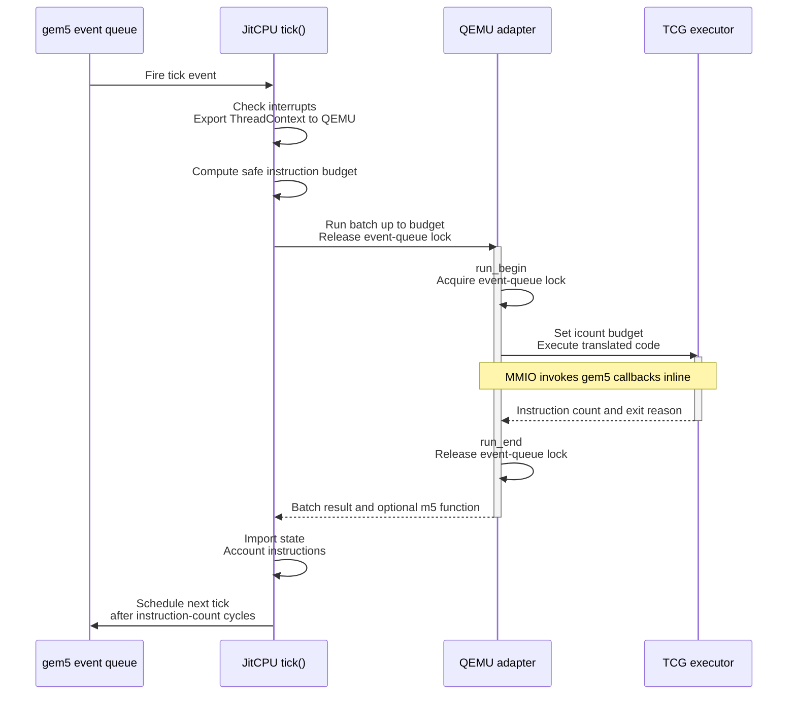
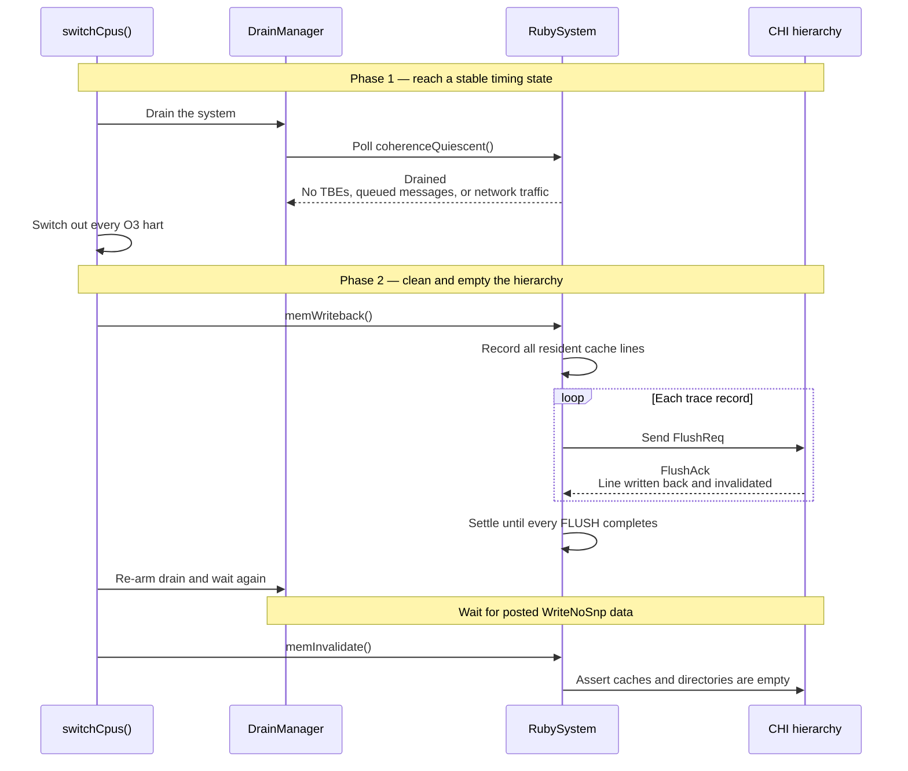
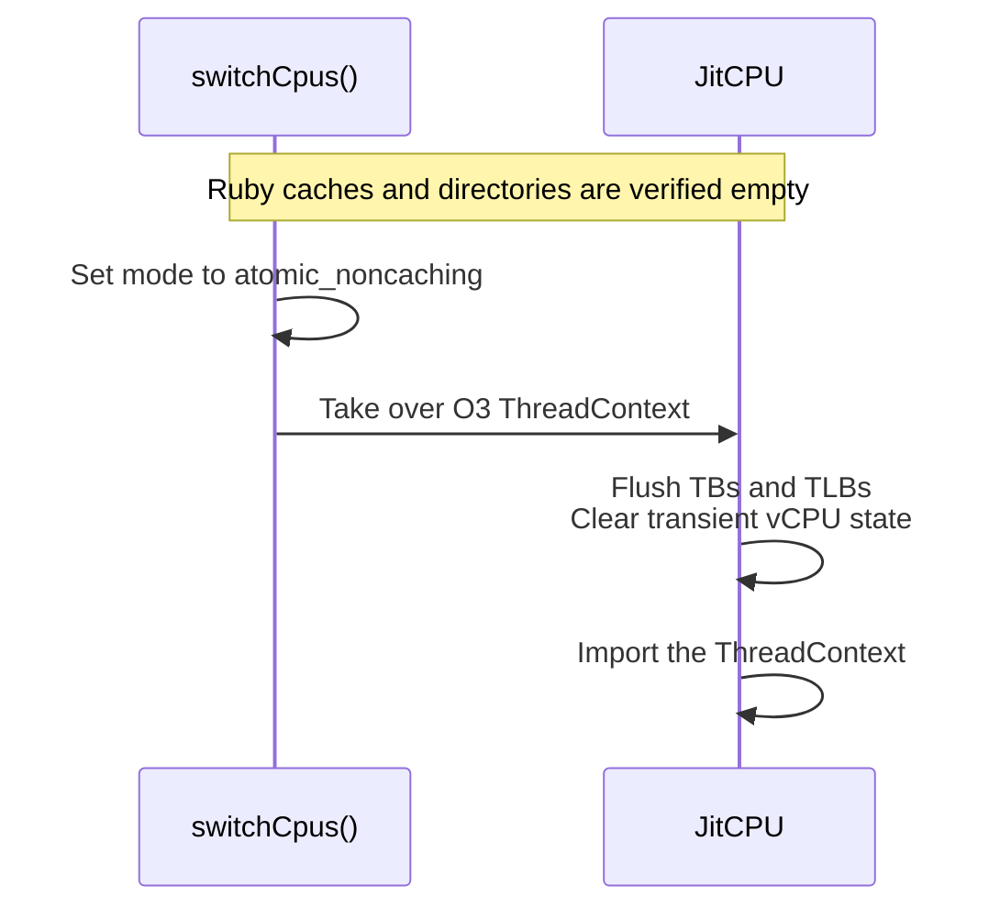

# RISC-V JitCPU — Tutorial and Reference

This document explains how `RiscvJitCPU` works, how a running system switches
between JitCPU and the detailed `RiscvO3CPU`, and every change made to
Ruby/CHI/SimpleNetwork to make switching and checkpointing safe. It is a
guided tour of the two commits that introduce them:

| Commit | Non-test code | Tests |
| --- | ---: | ---: |
| "cpu: Add QEMU-backed RISC-V JitCPU with one-way switching to O3" | +2,948 / −6 | +1,699 |
| "mem-ruby: Support JitCPU/O3 round-trip switching and CHI checkpoints" | +2,188 / −283 | +3,070 / −82 |

The first commit is self-contained: JitCPU, the QEMU backend, and the
one-way switch to O3 (sections 1–4.2), which needs no Ruby changes because
JitCPU leaves the timing hierarchy empty. The second carries everything the
reverse direction requires (sections 4.3–7) — and, fittingly, most of the
test weight.

All code references are clickable relative links (they open at the right line
in VS Code's editor and Markdown preview). Sequence diagrams use Mermaid;
structural diagrams are plain text so they render everywhere.

The companion specification, with qualified configurations, test strategy and
licensing, is [src/cpu/jit/README.md](src/cpu/jit/README.md). This tutorial
focuses on *how the code works*.

---

## Table of contents

1. [The big picture](#1-the-big-picture)
2. [Source map](#2-source-map)
3. [How JitCPU executes code](#3-how-jitcpu-executes-code)
4. [Switching between JitCPU and O3](#4-switching-between-jitcpu-and-o3)
5. [The Ruby/CHI changes: hierarchy-wide FLUSH](#5-the-rubychi-changes-hierarchy-wide-flush)
6. [The RubySystem changes: drain, writeback, settle](#6-the-rubysystem-changes-drain-writeback-settle)
7. [Checkpoint fixes](#7-checkpoint-fixes)
8. [Benchmark: Linux boot, JitCPU vs AtomicSimpleCPU](#8-benchmark-linux-boot-jitcpu-vs-atomicsimplecpu)
9. [Build and run quickstart](#9-build-and-run-quickstart)
10. [Complete change inventory](#10-complete-change-inventory)
11. [Glossary](#11-glossary)

---

## 1. The big picture

gem5's detailed CPU models interpret one instruction at a time; even
`AtomicSimpleCPU` — the fastest conventional model — runs a few million
instructions per second. Booting Linux that way takes minutes, and the boot is
usually not the part of the run anyone wants to study.

`RiscvJitCPU` replaces interpretation with **QEMU's TCG JIT translator**:
guest RISC-V code is translated to host machine code once and then executed
natively, while gem5 keeps ownership of simulated time, devices, interrupts
and the event queue. When the simulation reaches the interesting region, the
script switches every hart to `RiscvO3CPU` (or back) and detailed timing
simulation continues from the exact architectural state.

```text
              ~60x faster boot                detailed timing
  ┌────────────────────────────────┐   ┌──────────────────────────┐
  │  RiscvJitCPU (QEMU TCG)        │   │  RiscvO3CPU + Ruby CHI   │
  │  functional, IPC=1, uncached   │──▶│  caches, network, memory │
  │  memory mode atomic_noncaching │◀──│  memory mode timing      │
  └────────────────────────────────┘   └──────────────────────────┘
            m5.switchCpus() — any number of times, either direction
```

Three properties define the design:

- **One decoder, not two.** QEMU is pinned as a submodule
  ([ext/qemu/repo](ext/qemu)), patched minimally, and compiled into a shared
  library that gem5 `dlopen()`s at run time. gem5 itself has no compile-time
  QEMU dependency, which also keeps the GPL backend isolated from the
  BSD-licensed simulator.
- **gem5's `ThreadContext` is the contract.** At every batch boundary and
  every CPU switch, the architectural state (GPRs, FPRs, PC, CSRs, privilege,
  interrupts) is synchronized between gem5 and the QEMU vCPU. Any gem5 CPU
  can take over from JitCPU and vice versa.
- **JitCPU is not a timing model.** It charges exactly one cycle per guest
  instruction and bypasses the timing memory system. Its IPC is 1 by
  construction; only wall-clock speed and functional correctness are
  meaningful.

Measured on this machine (section [8](#8-benchmark-linux-boot-jitcpu-vs-atomicsimplecpu)):
booting Linux 6.12 to userspace takes **1.6 s** on JitCPU vs **98.7 s** on
the atomic CPU — a **62× end-to-end speedup** (95× in raw instruction rate,
81× in gem5 host time). Getting there required finding and fixing a platform
bottleneck; section [8.3](#83-finding-and-fixing-the-bottleneck) tells that
story.

## 2. Source map

| Path | Role | License |
| --- | --- | --- |
| [src/cpu/jit/riscv_jit_cpu.hh](src/cpu/jit/riscv_jit_cpu.hh) / [.cc](src/cpu/jit/riscv_jit_cpu.cc) | The gem5 CPU model and backend loader | BSD |
| [src/cpu/jit/RiscvJitCPU.py](src/cpu/jit/RiscvJitCPU.py) | SimObject parameters | BSD |
| [src/cpu/jit/SConscript](src/cpu/jit/SConscript), [src/cpu/jit/Kconfig](src/cpu/jit/Kconfig) | `USE_JITCPU` build glue (RISC-V only, links `libdl`) | BSD |
| [ext/qemu/gem5-jit/qemu-jit.h](ext/qemu/gem5-jit/qemu-jit.h) | The C interface between gem5 and the backend | GPL |
| [ext/qemu/gem5-jit/qemu-jit.c](ext/qemu/gem5-jit/qemu-jit.c) | The adapter: embeds QEMU, owns the vCPUs | GPL |
| [ext/qemu/gem5-jit/qemu.patch](ext/qemu/gem5-jit/qemu.patch) | Minimal QEMU patch: build target + m5-op hook | GPL |
| [util/jitcpu/build-qemu-jit.sh](util/jitcpu/build-qemu-jit.sh) | Builds `build/qemu-jit/libgem5-qemu-jit.so` | BSD |
| [util/jitcpu/build-linux-image.sh](util/jitcpu/build-linux-image.sh) | Builds `vmlinux`, OpenSBI, musl toolchain | BSD |
| [src/mem/ruby/system/RubySystem.cc](src/mem/ruby/system/RubySystem.cc) | Drain/writeback/settle/invalidate rework | BSD |
| [src/mem/ruby/protocol/chi/](src/mem/ruby/protocol/chi/) | New acknowledged FLUSH transaction | BSD |
| [tests/gem5/jitcpu/](tests/gem5/jitcpu/) | Configs and regression drivers | BSD |

The runtime component stack:

```text
   ┌─────────────────────────────────────────────┐
   │        gem5 ThreadContext / RiscvISA        │   canonical at switch
   └───────────────────────┬─────────────────────┘   boundaries
                           │ sync GPRs/FPRs/PC/CSRs/priv/MIP
   ┌───────────────────────▼─────────────────────┐
   │   RiscvJitCPU  (a NonCachingSimpleCPU)      │   scheduling, stats,
   │   tick() = sync → run batch → sync          │   MMIO, m5-ops
   └───────────────────────┬─────────────────────┘
                           │ dlopen() + 15 C functions
   ┌───────────────────────▼─────────────────────┐
   │   libgem5-qemu-jit.so  (adapter + QEMU)     │   one vCPU per hart,
   │   TCG translator, single-threaded executor  │   shared address space
   └──────────┬────────────────────────┬─────────┘
              │ translated loads/stores │
   ┌──────────▼──────────┐  ┌──────────▼─────────┐
   │  mapped host RAM    │  │  gem5 callbacks    │
   │  (fast direct path) │  │  (MMIO/slow path)  │
   └─────────────────────┘  └────────────────────┘
```

## 3. How JitCPU executes code

### 3.1 The gem5 side: an AtomicSimpleCPU with a replaced tick

[`RiscvJitCPU`](src/cpu/jit/riscv_jit_cpu.hh#L47) derives from
`NonCachingSimpleCPU` (the `atomic_noncaching` flavor of `AtomicSimpleCPU`).
That buys it every piece of standard CPU plumbing for free — ports,
drain/switch-out logic, interrupt controller, MMU, stats — and it overrides
exactly one execution entry point:
[`tick()`](src/cpu/jit/riscv_jit_cpu.cc#L586), which
[became `virtual`](src/cpu/simple/atomic.hh#L71) in `AtomicSimpleCPU` for
this purpose. Instead of fetching and interpreting one instruction, JitCPU's
tick runs a *batch* of translated instructions inside QEMU.

The backend is loaded in the
[constructor](src/cpu/jit/riscv_jit_cpu.cc#L308) with `dlopen()`, and the
[`QemuJitBackend`](src/cpu/jit/riscv_jit_cpu.cc#L145) wrapper resolves the 15
`gem5_qemu_jit_*` symbols declared in
[qemu-jit.h](ext/qemu/gem5-jit/qemu-jit.h#L69). Because linking is dynamic,
`gem5.opt` builds without any QEMU headers; `USE_JITCPU=n` removes the model
entirely.

[`init()`](src/cpu/jit/riscv_jit_cpu.cc#L329) validates the qualified
configuration (RV64, no vector/hypervisor/Zicbom/Zicboz/Smrnmi) and registers
the per-CPU callback table
([`QemuJitCallbacks`](src/cpu/jit/riscv_jit_cpu.cc#L65)) with the backend:
memory read/write, the RAM map enumerator, run begin/end hooks, a time
reader, and a "should this batch stop?" predicate.

Multi-core works by instantiating one `RiscvJitCPU` per hart, each with a
unique `backend_instance` and the same `backend_instance_count`
([RiscvJitCPU.py](src/cpu/jit/RiscvJitCPU.py#L65)). The first `init()` call
[boots QEMU once](ext/qemu/gem5-jit/qemu-jit.c#L212); every instance then
claims its own vCPU.

### 3.2 The QEMU side: a machine with no board

The adapter starts QEMU with
[`-machine none`](ext/qemu/gem5-jit/qemu-jit.c#L223): no board, no QEMU
devices, no QEMU RAM. Three switches define the execution model:

- `-cpu rv64,...` disables every extension outside the qualified common
  subset (V, H, SSTC, Zicbo*, Zawrs, Zfa, Zbc, Svadu, Svvptc);
- `-accel tcg,thread=single` serializes all vCPUs through one TCG executor,
  matching gem5's event-driven scheduling;
- `-icount shift=0,sleep=off` makes QEMU count instructions exactly — which
  is how a batch budget is enforced and how gem5 charges cycles.

Every hart's `mhartid` is set to its gem5 context ID, and QEMU's `rdtime`
callback is pointed at gem5
([`jit_read_time`](ext/qemu/gem5-jit/qemu-jit.c#L82) →
[`RiscvJitCPU::backendReadTime()`](src/cpu/jit/riscv_jit_cpu.cc#L762) →
CLINT `mtime`), so **gem5 owns simulated time**. QEMU's own virtual timers
stay disabled.

### 3.3 Physical memory: fast path and slow path

Memory is layered with QEMU memory-region priorities
([`jit_global_init`](ext/qemu/gem5-jit/qemu-jit.c#L280)):

```text
QEMU translated load or store
└─ Resolve the guest physical address (highest priority wins)
   │
   ├─ Covered by a gem5-jit-ram-N region?  [priority 1]
   │  └─ FAST PATH
   │     Direct host access to gem5's backing store
   │     (for example, 256 MiB starting at 0x80000000)
   │     No callback and no gem5 Packet
   │
   └─ Otherwise use the 2^64-address catch-all  [priority 0]
      └─ SLOW PATH
         jit_memory_read/write callback
         → gem5 Packet → CPU dcache port
         → MMIO device or functional backing store
```

[`physicalMemoryMap()`](src/cpu/jit/riscv_jit_cpu.cc#L713) enumerates gem5's
backing store and offers every kvm-mappable region for direct mapping.
Everything else — device MMIO above all — funnels through
[`physicalAccess()`](src/cpu/jit/riscv_jit_cpu.cc#L686), which builds real
gem5 packets, so device models behave exactly as they would under any other
CPU.

**Interleaving costs the fast path nothing.** A CHI mesh spreads DRAM across
several memory controllers with interleaved address ranges, but
[`PhysicalMemory`](src/mem/physical.cc#L148) merges interleaved ranges that
`mergesWith` each other into a single range covering their union and calls
[`createBackingStore()`](src/mem/physical.cc#L231) on that — which
[panics if the range is still interleaved](src/mem/physical.cc#L246) — then
points every controller at the one `mmap`. The host image is linear in guest
physical address however many controllers share it, so `getBackingStore()`
can never report an interleaved range and the `interleaved()` guard in
`physicalMemoryMap()` is unreachable. Running the 16-hart 4x4 mesh confirms
it: 16 harts, 16 HNFs and 4 memory controllers, and the backend is offered
one region spanning the whole 1 GiB.

What does exclude a region is `kvm_map`. The Ruby configurations
[enable `access_backing_store` whenever `--num-dirs` exceeds one](tests/gem5/jitcpu/configs/jitcpu_common.py#L34),
which [clears `kvm_map` on the DRAM interfaces](configs/ruby/Ruby.py#L185)
and creates `system.ruby.phys_mem`. That is then the region QEMU maps
directly — and it is the same allocation Ruby's functional accesses reach, so
the direct mapping and the slow path always see the same bytes. With a single
directory there is no `access_backing_store` and the merged DRAM store is the
mapped one instead.

Two subtleties in that slow path:

- An access outside backing memory flags
  [`backendIoAccessed`](src/cpu/jit/riscv_jit_cpu.cc#L694): a device may have
  scheduled events, so the batch must end at the next instruction boundary
  ([`jit_maybe_stop`](ext/qemu/gem5-jit/qemu-jit.c#L73) calls `cpu_exit()`).
- In Ruby mode the port is a RubyPort in `atomic_noncaching` mode, which
  routes the access to Ruby's **functional backing store** — deliberately
  bypassing the timing caches and network (that is the invariant the whole
  switching machinery protects; see section 5).

### 3.4 The batch loop

One [`tick()`](src/cpu/jit/riscv_jit_cpu.cc#L586) is one batch:



[`executionBudget()`](src/cpu/jit/riscv_jit_cpu.cc#L521) shrinks the default
`batch_size` (10,000; the Linux configs use 1,024) so a batch can never run
past anything gem5 has committed to:

1. the next **instruction-count event** on this thread (used by sampling and
   `--maxinsts`-style logic);
2. the next **event-queue event**, converted to cycles — one guest
   instruction is one CPU cycle, so a timer event 500 cycles away caps the
   batch at 500 instructions;
3. events due *now* force a single-instruction batch — unless every such
   event is a peer JitCPU's tick (see 3.5).

While the batch runs, gem5 releases its event-queue lock
([`ScopedRelease`](src/cpu/jit/riscv_jit_cpu.cc#L607)) and the adapter's
[`run_begin`](src/cpu/jit/riscv_jit_cpu.cc#L743) hook re-acquires it *from
the QEMU executor thread*. This hand-over matters: a translated MMIO store
runs gem5 device code inline on that thread, and that code schedules events —
so the queue must be owned by whichever thread is executing.

After the batch, [`accountInstructions()`](src/cpu/jit/riscv_jit_cpu.cc#L553)
bulk-updates the standard fetch/execute/commit statistics (this is why
per-privilege attribution is approximate: the whole batch is charged to the
privilege mode observed at its boundary), and the next tick is scheduled
`instructions` cycles later — simulated time advances exactly one cycle per
instruction, after the fact.

**The timer that used to cap every batch.** "Never run past the next event"
interacts badly with a CLINT driven by one RTC pin event per `mtime` tick
([`Clint::raiseInterruptPin`](src/dev/riscv/clint.cc#L127)): at a 1 MHz RTC
and a 1 GHz CPU an event fires every 1,000 cycles, so no batch could exceed
~1,000 instructions *regardless of `batch_size`* — ~463K batches and ~1M
thread context switches per Linux boot. Profiling showed this cadence, not
TCG execution, dominated boot time. The CLINT therefore gained a **lazy
timer mode** ([`rtc_period` param](src/dev/riscv/Clint.py#L64)): `mtime` is
computed from `curTick` on demand
([`mtimeNow()`](src/dev/riscv/clint.cc#L78), a register
[read callback](src/dev/riscv/clint.cc#L188)) and the only scheduled events
are `mtimecmp` deadlines
([`scheduleMtimecmpEvent()`](src/dev/riscv/clint.cc#L87)). Guest-visible
`mtime` values and MTIP edges are tick-identical to the event-per-tick
implementation (`floor((T−T₀)/P)` reproduces the counter exactly, and a
deadline event fires at the precise tick the counter would have matched).
The Linux config [enables it by default](tests/gem5/jitcpu/configs/jitcpu_linux.py#L314)
(`--classic-rtc-events` restores the pin-driven RTC), letting batches
actually reach `batch_size` — which that config now defaults to 65,536.
Boot host time dropped 3.7× (section 8.3).

### 3.5 Why peer JitCPU ticks don't end a batch

With N harts, at any tick there are usually N JitCPU tick events scheduled at
the *same* tick. If "an event is due now" always forced a one-instruction
batch, multicore execution would degenerate to lock-step single-stepping —
a >100× slowdown with 16 harts.

The fix is to distinguish *who owns* the due event. Events carry no owner
identity, so every JitCPU registers its tick event in a
[static set](src/cpu/jit/riscv_jit_cpu.hh#L107), and
[`hasForeignEventAtOrBefore()`](src/cpu/jit/riscv_jit_cpu.cc#L299) asks the
event queue whether anything *else* is due, using the new generic
[`EventQueue::anyEventAtOrBefore()`](src/sim/eventq.hh#L860) — a
predicate-based scan that walks the same-tick bins rather than peeking only
at the queue head. Peer JitCPU ticks are ignored when computing the budget
([budget path](src/cpu/jit/riscv_jit_cpu.cc#L545)) and when deciding whether
a running batch must stop
([`backendShouldStop()`](src/cpu/jit/riscv_jit_cpu.cc#L770)); device and
timer events still cut the batch to one instruction so ordering against
hardware models is preserved.

### 3.6 Interrupts: gem5 owns MIP, mostly

Before each batch, [`syncToBackend()`](src/cpu/jit/riscv_jit_cpu.cc#L391)
pushes gem5's interrupt-pending register into QEMU and remembers the pushed
value ([`pushedMip`](src/cpu/jit/riscv_jit_cpu.cc#L439)). After the batch,
[`syncFromBackend()`](src/cpu/jit/riscv_jit_cpu.cc#L444) must decide, bit by
bit, which side's MIP is the truth:

- **Machine-level bits (MSIP/MTIP/MEIP) are never imported from QEMU.** They
  are levels driven by gem5's CLINT/PLIC device models; copying QEMU's
  sampled values back after a device MMIO cleared them would re-post a stale
  interrupt.
- **Supervisor bits (SSIP/STIP/SEIP) can legitimately change on either
  side.** Guest firmware running inside QEMU writes them with CSR
  instructions (legacy SBI converts MTIP into STIP for Linux); but a
  translated MMIO access also runs gem5's PLIC inline, which recomputes SEIP
  on the gem5 side *during* the batch.

The resolution is a [delta merge](src/cpu/jit/riscv_jit_cpu.cc#L506): a
supervisor bit is imported from QEMU only if gem5's copy did *not* change
during the batch (`import_mask = S-bits & ~(gem5_mip ^ pushedMip)`). If gem5
moved a bit, gem5 wins — which is exactly what a detailed CPU would have
observed at the same boundary.

CSRs travel through an explicit
[36-entry mapping table](src/cpu/jit/riscv_jit_cpu.cc#L104) (status, trap
vectors/values, SATP, PMP, counters-enable, …). Two get special handling:
`fflags`/`frm` must be readable even when `mstatus.FS=Off` — a legal switch
state where architectural CSR access traps — so the adapter reaches them via
[QEMU helper functions](ext/qemu/gem5-jit/qemu-jit.c#L463) rather than the
CSR permission path. Both sync directions also temporarily
[raise the privilege to M](src/cpu/jit/riscv_jit_cpu.cc#L400) because both
simulators enforce privilege on CSR access.

### 3.7 WFI

A halted vCPU reports [`EXIT_HALTED`](src/cpu/jit/riscv_jit_cpu.cc#L645).
JitCPU keeps the gem5 thread context *runnable* (only QEMU is halted) and
reschedules its tick at the next event that could deliver an interrupt —
`max(clockEdge(batch), next event tick)` — rather than polling every cycle.
The wake-up path is natural: the device raises MIP in gem5, the next
`syncToBackend()` [injects it](ext/qemu/gem5-jit/qemu-jit.c#L503) via
`riscv_cpu_update_mip()`, and QEMU un-halts the vCPU.

### 3.8 m5 pseudo-instructions

gem5 workloads use `m5` ops (exit, checkpoint, switchcpu…) encoded in a
reserved opcode space. The
[QEMU patch](ext/qemu/gem5-jit/qemu.patch#L93) adds ~7 lines to the RISC-V
decoder: when the gem5 adapter enabled the flag and the instruction word
matches `(opcode & 0x01ffffff) == 0x7b`, the translator stores the raw
instruction word to `env.bins` and raises `EXCP_HLT`.

The adapter [distinguishes the two meanings of
`EXCP_HLT`](ext/qemu/gem5-jit/qemu-jit.c#L197) — a WFI halts the CPU, an
m5-op does not — and returns the m5 function number
(`bins >> 25`). gem5 then executes its *existing* pseudo-instruction
implementation ([`pseudoInst<RegABI64>`](src/cpu/jit/riscv_jit_cpu.cc#L627)),
writes the result to `a0` and advances the PC by 4. No m5-op semantics are
duplicated in QEMU.

One trap here is documented in
[jit_run_on_vcpu](ext/qemu/gem5-jit/qemu-jit.c#L170): QEMU never clears
`env.bins`, and WFI raises the *same* `EXCP_HLT`. Without clearing `bins`
before every batch, the first WFI after any m5-op would replay that m5-op —
re-running its side effects and mis-advancing the PC.

### 3.9 What ends a batch (summary)

| Exit | Detected by | JitCPU response |
| --- | --- | --- |
| Budget exhausted | icount | reschedule after `instructions` cycles |
| Foreign gem5 event became due | [`backendShouldStop`](src/cpu/jit/riscv_jit_cpu.cc#L770) via `cpu_exit` | reschedule; event runs first |
| MMIO / non-RAM access | [`backendIoAccessed`](src/cpu/jit/riscv_jit_cpu.cc#L694) | end batch so device events run |
| WFI | `EXIT_HALTED` | sleep until next relevant event (3.7) |
| m5 pseudo-instruction | `EXIT_M5OP` via `env.bins` | run gem5 pseudoInst (3.8) |
| Interrupt executor exit | `EXIT_INTERRUPT` | normal reschedule |
| Anything else | `EXIT_EXCEPTION`/`ERROR` | [fatal, with PC](src/cpu/jit/riscv_jit_cpu.cc#L616) — never silently ignored |

## 4. Switching between JitCPU and O3

### 4.1 gem5's switching machinery in 30 seconds

[`m5.switchCpus()`](src/python/m5/simulate.py#L437) is existing gem5
machinery: drain the whole system, `switchOut()` the old CPUs, flip the
memory mode if the new CPUs need a different one, then
`new_cpu.takeOverFrom(old_cpu)` copies every thread context. The
configuration keeps both CPU sets instantiated side by side, the inactive
one with `switched_out=True`
([jitcpu_linux.py](tests/gem5/jitcpu/configs/jitcpu_linux.py#L344)), and calls
for example:

```python
m5.switchCpus(system, list(zip(jit_cpus, o3_cpus)), is_ruby=True)
```

JitCPU runs in `atomic_noncaching` memory mode; O3 runs in `timing`. The
whole difficulty of switching lives in that mode change.

### 4.2 JitCPU → O3: the easy direction

When JitCPU has been running, the timing hierarchy is *empty* — nothing ever
sent a timing request. So the standard sequence just works:

```text
guest runs m5_switch_cpu (or script decides)
  → m5.simulate() returns
  → m5.switchCpus(): drain → switchOut(Jit) → mode := timing
  → O3.takeOverFrom(Jit): ThreadContext copy (PC/GPRs/FPRs/CSRs)
  → O3 starts fetching; caches warm up from cold
```

No cache maintenance is needed. The one RISC-V-specific addition applies in
both directions: gem5 keeps the PMP as *two* pieces of state — the raw CSRs
and a decoded rule table — and only the CSRs travel with the thread context.
[`MMU::takeOverFrom`](src/arch/riscv/mmu.hh#L107) now also copies the decoded
table via the new [`PMP::takeOverFrom`](src/arch/riscv/pmp.cc#L60), otherwise
the new CPU would enforce stale permissions.

### 4.3 O3 → JitCPU: the hard direction

Draining stops all transactions, but leaves the CHI caches *full* of clean
and dirty lines. If JitCPU then read the functional backing store, it would
see stale data for every dirty line, and O3's next takeover would see stale
caches. The switch therefore performs a full, verified writeback and
invalidation of the coherent hierarchy:

First, the timing hierarchy is drained, cleaned, and verified:



Only after that verification succeeds does execution move to JitCPU:



Step by step, with the code that implements it:

1. **Drain now includes Ruby itself.**
   [`RubySystem::drain()`](src/mem/ruby/system/RubySystem.cc#L381) refuses to
   report drained until [`coherenceQuiescent()`](src/mem/ruby/system/RubySystem.cc#L286)
   holds (section 6.1). Without this, trace capture could race an in-flight
   eviction moving the only copy of a line between controllers.
2. **Trace, then flush.**
   [`RubySystem::memWriteback()`](src/mem/ruby/system/RubySystem.cc#L226)
   records every resident line into the `CacheRecorder` (the same trace used
   for checkpoints), then replays it as a stream of
   [`FlushReq` packets](src/mem/ruby/system/CacheRecorder.cc#L89) which CHI
   executes as acknowledged, hierarchy-wide clean-and-invalidate transactions
   (section 5).
3. **Settle.** The recorder keeps several FLUSHes in flight and
   [stops the simulate loop when it runs out of records to *issue*](src/mem/ruby/system/CacheRecorder.cc#L108),
   so the last transactions are still live.
   [`settleRecorderTraffic()`](src/mem/ruby/system/RubySystem.cc#L269) polls
   until the protocol and network are quiescent *before* leaving cooldown —
   leaving early is not benign, because recorder packets carry no port sender
   state and a late completion would be mistaken for a CPU request.
4. **Drain again.**
   [`_drain_after_mem_writeback()`](src/python/m5/simulate.py#L401), called
   from [`switchCpus`](src/python/m5/simulate.py#L522): the flush posted
   writes to the memory controllers while the drain manager still considered
   the system drained; re-arm and wait for them.
5. **Verify, fail closed.**
   [`RubySystem::memInvalidate()`](src/mem/ruby/system/RubySystem.cc#L302)
   asserts via
   [`cacheAndDirectoryEmpty()`](src/mem/ruby/protocol/chi/CHI-cache-funcs.sm#L407)
   that **no controller holds any cache entry or directory entry**. A line
   the trace missed becomes a fatal error, never silent data loss.
6. **Backend hygiene.**
   [`RiscvJitCPU::takeOverFrom()`](src/cpu/jit/riscv_jit_cpu.cc#L378) calls
   [`gem5_qemu_jit_invalidate_translations()`](ext/qemu/gem5-jit/qemu-jit.c#L531):
   a global TCG translation-block flush, a software-TLB flush, and a
   [clear of transient vCPU state](ext/qemu/gem5-jit/qemu-jit.c#L513)
   (halted flag, pending exception, LR/SC reservation, `env.bins`). TBs are
   flushed even when SATP is unchanged, because O3 may have modified page
   tables or executable code while JitCPU's translations still cached the old
   bytes.

### 4.4 The architectural state contract

| State | Mechanism |
| --- | --- |
| PC, integer registers | `BaseCPU::takeOverFrom` + [`syncToBackend`](src/cpu/jit/riscv_jit_cpu.cc#L391) |
| FP registers, `fflags`, `frm` | backend sync, works even with `mstatus.FS=Off` ([helper access](ext/qemu/gem5-jit/qemu-jit.c#L463)) |
| Privilege + M/S CSRs | the [CSR mapping table](src/cpu/jit/riscv_jit_cpu.cc#L104) |
| SATP / translation | CSR transfer + [TB/TLB invalidation](ext/qemu/gem5-jit/qemu-jit.c#L531) |
| PMP | CSR transfer + [decoded-rule copy](src/arch/riscv/pmp.cc#L60) |
| Interrupts | gem5 devices canonical + [MIP delta merge](src/cpu/jit/riscv_jit_cpu.cc#L506) |
| WFI/exception/LR-SC/m5op transients | [cleared on takeover](ext/qemu/gem5-jit/qemu-jit.c#L513) |

One operational rule: exactly **one hart** may execute `m5_switch_cpu` per
handoff. gem5 does not coalesce simultaneous exit events, so a second
requester would leave a spurious queued `switchcpu` exit for the script.

## 5. The Ruby/CHI changes: hierarchy-wide FLUSH

### 5.1 Why a new transaction

CHI had no handling for Ruby's `RubyRequestType_FLUSH` request at all — but
the switch needs an operation that, for one line address, guarantees: every copy
in every upstream cache is invalidated, dirty data reaches memory, and the
requester learns when all of that has *completed*. The implementation adds
exactly that as a first-class CHI transaction, reusing the protocol's normal
snoop/writeback machinery — no private "maintenance walker" that would
bypass the coherence protocol's own serialization.

Three new message types in [CHI-msg.sm](src/mem/ruby/protocol/chi/CHI-msg.sm):

| Type | Kind | Meaning |
| --- | --- | --- |
| [`Flush`](src/mem/ruby/protocol/chi/CHI-msg.sm#L53) | request | sequencer → its cache controller: clean+invalidate this line everywhere |
| [`FlushLine`](src/mem/ruby/protocol/chi/CHI-msg.sm#L61) | request | cache → downstream: carry the flush toward the point of coherence |
| [`FlushAck`](src/mem/ruby/protocol/chi/CHI-msg.sm#L143) | response | downstream → upstream: flush fully complete below this point |

### 5.2 Anatomy of one FLUSH

```text
CacheRecorder record (one per resident line)
        │  FlushReq packet, no sender state
        ▼
   RubyPort/Sequencer  ── maps MemCmd::FlushReq → RubyRequestType_FLUSH
        │                 (Sequencer.cc, mandatory queue)
        ▼
   RNF cache (L1 → L2):  Event:Flush
        │   1. clean/invalidate own copy + local subtree
        │      (Initiate_Replacement_WB / _Evict / _BackInvalidate)
        │   2. forward FlushLine downstream, wait for FlushAck
        ▼
   HNF (point of coherence):  Event:Flush_PoC
        │   1. SnpCleanInvalid every upstream sharer/owner
        │   2. write dirty data to SNF/memory (WriteNoSnp)
        │   3. drop own cache + directory entry
        │   4. FlushAck only after snoop responses, data movement,
        │      and the memory write response all completed
        ▼
   FlushAck returns hop-by-hop; the injecting controller finishes with
   sequencer.writeCallback() → recorder issues the next record
```

The routing pivot is
[`reqToEvent()`](src/mem/ruby/protocol/chi/CHI-cache-funcs.sm#L1316): a
`FlushLine` arriving at a non-home controller becomes another `Event:Flush`
(clean locally, forward again), while at the HNF it becomes
`Event:Flush_PoC`. The same code therefore works for any cache depth.

On the request side, the sequencer path was extended in three places:
[`fromSequencer()`](src/mem/ruby/protocol/chi/CHI-cache-funcs.sm#L298)
accepts `Flush`,
[`AllocateTBE_SeqRequest`](src/mem/ruby/protocol/chi/CHI-cache-actions.sm#L136)
emits `CHIRequestType:Flush`, and
[`Sequencer.cc`](src/mem/ruby/system/Sequencer.cc#L1055) maps the `FlushReq`
packet to `RubyRequestType_FLUSH`.

**RN-side transitions** ([CHI-cache-transitions.sm](src/mem/ruby/protocol/chi/CHI-cache-transitions.sm#L893)):
every stable state has a `Flush` transition into `BUSY_BLKD` that composes
existing action sequences —

- `I`: [just forward](src/mem/ruby/protocol/chi/CHI-cache-transitions.sm#L896)
  (the line may live in *other* RNFs; only the HNF knows);
- `SC`: [evict + forward](src/mem/ruby/protocol/chi/CHI-cache-transitions.sm#L903);
- `UD/SD/UC`: [writeback + forward](src/mem/ruby/protocol/chi/CHI-cache-transitions.sm#L912);
- directory-holding states (`RU`, `RSD`, `UD_RSC`, …):
  [writeback + back-invalidate own upstream + forward](src/mem/ruby/protocol/chi/CHI-cache-transitions.sm#L941).

The forwarding itself is
[`Initiate_Flush_Forward`](src/mem/ruby/protocol/chi/CHI-cache-actions.sm#L1516)
(queue `SendFlush`, then `CompleteFlush`) and
[`Send_Flush`](src/mem/ruby/protocol/chi/CHI-cache-actions.sm#L1743), which
expects exactly one `FlushAck`. Note the ordering guarantee in the comment:
the local clean happens *before* `FlushLine` is issued, so the HNF's
`SnpCleanInvalid` never chases dirty data still sitting in the forwarding
controller, and no request/snoop dependency cycle forms.

**HNF-side transitions**: dirty states
[write back](src/mem/ruby/protocol/chi/CHI-cache-transitions.sm#L952), clean
states [just drop](src/mem/ruby/protocol/chi/CHI-cache-transitions.sm#L975),
directory states
[back-invalidate all sharers](src/mem/ruby/protocol/chi/CHI-cache-transitions.sm#L986),
and `I` [completes immediately](src/mem/ruby/protocol/chi/CHI-cache-transitions.sm#L1009)
(a concurrent duplicate FLUSH may have already removed the line — legal by
construction, exercised by the tester's `--flush-duplicates` mode).
Completion is
[`Complete_Flush`](src/mem/ruby/protocol/chi/CHI-cache-actions.sm#L3340):
answer the local sequencer if this controller injected the request, otherwise
send `FlushAck` upstream; its preconditions (no expected responses, no
sharers, no owner) are asserted. The ack is consumed by the
[`BUSY_INTR → FlushAck` transition](src/mem/ruby/protocol/chi/CHI-cache-transitions.sm#L1711).

Existing per-line TBE serialization gives correctness under concurrency:
while a FLUSH holds the line's TBE, later requests for that address
[stall in `BUSY_*`](src/mem/ruby/protocol/chi/CHI-cache-transitions.sm#L1090)
exactly like any other conflicting transaction.

### 5.3 The clean-owner subtlety

An HNF flushing a line whose *exclusive upstream owner* might be dirty has to
assume dirty: it queues the `WriteNoSnp` (to memory) **before** the snoop
response arrives. But RISC-V CHI allows a clean exclusive owner to answer
`SnpCleanInvalid` *without data*. Then there is nothing to write back, and
the conservatively queued write must be dropped — coherently, in four places
that must agree, keyed by
[`flushWriteSuppressed()`](src/mem/ruby/protocol/chi/CHI-cache-funcs.sm#L413):

1. [`Send_WriteNoSnp`](src/mem/ruby/protocol/chi/CHI-cache-actions.sm#L1815)
   skips issuing the write and expecting its `CompDBIDResp`;
2. [`Send_WBData`](src/mem/ruby/protocol/chi/CHI-cache-actions.sm#L2962)
   skips sending write data;
3. [`Profile_OutgoingStart`](src/mem/ruby/protocol/chi/CHI-cache-actions.sm#L4078)
   must not open an outgoing-transaction profile record that nothing will
   close;
4. the queued `SendWBData` trigger still fires after the state already moved
   to `BUSY_INTR` — a state/event pair that is otherwise illegal — so a
   dedicated [`BUSY_INTR, SendWBData` transition](src/mem/ruby/protocol/chi/CHI-cache-transitions.sm#L1221)
   routes it to
   [`Complete_Suppressed_Flush_Write`](src/mem/ruby/protocol/chi/CHI-cache-actions.sm#L3011),
   which *fails closed* (SLICC `error()`, present in `.opt` builds) if the
   situation is anything other than a suppressed flush write.

### 5.4 Quiescence: what "nothing in flight" actually means

The switch depends on being able to *prove* the protocol is idle. Each
controller type implements a `coherenceQuiescent()` SLICC function, surfaced
through new virtual hooks on
[`AbstractController`](src/mem/ruby/slicc_interface/AbstractController.hh#L124):

- [CHI cache](src/mem/ruby/protocol/chi/CHI-cache-funcs.sm#L381): all five
  TBE tables empty *and unreserved*, retry queue, mandatory queue, trigger
  queues, request/snoop-ready queues **including their stall maps**,
  replacement and prefetch queues all empty;
- [CHI memory controller](src/mem/ruby/protocol/chi/CHI-mem.sm#L350): TBEs,
  `pendingWrites` (writes posted to the gem5 memory controller but not yet
  answered), retry/trigger queues, and both memory-interface queues;
- [DVM misc node](src/mem/ruby/protocol/chi/CHI-dvm-misc-node-funcs.sm#L300):
  DVM TBEs, retry state, and its internal queues.

The stall maps matter: a message parked by `stall_and_wait` is invisible to
`getSize()`, so
[`MessageBuffer::isStallMapEmpty()`](src/mem/ruby/protocol/RubySlicc_Types.sm#L59)
was exposed to SLICC.

The network gets the same treatment via a new
[`Network::isEmpty()`](src/mem/ruby/network/Network.cc#L167) (all
to/from-net queues), specialized by
[`SimpleNetwork::isEmpty()`](src/mem/ruby/network/simple/SimpleNetwork.cc#L182)
(+ internal link buffers and every
[`Switch`](src/mem/ruby/network/simple/Switch.cc#L144) port buffer) and
[`GarnetNetwork::isEmpty()`](src/mem/ruby/network/garnet/GarnetNetwork.cc#L376)
(+ a new in-flight packet counter and every
[data/credit link](src/mem/ruby/network/garnet/NetworkLink.cc#L140) — credits
can still traverse reverse links after the tail flit arrives). Garnet gets
this so generic Ruby drain stays *correct* if selected; switching is
qualified on SimpleNetwork only.

[`RubySystem::coherenceQuiescent()`](src/mem/ruby/system/RubySystem.cc#L286)
is simply the conjunction: every controller idle **and** every network empty.

## 6. The RubySystem changes: drain, writeback, settle

### 6.1 Ruby joins the drain protocol

Previously `RubySystem` had no `drain()` override — draining the CPUs and
sequencers was assumed sufficient. Now
[`RubySystem::drain()`](src/mem/ruby/system/RubySystem.cc#L381) returns
`Draining` until quiescent, scheduling a
[once-per-cycle poll](src/mem/ruby/system/RubySystem.cc#L389); the poll lives
in [`processRubyEvent()`](src/mem/ruby/system/RubySystem.cc#L505), which now
dispatches on four modes:

```text
processRubyEvent():
    m_settling  → quiescent? exitSimLoop("Finished Drain") : re-poll
    warmup      → CacheRecorder::enqueueNextFetchRequest()   (restore)
    cooldown    → CacheRecorder::enqueueNextFlushRequest()   (writeback)
    m_draining  → quiescent? signalDrainDone() : re-poll
```

This is what makes the *trace itself* trustworthy: capture is only permitted
at a stable quiescent point, so a line cannot migrate between controllers
while the worklist is being formed.

### 6.2 memWriteback: from event-queue surgery to plain simulation

The old implementation is worth understanding because its removal explains
several fixes. It descheduled **every event in the simulator**, remembered
their ticks, ran the flush "outside time", then re-scheduled the survivors
and reset `curTick` — with a `warn_once` admitting continuing afterwards
"may not always work as intended" (auto-deleting events were simply lost).

The new
[`RubySystem::memWriteback()`](src/mem/ruby/system/RubySystem.cc#L226):

1. `fatal_if` the hierarchy is not already quiescent (the drain in
   `switchCpus` guarantees it);
2. records the trace;
3. if there are records: enables cooldown, kicks the recorder, and calls
   plain [`simulate()`](src/mem/ruby/system/RubySystem.cc#L253) — simulated
   time advances normally, nothing is descheduled, nothing is rewound;
4. [`settleRecorderTraffic()`](src/mem/ruby/system/RubySystem.cc#L269) —
   because the recorder exits the loop when it has *issued* everything, not
   when everything has *finished*;
5. leaves cooldown only once quiescent.

The cost is honest time: the run resumes a little later than it stopped,
which is what real hardware maintenance would do anyway. The benefit is that
the "experimental" caveat and its whole class of lost-event bugs are gone.

`switchCpus` gains the matching
[re-drain after writeback](src/python/m5/simulate.py#L515) (step 4 in
section 4.3), and
[`RubySystem::memInvalidate()`](src/mem/ruby/system/RubySystem.cc#L302)
replaces "invalidate whatever is left" with "prove nothing is left":
[`cacheAndDirectoryEmpty()`](src/mem/ruby/protocol/chi/CHI-cache-funcs.sm#L407)
checks both the data cache
([`CacheMemory::getNumValidEntries()`](src/mem/ruby/structures/CacheMemory.cc#L214),
which counts only valid permissions) and the HNF directory
([`PerfectCacheMemory::getNumEntries()`](src/mem/ruby/structures/PerfectCacheMemory.hh#L97)).

## 7. Checkpoint fixes

These are Ruby-wide fixes, not JitCPU features: restoring a Ruby checkpoint
against a timing memory controller hung, and the hang still reproduces with
this commit's `RubySystem`/`m5.simulate` changes reverted — a pre-existing
Ruby bug, not a regression.

**Taking a checkpoint** uses the same trace+flush path as the switch:
[`m5.checkpoint()`](src/python/m5/simulate.py#L407) drains, calls
`memWriteback(root)`, and now also
[re-drains](src/python/m5/simulate.py#L414) before serializing, so posted
writes are in memory and the serialized state is consistent. The recorder is
kept for `serialize()` (it stores the compressed trace into the checkpoint)
— and [`drainResume()`](src/mem/ruby/system/RubySystem.cc#L395) no longer
deletes it behind `memWriteback`'s back.

**Restoring a checkpoint** replays the trace as fetches to re-warm the
caches. The old [`RubySystem::startup()`](src/mem/ruby/system/RubySystem.cc#L481)
did this with `curTick` rewound to 0 and the event queue head swapped out;
when it swapped the real queue back, **every event the replay itself had
scheduled was discarded**. CHI controllers were left holding TBEs whose
completion events vanished, and the DRAM controller believed banks were
still active while its refresh machinery waited for events that no longer
existed — a guaranteed deadlock between refresh and the request loop.

The fixed `startup()` mirrors `memWriteback()`: replay with time advancing,
then [`settleRecorderTraffic()`](src/mem/ruby/system/RubySystem.cc#L493)
(the replay had the same stops-when-issued behavior), then delete the
recorder. Running "in real time" is safe because nothing else has started:
CPUs schedule their first tick from `drainResume()`, which `m5.simulate()`
invokes only after every `startup()` returned. The trade is that the
restored run begins at the checkpoint tick *plus the replay duration*.

Also in this area: `CacheRecorder` [no longer leaks its trace
records](src/mem/ruby/system/CacheRecorder.cc#L75) (it used to be leaked
wholesale, so nobody noticed), and `RubySystem`'s destructor deletes the
recorder. The regression driver is
[tests/gem5/chi_protocol/run_checkpoint_regression.py](tests/gem5/chi_protocol/run_checkpoint_regression.py):
it checkpoints a CHI system at several points, requires every restored run to
reach the same result, and rejects checkpoints whose cache trace is empty
(which would make both flush and replay vacuous).

## 8. Benchmark: Linux boot, JitCPU vs AtomicSimpleCPU

### 8.1 Setup

Measured 2026-07-28 after the lazy-CLINT optimization (section 8.3 describes
the before/after).

| | |
| --- | --- |
| Host | Intel Core Ultra 7 265K, 20 cores, 91 GiB RAM, Linux |
| Binary | `build/RISCV/gem5.opt` (CHI protocol, `USE_JITCPU=y`) |
| Guest | 1 hart @ 1 GHz, 256 MiB RAM, HiFive platform, 1 MHz mtime (lazy CLINT) |
| Software | OpenSBI `fw_jump.elf` + Linux 6.12 (`defconfig`-based) + initramfs |
| JitCPU batch | 65,536 instructions (config default; see §3.4) |
| Boot marker | first userspace instruction: PID 1 executes `m5_exit` ([jitcpu-linux-init.S](tests/test-progs/jitcpu-smoke/src/jitcpu-linux-init.S)) |

The comparison CPU is `RiscvNonCachingSimpleCPU` — the `atomic_noncaching`
variant of **AtomicSimpleCPU**, gem5's fastest conventional model (RISC-V has
no KVM CPU). Both CPUs run in the *same* config file, memory mode, and
platform; only `--cpu` differs
([jitcpu_linux.py](tests/gem5/jitcpu/configs/jitcpu_linux.py#L317)).

Reproduce with:

```sh
build/RISCV/gem5.opt tests/gem5/jitcpu/configs/jitcpu_linux.py \
  build/jitcpu-linux/fw_jump.elf build/qemu-jit/libgem5-qemu-jit.so \
  --kernel build/jitcpu-linux/vmlinux \
  --initrd tests/test-progs/jitcpu-smoke/src/jitcpu-linux-init.cpio \
  --cpu jit            # or: --cpu noncaching [without --ruby-chi]
```

### 8.2 Results

Every run of a given configuration retires a bit-identical instruction count
— the simulation is deterministic; only host time varies (<3% spread).

| Configuration | Guest instructions | gem5 host time (median) | End-to-end wall (median) | Host rate |
| --- | ---: | ---: | ---: | ---: |
| **JitCPU**, classic `atomic_noncaching` (5 runs) | 343,482,657 | **1.22 s** | **1.60 s** | **281.5 Minst/s** |
| **JitCPU**, Ruby CHI SimpleNetwork (3 runs) | 343,482,657 | 1.30 s | 2.34 s | 264.2 Minst/s |
| **AtomicSimpleCPU**, classic (3 runs) | 289,833,994 | 98.35 s | 98.71 s | 2.95 Minst/s |

| Speedup, JitCPU vs AtomicSimpleCPU | |
| --- | ---: |
| Linux boot, end-to-end wall clock | **61.7×** |
| gem5 simulation host time | **80.6×** |
| Raw host instruction rate | **95.4×** |

Notes:

- The two models retire different (individually deterministic) instruction
  counts because they idle and take timer interrupts along slightly different
  paths; both boots are functionally identical (same kernel, same userspace
  marker). This is why both wall time and Minst/s are reported.
- The Ruby CHI variant adds ~0.7 s of wall time (Ruby construction and
  stats) at nearly the same execution rate — JitCPU's accesses bypass the
  timing hierarchy identically in both memory systems.
- Simulated boot time is ~0.46 s of guest time at 1 GHz; JitCPU now
  simulates it only ~2.6× *slower* than real time, the atomic model ~200×
  slower.

### 8.3 Finding and fixing the bottleneck

The first measurement of this benchmark came in at 4.50 s of host time
(76.7 Minst/s, a 22× speedup) — far below what raw TCG execution should
deliver. Profiling the boot exposed the problem in three steps:

1. `/usr/bin/time -v` showed **980,420 voluntary context switches** and
   1.22 s of *system* time for a ~4.9 s run: roughly one
   [`run_on_cpu`](ext/qemu/gem5-jit/qemu-jit.c#L358) thread round trip plus a
   full [state sync](src/cpu/jit/riscv_jit_cpu.cc#L391) every ~1,000
   instructions.
2. Raising `batch_size` from 1,024 to 65,536 changed **nothing** — identical
   context-switch counts, identical instruction counts. Batches were being
   cut short by the event queue, not by the configured batch size.
3. The event source: the pin-driven CLINT
   ([`Clint::raiseInterruptPin`](src/dev/riscv/clint.cc#L127)) receives one
   RTC event per `mtime` tick — at 1 MHz mtime and a 1 GHz CPU, one gem5
   event every 1,000 cycles, ~463K per boot. The
   [batch budget](src/cpu/jit/riscv_jit_cpu.cc#L521) correctly refuses to run
   past the next event, so every batch was capped at ~1,000 instructions.

The fix is the lazy CLINT described in [§3.4](#34-the-batch-loop): `mtime`
becomes a function of `curTick` and only `mtimecmp` deadlines schedule
events, which removes the per-microsecond event stream without changing any
guest-visible value or MTIP edge. Two equivalence checks back that claim:

- **AtomicSimpleCPU retires a bit-identical instruction count** (289,833,994)
  on the pin-driven and the lazy timer — the platform change is invisible to
  a cycle-by-cycle CPU model.
- JitCPU's own count shifts only −0.45% (345.0M → 343.5M, simulated boot
  0.4631 s → 0.4620 s) because batch boundaries — and therefore WFI wake
  granularity — legitimately moved.

| Linux boot on JitCPU | Before | After | Change |
| --- | ---: | ---: | ---: |
| gem5 host time | 4.50 s | 1.22 s | **3.7× faster** |
| Voluntary context switches | 980,420 | ~64,000 | 15× fewer |
| Host instruction rate | 76.7 Minst/s | 281.5 Minst/s | 3.7× |
| Speedup vs AtomicSimpleCPU (host time) | 22.2× | 80.6× | |

A related observation for future work:
[HiFive.py hardcodes `timebase-frequency` = 10 MHz](src/dev/riscv/HiFive.py#L232)
in the DTB while `mtime` actually advances at the configured RTC frequency
(1 MHz here), so the guest's clock runs 10× slower than advertised and every
guest-timed delay stretches 10× in simulated time. Fixing that would shrink
the *workload* (for every CPU model equally); it is left untouched so these
numbers stay comparable across runs.

## 9. Build and run quickstart

```sh
# 1. Backend: pinned QEMU submodule + patch → shared library + smoke test
git submodule update --init --depth 1 ext/qemu/repo
util/jitcpu/build-qemu-jit.sh            # → build/qemu-jit/libgem5-qemu-jit.so

# 2. gem5 with JitCPU and CHI
scons setconfig build/RISCV USE_RISCV_ISA=y USE_JITCPU=y \
  PROTOCOL=CHI RUBY_PROTOCOL_CHI=y NUMBER_BITS_PER_SET=128
scons build/RISCV/gem5.opt -j"$(nproc)"

# 3. Linux artifacts (kernel ELF, OpenSBI, musl toolchain)
util/jitcpu/build-linux-image.sh         # → build/jitcpu-linux/{vmlinux,fw_jump.elf}

# 4. Boot Linux on JitCPU, switch to O3 after boot
build/RISCV/gem5.opt tests/gem5/jitcpu/configs/jitcpu_linux.py \
  build/jitcpu-linux/fw_jump.elf build/qemu-jit/libgem5-qemu-jit.so \
  --kernel build/jitcpu-linux/vmlinux --ruby-chi --switch-to-o3
```

The [build helper](util/jitcpu/build-qemu-jit.sh) never touches the submodule
checkout: it snapshots the source, applies
[qemu.patch](ext/qemu/gem5-jit/qemu.patch), and refuses to reuse a stale
snapshot if the pinned revision or the patch changed. Regression entry points
and the full test matrix are in
[src/cpu/jit/README.md §11](src/cpu/jit/README.md#11-test-strategy) and
[tests/gem5/jitcpu/README.md](tests/gem5/jitcpu/README.md).

Key limitations (full list:
[README §12](src/cpu/jit/README.md#12-limitations)): RV64 only; functional
timing only; TCG serialized across harts; reverse switching qualified only
for Ruby CHI + SimpleNetwork; checkpoint restore with a live backend is not
qualified; one `m5_switch_cpu` requester per handoff.

## 10. Complete change inventory

Everything the two commits touch outside `tests/`, grouped by why it exists.

**New subsystem**

| Files | Purpose |
| --- | --- |
| [src/cpu/jit/](src/cpu/jit/) (`.hh/.cc/.py/SConscript/Kconfig/README.md`) | The CPU model, loader, params, build glue, spec |
| [ext/qemu/gem5-jit/](ext/qemu/gem5-jit/) (`qemu-jit.c/.h`, `qemu.patch`, smoke test) | QEMU adapter library |
| [ext/qemu/repo](.gitmodules), [.gitmodules](.gitmodules) | Pinned QEMU submodule (gitlink is the authoritative revision) |
| [util/jitcpu/](util/jitcpu/) | Reproducible backend + Linux artifact builds |

**Hooks JitCPU needs in common code**

| Change | Where | Why |
| --- | --- | --- |
| `tick()` made virtual | [src/cpu/simple/atomic.hh#L71](src/cpu/simple/atomic.hh#L71) | let the subclass batch translated instructions |
| `anyEventAtOrBefore(pred)` | [src/sim/eventq.hh#L860](src/sim/eventq.hh#L860) | tell peer JitCPU ticks from device events (§3.5) |
| `PMP::takeOverFrom` | [src/arch/riscv/pmp.cc#L60](src/arch/riscv/pmp.cc#L60), [pmp.hh#L171](src/arch/riscv/pmp.hh#L171), [mmu.hh#L107](src/arch/riscv/mmu.hh#L107) | decoded PMP rules must move with the CSRs (§4.2) |
| `USE_JITCPU` wiring | [src/cpu/Kconfig](src/cpu/Kconfig) | source the new Kconfig |

**Safe timing→uncached switching (§4.3–§6)**

| Change | Where |
| --- | --- |
| Ruby participates in drain; quiescence polling | [RubySystem.cc#L381](src/mem/ruby/system/RubySystem.cc#L381), [#L505](src/mem/ruby/system/RubySystem.cc#L505) |
| Trace-driven FLUSH writeback, settle, fail-closed invalidate | [RubySystem.cc#L226](src/mem/ruby/system/RubySystem.cc#L226), [#L269](src/mem/ruby/system/RubySystem.cc#L269), [#L302](src/mem/ruby/system/RubySystem.cc#L302) |
| Re-drain after writeback in `switchCpus`/`checkpoint` | [simulate.py#L401](src/python/m5/simulate.py#L401), [#L515](src/python/m5/simulate.py#L515) |
| CHI FLUSH transaction (msgs, events, actions, transitions) | [CHI-msg.sm](src/mem/ruby/protocol/chi/CHI-msg.sm#L53), [CHI-cache.sm#L315](src/mem/ruby/protocol/chi/CHI-cache.sm#L315), [CHI-cache-actions.sm#L1516](src/mem/ruby/protocol/chi/CHI-cache-actions.sm#L1516), [CHI-cache-transitions.sm#L893](src/mem/ruby/protocol/chi/CHI-cache-transitions.sm#L893) |
| `coherenceQuiescent()` per controller | [CHI-cache-funcs.sm#L381](src/mem/ruby/protocol/chi/CHI-cache-funcs.sm#L381), [CHI-mem.sm#L350](src/mem/ruby/protocol/chi/CHI-mem.sm#L350), [CHI-dvm-misc-node-funcs.sm#L300](src/mem/ruby/protocol/chi/CHI-dvm-misc-node-funcs.sm#L300) |
| `AbstractController` virtual hooks | [AbstractController.hh#L124](src/mem/ruby/slicc_interface/AbstractController.hh#L124) |
| Cache/directory emptiness accessors | [CacheMemory.cc#L214](src/mem/ruby/structures/CacheMemory.cc#L214), [PerfectCacheMemory.hh#L97](src/mem/ruby/structures/PerfectCacheMemory.hh#L97), [RubySlicc_Types.sm#L59](src/mem/ruby/protocol/RubySlicc_Types.sm#L59) |
| Network emptiness | [Network.cc#L167](src/mem/ruby/network/Network.cc#L167), [SimpleNetwork.cc#L182](src/mem/ruby/network/simple/SimpleNetwork.cc#L182), [Switch.cc#L144](src/mem/ruby/network/simple/Switch.cc#L144), [GarnetNetwork.cc#L376](src/mem/ruby/network/garnet/GarnetNetwork.cc#L376), [NetworkLink.cc#L140](src/mem/ruby/network/garnet/NetworkLink.cc#L140) |

**Performance: lazy CLINT timer (§3.4)**

| Change | Where |
| --- | --- |
| `rtc_period` lazy-mode parameter | [Clint.py#L64](src/dev/riscv/Clint.py#L64) |
| On-demand `mtime`, deadline-only events | [clint.cc#L78](src/dev/riscv/clint.cc#L78), [#L87](src/dev/riscv/clint.cc#L87), [#L188](src/dev/riscv/clint.cc#L188) |
| `tryReadMtime` via `mtimeNow()` | [system.cc#L46](src/arch/riscv/system.cc#L46) |
| Linux config: lazy by default, 64Ki batches | [jitcpu_linux.py#L314](tests/gem5/jitcpu/configs/jitcpu_linux.py#L314) |

**Pre-existing bugs fixed along the way**

| Fix | Where |
| --- | --- |
| Checkpoint-restore replay deadlock (§7) | [RubySystem.cc#L481](src/mem/ruby/system/RubySystem.cc#L481) |
| `CacheRecorder` record leak | [CacheRecorder.cc#L75](src/mem/ruby/system/CacheRecorder.cc#L75) |
| `CustomMesh` undefined `_router_link_latency` | [configs/topologies/CustomMesh.py#L262](configs/topologies/CustomMesh.py#L262) |
| Missing `override` annotations (clang `-Werror`) | SimpleNetwork.hh, GarnetNetwork.hh |

**Test infrastructure in `src/` and `configs/`**

| Change | Where |
| --- | --- |
| Deterministic + duplicate FLUSH injection in the Ruby tester | [RubyTester.cc](src/cpu/testers/rubytest/RubyTester.cc), [Check.cc](src/cpu/testers/rubytest/Check.cc), [RubyTester.py](src/cpu/testers/rubytest/RubyTester.py) |
| `--check-flush/--flush-period/--flush-duplicates`; CHI-compatible tester nodes | [configs/example/ruby_random_test.py#L60](configs/example/ruby_random_test.py#L60) |

## 11. Glossary

| Term | Meaning |
| --- | --- |
| **TCG** | Tiny Code Generator — QEMU's JIT: guest instructions → host code |
| **TB** | Translation Block — one translated unit of guest code; flushed on takeover |
| **icount** | QEMU mode that counts guest instructions exactly; enforces the batch budget |
| **RNF / HNF / SNF** | CHI Request/Home/Subordinate Node (CPU cache / point of coherence / memory) |
| **RNI** | Request Node, I/O (the DMA/IO port into CHI) |
| **PoC** | Point of Coherence — where all copies of a line are reconciled (the HNF) |
| **TBE** | Transaction Buffer Entry — per-line in-flight transaction state in a controller |
| **SnpCleanInvalid** | CHI snoop: write dirty data back, invalidate the snooped copy |
| **WriteNoSnp** | CHI write to memory that bypasses snooping (used below the PoC) |
| **CacheRecorder** | Ruby's cache-trace engine: records resident lines; replays them as fetches (restore) or flushes (writeback) |
| **cooldown / warmup** | RubySystem modes: trace-driven flush (before switch/checkpoint) / trace-driven refill (after restore) |
| **`atomic_noncaching`** | gem5 memory mode: atomic accesses that bypass caches — JitCPU's mode |
| **m5 ops** | gem5 pseudo-instructions (`m5_exit`, `m5_switch_cpu`, …) encoded at opcode `0x7b` |
