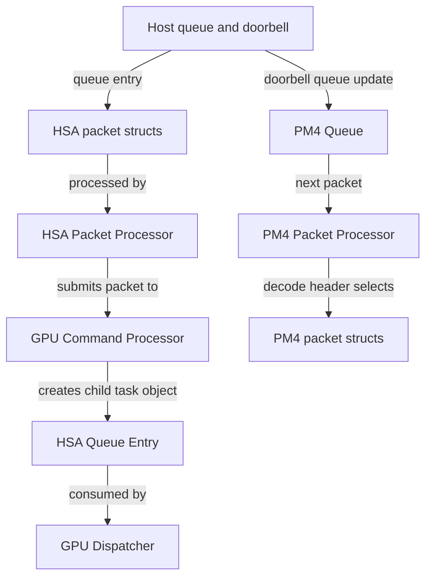
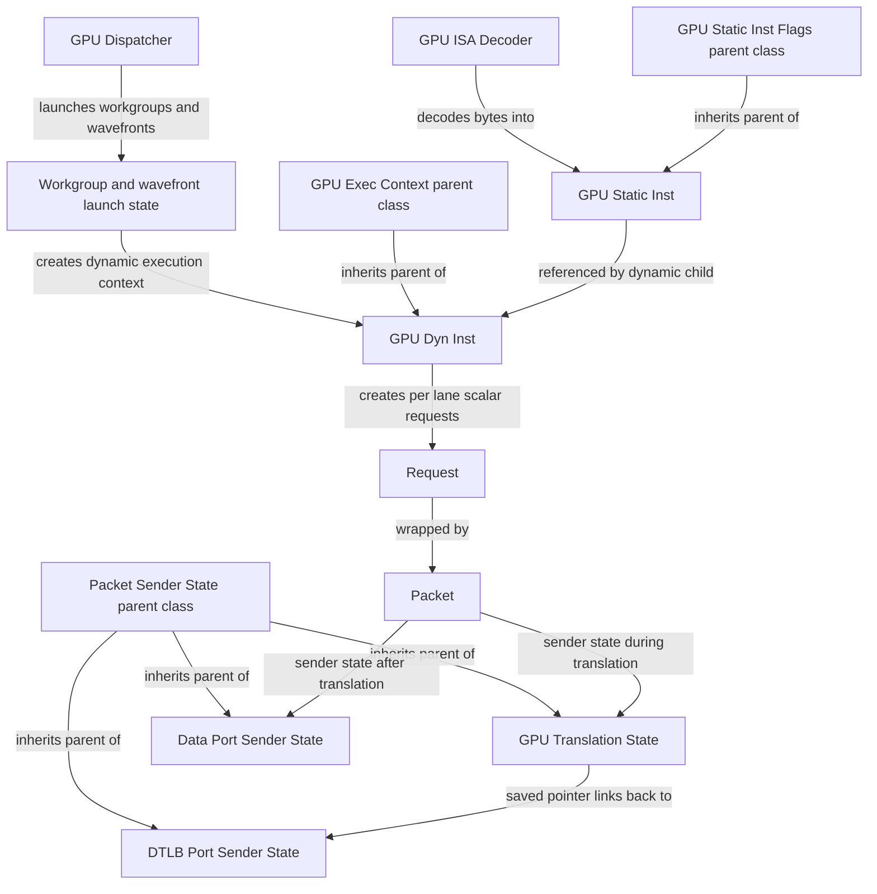

# The gem5 AMDGPU Performance Model: A Comprehensive Reference

## Table of Contents

1. [Introduction and Architectural Overview](#1-introduction-and-architectural-overview)
2. [System-Level Execution Flow](#2-system-level-execution-flow)
3. [Device Model and PCI/MMIO Interface](#3-device-model-and-pcimmio-interface)
4. [Shader and Compute Unit Topology](#4-shader-and-compute-unit-topology)
5. [Compute Unit Pipeline Organization](#5-compute-unit-pipeline-organization)
6. [Wavefront and Workgroup Lifecycle](#6-wavefront-and-workgroup-lifecycle)
7. [Instruction Representation and Decode](#7-instruction-representation-and-decode)
8. [Fetch Stage and Instruction Buffer](#8-fetch-stage-and-instruction-buffer)
9. [Scoreboard and Readiness Checks](#9-scoreboard-and-readiness-checks)
10. [Scheduling and Dispatch](#10-scheduling-and-dispatch)
11. [Execution Stage and Functional Units](#11-execution-stage-and-functional-units)
12. [Register Files and Operand Collection](#12-register-files-and-operand-collection)
13. [Local Data Share (LDS) and Local Memory Pipeline](#13-local-data-share-lds-and-local-memory-pipeline)
14. [Global Memory Pipeline](#14-global-memory-pipeline)
15. [Scalar Memory Pipeline](#15-scalar-memory-pipeline)
16. [Memory Coalescing and Request Formation](#16-memory-coalescing-and-request-formation)
17. [Address Translation and GPUVM](#17-address-translation-and-gpuvm)
18. [Cache Hierarchy and Memory System Integration](#18-cache-hierarchy-and-memory-system-integration)
19. [Workgroup Dispatch and Kernel Lifecycle](#19-workgroup-dispatch-and-kernel-lifecycle)
20. [Command Processor and HSA Packet Processor](#20-command-processor-and-hsa-packet-processor)
21. [DMA Engines, PM4, and System Hub](#21-dma-engines-pm4-and-system-hub)
22. [Timing Model: Latencies and Contention](#22-timing-model-latencies-and-contention)
23. [Statistics, Tracing, and Observability](#23-statistics-tracing-and-observability)
24. [Configuration and Parameterization](#24-configuration-and-parameterization)
25. [Modeling Assumptions and Limitations](#25-modeling-assumptions-and-limitations)
26. [Validation and Calibration Guidance](#26-validation-and-calibration-guidance)
27. [Appendix A: Source Code Map](#appendix-a-source-code-map)
28. [Appendix B: Compute Unit Pipeline Diagram](#appendix-b-compute-unit-pipeline-diagram)
29. [Appendix C: Memory Path Diagrams](#appendix-c-memory-path-diagrams)
30. [Appendix D: Parameter Tables](#appendix-d-parameter-tables)
31. [Appendix E: Glossary and Acronyms](#appendix-e-glossary-and-acronyms)
32. [Appendix F: Wavefront State and Waitcnt Details](#appendix-f-wavefront-state-and-waitcnt-details)
33. [Appendix G: Scheduler and Dispatch Walkthrough](#appendix-g-scheduler-and-dispatch-walkthrough)
34. [Appendix H: Memory Pipeline State Walkthrough](#appendix-h-memory-pipeline-state-walkthrough)
35. [Appendix I: Translation and Coalescing Walkthrough](#appendix-i-translation-and-coalescing-walkthrough)
36. [Appendix J: Example GPU Configurations](#appendix-j-example-gpu-configurations)
37. [Appendix K: Observability Quick Reference](#appendix-k-observability-quick-reference)
38. [Appendix L: Compute Unit Pipeline Walkthrough](#appendix-l-compute-unit-pipeline-walkthrough)
39. [Appendix M: Instruction Classes and Operand Semantics](#appendix-m-instruction-classes-and-operand-semantics)
40. [Appendix N: Register Allocation and Occupancy Modeling](#appendix-n-register-allocation-and-occupancy-modeling)
41. [Appendix O: Memory and Translation Parameter Reference](#appendix-o-memory-and-translation-parameter-reference)
42. [Appendix P: End-to-End Kernel Walkthrough](#appendix-p-end-to-end-kernel-walkthrough)
43. [Appendix Q: Barrier and Synchronization Semantics](#appendix-q-barrier-and-synchronization-semantics)
44. [Appendix R: Scoreboard and Scheduler Stall Taxonomy](#appendix-r-scoreboard-and-scheduler-stall-taxonomy)
45. [Appendix S: Cache Hierarchy and Interconnect Integration](#appendix-s-cache-hierarchy-and-interconnect-integration)
46. [Appendix T: Timing Calibration and Parameter Tuning](#appendix-t-timing-calibration-and-parameter-tuning)
47. [Appendix U: Microbenchmark-Driven Validation Workflow](#appendix-u-microbenchmark-driven-validation-workflow)
48. [Appendix V: HSA Dispatch Metadata and Kernel Descriptors](#appendix-v-hsa-dispatch-metadata-and-kernel-descriptors)
49. [Appendix W: Wavefront Scheduling Policies](#appendix-w-wavefront-scheduling-policies)
50. [Appendix X: Register File and Operand Network](#appendix-x-register-file-and-operand-network)
51. [Appendix Y: LDS Microarchitecture and Access Patterns](#appendix-y-lds-microarchitecture-and-access-patterns)
52. [Appendix Z: GPU Virtual Memory and Page Walk Deep Dive](#appendix-z-gpu-virtual-memory-and-page-walk-deep-dive)
53. [Appendix AA: Global Memory Pipeline Queueing and Tokens](#appendix-aa-global-memory-pipeline-queueing-and-tokens)
54. [Appendix AB: Command Processor and HSA Packet Processing](#appendix-ab-command-processor-and-hsa-packet-processing)
55. [Appendix AC: Latency and Trace Instrumentation Deep Dive](#appendix-ac-latency-and-trace-instrumentation-deep-dive)

---

## 1. Introduction and Architectural Overview

The gem5 AMDGPU performance model is a cycle-approximate, compute-focused
model of an AMD GPU stack. It combines a GPU compute pipeline with a full
system device model and HSA command processing to simulate how GPU kernels
are launched, scheduled, executed, and retired. The implementation spans
multiple subsystems:

- The compute pipeline and core microarchitecture live in `src/gpu-compute/`.
- The PCIe device model and GPU IP blocks live in `src/dev/amdgpu/`.
- HSA queue processing and AQL packet handling live in `src/dev/hsa/`.
- The ISA decoder, TLBs, and page walker live in `src/arch/amdgpu/vega/`.
- Python configuration and SimObject parameters live in
  `src/gpu-compute/GPU.py` and `src/dev/amdgpu/AMDGPU.py`.
- Prebuilt GPU compositions live under
  `src/python/gem5/components/devices/gpus/` and
  `src/python/gem5/prebuilt/viper/`.

This document explains the model as it is implemented in the source tree,
with explicit references to the code. The emphasis is on how performance
emerges from pipeline structure, resource contention, wavefront scheduling,
translation, and memory behavior.

### 1.1 Scope and Goals

The AMDGPU model targets a realistic execution flow for compute kernels:

- A host runtime submits HSA AQL packets.
- The GPU command processor and dispatcher launch workgroups.
- Compute units execute wavefronts using a pipelined SIMT model.
- Memory access and address translation are modeled with timing.

The model is intended for microarchitectural exploration and performance
analysis of GPU kernels and GPU/CPU systems. It is not a full graphics
pipeline model, and it focuses on the compute path.

### 1.2 Core Vocabulary

The model uses GPU terminology consistently across code and configuration.
The table below summarizes key terms in the gem5 AMDGPU context.

```text
+-----------------------+------------------------------------------------------+
| Term                  | Meaning in the gem5 AMDGPU model                     |
+-----------------------+------------------------------------------------------+
| Work-item             | A single SIMD lane of a kernel; one logical thread.  |
| Wavefront (WF)        | The SIMD execution unit (default 64 work-items).     |
| Workgroup (WG)        | A collection of wavefronts that share LDS.           |
| SIMD                  | A vector lane group inside a compute unit.           |
| Compute Unit (CU)     | The core pipeline entity executing wavefronts.       |
| Shader                | A GPU instance containing multiple CUs.              |
| VALU/SALU             | Vector/scalar ALU resources inside a CU.             |
| LDS                   | Local Data Share, per-WG shared memory.              |
| VRF/SRF               | Vector/Scalar Register Files.                        |
| SQC/TCP/TCC           | I-cache, L1 data cache, and L2 cache in VIPER.       |
| GPUStaticInst         | Decoded static CU ISA instruction template.          |
| GPUDynInst            | Dynamic per-wavefront instance of a CU instruction.  |
| HSA AQL packet        | 64-byte HSA queue packet (for example, dispatch).    |
| Agent dispatch packet | HSA packet used for CP/driver control operations.    |
| PM4 packet            | Command packet decoded by `PM4PacketProcessor`.      |
| HSAQueueEntry         | Internal dispatch object built from AQL, MQD, AKC.   |
| MQD/HQD               | Queue descriptor structures in HSA runtime.          |
| Doorbell              | Memory-mapped write that signals queue activity.     |
| Request / Packet      | Generic gem5 memory request and transport objects.   |
| GpuTranslationState   | GPU TLB translation context in packet sender state.  |
| Port SenderState      | Per-port return context attached to memory packets.  |
| TLB coalescer         | Front-end that merges translation requests.          |
| VMID/PASID            | GPU virtual memory identifiers for process context.  |
| Waitcnt               | Barrier on outstanding memory operations.            |
+-----------------------+------------------------------------------------------+
```

### 1.3 Design Philosophy

The model balances fidelity and scalability with explicit microarchitectural
structures that strongly influence performance. The primary design choices
are:

- **Wavefront-centric modeling.** Wavefronts are the scheduling unit and
  the unit of pipeline flow. Most structures (IBs, scoreboards, queues)
  are organized per wavefront or per SIMD.

- **Stage-based pipeline.** The compute unit is decomposed into stages
  (`FetchStage`, `ScoreboardCheckStage`, `ScheduleStage`, `ExecStage`, and
  memory pipelines) rather than a monolithic execution loop
  (`src/gpu-compute/compute_unit.hh`).

- **Resource timing via WaitClass.** Contention on functional units and
  buses is modeled with `WaitClass` objects that encode when a resource
  becomes available (`src/gpu-compute/misc.hh`).

- **Explicit memory and translation modeling.** Separate pipelines are
  used for scalar, vector, and LDS memory operations, and address
  translation is modeled through a GPU TLB hierarchy and a coalescer
  (`src/gpu-compute/*_memory_pipeline.hh`, `src/arch/amdgpu/vega/`).

### 1.4 Source Code Map

The following map highlights the primary components of the AMDGPU model.

```
src/gpu-compute/
  compute_unit.{hh,cc}      Compute unit pipeline and resources
  shader.{hh,cc}            Shader top-level and CU aggregation
  wavefront.{hh,cc}         Wavefront state, IB, and execution context
  gpu_dyn_inst.{hh,cc}      Dynamic GPU instruction representation
  gpu_static_inst.{hh,cc}   Static instruction base class and flags
  fetch_stage.{hh,cc}       Fetch stage orchestration
  fetch_unit.{hh,cc}        Per-SIMD fetch unit and buffer
  scoreboard_check_stage.*  Readiness and hazard checking
  schedule_stage.*          Arbitration and dispatch
  exec_stage.*              Execution and resource accounting
  global_memory_pipeline.*  Vector global memory pipeline
  local_memory_pipeline.*   LDS memory pipeline
  scalar_memory_pipeline.*  Scalar memory pipeline
  register_file.*           VRF/SRF base class
  vector_register_file.*    Vector register file implementation
  scalar_register_file.*    Scalar register file implementation
  register_file_cache.*     Register file cache model
  register_manager.*        Register allocation and pool management
  comm.hh                   Stage-to-stage interfaces
  GPU.py                    SimObject parameters and defaults

src/dev/amdgpu/
  amdgpu_device.*           PCI device model and BAR handling
  amdgpu_vm.*               GPU virtual memory support
  memory_manager.*          VRAM access management
  system_hub.*              Host memory DMA interface
  sdma_engine.*             SDMA engines
  pm4_packet_processor.*    PM4 command processing

src/dev/hsa/
  hsa_packet_processor.*    HSA queue and packet processing
  hsa_queue.*               Queue descriptors
  hsa_packet.hh             AQL packet structures

src/arch/amdgpu/vega/
  gpu_decoder.cc            ISA decoder
  gpu_isa.*                 ISA state and misc registers
  tlb.*                     GPU TLB implementation
  tlb_coalescer.*           TLB coalescer
  pagetable_walker.*        Page table walker
  faults.*                  GPU page faults

src/python/gem5/components/devices/gpus/
  viper_shader.py           Prebuilt shader and CU composition
  amdgpu.py                 Prebuilt GPU devices (MI210/MI300X)
```

### 1.5 Model Boundaries

The AMDGPU model focuses on compute behavior, kernel scheduling, and
memory/translation timing. It does not aim to reproduce full graphics
functionality or vendor-specific hardware quirks beyond those required
for HSA execution. When interpreting results, treat the model as a
cycle-accurate proxy for the compute pipeline rather than a complete
GPU RTL model.

---

## 2. System-Level Execution Flow

At a system level, gem5 models the interaction between the host runtime,
HSA queues, the GPU command processor, and compute units. The execution
flow is represented by the following logical pipeline:

```
Host runtime
  |
  | Writes AQL packet to queue and rings doorbell
  v
HSAPacketProcessor (src/dev/hsa)
  |
  | DMA queue descriptor (MQD) and AQL packet
  v
GPUCommandProcessor (src/gpu-compute)
  |
  | Builds HSAQueueEntry + kernel state
  v
GPUDispatcher (src/gpu-compute)
  |
  | Distributes workgroups to CUs
  v
Shader + ComputeUnits
  |
  | Execute wavefronts and memory operations
  v
Completion signal (HSA signal update)
```

Key data structures on this path include:

- `HSAQueueDescriptor` and `AQLRingBuffer` in
  `src/dev/hsa/hsa_packet_processor.hh`, which represent host queues and
  buffered packets.
- `HSAQueueEntry` in `src/gpu-compute/hsa_queue_entry.hh`, which packages
  kernel metadata, workgroup sizes, register usage, and pointers to the
  dispatch packet and code object.
- `GPUCommandProcessor` in `src/gpu-compute/gpu_command_processor.hh`,
  which performs DMA reads and initializes register state before launching
  workgroups.
- `GPUDispatcher` in `src/gpu-compute/dispatcher.hh`, which manages the
  launch of workgroups across compute units.

The compute pipeline is active only while there is work to execute. When a
compute unit is idle it deschedules itself, and the shader wakes CUs when
new work becomes available (`ComputeUnit::exec()` in
`src/gpu-compute/compute_unit.cc`).

---

## 3. Device Model and PCI/MMIO Interface

The full-system AMDGPU device model is implemented by
`AMDGPUDevice` in `src/dev/amdgpu/amdgpu_device.hh`. It models the
PCIe-facing interface to internal GPU IP blocks and routes requests
based on BAR address ranges.

### 3.1 BAR and Register Model

The device uses standard AMD PCI IDs and BAR definitions in
`src/dev/amdgpu/AMDGPU.py`. The BAR mapping is consistent with a Vega
Frontier Edition class device:

- BAR0: VRAM aperture (device memory).
- BAR2: Doorbells (queue signaling).
- BAR5: MMIO register space for GPU IP blocks.

The device contains sub-blocks such as `AMDGPUGfx`, `AMDGPUNbio`,
`AMDGPUSmu`, and `AMDGPUVM` (`src/dev/amdgpu/`). The register file
is populated via an MMIO trace reader (`AMDMMIOReader`). Doorbell
writes are decoded and delivered to queue-specific engines
(`AMDGPUDevice::writeDoorbell`).

### 3.2 Interrupts and System Integration

`AMDGPUInterruptHandler` models interrupt signaling, and
`AMDGPUDevice::intrPost()` connects to the PCI interrupt line.
In full-system mode, a VBIOS image and MMIO trace are typically
required to initialize device state (`AMDGPU.py`).

---

## 4. Shader and Compute Unit Topology

In gem5, the `Shader` object represents a single software-visible GPU
instance. It aggregates compute units, dispatch logic, and interfaces to
memory and the host system (`src/gpu-compute/shader.hh`).

```
+------------------------------+
| Shader (GPU instance)        |
| - GPUCommandProcessor        |
| - GPUDispatcher              |
| - AMDGPUSystemHub (host DMA) |
| - CUs[0..N-1]                |
+------------------------------+
                       |
                       | multiple Compute Units
                       v
      +----------------------------------------------+
      | Compute Unit (per CU)                        |
      |  - SIMDs + wavefront slots                   |
      |  - VRF/SRF + RegisterFileCache               |
      |  - LDS + LocalMemPipeline                    |
      |  - Fetch/Scoreboard/Schedule/Exec stages     |
      |  - Global/Scalar memory pipelines            |
      +----------------------------------------------+
```

Key topology parameters are set in `GPU.py` and in prebuilt GPU
compositions such as `ViperShader`
(`src/python/gem5/components/devices/gpus/viper_shader.py`):

- `num_SIMDs`: SIMD count per CU (default 4 in `GPU.py`).
- `n_wf`: wavefront slots per SIMD (default 10 in `GPU.py`, often
  overridden to 8 in `ViperShader`).
- `wf_size`: wavefront size in work-items (default 64, with a runtime
  check that it fits within a host `std::bitset`).
- `simd_width`: SIMD lane width (default 16), used for bus sizing and
  timing calculations.

The `Shader` also maintains aperture registers for GPU virtual memory,
LDS, and scratch (`Shader::ApertureRegister`), which influence address
translation and memory routing (`src/gpu-compute/shader.hh`).

---

## 5. Compute Unit Pipeline Organization

Each compute unit is modeled as a staged pipeline. The stages are
instantiated as members of `ComputeUnit` (`src/gpu-compute/compute_unit.hh`):

- `FetchStage`
- `ScoreboardCheckStage`
- `ScheduleStage`
- `ExecStage`
- `GlobalMemPipeline`, `LocalMemPipeline`, `ScalarMemPipeline`

### 5.1 Stage Ordering and Timing

The CU executes its pipeline stages every cycle in reverse order to
model latency (`ComputeUnit::exec()` in `src/gpu-compute/compute_unit.cc`).
The reverse-order execution ensures that data produced in a later stage
is not consumed in the same cycle by an earlier stage.

```
Per-cycle execution order (reverse pipeline):
1. ScalarMemPipeline.exec()
2. GlobalMemPipeline.exec()
3. LocalMemPipeline.exec()
4. ExecStage.exec()
5. ScheduleStage.exec()
6. ScoreboardCheckStage.exec()
7. FetchStage.exec()
```

### 5.2 Conceptual Pipeline Flow

A wavefront instruction typically flows through the CU as:

```
Fetch -> Scoreboard Check -> Schedule -> Execute -> Memory Pipeline(s)
```

The stage boundaries align with the model's internal resource checks:

- Fetch fills the instruction buffer (IB).
- Scoreboard checks hazards and readiness.
- Scheduling arbitrates among ready wavefronts and resources.
- Execution consumes functional units and triggers memory requests.
- Memory pipelines handle completion and writeback.

### 5.3 Backpressure, WaitClass Resources, and Buses

Many CU resources are modeled as `WaitClass` instances
(`src/gpu-compute/misc.hh`). A `WaitClass` tracks when a resource will next
become available
and enforces multi-cycle occupancy. These resources are checked by the
schedule stage before dispatch and by memory pipelines before completing
returns.

Key `WaitClass` resources include:

```text
+-------------------------+---------------------------------+
| Resource                | Purpose                         |
+-------------------------+---------------------------------+
| `vectorALUs[i]`         | Vector ALU pipelines            |
| `scalarALUs[i]`         | Scalar ALU pipelines            |
| `vectorGlobalMemUnit`   | Global memory issue slot        |
| `vectorSharedMemUnit`   | Local memory issue slot         |
| `scalarMemUnit`         | Scalar memory issue slot        |
| `glbMemToVrfBus`        | Global mem -> VRF writeback bus |
| `vrfToGlobalMemPipeBus` | VRF -> global mem pipe bus      |
| `locMemToVrfBus`        | Local mem -> VRF writeback bus  |
| `vrfToLocalMemPipeBus`  | VRF -> local mem pipe bus       |
| `scalarMemToSrfBus`     | Scalar mem -> SRF writeback bus |
| `srfToScalarMemPipeBus` | SRF -> scalar mem pipe bus      |
+-------------------------+---------------------------------+
```

The `issue_period` parameter introduces an additional spacing constraint
for issuing instructions from a given SIMD, modeling the cadence of a real
issue logic. Together, `WaitClass` occupancy and `issue_period` define a
simple but effective backpressure network that limits throughput and
propagates contention across stages.

---

## 6. Wavefront and Workgroup Lifecycle

Wavefronts are the primary scheduling unit in the AMDGPU model. A
`Wavefront` object holds instruction state, execution masks, and
resource allocations (`src/gpu-compute/wavefront.hh`).

### 6.1 Wavefront State Machine

The `Wavefront::status_e` enumeration defines the high-level lifecycle:

```text
+-----------------+-------------------------------------------------+
| State           | Meaning                                         |
+-----------------+-------------------------------------------------+
| S_STOPPED       | Wavefront stalled or inactive.                  |
| S_RETURNING     | Wavefront returning from a kernel.              |
| S_RUNNING       | Normal execution.                               |
| S_STALLED       | Temporarily stalled (e.g., hazards).            |
| S_STALLED_SLEEP | Sleeping state (e.g., s_sleep).                 |
| S_WAITCNT       | Waiting for outstanding memory ops to complete. |
| S_BARRIER       | Waiting at a barrier.                           |
+-----------------+-------------------------------------------------+
```

### 6.2 Workgroup Allocation

Workgroups allocate multiple resources when dispatched:

- **Register allocation.** `RegisterManager` allocates VRF/SRF ranges per
  wavefront (see `src/gpu-compute/register_manager.hh`).
- **LDS allocation.** Each workgroup gets an `LdsChunk` from the `LdsState`
  associated with its CU (`src/gpu-compute/lds_state.hh`).
- **Barrier slots.** The CU maintains a fixed number of barrier slots
  (`num_barrier_slots`) and tracks per-WG barrier state via `WFBarrier` in
  `ComputeUnit` (`src/gpu-compute/compute_unit.hh`).

### 6.3 Identity and Ordering

Each wavefront carries identifiers for CU, SIMD, and slot, and uses
sequence numbers for ordering:

- `Wavefront::wfDynId` provides a unique dynamic wavefront ID.
- `GPUDynInst::seqNum()` provides a monotonically increasing instruction
  sequence number for in-order checks, memory ordering, and stats.
- The oldest instruction in a wavefront is accessed through
  `Wavefront::nextInstr()`.

These identifiers drive arbitration in the scheduler and determine the
ordering of memory completion when waitcnt semantics are enforced.

---

## 7. Instruction Representation and Decode

The AMDGPU model distinguishes between static and dynamic instruction
representations:

- `GPUStaticInst` (`src/gpu-compute/gpu_static_inst.hh`) is the immutable,
  decoded ISA-level instruction. It carries opcode strings and a rich set
  of flags (ALU vs memory, scalar vs vector, memory segment type, etc.).
- `GPUDynInst` (`src/gpu-compute/gpu_dyn_inst.hh`) wraps a `GPUStaticInst`
  and adds dynamic state: sequence number, addresses per lane, execution
  mask, pipeline timing, and links to the parent wavefront and CU.

The ISA decoder lives under `src/arch/amdgpu/vega/` and produces
`GPUStaticInst` instances via `TheGpuISA::Decoder` (`src/arch/gpu_decoder.hh`,
`src/arch/amdgpu/vega/gpu_decoder.cc`).

Dynamic instructions carry per-lane addresses and data buffers to model
vector memory operations. They also record the memory segment classification
based on static flags (global, local, private, read-only, spill), which is
used to route operations to the correct memory pipeline.

### 7.1 Static Instruction Flags and Operand Metadata

`GPUStaticInst` derives from `GPUStaticInstFlags`, which defines a wide
range of semantic flags (ALU, memory, branch, scalar, flat, atomic, etc.).
These flags are used throughout the pipeline to classify operations without
relying on opcode strings. For example, `isScalar()` and `isMemoryRef()`
decide whether an instruction should be routed to the scalar or vector
memory pipeline, while `isBarrier()` and `isWaitcnt()` feed into scoreboard
checks.

Operand metadata is captured via `OperandInfo` objects. Each operand records
its size, register class (SGPR vs VGPR), and special cases such as VCC or
EXEC usage. This metadata allows the schedule stage to compute RF bandwidth
requirements and to detect hazards before issuing the instruction.

### 7.2 Disassembly and Operand Count Utilities

`GPUStaticInst` exposes helper methods that are frequently used by the
pipeline and tracing infrastructure:

- `disassemble()` returns the decoded instruction string.
- `numSrcVecOperands()` and `numDstVecOperands()` count vector operands.
- `numSrcScalarOperands()` and `numDstScalarOperands()` count scalar
  operands.
- `maxOperandSize()` returns the largest operand size, which affects RF
  bandwidth and writeback timing.
- `instSize()` and `nextInstAddr()` control fetch and PC progression.

These utilities are not just for debug output; they also help the pipeline
reason about resource usage and instruction scheduling pressure.

### 7.3 Transaction Object Relationships

The model uses different transaction objects for CU ISA execution, command
processing, and memory transport. These are intentionally separate.





There is no `GPUStaticInst`/`GPUDynInst` equivalent for command packets.
CP-side "instructions" are packet structs (HSA AQL or PM4), while memory
transactions are generic gem5 `Request`/`Packet` objects annotated with
GPU sender state.

---

## 8. Fetch Stage and Instruction Buffer

Instruction fetch in the AMDGPU model is organized per SIMD. Each SIMD has
one `FetchUnit`, and the `FetchStage` selects at most one wavefront per SIMD
to fetch each cycle (`src/gpu-compute/fetch_stage.hh`).

### 8.1 FetchUnit and Fetch Buffer

A `FetchUnit` manages a per-wavefront fetch buffer with multiple cache
lines (`FetchUnit::FetchBufDesc` in `src/gpu-compute/fetch_unit.hh`). The
buffer tracks:

- Reserved fetch lines (addresses outstanding in the I-cache).
- Buffered lines (lines returned and ready for decode).
- A circular buffer over a fixed-size allocation (`fetch_depth` lines).

The fetch unit decodes instructions directly from the buffer into the
wavefront's instruction buffer (IB). It handles split instructions that
straddle fetch buffer boundaries and can flush or restart after control
flow changes (`FetchUnit::flushBuf()` and `FetchUnit::decodeSplitInst()`).

### 8.2 Instruction Buffer (IB)

Each wavefront has an instruction buffer implemented as a deque of
`GPUDynInstPtr` (`Wavefront::instructionBuffer`). The maximum size is
controlled by `Wavefront::maxIbSize` and the `max_ib_size` parameter in
`GPU.py`. The IB provides a decoupling point between fetch and execution,
allowing fetch to run ahead when the pipeline is otherwise stalled.

### 8.3 Instruction Cache and Translation Ports

The compute unit exposes separate ports for instruction access:

- `sqc_port`: instruction cache access.
- `sqc_tlb_port`: instruction TLB access.

These ports are wired to a cache hierarchy (for example, the VIPER SQC
controller) and to a GPU TLB/coalescer stack (`ComputeUnit` ports in
`src/gpu-compute/GPU.py`).

---
## 9. Scoreboard and Readiness Checks

The scoreboard check stage determines whether the oldest instruction of each
wavefront is ready to issue. This stage encapsulates both data hazards and
structural hazards, and it decides which execution resource a wavefront will
target (`src/gpu-compute/scoreboard_check_stage.hh`).

### 9.1 Readiness Conditions

`ScoreboardCheckStage::ready()` examines several conditions before marking a
wavefront as ready (`src/gpu-compute/scoreboard_check_stage.cc`). The most
important gating conditions are:

```text
+-------------------+---------------------------------------------+
| Condition         | Meaning                                     |
+-------------------+---------------------------------------------+
| NRDY_IB_EMPTY     | Instruction buffer is empty.                |
| NRDY_WAIT_CNT     | Outstanding memory operations not complete. |
| NRDY_BARRIER_WAIT | Wavefront is blocked at a barrier.          |
| NRDY_VGPR_NRDY    | Vector operands not ready in VRF.           |
| NRDY_SGPR_NRDY    | Scalar operands not ready in SRF.           |
| NRDY_SLEEP        | Wavefront in sleep state.                   |
| NRDY_MATRIX_CORE  | MFMA unit busy (matrix core occupancy).     |
| INST_RDY          | All checks passed; wavefront is ready.      |
+-------------------+---------------------------------------------+
```

The check is conservative: any failure leaves the wavefront unready for
this cycle.

### 9.2 Implicit Waitcnt for Kernel End

The model implements the implicit `s_waitcnt 0` behavior before kernel end.
When the oldest instruction is `s_endpgm` (detected by
`GPUDynInst::isEndOfKernel()`), the scoreboard forces the wavefront into
`S_WAITCNT` and waits for outstanding memory operations to complete
before allowing the end-of-kernel instruction to proceed
(`ScoreboardCheckStage::ready()` in
`src/gpu-compute/scoreboard_check_stage.cc`).

### 9.3 Matrix Core (MFMA) Readiness

Matrix multiply-accumulate (MFMA) instructions are modeled as occupying a
per-SIMD matrix core resource. The scoreboard uses a per-SIMD timestamp
array (`matrix_core_ready`) and a per-GFX-version cycle table
(`mfma_cycles`) to determine when an MFMA can issue
(`src/gpu-compute/compute_unit.cc`, `src/gpu-compute/scoreboard_check_stage.cc`).
The `mfma_scale` parameter scales these cycle counts in the timing model.

---

## 10. Scheduling and Dispatch

Once wavefronts are marked ready, the scheduler arbitrates among them and
selects instructions for execution. Scheduling occurs per execution resource
and is policy-driven (`src/gpu-compute/scheduler.hh`).

### 10.1 Scheduling Policies

The model supports at least two policies (`src/gpu-compute/scheduling_policy.hh`):

- **Oldest-first**: choose the wavefront with the oldest sequence number.
- **Round-robin**: rotate among wavefronts to provide fairness.

The policy is selected via `ComputeUnit.execPolicy` in `GPU.py` and mapped to
an internal `EXEC_POLICY` in `ComputeUnit`.

### 10.2 Schedule List and Dispatch List

The schedule stage maintains two key queues per execution resource:

```
ReadyList -> SchList (RFBUSY -> RFREADY) -> DispatchList -> ExecStage
```

- **SchList** holds candidate instructions whose operands are being read
  from the register files.
- **DispatchList** holds instructions that are fully ready to execute and
  have reserved the necessary execution resources.

`ScheduleStage::checkRfOperandReadComplete()` transitions a wavefront from
`RFBUSY` to `RFREADY` when VRF/SRF operand reads complete. The stage then
selects the oldest ready wavefront for each resource and moves it to the
dispatch list (`ScheduleStage::fillDispatchList()` in
`src/gpu-compute/schedule_stage.cc`).

### 10.3 Resource Readiness Checks

`ScheduleStage::dispatchReady()` evaluates structural readiness for each
instruction type. These checks include:

- ALU readiness (vector or scalar ALU resource availability).
- Memory pipeline readiness and queue space.
- VRF/LDS bus availability for local or flat memory instructions.
- Coalescer token availability for vector memory operations.

Flat memory operations require both global and local memory resources.
The schedule stage arbitrates between them to ensure that the flat
instruction occupies both resources without starving local memory traffic
(`ScheduleStage::arbitrateVrfToLdsBus()`).

### 10.4 Dispatch List Lifecycle and Arbitration Details

The schedule stage transitions instructions through a small state machine:

```
ReadyList -> SchList(RFBUSY) -> SchList(RFREADY) -> DispatchList -> Exec
```

The key steps are:

- `addToSchList` inserts a wavefront into the schedule list if RF access is
  feasible.
- `checkRfOperandReadComplete` transitions the entry from `RFBUSY` to
  `RFREADY` when operand reads finish.
- `fillDispatchList` selects at most one ready wavefront per execution
  resource.
- `reserveResources` marks execution and bus resources as busy.

If a wavefront loses arbitration (for example, due to LDS bus conflicts or
flat memory requiring multiple resources), `reinsertToSchList` places it
back in age order. The `wavesInSch` set ensures that only one instruction
per wavefront is in the schedule stage at any time, preventing a single
wavefront from monopolizing the pipeline.

This lifecycle is where most structural backpressure emerges. RF access,
bus occupancy, and memory pipeline availability can all cause a ready
wavefront to remain in `RFBUSY` or be reinserted after dispatch arbitration.

---

## 11. Execution Stage and Functional Units

The execution stage consumes the dispatch list and models the actual
use of execution resources (`src/gpu-compute/exec_stage.hh`).

### 11.1 Execution Resources

Execution resources are defined in `ComputeUnit` and grouped as:

```text
+------------------------+------------------------------+
| Resource               | Modeled by                   |
+------------------------+------------------------------+
| Vector ALU(s)          | `vectorALUs` and `WaitClass` |
| Scalar ALU(s)          | `scalarALUs` and `WaitClass` |
| Vector Global Mem Pipe | `vectorGlobalMemUnit`        |
| Vector Local Mem Pipe  | `vectorSharedMemUnit`        |
| Scalar Mem Pipe        | `scalarMemUnit`              |
+------------------------+------------------------------+
```

The number of each resource is parameterized in `GPU.py` (e.g.,
`num_global_mem_pipes`, `num_shared_mem_pipes`, `num_scalar_mem_pipes`).
The model currently supports only one global, local, and scalar memory
pipeline per CU (see `ComputeUnit::init()` in
`src/gpu-compute/compute_unit.cc`).

### 11.2 Pipeline Latency Parameters

Several parameters control the execution latency and throughput:

- `issue_period`: minimum cycles between issues per SIMD.
- `spbypass_pipe_length` and `dpbypass_pipe_length`: vector ALU bypass
  pipeline stages.
- `scalar_pipe_length`: scalar ALU pipeline depth.
- `operand_network_length`: operand collection network latency.
- `rfc_pipe_length`: register file cache access latency.

These parameters are specified in `GPU.py` and used to configure
`WaitClass` instances in `ComputeUnit::init()`.

### 11.3 Execution Accounting

`ExecStage` collects statistics about instruction issue, SIMDs active,
idle periods, and resource usage (`ExecStageStats` in
`src/gpu-compute/exec_stage.hh`). These statistics are essential for
understanding throughput bottlenecks and scheduling behavior.

### 11.4 SIMD and Resource Mapping

The compute unit maps wavefronts to execution resources using helper
methods in `ComputeUnit`. For example:

- `mapWaveToScalarAlu` and `mapWaveToScalarAluGlobalIdx` select which SALU
  a wavefront should use.
- `mapWaveToGlobalMem` and `mapWaveToLocalMem` identify the global and
  local memory execution units.
- `mapWaveToScalarMem` identifies the scalar memory execution unit.

These mappings allow the model to support multiple execution resources per
CU while keeping the schedule and execute stages resource-aware. The
mapping logic is intentionally simple (often modulo-based) to keep the model
deterministic and reproducible, while still capturing contention across
resources.

---

## 12. Register Files and Operand Collection

Register file behavior is central to scheduling and execution timing.
The model uses explicit VRF/SRF objects with scoreboard tracking and
operand scheduling.

### 12.1 Register Files

`RegisterFile` (`src/gpu-compute/register_file.hh`) is the base class for
both vector and scalar register files. Each SIMD owns a VRF and SRF:

- `VectorRegisterFile` (`src/gpu-compute/vector_register_file.hh`)
- `ScalarRegisterFile` (`src/gpu-compute/scalar_register_file.hh`)

Register files track busy bits per register and implement:

- Operand readiness checks (`operandsReady`).
- Operand read scheduling and completion (`scheduleReadOperands`,
  `operandReadComplete`).
- Operand write scheduling for both ALU results and load returns.

Busy/free transitions are modeled via scheduled events
(`MarkRegBusyScbEvent`, `MarkRegFreeScbEvent`).

### 12.2 Register File Cache (RFC)

The optional register file cache (`RegisterFileCache` in
`src/gpu-compute/register_file_cache.hh`) models a small LRU cache of
register values to reduce RF access latency. It is parameterized by
`cache_size` and can be enabled per SIMD in configuration.

### 12.3 Register Allocation

Register allocation is handled by `RegisterManager`
(`src/gpu-compute/register_manager.hh`). It maps logical registers to
physical indices and uses per-SIMD pool managers:

- `SimplePoolManager`: single-WG occupancy.
- `DynPoolManager`: supports multiple WGs with dynamic allocation.

Allocation and deallocation occur at workgroup launch and completion,
and the availability of registers directly gates dispatch of new workgroups.

### 12.4 Operand Network and Bypass Paths

After operands are read from the VRF/SRF, they traverse an operand network
before reaching the execution units. The operand network latency is modeled
with `operand_network_length` and is applied uniformly to both scalar and
vector operands. In addition, the bypass paths for vector ALU results are
modeled with `spbypass_pipe_length` and `dpbypass_pipe_length`, which
represent the latency of short-circuit data paths for single- and
double-precision operations.

These parameters influence dependency chains in tight loops. A small
operand-network length and short bypass latency yield near-ideal throughput
for dependency-heavy kernels, while longer latencies expose pipeline bubbles
and increase the importance of wavefront-level parallelism.

---

## 13. Local Data Share (LDS) and Local Memory Pipeline

The Local Data Share (LDS) models per-workgroup shared memory. It is
implemented as `LdsState` with a per-workgroup `LdsChunk`
(`src/gpu-compute/lds_state.hh`).

### 13.1 LDS Semantics

- Reads beyond the allocated LDS chunk return zero.
- Writes beyond the allocated LDS chunk are ignored.
- Atomics are supported through `AtomicOpFunctor` operations.

The model also tracks bank conflicts for LDS accesses and accounts for
their impact on timing (`LdsState::countBankConflicts()`).

### 13.2 Local Memory Pipeline

Local memory operations are issued through `LocalMemPipeline`
(`src/gpu-compute/local_memory_pipeline.hh`). The pipeline maintains:

- An issue FIFO for requests (`lmIssuedRequests`).
- A response FIFO for completed LDS operations (`lmReturnedRequests`).

Queue sizes are parameterized by `local_mem_queue_size` in `GPU.py`.
VRF bank conflicts for LDS loads are tracked and contribute to stall
statistics in the pipeline.

### 13.3 Bank Conflicts and Penalty Modeling

LDS bank conflicts are modeled explicitly in `LdsState::countBankConflicts`.
The model divides the LDS into a configurable number of banks
(`LdsState.banks`) and computes the maximum number of accesses to any bank
for each wavefront memory instruction. The conflict count is then converted
into additional delay using `LdsState.bankConflictPenalty`.

Two statistics capture this behavior:

- `ldsBankAccesses`: total bank accesses observed.
- `ldsBankConflictDist`: distribution of conflict counts per access.

These stats provide a direct view into shared-memory contention and can be
used to validate tiling and bank-avoidance strategies.

---

## 14. Global Memory Pipeline

Vector global memory operations are handled by `GlobalMemPipeline`
(`src/gpu-compute/global_memory_pipeline.hh`). This pipeline models the
connection to the data cache hierarchy and enforces waitcnt ordering.

### 14.1 Ordered Completion for Waitcnt

Global memory responses are stored in an ordered buffer keyed by sequence
number (`gmOrderedRespBuffer`). When a response arrives, it is marked
complete, but the pipeline only retires requests in program order. This
preserves the semantics of waitcnt, which expects memory counters to be
decremented in order (`GlobalMemPipeline::getNextReadyResp()`).

### 14.2 Coalescer Tokening and In-Flight Limits

The pipeline applies backpressure using two mechanisms:

- Per-wavefront limits on outstanding requests (`max_wave_requests`).
- Coalescer tokens managed by `TokenManager` via the CU's `gmTokenPort`.

An instruction can only issue if tokens are available and the request
FIFO has space (`GlobalMemPipeline::coalescerReady()` and
`GlobalMemPipeline::outstandingReqsCheck()`).

### 14.3 Bus Timing

The VRF<->coalescer bus widths (`vrf_to_coalescer_bus_width` and
`coalescer_to_vrf_bus_width`) determine how many cycles are required to
transfer a full wavefront of data. The CU computes
`numCyclesPerLoadTransfer` and `numCyclesPerStoreTransfer` accordingly
(`ComputeUnit` constructor in `src/gpu-compute/compute_unit.cc`).

### 14.4 Queueing, Ordered Responses, and Token Return

Internally, the global memory pipeline maintains:

- `gmIssuedRequests`: a FIFO of requests ready to be issued.
- `gmOrderedRespBuffer`: an ordered map keyed by instruction sequence ID.
- `inflightLoads` and `inflightStores`: counters used to enforce queue
  capacity and backpressure.

Requests are inserted into `gmOrderedRespBuffer` before issuing so that
waitcnt semantics can be honored even if the memory system returns responses
out of order. The pipeline only retires the oldest completed request, which
means that late completions can hold up younger responses even if their data
is ready.

Tokens are returned to the coalescer when a request completes. A special
case exists for instructions that generate no memory requests because all
lanes are inactive or out of bounds (`allLanesZero`). These instructions are
marked complete immediately and their tokens are returned early, preventing
deadlock on non-existent memory traffic.

---

## 15. Scalar Memory Pipeline

Scalar memory operations use a separate pipeline to model scalar loads and
stores (`src/gpu-compute/scalar_memory_pipeline.hh`).

### 15.1 Separate Queues and Backpressure

The scalar pipeline maintains independent FIFOs for:

- Issued requests (`issuedRequests`).
- Returned loads (`returnedLoads`).
- Returned stores (`returnedStores`).

The queue size is parameterized by `scalar_mem_queue_size` in `GPU.py`.
In-flight scalar requests are tracked to provide backpressure.

### 15.2 Scalar Memory Fences

The pipeline can inject scalar memory fences to model kernel-level
synchronization (`ScalarMemPipeline::injectScalarMemFence`). This supports
acquire/release semantics at kernel boundaries when configured in the
shader (`Shader.impl_kern_launch_acq` and `Shader.impl_kern_end_rel`).

---

## 16. Memory Coalescing and Request Formation

Vector memory operations generate one address per lane. The model forms
memory requests at the wavefront granularity and uses a combination of
coalescing and token-based throttling to limit pressure on the memory
system.

### 16.1 Coalescer Token Model

Each vector memory instruction can require a token from the coalescer
before issuing (`GPUDynInst::needsToken()` and
`GPUStaticInst::coalescerTokenCount()`). Tokens are managed per CU by
`TokenManager` and acquired in the schedule stage before dispatch. This
provides a simple but effective model of coalescer capacity.

### 16.2 Outstanding Request Limits

Per-wavefront limits (`max_wave_requests`) prevent a single wavefront
from flooding the memory system. This limit is enforced in the global
memory pipeline and interacts with waitcnt semantics.

### 16.3 Prefetching

The CU supports a lightweight address prefetching mechanism controlled by
`prefetch_depth`, `prefetch_stride`, and `prefetch_prev_type` in `GPU.py`.
Prefetches are generated at the TLB response point based on stride
observations and are issued as functional accesses (zero-latency)
(`ComputeUnit::DTLBPort::recvTimingResp()` in
`src/gpu-compute/compute_unit.cc`).

### 16.4 Page Divergence Tracking

To capture how many virtual pages a wavefront touches, the model tracks a
per-instruction page set in `ComputeUnit::pagesTouched`. When a vector
global memory instruction completes, `GPUDynInst::updateStats` samples the
number of distinct pages accessed into `pageDivergenceDist`. It also
accumulates per-page access counts in `pageAccesses`.

These statistics are useful for evaluating coalescing effectiveness and
translation locality. A wavefront that touches many pages typically
generates more TLB misses and reduces the effectiveness of coalescer
grouping, while a wavefront that touches few pages tends to exhibit higher
translation locality and better cache behavior.

---
## 17. Address Translation and GPUVM

The AMDGPU model includes a full GPU-specific translation pipeline with
TLB coalescing, multi-level TLBs, and a page table walker. These components
are in `src/arch/amdgpu/vega/` and are wired into compute units through
translation ports (`ComputeUnit.translation_port`, `ComputeUnit.sqc_tlb_port`,
`ComputeUnit.scalar_tlb_port`).

### 17.1 Vega GPUTLB

`GpuTLB` (`src/arch/amdgpu/vega/tlb.hh`) models a set-associative TLB with
configurable size, associativity, and latencies:

- `hitLatency`: cycles for a TLB hit.
- `missLatency1` and `missLatency2`: miss path latencies.
- `maxOutstandingReqs`: limit on concurrent TLB requests.

The TLB supports multiple page sizes. In the Vega model the page size list
is currently `{4 KiB, 2 MiB}` (`logPageShiftList` in `GpuTLB`). Each TLB
maintains per-level statistics for accesses and misses.

### 17.2 TLB Coalescer

`VegaTLBCoalescer` (`src/arch/amdgpu/vega/tlb_coalescer.hh`) sits on the
CPU side of each TLB and merges translation requests that fall within the
same page. It is parameterized by:

- `TLBProbesPerCycle`: number of coalesced probes issued per cycle.
- `coalescingWindow`: number of cycles over which requests can coalesce.
- `disableCoalescing`: bypasses coalescing when true.

The coalescer maintains a FIFO of coalesced requests and an
`issuedTranslationsTable` for in-flight translations. It reports both
coalesced and uncoalesced access statistics.

### 17.3 Page Table Walker and Faults

The `VegaPagetableWalker` (`src/arch/amdgpu/vega/pagetable_walker.hh`) walks
GPU page tables defined by the Vega format (`pagetable.hh`). Page walk
caching is modeled in `page_walk_cache.hh`. Page faults are represented by
`Fault` objects in `faults.hh`.

### 17.4 GPUVM and VMIDs

The AMDGPU device maintains mappings between doorbells, process address
spaces, and VMIDs (`AMDGPUDevice` in `src/dev/amdgpu/amdgpu_device.hh`).
The GPU virtual memory subsystem is implemented in `amdgpu_vm.*` and is
responsible for translating GPU virtual addresses and maintaining page
table state.

### 17.5 Translation Path Variants and Coalescing Effects

The translation path can be tuned to represent different hardware or
analysis goals:

- `ComputeUnit.perLaneTLB` forces per-lane translation, increasing request
  pressure on the coalescer and TLB.
- `ComputeUnit.functionalTLB` bypasses translation timing for functional
  studies, effectively modeling zero-latency translation.
- `VegaTLBCoalescer.default_pgSize` and `coalescingWindow` determine how
  aggressively requests are merged.

These parameters strongly affect observed TLB miss rates and coalescer
queueing. For irregular workloads with poor spatial locality, per-lane
translation can expose translation bottlenecks that would be masked by
aggressive coalescing. For highly regular workloads, coalescing can reduce
translation pressure and improve overall throughput.

---

## 18. Cache Hierarchy and Memory System Integration

The AMDGPU compute model integrates with a GPU-specific cache hierarchy
and memory system. The most common configuration uses the VIPER GPU Ruby
protocol (`CoherenceProtocol.GPU_VIPER`).

### 18.1 VIPER GPU Caches

The VIPER cache hierarchy is composed of:

- TCP: GPU L1 data cache
  (`src/python/gem5/components/cachehierarchies/ruby/caches/viper/tcp.py`).
- SQC: GPU instruction cache (`.../viper/sqc.py`).
- Scalar cache: scalar data cache.
- TCC: GPU L2 cache (`.../viper/tcc.py`).
- GPU directory and DMA controllers for GPU memory traffic.

`ViperGPUCacheHierarchy` (`src/python/gem5/prebuilt/viper/gpu_cache_hierarchy.py`)
builds a standalone Ruby system for the GPU that is separate from the CPU
cache hierarchy. Caches are connected to compute units by matching port
names (e.g., `memory_port`, `sqc_port`, and `scalar_port`).

### 18.2 Memory Manager and System Hub

Two distinct memory access paths are modeled:

- **Device memory (VRAM).** `AMDGPUMemoryManager` issues requests to the
  GPU's memory system using a device-specific requestor ID
  (`src/dev/amdgpu/memory_manager.hh`).
- **System memory.** `AMDGPUSystemHub` handles DMA reads and writes to
  host memory by converting them into DMA transactions
  (`src/dev/amdgpu/system_hub.hh`).

These paths allow kernels to access both device memory and host memory
when address translation resolves to the appropriate aperture.

### 18.3 Ruby Network, Sequencers, and Coalescers

The VIPER hierarchy builds a dedicated Ruby network for the GPU. The
network is instantiated as a `SimpleDoubleCrossbar` and configured with
multiple virtual networks (six in the default VIPER setup). This separation
allows request and response traffic to be modeled with distinct channels,
reducing artificial deadlocks and capturing network contention effects.

Each cache controller is paired with a Ruby sequencer:

- TCP caches attach a `RubySequencer` and a `VIPERCoalescer`. The coalescer
  aggregates per-lane memory requests and uses the CU `gmTokenPort` to
  enforce token-based backpressure.
- SQC and scalar caches also attach `RubySequencer` instances but are
  configured with different request types (`support_data_reqs` for scalar,
  `support_inst_reqs` for SQC).

The TCC controllers expose a `TCC_select_num_bits` field that hashes
addresses to L2 slices. This hash determines which TCC slice services a
given request and thus affects interconnect load balance.

The combined effect is that cache behavior in gem5 is not just a property
of size and associativity, but also of network topology and controller
placement. When analyzing performance, it is useful to distinguish between
cache hit rate limitations and network or coalescer saturation.

---

## 19. Workgroup Dispatch and Kernel Lifecycle

Workgroup dispatch and kernel lifecycle management are orchestrated by the
`GPUDispatcher` and `GPUCommandProcessor` within the `Shader`.

### 19.1 GPUDispatcher

`GPUDispatcher` (`src/gpu-compute/dispatcher.hh`) maintains queues of
kernels to launch and tracks their completion. It dispatches workgroups
as compute units report available resources. It also handles kernel
completion events and optional simulation exit on kernel completion.

### 19.2 Workgroup Resource Checks

Before dispatching a workgroup, the compute unit evaluates whether it has
sufficient resources:

- Available wavefront slots per SIMD.
- Available VRF/SRF allocation capacity.
- Available LDS space.
- Available barrier slots.

`ComputeUnit::hasDispResources()` and `ComputeUnit::dispWorkgroup()` manage
these checks and allocations (`src/gpu-compute/compute_unit.cc`). If a
workgroup cannot be dispatched, the dispatcher defers it until resources
become available.

### 19.3 Kernel Completion

Kernel completion triggers a sequence of cleanup operations:

- Outstanding memory operations are drained (implicit waitcnt).
- Workgroup resources (registers, LDS, barrier slots) are released.
- Completion signals are updated via `GPUCommandProcessor`.

The model uses the workgroup and wavefront counters in `HSAQueueEntry` to
track completion and to decide when a kernel is fully done.

### 19.4 CU Selection and Dispatch Order

The shader uses a round-robin selection across CUs to balance workgroup
dispatch. The `Shader::dispatchWorkgroups` method tracks `nextSchedCu` and
rotates the starting CU for each dispatch attempt. This ensures that work
is spread across available CUs rather than concentrating on a single unit.

The dispatch loop also updates `activeCus` and schedules the CU tick event
to ensure that a CU begins executing immediately once it receives a
workgroup. These details matter for short kernels where dispatch overhead
and CU wakeup time contribute noticeably to total runtime.

---

## 20. Command Processor and HSA Packet Processor

The command processor and HSA packet processor model how the GPU consumes
host-submitted work.

### 20.1 HSAPacketProcessor

`HSAPacketProcessor` (`src/dev/hsa/hsa_packet_processor.hh`) manages HSA
queues and AQL packets. It maintains a software representation of queue
descriptors (`HSAQueueDescriptor`) and prefetches AQL packets into an
`AQLRingBuffer`. Packets can be in three implicit states:

- FREE: available slot in the ring buffer.
- ALLOCATED: DMA in progress.
- SUBMITTED: packet dispatched to the GPU command processor.

The processor enforces barrier semantics via queue state (`Q_STATE`) and
barrier bit/packet handling.

### 20.2 GPUCommandProcessor

`GPUCommandProcessor` (`src/gpu-compute/gpu_command_processor.hh`) accepts
AQL packets, performs DMA reads of queue descriptors, and builds
`HSAQueueEntry` objects. It initializes kernel register state using data
from the code object and MQD.

The CP also:

- Validates kernel code metadata and resource usage.
- Handles scratch memory size checks and deferred dispatch when scratch
  is insufficient (see `MQDDmaEvent()`).
- Updates HSA completion signals when kernels complete.

### 20.3 GPUComputeDriver

In syscall emulation and full-system modes, `GPUComputeDriver`
(`src/gpu-compute/gpu_compute_driver.hh`) acts as an HSA driver. It
manages doorbells, VMAs, and memory type flags for GPU requests.

### 20.4 Signals, Events, and Completion

The GPU command processor is responsible for updating HSA signals and
events that represent kernel completion and synchronization. The interface
includes methods such as `sendCompletionSignal`, `updateHsaSignal`, and
`updateHsaSignalAsync`, which manipulate the `amd_signal_t` data structure
in host memory (`dev/hsa/hsa_signal.hh`). Event-related helpers
(`updateHsaEventData`, `updateHsaEventTs`, and mailbox updates) allow the
device to signal host-side queues and event loops.

These mechanisms are critical for end-to-end correctness in full-system
simulation, and they can be a significant component of observed runtime
for workloads composed of many short kernels or fine-grained host-device
synchronization.

### 20.5 CP Command Representation

The command path does not decode commands into `GPUStaticInst` objects.
Instead, HSA and PM4 processors operate directly on packet structs:

- HSA command packets from `src/dev/hsa/hsa_packet.hh`, selected by packet
  type in `HSAPacketProcessor::processPkt()`.
- PM4 command packets from `src/dev/amdgpu/pm4_defines.hh`, selected by
  opcode in `PM4PacketProcessor::decodeHeader()`.

For kernel dispatch packets specifically, CP converts packet data into
`HSAQueueEntry` and then hands that object to `GPUDispatcher`.

---

## 21. DMA Engines, PM4, and System Hub

The AMDGPU device model includes additional blocks that influence
system-level behavior and performance.

### 21.1 SDMA Engines

`SDMAEngine` (`src/dev/amdgpu/sdma_engine.hh`) models DMA copy engines
that can be controlled via doorbells and MMIO. SDMA engines can be
instantiated per device and are assigned MMIO address ranges in the
prebuilt GPU configurations (`src/python/gem5/components/devices/gpus/`).

### 21.2 PM4 Packet Processors

`PM4PacketProcessor` handles PM4 command streams for graphics and other
non-HSA workloads. In the device model, PM4 processors are associated with
specific MMIO address ranges and are selected based on the BAR5 offset.

### 21.3 AMDGPUSystemHub

`AMDGPUSystemHub` provides a DMA-based interface for GPU access to
system memory (host DRAM). It converts requests into DMA operations and
returns responses via event callbacks (`src/dev/amdgpu/system_hub.hh`).

### 21.4 DMA Traffic Sources

Several GPU blocks generate DMA traffic:

- SDMA engines issue bulk memory copies and can be driven by software
  command streams.
- The command processor issues DMA reads to fetch queue descriptors and
  dispatch packets.
- The system hub issues DMA transactions for GPU accesses to host memory.

In a full-system configuration, these DMA paths share the same memory
interconnect as the CPU and can therefore contend with CPU traffic. When
studying system-level performance, it is often useful to distinguish DMA
traffic generated by SDMA or CP from memory traffic generated by the
compute units.

---

## 22. Timing Model: Latencies and Contention

The performance model's timing behavior is governed by a set of
configurable latencies and resource constraints. Key sources of latency
include:

- Fetch buffering and instruction cache access.
- Register file operand reads and writes.
- Execution unit pipeline lengths and issue period.
- Memory request and response pipelines.
- TLB hit/miss latencies and coalescer queuing.
- Bus transfer latencies between VRF/SRF and memory pipelines.

### 22.1 Example Timing for a Vector Load

The following ASCII timeline illustrates a typical vector load:

```
Cycle 0:  Fetch -> IB
Cycle 1:  Scoreboard ready check
Cycle 2:  Schedule + RF operand read
Cycle 3:  Dispatch to GM pipe (token acquired)
Cycle 4:  Address translation via TLB/coalescer
Cycle 5+: Cache access + memory latency
Cycle N:  Response enqueued in GM ordered buffer
Cycle N+1..M: Ordered retire + VRF writeback
```

The exact values of N and M depend on cache hits, TLB behavior, queue
occupancy, and the configured pipeline latencies.

### 22.2 Interaction of Parameters

Several parameters interact in non-trivial ways:

- `issue_period` limits how often a SIMD can issue new instructions.
- `vrf_to_coalescer_bus_width` and `coalescer_to_vrf_bus_width` set the
  number of cycles required to move a full wavefront's data.
- `mem_req_latency` and `mem_resp_latency` add fixed pipeline latency
  between the CU and the cache hierarchy.

Understanding these interactions is essential for calibration.

### 22.3 Contention and Queueing Effects

Beyond fixed latencies, the dominant contributor to timing variability is
contention for shared resources. Several queues and resource gates can
introduce backpressure:

- `global_mem_queue_size` and `local_mem_queue_size` limit how many
  outstanding requests can be staged for each memory pipeline.
- `max_wave_requests` caps per-wave memory concurrency.
- `max_cu_tokens` throttles coalescer admission.
- `WaitClass` resources serialize access to ALUs and buses.

When these limits are reached, the schedule stage begins to report
non-ready conditions such as `SCH_VECTOR_MEM_FIFO_NRDY` or `SCH_VRF_RD_ACCESS_NRDY`.
These are often more informative for performance diagnosis than raw latency
parameters because they reveal where pipeline throughput is constrained.

A useful mental model is that each pipeline stage adds both a fixed latency
and a finite capacity. The fixed latency shifts results, while the capacity
determines whether wavefronts stall. For throughput-centric analysis,
adjusting queue sizes and token counts can have as much impact as changing
latencies.

---

## 23. Statistics, Tracing, and Observability

The AMDGPU model exposes detailed statistics and debug tracing to support
microarchitectural analysis.

### 23.1 Statistics

Statistics are grouped per stage or component, for example:

- `FetchStageStats` (`instFetchInstReturned`).
- `ScoreboardCheckStageStats` (`stallCycles`).
- `ScheduleStageStats` (ready-list occupancy, RF stalls, dispatch stalls).
- `ExecStageStats` (issue cycles, idle durations).
- Memory pipeline stats (VRF bank conflicts, queue occupancy).
- TLB and coalescer stats (hit rates, queuing cycles).

CU-level aggregates include instruction counts by type (SALU, VALU, mem)
and memory segment statistics (`ComputeUnit::stats` in
`src/gpu-compute/compute_unit.cc`).

### 23.2 Debug Flags and Tracing

The model provides a rich set of debug flags (selected examples):

- `GPUExec`, `GPUSched`, `GPUFetch` for pipeline tracing.
- `GPUMem`, `GPUCoalescer`, `GPUPrefetch` for memory tracing.
- `GPUTLB`, `GPUPTWalker` for translation tracing.
- `GPUDisp`, `GPUAgentDisp`, `GPUWgLatency` for dispatch and workgroup
  tracing.

`Shader::progress_interval` can be used to periodically print execution
progress for long runs.

### 23.3 Correlating Stats with Pipeline Phases

The most effective analyses combine a small number of statistics that map
directly to pipeline stages. The table below provides a quick correlation:

```text
+--------------------+-----------------------------------------------+
| Pipeline phase     | Representative stats                          |
+--------------------+-----------------------------------------------+
| Fetch              | `FetchStage.instFetchInstReturned`            |
| Scoreboard         | `ScoreboardCheckStage.stallCycles`            |
| Schedule/RF access | `ScheduleStage.rfAccessStalls`                |
| Execute            | `ExecStage.numCyclesWithInstrIssued`          |
| Global memory      | `GlobalMemPipeline.loadVrfBankConflictCycles` |
| Translation        | `TLB.*` and `Coalescer.queuingCycles`         |
+--------------------+-----------------------------------------------+
```

In practice, large changes in application performance typically align with
one or two of these phases. When a phase shows persistent stalls, the next
step is to inspect the associated debug trace flags to identify the exact
cause (e.g., queue saturation, RF conflicts, or translation misses).

---

## 24. Configuration and Parameterization

The AMDGPU model is highly configurable through SimObject parameters.
Configuration parameters live primarily in `src/gpu-compute/GPU.py` and
`src/dev/amdgpu/AMDGPU.py`.

### 24.1 Compute Unit Parameters

Key CU parameters include:

- `wf_size`, `num_SIMDs`, `n_wf` (wavefront structure).
- `simd_width`, `issue_period`, and pipeline lengths.
- Memory queue sizes and latencies (`*_mem_queue_size`,
  `mem_req_latency`, `mem_resp_latency`).
- TLB-related parameters (`perLaneTLB`, prefetch parameters).
- Coalescer tokens (`max_cu_tokens`).

### 24.2 Shader and Device Parameters

`Shader` parameters include `n_wf`, `cu_per_sqc`, and kernel boundary
behavior (`impl_kern_launch_acq`, `impl_kern_end_rel`).

`AMDGPUDevice` parameters in `AMDGPU.py` define PCI IDs, BAR sizes, and
the required ROM/MMIO trace inputs for full-system simulation.

### 24.3 Prebuilt GPUs

Prebuilt GPU devices such as `MI210` and `MI300X` are defined in
`src/python/gem5/components/devices/gpus/amdgpu.py`. These classes
instantiate a `ViperShader`, configure cache sizes, and create device
sub-blocks (SDMA engines, PM4 processors). These templates provide a
practical starting point for realistic GPU configurations.

### 24.4 Cache and Translation Parameters

Cache and translation parameters are typically configured in the prebuilt
GPU cache hierarchy (`ViperGPUCacheHierarchy`) and in `VegaGPUTLB.py`.
Common parameters include:

- TCP/SQC/TCC cache sizes and associativities.
- `cu_per_sqc` to control SQC and scalar cache sharing.
- TCC slice count (`tcc_count`) and hash selection bits.
- TLB size, associativity, and hit/miss latencies.
- Page walk cache entries and replacement policy.

For sensitivity analysis, it is often useful to vary cache and TLB
parameters separately from compute-unit parameters to isolate memory system
effects from pipeline effects.

---

## 25. Modeling Assumptions and Limitations

The current AMDGPU model includes a number of explicit limitations and
assumptions, many of which are enforced by runtime checks:

- Only a single global, local, and scalar memory pipeline per CU is
  supported. Multiple pipelines trigger a fatal error
  (`ComputeUnit::init()`).
- The wavefront size is restricted to values that fit into a host
  `std::bitset` (`ComputeUnit` constructor checks `wf_size`).
- Functional (zero-latency) TLB mode is not supported in full-system
  GPU simulation (`ComputeUnit` constructor).
- The model focuses on compute kernels and does not implement a
  full graphics pipeline.
- LDS out-of-bounds accesses return zero or are ignored, which can mask
  kernel bugs in some studies.
- The command processor models DMA-based packet fetch and signal updates
  but does not emulate a full graphics front-end or preemption behavior.
- The VIPER cache hierarchy is the most exercised configuration; other
  cache topologies may require additional validation.

These limitations are important when interpreting performance results or
attempting to configure exotic GPU topologies.

---

## 26. Validation and Calibration Guidance

Because the model is parameterized, calibration is essential for faithful
performance studies. Recommended practices include:

- Use microbenchmarks to isolate specific effects (memory bandwidth,
  occupancy, instruction throughput) and tune parameters accordingly.
- Track pipeline statistics to identify whether performance is limited
  by scheduling, memory latency, or translation.
- Validate translation behavior (TLB hit rates, coalescer efficiency)
  against expected access patterns.
- When using prebuilt GPU devices, begin with the provided cache and
  TLB parameters before performing fine-grained tuning.

For larger studies, it is helpful to record a calibration baseline that
includes the exact kernel binaries, dispatch sizes, and parameter sets.
Small changes in register usage or workgroup size can shift occupancy and
therefore alter memory latency hiding, so keeping a reproducible baseline
is often as important as the parameter values themselves.

---

## Appendix A: Source Code Map

This appendix expands the source map with additional detail.

```
src/gpu-compute/
  comm.hh                     Stage interfaces
  scheduler.hh                Scheduling policy glue
  rr_scheduling_policy.hh     Round-robin scheduler
  of_scheduling_policy.hh     Oldest-first scheduler
  scoreboard_check_stage.*   Hazard checks
  schedule_stage.*            Arbitration and dispatch
  exec_stage.*                Execution and issue stats
  fetch_stage.*               Fetch stage orchestration
  fetch_unit.*                Per-SIMD fetch unit
  lds_state.*                 LDS implementation
  global_memory_pipeline.*    Vector global memory pipeline
  local_memory_pipeline.*     LDS pipeline
  scalar_memory_pipeline.*    Scalar memory pipeline
  register_file.*             Register file base class
  register_manager.*          Register allocation
  pool_manager.*              Register pool policies
  dyn_pool_manager.*          Dynamic allocation
  simple_pool_manager.*       Single-WG allocation

src/dev/amdgpu/
  amdgpu_device.*             PCI device and BAR routing
  amdgpu_vm.*                 GPU virtual memory
  system_hub.*                Host memory DMA path
  memory_manager.*            VRAM access management
  interrupt_handler.*         Interrupts
  sdma_engine.*               DMA engines
  pm4_packet_processor.*      PM4 command stream handling

src/dev/hsa/
  hsa_packet_processor.*      HSA queue and AQL packets
  hsa_queue.*                 Queue descriptors
  hsa_packet.hh               Packet structures

src/arch/amdgpu/vega/
  tlb.*                       TLB hierarchy
  tlb_coalescer.*             TLB coalescing front-end
  pagetable_walker.*          Page walker
  page_walk_cache.hh          Page walk cache
  faults.*                    Page fault modeling
  gpu_decoder.cc              ISA decoder
  gpu_isa.*                   ISA state
```

---

## Appendix B: Compute Unit Pipeline Diagram

```
               +---------------------------+
               |        Fetch Stage        |
               +---------------------------+
                              |
                              v
               +---------------------------+
               |   Scoreboard Check Stage  |
               +---------------------------+
                              |
                              v
               +---------------------------+
               |       Schedule Stage      |
               +---------------------------+
                              |
                              v
               +---------------------------+
               |        Exec Stage         |
               +---------------------------+
                    |        |        |
                    v        v        v
            +-----------+ +------+ +--------+
            | GlobalMem | |  LDS | | Scalar |
            | Pipeline  | | Pipe | | MemPipe|
            +-----------+ +------+ +--------+
                    |        |        |
                    v        v        v
                 Memory / Cache / TLB hierarchy
```

---

## Appendix C: Memory Path Diagrams

### C.1 Vector Global Memory Path

```
Wavefront -> Schedule -> Exec -> GlobalMemPipeline
   |                         |
   |                         +-> Coalescer token
   v
TLB Coalescer -> GPUTLB -> Cache (TCP/TCC) -> Memory
   |
   +-> Ordered response buffer -> VRF writeback
```

### C.2 Scalar Memory Path

```
Wavefront -> Schedule -> Exec -> ScalarMemPipeline
   |
   v
Scalar TLB -> Scalar Cache -> Memory
   |
   +-> Returned load/store queues -> SRF writeback
```

### C.3 LDS Path

```
Wavefront -> Schedule -> Exec -> LocalMemPipeline -> LDS
   |
   +-> Bank conflict modeling -> VRF writeback
```

---

## Appendix D: Parameter Tables

### D.1 Compute Unit Defaults (from GPU.py)

```text
+-------------------------+---------+----------------------+
| Parameter               | Default | Meaning              |
+-------------------------+---------+----------------------+
| wf_size                 | 64      | Wavefront size       |
| num_SIMDs               | 4       | SIMDs per CU         |
| n_wf                    | 10      | WFs per SIMD         |
| simd_width              | 16      | Lanes per SIMD       |
| issue_period            | 4       | Issue spacing        |
| operand_network_length  | 1       | Operand network      |
| spbypass_pipe_length    | 4       | SP bypass latency    |
| dpbypass_pipe_length    | 4       | DP bypass latency    |
| scalar_pipe_length      | 1       | Scalar ALU stages    |
| rfc_pipe_length         | 2       | RFC latency          |
| num_global_mem_pipes    | 1       | GM pipelines         |
| num_shared_mem_pipes    | 1       | LM pipelines         |
| num_scalar_mem_pipes    | 1       | Scalar mem pipes     |
| mem_req_latency         | 50      | Vector req latency   |
| mem_resp_latency        | 50      | Vector resp latency  |
| scalar_mem_req_latency  | 50      | Scalar req latency   |
| scalar_mem_resp_latency | 50      | Scalar resp latency  |
| global_mem_queue_size   | 256     | GM queue entries     |
| local_mem_queue_size    | 256     | LM queue entries     |
| scalar_mem_queue_size   | 32      | Scalar queue entries |
| max_wave_requests       | 64      | Per-WF vmem limit    |
| max_cu_tokens           | 4       | Coalescer tokens     |
+-------------------------+---------+----------------------+
```

### D.2 Shader Defaults (from GPU.py)

```text
+----------------------+---------+------------------+
| Parameter            | Default | Meaning          |
+----------------------+---------+------------------+
| n_wf                 | 10      | WFs per SIMD     |
| cu_per_sqc           | 4       | CUs per SQC      |
| impl_kern_launch_acq | True    | Insert acquire   |
| impl_kern_end_rel    | False   | Insert release   |
| globalmem            | 64KiB   | Global mem size  |
| progress_interval    | 0       | Progress logging |
+----------------------+---------+------------------+
```

### D.3 TLB Defaults (ViperShader example)

```text
+--------------------+-----------------+----------------------+
| Parameter          | Example default | Meaning              |
+--------------------+-----------------+----------------------+
| size               | 64              | TLB entries          |
| assoc              | 64              | Associativity        |
| hitLatency         | 1               | Hit cycles           |
| missLatency1       | 750             | Miss latency stage 1 |
| missLatency2       | 750             | Miss latency stage 2 |
| maxOutstandingReqs | 64              | Outstanding reqs     |
+--------------------+-----------------+----------------------+
```

---

## Appendix E: Glossary and Acronyms

```text
+-------------+--------------------------------------------------------+
| Term        | Definition                                             |
+-------------+--------------------------------------------------------+
| AQL         | AMD Queueing Language packet format for HSA.           |
| CU          | Compute Unit.                                          |
| GFX         | GPU ISA version (gfx900, gfx90a, gfx942, etc.).        |
| HSA         | Heterogeneous System Architecture.                     |
| IB          | Instruction Buffer per wavefront.                      |
| LDS         | Local Data Share (shared memory).                      |
| MQD/HQD     | Memory/Hardware queue descriptor.                      |
| SALU/VALU   | Scalar/Vector ALU.                                     |
| SQC/TCP/TCC | I-cache / L1 data cache / L2 cache in VIPER.           |
| TLB         | Translation Lookaside Buffer.                          |
| VF          | Vector Function (in code, often refers to vector ops). |
| VMID/PASID  | Virtual memory identifiers.                            |
| WF          | Wavefront.                                             |
+-------------+--------------------------------------------------------+
```

---

## Appendix F: Wavefront State and Waitcnt Details

This appendix expands on wavefront internal state, with a focus on
synchronization and memory ordering through waitcnts. The details are
sourced from `src/gpu-compute/wavefront.hh` and
`src/gpu-compute/wavefront.cc`.

### F.1 Waitcnt Counters and Encodings

The wavefront tracks three waitcnt domains:

- `vmWaitCnt`: vector memory operations (VMEM).
- `expWaitCnt`: export operations (EXP).
- `lgkmWaitCnt`: LDS and scalar memory operations (LGKM).

Corresponding counters track the number of outstanding operations that
have been issued but not yet completed:

- `vmemInstsIssued`
- `expInstsIssued`
- `lgkmInstsIssued`

When an `s_waitcnt` instruction executes, the wavefront decodes the
encoded wait counts and sets `vmWaitCnt`, `expWaitCnt`, and `lgkmWaitCnt`
using `Wavefront::setWaitCnts()`. The implementation enforces legal ranges
based on instruction encoding size, and it treats sentinel values as
"unused" (e.g., `0xf` for VMEM). The waitcnt counters are initialized to
-1, meaning "inactive".

### F.2 Waitcnt Satisfaction

`Wavefront::waitCntsSatisfied()` implements the core gating logic:

- If a waitcnt has not yet executed, all wait counters are still -1 and
  the wavefront remains blocked.
- Once a waitcnt instruction executes, the method compares outstanding
  counts (`vmemInstsIssued`, `expInstsIssued`, `lgkmInstsIssued`) against
  the programmed limits.
- If any domain is still above its limit, the wavefront stays in
  `S_WAITCNT`.
- When all active domains are within the requested limits, the wavefront
  clears all waitcnts and resumes normal execution.

This logic ensures that memory ordering constraints are enforced at the
wavefront level, matching the architectural intent of `s_waitcnt`.

### F.3 Interaction with the Scoreboard

The scoreboard is responsible for setting the wavefront state to
`S_WAITCNT` when it sees a waitcnt instruction at the head of the IB
(`ScoreboardCheckStage::ready()`). The wavefront only exits `S_WAITCNT`
when `waitCntsSatisfied()` returns true. Until then, the wavefront is not
added to the ready list and cannot issue other instructions.

### F.4 Execution Mask and Memory Operations

`Wavefront` holds an `execMask` representing which lanes are active. This
mask is applied to memory instructions at dispatch time by copying it into
`GPUDynInst::exec_mask` (`ScheduleStage::fillDispatchList()`). This allows
memory operations to respect per-lane masking even after the wavefront moves
through later pipeline stages.

### F.5 Outstanding Request Counters

The wavefront maintains detailed counters for memory activity:

- `outstandingReqs` and per-segment counters for global/local reads/writes.
- Per-pipeline counters such as `rdGmReqsInPipe`, `wrLmReqsInPipe`,
  `scalarRdGmReqsInPipe`, and others.

These counters gate scheduling decisions and support waitcnt semantics.
They also feed per-wavefront statistics (e.g., schedule stalls or memory
stall cycles).

### F.6 Sleep and Barrier State

The model implements sleep and barriers at the wavefront level:

- `S_STALLED_SLEEP` is entered by `s_sleep` instructions. The field
  `sleepCnt` counts down each cycle until the wavefront resumes.
- `S_BARRIER` is used for workgroup barriers. Each wavefront carries a
  barrier ID, and `ComputeUnit::WFBarrier` tracks the number of wavefronts
  that have reached a particular barrier.

These states are fully modeled in the scoreboard stage and can block
issue even when operands are ready.

---

## Appendix G: Scheduler and Dispatch Walkthrough

This appendix provides a step-by-step walkthrough of the scheduling path
in `src/gpu-compute/schedule_stage.cc`.

### G.1 High-Level Algorithm

Per cycle, the schedule stage performs the following operations:

1. **Update execution resource availability.**
   Memory pipeline readiness, bus availability, and ALU availability are
   updated (`ScheduleStage::checkMemResources()`).

2. **Move ready wavefronts into the schedule list.**
   The scheduler picks candidates from the ready lists and attempts to
   insert them into the per-resource `schList` (`addToSchList`). Register
   files may reject the insertion if they cannot sustain the operand read
   traffic.

3. **Track operand reads.**
   For wavefronts already in the `schList`, `checkRfOperandReadComplete()`
   checks if VRF/SRF operand reads have completed. A wavefront transitions
   from `RFBUSY` to `RFREADY` once operands are available.

4. **Select dispatch candidates.**
   `fillDispatchList()` chooses the oldest ready wavefront for each resource
   and moves it to the dispatch list. This step performs the final readiness
   checks such as memory queue space or coalescer token availability.

5. **Arbitrate shared resources.**
   `arbitrateVrfToLdsBus()` resolves conflicts between flat memory
   instructions and local memory instructions sharing the LDS bus.

6. **Reserve resources.**
   `reserveResources()` marks execution resources as busy, schedules
   register writes, and updates dispatch list status.

### G.2 Example: Two Wavefronts Competing for Global Memory

Consider two wavefronts A and B targeting the global memory pipeline:

- Both are ready in the scoreboard stage.
- The global memory pipeline has only one slot available.
- The coalescer token pool has one token remaining.

Scheduling outcome:

- The scheduler selects the oldest wavefront (A) for dispatch.
- A acquires the coalescer token.
- B remains in `schList` and accumulates a schedule stall.

In the next cycle, if A issues successfully and frees its token, B can
advance. This simple example illustrates how resource-based contention is
expressed in the schedule stage.

### G.3 Flat Memory Arbitration

Flat memory operations occupy both the global and local memory pipelines.
The schedule stage ensures that only one flat instruction uses a paired
GM/LM resource at a time. If the local memory pipeline has selected a
wavefront and a flat instruction is also ready, the flat instruction wins
and the local memory candidate is reinserted into the schedule list. This
behavior is enforced in `ScheduleStage::arbitrateVrfToLdsBus()` and
recorded in `ScheduleStageStats::ldsBusArbStalls`.

### G.4 Operand Scheduling and Register File Pressure

The schedule stage coordinates with VRF/SRF models to determine whether
operand reads and writes can be scheduled in a given cycle. If either
register file cannot support the request, the wavefront is stalled and
statistics are updated (`rfAccessStalls`, `opdNrdyStalls`). This mechanism
captures the performance impact of register file bandwidth constraints.

---

## Appendix H: Memory Pipeline State Walkthrough

This appendix expands on the behavior of the three memory pipelines and
illustrates their interactions with waitcnt and resource contention.

### H.1 Global Memory Pipeline Walkthrough

1. **Issue into pipeline.**
   A vector memory instruction that has passed scheduling and dispatch
   enters `GlobalMemPipeline::issueRequest()`, which enqueues it in
   `gmIssuedRequests`.

2. **Translation and coalescing.**
   The request is translated via the TLB/coalescer path. If the TLB miss
   latency is long, the instruction remains in-flight and contributes to
   waitcnt counters.

3. **Request completion.**
   When a response arrives, the pipeline marks the instruction done in
   `gmOrderedRespBuffer` but does not retire it immediately.

4. **Ordered retirement.**
   The pipeline checks the oldest entry in `gmOrderedRespBuffer`. Only if
   the oldest is complete does it retire, write back to the VRF, and
   decrement outstanding counters. This preserves in-order completion for
   waitcnt semantics.

### H.2 Local Memory Pipeline Walkthrough

Local memory operations are issued to `LocalMemPipeline`, which
interacts with the LDS model:

- Issued requests are enqueued in `lmIssuedRequests`.
- LDS responses arrive in `lmReturnedRequests`.
- VRF writeback is performed when the LDS response is consumed.

The LDS model can inject bank conflict delays, which are tracked in
`loadVrfBankConflictCycles` statistics.

### H.3 Scalar Memory Pipeline Walkthrough

Scalar memory operations use a similar pipeline structure with separate
queues for issued requests and returned loads/stores:

- `issuedRequests`: outstanding scalar operations.
- `returnedLoads` and `returnedStores`: completed operations.

Scalar memory traffic interacts with a dedicated scalar cache and a
scalar TLB, allowing scalar accesses to be modeled independently of
vector memory traffic.

---

## Appendix I: Translation and Coalescing Walkthrough

This appendix provides a detailed step-by-step view of the translation
pipeline from a compute unit's perspective.

### I.1 Translation Flow

```
Lane addresses -> TLB Coalescer -> GPUTLB -> Page Walker -> Response
```

1. **Request formation.**
   A memory instruction generates one address per lane and forms a
   translation request. If `perLaneTLB` is enabled, translations are
   issued per lane; otherwise, a more aggregated translation is used.

2. **Coalescing.**
   The `VegaTLBCoalescer` groups requests within the same page into a
   single translation, reducing pressure on the TLB and page walker.

3. **TLB access.**
   The TLB checks for a cached translation. On a hit, it responds after
   `hitLatency`. On a miss, it issues a page walk and responds after
   `missLatency1` and `missLatency2`.

4. **Page walk.**
   The `VegaPagetableWalker` performs a multi-level walk using the
   GPU page table format. Walks can be cached in the page walk cache
   (`page_walk_cache.hh`).

5. **Response and bookkeeping.**
   The translation response updates the `GPUDynInst::tlbHitLevel` and
   `memStatusVector` structures, which are used for performance statistics
   and debugging.

### I.2 Coalescing Window Effects

The coalescer groups requests within a time window of
`coalescingWindow` cycles. A larger window yields more coalescing but
can add queuing latency; a smaller window yields faster responses but
less merging. The parameter `TLBProbesPerCycle` caps how many coalesced
requests can be issued per cycle, which can become a throughput limiter
for translation-heavy kernels.

---

## Appendix J: Example GPU Configurations

The prebuilt GPU configurations provide concrete reference points for the
model. The tables below summarize the default settings for the MI210,
MI300X, and MI355X classes in
`src/python/gem5/components/devices/gpus/amdgpu.py`.

### J.1 Compute and Cache Configuration

```text
+-----------------+---------+---------+---------+
| Parameter       | MI210   | MI300X  | MI355X  |
+-----------------+---------+---------+---------+
| num_cus         | 32      | 40      | 40      |
| cu_per_sqc      | 4       | 4       | 4       |
| tcp_size        | 16 KiB  | 16 KiB  | 16 KiB  |
| tcp_assoc       | 16      | 16      | 16      |
| sqc_size        | 32 KiB  | 32 KiB  | 32 KiB  |
| sqc_assoc       | 8       | 8       | 8       |
| scalar_size     | 32 KiB  | 32 KiB  | 32 KiB  |
| scalar_assoc    | 8       | 8       | 8       |
| tcc_size        | 256 KiB | 256 KiB | 256 KiB |
| tcc_assoc       | 16      | 16      | 16      |
| tcc_count       | 8       | 16      | 16      |
| cache_line_size | 64      | 64      | 64      |
+-----------------+---------+---------+---------+
```

### J.2 Device Identification

```text
+-------------+--------+--------+--------+
| Field       | MI210  | MI300X | MI355X |
+-------------+--------+--------+--------+
| device_name | MI200  | MI300X | MI300X |
| DeviceID    | 0x740F | 0x74A1 | 0x75A0 |
| SubsystemID | 0x0C34 | 0x0C34 | 0x0C34 |
+-------------+--------+--------+--------+
```

These prebuilt configurations also instantiate SDMA engines and PM4
processors with device-specific MMIO ranges. They serve as practical
starting points for full-system GPU simulations.

---

## Appendix K: Observability Quick Reference

This appendix summarizes commonly used debug flags and statistics for the
AMDGPU model.

### K.1 Debug Flags

```text
+--------------+--------------------------------------------+
| Flag         | Typical Use                                |
+--------------+--------------------------------------------+
| GPUFetch     | Fetch and decode tracing                   |
| GPUExec      | Execution and scoreboard events            |
| GPUSched     | Scheduling, schList/dispatchList decisions |
| GPUMem       | Memory pipeline activity                   |
| GPUCoalescer | Coalescer token and request tracking       |
| GPUTLB       | TLB accesses and translation results       |
| GPUPrefetch  | Prefetch generation                        |
| GPUDisp      | Workgroup dispatch events                  |
| GPUWgLatency | Workgroup latency tracking                 |
| GPUTrace     | Detailed instruction tracing               |
+--------------+--------------------------------------------+
```

### K.2 Key Statistics to Watch

```text
+---------------------------------------------+-----------------------------+
| Statistic                                   | Why it Matters              |
+---------------------------------------------+-----------------------------+
| CU.totalCycles                              | Overall CU activity         |
| CU.waveLevelParallelism                     | Occupancy across wavefronts |
| ScheduleStage.rfAccessStalls                | RF bottleneck indicator     |
| ExecStage.numCyclesWithNoIssue              | Execution idle cycles       |
| GlobalMemPipeline.loadVrfBankConflictCycles | LDS/VRF contention          |
| TLB.localTLBMissRate                        | Translation efficiency      |
| Coalescer.queuingCycles                     | Translation congestion      |
+---------------------------------------------+-----------------------------+
```

---

## Appendix L: Compute Unit Pipeline Walkthrough

This appendix provides a narrative walk-through of a representative
wavefront moving through the Compute Unit pipeline. The goal is to make
the abstract stage descriptions in Sections 5, 8, 9, 10, and 11 concrete
by showing how control, data, and stalls flow in time.

### L.1 Setup and Assumptions

The walkthrough uses a simplified but representative configuration that
matches common defaults in `src/gpu-compute/GPU.py`.

```text
+---------------------------+-----------------------------------------+
| Assumed item              | Value / reference                       |
+---------------------------+-----------------------------------------+
| Wavefront size            | 64 lanes (`ComputeUnit.wf_size`)        |
| SIMD width                | 16 lanes (`ComputeUnit.simd_width`)     |
| Wavefront slots per SIMD  | 10 (`ComputeUnit.n_wf`)                 |
| Global mem pipes per CU   | 1 (`ComputeUnit.num_global_mem_pipes`)  |
| Local mem pipes per CU    | 1 (`ComputeUnit.num_shared_mem_pipes`)  |
| Scalar mem pipes per CU   | 1 (`ComputeUnit.num_scalar_mem_pipes`)  |
| IB capacity per wavefront | 13 insts (`Wavefront.max_ib_size`)      |
| Execution policy          | Oldest-first (`ComputeUnit.execPolicy`) |
+---------------------------+-----------------------------------------+
```

The concrete control logic appears in these stage classes:

- `FetchStage` fetches instruction cache lines into per-wavefront IBs.
- `ScoreboardCheckStage` evaluates readiness and hazards.
- `ScheduleStage` arbitrates execution resources and RF access.
- `ExecStage` drives execution and memory pipeline injection.

### L.2 Example Instruction Mix

The following sequence is representative of a compute kernel inner loop
and includes a vector ALU op, a vector load, a waitcnt barrier, and a
dependent vector ALU op.

```text
+------+-------------------+-----------------------+--------------------+
| Step | Instruction class | Primary operands      | Notes              |
+------+-------------------+-----------------------+--------------------+
| A    | VALU              | VGPR, VGPR -> VGPR    | Pure ALU           |
| B    | VMEM load         | VGPR addr -> VGPR     | Global memory load |
| C    | WAITCNT           | -                     | Wait for VMEM      |
| D    | VALU              | VGPR (from B) -> VGPR | Dependent on load  |
+------+-------------------+-----------------------+--------------------+
```

This sequence is a useful probe because it triggers operand collection,
memory pipeline injection, and synchronization behavior without requiring
divergent control flow.

### L.3 Stage Timeline (Simplified)

The diagram below is a simplified timeline for a single wavefront, with
one instruction per row. Each letter denotes the active stage during the
cycle window. This is not a literal model trace; it is intended to convey
ordering and dependencies rather than precise cycle counts.

```
Cycle:  0 1 2 3 4 5 6 7 8 9 10 11 12
Stage:
Fetch   F F - - - - - - - - -  -  -
Score   - S S - - - - - - -  -  -  -
Sched   - - D D - - - - - -  -  -  -
Exec    - - - E - - - - - -  -  -  -
MemPipe - - - - M M M M - -  -  -  -

Step A:       F S D E
Step B:         F S D E M M M M
Step C:             F S D W W
Step D:                   F S D E
```

Legend:

- `F`: Fetch stage (IB fill).
- `S`: Scoreboard check (operand readiness, barriers).
- `D`: Scheduling and dispatch (RF access + execution selection).
- `E`: Execution issue (ALU or memory pipe injection).
- `M`: Memory pipeline activity.
- `W`: Waitcnt stall (scoreboard keeps wavefront not-ready).

### L.4 Why Each Stall Happens

The main stall sources in this sequence are intrinsic to the model:

- The VMEM load (Step B) enters the global memory pipeline and increments
  per-wavefront counters (`vmemIssued`, `wrGmReqsInPipe`, `outstandingReqs`).
- The waitcnt (Step C) checks outstanding vector memory operations. Until
  the memory pipeline retires the load, the scoreboard marks the wavefront
  as not-ready. The logic lives in `Wavefront` waitcnt fields and the
  readiness checks in `ScoreboardCheckStage::ready`.
- The dependent VALU (Step D) cannot read the destination of Step B until
  the data returns and the RF write completes, which is enforced by
  scoreboard checks and RF access rules in `ScheduleStage`.

### L.5 Mapping to Implementation

The concrete path for this example is:

- `FetchStage::exec` looks at all wavefronts and requests instruction cache
  lines into the per-wavefront fetch buffers (`FetchUnit` and IB).
- `ScoreboardCheckStage::ready` verifies barriers, waitcnt, and operand
  readiness, and then forwards ready wavefronts to scheduling.
- `ScheduleStage::exec` arbitrates per-execution-unit readiness, checks RF
  access feasibility, and selects one wave per unit per cycle.
- `ExecStage::exec` issues ALU instructions or injects memory operations
  into the appropriate pipeline (`globalMemoryPipe`, `localMemoryPipe`,
  or `scalarMemoryPipe`).

The timeline demonstrates why the model is sensitive to both memory latency
and RF/memory pipeline contention. Even for short instruction sequences,
the scoreboard and scheduling stages can become dominant if the pipeline
cannot maintain a steady cadence of ready instructions.

---

## Appendix M: Instruction Classes and Operand Semantics

This appendix clarifies how gem5 represents AMDGPU instructions and how
their operand types affect scheduling, hazards, and timing. It connects the
ISA-facing structures in `GPUStaticInst` and `GPUDynInst` with the pipeline
rules described earlier.

### M.1 Static vs. Dynamic Instructions

gem5 uses a split representation:

- `GPUStaticInst` holds opcode, flags, and operand metadata. It is the
  immutable description shared by all dynamic instances.
- `GPUDynInst` binds a static instruction to a wavefront, register mapping,
  and dynamic state such as addresses and execution mask.

Operand metadata is produced by `GPUStaticInst::initOperandInfo` and stored
as a set of `OperandInfo` structures. The mapping to physical registers is
attached later with `OperandInfo::setVirtToPhysMapping` when the wavefront
is created and registers are allocated.

### M.2 Instruction Class Flags

Instruction classes are determined by `GPUStaticInstFlags`. These flags
drive pipeline routing and hazard checks. The table below summarizes the
most important categories.

```text
+-----------------+---------------------------+--------------------+
| Category        | Key flags                 | Pipeline impact    |
+-----------------+---------------------------+--------------------+
| Vector ALU      | `ALU`, not `Scalar`       | VALU issue path    |
| Scalar ALU      | `ALU`, `Scalar`           | SALU issue path    |
| Vector memory   | `MemoryRef`, not `Scalar` | Global/Local mem   |
| Scalar memory   | `MemoryRef`, `Scalar`     | Scalar mem pipe    |
| Flat memory     | `Flat`, `MemoryRef`       | Flat path routing  |
| Branch          | `Branch` or `CondBranch`  | Control flow logic |
| Barrier / sync  | `MemBarrier`, `MemSync`   | Scoreboard stall   |
| Waitcnt / sleep | `Waitcnt`, `Sleep`        | Scoreboard stall   |
| End of kernel   | `EndOfKernel`             | Wavefront retire   |
+-----------------+---------------------------+--------------------+
```

The pipeline uses these flags rather than opcode strings, which ensures
that architectural behavior is driven by ISA semantics rather than by
string matching. The dynamic instance (`GPUDynInst`) exposes helper methods
such as `isBarrier()`, `isLoad()`, and `isAtomic()` that forward to the
static flags.

### M.3 Operand Kinds and Register Classes

Operands are described by `OperandInfo` and the GPU ISA register encoding.
The semantics are:

```text
+--------------+--------------------------------------+
| Operand kind | Semantics in gem5                    |
+--------------+--------------------------------------+
| SGPR operand | Scalar register, shared by wavefront |
| VGPR operand | Vector register, per-lane values     |
| Immediate    | Literal or constant (no RF access)   |
| VCC          | Condition code vector register       |
| EXEC         | Execution mask register              |
| FLAT/SCRATCH | Flat or scratch address register     |
+--------------+--------------------------------------+
```

`OperandInfo` carries flags such as `SCALAR_REG`, `VECTOR_REG`, `IMMEDIATE`,
`VCC`, and `EXEC`. The flags determine RF access counts and scoreboard
dependencies. The distinction between scalar and vector operands is central
to the scheduling logic because scalar reads/writes are routed through the
SRF while vector reads/writes are routed through the VRF.

### M.4 Operand Size and Multi-DWord Mapping

Operands have a size in bytes and a corresponding size in dwords. The
mapping rules are captured by `OperandInfo::sizeInDWords` and
`OperandInfo::numRegisters`. Multi-dword operands map to contiguous virtual
register indices, and then to physical registers once the wavefront has
been allocated a register region.

```text
+----------------+------------+-------------------+
| Operand size   | Dwords     | RF registers used |
+----------------+------------+-------------------+
| 32-bit scalar  | 1          | 1 SGPR            |
| 32-bit vector  | 1 per lane | 1 VGPR            |
| 64-bit scalar  | 2          | 2 SGPRs           |
| 64-bit vector  | 2 per lane | 2 VGPRs           |
| 128-bit vector | 4 per lane | 4 VGPRs           |
+----------------+------------+-------------------+
```

The operand size directly drives RF read and write bandwidth demands in
`ScheduleStage` and `ExecStage`.

### M.5 Execution Mask and Implicit Operands

The execution mask (`EXEC`) is modeled explicitly in `Wavefront::execMask`
and in `GPUStaticInstFlags` (`readsEXEC`, `writesEXEC`, and `ignoreExec`).
Most vector instructions are implicitly masked by `EXEC`. Some scalar or
special operations ignore the mask, while others read or modify it. The
dynamic instance (`GPUDynInst`) carries the active execution mask for the
instruction (`exec_mask`), which is used during execution and memory
request generation to determine which lanes are active.

### M.6 Memory Operand Classification

Memory segment classification is encoded via `StorageClassType` and the
static flags `GlobalSegment`, `GroupSegment`, `PrivateSegment`,
`ReadOnlySegment`, and `SpillSegment`. The derived helpers in
`GPUStaticInst` such as `isGlobalMem()` and `isLocalMem()` are used to
select the memory pipeline:

- Global, private, and read-only segments map to the global memory pipeline.
- Group (LDS) segment maps to the local memory pipeline.
- Scalar memory operations route through the scalar memory pipeline.
- Flat instructions may access global or scratch segments; they are routed
  through the flat memory path and can interact with both global and local
  pipes, depending on address translation.

### M.7 Hazard and Dependency Semantics

The scoreboard treats operand readiness as a combination of:

- RF readiness: source operands must be written back and not marked busy.
- Memory completion: outstanding memory requests affect waitcnt semantics.
- Control barriers: barriers and waitcnt operations stall until conditions
  are satisfied.

These checks are concentrated in `ScoreboardCheckStage::ready` and are fed
into `ScheduleStage` where RF access arbitration happens. This separation
is crucial for performance: the scoreboard answers whether a wavefront may
advance, while the scheduler decides whether it can advance in the current
cycle given resource constraints.

---

## Appendix N: Register Allocation and Occupancy Modeling

The gem5 AMDGPU model implements explicit register allocation at wavefront
dispatch. The result is a concrete occupancy model that depends on VGPR,
SGPR, and LDS demand, as well as on wavefront slot availability.

### N.1 Where Register Resources Live

Register capacity is tracked per SIMD and per CU:

- Vector registers live in per-SIMD VRFs (`VectorRegisterFile`).
- Scalar registers live in per-SIMD SRFs (`ScalarRegisterFile`).
- The CU keeps counters for how many registers are reserved per SIMD in
  `ComputeUnit::vectorRegsReserved` and `ComputeUnit::scalarRegsReserved`.

The total available registers per SIMD are captured in:

- `ComputeUnit::numVecRegsPerSimd` from `vrf[0]->numRegs()`.
- `ComputeUnit::numScalarRegsPerSimd` from `srf[0]->numRegs()`.

### N.2 Allocation Policy and Mapping

Allocation is implemented by `RegisterManager` and the static policy in
`StaticRegisterManagerPolicy`. The policy is invoked during workgroup
dispatch (`ComputeUnit::dispWorkgroup`) and allocates both VGPRs and SGPRs
for each wavefront before it is started.

The key fields on `Wavefront` are:

- `startVgprIndex` and `reservedVectorRegs`.
- `startSgprIndex` and `reservedScalarRegs`.

Mapping from virtual to physical registers is computed by
`StaticRegisterManagerPolicy::mapVgpr` and `mapSgpr`. The mapping is a
simple base-offset mapping within a per-wavefront allocated region.

```
Physical VRF (per SIMD)
0 ---------------------------------------------------- N
|   free   |  WF0 region  |  WF1 region  |   free   |
            ^              ^
            |              |
       startVgprIndex  startVgprIndex
```

### N.3 Pool Managers and Allocation Granularity

Register allocation uses `PoolManager` instances configured in Python.
Two pool manager implementations exist:

- `SimplePoolManager`: permits only a single active allocation region.
  In practice, this limits occupancy to one workgroup per SIMD, which is
  useful for simplified modeling or debugging.
- `DynPoolManager`: maintains a free-list and supports multiple regions,
  enabling multiple workgroups per SIMD.

Both managers enforce a minimum allocation granularity (`PoolManager`:
`min_alloc`). `DynPoolManager::minAllocatedElements` rounds up a request to
the minimum allocation size, which can reduce effective occupancy when
kernels request non-multiple-of-granularity register counts.

### N.4 Occupancy Constraints and Admission Control

Admission control happens in `ComputeUnit::hasDispResources`. The method
computes the number of wavefronts in the candidate workgroup and then:

1. Checks barrier slot availability (`num_barrier_slots`).
2. Checks VGPR and SGPR capacity by querying the register manager.
3. Checks LDS capacity via `LdsState::canReserve`.
4. Checks wavefront slot availability (`n_wf`).

The check is conservative: it rejects a workgroup unless all wavefronts can
be mapped to SIMDs with sufficient register capacity. This makes occupancy
dependent on both per-wavefront register demand and on the chosen pool
manager policy.

### N.5 Lifetime and Deallocation

Registers are freed when the wavefront completes:

- `StaticRegisterManagerPolicy::freeRegisters` releases the region back to
  the pool manager.
- It also clears busy flags in the VRF and SRF so that the scoreboard can
  treat the registers as available for future waves.

Between kernels, the CU can reset register pools via
`ComputeUnit::resetRegisterPool`, which calls `resetRegion` on all pool
managers. This behavior is important when kernels have different register
footprints and you want to avoid fragmentation in `DynPoolManager`.

### N.6 Practical Impact on Performance

The register allocation model has two major performance implications:

- Increasing VGPR demand reduces the number of wavefronts that can be
  resident, which reduces latency hiding and makes memory stalls more
  visible.
- Allocation granularity can introduce step changes in occupancy. A kernel
  that requests 33 VGPRs per lane may round up to 36 or 40 depending on
  `min_alloc`, effectively reducing occupancy compared to a 32-VGPR kernel.

For realistic studies, keep `min_alloc` and the pool manager type aligned
with the target ISA and compilation strategy, and validate occupancy against
known hardware counters where possible.

---

## Appendix O: Memory and Translation Parameter Reference

This appendix consolidates the core parameters that control memory timing,
queueing, and address translation for the AMDGPU model. It is intended as a
quick reference for performance modeling and sensitivity analysis.

### O.1 Compute Unit Memory Pipeline Parameters

The `ComputeUnit` SimObject in `src/gpu-compute/GPU.py` provides the
following parameters that directly affect memory timing and queueing.

```text
+------------------------------+----------+-----------------------------+
| Parameter                    | Default  | Meaning                     |
+------------------------------+----------+-----------------------------+
| `mem_req_latency`            | 50       | CU->L1/TCP request latency  |
| `mem_resp_latency`           | 50       | L1/TCP->CU response latency |
| `scalar_mem_req_latency`     | 50       | Scalar req latency          |
| `scalar_mem_resp_latency`    | 50       | Scalar resp latency         |
| `memtime_latency`            | 41       | Scalar memtime op latency   |
| `global_mem_queue_size`      | 256      | Global mem pipe queues      |
| `local_mem_queue_size`       | 256      | Local mem pipe queues       |
| `scalar_mem_queue_size`      | 32       | Scalar mem pipe queues      |
| `max_wave_requests`          | 64       | Per-wave outstanding reqs   |
| `max_cu_tokens`              | 4        | Coalescer token limit       |
| `vrf_gm_bus_latency`         | 1        | VRF->global mem bus delay   |
| `vrf_lm_bus_latency`         | 1        | VRF->local mem bus delay    |
| `srf_scm_bus_latency`        | 1        | SRF->scalar mem bus delay   |
| `vrf_to_coalescer_bus_width` | 64 bytes | VRF->coalescer bandwidth    |
| `coalescer_to_vrf_bus_width` | 64 bytes | Coalescer->VRF bandwidth    |
+------------------------------+----------+-----------------------------+
```

These parameters feed the queueing and timing behavior in the global,
local, and scalar memory pipelines. The pipeline implementations live in
`src/gpu-compute/global_memory_pipeline.cc`,
`src/gpu-compute/local_memory_pipeline.cc`, and
`src/gpu-compute/scalar_memory_pipeline.cc`.

### O.2 Translation and Coalescing Parameters

The GPU TLB and coalescer defaults are defined in
`src/arch/amdgpu/vega/VegaGPUTLB.py`. These values control translation
latency and the effectiveness of address coalescing.

```text
+---------------------------------+---------+------------------------------+
| Parameter                       | Default | Meaning                      |
+---------------------------------+---------+------------------------------+
| `VegaGPUTLB.size`               | 64      | Entries in the TLB           |
| `VegaGPUTLB.assoc`              | 64      | TLB associativity            |
| `VegaGPUTLB.hitLatency`         | 2       | Hit latency (cycles)         |
| `VegaGPUTLB.missLatency1`       | 5       | Miss stage 1 latency         |
| `VegaGPUTLB.missLatency2`       | 100     | Miss stage 2 latency         |
| `VegaGPUTLB.maxOutstandingReqs` | 64      | Max outstanding translations |
| `VegaGPUTLB.allocationPolicy`   | True    | Allocate on access           |
+---------------------------------+---------+------------------------------+
```

```text
+--------------------------------------+---------+----------------------------+
| Coalescer parameter                  | Default | Meaning                    |
+--------------------------------------+---------+----------------------------+
| `VegaTLBCoalescer.tlb_level`         | 64      | Level identifier           |
| `VegaTLBCoalescer.default_pgSize`    | 2MiB    | Default coalesce page size |
| `VegaTLBCoalescer.maxDownstream`     | 64      | Downstream limit           |
| `VegaTLBCoalescer.probesPerCycle`    | 2       | TLB probes per cycle       |
| `VegaTLBCoalescer.coalescingWindow`  | 1       | Coalesce window (ticks)    |
| `VegaTLBCoalescer.disableCoalescing` | False   | Disable coalescing         |
+--------------------------------------+---------+----------------------------+
```

The page-table walker and page walk cache are configured in
`VegaPagetableWalker`:

```text
+---------------------------+---------+------------------------+
| Parameter                 | Default | Meaning                |
+---------------------------+---------+------------------------+
| `page_walk_cache_entries` | 64      | PWC entries            |
| `enable_pwc`              | True    | Enable page walk cache |
| `pwc_replacement_policy`  | LRU     | Replacement policy     |
| `pwc_indexing_policy`     | GPU PWC | GPU-specific indexing  |
+---------------------------+---------+------------------------+
```

### O.3 Interpretation Notes

- `functionalTLB` in `ComputeUnit` bypasses translation timing. This is
  useful for isolating memory timing effects, but it can hide translation
  bottlenecks that are important for GPU VM workloads.
- `perLaneTLB` enables per-lane translation, which increases pressure on
  the TLB and coalescer and tends to lower coalescing effectiveness.
- `max_cu_tokens` throttles the number of in-flight memory instructions
  entering the coalescer; it is an explicit model of queue capacity.

---

## Appendix P: End-to-End Kernel Walkthrough

This appendix ties together the device, queue, and compute unit behavior
with an end-to-end narrative for a typical kernel dispatch. It focuses on
performance-critical interactions and the points where timing is modeled.

### P.1 Host to GPU Command Submission

1. A host runtime writes an HSA AQL packet into a queue in system memory.
2. The queue doorbell is rung via MMIO, signaling the GPU.
3. The command processor in `src/dev/amdgpu/` parses the queue and builds
   an internal dispatch command.

The relevant objects are `GPUCommandProcessor`, `HSAPacketProcessor`, and
`HSAQueueEntry`. The dispatch packet fields drive workgroup dimensions,
register usage, and LDS allocation.

### P.2 Workgroup Dispatch to Compute Units

The `GPUDispatcher` selects a CU and calls `ComputeUnit::dispWorkgroup`.
The CU verifies that resources are available:

- Barrier slots (if the workgroup has multiple wavefronts).
- VRF and SRF capacity via the register manager.
- LDS space via `LdsState`.
- Wavefront slots per SIMD (`n_wf`).

If the workgroup is accepted, the CU calls `ComputeUnit::startWavefront`
for each wave, initializes work-item IDs, and sets the initial execution
mask.

### P.3 Wavefront Execution

Once wavefronts are active, the CU tick loop advances the pipeline stages:

- `FetchStage` fills the per-wavefront instruction buffer.
- `ScoreboardCheckStage` enforces waitcnts, barriers, and operand readiness.
- `ScheduleStage` arbitrates RF access and execution resources.
- `ExecStage` issues the instruction and triggers ALU or memory pipelines.

This loop is the main source of timing behavior, and it is where stalls are
accounted for in the performance statistics.

### P.4 Memory and Translation Path

For a vector global load:

1. The wavefront issues the load in `ExecStage`.
2. The global memory pipeline forms memory requests, subject to
   `max_wave_requests` and `max_cu_tokens`.
3. Addresses are sent through the TLB coalescer, then the GPU TLB, and
   finally to the page-table walker on a miss.
4. Data returns from the cache/memory system and is written back to the VRF.
5. The wavefront's outstanding request counters are decremented, enabling
   waitcnt progress.

The timing of these steps is determined by both the memory system
latencies and the translation parameters in Appendix O.

### P.5 Completion and Retirement

Kernel completion is signaled by a sequence that includes:

- The `s_endpgm` instruction, flagged by `GPUStaticInst::EndOfKernel`.
- Transition of the wavefront state to `S_RETURNING`, followed by
  `S_STOPPED` after all outstanding operations are complete.
- Workgroup completion accounting in `HSAQueueEntry`.

Once all wavefronts of a workgroup are completed, the dispatcher can
allocate resources to additional workgroups.

### P.6 Observability Checklist

The following statistics and debug flags are helpful for validating the
end-to-end behavior:

```text
+-----------------------------------------------+------------------------------+
| Signal                                        | Why it matters               |
+-----------------------------------------------+------------------------------+
| `CU.totalCycles`                              | Active CU time               |
| `CU.waveLevelParallelism`                     | Occupancy and latency hiding |
| `ScheduleStage.rfAccessStalls`                | RF bandwidth bottlenecks     |
| `ExecStage.numCyclesWithNoIssue`              | Issue starvation             |
| `TLB.localTLBMissRate`                        | Translation pressure         |
| `Coalescer.queuingCycles`                     | Translation queueing         |
| `GlobalMemPipeline.loadVrfBankConflictCycles` | VRF/LDS contention           |
+-----------------------------------------------+------------------------------+
```

The debug flags `GPUDisp`, `GPUFetch`, `GPUVRF`, and `GPUMem` provide
cycle-level traces that can be used to corroborate pipeline behavior.

---

## Appendix Q: Barrier and Synchronization Semantics

Barriers and synchronization operations are central to GPU performance
because they control when a wavefront is permitted to advance. In gem5,
barriers are modeled explicitly at the wavefront and workgroup levels
through `WFBarrier` state and wavefront wait counters.

### Q.1 Barrier Resources and IDs

Workgroup-level barriers consume explicit resources in the CU. These
resources are finite and can therefore limit workgroup residency.

```text
+---------------------------------+-----------------------------------+
| Field / parameter               | Purpose                           |
+---------------------------------+-----------------------------------+
| `ComputeUnit.num_barrier_slots` | Total barrier slots per CU        |
| `ComputeUnit.wfBarrierSlots[]`  | Vector of `WFBarrier` entries     |
| `WFBarrier::numAtBarrier()`     | WFs that have reached the barrier |
| `WFBarrier::maxBarrierCnt()`    | WFs participating in this barrier |
| `WFBarrier::InvalidID`          | Sentinel for "no barrier"         |
+---------------------------------+-----------------------------------+
```

A workgroup that contains more than one wavefront is assigned a barrier
slot when it is dispatched (`ComputeUnit::dispWorkgroup`). Each wavefront
in the workgroup carries the same barrier ID until the workgroup completes.

### Q.2 Barrier Lifecycle

At the time a wavefront encounters a barrier instruction, the scoreboard
checks whether all participating wavefronts have reached that barrier. The
logic appears in `ScoreboardCheckStage::ready` and CU helper routines such
as `ComputeUnit::allAtBarrier` and `ComputeUnit::releaseWFsFromBarrier`.

The lifecycle looks like this:

```
WF0 --barrier--> [arrived] --+
WF1 --barrier--> [arrived] --+--> allAtBarrier() -> release
WF2 --barrier--> [arrived] --+
```

When all wavefronts have arrived, the CU resets the barrier slot and the
wavefronts are released. If a wavefront exits early, `WFBarrier::decMaxBarrierCnt`
reduces the number of participants so the remaining wavefronts are not
blocked indefinitely.

The parameter `ComputeUnit.localMemBarrier` controls whether barriers are
assumed to wait on kernel-end conditions. In many studies, this is left
as `False` to model realistic synchronization semantics.

### Q.3 Waitcnt Counters and Outstanding Requests

Waitcnt instructions depend on wavefront-local counters that track in-flight
memory operations. The counters live in `Wavefront` and are incremented by
the memory pipelines when operations are issued.

```text
+-----------------------------+-----------------------------------------+
| Counter / set               | Meaning                                 |
+-----------------------------+-----------------------------------------+
| `outstandingReqs`           | Total outstanding memory operations     |
| `outstandingReqsWrGm`       | Global memory writes in flight          |
| `outstandingReqsRdGm`       | Global memory reads in flight           |
| `outstandingReqsWrLm`       | LDS writes in flight                    |
| `outstandingReqsRdLm`       | LDS reads in flight                     |
| `scalarOutstandingReqsWrGm` | Scalar memory writes in flight          |
| `scalarOutstandingReqsRdGm` | Scalar memory reads in flight           |
| `wrGmReqsInPipe`            | Global write requests currently in pipe |
| `rdGmReqsInPipe`            | Global read requests currently in pipe  |
| `wrLmReqsInPipe`            | LDS write requests currently in pipe    |
| `rdLmReqsInPipe`            | LDS read requests currently in pipe     |
| `scalarWrGmReqsInPipe`      | Scalar writes in scalar mem pipe        |
| `scalarRdGmReqsInPipe`      | Scalar reads in scalar mem pipe         |
| `vmemIssued`                | Set of issued VMEM ops for waitcnt      |
| `lgkmIssued`                | Set of LDS/GM ops for waitcnt           |
| `expIssued`                 | Export ops for waitcnt                  |
+-----------------------------+-----------------------------------------+
```

When a waitcnt instruction reaches the scoreboard, it consults these
counters and sets to decide whether the wavefront can proceed. This keeps
the timing model faithful to the logical dependency between memory
completion and subsequent computation.

### Q.4 Kernel Boundary Synchronization

The shader and CU layer also inject synchronization at kernel boundaries.
At kernel launch, `Shader::prepareInvalidate` generates invalidate requests
and triggers `ComputeUnit::doInvalidate` and `ComputeUnit::doSQCInvalidate`.
At kernel end, `Shader::prepareFlush` triggers a flush via
`ComputeUnit::doFlush`. These operations manifest as special memory fence
transactions that flow through the memory system.

### Q.5 Performance Implications

Barrier and waitcnt density can dominate execution time, particularly for
workloads with short basic blocks or heavy memory dependency chains. The
model captures this by:

- Preventing a wavefront from entering the ready list until its barrier and
  waitcnt conditions are satisfied.
- Consuming barrier slots, which can reduce occupancy for fine-grained
  workgroups.

When analyzing performance, it is useful to correlate barrier stall cycles
with wavefront-level parallelism statistics to see whether the workload is
bound by synchronization or by compute/memory resources.

---

## Appendix R: Scoreboard and Scheduler Stall Taxonomy

This appendix enumerates the stall categories used by the scoreboard and
schedule stages. These categories are reflected in the statistics output
and are helpful for diagnosing why wavefronts are not issuing.

### R.1 Scoreboard Readiness Reasons

The scoreboard evaluates each wavefront and assigns one of the following
readiness categories (`ScoreboardCheckStage::nonrdytype_e`).

```text
+---------------------+------------------------------------------+
| Readiness code      | Meaning                                  |
+---------------------+------------------------------------------+
| `NRDY_ILLEGAL`      | Illegal or unsupported instruction state |
| `NRDY_WF_STOP`      | Wavefront not active (stopped)           |
| `NRDY_IB_EMPTY`     | Instruction buffer empty                 |
| `NRDY_WAIT_CNT`     | Waitcnt conditions not satisfied         |
| `NRDY_SLEEP`        | Wavefront in sleep state                 |
| `NRDY_BARRIER_WAIT` | Waiting at a barrier                     |
| `NRDY_VGPR_NRDY`    | Vector register operands not ready       |
| `NRDY_SGPR_NRDY`    | Scalar register operands not ready       |
| `NRDY_MATRIX_CORE`  | Matrix core unit not ready               |
| `INST_RDY`          | Wavefront ready to schedule              |
+---------------------+------------------------------------------+
```

These categories are mutually exclusive for a given wavefront in a given
cycle. The `stallCycles` vector in the scoreboard stats is indexed by this
enumeration.

### R.2 Schedule Stage Resource Readiness

Once a wavefront is ready, the schedule stage determines whether the
execution resource can accept it. The high-level non-ready reasons are
enumerated in `ScheduleStage::SchNonRdyType`.

```text
+---------------------------------+----------------------------------------+
| Schedule non-ready code         | Meaning                                |
+---------------------------------+----------------------------------------+
| `SCH_SCALAR_ALU_NRDY`           | Scalar ALU not available               |
| `SCH_VECTOR_ALU_NRDY`           | Vector ALU not available               |
| `SCH_VECTOR_MEM_ISSUE_NRDY`     | Global mem issue resources unavailable |
| `SCH_VECTOR_MEM_BUS_BUSY_NRDY`  | Global mem bus busy                    |
| `SCH_VECTOR_MEM_COALESCER_NRDY` | Coalescer unavailable                  |
| `SCH_VECTOR_MEM_REQS_NRDY`      | Per-wave req limit reached             |
| `SCH_CEDE_SIMD_NRDY`            | SIMD ceded or blocked                  |
| `SCH_SCALAR_MEM_ISSUE_NRDY`     | Scalar mem issue resources unavailable |
| `SCH_SCALAR_MEM_BUS_BUSY_NRDY`  | Scalar mem bus busy                    |
| `SCH_SCALAR_MEM_FIFO_NRDY`      | Scalar mem FIFO full                   |
| `SCH_LOCAL_MEM_ISSUE_NRDY`      | Local mem issue resources unavailable  |
| `SCH_LOCAL_MEM_BUS_BUSY_NRDY`   | Local mem bus busy                     |
| `SCH_LOCAL_MEM_FIFO_NRDY`       | Local mem FIFO full                    |
| `SCH_FLAT_MEM_ISSUE_NRDY`       | Flat mem issue resources unavailable   |
| `SCH_FLAT_MEM_BUS_BUSY_NRDY`    | Flat mem bus busy                      |
| `SCH_FLAT_MEM_COALESCER_NRDY`   | Flat mem coalescer unavailable         |
| `SCH_FLAT_MEM_REQS_NRDY`        | Flat mem per-wave req limit reached    |
| `SCH_FLAT_MEM_FIFO_NRDY`        | Flat mem FIFO full                     |
| `SCH_RDY`                       | Ready for dispatch                     |
+---------------------------------+----------------------------------------+
```

### R.3 Operand Readiness vs. RF Access

The schedule stage performs two distinct checks: whether operands are
ready, and whether the RF can service the required accesses in the current
cycle. These checks have their own taxonomies.

Operand readiness (`ScheduleStage::schopdnonrdytype_e`):

```text
+--------------------+------------------------------+
| Code               | Meaning                      |
+--------------------+------------------------------+
| `SCH_VRF_OPD_NRDY` | VRF operand not ready        |
| `SCH_SRF_OPD_NRDY` | SRF operand not ready        |
| `SCH_RF_OPD_NRDY`  | Generic RF operand not ready |
+--------------------+------------------------------+
```

RF access readiness (`ScheduleStage::schrfaccessnonrdytype_e`):

```text
+--------------------------+----------------------------+
| Code                     | Meaning                    |
+--------------------------+----------------------------+
| `SCH_VRF_RD_ACCESS_NRDY` | VRF read port conflict     |
| `SCH_VRF_WR_ACCESS_NRDY` | VRF write port conflict    |
| `SCH_SRF_RD_ACCESS_NRDY` | SRF read port conflict     |
| `SCH_SRF_WR_ACCESS_NRDY` | SRF write port conflict    |
| `SCH_RF_ACCESS_NRDY`     | Generic RF access conflict |
+--------------------------+----------------------------+
```

These categories are exposed via schedule-stage statistics such as
`rfAccessStalls` and are critical for understanding RF bottlenecks.

### R.4 Execution Stage Visibility

The execution stage (`ExecStage`) records whether instructions were issued
and which execution resources were used. Key statistics include:

- `ExecStage.numCyclesWithNoIssue`: cycles in which no instruction issued.
- `ExecStage.numCyclesWithInstrIssued`: cycles with at least one issue.
- `ExecStage.numCyclesWithInstrTypeIssued`: per-resource issue activity.
- `ExecStage.spc`: SIMDs active per cycle distribution.

These statistics allow you to distinguish between a pipeline that is idle
because the scheduler cannot find ready wavefronts versus one that is busy
but limited by a specific execution resource.

### R.5 Practical Interpretation

The following mapping is often useful:

```text
+---------------------------------------+------------------------------------------+
| Symptom                               | Likely cause                             |
+---------------------------------------+------------------------------------------+
| High `NRDY_IB_EMPTY`                  | Instruction fetch bottleneck             |
| High `NRDY_WAIT_CNT`                  | Memory latency or insufficient occupancy |
| High `SCH_VECTOR_MEM_FIFO_NRDY`       | Global mem queue saturation              |
| High `SCH_VRF_RD_ACCESS_NRDY`         | VRF bandwidth limit                      |
| High `ExecStage.numCyclesWithNoIssue` | Global pipeline starvation               |
+---------------------------------------+------------------------------------------+
```

This taxonomy is especially valuable when tuning parameters in Appendix T.

---

## Appendix S: Cache Hierarchy and Interconnect Integration

The AMDGPU model can be composed with the VIPER Ruby cache hierarchy to
provide realistic GPU cache and memory behavior. This appendix explains the
port-level connections and the default VIPER cache topology.

### S.1 Compute Unit Ports

Each compute unit exposes distinct ports for instruction, scalar data,
vector data, and translation:

- `sqc_port` and `sqc_tlb_port` for instruction fetches (SQC).
- `scalar_port` and `scalar_tlb_port` for scalar memory operations.
- `memory_port` and `translation_port` for vector memory operations.
- `gmTokenPort` for coalescer token coordination.

The separation of these ports allows the cache hierarchy to model different
latencies and contention characteristics for instruction, scalar, and
vector traffic.

### S.2 VIPER Cache Hierarchy Topology

The VIPER cache hierarchy is assembled in
`src/python/gem5/prebuilt/viper/gpu_cache_hierarchy.py`:

```text
+--------------------+--------------------------------------+
| Cache / controller | Role                                 |
+--------------------+--------------------------------------+
| TCP                | Per-CU vector L1 data cache          |
| SQC                | Instruction cache shared across CUs  |
| Scalar             | Scalar data cache shared across CUs  |
| TCC                | GPU L2 cache (shared across all CUs) |
| Directory          | Coherence directory for GPU caches   |
+--------------------+--------------------------------------+
```

One TCP is created per CU, while SQC and scalar caches are shared across
`cu_per_sqc` CUs. The TCC count is configurable and determines the number
of L2 slices.

### S.3 Ruby Sequencers and Coalescers

Each TCP has a `RubySequencer` and a `VIPERCoalescer`:

- The coalescer aggregates per-lane memory requests from the CU.
- The token port (`gmTokenPort`) connects the CU to the coalescer to limit
  the number of in-flight requests.

Each SQC and scalar cache also has a `RubySequencer` to interface with the
Ruby network. The sequencer roles are distinct because instruction and
scalar accesses have different request types and timing constraints.

### S.4 Interconnect and Virtual Networks

VIPER uses the Ruby network with a `SimpleDoubleCrossbar` topology and six
virtual networks. The number of virtual networks is important for deadlock
avoidance and for modeling separate traffic classes for requests and
responses.

### S.5 Cache and TLB Connections (Diagrams)

The cache wiring below reflects `ViperGPUCacheHierarchy` in
`src/python/gem5/prebuilt/viper/gpu_cache_hierarchy.py`. The translation
path reflects `ViperShader` in
`src/python/gem5/components/devices/gpus/viper_shader.py`, where each CU
has its own L1 I/Scalar/Vector TLBs that feed shared L2/L3 TLBs and a
page-table walker.

Cache path (VIPER Ruby, simplified):

```text
  (per CU) memory_port(s)  -->  VIPERCoalescer  -->  TCP (L1 vector) -----+
  (cu_per_sqc shared) sqc_port    -->  SQC (L1 I$) -----------------------+
  (cu_per_sqc shared) scalar_port -->  Scalar (L1 scalar) ----------------+
                                                                          |
                                                                          v
                                                               Ruby network
                                                                          |
                                                                          v
                                                                   TCC (L2)
                                                                          |
                                                                          v
                                                           Directory/Memory
```

The `gmTokenPort` connects directly to the `VIPERCoalescer` (see
`gpu_cache_hierarchy.py`) to enforce token-based backpressure and is not
shown above.

TLB path (VegaGPUTLB hierarchy, simplified):

```text
  sqc_tlb_port     -->  L1 I-TLB coalescer  -->  L1 I-TLB ------------+
  scalar_tlb_port  -->  L1 scalar coalescer -->  L1 scalar TLB -------+
  translation_port -->  L1 vector coalescer -->  L1 vector TLB -------+
                                                                      |
                                                                      v
                                                L2 coalescer --> L2 TLB
                                                                      |
                                                                      v
                                                L3 coalescer --> L3 TLB
                                                                      |
                                                                      v
                                                page-table walker (DMA)
```

These diagrams omit internal Ruby routers and show shared blocks once.
The actual VIPER system includes directory and DMA controllers, and the
page-table walker reaches memory via the GPU DMA path.

### S.6 Invalidation and Flush Behavior

At kernel launch, `Shader::prepareInvalidate` issues TCC and SQC invalidates.
At kernel end, `Shader::prepareFlush` triggers a flush, typically performed
by the first CU because TCC is shared across the shader.

This behavior means that kernel boundaries can introduce global cache
traffic and latency, which is visible in both performance and traces.

### S.7 Performance Considerations

Cache sharing influences contention:

- Increasing `cu_per_sqc` raises SQC sharing, which can reduce instruction
  cache capacity per CU but may improve utilization.
- The number of TCC slices affects L2 bandwidth and latency.
- `VIPERCoalescer.max_coalesces_per_cycle` caps per-cycle coalescing and can
  be a limiting factor for highly parallel memory workloads.

For controlled experiments, it is often useful to keep the cache hierarchy
parameters fixed and vary only one at a time.

---

## Appendix T: Timing Calibration and Parameter Tuning

The model exposes a wide range of timing parameters. This appendix outlines
a practical methodology for tuning these parameters to match a target
architecture or to perform sensitivity analysis.

### T.1 Parameter Groups

```text
+-------------------------+-----------------------------------------------------+
| Group                   | Examples                                            |
+-------------------------+-----------------------------------------------------+
| Fetch and decode        | `operand_network_length`, `rfc_pipe_length`         |
| ALU pipeline            | `spbypass_pipe_length`, `dpbypass_pipe_length`      |
| Issue cadence           | `issue_period`, `scalar_pipe_length`                |
| Memory request/response | `mem_req_latency`, `mem_resp_latency`               |
| Scalar memory           | `scalar_mem_req_latency`, `scalar_mem_resp_latency` |
| TLB and translation     | `VegaGPUTLB.hitLatency`, `missLatency1/2`           |
| Queue sizes             | `global_mem_queue_size`, `scalar_mem_queue_size`    |
| Coalescing              | `max_cu_tokens`, `coalescingWindow`                 |
+-------------------------+-----------------------------------------------------+
```

### T.2 Calibration Steps

1. Establish a baseline configuration and verify functional execution.
2. Calibrate ALU throughput with compute-only kernels.
3. Calibrate global memory latency with stride-controlled loads.
4. Calibrate TLB behavior with page-stride kernels.
5. Tune queue sizes and coalescer tokens to match observed bandwidth.
6. Validate with mixed compute/memory kernels and adjust if needed.

These steps are iterative; changes in one parameter group can affect the
apparent behavior of another.

### T.3 Latency Composition

For a vector memory access, the modeled latency is roughly:

```
total = mem_req_latency + cache/memory + mem_resp_latency
        + translation (if miss) + coalescer queueing
```

This is not a literal equation in the code, but it provides a mental model
for understanding how changing `mem_req_latency` or `mem_resp_latency`
affects observed timing. Translation latency enters through the TLB and
page-table walker, and queueing arises from resource contention.

### T.4 Choosing Realistic Defaults

When matching a specific GPU:

- Use public latency and bandwidth figures as upper bounds.
- Calibrate the model to match sustained throughput first, then refine
  latency using microbenchmarks.
- Keep `functionalTLB=False` when investigating VM behavior.

When exploring design space:

- Start with defaults in `GPU.py` and `VegaGPUTLB.py`.
- Vary one parameter at a time to isolate sensitivity.
- Track changes in statistics such as `waveLevelParallelism` and
  `Coalescer.queuingCycles` to interpret performance shifts.

### T.5 Common Pitfalls

Some recurring issues during calibration:

- Too-large `max_cu_tokens` can hide coalescer contention.
- Unrealistically small queue sizes can cause premature throttling.
- Mismatched cache line sizes between CPU and GPU can lead to misleading
  bandwidth results.

Always cross-check against statistics and traces to ensure parameter changes
are producing the intended effect.

---

## Appendix U: Microbenchmark-Driven Validation Workflow

Microbenchmarks are the most reliable way to validate a performance model.
They isolate specific pipeline components and provide clean signals that
can be matched against expected behavior or hardware measurements.

### U.1 Microbenchmark Categories

```text
+-----------------------+---------------------------------------+
| Category              | Primary bottleneck                    |
+-----------------------+---------------------------------------+
| ALU-only kernel       | VALU/SALU issue and bypass latency    |
| Vector load streaming | Global memory bandwidth               |
| Vector load strided   | Coalescer and TLB behavior            |
| LDS read/write        | LDS bank conflicts and local mem pipe |
| Barrier-heavy kernel  | Barrier slots and waitcnt behavior    |
| Mixed compute/memory  | Scheduler balance and latency hiding  |
+-----------------------+---------------------------------------+
```

### U.2 Recommended Signals

For each microbenchmark, track a small set of signals:

- Instruction issue rate (`ExecStage.numCyclesWithInstrIssued`).
- Wavefront-level parallelism (`CU.waveLevelParallelism`).
- Memory pipeline queue occupancy and stalls.
- TLB miss rates and coalescer queueing cycles.

These signals provide a stable baseline for validation and are less noisy
than full-application traces.

### U.3 Example Validation Matrix

```text
+------------------------+-----------------------------+---------------------+
| Microbenchmark         | Expected trend              | Key stats           |
+------------------------+-----------------------------+---------------------+
| ALU-only, short loop   | Near-peak issue rate        | `ExecStage` stats   |
| Load-only, contiguous  | Coalesced bandwidth         | `GlobalMemPipeline` |
| Load-only, page stride | High TLB miss rate          | `TLB.*` stats       |
| LDS ping-pong          | Local mem pipe utilization  | `LocalMemPipeline`  |
| Barrier in tight loop  | Low WLP, high barrier waits | `Scoreboard` stats  |
+------------------------+-----------------------------+---------------------+
```

### U.4 Validation Workflow

1. Start with an ALU-only kernel to establish baseline issue cadence.
2. Add controlled memory traffic to validate latency and bandwidth.
3. Stress translation and coalescing with page-stride patterns.
4. Introduce barriers and synchronization to validate scoreboard logic.
5. Scale up to mixed workloads and compare trends with expectations.

Each step should be validated before moving to the next so that parameter
changes can be attributed to a single subsystem.

### U.5 Reporting and Documentation

For repeatable validation, record:

- Kernel configuration (workgroup size, register usage, LDS usage).
- The full set of modified parameters in `GPU.py` and `VegaGPUTLB.py`.
- The statistics and traces used to support conclusions.

This documentation makes it possible to revisit calibration decisions and
to explain performance results in a defensible way.

---


## Appendix V: HSA Dispatch Metadata and Kernel Descriptors

The GPU dispatch path in gem5 collapses multiple sources of metadata into a
single object, `HSAQueueEntry`, which is then consumed by the dispatcher and
compute units. Understanding this object is essential for interpreting how
workgroup geometry, register usage, and kernel arguments affect performance.

### V.1 Data Flow from AQL Packet to Wavefront State

The high-level data flow looks like this:

```
HSA AQL packet + MQD + kernel code
          |
          v
     HSAQueueEntry
          |
          v
ComputeUnit::dispWorkgroup
          |
          v
Wavefront::initRegState + ComputeUnit::startWavefront
```

`HSAQueueEntry` is constructed from the dispatch packet
(`_hsa_dispatch_packet_t`), the queue descriptor, and the kernel code
descriptor (`AMDKernelCode`). It then supplies all runtime parameters for
dispatch and execution.

### V.2 AQL Dispatch Packet Fields Used by gem5

The dispatch packet provides dynamic launch parameters, most of which are
directly embedded into the queue entry.

```text
+------------------------+--------------------------------------------+
| Field                  | Usage in gem5                              |
+------------------------+--------------------------------------------+
| `workgroup_size_x/y/z` | Workgroup dimensions                       |
| `grid_size_x/y/z`      | Grid dimensions (total work-items)         |
| `group_segment_size`   | LDS bytes reserved per workgroup           |
| `private_segment_size` | Per-work-item private memory               |
| `kernarg_address`      | Kernel argument base pointer               |
| `completion_signal`    | Host-visible completion signal             |
| `kernel_object`        | Pointer to code object / kernel descriptor |
+------------------------+--------------------------------------------+
```

The queue entry also tracks the host packet address and code address, which
are used for traceability and debugging.

### V.3 Kernel Code Descriptor Fields

The kernel code descriptor (`AMDKernelCode` in `kernel_code.hh`) provides
static metadata that influences resource allocation and initial register
state. The most performance-critical fields are:

```text
+-----------------------------------+--------------------------------------+
| Field                             | Effect                               |
+-----------------------------------+--------------------------------------+
| `granulated_workitem_vgpr_count`  | VGPR usage per work-item             |
| `granulated_wavefront_sgpr_count` | SGPR usage per wavefront             |
| `granulated_lds_size`             | Static LDS usage granularity         |
| `kernarg_size`                    | Size of kernel argument block        |
| `kernarg_preload_spec_length`     | SGPR preload length                  |
| `kernarg_preload_spec_offset`     | SGPR preload offset                  |
| `enable_vgpr_workitem_id`         | Enable VGPR work-item IDs            |
| `enable_sgpr_*` flags             | Enable specific SGPR initializations |
+-----------------------------------+--------------------------------------+
```

### V.4 Register Count Derivation

`HSAQueueEntry` computes register demand from the granulated counts:

- VGPRs: the granulated work-item VGPR count is scaled. For gfx90a/gfx942/
  gfx950, gem5 multiplies `(granulated_workitem_vgpr_count + 1)` by 8.
  For earlier gfx9 variants, the multiplier is 4.
- SGPRs: the granulated wavefront SGPR count is scaled with granularity 16,
  computed as `((granulated_wavefront_sgpr_count + 1) * 16) / 2`.

These values are reported by `HSAQueueEntry::numVectorRegs()` and
`HSAQueueEntry::numScalarRegs()` and directly determine register allocation
and occupancy.

### V.5 Initial Register State Mapping

The kernel descriptor encodes which SGPRs and VGPRs should be preloaded
at launch. gem5 uses the `ScalarRegInitFields` and `VectorRegInitFields`
enumerations to define the ordering of these initial values.

Scalar initialization fields include:

```text
+-------------------------+---------------------------------+
| Field                   | Meaning                         |
+-------------------------+---------------------------------+
| `PrivateSegBuf`         | Private segment buffer pointer  |
| `DispatchPtr`           | Dispatch packet pointer         |
| `QueuePtr`              | HSA queue pointer               |
| `KernargSegPtr`         | Kernel argument segment pointer |
| `DispatchId`            | Dispatch identifier             |
| `FlatScratchInit`       | Flat scratch initialization     |
| `PrivateSegSize`        | Private segment size            |
| `WorkgroupIdX/Y/Z`      | Workgroup IDs                   |
| `WorkgroupInfo`         | Workgroup info metadata         |
| `PrivSegWaveByteOffset` | Private segment wave offset     |
+-------------------------+---------------------------------+
```

Vector initialization fields include `WorkitemIdX/Y/Z`, which populate per-
lane work-item IDs in VGPRs.

### V.6 How Dispatch Metadata Enters the Pipeline

During dispatch:

- `ComputeUnit::fillKernelState` copies grid/workgroup dimensions into the
  wavefront.
- `ComputeUnit::startWavefront` initializes the execution mask and work-item
  IDs, and connects the wavefront to its LDS chunk.
- `Wavefront::initRegState` uses the kernel descriptor to seed SGPR/VGPR
  state, including kernel arguments and dispatch pointers.

The result is that a newly launched wavefront can execute without any
explicit software prologue inside the kernel; the required state is already
in registers when the first instruction is fetched.

### V.7 Dispatch Identifiers and Traceability

`HSAQueueEntry` assigns a `dispatchId`, `wgId`, and `globalWgId` that are
propagated into each wavefront. These IDs appear in debug output and
statistics and allow you to correlate performance events with specific
workgroups or dispatches. For detailed investigations, it is useful to
log these IDs alongside wavefront slot and SIMD indices.

### V.8 Performance Implications

Dispatch metadata is performance critical:

- Register counts and LDS size directly limit occupancy and therefore
  memory latency hiding.
- Kernel argument preloads can create early scalar memory traffic.
- Workgroup and grid sizes determine how wavefronts are mapped to SIMDs,
  affecting load balance across CUs.

For accurate modeling, ensure that the kernel code descriptor used in gem5
matches the compiler and target ISA being studied.

---

## Appendix W: Wavefront Scheduling Policies

The schedule stage in gem5 selects wavefronts using a configurable policy.
This appendix documents the two policies currently implemented and how they
interact with the schedule stage data structures.

### W.1 Scheduling Pipeline Overview

The scheduling flow is:

```
Scoreboard readyList
        |
        v
   Scheduler::chooseWave
        |
        v
   ScheduleStage::schList
        |
        v
   dispatchList -> ExecStage
```

The `Scheduler` object is instantiated per execution resource and delegates
to a `SchedulingPolicy` implementation.

### W.2 Oldest-First Policy

The oldest-first policy (`OFSchedulingPolicy`) selects the wavefront with
the smallest `wfDynId`, which corresponds to the oldest dynamic wavefront.
It removes the selected wave from the schedule list and thus enforces
forward progress for older work.

This policy is effective for reducing tail latency and for ensuring that
long-latency wavefronts are not starved by newer arrivals.

### W.3 Round-Robin Policy

The round-robin policy (`RRSchedulingPolicy`) selects the wavefront at the
front of the schedule list and pops it immediately. It relies on the caller
to reinsert wavefronts at the back of the list to maintain fairness.

Round-robin provides more uniform fairness across wavefronts but can reduce
short-term locality when a few wavefronts are ready to issue back-to-back.

### W.4 Schedule Stage Data Structures

`ScheduleStage` maintains multiple queues:

- `wavesInSch` ensures that at most one instruction per wavefront is in the
  schedule stage at any given time.
- `schList` is an ordered deque per execution resource. Wavefronts enter
  the list in age order and can be reinserted if they lose arbitration.
- `dispatchList` holds at most one wavefront per execution resource for the
  current cycle.

These structures, combined with the policy, determine whether a wavefront
is reselected quickly or delayed until later cycles.

### W.5 Performance Tradeoffs

The choice of policy influences observed behavior:

```text
+--------------+---------------------------------------------+
| Policy       | Typical effects                             |
+--------------+---------------------------------------------+
| Oldest-first | Strong forward progress, lower tail latency |
| Round-robin  | Fairness, smoother utilization, less bias   |
+--------------+---------------------------------------------+
```

In workloads with irregular memory access, oldest-first tends to keep
long-stalled wavefronts moving once they become ready. In compute-heavy
workloads, round-robin can provide more even distribution across SIMDs.

### W.6 Interaction with Memory and Barriers

Scheduling policy interacts with waitcnt and barriers in non-obvious ways:

- Oldest-first can help drain long-latency memory operations by prioritizing
  older waves once their data returns.
- Round-robin can keep newer waves issuing while older waves wait, which
  improves overall throughput when many waves are ready but can delay
  completion of earlier waves.

### W.7 Selecting a Policy

Use oldest-first when the goal is to model latency-sensitive behavior or
when you want to prevent head-of-line blocking. Use round-robin when the
goal is to model fairness and throughput-oriented scheduling.

---

## Appendix X: Register File and Operand Network

The register file model is responsible for operand readiness, RF bandwidth,
and a significant fraction of scheduling stalls. This appendix explains how
VRF/SRF access is modeled and how the optional register file cache (RFC)
affects timing.

### X.1 Register File Responsibilities

The base class `RegisterFile` implements:

- A `busy` vector that tracks per-register readiness.
- Event-based updates (`MarkRegBusyScbEvent`, `MarkRegFreeScbEvent`) that
  integrate with the scoreboard.
- Scheduling hooks such as `canScheduleReadOperands` and
  `canScheduleWriteOperands`.

These interfaces are used by the schedule stage to ensure that operands can
be read and written without violating structural or data hazards.

### X.2 Operand Scheduling Path

The register file is consulted in three phases:

1. **Read feasibility:** `canScheduleReadOperands` determines whether the
   RF can provide the required source operands in the current cycle.
2. **Read scheduling:** `scheduleReadOperands` reserves RF resources and
   begins operand collection.
3. **Writeback scheduling:** `scheduleWriteOperands` reserves RF write ports
   for destination operands, while `scheduleWriteOperandsFromLoad` handles
   memory-return writes.

`operandReadComplete` is used to gate issue when operand collection is
multi-cycle.

### X.3 Register File Cache (RFC)

The `RegisterFileCache` provides an optional LRU cache for register values.
It is configured via `RegisterFileCache.cache_size` and the CU parameter
`rfc_pipe_length`. The cache models reduced RF access latency for recently
used registers and is tracked by statistics:

- `rfc_cache_read_hits`
- `rfc_cache_write_hits`

These statistics help identify whether RFC configuration materially affects
the observed RF bandwidth constraints.

### X.4 Operand Network and Bypass Latencies

The operand network and bypass paths are configured through:

- `operand_network_length`
- `spbypass_pipe_length`
- `dpbypass_pipe_length`
- `rfc_pipe_length`

These parameters model the latency between RF access and execution and are
applied in scheduling and execution timing. Longer operand-network lengths
delay operand readiness and can reduce issue rate for dependency-heavy code.

### X.5 RF Bandwidth and Stall Signatures

RF access limitations manifest as schedule-stage stalls:

- `SCH_VRF_RD_ACCESS_NRDY` and `SCH_VRF_WR_ACCESS_NRDY` for vector RFs.
- `SCH_SRF_RD_ACCESS_NRDY` and `SCH_SRF_WR_ACCESS_NRDY` for scalar RFs.

In addition, the register file statistics track total reads and writes as
well as SRAM activation counts (`sramReads`, `sramWrites`), which provide a
proxy for RF energy and bandwidth demand.

### X.6 Register File Observability

The debug flags `GPUVRF` and `GPUTrace` provide per-lane register dumps
that can be correlated with RF statistics to validate operand flow. For
large workloads, these traces should be used selectively because they can
significantly increase simulation output.

### X.7 Practical Modeling Guidance

When a workload shows persistent RF access stalls:

- Check RF bandwidth parameters and RFC size.
- Validate register allocation granularity and occupancy.
- Inspect operand sizes (multi-dword operands can multiply RF demand).

The RF model is one of the most sensitive components of the pipeline for
SIMD-heavy workloads, so tuning these parameters can have outsized impact.

---

## Appendix Y: LDS Microarchitecture and Access Patterns

The Local Data Share (LDS) model in gem5 captures per-workgroup shared
memory behavior, including allocation, bank conflicts, and access timing.

### Y.1 LDS Allocation and Lifetime

Each workgroup is assigned an `LdsChunk` when it is dispatched:

- `ComputeUnit::dispWorkgroup` calls `LdsState::reserveSpace`.
- The returned `LdsChunk` is attached to each wavefront in the workgroup.
- A reference counter (`LdsState::increaseRefCounter`) tracks how many
  wavefronts are actively using the chunk.
- When all wavefronts complete, `decreaseRefCounter` releases the chunk.

The total LDS capacity is set by `LdsState.size`, and allocation failure
is treated as a dispatch resource constraint.

### Y.2 LDS Access Semantics

`LdsChunk` implements read, write, and atomic operations over a byte array.
Two behaviors are worth noting:

- Reads beyond the allocated chunk return zero.
- Writes beyond the allocated chunk are dropped.

This mirrors permissive behavior commonly used in simulators and avoids
fatal errors for out-of-bounds accesses, but it can mask bugs in kernels.

### Y.3 Bank Conflicts and Penalties

Bank conflicts are modeled in `LdsState::countBankConflicts`, which computes
how many lanes in a wavefront access the same bank. The number of banks and
the per-conflict penalty are parameters:

- `LdsState.banks`
- `LdsState.bankConflictPenalty`

The resulting conflict count is sampled in `ldsBankConflictDist` and the
penalty is applied as additional cycles when accessing the LDS.

### Y.4 Local Memory Pipeline Integration

Local memory operations flow through `LocalMemPipeline`:

- Requests enter `lmIssuedRequests`.
- The pipeline sends packets to the LDS through `ldsBus`.
- Returns are queued in `lmReturnedRequests` and written back to the VRF.

Queue capacity is controlled by `local_mem_queue_size`, and writeback
contention can be observed via `LocalMemPipeline.loadVrfBankConflictCycles`.

### Y.5 Example Access Patterns

The following qualitative patterns are useful when interpreting LDS
statistics:

```text
+--------------------------+--------------------------------------------+
| Access pattern           | Expected behavior                          |
+--------------------------+--------------------------------------------+
| Unit-stride per lane     | Minimal bank conflicts                     |
| Stride = power-of-two    | Potential bank conflicts depending on bank |
| Random per lane          | High conflict variability                  |
| Broadcast (same address) | Maximum bank conflicts                     |
+--------------------------+--------------------------------------------+
```

### Y.6 Performance Considerations

LDS behavior affects performance in several ways:

- Large `group_segment_size` reduces occupancy by consuming LDS capacity.
- Bank conflicts introduce additional access latency.
- Local memory traffic contributes to waitcnt and barrier conditions.

Because many GPU kernels rely heavily on LDS for communication, accurate
LDS modeling is essential for studies of synchronization, tiling, and
shared-memory optimization.

---


## Appendix Z: GPU Virtual Memory and Page Walk Deep Dive

This appendix expands on the translation model in Section 17 and Appendix O
by detailing the coalescer, TLB, and page walk machinery used for GPU
virtual memory in gem5.

### Z.1 Translation Components and Roles

The translation stack is composed of three main elements:

```text
+-----------------------+-----------------------------------------+
| Component             | Role                                    |
+-----------------------+-----------------------------------------+
| `VegaTLBCoalescer`    | Coalesces per-lane translation requests |
| `VegaGPUTLB`          | Performs translation lookup             |
| `VegaPagetableWalker` | Walks page tables on miss               |
+-----------------------+-----------------------------------------+
```

These components are instantiated in `VegaGPUTLB.py` and connected to CU
ports via `translation_port`, `sqc_tlb_port`, and `scalar_tlb_port`.

### Z.2 Coalescing Semantics

`VegaTLBCoalescer` groups translation requests that fall within the same
coalescing window and page size. The relevant parameters are:

- `default_pgSize`: page size used for grouping requests.
- `coalescingWindow`: number of ticks within which requests are combined.
- `probesPerCycle`: how many TLB probes can be launched per cycle.
- `maxDownstream`: maximum downstream requests permitted at this level.

When coalescing is enabled, multiple lane translations can be serviced by a
single TLB lookup, which reduces pressure on the TLB and page walker but can
also introduce queueing delay when many lanes map to distinct pages.

### Z.3 TLB Hit and Miss Behavior

`VegaGPUTLB` models hit and miss latency with explicit parameters:

- `hitLatency` is applied to successful lookups.
- `missLatency1` and `missLatency2` model miss latency in two stages.
- `maxOutstandingReqs` limits the number of concurrent translations.

The TLB can be configured to allocate entries on access via
`allocationPolicy`, which influences miss handling and cacheability.

### Z.4 Page Walk Cache (PWC)

The page-table walker can optionally use a page walk cache, configured by:

- `page_walk_cache_entries`
- `pwc_replacement_policy` (default LRU)
- `pwc_indexing_policy` (`VegaPWCIndexingPolicy`)
- `enable_pwc`

The PWC can significantly reduce page walk latency for workloads with
repeated page table traversals, especially when translation locality is
high but TLB coverage is insufficient.

### Z.5 Translation Flow (Vector Path)

The translation flow for vector memory looks like this:

```
Wavefront addresses
   |
   v
VegaTLBCoalescer -> VegaGPUTLB
   |                 |
   | hit             | miss
   v                 v
translated           VegaPagetableWalker -> memory
```

On a miss, the walker issues memory requests and can consult the page walk
cache. The resulting translation is returned to the TLB and then to the
coalescer for distribution to the pending lanes.

### Z.6 Instruction and Scalar Translation Paths

Instruction fetches use `sqc_tlb_port` and scalar memory uses
`scalar_tlb_port`. These paths are structurally similar to the vector path
but can exhibit different contention patterns because instruction and scalar
requests often have different spatial and temporal locality.

### Z.7 Per-Lane Translation vs. Per-Wave Translation

The parameter `ComputeUnit.perLaneTLB` controls whether each lane performs
its own translation. When enabled, the TLB and coalescer see a higher volume
of requests, which reduces the effectiveness of coalescing but provides a
more conservative model for irregular access patterns.

### Z.8 Performance Interpretation

Translation bottlenecks often manifest as:

- Increased `TLB.*` miss rates.
- Elevated `Coalescer.queuingCycles`.
- High `NRDY_WAIT_CNT` in the scoreboard due to stalled memory operations.

When studying translation effects, it is useful to toggle `functionalTLB`
and `disableCoalescing` to separate address translation costs from memory
latency.

---

## Appendix AA: Global Memory Pipeline Queueing and Tokens

The global memory pipeline is the main vector memory issuing path and is a
key source of performance bottlenecks. This appendix details how queueing,
ordering, and token-based throttling are implemented.

### AA.1 Core Data Structures

The pipeline maintains two primary queues:

- `gmIssuedRequests`: FIFO of requests ready to be issued to the memory
  system.
- `gmOrderedRespBuffer`: ordered map keyed by instruction sequence number,
  used to enforce program-order completion for waitcnt semantics.

The queue capacity is controlled by `global_mem_queue_size` and the per-wave
request limit by `max_wave_requests`.

### AA.2 Token-Based Coalescer Throttling

`GlobalMemPipeline::coalescerReady` checks for available tokens in the
coalescer. Tokens are managed by `TokenManager` and configured by
`ComputeUnit.max_cu_tokens`. Each global memory instruction requires at
least one token to proceed, modeling backpressure from the memory system.

This mechanism is particularly important for workloads that generate many
coalescer entries per cycle, as it prevents unbounded queue growth and
provides a realistic throttle on request injection.

### AA.3 In-Flight Load and Store Limits

The pipeline separately tracks `inflightLoads` and `inflightStores`, and
uses `gmQueueSize` to cap the number of each type in flight. This modeling
choice ensures that the pipeline cannot issue an unbounded stream of loads
or stores even if the request FIFO is non-empty.

### AA.4 Ordered Completion and Waitcnt Semantics

To preserve waitcnt semantics, the pipeline completes memory operations in
program order. `getNextReadyResp` returns the oldest completed response from
`gmOrderedRespBuffer`. This behavior is crucial because waitcnt counters
expect operations to complete in order, even if lower-level caches return
responses out of order.

### AA.5 Special Handling for All-Lanes-Zero

If a memory instruction generates no requests because all lanes are out of
bounds, the pipeline marks the request as completed immediately and returns
its coalescer token. This preserves the ordering and waitcnt semantics
without stalling the wavefront on a non-existent memory operation.

### AA.6 Observability and Statistics

Key statistics and signals include:

- `GlobalMemPipeline.loadVrfBankConflictCycles`
- `Coalescer.queuingCycles`
- `CU.max_cu_tokens` utilization in debug output

Together, these reveal whether the bottleneck is in RF writeback, coalescer
queueing, or downstream memory latency.

### AA.7 Practical Tuning Guidance

When tuning the global memory pipeline:

- Increase `global_mem_queue_size` to reduce front-end throttling.
- Adjust `max_wave_requests` to match the expected per-wave concurrency.
- Use `max_cu_tokens` to emulate coalescer table size and avoid unrealistically
  high request injection rates.

Small changes in these parameters can have large effects on bandwidth and
latency hiding, so they should be tuned alongside occupancy and cache
settings.


---


## Appendix AB: Command Processor and HSA Packet Processing

The command processor (CP) and HSA packet processing path connect the host
runtime to the GPU execution model. While the microarchitectural pipeline
models per-wavefront timing, the CP path determines when work arrives, how
kernel metadata is collected, and how completion signals are delivered.

### AB.1 Key Components

The dispatch path is built from several interacting components:

```text
+-----------------------+---------------------------------------+
| Component             | Primary responsibility                |
+-----------------------+---------------------------------------+
| `HSAPacketProcessor`  | Parses AQL packets from HSA queues    |
| `GPUCommandProcessor` | Performs DMA reads and dispatch setup |
| `GPUDispatcher`       | Maps workgroups to CUs                |
| `HSAQueueEntry`       | Encapsulates dispatch metadata        |
| `GPUComputeDriver`    | Connects software runtime and device  |
+-----------------------+---------------------------------------+
```

`GPUCommandProcessor` is a `DmaVirtDevice` that issues DMA reads to fetch
queue descriptors (MQDs), dispatch packets, and kernel code descriptors.

### AB.2 HSA Packet Types

The HSA packet structures are defined in `dev/hsa/hsa_packet.hh` and include:

- `_hsa_dispatch_packet_t`: kernel dispatch packets.
- `_hsa_agent_dispatch_packet_t`: agent-specific commands.
- `_hsa_barrier_and_packet_t` and `_hsa_barrier_or_packet_t`: barrier packets.
- `_hsa_generic_vendor_pkt`: vendor-defined packets.

`GPUCommandProcessor` routes these packets through dedicated handlers such
as `submitDispatchPkt`, `submitAgentDispatchPkt`, and `submitVendorPkt`.

### AB.3 Queue Descriptor and Packet Fetch

When a dispatch packet arrives, the CP performs a sequence of DMA reads:

1. Read the MQD (memory queue descriptor) via `ReadDispIdOffsetDmaEvent`.
2. Use the MQD to locate the dispatch packet in memory.
3. Fetch the kernel code descriptor and populate `HSAQueueEntry`.

This modeling captures the data movement and latency associated with queue
processing without requiring a full software runtime model.

### AB.4 Dispatch Preparation and ABI Initialization

Before a kernel is launched, the CP performs ABI-related setup steps:

- `initPreload` and `readPreload` determine which SGPRs and VGPRs should be
  preinitialized from the kernel descriptor.
- `initABI` builds the initial register state for the wavefronts.
- `sanityCheckAKC` validates kernel code descriptors.

These steps ensure that the compute pipeline receives a fully formed kernel
state, consistent with the HSA ABI.

### AB.5 Signal and Event Handling

Completion signaling is handled through the HSA signal mechanisms:

- `sendCompletionSignal` updates the completion signal in host memory.
- `updateHsaSignal` and `updateHsaSignalAsync` modify signal values.
- `updateHsaMailboxData` and `updateHsaEventData` update event mailboxes.

This path is critical for modeling kernel completion and synchronization
with host software. It also provides a hook for tracking kernel latency and
throughput at the system level.

### AB.6 Dispatcher Interaction

After dispatch preparation, the CP invokes `dispatchPkt` on the dispatcher.
The dispatcher enqueues the task and ultimately calls
`Shader::dispatchWorkgroups`, which allocates workgroups to CUs based on
availability of wavefront slots, registers, and LDS.

This separation of responsibilities allows the CP to focus on queue and
metadata handling while the dispatcher focuses on hardware resource use.

### AB.7 Performance Considerations

The CP path is less cycle-accurate than the compute pipeline, but it still
introduces meaningful timing through DMA reads and queue processing. When
studying short kernels or fine-grained workloads, CP overhead and signal
latency can become visible in end-to-end execution time.

---

## Appendix AC: Latency and Trace Instrumentation Deep Dive

The AMDGPU model includes a rich set of statistics and debug traces that
allow detailed performance analysis. This appendix documents the most
important latency metrics and how they are derived.

### AC.1 Instruction Round-Trip Timing

`GPUDynInst::profileRoundTripTime` records timestamps at key points in the
memory pipeline. The hop IDs are defined in `InstMemoryHop`:

```text
+--------------+--------------------------------+
| Hop          | Meaning                        |
+--------------+--------------------------------+
| `Initiate`   | Memory instruction issued      |
| `CoalsrSend` | Sent to coalescer              |
| `CoalsrRecv` | Coalescer response             |
| `GMEnqueue`  | Enqueued in global memory pipe |
| `Complete`   | Completion and writeback       |
+--------------+--------------------------------+
```

`Shader::sampleInstRoundTrip` converts these timestamps into distributions
such as `initToCoalesceLatency`, `rubyNetworkLatency`, `gmEnqueueLatency`,
and `gmToCompleteLatency`.

### AC.2 Cache-Block Round Trip Timing

For each cache block generated by a vector memory instruction,
`GPUDynInst::profileLineAddressTime` records block-level send and receive
timestamps. `Shader::sampleLineRoundTrip` aggregates these into the
`cacheBlockRoundTrip` distributions, allowing analysis of the fastest and
slowest cache blocks per instruction.

### AC.3 Load/Store Latency Distributions

`Shader::sampleLoad` and `Shader::sampleStore` record total memory access
latency for loads and stores, respectively. These distributions provide a
high-level view of memory system behavior that complements the detailed
round-trip timing.

### AC.4 Translation and Bank Conflict Statistics

Several statistics expose translation and bank-conflict behavior:

- `TLB.*` miss rate and latency distributions.
- `ldsBankConflictDist` and `ldsBankAccesses` for LDS conflicts.
- `GlobalMemPipeline.loadVrfBankConflictCycles` for VRF contention on loads.

These statistics are invaluable when assessing the impact of memory
coalescing and shared-memory access patterns.

### AC.5 Debug Trace Flags

The following debug flags are frequently used in GPU performance analysis:

```text
+------------------+------------------------------------------+
| Debug flag       | Typical use                              |
+------------------+------------------------------------------+
| `GPUDisp`        | Workgroup and wavefront dispatch tracing |
| `GPUFetch`       | Instruction fetch and IB activity        |
| `GPUMem`         | Memory pipeline events and returns       |
| `GPUCoalescer`   | Coalescer token and queueing behavior    |
| `GPUVRF`         | Vector register file reads/writes        |
| `GPULDS`         | LDS accesses and bank conflicts          |
| `GPUCommandProc` | CP queue processing and dispatch events  |
+------------------+------------------------------------------+
```

These traces are verbose and should be enabled selectively, but they provide
precise timing evidence when validating model behavior.

### AC.6 Putting It Together

A practical workflow is to start with high-level statistics (latency
histograms, WLP, issue rates) and only enable fine-grained traces when a
specific bottleneck or anomaly is suspected. This minimizes simulation
output while preserving the ability to diagnose detailed pipeline behavior.


---

*This document describes the AMDGPU performance model as implemented in the
gem5 simulator source tree under `src/gpu-compute/`, `src/dev/amdgpu/`, and
`src/arch/amdgpu/vega/`.*
