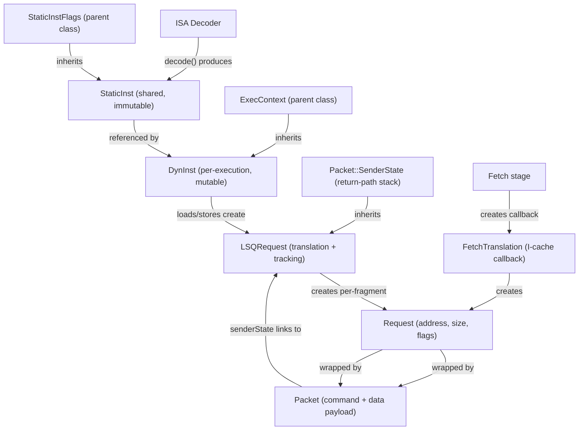
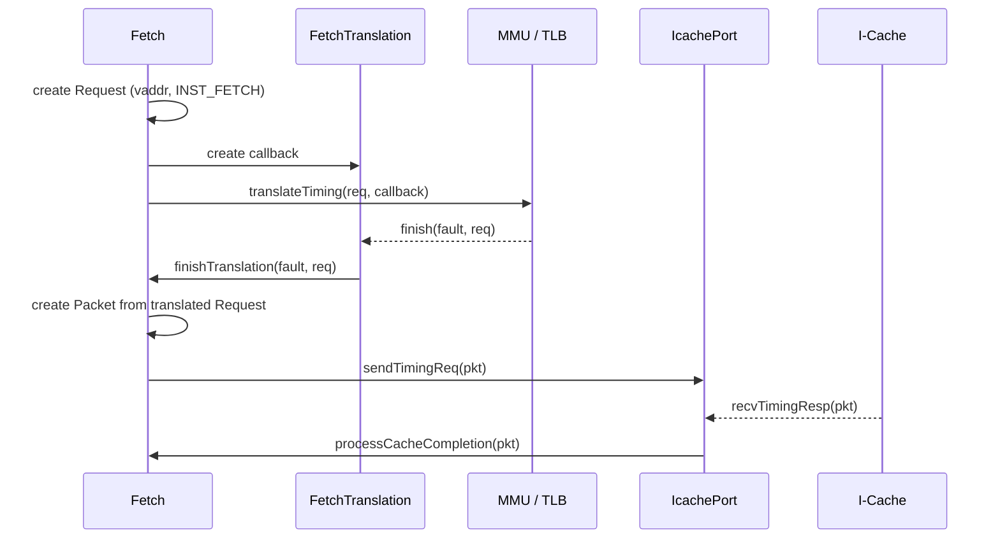
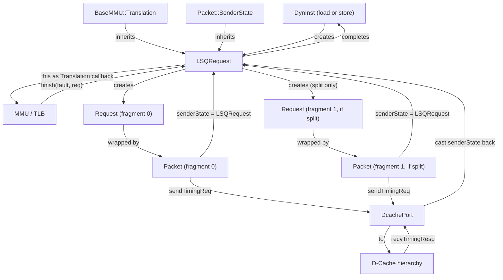
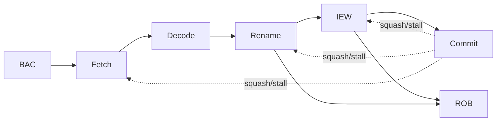
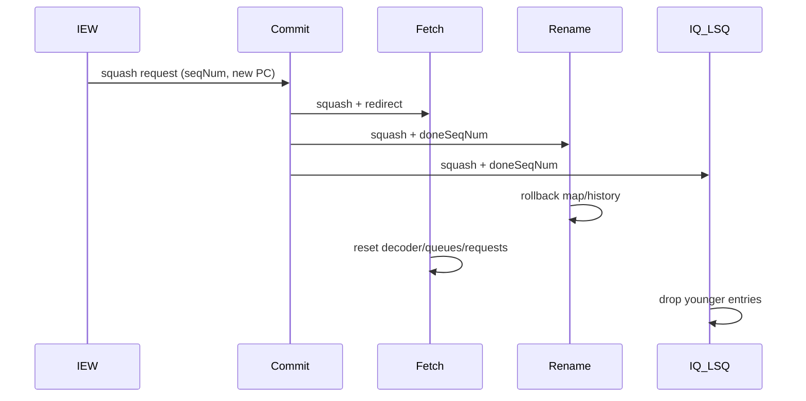

# The gem5 O3CPU Model: A Textbook Walkthrough

This chapter explains how gem5's O3CPU works as a simulated out-of-order
core, starting from first principles and then connecting each concept to the
implementation under `src/cpu/o3/`.

The goal is to make the code readable for newcomers. We begin with the
microarchitecture ideas, then map them to data structures, stage behavior, and
control flow.

## How to read this chapter

If you are new to out-of-order CPUs, read in order.

If you already know the basics, jump to:
- [Transaction Objects](#3-transaction-objects-from-instruction-to-memory-packet)
- [Front-end: BAC, FTQ, Fetch, Decode](#6-front-end-bac-ftq-fetch-decode)
- [Rename and Register Dependencies](#7-rename-and-register-dependencies)
- [Execution Back-End: IEW, IQ, FU pool, LSQ](#8-execution-back-end-iew-iq-fu-pool-lsq)
- [ROB, Commit, and Precise State](#9-rob-commit-and-precise-state)
- [Squash and Recovery](#10-squash-and-recovery)

## 1. Foundations: What O3CPU is modeling

O3CPU models a superscalar, speculative, out-of-order pipeline. Three ideas
matter most:

1. **Execution order can differ from program order.**
2. **Architectural state updates must still occur in program order.**
3. **Wrong speculation must be recoverable.**

A minimal mental model:

- Fetch many instructions.
- Rename registers to remove false dependencies.
- Issue ready instructions as soon as resources are available.
- Retire only from the oldest instruction first.
- If speculation is wrong, squash younger work and restart.

Implementation anchors:
- CPU stage orchestration: [../src/cpu/o3/cpu.cc#L368](../src/cpu/o3/cpu.cc#L368)
- Stage class ownership in CPU: [../src/cpu/o3/cpu.hh#L92](../src/cpu/o3/cpu.hh#L92)
- Width/thread hard limits: [../src/cpu/o3/limits.hh#L49](../src/cpu/o3/limits.hh#L49)

## 2. Vocabulary you need before the pipeline

| Term | Meaning in this chapter |
| --- | --- |
| `StaticInst` | Decoded ISA instruction template (shared across dynamic instances). |
| `DynInst` | One dynamic in-flight instruction with runtime state. |
| Sequence number (`seqNum`) | Global age tag used to order instructions across pipeline structures. |
| Architectural register | Programmer-visible register name (e.g., x1, rax). |
| Physical register | Internal register allocated by rename. |
| ROB | Reorder buffer; enforces in-order retirement and precise exceptions. |
| IQ | Instruction queue; schedules ready instructions to functional units. |
| LSQ | Load/store queue; tracks memory ops, forwarding, violations, cache I/O. |
| Squash | Remove speculative younger instructions after mispredict/fault/etc. |

A key beginner concept is **dependency types**:

- RAW (read-after-write): true dependency, must be preserved.
- WAR and WAW: false dependencies, removed by register renaming.

`DynInst` is the central runtime object carrying these details.

Implementation anchors:
- `DynInst` definition: [../src/cpu/o3/dyn_inst.hh#L75](../src/cpu/o3/dyn_inst.hh#L75)
- Source-ready bookkeeping: [../src/cpu/o3/dyn_inst.cc#L305](../src/cpu/o3/dyn_inst.cc#L305)
- Mispredict check helper: [../src/cpu/o3/dyn_inst.hh#L535](../src/cpu/o3/dyn_inst.hh#L535)

## 3. Transaction objects: from instruction to memory packet

The O3CPU pipeline operates on several distinct transaction object types. Each
type exists because a different part of the simulation needs different
information and different lifetimes. Understanding what each object carries and
how they relate is essential before reading stage code.

### 3.1 Object overview



There are four layers of transaction objects:

1. **Instruction objects** (`StaticInst`, `DynInst`) represent what to execute.
2. **Translation callbacks** (`FetchTranslation`, `LSQRequest`) bridge address
   translation.
3. **Memory transport objects** (`Request`, `Packet`) carry addresses and data
   through caches and memory.
4. **Return-path metadata** (`Packet::SenderState`) lets responses find their
   way back to the originator.

### 3.2 StaticInst: the decoded template

`StaticInst` is the immutable, ISA-level description of one decoded
instruction. It is created once by the ISA decoder and shared (via reference
counting) across every dynamic execution of that instruction.

Key information carried:
- Opcode class (`_opClass`) for functional-unit selection.
- Property flags (IsLoad, IsStore, IsInteger, ...) via `StaticInstFlags`.
- Source and destination register index arrays (`_srcRegIdxPtr`,
  `_destRegIdxPtr`), using architectural register names.
- Virtual methods `execute()`, `initiateAcc()`, `completeAcc()` that ISA
  code implements for each instruction.

`StaticInstPtr` is a `RefCountingPtr<StaticInst>` that automatically manages
the shared lifetime.

Implementation anchors:
- `StaticInst` class: [../src/cpu/static_inst.hh#L88](../src/cpu/static_inst.hh#L88)
- `StaticInstPtr` typedef: [../src/cpu/static_inst_fwd.hh#L38](../src/cpu/static_inst_fwd.hh#L38)

### 3.3 DynInst: the per-execution carrier

`DynInst` wraps a `StaticInst` and adds everything that changes per execution:

- **Identity:** sequence number (`seqNum`), thread pointer, CPU pointer.
- **Rename state:** physical source/destination register indices, previous
  destination for rollback, per-source ready bits.
- **Results:** a queue of `InstResult` values written during execution.
- **Memory state:** effective virtual/physical addresses, request size, request
  flags, load/store queue indices.
- **Pipeline timestamps:** per-stage tick fields for tracing and statistics.
- **Status bits:** IqEntry, RobEntry, Completed, Squashed, and others that
  track where the instruction sits in the pipeline.

`DynInst` also implements the `ExecContext` interface, which is the abstract
API that ISA execution code uses to read/write registers and initiate memory
operations. The key insight is that `DynInst` maps architectural operand
indices (from `StaticInst`) to physical register indices (from rename), then
accesses the CPU register file.

`DynInstPtr` is a `RefCountingPtr<DynInst>` passed through every pipeline
structure (IQ, ROB, LSQ, commit). When all references are dropped, the
instruction is automatically destroyed.

Creation happens in Fetch:

1. ISA decoder produces a `StaticInstPtr`.
2. Fetch allocates a `DynInst` with a custom `operator new` that co-allocates
   register-index arrays in a single heap block.
3. Fetch assigns a globally unique `seqNum`.

Implementation anchors:
- `DynInst` class: [../src/cpu/o3/dyn_inst.hh#L75](../src/cpu/o3/dyn_inst.hh#L75)
- `ExecContext` interface: [../src/cpu/exec_context.hh#L71](../src/cpu/exec_context.hh#L71)
- `DynInstPtr` typedef: [../src/cpu/o3/dyn_inst_ptr.hh#L55](../src/cpu/o3/dyn_inst_ptr.hh#L55)
- Custom allocator: [../src/cpu/o3/dyn_inst.cc#L136](../src/cpu/o3/dyn_inst.cc#L136)
- Creation in Fetch: [../src/cpu/o3/fetch.cc#L1012](../src/cpu/o3/fetch.cc#L1012)

### 3.4 Request: the memory-system address envelope

When a `DynInst` needs to access memory, a `Request` object is created. A
`Request` is the persistent metadata envelope that travels from the CPU through
translation, caches, and memory controllers.

Key fields:
- Virtual address (`_vaddr`), physical address (`_paddr`), size (`_size`).
- Flags (`_flags`): INST_FETCH, UNCACHEABLE, LLSC, STRICT_ORDER, etc.
- Requestor ID (`_requestorId`): identifies which component (CPU, DMA, ...)
  issued the request.
- PC of the initiating instruction, context ID, instruction sequence number.

`Request` is managed by `std::shared_ptr` (`RequestPtr`), allowing multiple
packets and translation stages to share ownership.

Implementation anchors:
- `Request` class: [../src/mem/request.hh#L97](../src/mem/request.hh#L97)
- `RequestPtr` typedef: [../src/mem/request.hh#L94](../src/mem/request.hh#L94)

### 3.5 Packet: the memory-system transport object

A `Packet` wraps a `Request` and adds transport-level state:

- **Command** (`MemCmd`): ReadReq, ReadResp, WriteReq, WriteResp, etc.
- **Data pointer**: payload for reads and writes.
- **Timing fields**: `headerDelay`, `payloadDelay` for modeling interconnect
  latency.
- **SenderState pointer**: return-path metadata (see below).

While a single `Request` persists for the lifetime of a memory operation,
multiple `Packet` objects may be created for it (e.g., split cache-line
accesses, retries). Factory methods `Packet::createRead()` and
`Packet::createWrite()` handle common cases.

Implementation anchors:
- `Packet` class: [../src/mem/packet.hh#L294](../src/mem/packet.hh#L294)
- Factory methods: [../src/mem/packet.hh#L1038](../src/mem/packet.hh#L1038)

### 3.6 SenderState: the return-path stack

As a packet traverses the memory hierarchy, each component may need to attach
context so it can handle the response correctly. `Packet::SenderState` provides
this through a **stack** of state objects linked by `predecessor` pointers.

```
+-----------+     +-----------+     +-----------+
| Component |     | Component |     | Component |
|   State C | --> |   State B | --> |   State A |
| (current) |     |(predecessor)    |(predecessor)
+-----------+     +-----------+     +-----------+
                                         NULL
```

- `pushSenderState()` saves the current state and installs a new one.
- `popSenderState()` restores the previous state when the response returns.

This stack pattern means any number of components (caches, bridges, address
mappers) can annotate a packet without interfering with each other.

Implementation anchors:
- `SenderState` struct: [../src/mem/packet.hh#L468](../src/mem/packet.hh#L468)
- Push/pop methods: [../src/mem/packet.cc#L334](../src/mem/packet.cc#L334)

### 3.7 Fetch translation path

When Fetch needs an I-cache line, it creates a dedicated callback object and
a `Request`, then sends the request through the MMU for translation:



`FetchTranslation` is a lightweight object implementing `BaseMMU::Translation`.
Its only job is to call back into Fetch when translation finishes. It deletes
itself in `finish()`.

Implementation anchors:
- `FetchTranslation` class: [../src/cpu/o3/fetch.hh#L108](../src/cpu/o3/fetch.hh#L108)
- `IcachePort` class: [../src/cpu/o3/fetch.hh#L88](../src/cpu/o3/fetch.hh#L88)
- Request creation and translation call: [../src/cpu/o3/fetch.cc#L529](../src/cpu/o3/fetch.cc#L529)
- `finishTranslation`: [../src/cpu/o3/fetch.cc#L578](../src/cpu/o3/fetch.cc#L578)

### 3.8 LSQ data-access path

Data memory operations (loads, stores, atomics) use a richer transaction path
because they must handle address translation, split accesses, store-to-load
forwarding, and ordered completion.

The central object is `LSQRequest`, which inherits from **both**
`BaseMMU::Translation` (to receive translation callbacks) and
`Packet::SenderState` (to ride along with packets through the memory system):



`LSQRequest` comes in three variants:

| Variant | Use case |
| --- | --- |
| `SingleDataRequest` | Normal loads/stores within one cache line. |
| `SplitDataRequest` | Accesses that cross a cache-line or page boundary. |
| `UnsquashableDirectRequest` | Special requests (HTM, TLB shootdowns) that bypass squash logic. |

For split accesses, `SplitDataRequest` creates multiple `Request` objects (one
per fragment), sends each through translation independently, and tracks all
fragments until every response arrives.

On the response path, `DcachePort::recvTimingResp()` forwards to
`LSQ::recvTimingResp()`, which recovers the `LSQRequest` by casting
`pkt->senderState`, closing the loop back to the originating `DynInst`.

Implementation anchors:
- `LSQRequest` class: [../src/cpu/o3/lsq.hh#L219](../src/cpu/o3/lsq.hh#L219)
- `SingleDataRequest`: [../src/cpu/o3/lsq.hh#L599](../src/cpu/o3/lsq.hh#L599)
- `SplitDataRequest`: [../src/cpu/o3/lsq.hh#L644](../src/cpu/o3/lsq.hh#L644)
- `UnsquashableDirectRequest`: [../src/cpu/o3/lsq.hh#L627](../src/cpu/o3/lsq.hh#L627)
- `DcachePort` class: [../src/cpu/o3/lsq.hh#L84](../src/cpu/o3/lsq.hh#L84)
- Packet build (single): [../src/cpu/o3/lsq.cc#L1205](../src/cpu/o3/lsq.cc#L1205)
- Packet build (split): [../src/cpu/o3/lsq.cc#L1237](../src/cpu/o3/lsq.cc#L1237)

### 3.9 Port interface

All timed memory communication uses gem5's `RequestPort` / `ResponsePort`
abstraction. O3CPU defines two ports:

- `Fetch::IcachePort` (`RequestPort`): sends I-cache read requests and
  receives fill responses.
- `LSQ::DcachePort` (`RequestPort`): sends data-cache requests, receives
  responses, and participates in snooping for cache coherence.

Key methods: `sendTimingReq()` to issue a request; `recvTimingResp()` to
handle the response; `recvReqRetry()` to retry after a rejected send.

Implementation anchors:
- Port base classes: [../src/mem/port.hh#L134](../src/mem/port.hh#L134)
- `IcachePort`: [../src/cpu/o3/fetch.hh#L88](../src/cpu/o3/fetch.hh#L88)
- `DcachePort`: [../src/cpu/o3/lsq.hh#L84](../src/cpu/o3/lsq.hh#L84)

### 3.10 Summary table

| Object | Lifetime | Managed by | Primary role |
| --- | --- | --- | --- |
| `StaticInst` | Shared across all executions | `RefCountingPtr` | Immutable decoded instruction template |
| `DynInst` | One pipeline traversal | `RefCountingPtr` | Per-execution state, rename, results |
| `FetchTranslation` | One I-cache translation | `delete this` in `finish()` | TLB callback for Fetch |
| `LSQRequest` | One data-memory operation | LSQ-owned with self-managed tail cases | Translation callback + packet tracking |
| `Request` | One memory operation | `std::shared_ptr` | Address, size, flags envelope |
| `Packet` | One hop or retry cycle | Manual (per component) | Transport: command + data + SenderState |
| `SenderState` | One round-trip per component | Stack discipline | Return-path context for responses |

## 4. Code map and simulation clock model

### 4.1 Code map (what to open first)

- CPU top-level and tick loop: [../src/cpu/o3/cpu.hh](../src/cpu/o3/cpu.hh),
  [../src/cpu/o3/cpu.cc#L368](../src/cpu/o3/cpu.cc#L368)
- Front-end path: [../src/cpu/o3/bac.hh](../src/cpu/o3/bac.hh), [../src/cpu/o3/ftq.hh](../src/cpu/o3/ftq.hh),
  [../src/cpu/o3/fetch.hh](../src/cpu/o3/fetch.hh), [../src/cpu/o3/decode.hh](../src/cpu/o3/decode.hh)
- Rename path: [../src/cpu/o3/rename.hh](../src/cpu/o3/rename.hh), [../src/cpu/o3/rename_map.hh](../src/cpu/o3/rename_map.hh),
  [../src/cpu/o3/free_list.hh](../src/cpu/o3/free_list.hh), [../src/cpu/o3/scoreboard.hh](../src/cpu/o3/scoreboard.hh)
- Execute path: [../src/cpu/o3/iew.hh](../src/cpu/o3/iew.hh), [../src/cpu/o3/inst_queue.hh](../src/cpu/o3/inst_queue.hh),
  [../src/cpu/o3/fu_pool.hh](../src/cpu/o3/fu_pool.hh), [../src/cpu/o3/lsq.hh](../src/cpu/o3/lsq.hh),
  [../src/cpu/o3/lsq_unit.hh](../src/cpu/o3/lsq_unit.hh)
- Retirement path: [../src/cpu/o3/rob.hh](../src/cpu/o3/rob.hh), [../src/cpu/o3/commit.hh](../src/cpu/o3/commit.hh)

### 4.2 One-cycle ordering

Within a simulated cycle, `CPU::tick()` calls stage ticks in fixed order:

1. `BAC`
2. `Fetch`
3. `Decode`
4. `Rename`
5. `IEW`
6. `Commit`

Then communication buffers advance to expose new values at the configured delay.

Implementation anchor:
- Tick order and buffer advance: [../src/cpu/o3/cpu.cc#L368](../src/cpu/o3/cpu.cc#L368)

### 4.3 Why `TimeBuffer` matters

O3CPU does not model individual flip-flops. It uses delayed ring buffers
(`TimeBuffer`) for stage communication.

That gives two practical benefits:

- Pipeline depth can be changed by parameters instead of rewriting stage code.
- Forward and backward signals use one consistent timing abstraction.

Implementation anchors:
- Generic buffer type: [../src/cpu/timebuf.hh#L40](../src/cpu/timebuf.hh#L40)
- O3 forward/backward structures: [../src/cpu/o3/comm.hh#L62](../src/cpu/o3/comm.hh#L62),
  [../src/cpu/o3/comm.hh#L113](../src/cpu/o3/comm.hh#L113)

## 5. Big picture: one instruction from fetch to commit



Narrative:

1. Front-end chooses a PC and fetches bytes from I-cache.
2. Fetch creates `DynInst` objects and assigns sequence numbers.
3. Decode forwards them and can catch some direct-branch target mistakes early.
4. Rename allocates physical destination registers and records rollback history.
5. IEW dispatches into IQ/LSQ, issues ready ops, executes, and writes back.
6. Commit retires the oldest ready ROB entry and updates architectural state.

If speculation fails, commit coordinates squash and all younger instructions are
removed consistently.

## 6. Front-end: BAC, FTQ, Fetch, Decode

This chapter groups front-end behavior in one place to avoid repeating branch,
stall, and squash discussions later.

### 6.1 BAC and two front-end modes

BAC is the branch predictor interface stage.

- **Coupled mode** (`decoupledFrontEnd = False`): Fetch drives prediction by
  calling `BAC::updatePC()` while decoding fetched instructions.
- **Decoupled mode** (`decoupledFrontEnd = True`): BAC can run ahead and create
  fetch targets (`generateFetchTargets()`), placing them into FTQ.

Implementation anchors:
- BAC API: [../src/cpu/o3/bac.hh#L91](../src/cpu/o3/bac.hh#L91)
- `generateFetchTargets`: [../src/cpu/o3/bac.cc#L585](../src/cpu/o3/bac.cc#L585)
- `updatePC`: [../src/cpu/o3/bac.cc#L904](../src/cpu/o3/bac.cc#L904)
- pre-decode reconciliation: [../src/cpu/o3/bac.cc#L764](../src/cpu/o3/bac.cc#L764)

### 6.2 FTQ as the decoupled handoff queue

In decoupled mode, FTQ stores predicted fetch targets until Fetch consumes them.

Core operations:
- `insert()` by BAC
- `readHead()` / `popHead()` by Fetch
- `squash()` on recovery

Implementation anchors:
- FTQ class: [../src/cpu/o3/ftq.hh#L226](../src/cpu/o3/ftq.hh#L226)
- Insert/read/pop: [../src/cpu/o3/ftq.cc#L186](../src/cpu/o3/ftq.cc#L186),
  [../src/cpu/o3/ftq.cc#L225](../src/cpu/o3/ftq.cc#L225), [../src/cpu/o3/ftq.cc#L238](../src/cpu/o3/ftq.cc#L238)

### 6.3 Fetch responsibilities

Fetch has four jobs:

1. Handle squash/stall signals from later stages.
2. Interact with ITLB and I-cache.
3. Decode bytes into `StaticInst` and create `DynInst` objects.
4. Feed Decode through per-thread fetch queues.

Important beginner note: in gem5 O3, ISA decode occurs during Fetch. The
pipeline stage named "Decode" is mostly a buffering/control stage.

Implementation anchors:
- Fetch tick loop: [../src/cpu/o3/fetch.cc#L821](../src/cpu/o3/fetch.cc#L821)
- Core fetch loop: [../src/cpu/o3/fetch.cc#L1058](../src/cpu/o3/fetch.cc#L1058)
- I-cache fill path: [../src/cpu/o3/fetch.cc#L529](../src/cpu/o3/fetch.cc#L529),
  [../src/cpu/o3/fetch.cc#L356](../src/cpu/o3/fetch.cc#L356)
- Fetch squash action: [../src/cpu/o3/fetch.cc#L710](../src/cpu/o3/fetch.cc#L710)

### 6.4 Decode responsibilities

Decode does three useful things:

1. Smooth Fetch->Rename flow via buffering/skid handling.
2. Detect some direct-branch target mismatches early.
3. Propagate flow control and squash metadata.

Implementation anchors:
- Decode tick and loop: [../src/cpu/o3/decode.cc#L562](../src/cpu/o3/decode.cc#L562),
  [../src/cpu/o3/decode.cc#L636](../src/cpu/o3/decode.cc#L636)
- Decode-origin squash path: [../src/cpu/o3/decode.cc#L311](../src/cpu/o3/decode.cc#L311)

## 7. Rename and register dependencies

Rename is where the model shifts from architectural registers to physical
registers.

### 7.1 Why rename exists

Out-of-order execution needs freedom to issue younger instructions before older
ones when safe. That is blocked by false WAR/WAW dependencies if architectural
register names are reused.

Rename removes those false dependencies by allocating a fresh physical register
for each destination write (except special cases such as fixed-mapped register
classes).

### 7.2 Rename stage algorithm (conceptual)

For each instruction, rename checks resources first, then performs mapping:

1. Verify downstream capacity (ROB/IQ/LSQ).
2. Rename source operands by reading current map.
3. Allocate new physical destinations from free lists.
4. Mark new destinations not-ready in scoreboard.
5. Record `(arch, newPhys, oldPhys, seqNum)` in history buffer.

Implementation anchors:
- Rename tick: [../src/cpu/o3/rename.cc#L426](../src/cpu/o3/rename.cc#L426)
- `renameInsts`: [../src/cpu/o3/rename.cc#L535](../src/cpu/o3/rename.cc#L535)
- History structure: [../src/cpu/o3/rename.hh#L301](../src/cpu/o3/rename.hh#L301)

### 7.3 Rename maps, free lists, scoreboard

Three structures form one renaming system:

- Rename map (`SimpleRenameMap` / `UnifiedRenameMap`)
- Free list (`SimpleFreeList` / `UnifiedFreeList`)
- Readiness scoreboard (`Scoreboard`)

Implementation anchors:
- Rename map types: [../src/cpu/o3/rename_map.hh#L71](../src/cpu/o3/rename_map.hh#L71),
  [../src/cpu/o3/rename_map.hh#L168](../src/cpu/o3/rename_map.hh#L168)
- Core rename op: [../src/cpu/o3/rename_map.cc#L72](../src/cpu/o3/rename_map.cc#L72)
- Free list types: [../src/cpu/o3/free_list.hh#L71](../src/cpu/o3/free_list.hh#L71),
  [../src/cpu/o3/free_list.hh#L124](../src/cpu/o3/free_list.hh#L124)
- Scoreboard API: [../src/cpu/o3/scoreboard.hh#L66](../src/cpu/o3/scoreboard.hh#L66)

### 7.4 Commit map vs speculative map

O3CPU keeps:

- A speculative rename map used by Rename.
- A committed rename map used for architecturally visible register state.

On normal commit, committed map entries are updated from the retiring
instruction's destination mapping.

Implementation anchors:
- Commit map storage: [../src/cpu/o3/cpu.hh#L445](../src/cpu/o3/cpu.hh#L445)
- Commit-time map update: [../src/cpu/o3/commit.cc#L1264](../src/cpu/o3/commit.cc#L1264)

### 7.5 Rollback and deferred freeing

On squash, Rename walks history and restores previous mappings. New mappings
from squashed instructions are eventually freed with care, including SMT-safe
handling paths.

Implementation anchors:
- Rename squash rollback: [../src/cpu/o3/rename.cc#L934](../src/cpu/o3/rename.cc#L934)
- Remove committed history: [../src/cpu/o3/rename.cc#L991](../src/cpu/o3/rename.cc#L991)

## 8. Execution back-end: IEW, IQ, FU pool, LSQ

### 8.1 IEW as a combined stage

IEW groups dispatch, execute, and writeback in one model stage.

High-level order inside IEW tick:
- process signals
- dispatch from Rename to IQ/LSQ
- execute ready instructions
- write back results
- schedule future-ready work

Implementation anchors:
- IEW tick: [../src/cpu/o3/iew.cc#L1430](../src/cpu/o3/iew.cc#L1430)
- Dispatch: [../src/cpu/o3/iew.cc#L881](../src/cpu/o3/iew.cc#L881)
- Execute: [../src/cpu/o3/iew.cc#L1138](../src/cpu/o3/iew.cc#L1138)
- Writeback: [../src/cpu/o3/iew.cc#L1380](../src/cpu/o3/iew.cc#L1380)

### 8.2 IQ: dependency-aware scheduler

IQ tracks dependence chains and schedules oldest-ready work subject to width and
functional unit availability.

Core operations:
- `insert()` to add instructions and dependency edges
- `wakeDependents()` on producer completion
- `scheduleReadyInsts()` for issue selection

Implementation anchors:
- IQ class: [../src/cpu/o3/inst_queue.hh#L178](../src/cpu/o3/inst_queue.hh#L178)
- Insert: [../src/cpu/o3/inst_queue.cc#L669](../src/cpu/o3/inst_queue.cc#L669)
- Schedule: [../src/cpu/o3/inst_queue.cc#L849](../src/cpu/o3/inst_queue.cc#L849)
- Wakeup: [../src/cpu/o3/inst_queue.cc#L1074](../src/cpu/o3/inst_queue.cc#L1074)

### 8.3 FU pool: capability and occupancy control

IQ asks `FUPool` for a unit matching instruction op class.

`getUnit()` can report:
- no unit needed
- no capable unit
- no free capable unit
- allocated unit index

Implementation anchors:
- FU pool class: [../src/cpu/o3/fu_pool.hh#L75](../src/cpu/o3/fu_pool.hh#L75)
- `getUnit`: [../src/cpu/o3/fu_pool.cc#L165](../src/cpu/o3/fu_pool.cc#L165)
- Deferred free: [../src/cpu/o3/fu_pool.cc#L193](../src/cpu/o3/fu_pool.cc#L193),
  [../src/cpu/o3/fu_pool.cc#L200](../src/cpu/o3/fu_pool.cc#L200)

### 8.4 LSQ: memory ordering and memory-system interface

LSQ manages memory operations from dispatch through completion. It is split into
per-thread `LSQUnit` state plus top-level coordination.

Key behaviors:
- execute loads/stores
- store-to-load forwarding
- ordering violation detection
- store writeback after commit permission
- snoop-driven re-execution handling

Implementation anchors:
- LSQ top-level: [../src/cpu/o3/lsq.hh#L76](../src/cpu/o3/lsq.hh#L76)
- LSQUnit class: [../src/cpu/o3/lsq_unit.hh#L88](../src/cpu/o3/lsq_unit.hh#L88)
- Execute load/store: [../src/cpu/o3/lsq_unit.cc#L606](../src/cpu/o3/lsq_unit.cc#L606),
  [../src/cpu/o3/lsq_unit.cc#L678](../src/cpu/o3/lsq_unit.cc#L678)
- Violation check: [../src/cpu/o3/lsq_unit.cc#L526](../src/cpu/o3/lsq_unit.cc#L526)
- Store writeback: [../src/cpu/o3/lsq_unit.cc#L812](../src/cpu/o3/lsq_unit.cc#L812)
- Store-to-load read/forward path: [../src/cpu/o3/lsq_unit.cc#L1340](../src/cpu/o3/lsq_unit.cc#L1340)

## 9. ROB, Commit, and precise state

### 9.1 Why the ROB exists

Out-of-order issue needs an in-order retirement structure so the architectural
state appears as if instructions executed strictly in program order.

The ROB stores in-flight instructions and retires from the oldest ready head.

Implementation anchors:
- ROB class: [../src/cpu/o3/rob.hh#L71](../src/cpu/o3/rob.hh#L71)
- Insert: [../src/cpu/o3/rob.cc#L193](../src/cpu/o3/rob.cc#L193)
- Retire head: [../src/cpu/o3/rob.cc#L230](../src/cpu/o3/rob.cc#L230)

### 9.2 Commit loop

Commit repeatedly tries to retire up to `commitWidth` instructions each cycle,
obeying thread policy and fault/interrupt rules.

`commitHead()` is where the per-instruction decision happens (normal commit,
non-spec handling, fault path).

Implementation anchors:
- Commit tick: [../src/cpu/o3/commit.cc#L600](../src/cpu/o3/commit.cc#L600)
- Commit loop: [../src/cpu/o3/commit.cc#L899](../src/cpu/o3/commit.cc#L899)
- `commitHead`: [../src/cpu/o3/commit.cc#L1111](../src/cpu/o3/commit.cc#L1111)

### 9.3 Traps and interrupts

Commit coordinates trap/interrupt behavior with precise ordering constraints.

Implementation anchors:
- Trap event: [../src/cpu/o3/commit.cc#L97](../src/cpu/o3/commit.cc#L97)
- `squashFromTrap`: [../src/cpu/o3/commit.cc#L538](../src/cpu/o3/commit.cc#L538)
- Interrupt paths: [../src/cpu/o3/commit.cc#L669](../src/cpu/o3/commit.cc#L669),
  [../src/cpu/o3/commit.cc#L722](../src/cpu/o3/commit.cc#L722)

## 10. Squash and recovery

This section is the canonical recovery description for the whole chapter.
Earlier sections do not repeat it.

### 10.1 Common squash causes

- Branch misprediction (detected in execute paths).
- Memory ordering violation (LSQ/IEW cooperation).
- Decode-detected direct branch target mismatch.
- Trap/interrupt and other architectural control events from Commit.

### 10.2 Recovery principle

Recover by sequence number:

1. Keep instructions up to the recovery point.
2. Remove younger instructions in all structures.
3. Restore rename map and predictor/speculative state.
4. Redirect front-end PC.
5. Resume fetching.



Implementation anchors:
- IEW squash sources: [../src/cpu/o3/iew.cc#L473](../src/cpu/o3/iew.cc#L473),
  [../src/cpu/o3/iew.cc#L497](../src/cpu/o3/iew.cc#L497)
- ROB squash operations: [../src/cpu/o3/rob.cc#L300](../src/cpu/o3/rob.cc#L300),
  [../src/cpu/o3/rob.cc#L454](../src/cpu/o3/rob.cc#L454)
- Decode-origin squash signal: [../src/cpu/o3/decode.cc#L311](../src/cpu/o3/decode.cc#L311)

## 11. Memory dependence prediction (Store Sets)

O3CPU uses a Store Set predictor to avoid over-constraining loads while still
learning problematic load/store pairs.

Idea:

- If a younger load violates ordering with an older store, link them into the
  same store set.
- Future instances of that load wait for the relevant store-set producer.
- Predictor state is periodically cleared to avoid stale saturation.

Implementation anchors:
- StoreSet class: [../src/cpu/o3/store_set.hh#L73](../src/cpu/o3/store_set.hh#L73)
- Violation learning: [../src/cpu/o3/store_set.cc#L112](../src/cpu/o3/store_set.cc#L112)
- Clear-period logic: [../src/cpu/o3/store_set.cc#L181](../src/cpu/o3/store_set.cc#L181)
- MemDepUnit wrapper: [../src/cpu/o3/mem_dep_unit.hh#L90](../src/cpu/o3/mem_dep_unit.hh#L90),
  [../src/cpu/o3/mem_dep_unit.cc#L573](../src/cpu/o3/mem_dep_unit.cc#L573)

## 12. SMT model: what is shared, what is per-thread

O3CPU supports up to `MaxThreads` (currently 4).

Shared structures generally include execution resources (IQ/FU pools, physical
register file, broad pipeline bandwidth); per-thread state includes PCs,
front-end queues/decoders, and thread-local bookkeeping.

Policy choices are configurable for fetch/commit and for queue sharing behavior.

Implementation anchors:
- Max thread constant: [../src/cpu/o3/limits.hh#L50](../src/cpu/o3/limits.hh#L50)
- Fetch/commit SMT policies: [../src/cpu/o3/BaseO3CPU.py#L191](../src/cpu/o3/BaseO3CPU.py#L191),
  [../src/cpu/o3/BaseO3CPU.py#L200](../src/cpu/o3/BaseO3CPU.py#L200)
- IQ policy object: [../src/cpu/o3/IQUnit.py#L59](../src/cpu/o3/IQUnit.py#L59)

## 13. CPU lifecycle: activity, sleep, drain

### 13.1 Activity-driven scheduling

The CPU avoids wasting simulation cycles when no stage has useful work.

Implementation anchors:
- Activity recorder field: [../src/cpu/o3/cpu.hh#L501](../src/cpu/o3/cpu.hh#L501)
- End-of-cycle activity checks: [../src/cpu/o3/cpu.cc#L400](../src/cpu/o3/cpu.cc#L400)

### 13.2 Drain protocol

Draining is used for checkpoint/switch/termination transitions. The CPU and
Commit coordinate to reach a clean quiescent state.

Implementation anchors:
- `CPU::drain`: [../src/cpu/o3/cpu.cc#L729](../src/cpu/o3/cpu.cc#L729)
- `CPU::tryDrain`: [../src/cpu/o3/cpu.cc#L791](../src/cpu/o3/cpu.cc#L791)
- `CPU::isCpuDrained`: [../src/cpu/o3/cpu.cc#L818](../src/cpu/o3/cpu.cc#L818)
- Commit drain entry: [../src/cpu/o3/commit.cc#L327](../src/cpu/o3/commit.cc#L327)

### 13.3 Instruction list cleanup

The CPU keeps a global in-flight instruction list and removes entries through a
deferred cleanup pass to avoid iterator hazards.

Implementation anchor:
- Cleanup pass: [../src/cpu/o3/cpu.cc#L1285](../src/cpu/o3/cpu.cc#L1285)

## 14. Observability: stats, probes, and debug flows

### 14.1 Pipeline timestamps

`DynInst` stores per-stage timing fields used by pipeline visualizations and
trace facilities.

Implementation anchors:
- Tick fields: [../src/cpu/o3/dyn_inst.hh#L1020](../src/cpu/o3/dyn_inst.hh#L1020)
- Trace emission on destruction path: [../src/cpu/o3/dyn_inst.cc#L222](../src/cpu/o3/dyn_inst.cc#L222)

### 14.2 Debug flags

Useful O3 debug categories include `BAC`, `FTQ`, `IQ`, `IEW`, `Rename`, `ROB`,
`LSQ`, and `O3CPUAll`.

Implementation anchor:
- Debug flags: [../src/cpu/o3/SConscript#L76](../src/cpu/o3/SConscript#L76)

## 15. Configuration guide: the knobs that matter first

All key knobs live in `BaseO3CPU.py`.

Implementation anchor:
- Parameter definitions: [../src/cpu/o3/BaseO3CPU.py#L56](../src/cpu/o3/BaseO3CPU.py#L56)

### 15.1 Width knobs (throughput)

- `fetchWidth`, `decodeWidth`, `renameWidth`
- `dispatchWidth`, `issueWidth`, `wbWidth`, `commitWidth`

### 15.2 Queue/structure capacity knobs (window size)

- `numROBEntries`
- `instQueues[*].numEntries`
- `LQEntries`, `SQEntries`
- physical register counts by class

### 15.3 Delay knobs (pipeline timing)

- forward delays (`fetchToDecodeDelay`, `decodeToRenameDelay`, ...)
- backward delays (`commitToFetchDelay`, `commitToRenameDelay`, ...)
- internal issue-to-execute delay (`issueToExecuteDelay`)

### 15.4 Front-end mode knobs

- `decoupledFrontEnd`
- `numFTQEntries`
- `fetchTargetWidth`, `maxFTPerCycle`, `maxTakenPredPerCycle`

### 15.5 Practical first experiments

1. Narrow baseline:
   - width knobs at 1
   - small ROB/IQ/LSQ
   - useful for understanding control flow
2. Wider OOO baseline:
   - balanced wider front/back widths
   - larger ROB/IQ/LSQ/register files
   - useful for throughput studies

## 16. Suggested source-code reading order

Use this order if you are learning O3CPU internals from code:

1. [../src/cpu/o3/cpu.hh](../src/cpu/o3/cpu.hh)
2. [../src/cpu/o3/cpu.cc#L368](../src/cpu/o3/cpu.cc#L368)
3. [../src/cpu/o3/dyn_inst.hh#L75](../src/cpu/o3/dyn_inst.hh#L75)
4. [../src/cpu/o3/comm.hh#L113](../src/cpu/o3/comm.hh#L113)
5. [../src/cpu/o3/fetch.cc#L821](../src/cpu/o3/fetch.cc#L821)
6. [../src/cpu/o3/rename.cc#L535](../src/cpu/o3/rename.cc#L535)
7. [../src/cpu/o3/iew.cc#L1430](../src/cpu/o3/iew.cc#L1430)
8. [../src/cpu/o3/rob.cc#L193](../src/cpu/o3/rob.cc#L193)
9. [../src/cpu/o3/commit.cc#L899](../src/cpu/o3/commit.cc#L899)
10. [../src/cpu/o3/BaseO3CPU.py#L56](../src/cpu/o3/BaseO3CPU.py#L56)

## 17. Summary

The O3CPU model is easiest to understand if you hold three invariants in mind:

1. **Age (`seqNum`) defines correctness decisions.**
2. **Renaming enables out-of-order execution without violating true
   dependencies.**
3. **Commit is the architectural gatekeeper; squash restores consistency when
   speculation is wrong.**

Once these invariants are clear, the rest of the implementation details fit into
place.
