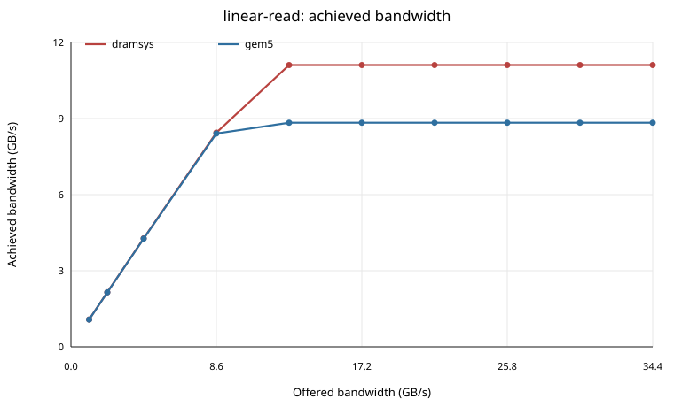
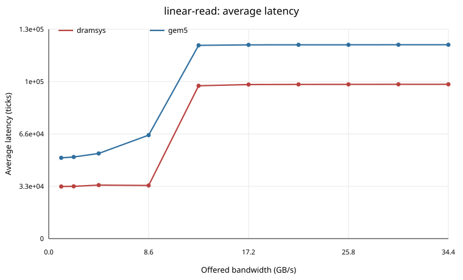
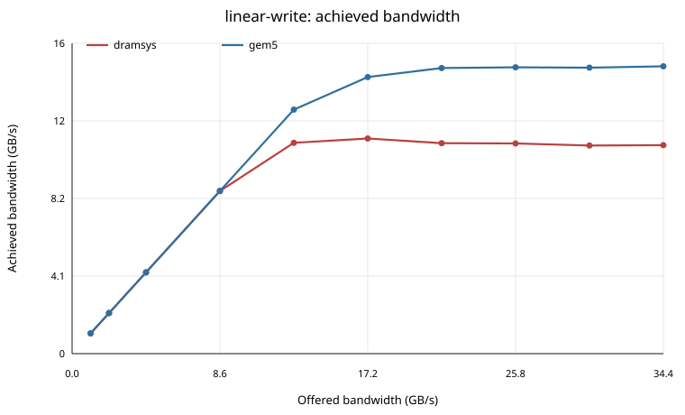
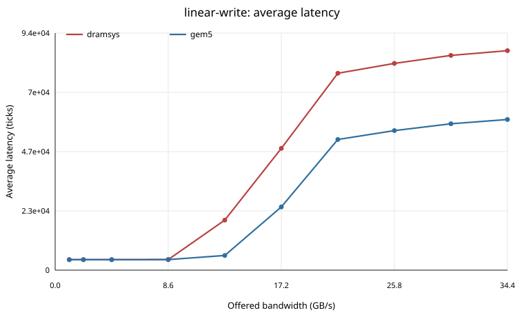
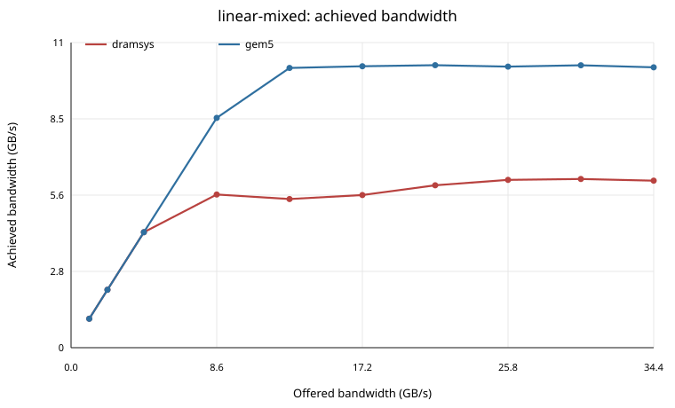
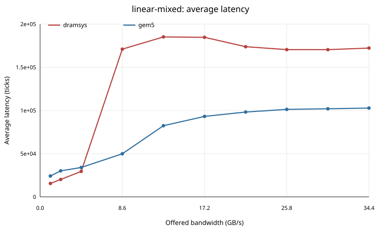
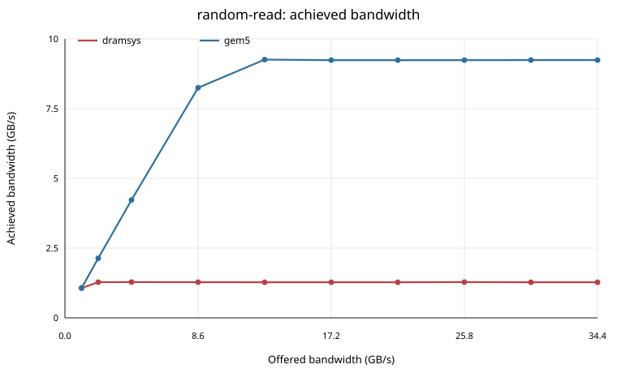
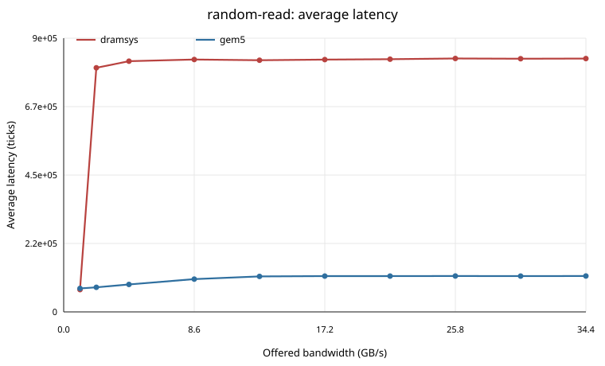
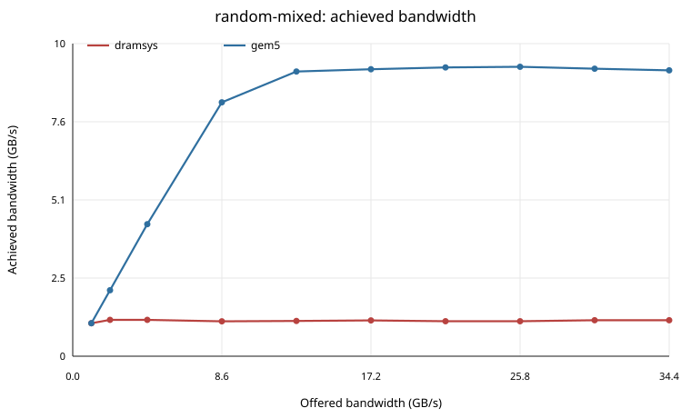
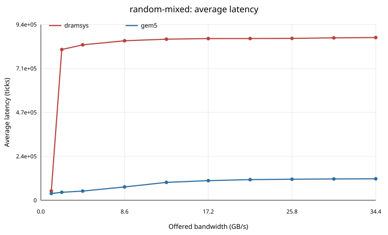

# CHI RN-I Memory Sweep Report

## Methodology

Synthetic TrafficGen requestors drive a cacheless CHI RN-I hierarchy. The path is TrafficGen -> CHI RN-I -> CHI HNF directory -> CHI SNF -> memory backend. Each run changes the offered bandwidth while holding the address range, cache line size, clock, and traffic pattern fixed.

## Measurement Methodology

Offered bandwidth is the programmed request injection rate, not the measured memory throughput. The sweep runner passes each listed rate to TrafficGen. TrafficGen converts that rate into a packet period of `block_size / rate`; with the default 64-byte block size, higher offered rates simply schedule 64-byte requests closer together. This report uses one TrafficGen requestor, so the programmed requestor rate and aggregate offered rate are the same. With multiple requestors, aggregate offered load is the sum of the programmed requestor rates.

The linear patterns issue cache-line-sized requests in increasing address order and wrap at the end of the configured traffic range. The random patterns select a block-aligned address within the same range for each request. Read-only, write-only, and mixed patterns use TrafficGen's read percentage knob; the mixed runs in this report use a 50 percent read mix.

Achieved bandwidth is measured from completed TrafficGen responses. The runner sums TrafficGen `readBW` and `writeBW`, where those stats are `bytesRead / simSeconds` and `bytesWritten / simSeconds`. The byte counters increment when a timing response returns, so achieved bandwidth reflects completed work rather than merely attempted injection. DRAMSys `AVG BW` and `MAX BW` are recorded separately as backend-local memory statistics.

Average latency is also response based. TrafficGen records the tick when an accepted request is sent and adds the send-to-response time to the read or write latency total when the response arrives. At rates below saturation, increasing offered bandwidth usually raises queueing delay and achieved bandwidth. Past saturation, the memory path cannot accept requests at the requested pace. TrafficGen then stalls on timing-request backpressure and waiting-response limits; that excess pressure appears in retry counts, retry ticks, and Ruby buffer occupancy rather than as an unlimited number of already-sent requests. The accepted request rate is clipped near the sustainable throughput of the CHI/memory path, so the plotted average latency tends to bend upward and then flatten instead of growing without bound as offered bandwidth continues to increase.

## Configuration

- gem5 binary: `build/RISCV/gem5.opt`
- config script: `configs/example/gem5_library/chi_rni_memory/chi-rni-ddr4.py`
- patterns: `linear-read, linear-write, linear-mixed, random-read, random-mixed`
- backends: `gem5, dramsys`
- rates: `1GiB/s, 2GiB/s, 4GiB/s, 8GiB/s, 12GiB/s, 16GiB/s, 20GiB/s, 24GiB/s, 28GiB/s, 32GiB/s`
- duration: `20us`
- data limit: `0B`
- memory size: `4GiB`
- traffic address range: `256MiB`
- cache line size: `64` bytes
- generator count: `1`
- gem5 DDR4 interface: `1866-x8-4gib`
- DRAMSys config: `ext/dramsys/gem5_configs/ddr4-gem5-se.json`

## Caveats

The default gem5 backend uses a local DDR4-1866 x8 4 GiB DRAMInterface derived from gem5's DDR4 timing interface and matched to the supplied DRAMSys gem5-SE DDR4 memspec. This keeps the comparison on one memory channel, the same 4 GiB exposed address range, the same cache line size, and comparable DDR4-1866 timing assumptions.

The gem5 and DRAMSys timing models are not identical: gem5's DRAMInterface exposes a compact timing parameter set while DRAMSys uses its controller, address mapping, checker, and DRAMPower/DRAMUtils models. Treat the plots as backend-comparison data for this testcase rather than as device-validation measurements.

Generated statistics are synthetic microbenchmark results and should be interpreted as configuration-comparison data, not as validated system-level memory measurements.

## Plots

### Linear Read Bandwidth

### Linear Read Latency

### Linear Write Bandwidth

### Linear Write Latency

### Linear Mixed Bandwidth

### Linear Mixed Latency

### Random Read Bandwidth

### Random Read Latency

### Random Mixed Bandwidth

### Random Mixed Latency

## Raw Result Summary

| Pattern | Backend | Peak achieved GB/s | Rate at peak | Latency at peak (ticks) | Host seconds |
|---|---|---:|---|---:|---:|
| linear-read | gem5 | 8.802 | 12GiB/s | 122617.0 | 0.08 |
| linear-read | dramsys | 11.066 | 12GiB/s | 96984.9 | 0.12 |
| linear-write | gem5 | 15.168 | 32GiB/s | 59675.7 | 0.15 |
| linear-write | dramsys | 11.357 | 16GiB/s | 48222.8 | 0.17 |
| linear-mixed | gem5 | 10.455 | 20GiB/s | 98681.0 | 0.10 |
| linear-mixed | dramsys | 6.242 | 28GiB/s | 171221.2 | 0.10 |
| random-read | gem5 | 9.262 | 12GiB/s | 116147.1 | 0.09 |
| random-read | dramsys | 1.283 | 4GiB/s | 819800.1 | 0.06 |
| random-mixed | gem5 | 9.394 | 24GiB/s | 113066.5 | 0.10 |
| random-mixed | dramsys | 1.181 | 2GiB/s | 808839.6 | 0.06 |

## Simulation Speed

| Backend | Runs | Avg host seconds | Avg wall seconds | Avg host Mtick/s | Avg achieved GB/s |
|---|---:|---:|---:|---:|---:|
| gem5 | 50 | 0.087 | 0.559 | 249.537 | 7.879 |
| dramsys | 50 | 0.087 | 0.567 | 257.595 | 4.761 |

For these short synthetic runs, DRAMSys average wall runtime was 1.58% higher than the gem5 MemCtrl backend.

## Memory Stat Summary

| Backend | Runs | Avg gem5 DRAM bus util | Max gem5 peak MiB/s | Avg DRAMSys AVG BW GB/s | Max DRAMSys MAX BW GB/s |
|---|---:|---:|---:|---:|---:|
| gem5 | 50 | 51.262 | 14925.000 | n/a | n/a |
| dramsys | 50 | n/a | n/a | 4.703 | 14.930 |

## Queueing Summary

| Pattern | Backend | Max RN/SNF request occupancy | Max retry ticks | Max avg latency (ticks) |
|---|---|---:|---:|---:|
| linear-read | gem5 | 0.023 | 19979298 | 123010.0 |
| linear-read | dramsys | 0.955 | 19953576 | 97892.4 |
| linear-write | gem5 | 0.909 | 11893302 | 59675.7 |
| linear-write | dramsys | 0.951 | 14160177 | 86940.8 |
| linear-mixed | gem5 | 0.138 | 18448074 | 103296.3 |
| linear-mixed | dramsys | 0.975 | 18610902 | 186048.0 |
| random-read | gem5 | 0.024 | 19969641 | 117241.8 |
| random-read | dramsys | 0.994 | 19878183 | 828815.2 |
| random-mixed | gem5 | 0.181 | 18580392 | 115243.8 |
| random-mixed | dramsys | 0.993 | 20519676 | 873106.7 |

## Observed Memory Models

- DRAMSys reported memory type(s): `DDR4`

Full CSV results: [results.csv](results.csv)
Full JSON results: [results.json](results.json)

## Conclusions

- `linear-read` peaked at 11.066 GB/s with `dramsys` at offered rate `12GiB/s`.
- `linear-write` peaked at 15.168 GB/s with `gem5` at offered rate `32GiB/s`.
- `linear-mixed` peaked at 10.455 GB/s with `gem5` at offered rate `20GiB/s`.
- `random-read` peaked at 9.262 GB/s with `gem5` at offered rate `12GiB/s`.
- `random-mixed` peaked at 9.394 GB/s with `gem5` at offered rate `24GiB/s`.
