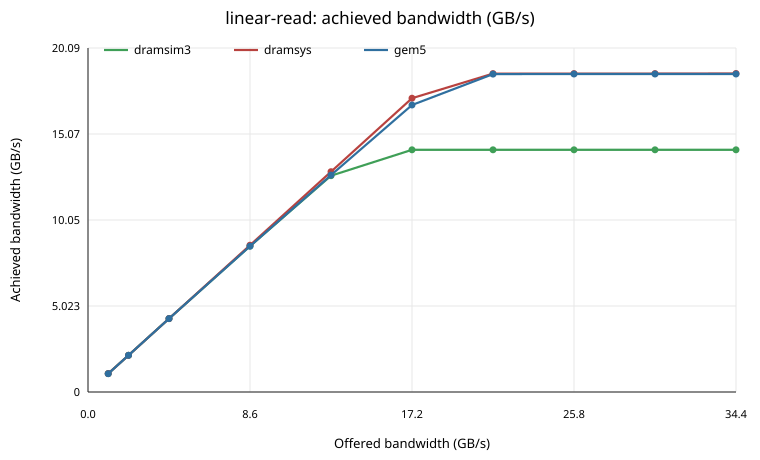
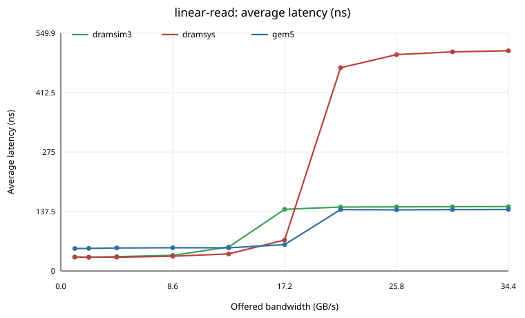
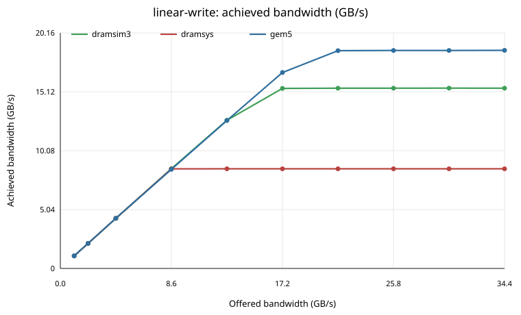
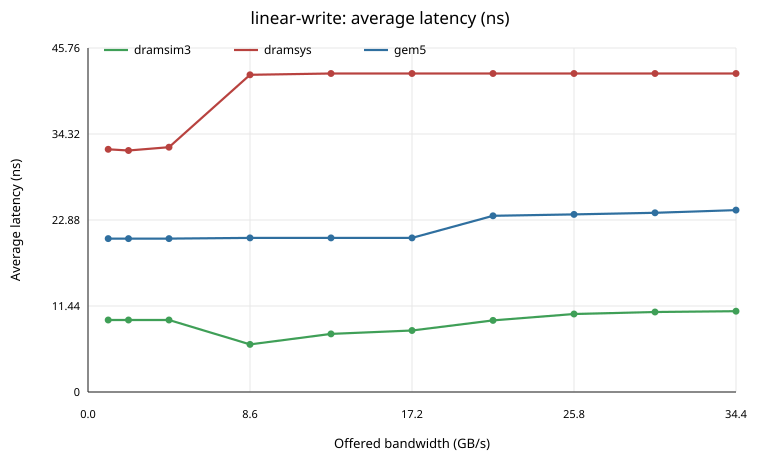
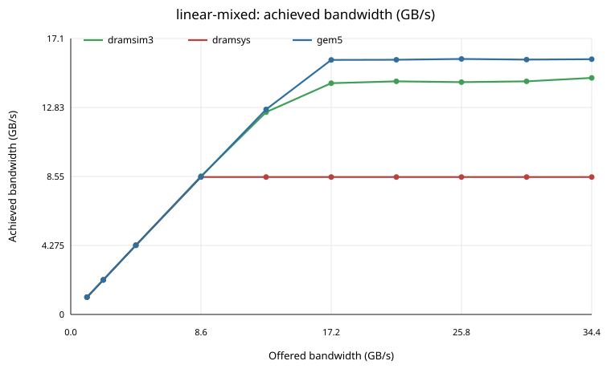
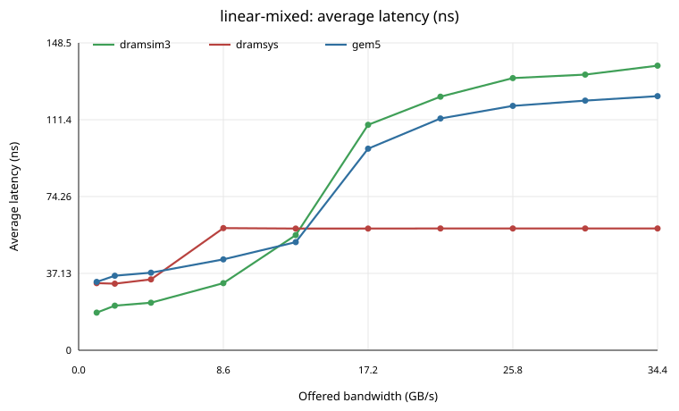
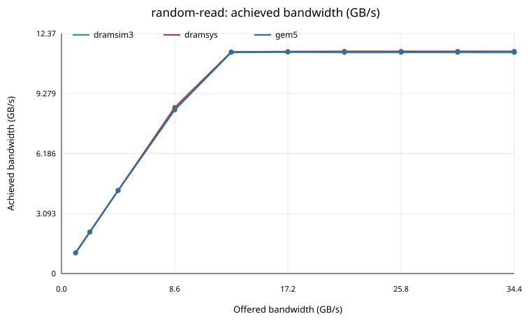
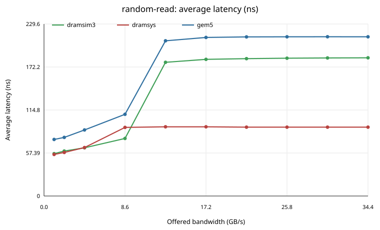
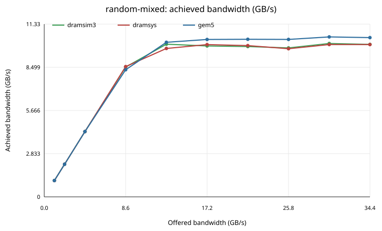
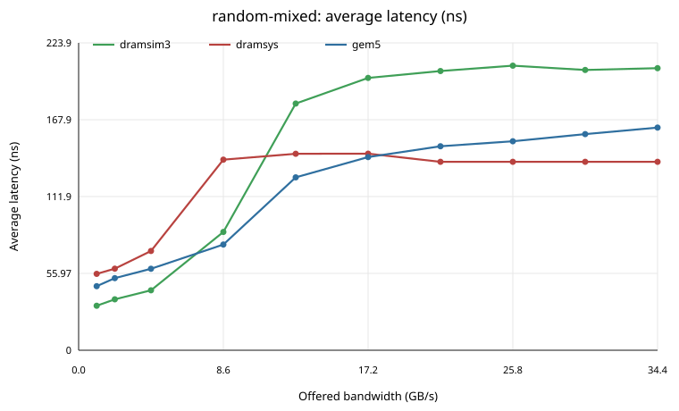

# DDR4-2400 4Gb x8 Memory Backend Comparison

Apples-to-apples comparison of three memory backends on one shared DDR4-2400 4Gb x8, single-channel, single-rank, 4GiB device-under-test:

- **gem5** native `MemCtrl` with a custom `DDR4_2400_8x8_4GiB` `DRAMInterface`
- **DRAMSys** with the JEDEC DDR4-2400 4Gb x8 memspec
- **DRAMSim3** with a derived DDR4-2400 4Gb x8 single-rank config

The reference device specification is the DRAMSys memspec `ext/dramsys/DRAMSys/configs/memspec/JEDEC_4Gb_DDR4-2400_8bit_A.json`; all backend timings are converted from it.

## Methodology

Synthetic TrafficGen requestors drive the memory backend directly through a cacheless path: TrafficGen -> SystemXBar (NoCache) -> memory backend. There is no CHI, Ruby, cache, or interconnect between the requestor and the controller, so the measured differences come from the three memory models rather than from a shared fabric. The crossbar, clock, traffic, and address range are identical across all three backends.

Each run holds the device, timing, clocks, traffic pattern, address range, and block size fixed while sweeping the offered injection rate.

## Measurement Methodology

**Offered bandwidth** is the programmed TrafficGen injection rate, not measured throughput. TrafficGen converts each rate into a packet period of `block_size / rate`; with a 64-byte block, higher offered rates schedule 64-byte requests closer together. One requestor is used, so the programmed requestor rate equals the aggregate offered rate. Offered rates are listed in binary GiB/s but reported in decimal GB/s on the plots and tables.

**Achieved bandwidth** is response-based and reported in decimal GB/s (1 GB = 1,000,000,000 bytes). The runner sums TrafficGen `readBW` and `writeBW`, which are `bytesRead / simSeconds` and `bytesWritten / simSeconds`; the byte counters increment only when a timing response returns, so achieved bandwidth reflects completed work. This is the same requestor-visible observation point for all three backends. Each backend's own internal bandwidth counter (gem5 `dram.*`, DRAMSys `AVG/MAX BW`, DRAMSim3 `average_bandwidth`) is recorded separately and is not the primary metric.

**Latency** is response-based and reported in nanoseconds. For each completed request TrafficGen records the tick when an accepted request is sent and adds the send-to-response time to the read or write latency total when the response arrives. Average latency is `total_completed_request_latency / completed_request_count`, computed from completed requests only and converted from ticks to ns using the run's tick rate. Read, write, and request-count-weighted combined latencies are all recorded.

Past saturation the backend cannot accept requests at the offered pace; TrafficGen stalls on back-pressure, which appears as `retryTicks` rather than unbounded in-flight requests. The accepted rate is clipped near the sustainable throughput, so achieved bandwidth flattens and latency bends upward then levels off.

## Device Under Test

| Parameter | Value |
| --- | --- |
| Memory type | DDR4 |
| Data rate | 2400 MT/s |
| Command clock | 1200 MHz |
| tCK | 0.833 ns |
| Channels | 1 |
| Ranks per channel | 1 |
| Devices per rank | 8 (x8) |
| Device density | 4Gb = 512 MiB |
| Channel data width | 64 bits |
| Total capacity | 4 GiB |
| Burst length | 8 (64-byte burst) |
| Bank groups per rank | 4 |
| Banks per rank | 16 |
| Rows | 32768 |
| Columns | 1024 |

## Shared Timing (from the DRAMSys reference memspec)

All cycle counts are from `JEDEC_4Gb_DDR4-2400_8bit_A.json`; ns values use tCK = 0.833 ns. The final column notes how each backend expresses the parameter.

| Timing | Cycles | Approx. ns | Per-backend mapping |
| --- | ---: | ---: | --- |
| tCK | n/a | 0.833 | DDR4-2400 command clock period. |
| CL / RL | 16 | 13.328 | gem5 tCL; DRAMSim3 CL; DRAMSys CL/RL. |
| WL / CWL | 16 | 13.328 | DRAMSim3 CWL=16; DRAMSys WL=16; gem5 has no separate WL (write latency folded into tCWL = tCL). |
| RCD | 16 | 13.328 | gem5 tRCD; DRAMSim3 tRCD; DRAMSys RCD. |
| RP | 16 | 13.328 | gem5 tRP; DRAMSim3 tRP; DRAMSys RP. |
| RAS | 39 | 32.487 | gem5 tRAS; DRAMSim3 tRAS; DRAMSys RAS. |
| RC | 55 | 45.815 | Derived (RAS+RP) in gem5/DRAMSim3; explicit in DRAMSys. |
| CCD_S | 4 | 3.332 | gem5 tBURST; DRAMSim3 tCCD_S; DRAMSys CCD_S. |
| CCD_L | 6 | 4.998 | gem5 tCCD_L; DRAMSim3 tCCD_L; DRAMSys CCD_L. |
| RRD_S | 4 | 3.332 | gem5 tRRD; DRAMSim3 tRRD_S; DRAMSys RRD_S. |
| RRD_L | 6 | 4.998 | gem5 tRRD_L; DRAMSim3 tRRD_L; DRAMSys RRD_L. |
| FAW | 26 | 21.658 | gem5 tXAW; DRAMSim3 tFAW; DRAMSys FAW. |
| RFC1 | 312 | 259.896 | gem5 tRFC; DRAMSim3 tRFC; DRAMSys RFC1. |
| REFI | 9360 | 7796.880 | gem5 tREFI; DRAMSim3 tREFI; DRAMSys REFI. |
| WR | 18 | 14.994 | gem5 tWR; DRAMSim3 tWR; DRAMSys WR. |
| WTR_S | 3 | 2.499 | gem5 tWTR; DRAMSim3 tWTR_S; DRAMSys WTR_S. |
| WTR_L | 9 | 7.497 | gem5 tWTR_L; DRAMSim3 tWTR_L; DRAMSys WTR_L. |
| RTP | 12 | 9.996 | gem5 tRTP; DRAMSim3 tRTP; DRAMSys RTP. |
| XP | 8 | 6.664 | gem5 tXP; DRAMSim3 tXP; DRAMSys XP. |
| XS | 324 | 269.892 | gem5 tXS; DRAMSim3 tXS; DRAMSys XS. |
| RTRS | 1 | 0.833 | gem5 tCS; DRAMSim3 tRTRS; DRAMSys RTRS (single rank: not exercised). |

## Configuration

- gem5 binary: `build/RISCV/gem5.opt`
- config script: `configs/example/gem5_library/trafficgen_memory/trafficgen-ddr4.py`
- patterns: `linear-read, linear-write, linear-mixed, random-read, random-mixed`
- backends: `gem5, dramsys, dramsim3`
- offered rates: `1GiB/s, 2GiB/s, 4GiB/s, 8GiB/s, 12GiB/s, 16GiB/s, 20GiB/s, 24GiB/s, 28GiB/s, 32GiB/s`
- duration: `20us` (warmup: none)
- data limit: `0B`
- memory size: `4GiB` (one 4 GiB range, start = 0)
- traffic address range: `256MiB`
- block / cache line size: `64` bytes
- requestors: `1`
- mixed read percent: `50`
- controller / requestor / system clock: `1.2GHz` (held constant across backends)
- gem5 interface: `DDR4_2400_8x8_4GiB`, page policy `open`, scheduler `frfcfs`, address mapping `RoCoRaBaCh`, read/write queue 32/32 entries
- DRAMSys config: `ext/dramsys/gem5_configs/ddr4-2400-4gb-x8-gem5-se.json` (FR-FCFS, open page, bankwise queue, request buffer 8, all-bank refresh, no power-down); attached via `Gem5ToTlmBridge` with `request_queue_depth = 32`
- DRAMSim3 config: `ext/dramsim3/DDR4_4Gb_x8_2400_1rank_4GiB.ini` (FR-FCFS, OPEN_PAGE, PER_BANK queue, cmd queue 8, trans queue 32, rank-level-staggered refresh)

## Apples-to-Apples Notes and Known Differences

**Address mapping.** All three default to *different* address mappings, which would otherwise dominate the comparison. They are aligned here so banks/bank-groups interleave at cache-line granularity: gem5 uses `RoCoRaBaCh`; DRAMSim3 uses `rochrababgco`; DRAMSys uses a custom mapping (`am_ddr4_4Gbx8_1rank_bginterleave.json`) that places bank-group (bits 6-7) and bank (bits 8-9) just above the 64-byte block offset. This ensures the limited traffic range exercises all 16 banks in every backend. The bit orderings are not identical at every position, which is an unavoidable model difference.

**DRAMSys TLM-bridge throughput limitation (found and fixed).** DRAMSys is attached to gem5 through the SystemC TLM bridge (`Gem5ToTlmBridge`), which uses the TLM-2.0 approximately-timed 4-phase protocol. In its original form the bridge accepted only one gem5 request at a time: after sending `BEGIN_REQ` it held a single `blockingRequest` and refused (retried) every further request until `END_REQ` returned, *and* it re-applied each packet's full crossbar header delay (~6-7 ns) as the `BEGIN_REQ` timing annotation. Because the TLM base-protocol exclusion rule permits only one transaction in the `BEGIN_REQ`->`END_REQ` window, that fixed per-packet header delay serialized request *admission* to roughly one transaction every ~10 tCK. Command-trace analysis confirmed the symptom: requests arrived at the DRAMSys controller exactly every 10 tCK and the data bus ran at only ~44% even though consecutive reads targeted different bank groups with open rows (which permit back-to-back CAS at `tCCD_S` = 4 tCK). The result was a flat ~8.5 GB/s cap for **every** traffic pattern -- an artifact of the gem5<->DRAMSys integration, not of the DRAMSys DRAM model (whose own `MAX BW` counter always reported the full 19.2 GB/s peak).

The bridge was fixed (not worked around) in two ways, both honoring the exclusion rule (still only one transaction between `BEGIN_REQ` and `END_REQ`): (1) gem5 requests are staged in a small FIFO so the bridge issues `BEGIN_REQ`s back-to-back as soon as each `END_REQ` returns, instead of paying a full gem5<->bridge round trip per request; and (2) only the *residual* header delay is applied when a request is dequeued -- the crossbar latency elapses in real sim time while the packet waits in the queue, so it is no longer re-charged per transaction. The staging depth is the new `Gem5ToTlmBridge` `request_queue_depth` parameter (default 16; the `DRAMSysMem` component uses 32); a depth of 1 reproduces the legacy behavior. With the fix DRAMSys sustains ~19 GB/s (~99% of the 19.2 GB/s peak) for linear traffic, and its achieved bandwidth now varies with the access pattern (e.g. random reads fall to ~12 GB/s from row-conflict overhead) exactly as a real DRAM controller would. **Saturation bandwidth is now apples-to-apples across all three backends**, and unloaded latency is unchanged.

**Controller policy.** All three use FR-FCFS scheduling and an open-page policy. DRAMSys and DRAMSim3 use an 8-entry per-bank command queue; gem5's `MemCtrl` does not expose a per-bank command queue and instead uses read/write transaction queues (set to 32/32 here, near DRAMSim3's 32-entry transaction queue). DRAMSim3's `trans_queue_size = 32` has no DRAMSys equivalent. These queue-model differences cannot be made bit-identical.

**Write latency.** DRAMSys (WL) and DRAMSim3 (CWL) model write latency as 16 cycles. gem5's `DRAMInterface` has no separate write latency parameter and folds it into `tCL`; this can shift write and mixed-traffic latency slightly.

**Fixed controller pipeline latency.** gem5's `MemCtrl` adds a fixed `static_frontend_latency` (10 ns) plus `static_backend_latency` (10 ns) = 20 ns to every request's requestor-visible latency. This is gem5's explicit model of the controller pipeline. DRAMSys and DRAMSim3 account for controller latency differently and do not add this fixed 20 ns at the same observation point. This is the main reason gem5's unloaded latency sits roughly 20 ns above DRAMSys and DRAMSim3 (which agree closely with each other), while the bandwidth curves remain close. It is a genuine model difference, not a configuration mismatch, and is left at gem5's default rather than artificially zeroed.

**Clock domains.** The requestor, crossbar, and gem5 controller run at `1.2GHz`. DRAMSys (SystemC/TLM) and DRAMSim3 advance on their own tCK-based event schedules through the gem5 wrapper; the device tCK (0.833 ns) is identical for all three.

**Refresh / power-down.** Refresh is enabled in all three (all-bank in gem5/DRAMSys, rank-level-staggered in DRAMSim3). Power-down is disabled in all three.

Treat the plots as a backend-model comparison under a shared DDR4-2400 4Gb x8 configuration, not as silicon validation.

## Plots

### Linear Read Bandwidth

### Linear Read Latency

### Linear Write Bandwidth

### Linear Write Latency

### Linear Mixed Bandwidth

### Linear Mixed Latency

### Random Read Bandwidth

### Random Read Latency

### Random Mixed Bandwidth

### Random Mixed Latency

## Peak Achieved Bandwidth and Latency

| Pattern | Backend | Peak achieved GB/s | Rate at peak | Avg latency at peak (ns) | Host seconds |
|---|---|---:|---|---:|---:|
| linear-read | gem5 | 18.572 | 32GiB/s | 142.3 | 0.01 |
| linear-read | dramsys | 18.602 | 32GiB/s | 509.2 | 0.05 |
| linear-read | dramsim3 | 14.147 | 16GiB/s | 142.6 | 0.01 |
| linear-write | gem5 | 18.667 | 32GiB/s | 24.2 | 0.01 |
| linear-write | dramsys | 18.549 | 32GiB/s | 510.5 | 0.05 |
| linear-write | dramsim3 | 15.430 | 28GiB/s | 10.6 | 0.02 |
| linear-mixed | gem5 | 15.834 | 24GiB/s | 118.1 | 0.01 |
| linear-mixed | dramsys | 16.794 | 28GiB/s | 335.4 | 0.05 |
| linear-mixed | dramsim3 | 14.658 | 32GiB/s | 137.5 | 0.01 |
| random-read | gem5 | 11.427 | 32GiB/s | 212.5 | 0.01 |
| random-read | dramsys | 11.455 | 20GiB/s | 502.6 | 0.05 |
| random-read | dramsim3 | 11.411 | 16GiB/s | 182.4 | 0.01 |
| random-mixed | gem5 | 10.493 | 28GiB/s | 157.5 | 0.01 |
| random-mixed | dramsys | 9.990 | 28GiB/s | 506.9 | 0.04 |
| random-mixed | dramsim3 | 10.059 | 28GiB/s | 204.2 | 0.02 |

## Low-Load Latency (offered 1 GiB/s)

Unloaded round-trip latency seen by the requestor at the lowest offered rate.

| Pattern | Backend | Avg latency (ns) | Read latency (ns) | Write latency (ns) |
|---|---|---:|---:|---:|
| linear-read | gem5 | 51.9 | 51.9 | n/a |
| linear-read | dramsys | 32.2 | 32.2 | n/a |
| linear-read | dramsim3 | 31.9 | 31.9 | n/a |
| linear-write | gem5 | 20.4 | n/a | 20.4 |
| linear-write | dramsys | 32.3 | n/a | 32.3 |
| linear-write | dramsim3 | 9.6 | n/a | 9.6 |
| linear-mixed | gem5 | 33.0 | 49.4 | 20.4 |
| linear-mixed | dramsys | 32.4 | 30.1 | 34.3 |
| linear-mixed | dramsim3 | 18.2 | 29.3 | 9.6 |
| random-read | gem5 | 75.4 | 75.4 | n/a |
| random-read | dramsys | 55.5 | 55.5 | n/a |
| random-read | dramsim3 | 56.5 | 56.5 | n/a |
| random-mixed | gem5 | 46.7 | 74.7 | 20.4 |
| random-mixed | dramsys | 55.7 | 52.8 | 58.4 |
| random-mixed | dramsim3 | 32.4 | 56.8 | 9.6 |

## Simulation Speed

| Backend | Runs | Avg host seconds | Avg wall seconds | Avg host Mtick/s | Avg achieved GB/s |
|---|---:|---:|---:|---:|---:|
| gem5 | 50 | 0.006 | 0.211 | 3543.621 | 10.196 |
| dramsys | 50 | 0.033 | 0.237 | 1150.016 | 10.268 |
| dramsim3 | 50 | 0.011 | 0.215 | 2192.256 | 9.321 |

## Backend-Local Memory Statistics

Internal counters reported by each backend (not the primary requestor-visible metric).

| Backend | Runs | Avg gem5 bus util % | Max gem5 peak GB/s | Avg DRAMSys AVG BW GB/s | Max DRAMSys MAX BW GB/s | Avg DRAMSim3 BW GB/s | Avg DRAMSim3 row-hit rate |
|---|---:|---:|---:|---:|---:|---:|---:|
| gem5 | 50 | 53.064 | 20.140 | n/a | n/a | n/a | n/a |
| dramsys | 50 | n/a | n/a | 10.268 | 19.210 | n/a | n/a |
| dramsim3 | 50 | n/a | n/a | n/a | n/a | 9.325 | 0.494 |

## Back-Pressure Summary

| Pattern | Backend | Max retry ticks | Max avg latency (ns) |
|---|---|---:|---:|
| linear-read | gem5 | 19921166 | 142.3 |
| linear-read | dramsys | 19347416 | 509.2 |
| linear-read | dramsim3 | 19173996 | 149.0 |
| linear-write | gem5 | 19886243 | 24.2 |
| linear-write | dramsys | 19406200 | 510.5 |
| linear-write | dramsim3 | 19335789 | 10.8 |
| linear-mixed | gem5 | 13759205 | 122.8 |
| linear-mixed | dramsys | 11618145 | 344.3 |
| linear-mixed | dramsim3 | 14639912 | 137.5 |
| random-read | gem5 | 19936397 | 212.6 |
| random-read | dramsys | 14583272 | 519.0 |
| random-read | dramsim3 | 19406546 | 184.5 |
| random-mixed | gem5 | 17266608 | 162.2 |
| random-mixed | dramsys | 15645371 | 510.5 |
| random-mixed | dramsim3 | 17173242 | 207.3 |

## Observed Memory Models

- DRAMSys reported memory type(s): `DDR4`

Full CSV results: [results.csv](results.csv)
Full JSON results: [results.json](results.json)

## Conclusions

- `linear-read`: peak GB/s by backend -> gem5 18.572, dramsys 18.602, dramsim3 14.147; highest was `dramsys` at offered `32GiB/s`.
- `linear-write`: peak GB/s by backend -> gem5 18.667, dramsys 18.549, dramsim3 15.430; highest was `gem5` at offered `32GiB/s`.
- `linear-mixed`: peak GB/s by backend -> gem5 15.834, dramsys 16.794, dramsim3 14.658; highest was `dramsys` at offered `28GiB/s`.
- `random-read`: peak GB/s by backend -> gem5 11.427, dramsys 11.455, dramsim3 11.411; highest was `dramsys` at offered `20GiB/s`.
- `random-mixed`: peak GB/s by backend -> gem5 10.493, dramsys 9.990, dramsim3 10.059; highest was `gem5` at offered `28GiB/s`.

The three simulators are not identical and this study does not claim they are. The device geometry, the JEDEC timing table, the controller/requestor/system clocks, and the traffic are held equal, and the address mapping is aligned to interleave banks at cache-line granularity. Two points stand out and are documented above rather than hidden -- one a genuine model difference, one a gem5<->DRAMSys integration bug that was fixed:

1. **Unloaded latency**: DRAMSys and DRAMSim3 agree closely (both ~32 ns for an open-page linear read); gem5 sits ~20 ns higher because of its explicit `static_frontend_latency` + `static_backend_latency` controller pipeline. This is the cleanest apples-to-apples result and is valid for all three backends.

2. **Saturation bandwidth**: now apples-to-apples across all three backends after the `Gem5ToTlmBridge` fix described above. For linear traffic gem5 (up to ~18.6 GB/s) and DRAMSys (~19 GB/s, ~99% of peak) both reach near the 19.2 GB/s data-bus ceiling, while DRAMSim3 (~14-15 GB/s) is somewhat lower. DRAMSys's bandwidth now tracks the access pattern (e.g. random reads drop to ~12 GB/s) instead of being pinned flat by the bridge handshake.

The remaining spread between the three backends reflects genuine differences in their controller and DRAM models (queue structure, write-latency modelling, refresh scheduling, and command-arbitration details) rather than the integration artifact that previously capped DRAMSys.
