# DDR5-4800 Native gem5 vs Ramulator2

This report compares native gem5 `MemCtrl`/`DRAMInterface` against Ramulator2 v2.1 through the same cacheless TrafficGen path.

## Device Under Test

| Parameter | Value |
| --- | --- |
| Standard | DDR5-4800AN-style |
| Channels | 2 independent 32-bit channels |
| Ranks | 1 rank per channel |
| Devices | 4 x8 devices per rank |
| Device density | 16Gb |
| Total capacity | 16GiB |
| Burst | BL16, 64-byte transaction per channel |
| Banks | 8 bank groups x 4 banks = 32 banks/rank |
| tCK | 0.416ns |
| Peak bandwidth | 38.4 GB/s |
| Refresh-adjusted sanity line | 35.14 GB/s |

The Ramulator2 backend uses `DDR5_16Gb_x8` and `DDR5_4800AN`. The native gem5 backend uses a matching custom `DDR5_4800_4x8_16GiB` interface in the testbench.

## Methodology

This section describes what every measurement in the report means. The intent is to compare two memory backends under the same requestor-visible workload, while avoiding the common mistake of measuring an idle latency or a core/cache statistic and treating it as loaded DRAM latency.

### Test Topology

Every run uses the same cacheless path:

```text
TrafficGen -> SystemXBar/NoCache -> memory backend
```

The memory backend is either native gem5 `MemCtrl` plus a custom `DDR5_4800_4x8_16GiB` `DRAMInterface`, or the new Ramulator2 SimObject configured with Ramulator2's `DDR5_16Gb_x8` organization and `DDR5_4800AN` timing preset. Both backends expose the same 16GiB address range and the same two 32-bit DDR5 channel topology.

### Units and Primary Metrics

- Offered rates are specified in binary `GiB/s` on the command line because gem5's rate parser uses binary suffixes.
- Reported bandwidth is decimal `GB/s` from completed TrafficGen responses. This is the used bandwidth observed by the requestor, not the requested injection rate.
- Reported latency is requestor-visible send-to-response latency for completed requests, converted from gem5 ticks to ns.
- Ramulator2 backend-local counters are recorded separately and used only as sanity checks. The tables compare the same TrafficGen response counters for both backends.

### Reference Bandwidth Lines

The SVG plots include two vertical reference lines when the x-axis is a bandwidth axis.

- `theoretical` is the raw bus-rate limit: two 32-bit channels at 4800 MT/s, or `2 x 32 bits x 4800e6 / 8 = 38.4 GB/s`. It assumes every transfer slot carries useful data and ignores refresh, turnaround, command scheduling, row misses, and queue effects.
- `refresh-adjusted` is a DDR5 sanity upper bound that removes the time lost to periodic all-bank refresh. It uses `38.4 GB/s x (1 - (tRTP + tRP + tRFC + tRCD) / tREFI)`, with `tRTP=7.488ns`, `tRP=14.144ns`, `tRFC=295ns`, `tRCD=14.144ns`, and `tREFI=3900ns`, giving 35.14 GB/s.
- These lines are sanity references, not pass/fail thresholds. In offered-load plots they mark where the requested traffic reaches the nominal device limit. In bandwidth-latency curve plots they mark the used stream bandwidth that would correspond to those limits.

### Standard Sweeps

The standard plots use one TrafficGen requestor to sweep offered load over a fixed address range and record completed bandwidth and average request latency.

- `linear-read`: sequential cache-line reads. This favors row-buffer locality and should approach the best read bandwidth.
- `linear-write`: sequential cache-line writes. This stresses write timing, write queueing, and write-drain policy.
- `linear-mixed`: sequential traffic with a 50/50 read/write mix.
- `random-read`: random cache-line reads over the address range. This intentionally destroys most row locality.
- `random-mixed`: random traffic with a 50/50 read/write mix.

For these plots, the x-axis is offered bandwidth and the y-axis is either completed bandwidth or average latency. A flat completed bandwidth curve at high offered load indicates saturation or back-pressure. Rising latency indicates queueing inside the memory system or interconnect path.

### Probe-Stream Curves

`probe-stream-read` and `probe-stream-mixed` are the hockey-stick latency-bandwidth measurements. They use separate requestors so the stream traffic creates load while an independent random-read probe measures loaded latency.

- The stream requestor uses gem5's DRAM-aware TrafficGen primitive. It issues short row-hit bursts and rotates across all 32 banks, which is closer to the paper's requirement that stream requests exploit bank-group and bank-level parallelism.
- The probe requestor always issues random reads with `max_outstanding_reqs = 1`. This keeps the probe latency from being hidden by multiple in-flight probe requests.
- `probe-stream-read` uses a 100% read stream plus the random-read probe.
- `probe-stream-mixed` uses a 50/50 read/write stream plus the same random-read probe.
- The curve x-axis is completed stream bandwidth only. The probe's small bandwidth is excluded from the x-axis so the curve shows how background stream load affects random-read latency.
- The curve y-axis is the probe requestor's read latency. This is the loaded latency measurement; it should rise when the memory system queues requests near saturation.

These curves are the closest match to the methodology criticized in `docs/ramulator-paper/source`: load the memory with stream traffic, measure random-read probe latency, and sanity-check against the theoretical and refresh-adjusted bandwidth limits.

### Known Interpretation Limits

The native gem5 and Ramulator2 models are not identical controller implementations. Read-heavy bandwidth and probe-stream peak bandwidth are the most directly comparable measurements. Write-heavy cases are more sensitive to DDR5 write CAS timing, write turnaround, write-drain policy, and each backend's write response semantics, so large write-path differences are reported as model differences rather than silently averaged away.

## External Context

- The local `docs/ramulator-paper` source and the public [DDR5-4800AN Ramulator2 latency-bandwidth figure](https://www.researchgate.net/figure/Latency-bandwidth-curves-for-DDR5-4800AN-in-Ramulator-20-using-the-Mess-Request_fig2_396692751) describe the same measurement discipline: generate streaming load, measure only random read probe latency, and sanity check against theoretical and refresh-adjusted DDR5 bandwidth.
- The [Mess benchmark project](https://memory.bsc.es/tools/mess-benchmark) describes curve construction by varying traffic intensity and read/write ratio; the [MICRO 2024 paper](https://arxiv.org/abs/2405.10170) uses bandwidth-latency curves across DDR4, DDR5, HBM, and CXL systems.
- Public DDR5 references are not directly comparable to this cacheless two-subchannel simulator setup, but they are useful scale checks: [PassMark's live DDR5 latency chart](https://www.memorybenchmark.net/latency_ddr5.html) shows DDR5 system latencies in the tens of ns, while DDR5-4800 bandwidth [tables](https://www.computerbase.de/artikel/arbeitsspeicher/ddr5-arbeitsspeicher-bandbreiten-latenzen.80697/) report 38.4 GB/s for a 64-bit DIMM-equivalent interface. This testbench models the same aggregate width as two 32-bit subchannels.

## Plots

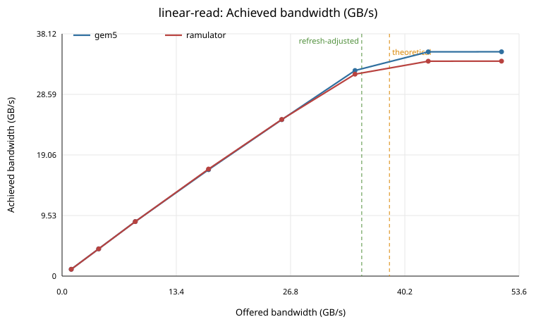

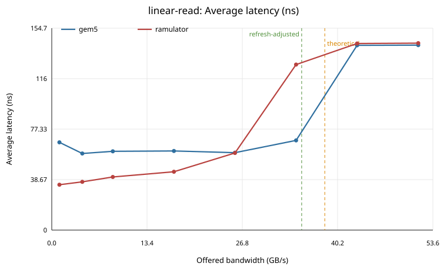

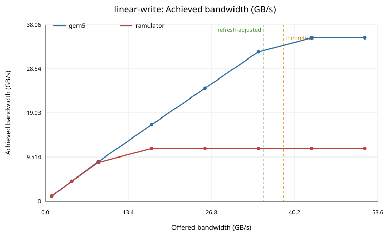

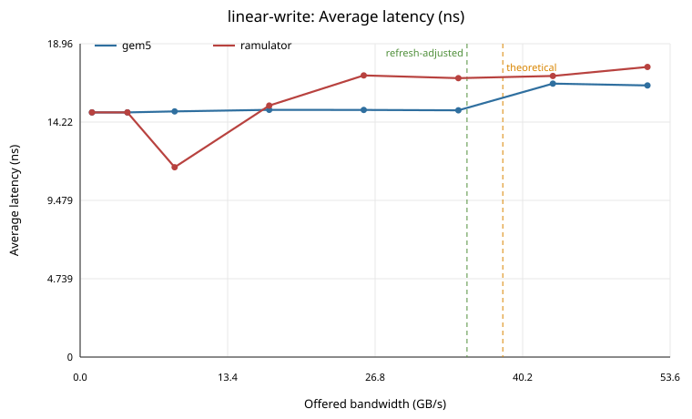

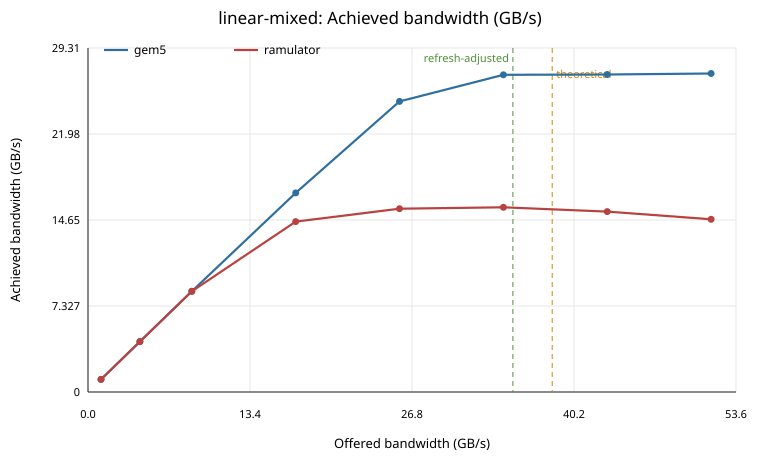

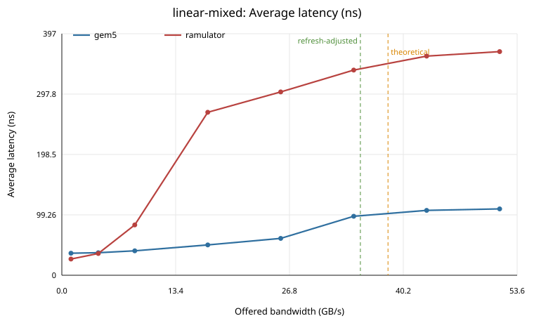

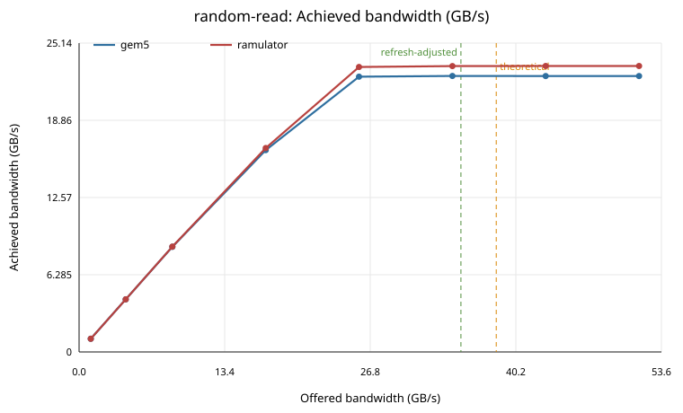

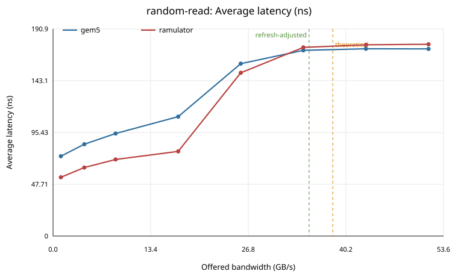

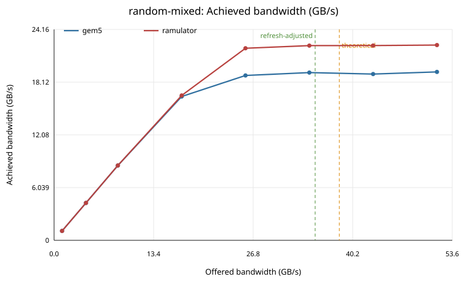

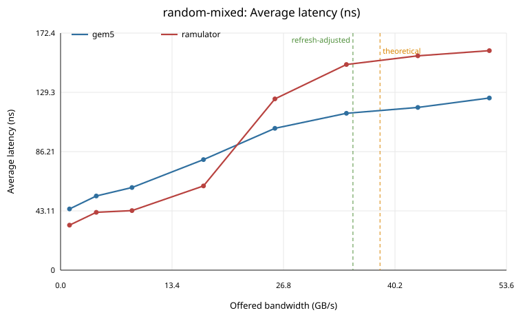

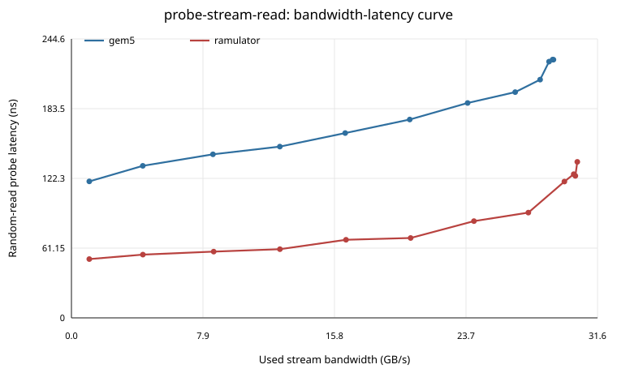

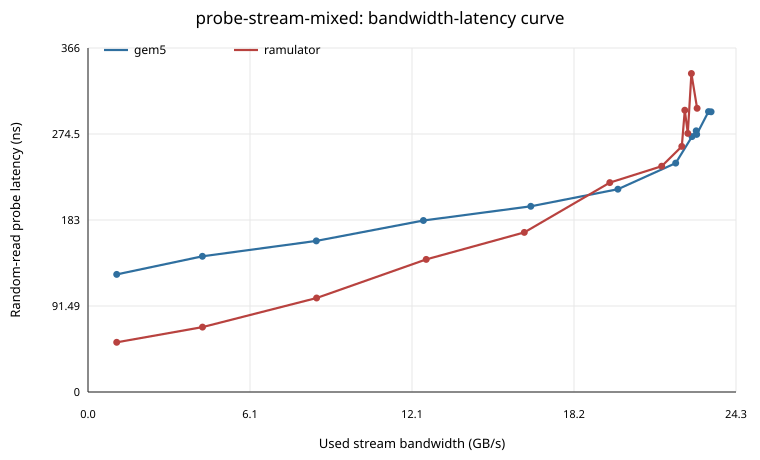

## Peak Achieved Bandwidth

| Pattern | Backend | Peak GB/s | Rate | Latency ns | Host s |
|---|---|---:|---|---:|---:|
| linear-read | gem5 | 35.297 | 48GiB/s | 141.7 | 0.020 |
| linear-read | ramulator | 33.821 | 48GiB/s | 143.2 | 0.050 |
| linear-write | gem5 | 35.238 | 48GiB/s | 16.4 | 0.020 |
| linear-write | ramulator | 11.350 | 48GiB/s | 367.7 | 0.050 |
| linear-mixed | gem5 | 27.136 | 48GiB/s | 109.1 | 0.020 |
| linear-mixed | ramulator | 15.734 | 32GiB/s | 337.2 | 0.040 |
| random-read | gem5 | 22.464 | 32GiB/s | 171.1 | 0.030 |
| random-read | ramulator | 23.279 | 48GiB/s | 176.7 | 0.060 |
| random-mixed | gem5 | 19.294 | 48GiB/s | 125.2 | 0.030 |
| random-mixed | ramulator | 22.368 | 48GiB/s | 255.8 | 0.060 |

## Low-Load Latency

| Pattern | Backend | Avg ns | Read ns | Write ns |
|---|---|---:|---:|---:|
| linear-read | gem5 | 67.2 | 67.2 | n/a |
| linear-read | ramulator | 34.8 | 34.8 | n/a |
| linear-write | gem5 | 14.8 | n/a | 14.8 |
| linear-write | ramulator | 19.8 | n/a | 19.8 |
| linear-mixed | gem5 | 36.2 | 61.3 | 14.8 |
| linear-mixed | ramulator | 26.6 | 30.3 | 23.5 |
| random-read | gem5 | 73.5 | 73.5 | n/a |
| random-read | ramulator | 54.1 | 54.1 | n/a |
| random-mixed | gem5 | 44.5 | 74.7 | 14.8 |
| random-mixed | ramulator | 45.6 | 50.9 | 40.3 |

## Hockey-Stick Curve Summary

| Pattern | Backend | Max stream GB/s | Probe latency at max ns | Low-load probe ns |
|---|---|---:|---:|---:|
| probe-stream-read | gem5 | 28.919 | 226.4 | 119.7 |
| probe-stream-read | ramulator | 30.349 | 136.8 | 51.5 |
| probe-stream-mixed | gem5 | 23.330 | 298.0 | 125.1 |
| probe-stream-mixed | ramulator | 22.807 | 301.8 | 52.8 |

## Backend-Local Ramulator2 Sanity Counters

| Pattern | Peak Ramulator2 GB/s | Avg read latency ns | Row-hit rate |
|---|---:|---:|---:|
| linear-read | 33.847 | 138.0 | 0.982 |
| linear-write | 11.352 | n/a | 0.979 |
| linear-mixed | 15.745 | 379.5 | 0.980 |
| random-read | 23.298 | 171.3 | 0.000 |
| random-mixed | 22.370 | 305.1 | 0.000 |
| probe-stream-read | 31.161 | 115.2 | 0.539 |
| probe-stream-mixed | 23.221 | 207.4 | 0.567 |

## Interpretation

- `linear-write` peak bandwidth differs substantially (35.24 GB/s gem5 vs 11.35 GB/s Ramulator2). For write-heavy cases, this is expected to be sensitive to DDR5 write CAS/turnaround timing and controller write-drain policy. Native gem5 also acknowledges write requests through its own MemCtrl response path, so write latency is not as directly comparable as read-probe latency.
- `linear-mixed` peak bandwidth differs substantially (27.14 GB/s gem5 vs 15.73 GB/s Ramulator2). For write-heavy cases, this is expected to be sensitive to DDR5 write CAS/turnaround timing and controller write-drain policy. Native gem5 also acknowledges write requests through its own MemCtrl response path, so write latency is not as directly comparable as read-probe latency.
- `probe-stream-read` peak stream bandwidth agrees within 4.7% between backends.
- `probe-stream-mixed` peak stream bandwidth agrees within 2.2% between backends.
- Native gem5 includes explicit fixed frontend/backend controller latencies. Ramulator2 reports lower backend-local read latency in cycles, but the report's primary latency is the same TrafficGen requestor-visible send-to-response metric for both backends.
- The refresh-adjusted line is a sanity bound, not a pass/fail criterion. TrafficGen request timing, queue back-pressure, write turnaround, and row locality can keep achieved bandwidth below it.

## Reproduction

```sh
git clone --branch v2.1 --depth 1 https://github.com/CMU-SAFARI/ramulator2.git ext/ramulator2/ramulator2
cmake -S ext/ramulator2/ramulator2 -B ext/ramulator2/ramulator2/build -DRAMULATOR_PYTHON_BINDINGS=OFF
cmake --build ext/ramulator2/ramulator2/build -j
scons build/RISCV/gem5.opt -j6
python3 util/trafficgen_memory_sweep/run_trafficgen_ddr5_sweep.py
```
