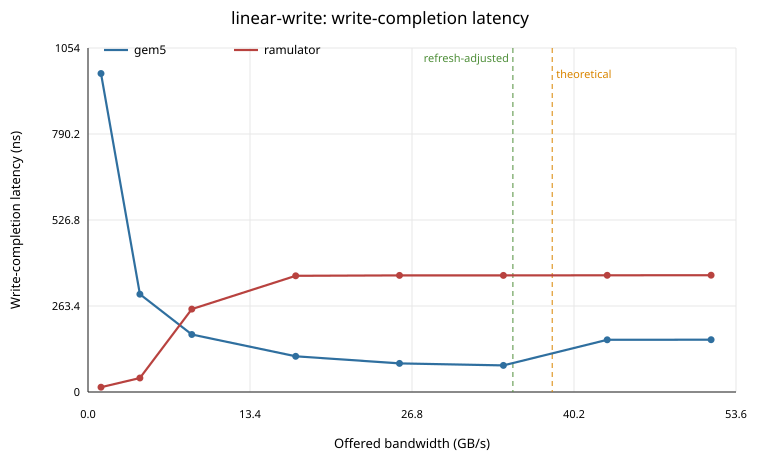
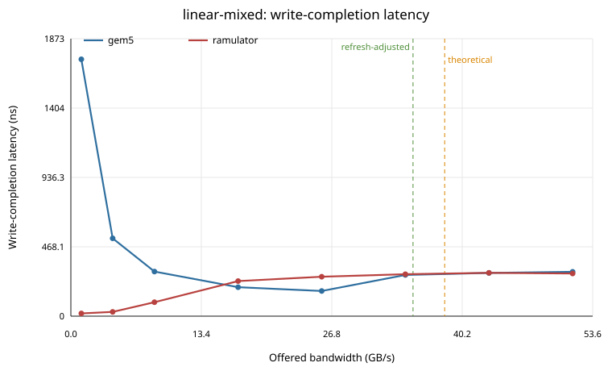
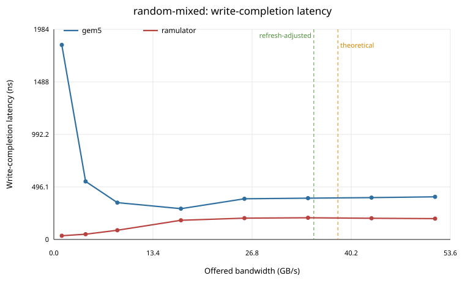

# DDR5-4800 Native gem5 vs Ramulator2

This report compares native gem5 `MemCtrl`/`DRAMInterface` against Ramulator2 v2.1 through the same cacheless TrafficGen path.

## Device Under Test

| Parameter | Value |
| --- | --- |
| Standard | DDR5-4800AN-style |
| Channels | 2 independent 32-bit channels |
| Ranks | 1 rank per channel |
| Devices | 4 x8 devices per rank |
| Device density | 16Gb |
| Total capacity | 16GiB |
| Burst | BL16, 64-byte transaction per channel |
| Banks | 8 bank groups x 4 banks = 32 banks/rank |
| tCK | 0.416ns |
| Peak bandwidth | 38.4 GB/s |
| Refresh-adjusted sanity line | 35.14 GB/s |

The Ramulator2 backend uses `DDR5_16Gb_x8` and `DDR5_4800AN`. The native gem5 backend uses a matching custom `DDR5_4800_4x8_16GiB` interface in the testbench.

## Methodology

This section describes what every measurement in the report means. The intent is to compare two memory backends under the same requestor-visible workload, while avoiding the common mistake of measuring an idle latency or a core/cache statistic and treating it as loaded DRAM latency.

### Test Topology

Every run uses the same cacheless path:

```text
TrafficGen -> SystemXBar/NoCache -> memory backend
```

The memory backend is either native gem5 `MemCtrl` plus a custom `DDR5_4800_4x8_16GiB` `DRAMInterface`, or the new Ramulator2 SimObject configured with Ramulator2's `DDR5_16Gb_x8` organization and `DDR5_4800AN` timing preset. Both backends expose the same 16GiB address range and the same two 32-bit DDR5 channel topology.

### Units and Primary Metrics

- Offered rates are specified in binary `GiB/s` on the command line because gem5's rate parser uses binary suffixes.
- Reported bandwidth is decimal `GB/s` from completed TrafficGen responses. This is the used bandwidth observed by the requestor, not the requested injection rate.
- Reported latency is requestor-visible send-to-response latency for completed requests, converted from gem5 ticks to ns.
- Ramulator2 backend-local counters are recorded separately and used only as sanity checks. The tables compare the same TrafficGen response counters for both backends.

### Reference Bandwidth Lines

The SVG plots include two vertical reference lines when the x-axis is a bandwidth axis.

- `theoretical` is the raw bus-rate limit: two 32-bit channels at 4800 MT/s, or `2 x 32 bits x 4800e6 / 8 = 38.4 GB/s`. It assumes every transfer slot carries useful data and ignores refresh, turnaround, command scheduling, row misses, and queue effects.
- `refresh-adjusted` is a DDR5 sanity upper bound that removes the time lost to periodic all-bank refresh. It uses `38.4 GB/s x (1 - (tRTP + tRP + tRFC + tRCD) / tREFI)`, with `tRTP=7.488ns`, `tRP=14.144ns`, `tRFC=295ns`, `tRCD=14.144ns`, and `tREFI=3900ns`, giving 35.14 GB/s.
- These lines are sanity references, not pass/fail thresholds. In offered-load plots they mark where the requested traffic reaches the nominal device limit. In bandwidth-latency curve plots they mark the used stream bandwidth that would correspond to those limits.

### Standard Sweeps

The standard plots use one TrafficGen requestor to sweep offered load over a fixed address range and record completed bandwidth and average request latency.

- `linear-read`: sequential cache-line reads. This favors row-buffer locality and should approach the best read bandwidth.
- `linear-write`: sequential cache-line writes. This stresses write timing, write queueing, and write-drain policy.
- `linear-mixed`: sequential traffic with a 50/50 read/write mix.
- `random-read`: random cache-line reads over the address range. This intentionally destroys most row locality.
- `random-mixed`: random traffic with a 50/50 read/write mix.

For these plots, the x-axis is offered bandwidth and the y-axis is either completed bandwidth or average latency. A flat completed bandwidth curve at high offered load indicates saturation or back-pressure. Rising latency indicates queueing inside the memory system or interconnect path.

### Probe-Stream Curves

`probe-stream-read` and `probe-stream-mixed` are the hockey-stick latency-bandwidth measurements. They use separate requestors so the stream traffic creates load while an independent random-read probe measures loaded latency.

- The stream requestor uses gem5's DRAM-aware TrafficGen primitive. It issues short row-hit bursts and rotates across all 32 banks, which is closer to the paper's requirement that stream requests exploit bank-group and bank-level parallelism.
- The probe requestor always issues random reads with `max_outstanding_reqs = 1`. This keeps the probe latency from being hidden by multiple in-flight probe requests.
- `probe-stream-read` uses a 100% read stream plus the random-read probe.
- `probe-stream-mixed` uses a 50/50 read/write stream plus the same random-read probe.
- The curve x-axis is completed stream bandwidth only. The probe's small bandwidth is excluded from the x-axis so the curve shows how background stream load affects random-read latency.
- The curve y-axis is the probe requestor's read latency. This is the loaded latency measurement; it should rise when the memory system queues requests near saturation.

These curves are the closest match to the methodology criticized in `docs/ramulator-paper/source`: load the memory with stream traffic, measure random-read probe latency, and sanity-check against the theoretical and refresh-adjusted bandwidth limits.

### Write Latency: Posted Writes on Both Backends

Both backends now treat writes as **posted**: the requestor is acknowledged as soon as the write is accepted into the write buffer, and the write drains to DRAM asynchronously. This makes requestor-visible write back-pressure symmetric -- the requestor stalls only when the write buffer is full -- so the same metric means the same thing on both sides.

- Native gem5 `MemCtrl` posts writes by design: `addToWriteQueue()` responds to the requestor the instant the write is accepted into the write buffer, adding only the static `frontendLatency` (`accessAndRespond(pkt, frontendLatency, ...)` in `src/mem/mem_ctrl.cc`).
- The Ramulator2 backend originally responded only on DRAM completion, which throttled the requestor by completion latency rather than write-buffer occupancy. It now posts writes too (the `post_writes` parameter, default on): on a successful enqueue it acknowledges the requestor after `write_frontend_latency` (matched to gem5's `static_frontend_latency`) and uses Ramulator2's own buffer-full signal for back-pressure, exactly like gem5. The write still drains to DRAM asynchronously inside Ramulator2.
- gem5 reads, and Ramulator2 reads, both respond at DRAM completion (`readyTime` plus `frontendLatency + backendLatency` for gem5), so read bandwidth and latency are directly comparable. With posted writes the requestor-visible write latency is the posted ack on both backends -- a low, near-constant number that is **not** a real write latency. Use the write-completion latency below for real write timing.

### Write-Completion Latency (controller-honest)

Because both backends post writes, neither one's requestor-visible write latency reflects the real DRAM write. The report therefore reads a write-completion latency from each backend's internal enqueue-to-commit counter, independent of when the requestor was acknowledged.

- For gem5 this is `requestorWriteTotalLat / requestorWriteAccesses`, summed across both channel controllers. `MemCtrl::doBurstAccess` accumulates `readyTime - entryTime` (enqueue to DRAM-ready) into `requestorWriteTotalLat`.
- For Ramulator2 the wrapper records the enqueue tick of each write and, in the DRAM-completion callback, accumulates `curTick() - enqueueTick` into `totalWriteCompletionLatency` with `writeCompletions` as the count -- the direct analogue of gem5's counter.
- This view exposes real controller behavior the posted-write metric hides. gem5's write-drain policy batches writes, so at low offered load a write can sit in the buffer until the drain threshold is reached (high enqueue-to-commit latency), dropping as load rises. Ramulator2 drains promptly at low load and climbs toward its write service limit under load.

### Known Interpretation Limits

The native gem5 and Ramulator2 models are not identical controller implementations. With posted writes the requestor-visible write back-pressure mechanism now matches (buffer-full stall on both), so the residual write-bandwidth gap reflects a genuine difference in sustained DRAM write-drain rate, not a measurement artifact: gem5's `MemCtrl` write-drain policy and Ramulator2's `GenericDDR` scheduler batch and pipeline writes differently. Read-heavy bandwidth and probe-stream peak bandwidth remain the most directly comparable measurements.

## External Context

- The local `docs/ramulator-paper` source and the public [DDR5-4800AN Ramulator2 latency-bandwidth figure](https://www.researchgate.net/figure/Latency-bandwidth-curves-for-DDR5-4800AN-in-Ramulator-20-using-the-Mess-Request_fig2_396692751) describe the same measurement discipline: generate streaming load, measure only random read probe latency, and sanity check against theoretical and refresh-adjusted DDR5 bandwidth.
- The [Mess benchmark project](https://memory.bsc.es/tools/mess-benchmark) describes curve construction by varying traffic intensity and read/write ratio; the [MICRO 2024 paper](https://arxiv.org/abs/2405.10170) uses bandwidth-latency curves across DDR4, DDR5, HBM, and CXL systems.
- Public DDR5 references are not directly comparable to this cacheless two-subchannel simulator setup, but they are useful scale checks: [PassMark's live DDR5 latency chart](https://www.memorybenchmark.net/latency_ddr5.html) shows DDR5 system latencies in the tens of ns, while DDR5-4800 bandwidth [tables](https://www.computerbase.de/artikel/arbeitsspeicher/ddr5-arbeitsspeicher-bandbreiten-latenzen.80697/) report 38.4 GB/s for a 64-bit DIMM-equivalent interface. This testbench models the same aggregate width as two 32-bit subchannels.

## Plots











## Peak Achieved Bandwidth

`Latency ns` here is the requestor-visible send-to-response latency. For write-bearing patterns on gem5 this reflects the posted (early) write acknowledgement, not real write latency -- see the Write Completion Latency table.

| Pattern | Backend | Peak GB/s | Rate | Latency ns | Host s |
|---|---|---:|---|---:|---:|
| linear-read | gem5 | 35.297 | 48GiB/s | 141.7 | 0.020 |
| linear-read | ramulator | 33.821 | 48GiB/s | 143.2 | 0.060 |
| linear-write | gem5 | 35.238 | 48GiB/s | 16.4 | 0.020 |
| linear-write | ramulator | 11.487 | 48GiB/s | 17.6 | 0.050 |
| linear-mixed | gem5 | 27.136 | 48GiB/s | 109.1 | 0.020 |
| linear-mixed | ramulator | 15.760 | 32GiB/s | 198.9 | 0.040 |
| random-read | gem5 | 22.464 | 32GiB/s | 171.1 | 0.030 |
| random-read | ramulator | 23.279 | 48GiB/s | 176.7 | 0.060 |
| random-mixed | gem5 | 19.294 | 48GiB/s | 125.2 | 0.030 |
| random-mixed | ramulator | 22.415 | 32GiB/s | 149.6 | 0.060 |

## Low-Load Latency

`Write resp ns` is the requestor-visible write latency. Both backends post writes, so this is the posted write-buffer acknowledgement on both -- a low number, not a real write latency. `Write commit ns` is the backend-honest write-completion latency (enqueue to DRAM commit) and is the column to compare across backends.

| Pattern | Backend | Avg ns | Read ns | Write resp ns | Write commit ns |
|---|---|---:|---:|---:|---:|
| linear-read | gem5 | 67.2 | 67.2 | n/a | n/a |
| linear-read | ramulator | 34.8 | 34.8 | n/a | n/a |
| linear-write | gem5 | 14.8 | n/a | 14.8 | 975.6 |
| linear-write | ramulator | 14.8 | n/a | 14.8 | 14.8 |
| linear-mixed | gem5 | 36.2 | 61.3 | 14.8 | 1733.8 |
| linear-mixed | ramulator | 21.9 | 30.3 | 14.8 | 18.6 |
| random-read | gem5 | 73.5 | 73.5 | n/a | n/a |
| random-read | ramulator | 54.1 | 54.1 | n/a | n/a |
| random-mixed | gem5 | 44.5 | 74.7 | 14.8 | 1837.4 |
| random-mixed | ramulator | 32.7 | 51.0 | 14.8 | 35.4 |

## Write Completion Latency

Backend-honest write latency measured at DRAM commit from each backend's internal enqueue-to-commit counter (gem5: `requestorWriteAvgLat`; Ramulator2: `avgWriteCompletionLatency`). `Posted resp ns` is the requestor-visible posted acknowledgement shown for contrast -- it is the early write-buffer ack on both backends, not a real write latency.

| Pattern | Backend | Low-load commit ns | Peak-load commit ns | Posted resp ns |
|---|---|---:|---:|---:|
| linear-write | gem5 | 975.6 | 160.2 | 16.4 |
| linear-write | ramulator | 14.8 | 357.8 | 17.6 |
| linear-mixed | gem5 | 1733.8 | 299.5 | 16.8 |
| linear-mixed | ramulator | 18.6 | 287.9 | 8.2 |
| random-mixed | gem5 | 1837.4 | 402.5 | 18.9 |
| random-mixed | ramulator | 35.4 | 196.9 | 8.2 |

## Hockey-Stick Curve Summary

| Pattern | Backend | Max stream GB/s | Probe latency at max ns | Low-load probe ns |
|---|---|---:|---:|---:|
| probe-stream-read | gem5 | 28.919 | 226.4 | 119.7 |
| probe-stream-read | ramulator | 30.349 | 136.8 | 51.5 |
| probe-stream-mixed | gem5 | 23.330 | 298.0 | 125.1 |
| probe-stream-mixed | ramulator | 22.679 | 332.7 | 53.4 |

## Backend-Local Ramulator2 Sanity Counters

| Pattern | Peak Ramulator2 GB/s | Avg read latency ns | Row-hit rate |
|---|---:|---:|---:|
| linear-read | 33.847 | 138.0 | 0.982 |
| linear-write | 11.352 | n/a | 0.979 |
| linear-mixed | 15.745 | 379.5 | 0.980 |
| random-read | 23.298 | 171.3 | 0.000 |
| random-mixed | 22.308 | 285.1 | 0.000 |
| probe-stream-read | 31.161 | 115.2 | 0.539 |
| probe-stream-mixed | 23.008 | 222.5 | 0.562 |

## Interpretation

- `linear-write` peak bandwidth differs substantially (35.24 GB/s gem5 vs 11.49 GB/s Ramulator2). Both backends post writes, so the requestor-visible write back-pressure mechanism is now the same (stall only when the write buffer is full). The remaining gap is a genuine difference in sustained DRAM write-drain rate between gem5's `MemCtrl` write-drain policy and Ramulator2's `GenericDDR` scheduler, not a measurement artifact. See the Write Completion Latency table for the backend-honest write timing.
- `linear-mixed` peak bandwidth differs substantially (27.14 GB/s gem5 vs 15.76 GB/s Ramulator2). Both backends post writes, so the requestor-visible write back-pressure mechanism is now the same (stall only when the write buffer is full). The remaining gap is a genuine difference in sustained DRAM write-drain rate between gem5's `MemCtrl` write-drain policy and Ramulator2's `GenericDDR` scheduler, not a measurement artifact. See the Write Completion Latency table for the backend-honest write timing.
- `probe-stream-read` peak stream bandwidth agrees within 4.7% between backends.
- `probe-stream-mixed` peak stream bandwidth agrees within 2.8% between backends.
- Native gem5 includes explicit fixed frontend/backend controller latencies. Ramulator2 reports lower backend-local read latency in cycles, but the report's primary read latency is the same TrafficGen requestor-visible send-to-response metric for both backends. Writes are posted on both backends, so their real timing comes from each backend's internal enqueue-to-commit counter (see Write Completion Latency), not the requestor-visible posted ack.
- The refresh-adjusted line is a sanity bound, not a pass/fail criterion. TrafficGen request timing, queue back-pressure, write turnaround, and row locality can keep achieved bandwidth below it.

## Reproduction

```sh
git clone --branch v2.1 --depth 1 https://github.com/CMU-SAFARI/ramulator2.git ext/ramulator2/ramulator2
cmake -S ext/ramulator2/ramulator2 -B ext/ramulator2/ramulator2/build -DRAMULATOR_PYTHON_BINDINGS=OFF
cmake --build ext/ramulator2/ramulator2/build -j
scons build/RISCV/gem5.opt -j6
python3 util/trafficgen_memory_sweep/run_trafficgen_ddr5_sweep.py
```
