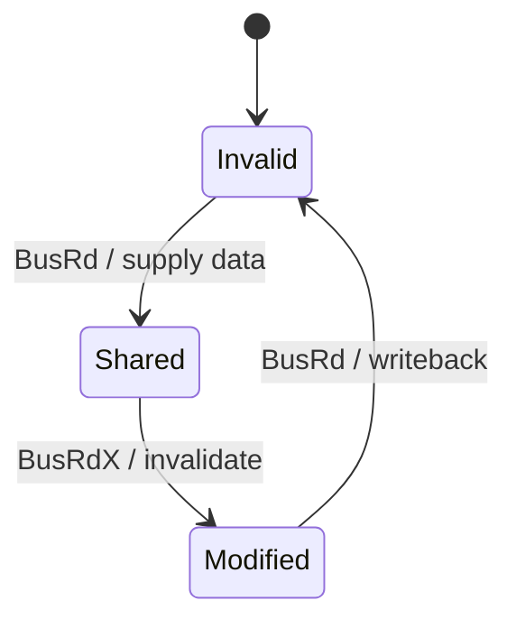

# How to Write an Exceptional EECS Textbook
*A practical, high-signal guideline for clarity, engagement, and rigor*

## Target Format

This book is authored in **Markdown** and rendered to HTML/PDF via standard
Markdown toolchains (e.g. mdBook, Pandoc, MkDocs).

### Graphics

All illustrations must be inline and reproducible from source:

- **Architecture diagrams, flowcharts, state machines, sequences** -- use
  fenced Mermaid blocks (` ```mermaid `). Mermaid is supported natively by
  GitHub, mdBook, and most Markdown renderers.
- **Cycle-by-cycle timelines, pipeline diagrams, memory layouts, small tables**
  -- use ASCII art inside fenced code blocks (` ``` `). ASCII art is
  universally portable and diff-friendly.
- **When to prefer which:**
  - Mermaid when the diagram has *structure* (nodes, edges, states, sequences).
  - ASCII when the diagram is *spatial/tabular* (pipeline slots, bit fields,
    cache-line layouts, timing waveforms).
- No external image files (PNG, SVG, etc.) unless absolutely unavoidable (e.g.
  photographs of real hardware). If an external image is required, place it in
  an `images/` subdirectory relative to the chapter and reference it with a
  relative path.

### Markdown Conventions

- Use ATX-style headings (`#`, `##`, ...).
- One sentence per line (semantic line breaks) to produce clean diffs.
- Fenced code blocks with language tags (` ```cpp `, ` ```python `,
  ` ```mermaid `, etc.).
- Footnotes via `[^1]` syntax where supported; otherwise use inline
  parenthetical citations.
- Math via `$...$` (inline) and `$$...$$` (display) LaTeX notation.

---

## 0. Philosophy (Read This First)

An EECS textbook is not a document -- it is a **cognitive interface**.

Your job is not to “cover material.”
Your job is to **build mental models that survive real-world complexity**.

> A good textbook answers questions.
> A great textbook **changes how the reader thinks about systems**.

---

## 1. Chapter Opening: Motivation Before Formalism

### Rule
Start every chapter with a **problem, failure, or real system scenario**.

### Do:
- “Your CPU just stalled for 200 cycles waiting on memory.”
- “Why does your GPU have 64K threads but still underutilizes ALUs?”
- “Why do distributed systems need consensus at all?”

### Don’t:
- Start with definitions, taxonomies, or equations.

### Structure
1. **Concrete scenario**
2. **Pain point**
3. **Why it matters**
4. **What this chapter will unlock**

> The reader should *want* the abstraction before you introduce it.

---

## 2. Three-Layer Abstraction Model (Mandatory)

Every concept must be presented in **three explicit layers**:

### Layer 1 — Intuition
- Diagrams, analogies, simplified behavior
- “What does it do?”
- No heavy notation

### Layer 2 — Working Model
- Enough detail to:
    - Predict behavior
    - Do back-of-envelope calculations
    - Implement a simplified version

### Layer 3 — Formal Model
- Precise definitions, equations, specs
- Corner cases, invariants, proofs

### Requirements
- Label layers clearly (`Intuition`, `Working Model`, `Formal`)
- Allow skipping layers without losing continuity

> Most textbooks jump straight to Layer 3. Don’t.

---

## 3. Running System (Spine of the Book)

### Rule
Use a **single evolving system** across chapters.

### Example progression:
- Chapter 3: Single-cycle CPU
- Chapter 4: Pipeline
- Chapter 5: Hazards
- Chapter 6: Caches
- Chapter 7: Coherence
- Chapter 8: NoC / memory system

### Why it matters:
- Reduces cognitive fragmentation
- Builds a **continuous mental scaffold**

> New concepts should *attach*, not reset context.

---

## 4. Visual-First Communication

### Every key concept must have:
- A diagram **before** text
- Then explanation
- Then formalization

### Preferred visuals (Markdown-native):
- Pipelines, timelines, bit-field layouts -- **ASCII art** in fenced code blocks
- Dataflow, block diagrams -- **Mermaid `graph`** or **`flowchart`**
- State machines -- **Mermaid `stateDiagram-v2`**
- Sequences / protocol transactions -- **Mermaid `sequenceDiagram`**
- Comparisons -- **Markdown tables**

### Example -- Mermaid state diagram:



### Example -- ASCII pipeline timeline:

```
Cycle   1    2    3    4    5    6    7
Instr1  IF   ID   EX   MEM  WB
Instr2       IF   ID   EX   MEM  WB
Instr3            IF   ID   EX   MEM  WB
```

### Anti-pattern:
- 2 pages of text describing what a diagram could show in 10 seconds
- External bitmap images when Mermaid or ASCII would suffice

> EECS is spatial + temporal. Text alone is insufficient.

---

## 5. Execution Semantics (Make It Simulatable)

For every mechanism, answer:

- Inputs?
- Internal state?
- Step-by-step transformation?
- Outputs?

### Include:
- Cycle-by-cycle traces (ASCII timeline tables)
- Event sequences (Mermaid `sequenceDiagram`)
- Timing diagrams (ASCII waveforms or Mermaid `sequenceDiagram` with notes)

> The reader should be able to **simulate it in their head**.

---

## 6. Pair Mechanism with Failure Modes

### Rule
Every “how it works” must be immediately followed by:

- “What can go wrong”
- “Where it breaks”
- “Why naive intuition fails”

### Examples:
- Locks -- race conditions
- Caches -- coherence violations
- Pipelines -- hazards
- NoCs -- deadlock

### Why:
- Boundaries define understanding
- Bugs are memorable -- learning sticks

---

## 7. Separate Core vs Optional Content

### Use clear visual distinction:
- Core content -- main flow
- Optional:
    - Historical notes
    - Advanced optimizations
    - Implementation anecdotes

### Techniques in Markdown:
- Blockquote callouts with bold labels (e.g. `> **Deep Dive:** ...`)
- Collapsible `<details>` / `<summary>` sections for lengthy optional material
- Explicit labels: `Optional`, `Deep Dive`, `Advanced`

### Goal:
- Enable **fast exam prep**
- Preserve **depth for curious readers**

---

## 8. Teach Tradeoffs Explicitly

Every concept must include:

- What it does
- Why it exists
- Alternatives
- Tradeoffs:
    - Latency
    - Throughput
    - Area
    - Complexity
    - Power

### Anti-pattern:
- Presenting designs as “the way it is”

> Engineering is about **tradeoffs**, not truths.

---

## 9. Exercises: Force Transfer, Not Recall

### Bad:
- “List the stages of a pipeline”

### Good:
- “You add a 3-cycle instruction — what breaks?”
- “This system deadlocks — why?”
- “Modify design to support X”

### Include:
- Quick checks (answers inline)
- Deep problems (answers separated)

### Goal:
- Apply model to **new situations**

---

## 10. Consistent Notation (Non-Negotiable)

### Rules:
- Define once, reuse everywhere
- No synonyms for same concept
- No overloaded terms without clarification

### Include:
- Glossary
- Notation table
- Naming conventions

### Example:
- “block” vs “line” vs “frame” -- pick one

> Inconsistency = cognitive tax.

---

## 11. “How We Know This” Sections

### Include short sections explaining:
- Measurement methodology
- Key experiments
- Foundational papers

### Example:
- How cache latency was measured
- How branch prediction accuracy is evaluated

### Benefits:
- Builds scientific thinking
- Makes claims verifiable
- Prevents cargo-cult knowledge

---

## 12. Accuracy Discipline

### Requirements:
- Cite primary sources:
    - ISA manuals
    - Architecture papers
    - RFCs

- Pin quantitative claims:
    - Bad: “L1 ~1ns”
    - Good: “Intel Skylake L1d latency = 4-5 cycles (Agner Fog, 2017)”

### Process:
- Expert review per chapter
- Cross-check against real systems

> Textbooks often copy each other’s errors. Don’t.

---

## 13. Progressive Complexity

### Structure topics as:
1. Minimal working version
2. Add realism
3. Add optimizations
4. Add edge cases

### Example:
- Cache:
    - Direct-mapped -- set-associative -- replacement -- coherence

> Build systems incrementally, like real engineering.

---

## 14. Reality Anchors

Continuously connect theory to:
- Real CPUs (x86, ARM, RISC-V)
- GPUs (NVIDIA SM, AMD CU)
- Interconnects (AMBA CHI, TileLink)

### Purpose:
- Ground abstractions
- Maintain credibility

---

## 15. Paragraph and Layout Discipline

### Rules:
- One idea per paragraph
- Short paragraphs (3–5 lines)
- Frequent subheadings
- Generous whitespace

### Goal:
- Scannability
- Fast lookup
- Reduced cognitive load

---

## 16. Chapter Ending = Compression

End each chapter with:

- Key ideas (bullet list)
- 1-page mental model
- Common misconceptions
- “If you remember one thing…”

> This is what sticks after a week.

---

## 17. Golden Questions (Every Section Must Answer)

- What problem does this solve?
- How does it work step-by-step?
- What guarantees does it provide?
- What breaks if assumptions fail?
- What are the tradeoffs?

If a section doesn’t answer these -- rewrite it.

---

## 18. Style of Writing

### Prefer:
- Concrete -- abstract
- Active voice
- Precise language

### Avoid:
- Vague generalizations
- Unmotivated definitions
- “Magic happens here” explanations

---

## 19. What Makes a Book “Great”

A great EECS textbook:

- Feels like **debugging a system**, not reading theory
- Builds **intuition first, rigor second**
- Makes the reader **predict behavior**, not memorize facts
- Shows **failures, not just success paths**
- Connects ideas into a **coherent system**

---

## Final Principle

> Teach systems the way they exist in reality:
> **messy, constrained, full of tradeoffs — but understandable.**