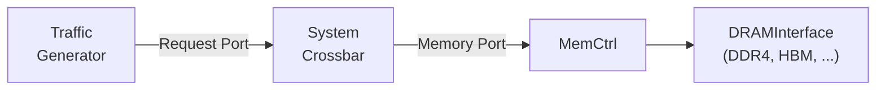

# Chapter 1: Why Memory Dominates the Story

> *The core is fast until the first long-latency miss turns the machine into a queueing problem.*

## Contents

- [1.1 The Motivation: A Core That Cannot Hide Its Misses](#11-the-motivation-a-core-that-cannot-hide-its-misses)
- [1.2 The Laboratory: Traffic Generators Without a CPU](#12-the-laboratory-traffic-generators-without-a-cpu)
- [1.3 The Running System: Generator to DDR4](#13-the-running-system-generator-to-ddr4)
- [1.4 What Happens Under Load: Queueing Changes Everything](#14-what-happens-under-load-queueing-changes-everything)
- [1.5 What the Access Pattern Reveals](#15-what-the-access-pattern-reveals)
- [1.6 GUPS: The Stress Test for Random Access](#16-gups-the-stress-test-for-random-access)
- [1.7 Failure Modes: Where Naive Intuition Breaks](#17-failure-modes-where-naive-intuition-breaks)
- [1.8 How We Know This](#18-how-we-know-this)
- [1.9 Experiment: Your First Memory-Only Run](#19-experiment-your-first-memory-only-run)
- [1.10 Tradeoffs: Design Choices in the Memory Path](#110-tradeoffs-design-choices-in-the-memory-path)
- [Key Ideas](#key-ideas)
- [1-Page Mental Model](#1-page-mental-model)
- [Common Misconceptions](#common-misconceptions)
- [If You Remember One Thing](#if-you-remember-one-thing)
- [Exercises](#exercises)

---

You have a 2 GHz out-of-order core.
It retires four instructions per cycle when the data is in L1.
Then a pointer-chasing workload hits main memory and the core stalls for 200+ cycles per miss.
IPC drops from 4.0 to 0.3.

The core did not slow down.
The memory system revealed the bottleneck the core had previously been hiding.

This chapter builds that intuition with gem5's traffic generators, strips away the CPU entirely, and shows how memory-side service time and queueing dominate throughput and latency in this no-cache setup.
By the end you will run a memory-only experiment, read the statistics it produces, and understand why queueing and service-time variance matter before coherence, caches, or protocols enter the picture.

**Primary code anchors:**
- [`tests/gem5/traffic_gen/configs/simple_traffic_run.py`](../tests/gem5/traffic_gen/configs/simple_traffic_run.py)
- [`configs/example/gem5_library/memory_traffic.py`](../configs/example/gem5_library/memory_traffic.py)
- [`src/python/gem5/components/cachehierarchies/classic/no_cache.py`](../src/python/gem5/components/cachehierarchies/classic/no_cache.py)

**Runnable artifacts:**
- `LinearGenerator`, `RandomGenerator`, `GUPSGenerator`, `GUPSGeneratorEP`, and `GUPSGeneratorPAR` from the traffic-generator harness.

**Chapter map:**
1. Start with one core that cannot hide a long memory miss.
2. Remove the CPU so the memory path becomes a controlled laboratory.
3. Build one minimal generator-to-DDR4 system and separate unloaded service time from queueing delay.
4. Compare linear, random, and GUPS-style traffic so you can predict what the first experiment should show.

---

## 1.1 The Motivation: A Core That Cannot Hide Its Misses

### Intuition

Think of a fast cook (the CPU) and a slow pantry (memory).
The cook can plate a dish every 10 seconds — if the ingredients are on the counter.
The moment the cook needs something from the pantry, they walk 60 seconds there and back.
No matter how fast the cook's hands are, the throughput is now gated by pantry trips.

Caches are a small shelf next to the stove: they help, but only for ingredients the cook already fetched recently.
The interesting question is always: *what happens when the shelf does not have what we need?*

```
        Time (cycles) ──────────────────────────────────────────────▶

        0        10                                    210       220
        ├────────┤                                      ├────────┤
 Core   ██ work ██▓▓▓▓▓▓▓▓▓▓▓▓▓▓▓▓ stall ▓▓▓▓▓▓▓▓▓▓▓▓▓▓██  work ██ ...
                  │                                     │
                  │◀──── L1 miss: DRAM round-trip  ────▶│
                  │          ~200 cycles                │
                  │                                     │
                  ▼                                     ▼
 DRAM             [activate row] [read column] [transfer]
                      tRCD          tCL          tBURST

 Utilization:  work / (work + stall)    =   10 / (10 + 200)  ≈  5%
               └─ 95% of the time, the core is waiting on memory ─┘
```

A core that issues one long-latency miss every 10 instructions spends 95% of its time waiting.
This is not a pathological case — it is pointer chasing, graph traversal, hash-table lookup, or any access pattern with low spatial and temporal locality.

### Working Model

The arithmetic is simple if we model the exposed cost of a demand access.
Let $T_{\text{hit}}$ be the L1 hit latency (say 1 cycle), $T_{\text{miss}}$ the DRAM round-trip latency (say 200 cycles), and $r$ the miss rate.

$$T_{\text{avg}} = (1 - r) \cdot T_{\text{hit}} + r \cdot T_{\text{miss}}$$

At $r = 0.01$ (1% miss rate):

$$T_{\text{avg}} = 0.99 \times 1 + 0.01 \times 200 = 2.99 \text{ cycles}$$

The average exposed memory-access cost nearly tripled from a 1% miss rate.
In a load-dependent loop, that extra cost shows up almost directly as CPI growth.
At $r = 0.05$, $T_{\text{avg}} = 10.95$ cycles — memory stalls now dominate the execution time.

But average latency is the *beginning* of the story, not the end.
Under load, requests queue behind each other and contend for shared DRAM resources.
The real question is not "what is the latency of one miss?" but "what is the latency of my miss when 15 other requests are already in the queue?"

### Formal and Code

gem5 measures this at multiple layers.
`BaseTrafficGen` reports the end-to-end latency seen by the generator.
Inside the DRAM model, the `DRAMInterface` statistics ([`src/mem/dram_interface.cc`](../src/mem/dram_interface.cc)) decompose each **read** into three latency components:

| Component | Meaning | Stat name |
|-----------|---------|-----------|
| Queue latency | Time waiting in the controller's read/write queue | `totQLat` |
| Bus latency | Data transfer time on the DRAM bus | `totBusLat` |
| Total access latency | Queue + command + transfer | `totMemAccLat` |

The DRAM interface also reports row-buffer hit rates (`readRowHitRate`, `writeRowHitRate`), per-bank burst counts (`perBankRdBursts`), and bus utilization (`busUtil`).
These DRAM-side statistics explain *why* the generator-visible latency moved.

> **Deep Dive:** The full statistics breakdown includes per-rank power-state tracking, command-window utilization, and read-to-write turnaround counts.
> We return to these in Chapter 14 when we study the DRAM controller in detail.

---

## 1.2 The Laboratory: Traffic Generators Without a CPU

### Intuition

To study the memory system in isolation, we remove the CPU entirely.
We do this not because the CPU is unimportant, but because the CPU mixes many effects together: out-of-order overlap, branch behavior, cache hits, and miss handling.
If you want to learn where memory latency comes from, the cleanest first move is to remove everything that can hide it.
gem5's traffic generators are synthetic request sources: they inject reads and writes at controlled addresses and rates, with no instruction fetch, no branch prediction, no pipeline.

This is the equivalent of a network engineer testing a switch with a packet generator before connecting real hosts.
You would never debug a switch under production traffic first — you start with controlled, reproducible patterns.



The system has three components:
1. A **traffic generator** that produces memory requests at a specified rate and pattern.
2. A **crossbar** (or direct connection) that routes requests to the correct memory channel.
3. A **memory controller** with a DRAM timing model that services requests subject to bank conflicts, row-buffer state, and bus contention.

No caches. No coherence. Just requests and a memory model.

### Working Model

For this chapter, it is useful to think in terms of three access-pattern families, exposed by five generator names in the harness:

| Generator | Pattern | What it stresses |
|-----------|---------|------------------|
| `LinearGenerator` | Sequential addresses, wrapping at end of range | Row-buffer locality, streaming bandwidth |
| `RandomGenerator` | Uniform random addresses within range | Bank conflicts, row-buffer misses |
| `GUPSGenerator` | Single-core pseudo-random table updates | Poor locality, random-access latency |
| `GUPSGeneratorEP` | Multi-core pseudo-random updates to disjoint table slices | Scale-out without inter-core table contention |
| `GUPSGeneratorPAR` | Multi-core pseudo-random updates to one shared table | Shared-controller contention |

At the generator-object level, linear and random traffic are parameterized by knobs such as:
- **Rate** — target injection bandwidth (e.g., 40 GiB/s)
- **Duration** — how long to run (e.g., 250 µs)
- **Read percentage** — mix of reads vs. writes (0–100%)
- **Block size** — transaction size (typically 64 B, one cache line)

The specific `simple_traffic_run.py` harness used in this chapter does **not** expose all of these knobs on the command line.
It hardcodes `duration="250us"` and `rate="40GiB/s"` for `LinearGenerator` and `RandomGenerator`, and it uses a fixed `update_limit=1000` for the GUPS variants.

The rate controls how fast requests are injected.
If the rate exceeds what the DRAM can sustain, requests queue up and latency rises — exactly the saturation effect we want to study.

### Formal and Code

The traffic generators are assembled in [`tests/gem5/traffic_gen/configs/simple_traffic_run.py`](../tests/gem5/traffic_gen/configs/simple_traffic_run.py).

**Generator creation** delegates to a factory:
- `LinearGenerator` wraps `LinearGeneratorCore`, which uses the C++ `PyTrafficGen` object with `createLinear()`.
  The core sweeps addresses sequentially from `startAddr` to `endAddr`, wrapping around, with a fixed inter-packet period computed from the target rate and block size in this harness.
- `RandomGenerator` wraps `RandomGeneratorCore`, which calls `createRandom()`.
  Each address is drawn uniformly at random and aligned to the block size.
- `GUPSGenerator`, `GUPSGeneratorEP`, and `GUPSGeneratorPAR` wrap `GUPSGeneratorCore`, which uses the C++ `GUPSGen` object.
  GUPS (**Giga Updates Per Second**) implements the [HPCC RandomAccess benchmark](https://icl.cs.utk.edu/projectsfiles/hpcc/RandomAccess/): read a random table entry, XOR it, write it back — the worst case for caches because every access misses.
  The three variants differ in how they divide the table across cores:
  - **`GUPSGenerator`** — single-core baseline.
  - **`GUPSGeneratorEP`** (Embarrassingly Parallel) — each core gets a *disjoint* slice of the table, so zero contention.
  - **`GUPSGeneratorPAR`** (Parallel) — all cores share the *same* table, generating coherence traffic and memory contention.

**System assembly** uses `TestBoard` to wire the generator to memory:

```python
board = TestBoard(
    clk_freq="3GHz",
    generator=generator,        # LinearGenerator, RandomGenerator, etc.
    memory=memory,              # e.g., SingleChannelDDR4_2400("1GiB")
    cache_hierarchy=NoCache(),  # Direct path to memory
)
```

When `NoCache` is selected, the hierarchy places a single `SystemXBar` (64-bit width) between the generator and memory controller — the thinnest possible interconnect.
The code lives in [`src/python/gem5/components/cachehierarchies/classic/no_cache.py`](../src/python/gem5/components/cachehierarchies/classic/no_cache.py).

**Statistics** are collected by the C++ `BaseTrafficGen` class ([`src/cpu/testers/traffic_gen/base.hh`](../src/cpu/testers/traffic_gen/base.hh)):

| Stat | Type | Meaning |
|------|------|---------|
| `numPackets` | Counter | Total requests generated |
| `numRetries` | Counter | Backpressure events (queue full) |
| `retryTicks` | Counter | Total time stalled on retries |
| `bytesRead` / `bytesWritten` | Counter | Data volume |
| `totalReadLatency` / `totalWriteLatency` | Counter | Cumulative round-trip latency |
| `avgReadLatency` / `avgWriteLatency` | Formula | Mean latency per request |
| `readBW` / `writeBW` | Formula | Achieved bandwidth (B/s) |

These are your generator-visible instruments.
Every experiment in this book starts by reading these numbers, then pairing them with DRAM-side stats such as `totQLat`, `readRowHitRate`, and `busUtil` when you need an explanation.

---

## 1.3 The Running System: Generator to DDR4

Now that we have a laboratory, we need one concrete system and one baseline number.
The system tells us what objects are in the path.
The baseline tells us what latency looks like before queueing dominates.

This is the first incarnation of the running system that will evolve across every chapter.

```
Chapter 1 system:

  ┌─────────────┐     ┌───────────┐     ┌──────────┐     ┌──────────┐
  │  Linear or  │────▶│  System   │────▶│  MemCtrl │────▶│   DDR4   │
  │  Random Gen │     │  Crossbar │     │          │     │ 2400 8x8 │
  └─────────────┘     └───────────┘     └──────────┘     └──────────┘
       Request              64B               Read/Write       Banks,
       Port               width               Queues          Rows,
                                               FR-FCFS         Timing
```

> **Minimal DRAM vocabulary for this chapter:** A **channel** is one controller-to-memory path.
> A **rank** is one independently refreshed group of DRAM devices on that channel.
> A **bank** is one independently activated storage region inside a rank.
> A **row** is the slice currently opened inside a bank's row buffer.

**Memory device: DDR4-2400.**
The `SingleChannelDDR4_2400` helper uses [`src/python/gem5/components/memory/dram_interfaces/ddr4.py`](../src/python/gem5/components/memory/dram_interfaces/ddr4.py), class `DDR4_2400_8x8`, which specifies:

| Parameter | Value | Meaning |
|-----------|-------|---------|
| tCL (tRL) | 14.16 ns (17 clocks) | CAS read latency |
| tRCD | 14.16 ns | Row activate to column command |
| tRP | 14.16 ns | Row precharge |
| tRAS | 32 ns | Minimum row active time |
| Banks per rank | 16 | Parallelism within one rank |
| Bank groups | 4 | Same-group commands pay extra tCCD\_L |
| Ranks per channel | 2 | Additional parallelism |
| Burst length | 8 | 8 transfers per burst (BL8) |

**Unloaded no-hit service time** for an access that must precharge, activate, and read:

$$T_{\text{unloaded}} = t_{RP} + t_{RCD} + t_{RL} = 14.16 + 14.16 + 14.16 \approx 42.5 \text{ ns}$$

This is the DRAM-device timing floor for this pessimistic PRE + ACT + RD path.
It is not the same as the end-to-end latency reported by `avgReadLatency`.
In gem5, `MemCtrl` adds default `static_frontend_latency = 10 ns` and `static_backend_latency = 10 ns`, so even an unloaded run reports a higher observed latency.
Under load, queueing adds 2–10× on top of that observed baseline.

---

## 1.4 What Happens Under Load: Queueing Changes Everything

### Intuition

A single request to an idle DRAM sees ~42.5 ns latency.
Now imagine 16 requests arriving simultaneously, all targeting different rows in the same bank.
Only one can be served at a time.
The others queue, and each must wait for the previous request's row to close, a new row to open, and data to transfer.

```
Request   Arrive   Queue Wait   Service   Done
───────   ──────   ──────────   ───────   ────
  R1        0 ns      0 ns      42.5 ns    42.5 ns
  R2        0 ns     42.5 ns    42.5 ns    85.0 ns
  R3        0 ns     85.0 ns    42.5 ns   127.5 ns
  ...
  R16       0 ns    637.5 ns    42.5 ns   680.0 ns
```

Request R16 experiences 680 ns total latency — 16× the unloaded latency — even though the DRAM device itself did not slow down.
The latency came from queueing, not from the device.

This is the same effect you see in gem5 when you push the injection rate above what the memory can sustain.

### Working Model

The memory controller is a **queueing system** — the same kind of system you encounter at a grocery checkout or a network router.
Requests arrive, wait in a buffer if the controller is busy, and eventually get served.
The key insight from queueing theory is that *waiting time grows nonlinearly with utilization*: a system that is 50% busy barely makes you wait, but one that is 90% busy makes you wait a very long time.

We model the controller with three quantities:
- **Arrival rate** $\lambda$ — requests per second entering the controller.
- **Service rate** $\mu$ — requests per second the DRAM can complete (set by timing parameters like $t_{CAS}$, $t_{RCD}$, etc.).
- **Utilization** $\rho = \lambda / \mu$ — the fraction of time the controller is busy. $\rho = 0$ means idle, $\rho = 1$ means saturated.

When $\rho < 1$, the controller can keep up on average, but random clustering of arrivals still causes temporary queues.
When $\rho \geq 1$, requests arrive faster than they are served and the queue grows without bound.

A standard approximation for the average waiting time is the **M/D/1 formula** (Poisson arrivals, deterministic service, one server):

$$T_{\text{queue}} \approx \frac{\rho}{2\mu(1 - \rho)}$$

The $(1 - \rho)$ in the denominator is what creates the "hockey stick" — as utilization approaches 1, the denominator approaches 0 and latency explodes.

gem5's FR-FCFS DRAM controller is not literally an M/D/1 queue — it reorders requests and has multiple banks.
This formula is only a back-of-the-envelope model for the *shape* of the saturation curve, not an exact prediction.

Plugging in concrete numbers for intuition:
- At $\rho = 0.5$, the queue adds roughly **0.5 service times** — barely noticeable.
- At $\rho = 0.9$, it adds roughly **4.5 service times** — latency is now 5× the unloaded value.
- At $\rho = 0.99$, it adds roughly **49.5 service times** — the system is effectively stalled.

```
  Avg Latency
       │
  500  │                                          ╱
       │                                        ╱
  400  │                                      ╱
       │                                    ╱
  300  │                                  ╱
       │                               ╱
  200  │                           ╱╱
       │                       ╱╱
  100  │               ╱╱╱╱╱
       │     ╱╱╱╱╱╱╱╱
   42  │╱╱╱╱
       └──────────────────────────────────────▶
       0%    20%    40%    60%    80%   100%
                  Bus Utilization (ρ)
```

The curve is flat at low utilization and vertical near saturation.
This nonlinearity is why "average latency at low load" tells you almost nothing about behavior at high load.

### Formal and Code

gem5's memory controller implements **FR-FCFS** (First-Ready, First-Come-First-Served) scheduling by default.
This is not plain FIFO — it reorders requests to exploit row-buffer locality:

1. Requests to an already-open row (row hit) are prioritized over row misses.
2. Among row misses, requests to idle banks are preferred.
3. Among equal candidates, FCFS order breaks ties.

The scheduling logic lives in `DRAMInterface::chooseNextFRFCFS()` ([`src/mem/dram_interface.cc`](../src/mem/dram_interface.cc)).
For Chapter 1, keep one mental rule in mind: row hits tend to go first, requests that can be prepared soon come next, and the rest wait.
That is enough to explain why two runs with the same average injection rate can still behave differently.
The exact code contains more nuance, but the chapter-level takeaway is simple: service order depends on the *addresses* of all pending requests, not just arrival order.

> **Deep Dive:** The prioritization hierarchy in the code is more specific:
> 1. Seamless row-buffer hits (no extra timing penalty)
> 2. Requests to pre-activated rows
> 3. Earliest-available banks with preparation hidden behind other commands
> 4. Earliest possible access accounting for all bank-level delays

Two experiments with the same average injection rate but different address patterns will see different latencies — because FR-FCFS exploits row locality in one and not the other.

The controller also enforces **read/write switching** via `writeHighThreshold` and `writeLowThreshold`.
When the write queue fills to the high threshold, the controller drains writes until the low threshold, blocking reads.
This turnaround cost (`tRTW`, `tWTR`) adds latency that is invisible in single-request analysis.

> **Deep Dive:** FR-FCFS was originally proposed by Rixner et al. (2000) and remains the default in most simulators.
> Its key tradeoff: it improves throughput by exploiting row locality, but it can starve requests to cold rows when the queue is dominated by hits to a hot row.
> gem5 also implements plain FCFS (`enums::fcfs`) for comparison.

---

## 1.5 What the Access Pattern Reveals

Queueing explains why latency rises under load.
Access pattern explains why two runs at the same load can still look completely different.

### Intuition

The same DRAM device behaves very differently under linear and random traffic.
Linear access sweeps through consecutive addresses, hitting the same row repeatedly before moving to the next.
Random access jumps between rows, forcing a precharge-activate-read cycle on almost every request.

```
Linear access (high row-buffer hit rate):
  Row 0: ████████████████  (many hits, one activate)
  Row 1: ████████████████
  Row 2: ████████████████

Random access (low row-buffer hit rate):
  Row 7 → Row 2 → Row 15 → Row 0 → Row 9 → ...
  (frequent precharge/activate cycles, very few row hits)
```

### Working Model

For DDR4-2400, consider the per-request cost:

| Scenario | Row hit | No-hit with PRE + ACT + RD |
|----------|---------|----------------------------|
| Command sequence | RD | PRE + ACT + RD |
| Latency | $t_{CL}$ = 14.16 ns | $t_{RP} + t_{RCD} + t_{CL}$ ≈ 42.5 ns |

A workload with 90% row-buffer hits sees effective latency:

$$T_{\text{eff}} = 0.9 \times 14.16 + 0.1 \times 42.5 = 17.0 \text{ ns}$$

A workload with 5% row-buffer hits:

$$T_{\text{eff}} = 0.05 \times 14.16 + 0.95 \times 42.5 = 41.1 \text{ ns}$$

The random workload pays 2.4× more per request before queueing even enters the picture.
Under load the gap widens further because no-hit accesses occupy the bank longer, increasing contention.

### Formal and Code

In gem5's `LinearGen` ([`src/cpu/testers/traffic_gen/linear_gen.cc`](../src/cpu/testers/traffic_gen/linear_gen.cc)), the `getNextPacket()` method increments `nextAddr` by `blocksize` (64 B) each call and wraps at the end of the range.
A DDR4 row buffer is 8 KiB in this configuration (device row-buffer size × devices per rank = 1 KiB × 8 = 8 KiB for `DDR4_2400_8x8`).
A linear sweep through 8 KiB generates 128 consecutive row hits before the next activate — excellent row-buffer locality.

In `RandomGen` ([`src/cpu/testers/traffic_gen/random_gen.cc`](../src/cpu/testers/traffic_gen/random_gen.cc)), each address is drawn uniformly and aligned to `blocksize`.
With 16 banks × 2 ranks = 32 banks and many rows per bank, the probability of a row hit is approximately:

$$P(\text{hit}) \approx \frac{\text{row buffer size}}{\text{total address range per bank}}$$

For a 1 GiB address space across 32 banks, each bank covers 32 MiB, and the row buffer holds 8 KiB.
$P(\text{hit}) \approx 8 \text{ KiB} / 32 \text{ MiB} \approx 0.025\%$ — essentially zero.

The gem5 statistics `readRowHitRate` and `writeRowHitRate` report these percentages directly.
Comparing these stats between a `LinearGenerator` run and a `RandomGenerator` run is the simplest way to see the effect.

---

## 1.6 GUPS: The Stress Test for Random Access

`RandomGenerator` gives us a clean synthetic random stream.
GUPS is the next step: it still stresses poor locality, but now the requests form a simple read-modify-write workload instead of isolated reads.

### Intuition

The HPCC GUPS (Giga Updates Per Second) benchmark is a deliberately poor-locality workload for memory systems.
It allocates a large table (power-of-2 size) and performs pseudo-random read-modify-write operations to random locations.
Row hits are rare, row-buffer locality is intentionally weak, and the controller has little structure to exploit.

GUPS does not measure peak streaming bandwidth.
It measures random-update throughput when locality is intentionally poor.

### Working Model

The benchmark loop is conceptually:

```
table[random_index] ^= random_value
```

Each iteration requires:
1. A read to fetch `table[random_index]` — likely a no-hit access.
2. A write to store the XOR'd result — same address, so a row hit if the page is still open.

The benchmark rate is simply:

$$\text{GUPS} = \frac{\text{updates}}{\text{seconds}}$$

For this chapter, the important point is qualitative: GUPS is bounded by random-access service capacity rather than by peak sequential bandwidth.
A single channel can overlap work across many banks, but the achieved rate still depends on bank conflicts, refresh interference, bus turnaround penalties, and queueing.

### Formal and Code

gem5 provides three GUPS variants in [`src/python/gem5/components/processors/`](../src/python/gem5/components/processors/):

| Variant | Behavior | Use case |
|---------|----------|----------|
| `GUPSGenerator` | Single core, full table | Baseline random-access measurement |
| `GUPSGeneratorEP` | N cores, table partitioned (each core owns disjoint slice) | Embarrassingly parallel — no inter-core contention |
| `GUPSGeneratorPAR` | N cores, shared table | True parallel — exposes memory-controller contention |

In [`simple_traffic_run.py`](../tests/gem5/traffic_gen/configs/simple_traffic_run.py), the factory allocates half the available memory for the GUPS table:

```python
table_size = int(memory.get_size()) // 2
```

The `GUPSGeneratorPAR` variant is particularly revealing: as you add cores, the total injection rate increases, but each core's observed latency rises because the controller queues are shared.
This is the multi-requester saturation effect that dominates real multicore systems.

> **Deep Dive:** The HPCC benchmark suite defines RandomAccess/GUPS more precisely, including the update sequence and table construction rules.
> gem5's `GUPSGen` ([`src/cpu/testers/traffic_gen/gups_gen.hh`](../src/cpu/testers/traffic_gen/gups_gen.hh), [`src/cpu/testers/traffic_gen/gups_gen.cc`](../src/cpu/testers/traffic_gen/gups_gen.cc)) is best read here as an HPCC-inspired random-update generator for stressing poor-locality memory behavior.

---

## 1.7 Failure Modes: Where Naive Intuition Breaks

At this point, we have all the pieces of the story.
These are the four places readers usually go wrong when they rely on averages, peak bandwidth, or too-short runs.

### Failure 1: "Average latency is flat, so the system is fine"

Average latency can be flat at 50 ns while tail latency spikes to 500 ns.
The requests that hit open rows are fast; the requests that arrive during a write drain or refresh window are slow.
A simulation that reports only `avgReadLatency` can hide a 10× spread in individual request latency.

**What to watch instead:**
Pair generator-visible `avgReadLatency` with DRAM-side `totQLat`, `totBusLat`, and `totMemAccLat`.
If queue latency dominates, the system is saturated — adding bandwidth (more channels) helps.
If bus latency dominates, the system is underloaded and device timing is the floor — faster DRAM helps.

### Failure 2: "Linear traffic shows high bandwidth, so the memory is fast"

Linear traffic exploits row-buffer hits and achieves near-peak bandwidth.
This is useful for measuring the *ceiling*, but it says nothing about how the memory performs under application-like access patterns.
Always pair a linear sweep with a random sweep.

**The diagnostic:**
Compare `readRowHitRate` between experiments.
If the linear run shows 95% and the random run shows 0.5%, the 2× bandwidth difference is entirely explained by row-buffer behavior.

### Failure 3: "I increased the injection rate and bandwidth went up, so I'm not saturated"

Bandwidth increases with load — until it does not.
Near saturation, bandwidth may still increase by 1% while latency increases by 100%.
The knee of the latency-throughput curve is where the system transitions from useful to overloaded.

**The diagnostic:**
Plot both `readBW` and `avgReadLatency` against injection rate.
The useful operating range is below the knee.

### Failure 4: "The simulation ran for 250 µs, so the results are stable"

DRAM has periodic refresh operations (every `tREFI` = 7.8 µs for DDR4).
Each refresh stalls an entire rank for `tRFC` = 350 ns.
A 250 µs run contains about 32 refresh events.
If your measurement window is shorter than several refresh intervals, you may observe refresh-free periods that are unrepresentative.

**The diagnostic:**
Verify that `simSeconds` covers many multiples of `tREFI`.

---

## 1.8 How We Know This

The claim that memory dominates performance is not a simulator artifact.
It is one of the most measured phenomena in computer architecture.

**Wulf and McKee (1995)** coined the term "memory wall" to describe the growing gap between processor speed and DRAM latency.
Their model predicted that by the mid-2000s, memory latency would dominate CPI for most workloads.
This prediction proved conservative.

**Rixner et al. (2000)** proposed FR-FCFS scheduling and demonstrated that row-buffer exploitation reduces effective DRAM latency by 20–40% under stream-like workloads but provides little benefit for random access.
gem5's default scheduler follows this design.

**Mutlu and Moscibroda (2007)** showed that FR-FCFS creates unfairness in multi-core systems: memory-intensive threads that happen to hit open rows are served faster, starving threads with poor locality.
This motivates the multi-generator experiments in this chapter.

In gem5, these phenomena are not simulated abstractly — they emerge from the cycle-accurate bank state machine in `DRAMInterface` and the FR-FCFS scheduler in `MemCtrl`.
The statistics we read (`readRowHitRate`, `totQLat`, `busUtil`) are direct measurements of the same effects these papers studied.

---

## 1.9 Experiment: Your First Memory-Only Run

### Setup

We use [`tests/gem5/traffic_gen/configs/simple_traffic_run.py`](../tests/gem5/traffic_gen/configs/simple_traffic_run.py) with the `NoCache` hierarchy and a single-channel DDR4.
This script is primarily a stats-validation harness, so several traffic parameters are fixed in the configuration code rather than exposed as command-line options.
Both generators inject at a hardcoded **40 GiB/s** for **250 µs** — all reads, no writes.
That rate is roughly **2× the peak bandwidth** of a single DDR4-2400 channel (~19.2 GB/s), so both generators will drive the memory controller deep into saturation.
This is intentional: you will see what happens when the queues are permanently full.

After the run, the script writes `output.json` in the gem5 output directory with generator-side counters (`numPackets`, `numRetries`, `retryTicks`, `totalReadLatency`, etc.).
The DRAM-side statistics — `readRowHitRate`, `busUtil`, queueing breakdowns — live in `stats.txt` in the same directory.

**Experiment 1: Linear vs. random access**

Run a `LinearGenerator` and a `RandomGenerator` against the same DDR4 memory.

```bash
# Linear generator, no cache, single-channel DDR4
./build/RISCV/gem5.opt -d m5out/ch01-linear \
    tests/gem5/traffic_gen/configs/simple_traffic_run.py \
    LinearGenerator 1 NoCache gem5.components.memory SingleChannelDDR4_2400 1GiB

# Random generator, same configuration
./build/RISCV/gem5.opt -d m5out/ch01-random \
    tests/gem5/traffic_gen/configs/simple_traffic_run.py \
    RandomGenerator 1 NoCache gem5.components.memory SingleChannelDDR4_2400 1GiB
```

### What to look for

Open `stats.txt` from each run directory.
The five key statistics live in two different parts of the hierarchy:

- DRAM controller stats: `board.memory.mem_ctrl.dram.readRowHitRate`, `.busUtil`, `.totQLat`, `.totMemAccLat`
- Generator stats: `board.processor.cores.generator.avgReadLatency`, `.readBW`

You can `grep` for the short names — they are unique.

**Checklist:**
1. Run the linear case.
2. Run the random case.
3. Open `stats.txt` from each output directory.
4. Record the five metrics in the table below.
5. Write one sentence explaining *why* the results look the way they do.

| Stat | Linear (expect) | Random (expect) | Why |
|------|-----------------|-----------------|-----|
| `readRowHitRate` | High (>80%) | Very low (<5%) | Linear walks consecutive cache lines, hitting the same open row. Random scatters across all rows. |
| `avgReadLatency` | Very high (~300+ ns) | Very high (~300+ ns), similar to linear | Both generators inject far above peak. The read queue is permanently full (~64 entries), so queueing delay dominates both runs equally. |
| `readBW` | Well below injected 40 GiB/s | Slightly *higher* than linear | Surprising: random spreads requests across all 16 banks, exploiting bank-level parallelism. Linear concentrates on fewer banks, serializing accesses despite row hits. |
| `busUtil` | ~70–75% | Slightly higher than linear | Same bank-parallelism effect: more banks active simultaneously means the data bus is utilized more evenly. |
| `totQLat` / `totMemAccLat` | >90% — nearly all latency is queueing | >90% — same | At 2× overload, both generators spend ~94% of every request's lifetime waiting in the queue. The device-level service time is a small fraction of total latency. |

> **The surprise.**
> If you expected linear to win on every metric, you have just discovered something important: row-buffer locality and bank-level parallelism are *different* advantages.
> Linear access maximizes row-buffer hits but concentrates traffic on a few banks.
> Random access wastes every row-buffer open but spreads load across all banks.
> At extreme overload, bank parallelism wins — the controller can service requests from different banks simultaneously, while sequential requests to the same bank must wait.
>
> The one metric that unambiguously separates the two patterns is `readRowHitRate`.
> Under saturation the other metrics converge because queueing overwhelms everything else — exactly the queueing effect this chapter warned about.

**Experiment 2: Saturation sweep**

To see how latency and bandwidth *change* as load increases, edit the hardcoded `rate` parameter in `simple_traffic_run.py` (line 56 for `LinearGenerator`, line 65 for `RandomGenerator`).
Try these values for `RandomGenerator` and record `avgReadLatency` and `readBW` at each point:

```
rate = "2GiB/s"    # well below saturation
rate = "4GiB/s"
rate = "8GiB/s"    # approaching saturation
rate = "12GiB/s"   # near saturation
rate = "16GiB/s"   # at/above saturation
rate = "40GiB/s"   # deep saturation (the default)
```

Plot latency vs. achieved bandwidth on the same chart.
You should see the characteristic queueing curve: flat latency at low load, a knee where latency begins rising steeply, and bandwidth flattening as the controller saturates.

If you want to stay within the test harness unchanged (no source edits), you can increase pressure with `GUPSGeneratorPAR` by raising `num_cores` from 1 to 2, 4, 8.
This measures multi-core contention rather than a pure rate sweep, but it produces the same queueing curve shape.

### Interpretation

If the linear run shows 90%+ row-hit rate and the random run shows <1%, you have confirmed that address pattern determines row-buffer behavior.
If both runs show similar latency and bandwidth despite that difference, you have confirmed the chapter's central claim: **under saturation, queueing dominates everything**.

If the saturation sweep shows latency rising nonlinearly while bandwidth flattens, you have traced the queueing curve from Section 1.4.

At that point you have answered the chapter's opening question.
These observations are the foundation of everything that follows.

---

## 1.10 Tradeoffs: Design Choices in the Memory Path

Even in this minimal system, design choices create tradeoffs:

| Choice | Favors | Costs |
|--------|--------|-------|
| Open-page policy | Streaming workloads (row-buffer reuse) | Random workloads pay precharge penalty for conflict misses |
| Close-page policy | Random workloads (no wasted open rows) | Streaming workloads lose row-buffer hits |
| More banks | Higher parallelism, lower contention | More area, power, wiring complexity |
| Wider bus (e.g., HBM) | Higher peak bandwidth | Does not help latency-bound random access |
| FR-FCFS scheduling | Throughput via row locality exploitation | Unfairness — cold-row requests starved by hot-row streams |
| Deeper controller queues | Absorb bursts, find more reordering opportunities | Higher worst-case latency, more area |

gem5's `DRAMInterface` supports four page policies: `open`, `close`, `open_adaptive`, and `close_adaptive`.
The default is `open_adaptive`.
The adaptive variants scan the request queue to decide dynamically whether to precharge.
Chapter 14 explores these in detail.

---

## Key Ideas

- Memory latency dominates simulated performance whenever the working set exceeds the cache.
  This is not a simulator artifact — it reflects real system behavior.
- Traffic generators let you study the memory system in isolation, with controlled, reproducible patterns.
- The traffic-generator harness covers the critical spectrum: `LinearGenerator` for streaming locality, `RandomGenerator` for uniform random access, and the `GUPSGenerator*` variants for poor-locality random updates.
- Queueing is the mechanism that turns moderate load into high latency.
  The latency-throughput curve is nonlinear: flat at low load, vertical near saturation.
- Row-buffer locality is one of the dominant factors in DRAM throughput.
  Linear access exploits it; random access largely does not.
- gem5's memory controller implements FR-FCFS scheduling, which reorders requests to exploit row locality at the cost of potential unfairness.
- Statistics to always check: `readRowHitRate`, `avgReadLatency`, `totQLat`, `busUtil`, `readBW`.

## 1-Page Mental Model

```
┌─────────────────────────────────────────────────────────────────┐
│                    MEMORY SYSTEM IN ONE PAGE                    │
│                                                                 │
│  Request arrives → Controller read queue → FR-FCFS scheduler    │
│                                                                 │
│  Scheduler checks:                                              │
│    1. Any row-buffer hit?  → yes → issue column command (fast)  │
│    2. Any idle bank?       → yes → activate + column (medium)   │
│    3. Bank busy?           → wait for precharge + activate      │
│                                                                 │
│  Latency components:                                            │
│    Queue wait + Bank preparation + Column access + Bus transfer │
│    (totQLat)   (tRP + tRCD)       (tCL)          (tBURST)       │
│                                                                 │
│  Key insight:                                                   │
│    At low load  → queue wait ≈ 0, latency ≈ device floor        │
│    At high load → queue wait dominates, latency → ∞             │
│                                                                 │
│  What varies between workloads:                                 │
│    Address pattern → row-buffer hit rate → effective service    │
│    Injection rate  → queue depth → queue wait                   │
│    Read/write mix  → turnaround penalties → effective bandwidth │
│                                                                 │
│  The memory system is a queueing system.                        │
│  Treat it like one.                                             │
└─────────────────────────────────────────────────────────────────┘
```

## Common Misconceptions

1. **"Memory latency is a fixed number."**
   It is not.
   The unloaded latency ($t_{RP} + t_{RCD} + t_{CL}$) is a *floor*.
   Under load, queueing, bank conflicts, refresh, and bus turnarounds push observed latency far above this floor.

2. **"Higher bandwidth means lower latency."**
   Bandwidth and latency are loosely related.
   A wider bus (HBM) increases peak bandwidth but does not reduce the per-bank service time for a random access.
   You can have high bandwidth and high latency simultaneously.

3. **"Row-buffer hits are a DRAM optimization detail."**
   They are the *primary* determinant of achieved throughput.
   The difference between 90% and 5% row-hit rate can be 2–3× in bandwidth.

4. **"A 250 µs simulation is too short to matter."**
   At DDR4 speeds, 250 µs contains millions of DRAM transactions and dozens of refresh events.
   For traffic-generator experiments, this is sufficient.
   For application-level experiments with warm-up phases, it may not be.

5. **"I only need to look at bandwidth."**
   Bandwidth measures throughput.
   Latency measures responsiveness.
   A system can have high bandwidth while individual requests suffer high latency — this is precisely the saturated regime.

## If You Remember One Thing

**The memory system is a queueing system.
Latency is low when the queues are empty and rises without bound as they fill.
Every experiment you run for the rest of this book should start by asking: are the queues full or empty?**

## Exercises

1. **Row-buffer math.**
   DDR4-2400 has $t_{RP}$ = 14.16 ns, $t_{RCD}$ = 14.16 ns, $t_{CL}$ = 14.16 ns, and $t_{BURST}$ = 3.33 ns.
   A workload achieves 70% row-buffer hit rate.
   Assuming hits pay only $t_{CL} + t_{BURST}$ and misses pay $t_{RP} + t_{RCD} + t_{CL} + t_{BURST}$, what is the average per-request DRAM service time?
   How does this change at 30% hit rate?

2. **Saturation identification.**
   You run `RandomGenerator` at five different injection rates against `SingleChannelDDR4_2400`.
   The results are:

   | Rate (GiB/s) | avgReadLatency (ns) | readBW (GiB/s) |
   |--------------|---------------------|----------------|
   | 2 | 55 | 1.95 |
   | 4 | 62 | 3.80 |
   | 8 | 110 | 6.50 |
   | 12 | 350 | 7.80 |
   | 16 | 1200 | 8.10 |

   At what injection rate does the system saturate?
   What is the approximate peak sustained bandwidth?
   If your application needs latency below 100 ns, what is the maximum injection rate you should target?

3. **Linear vs. random diagnosis.**
   You run both `LinearGenerator` and `RandomGenerator` at the same rate.
   The linear run reports `readRowHitRate` = 92%, `avgReadLatency` = 25 ns.
   The random run reports `readRowHitRate` = 0.8%, `avgReadLatency` = 85 ns.
   Explain the 3.4× latency difference in terms of DRAM operations.
   If you switched the page policy from `open` to `close`, which run would improve and which would degrade?
   Why?

4. **Multi-core contention.**
   You run `GUPSGeneratorPAR` with 1, 2, 4, and 8 cores against a single DDR4 channel.
   Predict qualitatively what happens to: (a) total bandwidth, (b) per-core bandwidth, (c) average latency.
   Then run the experiment and check.
   At what core count does adding another core *decrease* total bandwidth?

5. **Refresh interference.**
   DDR4 `tREFI` = 7.8 µs and `tRFC` = 350 ns.
   What fraction of time is a rank unavailable due to refresh?
   If you are running a latency-sensitive workload, what is the worst-case latency spike a single refresh can cause (assume the request arrives just as refresh begins)?
   How many refreshes occur in a 250 µs simulation window?
