# Chapter 2: How gem5 Moves a Memory Request

> *Before studying caches or protocols, we need to know what a request is, who owns time, and which object wakes up next.*

## Contents

- [2.1 The Motivation: Timing Baseline and the Contrast That Lies](#21-the-motivation-timing-baseline-and-the-contrast-that-lies)
- [2.2 What Is a Request, What Is a Packet?](#22-what-is-a-request-what-is-a-packet)
- [2.3 SimObjects, Ports, and the Simulation Graph](#23-simobjects-ports-and-the-simulation-graph)
- [2.4 Three Ways to Move Data: Atomic, Timing, Functional](#24-three-ways-to-move-data-atomic-timing-functional)
- [2.5 The Event Queue: Who Owns Time](#25-the-event-queue-who-owns-time)
- [2.6 End-to-End: From Python Script to the First Response](#26-end-to-end-from-python-script-to-the-first-response)
- [2.7 Failure Modes: Where the Substrate Bites](#27-failure-modes-where-the-substrate-bites)
- [2.8 How We Know This](#28-how-we-know-this)
- [2.9 Experiment: Timing Generator vs. Atomic MemTest](#29-experiment-timing-generator-vs-atomic-memtest)
- [2.10 Tradeoffs: When Each Access Mode Is the Right Choice](#210-tradeoffs-when-each-access-mode-is-the-right-choice)
- [Key Ideas](#key-ideas)
- [1-Page Mental Model](#1-page-mental-model)
- [Common Misconceptions](#common-misconceptions)
- [If You Remember One Thing](#if-you-remember-one-thing)
- [Exercises](#exercises)

---

You run Chapter 1's generator-to-DDR4 experiment in timing mode and get a latency curve that looks real.
Then you run `configs/example/memtest.py -a` on a comparable request path and the number collapses toward an estimate.
The DRAM did not get faster.
The simulator changed the transport contract, not the hardware.

This chapter traces a single memory request through gem5's event-driven substrate end to end.
By the end you can follow one load from the Python configuration script through SimObject instantiation, port binding, packet creation, and the event queue, and you can tell which of the three access modes was active at each step.

**Primary code anchors:**
- [`src/sim/main.cc`](../src/sim/main.cc) — entry into the simulator and the embedded Python interpreter.
- [`src/python/m5/simulate.py`](../src/python/m5/simulate.py) and [`src/python/gem5/simulate/simulator.py`](../src/python/gem5/simulate/simulator.py) — the legacy and stdlib lifecycle paths.
- [`src/sim/sim_object.hh`](../src/sim/sim_object.hh) / [`sim_object.cc`](../src/sim/sim_object.cc) — SimObject base class and lifecycle.
- [`src/sim/eventq.hh`](../src/sim/eventq.hh) / [`eventq.cc`](../src/sim/eventq.cc) — Event and EventQueue.
- [`src/sim/simulate.cc`](../src/sim/simulate.cc) — `doSimLoop`, the main simulation loop.
- [`src/mem/request.hh`](../src/mem/request.hh) — Request: the long-lived identity of a memory operation.
- [`src/mem/packet.hh`](../src/mem/packet.hh) / [`packet.cc`](../src/mem/packet.cc) — Packet: the per-hop envelope.
- [`src/mem/port.hh`](../src/mem/port.hh) / [`port.cc`](../src/mem/port.cc) — RequestPort and ResponsePort.
- [`src/mem/protocol/atomic.hh`](../src/mem/protocol/atomic.hh), [`timing.hh`](../src/mem/protocol/timing.hh), [`functional.hh`](../src/mem/protocol/functional.hh) — the three protocol mixins.
- [`src/cpu/testers/traffic_gen/base.cc`](../src/cpu/testers/traffic_gen/base.cc) — the C++ traffic generator event loop.
- [`configs/example/memtest.py`](../configs/example/memtest.py) and [`src/cpu/testers/memtest/memtest.cc`](../src/cpu/testers/memtest/memtest.cc) — the atomic/timing/functional contrast harness.

**Runnable artifacts:**
- Chapter 1's generator-to-DDR4 system, run in timing mode.
- `configs/example/memtest.py` in timing mode and `-a` atomic mode.

**Chapter map:**
1. Start with the timing baseline and the atomic/functional contrast.
2. Introduce Request and Packet as two distinct objects with different lifetimes.
3. Show how SimObjects and Ports form the simulation graph, and how Python builds it.
4. Explain the three access protocols (atomic, timing, functional) as different contracts on the same port wiring.
5. Open the event queue to show how time advances and who wakes up next.
6. Trace one request end to end through the Ch1 timing run, then contrast with MemTest atomic.

---

## 2.1 The Motivation: Timing Baseline and the Contrast That Lies

### Intuition

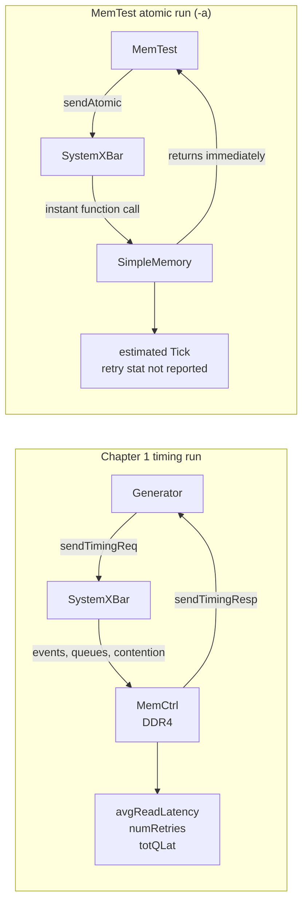

The first run models queueing, bank conflicts, and refresh interference.
The second run collapses the same access stream into a synchronous latency estimate instead of the queued, event-driven path.
Only the timing run produces `avgReadLatency` and retry counters.
MemTest atomic mode does not report the same latency stat or retry stats; the atomic protocol returns a `Tick` estimate per access, but MemTest does not turn that into the same performance measurements.
If you compare those two numbers as if they measure the same thing, your experiment is invalid.

The difference is not accuracy.
It is the execution contract the simulator is using.

### Working Model

gem5 has three fundamentally different ways to move data through the memory hierarchy.
They are not "levels of accuracy."
They are different execution semantics:

- **Timing** — the requester sends a packet and gets a callback *later*.
  Events model latency.
  Backpressure is real.
  This is the only mode that answers performance questions.

- **Atomic** — the requester makes a synchronous function call and receives a `Tick` count.
  The access is not part of the timing backpressure/retry contract.
  It still updates local state immediately where the target component implements that behavior.
  The Tick is a rough estimate, not a simulation measurement.
  Used for fast-forward and warmup.

- **Functional** — instant read or write, no timing side effects.
  There is no backpressure contract.
  Used for loading binaries, debug reads, and memory maintenance helpers.

The rest of this chapter builds the substrate knowledge you need to understand *why* these three modes produce different numbers.

### Formal and Code

The system-wide mode is set in the Python configuration script.
Chapter 1's traffic generator forces timing mode via `AbstractGenerator.incorporate_processor()` ([src/python/gem5/components/processors/abstract_generator.py:74–75](../src/python/gem5/components/processors/abstract_generator.py#L74-L75)):

```python
def incorporate_processor(self, board: AbstractBoard) -> None:
    board.set_mem_mode(MemMode.TIMING)
```

MemTest selects the mode through a command-line flag.
In [configs/example/memtest.py:374–377](../configs/example/memtest.py#L374-L377):

```python
if args.atomic:
    root.system.mem_mode = "atomic"
else:
    root.system.mem_mode = "timing"
```

This choice determines which protocol requesters use at runtime.
A timing requester connected to an atomic-only responder will fail at runtime.

---

## 2.2 What Is a Request, What Is a Packet?

### Intuition

Think of a Request as a traveler's passport: it carries the identity of the memory operation and persists for the entire journey from requester to responder and back.

A Packet is the vehicle for each hop.
At the requester it might be a ReadReq.
At the responder it becomes a ReadResp.
Some components replace or clone Packets, and some accesses are split into multiple Packets.
The key point is that Request identity and Packet transport are separate.

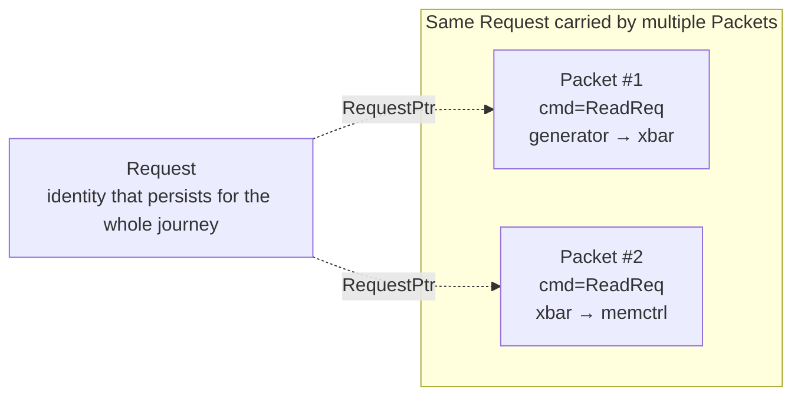

### Working Model

**Request** (`src/mem/request.hh`) carries the fields this chapter needs:

| Field | Type | Description |
|-------|------|-------------|
| `_paddr` | `Addr` | Physical address |
| `_size` | `unsigned` | Size in bytes |
| `_requestorId` | `RequestorID` | Which component issued the request |
| `_flags` | `Flags` | Access control, atomicity, synchronization |
| `_time` | `Tick` | Issue timestamp, usually set to `curTick()` when the request is initialized |

`RequestPtr` is `std::shared_ptr<Request>` ([request.hh:94](../src/mem/request.hh#L94)).
The shared pointer keeps the Request alive as long as any Packet references it.
The class also carries additional metadata such as virtual address, PC, context ID, stream IDs, and atomic-operation bookkeeping.

**Packet** (`src/mem/packet.hh`) carries the per-hop transport state:

| Field | Type | Description |
|-------|------|-------------|
| `cmd` | `MemCmd` | What this hop is doing: `ReadReq`, `WriteResp`, etc. |
| `req` | `RequestPtr` | Pointer back to the owning Request |
| `data` | `PacketDataPtr` | Pointer to data being transferred (may be null on request) |
| `addr` | `Addr` | Address for this hop (may be block-aligned) |
| `size` | `unsigned` | Size for this hop |
| `headerDelay` | `uint32_t` | Accumulated arrival latency from upstream hops |
| `payloadDelay` | `uint32_t` | Accumulated payload transfer latency for data-carrying hops |

The `headerDelay` and `payloadDelay` fields accumulate transport time as the Packet traverses the hierarchy.
They let downstream components account for upstream timing without carrying a separate event history inside each Packet.

### Formal and Code

The code makes the same distinction: Packet is hop-local transport, while Request is the long-lived identity of the access.

A Packet is constructed from a `RequestPtr` and a `MemCmd` ([packet.hh:877–911](../src/mem/packet.hh#L877-L911)):

```cpp
Packet(const RequestPtr &_req, MemCmd _cmd)
    : cmd(_cmd), id((PacketId)_req.get()), req(_req),
      data(nullptr), addr(0), _isSecure(false), size(0),
      headerDelay(0), snoopDelay(0), payloadDelay(0) { ... }
```

The constructor copies `addr` and `size` from the Request if they are valid.
The `data` pointer starts null.
Payload bytes are attached later by whichever side owns them for that hop.
Write packets often carry data from the requester before send.
Read responses usually allocate and fill data on the responder side.

**MemCmd** is a large enum.
The important commands for this chapter are:

| Command | Direction | Description |
|---------|-----------|-------------|
| `ReadReq` | Request | Plain read request |
| `ReadResp` | Response | Data returned for a read |
| `WriteReq` | Request | Plain write request |
| `WriteResp` | Response | Response to a write |
| `ReadExReq` | Request | Read for exclusive ownership (cache coherence) |
| `WritebackDirty` | Eviction | Dirty cache-line writeback |
| `SoftPFReq` | Request | Software prefetch |
| `HardPFReq` | Request | Hardware prefetch |

Each command carries attributes in a `commandInfo` array ([packet.cc:65–240](../src/mem/packet.cc#L65-L240)) that encode whether it is a read/write, request/response, needs a response, carries data, etc.
The full table is in Appendix B.

> **Forward reference:** In Chapter 4, we will call the program's own accesses **demand** accesses.
> The `SoftPFReq` and `HardPFReq` commands above are the speculative prefetch counterparts, not demand traffic.

> **Deep Dive:** Request flags are a 64-bit bitmask ([request.hh:100–265](../src/mem/request.hh#L100-L265)) with selected categories such as access control (`INST_FETCH`, `UNCACHEABLE`, `PHYSICAL`), synchronization (`ACQUIRE`, `RELEASE`, `LLSC`), atomics (`ATOMIC_RETURN_OP`), hardware transactional memory (`HTM_START`, `HTM_COMMIT`), and TLB shootdown (`TLBI`).
> You will meet specific flags as the chapters that need them arrive.

---

## 2.3 SimObjects, Ports, and the Simulation Graph

### Intuition

gem5 is a graph of hardware components connected by port pairs.
Python builds the graph.
C++ executes it.

Here is Chapter 1's system drawn as a SimObject graph:

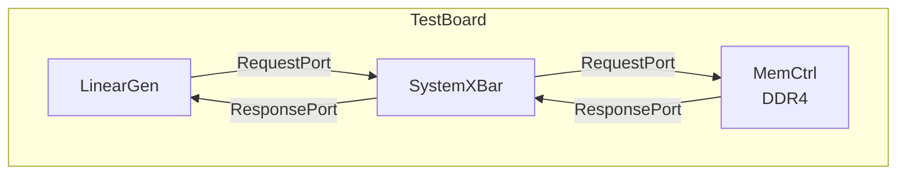

Every box is a **SimObject**.
Every arrow is a **Port** pair: one RequestPort and one ResponsePort, bound together.
Data flows as Packets through these port connections.

### Working Model

**SimObject** ([src/sim/sim_object.hh:146](../src/sim/sim_object.hh#L146)) is the base class for every configurable component.
It inherits from five bases:

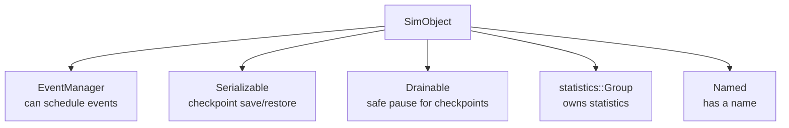

Every CPU, cache, crossbar, memory controller, and traffic generator inherits from SimObject.

**SimObject lifecycle** — `m5.instantiate()` builds and wires the graph, then `m5.simulate()` starts the measured run:

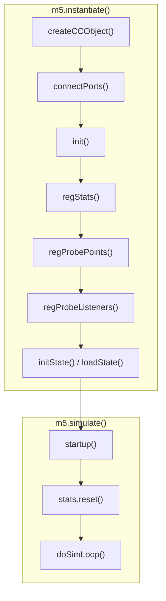

- `init()` — called after all C++ objects exist and ports are connected. Good for cross-object validation.
- `regStats()` — registers statistic counters.
- `initState()` — cold-start initialization (or `loadState()` from checkpoint).
- `startup()` — final step before simulation. Schedule initial events here.
- `stats.reset()` — zeroes counters after startup and before the measured window.
- `drainResume()` — resume after a drain (checkpoint restore).

For Chapter 1's generator, there is an additional step after `m5.instantiate()` returns.
In `tests/gem5/traffic_gen/configs/simple_traffic_run.py`, the runner explicitly calls `generator.start_traffic()`.
In the stdlib path, `Simulator` calls the board's `_post_instantiate()` hook, which eventually starts traffic for generator processors.
Either way, this arms the generator's first event.
Without it, no packets are ever sent.

**Ports** — RequestPort and ResponsePort form bidirectional pairs.
Both inherit from a common `Port` base class ([src/sim/port.hh:61](../src/sim/port.hh#L61)) plus three protocol mixins:

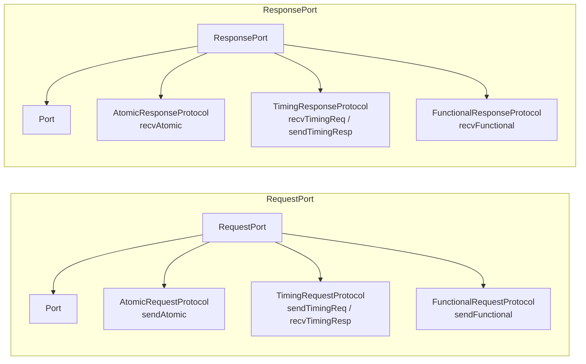

This mixin design exposes all three access modes on the port API.
A concrete component may implement only a subset of them.
`ThreadBridge` is one example that supports atomic and functional access only.
The system's `mem_mode` determines which protocol requesters use at runtime.
A component that does not implement the chosen protocol will fail when accessed.

### Formal and Code

**How Python builds the graph.**
The legacy [m5.simulate.py:147–199](../src/python/m5/simulate.py#L147-L199) path instantiates the graph in ordered passes:

| Pass | What | Code |
|------|------|------|
| 1 | Create C++ objects | `obj.createCCObject()` for all descendants |
| 2 | Wire ports | `obj.connectPorts()` for all descendants |
| 3 | Initialize | `obj.init()` for all descendants |
| 4 | Register stats | `root.regStats()` |
| 5 | Register probe points | `obj.regProbePoints()` |
| 6 | Register probe listeners | `obj.regProbeListeners()` |
| 7 | State setup | `obj.initState()` or `obj.loadState()` |

`m5.simulate()` then starts the measured run by calling `startup()` on all SimObjects, resetting statistics, and entering `doSimLoop()`.

Pass 2 (`connectPorts`) iterates each SimObject's Python-declared ports, calls `SimObject.getPort()` on the C++ side to get a reference to the Port object, then calls `RequestPort::bind()` ([src/mem/port.cc:148–159](../src/mem/port.cc#L148-L159)):

```cpp
void RequestPort::bind(Port &peer) {
    auto *response_port = dynamic_cast<ResponsePort *>(&peer);
    fatal_if(!response_port, "Can't bind port %s to non-response port %s.",
             name(), peer.name());
    _responsePort = response_port;
    Port::bind(peer);
    _responsePort->responderBind(*this);
}
```

The `dynamic_cast` enforces that a RequestPort can only bind to a ResponsePort.
After binding, both sides hold a pointer to their peer.

**The PARAMS macro** ([sim_object.hh:365–371](../src/sim/sim_object.hh#L365-L371)) simplifies access to the parameter struct generated from the Python class definition:

```cpp
#define PARAMS(type) \
    using Params = type##Params; \
    const Params & params() const { \
        return reinterpret_cast<const Params&>(_params); \
    }
```

Every SimObject subclass uses `PARAMS(ClassName)` so that `params().some_field` gives typed access to the configuration values from Python.

---

## 2.4 Three Ways to Move Data: Atomic, Timing, Functional

### Intuition

Three traces for the same operation — generator reads 64 bytes from address `0x0` in the default linear run:

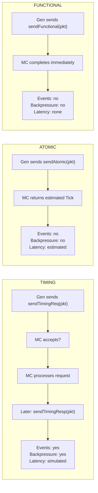

### Working Model

**Atomic** (`src/mem/protocol/atomic.hh`, 127 lines):
- Requester calls `sendAtomic(pkt)` → returns `Tick` (estimated latency).
- The call is synchronous: it goes down the hierarchy and back in one function call chain.
- The access is not part of the timing backpressure/retry contract.
  It still updates local state immediately where the target component implements that behavior.
  The returned Tick is a ballpark number, not a simulated measurement.
- Use case: fast-forward through billions of instructions, cache warmup.

**Timing** (`src/mem/protocol/timing.hh`, 193 lines):
- Requester calls `sendTimingReq(pkt)` → returns `bool`.
- `true` means the responder accepted the packet.
  `false` means the responder's queue is full — backpressure.
- If rejected, the requester must wait for a `recvReqRetry()` callback before resending.
  Ignoring the return value and resending immediately is a bug.
- The responder eventually calls `sendTimingResp(pkt)` → the requester's `recvTimingResp(pkt)` fires.
- Events model every latency component: queue wait, bank activation, column access, bus transfer.
- This is the only mode that produces meaningful performance numbers.

**Functional** (`src/mem/protocol/functional.hh`, 116 lines):
- Requester calls `sendFunctional(pkt)` → `void`, with no backpressure return value.
- Reads/writes data instantly along the connected functional path.
  No events, no timing side effects, no backpressure.
- Use case: loading a binary into simulated memory before simulation starts, debug reads during simulation.
- Danger: during a timing simulation, a functional read can observe in-flight data that has not yet been made visible by the timing path.

| Property | Atomic | Timing | Functional |
|----------|--------|--------|------------|
| Return type | `Tick` | `bool` | `void` |
| Blocking? | Yes (synchronous call) | No (async callback) | Yes (instant) |
| Events scheduled? | No | Yes | No |
| Backpressure? | No | Yes (retry protocol) | No |
| Latency modeled? | Estimated | Simulated | None |
| When to use | Fast-forward, warmup | Performance measurement | Init, debug |

### Formal and Code

The call chain for `sendAtomic()` ([src/mem/port.hh:551–562](../src/mem/port.hh#L551-L562)):

```cpp
Tick RequestPort::sendAtomic(PacketPtr pkt) {
    try {
        addTrace(pkt);
        Tick tick = AtomicRequestProtocol::send(_responsePort, pkt);
        removeTrace(pkt);
        return tick;
    } catch (UnboundPortException) {
        reportUnbound();
    }
}
```

`AtomicRequestProtocol::send()` calls `_responsePort->recvAtomic(pkt)`, which is a pure virtual method.
Each responder (crossbar, cache, memory controller) implements `recvAtomic()` to return a latency estimate.
The call recurses down the hierarchy and returns the total estimated latency up the stack.

The timing equivalent is more complex because of the async callback pattern:

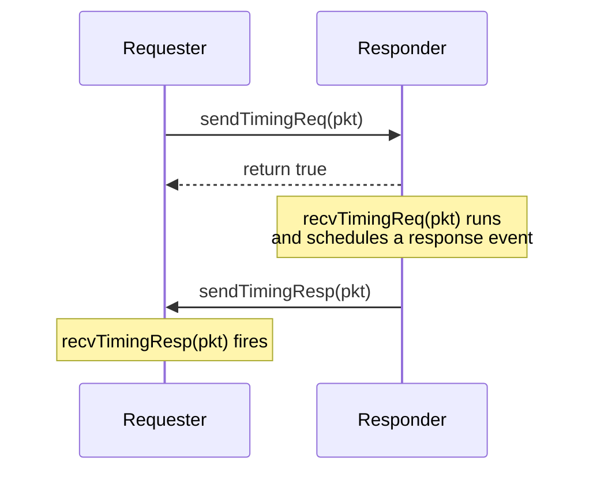

If the responder returns `false` from `recvTimingReq()`, the retry sequence is:

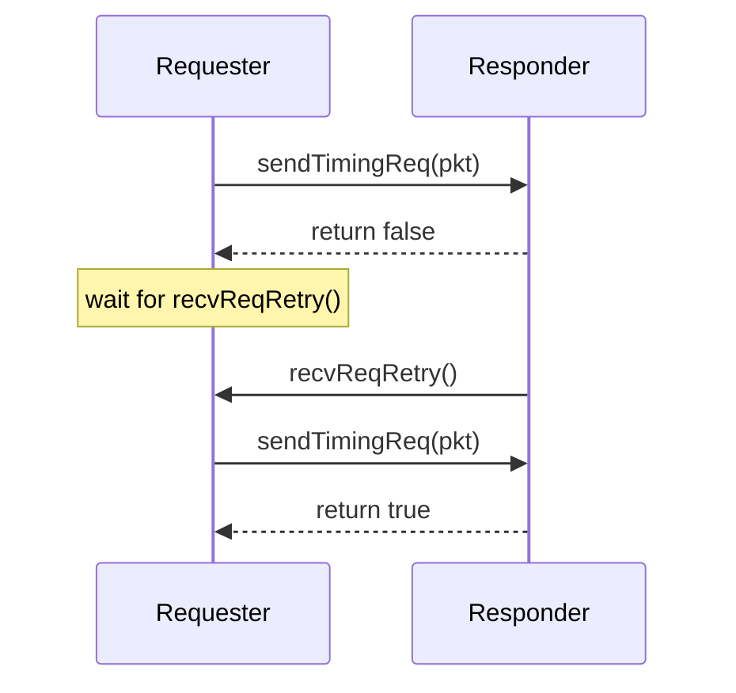

The snoop path exists in all three protocols (for cache coherence).
Snoop requests do not use the same backpressure contract as normal timing requests, but snoop responses still have a retry path.
We defer snoops to Chapter 3.

---

## 2.5 The Event Queue: Who Owns Time

### Intuition

gem5 has no continuously advancing clock.
Time advances *discretely*: the event queue holds a sorted list of future events, pops the earliest one, executes it, and jumps `curTick()` forward to that event's time.
Nothing happens between event boundaries.

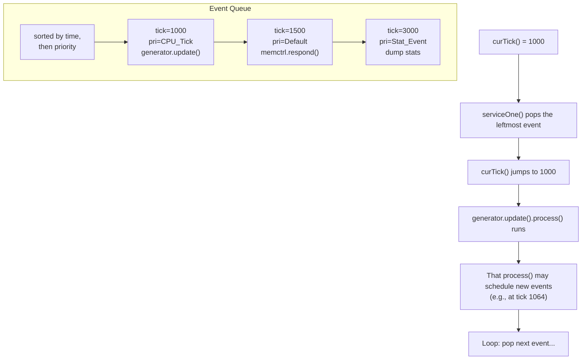

The simulation loop is startlingly simple: pop, execute, repeat.

### Working Model

Three core concepts:

**Event** ([src/sim/eventq.hh:451](../src/sim/eventq.hh#L451)) — has `process()` (what to do), `when()` (at what tick), and `priority()` (tie-breaking within the same tick).
`process()` is pure virtual; every event subclass must implement it.

**EventQueue** — holds events sorted by time then priority.
`serviceOne()` pops the head and calls `process()`.
The implementation is a two-level linked list: the primary level chains "bins" by `(when, priority)`, and within each bin, multiple events are stacked in LIFO order via `nextInBin`.

**EventManager** — convenience wrapper inherited by SimObject.
Every SimObject can call `schedule(event, when)`, `deschedule(event)`, and `reschedule(event, when)`.

The main simulation loop (`doSimLoop` in [src/sim/simulate.cc:293–346](../src/sim/simulate.cc#L293-L346)) is:

```cpp
while (1) {
    assert(!eventq->empty());
    assert(curTick() <= eventq->nextTick() &&
           "event scheduled in the past");

    // ... handle async signals (Ctrl-C, stat dumps) ...

    Event *exit_event = eventq->serviceOne();
    if (exit_event != NULL) {
        return exit_event;
    }
}
```

That is the entire simulation engine.
Every memory-system action in this chapter is driven by an event.
One event may represent many internal steps.

**How SimObjects create events.**
The common pattern uses `EventFunctionWrapper` ([eventq.hh:1136–1177](../src/sim/eventq.hh#L1136-L1177)), which wraps a `std::function<void(void)>` as an Event:

```cpp
// In the traffic generator constructor (base.cc:85):
updateEvent([this]{ update(); }, name())

// Later, to schedule it:
schedule(updateEvent, nextPacketTick);
```

When the event fires, the event queue calls `updateEvent.process()`, which calls `update()`, which generates a packet, sends it, and schedules the next `updateEvent`.

### Formal and Code

`serviceOne()` ([src/sim/eventq.cc:224–263](../src/sim/eventq.cc#L224-L263)):

```cpp
Event *EventQueue::serviceOne() {
    std::lock_guard<EventQueue> lock(*this);
    Event *event = head;
    Event *next = head->nextInBin;
    event->flags.clear(Event::Scheduled);

    if (next) {
        next->nextBin = head->nextBin;
        head = next;                     // pop stack within bin
    } else {
        head = head->nextBin;            // move to next bin
    }

    if (!event->squashed()) {
        setCurTick(event->when());       // TIME ADVANCES HERE
        event->process();                // WORK HAPPENS HERE
        if (event->isExitEvent()) {
            return event;                // simulation ends
        }
    } else {
        event->flags.clear(Event::Squashed);
    }

    event->release();
    return NULL;
}
```

Key observation: `setCurTick(event->when())` is the *only* place where simulated time advances.
There is no other clock.

**Priority levels** determine execution order within the same tick.
Lower values execute first:

| Priority | Value | Purpose |
|----------|-------|---------|
| `Minimum_Pri` | −128 | Lowest bound |
| `Debug_Enable_Pri` | −101 | Enable tracing before other events |
| `CPU_Switch_Pri` | −31 | CPU context switches |
| `Delayed_Writeback_Pri` | −1 | Delayed memory writebacks |
| `Default_Pri` | 0 | Default |
| `DVFS_Update_Pri` | 31 | Voltage/frequency scaling |
| `Serialize_Pri` | 32 | Checkpoint serialization |
| `CPU_Tick_Pri` | 50 | CPU instruction execution |
| `Stat_Event_Pri` | 90 | Statistics dump/reset |
| `Sim_Exit_Pri` | 100 | Simulation exit |
| `Maximum_Pri` | 127 | Highest bound |

Priority matters when multiple events fire at the same tick.
For example, `CPU_Tick_Pri` (50) executes after `Default_Pri` (0), so memory responses at `Default_Pri` are processed before the CPU ticks.

> **Deep Dive:** The event queue's two-level linked list uses `nextBin` for the primary chain (different time+priority) and `nextInBin` for events within the same bin (LIFO stack).
> Multiple event queues support parallel simulation with quantum-based synchronization between threads.
> We defer threading entirely.

---

## 2.6 End-to-End: From Python Script to the First Response

### The trace

We follow one read request through Chapter 1's system: `LinearGenerator` → `SystemXBar` → `MemCtrl(DDR4)`, from the moment the Python script starts to the moment the generator records the response latency.

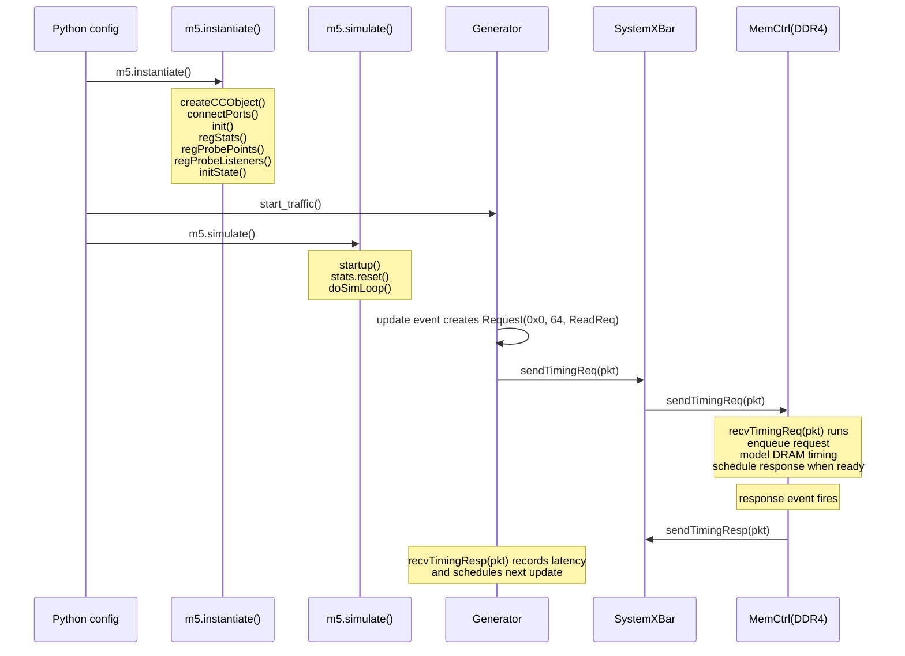

### Step by step

**Step 1 — Python config.**
`simple_traffic_run.py` creates a `TestBoard` with `LinearGenerator(duration="250us", rate="40GiB/s")`, `NoCache()`, and `SingleChannelDDR4_2400("1GiB")`.
These are Python SimObject wrappers.
No C++ objects exist yet.

**Step 2 — Instantiation.**
`m5.instantiate()` triggers `_create_cpp_objects()` ([m5/simulate.py:147–199](../src/python/m5/simulate.py#L147-L199)).
For each SimObject descendant: `createCCObject()` allocates the C++ object, `connectPorts()` binds RequestPort to ResponsePort via `bind()`, then `init()`, `regStats()`, `regProbePoints()`, `regProbeListeners()`, and `initState()` run in order.

**Step 3 — Arming the generator.**
In `tests/gem5/traffic_gen/configs/simple_traffic_run.py`, the runner calls `generator.start_traffic()` after `m5.instantiate()` returns.
In the stdlib path, `Simulator` calls the board's `_post_instantiate()` hook, which eventually starts traffic for generator processors.
This calls `PyTrafficGen::start()` on the C++ side ([src/cpu/testers/traffic_gen/pygen.cc:56–60](../src/cpu/testers/traffic_gen/pygen.cc#L56-L60)), which calls `BaseTrafficGen::start()` ([base.cc:282–286](../src/cpu/testers/traffic_gen/base.cc#L282-L286)):
```cpp
void BaseTrafficGen::start() {
    transition();      // activate the first generator
    scheduleUpdate();  // schedule the first update event
}
```

**Step 4 — Entering the loop.**
`m5.simulate()` calls `startup()` on all SimObjects, resets stats, then enters `doSimLoop()`.
The generator's `updateEvent` is scheduled before packet injection begins.

**Step 5 — Generating a packet.**
`serviceOne()` pops the update event and calls `update()` ([base.cc:169–227](../src/cpu/testers/traffic_gen/base.cc#L169-L227)).
In the default linear run, `LinearGen::getNextPacket()` creates a `ReadReq` packet from a new `Request` at address `0x0` and size `64`.
Then it calls `port.sendTimingReq(pkt)`.

**Step 6 — Crossing the crossbar.**
The `SystemXBar` receives `recvTimingReq(pkt)`, looks up the address range to find the destination port, adds crossbar arrival and serialization delay to the packet, and forwards it to the memory-side port.

**Step 7 — DRAM modeling.**
`MemCtrl.recvTimingReq(pkt)` enqueues the request in the appropriate queue and returns `false` if that queue is full.
The DRAM interface then decides when the request can be serviced.
With the default DDR4 controller, the scheduling policy is FR-FCFS.
When the request becomes ready, `MemCtrl` schedules the response using the controller's static latency plus the packet's accumulated header and payload delays.

**Step 8 — Response.**
When the response is ready, the queued response port later emits `sendTimingResp(pkt)` back through the crossbar.
The generator's `recvTimingResp(pkt)` fires ([base.cc:558–590](../src/cpu/testers/traffic_gen/base.cc#L558-L590)), computes latency as `curTick() - the issue tick recorded when the request was injected`, updates statistics (`totalReadLatency`, `bytesRead`, `totalReads`), deletes the packet, and either retries a blocked request or schedules the next `updateEvent`.

### What this reveals

- The **Request** persisted the whole trip. The **Packet** was the vehicle.
- **Time advanced only when events fired.** Nothing happened between the update event and the response event — the simulator jumped directly from one to the other.
- The **MemCtrl's DRAM timing model** and the accumulated transport delays determined *when* the response was ready.
  That is where latency came from.
- In **atomic mode**, steps 5–8 collapse to a single synchronous `sendAtomic()` estimate instead of the queued timing path.

---

## 2.7 Failure Modes: Where the Substrate Bites

### Failure 1: "I switched to atomic mode and my latency results are still valid"

Atomic mode returns an *estimated* latency as a number but does not model the same queueing, contention, or backpressure behavior as timing mode.
The number is a rough guess, not a simulation result.
Any experiment measuring contention, bandwidth saturation, or tail latency must use timing mode.

### Failure 2: "I used functional access during a timing simulation and data appeared instantly"

Functional accesses bypass all queues and timing.
If used during a timing run (e.g., for a debug read), they can observe in-flight data that has not yet been made visible by the timing path.
They are safe for initialization before `m5.simulate()` and for post-simulation inspection.

### Failure 3: "My port is connected but sendTimingReq always returns false"

The responder is applying backpressure because one of its timing queues is full or otherwise blocked.
The requester must wait for `recvReqRetry()` before resending.
Resending early violates the protocol and can duplicate work or trigger an assertion, depending on the component.
(Full retry walkthrough deferred to Ch3 where MSHRs provide a concrete example.)

> **Terminology — MSHR (Miss Status Holding Register):**
> An MSHR is a hardware structure in a cache that tracks an outstanding miss while it waits for a response from the next level of the hierarchy.
> A cache has a fixed number of MSHRs; once they are all occupied, the cache cannot accept new misses and must reject (`sendTimingReq` returns `false`) or stall incoming requests.
> The stat `blockedCauses::no_mshrs` counts how many times this happened.
> Chapter 3 covers MSHRs in detail; for now, think of them as "the cache's in-flight miss slots."

### Failure 4: "I scheduled an event but it never fires"

Common causes: scheduling an event in the past (`when < curTick()`), scheduling on the wrong `EventQueue`, or forgetting to arm the generator after instantiation.

### Failure 5: "I compared timing `avgReadLatency` to the atomic estimate"

These numbers have different semantics.
Timing `avgReadLatency` includes queueing, bank conflicts, and bus contention — it is a simulation measurement.
Atomic mode returns an estimated `Tick` instead of the same latency stat — it is a heuristic.
Comparing them is comparing a measured temperature to an estimated one.

---

## 2.8 How We Know This

- The three access modes are implemented in `src/mem/protocol/` and exercised by `configs/example/memtest.py` and `src/cpu/testers/memtest/memtest.cc`.
- The event queue implementation is visible in `src/sim/eventq.hh` and `src/sim/eventq.cc`.
  The two-level linked list design is the mechanism this chapter explains.
- The SimObject lifecycle is codified in `src/python/m5/simulate.py` (instantiation passes), `src/python/gem5/simulate/simulator.py` (the stdlib path), and `src/sim/sim_object.hh`.
- The traffic generator's timing loop is in `src/cpu/testers/traffic_gen/base.cc`.
  The `update()` method at line 169, `recvTimingResp()` at line 559, and `retryReq()` at line 297 implement the full timing protocol contract.
- Statistics collected in Chapter 1 (`avgReadLatency`, `numRetries`, `retryTicks`) only have meaning in timing mode — this chapter explains why.

---

## 2.9 Experiment: Timing Generator vs. Atomic MemTest

### Setup

**Run 1: Chapter 1's timing generator** (you already have this from Chapter 1).

```bash
./build/RISCV/gem5.opt -d m5out/ch02-timing-gen \
    tests/gem5/traffic_gen/configs/simple_traffic_run.py \
    LinearGenerator 1 NoCache gem5.components.memory SingleChannelDDR4_2400 1GiB
```

**Run 2: MemTest in timing mode.**

```bash
./build/RISCV/gem5.opt -d m5out/ch02-memtest-timing \
    configs/example/memtest.py -l 10000
```

**Run 3: MemTest in atomic mode.**

```bash
./build/RISCV/gem5.opt -d m5out/ch02-memtest-atomic \
    configs/example/memtest.py -a -l 10000
```

The `-l 10000` flag sets each tester's `max_loads` limit to 10,000 reads.
Because any tester can call `exitSimLoop()` when it reaches that limit, the simulation may end before every tester reaches 10,000.
With the default `-c 2:2:1` and `-t 1:1:0:2` tree, MemTest creates 11 testers organized into several subsystems, so compare the leaf testers (`system.l0subsys*`) rather than treating every `testerN` line as equivalent.
MemTest uses `SimpleMemory` (not DDR4), so the absolute numbers differ from Chapter 1.
The point is the *mode comparison*, not the memory technology.

### What to look for

Open `stats.txt` from each MemTest output directory and compare:

| Stat | Timing (checked run) | Atomic (checked run) | Why |
|------|-----------------|-----------------|-----|
| `simTicks` | 846,977,000 | 155,210,000 | Timing pays the event-driven latency cost; atomic is a synchronous estimate |
| `leaf tester numReads` | 9,425-9,718 | 10,000 | In timing mode the leaf testers stall at slightly different points; in atomic mode they reach the per-tester limit uniformly before the first exit event stops the run |
| `blockedCauses::no_mshrs` | Non-zero on the L1 caches | 0 | Timing mode exposes MSHR backpressure; atomic mode does not use that timing queue |

`grep` for these in each stats file:

```bash
grep "simTicks" m5out/ch02-memtest-timing/stats.txt
grep "simTicks" m5out/ch02-memtest-atomic/stats.txt
grep "system.l0subsys.*numReads" m5out/ch02-memtest-timing/stats.txt
grep "system.l0subsys.*numReads" m5out/ch02-memtest-atomic/stats.txt
grep "system.l1subsys.*blockedCauses::no_mshrs" m5out/ch02-memtest-timing/stats.txt
```

### Interpretation

If `simTicks` is substantially larger in timing mode than atomic for the same workload, you have confirmed that timing mode is paying the event-driven latency cost.

If the leaf testers hit 10,000 reads in atomic mode but stall below that in timing mode, you have confirmed that backpressure from the cache path causes unequal progress.
The higher-level testers may stop below 10,000 because the simulation exits as soon as one tester reaches its limit.

If `blockedCauses::no_mshrs` is non-zero only in timing mode, you have seen backpressure in action: the cache ran out of miss-status holding registers and had to stall incoming requests.
This is the same mechanism (reject → retry) described in Section 2.4.

These are not accuracy differences.
They are semantic differences.
Every experiment in this book uses timing mode unless explicitly stated otherwise.

---

## 2.10 Tradeoffs: When Each Access Mode Is the Right Choice

| Mode | Speed | Fidelity | Use case |
|------|-------|----------|----------|
| Atomic | Very fast | Low (no queueing/contention) | Fast-forward, cache warmup, functional validation |
| Timing | Slow | High (events model real latency) | Performance measurement — the default for research |
| Functional | Instant | None (bypasses timing) | Binary loading, debug reads, memory maintenance helpers |

The tradeoff is simulation speed vs. result fidelity.
Many workflows use atomic to warm caches, then switch to timing for the measurement window.
This avoids simulating billions of warmup instructions at timing speed while still getting accurate performance numbers during the window of interest.

---

## Key Ideas

- A **Request** carries the long-lived identity of the access.
  A **Packet** carries per-hop transport (command, data, delay accumulators).
  One Request may be conveyed by several Packets.
- **SimObjects** are connected by **Port** pairs (RequestPort ↔ ResponsePort).
  Python builds the graph; C++ executes it.
- The **event queue** owns time.
  `serviceOne()` pops the earliest event, advances `curTick()`, and calls `process()`.
  Nothing happens between events.
- **Timing mode** is the only contract that models retries, queueing, and event-driven latency.
  Atomic returns an estimate.
  Functional bypasses timing and queueing.
- The **SimObject lifecycle** runs in two stages: `m5.instantiate()` performs `createCCObject()` → `connectPorts()` → `init()` → `regStats()` → `regProbePoints()` → `regProbeListeners()` → `initState()`, then `m5.simulate()` performs `startup()` → `stats.reset()` → `doSimLoop()`.
  The traffic generator is armed after `m5.instantiate()` by `start_traffic()` in the legacy runner or through the stdlib board's `_post_instantiate()` hook.
- **Backpressure** in timing mode is a bool return from `sendTimingReq()`.
  The requester must wait for `recvReqRetry()` before resending.

## 1-Page Mental Model

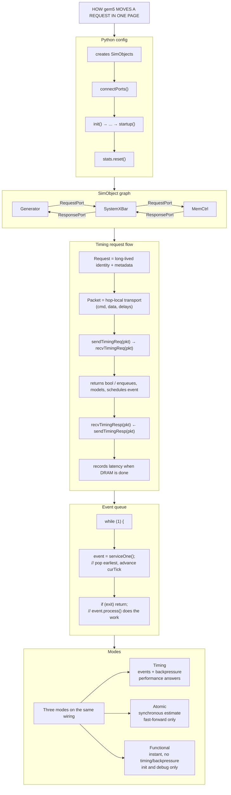

## Common Misconceptions

1. **"Atomic mode is just a faster version of timing mode."**
   It is a different execution semantic.
   Atomic does not model the same queueing, contention, or backpressure behavior as timing.
   The Tick it returns is a heuristic, not a measurement.

2. **"Functional access is harmless during a timing study."**
   It bypasses all queues and timing state.
   A functional read during a timing run can observe in-flight data that the timing path has not yet made visible.

3. **"A connected port guarantees forward progress."**
   No.
   In timing mode, `sendTimingReq()` can return `false` indefinitely if the responder's queue is full.
   The requester must respect backpressure.

4. **"`m5.simulate()` is where Chapter 1 traffic starts."**
   Traffic starts when `generator.start_traffic()` runs after `m5.instantiate()`, either explicitly in the legacy runner or through the stdlib board's `_post_instantiate()` hook.
   `m5.simulate()` calls `startup()` on all SimObjects, resets statistics, and then enters the event loop.

5. **"Request and Packet are interchangeable objects."**
   A Request is the identity that persists for the entire journey.
   A Packet is a per-hop envelope that may be replaced, split, or merged by caches and crossbars.

## If You Remember One Thing

**gem5 has three access modes with fundamentally different semantics.
Timing mode simulates latency through events and backpressure.
Atomic mode estimates it with a function call.
Using the wrong one can invalidate your experiment.**

## Exercises

1. **Trace the first request.**
   Add `DPRINTF(TrafficGen, ...)` calls to `BaseTrafficGen::update()` ([src/cpu/testers/traffic_gen/base.cc:169](../src/cpu/testers/traffic_gen/base.cc#L169)) and `recvTimingResp()` (line 559).
   Run the Chapter 1 linear generator with `--debug-flags=TrafficGen` and identify the first request's address, issue tick, and response tick.
   Compute the round-trip latency manually and compare it to the per-request latency in the trace, then compare the run's `avgReadLatency` with the full-run average in `stats.txt`.

2. **Timing vs. atomic comparison.**
   Run `configs/example/memtest.py -l 10000` in timing mode and then with `-a` for atomic mode.
   Compare `simTicks`, the leaf-testers' (e.g., `system.l0subsys0.tester0`) `numReads`, and `blockedCauses::no_mshrs`.
   Explain why the leaf testers — the ones at the tips of the cache tree, farthest from memory — stop below 10,000 reads in timing mode and why `blockedCauses::no_mshrs` is zero in atomic mode.

3. **Port binding failure.**
   Temporarily remove the loop in `NoCache.incorporate_cache()` that binds `self.membus.mem_side_ports` to `board.get_mem_ports()`.
   Run the experiment and note where the first unbound-port fatal is raised.
   What does that tell you about the difference between port binding and fully wired connectivity?

4. **Event priority.**
   A memory controller schedules its response event at `Default_Pri` (0) and a CPU ticks at `CPU_Tick_Pri` (50).
   If both are scheduled at the same tick, which executes first?
   Why does this ordering matter for the CPU seeing up-to-date data?

5. **Request lifetime.**
   Explain why a `Request` uses `std::shared_ptr` (`RequestPtr`) while a `Packet` is typically allocated with `new` and deleted by the final consumer.
   What would break if Request used raw pointers?
