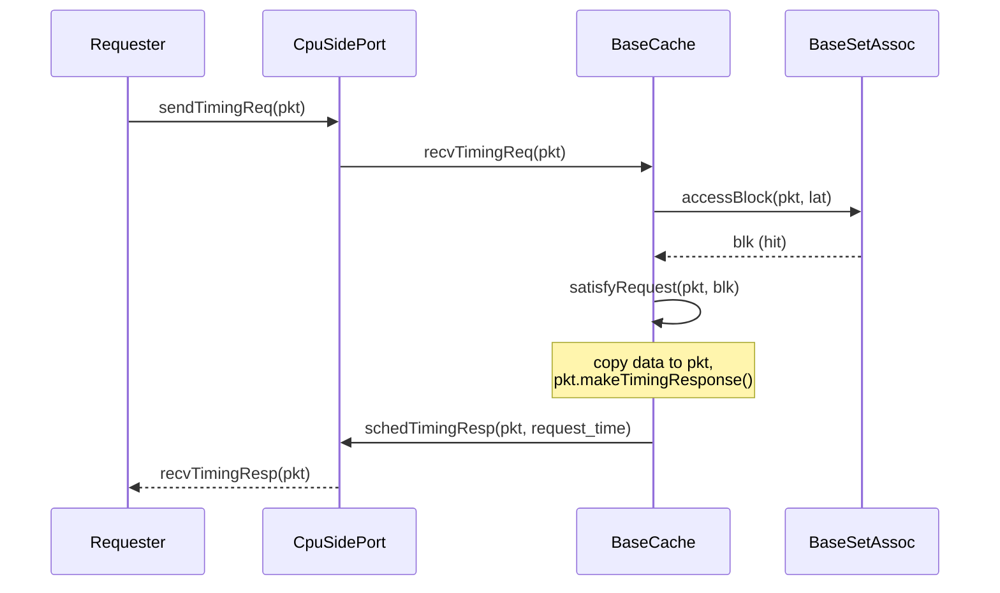
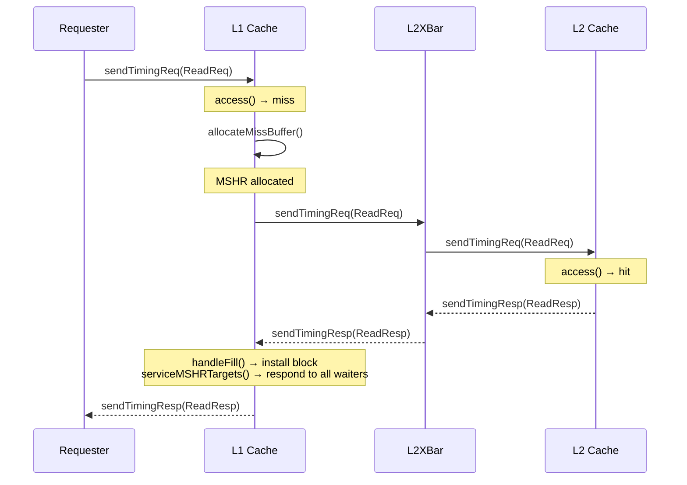
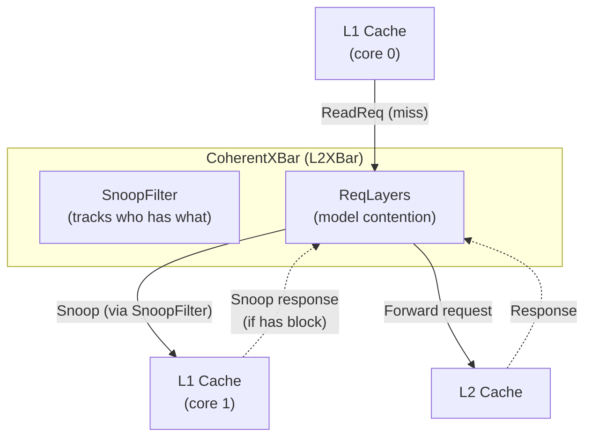
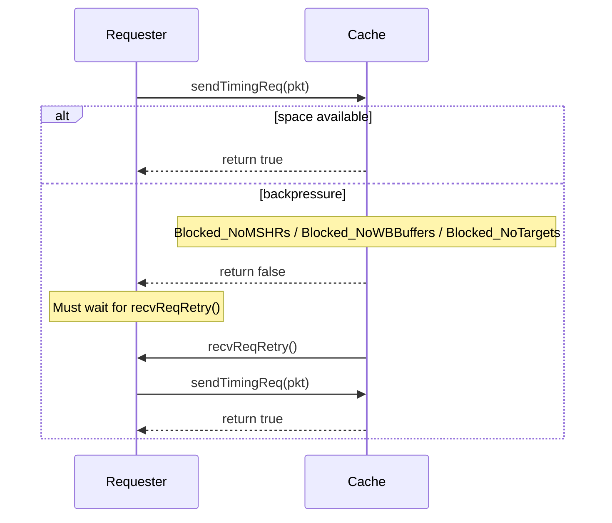

# Chapter 3: Classic Caches in C++

> *The simplest interesting memory system in gem5 is still a real machine full of tags, queues, and backpressure.*

## Contents

- [3.1 The Motivation: What a Cache Changes](#31-the-motivation-what-a-cache-changes)
- [3.2 Anatomy of a Cache Block](#32-anatomy-of-a-cache-block)
- [3.3 Tags, Sets, and Indexing](#33-tags-sets-and-indexing)
- [3.4 The Hit Path: Tag Lookup to Response](#34-the-hit-path-tag-lookup-to-response)
- [3.5 MSHRs: Where Misses Wait](#35-mshrs-where-misses-wait)
- [3.6 The Miss Path: From Lookup Failure to Fill](#36-the-miss-path-from-lookup-failure-to-fill)
- [3.7 Evictions and the Write Buffer](#37-evictions-and-the-write-buffer)
- [3.8 The CoherentXBar: Routing and Snooping](#38-the-coherentxbar-routing-and-snooping)
- [3.9 Backpressure and Retry](#39-backpressure-and-retry)
- [3.10 Wiring It Together: The stdlib Cache Hierarchies](#310-wiring-it-together-the-stdlib-cache-hierarchies)
- [3.11 Failure Modes: Where Classic Caches Bite](#311-failure-modes-where-classic-caches-bite)
- [3.12 How We Know This](#312-how-we-know-this)
- [3.13 Experiment: Adding Caches to the Memory Path](#313-experiment-adding-caches-to-the-memory-path)
- [3.14 Tradeoffs: Design Choices in the Classic Path](#314-tradeoffs-design-choices-in-the-classic-path)
- [Key Ideas](#key-ideas)
- [1-Page Mental Model](#1-page-mental-model)
- [Common Misconceptions](#common-misconceptions)
- [If You Remember One Thing](#if-you-remember-one-thing)
- [Exercises](#exercises)

---

In Chapter 1 you ran a traffic generator directly into DDR4 and watched queueing dominate everything.
In Chapter 2 you traced one request through ports, packets, and the event queue.

Now you insert caches between the generator and memory.
The average latency can drop sharply when requests hit in cache.
But a new set of questions appears: what happens when the cache misses and has no free MSHR to track the miss?
What happens when a dirty eviction fills the write buffer and incoming requests stall?
What happens when the crossbar snoops a line that is mid-fill?

This chapter dissects the Classic cache path at the C++ level.
By the end, you can trace a read hit, a read miss, a dirty writeback, and a snoop through the actual methods and queues in the source.

**Primary code anchors:**
- [`src/mem/cache/base.hh`](../src/mem/cache/base.hh) / [`base.cc`](../src/mem/cache/base.cc) — `BaseCache`: the common cache framework.
- [`src/mem/cache/cache.hh`](../src/mem/cache/cache.hh) / [`cache.cc`](../src/mem/cache/cache.cc) — `Cache`: the coherent cache.
- [`src/mem/cache/cache_blk.hh`](../src/mem/cache/cache_blk.hh) — `CacheBlk`: the block (line) metadata.
- [`src/mem/cache/mshr.hh`](../src/mem/cache/mshr.hh) / [`mshr.cc`](../src/mem/cache/mshr.cc) — `MSHR`: miss-status holding register.
- [`src/mem/cache/mshr_queue.hh`](../src/mem/cache/mshr_queue.hh) — `MSHRQueue`: pool of MSHRs.
- [`src/mem/cache/write_queue_entry.hh`](../src/mem/cache/write_queue_entry.hh) — `WriteQueueEntry`: writeback buffer entry.
- [`src/mem/cache/write_queue.hh`](../src/mem/cache/write_queue.hh) — `WriteQueue`: writeback buffer.
- [`src/mem/coherent_xbar.hh`](../src/mem/coherent_xbar.hh) / [`coherent_xbar.cc`](../src/mem/coherent_xbar.cc) — `CoherentXBar`: the coherent crossbar.
- [`src/mem/snoop_filter.hh`](../src/mem/snoop_filter.hh) / [`snoop_filter.cc`](../src/mem/snoop_filter.cc) — `SnoopFilter`: snoop traffic reduction.
- [`src/mem/cache/Cache.py`](../src/mem/cache/Cache.py) — Python `BaseCache` / `Cache` parameter definitions.
- [`src/python/gem5/components/cachehierarchies/classic/private_l1_private_l2_cache_hierarchy.py`](../src/python/gem5/components/cachehierarchies/classic/private_l1_private_l2_cache_hierarchy.py) — stdlib two-level cache hierarchy.

**Runnable artifacts:**
- `PrivateL1` and `PrivateL1PrivateL2` cache hierarchies in `tests/gem5/traffic_gen/configs/simple_traffic_run.py`.

**Chapter map:**
1. Start with why caches change the picture from Chapter 1.
2. Open the cache block to see what a "line" actually stores.
3. Trace the hit path through tag lookup to response scheduling.
4. Introduce MSHRs as the miss-tracking mechanism.
5. Trace the miss path from MSHR allocation through downstream request to fill.
6. Show eviction and the write buffer.
7. Add the coherent crossbar and snooping.
8. Explain backpressure and the retry protocol.
9. Wire caches into the running system using the stdlib.

---

## 3.1 The Motivation: What a Cache Changes

### Intuition

In Chapter 1 every request paid the full DRAM round-trip.
A cache absorbs repeated accesses to the same block so that only the first access pays the DRAM cost.
But a cache is not a magic latency reducer — it is a real structure with finite capacity, finite tracking slots for outstanding misses, and a coherence contract with the rest of the hierarchy.

```
Chapter 1 system              Chapter 3 system
══════════════════            ══════════════════

 Generator                     Generator
     │                             │
     ▼                             ▼
 SystemXBar                     L1 Cache  ◄── hits served here (default lookup: 1 cycle)
     │                             │
     ▼                             ▼
  MemCtrl                       L2XBar
     │                             │
     ▼                             ▼
   DRAM                         L2 Cache  ◄── L1 misses may hit here (default lookup: 10 cycles)
                                   │
                                   ▼
                                SystemXBar
                                   │
                                   ▼
                                 MemCtrl
                                   │
                                   ▼
                                  DRAM     ◄── L2 misses pay full DRAM cost
```

The new system has more components, more ports, more statistics, and more failure modes.
That is the price of absorbing common-case latency.

### Working Model

The Classic cache path in gem5 has four core objects:

| Object | What it does |
|--------|-------------|
| **`CacheBlk`** | Stores one cache line: tag, coherence state bits, data pointer |
| **`BaseTags` / `BaseSetAssoc`** | Organizes blocks into sets and ways; finds blocks by address |
| **`MSHR`** | Tracks one outstanding miss; coalesces additional requests to the same block |
| **`WriteQueue`** | Buffers dirty evictions and writebacks heading downstream |

These four objects, plus the `BaseCache` controller that orchestrates them, form the core of the Classic cache path.
Optional features like the prefetcher, write allocator, and compressor hook into that core.
There is no separate coherence protocol language here — coherence is embedded directly in C++ methods like `handleSnoop()`, `satisfyRequest()`, and `evictBlock()`.

### Formal and Code

The class hierarchy is:

```
ClockedObject
  └── BaseCache          (base.hh:103)
        ├── Cache          (cache.hh:67)      — coherent cache
        └── NoncoherentCache (noncoherent_cache.hh:68) — below point of coherency
```

`BaseCache` contains the tag store, MSHR queue, write buffer, and the core timing/access logic.
`Cache` adds coherence: snoop handling, writeback decisions that check whether data is cached above, and a `createMissPacket()` that chooses the downstream command for misses and maintenance requests.
`NoncoherentCache` strips all snoop handling — it panics if it receives a snoop request.

The Python parameter class `BaseCache` in `Cache.py` exposes the knobs:

| Parameter | Type | Description |
|-----------|------|-------------|
| `size` | `MemorySize` | Total cache capacity |
| `assoc` | `Unsigned` | Set associativity |
| `tag_latency` | `Cycles` | Tag array lookup latency |
| `data_latency` | `Cycles` | Data array access latency |
| `response_latency` | `Cycles` | Latency for response to upper level on a miss return |
| `mshrs` | `Unsigned` | Number of MSHRs (max concurrent outstanding misses) |
| `tgts_per_mshr` | `Unsigned` | Max coalesced requests per MSHR |
| `write_buffers` | `Unsigned` | Number of write buffer entries (default: 8) |
| `replacement_policy` | `BaseReplacementPolicy` | Replacement policy (default: LRU) |
| `clusivity` | `Clusivity` | `"mostly_incl"` or `"mostly_excl"` |
| `prefetcher` | `BasePrefetcher` | Attached prefetcher (default: none) |
| `sequential_access` | `Bool` | Tag and data accessed sequentially (default: false) |

---

## 3.2 Anatomy of a Cache Block

### Intuition

A cache line in gem5 is not just "64 bytes of data."
It carries metadata that determines whether the line can be read, written, or must be written back on eviction.

```
┌──────────────────────────────────────────────────────────┐
│                      CacheBlk                            │
├──────────┬──────────┬────────────────┬───────────────────┤
│   Tag    │ State    │  Data[blkSize] │    Bookkeeping    │
│ (address │ Valid    │  (e.g., 64 B)  │ _tickInserted     │
│  bits)   │ Readable │                │ _refCount         │
│          │ Writable │                │ whenReady         │
│          │ Dirty    │                │ lockList (LL/SC)  │
│          │ Secure   │                │ _srcRequestorId   │
└──────────┴──────────┴────────────────┴───────────────────┘
```

### Working Model

A block's state is the combination of validity plus three coherence bits.
Those combinations are a useful MOESI-like mental model:

| State | Valid | Readable | Writable | Dirty | Meaning |
|-------|-------|----------|----------|-------|---------|
| **M** (Modified) | 1 | 1 | 1 | 1 | Exclusive owner, data is dirty |
| **O** (Owned) | 1 | 1 | 0 | 1 | Owner but shared — must writeback |
| **E** (Exclusive) | 1 | 1 | 1 | 0 | Exclusive, data is clean |
| **S** (Shared) | 1 | 1 | 0 | 0 | Read-only copy, not responsible for writeback |
| **I** (Invalid) | 0 | — | — | — | Block not present |

A block can be valid but not readable while a write miss or upgrade is outstanding.

### Formal and Code

`CacheBlk` ([cache_blk.hh:71](../src/mem/cache/cache_blk.hh#L71)) inherits from `TaggedEntry`, which inherits from `ReplaceableEntry`.

The coherence bits are defined as an enum ([cache_blk.hh:78–95](../src/mem/cache/cache_blk.hh#L78-L95)):

```cpp
enum CoherenceBits {
    WritableBit = 0x02,
    ReadableBit = 0x04,
    DirtyBit    = 0x08,
    AllBits     = 0x0E,
};
```

Checking state uses `isSet()` ([cache_blk.hh:242–245](../src/mem/cache/cache_blk.hh#L242-L245)):

```cpp
bool isSet(unsigned bits) const {
    return isValid() && (coherence & bits);
}
```

Key lifecycle methods:

- **`insert()`** ([cache_blk.cc:50–73](../src/mem/cache/cache_blk.cc#L50-L73)) — called when data arrives: sets the tag via `TaggedEntry::insert()`, records `_tickInserted = curTick()`, increments `_refCount`, sets requestor and task IDs.
- **`invalidate()`** ([cache_blk.hh:202–215](../src/mem/cache/cache_blk.hh#L202-L215)) — resets everything: clears valid bit, all coherence bits, lock list, reference count, and timing metadata.

The `whenReady` field ([cache_blk.hh:110](../src/mem/cache/cache_blk.hh#L110)) records the tick at which the block's data becomes available after a fill.
If a subsequent access arrives before `whenReady`, the cache adds extra latency — you cannot read data that has not finished arriving from memory.

---

## 3.3 Tags, Sets, and Indexing

### Intuition

The tag store is how the cache finds a block by address.
gem5 decomposes an address into three fields:

```
         Address bits
┌────────────────────┬──────────────┬──────────────┐
│     Tag            │  Set Index   │ Block Offset │
│ (bits above        │ (log₂ sets   │ (log₂ blk    │
│  tagShift)         │  bits)       │  size bits)  │
└────────────────────┴──────────────┴──────────────┘
                     │◄─ setShift ─►│◄─ blkBits ──►│
```

A lookup extracts the set index, finds all ways in that set, and compares each way's stored tag against the address tag.

### Working Model

`BaseSetAssoc` ([base_set_assoc.hh:75](../src/mem/cache/tags/base_set_assoc.hh#L75)) is the default tag organization.
It stores blocks in a flat vector (`std::vector<CacheBlk> blks`) and uses an indexing policy to map addresses to sets.

Two indexing policies are available:

| Policy | How it maps address → set | When to use |
|--------|---------------------------|-------------|
| **`SetAssociative`** | `(addr >> setShift) & setMask` | Standard; simple, fast |
| **`SkewedAssociative`** | Different hash per way | Reduces conflict misses for pathological patterns |

**Lookup flow:**

1. `accessBlock(pkt, lat)` ([base_set_assoc.hh:127–156](../src/mem/cache/tags/base_set_assoc.hh#L127-L156)) — gets candidate entries from the indexing policy, checks each for a tag match.
   If found: updates replacement policy via `touch()`, sets `lat = lookupLatency`, increments `_refCount`.
   Returns the matching `CacheBlk*` or `nullptr`.

2. `findBlock(key)` ([base.hh:202](../src/mem/cache/base.hh#L202)) — same tag comparison, but does not update replacement state.
   Used for snoops and non-demand lookups.

3. `findVictim(key, size, evict_blks)` ([base_set_assoc.hh:169–191](../src/mem/cache/tags/base_set_assoc.hh#L169-L191)) — gets all entries in the set, asks the replacement policy (`getVictim()`) to pick one, fills `evict_blks` with blocks that need eviction.

### Formal and Code

Address reconstruction from a stored block works in reverse:

```cpp
// SetAssociative::regenerateAddr()  (set_associative.hh)
Addr addr = (tag << tagShift) | (entry->getSet() << setShift);
```

The block offset is not stored — it is implicit from the request's original address.

The replacement policy interface ([replacement_policies/base.hh:54–112](../src/mem/cache/replacement_policies/base.hh#L54-L112)) has four key methods:

- `touch(data, pkt)` — update metadata on access (e.g., move to MRU position)
- `reset(data, pkt)` — initialize metadata on insertion
- `invalidate(data)` — mark block as a victim candidate
- `getVictim(candidates)` — select victim from a set of candidates

The default policy is LRU (`LRURP`).
Chapter 4 explores replacement policies in detail.

---

## 3.4 The Hit Path: Tag Lookup to Response

### Intuition

A timing read hit is the simplest path through the cache.
The tag array is checked, the block is found with the right permissions, data is copied into the response packet, and the response is scheduled back to the requester.



### Working Model

The hit path proceeds through these steps:

1. **Port acceptance** — `CpuSidePort::tryTiming()` ([base.cc:2607–2619](../src/mem/cache/base.cc#L2607-L2619)) checks whether the port is blocked.
   If blocked (MSHR queue full, write buffer full, or target limit reached), it returns false and the requester must retry later.

2. **Tag lookup** — `access()` ([base.cc:1289–1556](../src/mem/cache/base.cc#L1289-L1556)) calls `tags->accessBlock(pkt, tag_latency)`.
   If the block is found and has the right permissions (readable for reads, writable for writes), the access is satisfied.

3. **Data movement** — `satisfyRequest()` ([base.cc:1145–1239](../src/mem/cache/base.cc#L1145-L1239)):
   - For **reads**: copies block data into the packet via `pkt->setDataFromBlock(blk->data, blkSize)`.
   - For **writes**: copies packet data into the block via `updateBlockData()` and sets the `DirtyBit`.

4. **Response scheduling** — `handleTimingReqHit()` ([base.cc:275–353](../src/mem/cache/base.cc#L275-L353)) converts the packet to a response (`pkt->makeTimingResponse()`) and schedules it via `cpuSidePort.schedTimingResp(pkt, request_time)`.

### Formal and Code

**Latency calculation** is handled by `calculateAccessLatency()` ([base.cc:1256–1287](../src/mem/cache/base.cc#L1256-L1287)).
Two access modes exist:

- **Parallel access** (`sequential_access = false`, the default):
  $$\text{lat} = \max(\text{tag latency}, \text{data latency}) + \text{headerDelay}$$

- **Sequential access** (`sequential_access = true`):
  $$\text{lat} = \text{tag latency} + \text{data latency} + \text{headerDelay}$$

The `headerDelay` from the incoming packet (accumulated by crossbars along the way) is converted to cycles and added.
If `blk->whenReady` is still in the future, `calculateAccessLatency()` adds the extra wait time before the access completes.
After latency is computed, both `pkt->headerDelay` and `pkt->payloadDelay` are reset to zero ([base.cc:496](../src/mem/cache/base.cc#L496)) — the cache absorbs all upstream delay into its own response timing.

The five latency parameters initialized in the `BaseCache` constructor ([base.cc:100–104](../src/mem/cache/base.cc#L100-L104)):

```cpp
lookupLatency(p.tag_latency),       // tag array access
dataLatency(p.data_latency),        // data array access
forwardLatency(p.tag_latency),      // time before sending miss downstream
fillLatency(p.data_latency),        // time to install fill data
responseLatency(p.response_latency) // return-path latency for fills and forwarded responses
```

Note that `forwardLatency` equals `tag_latency` and `fillLatency` equals `data_latency`.
These are not separate configuration knobs — they are derived from the same parameters.
`responseLatency` is not part of the hit path.
`handleTimingReqHit()` schedules hit responses with `request_time` only.

---

## 3.5 MSHRs: Where Misses Wait

### Intuition

A cache miss creates a problem: the requester needs data that the cache does not have, and fetching it from downstream takes many cycles.
During that time, the cache cannot simply freeze — other requests are arriving.
The Miss Status Holding Register (MSHR) is the bookkeeping structure that tracks an outstanding miss.

```
                        MSHR Entry
┌─────────────────────────────────────────────────┐
│  blkAddr = 0x1000    inService = true           │
│  blkSize = 64        pendingModified = false    │
│                                                 │
│  targets (active requests waiting on this miss):│
│  ┌──────────────────────────────────────────┐   │
│  │ Target 0: ReadReq from CPU core 0        │   │
│  │ Target 1: ReadReq from prefetcher        │   │
│  │ Target 2: ReadReq from CPU core 0        │   │
│  └──────────────────────────────────────────┘   │
│                                                 │
│  deferredTargets (need different permissions):  │
│  ┌──────────────────────────────────────────┐   │
│  │ Target 0: WriteReq from CPU core 0       │   │
│  └──────────────────────────────────────────┘   │
└─────────────────────────────────────────────────┘
```

The key insight: if two reads arrive for the same block while a miss is outstanding, the second read does not generate a second downstream request.
Instead, it *coalesces* into the existing MSHR as an additional target.
When the response arrives, all targets are serviced from the single fill.

### Working Model

**MSHR lifecycle:**

1. **Allocate** — A miss allocates an MSHR from the free pool.
   The first request becomes the initial target.

2. **Coalesce** — Subsequent requests to the same block-aligned address find the existing MSHR via `mshrQueue.findMatch()` and are added as targets via `allocateTarget()`.

3. **Send downstream** — The MSHR generates a downstream request packet and sends it.
   The MSHR is marked `inService = true` and removed from the ready list.

4. **Response arrives** — The fill data arrives.
   `serviceMSHRTargets()` walks the target list, calls `satisfyRequest()` for each target, and schedules responses back to each requester.

5. **Deallocate** — When all targets are serviced, the MSHR returns to the free pool.

**Deferred targets** handle a subtlety: if an MSHR is in service for a read (not requesting writable permissions) and a write arrives for the same block, the write cannot be satisfied by the incoming read response.
The write is placed in `deferredTargets`.
After the read response arrives, `promoteWritable()` or `promoteDeferredTargets()` moves deferred targets into the active list and may trigger a new downstream request (an upgrade).

**Capacity limit:**
The number of MSHRs is finite (configured by the `mshrs` parameter).
When all MSHRs are allocated, the cache blocks the CPU-side port — no new requests can enter until an MSHR is freed.
Each MSHR also has a target limit (`tgts_per_mshr`).
When a single MSHR reaches this limit, the cache blocks incoming requests to prevent unbounded target list growth.

### Formal and Code

`MSHR` (`mshr.hh`) inherits from `QueueEntry`.
Key fields:

| Field | Line | Purpose |
|-------|------|---------|
| `blkAddr` | QueueEntry | Block-aligned address of the miss |
| `inService` | QueueEntry | True after downstream request sent |
| `targets` | [mshr.hh:394](../src/mem/cache/mshr.hh#L394) | Active `TargetList` of coalesced requests |
| `deferredTargets` | [mshr.hh:396](../src/mem/cache/mshr.hh#L396) | Requests needing different permissions |
| `pendingModified` | [mshr.hh:113](../src/mem/cache/mshr.hh#L113) | Will the response grant writable access? |
| `postInvalidate` | [mshr.hh:116](../src/mem/cache/mshr.hh#L116) | Snoop invalidated during in-service |
| `postDowngrade` | [mshr.hh:119](../src/mem/cache/mshr.hh#L119) | Snoop downgraded during in-service |
| `isForward` | [mshr.hh:127](../src/mem/cache/mshr.hh#L127) | Simple forwarded request (no cache allocation) |

Each `Target` ([mshr.hh:129–167](../src/mem/cache/mshr.hh#L129-L167)) contains a `PacketPtr pkt`, a `source` (FromCPU, FromSnoop, or FromPrefetcher), and an `allocOnFill` flag.

`MSHRQueue` (`mshr_queue.hh`) inherits from `Queue<MSHR>`.
The `Queue` template maintains three lists:

- `freeList` — unallocated MSHR entries
- `allocatedList` — all currently in-use entries
- `readyList` — entries ready to send, sorted by `readyTime`

The `demandReserve` parameter ([mshr_queue.hh:69](../src/mem/cache/mshr_queue.hh#L69)) reserves MSHR entries for demand accesses so that hardware prefetches cannot starve demand misses.

---

## 3.6 The Miss Path: From Lookup Failure to Fill

### Intuition

A cache miss is the most complex path through the Classic cache.
It involves MSHR allocation, downstream request creation, response handling, victim selection, eviction, and data installation — potentially all for a single read.



### Working Model

**Step-by-step miss handling:**

1. **Miss detection** — `access()` ([base.cc:1289–1556](../src/mem/cache/base.cc#L1289-L1556)) calls `tags->accessBlock()`.
   The block is either not found or found without the required permissions (e.g., read-only block and the request needs writable).
   `access()` returns false.

2. **Latency for the miss** — Even though no data is returned, the cache charges the tag lookup latency.
   `calculateTagOnlyLatency()` ([base.cc:1247–1253](../src/mem/cache/base.cc#L1247-L1253)) returns `headerDelay + tag_latency`.
   This models the real cost: the cache did check its tags; it just did not find what it needed.

3. **MSHR allocation or coalescing** — `handleTimingReqMiss()` (Cache override at [cache.cc:325–416](../src/mem/cache/cache.cc#L325-L416)) checks `mshrQueue.findMatch()`.
   - If an MSHR exists for this address: **coalesce** — add the request as a new target.
   - If no MSHR exists: **allocate** — `allocateMissBuffer()` ([base.hh:1175–1191](../src/mem/cache/base.hh#L1175-L1191)) takes an entry from the free pool and schedules a downstream send event.

4. **Downstream request** — When the send event fires, `getNextQueueEntry()` ([base.cc:904–951](../src/mem/cache/base.cc#L904-L951)) selects the next MSHR or write-buffer entry to send.
   `sendMSHRQueuePacket()` ([base.cc:1930–2010](../src/mem/cache/base.cc#L1930-L2010)) creates a downstream packet via `createMissPacket()`, attaches the MSHR as `senderState`, and calls `memSidePort.sendTimingReq(pkt)`.

5. **Response reception** — `recvTimingResp()` ([base.cc:539–681](../src/mem/cache/base.cc#L539-L681)) extracts the MSHR from the response packet's sender state.
   If the response is a fill response, it calls `handleFill()`.

6. **Block installation** — `handleFill()` ([base.cc:1571–1750](../src/mem/cache/base.cc#L1571-L1750)) either reuses the existing block or allocates a new one via `allocateBlock()`.
   Allocation may trigger eviction (Section 3.7).
   The fill always sets `ReadableBit`.
   It sets `WritableBit` when the response has no sharers.
   It sets `DirtyBit` only when the response came from another cache and still has no sharers.

7. **Target servicing** — `serviceMSHRTargets()` (Cache override at [cache.cc:700–850](../src/mem/cache/cache.cc#L700-L850)) walks each target, calls `satisfyRequest()` to copy data into the target's packet, and schedules a response via `cpuSidePort.schedTimingResp()`.

8. **MSHR deallocation** — If no deferred targets remain, the MSHR is returned to the free pool via `mshrQueue.deallocate()`.
   If deferred targets were promoted, the MSHR is placed back on the ready list for a new downstream request.

### Formal and Code

**`getNextQueueEntry()` priority** ([base.cc:904–951](../src/mem/cache/base.cc#L904-L951)):

This method decides whether to send a miss request or a writeback next.
The logic:

1. If the write buffer is **full**, a ready writeback is considered first because the cache has to drain it.
2. Otherwise, a ready miss is considered first because misses are latency-sensitive.
3. The conflict check is asymmetric.
   A ready writeback can be preempted by an older conflicting miss.
   A ready miss loses to any conflicting writeback.

This ordering prevents a request from observing stale state while a conflicting writeback is still pending.

**The `forward_time` and `request_time` distinction:**

In `recvTimingReq()` ([base.cc:454–524](../src/mem/cache/base.cc#L454-L524)):

```cpp
Tick forward_time = clockEdge(forwardLatency) + pkt->headerDelay;  // line 458
// ... access() sets lat ...
Tick request_time = clockEdge(lat);                                 // line 494
```

- `forward_time` is when a miss can be sent downstream — it includes `forwardLatency` (equal to `tag_latency`) plus any accumulated `headerDelay`.
- `request_time` is when a hit response is ready — it includes the access latency plus any accumulated upstream `headerDelay`, but not `responseLatency`.

---

## 3.7 Evictions and the Write Buffer

### Intuition

When a fill needs to install a new block but all ways in the target set are occupied, one block must be evicted.
If the victim is dirty (Modified or Owned), it must be written back to the next level — you cannot just discard dirty data.

The write buffer is a queue that holds these outgoing writebacks.
It is separate from the MSHR queue: MSHRs track *incoming* misses; the write buffer tracks *outgoing* evictions.

```
┌───────────────────────────────────────────────┐
│                 BaseCache                     │
│                                               │
│  ┌─────────────┐        ┌─────────────────┐   │
│  │ MSHRQueue   │        │  WriteQueue     │   │
│  │ (misses     │        │  (writebacks    │   │
│  │  going out) │        │   going out)    │   │
│  │             │        │                 │   │
│  │ [MSHR 0]    │        │ [WB entry 0]    │   │
│  │ [MSHR 1]    │        │ [WB entry 1]    │   │
│  │ [  ...  ]   │        │ [   ...    ]    │   │
│  │ [MSHR N-1]  │        │ [WB entry 7]    │   │
│  └─────┬───────┘        └──────┬──────────┘   │
│        │                       │              │
│        └───────┬───────────────┘              │
│                ▼                              │
│         getNextQueueEntry()                   │
│         selects next to send                  │
│                │                              │
│                ▼                              │
│          MemSidePort                          │
└───────────────────────────────────────────────┘
```

### Working Model

**Eviction flow:**

1. `allocateBlock()` ([base.hh:804](../src/mem/cache/base.hh#L804)) calls `tags->findVictim()` to select a replacement candidate using the configured replacement policy.

2. `handleEvictions()` ([base.cc:996–1030](../src/mem/cache/base.cc#L996-L1030)) checks whether the victim has outstanding MSHRs.
   If so, the eviction is deferred — you cannot evict a block that is in the middle of being filled.

3. `evictBlock()` (Cache override) creates the appropriate packet:
   - **Dirty block** → `WritebackDirty` packet carrying the block's data.
   - **Clean block with `writeback_clean = true`** → `WritebackClean` packet.
   - **Clean block with `writeback_clean = false`** → `CleanEvict` packet (no data, just a notification to the snoop filter).

4. The eviction packet is placed in the write buffer via `allocateWriteBuffer()` ([base.hh:1193](../src/mem/cache/base.hh#L1193)).

5. The block is invalidated in the tag store.

**Write buffer characteristics:**

`WriteQueueEntry` ([write_queue_entry.hh:67](../src/mem/cache/write_queue_entry.hh#L67)) is structurally simpler than an MSHR.
It has no deferred target mechanism.
Eviction packets do not wait for a response, and the cache handles any needed snoop bookkeeping separately.
For those packets, `WriteQueue::markInService()` immediately deallocates the entry ([write_queue.cc:78–86](../src/mem/cache/write_queue.cc#L78-L86)), unlike MSHRs which wait for a response.

The default write buffer size is 8 entries.
When full, the cache sets `Blocked_NoWBBuffers` and stalls incoming requests.

### Formal and Code

For the coherent `Cache` class, eviction involves a coherence check ([cache.cc:191](../src/mem/cache/cache.cc#L191)).
Before sending a writeback downstream, `Cache::doWritebacks()` calls `isCachedAbove()` to check whether a higher-level cache still holds the line.
If the line is still cached above, `CleanEvict` and `WritebackClean` packets are dropped.
`WritebackDirty` and `WriteClean` packets are forwarded with `BLOCK_CACHED` set so lower levels keep their snoop-filter bookkeeping consistent.

This check matters because downstream bookkeeping needs to know whether the line is still resident above, especially in mostly inclusive hierarchies.

---

## 3.8 The CoherentXBar: Routing and Snooping

### Intuition

Between each pair of cache levels sits a crossbar.
In the Classic hierarchy, `CoherentXBar` routes requests by address and enforces coherence by snooping.

When a cache sends a request downstream (e.g., L1 miss → L2), the crossbar may also need to snoop other caches at the same level to maintain coherence.
If core 0 is reading a block that core 1 holds in Modified state, the crossbar's snoop tells core 1 to supply the data and downgrade its copy.



### Working Model

`CoherentXBar` ([coherent_xbar.hh:70](../src/mem/coherent_xbar.hh#L70)) inherits from `BaseXBar`.
Its `recvTimingReq()` method ([coherent_xbar.cc:148–444](../src/mem/coherent_xbar.cc#L148-L444)) does the following:

1. **Route by address** — `findPort(pkt)` uses an `AddrRangeMap` to determine which memory-side port owns the target address.

2. **Layer contention** — The crossbar has per-destination-port `ReqLayer`, `RespLayer`, and `SnoopRespLayer` objects.
   Each layer models occupancy: if the layer is busy, the request is rejected and the requester must retry.

3. **Snoop fan-out** — If caching is enabled, the crossbar snoops other CPU-side ports.
   With a `SnoopFilter`, only the ports the filter marks as relevant are snooped.
   Without one, the crossbar broadcasts to all CPU-side ports.

4. **Forward to destination** — The request is sent to the target memory-side port.

**SnoopFilter** ([snoop_filter.hh:89](../src/mem/snoop_filter.hh#L89)) tracks, per cache line, which ports hold or have requested each block.
It maintains a `SnoopItem` per tracked address with two bitmasks:

- `requested` — ports with in-flight requests for this line
- `holder` — ports that completed a fill and hold the line

On a `lookupRequest()`, the filter returns the ports in `holder` or `requested`, excluding the requester.
If the filter has no entry and the request does not allocate one, it returns no targets.
This can reduce snoop fan-out dramatically in many-core systems.

**Point of Coherency (PoC) and Point of Unification (PoU):**
The crossbar has two boolean flags ([coherent_xbar.hh:297–300](../src/mem/coherent_xbar.hh#L297-L300)):
- `pointOfCoherency` — if true, cache-maintenance requests marked `ToPOC` treat this crossbar as their destination.
- `pointOfUnification` — if true, cache-maintenance requests marked `ToPOU` treat this crossbar as their destination.

### Formal and Code

Snoop forwarding does not use the normal request retry path.
When `forwardTiming()` ([coherent_xbar.cc:700–725](../src/mem/coherent_xbar.cc#L700-L725)) sends a snoop to a cache, the cache side is expected to accept it rather than return a retry.
That keeps snoop handling off the normal backpressure path and avoids deadlock.

Express snoops bypass layer occupancy checks ([coherent_xbar.cc:155](../src/mem/coherent_xbar.cc#L155)) for the same reason: a snoop stuck behind a full request layer could deadlock the system if the request is waiting on the snoop to complete.

The crossbar maintains a `routeTo` map ([xbar.hh:327](../src/mem/xbar.hh#L327)) that remembers which CPU-side port sent each request, so when the response arrives later, it can be routed back without address decoding.

---

## 3.9 Backpressure and Retry

### Intuition

In timing mode, every queue is finite.
When a queue is full, the component must refuse new requests.
The requester must wait for an explicit retry signal before trying again.
This is the retry protocol introduced in Chapter 2, now made concrete.



### Working Model

`BaseCache` tracks blocking state with a bitmask ([base.hh:967](../src/mem/cache/base.hh#L967)).
Three causes can block the CPU-side port:

| Cause | Set when | Cleared when |
|-------|----------|--------------|
| `Blocked_NoMSHRs` | MSHR queue is full after allocating | An MSHR is deallocated |
| `Blocked_NoWBBuffers` | Write buffer is full after allocating | A write-buffer entry completes |
| `Blocked_NoTargets` | An MSHR's target list reaches `tgts_per_mshr` | Response arrives for that MSHR |

When any cause is set, `CacheResponsePort::setBlocked()` ([base.cc:152–164](../src/mem/cache/base.cc#L152-L164)) marks the port as blocked.
`CpuSidePort::tryTiming()` ([base.cc:2607–2619](../src/mem/cache/base.cc#L2607-L2619)) checks this flag and returns false to the requester if set.

When the blocking condition is resolved, `clearBlocked()` ([base.cc:167–176](../src/mem/cache/base.cc#L167-L176)) schedules a `sendRetryReq()` one tick later, which tells the requester it may try again.

### Formal and Code

The retry protocol has a strict contract:

1. The requester calls `sendTimingReq()`.
   The cache returns `false`.
2. The requester **must not** call `sendTimingReq()` again until it receives `recvReqRetry()`.
3. The cache **must** eventually send `recvReqRetry()` after the blocking condition clears.

Violating rule 2 (resending without a retry) is a protocol violation.
Violating rule 3 (never retrying) deadlocks the system.

The same retry protocol applies between the cache and the crossbar on the memory side.
If the crossbar rejects a downstream miss request, the cache must wait for a retry from the crossbar before resending.

---

## 3.10 Wiring It Together: The stdlib Cache Hierarchies

### Intuition

The previous sections described the internal mechanics of a single cache.
This section shows how caches are wired into a complete hierarchy using the gem5 stdlib.

```
             Per-Core                 Shared
        ┌─────────────────┐
        │  L1I     L1D    │
        │  Cache   Cache  │          SystemXBar
        │    │       │    │              │
        │    └───┬───┘    │              │
        │        │        │              ▼
        │     L2XBar      │           MemCtrl
        │        │        │              │
        │     L2 Cache    │              ▼
        │        │        │            DRAM
        └────────┼────────┘
                 │
                 └──── to SystemXBar ──►
```

### Working Model

The stdlib examples here use three main Classic hierarchy classes:

| Class | Structure |
|-------|-----------|
| `PrivateL1CacheHierarchy` | Per-core L1I + L1D → SystemXBar → memory |
| `PrivateL1PrivateL2CacheHierarchy` | Per-core L1I + L1D → L2XBar → L2 → SystemXBar → memory |
| `PrivateL1SharedL2CacheHierarchy` | Per-core L1I + L1D → shared L2XBar → shared L2 → SystemXBar → memory |

Default parameters used by the stdlib cache classes:

| Parameter | L1D | L1I | L2 |
|-----------|-----|-----|-----|
| Associativity | 8 | 8 | 16 |
| Tag latency | 1 cycle | 1 cycle | 10 cycles |
| Data latency | 1 cycle | 1 cycle | 10 cycles |
| Response latency | 1 cycle | 1 cycle | 1 cycle |
| MSHRs | 16 | 16 | 20 |
| Targets/MSHR | 20 | 20 | 12 |
| Writeback clean | No | Yes | No |
| Prefetcher | StridePrefetcher | StridePrefetcher | StridePrefetcher |
| Clusivity | — | — | mostly_incl |

The `L1ICache` class defaults to `writeback_clean = True`, and `PrivateL1CacheHierarchy` uses that default.
`PrivateL1PrivateL2CacheHierarchy` also leaves that default in place, so its clean I-cache evictions become `WritebackClean` packets.
`PrivateL1SharedL2CacheHierarchy` sets L1I `writeback_clean = False`, so its clean I-cache evictions become `CleanEvict` packets.

### Formal and Code

The test harness `simple_traffic_run.py` creates these hierarchies with:

```python
# PrivateL1 (lines 108-113)
PrivateL1CacheHierarchy(l1d_size="32KiB", l1i_size="32KiB")

# PrivateL1PrivateL2 (lines 114-121)
PrivateL1PrivateL2CacheHierarchy(
    l1d_size="32KiB", l1i_size="32KiB", l2_size="256KiB"
)
```

In the two-level hierarchy ([private_l1_private_l2_cache_hierarchy.py:132–161](../src/python/gem5/components/cachehierarchies/classic/private_l1_private_l2_cache_hierarchy.py#L132-L161)), ports are connected:

1. L1 caches' `mem_side` → `L2XBar.cpu_side_ports`
2. `L2XBar.mem_side_ports` → L2 cache's `cpu_side`
3. L2 cache's `mem_side` → `SystemXBar.cpu_side_ports`
4. `SystemXBar.mem_side_ports` → memory controller

In `PrivateL1PrivateL2CacheHierarchy`, each core gets its own `L2XBar`.
In `PrivateL1SharedL2CacheHierarchy`, one shared `L2XBar` connects all cores to the shared L2.
In both cases the bus routes L1 misses to L2 and handles snoops for the caches attached to that bus.

---

## 3.11 Failure Modes: Where Classic Caches Bite

### Failure 1: "Hit rate is 95%, so performance is fine"

A 95% hit rate means 5% of accesses still pay the full downstream latency — often hundreds of cycles on a DRAM-backed system.
If those 5% are on the critical path (e.g., dependent loads in a pointer-chasing loop), they dominate execution time.
Always pair hit rate with `demandAvgMissLatency` and `blockedCycles`.

### Failure 2: MSHR exhaustion under bursty traffic

With 16 MSHRs and a burst of 20 misses to different cache lines, the 17th miss stalls at the CPU-side port.
All subsequent requests — including hits — are blocked until an MSHR is freed.
This creates head-of-line blocking: a perfectly hittable request waits behind the MSHR queue.

**The diagnostic:**
Check `blockedCycles::no_mshrs` in `stats.txt`.
If this is a significant fraction of total cycles, the cache is MSHR-starved.
Increasing `mshrs` may help — but more MSHRs means more area and more potential downstream contention.

### Failure 3: Write-buffer pressure from eviction storms

A working set slightly larger than the cache causes constant evictions.
If many evicted blocks are dirty, the write buffer fills up and blocks incoming requests (`Blocked_NoWBBuffers`).
This is particularly insidious because the write buffer and MSHR queue compete for the same downstream port: a full write buffer stalls miss requests too.

**The diagnostic:**
Check `blockedCycles::no_wbuffers` and `writebacks` in `stats.txt`.
A high writeback count with high blocked cycles means the cache is thrashing and the write buffer cannot drain fast enough.

### Failure 4: Snoop traffic dominating the crossbar

In a multi-core system with a shared L2 crossbar, every L1 miss may trigger snoops to all other L1 caches.
If snoops are frequent and the crossbar has no snoop filter, the crossbar layers can spend a lot of time processing snoops instead of forwarding useful data.

**The diagnostic:**
Check `snoops` and `snoopFanout` statistics on the crossbar.
If fanout is consistently equal to the number of other CPU-side ports, the crossbar is broadcasting all snoops.
Adding a `SnoopFilter` to the crossbar can eliminate most unnecessary snoops.

### Failure 5: Confusing `forwardLatency` with a configurable knob

`forwardLatency` is set internally to `tag_latency` — it is not a separate Python parameter.
If you set `tag_latency = 1` expecting a 1-cycle tag check but separately expect `forwardLatency = 0` for instant miss forwarding, you will be confused.
The miss incurs a `tag_latency`-cycle delay before the downstream request is sent, because the cache must check its tags before deciding to miss.

---

## 3.12 How We Know This

- The Classic cache implementation lives in `src/mem/cache/` and is the non-Ruby path used throughout this chapter.
  It remains the standard choice when you do not need protocol-level control.
- The MSHR structure traces back to the Kroft (1981) paper that introduced the concept of decoupling miss handling from cache access.
  gem5's MSHR implements target coalescing and deferred target promotion as described in modern cache designs.
- The snoop filter design is based on the observation that broadcast snooping becomes expensive quickly as core count rises.
  gem5's `SnoopFilter` looks up a target port list instead of broadcasting to every cache-side port.
- The latency parameters (`tag_latency`, `data_latency`, `response_latency`) and their interaction are implemented in `BaseCache` and reflected in the timing paths in `base.cc`.
- The stdlib cache hierarchies in `src/python/gem5/components/cachehierarchies/classic/` are exercised by the test suite in `tests/gem5/traffic_gen/`.

---

## 3.13 Experiment: Adding Caches to the Memory Path

### Setup

We reuse Chapter 1's traffic-generator harness, now with caches.

**Run 1: No cache (Chapter 1 baseline).**

```bash
./build/RISCV/gem5.opt -d m5out/ch03-nocache-$(date +%Y%m%d-%H%M%S) \
    tests/gem5/traffic_gen/configs/simple_traffic_run.py \
    LinearGenerator 1 NoCache gem5.components.memory SingleChannelDDR4_2400 1GiB
```

**Run 2: Private L1 only.**

```bash
./build/RISCV/gem5.opt -d m5out/ch03-l1-$(date +%Y%m%d-%H%M%S) \
    tests/gem5/traffic_gen/configs/simple_traffic_run.py \
    LinearGenerator 1 PrivateL1 gem5.components.memory SingleChannelDDR4_2400 1GiB
```

**Run 3: Private L1 + Private L2.**

```bash
./build/RISCV/gem5.opt -d m5out/ch03-l1l2-$(date +%Y%m%d-%H%M%S) \
    tests/gem5/traffic_gen/configs/simple_traffic_run.py \
    LinearGenerator 1 PrivateL1PrivateL2 gem5.components.memory SingleChannelDDR4_2400 1GiB
```

**Run 4: Random traffic with L1 + L2.**

```bash
./build/RISCV/gem5.opt -d m5out/ch03-l1l2-random-$(date +%Y%m%d-%H%M%S) \
    tests/gem5/traffic_gen/configs/simple_traffic_run.py \
    RandomGenerator 1 PrivateL1PrivateL2 gem5.components.memory SingleChannelDDR4_2400 1GiB
```

### What to look for

Open `stats.txt` from each run and compare:

| Stat | No Cache | L1 Only | L1 + L2 | Why |
|------|----------|---------|---------|-----|
| `avgReadLatency` | Very high | Lower when the working set fits L1 | Lower still for accesses that hit in L2 | Caches absorb repeated accesses |
| `demandHits` | 0 | Non-zero | Non-zero at L1 and L2 | Linear traffic has regular reuse and spatial locality |
| `demandMisses` | N/A | All remaining | L1 misses; L2 may catch some | Working set vs. cache size determines miss rate |
| `demandMissRate` | N/A | Higher when the working set exceeds L1 capacity | Lower if the L2 can hold the working set | L2 catches some of the misses that fall through L1 |
| `blockedCycles::no_mshrs` | N/A | Check | Check | Are MSHRs a bottleneck? |
| `writebacks` | N/A | Check L1 | Check both L1 and L2 | Dirty evictions flowing downstream |

For the random traffic run, compare against the linear L1+L2 run:

- Random traffic has poor spatial locality — the stride prefetcher in L1/L2 is unlikely to help much.
- Expect a higher miss rate, higher `avgReadLatency`, and more `blockedCycles::no_mshrs`.

### Interpretation

If Run 2 shows dramatically lower latency than Run 1, the L1 cache is absorbing most of the traffic.
The remaining misses are compulsory misses, plus capacity or conflict misses if the working set or mapping overflows L1.

If Run 3 shows lower miss rate at the system level than Run 2, the L2 is catching some of the misses that fell through the L1.
Check the L2's `demandHits` — these are the requests that would have gone to DRAM without the L2.

If Run 4 shows higher miss rate and blocked cycles than Run 3, you have evidence that the cache hierarchy's effectiveness depends fundamentally on the access pattern — consistent with Chapter 1's memory-side view.

---

## 3.14 Tradeoffs: Design Choices in the Classic Path

| Choice | Favors | Costs |
|--------|--------|-------|
| More MSHRs | Higher miss-level parallelism, less blocking | More area; more outstanding requests stress downstream |
| Larger cache | Lower miss rate for larger working sets | Higher access latency (larger tag/data arrays), more area |
| Higher associativity | Fewer conflict misses | Slower tag comparison, more energy per lookup |
| Inclusive L2 (`mostly_incl`) | Simplifies snoop handling — only check L2 | Wastes L2 capacity storing copies of L1-resident lines |
| Exclusive L2 (`mostly_excl`) | L2 capacity is additive with L1 | Snoops must check both L1 and L2; more complex eviction |
| Write-allocate (default) | Subsequent writes to the same block hit | Every write miss fetches a full block even if overwriting it |
| Snoop filter on crossbar | Eliminates unnecessary snoops; scales better | Adds storage and lookup latency to each coherent request |
| Stride prefetcher | Reduces compulsory and streaming misses | Wastes bandwidth and cache capacity on wrong predictions |

---

## Key Ideas

- A `CacheBlk` state combines validity with three coherence bits.
  The cache checks those bits to determine whether a request can be satisfied locally.
- `BaseSetAssoc` organizes blocks into sets and ways.
  `accessBlock()` performs the tag lookup; `findVictim()` selects an eviction candidate via the replacement policy.
- **Hit path**: tag lookup → `satisfyRequest()` (copy data) → `schedTimingResp()` (schedule response).
  For a simple hit with `sequential_access = false`, the local array latency is `max(tag_latency, data_latency)` plus any incoming packet delay.
  With `sequential_access = true`, the tag and data latencies add instead.
- **Miss path**: tag lookup → MSHR allocation or coalescing → downstream request → response → `handleFill()` (install block) → `serviceMSHRTargets()` (respond to all waiters).
- **MSHRs** track outstanding misses and coalesce multiple requests to the same block.
  Finite MSHR capacity creates backpressure: when all MSHRs are allocated, the cache blocks new CPU-side requests.
- **Write buffer** holds evicted dirty blocks.
  `getNextQueueEntry()` arbitrates between miss requests and writebacks, prioritizing writebacks when the buffer is full.
- **CoherentXBar** routes by address and snoops for coherence.
  The optional `SnoopFilter` reduces unnecessary snoops by tracking which ports hold or are already requesting each line.
- **Backpressure** propagates via the `sendTimingReq()` → `false` → `recvReqRetry()` protocol.
  Three conditions block the cache: no MSHRs, no write-buffer entries, no MSHR targets.

## 1-Page Mental Model

```
┌──────────────────────────────────────────────────────────────────┐
│               CLASSIC CACHE IN ONE PAGE                          │
│                                                                  │
│  CpuSidePort receives request                                    │
│    blocked? → return false, retry later                          │
│                                                                  │
│  Tag Lookup: accessBlock(pkt)                                    │
│    ┌─── HIT ───────────────────── MISS ────────────────────┐     │
│    │                              │                        │     │
│    │ satisfyRequest()             │ MSHR exists for addr?  │     │
│    │   read: copy blk→pkt         │   yes → coalesce       │     │
│    │   write: copy pkt→blk        │   no  → allocate MSHR  │     │
│    │   set DirtyBit if write      │       (if full: block) │     │
│    │                              │                        │     │
│    │ makeTimingResponse()         │ send downstream req    │     │
│    │ schedTimingResp()            │   via MemSidePort      │     │
│    │                              │                        │     │
│    │                              │ ... time passes ...    │     │
│    │                              │                        │     │
│    │                              │ response arrives       │     │
│    │                              │   handleFill():        │     │
│    │                              │     findVictim()       │     │
│    │                              │     evict dirty→WB     │     │
│    │                              │     install new block  │     │
│    │                              │   serviceMSHRTargets():│     │
│    │                              │     respond to all     │     │
│    └──────────────────────────────┴────────────────────────┘     │
│                                                                  │
│  Finite resources create backpressure:                           │
│    MSHRs full    → Blocked_NoMSHRs     → retry when freed        │
│    WB full       → Blocked_NoWBBuffers → retry when drained      │
│    Targets full  → Blocked_NoTargets   → retry when response     │
│                                                                  │
│  Stats that matter:                                              │
│    demandHits/Misses, demandMissRate,                            │
│    blockedCycles::no_mshrs, writebacks                           │
└──────────────────────────────────────────────────────────────────┘
```

## Common Misconceptions

1. **"A cache miss is one event."**
   A miss involves MSHR allocation, downstream request creation, potential eviction, fill, and target servicing.
   Each step has its own timing, and any step can stall.

2. **"More MSHRs always help."**
   More MSHRs allow more outstanding misses, but each outstanding miss adds pressure to the downstream cache or memory controller.
   Beyond a point, the downstream becomes the bottleneck and extra MSHRs just shift the stall from "no MSHRs" to "downstream queue full."

3. **"The write buffer is for CPU writes."**
   The write buffer holds *evictions* — dirty blocks being written back to the next level.
   CPU writes that hit in the cache are handled in-place by `satisfyRequest()` without touching the write buffer.

4. **"Snoops are free."**
   Snoops consume crossbar bandwidth, cache tag-lookup cycles, and potentially force downgrades or invalidations.
   In a many-core system without a snoop filter, snoop traffic can become comparable to or larger than useful data traffic.

5. **"`tag_latency` only affects hits."**
   It also determines `forwardLatency` — how long the cache waits before sending a miss downstream.
   A miss pays `tag_latency` to discover it is a miss, then another downstream round-trip.

6. **"The Classic cache does not have coherence."**
   It does — coherence is implemented directly in C++ via snoops and the crossbar.
   What it lacks compared to Ruby is a protocol language (SLICC) and explicit state machines.
   The Classic path uses coherence bits on blocks and procedural C++ logic instead.

## If You Remember One Thing

**A Classic cache is not a lookup table — it is a state machine with finite queues.
When the MSHR queue is full, new CPU-side requests stall.
When the write buffer is full, even hits cannot enter.
Performance analysis must track these queues, not just hit rate.**

## Exercises

1. **MSHR coalescing.**
   A 32 KiB L1 cache has 16 MSHRs with `tgts_per_mshr = 20`.
   A burst of 40 read requests arrives, all to different addresses within a single cache set.
   Assume the cache is initially empty and each miss takes 50 cycles to resolve.
   How many MSHRs are allocated?
   At what point does the cache block?
   How many requests are coalesced vs. stalled?

2. **Write-buffer sizing.**
   You observe that `blockedCycles::no_wbuffers` is 30% of total cycles in your simulation.
   The cache has 8 write-buffer entries and a 256 KiB working set in a 32 KiB cache.
   Would doubling the write-buffer entries solve the problem?
   What else might help?

3. **Hit latency calculation.**
   A cache has `tag_latency = 2`, `data_latency = 3`, `sequential_access = false`.
   A read hit arrives with `pkt->headerDelay = 500 ps` in a 1 GHz system (1 ns clock).
   What is the total hit latency in cycles?
   What changes if `sequential_access = true`?

4. **Snoop filter impact.**
   You have 4 cores sharing an L2 via a `CoherentXBar`.
   Without a snoop filter, every L1 miss snoops all 4 CPU-side ports (minus the requester).
   With a snoop filter, the average snoop fanout drops to 0.3.
   If the crossbar processes one snoop per cycle, how many cycles does the snoop filter save per 1000 L1 misses?

5. **Eviction chain.**
   Core 0's L1 misses on block A.
   The target set is full.
   The victim (block B) is dirty.
   Block B's writeback triggers an L2 eviction of block C (also dirty).
   Trace the sequence of packets that flow through the hierarchy.
   At what points can the flow stall due to backpressure?

6. **Run the experiment.**
   Execute all four runs from Section 3.13.
   Record `demandHits`, `demandMisses`, `demandMissRate`, and `blockedCycles::no_mshrs` for each cache in each run.
   Explain why the linear generator with L1+L2 has a different miss rate at L1 vs. L2.
   Then run the random generator and explain why its L1 miss rate is higher.
