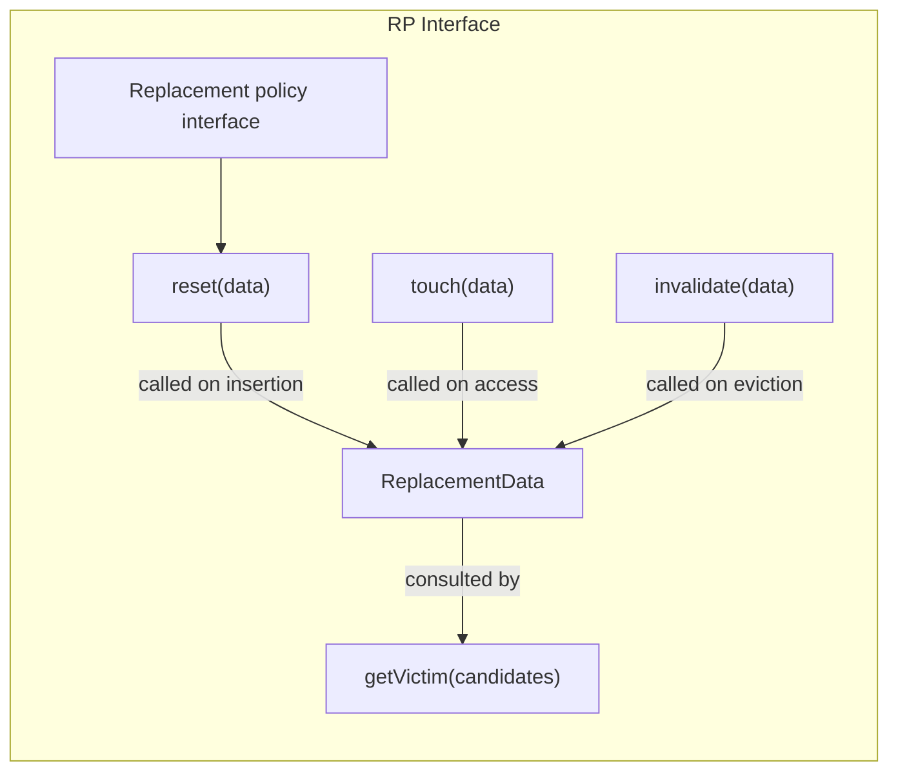
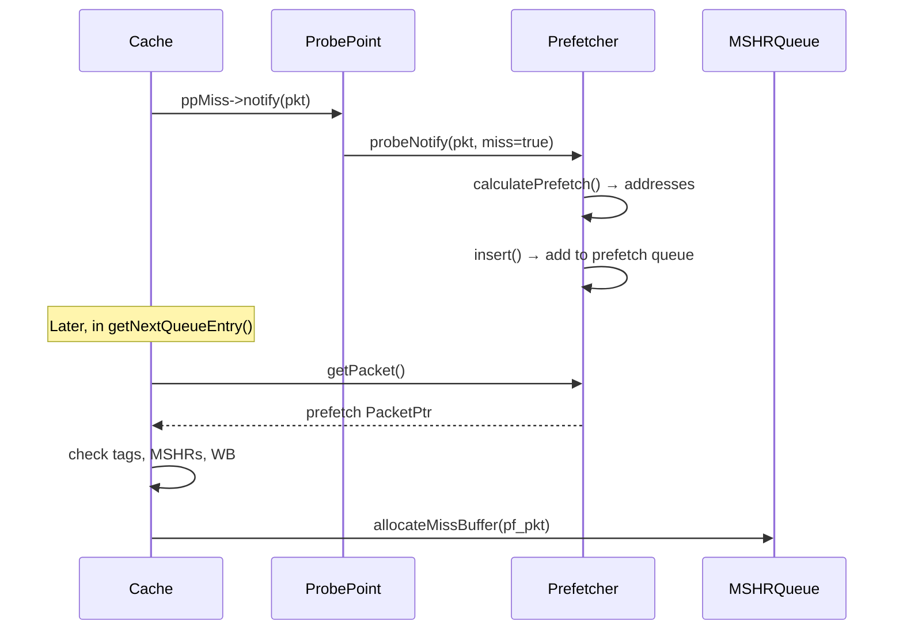

# Chapter 4: Replacement, Prefetching, and Measurement Discipline in the Classic Path

> *A cache hierarchy can be "better" on paper and worse in the simulator because the wrong secondary effect wins.*

## Contents

- [4.1 The Motivation: When Better Is Worse](#41-the-motivation-when-better-is-worse)
- [4.2 The Replacement Policy Interface](#42-the-replacement-policy-interface)
- [4.3 Policy Survey: Six Ways to Choose a Victim](#43-policy-survey-six-ways-to-choose-a-victim)
- [4.4 Tag Indexing: Where an Address Can Live](#44-tag-indexing-where-an-address-can-live)
- [4.5 The Prefetcher Interface](#45-the-prefetcher-interface)
- [4.6 Stride Prefetcher: The Default Engine](#46-stride-prefetcher-the-default-engine)
- [4.7 Tagged Prefetcher: The Simplest Contrast](#47-tagged-prefetcher-the-simplest-contrast)
- [4.8 Prefetcher-Cache Integration: Probes, Queues, and MSHR Budget](#48-prefetcher-cache-integration-probes-queues-and-mshr-budget)
- [4.9 Measurement Discipline: The Statistics You Need](#49-measurement-discipline-the-statistics-you-need)
- [4.10 Failure Modes: When Metrics Mislead](#410-failure-modes-when-metrics-mislead)
- [4.11 How We Know This](#411-how-we-know-this)
- [4.12 Experiment: Replacement and Prefetch Micro-Studies](#412-experiment-replacement-and-prefetch-micro-studies)
- [4.13 Tradeoffs: Policy Design Choices](#413-tradeoffs-policy-design-choices)
- [Key Ideas](#key-ideas)
- [1-Page Mental Model](#1-page-mental-model)
- [Common Misconceptions](#common-misconceptions)
- [If You Remember One Thing](#if-you-remember-one-thing)
- [Exercises](#exercises)

---

You enable a stride prefetcher on the L1 cache from Chapter 3.
Hit rate improves from 60% to 85%.
You declare victory.

Then you check `blockedCycles::no_mshrs` and discover it tripled.
The prefetcher is filling MSHRs with speculative requests, starving demand misses.
Average latency *increased* despite the higher hit rate.

This chapter teaches three things: how gem5's replacement policies decide which block to evict, how its prefetchers generate speculative requests, and how to measure the combined effect without fooling yourself.
By the end, you can design a controlled micro-study that isolates one variable, reads the right statistics, and defends its conclusions.

**Primary code anchors:**
- [`src/mem/cache/replacement_policies/base.hh`](../src/mem/cache/replacement_policies/base.hh) — replacement policy interface.
- [`src/mem/cache/replacement_policies/lru_rp.cc`](../src/mem/cache/replacement_policies/lru_rp.cc), [`fifo_rp.cc`](../src/mem/cache/replacement_policies/fifo_rp.cc), [`random_rp.cc`](../src/mem/cache/replacement_policies/random_rp.cc), [`bip_rp.cc`](../src/mem/cache/replacement_policies/bip_rp.cc), [`brrip_rp.cc`](../src/mem/cache/replacement_policies/brrip_rp.cc), [`tree_plru_rp.cc`](../src/mem/cache/replacement_policies/tree_plru_rp.cc) — policy implementations.
- [`src/mem/cache/replacement_policies/ReplacementPolicies.py`](../src/mem/cache/replacement_policies/ReplacementPolicies.py) — Python policy classes.
- [`src/mem/cache/tags/indexing_policies/set_associative.hh`](../src/mem/cache/tags/indexing_policies/set_associative.hh), [`skewed_associative.hh`](../src/mem/cache/tags/indexing_policies/skewed_associative.hh) — indexing policies.
- [`src/mem/cache/prefetch/base.hh`](../src/mem/cache/prefetch/base.hh) / [`base.cc`](../src/mem/cache/prefetch/base.cc) — prefetcher base class and probe integration.
- [`src/mem/cache/prefetch/queued.hh`](../src/mem/cache/prefetch/queued.hh) / [`queued.cc`](../src/mem/cache/prefetch/queued.cc) — queued prefetcher with priority queue.
- [`src/mem/cache/prefetch/stride.hh`](../src/mem/cache/prefetch/stride.hh) / [`stride.cc`](../src/mem/cache/prefetch/stride.cc) — stride prefetcher (the stdlib default).
- [`src/mem/cache/prefetch/tagged.cc`](../src/mem/cache/prefetch/tagged.cc) — tagged (next-line) prefetcher.
- [`src/mem/cache/prefetch/Prefetcher.py`](../src/mem/cache/prefetch/Prefetcher.py) — Python prefetcher classes.
- [`src/mem/cache/Cache.py`](../src/mem/cache/Cache.py) — `BaseCache` parameter definitions including replacement policy default.
- [`src/mem/cache/base.hh`](../src/mem/cache/base.hh) / [`base.cc`](../src/mem/cache/base.cc) — statistics definitions and prefetcher integration in `getNextQueueEntry()`.

**Runnable artifacts:**
- Chapter 3's `PrivateL1` and `PrivateL1PrivateL2` hierarchies with replacement policy and prefetcher overrides.
- `tests/gem5/replacement_policies/` — replacement policy validation suite.

**Chapter map:**
1. Start with the counterintuitive result that motivates measurement discipline.
2. Explain the replacement policy interface and survey six policies with worked examples.
3. Show how indexing policies affect where blocks can live.
4. Explain the prefetcher interface and trace the stride prefetcher step by step.
5. Trace how prefetches enter the cache through probes and MSHRs.
6. Build the statistics vocabulary and measurement checklist needed for defensible experiments.
7. Design experiments that isolate replacement and prefetch effects.

---

## 4.1 The Motivation: When Better Is Worse

### Intuition

Replacement policy and prefetching are the two primary knobs for tuning a cache hierarchy.
Replacement decides *what to keep*; prefetching decides *what to fetch speculatively*.
Both can improve hit rate.
Neither guarantees improved performance.

```
  Scenario A: LRU, no prefetcher           Scenario B: LRU + stride prefetcher
  ════════════════════════════              ════════════════════════════════════

  demandMissRate:    40%                    demandMissRate:    15%  ✓ better
  blockedCycles::no_mshrs:  200K            blockedCycles::no_mshrs:  600K  ✗ worse
  avgReadLatency:    85 ns                  avgReadLatency:   110 ns  ✗ worse!

  Why? Prefetcher consumed MSHRs.           Demand misses stalled behind
  Hit rate improved, but demand              prefetch requests.
  misses paid more queueing.
```

The lesson: never evaluate a cache policy change by a single metric.
This chapter builds the multi-metric vocabulary you need.

### Working Model

Three questions every cache experiment must answer:

1. **Did the hit rate change?** — `demandMissRate`
2. **Did the queue pressure change?** — `blockedCycles::no_mshrs`, `blockedCycles::no_wbuffers`
3. **Did the end-to-end latency change?** — `demandAvgMissLatency`, generator-visible `avgReadLatency`

If (1) improves but (2) worsens, the policy change may be a net loss.
If (1) and (2) both improve, you can be more confident.
If (3) did not improve despite (1) improving, something downstream absorbed the benefit.

**Definition: demand vs. prefetch.**
In this chapter, **demand** means the memory requests that come from the program's own load/store stream, not requests injected speculatively by a prefetcher.
Operationally, the demand side of gem5's cache statistics counts `ReadReq`, `WriteReq`, `WriteLineReq`, `ReadExReq`, `ReadCleanReq`, and `ReadSharedReq`.
The prefetch side counts `SoftPFReq`, `HardPFReq`, and `SoftPFExReq`.
`demand*` statistics include only the demand commands.
`overall*` statistics include both demand and prefetch commands.
If a prefetcher improves `overallMissRate` but not `demandMissRate`, it changed the traffic mix rather than the program's own misses.

---

## 4.2 The Replacement Policy Interface

### Intuition

Every replacement policy in gem5 answers one question: given a set of cache blocks, which one should be evicted to make room for a new block?

The interface is simple.
Each cache block carries a small `ReplacementData` object.
The policy updates this data on access and insertion, then uses it to pick a victim when space is needed.



### Working Model

The four methods every policy implements:

| Method | When called | Purpose |
|--------|------------|---------|
| `reset(data)` | Block inserted into cache | Initialize metadata (e.g., set to MRU) |
| `touch(data)` | Block accessed (hit) | Update metadata (e.g., move to MRU) |
| `invalidate(data)` | Block evicted | Mark as best candidate for future eviction |
| `getVictim(candidates)` | Cache needs to evict | Select one block from the candidate set |

`getVictim()` receives a `ReplacementCandidates` vector — all blocks in the target set (for set-associative) or the set of blocks that could hold the address (for skewed caches).
It returns a pointer to the chosen victim.

These four methods are the hooks from Chapter 3's cache machinery:
- `accessBlock()` in `BaseSetAssoc` ([base_set_assoc.hh:149](../src/mem/cache/tags/base_set_assoc.hh#L149)) calls `replacementPolicy->touch()` on a hit.
- `findVictim()` in `BaseSetAssoc` ([base_set_assoc.hh:185](../src/mem/cache/tags/base_set_assoc.hh#L185)) calls `replacementPolicy->getVictim()` to select an eviction candidate.
- `insertBlock()` in `BaseSetAssoc` ([base_set_assoc.hh:213](../src/mem/cache/tags/base_set_assoc.hh#L213)) calls `replacementPolicy->reset()` on a fill.

### Formal and Code

The base class is `replacement_policy::Base` ([base.hh:54–112](../src/mem/cache/replacement_policies/base.hh#L54-L112)), inheriting from `SimObject`.
Each policy defines its own `ReplacementData` struct (the base `ReplacementData` is an empty struct at [replaceable_entry.hh:48](../src/mem/cache/replacement_policies/replaceable_entry.hh#L48)).

Both `touch()` and `reset()` have two overloads: one taking just `ReplacementData`, and one taking `ReplacementData` plus a `PacketPtr`.
The packet-aware overload lets policies use access information (address, PC) for prediction.
By default, the packet-aware version calls the no-packet version.

The default replacement policy is **LRU**, set in `Cache.py` (line 111–113):

```python
replacement_policy = Param.BaseReplacementPolicy(LRURP(), "Replacement policy")
```

To override the policy on a stdlib cache after instantiation:

```python
from m5.objects.ReplacementPolicies import FIFORP
cache = L1DCache(size="32KiB")
cache.replacement_policy = FIFORP()
```

The stdlib cache classes (`L1DCache`, `L1ICache`, `L2Cache`) do not expose replacement policy as a constructor parameter — you set it as an attribute after creation.

---

## 4.3 Policy Survey: Six Ways to Choose a Victim

### Intuition

gem5 ships with over a dozen replacement policies.
Six cover the spectrum from simplest to research-grade:

```
Simplicity ──────────────────────────────────────────────── Sophistication

 Random      FIFO       LRU       BIP/LIP     BRRIP      TreePLRU
 (no state)  (insert    (access   (bimodal    (multi-bit  (tree of
              order)    recency)   insertion)  prediction)  direction
                                                           bits)
```

For each policy below, we trace a concrete sequence of accesses to a 4-way set.
Follow the metadata at each step — this is how you build intuition for what each policy actually does.

### Working Model

#### LRU — Least Recently Used

**Data:** `lastTouchTick` — the tick of the most recent access ([lru_rp.hh:52–61](../src/mem/cache/replacement_policies/lru_rp.hh#L52-L61)).

Throughout this section, **most-recent position** (sometimes abbreviated MRU) means the block with the highest tick — the one least likely to be evicted.
**Least-recent position** (LRU) means the block with the lowest tick — the next eviction victim.

**Behavior:**
- `touch()` → sets `lastTouchTick = curTick()` (move to most-recent position).
- `reset()` → sets `lastTouchTick = curTick()` (insert at most-recent position).
- `invalidate()` → sets `lastTouchTick = 0` (make ideal victim).
- `getVictim()` → returns block with smallest `lastTouchTick` (the least-recent block).

LRU is the default and the usual baseline for most studies.
Its weakness: scan-resistance.
A one-time sweep through a large array evicts all reused blocks.

**Worked example — 4-way set, LRU:**

Each letter stands for a distinct cache-line address.
A, B, C, D are the working set — lines the program reuses.
S1–S4 are lines touched only once during a large sequential traversal (e.g., zeroing an array).
Sequence: A, B, C, D (fill the set), A hit, B hit, then S1, S2, S3, S4.

| Step | Access | Type | Evict | State after (block:tick) | Why |
|------|--------|------|-------|--------------------------|-----|
| 1 | A | miss | — | A:1, -, -, - | Insert at MRU |
| 2 | B | miss | — | A:1, B:2, -, - | Insert at MRU |
| 3 | C | miss | — | A:1, B:2, C:3, - | Insert at MRU |
| 4 | D | miss | — | A:1, B:2, C:3, D:4 | Set full |
| 5 | A | **hit** | — | A:5, B:2, C:3, D:4 | touch() updates tick |
| 6 | B | **hit** | — | A:5, B:6, C:3, D:4 | touch() updates tick |
| 7 | S1 | miss | **C** | A:5, B:6, S1:7, D:4 | C has min tick (3) |
| 8 | S2 | miss | **D** | A:5, B:6, S1:7, S2:8 | D has min tick (4) |
| 9 | S3 | miss | **A** | S3:9, B:6, S1:7, S2:8 | A has min tick (5) |
| 10 | S4 | miss | **B** | S3:9, S4:10, S1:7, S2:8 | B has min tick (6) |

**Result:** The 4-block scan evicted the entire working set {A, B, C, D}.
Every scan block entered at the most-recent position, pushing all working-set blocks toward the least-recent position.
When A and B are accessed again, they will miss — the scan destroyed all reuse.

#### FIFO — First In, First Out

**Data:** `tickInserted` — a monotonic insertion counter ([fifo_rp.hh:54–69](../src/mem/cache/replacement_policies/fifo_rp.hh#L54-L69)).

**Behavior:**
- `touch()` → **no-op**. Accesses do not change eviction order.
- `reset()` → sets `tickInserted` to a monotonically increasing counter.
- `getVictim()` → returns block with smallest `tickInserted` (oldest insertion).

FIFO is simpler than LRU in hardware (no update on hits) and provides natural scan resistance: a large sweep inserts blocks but does not change the eviction order of previously inserted blocks.

**Worked example — 4-way set, FIFO:**

Same sequence: A, B, C, D, A hit, B hit, S1, S2.

| Step | Access | Type | Evict | State after (block:seq) | Why |
|------|--------|------|-------|--------------------------|-----|
| 1 | A | miss | — | A:1, -, -, - | |
| 2 | B | miss | — | A:1, B:2, -, - | |
| 3 | C | miss | — | A:1, B:2, C:3, - | |
| 4 | D | miss | — | A:1, B:2, C:3, D:4 | Set full |
| 5 | A | **hit** | — | A:1, B:2, C:3, D:4 | **touch() is no-op** — order unchanged |
| 6 | B | **hit** | — | A:1, B:2, C:3, D:4 | Same — hits never change order |
| 7 | S1 | miss | **A** | S1:5, B:2, C:3, D:4 | A has min seq (1) |
| 8 | S2 | miss | **B** | S1:5, S2:6, C:3, D:4 | B has min seq (2) |

FIFO evicts A and B despite them being recently accessed — it ignores hits entirely.
The upside: scan blocks cannot change the eviction order of established blocks.
FIFO's weakness is the opposite of LRU's: it gives no credit for reuse.

#### Random

**Data:** `valid` — a single boolean ([random_rp.hh:55–67](../src/mem/cache/replacement_policies/random_rp.hh#L55-L67)).

**Behavior:**
- `touch()` → no-op.
- `reset()` → sets `valid = true`.
- `invalidate()` → sets `valid = false`.
- `getVictim()` → chooses a random candidate, then lets the first invalid entry encountered while iterating through candidates win.

Random is the zero-state baseline.
If a more elaborate policy loses to Random on a workload, its extra metadata is not helping that workload.

**Worked example — 4-way set, Random:**

Same sequence: A, B, C, D, A hit, B hit, S1.

| Step | Access | Type | Evict | Note |
|------|--------|------|-------|------|
| 1–4 | A,B,C,D | miss | — | Fill set, all valid |
| 5 | A | **hit** | — | No-op — no state to update |
| 6 | B | **hit** | — | No-op |
| 7 | S1 | miss | **?** | Uniform random among {A, B, C, D} |

Any of the four blocks is equally likely to be evicted.
The recently-accessed A and B have no advantage — Random is indifferent to history.
Random gives A and B no special protection.
Unlike LRU under a scan, it does not deterministically evict the whole working set.

#### BIP — Bimodal Insertion Policy

BIP is a one-line change to LRU: instead of inserting new blocks as most-recent (where they are protected from eviction), BIP inserts them as oldest (where they will be evicted first).
A new block must earn its place by being accessed again — a hit promotes it to most-recent, just like LRU.
Blocks that are never reused (scan traffic) evict themselves instead of the working set.

**Data:** Inherits LRU's `lastTouchTick` ([bip_rp.hh:56](../src/mem/cache/replacement_policies/bip_rp.hh#L56), BIP extends LRU).

**Behavior:**
- `touch()` → same as LRU (promote to most-recent).
- `reset()` → with probability `btp/100`, insert at most-recent (`lastTouchTick = curTick()`); otherwise insert as oldest (`lastTouchTick = 1`).
- `getVictim()` → same as LRU (evict the block with the smallest tick).

The `btp` (bimodal throttle parameter) controls how often new blocks skip the "prove yourself" period and insert directly as most-recent.
The default is `btp = 3` (only 3% of insertions go to the most-recent position).
The other 97% enter as oldest and will be evicted on the very next miss — unless a hit rescues them first.

**LIP** (LRU Insertion Policy) is the special case `btp = 0` — all insertions go to the oldest position, no exceptions.

**Worked example — 4-way set, BIP (btp=3%):**

Working set in cache after prior access: A:10, B:8, C:6, D:4 (the number after `:` is the `lastTouchTick` from the most recent access).
A scan of 4 blocks arrives. With btp=3%, 97% of insertions go to tick=1 (LRU position).

| Step | Access | Type | Evict | State after | Why |
|------|--------|------|-------|-------------|-----|
| — | | | | A:10, B:8, C:6, D:4 | Working set, recently touched |
| 1 | S1 | miss | **D** | A:10, B:8, C:6, S1:1 | D oldest (tick 4). S1 inserts at LRU (tick=1, 97% case) |
| 2 | S2 | miss | **S1** | A:10, B:8, C:6, S2:1 | S1 has tick=1, smallest. Evicted immediately. |
| 3 | S3 | miss | **S2** | A:10, B:8, C:6, S3:1 | Same — each scan block evicts the previous one |
| 4 | S4 | miss | **S3** | A:10, B:8, C:6, S4:1 | Scan blocks cycle through one slot |

**Result:** Only D was lost from the working set.
Scan blocks entered at tick=1 (near-LRU) and evicted each other in rapid succession.
A, B, and C survived because their touch ticks (10, 8, 6) were higher.
Compare with LRU, where the same scan evicted the entire working set.

#### BRRIP — Bimodal Re-Reference Interval Prediction

BRRIP generalizes BIP's binary "oldest or most-recent" choice into a multi-level prediction.
Each block carries a small counter (RRPV — Re-Reference Prediction Value) that estimates how far away its next access is: 0 means "will be reused soon," maximum means "probably not reused."
New blocks enter with the highest RRPV (distant prediction) so they are evicted first — the same "prove yourself" idea as BIP.
Hits decrease the counter, giving reused blocks more protection.
When no block is at maximum RRPV, all counters are aged upward until a victim emerges.

**Data:** `rrpv` — a saturating counter of configurable width, plus a `valid` flag ([brrip_rp.hh:71–92](../src/mem/cache/replacement_policies/brrip_rp.hh#L71-L92)).

**Behavior:**
- `reset()` → sets RRPV to maximum ("this block is predicted to not be reused"); with probability `btp/100`, decrements by one ("maybe it will be reused").
- `touch()` → in HP mode (Hit Priority — a hit means "will be reused very soon"): resets RRPV to 0. In FP mode (Frequency Priority — each hit gradually increases confidence): decrements RRPV by 1.
- `getVictim()` → finds block with highest RRPV; if none at maximum, **ages all blocks** by incrementing all RRPVs by the difference, then returns the victim.

The `NRURP` specialization is the `num_bits = 1`, `btp = 100` case.
The `RRIPRP` specialization is the `num_bits = 2`, `btp = 100` SRRIP case.

Default Python parameters (`ReplacementPolicies.py`):
- `num_bits = 2` (4 levels: 0–3)
- `hit_priority = False` (FP mode — decrement on hit)
- `btp = 3` (3% bimodal insertion)

**Worked example — 4-way set, BRRIP (2-bit RRPV, range 0–3, FP mode):**

Working set blocks have been accessed multiple times and have low RRPV.
A scan of 4 blocks arrives.

| Step | Access | Type | Evict | RRPV state {W0, W1, W2, W3} | Key action |
|------|--------|------|-------|------|------------|
| — | | | | W0:0, W1:1, W2:1, W3:2 | Working set, various reuse |
| 1 | S1 | miss | **W3** | W0:1, W1:2, W2:2, S1:3 | getVictim: max RRPV is 2 (W3). W3 not at max(3), so **age all: diff=1, all RRPV += 1**. W3→3 (victim). Insert S1 at RRPV=3. |
| 2 | S2 | miss | **S1** | W0:1, W1:2, W2:2, S2:3 | S1 already at RRPV=3 (max). No aging. Evict S1. Insert S2 at 3. |
| 3 | S3 | miss | **S2** | W0:1, W1:2, W2:2, S3:3 | S2 at max. Evict. |
| 4 | S4 | miss | **S3** | W0:1, W1:2, W2:2, S4:3 | Same — scan blocks evict each other |

**Result:** W0, W1, and W2 survived with their working-set RRPV values intact.
Scan blocks entered at RRPV=3 (the maximum — "distant re-reference") and were evicted before any working-set block with a lower RRPV.
Only W3 was lost because it had the highest RRPV among working-set blocks and became the victim when aging pushed it to maximum.

**The aging mechanism:** When `getVictim()` finds no block at maximum RRPV, it calls `saturate()` on the victim's counter (returning the difference), then increments *all* candidates by that difference.
This ensures some block always reaches maximum for eviction, while preserving relative ordering:

```cpp
// brrip_rp.cc:130–141
int diff = std::static_pointer_cast<BRRIPReplData>(
    victim->replacementData)->rrpv.saturate();
if (diff > 0) {
    for (const auto& candidate : candidates) {
        std::static_pointer_cast<BRRIPReplData>(
            candidate->replacementData)->rrpv += diff;
    }
}
```

#### TreePLRU — Tree Pseudo-LRU

True LRU tracks the full access order, which costs a timestamp per block.
TreePLRU approximates LRU cheaply using a binary tree of direction bits — one bit per internal node, only $\text{assoc} - 1$ bits total per set.
Each access flips the tree bits to point *away* from the accessed block ("I was just used, evict someone else").
To find a victim, follow the bits from root to leaf — they guide you toward the least-recently-used block.

**Data:** A shared tree of direction bits, one per internal node ([tree_plru_rp.hh:88–155](../src/mem/cache/replacement_policies/tree_plru_rp.hh#L88-L155)).

**Behavior:**
- `touch()` / `reset()` → updates tree bits to point *away* from the accessed block ("I was just used — evict someone else").
- `invalidate()` → updates tree bits to point *toward* the block ("evict me next").
- `getVictim()` → traverses from root, following bit directions, until reaching a leaf.

For an 8-way cache, this is 7 bits per set vs. 8 full tick values.
The approximation is imperfect: it can evict a recently used block if two blocks share the same subtree path.

**Worked example — 4-way set, TreePLRU:**

The tree has 3 internal nodes for 4 leaves (ways 0–3):

```
        [node 0]
       /        \
   [node 1]   [node 2]
   /    \      /    \
  W0    W1    W2    W3
```

A bit value of 0 means "go left," 1 means "go right."
`getVictim()` follows the bits from root to leaf.
`touch()` flips every bit on the path to point *away* from the accessed leaf.

| Step | Access | Tree bits [0,1,2] | getVictim result | Explanation |
|------|--------|-------------------|------------------|-------------|
| init | — | [0, 0, 0] | W0 | Root→left, node1→left → W0 |
| 1 | touch W0 | [**1**, **1**, 0] | W2 | W0 is left child of node1 (flip node1→1), node1 is left child of root (flip root→1). Now root→right, node2→left → W2 |
| 2 | touch W2 | [**0**, 1, **1**] | W1 | W2 is left child of node2 (flip node2→1), node2 is right child of root (flip root→0). Now root→left, node1→right → W1 |
| 3 | touch W1 | [**1**, **0**, 1] | W3 | W1 is right child of node1 (flip node1→0), node1 is left child of root (flip root→1). Now root→right, node2→right → W3 |
| 4 | touch W3 | [**0**, 0, **0**] | W0 | W3 is right child of node2 (flip node2→0), node2 is right child of root (flip root→0). Back to initial state. |

The tree naturally rotates through all four ways.
After touching W0, W2, W1, and W3 in sequence, the tree returns to its initial state — every leaf has been used once and the next victim is W0 again.

**The approximation gap:** TreePLRU can mis-order blocks that share a subtree.
If W0 and W1 are both accessed in rapid succession, they both flip the same path through node 1.
The tree remembers only the *last* access in each subtree, not the full recency order.
For 4-way caches this rarely matters; for 16-way caches the approximation can deviate noticeably from true LRU.

### Formal and Code

All policies are registered in `ReplacementPolicies.py`.
The full list of available Python classes:

| Python class | Algorithm | Key parameters |
|-------------|-----------|----------------|
| `LRURP` | LRU | — |
| `FIFORP` | FIFO | — |
| `RandomRP` | Random | — |
| `MRURP` | Most Recently Used | — |
| `BIPRP` | BIP | `btp` (default: 3%) |
| `LIPRP` | LIP | `btp = 0` |
| `BRRIPRP` | BRRIP | `num_bits` (2), `hit_priority` (False), `btp` (3%) |
| `RRIPRP` | SRRIP | `btp = 100` |
| `NRURP` | NRU | `num_bits = 1`, `btp = 100` |
| `DRRIPRP` | Dueling BRRIP | `constituency_size`, `team_size` |
| `TreePLRURP` | Tree PLRU | `num_leaves` (default: cache assoc) |
| `LFURP` | Least Frequently Used | — |
| `SecondChanceRP` | Second Chance (Clock) | — |
| `SHiPMemRP` | SHiP (memory) | `shct_size` (16384) |
| `SHiPPCRP` | SHiP (PC) | `shct_size` (16384) |
| `WeightedLRURP` | Weighted LRU | — |

---

## 4.4 Tag Indexing: Where an Address Can Live

### Intuition

Chapter 3 showed that `BaseSetAssoc` organizes blocks into sets and ways.
Recall the standard lookup: extract a set index from the address, go to that one row, and compare the tag against every way in that row in parallel.
All ways share the same row — so two different addresses that happen to produce the same set index always compete for the same 4 slots (in a 4-way cache), even when other rows are completely empty.

Skewed associativity changes the lookup itself.
The raw set-index bits from the address are no longer used directly.
Instead of extracting one set index and checking the same row in all ways, the cache applies a **different hash function per way** to compute the row:

1. Compute `hash_0(addr)` → fetch the entry at that row in way 0.
2. Compute `hash_1(addr)` → fetch the entry at that row in way 1.
3. Compute `hash_2(addr)` → fetch the entry at that row in way 2.
4. ... and so on for each way.
5. Compare each fetched tag against the address tag — a match in any way is a hit.

Because the hash functions differ, the candidate slots for a single address are scattered across different rows.
Address A's candidate in way 0 might be row 5, but its candidate in way 1 might be row 12.
Address B might also hash to row 5 in way 0 (a conflict with A), but to row 7 in way 1 (no conflict).
The result: conflicts are spread across the cache instead of concentrated in one row.

The tradeoff: a standard cache reads one row and compares all ways in parallel (fast, simple hardware).
A skewed cache must read from multiple rows (more complex routing and slightly higher latency), but reduces conflict misses.

Each `A` marks a candidate location — where address A *could* be placed.
The replacement policy picks one of those slots; A is stored in exactly one at a time.

```
 Standard Set-Associative          Skewed Associative
 (same set in all ways)            (different set per way)

   Way 0  1  2  3                   Way 0  1  2  3
    ┌──┬──┬──┬──┐                    ┌──┬──┬──┬──┐
  0 │  │  │  │  │                  0 │  │  │A │  │
  1 │  │  │  │  │                  1 │  │  │  │A │
  2 │  │  │  │  │                  2 │  │  │  │  │
  3 │A │A │A │A │ ← all compete    3 │A │  │  │  │ ← spread out
  4 │  │  │  │  │                  4 │  │  │  │  │
  5 │  │  │  │  │                  5 │  │A │  │  │
    └──┴──┴──┴──┘                    └──┴──┴──┴──┘
```

### Working Model

**SetAssociative** (`set_associative.hh`):

```cpp
uint32_t extractSet(const Addr addr) const {
    return (addr >> setShift) & setMask;
}
```

Simple and fast.
`getPossibleEntries()` returns all ways in one set.
Same address → same set → all ways compete.

**Concrete conflict example:**

Consider a 4 KiB cache with 4 ways, 64-byte lines → 16 sets.
`setShift = 6` (log₂ 64), `setMask = 15` (16 − 1), `tagShift = 10` (6 + log₂ 16).

Address decomposition: `| tag (bits 63:10) | set index (bits 9:6) | block offset (bits 5:0) |`

| Address | Set index = (addr >> 6) & 15 | Tag = addr >> 10 |
|---------|------------------------------|------------------|
| 0x1000 | (0x40) & 15 = **0** | 4 |
| 0x2000 | (0x80) & 15 = **0** | 8 |
| 0x3000 | (0xC0) & 15 = **0** | 12 |
| 0x4000 | (0x100) & 15 = **0** | 16 |
| 0x5000 | (0x140) & 15 = **0** | 20 |

All five addresses map to set 0.
In a 4-way cache, only four can coexist — the fifth forces an eviction.
These are **conflict misses**: the cache has 16 sets × 4 ways = 64 blocks of capacity, but all five addresses compete for the same 4 slots.

**SkewedAssociative** (`skewed_associative.hh`):

Uses 8 pre-defined hash functions based on the H function from Seznec (1993).
Each function combines hash/dehash operations on two address fields with XOR:

```
way 0: hash(addr1) ^ hash(addr2) ^ addr2
way 1: hash(addr1) ^ hash(addr2) ^ addr1
way 2: hash(addr1) ^ dehash(addr2) ^ addr2
...
```

The `hash()` function ([skewed_associative.cc:63–73](../src/mem/cache/tags/indexing_policies/skewed_associative.cc#L63-L73)) XORs the MSB and LSB of an address field and shifts:

```cpp
Addr hash(const Addr addr) const {
    const uint8_t lsb = bits(addr, 0);
    const uint8_t msb = bits(addr, msbShift);
    const uint8_t xor_bit = msb ^ lsb;
    return insertBits(addr >> 1, msbShift, xor_bit);
}
```

`getPossibleEntries()` returns entries from *different sets per way*:

```cpp
for (uint32_t way = 0; way < assoc; ++way) {
    entries.push_back(sets[extractSet(addr, way)][way]);
}
```

**Same five addresses under skewed indexing:**

Each way hashes the address with a different function to compute its row — the raw set-index bits are never used directly.
Addresses 0x1000 and 0x2000, which both mapped to set 0 in standard indexing, now hash to different sets per way.
The per-way hash distributes them across the cache, making it unlikely that all five addresses compete for the same slots.

The tradeoff: skewed associativity adds complexity to address regeneration (the `deskew()` function inverts the per-way hash) but requires no additional storage per block — the hash is computed from the address and way number.

### Formal and Code

The default cache tag store uses `TaggedSetAssociative()` in `Tags.py`.
Its underlying set-selection logic is the standard bit-extraction mapping shown above.
To switch to skewed:

```python
from m5.objects import SkewedAssociative
cache.tags.indexing_policy = SkewedAssociative()
```

> **Deep Dive:** For associativities above 8, SkewedAssociative stacks additional `hash()` operations on top of the base 8 functions.
> The code warns that this is "sub-optimal" ([skewed_associative.cc:52](../src/mem/cache/tags/indexing_policies/skewed_associative.cc#L52)).
> In practice, most L1 caches use 4–8 ways, where all 8 functions are distinct.

---

## 4.5 The Prefetcher Interface

### Intuition

A prefetcher observes cache accesses and speculatively generates requests for blocks the program will likely need soon.
If the prediction is correct, a future demand access hits in the cache instead of missing.
If wrong, the prefetch wastes bandwidth, MSHR slots, and cache capacity.



### Working Model

gem5's prefetcher uses the simulator's **probe system** to observe cache events without tight coupling.
The cache defines four probe points:

| Probe | Fires when | Prefetcher action |
|-------|-----------|-------------------|
| `"Miss"` | Demand miss detected | Calls `probeNotify()` with `miss=true` |
| `"Hit"` | Demand hit | Calls `probeNotify()` with `miss=false`; `observeAccess()` later filters ordinary hits unless `prefetch_on_access` or `prefetch_on_pf_hit` allows them |
| `"Fill"` | Block installed after fill | Calls `notifyFill()` |
| `"Data Update"` | Eviction-style data update with no new block data | Calls `notifyEvict()` only when the update carries no new data |

On notification, the prefetcher:
1. Checks if the accessed block was previously prefetched — if so, increments `pfUseful`.
2. Filters the access. Ordinary demand hits are observed only when `prefetch_on_access` is true, or when the line was previously prefetched and `prefetch_on_pf_hit` is true; the `on_miss`, `on_read`, `on_write`, `on_data`, and `on_inst` flags narrow the stream further.
3. Creates a `PrefetchInfo` from the packet (address, PC, size, security, miss status).
4. Calls the policy-specific `notify()` → `calculatePrefetch()`, which returns a list of addresses to prefetch.
5. Queues the prefetch requests.

The prefetch queue is separate from MSHRs.
Prefetches enter the MSHR queue only when `getNextQueueEntry()` finds no pending demand or writeback work *and* `canPrefetch()` confirms that sufficient MSHRs remain for demand access.

### Formal and Code

The class hierarchy:

```
ClockedObject
  └── prefetch::Base           (base.hh)    — probe listeners, statistics
        └── prefetch::Queued   (queued.hh)  — prefetch queue management
              ├── prefetch::Stride  (stride.hh) — stride detection
              └── prefetch::Tagged  (tagged.hh) — next-line prefetching
```

`PrefetchInfo` ([base.hh:112–275](../src/mem/cache/prefetch/base.hh#L112-L275)) carries the access context:

| Field | Type | Purpose |
|-------|------|---------|
| `address` | `Addr` | Training address (virtual or physical) |
| `pc` | `Addr` | PC that generated the access |
| `cacheMiss` | `bool` | Whether this was a cache miss |
| `write` | `bool` | Whether this was a write |
| `size` | `unsigned` | Access size in bytes |
| `secure` | `bool` | Secure memory space flag |

The `Queued` base class ([queued.hh:59](../src/mem/cache/prefetch/queued.hh#L59)) manages a priority-ordered list of `DeferredPacket` objects (default capacity: 32 entries).
When the queue is full, the lowest-priority, oldest entry is evicted.
Duplicate detection (`queueFilter = true`) prevents the same address from being queued twice.

---

## 4.6 Stride Prefetcher: The Default Engine

### Intuition

The stride prefetcher is the default in all stdlib caches (`L1DCache`, `L1ICache`, `L2Cache` — each sets `PrefetcherCls = StridePrefetcher` in its constructor).
It detects when a program counter (PC) accesses memory with a constant stride and prefetches ahead along that stride.

> **Note:** Attaching a stride prefetcher to the L1I cache is a simulator convenience, not a model of real hardware.
> In real processors the branch predictor and speculative fetch unit effectively serve as the I-cache prefetcher:
> the fetch unit chases predicted paths well ahead of retirement, warming the I-cache along the way.
> A stride prefetcher — designed for regular data-access patterns like array walks — has little to work with on instruction streams.
> gem5 does not disable it for the O3 CPU model either; users who want realistic I-cache behavior
> can set `l1i.prefetcher = NULL` after construction (the `BaseCache` parameter defaults to `NULL`).

```
  Access pattern:  0x1000, 0x1040, 0x1080, 0x10C0, ...
  Detected stride: +0x40  (one cache line)
  Prefetches:      0x1100, 0x1140, 0x1180, 0x11C0  (degree=4)
```

### Working Model

The stride prefetcher maintains a **PC table** — an associative cache indexed by program counter.
By default, `use_requestor_id = True`, so gem5 keeps a separate table per requestor id.
Each entry (`StrideEntry`, [stride.hh:137–146](../src/mem/cache/prefetch/stride.hh#L137-L146)) stores:

| Field | Purpose |
|-------|---------|
| `lastAddr` | Last address accessed by this PC |
| `stride` | Detected stride value |
| `confidence` | Saturating counter (3 bits, range 0–7) |

**Detection algorithm** ([stride.cc:127–209](../src/mem/cache/prefetch/stride.cc#L127-L209)):

1. Look up the PC in the table.
2. If found: compute `new_stride = current_addr - lastAddr`.
   - If `new_stride == entry->stride`: increment confidence.
   - If mismatch: decrement confidence. If confidence drops below threshold, train new stride.
   - Update `lastAddr`.
3. If not found: allocate a new entry with `lastAddr = current_addr`. No prefetches yet.
4. **Generate prefetches only if** confidence saturation ≥ `confidence_threshold` (default: 50%).
5. Generate `degree` prefetches starting one stride beyond the demand address after the optional `distance` skip.
   In code, the first prefetch is `current_addr + (distance + 1) * stride`, then each subsequent prefetch adds another stride.

**Default parameters** ([Prefetcher.py:176–222](../src/mem/cache/prefetch/Prefetcher.py#L176-L222)):

| Parameter | Default | Meaning |
|-----------|---------|---------|
| `confidence_counter_bits` | 3 | Counter range 0–7 |
| `initial_confidence` | 4 | New entries start at 4/7 ≈ 57% |
| `confidence_threshold` | 50% | Must reach 50% saturation to prefetch |
| `degree` | 4 | Generate 4 prefetches per trigger |
| `distance` | 0 | No skip (start from next stride) |
| `on_miss` | False | Not restricted to misses |
| `prefetch_on_access` | False | Ordinary hits do not retrain the prefetcher |
| `prefetch_on_pf_hit` | True | Hits on prefetched lines are observed |
| `use_requestor_id` | True | Keep a separate PC table per requestor |
| `use_cache_line_address` | True | Work on cache-line addresses |
| `table_entries` | 64 | PC table capacity |
| `table_assoc` | 4 | 4-way associative PC table |
| `on_inst` | False | Does not prefetch on instruction accesses |

**Worked example — tracing a PC through the stride table:**

A load instruction at PC `0xA00` accesses addresses `0x100`, `0x140`, `0x180`, `0x1C0` on consecutive executions.
Assume 64-byte cache lines (`blkSize = 64`), `useCachelineAddr = true`.

| Access | Address | pf_addr | New stride | Match? | Confidence | ≥ threshold? | Prefetches generated |
|--------|---------|---------|------------|--------|------------|--------------|---------------------|
| 1 | 0x100 | 0x100 | — | — | **4** (initial) | — | None. PC table miss → allocate entry: lastAddr=0x100, stride=0 |
| 2 | 0x140 | 0x140 | 0x40 | No (0x40 ≠ 0) | 4→**3** | 3/7=43% **No** | None. Confidence dropped below 50%, so retrain: stride=0x40 |
| 3 | 0x180 | 0x180 | 0x40 | **Yes** | 3→**4** | 4/7=57% **Yes** | **{0x1C0, 0x200, 0x240, 0x280}** |
| 4 | 0x1C0 | 0x1C0 | 0x40 | **Yes** | 4→**5** | 5/7=71% **Yes** | **{0x200, 0x240, 0x280, 0x2C0}** |

Walk through the key transitions:

**Access 1:** PC `0xA00` not found in table → allocate new entry.
Entry: `{lastAddr: 0x100, stride: 0, confidence: 4}`.
Confidence starts at `initial_confidence = 4`.
No prefetches — a new entry has no stride to extend.

**Access 2:** PC `0xA00` found. `new_stride = 0x140 − 0x100 = 0x40`.
Stride was 0, so mismatch → `confidence--` to 3.
`calcSaturation() = 3/7 ≈ 0.43 < 0.50` → below threshold, so **retrain**: `stride = 0x40`.
Update `lastAddr = 0x140`.
No prefetches generated (below threshold).

**Access 3:** `new_stride = 0x180 − 0x140 = 0x40`.
Matches stored stride → `confidence++` to 4.
`calcSaturation() = 4/7 ≈ 0.57 ≥ 0.50` → **above threshold**.
Generate 4 prefetches: `0x180 + 0x40 = 0x1C0`, then `+0x40` each → `{0x1C0, 0x200, 0x240, 0x280}`.

**Access 4:** `new_stride = 0x1C0 − 0x180 = 0x40`. Match → confidence to 5.
Address `0x1C0` was already prefetched by access 3 — this demand hit on a prefetched block increments `pfUseful`.
New prefetches: `{0x200, 0x240, 0x280, 0x2C0}`.
Addresses `0x200`, `0x240`, `0x280` were already prefetched or queued, so the queue filter (`queueFilter = true`) deduplicates them — only `0x2C0` is actually new.

**What happens on a stride change?**
Suppose access 5 is to `0x300` instead of `0x200`.
`new_stride = 0x300 − 0x1C0 = 0x140`. Mismatch → `confidence--` to 4.
`calcSaturation() = 4/7 ≈ 0.57 ≥ 0.50` → still above threshold, so the old stride (0x40) is *not* retrained.
Prefetches still use stride 0x40: `{0x340, 0x380, ...}` — the prefetcher resists retraining until confidence drops below 50%.
One more consecutive mismatch drops confidence to 3/7, which is below threshold, and that is when the stride is retrained to the new value.

### Formal and Code

The confidence threshold is the gatekeeper.
With `initial_confidence = 4` and a 3-bit counter (max 7), a new entry has saturation 4/7 ≈ 57% — just above the 50% threshold.
In the default flow, the first access allocates the entry, the second access learns the stride but drops confidence below threshold, and the third access is the first one that issues prefetches.
After that, a matching access raises confidence back above threshold; a mismatch drops it.
If confidence falls below threshold, prefetch generation stops until it recovers.

The PC table uses its own replacement policy (default: `RandomRP`) and a custom hash for set indexing (`StridePrefetcherHashedSetAssociative`, [stride.hh:80–93](../src/mem/cache/prefetch/stride.hh#L80-L93)):

```cpp
uint32_t extractSet(const KeyType &key) const {
    const Addr pc = key.address;
    const Addr hash1 = pc >> 1;
    const Addr hash2 = hash1 >> tagShift;
    return (hash1 ^ hash2) & setMask;
}
```

This XOR-based hash reduces aliasing for PCs that differ only in low-order bits.

---

## 4.7 Tagged Prefetcher: The Simplest Contrast

### Intuition

The tagged prefetcher is a next-line prefetcher: on every access it prefetches the next `degree` consecutive cache blocks.
No history, no stride detection, no confidence — just "fetch what comes next."

### Working Model

`calculatePrefetch()` ([tagged.cc:50–61](../src/mem/cache/prefetch/tagged.cc#L50-L61)):

```cpp
Addr blkAddr = blockAddress(pfi.getAddr());
for (int d = 1; d <= degree; d++) {
    Addr newAddr = blkAddr + d * blkSize;
    addresses.push_back(AddrPriority(newAddr, 0));
}
```

Default `degree = 2` — two blocks ahead.

**When Tagged beats Stride:**
Tagged is the simpler PC-independent baseline.
Use it when you want to compare against pure next-line behavior or when the PC stream is not the signal you want to study.
It prefetches blindly but correctly for linear patterns.

**When Stride beats Tagged:**
Any non-unit-stride pattern (stride-2, stride-8, pointer-chasing with regular offsets) or any stream where the same PC repeats with a stable offset.
Tagged wastes bandwidth prefetching the wrong blocks.
Stride adapts to the actual pattern.

---

## 4.8 Prefetcher-Cache Integration: Probes, Queues, and MSHR Budget

### Intuition

The prefetcher and cache communicate through two interfaces: probes (cache → prefetcher, "here's what happened") and the prefetch queue (prefetcher → cache, "here's what to fetch").
The MSHR budget prevents the prefetcher from starving demand misses.

```
┌──────────────────────────────────────────────────────────┐
│                     BaseCache                            │
│                                                          │
│  CpuSidePort ──► recvTimingReq()                         │
│                    │                                     │
│                    ├── HIT ─── ppHit->notify() ──────┐   │
│                    │                                 │   │
│                    └── MISS ── ppMiss->notify() ─────┤   │
│                                                      │   │
│                                                      ▼   │
│  ┌─────────┐    ┌──────────┐    ┌────────────────┐       │
│  │MSHRQueue│    │WriteQueue│    │  Prefetcher    │       │
│  │         │    │          │    │  ┌──────────┐  │       │
│  │[demand] │    │[eviction]│    │  │  PF Queue│  │       │
│  │[demand] │    │[eviction]│    │  │ [pf pkt] │  │       │
│  │[  pf  ] │◄───┤          │    │  │ [pf pkt] │  │       │
│  │[  pf  ] │    │          │    │  └──────────┘  │       │
│  └────┬────┘    └────┬─────┘    └───────┬────────┘       │
│       └──────┬───────┘                  │                │
│              ▼                          │                │
│       getNextQueueEntry()               │                │
│         1. writeBuffer (if full)        │                │
│         2. mshrQueue                    │                │
│         3. prefetcher->getPacket() ◄────┘                │
│              │                                           │
│              ▼                                           │
│         MemSidePort ──► downstream                       │
└──────────────────────────────────────────────────────────┘
```

### Working Model

**Prefetch priority is lowest.**
In `getNextQueueEntry()` ([base.cc:904–993](../src/mem/cache/base.cc#L904-L993)):
1. If a ready writeback exists and either the write buffer is full or no miss is ready, service the writeback first.
2. Otherwise, service the ready demand MSHR.
3. Only when neither a demand miss nor a writeback is ready does the cache consider a prefetch.

**MSHR budget protection** ([mshr_queue.hh:158–163](../src/mem/cache/mshr_queue.hh#L158-L163)):

```cpp
bool canPrefetch() const {
    // @todo we may want to revisit the +1, currently added to
    // keep regressions unchanged
    return (allocated < numEntries - (numReserve + 1 + demandReserve));
}
```

With 16 MSHRs, `numReserve = 0`, and `demand_mshr_reserve = 1`, a prefetch can only be issued if fewer than 14 MSHRs are allocated.
This guarantees at least 2 MSHRs remain available for demand misses (the reserve plus one additional slot from the `+1`).

**Redundancy filtering** ([base.cc:955–990](../src/mem/cache/base.cc#L955-L990)):
Before allocating an MSHR for a prefetch, the cache checks:
- Is the block already in the cache? → `pfHitInCache++`, drop.
- Is there already an MSHR for this block? → `pfHitInMSHR++`, drop.
- Is there a write-buffer entry for this block? → `pfHitInWB++`, drop.

Only if all three checks pass does the prefetch allocate an MSHR.

**Useful-prefetch tracking:**
When a demand access hits a block whose `_prefetched` flag is set ([cache_blk.hh:508](../src/mem/cache/cache_blk.hh#L508)), `probeNotify()` ([base.cc:246–251](../src/mem/cache/base.cc#L246-L251)) increments `pfUseful` and clears the flag.
If a prefetched block is evicted before any demand access touches it, `prefetchUnused()` increments `pfUnused` ([base.cc:1730–1732](../src/mem/cache/base.cc#L1730-L1732)).

### Formal and Code

The prefetcher attaches to the cache's probe manager during `regProbeListeners()` ([base.cc:271–288](../src/mem/cache/base.cc#L271-L288)).
If the configuration script did not add custom probes, gem5 installs the default listeners for "Miss", "Fill", "Hit", and "Data Update".

The useful-prefetch detection happens in `probeNotify()`:

```cpp
// base.cc:248–256
bool has_been_prefetched =
    acc.cache.hasBeenPrefetched(pkt->getAddr(), pkt->isSecure(), requestorId);
if (has_been_prefetched) {
    usefulPrefetches += 1;
    prefetchStats.pfUseful++;
    if (miss)
        prefetchStats.pfUsefulButMiss++;
}
```

And the unused tracking in `BaseCache` when a block is invalidated:

```cpp
// base.cc:1730–1732
if (blk->wasPrefetched()) {
    prefetcher->prefetchUnused();
}
```

---

## 4.9 Measurement Discipline: The Statistics You Need

### Intuition

gem5's cache statistics are organized in two layers: **per-command** stats (broken down by `MemCmd` type) and **aggregate** formulas that combine commands into demand and overall categories.

Understanding this structure prevents the single most common measurement error: reporting `overallMissRate` (which includes prefetch misses) and interpreting it as demand behavior.

### Working Model

**Demand vs. overall:**

gem5 defines six **demand** commands and three **non-demand** (prefetch) commands via macros in `base.cc` (lines 2361–2369):

```cpp
#define SUM_DEMAND(s) \
    (cmd[MemCmd::ReadReq]->s + cmd[MemCmd::WriteReq]->s + \
     cmd[MemCmd::WriteLineReq]->s + cmd[MemCmd::ReadExReq]->s + \
     cmd[MemCmd::ReadCleanReq]->s + cmd[MemCmd::ReadSharedReq]->s)

#define SUM_NON_DEMAND(s) \
    (cmd[MemCmd::SoftPFReq]->s + cmd[MemCmd::HardPFReq]->s + \
     cmd[MemCmd::SoftPFExReq]->s)
```

| Category | Commands |
|----------|----------|
| **Demand** | `ReadReq`, `WriteReq`, `WriteLineReq`, `ReadExReq`, `ReadCleanReq`, `ReadSharedReq` |
| **Non-demand** | `SoftPFReq`, `HardPFReq`, `SoftPFExReq` |

The `demandMissRate` formula sums only demand commands.
The `overallMissRate` formula sums demand + prefetch commands.

**The statistics hierarchy:**

```
system.cache_hierarchy.l1dcaches0.
├── demandHits::total              ← demand reads + writes that hit
├── demandMisses::total            ← demand reads + writes that missed
├── demandMissRate::total          ← demandMisses / (demandHits + demandMisses)
├── demandAvgMissLatency::total    ← total miss latency / demandMisses
├── overallHits::total             ← demand + prefetch hits
├── overallMisses::total           ← demand + prefetch misses
├── overallMissRate::total         ← overallMisses / (overallHits + overallMisses)
├── blockedCycles::no_mshrs        ← cycles port was blocked (MSHR full)
├── blockedCycles::no_wbuffers     ← cycles port was blocked (WB full)
├── blockedCycles::no_targets      ← cycles port was blocked (target limit)
├── blockedCauses::no_mshrs        ← count of blocking events
├── replacements                   ← number of evictions of valid blocks
├── writebacks::total              ← writeback packets (dirty or clean)
├── demandMshrHits::total          ← demand requests that coalesced into existing MSHR
├── demandMshrMisses::total        ← demand requests that needed a new MSHR
└── ReadReq.                       ← per-command breakdown
    ├── hits::total
    ├── misses::total
    ├── missLatency::total
    ├── mshrHits::total
    └── mshrMisses::total
```

**Prefetcher statistics** (under the prefetcher subobject):

| Stat | Meaning |
|------|---------|
| `pfIssued` | Prefetches issued (entered MSHR queue) |
| `pfUseful` | Prefetched blocks later accessed by demand |
| `pfUnused` | Prefetched blocks evicted without demand access |
| `accuracy` | `pfUseful / pfIssued` |
| `coverage` | `pfUseful / (pfUseful + demandMshrMisses)` |
| `pfHitInCache` | Redundant: block already in cache |
| `pfHitInMSHR` | Redundant: MSHR already tracking this block |
| `pfHitInWB` | Redundant: block in write buffer |
| `pfLate` | `pfHitInCache + pfHitInMSHR + pfHitInWB` |

**Blocked cycles tracking:**
Three causes block the cache ([base.hh:119–125](../src/mem/cache/base.hh#L119-L125)):

| Cause | Meaning | Counted in |
|-------|---------|-----------|
| `Blocked_NoMSHRs` | MSHR queue full | `blockedCycles::no_mshrs` |
| `Blocked_NoWBBuffers` | Write buffer full | `blockedCycles::no_wbuffers` |
| `Blocked_NoTargets` | MSHR target limit reached | `blockedCycles::no_targets` |

`setBlocked()` records the cycle; `clearBlocked()` accumulates elapsed time:
`blockedCycles[cause] += curCycle() - blockedCycle`.

### The Measurement Checklist

Before claiming a policy change helped, verify all of the following.
A single green metric with red neighbors is a trap.

**Minimum checklist for replacement policy changes:**

- [ ] `demandMissRate` decreased (or at least did not increase)
- [ ] `blockedCycles::no_mshrs` did not increase
- [ ] `blockedCycles::no_wbuffers` did not increase — if it does, the change may be creating more writeback pressure
- [ ] `writebacks` did not increase disproportionately
- [ ] `replacements` is consistent — a sharp increase can indicate thrashing or a more aggressive eviction pattern

**Additional checklist items when a prefetcher is active:**

- [ ] `pfIssued` > 0 — confirms the prefetcher actually activated
- [ ] `accuracy` (`pfUseful / pfIssued`) is reasonable — very low values usually mean wasted bandwidth and cache pressure
- [ ] `coverage` (`pfUseful / (pfUseful + demandMshrMisses)`) is meaningful for the workload — there is no universal minimum
- [ ] `pfLate` is small relative to `pfUseful` — late prefetches indicate the prefetcher isn't running far enough ahead
- [ ] `blockedCycles::no_mshrs` did not increase — prefetch MSHR consumption is the most common hidden cost
- [ ] `demandAvgMissLatency` decreased — the remaining misses should not pay more in queueing delay

### Formal and Code

**Where stats are incremented:**

- **Hit count**: `incHitCount(pkt)` — increments `cmd[pkt->cmd].hits[requestorId]` ([base.hh:1271](../src/mem/cache/base.hh#L1271)).
- **Miss count**: `incMissCount(pkt)` — increments `cmd[pkt->cmd].misses[requestorId]` ([base.hh:1276](../src/mem/cache/base.hh#L1276)).
- **Miss latency**: recorded in `serviceMSHRTargets()` ([cache.cc:818–820](../src/mem/cache/cache.cc#L818-L820)) as `completion_time - target.recvTime`.
- **MSHR hits**: incremented when a request coalesces into an existing MSHR ([base.cc:391](../src/mem/cache/base.cc#L391)).
- **MSHR misses**: incremented when a new MSHR is allocated (`[base.cc:415](../src/mem/cache/base.cc#L415) and [base.cc:982](../src/mem/cache/base.cc#L982)`).
- **Blocked cycles**: recorded in `clearBlocked()` ([base.hh:1233](../src/mem/cache/base.hh#L1233)) as `curCycle() - blockedCycle`.
- **Writebacks**: recorded in `writebackBlk()` ([base.cc:1763](../src/mem/cache/base.cc#L1763)) as writeback packets; clean writebacks can appear when `writebackClean` is enabled.
- **Replacements**: incremented in `handleEvictions()` ([base.cc:1019](../src/mem/cache/base.cc#L1019)).

The demand/overall formulas are defined using `SUM_DEMAND` and `SUM_NON_DEMAND` macros ([base.cc:2361–2369](../src/mem/cache/base.cc#L2361-L2369)).

> **Deep Dive:** Replacement policies themselves report no statistics.
> The only replacement-related stat is the cache's `replacements` counter.
> To measure a policy's effect, you compare `demandMissRate`, `replacements`, and `blockedCycles` across experiments with different policies.

---

## 4.10 Failure Modes: When Metrics Mislead

Each failure mode below is a story. Read each one to the end before deciding it cannot happen to you.

### Failure 1: "The prefetcher improved hit rate, so we ship it"

You add a stride prefetcher to the L1.
`demandMissRate` drops from 40% to 15%.
You write it up.

Then you look at `blockedCycles::no_mshrs`.
It went from 200K to 600K.
The prefetcher is generating up to 4 candidates per trigger (`degree = 4`), and `getNextQueueEntry()` will issue them only while `canPrefetch()` still leaves MSHR headroom.
Even with the reserve, the speculative stream can consume enough queue space to raise `blockedCycles::no_mshrs` and `demandAvgMissLatency`.
The CPU sees longer stalls despite fewer misses.

**The diagnostic:**
Check `blockedCycles::no_mshrs` and `demandAvgMissLatency`.
If both increased, the prefetch stream is too aggressive for this cache.
Try reducing `degree`, raising `confidence_threshold`, or increasing `demand_mshr_reserve` if you need stronger demand protection.

### Failure 2: "I compared `overallMissRate` across configurations"

You run the same workload with and without a prefetcher.
Without: `overallMissRate = 20%`.
With: `overallMissRate = 22%`.
You conclude the prefetcher made things worse.

But `overallMissRate` folds prefetch accesses into both the numerator and the denominator.
Enabling the prefetcher changed the metric definition as well as the traffic mix.
`demandMissRate` actually dropped from 20% to 10%.
The prefetcher helped — but `overallMissRate` hid it.

**The diagnostic:**
Always compare `demandMissRate`, never `overallMissRate`, when the prefetch configuration differs between runs.
`overallMissRate` is meaningful only when comparing two configurations with the same prefetcher enabled.

### Failure 3: "BRRIP has lower miss rate — switch everything"

You replace LRU with BRRIP on the L2 cache.
`demandMissRate` drops 3%.
You celebrate.

Then you check `writebacks`.
They doubled.
BRRIP inserts new blocks at maximum RRPV most of the time (`btp = 3` means only a small fraction get the shorter insertion).
That can keep some dirty blocks resident longer on this workload.
When they eventually age out, the cache can see more writeback traffic and more write-buffer pressure.
`blockedCycles::no_wbuffers` went from 0 to 140K.

**The diagnostic:**
After any replacement policy change, check `writebacks` and `blockedCycles::no_wbuffers` alongside `demandMissRate`.
A policy that improves misses but increases dirty evictions may cause a net latency regression — especially if the write buffer is small.

### Failure 4: "I changed the replacement policy and nothing happened"

You swap LRU for BRRIP on a 256 KiB L1 cache with a 4 KiB working set.
`demandMissRate` is 0.01% in both configurations.

Replacement policy matters most when the working set and cache capacity are of the same order.
If the working set fits comfortably, every access hits regardless of policy.
If the working set is far larger than the cache, every access misses regardless of policy.
The interesting regime is the one where some blocks survive and others do not.

**The diagnostic:**
Before running a policy comparison, verify that the baseline miss rate is neither near 0% nor near 100%.
A moderate miss rate gives the policies something to distinguish.

### Failure 5: "Prefetcher accuracy is 95%, so it's working"

You report: `accuracy = pfUseful / pfIssued = 950 / 1000 = 95%`.
Looks great.

But the program had 100,000 demand misses.
`coverage = pfUseful / (pfUseful + demandMshrMisses) = 950 / 100,950 ≈ 0.9%`.
High accuracy with very low coverage means the prefetcher is too conservative for the workload.
Whether that is acceptable depends on the cost of the remaining misses and the cost of the prefetch traffic.

**The diagnostic:**
Always pair `accuracy` with `coverage`.
High accuracy + low coverage = too conservative.
The prefetcher's confidence threshold is too high or its degree is too low.
Try lowering `confidence_threshold` or increasing `degree`.

### Failure 6: "The stride prefetcher didn't do anything with my traffic generator"

You run `simple_traffic_run.py` with `LinearGenerator`, check `pfIssued`, and it is 0.
That does not mean the traffic generator is missing PC information.
`BaseGen::getPacket()` tags every request with a dummy PC derived from the requestor id, and `StridePrefetcher` keeps a separate table per requestor by default.

That guard in the stride prefetcher is real:

```cpp
if (!pfi.hasPC()) {
    DPRINTF(HWPrefetch, "Ignoring request with no PC.\n");
    return;
}
```

`LinearGenerator` and `RandomGenerator` still supply the dummy PC, so the guard is not the explanation for `simple_traffic_run.py`.

**The diagnostic:**
Check `pfIssued`.
If it is 0, the prefetcher did not activate in this run.
Check whether the prefetcher is disabled, throttled, filtered by the queue, or starved by MSHR pressure.
To compare against a PC-independent baseline, use `TaggedPrefetcher`.
To study the stride prefetcher itself, start with `LinearGenerator`, which should usually produce prefetches after warmup.

---

## 4.11 How We Know This

- **LRU and its weaknesses** are well-studied.
  Qureshi et al. (ISCA 2007) showed that LRU's scan vulnerability makes it suboptimal for mixed workloads, motivating BIP and DIP.
  gem5's `BIPRP` implements the BIP insertion from that paper.
- **RRIP** (Jaleel et al., ISCA 2010) introduced re-reference interval prediction as a multi-bit generalization of NRU.
  gem5's `BRRIPRP` implements both SRRIP and BRRIP variants.
- **Stride prefetching** traces back to Baer and Chen (1991).
  gem5's implementation uses per-PC stride tables with confidence counters, a standard approach used in most modern processors.
- **Skewed associativity** was proposed by Seznec (1993).
  gem5's implementation uses the H hash function from Section 3.3 of that paper.
- The prefetcher statistics (`pfUseful`, `accuracy`, `coverage`) follow the taxonomy from Srinath et al. (HPCA 2007).
- The test suite in `tests/gem5/replacement_policies/` validates 9 replacement-policy families across 42 load/store traces against reference outputs using a traffic-generator workload with a 512B, 4-way cache (small enough to make policy effects deterministic and visible).

---

## 4.12 Experiment: Replacement and Prefetch Micro-Studies

### Experiment 1: Replacement Policy Comparison

Create a custom script that uses the `PrivateL1PrivateL2` hierarchy with different L1 replacement policies.
The traffic generator harness from Chapter 1 provides controlled linear and random traffic.

```python
# custom_rp_hierarchy.py
from gem5.components.cachehierarchies.classic import (
    PrivateL1PrivateL2CacheHierarchy,
)
from m5.objects.ReplacementPolicies import LRURP, FIFORP, RandomRP, BRRIPRP

import sys

rp_name = sys.argv[1]  # "LRU", "FIFO", "Random", "BRRIP"
rp_map = {
    "LRU": LRURP, "FIFO": FIFORP,
    "Random": RandomRP, "BRRIP": BRRIPRP,
}

hierarchy = PrivateL1PrivateL2CacheHierarchy(
    l1d_size="32KiB", l1i_size="32KiB", l2_size="256KiB",
)

# After board.incorporate_cache() is called, override:
# for cache in hierarchy.l1dcaches:
#     cache.replacement_policy = rp_map[rp_name]()
```

**Predict before you run.**
Keep the prefetch configuration fixed across runs, or disable prefetchers on every cache instance, so replacement is the only variable.
For a pure stream, replacement differences are usually small because the access stream has little temporal reuse.
For random traffic with a working set larger than the cache, the outcome depends on how much reuse the trace still has.
LRU, FIFO, Random, and BRRIP can diverge once the trace starts revisiting blocks between evictions.

Run with each policy and record:

| Stat | LRU | FIFO | Random | BRRIP |
|------|-----|------|--------|-------|
| `demandMissRate` | | | | |
| `replacements` | | | | |
| `blockedCycles::no_mshrs` | | | | |
| `writebacks` | | | | |

**Check your predictions.** If BRRIP shows lower `demandMissRate` but higher `writebacks` than LRU, you have evidence for Failure Mode 3 from Section 4.10.

### Experiment 2: Prefetcher Impact

Compare the L1+L2 hierarchy with and without the stride prefetcher.
To disable the prefetcher, set `cache.prefetcher = NULL` on every cache instance after hierarchy construction, including the private L2 nodes.

**Predict before you run.**
`BaseGen::getPacket()` tags traffic-generator requests with a dummy PC derived from the requestor id.
Stride keeps a separate table per requestor by default, so the prefetcher can still train on `LinearGenerator` and `RandomGenerator` streams.
Therefore: `pfIssued` should be non-zero on linear traffic after warmup, while random traffic should usually have much worse accuracy and coverage.

If `pfIssued` is still 0, something in the configuration is suppressing prefetching.

**Run 1: Linear traffic, prefetcher enabled (default).**

```bash
./build/RISCV/gem5.opt -d m5out/ch04-linear-pf-on-$(date +%Y%m%d-%H%M%S) \
    tests/gem5/traffic_gen/configs/simple_traffic_run.py \
    LinearGenerator 1 PrivateL1PrivateL2 \
    gem5.components.memory SingleChannelDDR4_2400 1GiB
```

**Run 2: Linear traffic, prefetcher disabled.**

Requires a custom hierarchy that sets `prefetcher = NULL` on every cache instance.

**Run 3: Random traffic, both configurations.**

### What to look for

| Stat | PF On | PF Off | Interpretation |
|------|-------|--------|---------------|
| `demandMissRate` | Lower | Higher | Prefetcher eliminated some misses |
| `pfIssued` | Non-zero | 0 | Prefetcher was active |
| `pfUseful` | Check | 0 | Were prefetches actually used? |
| `accuracy` | Check | N/A | Fraction of useful prefetches |
| `coverage` | Check | N/A | Fraction of misses eliminated |
| `blockedCycles::no_mshrs` | Check | Check | Did prefetcher increase MSHR pressure? |

**Key prediction:** With the default `simple_traffic_run.py` generators, stride prefetching should normally activate on linear traffic because the generator supplies a dummy PC.
If `pfIssued` is zero, the configuration is suppressing prefetching.

### Experiment 3: Tagged Prefetcher with Traffic Generator

To compare against a PC-independent next-line baseline, swap in a `TaggedPrefetcher`:

```python
from m5.objects import TaggedPrefetcher
for cache in hierarchy.l1dcaches:
    cache.prefetcher = TaggedPrefetcher(degree=2)
```

Stride already works with these generators; Tagged is the simpler control.

**Predict:** For linear traffic, the tagged prefetcher should show:
- `pfIssued` > 0 (it does not require PCs).
- High `accuracy` (next-line prediction matches sequential access).
- `demandMissRate` lower than without a prefetcher (prefetches cover sequential misses after warmup).
- Possible increase in `blockedCycles::no_mshrs` if prefetch volume is high.

For random traffic, the tagged prefetcher should show:
- `pfIssued` > 0 (it always fires).
- Low `accuracy` (random addresses have no spatial locality).
- `demandMissRate` similar to or worse than without a prefetcher (useless prefetches pollute the cache).
- Higher `blockedCycles::no_mshrs` (prefetches waste MSHR slots).

This is the payoff: you predicted the outcome using the mental model from this chapter, then verified it with data.

---

## 4.13 Tradeoffs: Policy Design Choices

### Replacement Policy Tradeoffs

| Policy | Recency-friendly? | Scan-resistant? | State per block | Hardware cost |
|--------|--------------------|-----------------|-----------------|---------------|
| LRU | Yes | No | Full timestamp | High (wide comparison) |
| FIFO | No | Yes | Insertion counter | Lower (no hit update) |
| Random | No recency signal | No | 1 bit (valid) | Minimal |
| BIP | Partially | Yes | Full timestamp | Same as LRU + RNG |
| BRRIP | Configurable | Yes (low btp) | N bits (RRPV) | Moderate |
| TreePLRU | Approximate | No | assoc−1 bits shared | Low |

### Prefetcher Tradeoffs

| Choice | Favors | Costs |
|--------|--------|-------|
| Higher degree (more prefetches) | Better coverage for streaming | More MSHR pressure, more wasted bandwidth |
| Lower confidence threshold | Faster activation on new patterns | More inaccurate prefetches |
| Stride vs. Tagged | Stride learns repeating PC-correlated strides; Tagged is PC-independent next-line lookahead | Stride needs a stable access stream; Tagged cannot learn longer strides |
| Larger PC table | Track more concurrent strides | Area, power, lookup latency |
| Default filter | Misses and hits on prefetched lines | Ordinary hits are ignored unless `prefetch_on_access` is enabled |
| `prefetch_on_access = true` | Prefetch on hits too | Much higher prefetch volume, MSHR pressure |

---

## Key Ideas

- **Replacement policies** differ in what metadata they track (timestamp, counter, tree bits, nothing) and how they update it on access vs. insertion.
  LRU is the default; BIP and BRRIP add scan resistance; FIFO avoids hit-path updates; TreePLRU approximates LRU with minimal storage.
- **Indexing policies** determine which blocks compete for space.
  Standard set-associative uses identity mapping; skewed associativity hashes each way differently to reduce conflict misses.
- **The stride prefetcher** is the stdlib default.
  It uses PC information, maintains a per-requestor stride table with confidence counters, and generates prefetches only after confidence exceeds a threshold.
  The traffic generators in this branch attach a dummy PC, so the same code path can train there too.
- **Prefetcher-cache integration** uses probes for observation and the MSHR queue for issuance.
  The `canPrefetch()` check and `demandReserve` prevent prefetches from starving demand misses.
- **Measurement discipline** requires checking at least three metrics: `demandMissRate`, `blockedCycles`, and `demandAvgMissLatency`.
  Hit rate alone can be misleading.
- **Demand vs. overall** statistics differ by whether prefetch commands are included.
  Always use `demand*` stats for policy comparison.

## 1-Page Mental Model

```
┌──────────────────────────────────────────────────────────────────┐
│           REPLACEMENT, PREFETCHING, AND MEASUREMENT              │
│                                                                  │
│  REPLACEMENT POLICY                                              │
│    Cache needs space → findVictim() → getVictim(candidates)      │
│    Each policy tracks different metadata:                        │
│      LRU:   lastTouchTick  (update on every hit)                 │
│      FIFO:  tickInserted   (update only on insertion)            │
│      BRRIP: RRPV counter   (multi-bit, scan-resistant)           │
│    Default: LRU. Override: cache.replacement_policy = FIFORP()   │
│                                                                  │
│  PREFETCHER                                                      │
│    Probes fire on miss/hit/fill → observeAccess() filters them   │
│    calculatePrefetch() → addresses → insert into PF queue        │
│    Cache pulls from PF queue in getNextQueueEntry():             │
│      1. Ready writeback                                          │
│      2. Demand MSHR                                              │
│      3. Prefetch (only if no demand/writeback is ready and       │
│         canPrefetch() allows it)                                 │
│    Default: StridePrefetcher (uses PC-bearing requests,          │
│             degree=4, conf≥50%)                                  │
│                                                                  │
│  MEASUREMENT CHECKLIST                                           │
│    ✓ demandMissRate    (excludes prefetch requests)              │
│    ✓ blockedCycles     (MSHR/WB/target pressure)                 │
│    ✓ demandAvgMissLatency (end-to-end cost of remaining misses)  │
│    ✓ writebacks        (writeback traffic)                       │
│    ✗ overallMissRate   (includes prefetch — misleading)          │
│    ✗ hit rate alone    (hides queue pressure)                    │
│                                                                  │
│  PREFETCHER METRICS                                              │
│    accuracy = pfUseful / pfIssued                                │
│    coverage = pfUseful / (pfUseful + demandMshrMisses)           │
│    High accuracy + low coverage = too conservative               │
│    Low accuracy + high coverage = wasting bandwidth              │
└──────────────────────────────────────────────────────────────────┘
```

## Common Misconceptions

1. **"LRU is always the best replacement policy."**
   LRU is vulnerable to scans: a single sweep through a large array evicts all working-set blocks (see the worked example in Section 4.3).
   BIP and BRRIP resist scans by inserting most new blocks near the eviction position.

2. **"FIFO is just worse LRU."**
   FIFO does not update metadata on hits, making it cheaper in hardware.
   It is also naturally scan-resistant.
   For workloads where insertion order approximates reuse distance, FIFO matches or beats LRU.

3. **"More prefetching is always better."**
   Prefetches consume MSHR slots, cache capacity, and downstream bandwidth.
   A prefetcher with low accuracy pollutes the cache and increases demand miss latency.

4. **"The stride prefetcher needs a real CPU."**
   Traffic generators in this branch attach a dummy PC to each request, so the stride prefetcher can still train there.
   If you want a PC-independent control, use the Tagged prefetcher.

5. **"`overallMissRate` is the right metric for comparing cache configurations."**
   It includes hardware prefetch requests as misses.
   Enabling a prefetcher increases the denominator, making `overallMissRate` misleading for comparing "prefetcher on" vs. "prefetcher off."
   Use `demandMissRate`.

6. **"Replacement policy does not matter for small caches."**
   It matters *most* when the working set is close to the cache size — the regime where different policies keep different blocks alive.
   For very large or very small caches relative to the working set, the policies often converge.

## If You Remember One Thing

**Never evaluate a cache policy change by hit rate alone.
A prefetcher can improve hit rate while increasing MSHR stalls.
A replacement policy can lower miss rate while increasing writebacks.
Always check `demandMissRate`, `blockedCycles`, `writebacks`, and `demandAvgMissLatency` together — the measurement checklist from Section 4.9.**

## Exercises

1. **BIP threshold arithmetic.**
   A cache with BIP (`btp = 3`) processes 10,000 insertions.
   How many blocks are expected to be placed at the MRU position?
   How many at the LRU position?
   If the cache has 512 blocks, what fraction of the cache is occupied by MRU-inserted blocks at steady state?

2. **BRRIP victim selection with aging.**
   A 4-way cache uses BRRIP with `num_bits = 2` (RRPV range 0–3).
   The four blocks in one set have RRPV values {1, 2, 1, 0}.
   Which block is evicted?
   What are the RRPV values of all four blocks after the aging step in `getVictim()`?
   (Hint: trace the `saturate()` and `+= diff` logic.)

3. **Stride detection trace.**
   A program executes the following load sequence from a single PC (addresses in hex):
   `0x100, 0x140, 0x180, 0x200, 0x240, 0x280`.
   The stride prefetcher has `confidence_counter_bits = 3`, `initial_confidence = 4`, `confidence_threshold = 50%`.
   Trace the PC table entry: what is the stride after each access?
   What is the confidence after each access?
   At which access does the prefetcher first generate prefetch requests?
   (Note: the stride changes at 0x200. When does the prefetcher notice?)

4. **MSHR budget.**
   A cache has 16 MSHRs, `numReserve = 0`, and `demand_mshr_reserve = 1`.
   The `canPrefetch()` check is: `allocated < numEntries - (numReserve + 1 + demandReserve)`.
   At most how many MSHRs can be allocated before prefetches are blocked?
   If 12 MSHRs are allocated (10 demand, 2 prefetch), can another prefetch be issued?

5. **Demand vs. overall.**
   A run with a stride prefetcher reports:
   - `demandMisses = 5,000`, `demandHits = 45,000`
   - `overallMisses = 8,000`, `overallHits = 47,000`

   What is `demandMissRate`?
   What is `overallMissRate`?
   How many prefetch requests missed?
   If the "prefetcher off" run had `demandMissRate = overallMissRate = 20%`, did the prefetcher help demand performance?
   Why is comparing `overallMissRate` between the two runs misleading?

6. **LRU vs. BRRIP under scan.**
   Using the worked examples from Section 4.3, consider a 4-way set where the working set {W0, W1, W2, W3} has been in the cache, all blocks touched at least once.
   A scan of 8 blocks arrives (none will be accessed again).
   How many working-set blocks survive under LRU?
   How many survive under BRRIP (assuming FP mode, working-set blocks have RRPV ≤ 2)?
   What does this tell you about which policy to choose for workloads with occasional large scans?

7. **Design a controlled experiment.**
   You want to measure whether TreePLRU is better than LRU for a random-traffic workload on a 4-way, 32 KiB L1 cache.
   List:
   (a) The independent variable.
   (b) The controlled variables (what must stay the same).
   (c) The dependent variables (what statistics to record).
   (d) The minimum number of runs needed.
   (e) One potential confound and how to eliminate it.
