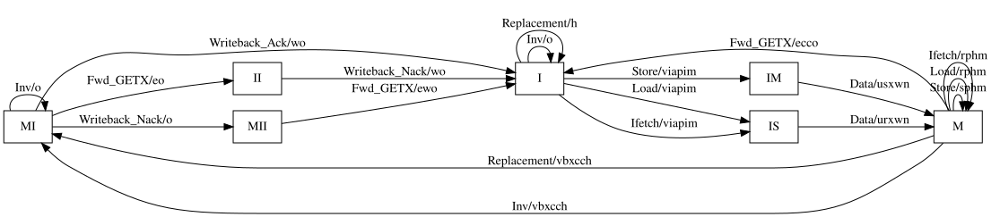
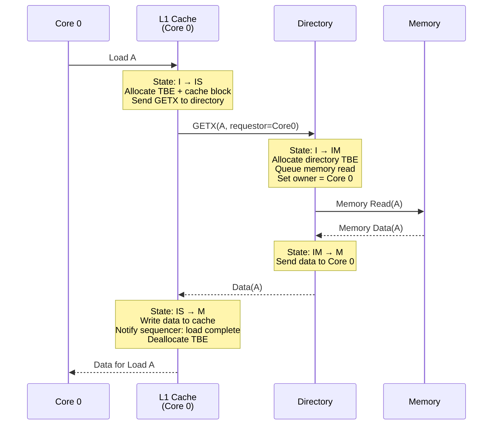
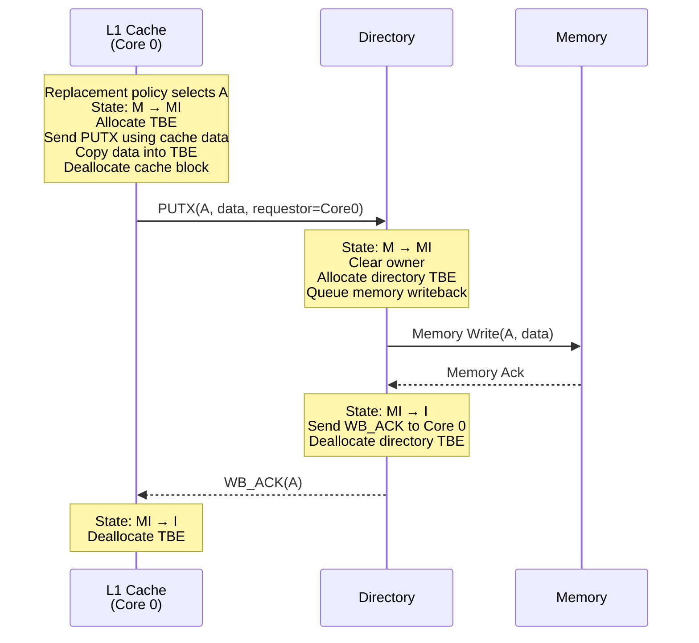
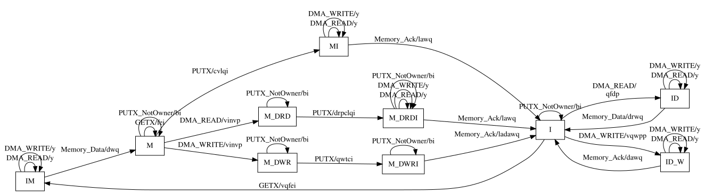

# Chapter 5: Why Ruby Exists -- From Classic Limitations to Protocol State Machines

> *The Classic cache hierarchy got you surprisingly far -- until you needed to change the coherence protocol. Ruby exists because protocols are too important to hard-code.*

By the end of Chapter 4, the reader has a working Classic cache hierarchy with replacement policies and prefetchers.
But every coherence decision in that hierarchy is baked into C++: three hardcoded bits in `CacheBlk`, a fixed MOESI interpretation in `Cache::handleSnoop`, and broadcast snooping through `CoherentXBar`.
To change the protocol -- add an Owned state, switch from snooping to directory, model a three-level inclusive hierarchy -- you must rewrite the simulator, not just the configuration.

This chapter bridges Classic to Ruby.
It motivates Ruby through the limitations of Classic caches, gives a high-level tour of Ruby's architecture, introduces SLICC, and teaches coherence through the simplest shipped protocol: MI_example.
[Chapter 5b](Ch05b_BuildingMSIFromScratch.md) then builds an MSI protocol from scratch, adding the Shared state.

---

### Table of Contents

- [5.1 The Bridge from Classic to Ruby](#51-the-bridge-from-classic-to-ruby)
  - [5.1.1 What Classic Cannot Do](#511-what-classic-cannot-do)
  - [5.1.2 Two Memory Systems, One Simulator](#512-two-memory-systems-one-simulator)
  - [5.1.3 Ruby at 10,000 Feet](#513-ruby-at-10000-feet)
  - [5.1.4 What SLICC Is and Isn't](#514-what-slicc-is-and-isnt)
- [5.2 Coherence from First Principles](#52-coherence-from-first-principles)
  - [5.2.1 The Two Invariants](#521-the-two-invariants)
- [5.3 Reading MI_example as a First Protocol](#53-reading-mi_example-as-a-first-protocol)
  - [5.3.1 The Protocol Manifest](#531-the-protocol-manifest)
  - [5.3.2 Message Types](#532-message-types)
  - [5.3.3 Cache Controller States and Events](#533-cache-controller-states-and-events)
  - [5.3.4 Data Structures](#534-data-structures)
  - [5.3.5 The State Machine: Transitions](#535-the-state-machine-transitions)
  - [5.3.6 Tracing a Load Miss Through MI_example](#536-tracing-a-load-miss-through-mi_example)
  - [5.3.7 Tracing a Writeback (Eviction)](#537-tracing-a-writeback-eviction)
  - [5.3.8 Directory Controller](#538-directory-controller)
  - [5.3.9 What MI_example Teaches](#539-what-mi_example-teaches)
  - [5.3.10 Running MI_example](#5310-running-mi_example)
  - [5.3.11 From SLICC to C++: Reading the Generated Code](#5311-from-slicc-to-c-reading-the-generated-code)
- [Key Ideas](#key-ideas)
- [1-Page Mental Model](#1-page-mental-model)
- [Common Misconceptions](#common-misconceptions)
- [If You Remember One Thing](#if-you-remember-one-thing)
- [Exercises](#exercises)

---

## 5.1 The Bridge from Classic to Ruby

### 5.1.1 What Classic Cannot Do

Classic caches represent coherence state with three bits per block ([`src/mem/cache/cache_blk.hh:78`](../src/mem/cache/cache_blk.hh#L78)):

```cpp
enum CoherenceBits : unsigned {
    WritableBit = 0x02,
    ReadableBit = 0x04,
    DirtyBit    = 0x08,
};
```

These three bits map to MOESI states:

| Valid | Writable | Dirty | State | Description |
|:-----:|:--------:|:-----:|:-----:|:------------|
| 1     | 1        | 1     | M     | Modified (exclusive, dirty) |
| 1     | 0        | 1     | O     | Owned (shared, dirty) |
| 1     | 1        | 0     | E     | Exclusive (exclusive, clean) |
| 1     | 0        | 0     | S     | Shared (shared, clean) |
| 0     | -        | -     | I     | Invalid |

The coherence logic lives in `Cache::handleSnoop` ([`src/mem/cache/cache.cc:1047`](../src/mem/cache/cache.cc#L1047)), which decides how to respond to snoops based on these bits.
On a read snoop, it clears `WritableBit`; on an invalidating snoop, it clears all coherence bits.
These are not configurable parameters -- they are conditionals in C++ code.

The transport mechanism is equally fixed.
`CoherentXBar::forwardTiming` ([`src/mem/coherent_xbar.cc:700`](../src/mem/coherent_xbar.cc#L700)) broadcasts every snoop to all connected caches except the requestor:

```cpp
for (const auto& p: dests) {
    if (exclude_cpu_side_port_id == InvalidPortID ||
        p->getId() != exclude_cpu_side_port_id) {
        p->sendTimingSnoopReq(pkt);
    }
}
```

An optional [`SnoopFilter`](../src/mem/snoop_filter.hh#L89) can reduce traffic, but the fundamental mechanism is broadcast.
There is no directory, no point-to-point messaging, no forwarding state machine.

This design serves its purpose well: it is fast to simulate, simple to configure, and correct for snooping hierarchies.
But it cannot answer these questions without invasive C++ changes:

- "What if I want MOESI with a directory instead of broadcast snooping?"
- "What if I need a token-based protocol for scalability research?"
- "What if I want to prototype a custom coherence extension for a research paper?"
- "What if I need AMBA CHI compliance checking?"

These are the questions Ruby was built to answer.

### 5.1.2 Two Memory Systems, One Simulator

gem5 has two independent memory-system stacks:

| | Classic | Ruby |
|---|---|---|
| Protocol defined in | C++ (fixed MOESI) | SLICC `.sm` files (swappable) |
| Coherence mechanism | Broadcast snooping via `CoherentXBar` | Protocol-specific (directory, token, CHI, etc.) |
| State representation | 3 bits per block | Arbitrary state machine per controller |
| Strength | Fast simulation, simple setup | Protocol flexibility, research extensibility |
| Cost | Cannot change protocol without C++ surgery | More setup, slower simulation |

Both stacks connect to CPUs via the same Port interface (`RequestPort`/`ResponsePort` carrying `Packet` objects), but they are otherwise independent.
A simulation uses one or the other, never both.

**Choosing between them:**
Use Classic when you are studying cache sizing, replacement policies, prefetching, or memory controller behavior -- anything where the coherence protocol is not the variable under study.
Use Ruby when the coherence protocol *is* the research question, or when you need a protocol that Classic does not implement.

### 5.1.3 Ruby at 10,000 Feet

Before any code, here is a mental map of Ruby's moving parts:

```
CPU ──► Sequencer ──► L1 Controller ◄──► Network ◄──► Directory Controller ──► Memory
              │              │                              │
              │         (SLICC state                   (SLICC state
              │          machine)                       machine)
         Bridges CPU
         Ports to Ruby
```

Contrast with Classic's pipeline:

```
CPU ──► Cache ──► CoherentXBar ──► Cache ──► CoherentXBar ──► Memory
```

The key difference: in Classic, the crossbar *is* the coherence mechanism.
In Ruby, the network is just a transport -- the coherence logic lives in the controllers, which are generated from SLICC state machine descriptions.

Key Ruby components (introduced here, detailed in Chapter 6):

- **Controllers**: cache controllers, directory controllers, DMA controllers -- each runs a SLICC-generated state machine.
  A controller wakes up when a message arrives in one of its input buffers, looks up the current state of the addressed block, and executes the transition defined for that (state, event) pair.
- **CacheMemory** ([`src/mem/ruby/structures/CacheMemory.hh`](../src/mem/ruby/structures/CacheMemory.hh)): the tag and data store behind each cache controller.
  CacheMemory is a *separate* SimObject responsible for traditional cache mechanics: set indexing, tag matching, replacement policy, and block allocation/deallocation.
  The SLICC protocol calls into CacheMemory (e.g., `cacheMemory.allocate()`, `cacheMemory.cacheProbe()`) but does not control cache geometry -- size, associativity, and replacement policy are configured in Python and passed into the controller as a parameter.
- **Sequencer** ([`src/mem/ruby/system/Sequencer.hh:85`](../src/mem/ruby/system/Sequencer.hh#L85)): bridges CPU request/response ports into Ruby's protocol world.
  It translates `Packet` objects into `RubyRequest` messages and places them in the controller's `mandatoryQueue`.
  When the protocol completes a request, the controller calls back into the Sequencer via `readCallback` or `writeCallback`.
- **Network**: carries coherence messages between controllers.
  gem5 provides [`SimpleNetwork`](../src/mem/ruby/network/simple/SimpleNetwork.hh#L62) (link-level, no router modeling) and [`Garnet`](../src/mem/ruby/network/garnet/GarnetNetwork.hh#L61) (cycle-accurate router microarchitecture).
  The network is separate from the protocol -- you can change one without touching the other.
- **SLICC**: the domain-specific language that defines what each controller does.

### 5.1.4 What SLICC Is and Isn't

SLICC (Specification Language for Implementing Cache Coherence) is a domain-specific language for specifying coherence protocol state machines.
It is *not* a general-purpose programming language.

In a SLICC `.sm` file, you write:

- **States** (stable and transient) with access permissions
- **Events** (load, store, incoming messages, replacement)
- **Transitions** (state x event -> new state)
- **Actions** (what to do during a transition: send messages, allocate blocks, update data)

SLICC compiles `.sm` files into C++ controller classes.
The generated code includes the `doTransition()` dispatch table, the `wakeup()` event loop, protocol statistics, and HTML documentation.
The SLICC compiler lives in [`src/mem/slicc/`](../src/mem/slicc/) and is invoked automatically by the build system at configure time.

SLICC is powerful but constrained.
You cannot write arbitrary C++ in a `.sm` file, and you cannot bypass the state-machine structure.
Those constraints are what make protocols analyzable: every transition is an explicit entry in a table, and missing transitions produce build-time errors rather than silent bugs.

---

## 5.2 Coherence from First Principles

### 5.2.1 The Two Invariants

Before reading any protocol, we need two invariants that every correct protocol must enforce.

#### Intuition

Imagine two cores sharing a cache line.
Core 0 writes the value `42`.
Core 1 reads the same line.
If Core 1 sees a stale value (say, `0`), the system is broken -- the program cannot reason about shared memory.

Two rules prevent this:

1. **SWMR (Single-Writer / Multiple-Reader)**: At any point in logical time, for any cache line, either a single core has read-write access *or* one or more cores have read-only access -- never both simultaneously.
2. **Data-Value Invariant**: The value of a cache line is always the value of the last write to it.

#### Working Model

Think of SWMR as a readers-writer lock on every cache line, enforced by hardware.
Before a core can write, it must ensure no other core has any copy (not even read-only).
Before a core can read, the current writer (if any) must either downgrade or surrender its copy.

The protocol state machine is the mechanism that enforces this lock.
States like Modified (M) mean "this core is the single writer."
States like Shared (S) mean "this core is one of possibly many readers."
Transitions between states are the lock acquire/release operations, mediated by messages.

#### What Breaks If SWMR Is Violated

Consider this two-core trace on address `A`:

```
Time    Core 0              Core 1              Correct value of A
────    ──────              ──────              ──────────────────
 1      Store A = 42                            42
 2                          Load A → ???        Should be 42
```

If Core 1 still has a stale cached copy from before Core 0's store, it reads `0` instead of `42`.
This is a *stale read* -- a SWMR violation.
The protocol's job is to ensure that Core 0's store either invalidates or updates Core 1's copy before Core 1 can read.

A more subtle failure is the *lost update*:

```
Time    Core 0              Core 1              Memory
────    ──────              ──────              ──────
 1      Load A (= 0)        Load A (= 0)        0
 2      Store A = 1                              ???
 3                           Store A = 2         ???
 4      (writeback)          (writeback)         ???
```

If both cores hold writable copies simultaneously, the final value in memory depends on which writeback arrives last -- the classic "last writer wins" race.
One store is silently lost.
SWMR prevents this by ensuring that at most one core has write permission at any time.

---

## 5.3 Reading MI_example as a First Protocol

MI_example is the simplest protocol shipped with gem5.
It has only two stable states -- Modified and Invalid -- making it small enough to hold entirely in your head.

### 5.3.1 The Protocol Manifest

Every Ruby protocol starts with a `.slicc` manifest file that lists the component files in dependency order.
Here is [`src/mem/ruby/protocol/MI_example.slicc`](../src/mem/ruby/protocol/MI_example.slicc):

```
protocol "MI_example";
include "MI_example-msg.sm";
include "MI_example-cache.sm";
include "MI_example-dir.sm";
include "MI_example-dma.sm";
```

The manifest declares the protocol name and includes four files: message definitions, cache controller, directory controller, and DMA controller.
Types must be defined before use, so the message file comes first.

### 5.3.2 Message Types

[`MI_example-msg.sm`](../src/mem/ruby/protocol/MI_example-msg.sm) defines all message types that flow between controllers.
The file contains four enumerations (message type tags) and four message structures (the actual messages carried by the network).

#### Coherence Enumerations

[`CoherenceRequestType`](../src/mem/ruby/protocol/MI_example-msg.sm#L30) tags messages on the request and forward virtual networks:
`GETX` asks for exclusive access, `GETS` asks for shared access (unused in MI but defined for protocols that need it), `PUTX` initiates a writeback, and `INV` invalidates a sharer.
`WB_ACK`/`WB_NACK` are directory-to-cache acknowledgments carried as request-type messages on the forward network.

[`CoherenceResponseType`](../src/mem/ruby/protocol/MI_example-msg.sm#L40) tags messages on the response virtual network.
`DATA` variants carry cache-line data with varying exclusivity/dirtiness (clean vs. dirty, exclusive vs. not).
`UNBLOCK` variants tell the directory that the requesting cache has installed the data and the directory can release any transient lock.
`WRITEBACK` variants carry data being evicted from a cache to memory.

#### DMA Enumerations

[`DMARequestType`](../src/mem/ruby/protocol/MI_example-msg.sm#L99) and [`DMAResponseType`](../src/mem/ruby/protocol/MI_example-msg.sm#L105) handle device-initiated reads and writes that bypass the CPU caches.
DMA requests are simpler than coherence requests: a device either reads (`READ`) or writes (`WRITE`) a memory block.
The directory handles these by coordinating with any cache that owns the line (invalidating or fetching dirty data as needed), then responding with `DATA` (for reads) or `ACK` (for writes).

#### Message Structures

The enumerations above are just tags.
The actual messages are SLICC structures that carry an address, a type tag, data, and routing information.
MI_example defines four.

[**`RequestMsg`**](../src/mem/ruby/protocol/MI_example-msg.sm#L53) carries coherence requests (`GETX`, `PUTX`, etc.) and forwarded requests between cache and directory controllers.
Its key fields are `addr` (the cache-line address), `Type` (which `CoherenceRequestType` this is), `Requestor` (a `MachineID` identifying the sender), `Destination` (a `NetDest` bitvector for multicast routing), and `DataBlk` (the cache-line data, populated only for messages that carry data such as `PUTX`).

[**`ResponseMsg`**](../src/mem/ruby/protocol/MI_example-msg.sm#L77) carries coherence responses (`DATA`, `UNBLOCK`, `WRITEBACK`, etc.) between cache and directory controllers.
It has the same address/type/destination/data fields as `RequestMsg`, plus a `Dirty` flag that tells the receiver whether memory is stale and a writeback is eventually needed.
It uses `Sender` instead of `Requestor` because a response may be sent by a cache that is not the original requestor (e.g., a cache forwarding data on behalf of the directory).

[**`DMARequestMsg`**](../src/mem/ruby/protocol/MI_example-msg.sm#L111) carries DMA read/write requests from a DMA controller to the directory.
Unlike coherence messages, DMA messages carry both `PhysicalAddress` (the byte address) and `LineAddress` (aligned to cache-line boundary), plus a `Len` field for sub-block transfers.
These extra fields are necessary because DMA requests can be smaller than a full cache line, unlike coherence requests which always operate on whole lines.

[**`DMAResponseMsg`**](../src/mem/ruby/protocol/MI_example-msg.sm#L130) carries the directory's response back to the DMA controller: `DATA` returns the requested data, `ACK` confirms a DMA write has been committed.

#### Message Structure Requirements

Three things about message structures are non-obvious but mandatory:

- **`interface="Message"`** tells SLICC to generate this struct as a C++ subclass of [`Message`](../src/mem/ruby/slicc_interface/Message.hh#L62).
  Without it, the structure cannot be enqueued into `MessageBuffer`s or carried by the network.
- **`MessageSizeType MessageSize`** must be present in every message structure.
  The network uses it to calculate link bandwidth consumption.
  Omitting it causes a runtime panic: `"panic: MessageSizeType() called on wrong message!"`.
- **`functionalRead()` and `functionalWrite()`** must be implemented in every message structure.
  Ruby's functional access path -- used by GDB reads and binary loading via `RubyPortProxy` -- does a "search the world" walk through *every in-flight message* looking for the most recent data at a given address.
  These methods tell the search how to read and write data inside this message type.
  The base `Message` class defaults to `panic()` for both, so omitting them crashes the simulation the first time a functional access scans in-flight messages.

Note the protocol-awareness in `functionalRead` implementations: `RequestMsg` only returns data from `PUTX` messages (only writebacks carry valid data in requests), while `ResponseMsg` returns data unconditionally.
Both implement `functionalWrite` unconditionally -- a functional write must update data everywhere it exists, regardless of message type.

### 5.3.3 Cache Controller States and Events

A SLICC controller is a complete description of one participant in a coherence protocol.
In hardware terms, it is the logic that sits alongside a cache or directory SRAM and decides what to do when a request arrives: look up the current state of the addressed block, pick the matching transition, and execute a sequence of actions (send a message, allocate a buffer entry, update state).
In software terms, it is a reactive state machine -- it sleeps until a message appears in one of its input buffers, wakes up, processes one transition, and sleeps again.

Every `.sm` file describes exactly one controller.
MI_example has three: a cache controller ([`MI_example-cache.sm`](../src/mem/ruby/protocol/MI_example-cache.sm)), a directory controller ([`MI_example-dir.sm`](../src/mem/ruby/protocol/MI_example-dir.sm)), and a DMA controller ([`MI_example-dma.sm`](../src/mem/ruby/protocol/MI_example-dma.sm)).
The SLICC compiler turns each `.sm` file into a C++ class that inherits from [`AbstractController`](../src/mem/ruby/slicc_interface/AbstractController.hh).

A controller `.sm` file is organized into several sections, each introduced by a SLICC keyword.
Here is the anatomy, using the cache controller as our running example:

```
machine(MachineType:L1Cache, "MI Example L1 Cache")     ← controller declaration
    : Sequencer * sequencer;                            ← parameters (become
      CacheMemory * cacheMemory;                          SimObject params,
      Cycles cache_response_latency := 12;                configurable from
      ...                                                 Python)
      MessageBuffer * requestFromCache, network="To",   ← network ports
            virtual_network="2", vnet_type="request";     (connect to the
      ...                                                 on-chip network)
      MessageBuffer * mandatoryQueue;                   ← CPU-facing port
{
  state_declaration(State, ...) { I, M, IS, IM, ... }   ← states
  enumeration(Event, ...)       { Load, Store, ... }    ← events
  structure(Entry, ...,                                 ← per-line storage
      interface="AbstractCacheEntry") { State, DataBlk }   (name is convention)
  structure(TBE, ...)           { State, DataBlk, ... } ← per-transaction storage
                                                           (name IS reserved)

  // Helper functions: getState(), setState(), getAccessPermission(), ...

  out_port(requestNetwork_out, RequestMsg, requestFromCache);           ← output ports
  in_port(forwardRequestNetwork_in, RequestMsg, forwardToCache) { ... } ← input ports
  in_port(mandatoryQueue_in, RubyRequest, mandatoryQueue) { ... }

  action(a_issueRequest, "a", ...) { ... }                              ← actions
  action(e_sendData, "e", ...) { ... }

  transition(I, Load, IS) { a_issueRequest; ... }                       ← transitions
  transition(M, Fwd_GETX, I) { e_sendData; ... }
}
```

The key SLICC concepts, in the order they appear:

- **`machine`** declares the controller type (e.g., `L1Cache`, `Directory`, `DMA`) and its configurable parameters.
  Parameters after the colon become C++ constructor parameters and Python SimObject attributes.
  `MessageBuffer` parameters with `network="To"` or `network="From"` annotations are wired to the on-chip network by the configuration system.
- **`state_declaration`** enumerates all states a cache line can be in within this controller.
  Each state carries an `AccessPermission` that tells Ruby's functional access system whether the block can currently be read, written, or is in a transient state.
- **`enumeration(Event)`** lists everything that can happen to trigger a state change: CPU requests arriving from the Sequencer, messages arriving from the network, or internal events like a replacement (eviction).
- **`structure`** with **`interface="AbstractCacheEntry"`** defines what is stored per cache line (state, data, dirty bit).
  The name is conventional (`Entry` in MI_example) but not special -- SLICC identifies the cache entry type by its `interface` annotation, not by name.
  **`structure(TBE)`** defines what is stored per in-flight transaction (transient state, data) -- analogous to an MSHR entry.
  Unlike the entry type, `TBE` *is* a reserved name: SLICC looks for a type named `{MachineType}_TBE` (e.g., `L1Cache_TBE`) to wire up transient-state storage.
- **`out_port`** and **`in_port`** are the controller's interface to its `MessageBuffer`s.
  There are three layers here, and keeping them straight is important:
  - A **`MessageBuffer`** is a queue (a SimObject, created in Python config).
    The `machine` declaration lists the buffers this controller needs.
    Buffers annotated `network="To"` are *outgoing*: the controller enqueues messages, and the network drains them for delivery.
    Buffers annotated `network="From"` are *incoming*: the network deposits messages, and the controller dequeues them.
    A buffer with no `network` annotation (like `mandatoryQueue`) is purely internal -- not connected to the network at all.
  - An **`out_port`** gives the controller a named handle to enqueue messages into a specific buffer.
    For example, `out_port(requestNetwork_out, RequestMsg, requestFromCache)` means "actions in this controller can send `RequestMsg` messages by enqueuing into the `requestFromCache` buffer."
  - An **`in_port`** is where the controller's reactive logic lives.
    It names a buffer to watch and contains code that peeks at the head message, determines which `Event` it represents, and calls `trigger()` to fire the corresponding transition.
    The SLICC compiler generates the controller's `wakeup()` method by iterating over `in_port` declarations in order -- ports declared first are checked first, which determines processing priority.
- **`action`** defines a single atomic operation: send a message, allocate a cache block, copy data, pop a queue, etc.
  Each action has a short-code identifier (e.g., `"a"`, `"e"`) used in protocol traces.
- **`transition(State, Event, NewState) { action1; action2; ... }`** is the core of the protocol.
  It says: "when we are in *State* and *Event* occurs, execute these actions in order and move to *NewState*."
  Every (state, event) pair must be either explicitly defined or left undefined -- an undefined pair causes a runtime panic with a diagnostic message, which is far better than silent misbehavior.

With this anatomy in mind, let us walk through each section of the MI_example cache controller ([`MI_example-cache.sm`](../src/mem/ruby/protocol/MI_example-cache.sm#L30)).

#### The Machine Declaration

```
machine(MachineType:L1Cache, "MI Example L1 Cache")
    : Sequencer * sequencer;
      CacheMemory * cacheMemory;
      Cycles cache_response_latency := 12;
      Cycles issue_latency := 2;
      bool send_evictions;

      MessageBuffer * requestFromCache, network="To", virtual_network="2",
            vnet_type="request";
      MessageBuffer * responseFromCache, network="To", virtual_network="4",
            vnet_type="response";
      MessageBuffer * forwardToCache, network="From", virtual_network="3",
            vnet_type="forward";
      MessageBuffer * responseToCache, network="From", virtual_network="4",
            vnet_type="response";

      MessageBuffer * mandatoryQueue;
```

The parameters declare what this controller needs to operate: a `Sequencer` (the bridge from CPU ports into Ruby), a `CacheMemory` (the tag and data store), latency values, and five `MessageBuffer`s.

> **Who is responsible for what?**
> The `CacheMemory * cacheMemory` parameter reveals a fundamental design separation in Ruby: the coherence protocol and the cache microarchitecture are different concerns, owned by different objects.
>
> | Concern | Owner | Configured in |
> |---|---|---|
> | **When** to allocate a cache block | SLICC protocol (transition actions call `cacheMemory.allocate()`) | `.sm` file |
> | **When** to evict a block | SLICC protocol (triggers `Replacement` event) | `.sm` file |
> | **Where** to place a block (set indexing) | `CacheMemory` (`addressToCacheSet()`, controlled by `start_index_bit`) | Python config |
> | **Who** to evict (replacement victim) | `CacheMemory` (`cacheProbe()` delegates to the replacement policy) | Python config |
> | Cache size and associativity | `CacheMemory` (determines number of sets and ways) | Python config |
> | Coherence state per block | SLICC protocol (the `Entry.CacheState` field) | `.sm` file |
>
> `CacheMemory` is a SimObject defined in [`RubyCache.py`](../src/mem/ruby/structures/RubyCache.py) with parameters for `size`, `assoc`, `replacement_policy` (default: `TreePLRURP`), `start_index_bit`, and banking/latency knobs.
> The Python configuration script creates both objects separately and wires them together:
>
> ```python
> l1_cache = RubyCache(size="16kB", assoc=8,
>                      replacement_policy=TreePLRURP())
> l1_cntrl = L1Cache_Controller(cacheMemory=l1_cache,
>                               sequencer=sequencer, ...)
> ```
>
> This means you can change cache size, associativity, or replacement policy without touching the coherence protocol -- and you can rewrite the protocol without touching cache geometry.
> The SLICC code never mentions "16 kB" or "8-way"; the Python config never mentions "state M" or "GETX."

Four buffers connect to the on-chip network via virtual network assignments.
Each [`MessageBuffer`](../src/mem/ruby/network/MessageBuffer.hh#L74) is assigned to a **virtual network** number.
Virtual networks prevent deadlock by separating message classes so that, for example, a response cannot be blocked behind a stalled request.
The `network="To"` and `network="From"` annotations tell SLICC which direction messages flow relative to the network.

The fifth buffer, `mandatoryQueue`, is special: it is not connected to the network.
It is the internal queue where the Sequencer places CPU requests.
The name `mandatoryQueue` is **hardcoded** in the Sequencer -- using any other name silently breaks the CPU-to-cache interface.

#### States and Events

The [`state_declaration`](../src/mem/ruby/protocol/MI_example-cache.sm#L51) defines two stable states and five transient states:

| State | AccessPermission | Meaning |
|:------|:-----------------|:--------|
| `I`   | Invalid          | Block is not present in this cache |
| `M`   | Read_Write       | Block is present; this cache is the sole owner |
| `IS`  | Busy             | Transient: waiting for data after a load miss |
| `IM`  | Busy             | Transient: waiting for data after a store miss |
| `MI`  | Maybe_Stale      | Transient: writeback in progress, waiting for ack |
| `MII` | Read_Write       | Transient: writeback was nacked, must retry |
| `II`  | Busy             | Transient: forwarded data during writeback, waiting for ack |

Stable states are the ones the block rests in between transactions.
Transient states exist because coherence operations are not instantaneous -- between sending a request and receiving a response, the block must be in a state that correctly handles any message that might arrive in the meantime.
MI_example has more transient states (5) than stable states (2), and this ratio grows in more complex protocols.

Each state's `AccessPermission` tells Ruby's functional access system what operations are safe.
For example, a block in `IS` (Busy) cannot be read functionally because the data may not yet be valid.

The [`Event` enumeration](../src/mem/ruby/protocol/MI_example-cache.sm#L63) lists everything that can trigger a transition.
Events come from two sources: the CPU (via the mandatory queue) and the network (via forward and response buffers).

| Event | Source | Meaning |
|:------|:-------|:--------|
| `Load`, `Ifetch`, `Store` | Mandatory queue (CPU) | Processor wants to read or write |
| `Replacement` | Internal (cache full) | Replacement policy selected this block for eviction |
| `Fwd_GETX` | Forward network | Directory is forwarding another cache's request |
| `Inv` | Forward network | Directory is invalidating this block |
| `Data` | Response network | Data arriving in response to our earlier request |
| `Writeback_Ack` | Forward network | Directory confirms our writeback is complete |
| `Writeback_Nack` | Forward network | Directory rejected our writeback (race condition) |

### 5.3.4 Data Structures

Every cache controller needs two structures:

**Entry** -- the cache line itself:

```
structure(Entry, desc="...", interface="AbstractCacheEntry") {
    State CacheState,   desc="cache state";
    bool Dirty,         desc="Is the data dirty?";
    DataBlock DataBlk,  desc="Data in the block";
}
```

**TBE** (Transaction Buffer Entry) -- holds state for in-flight transactions, analogous to an MSHR:

```
structure(TBE, desc="...") {
    State TBEState,     desc="Transient state";
    DataBlock DataBlk,  desc="data for the block";
}
```

The TBE is needed because once a block is evicted from the cache (deallocated), its data and state must be stored somewhere until the writeback completes.

The TBETable declaration reveals a SLICC gotcha:

```
TBETable TBEs, template="<L1Cache_TBE>", constructor="m_number_of_TBEs";
```

SLICC name-mangles types by prepending the machine type: `TBE` becomes `L1Cache_TBE` in generated C++.
The `template="<L1Cache_TBE>"` annotation is required to match the mangled name.
Forgetting this produces a confusing C++ compilation error.

### 5.3.5 The State Machine: Transitions

Here is the complete MI_example cache state machine, read directly from the [`transition` blocks in `MI_example-cache.sm`](../src/mem/ruby/protocol/MI_example-cache.sm#L428).

The SLICC compiler generates a Graphviz state diagram from the transition table (stall transitions are omitted for clarity):



#### Stable State Transitions

| State | Event | Next State | What happens |
|:------|:------|:-----------|:-------------|
| **M** | Load, Ifetch | M | Hit. Return data to CPU. [:L446](../src/mem/ruby/protocol/MI_example-cache.sm#L446) |
| **M** | Store | M | Hit. Return ack to CPU. [:L440](../src/mem/ruby/protocol/MI_example-cache.sm#L440) |
| **M** | Fwd_GETX | I | Another cache wants exclusive access. Send data, go to Invalid. [:L486](../src/mem/ruby/protocol/MI_example-cache.sm#L486) |
| **M** | Replacement, Inv | MI | Eviction. Copy data to TBE, send PUTX to directory, free cache entry. [:L496](../src/mem/ruby/protocol/MI_example-cache.sm#L496) |
| **I** | Load, Ifetch | IS | Miss. Allocate TBE + cache block, send GETX to directory. [:L464](../src/mem/ruby/protocol/MI_example-cache.sm#L464) |
| **I** | Store | IM | Miss. Same actions as load miss (MI has no Shared state). [:L456](../src/mem/ruby/protocol/MI_example-cache.sm#L456) |
| **I** | Inv | I | Already invalid. Consume and discard. [:L452](../src/mem/ruby/protocol/MI_example-cache.sm#L452) |
| **I** | Replacement | I | Evicting an invalid block. Just free the entry. [:L492](../src/mem/ruby/protocol/MI_example-cache.sm#L492) |

Notice: both loads and stores from Invalid send the same `GETX` request.
In MI, there is no Shared state, so every access requires exclusive ownership.
This is correct but wasteful -- a read-only access forces invalidations in other caches even when sharing would suffice.

#### Transient State Transitions

| State | Event | Next State | What happens |
|:------|:------|:-----------|:-------------|
| **IS** | Data | M | Data arrived. Write to cache, notify Sequencer (load complete), deallocate TBE. [:L472](../src/mem/ruby/protocol/MI_example-cache.sm#L472) |
| **IS** | Load, Ifetch, Store, Replacement | IS | Stall. Cannot process until data arrives. [:L428](../src/mem/ruby/protocol/MI_example-cache.sm#L428) |
| **IS** | Fwd_GETX, Inv | IS | Stall. [:L432](../src/mem/ruby/protocol/MI_example-cache.sm#L432) |
| **IM** | Data | M | Data arrived. Write to cache, notify Sequencer (store complete), deallocate TBE. [:L479](../src/mem/ruby/protocol/MI_example-cache.sm#L479) |
| **IM** | Load, Ifetch, Store, Replacement | IM | Stall. Cannot process until data arrives. [:L428](../src/mem/ruby/protocol/MI_example-cache.sm#L428) |
| **IM** | Fwd_GETX, Inv | IM | Stall. [:L432](../src/mem/ruby/protocol/MI_example-cache.sm#L432) |
| **MI** | Writeback_Ack | I | Directory confirmed writeback. Deallocate TBE. [:L504](../src/mem/ruby/protocol/MI_example-cache.sm#L504) |
| **MI** | Fwd_GETX | II | Another cache needs the data we're writing back. Send data from TBE. [:L509](../src/mem/ruby/protocol/MI_example-cache.sm#L509) |
| **MI** | Writeback_Nack | MII | Directory rejected our writeback (race). Must retry after forwarding. [:L514](../src/mem/ruby/protocol/MI_example-cache.sm#L514) |
| **MI** | Inv | MI | Consume invalidation (writeback already in progress). [:L436](../src/mem/ruby/protocol/MI_example-cache.sm#L436) |
| **MI** | Load, Ifetch, Store, Replacement | MI | Stall. [:L428](../src/mem/ruby/protocol/MI_example-cache.sm#L428) |
| **MII** | Fwd_GETX | I | Forward data from TBE to requestor, deallocate TBE. Done. [:L518](../src/mem/ruby/protocol/MI_example-cache.sm#L518) |
| **MII** | Load, Ifetch, Store, Replacement | MII | Stall. [:L428](../src/mem/ruby/protocol/MI_example-cache.sm#L428) |
| **II** | Writeback_Nack | I | Nack after we already forwarded data. Deallocate TBE. Done. [:L524](../src/mem/ruby/protocol/MI_example-cache.sm#L524) |
| **II** | Load, Ifetch, Store, Replacement | II | Stall. [:L428](../src/mem/ruby/protocol/MI_example-cache.sm#L428) |

The stall action (`z_stall`) is important: when the block is in a transient state, the controller cannot process new requests for that address.
They remain in the message buffer until the transient state resolves.

### 5.3.6 Tracing a Load Miss Through MI_example

Let us trace a load miss from Core 0 to address `A`, which no cache currently holds.



Step by step:

1. The CPU issues a load.
   The Sequencer places a `RubyRequest` in the `mandatoryQueue`.
2. The cache controller wakes up, peeks at the request, finds the block in state I, and triggers event `Load`.
3. Transition `I + Load → IS` fires: allocate a TBE and cache block, send `GETX` to the directory (via virtual network 2), pop the mandatory queue.
4. The directory receives the GETX.
   The block is in state I at the directory (no cache has it).
   Transition `I + GETX → IM` fires: allocate the directory TBE, queue a memory read, record Core 0 as the owner.
5. Memory responds with data.
   Transition `IM + Memory_Data → M` fires: send the data to Core 0, deallocate the directory TBE, and pop the memory queue.
6. The cache controller receives data on virtual network 4 (response).
   Transition `IS + Data → M` fires: write data to the cache block, call `readCallback` on the sequencer (which unblocks the CPU), deallocate the TBE, and pop the response queue.

### 5.3.7 Tracing a Writeback (Eviction)

Core 0 holds block `A` in state M.
The replacement policy selects `A` as a victim.



Key detail: the cache deallocates its block *before* the writeback completes.
The data is safe in the TBE.
If a forwarded request (`Fwd_GETX`) arrives while in state MI, the controller sends data from the TBE, not the (now-deallocated) cache entry.
This is why the TBE exists.

### 5.3.8 Directory Controller

The directory controller ([`MI_example-dir.sm`](../src/mem/ruby/protocol/MI_example-dir.sm#L42)) tracks which cache (if any) owns each block.
The SLICC-generated state diagram for the directory controller:



Its stable states mirror the cache's perspective:

- **I** -- no cache has the block; memory holds the valid copy.
  `AccessPermission:Read_Write` because the directory can serve data directly from memory.
- **M** -- one cache has the block; memory is stale.
  `AccessPermission:Invalid` because the directory cannot serve data.

When the directory is in state M and receives a `GETX` from a different cache, it *forwards* the request to the current owner:

```
transition(M, GETX) {
    f_forwardRequest;
    e_ownerIsRequestor;
    i_popIncomingRequestQueue;
}
```

The directory stays in state M -- it just updates the owner field.
The old owner sends data directly to the new requestor (cache-to-cache transfer), and the directory never touches memory.
This is a key optimization: modified data can flow between caches without writing back to memory first.

### 5.3.9 What MI_example Teaches

MI_example demonstrates the core structure of any Ruby protocol:

1. A `.slicc` manifest ties the files together.
2. Message types define the vocabulary of the protocol.
3. Each controller is a state machine with states, events, transitions, and actions.
4. Transient states handle the gap between issuing a request and receiving a response.
5. TBEs hold data and state for in-flight transactions.
6. Virtual networks separate message classes to prevent deadlock.

What MI_example *cannot* do is share data read-only.
Every access requires exclusive ownership, which means every time one core reads a line that another core has, the first core loses its copy.
This motivates the Shared state in MSI.

### 5.3.10 Running MI_example

You can run the MI_example protocol right now using the stdlib `MIExampleCacheHierarchy` class and a synthetic traffic generator.
No CPU model or workload binary is needed -- the traffic generator issues loads and stores directly into the memory system.

gem5 must be built with Ruby enabled and `PROTOCOL=MI_example`.
The default `build_opts/RISCV` already sets `PROTOCOL="MI_example"`:

```sh
scons build/RISCV/gem5.debug -j$(nproc)
```

Verify the build includes MI_example:

```sh
./build/RISCV/gem5.debug -c "import m5; print(m5.defines.buildEnv['PROTOCOL'])"
# Should print: MI_example
```

The test script `tests/gem5/traffic_gen/configs/simple_traffic_run.py` accepts the cache hierarchy as a command-line argument.
It constructs a `TestBoard` with a `LinearGenerator` (sequential address sweep), the `MIExampleCacheHierarchy` (16 KiB, 8-way), and a single-channel DDR3 memory:

```sh
./build/RISCV/gem5.debug \
    -d m5out/mi-example-traffic-$(date +%Y%m%d-%H%M%S) \
    tests/gem5/traffic_gen/configs/simple_traffic_run.py \
    LinearGenerator 1 MIExample \
    gem5.components.memory SingleChannelDDR3_1600 512MiB
```

Arguments, in order:

| Argument | Meaning |
|---|---|
| `LinearGenerator` | Traffic pattern: sequential address sweep |
| `1` | Number of generator cores |
| `MIExample` | Cache hierarchy: selects `MIExampleCacheHierarchy` |
| `gem5.components.memory` | Python module containing the memory class |
| `SingleChannelDDR3_1600` | Memory class to instantiate |
| `512MiB` | Memory size (passed to the constructor) |

The simulation completes in a few seconds and prints:

```
Beginning simulation!
Exiting @ tick 250092990 because board.processor.cores.generator
has encountered the exit state and will terminate the simulation.
```

The output directory contains:

| File | Contents |
|---|---|
| `stats.txt` | All simulation statistics (cache hits/misses, protocol transition counts, latency histograms) |
| `config.json` / `config.ini` | Full system configuration dump |
| `config.board.cache_hierarchy.ruby_system.dot.svg` | Ruby system topology (controllers and network links) |
| `config.dot.svg` | Complete simulated system topology |

#### Reading the Protocol Statistics

Open `stats.txt` and search for `L1Cache_Controller` and `Directory_Controller`.
With a single-core linear generator, the stats tell a clear story:

```
L1Cache_Controller.I.Load             15521    # Cold misses: I → IS
L1Cache_Controller.IS.Data            15513    # Responses received: IS → M
L1Cache_Controller.M.Replacement      15513    # Evictions: M → MI
L1Cache_Controller.MI.Writeback_Ack   15512    # Writebacks complete: MI → I
```

Read these four lines as a cycle: every load misses (the block is in state I), the cache sends `GETX` to the directory, receives `Data`, enters state M, then eventually gets evicted and writes back.
There are no `Store` events because the `LinearGenerator` issues only loads by default.
There are no `Fwd_GETX` events because there is only one core -- no sharing conflicts.

The directory side mirrors this:

```
Directory_Controller.I.GETX           15520    # Received GETX, fetched from memory
Directory_Controller.IM.Memory_Data   15513    # Memory responded, sent Data to cache
Directory_Controller.M.PUTX           15512    # Received writeback
Directory_Controller.MI.Memory_Ack    15512    # Memory write complete
```

Every transition in these stats corresponds to a transition in the `.sm` files we read earlier.
The stats are the runtime proof that the state machine executes exactly the paths we traced on paper.

#### The Protocol Trace

Statistics give you aggregate counts, but sometimes you need to see individual transitions in order.
The `ProtocolTrace` debug flag dumps every state-machine transition as it fires:

```sh
./build/RISCV/gem5.debug \
    -d m5out/ch05-mi-example-traffic \
    --debug-flags=ProtocolTrace \
    --debug-file=protocol_trace.log \
    tests/gem5/traffic_gen/configs/simple_traffic_run.py \
    LinearGenerator 1 MIExample \
    gem5.components.memory SingleChannelDDR3_1600 512MiB
```

This produces `protocol_trace.log` in the output directory.
Each line records one transition with seven columns:

| Column | Meaning |
|---|---|
| **Tick** | Simulation tick when the transition fires |
| **Ver** | Controller instance number (core 0, core 1, …) |
| **Controller** | Controller type: `Seq` (Sequencer), `L1Cache`, `Directory` |
| **Event** | The trigger: `Load`, `GETX`, `Replacement`, `Data`, … |
| **State>Next** | State before and after the transition (e.g. `I>IS`, `IM>M`) |
| **Address** | Cache-line-aligned address |
| **Comment** | Request type (`LD`/`ST`), `Protocol Stall`, `Resource Stall`, or blank |

The first few lines for our single-core linear generator:

```
           Tick Ver Controller              Event  State>Next   Address Comment
           1490   0        Seq               Begin       >       [0x0, line 0x0] LD
           1998   0    L1Cache                Load      I>IS     [0x0, line 0x0]
           3996   0  Directory                GETX      I>IM     [0x0, line 0x0]
```

Read this as: at tick 1490 the Sequencer on core 0 begins a load to address 0x0.
At tick 1998 the L1 cache sees the `Load` event in state `I` and transitions to `IS` (sending `GETX`).
At tick 3996 the directory receives `GETX`, moves from `I` to `IM`, and fetches data from memory.
You can follow the entire lifecycle of any cache line through the log -- a powerful tool for debugging protocol bugs.

### 5.3.11 From SLICC to C++: Reading the Generated Code

The SLICC compiler runs at build time and translates each `.sm` file into C++ source files under `build/RISCV/mem/ruby/protocol/`.
Understanding this mapping is essential for debugging protocols, because the code that actually executes is the generated C++, not the `.sm` source.

The generated files for the L1 cache controller:

| Generated file | What it contains |
|---|---|
| `L1Cache_Controller.hh` | Controller class declaration: member variables for `Sequencer*`, `CacheMemory*`, `MessageBuffer*` pointers, and `doTransition()` |
| `L1Cache_Controller.cc` | Constructor, `init()`, action implementations (each SLICC action becomes a C++ method) |
| `L1Cache_Transitions.cc` | `doTransitionWorker()`: a `switch` statement over `(state, event)` pairs -- the transition table |
| `L1Cache_Wakeup.cc` | `wakeup()`: the event loop that dequeues messages from input ports and calls `doTransition()` |
| `L1Cache_State.hh/cc` | State enum and string conversion |
| `L1Cache_Event.hh/cc` | Event enum and string conversion |
| `L1Cache_Entry.hh/cc` | Cache entry structure (data block + state) |
| `L1Cache_TBE.hh/cc` | TBE structure (transient state, data, requestor) |

The same pattern repeats for `Directory_Controller` and `DMA_Controller`.
Message types (`RequestMsg`, `ResponseMsg`) and enumerations (`CoherenceRequestType`, `CoherenceResponseType`) get their own files too.

#### The Transition Table as a Switch Statement

The most important generated file is `L1Cache_Transitions.cc`.
SLICC's transition table becomes a C++ `switch` on `HASH_FUN(state, event)`, which is simply `state * NUM_EVENTS + event`:

```cpp
// L1Cache_Transitions.cc (generated, abbreviated)
#define HASH_FUN(state, event)  ((int(state)*L1Cache_Event_NUM)+int(event))

TransitionResult
L1Cache_Controller::doTransitionWorker(L1Cache_Event event,
                                        L1Cache_State state,
                                        L1Cache_State& next_state, ...)
{
    switch(HASH_FUN(state, event)) {
      // Stalls in transient states -- no actions, just stall
      case HASH_FUN(L1Cache_State_IS, L1Cache_Event_Load):
      case HASH_FUN(L1Cache_State_IS, L1Cache_Event_Store):
      case HASH_FUN(L1Cache_State_IM, L1Cache_Event_Load):
      ...
        return TransitionResult_ProtocolStall;

      // I + Load → IS: allocate TBE, allocate cache block, send GETX
      case HASH_FUN(L1Cache_State_I, L1Cache_Event_Load):
        next_state = L1Cache_State_IS;
        v_allocateTBE(...);
        i_allocateL1CacheBlock(...);
        a_issueRequest(...);
        p_profileMiss(...);
        m_popMandatoryQueue(...);
        return TransitionResult_Valid;

      // IS + Data → M: write data to cache, complete load, deallocate TBE
      case HASH_FUN(L1Cache_State_IS, L1Cache_Event_Data):
        next_state = L1Cache_State_M;
        u_writeDataToCache(...);
        rx_load_hit(...);
        w_deallocateTBE(...);
        n_popResponseQueue(...);
        return TransitionResult_Valid;
      ...

      default:
        panic("Invalid transition\n"
              "%s time: %d addr: %#x event: %s state: %s\n",
              name(), curCycle(), addr, event, state);
    }
}
```

Each `case` maps directly to a SLICC `transition` block.
The action calls (`v_allocateTBE`, `a_issueRequest`, etc.) are the same names you see in the `.sm` file -- SLICC preserves them as C++ method names.
A missing `case` (an undefined transition) hits the `default` branch, which panics with a clear diagnostic.

#### The Wakeup Loop

`L1Cache_Wakeup.cc` contains the `wakeup()` method -- the controller's main event loop.
Each cycle, it checks input ports in priority order (forward requests first, then responses, then the mandatory queue from the Sequencer), peeks at the head message, determines the event type, and calls `doTransition()`:

```cpp
// L1Cache_Wakeup.cc (generated, simplified)
void L1Cache_Controller::wakeup()
{
    int counter = 0;
    while (true) {
        assert(counter <= m_transitions_per_cycle);
        if (counter == m_transitions_per_cycle) {
            scheduleEvent(Cycles(1));  // Try again next cycle
            break;
        }
        // Port 0: forwardRequestNetwork_in (highest priority)
        if (m_forwardToCache_ptr->isReady(clockEdge())) {
            const RequestMsg* in_msg = ...peek()...;
            if (in_msg->m_Type == CoherenceRequestType_GETX) {
                result = doTransition(L1Cache_Event_Fwd_GETX, ...);
            }
            ...
        }
        // Port 1: responseNetwork_in
        ...
        // Port 2: mandatoryQueue_in (lowest priority)
        ...
        break;
    }
}
```

Port priority matters: forward requests and responses are processed before new CPU requests.
This ensures the controller makes progress on in-flight protocol transactions before accepting new work, which is critical for avoiding deadlocks.

> **Deep Dive:** The `m_transitions_per_cycle` limit (default 32) models a finite controller bandwidth.
> When hit, the controller reschedules itself for the next cycle.
> The `fullyBusyCycles` stat counts how often this limit is reached -- a high count indicates the protocol controller is a bottleneck.

---

**Next: [Chapter 5b](Ch05b_BuildingMSIFromScratch.md)** builds a full MSI protocol from scratch, adding the Shared state that MI_example lacks.
MSI allows multiple caches to hold read-only copies simultaneously, eliminating the unnecessary invalidations that plague MI on read-shared workloads.


---

## Key Ideas

- Classic caches hardcode MOESI coherence in C++ (`CacheBlk` bit flags + `Cache::handleSnoop` + `CoherentXBar` broadcast).
  Changing the protocol requires rewriting the simulator.
- Ruby separates protocol logic (SLICC `.sm` files) from the simulation infrastructure.
  You change the protocol by writing new `.sm` files and rebuilding.
- Every correct coherence protocol enforces SWMR (single-writer / multiple-reader) and the data-value invariant.
- MI_example is the simplest Ruby protocol: two stable states (M, I), every access requires exclusive ownership.
  It cannot share data read-only -- every load causes an invalidation.
- Virtual networks prevent deadlock by separating message classes (requests, forwards, responses).
- Transient states bridge the gap between issuing a request and receiving a response.
  TBEs hold data and state during transient periods.
- The SLICC compiler translates `.sm` files into C++ controller classes: a `doTransitionWorker()` dispatch table, a `wakeup()` event loop, and action methods with the same names as the `.sm` source.


## Common Misconceptions

1. **"Classic and Ruby are different versions of the same system."**
   They are independent, parallel implementations.
   Classic uses C++ code for coherence; Ruby uses SLICC-generated state machines.
   They share the Port interface but nothing else.
   A simulation uses one or the other.

2. **"Ruby is always better than Classic."**
   Ruby is more flexible, but Classic is faster to simulate and simpler to configure.
   If the coherence protocol is not your research variable, Classic is often the better choice.

3. **"SLICC is a programming language."**
   SLICC is a domain-specific language for specifying state machines.
   You cannot write arbitrary logic in it.
   The constraints (explicit states, transitions, actions) are features: they make protocols verifiable and debuggable.

4. **"Transient states are implementation details I can ignore."**
   Transient states are where most protocol bugs hide.
   A missing transition in a transient state produces incorrect behavior or deadlock.
   Even MI_example has 5 transient states vs. 2 stable ones.

5. **"`mandatoryQueue` is just a naming convention."**
   It is a hardcoded name in the Sequencer.
   If you rename it, the CPU-to-cache interface silently fails to connect.

## If You Remember One Thing

**A coherence protocol is a distributed state machine, and Ruby lets you describe that state machine in a table (states x events -> transitions) rather than embedding it in C++ conditionals.
This is not just a software engineering preference -- it makes protocols verifiable: every cell in the table is either defined or a compile-time/runtime error.
Classic hides the same logic in scattered `if` statements where missing cases are silent bugs.**

## Exercises

1. **MI_example load miss trace.**
   Core 0 issues a load to address A that no cache holds.
   Using the transition tables in this chapter, list every state transition (at both the cache and directory) and every message exchanged.
   How many network messages are sent in total?

2. **MI_example two-core contention.**
   Core 0 holds block A in state M.
   Core 1 issues a load to A.
   Trace all messages and state transitions at Core 0, Core 1, and the directory.
   Does Core 1's data come from memory or from Core 0?

3. **MI_example writeback race.**
   Core 0 holds block A in state M and begins evicting it (state MI).
   Before the directory receives the PUTX, Core 1 sends a GETX for A.
   The directory forwards the GETX to Core 0.
   What state is Core 0 in when the Fwd_GETX arrives?
   What transition fires?
   Where does Core 1 get its data from?

4. **Why no Shared state hurts.**
   Three cores execute: Core 0 loads A, Core 1 loads A, Core 2 loads A.
   In MI_example, how many GETX messages are sent?
   How many invalidations occur?
   What would change if the protocol had a Shared state?
   (Chapter 5b explores this in detail.)

5. **Generated code exploration.**
   Build gem5 with MI_example and find the generated `L1Cache_Transitions.cc`.
   Locate the `case` for the `I + Load` transition.
   Compare it to the `.sm` source.
   What information is present in the generated C++ that is not in the `.sm` file?
