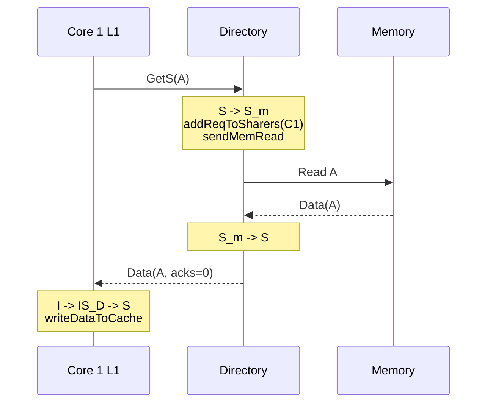
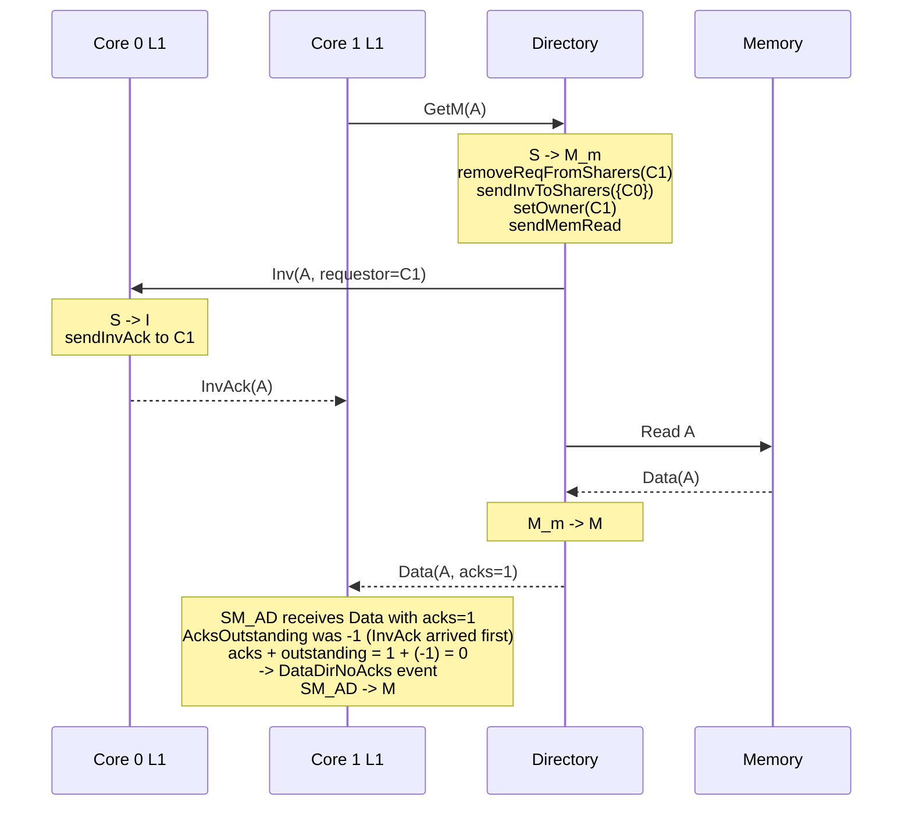
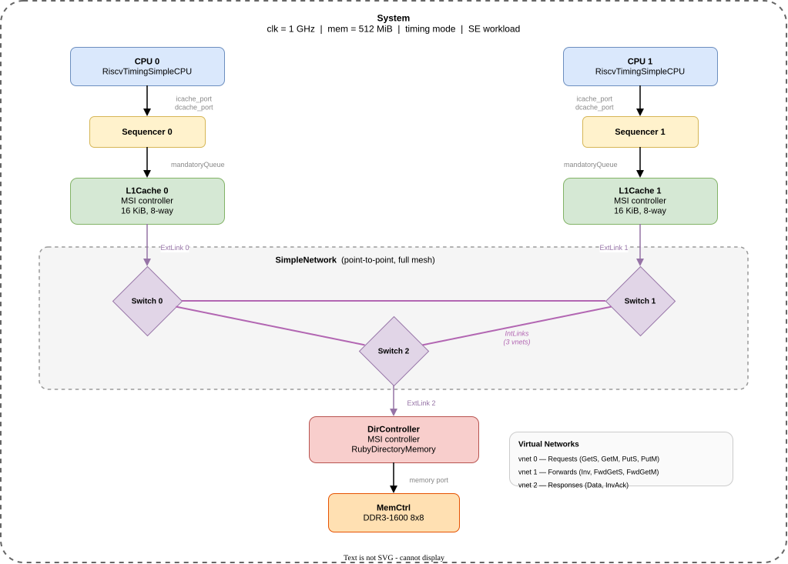
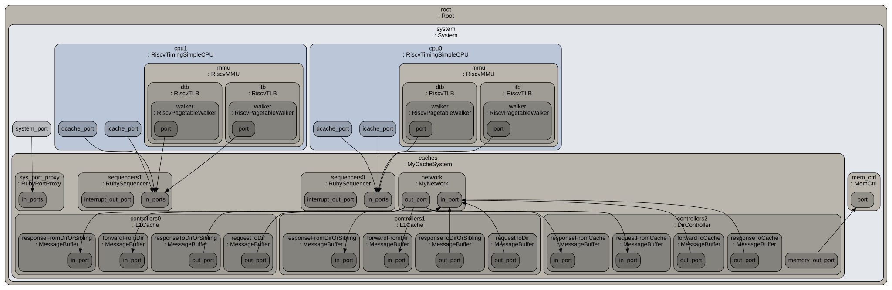

# Chapter 5b: Building MSI from Scratch

> *MI_example demonstrated the structure of a Ruby protocol -- but every access requiring exclusive ownership wastes invalidations on read-shared workloads. The Shared state fixes this.*

Chapter 5 introduced Ruby's architecture, the SLICC language, and the MI_example protocol -- two stable states, one message type for all accesses, and no ability to share data read-only.
That simplicity made MI_example the right first protocol to read, but it is not a protocol anyone would deploy.
The problem: when multiple cores read the same line, MI forces each reader to take exclusive ownership, invalidating the previous holder every time.

This chapter builds an MSI protocol from scratch, file by file.
The MSI protocol adds a Shared state, allowing multiple caches to hold read-only copies simultaneously.
This eliminates the unnecessary invalidations that plague MI on read-shared workloads.

To exercise the protocol on something more realistic than a single-core test, we set up a **two-CPU RISC-V system** running a multithreaded workload.
Two threads perform parallel vector addition on adjacent array elements that map to the same cache line -- textbook **false sharing**.
Every write by one core invalidates the other core's copy, forcing a steady stream of `GetM` requests, `Inv` forwards, and `InvAck` responses.
This workload lights up every interesting MSI transition -- `I→S`, `S→M` upgrades, `M→I` invalidations -- and makes the protocol's costs directly observable in the trace output.

The protocol we build is based on Table 8.1 and Section 8.2.4 of *A Primer on Memory Consistency and Cache Coherence* (Sorin, Hill, and Wood, 2011).
The complete source lives in [`src/learning_gem5/part3/`](../src/learning_gem5/part3/).

> **Reference:** The gem5 project hosts a [Part 3: Ruby tutorial](https://www.gem5.org/documentation/learning_gem5/part3/MSIintro/) that walks through the same MSI construction.
> This chapter covers the same protocol files but adds motivation from Classic's limitations, MI_example as a stepping stone, sequence diagrams for message flows, and failure-mode analysis.
> Readers who have completed the online tutorial can skim the SLICC mechanics and focus on the diagrams and tradeoff discussions.

---

### Table of Contents

- [5b.1 Message Types](#5b1-message-types-msi-msgsm)
- [5b.2 Cache Controller Declarations](#5b2-cache-controller-declarations-msi-cachesm)
- [5b.3 Cache Controller Input/Output Ports](#5b3-cache-controller-inputoutput-ports)
- [5b.4 Cache Controller Actions](#5b4-cache-controller-actions)
- [5b.5 Cache Controller Transitions](#5b5-cache-controller-transitions)
- [5b.6 Directory Controller](#5b6-directory-controller-msi-dirsm)
- [5b.7 Tracing a Two-Core Sharing Scenario](#5b7-tracing-a-two-core-sharing-scenario)
- [5b.8 The `.slicc` Manifest and Build Registration](#5b8-the-slicc-manifest-and-build-registration)
- [5b.9 Build, Run, and Verify](#5b9-build-run-and-verify)
- [5b.10 Failure Modes and Where Intuition Breaks](#5b10-failure-modes-and-where-intuition-breaks)
- [Key Ideas](#key-ideas)
- [1-Page Mental Model](#1-page-mental-model)
- [Common Misconceptions](#common-misconceptions)
- [If You Remember One Thing](#if-you-remember-one-thing)
- [Exercises](#exercises)

---

## 5b.1 Message Types: [`MSI-msg.sm`](../src/learning_gem5/part3/MSI-msg.sm)

We define two message types: requests and responses.

**Request types** (`CoherenceRequestType`):

| Type | Description |
|------|-------------|
| `GetS` | Cache requests read-only (Shared) permission |
| `GetM` | Cache requests read-write (Modified) permission |
| `PutS` | Cache evicting a Shared block (clean writeback) |
| `PutM` | Cache evicting a Modified block (dirty writeback) |
| `Inv` | Directory tells cache to invalidate |
| `PutAck` | Directory acknowledges a Put request |

**Response types** (`CoherenceResponseType`):

| Type | Description |
|------|-------------|
| `Data` | Contains the most up-to-date data |
| `InvAck` | Cache acknowledges it has invalidated the block |

Unlike MI_example, MSI separates read requests (`GetS`) from write requests (`GetM`).
This is the key to the Shared state: a `GetS` can be satisfied without invalidating other sharers.

The message structures carry the standard fields:

```
structure(RequestMsg, desc="...", interface="Message") {
    Addr addr,                   desc="Physical address for this request";
    CoherenceRequestType Type,   desc="Type of request";
    MachineID Requestor,         desc="Node who initiated the request";
    NetDest Destination,         desc="Multicast destination mask";
    DataBlock DataBlk,           desc="data for the cache line";
    MessageSizeType MessageSize, desc="size category of the message";
    ...
}
```

The `ResponseMsg` adds one critical field:

```
    int Acks, desc="Number of acks required from others";
```

This is how the directory tells the requestor how many invalidation acknowledgments to expect.
We will see this field drive the transient-state logic in the cache controller.

> **SLICC Gotcha: `MessageSize` is required.**
> Every message structure must include a `MessageSizeType MessageSize` field.
> Missing it causes a runtime panic, not a compile error.

## 5b.2 Cache Controller Declarations: [`MSI-cache.sm`](../src/learning_gem5/part3/MSI-cache.sm#L44)

#### Machine Header

```
machine(MachineType:L1Cache, "MSI cache")
    : Sequencer *sequencer;
      CacheMemory *cacheMemory;
      bool send_evictions;

      MessageBuffer * requestToDir, network="To", virtual_network="0",
            vnet_type="request";
      MessageBuffer * responseToDirOrSibling, network="To", virtual_network="2",
            vnet_type="response";
      MessageBuffer * forwardFromDir, network="From", virtual_network="1",
            vnet_type="forward";
      MessageBuffer * responseFromDirOrSibling, network="From",
            virtual_network="2", vnet_type="response";

      MessageBuffer * mandatoryQueue;
```

MSI uses **three virtual networks** (compared to MI_example's five):

| Virtual Network | Type | Purpose |
|:---:|------|---------|
| 0 | Request | `GetS`, `GetM`, `PutS`, `PutM` from cache to directory |
| 1 | Forward | `Inv`, `FwdGetS`, `FwdGetM`, `PutAck` from directory to caches |
| 2 | Response | `Data`, `InvAck` between caches and directory |

The ordering matters for deadlock freedom: responses (highest priority) must never be blocked behind requests (lowest priority).
If a request is stalled waiting for a response, and the response is stuck behind that same request in a shared queue, the system deadlocks.
Separate virtual networks prevent this.

> **SLICC Gotcha: `mandatoryQueue` is a hardcoded name.**
> The Sequencer looks for this exact name when connecting the CPU to the cache controller.
> If you name it anything else, the CPU-to-cache interface silently breaks.

#### States

Three stable states enforce the MSI invariant:

```
state_declaration(State, desc="Cache states") {
    I,      AccessPermission:Invalid,    desc="Not present/Invalid";
    S,      AccessPermission:Read_Only,  desc="Shared. Other caches may have the block";
    M,      AccessPermission:Read_Write, desc="Modified. Owner of block";
    ...
}
```

Seven transient states handle in-flight operations:

| State | Permission | Meaning |
|-------|-----------|---------|
| `IS_D` | Invalid | Invalid -> Shared, waiting for data |
| `IM_AD` | Invalid | Invalid -> Modified, waiting for acks and data |
| `IM_A` | Busy | Invalid -> Modified, got data, still waiting for acks |
| `SM_AD` | Read_Only | Shared -> Modified, waiting for acks and data |
| `SM_A` | Read_Only | Shared -> Modified, got data, still waiting for acks |
| `MI_A` | Busy | Modified -> Invalid, writeback sent, waiting for PutAck |
| `SI_A` | Busy | Shared -> Invalid, PutS sent, waiting for PutAck |
| `II_A` | Invalid | Already sent valid data, still waiting for PutAck |

The naming convention: the letters before the underscore are the start and end stable states; the letters after indicate what the controller is waiting for (`D` = data, `A` = acks, `AD` = both).

#### Events

```
enumeration(Event, desc="Cache events") {
    Load,           desc="Load from processor";
    Store,          desc="Store from processor";
    Replacement,    desc="Block chosen as victim";
    FwdGetS,        desc="Directory forwards GetS from another cache";
    FwdGetM,        desc="Directory forwards GetM from another cache";
    Inv,            desc="Invalidate from directory";
    PutAck,         desc="Directory acknowledges a Put";
    DataDirNoAcks,  desc="Data from directory with acks = 0";
    DataDirAcks,    desc="Data from directory with acks > 0";
    DataOwner,      desc="Data from owner cache";
    InvAck,         desc="Invalidation ack from other cache";
    LastInvAck,     desc="Last ack received (special internal trigger)";
}
```

`LastInvAck` is an internal event, not a message type.
The `in_port` logic for the response queue checks `tbe.AcksOutstanding`: when exactly one ack remains, it triggers `LastInvAck` instead of `InvAck`.
This simplifies the transition table -- the `LastInvAck` transition can move directly to the stable state.

#### Data Structures

The Entry and TBE are similar to MI_example, with one addition in the TBE:

```
structure(TBE, desc="Entry for transient requests") {
    State TBEState,         desc="State of block";
    DataBlock DataBlk,      desc="Data for the block";
    int AcksOutstanding, default=0, desc="Number of acks left to receive";
}
```

`AcksOutstanding` tracks how many invalidation acknowledgments the cache still needs before it can claim exclusive ownership.
This counter is essential for the `IM_AD`/`IM_A` and `SM_AD`/`SM_A` transient states.

> **SLICC Gotcha: Name mangling.**
> SLICC prefixes type names with the machine type.
> `TBE` becomes `L1Cache_TBE` in generated C++.
> The TBETable declaration must use `template="<L1Cache_TBE>"` to match:
> ```
> TBETable TBEs, template="<L1Cache_TBE>", constructor="m_number_of_TBEs";
> ```

#### Required Functions

Every controller must implement several functions that Ruby's infrastructure calls:

- `getState(TBE, Entry, Addr)` -- returns the current state.
  Checks TBE first (for transient states), then cache entry, then defaults to `I`.
- `setState(TBE, Entry, Addr, State)` -- sets state in both TBE and cache entry.
- `getAccessPermission(Addr)` / `setAccessPermission(Entry, Addr, State)` -- used by Ruby's functional access system for debugging and checkpointing.
- `functionalRead(Addr, Packet*)` / `functionalWrite(Addr, Packet*)` -- support functional (non-timing) accesses.

## 5b.3 Cache Controller Input/Output Ports

#### Output Ports

```
out_port(request_out, RequestMsg, requestToDir);
out_port(response_out, ResponseMsg, responseToDirOrSibling);
```

These declare named handles for sending messages.
Inside actions, you use `enqueue(request_out, RequestMsg, latency) { ... }` to send.

#### Input Ports

Input ports are processed in **priority order** -- the order they appear in the file determines which port is checked first each cycle:

1. `response_in` (virtual network 2) -- highest priority
2. `forward_in` (virtual network 1) -- medium priority
3. `mandatory_in` (virtual network 0, local) -- lowest priority

This ordering is critical.
If the mandatory queue (CPU requests) had higher priority than responses, a cache could keep issuing new requests while responses pile up, eventually deadlocking the network.

The response input port contains the logic for distinguishing `DataDirNoAcks`, `DataDirAcks`, and `DataOwner`:

```
if (machineIDToMachineType(in_msg.Sender) == MachineType:Directory) {
    if (in_msg.Acks + tbe.AcksOutstanding == 0) {
        trigger(Event:DataDirNoAcks, in_msg.addr, cache_entry, tbe);
    } else {
        trigger(Event:DataDirAcks, in_msg.addr, cache_entry, tbe);
    }
} else {
    if (in_msg.Type == CoherenceResponseType:Data) {
        trigger(Event:DataOwner, in_msg.addr, cache_entry, tbe);
    } else if (in_msg.Type == CoherenceResponseType:InvAck) {
        if (tbe.AcksOutstanding == 1) {
            trigger(Event:LastInvAck, ...);
        } else {
            trigger(Event:InvAck, ...);
        }
    }
}
```

The ack arithmetic deserves attention.
`InvAck` events that arrive *before* the directory's data response decrement `tbe.AcksOutstanding` below zero.
When the data response arrives, `in_msg.Acks` (the number the directory says to expect) is added to the (possibly negative) `AcksOutstanding`.
If the sum is zero, all acks have arrived and the event is `DataDirNoAcks`.

The mandatory input port handles evictions inline:

```
if (is_invalid(cache_entry) &&
        cacheMemory.cacheAvail(in_msg.LineAddress) == false) {
    Addr addr := cacheMemory.cacheProbe(in_msg.LineAddress);
    trigger(Event:Replacement, addr, victim_entry, victim_tbe);
} else {
    // trigger Load or Store
}
```

When the cache is full and the incoming request maps to a set with no free ways, the replacement policy selects a victim via `cacheProbe()`, and a `Replacement` event is triggered for the victim address (not the requested address).

## 5b.4 Cache Controller Actions

Actions are the building blocks of transitions.
Each action has a name, a shorthand (used in generated HTML documentation), and a body.

Key actions by category:

**Sending requests:**

```
action(sendGetS, 'gS', desc="Send GetS to the directory") {
    enqueue(request_out, RequestMsg, 1) {
        out_msg.addr := address;
        out_msg.Type := CoherenceRequestType:GetS;
        out_msg.Destination.add(
            mapAddressToMachine(address, MachineType:Directory));
        out_msg.MessageSize := MessageSizeType:Control;
        out_msg.Requestor := machineID;
    }
}
```

The `enqueue` block creates a message with a given latency (1 cycle here).
`mapAddressToMachine` queries the network to determine which directory controller handles the given address -- supporting address-interleaved multi-directory configurations.

The writeback actions `sendPutS` and `sendPutM` follow the same pattern, with one critical difference: `sendPutS` sends a control-only message (`MessageSize:Control`) because the Shared block is clean -- memory already has valid data.
`sendPutM` includes `cache_entry.DataBlk` and uses `MessageSize:Data` because the Modified block is dirty and the directory needs the data to update memory.

**CPU callbacks:**

The protocol has two variants for each callback -- *internal* hits (the block was already cached) and *external* hits (the block arrived from the network after a miss):

```
action(loadHit, "Lh", desc="Load hit") {
    assert(is_valid(cache_entry));
    cacheMemory.setMRU(cache_entry);
    sequencer.readCallback(address, cache_entry.DataBlk, false);
}

action(externalLoadHit, "xLh", desc="External load hit (was a miss)") {
    assert(is_valid(cache_entry));
    peek(response_in, ResponseMsg) {
        cacheMemory.setMRU(cache_entry);
        sequencer.readCallback(address, cache_entry.DataBlk, true,
                               machineIDToMachineType(in_msg.Sender));
    }
}
```

`loadHit` / `storeHit` are used for hits on blocks already in S or M.
`externalLoadHit` / `externalStoreHit` are used when a miss completes (e.g., IS_D -> S, IM_AD -> M).
The external variants peek the response queue to forward the responder's identity (`in_msg.Sender`) to the Sequencer for statistics tracking.
The third argument (`true` / `false`) tells the Sequencer whether the data came from an external source.

> **SLICC Gotcha: `setMRU()` is mandatory.**
> Every cache hit and fill must call `cacheMemory.setMRU(cache_entry)`.
> Omitting it silently breaks the replacement policy -- the block will never be marked as recently used, making it an immediate eviction candidate.

**Eviction notification:**

```
action(forwardEviction, "e", desc="sends eviction notification to CPU") {
    if (send_evictions) {
        sequencer.evictionCallback(address);
    }
}
```

`forwardEviction` notifies the CPU that a cache line has been invalidated or is about to be replaced.
This is needed for the O3 CPU model's speculative load tracking and architecture-specific coherence-aware instructions (e.g., x86 `mwait`, ARM exclusive monitors), not for protocol correctness.
It appears in transitions where the cache loses a valid copy: `S + Inv -> I`, `M + FwdGetM -> I`, and (perhaps surprisingly) `M + Store` -- the store hit callback tells the CPU "the old value is gone."

**Ack management:**

```
action(decrAcks, "da", desc="Decrement the number of acks") {
    assert(is_valid(tbe));
    tbe.AcksOutstanding := tbe.AcksOutstanding - 1;
    APPEND_TRANSITION_COMMENT("Acks: ");
    APPEND_TRANSITION_COMMENT(tbe.AcksOutstanding);
}

action(storeAcks, "sa", desc="Store the needed acks to the TBE") {
    assert(is_valid(tbe));
    peek(response_in, ResponseMsg) {
        tbe.AcksOutstanding := in_msg.Acks + tbe.AcksOutstanding;
    }
    assert(tbe.AcksOutstanding > 0);
}
```

`APPEND_TRANSITION_COMMENT` adds text to the protocol trace, visible in `DPRINTF(RubyProtocol, ...)` output.

**Cache block management:**

```
action(allocateCacheBlock, "a", desc="Allocate a cache block") {
    assert(is_invalid(cache_entry));
    assert(cacheMemory.cacheAvail(address));
    set_cache_entry(cacheMemory.allocate(address, new Entry));
}

action(deallocateCacheBlock, "d", desc="Deallocate a cache block") {
    assert(is_valid(cache_entry));
    cacheMemory.deallocate(address);
    unset_cache_entry();
}
```

> **SLICC Gotcha: `set_cache_entry()` and `unset_cache_entry()` are required.**
> When a transition's action list allocates or deallocates a cache block (or TBE), you must call `set_cache_entry()` / `unset_cache_entry()` (or `set_tbe()` / `unset_tbe()`) to update the implicit variables that subsequent actions in the *same transition* use.
> Without these calls, later actions in the transition see stale pointers and the simulator crashes or silently corrupts state.

**Queue management:**

```
action(popMandatoryQueue, "pQ", desc="Pop the mandatory queue") {
    mandatory_in.dequeue(clockEdge());
}
```

> **SLICC Gotcha: `dequeue()` is delayed one cycle.**
> The `dequeue` takes effect at `clockEdge()`, which is the *next* cycle boundary.
> This prevents the same message from being consumed twice in a single cycle.

## 5b.5 Cache Controller Transitions

Here is the complete MSI cache transition table.

#### From Invalid

| Current | Event | Next | Actions | Explanation |
|---------|-------|------|---------|-------------|
| I | Load | IS_D | allocateCacheBlock, allocateTBE, sendGetS, popMandatoryQueue | Read miss: allocate space, send GetS. |
| I | Store | IM_AD | allocateCacheBlock, allocateTBE, sendGetM, popMandatoryQueue | Write miss: allocate space, send GetM. |

Note the action ordering: allocate the cache block *first* (guaranteeing space for the response), send the request, then pop the queue.
If you pop before allocating, a subsequent request could steal the cache slot before the response arrives.

#### From IS_D (waiting for data after GetS)

| Current | Event | Next | Actions |
|---------|-------|------|---------|
| IS_D | DataDirNoAcks, DataOwner | S | writeDataToCache, deallocateTBE, externalLoadHit, popResponseQueue |
| IS_D | Load, Store, Replacement, Inv | IS_D | stall |

A GetS never requires invalidation acks -- the directory simply adds the requestor to the sharer list.
So `DataDirNoAcks` is the expected response.
`DataOwner` occurs when the directory forwards the GetS to the current owner (in M), who sends data directly.

#### From IM_AD and IM_A (waiting for exclusive access)

| Current | Event | Next | Actions |
|---------|-------|------|---------|
| IM_AD, SM_AD | DataDirNoAcks, DataOwner | M | writeDataToCache, deallocateTBE, externalStoreHit, popResponseQueue |
| IM_AD | DataDirAcks | IM_A | writeDataToCache, storeAcks, popResponseQueue |
| IM_AD, IM_A, SM_AD, SM_A | InvAck | same | decrAcks, popResponseQueue |
| IM_A, SM_A | LastInvAck | M | deallocateTBE, externalStoreHit, popResponseQueue |
| IM_AD, IM_A | Load, Store, Replacement, FwdGetS, FwdGetM | same | stall |

The two-phase completion: first data arrives (IM_AD -> IM_A), then the last ack arrives (IM_A -> M).
If all acks arrive before data (or with data), the `DataDirNoAcks` path goes directly to M.

#### From Shared

| Current | Event | Next | Actions |
|---------|-------|------|---------|
| S | Load | S | loadHit, popMandatoryQueue |
| S | Store | SM_AD | allocateTBE, sendGetM, popMandatoryQueue |
| S | Replacement | SI_A | sendPutS |
| S | Inv | I | sendInvAcktoReq, forwardEviction, deallocateCacheBlock, popForwardQueue |

A store to a Shared block requires an upgrade: send GetM to the directory, wait for the directory to invalidate other sharers and send data.
Note that in this protocol the directory *always* reads memory and sends data, even though the upgrading cache already holds a valid (Shared) copy of the line.
A more optimized protocol could skip the data transfer and send only an ack count, but this simpler design avoids a separate upgrade-response path.

The `S + Inv -> I` transition is how another cache's GetM invalidates this cache's Shared copy.
The cache sends an InvAck back to the requestor (not to the directory) -- this is a peer-to-peer ack.

#### From SM_AD and SM_A (upgrade in progress)

| Current | Event | Next | Actions |
|---------|-------|------|---------|
| SM_AD | DataDirAcks | SM_A | writeDataToCache, storeAcks, popResponseQueue |
| SM_AD | Inv | IM_AD | sendInvAcktoReq, popForwardQueue |
| SM_AD, SM_A | Load | same | loadHit, popMandatoryQueue |
| SM_AD, SM_A | Store, Replacement, FwdGetS, FwdGetM | same | stall |

The `SM_AD + Inv -> IM_AD` transition is subtle.
While upgrading from S to M, another cache's GetM arrives (as an Inv from the directory).
The cache must honor the invalidation -- it loses its Shared copy and falls back to IM_AD, as if it had started from Invalid.
It still completes its own GetM, but now it must wait for acks from the new set of sharers.

#### From Modified

| Current | Event | Next | Actions |
|---------|-------|------|---------|
| M | Load | M | loadHit, popMandatoryQueue |
| M | Store | M | storeHit, forwardEviction, popMandatoryQueue |
| M | Replacement | MI_A | sendPutM |
| M | FwdGetS | S | sendCacheDataToReq, sendCacheDataToDir, popForwardQueue |
| M | FwdGetM | I | sendCacheDataToReq, deallocateCacheBlock, popForwardQueue |

On `FwdGetS`, the Modified cache sends data to both the requestor and the directory.
The requestor gets a Shared copy, the directory updates its memory, and this cache transitions to Shared.
Two data messages are sent because the directory's copy was stale (the block was Modified).

On `FwdGetM`, this cache surrenders ownership entirely: send data to the new owner, deallocate the block.

**Design note: no TBE for writebacks.**
Compare the `M + Replacement` transition here (`sendPutM` only) with MI_example's, which allocated a TBE, copied data into it, and immediately freed the cache slot.
MSI takes a simpler approach: the cache block stays allocated in MI_A (or SI_A) until PutAck arrives.
The dirty data lives in the still-present `cache_entry`, so no TBE is needed.
The tradeoff is that the cache way is unavailable for new allocations during the writeback -- any request that needs that set will stall until PutAck frees the slot.
If a forwarded request (FwdGetS, FwdGetM) arrives while in MI_A, the controller can still serve data from `cache_entry`, which is why MI_A has `AccessPermission:Busy` rather than `Invalid`.

#### Writeback States (MI_A, SI_A, II_A)

| Current | Event | Next | Actions |
|---------|-------|------|---------|
| MI_A, SI_A, II_A | PutAck | I | deallocateCacheBlock, popForwardQueue |
| MI_A | FwdGetS | SI_A | sendCacheDataToReq, sendCacheDataToDir, popForwardQueue |
| MI_A | FwdGetM | II_A | sendCacheDataToReq, popForwardQueue |
| SI_A | Inv | II_A | sendInvAcktoReq, popForwardQueue |
| MI_A, SI_A, II_A | Load, Store, Replacement | same | stall |

The `II_A` state means: "I already sent valid data to someone else, but I haven't received my PutAck yet."
The cache no longer has valid data, but it must wait for the directory to acknowledge the writeback before it can deallocate cleanly.

## 5b.6 Directory Controller: [`MSI-dir.sm`](../src/learning_gem5/part3/MSI-dir.sm#L47)

The directory controller serves two roles: it tracks which caches have each block, and it acts as the interface to main memory.

#### Machine Header

```
machine(MachineType:Directory, "Directory protocol")
    :
      DirectoryMemory * directory;
      Cycles toMemLatency := 1;

    MessageBuffer *forwardToCache, network="To", virtual_network="1",
          vnet_type="forward";
    MessageBuffer *responseToCache, network="To", virtual_network="2",
          vnet_type="response";
    MessageBuffer *requestFromCache, network="From", virtual_network="0",
          vnet_type="request";
    MessageBuffer *responseFromCache, network="From", virtual_network="2",
          vnet_type="response";
    MessageBuffer *requestToMemory;
    MessageBuffer *responseFromMemory;
```

`requestToMemory` and `responseFromMemory` are special buffers that connect to the memory controller, not to the Ruby network.

[`DirectoryMemory`](../src/mem/ruby/structures/DirectoryMemory.hh#L60) is allocated lazily: it *can* cover all of memory (one entry per cache line), but entries are only created on first access via `getDirectoryEntry()`:

```
Entry getDirectoryEntry(Addr addr), return_by_pointer = "yes" {
    Entry dir_entry := static_cast(Entry, "pointer", directory[addr]);
    if (is_invalid(dir_entry)) {
        dir_entry := static_cast(Entry, "pointer",
                                 directory.allocate(addr, new Entry));
    }
    return dir_entry;
}
```

#### Directory States

```
state_declaration(State, desc="Directory states",
                  default="Directory_State_I") {
    I,    AccessPermission:Read_Write, desc="Invalid in the caches";
    S,    AccessPermission:Read_Only,  desc="At least one cache has the blk";
    M,    AccessPermission:Invalid,    desc="A cache has the block in M";

    S_D,  AccessPermission:Busy,       desc="Moving to S, but need data";
    S_m,  AccessPermission:Read_Write, desc="In S waiting for mem";
    M_m,  AccessPermission:Read_Write, desc="Moving to M waiting for mem";
    MI_m, AccessPermission:Busy,       desc="Moving to I waiting for ack";
    SS_m, AccessPermission:Busy,       desc="Moving to S waiting for ack";
}
```

**Important: the access permissions are memory-centric, not cache-centric.**
When the directory is in state I (no cache has the block), memory holds the valid copy, so the permission is `Read_Write`.
When the directory is in state M (a cache has the block), memory is stale, so the permission is `Invalid`.
This is the opposite of what you might expect if you think of the state names as referring to the directory's own data.

The states are named after what the *caches* are doing ("cache-centric"), but the access permissions describe what *memory* can do.
This dual perspective can be confusing -- keep the distinction in mind.

#### Directory Entry

```
structure(Entry, desc="...", interface="AbstractCacheEntry", main="false") {
    State DirState,    desc="Directory state";
    NetDest Sharers,   desc="Sharers for this block";
    NetDest Owner,     desc="Owner of this block";
}
```

[`NetDest`](../src/mem/ruby/common/NetDest.hh#L47) is a bitvector with one bit per controller in the system.
It supports:
- `add(MachineID)` / `remove(MachineID)` -- set/clear a single bit
- `addNetDest(NetDest)` -- OR two bitvectors
- `clear()` -- zero all bits
- `count()` -- population count
- `isElement(MachineID)` -- test a single bit

The `main="false"` annotation tells SLICC this is not a "real" cache -- the directory does not evict entries, so it does not participate in replacement.

#### Directory Events

```
enumeration(Event, desc="Directory events") {
    GetS,         desc="Request for read-only data from cache";
    GetM,         desc="Request for read-write data from cache";
    PutSNotLast,  desc="PutS and the block has other sharers";
    PutSLast,     desc="PutS and the block has no other sharers";
    PutMOwner,    desc="Dirty data writeback from the owner";
    PutMNonOwner, desc="Dirty data writeback from non-owner";
    Data,         desc="Response to fwd request with data";
    MemData,      desc="Data from memory";
    MemAck,       desc="Ack from memory that write is complete";
}
```

Notice that `PutS` is split into two events (`PutSNotLast` and `PutSLast`) based on the sharer count.
The `in_port` logic makes this decision:

```
if (in_msg.Type == CoherenceRequestType:PutS) {
    if (entry.Sharers.count() == 1) {
        assert(entry.Sharers.isElement(in_msg.Requestor));
        trigger(Event:PutSLast, in_msg.addr);
    } else {
        trigger(Event:PutSNotLast, in_msg.addr);
    }
}
```

Similarly, `PutM` is split into `PutMOwner` and `PutMNonOwner` by checking `entry.Owner.isElement(in_msg.Requestor)`.
This lets the directory handle stale writebacks (from non-owners) differently from valid ones.

#### Directory Transitions

**From I (no cache has the block):**

| Current | Event | Next | Actions |
|---------|-------|------|---------|
| I | GetS | S_m | sendMemRead, addReqToSharers, popRequestQueue |
| I | GetM | M_m | sendMemRead, setOwner, popRequestQueue |
| I | PutSNotLast, PutSLast, PutMNonOwner | I | sendPutAck, popRequestQueue |

On GetS, the directory reads memory and adds the requestor to the sharer list.
On GetM, it reads memory and sets the requestor as owner.
Stale Puts (from non-owners or in invalid state) just get acknowledged.

**Memory responses:**

| Current | Event | Next | Actions |
|---------|-------|------|---------|
| S_m | MemData | S | sendDataToReq, popMemQueue |
| M_m | MemData | M | sendDataToReq, clearSharers, popMemQueue |

When memory data arrives, the directory sends it to the requestor and transitions to the stable state.

**From S (one or more sharers, memory is valid):**

| Current | Event | Next | Actions |
|---------|-------|------|---------|
| S | GetS | S_m | sendMemRead, addReqToSharers, popRequestQueue |
| S | GetM | M_m | sendMemRead, removeReqFromSharers, sendInvToSharers, setOwner, popRequestQueue |
| S | PutSLast | I | removeReqFromSharers, sendPutAck, popRequestQueue |
| S | PutSNotLast, PutMNonOwner | S | removeReqFromSharers, sendPutAck, popRequestQueue |

The critical transition is `S + GetM`.
The directory must:
1. Read memory (to send data to the new owner).
2. Remove the requestor from sharers (it is becoming the owner).
3. Send invalidations to all remaining sharers.
4. Set the requestor as owner.

The `sendInvToSharers` action uses the `Sharers` bitvector as the multicast destination:

```
action(sendInvToSharers, "i", desc="Send invalidate to all sharers") {
    peek(request_in, RequestMsg) {
        enqueue(forward_out, RequestMsg, 1) {
            out_msg.addr := address;
            out_msg.Type := CoherenceRequestType:Inv;
            out_msg.Requestor := in_msg.Requestor;
            out_msg.Destination := getDirectoryEntry(address).Sharers;
            out_msg.MessageSize := MessageSizeType:Control;
        }
    }
}
```

The `Requestor` field in the Inv message is the cache that wants exclusive access, not the directory.
This allows sharers to send their `InvAck` directly to the requestor, avoiding a round trip through the directory.

The `sendDataToReq` action in the directory includes ack-count logic:

```
action(sendDataToReq, "d", desc="Send data from memory to requestor") {
    peek(memQueue_in, MemoryMsg) {
        enqueue(response_out, ResponseMsg, 1) {
            ...
            Entry e := getDirectoryEntry(address);
            if (e.Owner.isElement(in_msg.OriginalRequestorMachId)) {
                out_msg.Acks := e.Sharers.count();
            } else {
                out_msg.Acks := 0;
            }
        }
    }
}
```

If the requestor is the new owner (i.e., this is a GetM response), the directory tells it how many sharers were invalidated.
The requestor must collect that many `InvAck` messages before transitioning to M.

**From M (one cache has exclusive ownership, memory is stale):**

| Current | Event | Next | Actions |
|---------|-------|------|---------|
| M | GetS | S_D | sendFwdGetS, addReqToSharers, addOwnerToSharers, clearOwner, popRequestQueue |
| M | GetM | M | sendFwdGetM, clearOwner, setOwner, popRequestQueue |
| M | PutMOwner | MI_m | sendDataToMem, clearOwner, sendPutAck, popRequestQueue |
| M | PutSNotLast, PutSLast, PutMNonOwner | M | sendPutAck, popRequestQueue |

On `GetS` while in M, the directory cannot supply data (memory is stale).
It forwards the request to the current owner, who will send data to both the requestor and back to the directory.
The directory moves the owner into the sharer list and enters transient state `S_D` (waiting for data to write back to memory).

On `GetM` while in M, the directory simply forwards the request to the current owner and updates the owner field.
The old owner sends data directly to the new owner.
The directory stays in M -- it never sees the data.

On `PutMOwner`, the cache is writing back its modified block.
The directory writes the data to memory, clears the owner, and transitions through `MI_m` until memory acknowledges the write.

**Transient states:**

| Current | Event | Next | Actions |
|---------|-------|------|---------|
| S_D | Data | SS_m | sendRespDataToMem, popResponseQueue |
| SS_m | MemAck | S | popMemQueue |
| MI_m | MemAck | I | popMemQueue |
| S_D | GetS, GetM | S_D | stall |
| MI_m, SS_m, S_m, M_m | GetS, GetM | same | stall |

When the directory is in a transient state (waiting for memory or data from a cache), it stalls new requests for that block.
This is simpler than handling them -- at the cost of slightly higher latency for contended blocks.

**Stale Puts in transient states:**

A cache may send a PutS or PutM that arrives at the directory while the directory is in a transient state (e.g., a sharer evicts a block just as the directory is processing a GetM for that block).
The protocol must handle these gracefully:

| Current | Event | Next | Actions |
|---------|-------|------|---------|
| S_D, SS_m, S_m | PutSNotLast, PutMNonOwner | same | removeReqFromSharers, sendPutAck, popRequestQueue |
| S_D | PutSLast | S_D | removeReqFromSharers, sendPutAck, popRequestQueue |
| M_m, MI_m | PutSNotLast, PutSLast, PutMNonOwner | same | sendPutAck, popRequestQueue |

These transitions simply acknowledge the Put and update the sharer list.
The directory does not change state -- it continues waiting for memory or data.
Note that in M-derived transient states (M_m, MI_m), stale Puts do not call `removeReqFromSharers` because the Sharers bitvector is not meaningful when one cache has exclusive ownership.

## 5b.7 Tracing a Two-Core Sharing Scenario

Let us trace a concrete scenario to see MSI in action.
Two cores, Core 0 and Core 1, access the same address `A`.
Initially, no cache has the block.

```
Time    Core 0              Core 1
----    ------              ------
 1      Load A
 2                          Load A
 3                          Store A = 42
```

**Step 1: Core 0 loads A (read miss)**


Directory state: S, Sharers = {C0}, Owner = {}.
Core 0 cache state: S.

**Step 2: Core 1 loads A (read miss, block is shared)**



Directory state: S, Sharers = {C0, C1}, Owner = {}.
Both caches in state S.
No invalidations were needed -- this is the advantage of the Shared state over MI.

**Step 3: Core 1 stores to A (upgrade from S to M)**



The ack arithmetic: Core 1 was in SM_AD (waiting for acks and data).
The InvAck from Core 0 arrived before the directory's data response, decrementing `AcksOutstanding` from 0 to -1.
When the data arrives with `Acks = 1`, the sum is `1 + (-1) = 0`, so the event is `DataDirNoAcks`, and Core 1 goes directly to M.

Final state: Core 0 has `A` in I. Core 1 has `A` in M. Directory: state M, Owner = {C1}.

## 5b.8 The `.slicc` Manifest and Build Registration

The protocol manifest ([`src/learning_gem5/part3/MSI.slicc`](../src/learning_gem5/part3/MSI.slicc)) is minimal:

```
protocol "MSI";
include "MSI-msg.sm";
include "MSI-cache.sm";
include "MSI-dir.sm";
```

Files must be listed in dependency order: message types before controllers that use them.

To make the build system aware of this protocol, a Kconfig entry registers it.
For the MSI learning protocol, this is in [`src/learning_gem5/part3/Kconfig:27`](../src/learning_gem5/part3/Kconfig#L27):

```
config RUBY_PROTOCOL_MSI
    bool "MSI"
    default n
```

The build system discovers enabled protocols from `CONF_RUBY_PROTOCOL_*` variables and searches for matching `.slicc` files in known directories (including `src/learning_gem5/part3/`).
The SLICC compiler is invoked automatically at configure time to generate C++ from the `.sm` files.

> **SLICC Gotcha: Error line numbers are often wrong.**
> SLICC error messages frequently point one or more lines *after* the actual error.
> When debugging build failures, check bracket matching and the preceding lines.

---

## 5b.9 Build, Run, and Verify

### Building the MSI Protocol

With the MSI protocol enabled in Kconfig, build the RISC-V target:

```bash
scons build/RISCV/gem5.opt -j$(nproc) PROTOCOL=MSI
```

If the SLICC files have syntax errors, you will see them during the configure step (not during compilation).

### The Configuration Script

The RISC-V configuration script [`configs/learning_gem5/part3/riscv/simple_ruby_riscv.py`](../configs/learning_gem5/part3/riscv/simple_ruby_riscv.py) sets up a two-core RISC-V system with MSI caches.
It imports `MyCacheSystem` from the parent directory's [`msi_caches.py`](../configs/learning_gem5/part3/msi_caches.py#L47), which creates:

- Two `RiscvTimingSimpleCPU` cores.
- One `L1Cache` controller per CPU, each with a `RubySequencer` and a 16 KiB, 8-way `RubyCache`.
- One `DirController` with a `RubyDirectoryMemory` connected to the memory controller.
- A `SimpleNetwork` with point-to-point links (one switch per controller, full mesh between switches).
- Three virtual networks (matching the protocol's vnet assignments).

The following diagram shows the overall structure of the test system:



The auto-generated `config.dot.svg` from a completed run shows every SimObject and port connection in the instantiated system:



After setup, the script overrides [`send_evictions=False`](../configs/learning_gem5/part3/riscv/simple_ruby_riscv.py#L39-L40) on all L1Cache controllers.
When `send_evictions` is true, the SLICC action `forward_eviction_to_cpu` calls `sequencer.evictionCallback(address)`, which sends an `InvalidateReq` snoop back to the CPU.
x86 needs this to wake threads sleeping in `MONITOR`/`MWAIT` (the CPU watches a cache line and must be told when it is evicted); ARM needs it for its exclusive monitor / `WFE` mechanism.
RISC-V has no cache-line-monitoring sleep instruction, so these snoops are pure overhead.
Note that LR/SC correctness is **not** affected: `evictionCallback` always calls `llscClearMonitor(address)` unconditionally, regardless of the `send_evictions` flag, so a reservation is properly invalidated on eviction even with `send_evictions=False`.

Each controller's message buffers are connected to the network:

```python
def connectQueues(self, network):
    self.mandatoryQueue = MessageBuffer()
    self.requestToDir = MessageBuffer()
    self.requestToDir.out_port = network.in_port
    self.responseToDirOrSibling = MessageBuffer()
    self.responseToDirOrSibling.out_port = network.in_port
    self.forwardFromDir = MessageBuffer()
    self.forwardFromDir.in_port = network.out_port
    self.responseFromDirOrSibling = MessageBuffer()
    self.responseFromDirOrSibling.in_port = network.out_port
```

Outgoing buffers connect their `out_port` to `network.in_port`; incoming buffers connect their `in_port` to `network.out_port`.
The `mandatoryQueue` is local -- it connects to the Sequencer, not the network.

The workload is `threads` -- a multithreaded C++ program that performs parallel vector addition across the two cores.
Adjacent array elements processed by different threads share the same cache line, creating false sharing that stresses the MSI protocol's invalidation paths.

### Running and Interpreting Output

```bash
./build/RISCV/gem5.opt -d m5out/msi-test-$(date +%Y%m%d-%H%M%S) \
    configs/learning_gem5/part3/riscv/simple_ruby_riscv.py
```

Common warnings to expect and safely ignore:

- `warn: ignoring syscall set_robust_list(...)` -- RISC-V syscall emulation does not implement every syscall; `set_robust_list`, `mprotect`, `rt_sigaction`, `rt_sigprocmask`, and `madvise` are common.
- `warn: DRAM device capacity...` -- the DRAM model may report capacity mismatches when the simulated memory range does not exactly match a standard DIMM configuration.

A successful run prints `Validating...Success!` and completes with `Exiting @ tick ... because exiting with last active thread context`.
If the protocol has missing transitions (an event fires in a state with no defined transition), the simulator aborts with a `SLICC protocol error` identifying the (state, event) pair.

### Verifying with ProtocolTrace

The `ProtocolTrace` debug flag prints every protocol event: sequencer requests, controller transitions, and message sends.
Use `--debug-file` to capture the (large) output to a file:

```bash
./build/RISCV/gem5.opt -d m5out/msi-trace-$(date +%Y%m%d-%H%M%S) \
    --debug-flags=ProtocolTrace --debug-file=trace.txt \
    configs/learning_gem5/part3/riscv/simple_ruby_riscv.py
```

Each trace line has the format:

```
     tick  cpu  controller       event  old>new   [address, line address]
```

For example:

```
  267039000   1    L1Cache        Store   I>IM_AD  [0x24440, line 0x24440]
  267044000   1  Directory        GetM   I>M_m    [0x24440, line 0x24440]
  267113000   1  Directory      MemData  M_m>M    [0x24440, line 0x24440]
  267118000   1        Seq        Done      >     [0x24440, line 0x24440] 79 cycles
  267118000   1    L1Cache DataDirNoAcks IM_AD>M  [0x24440, line 0x24440]
```

This shows Core 1 storing to address `0x24440`: the L1Cache transitions from `I` to `IM_AD` (send GetM), the directory fetches from memory (`I→M_m→M`), and when data arrives the cache completes the transition to `M`.

Aggregating transitions with `grep` and `sort` reveals the full protocol behavior under the false-sharing workload:

**L1Cache transitions:**

| Transition | Count | Meaning |
|-----------|------:|---------|
| `S→S` | 1,536,062 | Read hit in Shared |
| `M→M` | 151,548 | Read/write hit in Modified |
| `I→IS_D→S` | 8,257 | Read miss, fetch shared copy |
| `S→SI_A→I` | 7,756 | Clean eviction of shared block |
| `I→IM_AD→M` | 458 | Write miss, fetch exclusive |
| `M→MI_A→I` | 439 | Dirty writeback |
| `S→SM_AD→M` | 113 | Upgrade from shared to exclusive |
| `M→S` | 24 | Downgrade on FwdGetS from another core |
| `M→I` | 10 | Invalidate on FwdGetM from another core |
| `S→I` | 4 | Invalidate on Inv |

**Directory transitions:**

| Transition | Count | Meaning |
|-----------|------:|---------|
| `I→S_m→S` | 8,233 | Memory fetch for read miss |
| `S→I` | 7,682 | Last sharer evicted |
| `I→M_m→M` | 447 | Memory fetch for write miss |
| `M→MI_m→I` | 439 | Writeback to memory |
| `S→M_m→M` | 114 | Upgrade: invalidate sharers, send data |
| `M→S_D→SS_m→S` | 24 | Owner supplies data to new sharer |

The false-sharing pattern in `threads.cpp` is visible in the `S→SM_AD→M` upgrades and `S→I` / `M→I` invalidations: both cores write to adjacent elements in the `c[]` array that share the same 64-byte cache line, forcing repeated ownership transfers.

---

## 5b.10 Failure Modes and Where Intuition Breaks

### Missing Transitions

The most common SLICC bug is a missing transition: an (event, state) pair that you forgot to handle.
SLICC generates a runtime assertion for every undefined cell in the transition table.
When the simulator hits it, you get a clear error message:

```
panic: Invalid transition
...
L1Cache in state SM_AD event Inv
```

This is actually a *feature* of the SLICC approach: in Classic's hardcoded C++ logic, an unhandled case might silently corrupt state.
In SLICC, it is a hard fail.

### Deadlock from Virtual Network Misassignment

If you put responses on the same virtual network as requests, the protocol can deadlock.
Consider: Core 0 sends a GetM (request), which blocks in the network behind Core 1's GetM.
Core 1's GetM is waiting for data (response) from Core 0.
If the response is on the same network as the request, it cannot bypass the queued requests, and the system freezes.

The fix is the virtual network assignment we already saw: requests on vnet 0, forwards on vnet 1, responses on vnet 2.

### The "Chose the Wrong Memory System" Failure

This is not a protocol bug but a research workflow failure.
If your research question is "how does prefetcher X interact with cache hierarchy Y", Classic is the right tool -- it is faster and simpler.
If your research question is "what happens when I change the coherence protocol", Ruby is the right tool.
Choosing Classic for a protocol study means either hacking C++ (error-prone, hard to validate) or abandoning the question.
Choosing Ruby for a cache-sizing study means paying Ruby's simulation overhead for no benefit.

---

## Key Ideas

- MSI adds a Shared state to MI, allowing multiple read-only copies and avoiding unnecessary invalidations on read-shared workloads.
- `GetS` (read) and `GetM` (write) are separate requests -- this is the key to the Shared state.
  A `GetS` can be satisfied without invalidating other sharers.
- The directory tracks sharers (via `NetDest` bitvectors) and owner, forwarding requests to avoid unnecessary memory reads.
- Invalidation ack counting uses signed arithmetic: acks arriving before the directory's response produce a negative `AcksOutstanding`, which the directory's ack count then zeroes out.
- Virtual networks prevent deadlock by separating message classes (requests on vnet 0, forwards on vnet 1, responses on vnet 2).
- Transient state naming encodes the transition: `IM_AD` = Invalid to Modified, waiting for Acks and Data.
- The directory's access permissions are memory-centric (I = memory is valid), while state names are cache-centric (I = no cache has the block).
- MSI's writeback design keeps the cache block allocated during MI_A/SI_A (no TBE needed), trading cache way availability for simplicity.

## 1-Page Mental Model

```
+----------------------------------------------------------------------+
|                         MSI PROTOCOL                                  |
|                                                                       |
|  STABLE STATES                                                        |
|    I (Invalid)   - block not present                                  |
|    S (Shared)    - read-only copy, others may have copies too         |
|    M (Modified)  - sole owner, memory is stale                        |
|                                                                       |
|  TRANSITIONS (cache perspective)                                      |
|    I + Load  -> IS_D  -> S    (send GetS, wait for data)             |
|    I + Store -> IM_AD -> M    (send GetM, wait for data + acks)      |
|    S + Store -> SM_AD -> M    (send GetM, wait for data + acks)      |
|    S + Inv   -> I             (another cache wants exclusive)         |
|    M + FwdGetS -> S           (supply data to reader + directory)     |
|    M + FwdGetM -> I           (surrender to new writer)              |
|                                                                       |
|  DIRECTORY PERSPECTIVE                                                |
|    State I: memory valid, no caches have the block                    |
|    State S: memory valid, Sharers bitvector tracks readers            |
|    State M: memory stale, Owner tracks the single writer              |
|                                                                       |
|  ACK ARITHMETIC (signed counter in TBE)                               |
|    InvAck arrives before Data: AcksOutstanding goes negative          |
|    Data arrives with Acks=N:   AcksOutstanding += N                   |
|    If sum == 0: all acks in -> DataDirNoAcks -> go to M              |
|    If sum >  0: still waiting -> DataDirAcks  -> go to IM_A/SM_A     |
|                                                                       |
|  VIRTUAL NETWORKS (deadlock prevention)                               |
|    vnet 0: requests   (lowest priority)                               |
|    vnet 1: forwards   (medium)                                        |
|    vnet 2: responses  (highest -- must never be blocked by requests)  |
|                                                                       |
|  MESSAGE FLOW EXAMPLE (Core 1 stores to shared block)                 |
|    C1 -> Dir: GetM         Dir -> C0: Inv      Dir -> Mem: Read       |
|    C0 -> C1: InvAck        Mem -> Dir: Data    Dir -> C1: Data(acks)  |
|    C1 collects acks + data -> M                                       |
+----------------------------------------------------------------------+
```

## Common Misconceptions

1. **"The directory always has up-to-date data."**
   When a block is in state M at the directory, some cache has the only valid copy.
   The directory's memory is stale.
   The directory must forward requests to the owner -- it cannot serve data itself.

2. **"InvAcks go to the directory."**
   In MSI, InvAcks are sent directly to the requesting cache (the one that issued GetM), not to the directory.
   The directory told the requestor how many acks to expect; the requestor collects them directly from its peers.

3. **"An upgrade from S to M is simpler than a fresh miss from I."**
   Not in this MSI protocol.
   An S-to-M upgrade (`SM_AD`) still requires the directory to read memory and send data, plus invalidation of all other sharers.
   A more optimized protocol could skip the data transfer, but this design keeps the paths uniform.

4. **"Transient states are implementation details I can ignore."**
   Transient states are where most protocol bugs hide.
   A missing transition in a transient state (e.g., receiving an Inv while in SM_AD) produces incorrect behavior or deadlock.
   The MSI cache controller has 8 transient states vs. 3 stable ones.

## If You Remember One Thing

**MSI's Shared state lets multiple caches hold read-only copies without invalidation -- but the price is complexity: the directory must track sharers, the cache must count invalidation acks, and transient states multiply because requests can now partially overlap with invalidation waves.
The MI-to-MSI jump is where coherence protocols stop being simple and start being distributed systems.**

## Exercises

1. **MI vs. MSI on a read-sharing trace.**
   Two cores execute: Core 0 loads A, Core 1 loads A, Core 0 loads A again.
   How many invalidation messages does MI_example generate?
   How many does MSI generate?
   What is the difference in cache miss count?

2. **Missing transition diagnosis.**
   You build an MSI protocol but forget the `SM_AD + Inv -> IM_AD` transition.
   Describe a two-core trace that would trigger this missing transition.
   What error message would the simulator produce?

3. **Virtual network deadlock.**
   Suppose you merge the forward and request virtual networks (put both on vnet 0).
   Construct a two-core, one-directory scenario that deadlocks.
   Explain why separate virtual networks prevent this deadlock.

4. **Ack arithmetic.**
   Core 0 has block A in S.
   Core 1 has block A in S.
   Core 2 sends GetM for A.
   The directory sends Data to Core 2 with `Acks = 2`, and sends Inv to Core 0 and Core 1.
   Core 1's InvAck arrives at Core 2 before the directory's Data.
   Trace `tbe.AcksOutstanding` at Core 2 through each message arrival.
   What event fires when the directory's data arrives?
   What event fires when Core 0's InvAck arrives?

5. **Directory forwarding.**
   Core 0 has block A in M.
   Core 1 sends GetS for A.
   Trace all messages exchanged and all state transitions (at Core 0, Core 1, and the directory).
   How many messages does the directory send?
   How many does Core 0 send?
   What is the final state at each location?

6. **Design: adding an Exclusive state.**
   MSI treats a block fetched by a single reader the same as one fetched by multiple readers: both go to S.
   Sketch what changes you would need to add an Exclusive state (MESI) to the MSI protocol:
   (a) What new stable state(s)?
   (b) What new transient state(s)?
   (c) What directory information is needed to distinguish "you are the only sharer" from "there are multiple sharers"?
   (d) What transitions change in the cache controller?
   You do not need to write SLICC code -- a state diagram and brief description are sufficient.
