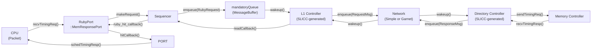
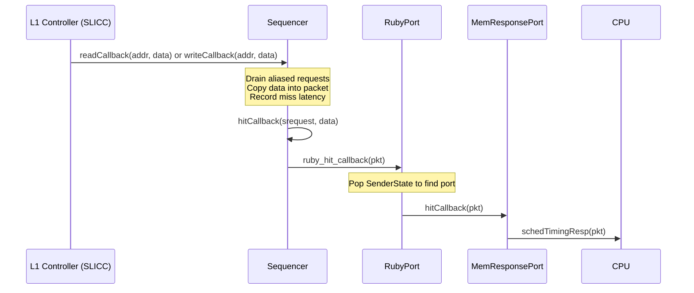
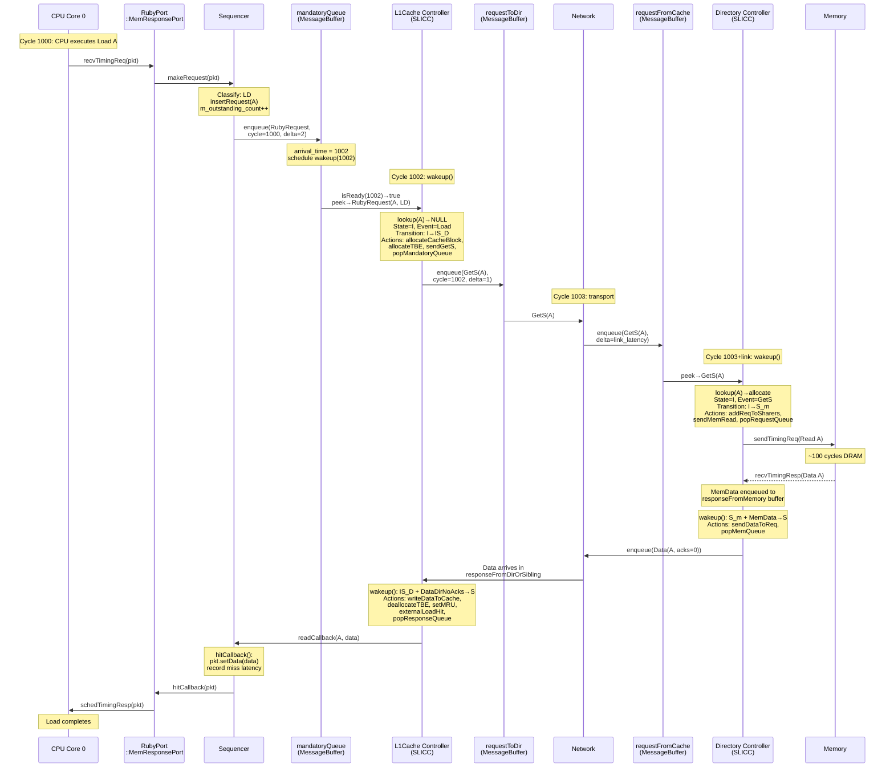

# Chapter 6: Ruby Architecture and Message Flow

> *Ruby is not "just coherence"; it is a specific controller-network-message architecture with concrete storage and queueing objects.*

Chapter 5 taught you to read and write coherence protocols in SLICC.
You traced load misses, stores, and writebacks through MI_example and MSI state machines.
But throughout that chapter, we waved our hands at the infrastructure *underneath* those state machines: "the Sequencer translates the request," "the message arrives in a buffer," "the controller wakes up."

This chapter opens the black box.
Every SLICC protocol runs on top of a concrete C++ infrastructure: the Sequencer that converts CPU packets into protocol messages, the MessageBuffer that queues and schedules those messages, the AbstractController that dispatches transitions, and the storage structures (CacheMemory, DirectoryMemory, TBETable, NetDest) that hold protocol state.
If you do not understand this infrastructure, you cannot debug a stalled simulation, explain why a request took 200 cycles instead of 20, or correctly configure a Ruby system in Python.

By the end of this chapter you will be able to trace one Ruby request from the CPU port all the way through the Sequencer, the L1 controller's mandatory queue, the controller's `wakeup()` loop, through a MessageBuffer into the network, through the directory controller, and back -- and you will know exactly which C++ object owns each cycle of latency along that path.

---

### Table of Contents

- [6.1 The Ruby Object Map](#61-the-ruby-object-map)
  - [Intuition: The Five Layers of a Ruby Request](#intuition-the-five-layers-of-a-ruby-request)
  - [Working Model: Who Owns What](#working-model-who-owns-what)
  - [RubySystem: The Root Object](#rubysystem-the-root-object)
- [6.2 From Packet to Protocol: RubyPort and Sequencer](#62-from-packet-to-protocol-rubyport-and-sequencer)
  - [RubyPort: The Bridge](#rubyport-the-bridge)
  - [Sequencer: Packet to Message](#sequencer-packet-to-message)
  - [The Request Table and Aliasing](#the-request-table-and-aliasing)
  - [The Callback Path: Protocol to CPU](#the-callback-path-protocol-to-cpu)
- [6.3 AbstractController: The SLICC Runtime](#63-abstractcontroller-the-slicc-runtime)
  - [The wakeup() Loop](#the-wakeup-loop)
  - [Blocking and Waking Buffers](#blocking-and-waking-buffers)
  - [Memory Port](#memory-port)
- [6.4 MessageBuffer: The Queueing Engine](#64-messagebuffer-the-queueing-engine)
  - [Intuition: A Priority Queue with a Clock](#intuition-a-priority-queue-with-a-clock)
  - [Working Model: enqueue, peek, dequeue](#working-model-enqueue-peek-dequeue)
  - [Formal and Code: Timing Semantics](#formal-and-code-timing-semantics)
  - [Buffer Management Strategies: stall, recycle, stall_and_wait](#buffer-management-strategies-stall-recycle-stall_and_wait)
- [6.5 Ruby Storage Structures](#65-ruby-storage-structures)
  - [CacheMemory](#cachememory)
  - [DirectoryMemory](#directorymemory)
  - [TBETable](#tbetable)
  - [NetDest](#netdest)
- [6.6 Functional Access: The Non-Timing Path](#66-functional-access-the-non-timing-path)
  - [The Functional Access Contract](#the-functional-access-contract)
  - [AccessPermission and State Mapping](#accesspermission-and-state-mapping)
  - [RubyPortProxy](#rubyportproxy)
- [6.7 Python Configuration Patterns](#67-python-configuration-patterns)
  - [Version Numbering](#version-numbering)
  - [Sequencer Creation and Linkage](#sequencer-creation-and-linkage)
  - [MessageBuffer Wiring](#messagebuffer-wiring)
  - [Directory Address Ranges](#directory-address-ranges)
  - [Setup Order](#setup-order)
  - [Legacy vs. Modern Stdlib Paths](#legacy-vs-modern-stdlib-paths)
- [6.8 End-to-End Trace: A Load Miss in MSI](#68-end-to-end-trace-a-load-miss-in-msi)
- [6.9 Failure Modes and Where Intuition Breaks](#69-failure-modes-and-where-intuition-breaks)
  - [Conflating Three Latencies](#conflating-three-latencies)
  - [MessageBuffer Backpressure](#messagebuffer-backpressure)
  - [Deadlock from wakeup() Starvation](#deadlock-from-wakeup-starvation)
  - [Configuration Ordering Bugs](#configuration-ordering-bugs)
- [Key Ideas](#key-ideas)
- [1-Page Mental Model](#1-page-mental-model)
- [Common Misconceptions](#common-misconceptions)
- [If You Remember One Thing](#if-you-remember-one-thing)
- [Exercises](#exercises)

---

## 6.1 The Ruby Object Map

### Intuition: The Five Layers of a Ruby Request

A CPU load that misses in Ruby touches five distinct layers of infrastructure.
Each layer adds latency, and confusing them is the most common source of "why is Ruby so slow?" questions.

```
┌─────────────────────────────────────────────────────────────┐
│  Layer 1: CPU Port Interface                                │
│    Packet arrives at RubyPort::MemResponsePort              │
│    Latency: ~0 (port handshake)                             │
├─────────────────────────────────────────────────────────────┤
│  Layer 2: Sequencer                                         │
│    Packet → RubyRequest, enqueue to mandatoryQueue          │
│    Latency: mandatoryQueueLatency (protocol-defined)        │
├─────────────────────────────────────────────────────────────┤
│  Layer 3: Controller State Machine                          │
│    SLICC wakeup(), peek, transition, actions                │
│    Latency: transition execution (typically 1 cycle)        │
├─────────────────────────────────────────────────────────────┤
│  Layer 4: Network Transport                                 │
│    MessageBuffer → Network → MessageBuffer                  │
│    Latency: SimpleNetwork link or Garnet router pipeline    │
├─────────────────────────────────────────────────────────────┤
│  Layer 5: Remote Controller + Memory                        │
│    Directory lookup, memory read, response                  │
│    Latency: directory transition + DRAM service time        │
└─────────────────────────────────────────────────────────────┘
```

When you see a 150-cycle miss latency in Ruby statistics, the breakdown might be: 2 cycles in the Sequencer, 1 cycle for the L1 controller transition, 5 cycles in the network, 1 cycle for the directory transition, 100 cycles for DRAM, 5 cycles return network, 1 cycle for the L1 data-response transition -- with the remaining cycles in various enqueue delays.
A reader who treats this as "Ruby coherence latency = 150 cycles" misses every optimization opportunity.

### Working Model: Who Owns What



Each arrow in this diagram is a concrete C++ method call.
No magic, no hidden indirection.

### RubySystem: The Root Object

[`RubySystem`](../src/mem/ruby/system/RubySystem.hh#L64) is the root SimObject that holds pointers to every Ruby component:

```cpp
// src/mem/ruby/system/RubySystem.hh (key members)
std::vector<AbstractController *> m_abs_cntrl_vec;  // all controllers
std::vector<std::unique_ptr<Network>> m_networks;    // all networks
memory::SimpleMemory *m_phys_mem;                    // backing store
uint32_t m_block_size_bytes;                         // cache line size
bool m_warmup_enabled;                               // checkpoint restore
```

RubySystem serves three roles:

1. **Registry**: it holds the vector of all controllers (`m_abs_cntrl_vec`) and networks (`m_networks`), populated during Python configuration.
2. **Configuration authority**: it owns the block size (`m_block_size_bytes`) that every other component reads via `getBlockSizeBytes()`.
3. **Functional access coordinator**: its `functionalRead()` and `functionalWrite()` methods iterate over all controllers and network buffers to find data for debugger reads and binary loading (Section 6.6).

RubySystem does *not* own the simulation clock or drive the event loop.
Each controller and network has its own clock domain and schedules its own events.

---

## 6.2 From Packet to Protocol: RubyPort and Sequencer

### RubyPort: The Bridge

[`RubyPort`](../src/mem/ruby/system/RubyPort.hh#L64) is an abstract base class that bridges gem5's standard port interface to Ruby.
It inherits from `ClockedObject` and contains inner classes for CPU-facing ports:

- **`MemResponsePort`** ([`RubyPort.hh:82`](../src/mem/ruby/system/RubyPort.hh#L82)): receives timing requests from the CPU.
- **`PioRequestPort`**: forwards PIO (device) requests outside Ruby.
- **`MemRequestPort`**: handles memory-mapped I/O.

The critical path starts at `MemResponsePort::recvTimingReq()` ([`RubyPort.cc:249`](../src/mem/ruby/system/RubyPort.cc#L249)):

```cpp
bool
RubyPort::MemResponsePort::recvTimingReq(PacketPtr pkt)
{
    // Save port in SenderState so the response can route back
    pkt->pushSenderState(new SenderState(this));

    // Submit the ruby request
    RequestStatus requestStatus = owner.makeRequest(pkt);

    if (requestStatus == RequestStatus_Issued) {
        return true;   // request accepted
    }
    // ...
    return false;      // port must retry later
}
```

Three things happen here:

1. The packet's `SenderState` stack gets a pointer to *this* port, so the eventual response knows which CPU port to use.
2. `owner.makeRequest(pkt)` calls into the Sequencer (the concrete subclass of RubyPort).
3. If the Sequencer is already at `m_max_outstanding_requests`, it returns `RequestStatus_BufferFull`, and the port returns `false`, telling the CPU to retry later.

RubyPort also handles **software prefetches** specially: it clones the packet and immediately responds to the CPU so the core does not stall, while the clone proceeds through the protocol ([`RubyPort.cc:262`](../src/mem/ruby/system/RubyPort.cc#L262)).

### Sequencer: Packet to Message

[`Sequencer`](../src/mem/ruby/system/Sequencer.hh#L85) is the concrete subclass of RubyPort.
Its job is threefold: classify the packet, track outstanding requests, and inject a `RubyRequest` message into the controller's mandatory queue.

**Step 1: Classify the packet** in `makeRequest()` ([`Sequencer.cc:950`](../src/mem/ruby/system/Sequencer.cc#L950)):

```cpp
RequestStatus
Sequencer::makeRequest(PacketPtr pkt)
{
    if (m_outstanding_count >= m_max_outstanding_requests)
        return RequestStatus_BufferFull;

    RubyRequestType primary_type = RubyRequestType_NULL;
    RubyRequestType secondary_type = RubyRequestType_NULL;

    if (pkt->isLLSC()) {
        // LL/SC → Load_Linked or Store_Conditional
    } else if (pkt->req->isLockedRMW()) {
        // x86 locked ops → Locked_RMW_Read or Locked_RMW_Write
    } else {
        if (pkt->isWrite())
            primary_type = secondary_type = RubyRequestType_ST;
        else if (pkt->isRead()) {
            if (pkt->req->isInstFetch())
                primary_type = secondary_type = RubyRequestType_IFETCH;
            else
                primary_type = secondary_type = RubyRequestType_LD;
        }
    }

    RequestStatus status = insertRequest(pkt, primary_type, secondary_type);
    if (status != RequestStatus_Aliased)
        issueRequest(pkt, secondary_type);

    return RequestStatus_Issued;
}
```

The Sequencer translates gem5 packet types into `RubyRequestType` enumerations that SLICC protocols understand: `LD`, `ST`, `IFETCH`, `Load_Linked`, `Store_Conditional`, `Locked_RMW_Read`, `Locked_RMW_Write`, `ATOMIC_RETURN`, `FLUSH`, etc.

**Step 2: Track outstanding requests** in `insertRequest()` ([`Sequencer.cc:306`](../src/mem/ruby/system/Sequencer.cc#L306)):

```cpp
RequestStatus
Sequencer::insertRequest(PacketPtr pkt, RubyRequestType primary_type,
                         RubyRequestType secondary_type)
{
    // Schedule deadlock detection if not already scheduled
    if (!deadlockCheckEvent.scheduled())
        schedule(deadlockCheckEvent, clockEdge(m_deadlock_threshold));

    Addr line_addr = makeLineAddress(pkt->getAddr());
    auto &seq_req_list = m_RequestTable[line_addr];

    seq_req_list.emplace_back(pkt, primary_type, secondary_type, curCycle());
    m_outstanding_count++;

    if (seq_req_list.size() > 1)
        return RequestStatus_Aliased;

    return RequestStatus_Ready;
}
```

The request table (`m_RequestTable`) is a hash map from cache-line address to a list of `SequencerRequest` objects.
If a second request arrives for the same cache line while the first is still outstanding, it *aliases*: the Sequencer stores the new request but does not issue a second protocol message.
When the protocol completes the first request, the Sequencer services all aliased requests from the same list entry.

**Step 3: Inject into the mandatory queue** in `issueRequest()` ([`Sequencer.cc:1086`](../src/mem/ruby/system/Sequencer.cc#L1086)):

```cpp
void
Sequencer::issueRequest(PacketPtr pkt, RubyRequestType secondary_type)
{
    // Create RubyRequest message with address, size, type, etc.
    std::shared_ptr<RubyRequest> msg =
        std::make_shared<RubyRequest>(clockEdge(), blk_size,
            m_ruby_system, pkt->getAddr(), pkt->getSize(),
            pc, secondary_type, RubyAccessMode_Supervisor, pkt,
            PrefetchBit_No, proc_id, core_id);

    // Enqueue with protocol-defined latency
    Tick latency = cyclesToTicks(
        m_controller->mandatoryQueueLatency(secondary_type));
    m_mandatory_q_ptr->enqueue(msg, clockEdge(), latency, ...);
}
```

The `mandatoryQueueLatency()` call is a protocol-specific hook -- different protocols can assign different enqueue delays.
The enqueue call schedules a wakeup event on the controller for `clockEdge() + latency`, at which point the controller's `wakeup()` method will process the message.

### The Request Table and Aliasing

The aliasing mechanism deserves emphasis because it is invisible to the protocol:

```
m_RequestTable (hash map: Addr → list<SequencerRequest>)
┌─────────────┬──────────────────────────────┐
│ 0x1000      │ [LD@cycle10, ST@cycle12]     │  ← aliased: only LD issued
├─────────────┼──────────────────────────────┤
│ 0x2040      │ [ST@cycle11]                 │  ← single outstanding
└─────────────┴──────────────────────────────┘
```

When a `writeCallback` arrives for address `0x1000`, the Sequencer drains the *entire* list -- because a write response means the controller now has exclusive access, so all pending requests (reads and writes) for that line can be satisfied.
When a `readCallback` arrives, the Sequencer drains reads from the front of the list until it hits a write, then stops (the write will be reissued).

This design means:

- The protocol sees at most one actively issued request per address per controller at a time.
- The Sequencer coalesces multiple CPU requests into a single protocol transaction.
- Latency statistics are anchored by the issued request; aliased requests do not create extra protocol transactions and complete when the callback drains the waiting list.

### The Callback Path: Protocol to CPU

When the protocol completes a request, the SLICC-generated controller calls back into the Sequencer:



Inside `hitCallback()` ([`Sequencer.cc:698`](../src/mem/ruby/system/Sequencer.cc#L698)), the Sequencer copies protocol data into the packet:

```cpp
void
Sequencer::hitCallback(SequencerRequest* srequest, DataBlock& data, ...)
{
    PacketPtr pkt = srequest->pkt;
    Addr request_address(pkt->getAddr());
    RubyRequestType type = srequest->m_type;

    if ((type == RubyRequestType_LD) || (type == RubyRequestType_IFETCH) || ...) {
        pkt->setData(data.getData(getOffset(request_address), pkt->getSize()));
    }
    // ...
    ruby_hit_callback(pkt);
}
```

The `ruby_hit_callback()` method in RubyPort ([`RubyPort.cc:484`](../src/mem/ruby/system/RubyPort.cc#L484)) pops the `SenderState` to recover the original CPU-facing port, then forwards the packet to `MemResponsePort::hitCallback()`.
That helper finishes packet conversion and schedules the timing response back to the CPU with `schedTimingResp(pkt, curTick())`.

**Deadlock detection**: The Sequencer schedules a periodic wakeup event (`m_deadlock_threshold`, default 500,000 cycles).
If any request in `m_RequestTable` has been outstanding longer than this threshold, the Sequencer panics with a diagnostic message listing the stalled address and request type.
This is your first warning sign of protocol bugs or misconfiguration.

---

## 6.3 AbstractController: The SLICC Runtime

Every SLICC-generated controller (L1Cache, Directory, DMA) inherits from [`AbstractController`](../src/mem/ruby/slicc_interface/AbstractController.hh#L78).
This base class provides the runtime machinery that SLICC code relies on: event scheduling, buffer management, memory port access, and statistics.

### The wakeup() Loop

The SLICC compiler generates a `wakeup()` method for each controller.
Its structure follows a fixed pattern:

```cpp
// SLICC-generated (simplified from MI_example_L1Cache_Controller.cc)
void
L1Cache_Controller::wakeup()
{
    int counter = 0;
    while (true) {
        unsigned char rejected[num_in_ports];
        memset(rejected, 0, sizeof(unsigned char) * num_in_ports);
        // in_port ordering determines priority

        // Port 0 (highest priority): responseToCache
        m_cur_in_port = 0;
        if (m_is_blocking && m_block_map.count(address) &&
            m_block_map[address] != &responseToCache)
            ; // blocked, skip
        else if (responseToCache.isReady(clockEdge())) {
            peek(responseToCache, ResponseMsg, in_msg) {
                // Look up state, trigger event, execute transition
                trigger(event, addr, cache_entry, tbe);
            }
        }

        // Port 1: forwardToCache
        m_cur_in_port = 1;
        // ... same pattern ...

        // Port 2 (lowest priority): mandatoryQueue
        m_cur_in_port = 2;
        // ... same pattern ...

        if (all ports quiescent)
            break;
        if (++counter >= m_transitions_per_cycle)
            break;  // yield to other events
    }
    // Reschedule if messages remain
}
```

Three critical design points:

1. **Port priority**: `in_port` declarations in the `.sm` file are processed top-to-bottom.
   The generated `wakeup()` loop visits them in that order, so the first declared `in_port` has the highest effective priority.
   Many protocols place response paths ahead of request paths for this reason, but the exact ordering is protocol-specific rather than a Ruby-wide rule.

2. **Transitions per cycle**: the `m_transitions_per_cycle` parameter (default: 32) caps how many transitions a single `wakeup()` call can execute.
   This prevents a single controller from monopolizing the event queue.

3. **`m_cur_in_port` tracking**: the controller records which port it is currently processing.
   This index is used by `stallBuffer()` and `wakeUpBuffers()` to implement per-port, per-address stalling (Section 6.4).

### Blocking and Waking Buffers

AbstractController maintains a map from blocked addresses to waiting message buffers ([`AbstractController.hh:417`](../src/mem/ruby/slicc_interface/AbstractController.hh#L417)):

```cpp
std::map<Addr, MessageBuffer*> m_block_map;           // blockOnQueue
typedef std::map<Addr, MsgVecType*> WaitingBufType;
WaitingBufType m_waiting_buffers;                     // stallBuffer
```

Two distinct blocking mechanisms:

**`blockOnQueue(addr, buffer)`** ([`AbstractController.cc:324`](../src/mem/ruby/slicc_interface/AbstractController.cc#L324)): blocks the controller entirely for an address.
Used by the Sequencer for x86 locked read-modify-write operations: after a `Locked_RMW_Read`, the controller blocks until the corresponding `Locked_RMW_Write` arrives in the mandatory queue.

**`stallBuffer(buf, addr)`** ([`AbstractController.cc:149`](../src/mem/ruby/slicc_interface/AbstractController.cc#L149)): records that a specific input port has a stalled message for an address.
When that address's state changes, `wakeUpBuffers(addr)` re-enqueues the stalled messages:

```cpp
void
AbstractController::wakeUpBuffers(Addr addr)
{
    if (m_waiting_buffers.count(addr) > 0) {
        // Wake up lower-priority ports waiting on this address
        for (int in_port_rank = m_cur_in_port - 1;
             in_port_rank >= 0; in_port_rank--) {
            if ((*(m_waiting_buffers[addr]))[in_port_rank] != NULL) {
                (*(m_waiting_buffers[addr]))[in_port_rank]->
                    reanalyzeMessages(addr, clockEdge());
            }
        }
        delete m_waiting_buffers[addr];
        m_waiting_buffers.erase(addr);
    }
}
```

Note the priority-aware wake-up: only ports with *lower* rank than the current port are woken.
This prevents a response from accidentally re-triggering a request that was stalled for the same address.

### Memory Port

Directory controllers access DRAM through a standard gem5 request port wrapped by `serviceMemoryQueue()` ([`AbstractController.cc:265`](../src/mem/ruby/slicc_interface/AbstractController.cc#L265)).
This method dequeues from the controller's memory request MessageBuffer, converts the `MemoryMsg` into a gem5 `Packet`, and sends it via `memoryPort.sendTimingReq()`.
When DRAM responds, the callback enqueues a `MemoryMsg` into the controller's memory response MessageBuffer, which triggers another `wakeup()`.

---

## 6.4 MessageBuffer: The Queueing Engine

[`MessageBuffer`](../src/mem/ruby/network/MessageBuffer.hh#L74) is the fundamental communication primitive in Ruby.
Every inter-controller message, every Sequencer-to-controller request, and every controller-to-memory transfer flows through a MessageBuffer.
Understanding its timing semantics is essential for reasoning about Ruby latency.

### Intuition: A Priority Queue with a Clock

Think of a MessageBuffer as a min-heap ordered by *arrival time*, not by insertion order.
When you enqueue a message with a 5-cycle delay, the message lands in the heap with `arrival_time = now + 5`.
It becomes visible (and dequeuable) only when the simulation clock reaches that arrival time.
A consumer event is scheduled at the arrival time, waking the controller to process it.

```
MessageBuffer (min-heap by arrival_time)
┌──────────────────────────────────┐
│  msg_A  arrival=1005             │  ← head (earliest ready)
│  msg_B  arrival=1008             │
│  msg_C  arrival=1012             │
└──────────────────────────────────┘
  consumer: L1Cache_Controller
  isReady(1005) → true (msg_A)
  isReady(1004) → false
```

### Working Model: enqueue, peek, dequeue

**`enqueue(message, current_time, delta)`** ([`MessageBuffer.cc:218`](../src/mem/ruby/network/MessageBuffer.cc#L218)):

1. Compute `arrival_time = current_time + delta`.
2. Set the message's `LastEnqueueTime` to `arrival_time`.
3. Push the message onto the min-heap.
4. Schedule the consumer's wakeup event at `arrival_time`.

The consumer is the controller or network object that reads from this buffer.
It is registered via `setConsumer()` during initialization.

**`peek()`** ([`MessageBuffer.cc:194`](../src/mem/ruby/network/MessageBuffer.cc#L194)):

Returns a pointer to the head message without removing it.
SLICC uses this in `peek(buffer, MsgType)` blocks to inspect `in_msg` before deciding on a transition.

**`dequeue(current_time)`** ([`MessageBuffer.cc:305`](../src/mem/ruby/network/MessageBuffer.cc#L305)):

1. Assert `isReady(current_time)` -- the head message's arrival time must be `<= current_time`.
2. Pop the head from the min-heap.
3. Record the cycle for size-tracking (the visible size does not decrease until the *next* cycle).

**`isReady(current_time)`** ([`MessageBuffer.hh:87`](../src/mem/ruby/network/MessageBuffer.hh#L87)):

Returns `true` if the heap is non-empty and the head message's arrival time `<= current_time`.
This is the guard that SLICC checks before processing each `in_port`.

### Formal and Code: Timing Semantics

The MessageBuffer has three subtle timing properties that affect protocol behavior:

**1. Dequeue visibility is usually delayed one cycle.**
For the normal non-zero-latency MessageBuffer path, when a message is dequeued at cycle $T$, the buffer's visible size does not decrease until cycle $T+1$.
This is tracked via `m_size_at_cycle_start` and `m_time_last_time_pop` ([`MessageBuffer.cc:319`](../src/mem/ruby/network/MessageBuffer.cc#L319)):

```cpp
if (m_time_last_time_pop < current_time) {
    m_size_at_cycle_start = m_prio_heap.size();
    m_stalled_at_cycle_start = m_stall_map_size;
    m_time_last_time_pop = current_time;
}
```

This means that `areNSlotsAvailable()` sees the pre-dequeue size for the entire cycle in which the dequeue occurs.
The intent is to preserve the normal "messages take at least 1 cycle" timing discipline.
Ruby also has an `allow_zero_latency` option for buffers that intentionally permit same-cycle visibility, so this is an important default behavior, not an absolute law.

**2. FIFO ordering is optional.**
A `strict_fifo` flag, derived from the MessageBuffer's `ordered` SimObject parameter in Python, enforces that messages are dequeued in enqueue order.
When enabled, the MessageBuffer panics if a new message's arrival time would violate the FIFO ordering of the existing messages.
Non-FIFO buffers allow out-of-order delivery based on arrival time.

**3. Capacity accounts for stalled messages.**
The `areNSlotsAvailable()` check ([`MessageBuffer.cc:147`](../src/mem/ruby/network/MessageBuffer.cc#L147)) counts *both* messages in the heap *and* messages in the stall map:

```cpp
if (current_size + current_stall_size + n <= m_max_size) {
    return true;
}
```

Stalled messages still occupy buffer slots.
A buffer that stalls too many messages can become "full" even though the heap itself has room.

### Buffer Management Strategies: stall, recycle, stall_and_wait

When a SLICC transition cannot be completed (e.g., a request arrives for a block in a transient state), the protocol must decide what to do with the blocked message.
SLICC provides three strategies, each with different performance tradeoffs:

#### stall()

The simplest strategy: do nothing.
The message stays at the head of the buffer.
On the next `wakeup()`, the controller will try again.

```
mandatoryQueue: [msg_A(blocked), msg_B, msg_C]
                 ↑ stuck here ─ msg_B and msg_C cannot proceed
```

**Problem**: head-of-line (HOL) blocking.
If `msg_B` and `msg_C` are for different addresses that *could* be processed, they are stuck behind `msg_A`.

**Used in**: MSI example from Chapter 5.
Acceptable for learning protocols with low contention.

#### recycle()

Moves the blocked message to the tail of the queue with a penalty delay ([`MessageBuffer.cc:373`](../src/mem/ruby/network/MessageBuffer.cc#L373)):

```cpp
void
MessageBuffer::recycle(Tick current_time, Tick recycle_latency)
{
    MsgPtr node = m_prio_heap.front();
    pop_heap(m_prio_heap.begin(), m_prio_heap.end(), std::greater<MsgPtr>());
    Tick future_time = current_time + recycle_latency;
    node->setLastEnqueueTime(future_time);
    m_prio_heap.back() = node;
    push_heap(m_prio_heap.begin(), m_prio_heap.end(), std::greater<MsgPtr>());
    m_consumer->scheduleEventAbsolute(future_time);
}
```

```
Before: [msg_A(blocked), msg_B, msg_C]
After:  [msg_B, msg_C, msg_A(delayed by recycle_latency)]
        ↑ msg_B can now be processed
```

**Problem**: the recycled message is re-checked every `recycle_latency` cycles whether or not the blocking condition has cleared.
This wastes simulation bandwidth on futile checks.

**Used in**: some internal Ruby protocols for simplicity.

#### stall_and_wait(address)

The most selective strategy.
The blocked message is moved from the heap into a per-address stall map ([`MessageBuffer.cc:447`](../src/mem/ruby/network/MessageBuffer.cc#L447)):

```cpp
void
MessageBuffer::stallMessage(Addr addr, Tick current_time)
{
    MsgPtr message = m_prio_heap.front();
    dequeue(current_time, false);  // remove from heap, keep buffer count
    (m_stall_msg_map[addr]).push_back(message);
    m_stall_map_size++;
}
```

The message stays in the stall map until the controller explicitly calls `wakeUpBuffers(addr)`, which calls `reanalyzeMessages(addr, ...)` to move the stalled messages back into the heap ([`MessageBuffer.cc:409`](../src/mem/ruby/network/MessageBuffer.cc#L409)):

```cpp
void
MessageBuffer::reanalyzeMessages(Addr addr, Tick current_time)
{
    m_stall_map_size -= m_stall_msg_map[addr].size();
    reanalyzeList(m_stall_msg_map[addr], current_time);
    m_stall_msg_map.erase(addr);
}
```

```
Before: heap=[msg_A(addr=X, blocked), msg_B(addr=Y)]
After:  heap=[msg_B(addr=Y)]   stall_map={X: [msg_A]}
        ↑ msg_B can now proceed
        msg_A wakes only when controller calls wakeUpBuffers(X)
```

**Tradeoff**: best performance (no HOL blocking, no wasted cycles), but requires the protocol to explicitly call `wakeUpBuffers()` at the right time.
A missing `wakeUpBuffers()` call means the message is stalled *forever*.

**Used in**: production protocols like `MESI_Two_Level` (Chapter 8).

| Strategy | HOL Blocking | Wasted Cycles | Complexity | Used In |
|----------|:---:|:---:|:---:|---|
| `stall()` | Yes | No | Minimal | MSI example |
| `recycle()` | No | Yes (periodic re-check) | Low | Some internal protocols |
| `stall_and_wait()` | No | No | High (must call `wakeUpBuffers`) | MESI_Two_Level, CHI |

---

## 6.5 Ruby Storage Structures

SLICC protocols declare data structures (Entry, TBE, directory entries) using SLICC syntax, but the underlying storage is provided by C++ classes in `src/mem/ruby/structures/`.

### CacheMemory

[`CacheMemory`](../src/mem/ruby/structures/CacheMemory.hh#L64) provides tag and data storage for cache controllers.

#### Intuition

CacheMemory is a set-associative cache with a pluggable replacement policy.
It is *not* the Classic `Cache` class from Chapter 3 -- it has no MSHRs, no write buffers, no prefetcher.
Those functions are handled by SLICC protocol logic (TBEs serve as MSHRs, and prefetch actions are protocol-defined).

#### Working Model

```
CacheMemory (4 sets × 2-way)
        Way 0           Way 1
Set 0   [0x1000, M]     [0x3000, S]
Set 1   [empty]         [0x5040, I]
Set 2   [0x2080, M]     [empty]
Set 3   [0x70C0, S]     [0x40C0, S]

m_tag_index: {0x1000→0, 0x3000→1, 0x5040→1, 0x2080→0, ...}
```

#### Formal and Code

Key members ([`CacheMemory.hh:176`](../src/mem/ruby/structures/CacheMemory.hh#L176)):

```cpp
std::unordered_map<Addr, int> m_tag_index;           // addr → way
std::vector<std::vector<AbstractCacheEntry*>> m_cache; // [set][way]
replacement_policy::Base *m_replacementPolicy_ptr;
```

Key operations:

- **`lookup(addr)`** ([`CacheMemory.cc:384`](../src/mem/ruby/structures/CacheMemory.cc#L384)): converts address to set via `addressToCacheSet()`, then looks up the way via the `m_tag_index` hash map.
  Returns `AbstractCacheEntry*` or `NULL`.
  The hash map makes this O(1) rather than scanning all ways.

- **`allocate(addr, entry)`** ([`CacheMemory.cc:307`](../src/mem/ruby/structures/CacheMemory.cc#L307)): finds an empty way in the set, installs the entry, sets its permission to `Invalid`, and calls `m_replacementPolicy_ptr->reset()` on the replacement data.

- **`deallocate(addr)`** ([`CacheMemory.cc:352`](../src/mem/ruby/structures/CacheMemory.cc#L352)): calls `m_replacementPolicy_ptr->invalidate()`, clears the entry, and erases the `m_tag_index` entry.

- **`cacheAvail(addr)`** ([`CacheMemory.cc:286`](../src/mem/ruby/structures/CacheMemory.cc#L286)): returns `true` if the address is already present or an empty way exists.
  SLICC protocols check this before allocating -- if the cache is full, the protocol must trigger a replacement first.

- **`setMRU(addr)`**: updates the replacement policy.
  SLICC protocols *must* call this explicitly near callbacks.
  gem5 emits a `warn_once` reminder in `Sequencer::hitCallback()`: *"Replacement policy updates recently became the responsibility of SLICC state machines. Make sure to setMRU() near callbacks in .sm files!"*

The replacement policy itself is the same pluggable system used by Classic caches (LRU, TreePLRU, Random, etc. from `src/mem/cache/replacement_policies/`).
The replacement data is stored in a separate 2D vector (`replacement_data[set][way]`) rather than inside `AbstractCacheEntry`, because some policies (e.g., TreePLRU) need per-set shared state rather than per-entry state.

### DirectoryMemory

[`DirectoryMemory`](../src/mem/ruby/structures/DirectoryMemory.hh#L55) maps addresses to directory entries.

#### Key Design: Lazy Allocation

DirectoryMemory allocates a *pointer array* during `init()` -- one slot per cache-line-sized block in the address range -- but the actual directory entries are **not** created until a protocol first accesses them:

```cpp
// DirectoryMemory.cc:127
AbstractCacheEntry*
DirectoryMemory::allocate(Addr address)
{
    AbstractCacheEntry *entry = new AbstractCacheEntry;
    entry->m_Permission = AccessPermission_Read_Only;
    m_entries[mapAddressToLocalIdx(address)] = entry;
    return entry;
}
```

In the teaching MSI protocol, the SLICC helper `getDirectoryEntry(address)` calls `lookup()` and allocates on first miss.
This lazy allocation is critical: a 4 GB address space with 64-byte blocks would require 64 million entries.
Pre-allocating all of them would waste memory for blocks that are never accessed.

The address-to-index mapping supports non-contiguous address ranges via `mapAddressToLocalIdx()` ([`DirectoryMemory.cc:102`](../src/mem/ruby/structures/DirectoryMemory.cc#L102)), which iterates the `addrRanges` list and computes an offset.

### TBETable

[`TBETable`](../src/mem/ruby/structures/TBETable.hh#L55) stores Transient Buffer Entries -- the protocol's equivalent of MSHRs.

```cpp
template<class ENTRY>
class TBETable {
    std::unordered_map<Addr, ENTRY> m_map;
    int m_number_of_TBEs;  // capacity limit
};
```

The template parameter is the SLICC-declared TBE structure (e.g., `L1Cache_TBE` after SLICC name-mangling).
Key operations:

- **`lookup(addr)`**: returns a pointer to the TBE or `NULL`.
- **`allocate(addr)`**: creates a new TBE entry.
  Asserts that the table is not full (`m_map.size() < m_number_of_TBEs`).
- **`deallocate(addr)`**: erases the TBE.
- **`areNSlotsAvailable(n)`**: checks if `n` TBE slots are free.
  Protocols check this before starting new transactions.

TBE capacity is a critical tuning parameter.
Too few TBEs limit the number of in-flight coherence transactions, reducing throughput.
Too many waste area and complicate debugging.

### NetDest

[`NetDest`](../src/mem/ruby/common/NetDest.hh#L46) is a bitvector type used to represent sets of machines -- sharers, owner, multicast destinations.

#### Intuition

Think of NetDest as `std::set<MachineID>` implemented with one bitvector per machine type:

```
NetDest { Sharers }
  m_bits[L1Cache]:   [1, 0, 1, 1]  → L1Cache_0, L1Cache_2, L1Cache_3
  m_bits[Directory]: [0, 0]         → no directories
```

#### API

| Method | Description |
|--------|-------------|
| `add(MachineID)` | Set a bit |
| `remove(MachineID)` | Clear a bit |
| `clear()` | Clear all bits |
| `addNetDest(other)` | Bitwise OR (union) |
| `count()` | Number of set bits |
| `isElement(MachineID)` | Test a bit |
| `broadcast(MachineType)` | Set all bits for a type |
| `intersectionIsNotEmpty(other)` | Test for overlap |
| `smallestElement(MachineType)` | First set bit of a type |

The MachineID-to-bit mapping uses `vecIndex(m)` (which machine-type vector) and `bitIndex(m.num)` (which bit within that vector).
This two-level indexing allows efficient operations when multiple machine types coexist.

SLICC protocols use NetDest extensively:

```
// In a directory controller:
getDirectoryEntry(address).Sharers.add(in_msg.Requestor);
out_msg.Destination := getDirectoryEntry(address).Sharers;
```

---

## 6.6 Functional Access: The Non-Timing Path

### The Functional Access Contract

Every Ruby controller must support four functions for non-timing access.
These are required for GDB reads, binary loading, and checkpoint restore:

| Function | Purpose |
|----------|---------|
| `getAccessPermission(addr)` | Returns the `AccessPermission` for a block |
| `setAccessPermission(addr, perm)` | Updates the permission |
| `functionalRead(addr, pkt)` | Copies data from controller storage into a packet |
| `functionalWrite(addr, pkt)` | Writes data from a packet into all matching storage |

What SLICC auto-generates from the state declarations are the `*_State_to_permission()` helpers.
The actual `getAccessPermission`, `setAccessPermission`, `functionalRead`, and `functionalWrite` implementations are protocol-specific, and many protocols provide them directly in their `.sm` files.

### AccessPermission and State Mapping

The `AccessPermission` enum maps protocol states to data availability:

| AccessPermission | Meaning | Example States |
|-----------------|---------|----------------|
| `Invalid` | Block not present | I |
| `NotPresent` | Entry not allocated | Default |
| `Busy` | Block in transient state, data may not be valid | IS, IM |
| `Read_Only` | Block present, can read but not write | S |
| `Read_Write` | Block present, can read and write | M, E |
| `Maybe_Stale` | Block may still carry usable data, but not as the preferred authoritative copy | Protocol-specific transient or writeback-related states |

During functional access, `RubySystem::functionalRead()` first scans controllers in each network for `Read_Write` or `Read_Only` data, checks controller and network message buffers, and only then falls back to `Maybe_Stale` copies or backing memory.

`functionalWrite()` is more aggressive: it writes data into matching controllers, sequencers, MessageBuffers, and network buffers that contain the address, ensuring the functional view stays coherent.

### RubyPortProxy

[`RubyPortProxy`](../src/mem/ruby/system/RubyPortProxy.hh) is a special port that provides functional (non-timing) access to Ruby memory.
It is used by:

- **Binary loading**: the OS loader writes the executable image into memory via functional writes before simulation starts.
- **GDB**: the debugger reads memory state via functional reads.
- **System port**: connected to `system.system_port` in Python configuration.

Without RubyPortProxy, there is no way to write the initial binary image into Ruby-managed memory, because Ruby's timing path requires a running simulation loop.

---

## 6.7 Python Configuration Patterns

Ruby system configuration follows specific conventions that apply across all protocols.
Getting these wrong produces obscure errors: missing connections, version conflicts, or silent misrouting.

### Version Numbering

Every controller of the same `MachineType` needs a unique, monotonically increasing `version` number starting from 0.
The version is used to construct the `MachineID` (type, version) that identifies the controller in protocol messages and the network routing tables.

The standard pattern uses a class-level counter ([`msi_caches.py:116`](../configs/learning_gem5/part3/msi_caches.py#L116)):

```python
class L1Cache(MSI_L1Cache_Controller):
    _version = 0
    @classmethod
    def versionCount(cls):
        cls._version += 1
        return cls._version - 1

    def __init__(self, ...):
        super().__init__()
        self.version = self.versionCount()
```

Each controller type maintains its own counter: L1 caches count from 0, directory controllers count from 0 independently.
The modern stdlib resets these counters in `_reset_version_numbers()` to allow multiple hierarchy instantiations.

### Sequencer Creation and Linkage

The Sequencer must be created with the correct cross-references ([`msi_caches.py:81`](../configs/learning_gem5/part3/msi_caches.py#L81)):

```python
sequencer = RubySequencer(
    version = i,                          # conventionally aligned with controller numbering
    dcache  = controller.cacheMemory,     # used for LL/SC and cache-maintenance bookkeeping
    clk_domain = controller.clk_domain,   # commonly shared with the controller
    ruby_system = ruby_system,            # parent system
)
controller.sequencer = sequencer          # bidirectional link
```

In the teaching configs, the Sequencer's `version` is usually kept numerically aligned with the controller version because it makes the setup easier to reason about.
They do **not** share the same `MachineID`: controller `MachineID`s come from the controller's `MachineType` plus controller `version`, while the Sequencer `version` is used by RubyPort/LLSC bookkeeping.
The `dcache` parameter is not Ruby's normal data path, but it is not LL/SC-only either; the Sequencer also uses it for L1 invalidation walks and related bookkeeping.

CPU ports are connected via:

```python
sequencer.connectCpuPorts(cpu)
# or equivalently:
cpu.connectAllPorts(sequencer.in_ports, sequencer.in_ports,
                    sequencer.interrupt_out_port)
```

### MessageBuffer Wiring

Each controller's MessageBuffers must be connected to the network with the correct directionality ([`msi_caches.py:158`](../configs/learning_gem5/part3/msi_caches.py#L158)):

```python
# Outgoing: controller → network
self.requestToDir = MessageBuffer(ordered=True)
self.requestToDir.out_port = ruby_system.network.in_port

# Incoming: network → controller
self.forwardFromDir = MessageBuffer(ordered=True)
self.forwardFromDir.in_port = ruby_system.network.out_port

# Special: Sequencer → controller (no network connection)
self.mandatoryQueue = MessageBuffer()
```

Three rules:

1. **`out_port` for outgoing, `in_port` for incoming**: the port direction is relative to the *controller*.
   A controller that *sends* requests assigns `out_port = network.in_port`.
   A controller that *receives* forwards assigns `in_port = network.out_port`.

2. **`mandatoryQueue` has no network connection**: it receives requests directly from the Sequencer, not from the network.
   Do not assign `in_port` or `out_port` to it.

3. **Buffer names must match SLICC declarations**: the Python attribute name (e.g., `requestToDir`) must exactly match the MessageBuffer name in the `.sm` file's `machine()` declaration.
   A mismatch produces a build-time or runtime error.

### Directory Address Ranges

Directory controllers must have `addr_ranges` covering all of physical memory so that every address has a home ([`msi_caches.py:195`](../configs/learning_gem5/part3/msi_caches.py#L195)):

```python
class DirController(MSI_Directory_Controller):
    def __init__(self, ruby_system, ranges, mem_ctrls):
        super().__init__()
        self.addr_ranges = ranges       # must cover all memory
        self.directory = RubyDirectoryMemory()
        self.memory = mem_ctrls[0].port  # connect to DRAM
```

For multi-directory configurations, each directory covers a disjoint address range, and the network routes messages based on address-to-directory mapping.

### Setup Order

In practice, Ruby configuration is easiest to reason about if it follows this sequence:

```
1. Create RubySystem
2. Create Network (SimpleNetwork or GarnetNetwork)
3. Create Controllers (each creates its MessageBuffers in __init__)
4. Create Sequencers and link to controllers
5. Connect topology: network.connectControllers(all_controllers)
6. Initialize network: network.setup_buffers()
7. Create RubyPortProxy for system port
8. Connect CPU ports to Sequencers
```

Getting step 5 or 6 wrong produces "MessageBuffer not connected" assertions at startup.
More generally, leaving buffers without consumers or issuing requests before the network/buffers are fully initialized can produce "no consumer" failures in `MessageBuffer`.

### Legacy vs. Modern Stdlib Paths

gem5 exposes two configuration styles:

**Legacy** (`configs/ruby/*.py` + `configs/learning_gem5/part3/`):
Manual controller creation, explicit version numbering, direct MessageBuffer wiring.
More verbose but more transparent -- you see every object and connection.
The `configs/learning_gem5/part3/msi_caches.py` example from Chapter 5 uses this style.

**Modern stdlib** (`src/python/gem5/components/cachehierarchies/ruby/`):
Component-based with `AbstractRubyCacheHierarchy`, board integration via `incorporate_cache()`, and automatic version numbering.
More concise but more abstracted -- the wiring happens inside component classes.

```python
# Modern stdlib (mi_example_cache_hierarchy.py)
class MIExampleCacheHierarchy(AbstractRubyCacheHierarchy):
    def incorporate_cache(self, board):
        self.ruby_system = RubySystem()
        self.ruby_system.network = SimplePt2Pt(self.ruby_system)
        # Controllers created internally
        for core in board.get_processor().get_cores():
            cache = L1Cache(size=self._size, assoc=self._assoc,
                           network=self.ruby_system.network, core=core, ...)
            cache.sequencer = RubySequencer(version=i, ...)
            core.connect_icache(cache.sequencer.in_ports)
            core.connect_dcache(cache.sequencer.in_ports)
```

Both paths instantiate the same Ruby concepts and runtime mechanisms.
The exact object graph and helper wrappers can differ, but the underlying RubySystem/controllers/sequencers/MessageBuffers model is the same.
The book will use the legacy path for clarity, since it makes every connection explicit.

---

## 6.8 End-to-End Trace: A Load Miss in MSI

Let us trace a single load miss through every layer of Ruby infrastructure, using the MSI protocol from Chapter 5.
Core 0 executes `Load A` when address A is not in any cache.



**Latency breakdown** (approximate for this trace):

| Component | Cycles | What happens |
|-----------|--------|--------------|
| Sequencer → mandatoryQueue | 2 | `mandatoryQueueLatency` enqueue delay |
| L1 transition (I → IS_D) | 1 | `sendGetS` enqueue delay |
| Network (L1 → Directory) | 1-5 | Link latency (SimpleNetwork) or router hops (Garnet) |
| Directory transition | 1 | `sendMemRead` |
| DRAM service | ~100 | Row activation + column access |
| Directory data send | 1 | `sendDataToReq` enqueue delay |
| Network (Directory → L1) | 1-5 | Return path |
| L1 transition (IS_D → S) | 0 | `readCallback` fires same cycle as transition |
| **Total** | **~110-120** | |

The DRAM service time dominates.
Network latency matters more when you switch from SimpleNetwork to Garnet with multi-hop routing.
In this teaching MSI-style path, the controller transitions and enqueue delays add a baseline overhead of roughly 5-10 cycles before memory service dominates.

---

## 6.9 Failure Modes and Where Intuition Breaks

### Conflating Three Latencies

The most common analysis mistake is treating a Ruby miss as having a single "coherence latency."
In reality, a miss passes through three distinct latency domains:

1. **Controller-local latency**: enqueue delays in mandatoryQueue, transition execution time, TBE allocation.
   Typically 2-5 cycles.
2. **Network transport latency**: message traversal from controller to controller.
   1 cycle for a direct SimpleNetwork link; 3-10+ cycles for multi-hop Garnet routing.
3. **Memory service latency**: DRAM row activation, column access, bus turnaround.
   30-200+ cycles depending on row buffer hit/miss and bank contention.

When optimizing, you need to know which domain dominates.
A protocol that reduces controller-local latency from 5 to 3 cycles saves nothing if DRAM service is 150 cycles.
Conversely, a network optimization that saves 2 hops matters enormously when memory is fast (e.g., SRAM scratchpad).

### MessageBuffer Backpressure

Each MessageBuffer has its own configurable maximum size (`m_max_size`, from that buffer's `buffer_size` Python parameter).
When a protocol checks `areNSlotsAvailable()` and finds no room, the transition must delay, stall, or take some other retry path before enqueueing.
This creates *backpressure*: the sender-side logic cannot safely inject more traffic until capacity reappears.

The dangerous case: a response buffer fills up because the receiving controller is stalled on a request buffer that is also full.
This circular dependency is a *deadlock*.
Virtual networks prevent this for protocol messages (responses on a separate vnet cannot be blocked by requests), but misconfigurations -- like putting too many message types on the same vnet or setting buffer sizes too small -- can still trigger it.

**Diagnostic**: if the Sequencer's deadlock detector fires, check MessageBuffer occupancy statistics (`avg_buf_msgs`, `avg_stall_time`) in the Ruby stats output.
A buffer consistently at maximum capacity is a strong signal.

### Deadlock from wakeup() Starvation

The `m_transitions_per_cycle` parameter caps how many transitions a single `wakeup()` call can execute.
If a controller receives a burst of messages and cannot process them all within the transition limit, it must reschedule itself for the next cycle.
This is normally fine -- but if new messages keep arriving faster than the controller can process them, the controller falls behind, its input buffers fill, and backpressure propagates through the system.

This is not a protocol deadlock (no circular dependency), but it looks like one: the simulation stops making progress, and the deadlock detector fires.
The fix is usually to increase `m_transitions_per_cycle` or identify why the controller is overwhelmed (often a misconfigured buffer size or an overly aggressive traffic generator).

### Configuration Ordering Bugs

Two common Python configuration mistakes:

**Missing `setup_buffers()`**: forgetting to call `network.setup_buffers()` after `connectControllers()` leaves MessageBuffers without consumers.
The first `enqueue()` call asserts `m_consumer != NULL` and panics.

**Version number gaps**: if L1 controllers get versions 0, 1, 3 (skipping 2), the network routing table has a hole.
This kind of mismatch creates hard-to-diagnose numbering, routing, or configuration bugs because multiple Ruby structures assume a dense per-type numbering scheme.
The modern stdlib avoids this by using the `versionCount()` class method, but hand-written configurations can still get it wrong.

---

## Key Ideas

- Ruby is a five-layer architecture: CPU ports → Sequencer → Controller → Network → Remote Controller.
  Each layer adds measurable latency, and confusing them leads to wrong conclusions.
- The **Sequencer** converts CPU `Packet` objects into `RubyRequest` messages and tracks outstanding requests in a per-address table.
  Aliased requests (multiple CPU accesses to the same line) are coalesced into a single protocol transaction.
- **AbstractController** provides the SLICC runtime: `wakeup()` loop with port-priority-ordered processing, per-address buffer stalling, and memory port access.
- **MessageBuffer** is a priority queue ordered by arrival time.
  Its timing semantics -- normally delayed dequeue visibility, stalled messages counting toward capacity, FIFO being optional -- are critical for understanding Ruby latency.
- **Three buffer management strategies** trade off simplicity vs. performance: `stall()` (HOL blocking), `recycle()` (wasted cycles), `stall_and_wait()` (best but most complex).
- **CacheMemory**, **DirectoryMemory**, **TBETable**, and **NetDest** are the storage primitives that SLICC protocols manipulate.
  DirectoryMemory uses lazy allocation; TBETable capacity limits in-flight transactions; NetDest implements sharer/owner bitvectors.
- **Functional access** (non-timing reads/writes) is required for binary loading and debugging.
  Every controller path must provide `getAccessPermission`, `setAccessPermission`, `functionalRead`, and `functionalWrite`.
- Python configuration requires careful attention to version numbering, MessageBuffer wiring direction, address range coverage, and setup ordering.

## 1-Page Mental Model

```
┌──────────────────────────────────────────────────────────────────────────┐
│                    RUBY ARCHITECTURE AND MESSAGE FLOW                     │
│                                                                          │
│  CPU REQUEST PATH                                                        │
│    CPU → MemResponsePort.recvTimingReq()                                 │
│        → Sequencer.makeRequest(pkt)                                      │
│            classify: LD, ST, IFETCH, LL/SC, Locked_RMW, ATOMIC           │
│            insertRequest(addr) → m_RequestTable[line_addr].push_back()   │
│            issueRequest() → mandatoryQueue.enqueue(RubyRequest)          │
│                                                                          │
│  CONTROLLER WAKEUP (SLICC-generated)                                     │
│    wakeup() loops over in_ports in declaration order:                    │
│      protocols often put response_in before forward_in before mandatory  │
│    For each ready port:                                                  │
│      peek(msg) → lookup state → trigger(event) → execute transition      │
│    Max transitions_per_cycle, then yield                                 │
│                                                                          │
│  MESSAGE BUFFER (the universal queue)                                    │
│    enqueue(msg, now, delta) → arrival = now + delta, schedule consumer   │
│    isReady(now) → head.arrival <= now                                    │
│    peek() → read head without removing                                   │
│    dequeue(now) → usually remove head, size visible next cycle           │
│                                                                          │
│    Stall strategies:                                                     │
│      stall()           → leave at head (HOL blocking)                    │
│      recycle()         → move to tail with delay (wasted re-checks)      │
│      stall_and_wait(A) → move to stall_map[A] (wake via wakeUpBuffers)  │
│                                                                          │
│  STORAGE STRUCTURES                                                      │
│    CacheMemory    : set-associative, hash-map tag index, pluggable repl  │
│    DirectoryMemory: lazy alloc, addr→entry[idx], covers full phys range  │
│    TBETable       : hash map, capacity-limited, protocol's MSHR          │
│    NetDest        : bitvector per MachineType, sharer/owner tracking     │
│                                                                          │
│  RESPONSE PATH                                                           │
│    SLICC action → Sequencer.readCallback(addr, data)                     │
│        → drain aliased requests                                          │
│        → hitCallback(): pkt.setData(data)                                │
│        → RubyPort.ruby_hit_callback(pkt)                                 │
│        → pop SenderState → MemResponsePort.hitCallback(pkt)              │
│        → schedTimingResp(pkt)                                            │
│        → CPU                                                             │
│                                                                          │
│  PYTHON CONFIG ORDER                                                     │
│    RubySystem → Network → Controllers → Sequencers → connectControllers  │
│    → setup_buffers → RubyPortProxy → CPU port connections                │
│                                                                          │
│  WHERE LATENCY HIDES                                                     │
│    Controller-local: mandatoryQueue delay + transition (2-5 cy)          │
│    Network transport: link/router hops (1-10+ cy)                        │
│    Memory service: DRAM access (30-200+ cy)                              │
│    Decompose before optimizing!                                          │
└──────────────────────────────────────────────────────────────────────────┘
```

## Common Misconceptions

1. **"Ruby miss latency is coherence overhead."**
   In simple memory-backed miss paths, DRAM often dominates, but Ruby/controller/network overhead can dominate in other configurations.
   The protocol adds controller and enqueue overhead; the network adds topology-dependent transport time; memory adds its own service latency.
   Decompose the miss before deciding what is actually "slow."

2. **"MessageBuffer is a FIFO queue."**
   It is a priority queue ordered by arrival time.
   With randomization enabled or variable enqueue delays, messages can be dequeued in a different order than they were enqueued.
   Strict FIFO is an optional mode that must be explicitly requested.

3. **"The Sequencer sends one message per CPU request."**
   Aliased requests (multiple CPU accesses to the same cache line) share a single protocol transaction.
   The Sequencer only issues a new protocol message while another request for that line is already outstanding.

4. **"stall() means the controller is stuck."**
   `stall()` means the controller cannot process the *head* message in that particular buffer.
   Other buffers (with higher priority) may still be processable.
   The controller re-checks the stalled buffer on the next `wakeup()`.
   True deadlock requires a circular dependency, not just a stall.

5. **"MessageBuffers are controller-local."**
   Some are (mandatoryQueue, memory request/response buffers), but many are connected between a controller and the network.
   The `out_port`/`in_port` Python assignments connect them to the network, meaning the network writes into them and the controller reads from them (or vice versa).

6. **"Directory entries are pre-allocated for all of memory."**
   DirectoryMemory allocates the *pointer array* upfront but creates actual entries lazily.
   Only addresses that have been accessed by at least one cache have allocated directory entries.

7. **"CacheMemory is the same as Classic Cache."**
   CacheMemory is *only* tag and data storage.
   It has no MSHRs, no write buffers, no prefetcher, no snoop handling.
   All of those functions are performed by the SLICC protocol and the controller infrastructure.

## If You Remember One Thing

**Each major chunk of Ruby latency can usually be tied to a specific C++ object or mechanism: the Sequencer's mandatoryQueue enqueue, the controller's `wakeup()` transition, the MessageBuffer's arrival-time delay, the network's link or router pipeline, or the memory controller's DRAM timing.
When a simulation is "too slow," do not blame "Ruby" -- decompose the latency into these five layers and find which one dominates.**

## Exercises

1. **Latency decomposition.**
   Run the MSI protocol with `simple_ruby.py` and two cores.
   Use the `RubySequencer` debug flag (`--debug-flags=RubySequencer`) to observe request issue and callback times.
   For a single load miss, compute the cycle breakdown: how many cycles in the Sequencer, how many in the network, how many in DRAM?
   Which layer dominates?

2. **MessageBuffer sizing.**
   Reduce the `buffer_size` parameter on the L1 controller's request buffer to 1.
   Run a traffic generator with high request rate.
   What happens?
   At what point does the simulation deadlock vs. merely slow down?
   What changes in the statistics?

3. **stall vs. stall_and_wait.**
   Consider a directory controller processing requests from 4 cores.
   Core 0's request for address A arrives while A is in a transient state.
   Cores 1, 2, and 3 then send requests for different addresses B, C, D.
   (a) With `stall()`, how many requests can the directory process before A's transient state resolves?
   (b) With `stall_and_wait(A)`, how many?
   (c) If A's transient state takes 100 cycles to resolve, estimate the throughput difference.

4. **Aliasing in the Sequencer.**
   Core 0 issues: `Load 0x1000`, `Store 0x1008`, `Load 0x1020`.
   Assume 64-byte cache lines.
   (a) Which of these requests alias?
   (b) How many protocol messages does the Sequencer issue?
   (c) When the protocol response arrives, what type of callback fires (`readCallback` or `writeCallback`), and which CPU requests does it satisfy?

5. **Configuration debugging.**
   You write a Ruby configuration script but get the error: `"panic: MessageBuffer: m_consumer is NULL"` at simulation startup.
   (a) Which configuration step is most likely missing?
   (b) What method call would fix it?
   (c) Where in the setup order (Section 6.7) does it belong?

6. **Functional access.**
   Explain why `functionalWrite()` must update *all* copies of a cache line across all controllers and network buffers, while `functionalRead()` only needs to find *one* valid copy.
   What would go wrong if `functionalWrite()` only updated the first copy it found?
