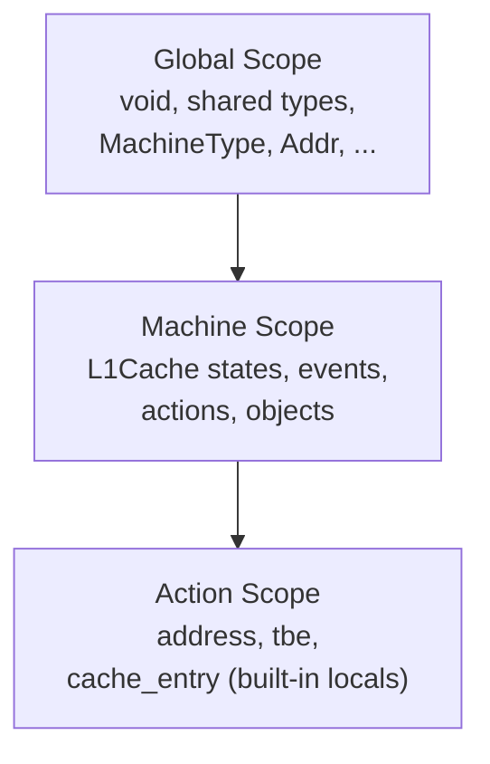
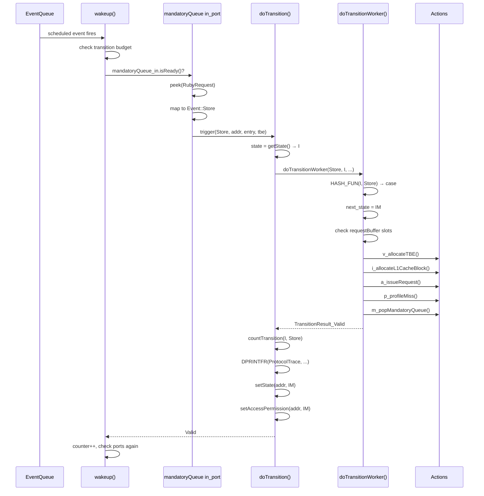

# Chapter 7: SLICC as a Compiler, Not Just a Syntax

> *SLICC is powerful precisely because it generates a controller framework from a disciplined state-machine description.*

You have been writing SLICC since Chapter 5.
You declared states, events, actions, and transitions; you wired `in_port` and `out_port` blocks; you built MSI from scratch and ran it.
But the entire time, you treated the SLICC toolchain as a black box: you edited `.sm` files, ran the build, and either got a working controller or a cryptic error message pointing to the wrong line.

This chapter opens that black box.
SLICC is a compiler -- it has a lexer, a parser, an AST, a symbol table, and multiple code-generation backends.
Understanding its pipeline does three things for you.
First, it explains *why* every SLICC gotcha from Chapter 5 exists -- not as arbitrary quirks but as consequences of concrete design decisions.
Second, it lets you predict *what* the generated C++ will look like before you ever read it, turning protocol debugging from archaeology into engineering.
Third, it gives you the mental model to extend SLICC or diagnose build failures that stop at "SLICC error on line 247" with no further explanation.

By the end of this chapter you will be able to trace any `.sm` declaration through the SLICC pipeline -- from parser grammar rule to AST node to symbol-table entry to generated C++ method -- and you will understand what the compiler enforces versus what it leaves entirely to the protocol author.

---

### Table of Contents

- [7.1 The SLICC Compilation Pipeline](#71-the-slicc-compilation-pipeline)
  - [Intuition: From .sm to Simulated Controller](#intuition-from-sm-to-simulated-controller)
  - [Working Model: The Five Pipeline Stages](#working-model-the-five-pipeline-stages)
  - [Formal and Code: Source Layout](#formal-and-code-source-layout)
- [7.2 Lexing and Parsing](#72-lexing-and-parsing)
  - [The .slicc Manifest File](#the-slicc-manifest-file)
  - [PLY-Based Parser](#ply-based-parser)
  - [Key Grammar Productions](#key-grammar-productions)
  - [The AST Layer](#the-ast-layer)
- [7.3 The Symbol Table](#73-the-symbol-table)
  - [Intuition: A Registry of Everything the Protocol Declares](#intuition-a-registry-of-everything-the-protocol-declares)
  - [Working Model: Symbol Types and Scoping](#working-model-symbol-types-and-scoping)
  - [StateMachine: The Central Symbol](#statemachine-the-central-symbol)
  - [Building the Transition Table](#building-the-transition-table)
- [7.4 Code Generation: From Symbol Table to C++](#74-code-generation-from-symbol-table-to-c)
  - [Intuition: Five Files Per Machine](#intuition-five-files-per-machine)
  - [The Python SimObject File](#the-python-simobject-file)
  - [The Controller Header](#the-controller-header)
  - [The Controller Implementation](#the-controller-implementation)
  - [The Wakeup Loop](#the-wakeup-loop)
  - [The Transition Dispatch](#the-transition-dispatch)
  - [Type and Enum Generation](#type-and-enum-generation)
- [7.5 Tracing a Transition End-to-End](#75-tracing-a-transition-end-to-end)
  - [SLICC Source: I + Store → IM](#slicc-source-i--store--im)
  - [Generated doTransitionWorker Case](#generated-dotransitionworker-case)
  - [Generated Action Bodies](#generated-action-bodies)
  - [The Full Picture: wakeup → trigger → doTransition → actions → setState](#the-full-picture-wakeup--trigger--dotransition--actions--setstate)
- [7.6 HTML and Dot Graph Generation](#76-html-and-dot-graph-generation)
  - [HTML Tables: First-Class Compiler Artifacts](#html-tables-first-class-compiler-artifacts)
  - [Dot Graphs: State Machine Visualization](#dot-graphs-state-machine-visualization)
  - [Generating HTML and Dot Output](#generating-html-and-dot-output)
- [7.7 Build System Integration](#77-build-system-integration)
  - [SCons Invocation](#scons-invocation)
  - [Incremental Rebuild](#incremental-rebuild)
  - [Multiple Protocols](#multiple-protocols)
- [7.8 Why the SLICC Gotchas Exist](#78-why-the-slicc-gotchas-exist)
  - [mandatoryQueue: A Hard-Coded Name](#mandatoryqueue-a-hard-coded-name)
  - [Name Mangling: Namespace Without Namespaces](#name-mangling-namespace-without-namespaces)
  - [dequeue() Delayed One Cycle](#dequeue-delayed-one-cycle)
  - [Error Line Numbers Point After the Problem](#error-line-numbers-point-after-the-problem)
  - [Unused Actions Are Warnings, Not Errors](#unused-actions-are-warnings-not-errors)
  - [z_stall Is Magic](#z_stall-is-magic)
- [7.9 What SLICC Enforces vs. What It Does Not](#79-what-slicc-enforces-vs-what-it-does-not)
- [7.10 Failure Modes and Debugging the Compiler](#710-failure-modes-and-debugging-the-compiler)
  - [Parse Errors](#parse-errors)
  - [Symbol Resolution Failures](#symbol-resolution-failures)
  - [Missing Transitions](#missing-transitions)
  - [Generated Code Won't Compile](#generated-code-wont-compile)
- [7.11 Experiment: Edit, Rebuild, Inspect](#711-experiment-edit-rebuild-inspect)
- [Key Ideas](#key-ideas)
- [1-Page Mental Model](#1-page-mental-model)
- [Common Misconceptions](#common-misconceptions)
- [If You Remember One Thing](#if-you-remember-one-thing)
- [Exercises](#exercises)

---

## 7.1 The SLICC Compilation Pipeline

### Intuition: From .sm to Simulated Controller

Imagine you could take a state-machine table -- the kind you draw on a whiteboard with states along one axis and events along the other -- and feed it to a program that produces a fully functional, statistics-instrumented, debuggable C++ class ready to plug into gem5's Ruby infrastructure.
That is exactly what SLICC does.

```
┌──────────────┐     ┌───────────┐     ┌──────────────┐     ┌─────────────────┐
│  .sm files   │────▶│  Parser   │────▶│  Symbol      │────▶│  Code           │
│  (SLICC)     │     │  (PLY)    │     │  Table       │     │  Generation     │
│              │     │           │     │              │     │                 │
│  states      │     │  lexer    │     │  StateMachine│     │  _Controller.hh │
│  events      │     │  yacc     │     │  State       │     │  _Controller.cc │
│  actions     │     │  grammar  │     │  Event       │     │  _Wakeup.cc     │
│  transitions │     │  rules    │     │  Action      │     │  _Transitions.cc│
│  in_port     │     │           │     │  Transition  │     │  _Controller.py │
│  out_port    │     │    AST    │     │  Type        │     │  Types.hh       │
└──────────────┘     └───────────┘     └──────────────┘     └─────────────────┘
                                                                    │
                                                                    ▼
                                                            ┌─────────────────┐
                                                            │  Optional:      │
                                                            │  HTML tables    │
                                                            │  Dot graphs     │
                                                            └─────────────────┘
```

The key insight: SLICC is not a preprocessor or a macro system.
It is a real compiler with a real parser, real type checking, and real code generation.
The `.sm` file is the *specification*; the generated C++ is the *implementation*.
You should never edit the generated code -- you edit the `.sm` file and let SLICC regenerate.

### Working Model: The Five Pipeline Stages

The SLICC pipeline has five discrete stages:

1. **Manifest loading**: The `.slicc` file lists which `.sm` files belong to the protocol.
   Shared interface files (`RubySlicc_interfaces.slicc`) are parsed first and marked as shared types.
2. **Lexing and parsing**: Each `.sm` file is tokenized and parsed by a PLY (Python Lex-Yacc) grammar into an Abstract Syntax Tree (AST).
3. **AST processing**: Each AST node's `generate()` method runs, populating a global symbol table with `StateMachine`, `State`, `Event`, `Action`, `Transition`, `Type`, `Var`, and `Func` symbols.
4. **Transition table construction**: `StateMachine.buildTable()` maps every (state, event) pair to its transition, checks for duplicates, and flags unused actions.
5. **Code generation**: Each `StateMachine` symbol emits five C++ files plus HTML and Dot output.

The entire pipeline runs as a Python program -- SLICC is written in Python, uses PLY for parsing, and generates C++ as formatted strings.

### Formal and Code: Source Layout

The SLICC compiler lives under [`src/mem/slicc/`](../src/mem/slicc/):

```
src/mem/slicc/
├── main.py            # Standalone CLI entry point
├── parser.py          # SLICC class: lexer + yacc grammar (868 lines)
├── ast/               # ~45 AST node classes
│   ├── AST.py         #   Base class
│   ├── MachineAST.py  #   machine() declaration
│   ├── ActionDeclAST.py    # action() declaration
│   ├── TransitionDeclAST.py # transition() declaration
│   ├── InPortDeclAST.py    # in_port() declaration
│   ├── EnqueueStatementAST.py  # enqueue() statement
│   ├── PeekStatementAST.py     # peek() statement
│   └── ...
├── symbols/           # Symbol table and symbol types
│   ├── SymbolTable.py #   Global registry (246 lines)
│   ├── StateMachine.py#   State machine + code gen (1993 lines)
│   ├── Transition.py  #   Transition symbol
│   ├── Action.py      #   Action symbol
│   ├── State.py       #   State symbol
│   ├── Type.py        #   Type system (1067 lines)
│   ├── Var.py         #   Variable symbol
│   ├── Func.py        #   Function symbol
│   └── Symbol.py      #   Base symbol class
├── generate/          # Output generators
│   ├── html.py        #   HTML documentation (84 lines)
│   └── dot.py         #   Graphviz dot graphs (43 lines)
└── util.py            # Location tracking
```

Two files dominate: `StateMachine.py` (1993 lines) contains all C++ code generation, and `Type.py` (1067 lines) implements the type system.
Everything else is comparatively small.

---

## 7.2 Lexing and Parsing

### The .slicc Manifest File

Every protocol starts with a `.slicc` manifest file.
This is not a state machine -- it is a list of files that compose the protocol:

```
// src/mem/ruby/protocol/MI_example.slicc
protocol "MI_example";
include "MI_example-msg.sm";
include "MI_example-cache.sm";
include "MI_example-dir.sm";
include "MI_example-dma.sm";
```

The `protocol` line sets the protocol name (used to namespace all generated code).
Each `include` pulls in a `.sm` file.

Before parsing the protocol's manifest, SLICC first parses `RubySlicc_interfaces.slicc`, which defines shared types (`MachineType`, `CoherenceRequestType`, `MessageSizeType`, `DataBlock`, `Addr`, etc.) common to all protocols.
These shared types are parsed once and marked so they are not re-emitted per protocol.

### PLY-Based Parser

SLICC's parser ([`src/mem/slicc/parser.py`](../src/mem/slicc/parser.py)) is built on PLY (Python Lex-Yacc), a pure-Python implementation of the classic lex/yacc toolchain.
The `SLICC` class extends a `Grammar` base class that provides the PLY integration.

The lexer defines 50+ tokens including:
- Keywords: `machine`, `action`, `transition`, `state_declaration`, `in_port`, `out_port`, `enqueue`, `peek`, `stall_and_wait`, `if`, `else`, `return`, `protocol`, `include`
- Operators: `==`, `!=`, `:=` (SLICC assignment), `&&`, `||`, `!`
- Identifiers, numbers, strings, and booleans

The parser defines grammar productions that map token sequences to AST nodes.

### Key Grammar Productions

These are the grammar rules that matter most for understanding how `.sm` files are parsed:

**Machine declaration** -- the top-level `machine(...)` block:
```
decl : MACHINE '(' enumeration ')' ':' obj_decls '{' decls '}'
```
This creates a `MachineAST` node.
Everything before the `{` is a configuration parameter (Sequencer pointers, cache objects, latency values, MessageBuffers).
Everything inside the `{}` is states, events, actions, transitions, ports, and functions.

**Action declaration**:
```
decl : ACTION '(' ident pairs ')' statements
```
The `ident` is the action name, `pairs` include the shorthand letter and description, and `statements` is the SLICC code body that becomes C++.

**Transition declaration** -- four variants exist for flexibility:
```
decl : TRANS '(' idents ',' idents ',' ident ')' idents
decl : TRANS '(' idents ',' idents ')' idents
```
The first form specifies (states, events, next_state) with a list of action names.
The second form keeps the same state (next_state = current state).
The `idents` parameters can be single identifiers or `{set, of, identifiers}`, which is how SLICC supports multi-state, multi-event transitions like `transition({IS, IM}, {Fwd_GETX, Inv}) { z_stall; }`.

**in_port declaration**:
```
decl : IN_PORT '(' ident ',' type ',' var pairs ')' statements
```
The `statements` block contains the `isReady` / `peek` / `trigger` logic that maps incoming messages to events.

**enqueue statement** (inside actions):
```
statement : ENQUEUE '(' var ',' type ',' expr ')' statements
```
Creates a new message of the given type, enqueues it on the named buffer with the specified latency.

### The AST Layer

Each grammar production creates an AST node from the `slicc.ast` package.
There are roughly 45 node types, organized into three categories:

**Declaration nodes** create symbols:
- `MachineAST` → creates a `StateMachine` symbol
- `ActionDeclAST` → creates an `Action` symbol with generated C++ code
- `TransitionDeclAST` → creates `Transition` symbols (one per state/event pair in the cartesian product)
- `InPortDeclAST` → creates an `in_port` variable with embedded C++ for the wakeup loop
- `TypeDeclAST` / `EnumDeclAST` / `StateDeclAST` → create `Type` symbols

**Statement nodes** generate C++ code strings:
- `EnqueueStatementAST` → `enqueue()` calls on MessageBuffers
- `PeekStatementAST` → `peek()` calls that read message heads
- `StallAndWaitStatementAST` → `stall_and_wait()` for address-tagged blocking
- `IfStatementAST`, `AssignStatementAST`, `ReturnStatementAST` → standard control flow

**Expression nodes** generate C++ expressions:
- `VarExprAST`, `LiteralExprAST`, `MethodCallExprAST`, `MemberExprAST`, `EnumExprAST`, etc.

Every AST node implements a `generate()` method.
For declaration nodes, `generate()` populates the symbol table.
For statement and expression nodes, `generate()` writes C++ code into a `code_formatter` buffer.

---

## 7.3 The Symbol Table

### Intuition: A Registry of Everything the Protocol Declares

The symbol table is the central data structure of the SLICC compiler.
After parsing, every state, event, action, transition, type, variable, and function in the protocol lives in the symbol table.
Code generation reads from the symbol table -- it never goes back to the AST.

Think of it as a phonebook: the parser populates entries, and the code generator looks them up.

### Working Model: Symbol Types and Scoping

The `SymbolTable` class ([`src/mem/slicc/symbols/SymbolTable.py`](../src/mem/slicc/symbols/SymbolTable.py)) manages a stack of scopes:

```python
class SymbolTable:
    def __init__(self, slicc):
        self.sym_vec = []           # All symbols in declaration order
        self.sym_map_vec = [{}]     # Stack of scope frames (dicts)
        self.machine_components = {}  # Per-machine symbol maps
```

The scope stack supports nested lookups -- local variables in actions shadow outer declarations.
`pushFrame()` and `popFrame()` manage scope boundaries:



When SLICC resolves a name, it searches from the innermost scope outward.
This is how `address`, `tbe`, and `cache_entry` are available inside every action without explicit declaration -- they are pushed as built-in variables when processing the action's AST.

The symbol table provides `find(ident, types=None)` for name lookup and `registerSym(id, sym)` / `registerGlobalSym(ident, symbol)` for registration.
Redeclaration within the same scope is an error.

### StateMachine: The Central Symbol

The `StateMachine` symbol ([`src/mem/slicc/symbols/StateMachine.py`](../src/mem/slicc/symbols/StateMachine.py)) is the heart of SLICC.
It holds every piece of information about one controller:

```python
class StateMachine(Symbol):
    def __init__(self, symtab, ident, location, pairs, config_parameters):
        self.config_parameters = config_parameters  # Sequencer*, CacheMemory*, latencies
        self.states = OrderedDict()       # State name → State symbol
        self.events = OrderedDict()       # Event name → Event symbol
        self.actions = OrderedDict()      # Action name → Action symbol
        self.transitions = []             # List of Transition symbols
        self.transitions_per_ev = {}      # Event → [Transition]
        self.in_ports = []                # Input port variables
        self.functions = []               # Internal functions
        self.objects = []                 # Member variables
        self.TBEType = None               # The TBE structure type
        self.EntryType = None             # The cache entry type
```

Each `addState()`, `addEvent()`, `addAction()`, and `addTransition()` call populates these collections.
Action uniqueness is enforced: duplicate action identifiers or duplicate shorthand letters both produce errors.

A `Transition` symbol ties together a state, an event, a next-state, and a list of actions:

```python
class Transition(Symbol):
    def __init__(self, table, machine, state, event, nextState, actions, request_types, location):
        self.state = machine.states[state]
        self.event = machine.events[event]
        self.nextState = machine.states[nextState]  # or WildcardState for "*"
        self.actions = [machine.actions[a] for a in actions]
        self.resources = {}  # Aggregated from all actions
```

The `resources` dictionary accumulates resource requirements (buffer slots, etc.) from all actions in the transition.
This drives the generated resource-stall checks.

### Building the Transition Table

After all declarations are processed, `StateMachine.buildTable()` constructs the (state, event) → transition lookup:

```python
def buildTable(self):
    table = {}
    for trans in self.transitions:
        for action in trans.actions:
            action.used = True          # Track usage

        index = (trans.state, trans.event)
        if index in table:
            trans.error("Duplicate transition")  # Fatal
        table[index] = trans

    # Warn about unused actions
    for action in self.actions.values():
        if not action.used:
            action.warning(f"Unused action: {action.ident}")

    self.table = table
```

Two important behaviors:

1. **Duplicate transitions are errors.**
   If two `transition()` declarations cover the same (state, event) pair, SLICC refuses to compile.
   This catches copy-paste mistakes in protocol development.

2. **Unused actions are warnings.**
   If you declare an action but never reference it in any transition, SLICC warns you.
   This catches dead code from protocol refactoring.

Note that *missing* transitions -- (state, event) pairs with no entry in the table -- are **not** checked by SLICC.
They become `panic()` calls in the generated C++, crashing the simulation at runtime.
This is a deliberate design choice: SLICC cannot know which (state, event) combinations are reachable, so it leaves the check to runtime.

---

## 7.4 Code Generation: From Symbol Table to C++

### Intuition: Five Files Per Machine

For each `machine()` declaration in the protocol, SLICC generates five files:

| Generated File | Contents | Generator Method |
|---|---|---|
| `L1Cache_Controller.py` | Python SimObject parameter class | `printControllerPython()` |
| `L1Cache_Controller.hh` | C++ class declaration | `printControllerHH()` |
| `L1Cache_Controller.cc` | Constructor, init, actions, stats | `printControllerCC()` |
| `L1Cache_Wakeup.cc` | `wakeup()` loop from `in_port` blocks | `printCWakeup()` |
| `L1Cache_Transitions.cc` | `doTransition()` + `doTransitionWorker()` | `printCSwitch()` |

Plus per-protocol shared files: `Types.hh` (includes all type headers), `<Protocol>ProtocolInfo.hh` (protocol metadata), and headers for each declared type/enum.

All generated files go into `build/<variant>/mem/ruby/protocol/<Protocol>/`.
For MI_example, that means files like `MI_example/L1Cache_Controller.cc`.

### The Python SimObject File

The generated Python file creates a SimObject class that inherits from `RubyController`:

```python
# Generated: MI_example_L1Cache_Controller.py
from m5.params import *
from m5.objects.Controller import RubyController

class MI_example_L1Cache_Controller(RubyController):
    type = 'MI_example_L1Cache_Controller'
    cxx_header = 'mem/ruby/protocol/MI_example/L1Cache_Controller.hh'
    cxx_class = 'gem5::ruby::MI_example::L1Cache_Controller'

    sequencer = Param.RubySequencer("")
    cacheMemory = Param.RubyCache("")
    cache_response_latency = Param.Cycles(12, "")
    issue_latency = Param.Cycles(2, "")
    send_evictions = Param.Bool("")
    # ... MessageBuffer params ...
```

The `python_class_map` dictionary at the top of `StateMachine.py` maps SLICC types to Python parameter types:

```python
python_class_map = {
    "int": "Int",
    "CacheMemory": "RubyCache",
    "Sequencer": "RubySequencer",
    "DirectoryMemory": "RubyDirectoryMemory",
    "MessageBuffer": "MessageBuffer",
    "Cycles": "Cycles",
    "bool": "Bool",
    # ...
}
```

If you add a new SLICC type as a machine configuration parameter and it is not in this map, SLICC will error: *"Unknown c++ to python class conversion."*
This is one of the more confusing SLICC errors because it happens during code generation, not parsing.

### The Controller Header

The generated header declares a class inheriting from `AbstractController`:

```cpp
// Generated: L1Cache_Controller.hh (simplified)
class L1Cache_Controller : public AbstractController
{
  public:
    typedef MI_example_L1Cache_ControllerParams Params;
    L1Cache_Controller(const Params &p);
    void init();
    void wakeup();
    void regStats();

    MessageBuffer *getMandatoryQueue() const;
    void countTransition(L1Cache_State state, L1Cache_Event event);
    // ...

  private:
    // Config parameters become member pointers/values
    Sequencer* m_sequencer_ptr;
    CacheMemory* m_cacheMemory_ptr;
    Cycles m_cache_response_latency;
    Cycles m_issue_latency;
    bool m_send_evictions;
    MessageBuffer* m_requestFromCache_ptr;
    // ...

    // Transition machinery
    TransitionResult doTransition(L1Cache_Event event,
                                  L1Cache_Entry* m_cache_entry_ptr,
                                  L1Cache_TBE* m_tbe_ptr,
                                  Addr addr);
    TransitionResult doTransitionWorker(L1Cache_Event event,
                                        L1Cache_State state,
                                        L1Cache_State& next_state,
                                        L1Cache_TBE*& m_tbe_ptr,
                                        L1Cache_Entry*& m_cache_entry_ptr,
                                        Addr addr);

    // Statistics
    int m_counters[L1Cache_State_NUM][L1Cache_Event_NUM];
    int m_event_counters[L1Cache_Event_NUM];
    bool m_possible[L1Cache_State_NUM][L1Cache_Event_NUM];

    // Actions -- one method per action declaration
    void a_issueRequest(L1Cache_TBE*& m_tbe_ptr,
                        L1Cache_Entry*& m_cache_entry_ptr, Addr addr);
    void b_issuePUT(L1Cache_TBE*& m_tbe_ptr,
                    L1Cache_Entry*& m_cache_entry_ptr, Addr addr);
    // ... one for every action in the .sm file ...

    // Objects declared inside machine {}
    TBETable<L1Cache_TBE>* m_TBEs_ptr;
};
```

Notice how every action becomes a method with the same signature: `(TBE*&, Entry*&, Addr)`.
The `*&` (pointer-by-reference) allows actions to modify the TBE and entry pointers -- this is how `set_tbe()` and `set_cache_entry()` work, updating the pointers that subsequent actions in the same transition will use.

### The Controller Implementation

`L1Cache_Controller.cc` contains the constructor, `init()`, statistics registration, and all action method bodies.

The constructor initializes config parameters from the `Params` struct:

```cpp
L1Cache_Controller::L1Cache_Controller(const Params &p)
    : AbstractController(p)
{
    m_machineType = MachineType_L1Cache;
    m_sequencer_ptr = p.sequencer;
    m_cacheMemory_ptr = p.cacheMemory;
    m_cache_response_latency = p.cache_response_latency;
    m_issue_latency = p.issue_latency;
    m_send_evictions = p.send_evictions;
    // ... MessageBuffer pointers ...
}
```

Each SLICC action produces a C++ method.
For example, the SLICC action:

```
action(a_issueRequest, "a", desc="Issue a request") {
    enqueue(requestNetwork_out, RequestMsg, issue_latency) {
        out_msg.addr := address;
        out_msg.Type := CoherenceRequestType:GETX;
        out_msg.Requestor := machineID;
        out_msg.Destination.add(mapAddressToMachine(address, MachineType:Directory));
        out_msg.MessageSize := MessageSizeType:Control;
    }
}
```

generates:

```cpp
void L1Cache_Controller::a_issueRequest(
    L1Cache_TBE*& m_tbe_ptr,
    L1Cache_Entry*& m_cache_entry_ptr,
    Addr addr)
{
    DPRINTF(RubyGenerated, "executing a_issueRequest\n");
    try {
        {
            std::shared_ptr<RequestMsg> out_msg =
                std::make_shared<RequestMsg>(clockEdge());
            (*out_msg).m_addr = addr;
            (*out_msg).m_Type = CoherenceRequestType_GETX;
            (*out_msg).m_Requestor = m_machineID;
            (*out_msg).m_Destination.add(
                mapAddressToMachine(addr, MachineType_Directory));
            (*out_msg).m_MessageSize = MessageSizeType_Control;
            (*m_requestFromCache_ptr).enqueue(
                out_msg, clockEdge(),
                cyclesToTicks(Cycles(m_issue_latency)));
        }
    } catch (const RejectException & e) {
        fatal("Error in action L1Cache:a_issueRequest: ...");
    }
}
```

The translation is mechanical:
- SLICC `:=` becomes C++ `=`
- SLICC `CoherenceRequestType:GETX` becomes C++ `CoherenceRequestType_GETX`
- `address` (the built-in action local) becomes the `addr` parameter
- `machineID` becomes `m_machineID`
- `enqueue(port, type, latency) { ... }` becomes `make_shared<type>`, field assignment, then `port.enqueue()`
- The `try/catch` wraps the action in case a `peek()` inside fails (wrong message type)

### The Wakeup Loop

The generated `wakeup()` in `L1Cache_Wakeup.cc` is the runtime engine of the controller.
It is constructed directly from the `in_port` declarations, preserving their declaration order as processing priority:

```cpp
void L1Cache_Controller::wakeup()
{
    // Service memory responses first (if this controller talks to memory)
    if (getMemReqQueue() && getMemReqQueue()->isReady(clockEdge())) {
        serviceMemoryQueue();
    }

    int counter = 0;
    while (true) {
        unsigned char rejected[3];  // One slot per input buffer
        memset(rejected, 0, sizeof(unsigned char) * 3);

        assert(counter <= m_transitions_per_cycle);
        if (counter == m_transitions_per_cycle) {
            stats.fullyBusyCycles++;
            scheduleEvent(Cycles(1));  // Come back next cycle
            break;
        }

        // Port 0: forwardRequestNetwork_in (highest priority)
        m_cur_in_port = 0;
        try {
            // ... generated code from in_port block ...
            // peek → check message type → trigger(event, addr, entry, tbe)
            // trigger calls doTransition()
            // on success: counter++, continue (check same port again)
            // on stall: scheduleEvent(Cycles(1))
        } catch (const RejectException & e) {
            rejected[0]++;
        }

        // Port 1: responseNetwork_in
        m_cur_in_port = 1;
        try {
            // ... same pattern ...
        } catch (const RejectException & e) {
            rejected[1]++;
        }

        // Port 2: mandatoryQueue_in (lowest priority)
        m_cur_in_port = 2;
        try {
            // ... same pattern ...
        } catch (const RejectException & e) {
            rejected[2]++;
        }

        break;  // All ports processed
    }
}
```

The key design decisions embedded in this generated code:

1. **Port priority = declaration order.**
   `in_port` blocks declared earlier in the `.sm` file are checked first.
   This is why MI_example declares forward requests first, responses second, and the mandatory queue last -- forwards and responses should preempt new CPU requests.

2. **Transition budget.**
   `m_transitions_per_cycle` (an `AbstractController` parameter) limits how many transitions fire per `wakeup()`.
   When the budget is exhausted, the controller reschedules for the next cycle.

3. **RejectException for message-type mismatches.**
   If a `peek` finds a message whose type does not match any branch in the `in_port` body, it throws `RejectException`.
   The `rejected[]` array tracks how many ports rejected a given buffer's head message.
   If all ports sharing a buffer reject, the simulation panics -- you sent a message type that no `in_port` handles.

### The Transition Dispatch

The transition logic lives in `L1Cache_Transitions.cc`, split into two functions:

**`doTransition()`** -- the entry point:

```cpp
TransitionResult L1Cache_Controller::doTransition(
    L1Cache_Event event,
    L1Cache_Entry* m_cache_entry_ptr,
    L1Cache_TBE* m_tbe_ptr,
    Addr addr)
{
    L1Cache_State state = getState(m_tbe_ptr, m_cache_entry_ptr, addr);
    L1Cache_State next_state = state;

    DPRINTF(RubyGenerated, "%s, Time: %lld, state: %s, event: %s, addr: %#x\n",
            *this, curCycle(), L1Cache_State_to_string(state),
            L1Cache_Event_to_string(event), addr);

    TransitionResult result =
        doTransitionWorker(event, state, next_state,
                           m_tbe_ptr, m_cache_entry_ptr, addr);

    if (result == TransitionResult_Valid) {
        countTransition(state, event);

        DPRINTFR(ProtocolTrace, "%15d %3s %10s%20s %6s>%-6s %#x %s\n",
                 curTick(), m_version, "L1Cache",
                 L1Cache_Event_to_string(event),
                 L1Cache_State_to_string(state),
                 L1Cache_State_to_string(next_state),
                 printAddress(addr), GET_TRANSITION_COMMENT());

        setState(m_tbe_ptr, m_cache_entry_ptr, addr, next_state);
        setAccessPermission(m_cache_entry_ptr, addr, next_state);
    }
    return result;
}
```

This function:
1. Gets the current state (from TBE for transient states, cache entry for stable states, or `I` by default)
2. Calls the worker to execute actions and determine the next state
3. On success: counts the transition for statistics, prints a protocol trace line, and commits the state change

**`doTransitionWorker()`** -- the dispatch switch:

```cpp
#define HASH_FUN(state, event) ((int(state) * L1Cache_Event_NUM) + int(event))

TransitionResult L1Cache_Controller::doTransitionWorker(
    L1Cache_Event event,
    L1Cache_State state,
    L1Cache_State& next_state,
    L1Cache_TBE*& m_tbe_ptr,
    L1Cache_Entry*& m_cache_entry_ptr,
    Addr addr)
{
    switch (HASH_FUN(state, event)) {

      case HASH_FUN(L1Cache_State_I, L1Cache_Event_Store):
        next_state = L1Cache_State_IM;
        // Resource check: request buffer must have space
        if (!(*m_requestFromCache_ptr).areNSlotsAvailable(1, clockEdge()))
            return TransitionResult_ResourceStall;
        // Execute actions in order
        v_allocateTBE(m_tbe_ptr, m_cache_entry_ptr, addr);
        i_allocateL1CacheBlock(m_tbe_ptr, m_cache_entry_ptr, addr);
        a_issueRequest(m_tbe_ptr, m_cache_entry_ptr, addr);
        p_profileMiss(m_tbe_ptr, m_cache_entry_ptr, addr);
        m_popMandatoryQueue(m_tbe_ptr, m_cache_entry_ptr, addr);
        return TransitionResult_Valid;

      // Stall transitions return ProtocolStall
      case HASH_FUN(L1Cache_State_IS, L1Cache_Event_Load):
      case HASH_FUN(L1Cache_State_IS, L1Cache_Event_Store):
      case HASH_FUN(L1Cache_State_IM, L1Cache_Event_Load):
      // ... more stall cases ...
        return TransitionResult_ProtocolStall;

      // ... more transitions ...

      default:
        panic("Invalid transition\n"
              "%s time: %d addr: %#x event: %s state: %s\n",
              name(), curCycle(), addr, event, state);
    }
}
```

The `HASH_FUN` macro converts a (state, event) pair into a unique integer for the switch statement.
SLICC deduplicates: transitions that produce identical action sequences share the same case block (multiple `case` labels fall through to one body).

Three possible return values:
- `TransitionResult_Valid`: transition executed successfully
- `TransitionResult_ResourceStall`: a buffer lacks capacity; the controller will retry next cycle
- `TransitionResult_ProtocolStall`: the protocol explicitly stalls (via `z_stall`); the message stays in the queue

The critical ordering: **next state is set before actions execute, but committed after.**
The `next_state` variable is assigned at the top of each case, but `setState()` is only called in `doTransition()` after all actions return successfully.
This means actions can read `curTransitionNextState()` to see where they are going, but a crashing action does not leave the state machine in an inconsistent state.

### Type and Enum Generation

For each `structure()`, `enumeration()`, and `state_declaration()` in the `.sm` files, SLICC generates corresponding C++ types:

- `state_declaration(State, ...)` → `L1Cache_State` enum with values `L1Cache_State_I`, `L1Cache_State_M`, etc., plus `L1Cache_State_to_string()` and `L1Cache_State_to_permission()` functions
- `enumeration(Event, ...)` → `L1Cache_Event` enum
- `structure(Entry, ..., interface="AbstractCacheEntry")` → `L1Cache_Entry` class inheriting from `AbstractCacheEntry` with fields `m_CacheState`, `m_Dirty`, `m_DataBlk`
- `structure(TBE, ...)` → `L1Cache_TBE` class with fields `m_TBEState`, `m_DataBlk`

The `Types.hh` umbrella header includes all generated type headers for the protocol, so generated `.cc` files need only one include.

---

## 7.5 Tracing a Transition End-to-End

Let us trace one specific transition through the entire pipeline to see how SLICC source becomes runtime behavior.

### SLICC Source: I + Store → IM

In `MI_example-cache.sm`:

```
transition(I, Store, IM) {
    v_allocateTBE;
    i_allocateL1CacheBlock;
    a_issueRequest;
    p_profileMiss;
    m_popMandatoryQueue;
}
```

This says: when the cache is in state `I` (Invalid) and receives a `Store` event, transition to state `IM` (Invalid, modified request pending) by executing five actions in order.

### Generated doTransitionWorker Case

The parser creates a `TransitionDeclAST` node.
Its `generate()` method creates a `Transition` symbol:

```
Transition(state=I, event=Store, nextState=IM,
           actions=[v_allocateTBE, i_allocateL1CacheBlock,
                    a_issueRequest, p_profileMiss, m_popMandatoryQueue])
```

During `buildTable()`, this becomes entry `table[(State_I, Event_Store)] = trans`.

In `printCSwitch()`, the code generator emits:

```cpp
case HASH_FUN(L1Cache_State_I, L1Cache_Event_Store):
    next_state = L1Cache_State_IM;
    m_curTransitionNextState = next_state;
    if (!(*m_requestFromCache_ptr).areNSlotsAvailable(1, clockEdge()))
        return TransitionResult_ResourceStall;
    v_allocateTBE(m_tbe_ptr, m_cache_entry_ptr, addr);
    i_allocateL1CacheBlock(m_tbe_ptr, m_cache_entry_ptr, addr);
    a_issueRequest(m_tbe_ptr, m_cache_entry_ptr, addr);
    p_profileMiss(m_tbe_ptr, m_cache_entry_ptr, addr);
    m_popMandatoryQueue(m_tbe_ptr, m_cache_entry_ptr, addr);
    return TransitionResult_Valid;
```

The resource check (`areNSlotsAvailable`) appears because `a_issueRequest` uses `enqueue(requestNetwork_out, ...)`, and SLICC tracks that this action needs one slot in the request buffer.
If the buffer is full, the transition stalls before any action executes -- no partial execution.

### Generated Action Bodies

Each action in the sequence is a separate C++ method.
For `v_allocateTBE`:

SLICC:
```
action(v_allocateTBE, "v", desc="Allocate TBE") {
    TBEs.allocate(address);
    set_tbe(TBEs[address]);
}
```

Generated C++:
```cpp
void L1Cache_Controller::v_allocateTBE(
    L1Cache_TBE*& m_tbe_ptr,
    L1Cache_Entry*& m_cache_entry_ptr,
    Addr addr)
{
    DPRINTF(RubyGenerated, "executing v_allocateTBE\n");
    (*m_TBEs_ptr).allocate(addr);
    set_tbe(m_tbe_ptr, (*m_TBEs_ptr)[addr]);
}
```

Notice `set_tbe()` updates `m_tbe_ptr` by reference -- after this action, subsequent actions in the same transition see the newly allocated TBE.

### The Full Picture: wakeup → trigger → doTransition → actions → setState



---

## 7.6 HTML and Dot Graph Generation

### HTML Tables: First-Class Compiler Artifacts

SLICC can generate navigable HTML documentation directly from `.sm` files.
This is not a side effect -- it is a first-class compiler output, invaluable for understanding unfamiliar protocols.

The HTML output consists of:
- **Transition tables**: one per state machine, with states as rows and events as columns.
  Each cell shows the action shorthands and next state.
  Clicking a state highlights its row; clicking an action shows its description.
  Stall cells are grey; transitions to the highlighted state are blue.
- **Action descriptions**: one HTML page per action with its shorthand and description.
- **State and event descriptions**: one page each.

The HTML generator ([`src/mem/slicc/generate/html.py`](../src/mem/slicc/generate/html.py)) is small -- only 84 lines.
It formats action shorthands with special notation: `^` toggles superscript, `_` becomes a space, and `\` makes the next character bold.
So a shorthand like `\e` renders as a bold "e" in the HTML table.

The table generation in `StateMachine.printHTMLTransitions()` iterates over all states and events, looking up each (state, event) pair in `self.table`.
Empty cells (no transition) are grey -- these are the "panic on missing transition" cases at runtime.

### Dot Graphs: State Machine Visualization

The Dot generator ([`src/mem/slicc/generate/dot.py`](../src/mem/slicc/generate/dot.py)) is even smaller -- 43 lines.
It emits a Graphviz `digraph` with states as nodes and transitions as edges labeled `event/actions`:

```python
def printDotty(sm, code):
    code("digraph ${{sm.getIdent()}} {")
    for t in sm.transitions:
        if t.getActionShorthands() in ("--", "z"):
            continue  # Skip stalls
        code("${{t.getStateShorthand()}} -> ${{t.getNextStateShorthand()}}")
        code('    [label="${{t.getEventShorthand()}}/${{t.getActionShorthands()}}"]')
    code("}")
```

Stall transitions (`z_stall`) and no-op transitions (`--`) are excluded to keep the graph readable.
The result can be rendered with `dot -Tpng` or any Graphviz tool.

### Generating HTML and Dot Output

To generate HTML documentation:

```bash
# Standalone (outside the build system)
python3 src/mem/slicc/main.py \
    -H html_output/ \
    src/mem/ruby/protocol/MI_example.slicc

# Then open html_output/MI_example/index.html
```

The HTML output uses frames: the top frame shows the transition table, and the bottom frame shows descriptions as you hover over cells.

> **Deep Dive:**
> The build system can also generate HTML via build options, but the standalone invocation above is more convenient for quick protocol exploration.
> For Dot output, you would need to extend the `main.py` script or call `dot.printDotty()` directly from Python.

---

## 7.7 Build System Integration

### SCons Invocation

The SCons build system invokes SLICC through the `SConscript` in `src/mem/ruby/protocol/`.
The build system:

1. Reads the `.slicc` manifest file for the selected `PROTOCOL` (set in `build_opts/` or on the command line)
2. Sets up the Python path so SLICC can find its dependencies (`build_tools/`, `src/mem/slicc/`, `ext/ply/`)
3. Calls `slicc.process()` and `slicc.writeCodeFiles(output_dir, includes)`
4. Registers all generated `.cc` files as gem5 source files
5. Registers all generated `_Controller.py` files as SimObjects

### Incremental Rebuild

When you edit a `.sm` file, only the SLICC step reruns -- it regenerates all files for that protocol, and then the C++ compiler rebuilds only the changed `.cc` files.
The build system watches all `.sm` and `.slicc` files listed in the protocol manifest as dependencies.

### Multiple Protocols

gem5 can compile with multiple protocols simultaneously (controlled by Kconfig).
Each protocol gets its own namespace in the generated code (`gem5::ruby::MI_example::`, `gem5::ruby::MESI_Two_Level::`, etc.) and its own subdirectory in the build output.
The shared interface types are generated once and shared across all protocols.

---

## 7.8 Why the SLICC Gotchas Exist

Chapter 5 surfaced several gotchas during the MSI construction walkthrough.
Now that you understand the compiler pipeline, we can explain *why* each one exists.

### mandatoryQueue: A Hard-Coded Name

**The gotcha:** The Sequencer injects CPU requests into a MessageBuffer whose SLICC name must be exactly `mandatoryQueue`.

**Why it exists:** The Sequencer C++ class ([`src/mem/ruby/system/Sequencer.cc`](../src/mem/ruby/system/Sequencer.cc)) calls `getMandatoryQueue()` on the controller to find the buffer for CPU requests.
The generated `getMandatoryQueue()` returns `m_mandatoryQueue_ptr` -- the pointer is constructed by prepending `m_` and appending `_ptr` to whatever name appears in the machine parameter list.
SLICC does not enforce this name; the Sequencer does.
If you name it `cpuQueue` instead, the Sequencer calls `getMandatoryQueue()` which returns `m_mandatoryQueue_ptr` -- which was never initialized because no parameter has that name.
The result is a null pointer dereference, not a helpful error message.

**How to avoid it:** Always declare `MessageBuffer * mandatoryQueue;` in the machine parameter list.
This is a coupling between the Ruby runtime and the SLICC protocol that predates any formal interface -- effectively a convention that became a requirement.

### Name Mangling: Namespace Without Namespaces

**The gotcha:** A `structure(TBE, ...)` declared inside `machine(MachineType:L1Cache, ...)` becomes `L1Cache_TBE` in C++, not `TBE`.

**Why it exists:** Multiple machines in the same protocol may each declare a type called `TBE` or `Entry` with different fields.
SLICC's type system predates C++ namespaces in the generated code, so it uses name mangling: every type declared inside a `machine()` block is prefixed with the machine identifier.
The `template` syntax in declarations like `TBETable TBEs, template="<L1Cache_TBE>"` is how you pass the mangled name to C++ template instantiations.

**How to avoid it:** When referencing types across machines or in template parameters, use the mangled name (`L1Cache_TBE`), not the SLICC-local name (`TBE`).

### dequeue() Delayed One Cycle

**The gotcha:** Calling `dequeue(clockEdge())` on a MessageBuffer does not remove the message instantly; it takes effect at the next clock edge.

**Why it exists:** This enforces a minimum one-cycle message-processing latency.
Without this delay, a controller could dequeue a request, enqueue a response, and have the response arrive at the destination all within the same simulation tick.
Real hardware cannot process a message in zero time, so SLICC bakes this constraint into the `dequeue` semantics.
The implementation schedules a dequeue event at `clockEdge() + 1` rather than modifying the buffer immediately.

**How to avoid it:** You do not avoid it -- you accommodate it.
The one-cycle floor is part of SLICC's timing contract.
If you need multi-cycle processing, add latency to the `enqueue` call, not to the `dequeue`.

### Error Line Numbers Point After the Problem

**The gotcha:** A SLICC parse error on line 247 often means the actual mistake is on line 246 or earlier.

**Why it exists:** SLICC uses PLY, which is an LALR(1) parser.
LALR parsers detect errors only when they encounter a token that does not match any valid grammar production *in the current parse state*.
A missing semicolon on line 246 is not detected until the parser tries to use the first token on line 247 and finds no valid reduction.
Mismatched braces, missing commas, and undeclared types all exhibit this behavior.

**How to avoid it:** When you see a SLICC error, look at the reported line *and the line above it*.
Common culprits: missing `;` after declarations, missing `}` to close blocks, and misspelled type or variable names.

### Unused Actions Are Warnings, Not Errors

**The gotcha:** SLICC warns about actions that no transition references but does not refuse to compile.

**Why it exists:** During protocol development, you often write actions before wiring all transitions.
Making unused actions a hard error would force you to either add placeholder transitions or delete actions you plan to use later.
The `buildTable()` method sets `action.used = True` for every action referenced by at least one transition; unreferenced actions get a warning.

This is a pragmatic choice, but it means dead code can silently accumulate in mature protocols.

### z_stall Is Magic

**The gotcha:** An action named `z_stall` is treated specially -- its transitions return `TransitionResult_ProtocolStall` instead of executing normally.

**Why it exists:** In the code generator (`printCSwitch()`), SLICC checks each transition's action list for the identifier `z_stall`:

```python
stall = False
for action in actions:
    if action.ident == "z_stall":
        stall = True
        break

if stall:
    case("return TransitionResult_ProtocolStall;")
```

If found, the entire transition becomes a protocol stall -- the message stays in the buffer, and the controller reschedules.
The action body itself is never called.
This is a hardcoded name check, not a language feature.
If you name your stall action `stall_action` instead of `z_stall`, SLICC will generate a normal transition that calls your action's body (which presumably does nothing) and then returns `TransitionResult_Valid`, dequeuing the message rather than stalling.

Similarly, `zz_recycleMandatoryQueue` is treated specially in the HTML generator to mark stall cells in transition tables.

---

## 7.9 What SLICC Enforces vs. What It Does Not

Understanding the boundary between compiler enforcement and author responsibility is essential for protocol development:

| SLICC Enforces | SLICC Does Not Enforce |
|---|---|
| No duplicate (state, event) transitions | Completeness of transition table (missing pairs crash at runtime) |
| No duplicate action identifiers or shorthands | Correctness of action logic (C++ is emitted verbatim) |
| Type checking on variable access and assignments | Coherence invariants (SWMR, data-value) |
| `in_port` queue types must have `inport` attribute | Port priority ordering correctness |
| States referenced in transitions must be declared | Whether transient states eventually reach stable states |
| Resource slot tracking from `enqueue` usage | Deadlock freedom across controllers |
| One TBE type and one Entry type per machine | Proper TBE allocation/deallocation discipline |
| Scope rules for variable visibility | Message field initialization completeness |

The compiler gives you a correct *framework* -- dispatch, statistics, debugging output, resource tracking -- but the *protocol logic* is entirely your responsibility.
SLICC cannot check whether your MSI protocol actually maintains single-writer/multiple-reader invariants or whether your transient states can deadlock.
That is what protocol verification tools (not SLICC) are for.

---

## 7.10 Failure Modes and Debugging the Compiler

### Parse Errors

**Symptom:** `SLICC error at <file>:<line>: syntax error`

**Cause:** Invalid SLICC syntax -- missing semicolons, unmatched braces, unknown keywords.

**Debugging:** Look at the reported line and the line above.
SLICC's PLY parser reports errors at the point of detection, which is often one line past the actual problem.
If the error message says "unexpected token `}`", the likely issue is a missing statement or semicolon before that brace.

### Symbol Resolution Failures

**Symptom:** `Symbol '<name>' not found` or `Conflicting declaration`

**Cause:** Using a variable, type, state, or event that was not declared, or declaring it in the wrong scope.

**Debugging:** Check spelling, check that the declaration appears *before* its first use in the file (SLICC is single-pass), and check that shared types are included via the interfaces `.slicc` file.

### Missing Transitions

**Symptom:** `panic("Invalid transition")` at runtime with a state/event dump.

**Cause:** The protocol does not define a transition for the (state, event) pair that occurred.

**Debugging:** The panic message prints the exact state and event.
Add the missing transition -- either as a stall (`z_stall`) if the event should be retried later, or as a proper transition with actions.
The HTML transition tables are invaluable here: empty cells are missing transitions.

### Generated Code Won't Compile

**Symptom:** C++ compiler errors in files under `build/.../mem/ruby/protocol/`.

**Cause:** The SLICC action code contains invalid C++ that SLICC passed through without checking.
SLICC translates action bodies largely verbatim -- it checks types for SLICC-level operations but not for raw C++ calls.

**Debugging:** Read the C++ error, find the corresponding action in the `.sm` file, and fix the SLICC source.
Never edit generated files directly -- they will be overwritten on the next build.

---

## 7.11 Experiment: Edit, Rebuild, Inspect

This experiment makes the compiler pipeline tangible.
You will make a small edit to `MI_example-cache.sm`, rebuild, and inspect the generated output.

**Step 1: Add a new action.**

Open `src/mem/ruby/protocol/MI_example-cache.sm` and add a debug action after the existing actions:

```
action(d_debugPrint, "d", desc="Debug print address") {
    DPRINTF(RubySlicc, "DEBUG: processing address %#x in state %s\n",
            address, getState(tbe, cache_entry, address));
}
```

**Step 2: Wire it into a transition.**

Add the new action to the `M, Store` transition:

```
transition(M, Store) {
    d_debugPrint;        // <-- added
    s_store_hit;
    p_profileHit;
    m_popMandatoryQueue;
}
```

**Step 3: Rebuild.**

```bash
scons build/RISCV/gem5.opt -j$(nproc)
```

The SLICC step regenerates all MI_example files, and the C++ compiler recompiles only the changed ones.

**Step 4: Inspect the generated output.**

Find the generated action in the build directory:

```bash
grep -A 10 "d_debugPrint" build/RISCV/mem/ruby/protocol/MI_example/L1Cache_Controller.cc
```

You will see a C++ method whose body contains the `DPRINTF` call, wrapped in the standard action template.

Find the transition in the switch:

```bash
grep -A 8 "State_M, L1Cache_Event_Store" build/RISCV/mem/ruby/protocol/MI_example/L1Cache_Transitions.cc
```

You will see `d_debugPrint` called before `s_store_hit` in the case body.

**Step 5: Verify understanding.**

Confirm that:
- The action signature matches `(L1Cache_TBE*&, L1Cache_Entry*&, Addr)` -- the standard three-argument form
- The transition case sets no `next_state` (M→M, same state)
- The action appears in the order you specified in the transition

**Step 6: Revert your changes** -- this was an experiment, not a permanent modification.

---

## Key Ideas

- SLICC is a real compiler with a lexer (PLY), parser (LALR), AST, symbol table, and five-file-per-machine code generation.
- The compilation pipeline: `.slicc` manifest → parse `.sm` files → build AST → populate symbol table → build transition table → generate C++ and HTML.
- Each `machine()` produces five generated files: `_Controller.py`, `_Controller.hh`, `_Controller.cc`, `_Wakeup.cc`, `_Transitions.cc`.
- The transition dispatch uses a `HASH_FUN(state, event)` switch statement; missing transitions `panic()` at runtime.
- `wakeup()` is generated from `in_port` declarations; port declaration order determines processing priority.
- Actions become C++ methods with `(TBE*&, Entry*&, Addr)` signatures; the pointer-by-reference allows state mutation across actions.
- Resource stall checks are generated automatically from `enqueue` usage in actions.
- SLICC enforces structural correctness (no duplicate transitions, type safety) but not protocol correctness (coherence invariants, deadlock freedom).
- SLICC gotchas (`mandatoryQueue`, name mangling, `z_stall` magic, delayed `dequeue`, misleading line numbers) are consequences of specific compiler and runtime design decisions.

---

## 1-Page Mental Model

```
                    THE SLICC PIPELINE

    .sm source                Symbol Table              Generated C++
    ──────────                ────────────              ─────────────

    machine(L1Cache)    ──▶   StateMachine              _Controller.hh/cc
      : Sequencer*            ├── config_parameters     (constructor, init,
      : CacheMemory*          │                          actions, stats)
      : MessageBuffer*        │
                              │
    state_declaration   ──▶   ├── states{I, M, IS, IM}  State enum + to_string
    enumeration(Event)  ──▶   ├── events{Load, Store..} Event enum + to_string
    structure(Entry)    ──▶   ├── EntryType              Entry class
    structure(TBE)      ──▶   ├── TBEType                TBE class
                              │
    action(a, "a") {}   ──▶   ├── actions{a, b, e, ...}  action methods
                              │     └── C++ code string    in _Controller.cc
                              │
    in_port(mQ, ...){}  ──▶   ├── in_ports[0,1,2]        wakeup() body
                              │     └── C++ code string    in _Wakeup.cc
                              │
    transition(I,Store) ──▶   ├── transitions[]     ──▶  HASH_FUN switch cases
       {a; b; c;}             │     └── (I,Store)→IM      in _Transitions.cc
                              │         actions=[a,b,c]
                              │
                              └── buildTable()        ──▶ Duplicate check
                                   table[(state,ev)]      Unused action warn

    KEY INSIGHT: SLICC enforces structure, not correctness.
    Missing transitions → runtime panic, not compile error.
    Coherence invariants → your responsibility, not SLICC's.
```

---

## Common Misconceptions

**"SLICC is a preprocessor."**
No.
SLICC has a parser, type system, symbol table, and structured code generation.
A preprocessor does text substitution; SLICC builds an internal representation and generates code from it.
You cannot understand SLICC output by mentally `#define`-expanding the source.

**"The generated C++ is the protocol; the .sm file is just configuration."**
Inverted.
The `.sm` file *is* the protocol specification.
The generated C++ is a mechanical translation that you should never edit.
Protocol changes always go through SLICC, never through the generated files.

**"SLICC checks that my protocol is correct."**
SLICC checks that your protocol is *structurally valid*: states exist, events exist, actions exist, types match.
It does not verify coherence invariants, deadlock freedom, livelock absence, or correctness of action logic.
A protocol can pass SLICC compilation and be completely wrong.

**"in_port declaration order doesn't matter."**
It does.
Ports declared earlier have higher priority in the generated `wakeup()` loop.
Putting the mandatory queue first means CPU requests preempt network messages -- usually the wrong priority for deadlock avoidance.

**"Actions execute in arbitrary order."**
Actions within a transition execute in exactly the order listed in the `transition()` declaration.
SLICC generates sequential method calls.
Reordering actions can change protocol behavior (e.g., allocating a TBE before versus after sending a message).

**"The `z_stall` action body runs during a stall."**
It does not.
`z_stall` is recognized by name in the code generator.
Transitions containing `z_stall` return `TransitionResult_ProtocolStall` without calling any action method.
The action body (usually empty) is generated but never invoked during stall transitions.

---

## If You Remember One Thing

SLICC generates five files per machine from a symbol table built by parsing `.sm` files.
The transition dispatch is a `HASH_FUN(state, event)` switch -- missing cases panic, duplicate cases are compile errors, and action order within each case matches the `.sm` declaration order exactly.
Everything else -- coherence correctness, deadlock freedom, performance -- is outside the compiler's scope and entirely your responsibility.

---

## Exercises

1. **Trace a different transition.**
   Pick the `IS + Data → M` transition in MI_example.
   Without looking at the generated code, write down the exact sequence of C++ method calls that `doTransitionWorker` will execute.
   Then verify by reading the generated `L1Cache_Transitions.cc`.

2. **Add a missing transition.**
   Remove the `transition(I, Inv)` line from `MI_example-cache.sm`, rebuild, and run the protocol with `ruby_random_test.py`.
   What panic message do you get?
   What state and event does it report?
   Add the transition back and verify the fix.

3. **Explore the HTML output.**
   Generate HTML documentation for `MESI_Two_Level` using the standalone SLICC invocation from Section 7.6.
   Open the L1Cache transition table and identify:
   (a) Which (state, event) cells are empty (missing transitions)?
   (b) Which cells are stalls?
   (c) Which transient state has the most outgoing transitions?

4. **Break the name contract.**
   Rename `mandatoryQueue` to `cpuRequestQueue` in `MI_example-cache.sm`, rebuild, and try to run.
   What error do you get?
   Is it a SLICC error, a C++ compile error, or a runtime crash?
   Why?

5. **Predict resource stalls.**
   Look at the `I + Store → IM` transition in MI_example.
   Which buffer's slot count is checked before actions execute?
   Now look at `M + Store → M` (a hit).
   Does it have a resource check?
   Why or why not?
   (Hint: which of these transitions calls `enqueue`?)

6. **Design exercise: SLICC vs. hand-written C++.**
   Suppose you wanted to add a new coherence protocol that shares state between L1 and L2 caches using a single controller (not two separate machines).
   What would SLICC make easy?
   What would it make hard?
   Would you be better off writing C++ directly?
   Argue both sides.
