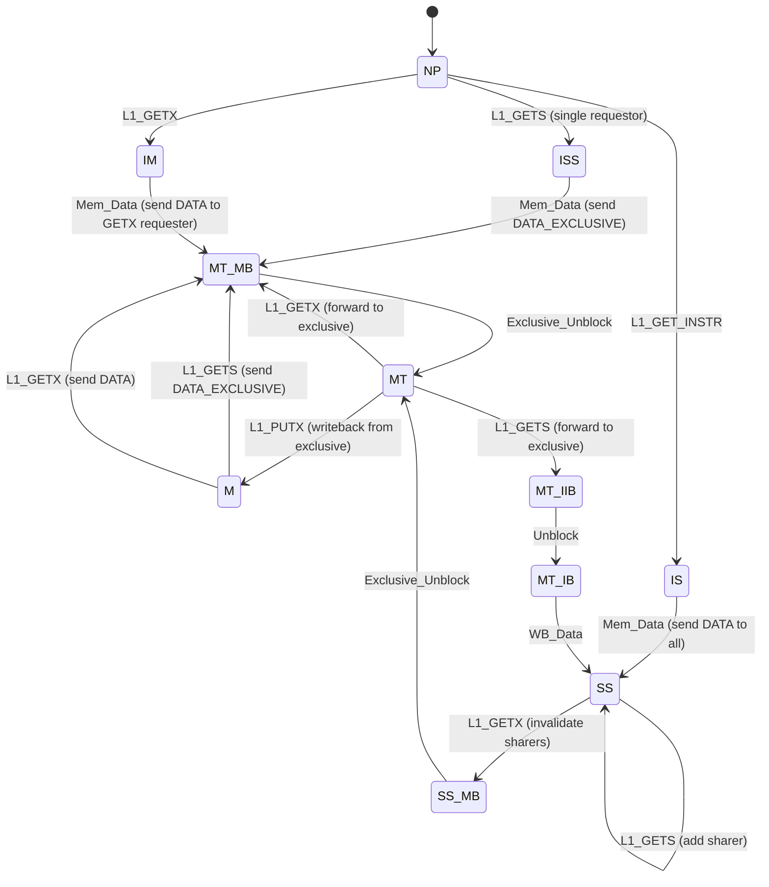
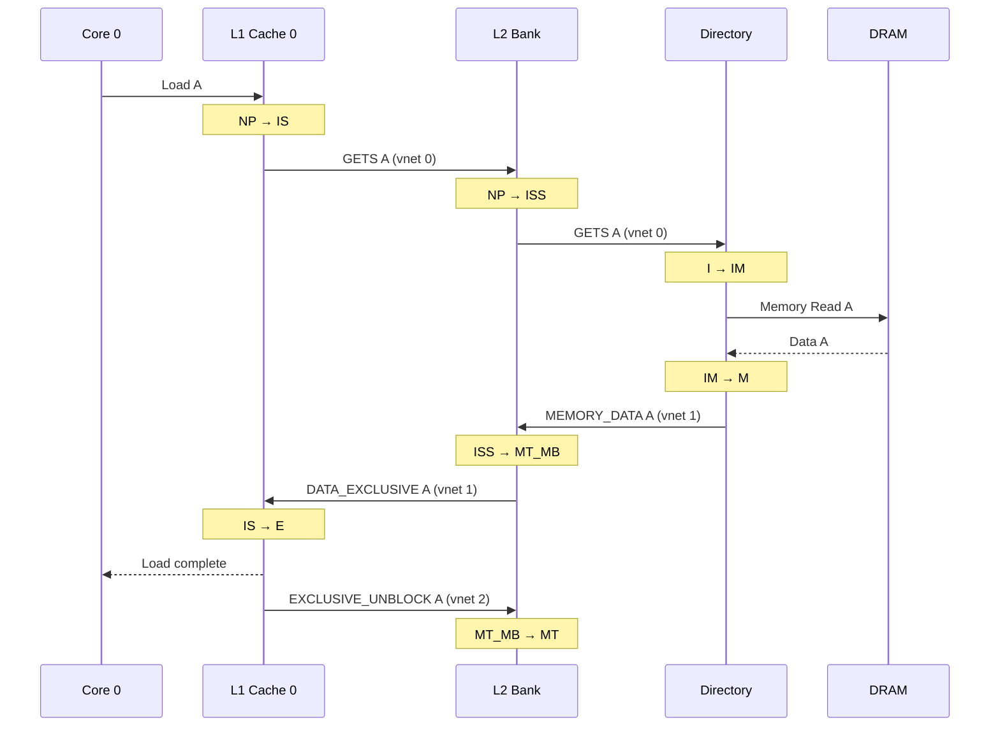
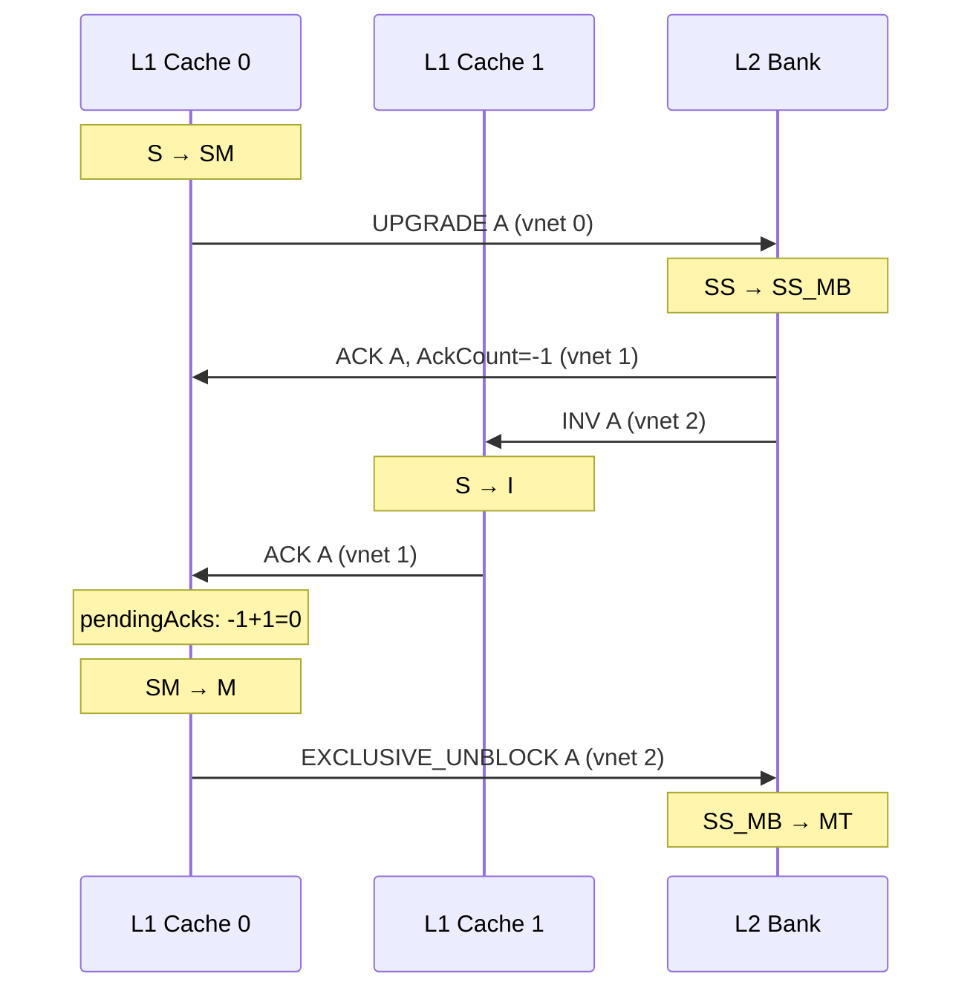
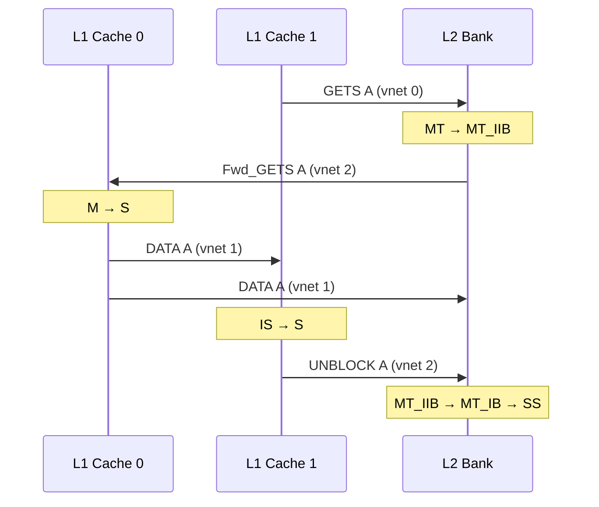
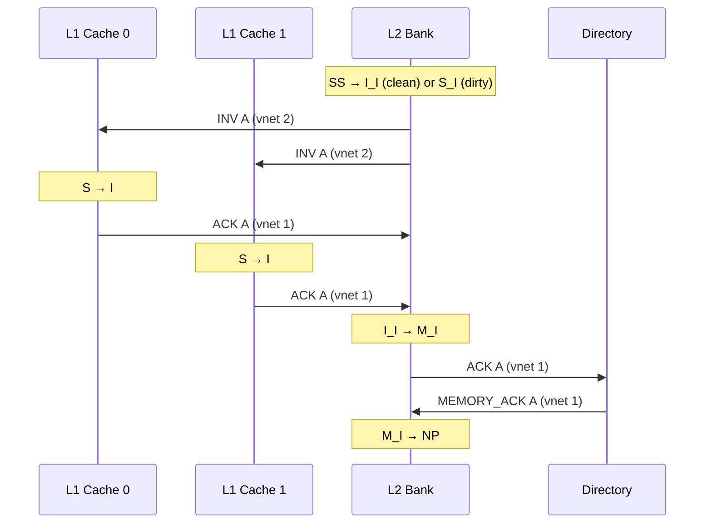

# Chapter 8: Production Coherence Protocols in gem5

> *Minimal protocols teach the grammar of coherence; production protocols teach the engineering.*

You can now read and write SLICC, trace transitions through generated code, and reason about Ruby's controller-network-message architecture.
But every protocol you have seen so far -- MI_example and MSI -- was a teaching tool: one level of cache, a flat directory, no performance optimizations, no real hardware resemblance.

gem5 ships three production-class Ruby protocols that researchers actually use for experiments.
Each one makes a different engineering bet:

- **MESI_Two_Level** bets on a shared L2 that doubles as the L1 directory -- the most popular choice, the closest to a textbook inclusive hierarchy.
- **MOESI_CMP_directory** bets on dirty sharing through an Owned state -- reducing memory-side writebacks when multiple caches read data that one cache has modified.
- **MOESI_CMP_token** bets on distributed token counting instead of centralized directory state -- avoiding the directory as a serialization bottleneck at the cost of a more complex starvation-avoidance mechanism.

This chapter introduces all three at a conceptual level: architecture, states, message flows, and failure modes.
By the end you will know what each protocol buys, what it costs, and when to reach for each one.

---

### Table of Contents

- [8.1 MESI_Two_Level: The Core Production Protocol](#81-mesi_two_level-the-core-production-protocol)
  - [Protocol Architecture at a Glance](#protocol-architecture-at-a-glance)
  - [The L2 as Cache and Directory](#the-l2-as-cache-and-directory)
  - [L1 Cache States](#l1-cache-states)
  - [L2 Cache States: NP, SS, M, MT](#l2-cache-states-np-ss-m-mt)
  - [The Directory: A Thin Memory Gateway](#the-directory-a-thin-memory-gateway)
  - [Message Types and Virtual Networks](#message-types-and-virtual-networks)
  - [The Ack Count Convention](#the-ack-count-convention)
  - [End-to-End Message Flow Traces](#end-to-end-message-flow-traces)
  - [Buffer Management: stall_and_wait](#buffer-management-stall_and_wait)
  - [Inclusion Enforcement](#inclusion-enforcement)
  - [Failure Modes and Where Intuition Breaks](#failure-modes-and-where-intuition-breaks)
  - [Configuration](#configuration)
- [8.2 MOESI_CMP_directory: Dirty Sharing with an Owned State](#82-moesi_cmp_directory-dirty-sharing-with-an-owned-state)
  - [What the O State Buys](#what-the-o-state-buys)
  - [Protocol Architecture](#protocol-architecture)
  - [L1 States](#l1-states)
  - [L2 States: The Complex Local Directory](#l2-states-the-complex-local-directory)
  - [Directory States](#directory-states)
  - [Dirty Sharing in Action](#dirty-sharing-in-action)
  - [Failure Modes](#failure-modes)
- [8.3 MOESI_CMP_token: Distributed Permission via Token Counting](#83-moesi_cmp_token-distributed-permission-via-token-counting)
  - [The Token Idea](#the-token-idea)
  - [Protocol Architecture](#protocol-architecture-1)
  - [Token Invariants and States](#token-invariants-and-states)
  - [Persistent Requests: Solving Starvation](#persistent-requests-solving-starvation)
  - [Failure Modes](#failure-modes-1)
- [8.4 Choosing a Protocol](#84-choosing-a-protocol)
- [Key Ideas](#key-ideas)
- [1-Page Mental Model](#1-page-mental-model)
- [Common Misconceptions](#common-misconceptions)
- [If You Remember One Thing](#if-you-remember-one-thing)
- [Exercises](#exercises)

---

## 8.1 MESI_Two_Level: The Core Production Protocol

`MESI_Two_Level` is the most widely used production-class Ruby protocol in gem5.
It implements a two-level cache hierarchy with private L1 caches (split I/D), shared banked L2 caches that double as directories for L1 sharer tracking, and a memory-backed directory for off-chip coherence.
It is the protocol most gem5 users reach for first, and the one most researchers modify when they need a realistic baseline.

Three things make `MESI_Two_Level` fundamentally harder to reason about than MSI.
First, the L2 cache plays a dual role -- it is both a cache (holding data) and a directory (tracking which L1s hold each line).
Second, the protocol has far more transient states because requests can race with invalidations, writebacks can race with forwards, and the L2 must enforce inclusion over the L1s.
Third, the protocol uses `stall_and_wait` instead of simple `stall`, sharer-aware ack counting instead of fixed-count invalidation, and virtual-network separation across three networks instead of two.

### Protocol Architecture at a Glance

`MESI_Two_Level` decomposes a multicore memory system into four controller types connected by three virtual networks.

```
         Core 0          Core 1          Core 2          Core 3
           │                │               │               │
      ┌────┴────┐     ┌────┴────┐     ┌────┴────┐     ┌────┴────┐
      │   L1    │     │   L1    │     │   L1    │     │   L1    │
      │ I$ + D$ │     │ I$ + D$ │     │ I$ + D$ │     │ I$ + D$ │
      └────┬────┘     └────┬────┘     └────┬────┘     └────┬────┘
           │                │               │               │
    ═══════╪════════════════╪═══════════════╪═══════════════╪═══════
           │       Network (3 virtual networks)             │
    ═══════╪════════════════╪═══════════════╪═══════════════╪═══════
           │                │               │               │
      ┌────┴────────────────┴────┐    ┌─────┴───────────────┴────┐
      │        L2 Bank 0         │    │        L2 Bank 1         │
      │   (cache + L1 directory) │    │   (cache + L1 directory) │
      └────────────┬─────────────┘    └────────────┬─────────────┘
                   │                               │
    ═══════════════╪═══════════════════════════════╪═══════════════
                   │           Network             │
    ═══════════════╪═══════════════════════════════╪═══════════════
                   │                               │
              ┌────┴──────┐                   ┌────┴──────┐
              │ Directory  │                   │ Directory  │
              │ (memory    │                   │ (memory    │
              │  gateway)  │                   │  gateway)  │
              └────┬──────┘                   └────┬──────┘
                   │                               │
              ┌────┴──────┐                   ┌────┴──────┐
              │   DRAM     │                   │   DRAM     │
              └───────────┘                   └───────────┘
```

The four controller types are:

1. **L1 Cache Controller** -- one per core, manages split I-cache and D-cache.
   Talks to the L2 through the network.
2. **L2 Cache Controller** -- one per L2 bank, holds data and tracks which L1s share each line.
   This is where most of the coherence complexity lives.
3. **Directory Controller** -- one per memory channel, a thin gateway between the L2 and off-chip DRAM.
   Tracks only whether some L2 may have a modified copy.
4. **DMA Controller** -- one per DMA port, issues reads and writes directly to the directory.

The critical insight: the L2 is the coherence hub.
It resolves sharing conflicts between L1s, forwards requests to exclusive owners, and enforces inclusion.
The directory at memory is deliberately simple -- it only needs to know whether some L2 bank owns a line.

### The L2 as Cache and Directory

In textbook MESI, the directory is a separate structure that tracks sharers.
In `MESI_Two_Level`, the L2 cache entry *is* the directory entry for L1 tracking.
Each L2 cache entry contains:

- **CacheState** -- the L2 coherence state (NP, SS, M, MT).
- **Sharers** -- a `NetDest` bitvector recording which L1s hold this line.
  Exactly the same data structure MSI's directory used, but embedded in a cache entry rather than a standalone directory entry.
- **Exclusive** -- which L1 holds exclusive access (if any).
- **DataBlk** -- cached data.
- **Dirty** -- whether the data differs from DRAM.

When an L1 sends GETS, the L2 adds it to `Sharers`.
When an L1 sends GETX, the L2 clears `Sharers`, sends invalidations to every previous sharer, and records the new exclusive owner.

This dual role is why the L2 has more states and more complex transitions than any other controller in the protocol.

### L1 Cache States

The L1 implements four standard MESI stable states plus NP (not present):

| State | Permission | Description |
|:---:|:---|:---|
| **NP** | Invalid | Not present in either L1 cache |
| **I** | Invalid | Cache entry allocated but invalid |
| **S** | Read_Only | Shared -- other L1s may also have copies |
| **E** | Read_Only | Exclusive clean -- only this L1 has a copy, data matches L2 |
| **M** | Read_Write | Modified -- only this L1 has a valid copy, L2 copy is stale |

The distinction between E and S is what separates MESI from MSI.
A line in E can be silently upgraded to M on a store -- no network message required, no invalidations needed.
This is a significant performance advantage for data that is read and then written by the same core, which is common in producer-consumer patterns and stack/heap accesses.

**Key transient states** handle races between concurrent operations:

| State | Meaning | Waiting for |
|:---|:---|:---|
| IS | Issued GETS | Data response from L2 |
| IM | Issued GETX | Exclusive data from L2 |
| SM | Had S, issued UPGRADE | Acks from other sharers (via L2) |
| IS_I | In IS, but saw INV before data | Data (will go to I, not S) |
| M_I | Replacing M line, sent PUTX | WB_ACK from L2 |

The `IS_I` state deserves special attention -- it is a race condition handler.
The L1 issued GETS and is waiting for data, but the L2 sent an INV (perhaps because another L1 issued GETX for the same line).
The L1 must acknowledge the INV, but the data will still arrive.
When data finally arrives, the L1 writes it to the cache and completes the original load, but immediately transitions to I instead of S -- the invalidation already told it the data is no longer valid to read.

**Silent upgrade from E to M** is the payoff of the Exclusive state.
No network message, no waiting -- the store completes immediately because no other L1 can possibly have a copy.
The UPGRADE message (S → M) is cheaper than a full GETX since the L1 already has the data and just needs permission, but it still requires the L2 to invalidate other sharers.

The L1 manages two separate `CacheMemory` objects -- an I-cache and a D-cache.
If a data access hits in the I-cache, or vice versa, the controller triggers a replacement on the wrongly-placed block before processing the request.
Input port priorities ensure responses from the L2 are processed before new CPU requests, which is essential for deadlock avoidance.

### L2 Cache States: NP, SS, M, MT

The L2 has four stable states:

| State | Permission | Description |
|:---:|:---|:---|
| **NP** | Invalid | Not present in L2 |
| **SS** | Read_Only | Shared -- one or more L1s have S copies; L2 has valid data |
| **M** | Read_Write | Modified in L2, not present in any L1 |
| **MT** | Maybe_Stale | Modified in exactly one L1; L2 data is possibly stale |

The `MT` state is the most subtle.
When an L1 holds a line in E or M, the L2 entry exists but the L2's copy of the data may be out of date -- the L1 might have written to it since receiving exclusive access.
The L2 cannot serve requests from its own data in MT; it must forward requests to the exclusive L1 owner.



**Blocking transient states** are critical to the L2's design.
When the L2 forwards a request to an exclusive L1 or sends invalidations, it enters a blocking state (SS_MB, MT_MB, MT_IIB, etc.) and waits for confirmation.
Any new L1 request for that address stalls until the blocking state resolves.
Multiple intermediate states (MT_IIB → MT_IB → SS, or MT_IIB → MT_SB → SS) handle the case where data writebacks and unblocks can arrive in either order.

**L2 replacement transient states** (M_I, MT_I, I_I, S_I) handle the multi-step process of evicting a line: invalidate all L1 copies, collect acks, write dirty data to memory if needed, then free the cache entry.

The ISS/IS distinction matters for performance.
If only one L1 requested (ISS), the L2 sends DATA_EXCLUSIVE -- the L1 gets E state, enabling silent upgrades.
If multiple L1s requested (IS), the L2 sends DATA (shared) to all of them.
This single-requestor optimization is why most cold loads end up in E, not S.

After the L2 sends data for a GETX or exclusive GETS, it waits for the L1 to confirm receipt via UNBLOCK (shared) or EXCLUSIVE_UNBLOCK (exclusive) on vnet 2.
Without this unblock protocol, a second GETX could arrive while the first L1 is still setting up its exclusive copy, leading to two L1s believing they have exclusive access.

### The Directory: A Thin Memory Gateway

The directory controller is deliberately simple.
It does not track individual L1 sharers -- that is the L2's job.
It only knows two things:

1. Is memory up-to-date (state **I**), or might some L2 have a modified copy (state **M**)?
2. Which L2 bank is the current owner?

On a cold miss, the directory reads DRAM and sends data to the requesting L2.
When data arrives at the directory while in M state (some L2 may have a dirty copy), it first invalidates the owning L2 and waits for the dirty writeback before serving the new request.

DMA reads and writes go directly to the directory.
If the directory is in I, it serves from memory directly.
If in M, it must first invalidate the owning L2 and collect the dirty data.

### Message Types and Virtual Networks

The protocol defines two message structures.
**RequestMsg** carries coherence requests (GETS, GETX, UPGRADE, INV, PUTX, DMA operations).
**ResponseMsg** carries data and acknowledgments, plus an `AckCount` field for the ack-counting mechanism.

Three virtual networks prevent deadlock through strict message-class ordering:

| Virtual Network | Direction | Message Types | Purpose |
|:---:|:---|:---|:---|
| 0 | L1→L2, L2→Dir | GETS, GETX, UPGRADE, PUTX, DMA_READ, DMA_WRITE | Requests flow "up" the hierarchy |
| 1 | Dir→L2, L2→L1, L1→L2 | DATA, DATA_EXCLUSIVE, ACK, WB_ACK, MEMORY_DATA | Responses and data flow "down" |
| 2 | L2→L1 (forwards), L1→L2 (unblocks) | INV, Fwd_GETX, Fwd_GETS, UNBLOCK, EXCLUSIVE_UNBLOCK | Forwarded invalidations and unblocks |

The key deadlock-avoidance property: responses on vnet 1 can never be blocked by requests on vnet 0, and unblocks on vnet 2 can never be blocked by responses on vnet 1.
If a request generates a response, and that response generates an unblock, the chain always makes forward progress because each step uses a higher-priority (or at least independent) virtual network.

### The Ack Count Convention

When the L2 sends DATA to an L1 that issued GETX, it needs to tell the L1 how many invalidation acks to expect from other sharers.
The convention uses negative numbers: if three L1s share a line and L1-0 sends GETX, the L2 computes `AckCount = 0 - 3 + 1 = -2`.
The `+1` adjusts for the fact that L1-0 is already a sharer and does not need to ack itself.
The L1 stores this negative count and increments it as acks arrive.
When it reaches zero, the L1 knows all sharers have invalidated and it can transition to M.

### End-to-End Message Flow Traces

#### Trace 1: L1 Load Miss, Cold L2

Core 0 loads address A.
Neither L1 nor L2 has the line.



Key observation: the L2 sends `DATA_EXCLUSIVE` because only one L1 requested (ISS state).
The L1 goes to E, not S -- enabling a subsequent store to upgrade silently to M without any network traffic.

#### Trace 2: L1 Store on Shared Block

Two cores share line A (both L1s in S, L2 in SS).
Core 0 stores to A.



L1-0 already has the data (it was in S), so it only needs permission.
The L2 sends both the ack count and the invalidations.
When all acks arrive, L1-0 transitions to M.

#### Trace 3: Forwarding from Exclusive L1

Core 0 has line A in M.
Core 1 loads A.



The L2 cannot serve from its own data because it is stale (MT state).
It forwards the request to the exclusive L1 owner, which sends data to *both* the requesting L1 and the L2 (updating the L2's stale copy).
On Fwd_GETX, the L1 only sends to the requestor (not back to the L2), because the L2 will just end up in MT again.

#### Trace 4: L2 Eviction with Active Sharers

The L2 needs to evict a line that two L1s hold in S.



The L2 sends INV to all sharers, collects acks, then notifies the directory.
During this entire process, any new L1 request for address A is stalled until the eviction completes.

### Buffer Management: stall_and_wait

MSI used simple `stall()` everywhere.
`MESI_Two_Level` upgrades to `stall_and_wait(address)` in the L2 and directory controllers.

The difference is head-of-line blocking.
With simple `stall()`, a blocked request at the head of the queue prevents *all* subsequent requests from being processed -- even for unrelated addresses.
With `stall_and_wait(address)`, only requests for the blocked address are stalled.
Requests for other addresses skip ahead and are processed immediately.

```
Queue: [GETX A (blocked)] [GETS B] [GETS C] [GETX D]

With stall():           process 0 requests until A resolves
With stall_and_wait(A): process B, C, D immediately; replay A when unblocked
```

When the blocking state resolves, `wakeUpBuffers(address)` re-inserts the stalled messages.
In a multi-core system with realistic traffic, this is a significant throughput improvement.

### Inclusion Enforcement

`MESI_Two_Level` enforces a strict inclusion property: every line in any L1 must also be in the L2.
Evicting from the L2 without invalidating L1 copies would create a coherence hole -- an L1 could hold a line that no directory knows about.

When the L2 needs to evict a line, it first sends INV to all L1 copies, collects their acks, and only then deallocates the cache block.
This means L2 capacity pressure directly reduces effective L1 capacity -- a consequence that catches many users off guard.

### Failure Modes and Where Intuition Breaks

**Invalidation storms.**
When a shared line is written, the L2 sends INV to every sharer.
With many cores sharing a frequently-written line (a common mistake in lock implementations), this creates an invalidation storm: every write generates N-1 invalidations and N-1 acks, and the L2 is blocked during the entire process.
Write latency scales linearly with sharer count.
The fix is usually architectural, not protocol-level: reduce sharing through padding, thread-local copies, or different synchronization primitives.

**Inclusion violations on L2 eviction.**
Because the L2 enforces inclusion, making the L1 bigger relative to the L2 creates *more* inclusion pressure.
A bigger L1 means more lines compete for L2 space, increasing inclusion-driven evictions that have nothing to do with coherence conflicts.
The L2 must be at least as large as the sum of all L1s, and ideally much larger.

**The MT state trap: stale data in L2.**
When the L2 is in MT state, its data copy is possibly stale.
Any request must be forwarded to the exclusive L1 -- the L2 cannot serve from its own cache.
L2 hit rate statistics look good (the tags match), but average L2 access latency is high because the "hits" require forwarding round trips.

**Ack counting bugs.**
If you modify the protocol and get the ack count wrong, the L1 will either deadlock (waiting forever for acks that never arrive) or violate coherence (transitioning to M before all sharers have invalidated).
The `+1` adjustment for when the requestor is already a sharer is a common source of off-by-one errors.

### Configuration

`MESI_Two_Level` can be configured through two paths.

The **legacy path** (`configs/ruby/MESI_Two_Level.py`) creates controllers in a specific order dictated by the `NetDest` numbering requirement: L1 controllers first (one per CPU), then L2 controllers (one per bank), then directory controllers (one per memory range), then DMA controllers.
The `l2_select_num_bits` parameter tells the L1 how many address bits to use when selecting an L2 bank.

The **stdlib path** (`MESITwoLevelCacheHierarchy`) wraps the same controller creation in a modern object-oriented API, using `SimplePt2Pt` as the default topology and handling all MessageBuffer wiring internally.

Address-to-L2 mapping uses interleaving on the low address bits just above the block offset, distributing consecutive cache lines across L2 banks for bandwidth balance.

---

## 8.2 MOESI_CMP_directory: Dirty Sharing with an Owned State

### What the O State Buys

In MESI, when a core has modified a line and another core wants to read it, the modifier must write the dirty data back to the L2 (or memory) and downgrade to S.
The new reader gets a clean shared copy from the L2.
If more readers arrive, the L2 can serve them -- but that initial writeback costs latency and memory bandwidth.

The **Owned** state eliminates that writeback.
A core in M that receives a read request can transition to O and share the line directly -- the "owner" keeps responsibility for the dirty data while other caches hold read-only S copies.
The owner can supply the data to future readers without involving the L2 or memory.
Only when the owner evicts the line does the dirty data finally flow back to the lower levels.

This matters most in producer-consumer workloads where one core writes a structure and multiple cores read it.
Without O, every reader forces a writeback.
With O, the first read triggers a data transfer but no writeback, and subsequent reads are served by the owner directly.

### Protocol Architecture

`MOESI_CMP_directory` has the same four-controller structure as `MESI_Two_Level` -- L1, L2, Directory, DMA -- connected by three virtual networks.
The L2 again plays a dual role as both cache and local directory.

The virtual network assignment differs slightly:

| Virtual Network | Purpose |
|:---:|:---|
| 0 | L1 ↔ L2 local requests |
| 1 | L2 ↔ Directory global requests and forwards |
| 2 | Responses (data, acks, unblocks) |

### L1 States

The L1 extends MESI with the O state and splits Modified into two variants:

| State | Permission | Description |
|:---:|:---|:---|
| **I** | Invalid | Not present or invalid |
| **S** | Read_Only | Shared -- other caches may also have copies |
| **O** | Read_Only | Owned -- dirty, shared, responsible for supplying data to readers |
| **M** | Read_Write | Modified -- exclusive and dirty, received from L2/memory |
| **MM** | Read_Write | Modified and locally modified -- the core has written since acquiring |
| **M_W** | Read_Write | Modified, waiting (transient after certain transitions) |
| **MM_W** | Read_Write | Modified locally modified, waiting |

The M/MM distinction tracks whether the core has actually written since acquiring exclusive access.
On a writeback of M, the data is known clean (it came from memory/L2 and was never written); on a writeback of MM, the data is known dirty.
This enables PUTO (put-owned, writeback from O) to carry accurate dirty information.

Key transient states include IM (issued GETX), IS (issued GETS), SM (had S, upgrading to M), OM (had O, upgrading to M), and OI/MI (evicting from O/M, waiting for ack).

### L2 States: The Complex Local Directory

The L2 in `MOESI_CMP_directory` has one of the most complex state machines in gem5.
Because the L2 must track not just whether L1s have the line but *what kind of ownership they have*, it defines many composite states:

| State | Description |
|:---|:---|
| **I** | Invalid -- not in L2, no local sharers |
| **S** | Shared in L2, no L1 copies |
| **O** | Owned in L2, no L1 copies |
| **M** | Modified in L2, no L1 copies |
| **ILS** | Invalid in L2, but local sharers exist in L1s |
| **ILX** | Invalid in L2, but a local L1 has exclusive |
| **ILO** | Invalid in L2, but a local L1 is the owner |
| **ILOX** | Invalid in L2, local L1 owner, chip is exclusive |
| **ILOS** | Invalid in L2, local owner + local sharers |
| **ILOSX** | Invalid in L2, local owner + local sharers, chip is exclusive |
| **SLS** | Shared in L2, local sharers also exist |
| **OLS** | Owned in L2, local sharers also exist |
| **OLSX** | Owned in L2, local sharers, chip is exclusive |

The "IL" prefix states (ILS, ILX, ILO, etc.) represent situations where the L2 does not hold the data itself but still acts as a directory tracking L1 state.
This is more flexible than `MESI_Two_Level`'s strict inclusion -- the L2 can track L1 state without necessarily caching the data.

The L2 has over 50 transient states to handle the combinatorial explosion of concurrent operations (fetches from memory, forwards, writebacks, DMA) intersecting with all of these stable states.

### Directory States

The memory-side directory tracks four stable states:

| State | Description |
|:---:|:---|
| **I** | Memory is up-to-date, no valid cache copies |
| **S** | Memory is up-to-date, shared copies may exist |
| **O** | Some cache is the owner (dirty); memory may be stale |
| **M** | Some cache has exclusive dirty access; memory is stale |

The O state at the directory level means the directory knows some cache owns the dirty data but other caches may also have shared copies.
In `MESI_Two_Level`, the directory only had I and M -- the addition of S and O makes the directory smarter about what kind of invalidation is needed.

### Dirty Sharing in Action

Consider a producer-consumer pattern where Core 0 writes a buffer and Cores 1-3 read it:

1. Core 0 writes to address A → L1-0 enters MM (modified, locally written).
2. Core 1 loads A → request reaches L2, which forwards to L1-0.
   - L1-0 transitions from MM to O -- it gives Core 1 a shared copy but keeps the dirty data.
   - L1-1 gets S. No writeback to L2 or memory occurs.
3. Core 2 loads A → request reaches L2, which knows L1-0 is the owner.
   - L2 forwards to L1-0 (the owner). L1-0 sends data to Core 2.
   - L1-2 gets S. L1-0 stays in O. Still no writeback.
4. Core 3 loads A → same pattern. L1-0 supplies data.
5. Eventually L1-0 evicts A → PUTO writeback carries dirty data to L2/memory.

Compare with `MESI_Two_Level`: step 2 would force L1-0 to write back dirty data to the L2 and downgrade to S.
The L2 would serve steps 3-4 from its own cache.
The MOESI approach saves the writeback at the cost of making the owner (L1-0) responsible for servicing future reads -- which adds latency if L1-0 is busy.

### Failure Modes

**Owner bottleneck.**
If one core is the owner of many lines and multiple other cores are reading them, the owner becomes a bottleneck.
Every read request for an O-state line must be forwarded through the owner's controller, serializing on that controller's message buffers.

**Complex L2 state explosion.**
The large number of composite states (ILS, ILO, ILOSX, etc.) makes this protocol significantly harder to modify than `MESI_Two_Level`.
Adding a new feature to the L2 may require updating dozens of transitions.

**PUTO writeback complexity.**
The protocol distinguishes PUTX (exclusive writeback), PUTO (owned writeback), PUTO_SHARERS (owned writeback but keep sharers), and PUTS (shared writeback).
Getting the right writeback type in a modified protocol is error-prone.

---

## 8.3 MOESI_CMP_token: Distributed Permission via Token Counting

### The Token Idea

Directory protocols use a centralized structure to track who has permission.
Every request must visit the directory (or the L2 acting as directory), even if the data is sitting in a nearby cache.
This creates serialization: two caches that could resolve a sharing transaction directly between themselves must instead both talk to the directory.

Token protocols replace centralized permission with distributed counting.
Each cache line has a fixed number of tokens (typically N+1 where N is the number of caches).
Tokens are passed between caches along with data.
Permission is determined locally by counting how many tokens you hold:

- **All tokens** → write permission (Modified)
- **More than half** → read-only, you are the data supplier (Owned)
- **Some tokens, less than half** → read-only (Shared)
- **Zero tokens** → no access (Invalid)

No single structure needs to know the global state.
Two caches can exchange tokens directly, and as long as token conservation holds (total tokens in the system is constant), coherence is maintained.

### Protocol Architecture

`MOESI_CMP_token` has the same four controller types (L1, L2, Directory, DMA) but uses **five virtual networks** instead of three:

| Virtual Network | Purpose |
|:---:|:---|
| 0 | DMA requests |
| 1 | L1 ↔ L2 requests, L2 ↔ Directory requests |
| 2 | L2 global requests |
| 3 | Persistent requests (starvation avoidance) |
| 4 | Data and response messages |

The extra virtual networks are needed for the persistent request mechanism (see below).

### Token Invariants and States

The L1 tracks a token count per cache entry.
The relationship between tokens and states is:

| Condition | State | Permission |
|:---|:---:|:---|
| Tokens = all | **M** / **MM** | Read-Write (exclusive) |
| Tokens > half | **O** | Read-Only (owner, data supplier) |
| 0 < Tokens < half | **S** | Read-Only (shared) |
| Tokens = 0 | **I** / **NP** | No access |

The protocol enforces that exactly half the tokens is an unstable state -- you either have more than half (owner) or less than half (sharer).
This prevents ambiguity about who is responsible for supplying data.

The L2 has a simpler state machine (NP, I, S, O, M) and primarily acts as a token and data cache.
The directory has just two stable states: **O** (directory holds at least one token, memory is valid) and **NO** (directory has no tokens, memory may be stale).

### Persistent Requests: Solving Starvation

The fundamental problem with token protocols is starvation.
Tokens circulate freely between caches.
If cache A issues a GETX and tries to collect all tokens, other caches might keep giving tokens to each other instead.
Cache A could wait forever without accumulating enough tokens for write permission.

`MOESI_CMP_token` solves this with **persistent requests** -- a heavyweight fallback mechanism:

1. An L1 issues a normal GETX or GETS and starts a timer.
2. If the request does not complete within the timeout, the L1 suspects starvation.
3. The L1 issues a **GETX_PERSISTENT** (or GETS_PERSISTENT) on vnet 3.
4. The directory's persistent table records this address as locked for that requestor.
5. All other caches that see the persistent request must forward their tokens for that address to the starving requestor.
   They enter "locked" states (I_L, S_L, etc.) where they cannot acquire new tokens for this address.
6. Once the requestor has enough tokens, it sends **DEACTIVATE_PERSISTENT** to release the lock.
7. Normal operation resumes.

```
Normal request → timeout → starvation suspected →
  GETX_PERSISTENT → directory locks address →
  all caches forward tokens to requestor →
  requestor gets exclusive → DEACTIVATE_PERSISTENT →
  directory unlocks → resume normal operation
```

Persistent requests are expensive -- they broadcast on a dedicated virtual network and force all caches to respond.
But they only fire when the normal token-passing mechanism fails, which is rare under typical workloads.
The mechanism guarantees forward progress: a persistent request will eventually succeed because all other caches are forced to give up their tokens.

### Failure Modes

**Livelock without persistent requests.**
If the persistent mechanism is disabled or buggy, the protocol can livelock: two caches repeatedly exchanging tokens without either accumulating enough for their desired access.
The persistent timeout is the only thing that breaks this cycle.

**Persistent request storms.**
Under high contention (many cores competing for the same line), multiple persistent requests can fire in rapid succession.
Each one locks the address and forces all caches to respond, creating burst traffic on vnet 3.
The protocol arbitrates by serving persistent requests in order, but the serialization overhead can be worse than a directory-based protocol under extreme contention.

**Token conservation violations.**
If a bug causes tokens to be created or destroyed, the protocol breaks silently.
Too many tokens means multiple caches can believe they have exclusive access.
Too few tokens means no cache can ever reach M state.
Debugging token conservation requires counting tokens across the entire system -- a painful exercise.

**Five virtual networks.**
The extra virtual networks increase the complexity of the network model.
With Garnet, each virtual network maps to a set of virtual channels, increasing router buffer requirements.
With SimpleNetwork, each virtual network requires a separate set of switch buffers.

---

## 8.4 Choosing a Protocol

| Aspect | MESI_Two_Level | MOESI_CMP_directory | MOESI_CMP_token |
|:---|:---|:---|:---|
| **Core idea** | Inclusive L2 as cache+directory | Dirty sharing via O state | Distributed tokens, no central serialization |
| **L1 stable states** | I, S, E, M | I, S, O, M, MM | I, S, O, M, MM (+ locked variants) |
| **L2 complexity** | 4 stable, ~15 transient | 13 stable, 50+ transient | 5 stable, few transient |
| **Directory complexity** | I, M (2 states) | I, S, O, M (4 states) | O, NO (2 states + persistent table) |
| **Virtual networks** | 3 | 3 | 5 |
| **Silent E→M upgrade** | Yes | No (no E state) | No (no E state) |
| **Dirty sharing** | No -- writeback on Fwd_GETS | Yes -- O state avoids writeback | Yes -- token count determines ownership |
| **Starvation avoidance** | Directory-based blocking | Directory-based blocking | Persistent request mechanism |
| **Inclusion property** | Strict (L2 ⊇ L1) | Flexible (L2 tracks L1 state without necessarily caching data) | No strict inclusion |
| **Best for** | General-purpose, most workloads | Producer-consumer, dirty data reuse | Scalability studies, distributed protocols |
| **Modifiability** | Easiest to read and modify | Hardest (state explosion in L2) | Moderate (token logic is orthogonal but persistent mechanism is complex) |

**When to use MESI_Two_Level:** Start here.
It is the most widely used, best tested, and easiest to modify.
The silent E→M upgrade gives it a performance edge for private data patterns.
If you have no strong reason to pick a different protocol, use this one.

**When to use MOESI_CMP_directory:** When your workload has significant producer-consumer sharing and you want to measure the impact of dirty sharing.
The O state avoids writebacks that MESI forces, but the L2 state machine complexity makes modifications risky.

**When to use MOESI_CMP_token:** When you are studying protocol scalability, distributed coherence mechanisms, or starvation/livelock behavior.
The token model is fundamentally different from directory-based protocols and offers a different set of tradeoffs.
It is the least commonly used of the three in published gem5 research.

---

## Key Ideas

- gem5 ships three production coherence protocols: `MESI_Two_Level`, `MOESI_CMP_directory`, and `MOESI_CMP_token`, each making a different engineering bet.
- **MESI_Two_Level** uses the L2 as both cache and L1 directory, with a thin memory-side directory.
  The E state enables silent upgrades; three virtual networks prevent deadlock; `stall_and_wait` eliminates head-of-line blocking.
- **MOESI_CMP_directory** adds the Owned state for dirty sharing: a modifier can share data without writing back to memory, benefiting producer-consumer patterns.
  The L2 state machine is the most complex in gem5's protocol set.
- **MOESI_CMP_token** replaces centralized directory permission with distributed token counting.
  Permission is determined locally by how many tokens a cache holds.
  Persistent requests guarantee forward progress when normal token passing fails.
- All three protocols share the same four-controller structure (L1, L2, Directory, DMA) but differ in virtual network count (3, 3, 5), state complexity, and how they handle dirty data and starvation.
- The MT state in MESI_Two_Level means the L2 has the tag but stale data -- requests must be forwarded to the exclusive L1.
- L2 replacement in MESI_Two_Level enforces inclusion by invalidating all L1 copies first.
- The ack counting convention (negative numbers, +1 adjustment for self) is shared across MESI and MOESI directory protocols.
- Token conservation is the fundamental invariant of `MOESI_CMP_token` -- if tokens are lost or created, coherence silently breaks.

---

## 1-Page Mental Model

```
┌──────────────────────────────────────────────────────────────────────┐
│          THREE PRODUCTION PROTOCOLS IN gem5 RUBY                     │
│                                                                      │
│  MESI_TWO_LEVEL (most common)                                        │
│    L1: I─S─E─M     L2: NP─SS─M─MT     Dir: I─M                     │
│    E→M silent upgrade ─ no network!                                  │
│    MT = stale data in L2, must forward to exclusive L1               │
│    3 vnets: request / response / forward+unblock                     │
│    Strict inclusion: L2 ⊇ L1                                        │
│    stall_and_wait(addr): per-address blocking, not HOL               │
│                                                                      │
│  MOESI_CMP_DIRECTORY (dirty sharing)                                 │
│    L1: I─S─O─M─MM     L2: 13 composite states     Dir: I─S─O─M     │
│    O state: share dirty data without writeback                       │
│    Owner supplies data to future readers                             │
│    Saves memory bandwidth in producer-consumer patterns              │
│    3 vnets, same controller structure, most complex L2               │
│                                                                      │
│  MOESI_CMP_TOKEN (distributed)                                       │
│    Permission = token count (all=M, >half=O, some=S, 0=I)           │
│    No centralized serialization point                                │
│    Persistent requests break starvation (broadcast fallback)         │
│    5 vnets (adds persistent + DMA channels)                          │
│    Token conservation: total tokens constant across system           │
│                                                                      │
│  SHARED ARCHITECTURE                                                 │
│    All: L1 + L2 + Directory + DMA                                    │
│    All: L2 acts as local directory for L1 tracking                   │
│    All: directory at memory is the simplest controller               │
│                                                                      │
│  DECISION GUIDE                                                      │
│    Default → MESI_Two_Level                                          │
│    Producer-consumer → MOESI_CMP_directory                           │
│    Scalability/distributed studies → MOESI_CMP_token                 │
└──────────────────────────────────────────────────────────────────────┘
```

---

## Common Misconceptions

1. **"The L2 always has valid data."**
   Not in MESI_Two_Level's MT state.
   When an L1 holds exclusive access, the L2's data copy is potentially stale.
   The L2 must forward requests to the exclusive L1 owner.

2. **"The directory tracks which L1s have each line."**
   In all three protocols, the memory-side directory does not track individual L1 sharers.
   L1 sharer tracking is the L2's job.

3. **"Exclusive and Modified are basically the same state."**
   They differ in the dirty bit.
   E means the data matches the L2/memory; M means only the L1 has valid data.
   The E→M silent upgrade requires no network traffic, while S→M requires invalidations.

4. **"The Owned state means write permission."**
   O is read-only.
   The owner holds dirty data and is responsible for supplying it to readers, but it cannot write without first acquiring all tokens (token protocol) or upgrading to M (directory protocol).

5. **"Token protocols don't need directories."**
   `MOESI_CMP_token` still has a directory controller.
   It holds the "home" tokens, acts as the memory gateway, and manages the persistent request table for starvation avoidance.

6. **"More complex protocol = better performance."**
   MOESI_CMP_directory has the most complex L2 state machine but does not universally outperform MESI_Two_Level.
   The E→M silent upgrade in MESI helps private data patterns.
   The O state in MOESI helps sharing patterns.
   Workload determines which wins.

7. **"Making the L1 bigger always improves performance."**
   Under MESI_Two_Level's strict inclusion, increasing L1 size without increasing L2 size creates more inclusion pressure and can *decrease* effective performance.

---

## If You Remember One Thing

**gem5's three production protocols make different bets about where coherence complexity should live.
MESI_Two_Level puts it in the L2 (cache + directory), MOESI_CMP_directory puts it in the O-state ownership chain, and MOESI_CMP_token puts it in distributed token counting.
Start with MESI_Two_Level -- it is the simplest, most tested, and sufficient for most workloads.
Switch protocols only when your experiment specifically needs dirty sharing or distributed coherence.**

---

## Exercises

1. **Trace a write-after-read in MESI_Two_Level.**
   Core 0 loads address A (cold miss), then stores to A.
   (a) What state does L1-0 reach after the load?
   (b) How many network messages does the store generate?
   (c) Why does the answer to (b) change if the load had been an instruction fetch?

2. **Ack counting.**
   Four L1s share a line in MESI_Two_Level (all in S; L2 in SS with 4 sharers).
   L1-2 issues a Store.
   (a) What `AckCount` does the L2 send to L1-2?
   (b) How many INV messages are sent?
   (c) How many ACK messages does L1-2 receive?

3. **Producer-consumer: MESI vs MOESI.**
   Core 0 writes addresses A, B, C. Then Cores 1-3 each read A, B, C.
   (a) In MESI_Two_Level, how many writeback messages flow from L1 to L2 when the reads arrive?
   (b) In MOESI_CMP_directory, how many writeback messages flow?
   (c) What is the source of the performance difference?

4. **Token conservation.**
   A system has 4 L1 caches, 1 L2, and 1 directory.
   `max_tokens()` is 6 for each cache line.
   (a) If L1-0 holds 6 tokens and L1-1 requests GETS, how many tokens does L1-0 give up?
   (b) After the transfer, what state is L1-0 in? L1-1?
   (c) If a bug causes L1-0 to only give 2 tokens (keeping 4), what coherence violation becomes possible?

5. **Inclusion pressure.**
   Configure MESI_Two_Level with 4 cores, 32 KiB L1D per core (128 KiB total L1D), and a 64 KiB L2.
   (a) Why is this configuration pathological?
   (b) What happens to L1 hit rate as the L2 evicts lines?
   (c) What is the minimum L2 size that avoids inclusion-driven thrashing for this L1 configuration?

6. **Design tradeoffs.**
   (a) Under what workload pattern does MOESI_CMP_directory outperform MESI_Two_Level?
   (b) Under what pattern does MESI_Two_Level's E state give it an advantage over MOESI?
   (c) When would you choose MOESI_CMP_token over either directory-based protocol?
