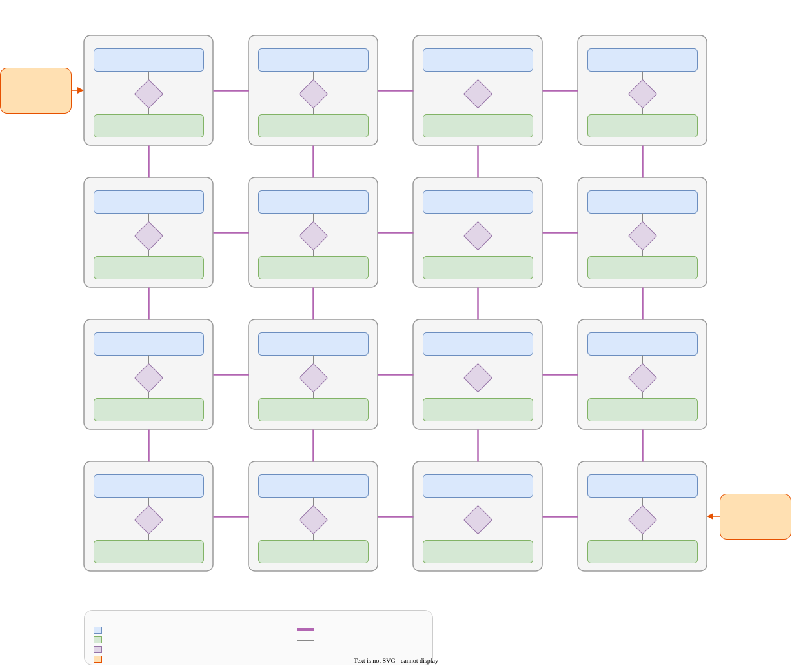
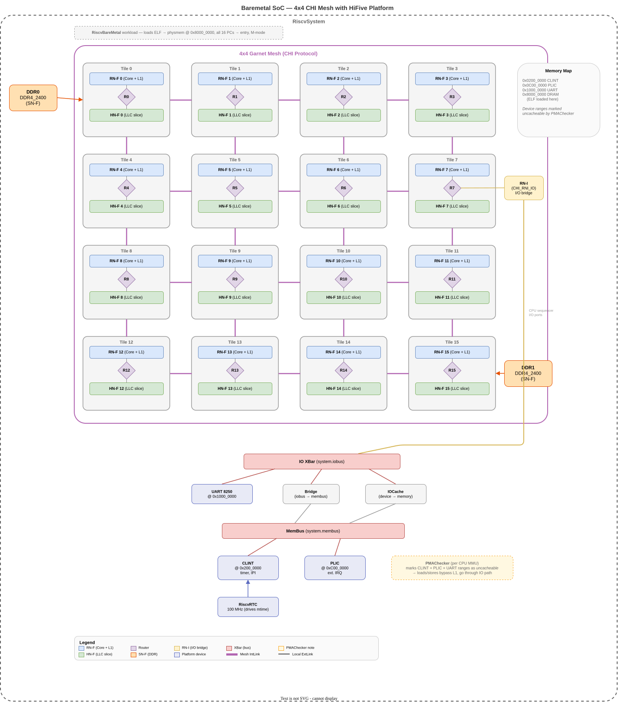

# Chapter 17: Final Project — Build and Simulate a 4×4 CHI Mesh

> *Mastery means assembling the whole system, not just understanding the pieces.*

You have spent sixteen chapters learning gem5's memory system piece by piece.
You traced requests through the event queue, walked Classic cache miss paths, built an MSI protocol from scratch, diagnosed Garnet router pipelines, navigated CHI's SLICC decomposition, and measured DRAM scheduling effects.
This chapter asks you to put it all together: **build a complete 16-core CHI mesh system from scratch, verify it with targeted test programs, and interpret the results**.

The first two stages produce the configuration and a running system.
Stage 3 is the heart of the chapter: a series of test programs — each a small C binary running on the 16 RISC-V cores in SE mode — that progressively exercise the mesh, the coherence protocol, and the DRAM controllers.
The final stage extends `CustomMesh.py` to support per-vnet dedicated links, closing a real bandwidth fidelity gap in gem5's CHI mesh model.

## The Target System: A 4×4 CHI Mesh

Each mesh tile co-locates a RISC-V core (RN-F), a home node (HN-F), and a last-level cache slice (LLC/SLC).
Two DDR controllers (SN-F) attach at diagonally opposite corners so that memory traffic is never trivially local.



The Garnet network provides cycle-accurate flit transport with XY routing across the mesh.
The CHI protocol handles coherence across all 16 LLC slices — no protocol changes required.

### Latency model

The mesh timing parameters come from RTL feedback and are configured in `rbook_4x4.py`:

| Component | Garnet parameter | Cycles | Breakdown |
|-----------|-----------------|--------|-----------|
| Mesh router | `router_latency` | 4 | 1 clk input read + 2 clk route compute + 1 clk output buffer |
| Intermediate (mux) router | `node_router_latency` | 2 | Simplified router bridging CPU request ports to the mesh |
| Inter-router link | `router_link_latency` | 4 | Repeater delay on wires between adjacent mesh routers |
| Node-to-router link | `node_link_latency` | 1 | Local connection from controller to its router (default) |

**Per-hop cost.**
Each mesh hop traverses one router and one inter-router link: 4 + 4 = **8 cycles per hop per direction**.
A round-trip request–response across *h* hops costs at least 2 × *h* × 8 = 16*h* network cycles, plus endpoint latencies (cache/protocol processing, mux router traversal).

**Example paths** (network traversal only, excluding cache/protocol overhead):

| Path | Hops | One-way (cycles) | Round-trip (cycles) |
|------|------|-------------------|---------------------|
| Core 0 → local HN-F 0 | 0 mesh hops | mux router (2) + node link (1) = 3 | 6 |
| Core 0 → HN-F 1 (adjacent) | 1 hop | 3 + 8 = 11 | 22 |
| Core 0 → HN-F 15 (diagonal) | 6 hops | 3 + 48 = 51 | 102 |

These numbers set expectations for the hop-latency test (Stage 3b): far accesses should show roughly 96 more network cycles than local accesses (6 hops × 8 cycles × 2 directions).

### Why this system

- **It exercises everything in the book**: CHI protocol (Part IV), Garnet mesh routing (Part III), Ruby controller architecture (Part II), and DRAM service (Chapter 14).
- **It is large enough to be interesting**: 16 tiles create real traffic asymmetry — a core at tile 0 requesting a line homed at tile 15 must traverse 6 router hops, while a core requesting from its local HN-F sees only the node link latency.
- **It is small enough to debug**: 4×4 keeps simulation time manageable and protocol traces readable.

## What the Reader Builds

The project proceeds in four stages.
Stages 1–2 produce the configuration files and a bootable system.
Stage 3 verifies the system with five focused test programs.
Stage 4 extends the simulator itself.

### Stage 1 — Configuration files

The reader creates two Python files.

#### 1a — The noc_config (`rbook_4x4.py`)

The reader writes `rbook_4x4.py`, extending the existing `configs/example/noc_config/2x4.py` template.
Every node class inherits from its counterpart in `configs/ruby/CHI_config.py` and overrides only the `NoC_Params` inner class (specifically `router_list`, which tells `CustomMesh.distributeNodes` which mesh router each controller attaches to).

The file defines:

- A `NoC_Params` class with `num_rows = 4` and `num_cols = 4`, giving 16 Garnet routers.
It also overrides the latency defaults with RTL-accurate values: `router_latency = 4` (1 input + 2 route + 1 output), `router_link_latency = 4` (repeater delay), and `node_router_latency = 2` (intermediate mux router).
These values flow into `CustomMesh.makeTopology` via the `setattr` loop in `CHI.py` (line 248) that copies all `NoC_Params` attributes onto the `options` namespace.
- `CHI_RNF` and `CHI_HNF` node classes with `router_list` mapping each of the 16 nodes to its corresponding router (router 0 through 15).
This is where the co-location of RN-F + HN-F + LLC at each tile happens — both classes list the same 16 routers, so `distributeNodes` attaches one RN-F and one HN-F to every mesh router.
- `CHI_SNF_MainMem` with `router_list = [0, 15]` — the two DDR controllers at diagonally opposite corners.
- `CHI_MN` — the Miscellaneous Node for DVM (Distributed Virtual Memory) operations such as TLB invalidation broadcasts.
`CHI.py` creates this node unconditionally (line 139), so every noc_config must define it.
In our RISC-V SE-mode system the MN is architecturally idle — RISC-V cores never issue ARM DVM operations — but the CHI SLICC protocol requires it to exist.

**Nodes we omit (SE-mode only).**
The CHI protocol defines three additional infrastructure node types that our system does not need.
`CHI.py` (lines 97–103) unconditionally *reads* all seven node class names from the noc_config at import time, so the classes must be defined in the file even if they are never instantiated.
Their `router_list` values do not matter — they are dead code in our scenario:

- **`CHI_SNF_BootMem`** — a memory controller for boot ROM / firmware.
Created only when `bootmem` is passed to `create_system` (line 193: `if len(other_memories) > 0`).
SE-mode simulations have no boot memory, so this node is never instantiated.
- **`CHI_RNI_DMA`** — a cacheless request node for DMA devices.
Created only when DMA ports exist (line 205: `if len(dma_ports) > 0`).
Our system has no DMA controllers.
- **`CHI_RNI_IO`** — a request node for coherent I/O agents.
Created only in full-system mode (line 214: `if full_system`).
We run in SE mode.

The reader should copy these three classes verbatim from `2x4.py` with any valid `router_list` — the values are irrelevant since the classes are never instantiated.

#### 1b — The system configuration script (`rbook_mesh_config.py`)

The reader assembles `rbook_mesh_config.py`, a Python configuration script that:

- Creates 16 RISC-V `TimingSimpleCPU` cores.
- Instantiates the CHI cache hierarchy using the legacy path (`configs/ruby/CHI.py`) with `--topology=CustomMesh` and `--chi-config=rbook_4x4.py`.
- Configures `--num-l3caches=16` so each HN-F gets an LLC slice.
- Passes `--num-dirs=2` so that two SN-F (memory) nodes are created.
- Selects the Garnet network with `--network=garnet`.
- Accepts the test binary path as a command-line argument (`--cmd`) and loads it as a shared `Process` across all 16 CPUs (SE mode requires this pattern — see `chi-with-isa.py` for reference).

The script auto-injects `--protocol=CHI` into `sys.argv` when gem5 is built with `PROTOCOL=MULTIPLE` (the default for the book's `build_opts/RISCV`), so the user never needs to pass it manually.

The existing `tests/gem5/chi_protocol/configs/chi-with-isa.py` and `configs/ruby/CHI.py` serve as reference — the reader is not writing a CHI configuration from nothing, but adapting the known patterns to a specific mesh layout.

**How DDR controllers get wired.**
The DDR connection happens in two stages, split across two files:

1. **`CHI.py`** creates two SN-F controller shells with no memory port bound (`mem_ctrl=None` at line 182).
It returns them in `mem_cntrls` to the caller.
2. **`Ruby.py`** (lines 161–202) does the actual plumbing: for each SN-F controller it creates a `MemCtrl` + `DRAMInterface` (e.g., DDR4_2400), computes cache-line-granularity address interleaving using `log2(num_dirs)` bits, binds `mem_ctrl.port` to the controller's `memory_out_port`, and sets the controller's `addr_ranges`.

With `--num-dirs=2`, the interleaving bit is bit 6 (= log₂ of the 64-byte cache line size).
Consecutive cache lines alternate between DDR0 (at router 0) and DDR1 (at router 15), spreading traffic evenly regardless of access pattern.
The reader does not write any interleaving logic — `Ruby.py` handles it automatically from `--num-dirs`.

### Stage 2 — Build and visualize

Build gem5 with the CHI protocol enabled:

```bash
scons build/RISCV/gem5.opt -j$(nproc) PROTOCOL=CHI
```

A trivial smoke-test binary (`trivial/trivial.c`) lives in its own subdirectory under `ruby-book/final/`, and the parent `Makefile` delegates to that local workflow just like the later Chapter 17 tests.
Build it and run the system:

```bash
make -C ruby-book/final
./build/RISCV/gem5.opt -d m5out/rbook-topology-$(date +%Y%m%d-%H%M%S) \
    configs/example/rbook_mesh_config.py \
    --cmd=ruby-book/final/trivial/trivial
dot -Tsvg m5out/rbook-topology-*/config.dot -o rbook_topology.svg
```

Open `rbook_topology.svg` and verify:
- 16 RN-F controllers, each attached to a distinct mesh router.
- 16 HN-F controllers co-located with the RN-F at the same routers.
- 2 SN-F controllers at routers 0 and 15.
- 1 MN controller.
- Garnet IntLinks forming a 4×4 mesh grid between the 16 routers.

This visual sanity check catches wiring mistakes before any test program runs.
If the topology looks wrong, fix the noc_config before proceeding.

### Stage 3 — Test programs

Each substage below is a small C program compiled for RISC-V and run under SE mode on the 16-core mesh.
The pattern follows Chapter 5b: write a focused binary, run it on the configured system, then read the statistics to confirm the expected behavior.
Each Stage 3 test should live in its own subdirectory under `ruby-book/final/`.
That subdirectory should contain the C source, any analysis or report scripts, and a local `Makefile`.
The parent `ruby-book/final/Makefile` should delegate to those per-test `Makefile`s so every test follows the same structure and workflow shape.

The intended pattern is:

```text
ruby-book/final/
├── Makefile
├── smoke/
├── hop_latency/
├── false_sharing/
├── prodcons/
└── barrier/
```

The parent `Makefile` remains the single entry point:

```bash
make -C ruby-book/final          # builds all test binaries
make -C ruby-book/final clean    # removes binaries
```

Stage-specific end-to-end targets can wrap compilation, simulation, and
analysis/report generation.
For example, `make -C ruby-book/final rbook_test_smoke` runs the full Stage 3a
workflow and writes a validated report under `ruby-book/final/smoke/`.
The remaining Stage 3 tests should adopt the same pattern rather than adding
new top-level files directly under `ruby-book/final/`.

Run each test with the corresponding built binary path:

```bash
./build/RISCV/gem5.opt -d m5out/rbook-<name>-$(date +%Y%m%d-%H%M%S) \
    configs/example/rbook_mesh_config.py \
    --cmd=<path-to-built-test-binary>
```

For example, use `ruby-book/final/smoke/rbook_test_smoke` for Stage 3a and
`ruby-book/final/hop_latency/rbook_test_hop_latency` for Stage 3b.

#### 3a — Single-core smoke test (`smoke/rbook_test_smoke.c`)

**Goal:** verify the system boots and all 16 LLC slices are reachable from a single core.

**What it does.**
Core 0 allocates a large array (at least 16 × LLC slice size) and reads every 64th byte (one per cache line) in a sequential sweep.
With `--num-dirs=2` and `--num-l3caches=16`, address interleaving distributes cache lines across all 16 HN-F slices.
After the sweep, the program prints "PASS" and exits.

**What to check in the statistics.**
- Simulation completes without errors — the most basic validation that the mesh, protocol, and memory controllers are wired correctly.
- Per-HN-F access counts (`m_demand_hits` + `m_demand_misses` across the 16 `L3Cache_Controller` instances) are nonzero and roughly balanced.
If any HN-F shows zero accesses, the address mapping or router binding is wrong.

#### 3b — Hop-distance latency (`hop_latency/rbook_test_hop_latency.c`)

**Goal:** demonstrate that mesh hop count measurably affects memory access latency.

**What it does.**
Core 0 (at router 0) performs a series of cold reads.
Between each read, it flushes the L1 and L2 to force the request to travel to the HN-F.
It uses the RISC-V `rdcycle` CSR to measure the round-trip latency of each load.
The addresses are chosen so that some lines are homed at HN-F 0 (0 mesh hops — local tile) and others at HN-F 15 (6 mesh hops — diagonal corner).

The program prints the measured cycle counts for near and far accesses and exits.

**What to check in the statistics.**
- The far-HN-F reads should show measurably higher latency than near-HN-F reads.
With our RTL-calibrated latencies, each mesh hop costs `router_latency`(4) + `router_link_latency`(4) = 8 cycles per direction.
A local HN-F access (0 mesh hops) traverses only the mux router (2 cycles) and node link (1 cycle) in each direction — about 6 network cycles round-trip.
A diagonal HN-F access (6 mesh hops) adds 6 × 8 = 48 cycles per direction, for a round-trip network overhead of roughly 96 additional cycles.
The measured `rdcycle` delta between near and far reads should reflect this ~96-cycle difference, plus any protocol processing variance.
- Garnet per-link statistics should show that the far reads activate links along the full diagonal path (row 0→3, column 0→3), while near reads only touch the local ExtLink.

#### 3c — False sharing (`false_sharing/rbook_test_false_sharing.c`)

**Goal:** exercise the CHI invalidation protocol under two-core contention on a single cache line.

**What it does.**
Two threads, pinned to core 0 (router 0) and core 15 (router 15), repeatedly write to adjacent `int` elements in the same 64-byte cache line.
Each core performs N iterations (e.g., 10,000) of `array[my_index] += 1`.
Because both words share a cache line, every write by one core invalidates the other's copy, forcing a full CHI coherence round-trip across the mesh diagonal.
After both threads join, the program verifies the final values and prints "PASS".

**What to check in the statistics.**
- L1 cache controller stats should show a high count of invalidation-triggered misses (transitions involving `SnpUnique` or `SnpCleanInvalid`).
- The number of invalidations should be proportional to 2 × N (each core's write invalidates the other's copy).
- Garnet stats should show elevated flit traffic on the diagonal path between routers 0 and 15.
Compare with the single-core smoke test to confirm the increase comes from coherence traffic, not capacity misses.

#### 3d — Producer-consumer (`prodcons/rbook_test_prodcons.c`)

**Goal:** measure coherence-mediated data handoff latency across the mesh.

**What it does.**
Core 0 (producer) writes a sequence of data values into a shared buffer, one cache line at a time.
After writing each value, it sets a per-entry flag (on a separate cache line) using a release store (`fence rw,w` + store).
Core 15 (consumer) spins on each flag using an acquire load (`load` + `fence r,rw`), then reads the corresponding data.
The consumer measures the cycle count between seeing the flag and reading the data.

After all entries are consumed, the program prints the average handoff latency and "PASS".

**What to check in the statistics.**
- The handoff latency reflects the snoop-forwarding path: consumer's load misses in L1 → request to HN-F → HN-F snoops producer's L1 → data forwarded to consumer.
This involves at least two mesh traversals (consumer→HN-F, HN-F→producer, producer→consumer), with the exact hop count depending on which HN-F owns the line.
- Protocol stats should show snoop-forwarding transitions (data supplied by a peer cache rather than by memory).
- If the producer and consumer are at opposite corners and the HN-F is near neither, the total latency includes three mesh segments — a good exercise in tracing the CHI request flow on the topology diagram.

#### 3e — Barrier synchronization (`barrier/rbook_test_barrier.c`)

**Goal:** stress-test the mesh under 16-way contention on a single shared cache line.

**What it does.**
All 16 cores execute a simple workload (e.g., sum a private array segment), then synchronize via a barrier implemented with an atomic increment (`amoadd.w`) on a shared counter.
The barrier repeats for R rounds (e.g., 100).
Each round, every core atomically increments the counter and spins until the counter reaches `16 × round`.

After all rounds complete, core 0 prints "PASS".

**What to check in the statistics.**
- The barrier counter is a single cache line that all 16 cores contend for simultaneously. This creates worst-case serialization: each atomic increment requires exclusive ownership, so 15 invalidations fan out across the mesh for every increment.
- Per-router buffer occupancy in Garnet stats should show that interior routers (which relay more paths) have higher occupancy than corner routers.
- Compare average flit latency with the single-core smoke test. The increase quantifies the cost of mesh contention.
- DRAM controller stats should show roughly balanced load between DDR0 and DDR1, confirming that the diagonal placement and interleaving work as designed even under heavy coherence traffic.

#### 3f — Optional hotspot saturation / NI backpressure

This is an optional extension, not a required Stage 3 deliverable.

**Goal:** drive a many-to-one hotspot hard enough that the destination-side path stops scaling linearly and Garnet's queueing behavior becomes visible.

**Recommended shape.**
Use one software thread per core and synchronize their start with a barrier.
Give each thread a private stream of cache lines so the experiment measures network pressure rather than false sharing.
Choose addresses so all of those private lines home at one far HN-F, or at a deliberately tiny set of HN-Fs, so the traffic converges on one region of the mesh.
Measure only a steady-state window by resetting stats after initialization and dumping them after the hot loop.
Sweep the number of active threads (`1`, `2`, `4`, `8`, `16`) or the number of outstanding streams per thread so the offered load rises in controlled steps.

**Why this works better than a vectorized microbenchmark.**
In this Chapter 17 configuration the CPUs are `TimingSimpleCPU` cores, so one core is not an especially strong load generator by itself.
RVV instructions may change the instruction mix, but they are not the cleanest way to create visible network backpressure here.
Cross-core concurrency is the more reliable lever because it creates many simultaneous requests that contend for the same destination path.

**What to check in the statistics.**
- Application throughput should stop growing linearly once the hotspot path saturates.
- `system.ruby.network.average_flit_queueing_latency` and the per-vnet queueing latencies should rise faster than they do in the earlier Stage 3 tests.
- The hotspot links and routers should dominate `flits_per_vnet`, buffer reads, and buffer writes.
- If higher offered load produces much larger queueing latency with only modest throughput improvement, that is the signature you want: the network is applying backpressure somewhere along the injection-to-ejection path.

### Interpreting the results

After running all five tests, the reader has a complete picture of the system's behavior:

| Test | What it reveals | Key latency expectation |
|------|----------------|------------------------|
| Smoke | Address distribution across LLC slices, basic wiring correctness | N/A (functional check) |
| Hop latency | Mesh distance → access latency relationship, router pipeline cost | ~96-cycle round-trip delta between local and diagonal (6-hop) HN-F accesses |
| False sharing | CHI invalidation protocol cost, coherence traffic on mesh links | Each invalidation round-trip crosses 6 hops (≈102 network cycles) |
| Producer-consumer | Snoop-forwarding latency, multi-hop data transfer path | Handoff involves 2–3 mesh segments; expect ≥50 cycles per data transfer |
| Barrier | 16-way contention cost, mesh saturation, router buffer pressure | Serialized atomics amplified by multi-hop ownership transfers |

The goal is not to optimize anything — it is to **read the statistics and explain what they mean** in terms of the mesh topology, the CHI protocol, and the DRAM placement.
This is the synthesis exercise: every number in the output connects back to a mechanism the reader studied in a previous chapter.

### Measuring the same hotspot with synthetic traffic

The optional Stage 3f experiment above answers the question in the full CHI system: caches, directories, coherence messages, DRAM placement, and Garnet all interact.
That is the right experiment when you want to explain what a real Chapter 17 workload experiences.

Sometimes you want a cleaner question first.
If the goal is "when does the network itself hit the knee of the latency-throughput curve for this hotspot pattern?" then use `configs/example/garnet_synth_traffic.py` as a cross-check.

**What stays the same.**
Preserve the spatial pattern: many senders targeting one destination near a corner or another intentionally chosen hotspot.
Use the same 4×4 mesh dimensions and the same routing assumptions when possible.
Sweep offered load gradually rather than jumping straight to a very high injection rate.

**What changes.**
Synthetic traffic does not model the Chapter 17 CHI request flow.
It bypasses cache behavior, directory lookup, snoop responses, and DRAM service time.
That makes it ideal for isolating network saturation, but it is not a substitute for the full-system run.

**A practical recipe.**
- Use `configs/example/garnet_synth_traffic.py` with a 4×4 mesh and 16 nodes.
- Force a hotspot with `--single-dest-id=<dest>` and, if needed, restrict the senders with `--single-sender-id` during debugging.
- Prefer `--inj-vnet=2` when you want a heavier multi-flit data-like packet stream rather than the lighter control-like vnets.
- Sweep `--injectionrate` upward and record average flit latency, queueing latency, average hops, and per-link flit counts.
- The knee in the latency-throughput curve is the synthetic-traffic analogue of the Stage 3f backpressure point.

For example, the following run shape creates a 16-node 4×4 hotspot experiment aimed at destination 15:

```bash
./build/RISCV/gem5.opt -d m5out/garnet-hotspot-$(date +%Y%m%d-%H%M%S) \
    configs/example/garnet_synth_traffic.py \
    --network=garnet \
    --topology=Mesh_XY \
    --num-cpus=16 \
    --num-dirs=16 \
    --mesh-rows=4 \
    --inj-vnet=2 \
    --single-dest-id=15 \
    --injectionrate=0.10 \
    --sim-cycles=50000
```

Then repeat the run at higher injection rates.
As in Chapter 11, the important output is not a single latency number but the whole curve: throughput rises, then bends, then queueing latency climbs sharply.

Use both experiments together.
The synthetic-traffic sweep tells you where Garnet itself becomes congested for a hotspot pattern.
The Stage 3f full-system experiment tells you how that congestion appears after CHI, cache hierarchy effects, and home-node placement are all included.

## Failure Focus: What Goes Wrong in Configuration

Configuration-only projects have their own failure modes, distinct from protocol or RTL bugs:

- **Incorrect router bindings** — mapping two RN-F nodes to the same router but forgetting to co-locate the corresponding HN-F creates a system where coherence traffic takes unnecessary hops. The system runs, but latency is inexplicably high for some cores.
- **Missing node class definitions** — `CHI.py` unconditionally reads all seven node class names from the noc_config at import time (lines 97–103), even for node types that are never instantiated. Omitting any class — even one that is dead code in SE mode, like `CHI_SNF_BootMem` — produces an `AttributeError` before simulation begins.
- **Address interleaving mismatch** — if the two DDR controllers have overlapping or non-covering address ranges, some addresses are unmapped. Requests to those addresses produce cryptic "no match for address" errors deep inside the directory controller.
- **Wrong number of LLC slices** — setting `--num-l3caches=2` instead of 16 creates a system where all coherence traffic funnels through two HN-F nodes. The mesh topology is wasted — it becomes a de facto two-node system with 14 idle routers.

## File Organization

The project adds files in two locations:

```
configs/example/
├── noc_config/
│   └── rbook_4x4.py          # Stage 1a — 4×4 mesh noc_config
└── rbook_mesh_config.py       # Stage 1b — system config (SE + --baremetal)

ruby-book/final/
├── Makefile                   # delegates build/run/report targets per test
├── trivial/
│   ├── Makefile               # Stage 2 local workflow
│   └── trivial.c              # Stage 2 minimal boot smoke test
├── smoke/
│   ├── Makefile               # Stage 3a local workflow
│   ├── check_smoke.py         # Stage 3a analysis
│   ├── report_smoke.py        # Stage 3a report generation
│   └── rbook_test_smoke.c     # Stage 3a binary source
├── hop_latency/
│   └── ...                    # Stage 3b collateral and report
├── false_sharing/
│   └── ...                    # Stage 3c should follow the same pattern
├── hotspot/
│   └── ...                    # Stage 3f optional hotspot/backpressure test
├── prodcons/
│   └── ...                    # Stage 3d should follow the same pattern
├── barrier/
│   └── ...                    # Stage 3e should follow the same pattern
├── baremetal/
│   ├── Makefile               # Stage 4 — builds all baremetal tests
│   ├── m5_bm.h               # Stage 4b — m5ops, UART, CSR helpers
│   ├── start.S               # shared entry point (_start)
│   ├── rbook_baremetal.ld     # Stage 4c — linker script
│   ├── bm_smoke.c            # Stage 4d
│   ├── bm_hop_latency.c      # Stage 4e
│   └── bm_contention.c       # Stage 4f
```

Each Stage 3 subdirectory should expose the same local target structure used by
`smoke/` and `hop_latency/`: `build`, `run`, `check`, `report`, and `clean`.
The parent `Makefile` should provide matching delegated targets so each test can
be run end to end from `ruby-book/final/`.

The `Makefile` uses `riscv64-linux-gnu-gcc -O2 -static` and links `-lpthread` for the multi-threaded tests.
Run `make -C ruby-book/final` to build all binaries; `make -C ruby-book/final clean` to remove them.
Compiled binaries are not checked into the repository.

## Primary Code Anchors

- `configs/topologies/CustomMesh.py` — the topology that wires CHI nodes into a Garnet mesh.
- `configs/ruby/CHI_config.py` — base classes for all CHI node types (`CHI_RNF`, `CHI_HNF`, `CHI_SNF_MainMem`, etc.) and default NoC parameters.
- `configs/example/noc_config/2x4.py` — the starting template for the `rbook_4x4.py` noc_config file.
- `configs/ruby/CHI.py` — the CHI system builder that instantiates controllers and connects them to the network.
- `configs/ruby/Ruby.py` — binds DDR memory controllers to SN-F nodes with address interleaving.
- `tests/gem5/chi_protocol/configs/chi-with-isa.py` — a working CHI system on RISC-V that serves as the primary reference.
- `src/mem/ruby/protocol/chi/CHI.slicc` — the CHI protocol manifest (used as-is, not modified).
- `src/mem/ruby/network/garnet/GarnetNetwork.cc` — the Garnet network (used as-is, not modified).

## Stage 4 — Baremetal Execution

Stages 1–3 run every test in SE (Syscall Emulation) mode: the host OS intercepts `write()`, `exit()`, and `pthread_create()` on behalf of the simulated program.
This is convenient but unrealistic — real SoCs do not have a host kernel forwarding system calls.
In this stage the reader extends the existing system configuration script with a `--baremetal` flag and writes new test programs that run in **baremetal mode**: the binary executes directly on the simulated hardware in M-mode with no OS, no C standard library, and no syscall layer.

This matters beyond pedagogy.
Baremetal execution is the only way to get deterministic, OS-noise-free measurements from the mesh.
It also forces the reader to understand exactly what the platform provides (CLINT, UART, physical memory layout) and what SE mode was hiding.

### The baremetal system

In SE mode (Stages 1–3) the simulated system is minimal: a `System` object with `SEWorkload`, physical memory starting at address 0, no platform devices, and no I/O bus.
The Ruby `create_system` call receives `full_system=False`, so `CHI.py` skips three node types (`CHI_SNF_BootMem`, `CHI_RNI_IO`, `CHI_RNI_DMA`) and the CPU sequencers are never connected to an I/O bus.

Baremetal mode replaces this with a complete RISC-V SoC model.
The diagram below shows every component and how traffic flows between them:



**Key architectural points:**

**Memory map.**
Physical DRAM starts at `0x80000000` (the standard RISC-V convention), not at 0 as in SE mode.
The linker script places all code and data at this address.
Device MMIO occupies the low address space: CLINT at `0x2000000`, PLIC at `0xC000000`, UART at `0x10000000`.

**Two bus domains.**
The `membus` carries coherent traffic and connects to on-chip devices (CLINT, PLIC).
The `iobus` carries non-coherent I/O traffic and connects to off-chip devices (UART).
A `Bridge` forwards device-addressed requests from `membus` to `iobus`.
An `IOCache` (or second Bridge) forwards the reverse direction so the I/O bus can reach main memory.

**RN-I (CHI_RNI_IO) at router 7.**
When `full_system=True`, `CHI.py` creates a `CHI_RNI_IO` node — a cacheless CHI request node that bridges I/O traffic between the `iobus` and the coherent mesh.
In `rbook_4x4.py` this node attaches to router 7 (top-right edge).
The comment "unused in SE mode" in the noc_config becomes inaccurate — baremetal mode activates it, so the reader should update the comment and consciously choose the placement.
An edge router is a good default: I/O traffic is infrequent (only UART writes and the final m5_exit), so it will not congest interior routing paths.

**CPU sequencer I/O ports.**
`Ruby.py` calls `connectIOPorts(piobus)` for each CPU sequencer, wiring their I/O ports to `system.iobus`.
When a CPU executes an uncacheable load/store (identified by the PMAChecker), the request bypasses the L1 cache controller and goes directly to the I/O bus via this port.

**PMAChecker.**
Every CPU's MMU gets a `PMAChecker` configured with the union of `platform._on_chip_ranges()` (CLINT, PLIC) and `platform._off_chip_ranges()` (UART).
Without this, the L1 controller would attempt to cache MMIO accesses, causing protocol violations — the CHI protocol expects cacheable addresses only.

**Workload and boot.**
`RiscvBareMetal(bootloader=args.cmd)` loads the ELF binary's segments into physical memory at the addresses specified in the ELF headers (starting at `0x80000000`).
During `initState()`, each thread context is reset via a `Reset` fault that sets the privilege mode to M-mode and the PC to the ELF entry point.
All 16 cores activate simultaneously — there is no staggered boot.
The program image lives in main DRAM — the same memory served by the two SN-F controllers on the mesh.
There is no separate boot ROM: gem5's host-side ELF loader writes the binary into simulated physical memory via `system->physProxy` *before the first simulated cycle*, as if firmware had already placed it there.
On real hardware a mask ROM or flash at the reset vector would perform this copy; gem5 skips that step entirely, which is why `bootmem=None` is correct.

**Ruby/CHI call.**
The call changes from `Ruby.create_system(args, False, system)` (SE mode) to:

```python
Ruby.create_system(args, True, system,            # full_system=True
                   piobus=system.iobus,           # device MMIO path
                   dma_ports=[],                  # no DMA devices
                   bootmem=None)                  # no boot ROM needed
```

`full_system=True` triggers `CHI_RNI_IO` creation and CPU sequencer I/O port wiring.
`bootmem=None` means no `CHI_SNF_BootMem` is created — our baremetal programs are loaded directly into DRAM, not into a separate boot ROM.
`dma_ports=[]` means no `CHI_RNI_DMA` is created — our system has no DMA-capable I/O devices.

### 4a — Extending `rbook_mesh_config.py` with `--baremetal`

Rather than creating a separate script, the reader adds a `--baremetal` flag to the existing `rbook_mesh_config.py`.
The Ruby/CHI/Garnet setup — argument parsing, clock domains, CPU creation, network topology, and port wiring — is identical in both modes.
Only the system shell, workload, and I/O plumbing differ, and those differences are well-isolated.

The script gains a single argument:

```python
parser.add_argument(
    "--baremetal", action="store_true",
    help="Run in baremetal mode (no OS, M-mode execution)")
```

The system setup then branches on `args.baremetal`.
The **SE path** (existing, unchanged) uses `System()`, `SEWorkload`, `Ruby.create_system(args, False, system)`, and `Root(full_system=False)`.
The **baremetal path** (new) creates the full SoC model described above: `RiscvSystem()`, `HiFive` platform, buses and bridges, `RiscvBareMetal` workload, `Ruby.create_system(args, True, system, piobus=system.iobus)`, PMAChecker, and `Root(full_system=True)`.

Everything after the branch — Ruby port wiring, `m5.instantiate()`, `m5.simulate()` — is shared.

The reader should also update the noc_config comment from "unused in SE mode" to reflect that `CHI_RNI_IO` at router 7 is now active in baremetal mode.

The existing `configs/deprecated/example/riscv/fs_linux.py` is the primary reference for the platform, bus, bridge, and PMAChecker wiring.

### 4b — Baremetal support header (`m5_bm.h`)

Before writing tests, the reader creates a minimal support header that all baremetal tests include.
It provides three facilities without any standard library dependency:

**Simulation exit via m5 pseudo-instructions.**
The gem5 M5OP instruction encoding for RISC-V is a single 32-bit word: `0x0000007b | (func << 25)`, where `func` is the operation code.
The header defines inline assembly wrappers:

```c
static inline void m5_exit(unsigned long delay) {
    register unsigned long a0 asm("a0") = delay;
    asm volatile (".4byte %0" :: "i"(0x0000007b | (0x21 << 25)),
                  "r"(a0) : "memory");
}

static inline void m5_dump_stats(unsigned long delay,
                                 unsigned long period) {
    register unsigned long a0 asm("a0") = delay;
    register unsigned long a1 asm("a1") = period;
    asm volatile (".4byte %0" :: "i"(0x0000007b | (0x41 << 25)),
                  "r"(a0), "r"(a1) : "memory");
}

static inline void m5_reset_stats(unsigned long delay,
                                  unsigned long period) {
    register unsigned long a0 asm("a0") = delay;
    register unsigned long a1 asm("a1") = period;
    asm volatile (".4byte %0" :: "i"(0x0000007b | (0x40 << 25)),
                  "r"(a0), "r"(a1) : "memory");
}
```

`m5_exit(0)` terminates the simulation immediately.
`m5_dump_stats(0,0)` / `m5_reset_stats(0,0)` let tests snapshot statistics between phases.

**Console output via UART MMIO.**
The HiFive UART (8250-compatible) sits at `0x10000000`.
A polled write is a single store to the transmit-hold register:

```c
#define UART_BASE 0x10000000UL

static inline void uart_putc(char c) {
    *(volatile char *)UART_BASE = c;
}

static inline void uart_puts(const char *s) {
    while (*s) uart_putc(*s++);
}
```

No FIFO status polling is needed — gem5's `Uart8250` model accepts writes unconditionally in simulation.
Output appears on gem5's terminal (stdout or `system.terminal` telnet port).

**Core identification via `mhartid` CSR.**
Each core reads its hardware thread ID to determine its role (e.g., "am I core 0?"):

```c
static inline unsigned long get_hartid(void) {
    unsigned long id;
    asm volatile ("csrr %0, mhartid" : "=r"(id));
    return id;
}
```

**Cycle measurement via `mcycle` CSR.**
Baremetal code runs in M-mode, so it reads `mcycle` directly (SE mode used the U-mode `rdcycle` alias):

```c
static inline unsigned long rdcycle(void) {
    unsigned long c;
    asm volatile ("csrr %0, mcycle" : "=r"(c));
    return c;
}
```

### 4c — Linker script and build setup

All baremetal binaries share a linker script (`rbook_baremetal.ld`) that places code and data at `0x80000000`:

```ld
ENTRY(_start)
SECTIONS {
    . = 0x80000000;
    .text   : { *(.text.entry) *(.text*) }
    .rodata : { *(.rodata*) }
    .data   : { *(.data*) }
    .bss    : { *(.bss* COMMON) }
    . = ALIGN(4096);
    _stack_top = . + 0x4000 * 16;  /* 16 KiB stack per core */
}
```

Each test begins with a small assembly entry point (`_start`) that sets up a per-core stack and jumps to `main`:

```asm
.section .text.entry
.globl _start
_start:
    csrr  t0, mhartid
    slli  t0, t0, 14        # 16 KiB per core
    la    sp, _stack_top
    sub   sp, sp, t0        # each core gets its own stack
    call  main
    # if main returns, exit simulation
    li    a0, 0
    .4byte 0x4200007b       # m5_exit(0): func=0x21, encoded as 0x21<<25 | 0x7b
    j     .                 # should not reach here
```

The `Makefile` under `ruby-book/final/` gains a `baremetal/` subdirectory with its own Makefile that compiles with:

```makefile
CROSS   = riscv64-linux-gnu-
CC      = $(CROSS)gcc
CFLAGS  = -march=rv64gc -mabi=lp64d -mcmodel=medany -O2 \
          -ffreestanding -nostdlib -nostartfiles \
          -I$(dir $(lastword $(MAKEFILE_LIST)))
LDFLAGS = -T rbook_baremetal.ld -nostdlib
```

The `-ffreestanding -nostdlib -nostartfiles` flags ensure no C runtime or library code is linked.
`-mcmodel=medany` allows code to run at any address (needed because our load address is `0x80000000`, above the default `medlow` 2 GiB boundary).

### 4d — Baremetal smoke test (`baremetal/bm_smoke.c`)

**Goal:** verify the baremetal system boots, all 16 cores start, and UART output works.

**What it does.**
All 16 cores execute `_start`, set up their stack, and enter `main`.
Core 0 prints "BOOT OK" via UART, then writes a shared flag.
All other cores spin on the flag, then each atomically increments a shared counter.
After all 15 non-zero cores have incremented, core 0 reads the counter, verifies it equals 15, prints "ALL CORES OK" and calls `m5_exit(0)`.

This test exercises:
- `RiscvBareMetal` workload loading and PC initialization for all 16 cores.
- M-mode execution and `mhartid` CSR reads.
- UART MMIO output through the PMAChecker → I/O bus → UART path.
- Shared-memory communication through the CHI protocol (the flag and counter are coherent cache lines traversing the mesh).
- Simulation exit via m5 pseudo-instruction.

**What to check.**
- Simulation completes without errors — validates the entire baremetal infrastructure (buses, bridges, PMAChecker, CHI_RNI_IO wiring).
- UART output shows "BOOT OK" and "ALL CORES OK".
- Ruby statistics confirm coherence traffic from the shared counter (L1 invalidations across cores).

### 4e — Baremetal hop-latency test (`baremetal/bm_hop_latency.c`)

**Goal:** reproduce the Stage 3b hop-distance measurement without SE-mode overhead, getting cleaner numbers.

**What it does.**
Core 0 measures round-trip latency to cache lines homed at its local HN-F (0 mesh hops) and at the diagonal HN-F 15 (6 mesh hops).
Between measurements, it invalidates its L1/L2 by writing to enough conflicting addresses to force eviction (no `clflush` in RISC-V — eviction by capacity conflict is the standard baremetal technique).
Cycle counts come from `mcycle` CSR.
All other cores spin in `_start` (only core 0 calls `main`'s measurement loop, to eliminate interference).

The program prints near-HN-F and far-HN-F cycle counts via UART and calls `m5_exit(0)`.

**What to check.**
- The far-access latency should exceed the near-access latency by approximately 96 cycles (6 hops × 8 cycles/hop × 2 directions), consistent with the Stage 3b SE-mode result.
- Because there is no OS syscall overhead and no address-space translation, the measurements should be tighter (lower variance) than the SE-mode equivalent.
- Compare the baremetal numbers with Stage 3b to confirm that SE mode did not introduce measurable latency artifacts.

### 4f — Baremetal multi-core contention test (`baremetal/bm_contention.c`)

**Goal:** measure 16-core atomic contention on the mesh without pthread or OS scheduling overhead.

**What it does.**
All 16 cores synchronize via a simple flag (core 0 sets it after setup), then each core performs R rounds (e.g., 1000) of `amoadd.w` on a single shared counter.
Core 0 uses `m5_reset_stats` before the contention phase and `m5_dump_stats` after, isolating the contention statistics from boot overhead.
After all rounds complete, core 0 verifies the counter equals `16 × R`, prints the result and per-phase cycle count via UART, and calls `m5_exit(0)`.

This is the baremetal equivalent of Stage 3e (barrier), but stripped to a pure atomic-increment stress test.
Without pthreads, there is no OS thread migration or scheduler jitter — every core runs on its assigned hart for the entire test.

**What to check.**
- Counter value is exactly `16 × R` — proves all cores executed the correct number of atomics.
- The `m5_reset_stats` / `m5_dump_stats` window isolates contention statistics, so Garnet per-router buffer occupancy and per-link flit counts reflect only the contention phase.
- Interior mesh routers (5, 6, 9, 10) should show higher buffer occupancy than corner routers (0, 3, 12, 15), because XY routing funnels more paths through interior nodes.
- Compare with Stage 3e to quantify how much measurement noise SE mode and pthreads introduced.

### File organization

```
ruby-book/final/baremetal/
├── Makefile                       # builds all baremetal tests
├── m5_bm.h                       # Stage 4b — support header
├── start.S                       # shared entry point (_start)
├── rbook_baremetal.ld             # Stage 4c — linker script
├── bm_smoke.c                    # Stage 4d
├── bm_hop_latency.c              # Stage 4e
└── bm_contention.c               # Stage 4f
```

No new config script is created — `rbook_mesh_config.py` gains the `--baremetal` flag (Stage 4a).
The parent `ruby-book/final/Makefile` delegates to `baremetal/Makefile` with the same `build` / `clean` targets.
Each test binary is run with:

```bash
./build/RISCV/gem5.opt -d m5out/rbook-bm-<name>-$(date +%Y%m%d-%H%M%S) \
    configs/example/rbook_mesh_config.py --baremetal \
    --cmd=ruby-book/final/baremetal/bm_<name>
```

### Code anchors

- `configs/example/rbook_mesh_config.py` — the unified script that gains `--baremetal` (Stage 4a).
- `src/arch/riscv/RiscvFsWorkload.py` — `RiscvBareMetal` workload class: loads ELF, sets reset vector.
- `src/arch/riscv/bare_metal/fs_workload.cc` — `BareMetal::initState()`: writes binary to physical memory, resets threads, activates cores.
- `src/dev/riscv/HiFive.py` — `HiFive` platform: CLINT at `0x2000000`, PLIC at `0xC000000`, UART at `0x10000000`.
- `src/dev/riscv/Clint.py` — CLINT device: timer (mtime/mtimecmp) and software interrupts (IPI).
- `src/dev/riscv/PMAChecker.py` — marks device ranges as uncacheable.
- `configs/ruby/CHI.py:214-218` — `CHI_RNI_IO` creation (only when `full_system=True`).
- `configs/ruby/Ruby.py:293-295` — `connectIOPorts` wiring (only when `piobus` is not `None`).
- `configs/deprecated/example/riscv/fs_linux.py` — reference for HiFive platform setup, bus/bridge wiring, and PMAChecker configuration.
- `include/gem5/asm/generic/m5ops.h` — M5OP function codes (`M5OP_EXIT=0x21`, `M5OP_DUMP_STATS=0x41`, `M5OP_RESET_STATS=0x40`).
- `util/m5/src/abi/riscv/m5op.S` — RISC-V m5 pseudo-instruction encoding: `0x0000007b | (func << 25)`.

## Stage 5 — Per-Vnet Dedicated Links in CustomMesh

The baseline system from Stages 1–3 has a bandwidth fidelity gap: every pair of adjacent Garnet routers is connected by a single shared link per direction, and all four CHI virtual networks (REQ, SNP, RSP, DAT) multiplex onto that one link.
Real CHI interconnects like ARM CMN use dedicated physical channels per traffic class.
gem5 already has the infrastructure to model this — `Mesh_XY.py` supports a `--per-vnet-links` flag that creates one dedicated link per vnet per direction — but `CustomMesh.py` does not.
In this stage the reader closes that gap.

### The problem

With shared links, a burst of DAT flits (64-byte cache lines) on one vnet can head-of-line block RSP flits (8-byte acknowledgements) sharing the same physical link.
This artificially couples channel latencies that would be independent on real hardware.
The `--per-vnet-links` flag in `Mesh_XY` fixes this by creating 4× the internal links (one per vnet per direction), each with `supported_vnets=[v]`.
The Garnet C++ infrastructure already handles everything: `RoutingUnit::addOutDirection` maps direction→port per vnet, `outportComputeXY` indexes by `route.vnet`, and `Topology::makeLink` filters routing table entries per vnet for TABLE routing.
Only the Python topology code in `CustomMesh._makeMesh` needs the same treatment.

### What to change

The reader modifies `configs/topologies/CustomMesh.py`:

1. **Add parameters to `_makeMesh`** — pass `per_vnet_links` (from `options`) and `num_vnets` (from `network.number_of_virtual_networks`) down from `makeTopology`.
2. **Compute the vnet list** — `vnets = list(range(num_vnets)) if per_vnet_links else [None]`, the same pattern used in `Mesh_XY.py`.
3. **Wrap each direction block in an outer `for v in vnets:` loop** — the four existing blocks (East→West, West→East, North→South, South→North) each get an outer vnet iteration.
4. **Add `supported_vnets` to each `IntLink`** — `supported_vnets=[v] if v is not None else []`. When `v` is `None` (feature off), the empty list means "all vnets" — identical to current behavior.
5. **Add `src_outport` alongside the existing `dst_inport`** — `CustomMesh` currently sets only `dst_inport` (e.g., `"West"`), not `src_outport` (e.g., `"East"`). Both are needed for XY routing to correctly map direction→port per vnet. This is harmless for TABLE routing.

The change is ~20 lines of Python mirroring what the HeteroGarnet patch already did to `Mesh_XY.py`.
Backward compatible: without `--per-vnet-links`, the loop runs once with `supported_vnets=[]`, producing identical behavior to the unmodified code.

### Verification

1. **Without the flag** — rerun the Stage 3 barrier test and confirm identical statistics. Zero behavioral change.
2. **With `--per-vnet-links`** — rerun and check Garnet's per-link `flits_per_vnet` statistics. Each internal link should carry traffic for exactly one vnet. With the flag off, links carry mixed vnet traffic.
3. **Compare latency** — the per-vnet configuration should show lower tail latency under load because DAT and RSP channels no longer contend for the same physical link.

### Code anchors

- `configs/topologies/CustomMesh.py` — `_makeMesh` (the 4 direction blocks to modify) and `makeTopology` (where `options` and `network` are available).
- `configs/topologies/Mesh_XY.py` — the reference implementation with `--per-vnet-links` already working.
- `configs/network/Network.py` — where `--per-vnet-links` is defined.
- `src/mem/ruby/network/garnet/RoutingUnit.cc` — `addOutDirection` and `outportComputeXY`, already per-vnet aware.
- `src/mem/ruby/network/garnet/Router.cc:146` — `addOutPort` passes `out_link->mVnets` to the routing unit.

## Outcome

By the end of this chapter, the reader has:

1. Written a noc_config and system configuration that maps 16 CHI nodes onto a 4×4 Garnet mesh with DDR controllers at opposite corners.
2. Visualized the topology from the generated dot graph and verified the wiring.
3. Written and run five test programs that progressively exercise the system — from single-core LLC reachability to 16-way atomic contention — and interpreted the resulting protocol, network, and DRAM statistics.
4. Extended the configuration script with a `--baremetal` flag — adding `RiscvBareMetal` workload, HiFive platform, PMAChecker, and I/O bus wiring — and verified it with baremetal tests that use m5 pseudo-instructions and UART MMIO instead of syscalls.
5. Extended `CustomMesh.py` to support per-vnet dedicated links, closing a bandwidth fidelity gap between gem5's CHI mesh model and real ARM CMN hardware.

The reader finishes the book having both assembled a research-grade tiled multicore simulation and improved the simulator itself — the full arc from consumer to contributor.
