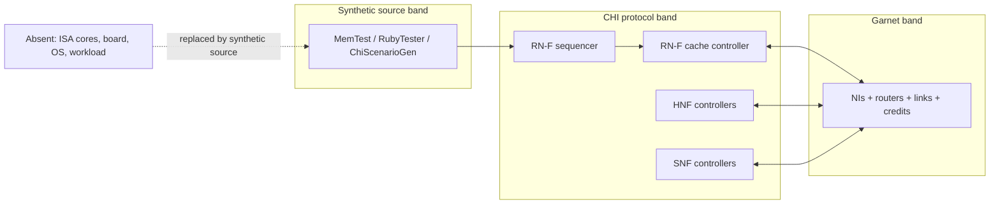
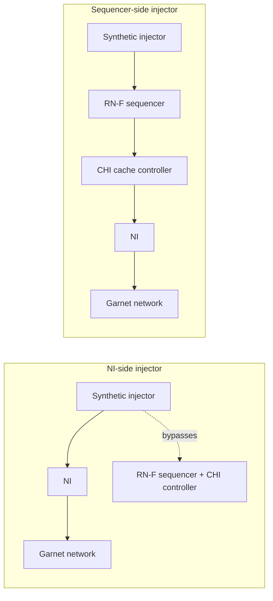
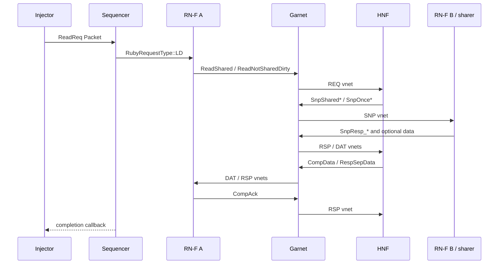
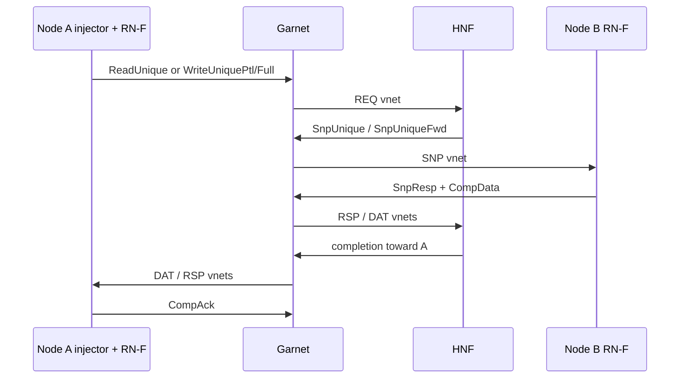
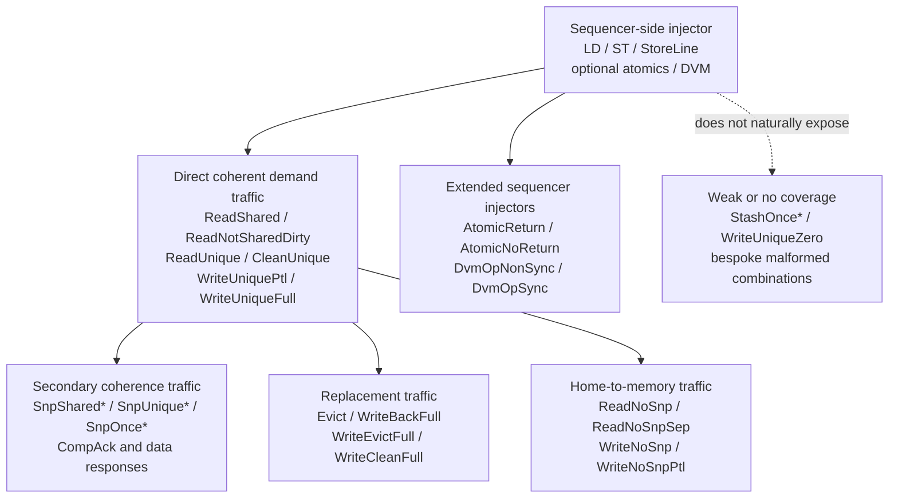

# CHI Garnet Standalone Testbench

## Context

The book already has two NoC-adjacent references: `GarnetArch.md`
(router / NI / link internals) and `RubyGarnetStats.md` (stat
families). It also has two canonical harnesses in gem5 proper:

- `configs/example/garnet_synth_traffic.py` — pure NoC microscope, but
  uses the trivial `Garnet_standalone` SLICC stub. It cannot exercise
  any CHI-specific behavior (no real requests, no snoops, no
  writebacks, no CHI vnet structure).
- `tests/gem5/chi_protocol/configs/chi-with-isa.py` — real CHI, but
  also real RISC-V cores and a real workload. Too coupled for clean
  NoC studies: traffic shape is determined by the program, injection
  rate is capped by memory-level parallelism, and coherence round
  trips obscure raw network behavior.

There is a missing middle: **real CHI protocol, synthetic traffic,
Garnet NoC, no ISA, no workload**. This is the testbench the book
needs to teach NoC evaluation in the specific context of CHI, which is
the book's target protocol. Call it the **CHI–Garnet standalone
testbench**.

The new note is a textbook-style chapter describing this testbench:
its motivation, architecture, the CHI transactions it produces, the
scenarios it can reproduce, and its deliberate limits. It is not a
"how to run it" guide — no scripts, no command lines, no ready-to-paste
snippets. It is expository prose aimed at a reader who wants to
understand *what the bench is* and *why it is shaped the way it is*
before touching it.

**Scope decisions:**

- CHI only. The generic Garnet standalone bench (`Garnet_standalone`
  protocol stub) is referenced for contrast but not re-documented.
- Textbook-style, long (~6–10 pages, ~4–6k words).
- No shell commands, no Python snippets, no "try this" boxes.
- References `GarnetArch.md` and `RubyGarnetStats.md` for internals
  they already cover; does not duplicate.

---

## Architectural Key Insight (drives the whole doc)

The clean place to attach synthetic traffic when CHI must remain real
is **at the sequencer, not at the NI**. This is the single most
important design decision in the bench, and the doc is organized
around it. The reasons:

- A sequencer-side injector emits CPU-level loads and stores. The CHI
  RN-F state machine (`CHI-cache.sm`) then *generates* the real CHI
  transactions — ReadShared, ReadUnique, WriteBack, snoop responses,
  DataSepResp, CompAck — exactly as it would under a real CPU. No CHI
  message types are handcrafted.
- The existing `GarnetSyntheticTraffic` injector sits at the NI and
  assumes the three-vnet `Garnet_standalone` layout. CHI has a richer
  vnet structure (REQ / SNP / RSP / DAT) and message semantics; an
  NI-side injector would have to hand-roll CHI messages, which
  defeats the purpose of "real CHI."
- Existing testers already do this: `RubyTester` and `MemTest` connect
  to a Ruby sequencer's `in_ports` and work with *any* Ruby protocol,
  including CHI.

So the bench the doc describes is, structurally, **`MemTest` or
`RubyTester` → CHI RN-F sequencer → CHI cache controller → Garnet
NI → Garnet mesh → HNF → SNF → memory**, with the ISA/CPU path
surgically removed and the workload replaced by a parameterized
synthetic address stream.

---

## Proposed document structure

The note is written as a single numbered-section chapter that follows
`ruby-book/BookGuideline.md`: motivation first, three layers
(intuition / working model / formal-and-code), diagrams before text,
failure modes and tradeoffs called out explicitly.

### 1. Why a CHI-Specific Standalone Testbench?

Opens with the gap. The reader has two existing tools: the generic
Garnet bench (wrong protocol — can't say anything about CHI-specific
traffic) and the full CHI+ISA bench (right protocol, wrong instrument
for NoC studies — the workload confounds the network measurement). A
concrete motivating failure: the reader wants to know whether widening
the REQ/RSP vnets helps under snoop-heavy traffic, or whether a
writeback-heavy phase saturates the mesh before the request phase
does. Neither existing bench lets them answer this cleanly.

Sub-themes:

- What the reader gains by keeping CHI real: **actual** CHI message
  mix, **actual** request→snoop→response dependency chains, **actual**
  vnet pressure profile.
- What the reader gains by removing the ISA: controllable injection
  rate, stationary traffic, no confound from CPU stalls or branch
  mispredicts, fast turn-around.
- What the reader gives up: correlation between traffic and real
  program behavior. Discussed fully in section 8.

The framing becomes sharper if the reader sees three nearby benches,
not just two:

| Bench | What stays real | What it cannot say cleanly | Best question |
|---|---|---|---|
| `Garnet_standalone` | Garnet routers, links, VCs, credits | No CHI message semantics, no snoops, no cache ownership | Pure NoC microarchitecture |
| CHI-flavored 4-vnet standalone | Garnet plus REQ/SNP/RSP/DAT-like channel separation | Still no real CHI transaction legality, retries, or dependency chains | Channel provisioning and per-vnet resource studies |
| CHI-Garnet standalone (this note) | Real CHI controllers and real Garnet | Less direct opcode-by-opcode control because cache and directory state matter | Protocol-network interaction under synthetic but legal CHI traffic |

### 2. The Bench at a Glance

A Mermaid block diagram of the standalone system. Three horizontal
bands:

1. **Synthetic source band** (top) — one `MemTest` / `RubyTester` per
   node. The only component that is not "real under test."
2. **CHI band** (middle) — real CHI RN-F sequencer + L1 cache
   controller per node, real HNF controllers, real SNF controllers.
   All SLICC state machines unchanged from `chi-with-isa.py`.
3. **Garnet band** (bottom) — routers, NIs, links, credit channels,
   topology.

Annotations mark which pieces are *real under test* (everything in
bands 2 and 3), which pieces are *stubs* (synthetic source in band 1),
and which pieces are *absent* (no ISA, no board, no DTB, no OS, no
workload, no disk).

The section's prose emphasizes the architectural shape: the CHI stack
is sandwiched between a controllable traffic source at the top and a
Garnet network at the bottom that is the real measurement target; any
stat that moves when you change a Garnet knob is attributable to
Garnet, and any stat that moves when you change a CHI knob is
attributable to CHI.

### 3. The Synthetic Source — Why Sequencer-Side

This is the doc's key architectural explanation. Subsections:

#### 3.1 Two candidate attachment points

- **NI-side injector.** Pros: exact control over destination, packet
  size, vnet, and cycle-by-cycle injection rate; excellent for a pure
  router/link microscope; minimal harness with little protocol state.
- **NI-side injector.** Cons: it bypasses the sequencer and CHI
  controllers, so the injector must handcraft legal `REQ` / `SNP` /
  `RSP` / `DAT` dependencies, retries, `TxnId` / `DBID` handling,
  `CompAck`, and data-following-response rules. At that point the bench
  is half injector and half protocol reimplementation, and it can emit
  traffic that looks like CHI flits but is not a legal CHI execution.
- **NI-side injector.** Verdict: useful when the question is "what does
  Garnet do under an abstract packet mix?" The strongest NI-side
  variant is a CHI-flavored 4-vnet standalone, which improves channel
  separation but still does not give real CHI transaction semantics.
  Wrong attachment point when the question is "what does Garnet do
  under real CHI?"
- **Sequencer-side injector.** Pros: injects the smallest stable
  abstraction Ruby already understands — CPU-facing requests through
  `in_ports` — and lets the real RN-F / HNF / SNF state machines derive
  the CHI opcodes, snoops, responses, writebacks, retries, and
  acknowledgments. The measured vnet mix is therefore a property of the
  actual protocol implementation, not of the injector author's guess.
- **Sequencer-side injector.** Cons: less direct control over the exact
  wire-level opcode mix; cache state and directory state now matter, so
  a 50% store source does not imply a 50% `WriteUnique` network mix;
  scenario design must reason in terms of ownership, sharing, and
  eviction, not just destinations and packet classes.
- **Sequencer-side injector.** Verdict: the right attachment point for
  this chapter because it preserves CHI semantics while still removing
  the ISA and workload layers.

#### 3.2 The injector family

The bench supports a *family* of sequencer-side injectors rather than a
single one. Each injector answers a different style of question and
all of them connect to CHI through exactly the same interface (the
sequencer's CPU-facing port), which is what makes the bench
extensible. Describe three categories:

- **Statistical injectors.** `MemTest` (`src/cpu/testers/memtest/`)
  and `RubyTester` (`src/cpu/testers/rubytest/`). Emit random or
  pseudo-random reads and writes at a controlled rate. Answer
  throughput and saturation questions. Cover §6.1.
- **Named-scenario injectors.** A small CHI-aware scenario generator
  (see §6) that emits *deterministic* access sequences — ping-pong,
  producer–consumer, migratory sharing — designed to produce a
  specific CHI transaction pattern. Answer microbenchmark and
  transaction-latency questions. Cover §7.2.
- **Trace-driven injectors** (mentioned briefly). Replay a recorded
  memory trace through the sequencer. Useful when the goal is to
  reproduce a specific workload's NoC footprint without carrying the
  ISA.

Discuss `RubyTester`'s built-in data consistency checker: in a bench
where the network and protocol are real, a checker violation is a
genuine finding, not just a performance signal. Keep the checker
optional but available.

One-paragraph honorable mention of `src/cpu/testers/traffic_gen/`
(TrafficGen family, including `PyTrafficGen`) and why it is not used
as-is — it targets Classic caches, not Ruby sequencers. A port shim
would be a reasonable future extension but is not required for the
core bench.

> **Deep Dive:** A sibling bench can attach synthetic sources through
> `dma_ports` so CHI instantiates `CHI_RNI_DMA` nodes rather than
> cached RN-F nodes.
> This is not the core bench for the chapter because it removes
> private-cache ownership transfer, snoop fanout, and most of the
> coherence effects that make CHI interesting.
> It is, however, the right extension when the question is device-like
> offered load: line-rate streams, burst trains, many-to-one incast, or
> steady REQ / DAT pressure from NIC-like engines.
> Keeping this as a sibling, not as the default, preserves the chapter's
> main claim: cache-coherent RN-F traffic should enter at the sequencer.

#### 3.3 What shows up on the wire

Walk, in prose, through what a single synthetic load becomes as it
crosses the bench:

1. The injector emits a `ReadReq` Packet at sequencer.
2. Sequencer allocates a TBE, hands it to CHI RN-F controller.
3. RN-F controller emits `ReadShared` or `ReadNotSharedDirty` on REQ
   vnet toward HNF.
4. HNF issues the appropriate shared-read snoop on SNP vnet
   (`SnpSharedFwd`, `SnpShared`, or `SnpOnce`) depending on owner /
   sharer state.
5. Snooped RN-Fs emit `SnpResp_*` on RSP vnet; if owner, `CompData` on
   DAT vnet.
6. Data and completion arrive back at originator; `CompAck` on RSP
   vnet.

Each hop is a Garnet packet whose latency, queueing, and link
utilization are observable in the stats. This transaction — a single
synthetic `ReadReq` — touches every CHI vnet. *That* is what makes the
bench a CHI-real NoC instrument.

A second walk for a **ping-pong step**: node A writes line X (already
owned by node B). RN-F A emits `WriteUniquePtl`, `WriteUniqueFull`, or
`ReadUnique`; HNF forwards a `SnpUnique` to B; B responds with
`CompData` carrying the line; A completes, line is now dirty-at-A.
Next iteration reverses.
Every ping-pong round-trip therefore touches REQ → SNP → DAT → RSP in
a fixed sequence, and its latency is an interpretable combination of
two NoC traversals plus the HNF pipeline. This walk motivates §7.2.

#### 3.4 Coverage envelope for sequencer-side injectors

The coverage argument should be explicit rather than hand-wavy.
A sequencer-side injector does not let the author choose an arbitrary
`CHIRequestType` directly.
It lets the author choose a CPU-visible access stream and then observe
which CHI request types the real controllers derive from it.

- **Stock statistical injectors cover the core CHI data/coherence
  envelope.** `Load` requests map naturally to `ReadShared` or
  `ReadNotSharedDirty`, and `Store` / `StoreLine` requests map to the
  ownership-acquisition paths built around `ReadUnique`,
  `CleanUnique`, `WriteUniquePtl`, and `WriteUniqueFull`.
- **That coverage is strong where the NoC questions usually live.** It
  covers the requests that dominate cacheable CHI demand traffic,
  including upgrades, write ownership transfer, cache-to-cache data
  movement, and replacement-driven cleanup.
- **The same runs also induce the maintenance traffic that matters for
  network pressure.** When lines are displaced or downgraded, the bench
  naturally produces `Evict`, `WriteBackFull`, `WriteEvictFull`, and
  `WriteCleanFull` without any injector-side protocol scripting.
- **The bench observes memory-side CHI requests indirectly.** Once an
  HNF decides a miss must go to memory, the reader also gets real
  `ReadNoSnp` / `ReadNoSnpSep` and `WriteNoSnp` /
  `WriteNoSnpPtl` traffic on the HNF↔SNF path.
- **Snoop coverage is consequence-driven, not opcode-driven.**
  `SnpShared*`, `SnpUnique*`, `SnpOnce*`, and the corresponding
  response/data traffic appear when the address-sharing pattern demands
  them. This is precisely why the bench is useful: it measures real CHI
  dependency chains rather than a hand-authored guess about them.
- **Richer sequencer injectors expand the envelope further.** If the
  source can emit atomic or DVM Ruby requests, the same attachment point
  can also exercise `AtomicReturn`, `AtomicNoReturn`, `DvmOpNonSync`,
  and `DvmOpSync`.
- **Some request types are still niche or out of scope.** `ReadOnce` is
  only reached when the request is modeled as non-filling, so it is not
  a first-class output of stock cacheable traffic sources. Stash
  operations, `WriteUniqueZero`, and deliberately malformed legal-
  looking combinations are poor fits for this bench and belong in
  targeted protocol or NI-level tests.

### 4. The CHI Stack Under Test

Short section, heavily cross-referenced.

- SLICC sources: `src/mem/ruby/protocol/chi/CHI-cache.sm`,
  `CHI-cache-ports.sm`, `CHI-cache-actions.sm`, `CHI-cache-transitions.sm`,
  `CHI-cache-funcs.sm`, `CHI-mem.sm`, `CHI-msg.sm`, `CHI-dvm-*.sm`.
- Node roles: RN-F (L1/L2), HNF (home), SNF (memory side), MN (DVM).
  Identical to `chi-with-isa.py`; no modifications.
- Python wiring options:
  - Stdlib path: `src/python/gem5/components/cachehierarchies/chi/`
    (`PrivateL1CacheHierarchy`, `L1CacheController`, `AbstractNode`).
  - Legacy path: `configs/ruby/CHI.py`, `configs/ruby/CHI_config.py`.
  - Discuss the tradeoff: stdlib is the modern default, legacy gives
    finer-grained control over node counts and per-node parameters,
    which matters when the bench is configured asymmetrically (e.g.,
    two HNFs, many RN-Fs).
- One-paragraph note that the bench uses `SingleChannelDDR3_1600` or
  similar stdlib memory for the SNF backing — the DRAM model is
  incidental here; the section defers to the Part-IV DRAM chapters.

### 5. The Garnet Layer Under Test

Cross-reference `GarnetArch.md` for component internals; here, only
the *parameters* that matter for a CHI standalone run:

- Topology choice (`configs/topologies/Mesh_XY.py`, `Mesh_westfirst.py`,
  `MeshDirCorners_XY.py`, `CrossbarGarnet.py`, `Pt2Pt.py`). For each
  topology, what CHI characteristic it highlights — e.g.,
  `MeshDirCorners_XY` makes the HNF-at-corner asymmetry visible.
- Routing (`--routing-algorithm 0/1/2`: table, XY, custom).
- Per-vnet resources: `--vcs-per-vnet`, `--buffers-per-data-vc`,
  `--buffers-per-ctrl-vc`. Importance for CHI: REQ/SNP/RSP are
  control-like (1-flit), DAT is data-like (5-flit); mis-sizing VC
  counts per class shows up differently.
- Link parameters: `--router-latency`, `--link-latency`,
  `--link-width-bits`. Interaction with CHI message sizes.
- Per-vnet vs shared physical links — reference the existing
  `ruby-book/final/link-pressure` results as a concrete case study,
  without reproducing their numbers.

### 6. Custom Traffic Generation — The Scenario Generator

The statistical injectors (`MemTest`, `RubyTester`) answer
throughput-shaped questions but not latency-shaped questions. A
reader who wants to measure *the latency of a single CHI transaction
under a known coherence state* — e.g., "how long does a cache-to-cache
transfer take across three hops when the owner is at node 7 and the
requester is at node 2?" — needs a source that emits *named*,
*deterministic*, *synchronizable* access sequences. This section
describes the architecture of that source.

#### 6.1 Why a new source

`MemTest`'s access pattern is random-per-tester-id with byte-level
false sharing — useful for coherence stress, useless for reproducing a
specific ping-pong round. `RubyTester` has similar randomness.
`GarnetSyntheticTraffic` is pattern-driven but NI-side and lives in
the wrong world. A reader who wants "node A writes X, then node B
reads X" needs per-node address control plus ordering between nodes.
None of the existing injectors expose that.

#### 6.2 Proposed extension: `ChiScenarioGen`

Describe the shape of a minimal new SimObject (do not implement it in
the doc — this is a design description, not a coding proposal).
Parameters, at the conceptual level:

- `scenario` — name selector (ping_pong, producer_consumer,
  migratory, hot_directory, snoop_broadcast, latency_probe, …).
- `role` — per-instance role within the scenario (e.g., initiator,
  partner, reader, writer). Multiple `ChiScenarioGen` instances share
  a scenario name and play different roles.
- `peer_ids` — identifies the other participant(s) for synchronization.
- `shared_addr_base`, `shared_line_count` — the address range the
  scenario operates on.
- `iterations` — how many rounds of the scenario to play.
- `barrier`, `wait_for_completion` — per-step synchronization hooks
  (scenario logic, not CHI semantics).
- `measure_latency` — opt-in stat group that records per-iteration
  round-trip latency from issue-of-request to observation of
  completion.

The generator also needs an explicit **address-control layer**.
Without it, the named scenarios collapse back into vague random load.
The document should call out five required capabilities:

- exact HNF selection by the address bits that determine homing;
- same-line placement so multiple injectors really contend for one
  cache line;
- adjacent-word placement inside one line for false-sharing studies;
- near-vs-far home-node placement relative to the source router;
- sequential or strided sweeps that spread demand across all HNFs in a
  controlled way.

This is not a scripting convenience.
In this bench, address placement is part of the experiment design.
It is how the reader asks "same HNF or different HNFs?", "same line or
different lines?", and "local or deep-mesh path?" without bringing the
ISA back into the picture.

The generator is small because it delegates all the hard work: it
issues plain loads/stores through the sequencer, and CHI does the
rest. Its only novelty is the *scheduling* of those loads/stores
across nodes.

#### 6.3 Alternative: scripted Python source

Mention as an alternative (not the recommended default) a Python-side
driver that enqueues access sequences via
`src/cpu/testers/traffic_gen/PyTrafficGen`-style callbacks plus a port
shim to the Ruby sequencer. Tradeoff: faster iteration on scenario
design, slower per-request (Python overhead), and it requires the
port shim that the TrafficGen family currently lacks for Ruby.
Recommend `ChiScenarioGen` as the default and keep the Python option
as an escape hatch for one-off measurements.

#### 6.4 What the bench gives up by *not* generating CHI directly

Brief honesty, but more concrete than "not everything."
Point back to §3.4 and separate the limits into categories the reader
can act on:

- **Naturally covered.** Cacheable reads, stores, upgrades, evictions,
  writebacks, and the snoops they induce.
- **Covered only with a richer sequencer source.** Atomics and DVM
  requests.
- **Observed only as downstream side effects.** `ReadNoSnp*` and
  `WriteNoSnp*` on the HNF↔SNF edge.
- **Poorly covered or intentionally out of scope.** Stash operations,
  `WriteUniqueZero`, deliberately malformed traffic, or experiments that
  need the author to choose arbitrary CHI fields directly.

This limitation should be framed as both a feature and a boundary.
It is a feature because the bench refuses to generate impossible CHI
traffic just because the author asked for it.
It is a boundary because the bench is therefore a CHI-real NoC
instrument, not a full CHI opcode fuzzer.

### 7. Scenario Catalog

Two subsections, both written as **prose**, no commands. Each scenario
follows the same shape: architectural question → knob(s) turned →
expected result signature → interpretation for a real CHI workload.

#### 7.1 Statistical scenarios (random / uniform injection)

Driven by `MemTest` / `RubyTester`. Each 300–500 words.

1. **CHI unloaded-latency baseline.** Very low injection, all-read
   uniform random. Question: what is the raw per-hop cost of a CHI
   read transaction, including HNF lookup and SNF data return?
   Calibrates the reader's expectations before any loaded study.
   Connects to `average_packet_latency` per vnet and `average_hops`.

2. **CHI saturation curve.** Sweep injection rate, mixed read/write.
   Question: where does the network saturate, and which vnet
   saturates first? Explain why DAT usually saturates before REQ in a
   read-heavy mix and why the opposite holds in a writeback-heavy
   mix.

3. **Snoop-pressure stress.** Shared-address workload driven by
   `MemTest`'s false-sharing mode. Question: how does HNF snoop
   broadcast load the SNP vnet, and at what injection rate does
   SNP queueing dominate total latency?

4. **Writeback storm.** High-write, cache-small regime to force
   eviction. Question: how do WriteBackFull transactions (DAT-heavy)
   coexist with read traffic (REQ+RSP+DAT)? Reveals the DAT vnet's
   credit-stall profile.

#### 7.2 Named microbenchmarks (deterministic scenarios)

Driven by `ChiScenarioGen`. Each is a single-purpose *latency*
measurement, not a throughput measurement. 300–500 words apiece.

1. **Ping-pong line bouncing.** Two designated RN-Fs alternately take
   exclusive ownership of a single cache line. Question: what is the
   end-to-end latency of a cache-to-cache transfer, decomposed into
   REQ (requester→HNF), SNP (HNF→owner), DAT (owner→requester), and
   CompAck? Expected signature: flat per-iteration latency whose mean
   matches 2× zero-load packet latency plus HNF pipeline cost.
   Measurement tool: `measure_latency` stat group.

2. **Producer–consumer streaming.** One RN-F writes a sequence of
   lines; N RN-Fs each read the sequence behind the producer.
   Question: how does forward-progress of the consumer side depend
   on the producer's write completion? Reveals the read-after-write
   coherence dependency in the CHI message sequence and how the NoC
   topology changes it (near-producer vs far-producer).

3. **Migratory sharing cascade.** A single line is written by every
   RN-F in a fixed cyclic order. Each step is an exclusive
   acquisition from the previous owner. Question: under a given
   topology, what is the per-hop cost of migration, and how does it
   compare to the two-node ping-pong case? Reveals the
   direction-dependence of ownership transfer under XY vs adaptive
   routing.

4. **Hot-directory broadcast.** Many RN-Fs issue `ReadShared` to the
   same line held at a single HNF. Question: what is the snoop
   broadcast latency tail, and where does the HNF's own pipeline
   saturate relative to the SNP link bandwidth? Isolates the
   directory-side bottleneck.

5. **Latency probe with background load.** Run scenario 1 (ping-pong)
   concurrently with a tunable `MemTest` background at N% of
   saturation. Question: how does a deterministic latency-sensitive
   transaction degrade under throughput-sensitive background traffic?
   This is the bench's single most useful composed scenario and
   should be the closing example of the section.

6. **Per-vnet physical links vs shared links.** Repeat scenarios 1
   and 4 with both shared and per-vnet physical links. Question:
   when does separating physical links per vnet remove a saturation
   knee for latency-sensitive traffic? Cite
   `ruby-book/final/link-pressure` as precedent (no numbers copied).

Each case study closes with a one-paragraph bridge: "what this tells
you about a real CHI workload."

### 8. Reading the Results

Short section. Points at `RubyGarnetStats.md` and
`RubyGarnetStatsCheatsheet.md` for the stat glossary. Only lists the
stats that have *CHI-specific meaning* in a standalone run:

- Per-vnet `average_packet_latency` — now maps to a concrete CHI
  channel (REQ / SNP / RSP / DAT), so its shape is interpretable.
- Per-vnet injected/received counters — cross-check expected CHI
  dependency ratios (e.g., one SNP per `ReadShared` to a sharer
  set).
- CHI controller action counts (from the SLICC-generated controller)
  — validate that the traffic source is producing the intended
  transaction mix. Reference the Ruby controller stats already
  catalogued in `RubyGarnetStats.md`.
- `average_hops` — independent check on topology and routing.

Explicit anti-list of stats that are still meaningless or meaning-
shifted:

- Round-trip latency as a "memory" latency — now meaningful (real
  CHI), but the reader must remember the ISA / LSQ layers are absent,
  so it is an *interconnect and coherence* latency, not a *CPU-
  observed* latency.
- Cache hit rate — defined, but determined entirely by the synthetic
  address pattern, not a workload. Useful for tuning the source, not
  for reasoning about applications.

The section should add a short **How we know this bench is faithful**
subsection.
Its role is not to demand cycle-for-cycle equality with a workload-
driven run.
Its role is to anchor the synthetic bench to already-validated path and
bottleneck signatures elsewhere in the book.

- `ruby-book/final/hop_latency` — a near-vs-far synthetic load should
  activate the same home-node placement and the same deep-mesh links as
  the workload-driven near-vs-far case.
- `ruby-book/final/false_sharing` — ping-pong and migratory scenarios
  should show more ownership-transfer snoops and cache-to-cache data
  movement than a non-sharing control case.
- `ruby-book/final/hotspot-heavy` — hot-directory scenarios should
  concentrate queueing and service delay around one HNF rather than
  diffusing congestion evenly across the mesh.
- `ruby-book/final/link-pressure` — distributed background-load or
  stream-style scenarios should reproduce the same *bottleneck class*
  as the shared-links vs per-vnet-links comparison, even if the exact
  rates differ.

The standard is therefore: same path activation, same dominant vnet
pressure, same bottleneck class.
Not identical cycle counts.

### 9. Limits of the Bench

Honest accounting of what this bench cannot model:

- No phase behavior, no bursty traffic, no ramp-up/ramp-down — the
  source is stationary.
- No producer–consumer coupling at the ISA level — a synthetic store
  followed by a synthetic load does not create the real happens-before
  edges a program would.
- No memory-model stress — the reader should not conclude anything
  about TSO / RVWMO consistency from this bench.
- Memory controller effects are minimized by construction; for DRAM
  studies, the reader should graduate to a workload-driven bench
  (Part IV of the book).
- Atomic / LR-SC traffic is absent unless the synthetic source is
  extended — note this as a clean extension point but not required
  for the core bench.
- Device-like offered-load studies are not this bench's primary target;
  if the reader wants NIC/DMA stream injection, burst trains, or
  incast from non-cached requesters, a sibling `RNI/DMA`-oriented CHI
  bench is the cleaner successor.

Forward pointers to the bench's successors for each limitation.

### 10. Cross-References and Further Reading

- Component internals: `ruby-book/extra/GarnetArch.md`.
- Stats: `ruby-book/extra/RubyGarnetStats.md`,
  `RubyGarnetStatsCheatsheet.md`.
- Planned book chapters that will import from this note:
  - `ruby-book/Ch11_TopologiesRoutingSyntheticTraffic.md`.
  - `ruby-book/Ch13_BuildingCHISystems.md`.
- Existing harnesses referenced for contrast:
  - `configs/example/garnet_synth_traffic.py`.
  - `tests/gem5/chi_protocol/configs/chi-with-isa.py`.
  - `configs/example/ruby_random_test.py`,
    `configs/example/ruby_mem_test.py`.
- CHI SLICC: `src/mem/ruby/protocol/chi/`.
- Canonical NoC textbook for pattern lineage: Dally & Towles,
  *Principles and Practices of Interconnection Networks*.
- CHI spec: AMBA 5 CHI Architecture Specification (cite edition in
  the final doc).

---

## Files to be created

- `ruby-book/extra/CHIGarnetStandaloneTest.md` — the only new file.

## Files cited (read-only)

- `configs/example/ruby_random_test.py`, `ruby_mem_test.py` —
  sequencer-side synthetic drivers.
- `configs/example/garnet_synth_traffic.py` — cited only for contrast.
- `tests/gem5/chi_protocol/configs/chi-with-isa.py` — cited only for
  contrast.
- `ruby-book/final/hop_latency`, `false_sharing`, `hotspot-heavy`,
  `link-pressure` — workload-driven anchors used only for behavioral
  contrast and validation framing.
- `configs/ruby/CHI.py`, `configs/ruby/CHI_config.py`,
  `configs/ruby/Ruby.py` — CHI wiring.
- `configs/network/Network.py`, `configs/topologies/*.py` — Garnet and
  topology knobs.
- `src/cpu/testers/rubytest/RubyTester.hh`,
  `src/cpu/testers/memtest/memtest.hh` — injector internals.
- `src/cpu/testers/garnet_synthetic_traffic/GarnetSyntheticTraffic.hh`
  — referenced only to explain why it is the wrong attachment point.
- `src/mem/ruby/protocol/chi/CHI-cache.sm`, `CHI-mem.sm`, `CHI-msg.sm`
  (and siblings) — CHI protocol reference.
- `src/python/gem5/components/cachehierarchies/chi/private_l1_cache_hierarchy.py`,
  `nodes/l1_cache.py`, `nodes/abstract_node.py` — stdlib CHI wiring.
- `src/mem/ruby/network/garnet/GarnetNetwork.{hh,cc}` — Garnet stats.

## Verification

Exposition-only note; verification is editorial:

1. Every cited file path and node role is checked against the current
   tree and the current `src/mem/ruby/protocol/chi/` contents.
2. CHI message-flow walk in §3.3 and coverage claims in §3.4 are
   checked against `CHI-cache-actions.sm` and
   `CHI-cache-transitions.sm`: first the sequencer-visible request set,
   then the downstream CHI opcodes each path can induce.
3. Mermaid diagrams in §§2, 3.1, 3.3, and 3.4 render in the book's
   toolchain.
4. Diff against `GarnetArch.md` and `RubyGarnetStats.md` — any
   overlap must be a pointer, never a restatement.
5. Cross-check against `ruby-book/BookGuideline.md`, especially rules
   1 (motivation first), 2 (three layers), 6 (failure modes), 7
   (tradeoffs explicit), 9 (consistent terminology — map every
   informal term to its `.sm` / `.hh` identifier).
6. Cross-check against `ruby-book/BookPlan.md` to keep the note
   consistent with the planned Ch11 / Ch13 coverage and avoid
   pre-empting material those chapters own.
7. If the note keeps the new faithfulness subsection in §8, verify that
   each anchor points to an existing workload-driven experiment and that
   the text compares *path activation and bottleneck class*, not exact
   cycle counts.
