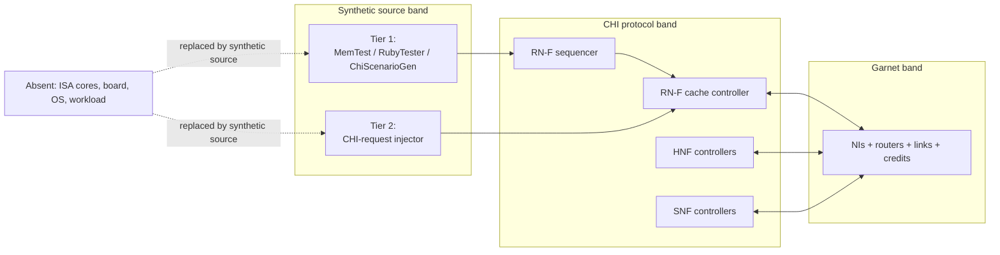
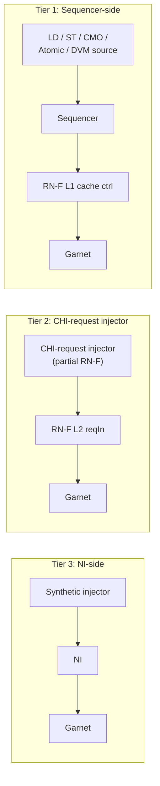
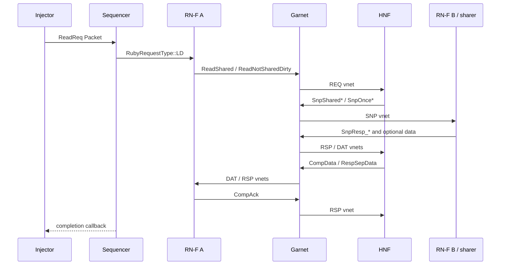
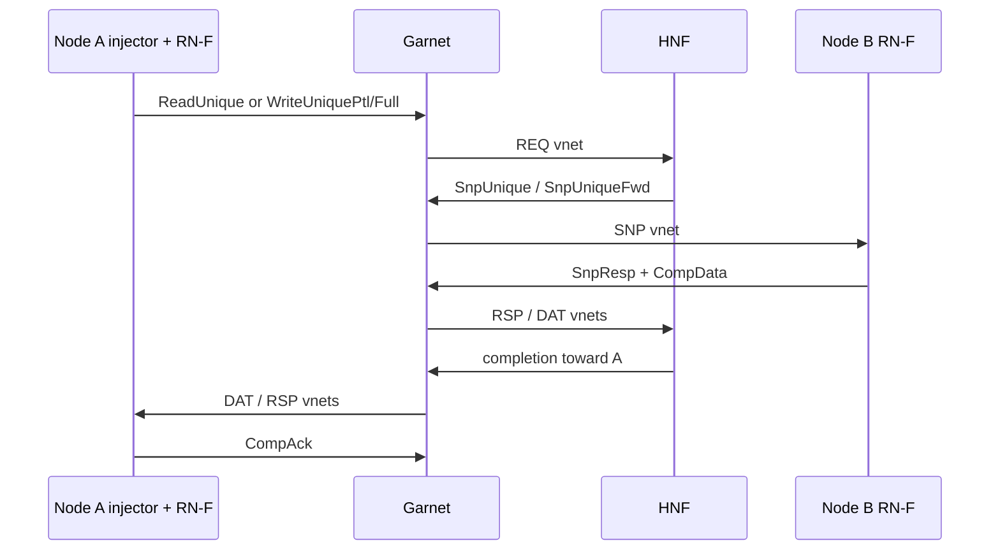
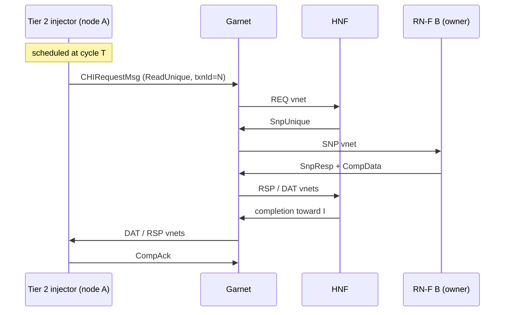

# CHI Garnet Standalone Testbench

## Context

The book already has two NoC-adjacent references: `GarnetArch.md`
(router / NI / link internals) and `RubyGarnetStats.md` (stat
families). It also has two canonical harnesses in gem5 proper:

- `configs/example/garnet_synth_traffic.py` — pure NoC microscope, but
  uses the trivial `Garnet_standalone` SLICC stub. It cannot exercise
  any CHI-specific behavior (no real requests, no snoops, no
  writebacks, no CHI vnet structure).
- `tests/gem5/chi_protocol/configs/chi-with-isa.py` — real CHI, but
  also real RISC-V cores and a real workload. Too coupled for clean
  NoC studies: traffic shape is determined by the program, injection
  rate is capped by memory-level parallelism, and coherence round
  trips obscure raw network behavior.

There is a missing middle: **real CHI protocol, synthetic traffic,
Garnet NoC, no ISA, no workload**. This is the testbench the book
needs to teach NoC evaluation in the specific context of CHI, which is
the book's target protocol. Call it the **CHI–Garnet standalone
testbench**.

The new note is a textbook-style chapter describing this testbench:
its motivation, architecture, the CHI transactions it produces, the
scenarios it can reproduce, and its deliberate limits. It is not a
"how to run it" guide — no scripts, no command lines, no ready-to-paste
snippets. It is expository prose aimed at a reader who wants to
understand *what the bench is* and *why it is shaped the way it is*
before touching it.

**Scope decisions:**

- CHI only. The generic Garnet standalone bench (`Garnet_standalone`
  protocol stub) is referenced for contrast but not re-documented.
- Textbook-style, long (~6–10 pages, ~4–6k words).
- No shell commands, no Python snippets, no "try this" boxes.
- References `GarnetArch.md` and `RubyGarnetStats.md` for internals
  they already cover; does not duplicate.

---

## Architectural key insight

A synthetic traffic source for this bench can attach at three distinct
points in the stack, and the bench adopts two of them as co-equal
defaults:

- **Tier 1 (sequencer-side).** The injector emits CPU-level requests
  (LD, ST, StoreLine, atomics, CMO, DVM) through the Ruby sequencer's
  `in_port`. The real RN-F state machine in `CHI-cache.sm` derives
  every CHI opcode, snoop, retry, and completion from the access
  stream. Best for throughput-shaped NoC questions under realistic
  CHI traffic.
- **Tier 2 (CHI-request injector at the RN-F `reqIn`).** A small
  SimObject that plays the role of a peer RN-F on the network,
  emitting hand-crafted `CHIRequestMsg`s and owning the minimum
  outstanding-transaction bookkeeping (TxnId, CompAck, retry). Best
  for feature coverage and reproducibility — prescribed opcode
  mixes, deterministic concurrent orderings, stash / `PrefetchTgt` /
  `WriteUniqueZero` scenarios.
- **Tier 3 (NI-side).** Cited only for contrast. Trades away CHI
  semantics for flit-level injection precision; wrong attachment
  point when the bench must measure NoC behavior under real CHI.

§3.1 states this in full; this preamble exists so the reader knows,
before entering the chapter, which two tiers the bench is built
around and which one it rejects.

---

## Proposed document structure

The note is written as a single numbered-section chapter that follows
`ruby-book/BookGuideline.md`: motivation first, three layers
(intuition / working model / formal-and-code), diagrams before text,
failure modes and tradeoffs called out explicitly.

### 1. Why a CHI-Specific Standalone Testbench?

Opens with the gap. The reader has two existing tools: the generic
Garnet bench (wrong protocol — can't say anything about CHI-specific
traffic) and the full CHI+ISA bench (right protocol, wrong instrument
for NoC studies — the workload confounds the network measurement). A
concrete motivating failure: the reader wants to know whether widening
the REQ/RSP vnets helps under snoop-heavy traffic, or whether a
writeback-heavy phase saturates the mesh before the request phase
does. Neither existing bench lets them answer this cleanly.

Sub-themes:

- What the reader gains by keeping CHI real: **actual** CHI message
  mix, **actual** request→snoop→response dependency chains, **actual**
  vnet pressure profile.
- What the reader gains by removing the ISA: controllable stimulus
  (statistical injection for throughput questions, scripted schedule
  for ordering questions), no confound from CPU stalls or branch
  mispredicts, fast turn-around.
- What the reader gives up: correlation between traffic and real
  program behavior. Discussed fully in §9.

The framing becomes sharper if the reader sees three nearby benches,
not just two:

| Bench | What stays real | What it cannot say cleanly | Best question |
|---|---|---|---|
| `Garnet_standalone` | Garnet routers, links, VCs, credits | No CHI message semantics, no snoops, no cache ownership | Pure NoC microarchitecture |
| CHI-flavored 4-vnet standalone | Garnet plus REQ/SNP/RSP/DAT-like channel separation | Still no real CHI transaction legality, retries, or dependency chains | Channel provisioning and per-vnet resource studies |
| CHI-Garnet standalone (this note) | Real CHI controllers and real Garnet, at both Tier 1 (sequencer) and Tier 2 (RN-F `reqIn`) | No workload-correlated phase behavior; no ISA happens-before | Protocol-network interaction under synthetic but legal CHI traffic |

### 2. The Bench at a Glance

A Mermaid block diagram of the standalone system. Three horizontal
bands:

1. **Synthetic source band** (top) — either Tier 1 injectors
   (`MemTest`, `RubyTester`, `ChiScenarioGen`) attached at the
   sequencer, or the Tier 2 CHI-request injector attached at the
   RN-F `reqIn`, or both in the same run. Either tier can drive the
   bench standalone; the scenario author chooses based on the
   question (§3.1). The only band that is not "real under test."
2. **CHI band** (middle) — real CHI RN-F sequencer + cache
   controller per node, real HNF controllers, real SNF controllers.
   All SLICC state machines unchanged from `chi-with-isa.py`.
3. **Garnet band** (bottom) — routers, NIs, links, credit channels,
   topology.

Annotations mark which pieces are *real under test* (everything in
bands 2 and 3), which pieces are *stubs* (synthetic source in band 1),
and which pieces are *absent* (no ISA, no board, no DTB, no OS, no
workload, no disk).

The section's prose emphasizes the architectural shape: the CHI stack
is sandwiched between a controllable traffic source at the top and a
Garnet network at the bottom that is the real measurement target.
A stat that moves when a Garnet knob changes is attributable to
Garnet; a stat that moves when a CHI knob changes is attributable to
CHI; the choice of Tier 1 vs Tier 2 controls only the *stimulus*,
never the *response*.

### 3. The Synthetic Source

The chapter's central architectural explanation: where the synthetic
traffic enters the stack, what each attachment point can and cannot
measure, and how the bench uses two of them together.

#### 3.1 Three attachment tiers

A synthetic traffic source for a CHI-Garnet bench can attach at three
distinct points in the stack.
The choice determines what the bench can and cannot measure, and the
three points are not interchangeable.
The bench adopts Tier 1 and Tier 2 as co-equal defaults; Tier 3 is
cited for contrast only.
Each tier answers a different family of questions.

##### Tier 1 — Sequencer-side injector

A synthetic source that emits CPU-level requests (LD, ST, StoreLine,
atomics, CMO, DVM) through the Ruby sequencer's `in_port`.
The RN-F state machine in `CHI-cache.sm` then generates whatever CHI
opcodes the access stream and the current cache state imply.

- **Best for.** Aggregate, throughput-shaped NoC questions under
  realistic CHI traffic: saturation curves, vnet pressure profiles,
  topology sweeps, background-load composition. Any question
  well-answered by *"what does the NoC do under a cacheable workload
  of shape X?"*
- **What is emergent.** Every CHI opcode, every snoop, every retry,
  every completion. The bench does not choose them; the protocol does.
- **What cannot be forced.** The exact concurrent ordering of two
  in-flight transactions. The presence of opcodes that have no
  sequencer path (`StashOnce*`, `WriteUniqueZero`, `PrefetchTgt` with
  chosen timing). The exact CHI opcode mix on the REQ vnet.
- **Cost.** Near zero. `MemTest` and `RubyTester` already exist and
  already connect to the sequencer's `in_port`.

##### Tier 2 — CHI-request injector at the RN-F `reqIn`

A small new SimObject that plays the role of a peer RN-F on the
network.
It emits hand-crafted `CHIRequestMsg`s directly into the target cache
controller's `reqIn`, and consumes `CHIDataMsg` / `CHIResponseMsg`
traffic on its own `datIn` / `rspIn`.
It owns a minimal outstanding-transaction table: TxnId allocation,
CompAck retirement, `RetryAck` / `PCrdGrant` handling, and DMT
bookkeeping if the target supports it.

- **Best for.** Feature coverage and reproducibility. Any question of
  the form *"what happens when this specific opcode arrives in this
  specific relation to this other in-flight transaction?"*. Also any
  question where the experiment prescribes an opcode mix the protocol
  would not naturally produce.
- **Prior art.** `CHI_RNI_DMA` already implements a partial RN-F for
  IO-coherent sources; the Tier 2 injector borrows its shape — a
  non-cache-backed CHI node with a minimum outstanding-transaction
  table — and replaces the DMA front-end with a scripted stimulus.
- **Legality guarantee.** The injector validates every outgoing message
  against the CHI spec, and the target controller — being the real
  RN-F L2 state machine — will refuse illegal sequences. Illegal
  traffic surfaces as a controller assertion, not as silent corruption.
- **What is still emergent.** The snoop and response traffic the target
  produces in reaction to the injected request. Tier 2 controls the
  *stimulus*; the *response* is still real CHI.
- **Cost.** A few hundred lines of SimObject plus a small scenario
  DSL. Non-trivial, but one-time.

##### Tier 3 — NI-side injector

The existing `GarnetSyntheticTraffic`-style source that writes flits
directly onto the network interface.
Cited for contrast; not part of this bench.

- **Best for.** Pure router, link, VC, and credit studies where CHI
  semantics are explicitly *not* under test. A NoC microscope.
- **What it loses.** All CHI semantics. No real transaction legality,
  no snoop chains, no writeback–read races, no CompAck ordering. A
  "ReadShared-like" flit in this tier is a flit of the right size on
  the right vnet, nothing more.
- **Why not use it here.** The bench's purpose is NoC evaluation
  *under real CHI*. Tier 3 trades that away for injection precision
  the other two tiers already provide (Tier 2) or do not need
  (Tier 1).

##### Division of labor

| Dimension | Tier 1 (sequencer) | Tier 2 (direct CHI) |
|---|---|---|
| Primary question shape | throughput / saturation | latency / reproducibility / feature |
| Opcode selection | emergent from access pattern | explicit |
| Concurrent ordering | best-effort via injection rate | cycle-exact via scheduling hooks |
| Snoop chains | real, consequence-of-stimulus | real, consequence-of-stimulus |
| Rare opcodes (stash, prefetch-tgt) | unreachable | reachable |
| Implementation cost | near zero | moderate (one-time) |
| Authoring surface | §6.2 (`ChiScenarioGen`) | §6.5 (CHI-request injector) |
| Scenario catalog | §7.1, §7.2 | §7.3 |

The remaining subsections specialize this split.
§3.2 catalogs the Tier 1 injector family and the Tier 2 injector
shape.
§3.3 walks one transaction through each tier's path side by side, so
the reader can see what "real CHI on the wire" looks like from
either entry point.
§3.4 states the coverage envelope of each tier separately.
Scenario authoring (§6) and the scenario catalog (§7) are split the
same way: §6.2 and §7.1–§7.2 are Tier 1, §6.5 and §7.3 are Tier 2.

#### 3.2 The injector family

The bench supports a family of injectors across both tiers.
Tier 1 injectors all connect through the same sequencer `in_port`;
Tier 2 injectors all connect through the same RN-F `reqIn`.
Within each tier, the injectors differ in what they schedule, not in
how they attach.

##### 3.2.1 Tier 1 injectors (sequencer-side)

- **Statistical.** `MemTest` (`src/cpu/testers/memtest/`) and
  `RubyTester` (`src/cpu/testers/rubytest/`). Emit random or
  pseudo-random reads and writes at a controlled rate. Answer
  throughput and saturation questions. Drive §7.1.
- **Named-scenario.** `ChiScenarioGen` (see §6) emits deterministic
  access sequences — ping-pong, producer–consumer, migratory sharing
  — designed to produce a specific CHI transaction pattern. Answer
  microbenchmark and transaction-latency questions. Drive §7.2.
- **Trace-driven.** Replay a recorded memory trace through the
  sequencer. Useful when the goal is to reproduce a specific
  workload's NoC footprint without carrying the ISA.

`RubyTester`'s built-in data-consistency checker should remain
available: in a bench where the network and protocol are real, a
checker violation is a genuine finding, not just a performance
signal.

`src/cpu/testers/traffic_gen/` (TrafficGen, `PyTrafficGen`) is not
used as-is because it targets Classic caches, not Ruby sequencers. A
port shim would be a reasonable future extension but is not required
for the core bench.

##### 3.2.2 Tier 2 injector (CHI-request side)

A single injector shape, parameterized by scenario:

- **CHI-request injector.** A SimObject that presents four CHI
  MessageBuffers (`reqOut`, `rspOut`, `datOut`, plus `datIn` / `rspIn`
  / `snpIn`) and a minimum outstanding-transaction table.
  The injector emits scripted `CHIRequestMsg`s with explicit opcode,
  target MachineID, TxnId, and issue cycle; it consumes responses
  and emits `CompAck` on retirement; it handles `RetryAck` /
  `PCrdGrant` per the CHI spec. The script — not the cache state —
  determines which opcodes appear on the wire. Drives §7.3.

The injector's shape is borrowed from `CHI_RNI_DMA` (which already
implements a non-caching CHI requester for DMA traffic) with two
changes: the stimulus is a scripted schedule rather than a
packet-driven DMA front-end, and the injector does not need to claim
full `CHI_RNI_DMA` IO coherence semantics — it only needs to be a
legal peer on the network.

> **Sibling bench — `CHI_RNI_DMA` at the dma_ports.** For
> *device-like offered load* (NIC line-rate streams, DMA burst
> trains, many-to-one incast, steady REQ / DAT pressure from engines
> that never cache) the right extension is not Tier 2 but the stock
> `CHI_RNI_DMA` node driven by a Packet-level traffic generator on
> `dma_ports`. This sibling bench removes private-cache ownership
> transfer and snoop fanout — the coherence effects the core bench is
> about — which is why it is a sibling, not a variant.

#### 3.3 What shows up on the wire

Three walks, one for each entry pattern the bench supports. The
first two enter through Tier 1 (a statistical load and a scripted
ping-pong store); the third enters through Tier 2 (a directly
scripted `ReadUnique`). From the HNF onward every walk is identical
— that is the point. The tier chooses *where* the CHI request is
fabricated, not *what* the CHI network sees.

##### 3.3.1 Tier 1 walk — sequencer-issued load

1. The injector emits a `ReadReq` Packet at sequencer.
2. Sequencer allocates a TBE, hands it to CHI RN-F controller.
3. RN-F controller emits `ReadShared` or `ReadNotSharedDirty` on REQ
   vnet toward HNF.
4. HNF issues the appropriate shared-read snoop on SNP vnet
   (`SnpSharedFwd`, `SnpShared`, or `SnpOnce`) depending on owner /
   sharer state.
5. Snooped RN-Fs emit `SnpResp_*` on RSP vnet; if owner, `CompData`
   on DAT vnet.
6. Data and completion arrive back at originator; `CompAck` on RSP
   vnet.

##### 3.3.2 Tier 1 walk — sequencer-issued ping-pong store

Node A writes line X (already owned by node B). RN-F A emits
`WriteUniquePtl`, `WriteUniqueFull`, or `ReadUnique`; HNF forwards a
`SnpUnique` to B; B responds with `CompData` carrying the line; A
completes, line is now dirty-at-A. Next iteration reverses.
Every ping-pong round-trip therefore touches REQ → SNP → DAT → RSP
in a fixed sequence, and its latency is an interpretable combination
of two NoC traversals plus the HNF pipeline. This walk motivates
§7.2.

##### 3.3.3 Tier 2 walk — injector-scripted `ReadUnique`

A Tier 2 injector at node A is pre-programmed to issue a
`ReadUnique` at cycle T against line L whose current owner is RN-F
B. At cycle T the injector enqueues a
`CHIRequestMsg{opcode=ReadUnique, target=HNF(L), txnId=N}` on its
`reqOut` buffer — no sequencer, no cache lookup, no TBE allocation
on the source side. The message enters Garnet on the REQ vnet; the
HNF responds exactly as in §3.3.2 — `SnpUnique` to B, `CompData`
via the NoC, `CompAck` from the injector to close the transaction.

The three walks are structurally identical from the HNF onward;
every hop is a Garnet packet whose latency, queueing, and link
utilization are observable in the stats. Each single transaction —
whichever tier launched it — touches every CHI vnet. *That* is what
makes the bench a CHI-real NoC instrument, independent of the
attachment tier.

#### 3.4 Coverage envelope

Coverage divides cleanly between the two tiers.
Tier 1 reaches the CHI requests that follow from a CPU-visible access
stream; Tier 2 fills the gaps Tier 1 cannot reach by construction.
Neither tier is a superset of the other — they are complementary.

##### 3.4.1 Tier 1 envelope (sequencer-side)

A sequencer-side injector does not let the author choose an arbitrary
`CHIRequestType` directly.
It lets the author choose a CPU-visible access stream and then observe
which CHI request types the real controllers derive from it.

- **Stock statistical injectors cover the core CHI data/coherence
  envelope.** `Load` requests map naturally to `ReadShared` or
  `ReadNotSharedDirty`, and `Store` / `StoreLine` requests map to the
  ownership-acquisition paths built around `ReadUnique`,
  `CleanUnique`, `WriteUniquePtl`, and `WriteUniqueFull`.
- **That coverage is strong where the NoC questions usually live.** It
  covers the requests that dominate cacheable CHI demand traffic,
  including upgrades, write ownership transfer, cache-to-cache data
  movement, and replacement-driven cleanup.
- **The same runs also induce the maintenance traffic that matters for
  network pressure.** When lines are displaced or downgraded, the bench
  naturally produces `Evict`, `WriteBackFull`, `WriteEvictFull`, and
  `WriteCleanFull` without any injector-side protocol scripting.
- **The bench observes memory-side CHI requests indirectly.** Once an
  HNF decides a miss must go to memory, the reader also gets real
  `ReadNoSnp` / `ReadNoSnpSep` and `WriteNoSnp` /
  `WriteNoSnpPtl` traffic on the HNF↔SNF path.
- **Snoop coverage is consequence-driven, not opcode-driven.**
  `SnpShared*`, `SnpUnique*`, `SnpOnce*`, and the corresponding
  response/data traffic appear when the address-sharing pattern demands
  them. This is precisely why the bench is useful: it measures real CHI
  dependency chains rather than a hand-authored guess about them.
- **Richer sequencer injectors expand the envelope further.** If the
  source can emit atomic or DVM Ruby requests, the same attachment point
  can also exercise `AtomicReturn`, `AtomicNoReturn`, `DvmOpNonSync`,
  and `DvmOpSync`.
- **Some request types are still niche or unreachable from Tier 1.**
  `ReadOnce` is only reached when the request is modeled as
  non-filling, so it is not a first-class output of stock cacheable
  traffic sources. Stash operations, `WriteUniqueZero`, deterministic
  concurrent orderings, and prescribed opcode mixes are not reachable
  from a CPU-visible access stream at all. These are the Tier 2
  envelope.

##### 3.4.2 Tier 2 envelope (direct CHI injection)

Tier 2 closes the gaps Tier 1 cannot reach by construction, because
its stimulus is the CHI message itself rather than a CPU access that
the protocol translates.
The Tier 2 envelope covers four categories, and is bounded only by
the legality rules the target controller enforces on its `reqIn`:

- **Opcodes Tier 1 cannot produce.** `StashOnceShared`,
  `StashOnceUnique`, `PrefetchTgt`, `WriteUniqueZero`, and the
  non-filling form of `ReadOnce*`. Tier 2 emits them directly;
  Tier 1 has no CPU-visible access that would.
- **Prescribed opcode mixes.** A fixed ratio of `ReadUnique` to
  `ReadShared` (or any other combination) on the REQ vnet,
  independent of what cache-state evolution would naturally produce.
  Useful for provisioning studies where the question is "what if the
  REQ vnet carried mix X?" rather than "what mix does workload Y
  produce?".
- **Deterministic concurrent orderings.** Two transactions scheduled
  to arrive at a shared resource (HNF pipeline stage, shared link,
  coherence serialization point) on a chosen cycle offset. Tier 1
  can produce the transactions; only Tier 2 can schedule the
  collision.
- **Backpressure and retry scenarios.** `RetryAck` / `PCrdGrant`
  sequences driven to specific pool-credit depths, delayed
  re-issue, and controlled `PCrdReturn` timing. Tier 1 only
  produces these as incidental consequences of overload.

What Tier 2 does *not* cover: the response traffic the target
controller produces in reaction. Snoops, completions, and data
returns remain emergent and real. Tier 2 controls the stimulus,
not the response.

### 4. The CHI Stack Under Test

Short section, heavily cross-referenced.

- SLICC sources: `src/mem/ruby/protocol/chi/CHI-cache.sm`,
  `CHI-cache-ports.sm`, `CHI-cache-actions.sm`, `CHI-cache-transitions.sm`,
  `CHI-cache-funcs.sm`, `CHI-mem.sm`, `CHI-msg.sm`, `CHI-dvm-*.sm`.
- Node roles: RN-F (L1/L2), HNF (home), SNF (memory side), MN (DVM).
  Identical to `chi-with-isa.py`; no modifications.
- Python wiring options:
  - Stdlib path: `src/python/gem5/components/cachehierarchies/chi/`
    (`PrivateL1CacheHierarchy`, `L1CacheController`, `AbstractNode`).
  - Legacy path: `configs/ruby/CHI.py`, `configs/ruby/CHI_config.py`.
  - Discuss the tradeoff: stdlib is the modern default, legacy gives
    finer-grained control over node counts and per-node parameters,
    which matters when the bench is configured asymmetrically (e.g.,
    two HNFs, many RN-Fs).
- One-paragraph note that the bench uses `SingleChannelDDR3_1600` or
  similar stdlib memory for the SNF backing — the DRAM model is
  incidental here; the section defers to the Part-IV DRAM chapters.

### 5. The Garnet Layer Under Test

Cross-reference `GarnetArch.md` for component internals; here, only
the *parameters* that matter for a CHI standalone run:

- Topology choice (`configs/topologies/Mesh_XY.py`, `Mesh_westfirst.py`,
  `MeshDirCorners_XY.py`, `CrossbarGarnet.py`, `Pt2Pt.py`). For each
  topology, what CHI characteristic it highlights — e.g.,
  `MeshDirCorners_XY` makes the HNF-at-corner asymmetry visible.
- Routing (`--routing-algorithm 0/1/2`: table, XY, custom).
- Per-vnet resources: `--vcs-per-vnet`, `--buffers-per-data-vc`,
  `--buffers-per-ctrl-vc`. Importance for CHI: REQ/SNP/RSP are
  control-like (1-flit), DAT is data-like (5-flit); mis-sizing VC
  counts per class shows up differently.
- Link parameters: `--router-latency`, `--link-latency`,
  `--link-width-bits`. Interaction with CHI message sizes.
- Per-vnet vs shared physical links — reference the existing
  `ruby-book/final/link-pressure` results as a concrete case study,
  without reproducing their numbers.

### 6. Custom Traffic Generation

Statistical injectors (`MemTest`, `RubyTester`) answer
throughput-shaped questions but not latency-shaped or ordering-
shaped ones. A reader who wants to measure *the latency of a single
CHI transaction under a known coherence state* — e.g., "how long
does a cache-to-cache transfer take across three hops when the
owner is at node 7 and the requester is at node 2?" — needs
*named*, *deterministic*, *synchronizable* access sequences.

Two authoring surfaces cover this, one per tier, and the choice is
the scenario author's:

- **Tier 1 — `ChiScenarioGen`** (§6.2). Scripts CPU-level
  LD / ST / StoreLine / atomic / DVM sequences across multiple
  nodes; lets the real CHI controllers derive the resulting
  on-the-wire opcodes. Use when the experiment is expressed in
  terms of accesses and sharing patterns.
- **Tier 2 — CHI-request injector scenarios** (§6.5). Scripts
  CHI messages directly on the `reqIn` / `rspIn` / `datIn` /
  `snpIn` buffers of a synthetic peer. Use when the experiment is
  expressed in terms of wire-level opcode identity, arrival cycle,
  or retry / credit state.

Both surfaces expect the same address-control layer (§6.2) because
address placement decides which HNF, which owner, and which link
each scenario exercises — that part is independent of tier.

#### 6.1 Why a new source (for either tier)

Neither `MemTest` nor `RubyTester` lets the scenario author
coordinate across nodes or choose a precise transaction order.
`MemTest`'s access pattern is random-per-tester-id with byte-level
false sharing — useful for coherence stress, useless for reproducing
a specific ping-pong round. `RubyTester` has similar randomness.
`GarnetSyntheticTraffic` is pattern-driven but NI-side and lives in
the wrong world. A reader who wants "node A writes X, then node B
reads X" needs per-node stimulus control plus ordering between
nodes. None of the existing injectors expose that — hence the need
for authored scenarios at either tier.

#### 6.2 Proposed extension: `ChiScenarioGen`

Describe the shape of a minimal new SimObject (do not implement it in
the doc — this is a design description, not a coding proposal).
Parameters, at the conceptual level:

- `scenario` — name selector (ping_pong, producer_consumer,
  migratory, hot_directory, snoop_broadcast, latency_probe, …).
- `role` — per-instance role within the scenario (e.g., initiator,
  partner, reader, writer). Multiple `ChiScenarioGen` instances share
  a scenario name and play different roles.
- `peer_ids` — identifies the other participant(s) for synchronization.
- `shared_addr_base`, `shared_line_count` — the address range the
  scenario operates on.
- `iterations` — how many rounds of the scenario to play.
- `barrier`, `wait_for_completion` — per-step synchronization hooks
  (scenario logic, not CHI semantics).
- `measure_latency` — opt-in stat group that records per-iteration
  round-trip latency from issue-of-request to observation of
  completion.

The generator also needs an explicit **address-control layer**.
Without it, the named scenarios collapse back into vague random load.
The document should call out five required capabilities:

- exact HNF selection by the address bits that determine homing;
- same-line placement so multiple injectors really contend for one
  cache line;
- adjacent-word placement inside one line for false-sharing studies;
- near-vs-far home-node placement relative to the source router;
- sequential or strided sweeps that spread demand across all HNFs in a
  controlled way.

This is not a scripting convenience.
In this bench, address placement is part of the experiment design.
It is how the reader asks "same HNF or different HNFs?", "same line or
different lines?", and "local or deep-mesh path?" without bringing the
ISA back into the picture.

The generator is small because it delegates all the hard work: it
issues plain loads/stores through the sequencer, and CHI does the
rest. Its only novelty is the *scheduling* of those loads/stores
across nodes.

#### 6.3 Alternative: scripted Python source

Mention as an alternative (not the recommended default) a Python-side
driver that enqueues access sequences via
`src/cpu/testers/traffic_gen/PyTrafficGen`-style callbacks plus a port
shim to the Ruby sequencer. Tradeoff: faster iteration on scenario
design, slower per-request (Python overhead), and it requires the
port shim that the TrafficGen family currently lacks for Ruby.
Recommend `ChiScenarioGen` as the default and keep the Python option
as an escape hatch for one-off measurements.

#### 6.4 When a `ChiScenarioGen` scenario should move to Tier 2

`ChiScenarioGen` cannot force opcode identity, prescribed mixes,
rare opcodes (`StashOnce*`, `WriteUniqueZero`, `PrefetchTgt`), or
cycle-exact concurrent orderings; those are the Tier 2 envelope
(§3.4.2) and belong in §6.5 / §7.3. A scenario author whose
question falls in that envelope should script it at Tier 2 rather
than contort an address-schedule into approximating it at Tier 1.
Conversely, a question answerable from an access stream belongs at
Tier 1; scripting it at Tier 2 just shifts effort from the protocol
to the author.

#### 6.5 Proposed extension: CHI-request injector scenarios (Tier 2)

The Tier 2 authoring surface is a scripted schedule fed into the
injector SimObject described in §3.2.2. Parameters, at the
conceptual level:

- `schedule` — ordered list of `(cycle, opcode, address, target,
  txn_id)` tuples that the injector enqueues on its `reqOut` /
  `rspOut` / `datOut` buffers. The schedule *is* the scenario.
- `target_naming` — symbolic handles (`HNF(line)`, `owner(line)`,
  `peer(node_id)`) resolved to concrete MachineIDs at sim-start, so
  scenarios remain portable across topology changes.
- `retry_policy` — how to react to `RetryAck`: immediate retry,
  scheduled retry at cycle T′, or hold (feeds the retry-storm
  scenario in §7.3).
- `compack_policy` — default-immediate CompAck retirement, or
  delayed by K cycles for ordering-edge experiments.
- `credit_hold` — cycles to delay `PCrdReturn` for credit-
  starvation studies.
- `peer_synchronization` — barriers between Tier 2 injectors so that
  two or more can co-schedule a collision precisely.
- `address_pattern` — same address-control hooks §6.2 requires
  (HNF selection, same-line / adjacent-word / striped placement,
  near-vs-far homing).

The injector delegates all protocol bookkeeping — TxnId allocation,
response matching, CompAck timing — to a small outstanding-
transaction table (§3.2.2). The scenario author writes the
schedule; the injector ensures each scripted message is a legal CHI
message the target controller will accept.

Like §6.2, this is a design description, not a coding proposal: the
chapter describes the shape of the extension without claiming to
implement it.

### 7. Scenario Catalog

Three subsections, all written as prose, no commands. Each scenario
follows the same shape: architectural question → stimulus (knob
turned or schedule specified) → expected result signature →
interpretation for a real CHI workload. §7.1 and §7.2 are Tier 1
scenarios; §7.3 is Tier 2. Neither half is marked "primary" — the
scenario author chooses the tier based on the question.

#### 7.1 Statistical scenarios (random / uniform injection)

Driven by `MemTest` / `RubyTester`. Each 300–500 words.

1. **CHI unloaded-latency baseline.** Very low injection, all-read
   uniform random. Question: what is the raw per-hop cost of a CHI
   read transaction, including HNF lookup and SNF data return?
   Calibrates the reader's expectations before any loaded study.
   Connects to `average_packet_latency` per vnet and `average_hops`.

2. **CHI saturation curve.** Sweep injection rate, mixed read/write.
   Question: where does the network saturate, and which vnet
   saturates first? Explain why DAT usually saturates before REQ in a
   read-heavy mix and why the opposite holds in a writeback-heavy
   mix.

3. **Snoop-pressure stress.** Shared-address workload driven by
   `MemTest`'s false-sharing mode. Question: how does HNF snoop
   broadcast load the SNP vnet, and at what injection rate does
   SNP queueing dominate total latency?

4. **Writeback storm.** High-write, cache-small regime to force
   eviction. Question: how do WriteBackFull transactions (DAT-heavy)
   coexist with read traffic (REQ+RSP+DAT)? Reveals the DAT vnet's
   credit-stall profile.

#### 7.2 Named microbenchmarks (deterministic scenarios)

Driven by `ChiScenarioGen`. Each is a single-purpose *latency*
measurement, not a throughput measurement. 300–500 words apiece.

1. **Ping-pong line bouncing.** Two designated RN-Fs alternately take
   exclusive ownership of a single cache line. Question: what is the
   end-to-end latency of a cache-to-cache transfer, decomposed into
   REQ (requester→HNF), SNP (HNF→owner), DAT (owner→requester), and
   CompAck? Expected signature: flat per-iteration latency whose mean
   matches 2× zero-load packet latency plus HNF pipeline cost.
   Measurement tool: `measure_latency` stat group.

2. **Producer–consumer streaming.** One RN-F writes a sequence of
   lines; N RN-Fs each read the sequence behind the producer.
   Question: how does forward-progress of the consumer side depend
   on the producer's write completion? Reveals the read-after-write
   coherence dependency in the CHI message sequence and how the NoC
   topology changes it (near-producer vs far-producer).

3. **Migratory sharing cascade.** A single line is written by every
   RN-F in a fixed cyclic order. Each step is an exclusive
   acquisition from the previous owner. Question: under a given
   topology, what is the per-hop cost of migration, and how does it
   compare to the two-node ping-pong case? Reveals the
   direction-dependence of ownership transfer under XY vs adaptive
   routing.

4. **Hot-directory broadcast.** Many RN-Fs issue `ReadShared` to the
   same line held at a single HNF. Question: what is the snoop
   broadcast latency tail, and where does the HNF's own pipeline
   saturate relative to the SNP link bandwidth? Isolates the
   directory-side bottleneck.

5. **Latency probe with background load.** Run scenario 1 (ping-pong)
   concurrently with a tunable `MemTest` background at N% of
   saturation. Question: how does a deterministic latency-sensitive
   transaction degrade under throughput-sensitive background traffic?
   This is the bench's single most useful composed scenario and
   should be the closing example of the section.

6. **Per-vnet physical links vs shared links.** Repeat scenarios 1
   and 4 with both shared and per-vnet physical links. Question:
   when does separating physical links per vnet remove a saturation
   knee for latency-sensitive traffic? Cite
   `ruby-book/final/link-pressure` as precedent (no numbers copied).

Each case study closes with a one-paragraph bridge: "what this tells
you about a real CHI workload."

#### 7.3 CHI-exhaustion scenarios (Tier 2)

Tier 2 scenarios answer questions the sequencer cannot.
Each one specifies the CHI transactions on the wire up-front, injects
them at chosen cycles, and observes the real RN-F / HNF / SNF
reaction.
The measurement is usually a rare control-flow path or a scheduled
race, not an aggregate throughput number.
Each scenario follows the same shape: architectural question →
stimulus schedule → expected result signature → interpretation.
300–500 words apiece.

1. **Retry-storm under `PCrdGrant` starvation.** Saturate the HNF's
   pool credit by scheduling N concurrent `ReadShared` / `ReadUnique`
   requests so that the (N+1)-th receives `RetryAck`. The injector
   holds back its `PCrdReturn` and the retried request until the pool
   is deep in the backpressured regime. Question: how does the retry
   cycle interact with the REQ and RSP vnets — does the retry stream
   head-of-line-block fresh demand traffic, and for how long? Expected
   signature: REQ vnet queue depth climbs monotonically while RSP
   stays near-idle; saturation resolves as a sawtooth as credits
   drain. A stock sequencer cannot produce this scenario because it
   has no mechanism to hold back a specific retry; Tier 2 does it by
   not issuing the re-request until the scheduled cycle.

2. **Snoop-mid-WriteBack race.** RN-F A initiates a `WriteBackFull` on
   line L. While that WriteBack is in flight toward the HNF, the
   injector at RN-F B issues a `ReadUnique` for the same line,
   scheduled to arrive at the HNF on a chosen cycle relative to the
   `CopyBackWrData`. Question: which CHI ordering rule applies, and
   what is the observable latency of B's `ReadUnique` as a function
   of the race offset? Expected signature: a step function in B's
   completion latency as the offset crosses the HNF's serialization
   point; traffic shape includes a `SnpUnique` to A only on offsets
   where the WriteBack has not yet committed. Reproduces an ordering
   edge case that a sequencer-only bench would see only by accident,
   rarely, and never at a chosen cycle.

3. **Stash and `PrefetchTgt` coverage.** Inject `StashOnceShared`,
   `StashOnceUnique`, and `PrefetchTgt` directly at the target
   cache's `reqIn`. Question: do these messages measurably offload
   work from the demand path, and what is their network footprint
   relative to the demand transactions they replace? Expected
   signature: stash-induced data movement shows up on the DAT vnet
   without a preceding demand `Read*` on the REQ vnet; `PrefetchTgt`
   appears as REQ traffic with no return path. A sequencer-only
   bench cannot exercise either opcode class; Tier 2 can.

4. **Prescribed opcode-mix on the REQ vnet.** Inject a stream with a
   fixed ratio — for example, 80% `ReadUnique` / 20% `ReadShared` —
   independent of what the cache state would naturally produce.
   Question: at what ratio does the SNP vnet saturate, given that
   `ReadUnique` induces strictly-stronger snoop traffic than
   `ReadShared`? Expected signature: SNP latency grows superlinearly
   in the `ReadUnique` fraction; the knee identifies the SNP vnet's
   effective capacity under invalidating snoops. Tier 1 cannot force
   this ratio because the mix is a consequence of the cache line
   sharing pattern, not a knob.

5. **Adversarial concurrent cache-to-cache transfer.** Two injectors
   at opposite mesh corners each issue `ReadUnique` on distinct lines
   whose HNF homes collide on a single router hop. The injectors are
   scheduled so the two `SnpUnique` messages arrive at their targets
   within one cycle of each other. Question: does the shared link
   serialize the two transfers, and what is the tail-latency penalty
   to the loser? Expected signature: one of the two completions
   shifts by exactly the serialization cost; the other is unchanged.
   Sequencer-driven injection can produce the traffic on average but
   cannot schedule the collision deterministically.

6. **Asymmetric per-vnet saturation.** Inject only DAT traffic at
   saturation while REQ and RSP carry minimal background demand.
   Question: does DAT saturation back-pressure REQ via completion
   dependencies, and what is the quasi-steady latency of a demand
   read when its `CompData` competes with the injected DAT flood?
   Expected signature: read latency climbs even though REQ is lightly
   loaded; the bottleneck is end-to-end, not per-vnet. Illustrates
   why CHI vnet provisioning is coupled even when the vnets are
   nominally independent. A sequencer-driven source cannot hit only
   DAT without also loading REQ and RSP; Tier 2 can, because it emits
   `CompData` messages without the preceding `Read*` request.

Each of these closes with a one-paragraph bridge that maps the
observed signature back to a property of the *real CHI
implementation* — the limit is in CHI, not in the bench — so the
reader can carry the finding forward to a production NoC evaluation.

### 8. Reading the Results

Short section. Points at `RubyGarnetStats.md` and
`RubyGarnetStatsCheatsheet.md` for the stat glossary. Only lists the
stats that have *CHI-specific meaning* in a standalone run:

- Per-vnet `average_packet_latency` — now maps to a concrete CHI
  channel (REQ / SNP / RSP / DAT), so its shape is interpretable.
- Per-vnet injected/received counters — cross-check expected CHI
  dependency ratios (e.g., one SNP per `ReadShared` to a sharer
  set).
- CHI controller action counts (from the SLICC-generated controller)
  — validate that the traffic source is producing the intended
  transaction mix. Reference the Ruby controller stats already
  catalogued in `RubyGarnetStats.md`.
- `average_hops` — independent check on topology and routing.

Explicit anti-list of stats that are still meaningless or meaning-
shifted:

- Round-trip latency as a "memory" latency — now meaningful (real
  CHI), but the reader must remember the ISA / LSQ layers are absent,
  so it is an *interconnect and coherence* latency, not a *CPU-
  observed* latency.
- Cache hit rate — defined, but determined entirely by the synthetic
  address pattern, not a workload. Useful for tuning the source, not
  for reasoning about applications.

The section should add a short **How we know this bench is faithful**
subsection.
Its role is not to demand cycle-for-cycle equality with a workload-
driven run.
Its role is to anchor the synthetic bench to already-validated path and
bottleneck signatures elsewhere in the book.

- `ruby-book/final/hop_latency` — a near-vs-far synthetic load should
  activate the same home-node placement and the same deep-mesh links as
  the workload-driven near-vs-far case.
- `ruby-book/final/false_sharing` — ping-pong and migratory scenarios
  should show more ownership-transfer snoops and cache-to-cache data
  movement than a non-sharing control case.
- `ruby-book/final/hotspot-heavy` — hot-directory scenarios should
  concentrate queueing and service delay around one HNF rather than
  diffusing congestion evenly across the mesh.
- `ruby-book/final/link-pressure` — distributed background-load or
  stream-style scenarios should reproduce the same *bottleneck class*
  as the shared-links vs per-vnet-links comparison, even if the exact
  rates differ.

The standard is therefore: same path activation, same dominant vnet
pressure, same bottleneck class.
Not identical cycle counts.

### 9. Limits of the Bench

Honest accounting of what the bench cannot model, regardless of tier:

- **No workload-correlated phase behavior.** The traffic shape is
  programmer-scheduled, not program-derived. Burstiness,
  ramp-up/ramp-down, and cross-phase coupling only appear if the
  scenario author writes them in.
- **No ISA-level happens-before.** A synthetic store followed by a
  synthetic load does not create the memory-ordering edges a program
  would; no LSQ, no fences, no load-address speculation.
- **No memory-model stress.** The reader should not conclude anything
  about TSO / RVWMO consistency from this bench.
- **Memory-controller effects are minimized by construction.** For
  DRAM studies, graduate to a workload-driven bench (Part IV).
- **Atomic / LR-SC / DVM traffic requires a Tier 1 source extension.**
  Stock `MemTest` / `RubyTester` do not emit them; a richer sequencer
  source (or Tier 2 scripting) is needed.
- **Device-like offered-load is out of scope.** For NIC-line-rate
  streams, DMA burst trains, or many-to-one incast from non-cached
  requesters, use the `CHI_RNI_DMA` sibling bench (§3.2.2) rather
  than extending this one.

Each limit has a named successor elsewhere in the book; forward
pointers are given inline.

### 10. Cross-References and Further Reading

- Component internals: `ruby-book/extra/GarnetArch.md`.
- Stats: `ruby-book/extra/RubyGarnetStats.md`,
  `RubyGarnetStatsCheatsheet.md`.
- Planned book chapters that will import from this note:
  - `ruby-book/Ch11_TopologiesRoutingSyntheticTraffic.md`.
  - `ruby-book/Ch13_BuildingCHISystems.md`.
- Existing harnesses referenced for contrast:
  - `configs/example/garnet_synth_traffic.py`.
  - `tests/gem5/chi_protocol/configs/chi-with-isa.py`.
  - `configs/example/ruby_random_test.py`,
    `configs/example/ruby_mem_test.py`.
- CHI SLICC: `src/mem/ruby/protocol/chi/`.
- Canonical NoC textbook for pattern lineage: Dally & Towles,
  *Principles and Practices of Interconnection Networks*.
- CHI spec: AMBA 5 CHI Architecture Specification (cite edition in
  the final doc).

---

## Files to be created

- `ruby-book/extra/CHIGarnetStandaloneTest.md` — the only new file.

## Files cited (read-only)

- `configs/example/ruby_random_test.py`, `ruby_mem_test.py` —
  sequencer-side synthetic drivers.
- `configs/example/garnet_synth_traffic.py` — cited only for contrast.
- `tests/gem5/chi_protocol/configs/chi-with-isa.py` — cited only for
  contrast.
- `ruby-book/final/hop_latency`, `false_sharing`, `hotspot-heavy`,
  `link-pressure` — workload-driven anchors used only for behavioral
  contrast and validation framing.
- `configs/ruby/CHI.py`, `configs/ruby/CHI_config.py`,
  `configs/ruby/Ruby.py` — CHI wiring.
- `configs/network/Network.py`, `configs/topologies/*.py` — Garnet and
  topology knobs.
- `src/cpu/testers/rubytest/RubyTester.hh`,
  `src/cpu/testers/memtest/memtest.hh` — injector internals.
- `src/cpu/testers/garnet_synthetic_traffic/GarnetSyntheticTraffic.hh`
  — referenced only to explain why it is the wrong attachment point.
- `src/mem/ruby/protocol/chi/CHI-cache.sm`, `CHI-mem.sm`, `CHI-msg.sm`
  (and siblings) — CHI protocol reference.
- `src/python/gem5/components/cachehierarchies/chi/private_l1_cache_hierarchy.py`,
  `nodes/l1_cache.py`, `nodes/abstract_node.py` — stdlib CHI wiring.
- `src/mem/ruby/network/garnet/GarnetNetwork.{hh,cc}` — Garnet stats.

## Verification

Exposition-only note; verification is editorial:

1. Every cited file path and node role is checked against the current
   tree and the current `src/mem/ruby/protocol/chi/` contents.
2. CHI message-flow walk in §3.3 and Tier 1 coverage claims in §3.4.1
   are checked against `CHI-cache-actions.sm` and
   `CHI-cache-transitions.sm`: first the sequencer-visible request
   set, then the downstream CHI opcodes each path can induce.
3. Tier 2 coverage claims in §3.4.2 are checked against the same
   files: specifically, that the RN-F cache controller accepts
   `StashOnceShared`, `StashOnceUnique`, `PrefetchTgt`,
   `WriteUniqueZero`, and non-filling `ReadOnce*` on `reqIn` and has
   transitions for them. Any opcode the state machine does not handle
   is removed from the Tier 2 envelope.
4. Mermaid diagrams in §§2, 3.1, 3.3, and 3.4.1 render in the book's
   toolchain.
5. Diff against `GarnetArch.md` and `RubyGarnetStats.md` — any
   overlap must be a pointer, never a restatement.
6. Cross-check against `ruby-book/BookGuideline.md`, especially rules
   1 (motivation first), 2 (three layers), 6 (failure modes), 7
   (tradeoffs explicit), 9 (consistent terminology — map every
   informal term to its `.sm` / `.hh` identifier).
7. Cross-check against `ruby-book/BookPlan.md` to keep the note
   consistent with the planned Ch11 / Ch13 coverage and avoid
   pre-empting material those chapters own.
8. For the faithfulness subsection in §8, verify that each anchor
   points to an existing workload-driven experiment and that the
   text compares *path activation and bottleneck class*, not exact
   cycle counts.
