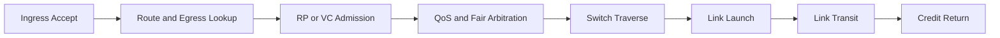

# Requirements and High-Level Specification: Flexible CHI Router Model for Ruby/Garnet

## Table of Contents

- [Problem Statement](#problem-statement)
- [Goals](#goals)
- [Non-Goals](#non-goals)
- [Terminology](#terminology)
- [Reality Anchors](#reality-anchors)
- [Requirements Summary](#requirements-summary)
- [High-Level Model](#high-level-model)
- [Parameter Schema](#parameter-schema)
- [Integration with Ruby and Garnet](#integration-with-ruby-and-garnet)
- [Validation and Acceptance](#validation-and-acceptance)
- [Failure Modes and Risks](#failure-modes-and-risks)
- [Open Questions](#open-questions)
- [Code and Spec Anchors](#code-and-spec-anchors)

## Problem Statement

gem5 already has a useful Ruby plus Garnet network model.
It can model topology, virtual networks, flits, credits, router latency, CDC, and width conversion well enough for many protocol and network studies.

That is not yet enough for a realistic CHI router model.
Real CHI fabrics do not behave like one generic wormhole router with a single flitization rule and a single round-robin scheduler.
They distinguish REQ, RSP, SNP, and DAT traffic classes.
They often use different buffering and arbitration rules per class.
They can separate REQ and SNP traffic into Resource Planes.
They use QoS and fairness policies that affect latency under contention.
They expose bandwidth behavior through channel width, subchannels, replicated interfaces, CDC boundaries, SerDes stages, and explicit credit timing.

Today gem5 CHI traffic is wired onto four Ruby virtual networks.
That is the right starting point.
However, the current Garnet router still sees traffic mostly as generic flits derived from Ruby message size and link width.
That abstraction is too coarse for questions such as:

- What happens if a vendor CHI NoC gives REQ and SNP independent Resource Planes with shared credits?
- What happens if DAT uses 512-bit channels while control traffic uses narrower or differently scheduled resources?
- What happens if QoS priority changes arbitration order but low-priority traffic must still make forward progress?
- What happens if a router adds one more internal arbitration stage, or if a CDC bridge adds two cycles only on one path?

This document defines the requirements and a high-level specification for a flexible CHI router model that remains compatible with Ruby and Garnet, but models CHI transport behavior much more faithfully.

## Goals

1. Model CHI transport behavior closely enough that bandwidth, contention, and latency trends match realistic RTL-style designs.
2. Preserve the existing Ruby network contract so CHI controllers, topology builders, and Garnet-based flows continue to work.
3. Represent CHI channel structure explicitly, rather than hiding it inside generic vnet and message-size heuristics.
4. Make per-hop latency a visible consequence of pipeline stages, arbitration, buffer occupancy, credits, and bridge delays.
5. Allow the model to match multiple vendor NoC styles through parameters, presets, and per-router or per-link overrides.
6. Keep the model useful for system studies by exposing detailed observability and by allowing optional features to be disabled when speed matters more than fidelity.

## Non-Goals

1. Rewriting the CHI protocol controllers or replacing the SLICC protocol state machines.
2. Modeling every CHI signal at full RTL waveform granularity.
3. Building a transistor-level or analog PHY model.
4. Replacing SimpleNetwork for all Ruby users.
5. Solving stdlib CHI integration in the first version.
   The first target is the existing Ruby plus CHI plus Garnet path.
6. Making the gem5 model bit-for-bit identical to any single vendor RTL.

## Terminology

This section defines the terms used in the rest of the document.
The goal is to make the requirements readable even if the reader has not worked on NoCs before.

### Generic and CHI Terms

- **Protocol node**
  A CHI endpoint or architectural agent such as a requester, a home node, or a memory node.
  A protocol node understands coherence rules and transaction meaning.
  A router is not usually a protocol node.
  A router moves traffic according to transport and scheduling rules.

- **Topology**
  The overall shape of the NoC, such as a mesh, ring, crossbar, or some custom graph.
  Topology determines which routers connect to which other routers and therefore affects hop count, congestion points, and scalability.

- **Router**
  A switching block inside the NoC.
  It receives traffic on input ports, decides which output port each unit of traffic should take, arbitrates among competing transfers, and forwards traffic to the next hop.
  A chip may have one router, many routers in a mesh, or some other arrangement.

- **Port, Link, and Channel**

  These three terms form a hierarchy that describes how CHI nodes communicate.

  A **channel** (B13.4) is a defined path over which flits of one traffic class are communicated.
  The four architectural channel classes are REQ, RSP, SNP, and DAT (B2.1).
  These are not merely labels.
  They represent different kinds of traffic with different dependency, progress, and buffering rules.
  REQ carries requests that start or advance transactions, such as reads and writes.
  RSP carries non-data responses such as completion or acceptance information.
  SNP carries snoop requests sent to caches or other coherent agents to check, invalidate, or supply data.
  DAT carries the actual data payload for transfers such as cache-line fills, write data, snoop data, or forwarded data.
  DAT usually consumes the most bandwidth because it moves the largest amount of information.

  A **link** (B13.1, B13.2) is a unidirectional connection from one Transmitter to one Receiver.
  Each link provides a set of channels for flit communication.
  Two-way communication between two nodes requires a pair of links: an outbound link and an inbound link.
  A link has finite bandwidth and nonzero latency, and link-layer credits apply hop by hop (B14.2).
  In an implementation, the internal NoC might realize this link using several routers and internal wires, but the architectural interface still exposes CHI channels and link-layer behavior.

  A **port** (B13.6) is the set of all links at the interface of a node.
  This is broader than a single router input or output pin group in a generic NoC discussion.
  A CHI port is the whole interface bundle through which that node sends and receives CHI traffic.

  The following diagram shows how these three concepts relate at the interface between a Request Node and the Interconnect.

  ```text
    CHI architectural interface: Request Node (RN) and Interconnect (ICN)

    Port (RN)                                                          Port (ICN)
    ┌──────────────┐                                                ┌──────────────┐
    │              │    Outbound link (RN transmits, ICN receives)  │              │
    │              │    ┌──────────────────────────────────┐        │              │
    │  TXREQ ──────┼───>│  REQ channel  (requests)         │───────>┼────── RXREQ  │
    │  TXDAT ──────┼───>│  DAT channel  (write data)       │───────>┼────── RXDAT  │
    │  TXRSP ──────┼───>│  RSP channel  (CompAck)          │───────>┼────── RXRSP  │
    │              │    └──────────────────────────────────┘        │              │
    │              │                                                │              │
    │              │    Inbound link (ICN transmits, RN receives)   │              │
    │              │    ┌──────────────────────────────────┐        │              │
    │  RXSNP <─────┼───<│  SNP channel  (snoops)           │<───────┼────── TXSNP  │
    │  RXRSP <─────┼───<│  RSP channel  (completions)      │<───────┼────── TXRSP  │
    │  RXDAT <─────┼───<│  DAT channel  (read data)        │<───────┼────── TXDAT  │
    │              │    └──────────────────────────────────┘        │              │
    └──────────────┘                                                └──────────────┘
  ```

  Each outer box is one port: the set of all links at that node's interface.
  The outbound link (RN→ICN) carries its own set of channels: REQ, DAT, and RSP.
  The inbound link (ICN→RN) carries a separate set of channels: SNP, RSP, and DAT.
  Which channels appear on each link depends on the node types at each end.
  For example, an RN-to-SN inbound link has no SNP channel.
  Internal NoC routers can implement these channels using a different internal microarchitecture, but the CHI interface presented to the protocol node must obey this architectural structure.

- **Hop**
  One traversal from a source endpoint to the next connected endpoint.
  For example, moving from Router A to Router B is one hop.
  A packet going from one cache to memory might cross several hops.

- **Transaction, Message, Packet, and Flit**

  These terms form a hierarchy that describes the units of communication in CHI, from the protocol level down to the transport level.

  A **transaction** (B1.3) is a complete coherence operation initiated by a single request.
  It comprises all the packets exchanged between the Requester, the Completer (Home or Subordinate), and any Snooped nodes to fulfill that request.
  A single transaction spans multiple channels and involves multiple packets.
  For example, a ReadShared transaction includes the initial REQ packet, possible SNP packets to other caches, their RSP or DAT responses, DAT packets carrying the cache line data, and a final CompAck RSP packet.
  A transaction is identified by `TxnID` at the Requester and `DBID` at the Completer.

  A **message** is one protocol communication step within a transaction flow.
  Examples include a request message, a snoop message, a non-data response message, or a data message.
  A message is carried on one channel, but it can comprise one or more packets.
  This is CHI protocol terminology, not the same thing as a gem5 Ruby `Message` object discussed later in this document.

  A **packet** (B1.1, B13.3) is the granule of transfer over the interconnect between endpoints.
  A protocol message can comprise one or more packets rather than exactly one packet.
  For example, a single data message can span multiple DAT packets.
  Each packet carries the control information needed for independent routing and delivery, such as source and destination IDs, and DAT packets also carry data payload.
  The number of DAT packets for a cache line transfer depends on `Data_Width` (B2.9, B16.1.13): a 64-byte line uses 4 packets at 128 bits, 2 at 256 bits, or 1 at 512 bits.

  A **flit** (flow control unit) is the basic unit of transfer in the Link layer (B13.3).
  Packets are formatted into flits for transmission across a link.
  CHI defines two kinds of flits.
  A **protocol flit** carries a protocol packet in its payload, and every protocol packet maps to exactly one protocol flit.
  A **link flit** carries link-maintenance traffic such as link-credit return messages during link deactivation.
  So, for protocol traffic at the CHI architectural interface, packet and protocol flit are in a 1:1 relationship, but not every flit represents a protocol packet.

  A **phit** (physical transfer unit) is one transfer between adjacent network devices (B1.1).
  In CHI, each flit comprises a single phit.

  ```text
    Transaction, Message, Packet, and Flit hierarchy

    Transaction (e.g., ReadClean, 64B line, Data_Width = 128 bits)
    ├── REQ message
    │   └── REQ packet -> protocol flit   ──  on REQ channel  (outbound link)
    ├── DAT message
    │   ├── DAT packet 0 -> protocol flit ──  on DAT channel  (inbound link)
    │   ├── DAT packet 1 -> protocol flit ──  on DAT channel  (inbound link)
    │   ├── DAT packet 2 -> protocol flit ──  on DAT channel  (inbound link)
    │   └── DAT packet 3 -> protocol flit ──  on DAT channel  (inbound link)
    └── RSP message
        └── RSP packet -> protocol flit   ──  on RSP channel  (outbound link, CompAck)

    Transaction      : Message        =  1 : N   (one transaction, multiple protocol steps)
    Message          : Packet         =  1 : N   (some messages are multi-packet)
    Protocol packet  : Protocol flit  =  1 : 1   (at the architectural interface)
    Flit             : Phit           =  1 : 1   (on a CHI link)
  ```

  The 1:1 mapping is part of the CHI architectural link abstraction, but it applies specifically to protocol packets mapped into protocol flits.
  CHI also defines link flits that do not carry protocol packets.
  If the gem5 model needs to represent extra serialization, gearbox stages, or SerDes effects inside an implementation, it should model those as explicit internal transport structures below the architectural CHI link, not by silently redefining CHI packets, flits, or phits.

- **Resource Plane, RP**
  A CHI architectural mechanism that provides independent forward progress guarantees on REQ and SNP channels (B14.2.1.2, B16.1.34–37).
  CHI defines RP0 through RP3 (2-bit encoding); the number actually used is implementation-defined, with RP0 as the default.
  RPs apply only to REQ and SNP, not to RSP and DAT.
  RSP and DAT do not need RPs because responses and data drain resources by completing transactions — they cannot cause circular resource dependency.
  The **Requester (RN)** assigns the RP value per transaction in the REQ flit.
  Snoops generated by the Home Node inherit the RP from the original request.
  The assignment policy is implementation-defined — CHI does not mandate which transactions use which RP.
  Typical strategies include separating CPU coherent traffic (RP0) from I/O or DMA traffic (RP1), or separating ordering domains.
  Each RP gets its own dedicated L-Credit pool on the link, so one RP's credit exhaustion cannot block another RP's traffic.
  Alternatively, credits can come from a shared pool with per-RP guarantees that one RP cannot starve another (B14.2.1.2).
  Transactions in different RPs have no ordering guarantees relative to each other — ordering constraints apply within an RP.
  The important idea is independence: traffic assigned to one RP must not be blocked by traffic in another RP on the same hop.
  An RP is an architectural concept visible at the CHI interface.
  It must not be confused with a virtual channel, which is a router-internal microarchitectural resource (see the architectural boundary section above).

- **Transport metadata**
  The fields carried with a packet that the router needs for routing, arbitration, ordering, or observability.
  Examples include source ID, target ID, QoS, RP, transaction ID, and data-packet position.
  The router does not need to understand the whole protocol state machine, but it does need enough metadata to schedule traffic correctly.

- **Ingress and egress**
  Ingress means the input side where traffic enters a router or interface.
  Egress means the output side where traffic leaves toward the next hop.
  Many resource and timing limits are different on the ingress and egress sides.

- **Buffer**
  Storage inside the NoC used to hold traffic temporarily while it waits for routing, arbitration, credits, or the next link.
  Buffers can be attached to inputs, outputs, or shared pools.
  Their size strongly affects burst absorption, backpressure, and area cost.

- **Flow control and L-Credits**
  Flow control is the mechanism that prevents a Transmitter from overwhelming a Receiver.
  CHI uses credit-based flow control at the link layer (B14.2).
  Each Receiver advertises a finite number of **L-Credits** (link-layer credits) to its Transmitter, tracked per channel class (REQ, RSP, SNP, DAT).
  Sending one flit on a channel consumes one credit.
  The Receiver returns a credit when it frees a buffer slot, signaling it can accept another flit.
  A returned credit cannot be used in the same cycle it arrives — there is a minimum one-cycle turnaround (B14.2).
  The Transmitter must not send a flit unless it holds at least one credit for that channel.
  This is strictly hop-by-hop: credits apply between each adjacent Transmitter-Receiver pair on a link, not end-to-end across the fabric.
  When Resource Planes are enabled, credits can be tracked per RP — either as dedicated pools per RP or as a shared pool with guarantees that one RP cannot starve another (B14.2.1.2).
  A key difference from generic NoC flow control is that CHI flow control reasons about flits, which are 1:1 with packets at the architectural interface.
  There is no multi-flit wormhole flow control at the CHI protocol level.

- **Backpressure**
  The effect of congestion propagating backward through the network.
  If one buffer fills, the upstream router eventually cannot send into it.
  That can stall earlier routers as well.
  Backpressure is the reason a hot spot in one part of the NoC can increase latency elsewhere.

- **Crossbar**
  The switching structure inside a router that connects selected inputs to selected outputs in a given cycle.
  You can think of it as the internal road intersection inside the router.
  Arbitration chooses who is allowed to use the intersection.

- **Arbitration**
  The decision process that chooses which of several waiting transfers gets access to a shared resource this cycle.
  Examples include deciding which input queue gets the crossbar or which channel gets a contested output port.
  Arbitration policy directly affects latency, fairness, and quality of service.

- **Scheduler**
  The logic that applies the arbitration policy over time.
  A scheduler can be round-robin, strict-priority, weighted, age-based, or some hybrid.
  In many discussions the terms scheduler and arbiter overlap.
  In this document, scheduler means the policy and mechanism that determines service order.

- **QoS, Quality of Service**
  A way to prioritize some traffic over other traffic under contention.
  In CHI, QoS is a priority value carried with the transaction and used by the fabric's arbitration and scheduling logic.
  A higher QoS value can let urgent traffic move earlier, but it does not relax protocol correctness, ordering rules, or the need to prevent starvation of lower-priority traffic.

- **Fairness**
  The property that traffic eventually receives service even when it is not the highest priority at every moment.
  Fairness is what prevents a low-priority stream from being blocked forever.
  In practice, real schedulers often combine priority with fairness or aging rules.

- **Head-of-line blocking**
  A queueing problem where an older blocked transfer at the front of a queue prevents a younger transferable item behind it from moving.
  This is one reason routers use separate queues or independent resources instead of one monolithic FIFO for everything.

- **Routing**
  The process of selecting the path a transfer takes through the topology.
  Routing can be as simple as table lookup or as complex as congestion-aware selection among multiple paths.
  Routing determines where traffic goes.
  Arbitration determines who gets to move this cycle.

- **Ordering**
  The rules that define when two transactions must be observed in a particular order.
  Some requests may be allowed to pass each other in the fabric.
  Others must not.
  In CHI, ordering constraints depend on fields such as `Order`, on transaction type, and on protocol rules such as completion acknowledgments.

- **Point of serialization or ordering, PoS**
  A place in the interconnect that effectively decides the order in which competing requests are observed for a given resource or address stream.
  The precise location can be implementation-specific.
  It matters because protocol ordering guarantees often depend on where the system stops treating two requests as independent races and starts treating one as earlier than the other.

- **Forward progress**
  The guarantee that the system eventually continues making progress instead of stalling forever.
  In NoC terms, this means the router and channel structure must not create deadlock, livelock, or starvation behaviors that prevent legal traffic from completing.

- **Deadlock**
  A situation where a set of transfers each waits for another one in a cycle, so none of them can move.
  For example, every router buffer might be waiting for space downstream while the downstream buffers are waiting on the first ones.
  A realistic model has to capture deadlock risks, but it must not introduce deadlocks that the intended CHI resource structure would have prevented.

- **Livelock**
  A situation where traffic keeps moving or being reconsidered but never actually reaches completion.
  Unlike deadlock, the system is active, but useful progress does not happen for the affected transfer.

- **Bandwidth**
  The rate at which the NoC can carry traffic.
  This is not just a property of one wire width.
  It also depends on channel partitioning, arbitration, buffering, subchannels, and how much of the path is busy with competing traffic.

- **Latency**
  The time it takes for a transfer to travel from source to destination.
  NoC latency usually includes waiting time in buffers, arbitration delay, router pipeline delay, link traversal delay, and sometimes CDC or SerDes penalties.
  A near-cycle-accurate router model must represent these contributors explicitly.

- **Throughput**
  The sustained rate at which useful traffic completes over time.
  A design may have low latency at light load but poor throughput near saturation, or the reverse.
  Both matter when comparing NoC designs.

- **Subchannel**
  A subchannel is one of several parallel instances of the same channel class on a single link, introduced in CHI Issue E (B13.7).
  Each subchannel carries the same traffic class (e.g., DAT) and has its own independent L-Credit pool and flow control.
  Subchannels allow selective bandwidth scaling: a fabric can widen only the channels that are bottlenecked (e.g., add a second DAT subchannel for data-heavy workloads) without duplicating the entire port or link infrastructure.
  The link layer makes no ordering guarantee between flits on different subchannels of the same channel — protocol-level ordering (via TxnID, ordering fields, etc.) still applies above the link layer.
  Because each subchannel has independent credits, a stall on one subchannel does not block the others, reducing head-of-line blocking compared to widening a single channel.
  This is different from simply having two links, which would duplicate all channels (REQ, RSP, SNP, DAT) rather than selectively scaling one.

- **Serialization**
  The process of sending a larger logical transfer over a narrower physical path in several smaller pieces over time.
  Serialization increases latency and can create additional contention.
  In this document, serialization should be modeled only when the implementation really has such a boundary.

- **CDC, clock-domain crossing**
  A boundary where the sender and receiver do not share the same clock timing.
  Crossing such a boundary usually requires extra buffering or handshake logic and therefore adds latency.
  Real SoCs often have CDC points between clusters or between the NoC and some agents.

- **SerDes, serializer-deserializer**
  Logic that converts between wider internal data paths and narrower physical link transfers, or the reverse.
  A SerDes boundary is one common place where serialization latency appears in a fabric.

### CHI Architectural Boundary: What CHI Defines and What It Does Not

CHI defines a signal-level interface at the boundary between protocol nodes (RN, HN, SN) and the Interconnect (ICN).
This interface specifies flits, channels, L-Credits, and link activation/deactivation signals (e.g., `TXREQFLITV`, `TXREQFLIT[...]`, `TXREQLCRDV`, `TXLINKACTIVEREQ`).
Everything at this boundary is architecturally defined and must obey the CHI link-layer rules.

However, CHI deliberately says nothing about what happens **inside** the ICN.
The links between routers within the fabric are not CHI interfaces.
They are internal, proprietary, and implementation-defined.

```text
  CHI architectural scope

  CHI-defined          Not defined by CHI              CHI-defined
  interface            (internal to ICN)               interface
      │                        │                           │
  RN ───── ICN boundary ── [ router ─── router ─── router ] ── ICN boundary ── SN
      │                        │                           │
  L-Credits per          Designer's choice:             L-Credits per
  channel / RP           per-VC credits,                channel / RP
  CHI flit signals       wormhole flow control,         CHI flit signals
  link activation        custom internal protocol       link activation
```

This distinction has several important consequences for the gem5 CHI router model:

1. **L-Credits vs internal credits.**
   CHI L-Credits are tracked per channel class and optionally per Resource Plane at the node-to-ICN interface.
   Inside the fabric, the router designer is free to use per-VC credits, wormhole credits, or any other internal flow-control mechanism.
   These are two separate credit systems at two different levels.

2. **Virtual channels are invisible to CHI.**
   VCs are a router-internal microarchitectural technique for routing deadlock freedom and head-of-line blocking reduction.
   CHI has no concept of VCs and no per-VC credit signaling at its architectural interface.
   A router may use VCs internally, but the CHI interface only exposes channel-level and RP-level credits.

3. **Resource Planes vs virtual channels.**
   RPs and VCs solve different problems at different abstraction levels and they compose rather than substitute.
   RPs guarantee protocol-level forward progress between traffic classes (architectural, visible at the CHI interface).
   VCs provide routing-level deadlock freedom within the fabric (microarchitectural, invisible to CHI).
   A CHI router may need VCs **within** each RP — for example, 2 RPs × 2 VCs = 4 independent buffer pools on the REQ channel.

4. **Router microarchitecture is unconstrained.**
   CHI does not define internal buffering strategy, arbitration policy, pipeline stages, or crossbar structure.
   It only constrains the external behavior: the right flits must arrive at the right destination, credits must be respected, and ordering and forward-progress rules must hold.
   This is why the gem5 CHI router model has design freedom — CHI constrains the interface, not the implementation.

Real CHI interconnects such as ARM's CMN-700 have internal router-to-router links with their own proprietary microarchitecture, but expose standard CHI at the external ports.
The gem5 model should follow the same principle: implement CHI L-Credits and channel semantics at the node-facing interfaces, while using Garnet's existing VC and internal credit machinery for router-to-router transport inside the fabric.

### gem5-Specific Terms

- **Ruby**
  gem5's detailed memory-system framework for coherence protocols.
  Ruby models controllers, protocol messages, message buffers, and the interconnect that moves those messages.
  In this document, Ruby is the protocol and controller side of the system.

- **Garnet**
  gem5's detailed NoC model used by Ruby.
  Garnet models routers, links, credits, virtual channels, and network interfaces.
  In this document, Garnet is the transport substrate that a CHI-aware router model will extend rather than replace.
  Garnet's native terminology is built around **flits** and **flitization**.
  That is a Garnet implementation term, not a CHI architectural term.
  The current router pipeline is expressed through concrete Garnet blocks: `InputUnit -> SwitchAllocator -> CrossbarSwitch -> NetworkLink`, with `CreditLink` carrying backward flow control.

- **Terminology bridge: Ruby message, Garnet packet, CHI packet, Garnet flit**
  These layers use similar words for different abstraction levels.
  In Ruby, a **message** is the controller-level protocol object.
  In Garnet today, a **packet** is an implicit transport grouping rather than a separate C++ class.
  One Garnet packet is the set of flits created together with one `packet_id`, one route, one vnet, and one Ruby message pointer.
  In CHI, a protocol **message** can span one or more **packets**.
  At the CHI architectural interface, each protocol packet maps to exactly one protocol flit.
  In Garnet, the network interface performs **flitization**, meaning it converts an injected object into the flits that the router and link model schedule.
  For the CHI-aware model in this document, the intended mapping is: Ruby message -> one or more CHI packets -> one or more Garnet flits, with a 1:1 mapping between CHI protocol packet and Garnet transport flit.
  So for protocol traffic, CHI packet and Garnet flit are effectively equivalent scheduling units, but they are not the same term conceptually.
  Native Garnet is coarser: it packetizes a Ruby message directly into a width-dependent number of flits, without a separate CHI packet layer.

- **Message**
  In gem5 Ruby, a message is the protocol-level object created by a controller and placed into message buffers.
  It captures the coherence meaning of the transfer, such as request, response, snoop, or data.
  In the CHI-aware path, the network interface packetizes this Ruby-level object into one or more CHI packets, then presents those packets to Garnet as flits for scheduling.

- **Network interface, NI**
  In Garnet, the network interface is the boundary block between Ruby controllers and the NoC.
  On injection, it packetizes Ruby messages and flitizes the resulting transport units.
  On ejection, it reconstructs or delivers the received traffic back into the destination-side Ruby buffers.

- **Virtual network, vnet**
  Ruby and Garnet's top-level traffic partitioning mechanism.
  Different vnets are used to separate broad classes of traffic so they do not all sit in the same queues.
  In gem5 CHI today, the four vnets correspond to `req`, `snp`, `rsp`, and `dat`.
  A vnet is a gem5 transport partition.
  It is not exactly the same thing as a CHI Resource Plane.
  A CHI-aware implementation may internally expand one controller-facing vnet into several transport classes, such as `REQ-RP0` and `REQ-RP1`, without changing the external four-vnet contract.

- **Virtual channel, VC**
  A Garnet router-internal queueing resource that lets multiple independent streams share one physical link without sitting in one single FIFO.
  VCs are commonly used to reduce head-of-line blocking and to prevent deadlock.
  A VC is an implementation technique inside the router.
  It is not automatically visible at the CHI architectural level.
  In current Garnet, a head flit allocates a downstream VC, body and tail flits consume credits in that VC, and the tail returns a free signal that releases the VC.

- **Garnet packet (implicit)**
  Garnet does not define a separate `Packet` transport class in the router code.
  Instead, a packet is represented implicitly as the set of flits created together by the network interface.
  A CHI-aware model will likely need to make packet boundaries explicit rather than leaving them as a side effect of flitization.

- **Flit types**
  Garnet distinguishes `HEAD_`, `BODY_`, `TAIL_`, `HEAD_TAIL_`, and `CREDIT_` flits.
  Head flits carry the routing decision point and trigger downstream VC allocation.
  Tail flits release the input VC and can mark the VC free to the upstream router.
  `HEAD_TAIL_` means a one-flit packet.
  `CREDIT_` is a flow-control object, not a protocol data transfer.

- **Flit stage**
  Garnet tags each flit with a pipeline stage and the earliest cycle when that stage is valid.
  The stage names are `I_` (injected or initial), `VA_`, `SA_` (switch allocation), `ST_` (switch traversal), and `LT_` (link traversal).
  In the current Garnet3 router path, the important progression is `I_ -> SA_ -> ST_ -> LT_`.
  `VA_` remains in the enum, but VC allocation is folded into `SwitchAllocator` rather than modeled as a separate router stage.

- **Flitization**
  In Garnet, the network interface converts one Ruby message into one or more flits.
  The current flit count is derived from Ruby message size and output-link bit width.
  For multicast Ruby messages, the NI first clones the message into per-destination unicast injections and then flitizes each copy.
  This is one of the main places where today's Garnet behavior is coarser than CHI packetization.

- **InputUnit**
  The ingress-side router block.
  It consumes an arriving flit from an incoming `NetworkLink`, performs route computation for `HEAD_` or `HEAD_TAIL_` flits, stores the flit in an input VC, and makes it eligible for switch allocation after the configured router delay.

- **OutputUnit**
  The egress-side router block.
  It tracks downstream VC state and credit count, launches flits onto the outgoing `NetworkLink`, and consumes returning credits from the downstream router.

- **SwitchAllocator**
  The Garnet router block that performs arbitration.
  In the current model, it also performs downstream VC allocation for head flits, so Garnet does not have a separate VC allocator object in the router pipeline.

- **SA-I and SA-II**
  Garnet's `SwitchAllocator` uses a two-pass separable allocation scheme.
  `SA-I` selects one candidate input VC per input port.
  `SA-II` selects one winning input request per output port, performs output-VC allocation for head flits, decrements downstream credit, and hands the flit to the crossbar.

- **Output VC, outvc**
  Garnet uses `outvc` to mean the downstream virtual channel assigned to a packet after switch allocation.
  For a multi-flit packet, the head establishes the `outvc`, and the following body and tail flits continue using that same downstream VC.
  This is a Garnet router-internal resource, not a CHI architectural construct.

- **OutVcState**
  The per-output-VC state tracked by an `OutputUnit` and by the NI egress side.
  It records whether the downstream VC is idle or active and how many credits remain.
  When Garnet code checks `has_credit` or `has_free_vc`, this is the state object behind that decision.

- **Garnet credit**
  A Garnet credit is the backward-flow-control object used by the router and NI microarchitecture.
  It is modeled as a special `CREDIT_` flit and can carry an `is_free_signal` bit telling the upstream side that a VC became idle.
  This must not be confused with a CHI architectural `L-Credit`.
  A CHI-aware model may map CHI-facing credit behavior onto Garnet internals, but the two terms refer to different abstraction levels.

- **CreditLink**
  The backward link that carries Garnet credits.
  A `NetworkLink` carries forward flits.
  A `CreditLink` carries reverse flow-control information.
  This pair is Garnet's internal hop-by-hop flow-control structure.

- **RoutingUnit**
  The router submodule that computes the output port for a flit.
  It supports table-based routing by default, optional XY routing, and a placeholder for custom routing.
  This is the natural integration point for a CHI-aware routing extension that still wants to reuse Garnet topology and direction machinery.

- **RouteInfo**
  The routing metadata already carried by each Garnet flit.
  It includes fields such as `vnet`, `net_dest`, `src_ni`, `src_router`, `dest_ni`, `dest_router`, and `hops_traversed`.
  This is the closest existing Garnet structure to a transport-metadata header.
  A CHI-aware model will likely need to extend it with CHI-specific scheduling metadata.

- **Port direction, inport, and outport**
  Garnet routing is expressed in terms of named port directions such as `Local`, `East`, `West`, `North`, and `South`, plus concrete input-port and output-port indices.
  Routing chooses an output port.
  Switch allocation decides which input gets to use that chosen output this cycle.

- **Ordered vnet**
  Garnet can mark a virtual network as ordered.
  For an ordered vnet, the NI and router arbitration logic avoid sending a younger flit ahead of an older flit that targets the same path.
  CHI-aware transport modeling will need to preserve such ordering constraints deliberately rather than assuming all vnets are interchangeable.

- **Supported vnets**
  Garnet links and outport directions can be shared by all vnets or restricted to a specified subset through `supported_vnets`.
  This is Garnet's current mechanism for expressing dedicated versus shared transport resources at the link and port level.

- **CrossbarSwitch**
  The router block that performs switch traversal after allocation.
  It takes the winning flit selected by `SwitchAllocator`, advances it to link traversal, and inserts it into the chosen output link queue.

- **flitBuffer**
  The small queue abstraction used throughout Garnet.
  Input VCs, output queues, switch buffers, NI queues, and link buffers are all built from `flitBuffer` objects.
  When this document discusses explicit buffering inside Garnet, this is the basic storage primitive that the source code uses today.

- **GarnetIntLink and GarnetExtLink**
  `GarnetIntLink` is the router-to-router link object.
  `GarnetExtLink` is the NI-to-router link object.
  External links are bidirectional bundles built from two forward links and two credit links, one pair per direction.
  This distinction is useful when discussing where CHI architectural interfaces end and proprietary inter-router transport begins.

- **NetworkBridge**
  Garnet's CDC and SerDes block.
  It sits between a link and a router or NI object when the model needs clock-domain crossing, serialization, deserialization, or width adaptation.
  This is the existing Garnet mechanism that a CHI-aware model should reuse for CDC and width-conversion timing rather than inventing a separate abstraction.

- **Control vnet and data vnet types**
  Garnet internally distinguishes control and data virtual-network types.
  That distinction is used for buffer provisioning, with data vnets typically getting deeper buffering than control vnets.
  This helps explain why today's Garnet already treats `dat` differently from `req`, `snp`, and `rsp`, even before any CHI-specific router enhancement.


## Requirements Summary

| ID | Requirement | Priority |
|---|---|---|
| R1 | Preserve the Ruby network API and existing CHI controller wiring. | Must |
| R2 | Model REQ, RSP, SNP, and DAT as first-class channel classes with independent resources. | Must |
| R3 | Model REQ and SNP Resource Planes explicitly, including dedicated or shared credit options. | Must |
| R4 | Represent one CHI packet as one transport unit in the router model, with explicit DAT packet count from `Data_Width`. | Must |
| R5 | Use explicit router and link pipeline stages, with per-stage latency and contention. | Must |
| R6 | Model hop-by-hop credit timing accurately enough to capture backpressure and credit turnaround effects. | Must |
| R7 | Support configurable QoS, fairness, and starvation-prevention policies. | Must |
| R8 | Support per-channel bandwidth, optional subchannels, and explicit CDC or SerDes boundaries. | Must |
| R9 | Preserve CHI ordering and forward-progress assumptions that depend on channel separation and RP stability. | Must |
| R10 | Expose rich stats, tracing, and debug hooks suitable for protocol and NoC studies. | Must |
| R11 | Provide a parameter schema that can express different vendor-style CHI NoCs without code changes. | Must |
| R12 | Provide backward-compatible defaults and simple shorthands so existing Garnet users can migrate incrementally. | Should |
| R13 | Support optional advanced features such as DAT reordering, critical-chunk-first, link power states, and integrity metadata adaptation. | Should |
| R14 | Keep a practical performance envelope by allowing optional fidelity knobs to be disabled. | Should |

## High-Level Model

### 1. Conceptual View

The model should remain a Ruby network and should still plug into Garnet-style topology construction.
However, the router core should become CHI-aware.

The key design rule is simple.
The CHI architectural transport unit is the packet.
The gem5 router model should therefore normalize Ruby messages into CHI transport packets before arbitration and link traversal.

For control traffic, that usually means one Ruby message becomes one CHI packet.
For data traffic, one Ruby message can become multiple DAT packets, with packet count derived from `Data_Width` and the transfer semantics.
For a 64-byte cache line, the default counts are 4 packets at 128 bits, 2 packets at 256 bits, and 1 packet at 512 bits.

If an implementation models narrower internal links or wider replicated links, that behavior must appear as an explicit internal bridge, serialization stage, or subchannel structure.
It must not silently redefine the CHI packet itself.

### 2. Router Pipeline

The router should use an explicit stage model.
The exact stage breakdown is configurable, but the following conceptual pipeline should exist.



Each stage must have two visible properties.
It must have a configurable latency.
It must have a configurable contention point or capacity limit where relevant.

The model does not need to force one fixed vendor microarchitecture.
Some vendors fold route computation into ingress.
Some separate VC admission from switch arbitration.
Some use dedicated schedulers per channel.
The model must be able to represent these choices by parameterization rather than by separate hardcoded router implementations.

### 3. Transport Metadata

Each transport unit injected into the router must carry enough metadata to preserve CHI-relevant behavior.
The minimum useful set is:

- Channel class: `REQ`, `RSP`, `SNP`, or `DAT`.
- Resource Plane identifier for REQ and SNP when enabled.
- `SrcID` and `TgtID`.
- `TxnID`.
- QoS.
- Ordering-relevant fields such as `Order` and `ExpCompAck` when present.
- Retry-related fields such as `AllowRetry` and `PCrdType` when relevant at injection.
- DAT packet fields such as `DataID` and `CCID`.
- Optional integrity or error state such as Poison or DataCheck when modeled.
- Trace identity so flit or packet events can still be correlated with the originating request.

The router does not need to implement the whole CHI protocol state machine.
It does need to preserve and schedule transport metadata so that ordering, contention, and endpoint progress are modeled plausibly.

### 4. Channel and Resource Structure

REQ, RSP, SNP, and DAT must be first-class channel classes in the router.
They may share physical resources in some implementations, but the model must not assume they always do.

REQ and SNP must additionally support Resource Planes.
The model must let users choose how many RPs exist, whether credits are dedicated or shared, and whether each RP has distinct buffers and schedulers.
Different RPs must not block one another in a way that violates the CHI requirement for RP independence on a hop.

RSP and DAT do not use CHI RPs.
They may still use internal VCs or queue classes for implementation reasons.
Those internal VCs are a router microarchitectural resource, not a CHI architectural concept.

This terminology must stay consistent throughout the implementation.
An RP is a CHI concept.
A VC is an internal router concept.

### 5. Mapping CHI Classes to Vnets, VCs, and Links

The model should make the mapping chain explicit rather than leaving it implicit in Garnet internals.
The clean decomposition is:

1. **Controller-facing Ruby vnets.**
   The external compatibility contract remains `req`, `snp`, `rsp`, and `dat`.
   Existing CHI controllers and SLICC protocol files should continue to see those four vnets.
2. **Internal transport classes.**
   Inside the network interface or at router admission, those four controller-facing classes may be expanded into a finer transport partition.
   In the common CHI-aware case, that means `REQ-RP0`, `REQ-RP1`, `SNP-RP0`, `SNP-RP1`, `RSP`, and `DAT`.
   This is where CHI channel class and RP semantics are preserved.
3. **VC sets within each transport class.**
   VCs remain a router-internal mechanism for deadlock freedom and head-of-line blocking reduction.
   They should not be overloaded to represent CHI channels or RPs.
4. **Physical links or subchannels.**
   Each output direction may provide one or more physical link instances or subchannels.
   A transport class may have one dedicated link, may share a link with other classes, or may be eligible for several parallel links.

The intended mapping is therefore:

```text
controller vnet -> transport class -> VC -> eligible physical link set
```

For example, a CHI-aware configuration might keep the external four-vnet Ruby contract while using the following internal transport classes:

```text
req -> {REQ-RP0, REQ-RP1}
snp -> {SNP-RP0, SNP-RP1}
rsp -> {RSP}
dat -> {DAT}
```

This separation matters because each layer serves a different purpose.
The controller-facing vnet preserves compatibility with existing Ruby and CHI code.
The transport class preserves CHI channel and RP semantics.
The VC provides router-internal queueing and deadlock freedom.
The physical link determines actual bandwidth and contention.

The model should also make link sharing explicit.
If two transport classes map to the same eligible physical link set, they contend at the output scheduler and share bandwidth.
If they map to disjoint physical links, they are bandwidth-independent at that hop.
The topology builder should still decide how many physical links exist between two routers.
The router-level mapping parameters should decide which transport classes or VCs are eligible to use those already-instantiated links.

The default mapping granularity should be the transport class rather than the individual VC.
That keeps the common case simple.
However, the schema should also allow an optional per-VC override for vendor-style microarchitectures that pin different VCs of the same transport class to different physical links.

### 6. Routing Model

The model must support standard shortest-path or table routing like today's Garnet, because existing topologies depend on it.
It must also provide CHI-specific routing hooks where the current model is too generic.

At minimum, the routing layer must support:

- Request routing by `TgtID`.
- Response routing using return metadata carried by the packet.
- Snoop routing through a configurable interconnect policy or table, because CHI snoops are not simply a `TgtID` lookup.
- Optional `TgtID` remapping inside the fabric.
- Compatibility with `src_outport`, `dst_inport`, and existing topology builders.

The routing model does not need to implement a fully adaptive NoC in the first version.
It should, however, keep the door open for vendor-style deterministic or congestion-aware policies later.

### 7. Bandwidth Model

Bandwidth must be modeled per channel class, not only per router as a whole.
The following capabilities are required.

- Per-channel width or throughput configuration for REQ, RSP, SNP, and DAT.
- Optional per-port overrides for asymmetric fabrics.
- Optional channel replication or subchannels, especially for DAT and other vendor bandwidth scaling patterns.
- A clear distinction between protocol packet count and internal bandwidth adaptation.

The current global `link_width_bits` model is useful as a shorthand.
It is not sufficient as the only abstraction for a CHI router.

### 8. Credit and Buffer Model

The router and links must use an explicit hop-by-hop credit model.
The following behaviors are required.

- Credit counts must be tracked per channel class and, where applicable, per RP or subchannel.
- A returned credit cannot be consumed in the same cycle it arrives.
- Buffer availability and backpressure must drive latency under contention.
- The model must support both dedicated and shared credit pools for REQ and SNP when configured.
- The model must support finite ingress and egress buffering, rather than relying only on an abstract credit count with no observable structure.

The exact internal buffer topology may be implementation-defined.
For example, a vendor may use input queues, output queues, shared pools, or elastic staging buffers.
The parameter schema must be able to represent these choices without requiring a new router code path for each one.

### 9. QoS and Fairness Model

QoS is not optional for a realistic CHI router model.
The router must accept a 4-bit QoS value and apply it in arbitration.

At the same time, the model must preserve forward progress.
It must therefore support at least one fairness mechanism such as age-based arbitration, deficit counters, or starvation thresholds.
The user must be able to choose whether arbitration is strict-priority, weighted, aging-assisted, or round-robin within a QoS bucket.

The model must report when QoS affects outcomes.
For example, stats should distinguish pure bandwidth saturation from QoS-induced delay.

### 10. Ordering and Progress Constraints

The router must preserve the transport assumptions that the CHI protocol relies on.
This is one of the most important correctness requirements.

Specifically:

- Same-agent ordered REQ streams that rely on `Order` must remain on the same REQ RP.
- The transport model must not silently migrate such traffic between RPs.
- Cross-channel coupling must not create artificial deadlocks that violate CHI forward-progress expectations.
- REQ and SNP RP separation must be strong enough that blocking in one RP does not incorrectly stall another RP on the same hop.
- The model must be able to represent retry-related traffic patterns without requiring the router itself to become a protocol node.

The router does not need to own P-credit allocation logic.
That remains an endpoint concern.
However, the router must preserve the metadata and channel structure that make retry behavior meaningful in system-level timing.

### 11. Bridges, CDC, and Heterogeneous Fabrics

The model must support realistic heterogeneity.
This includes:

- Clock-domain crossings.
- Serializer and deserializer latency.
- Width conversion.
- Optional interface replication or subchannel replication.
- Optional link activation and deactivation behavior.

gem5 already has `NetworkBridge` support for CDC and SerDes.
The CHI router model should reuse that direction rather than inventing a separate incompatible mechanism.

For the first useful version, link power-state behavior and `FLITPEND` may be optional.
If they are modeled, they must appear as explicit timing states and not as invisible penalties.

## Parameter Schema

The parameter schema should extend `configs/ruby/CHI_config.py` and remain compatible with current `configs/network/Network.py` shorthands.
Every parameter must have a global default and should optionally support per-router, per-link, or per-port override.

| Parameter | Meaning | Notes |
|---|---|---|
| `vendor_profile` | Named preset for a vendor-style NoC. | Optional convenience layer. |
| `channel_width_bits.{req,rsp,snp,dat}` | Width or throughput model per channel class. | Replaces one global width as the primary abstraction. |
| `subchannels.{req,rsp,snp,dat}` | Number of replicated subchannels per channel class. | Needed for bandwidth scaling without inventing new packet types. |
| `transport_partition` | Internal transport partition derived from the external four-vnet contract. | Examples: `channel_only`, `channel_x_rp`. |
| `transport_class_map` | Mapping from controller-facing vnets to internal transport classes. | Default should preserve external `req/snp/rsp/dat` while allowing internal `REQ-RP0`, `REQ-RP1`, and so on. |
| `req_rps` | Number of REQ Resource Planes. | Required for CHI-style REQ separation. |
| `snp_rps` | Number of SNP Resource Planes. | Required for CHI-style SNP separation. |
| `rp_selection_policy.{req,snp}` | How a flow is assigned to an RP. | Must support sticky mapping for ordered traffic. |
| `shared_credits_req` | Whether REQ RPs can draw from a shared credit pool. | Must still preserve RP independence. |
| `shared_credits_snp` | Whether SNP RPs can draw from a shared credit pool. | Same rule as above. |
| `vcs_per_transport_class` | Internal VC count per transport class. | VC is internal, not architectural. |
| `buffer_model` | Buffer topology model. | Examples: input-queued, output-queued, shared-pool, elastic-stage. |
| `buffer_depth_flits` | Buffer depth per class, RP, or port. | Must support finite structures. |
| `resource_share_groups` | Which transport classes share arbiters, buffers, or crossbar slices. | Makes shared versus isolated router resources explicit. |
| `link_groups` | Named physical link groups or subchannel groups per output direction. | Groups should refer to already-instantiated local links, not create new topology edges. |
| `transport_to_link_group` | Eligible physical link group or groups for each transport class. | Primary parameter for dedicated versus shared bandwidth mapping. |
| `vc_link_map` | Optional per-VC override for physical-link eligibility. | Default should inherit the transport-class mapping. |
| `link_select_policy` | How a transport class or VC chooses among eligible physical links. | Examples: dedicated, round-robin, sticky-hash, least-loaded. |
| `stage_latency` | Per-stage latency dictionary. | Covers ingress, route, admission, arbitration, switch, link, bridge, and credit return. |
| `scheduler_policy` | Arbitration policy. | Examples: strict priority, weighted, round-robin, aging-assisted. |
| `fairness_policy` | Anti-starvation policy. | Required when QoS is enabled. |
| `routing_policy` | Request and response routing choice. | Must preserve existing Garnet compatibility. |
| `snoop_routing_policy` | Interconnect snoop-target selection. | CHI-specific extension point. |
| `dat_width_bits` | CHI `Data_Width` at the interface. | Determines DAT packet count for a cache line. |
| `allow_dat_reordering` | Whether DAT packets from one transfer may reorder in the fabric. | Optional advanced behavior. |
| `critical_chunk_first` | Whether the critical chunk is prioritized. | Optional but useful for realism. |
| `ccf_wrap_order` | Whether wrap ordering is guaranteed when critical-chunk-first is used. | Optional advanced behavior. |
| `cdc_latency` | CDC penalty by boundary. | Can reuse bridge machinery. |
| `serdes_latency` | SerDes penalty by boundary. | Can reuse bridge machinery. |
| `link_state_model` | Whether STOP, ACTIVATE, RUN, and DEACTIVATE are modeled. | Optional advanced behavior. |
| `integrity_mode` | Poison or DataCheck support and adaptation policy. | Optional advanced behavior. |

The model should also preserve simple migration paths from today's Garnet options.

- `--router-latency` should map to a default stage profile when detailed stage latency is not specified.
- `--link-latency` should still set the base link traversal latency.
- `--link-width-bits` should still populate all channel widths when no per-channel widths are provided.
- `--vcs-per-vnet` should still map to sensible per-transport-class VC defaults after any internal RP expansion.

## Integration with Ruby and Garnet

### 1. Required Compatibility

The first version must preserve the existing Ruby network contract.
That includes the `Network` base semantics, controller-side message buffers, functional read and write paths, and the topology-builder flow through `BasicRouter`, `BasicIntLink`, and `BasicExtLink`.

The existing CHI mapping must remain valid.
The controller-facing virtual networks must stay:

- `0 = req`
- `1 = snp`
- `2 = rsp`
- `3 = dat`

This matters because `configs/ruby/CHI.py`, `configs/ruby/CHI_config.py`, and the CHI SLICC protocol files already depend on that wiring.

### 2. Recommended Injection Path

The cleanest integration path is:

1. Ruby or CHI controllers still inject through the existing network interface path.
2. The network interface converts each Ruby message into one or more CHI transport packets.
3. The network interface or router admission path maps those packets onto internal transport classes such as `REQ-RP0`, `REQ-RP1`, `SNP-RP0`, `SNP-RP1`, `RSP`, and `DAT`.
4. The router schedules those transport packets using CHI-aware resources.
5. The destination network interface reassembles packet groups back into the existing Ruby message delivery semantics.

This keeps CHI protocol controllers stable while making the transport model much more faithful.

### 3. Current gem5 Behavior That Should Change

The following current behaviors are useful as compatibility anchors but are too coarse to remain the final CHI model.

- Generic flit count based only on Ruby message size and one output width.
- One generic router latency parameter standing in for most internal pipeline behavior.
- Round-robin arbitration with no real QoS model.
- Coarse control-data buffering split that gives CHI `dat` special depth but treats `req`, `snp`, and `rsp` as one control class.

### 4. Current gem5 Behavior That Should Be Preserved

- Existing topology files and routing-table infrastructure.
- Existing trace and stats hooks where possible.
- Existing `NetworkBridge` style CDC and width-conversion integration.
- Existing Garnet synthetic traffic and Ruby regression harnesses.

## Validation and Acceptance

The model is only useful if its detailed behavior is testable.
Validation must therefore be part of the specification, not an afterthought.

| Check | Purpose | Minimum expectation |
|---|---|---|
| Single-hop stage timing test | Verify each configured pipeline stage contributes visible latency. | End-to-end hop latency matches the configured stage sum plus contention. |
| Credit turnaround test | Verify that returned credits are not reusable in the same cycle. | One-cycle credit reuse delay is visible. |
| RP independence test | Verify REQ or SNP blocking in one RP does not incorrectly stall another RP. | Traffic on a free RP continues to make progress. |
| DAT width test | Verify `Data_Width` changes packet count. | A 64-byte line uses 4, 2, or 1 DAT packets at 128, 256, or 512 bits. |
| QoS fairness test | Verify high QoS wins under contention but low QoS still progresses. | Priority affects latency, but starvation does not occur. |
| CDC or SerDes test | Verify heterogeneity is modeled explicitly. | Added bridge latency appears only on configured paths. |
| Protocol regression | Verify transport changes do not break CHI correctness. | Existing CHI protocol tests still pass. |
| Synthetic saturation study | Verify bandwidth trends under load. | Latency-throughput curves respond plausibly to width, RP, and scheduler changes. |

The existing repository already contains useful starting points.

- `configs/example/garnet_synth_traffic.py`
- `configs/example/rbook_mesh_config.py`
- `configs/example/noc_config/rbook_4x4.py`
- `tests/gem5/chi_protocol/configs/chi-with-isa.py`
- `tests/gem5/memory/test.py`

When available, the model should also be calibrated against either vendor RTL measurements or public latency and throughput disclosures.
The goal is not exact lockstep.
The goal is to keep the gem5 model on the same side of the major tradeoffs.

## Failure Modes and Risks

1. The model stays too generic.
   If REQ, RSP, SNP, and DAT still collapse into one generic scheduler, the result will look like a renamed Garnet router instead of a CHI router.
2. The model overfits one implementation.
   If the stage structure or buffer layout is hardcoded to a single vendor style, the model stops being useful as a flexible research tool.
3. DAT packetization remains tied to Ruby message size only.
   If that happens, bandwidth and latency results will be wrong for the most important CHI data-path studies.
4. RP independence is implemented weakly.
   If one RP can block another through a hidden shared queue, the model can create invalid deadlock or head-of-line behavior.
5. QoS is added without fairness.
   That would make latency look realistic for a benchmark trace while breaking forward progress under sustained load.
6. Detailed modeling becomes too slow.
   If every optional feature is always on, the model will be hard to use for full-system experiments.
7. Backward compatibility is broken.
   If existing CHI and Garnet flows stop working, adoption cost will be too high.

## Open Questions

1. Should the implementation be a new CHI-specialized router type, or a CHI mode inside the existing Garnet router classes?
2. How much of Request Retry awareness should live in the network interface versus the router core?
3. Should replicated subchannels be part of the first useful version, or a second phase after per-channel widths and RP support land?
4. Should link power states and `FLITPEND` be modeled in the first version, or only after the main timing and bandwidth model is stable?
5. How much calibration data from real CHI fabrics is realistically available for validation on this branch?

## Code and Spec Anchors

### CHI Specification Sections

- B2.1 Channels overview.
- B2.7 Ordering.
- B2.9 Data transfer.
- B2.10 Request Retry.
- B11.1 Quality of Service.
- B13.3 Flit.
- B13.4 Channel.
- B13.7 Increasing inter-port bandwidth.
- B13.11 Link layer Credit Return.
- B14.2 Link layer Credit.
- B14.2.1.2 Flow control with Resource Planes.
- B14.5 Interface activation and deactivation.
- B16.1.13 Data_Width.
- B16.1.34 through B16.1.37 Resource Plane and shared-credit properties.

### gem5 Code Anchors

- `src/mem/ruby/network/garnet/README.txt`
- `src/mem/ruby/network/garnet/Router.cc`
- `src/mem/ruby/network/garnet/InputUnit.cc`
- `src/mem/ruby/network/garnet/OutputUnit.cc`
- `src/mem/ruby/network/garnet/SwitchAllocator.cc`
- `src/mem/ruby/network/garnet/CrossbarSwitch.cc`
- `src/mem/ruby/network/garnet/NetworkInterface.cc`
- `src/mem/ruby/network/garnet/NetworkBridge.cc`
- `src/mem/ruby/network/Network.cc`
- `configs/network/Network.py`
- `configs/ruby/CHI.py`
- `configs/ruby/CHI_config.py`
- `configs/topologies/CustomMesh.py`
- `src/mem/ruby/protocol/chi/CHI-cache.sm`
- `src/mem/ruby/protocol/chi/CHI-mem.sm`

The core requirement can be summarized in one sentence.
The new model must still feel like Ruby plus Garnet from the outside, but inside each hop it must behave like a configurable CHI router rather than a generic flit switch.
