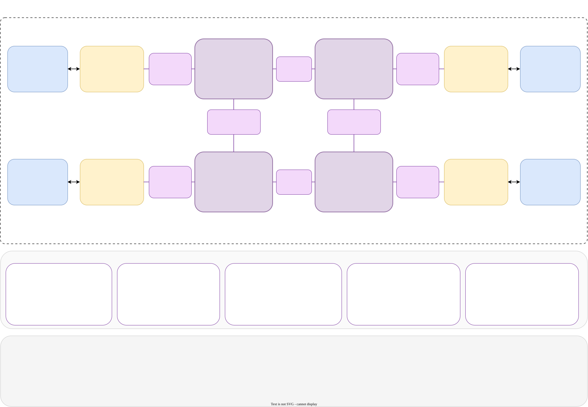
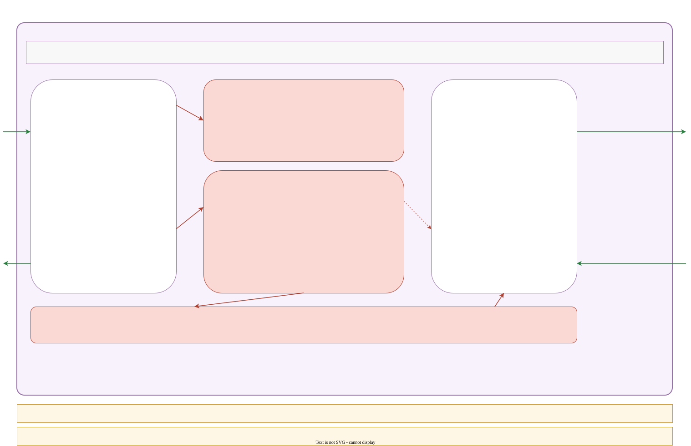

# Garnet3.0 Architecture: Classes, Composition, and the Per-Cycle Pipeline

Garnet is gem5's detailed, cycle-level Network-on-Chip (NoC) model.
It lives at `src/mem/ruby/network/garnet/` and plugs into Ruby as the concrete `Network` subclass when the config says `garnet`.
This note walks through every major class in that directory, shows how they fit together, and traces a single cache-line request from the protocol controller to the wire and back.

If you have already read [RequestToFlit.md](RequestToFlit.md), start here to zoom out: that document focused on the *message-to-flit* transformation; this one focuses on the *moving parts* that carry the flit through the mesh.

---

## 1. Why Garnet Exists

SimpleNetwork, Ruby's default interconnect, models latency and bandwidth as fixed per-link numbers and a shared pool of switch bandwidth.
That works for first-order studies, but it hides everything a real NoC designer cares about:

- **Router microarchitecture** — pipeline stages, virtual channels, arbiters, crossbar contention.
- **Flow control** — credit returns, head-of-line blocking, VC deadlock.
- **Topology + routing** — XY vs adaptive, escape VCs, link-weight tie-breaking.
- **Heterogeneity** — different clock domains and link widths between tiles, chiplet-style.

Garnet is the reference implementation for these questions in gem5.
Every class in the folder exists to make one of those effects observable and configurable.

---

## 2. The Big Picture

The architecture is easier to grasp in two views: the system-level wiring (who talks to whom over which link) and the per-cycle mechanics inside a single router.

### 2.1 System view — mesh of routers and NIs



The diagram above shows a small 2×2 mesh — the smallest mesh that exercises every link class:

1. A **Protocol Controller** (some SLICC machine like `CHI-cache` or `CHI-mem`) has a set of `MessageBuffer *` ports — one per virtual network (vnet).
2. Each controller binds to exactly one **NetworkInterface (NI)**, which converts SLICC messages into **flits** and back.
3. The NI is connected to exactly one **Router** via a **GarnetExtLink** (a pair: `NetworkLink` for flits + `CreditLink` for credits, each optionally wrapped in a `NetworkBridge`).
4. Routers are connected to each other via **GarnetIntLinks** (same structure). With four routers in a 2×2 mesh there are four IntLinks: two horizontal (R0↔R1, R2↔R3) and two vertical (R0↔R2, R1↔R3).
5. Each router has one `InputUnit` and one `OutputUnit` per physical port — for the mesh that is 4 mesh directions plus 1 "Local" port that faces the NI.
6. A **flit** flows: NI.niOutVcs → NetworkLink → downstream Router's InputUnit → (router internals) → OutputUnit.outBuffer → NetworkLink → next hop.
7. A **Credit** flows in the opposite direction on the `CreditLink` to tell upstream "your flit left my VC, you can send another."

### 2.2 Router view — internals of one switch

The router interior is shown in a separate diagram in [§5](#5-router--the-cycle-accurate-switch).
Each of the four routers in the mesh above is structurally identical to it.

The rest of this document is a class-by-class tour that fills in each box.

---

## 3. `GarnetNetwork` — the Top-Level Container

File: `GarnetNetwork.hh/cc` · Python: `GarnetNetwork.py` · extends `Network`.

**What it owns.**
Private members:

```cpp
std::vector<Router *>          m_routers;
std::vector<NetworkInterface*> m_nis;
std::vector<NetworkLink *>     m_networklinks;
std::vector<CreditLink *>      m_creditlinks;
std::vector<NetworkBridge *>   m_networkbridges;
```

**What it decides.**
Global knobs that every router and NI reads:

- `m_ni_flit_size` — how many bytes fit in one flit (default 16).
- `m_max_vcs_per_vnet`, `m_buffers_per_data_vc`, `m_buffers_per_ctrl_vc` — per-VC depth.
- `m_routing_algorithm` ∈ {`TABLE_=0`, `XY_=1`, `CUSTOM_=2`}.
- `m_num_rows`, `m_num_cols` — mesh dimensions (only used by XY routing).
- Per-vnet ordering flags (`isVNetOrdered`) and `VNET_type` (`CTRL_VNET_` / `DATA_VNET_`).

**How it gets built.**
Topology scripts in `configs/topologies/*.py` (e.g. `Mesh_XY.py`, `CrossbarRouter.py`) call three hooks that `GarnetNetwork` implements:

```cpp
void makeExtInLink  (NodeID src, SwitchID dst, BasicLink*, routing_table);
void makeExtOutLink (SwitchID src, NodeID dst, BasicLink*, routing_table);
void makeInternalLink(SwitchID src, SwitchID dst, BasicLink*, ...);
```

Each hook wires up NIs ↔ routers ↔ routers and fills the routing tables that `RoutingUnit` will later consult.

**What it measures.**
Per-vnet counters for packets injected/received, network latency, queueing latency, plus link utilization, hop count, and a full NxN traffic distribution matrix.

---

## 4. `NetworkInterface` — SLICC ⇆ Flits

File: `NetworkInterface.hh/cc` · Python: `GarnetNetwork.py` (`GarnetNetworkInterface`).
Extends `ClockedObject + Consumer`.

Every protocol controller (L1, HNF, SNF, …) is wired to **one** NI.
The NI is the only place in Garnet that looks at Ruby `Message` objects; everything downstream speaks flits.

**Ingress side — protocol → network.**

```cpp
std::vector<MessageBuffer *> inNode_ptr;   // indexed by vnet
```

`wakeup()` peeks each `inNode_ptr[vnet]`.
For every ready message it calls:

```cpp
bool flitisizeMessage(MsgPtr msg_ptr, int vnet);
```

The message is sized (`msg->getMessageSize()` → bytes) and split into `ceil(bytes / m_ni_flit_size)` flits.
The first is `HEAD_`, the last is `TAIL_`, middle ones are `BODY_`; a single-flit packet is `HEAD_TAIL_`.

A VC is selected with:

```cpp
int calculateVC(int vnet);          // round-robin inside the vnet
```

The MsgPtr is attached to **every** flit (via `MsgPtr m_msg_ptr` inside `flit`), but only the receiving NI reads it on TAIL arrival.

Flits are pushed into `niOutVcs[vc]` (a `flitBuffer`).
`scheduleOutputPort()` moves one flit per cycle per outport into `OutputPort.outFlitQueue`, which is the `NetworkLink`'s source buffer.

**Egress side — network → protocol.**

```cpp
std::vector<MessageBuffer *> outNode_ptr;  // indexed by vnet
```

When a flit arrives on an `InputPort`, the NI accumulates flits by `packet_id`.
On TAIL arrival the `MsgPtr` is enqueued into `outNode_ptr[vnet]`, where the protocol controller picks it up next cycle.

**Flow-control state.**

```cpp
std::vector<OutVcState> outVcState;     // mirrors downstream router VCs
std::vector<int>        m_vc_allocator;  // RR pointers for calculateVC
std::vector<int>        m_stall_count;
```

The NI tracks credit counts for the router it injects into.
If a VC has no credits, flits sit in `niOutVcs`; once a Credit arrives on the reverse `CreditLink`, the NI retries.

**Port helper classes (`OutputPort`, `InputPort`).**
Nested classes inside `NetworkInterface.hh`.
Each holds an `outFlitQueue` / `outCreditQueue`, the two `NetworkLink` / `CreditLink` pointers, the downstream router id, bit width, and a per-port list of **allowed vnets** (`mVnets`).
A single NI may have several `OutputPort`s if the topology routes different vnets to different routers (rare, but possible with HeteroGarnet).

---

## 5. `Router` — the Cycle-Accurate Switch

File: `Router.hh/cc` · extends `BasicRouter + Consumer`.
Python: `GarnetRouter`.



The Router is the most interesting object in Garnet.
It is where virtual channels, virtual networks, arbitration, the crossbar, and the pipeline all meet.
Because the next three sections ([§6](#6-inputunit-and-virtualchannel) through [§10](#10-outputunit-and-outvcstate)) drill into each sub-object separately, this section gives you the *connective tissue*: what a router owns, how its cycle is structured, how throughput scales, and where the common confusions (VC vs vnet, pipeline stages, physical channelization) hide.

### 5.1 What a Router owns

A Router is an aggregation of five cooperating sub-objects, all living inside the same `Router` instance:

```cpp
RoutingUnit     routingUnit;       // shared by all inports, stateless per cycle
SwitchAllocator switchAllocator;   // one per router, runs every cycle
CrossbarSwitch  crossbarSwitch;    // one per router, forwards SA winners
std::vector<std::shared_ptr<InputUnit>>  m_input_unit;   // one per inport
std::vector<std::shared_ptr<OutputUnit>> m_output_unit;  // one per outport
```

"Port" here means a *physical* port: each port has exactly one incoming NetworkLink, one outgoing NetworkLink, one incoming CreditLink, and one outgoing CreditLink.
`m_input_unit.size() == m_output_unit.size() == num_ports`.
The number of ports is decided by the topology script (e.g., a 2-D mesh router typically has 5 ports: N, E, S, W, Local-to-NI).

### 5.2 What "one cycle" of a router looks like

The Router is itself a `Consumer`: its `wakeup()` is scheduled on the global event queue whenever any sub-object has work to do.
The method is short (from `src/mem/ruby/network/garnet/README.txt`):

```cpp
void Router::wakeup() {
    for (auto& iu : m_input_unit)  iu->wakeup();
    for (auto& ou : m_output_unit) ou->wakeup();
    switchAllocator.wakeup();
    crossbarSwitch.wakeup();
}
```

Four things happen in order every cycle a router fires:

1. **InputUnit::wakeup()** — for each inport, drain one flit off the incoming NetworkLink, drop it into the correct VC's `inputBuffer`, and on HEAD run `RoutingUnit::outportCompute()` to decide its outport. Over the next `m_latency − 1` cycles the flit sits in the VC maturing; then it's tagged `flit_stage = SA_` and becomes a candidate for the SwitchAllocator.
2. **OutputUnit::wakeup()** — for each outport, pull any incoming `Credit` objects off the reverse CreditLink (from the *downstream* router) and apply them: `increment_credit(vc)`, and on `is_free_signal` mark the downstream VC `IDLE_`. This is the only way previously-full downstream VCs become usable again.
3. **SwitchAllocator::wakeup()** — run SA-I followed by SA-II (see [§5.3](#53-the-default-two-stage-pipeline-sa-and-st)). This is the cycle-accuracy linchpin.
4. **CrossbarSwitch::wakeup()** — for each flit the SA picked this cycle, shovel it from `switchBuffers[inport]` into the chosen `OutputUnit::outBuffer`.

Each sub-object re-schedules the router for the next cycle if it still has pending work — stalled VCs, enqueued credits, pipelined flits still a few cycles from `SA_`.

### 5.3 The default two-stage pipeline: SA and ST

`m_latency` defaults to 2.
That means a flit that arrives at cycle *N* leaves this router on its outgoing NetworkLink at cycle *N + 2* in the absence of contention.
The two cycles are named by the stage they advance:

**Cycle 1 — SA (Switch Allocation).**
The flit, which has been sitting in its VC since cycle *N*, reaches `flit_stage = SA_` and the SwitchAllocator operates on it:
- **SA-I** (inport arbitration): for each inport, a round-robin picks one ready VC — "ready" means it has a flit at `SA_` *and* the allocated outvc has a credit. One request per inport, total up to *P* requests, where *P* is `num_ports`.
- **SA-II** (outport arbitration): for each outport, a round-robin picks one inport out of the requests that targeted it. If the winning flit is `HEAD_` or `HEAD_TAIL_`, a downstream outvc is allocated on the fly via `OutputUnit::select_free_vc(vnet)`. The credit for the chosen outvc is decremented. A `Credit` is queued back to the upstream InputUnit via the InputUnit's `creditQueue`.
- The flit is staged into `CrossbarSwitch::switchBuffers[inport]` and its `flit_stage` is advanced to `ST_`.

**Cycle 2 — ST (Switch Traversal).**
`CrossbarSwitch::wakeup()` pops every flit from `switchBuffers[*]` and drops it into the corresponding `OutputUnit::outBuffer`.
No contention modelling happens here: all arbitration was resolved one cycle earlier, so the crossbar is a trivial datapath in the model.
After this cycle the flit is physically sitting in `outBuffer`; `flit_stage = LT_` from here on, and the outgoing `NetworkLink::wakeup()` picks the flit up on its own clock for the *link* portion of the journey (*LT — Link Traversal —* is counted by the link's `m_latency`, not the router's).

**Why two cycles and not one?**
Real silicon can't do arbitration + crossbar datapath in a single clock period at modern frequencies.
Separating SA and ST mirrors how commercial NoC routers are built; the model preserves that timing cost without simulating the analog detail.

**Optional longer pipelines.**
- `m_latency = 3` separates BW+RC (buffer-write + route-compute) from SA: a newly-arrived flit spends cycle 1 in BW/RC, cycle 2 in SA, cycle 3 in ST.
- `m_latency = 4` further splits VA (virtual-channel allocation for HEAD flits) from SA: BW/RC → VA → SA → ST.
- Going deeper trades per-hop latency (each extra stage = +1 cycle per hop) for better timing closure in the hypothetical silicon. *Functionally* nothing changes — same flits, same credits, same arbitration, just stretched out.

### 5.4 How many flits move through a router per cycle

Given *P* physical ports and *V* VCs per port, the stage-by-stage capacity is:

| Stage                     | Where the flit lives                       | Maximum in flight                     | Advancing per cycle                              |
|---------------------------|--------------------------------------------|---------------------------------------|--------------------------------------------------|
| **I_ / VA_** (buffered)   | `VirtualChannel::inputBuffer` on each VC  | *P × V × buffer\_depth* flits         | *P* new flits arrive (one per inport)            |
| **SA_** (arbitration)     | same VCs, marked `SA_`                    | all VCs at `SA_`                      | SA-I: ≤*P* requests   · SA-II: ≤*P* winners      |
| **ST_** (crossbar)        | `CrossbarSwitch::switchBuffers[inport]`   | *P* (one slot per inport)             | up to *P* (the SA-II winners)                    |
| **LT_** (output buffer)   | `OutputUnit::outBuffer`                   | small queue, 1 flit dequeued per link clock | ≤*P* (one per outport per cycle)          |

Two things fall out of that table:

- The **per-inport bottleneck is SA-I**: each inport launches at most one flit per cycle, no matter how many VCs it has.
  More VCs per vnet help *availability* (something is usually ready) and help *fairness* (different flows avoid head-of-line blocking each other), but they do **not** raise single-inport peak throughput.
- **Aggregate router throughput scales with *P*, not with *V***: up to *P* flits can pass through the crossbar per cycle — one per outport.
  To actually move more flits into or out of a router per cycle you must add *physical* ports.
  See [§5.5](#55-virtual-networks-vs-virtual-channels) and [§5.6](#56-physical-channelization-mapping-vnets-to-separate-physical-links) for how topology scripts exploit that.

### 5.5 Virtual networks vs virtual channels

This is the single most common confusion in Garnet, so read slowly.

**VNET (virtual network) = a protocol-visible message class.**
The *protocol designer* chooses how many vnets exist and what each one carries.
For CHI the vnets are conventionally `REQ = 0`, `SNP = 1`, `RSP = 2`, `DAT = 3` — four message classes that the CHI spec treats as logically independent.
For MSI there are three vnets (request, forward, response); MESI_Two_Level uses a different count again.
**Vnets are a correctness mechanism:** the protocol only stays deadlock-free if messages of one vnet can never wait on messages of another.
In Garnet terms, *no flit on one vnet ever occupies a buffer that could be needed by a flit on a different vnet.*

**VC (virtual channel) = an implementation-level buffer queue at a physical inport.**
A VC is a `VirtualChannel` object owned by one `InputUnit`: one `flitBuffer`, one 3-state VC-state machine (`IDLE_` / `VC_AB_` / `ACTIVE_`), one `m_output_port`, one `m_output_vc`.
Each port has `m_num_vcs` VCs total, partitioned statically across vnets: the first `m_vc_per_vnet` VCs belong to vnet 0, the next `m_vc_per_vnet` to vnet 1, and so on.
A flit on vnet *v* may only allocate a VC with index in `[v * m_vc_per_vnet, (v+1) * m_vc_per_vnet)`.

The arithmetic ties the two concepts together:

```
m_num_vcs                  = num_vnets × m_vc_per_vnet
num_vcs_router_wide        = num_ports × m_num_vcs
```

For the CHI example with 4 vnets, 2 VCs per vnet, 5 ports: each port has 8 VCs, the router holds 40 VCs total, and any given flit can land in one of 2 VCs on its inport.

**Why multiple VCs per vnet?**
Not for correctness — one VC per vnet is already deadlock-safe.
The extra VCs fight *head-of-line blocking within a vnet*: if two unrelated REQ messages would otherwise share one VC, a stalled first message blocks the second.
With two VCs per vnet, the second message allocates a different VC and can overtake.
This also gives SA-I more candidates to pick from per cycle, which raises effective throughput under contention without needing more physical ports.

**Mental model.**
Think of vnets as *separate lanes reserved for different vehicle categories* (emergency / regular / freight) — the protocol says the categories must not block each other.
Think of VCs as *sub-lanes within each category* — added to let multiple vehicles of the same category flow past each other when one stalls.
A single SwitchAllocator cycle picks one winner per physical lane on the inport side (SA-I) and one winner per physical lane on the outport side (SA-II), regardless of how many sub-lanes exist.

### 5.6 Physical channelization: mapping vnets to separate physical links

The previous sub-section described the *default* Garnet layout: all vnets share the same physical NetworkLink per direction, and vnets are kept isolated only by VC partitioning.
Garnet also supports the alternative: give each vnet its own physical wire.
The mechanism is `m_outports_dirn2idx[vnet]` on `RoutingUnit` — it returns a *different outport id per vnet* for the same (inport, direction) query.
A topology script that wants channelization just calls `makeInternalLink` multiple times for the same physical direction and registers each link for a specific vnet.

> **Correction from earlier in this document.**
> An earlier paragraph (and older Garnet commentary) called this "HeteroGarnet-specific" — that is misleading.
> HeteroGarnet only adds the *CDC + SerDes* glue (via `NetworkBridge`) needed when the physically separated links run at *different clocks or widths*.
> The per-vnet outport map itself predates HeteroGarnet and is plain-vanilla Garnet.

**Why this matters for realism.**
Commercial CHI NoCs — Arm CMN-600/650/700, most TileLink fabrics, AXI-chiplet interconnects — do exactly this: each CHI channel (REQ / SNP / RSP / DAT) has its own physical crossbar and its own wire bundles.
It is not primarily a deadlock argument (VC partitioning already solves that); it is a *bandwidth and physical-design* argument.
DAT is wide and data-heavy, REQ / SNP / RSP are narrow and control-heavy, and running them on separate physical wires lets each class be sized to its actual demand.

**Throughput consequence inside Garnet.**
Every physical link has its own InputUnit on the downstream side, its own OutputUnit on the upstream side, and its own SA-I / SA-II slot in the allocator.
Putting 4 vnets on 4 separate physical inports in a given direction gives the router **up to 4 flits per cycle** in that direction instead of 1, because the inport-side bottleneck is now quadrupled.
Aggregate peak throughput therefore scales linearly with physical port count — this is exactly the lever commercial NoCs pull when they want more bisection bandwidth.
In the topology file this means calling `makeInternalLink(...)` four times (one per CHI channel) between the same two routers, each call registering a distinct vnet on a distinct set of router ports.

**Deadlock freedom is preserved either way.**
Whether vnets share one physical link (VC-level isolation) or sit on distinct physical links (physical-level isolation), the protocol's cyclic-dependency invariants hold.
Physical channelization is a throughput / area / power trade, not a correctness one.

### 5.7 Tunable knobs on Router

Summarized from `GarnetNetwork.py` and `Router.hh`, roughly ordered by impact:

- `m_latency` — pipeline depth (default 2 = SA + ST · 3 adds BW/RC · 4 adds VA).
  Adds one cycle per hop per extra stage.
  Does not change throughput or correctness.
- `m_vc_per_vnet` — how many VCs each vnet gets per port (default 4).
  Higher values reduce intra-vnet head-of-line blocking and improve SA-I pick rate under contention.
  Cost: buffer area and state.
- `m_num_vcs` — derived (`num_vnets × m_vc_per_vnet`), read-only from the Python side.
- `m_bit_width` — wire width in bits (default 128).
  Sets link bandwidth: `bytes_per_cycle = bit_width / 8`.
  Two ports that disagree on `bit_width` require a `NetworkBridge` with SerDes (see [§12](#12-networkbridge--cdc--serdes-for-heterogarnet)).
- `m_buffers_per_ctrl_vc` / `m_buffers_per_data_vc` — per-VC buffer depth, decided at `GarnetNetwork` level and propagated down.
  Control vnets are typically shallower than data vnets because control messages are single-flit.
- `num_ports` — not a user knob directly: it is inferred from the number of links the topology script attaches.
  Increase it by wiring more `makeExtLink` / `makeInternalLink` calls.

### 5.8 Follow-up questions, answered precisely

These come up often enough that they deserve an explicit walk-through.

**Q1. How do flits from the *same* vnet end up on *different* VCs?**

The source `NetworkInterface::calculateVC(vnet)` does a round-robin inside the vnet's VC range `[vnet * m_vc_per_vnet, (vnet+1) * m_vc_per_vnet)`.
From `NetworkInterface.cc:506`:

```cpp
int NetworkInterface::calculateVC(int vnet) {
    for (int i = 0; i < m_vc_per_vnet; i++) {
        int delta = m_vc_allocator[vnet];
        m_vc_allocator[vnet]++;
        if (m_vc_allocator[vnet] == m_vc_per_vnet)
            m_vc_allocator[vnet] = 0;

        int vc = vnet * m_vc_per_vnet + delta;
        if (outVcState[vc].isInState(IDLE_, curTick())) {
            vc_busy_counter[vnet] = 0;
            return vc;
        }
    }
    return -1;   // every VC in this vnet is busy this cycle
}
```

Two points matter here:

- `calculateVC` is called **once per packet**, at the source NI, when the HEAD flit is built. All subsequent BODY and TAIL flits of the same packet inherit that VC — they stay on the same VC end-to-end until the TAIL leaves.
- The round-robin pointer `m_vc_allocator[vnet]` advances every call, so two *different* packets on the same vnet naturally land on different VCs when at least one is free. This is the mechanism that lets a second REQ packet overtake a first REQ packet stuck behind a slow downstream VC.

So: flits of one packet share a VC; different packets on the same vnet fan out across VCs via round-robin.

**Q2. Can I set a *different* number of VCs per vnet inside one router?**

Not with the stock parameter set. `GarnetNetwork.py` exposes:

```python
vcs_per_vnet = Param.UInt32(4, "virtual channels per virtual network")
```

and `Router.cc:54` computes:

```cpp
m_num_vcs = m_virtual_networks * m_vc_per_vnet;
```

So inside one router `m_vc_per_vnet` is a scalar, applied uniformly to every vnet.

Two partial answers that often get conflated:

- **Per-router variation — yes, supported.** `GarnetRouter.vcs_per_vnet` defaults to `Parent.vcs_per_vnet` but can be overridden per router. That lets you put 4 VCs/vnet in hotspot routers and 2 elsewhere. Garnet computes `m_max_vcs_per_vnet` across the network for stats sizing (`GarnetNetwork.cc:181`).
- **Per-vnet variation inside one router — not supported.** If you need "REQ gets 2 VCs, DAT gets 4" on the same router, you must fork `Router.cc` (and audit `InputUnit`, `OutputUnit`, `SwitchAllocator`, all of which assume uniform vnets).

A related knob that **does** vary per vnet without forking is **buffer depth per VC**: `m_buffers_per_ctrl_vc` and `m_buffers_per_data_vc` on `GarnetNetwork` apply different per-VC depths to CTRL vs DATA vnets, driven by each vnet's `VNET_type`. You cannot give DAT more VCs than REQ, but you can give each DAT VC deeper buffers — usually the preferred lever anyway, since data messages are multi-flit while control messages are not.

**Q3. Can one vnet use *multiple* physical links — CHI-style sub-channels?**

Not in stock Garnet. `RoutingUnit::addOutDirection(...)` (see `RoutingUnit.cc:156`) fills a per-vnet map `m_outports_dirn2idx[vnet]`, which is a `std::map<PortDirection, int>` — one outport per `(vnet, direction)`. If your topology calls it twice for the same `(direction, vnet)`, the second call silently overwrites the first. Per cycle, one vnet in one direction traverses exactly one physical wire.

There are two standard workarounds, neither built-in:

1. **Split the sub-channels into distinct Garnet vnets.**
   If you want two parallel REQ wires, declare two vnets (`REQ_0`, `REQ_1`) in the SLICC protocol, have the protocol pick between them per message (hash on address, packet id, whatever), and then wire each vnet onto its own physical link exactly as in [§5.6](#56-physical-channelization-mapping-vnets-to-separate-physical-links).
   Cost: protocol changes (the vnet count comes from the `.sm` file, not from a runtime parameter), and you must re-verify the ordering and deadlock arguments — splitting an ordered stream across channels can break ordering guarantees that the protocol used to rely on.
2. **Extend `RoutingUnit` with `CUSTOM_` routing.**
   The `CUSTOM_` hook (`m_routing_algorithm = 2`) lets you return any outport based on any per-flit state — typically `hash(packet_id) % num_parallel_links` — chosen from a pool of equivalent outports. You write the hook and prove deadlock freedom yourself: distributing one ordered flow across channels can introduce cyclic dependencies if naively done.

Native multi-link-per-vnet support would require teaching `RoutingUnit` to return a *set* of outports and `SwitchAllocator` to pick among them, which is a non-trivial refactor across three files. Which is why "one vnet per sub-channel" is the usual path in practice, despite the protocol-side work it implies.

**Q4. Can I cap the number of flits SA grants per cycle — say, 5 inports but only 3 switch paths?**

Not with a parameter, but the modification is localized.
In `SwitchAllocator.cc:164`, `arbitrate_outports()` loops over *every* outport unconditionally:

```cpp
void SwitchAllocator::arbitrate_outports() {
    for (int outport = 0; outport < m_num_outports; outport++) {
        // round-robin pick one inport requesting this outport, grant it
        ...
    }
}
```

There is no `max_grants_per_cycle` cap.
Each outport finds its SA-II winner independently, so the per-cycle grant count is effectively `min(num_inports_with_request, num_outports_with_request)` — up to `min(num_inports, num_outports)` in the worst case.
That is the default "full crossbar" model: *P* × *P* ideal switch with *P* parallel datapaths.

If you want to model a smaller physical crossbar — say, 5 inports feeding only 3 parallel switch paths — you need to modify `arbitrate_outports()` locally:

1. Count grants as they happen and `break` once a cap is reached.
2. Rotate the starting `outport` index each cycle so the cap doesn't systematically starve the same ports (`m_round_robin_outport_base = (m_round_robin_outport_base + 1) % m_num_outports;`).
3. Expose the cap as a new `GarnetRouter` parameter.

One-minute sketch:

```cpp
void SwitchAllocator::arbitrate_outports() {
    int grants = 0;
    for (int i = 0; i < m_num_outports; i++) {
        int outport = (m_rr_outport_base + i) % m_num_outports;
        // ... existing per-outport arbitration ...
        if (granted_this_outport) {
            if (++grants >= m_max_grants_per_cycle) break;
        }
    }
    m_rr_outport_base = (m_rr_outport_base + 1) % m_num_outports;
}
```

This models the common real-silicon case where a router has more logical ports than physical crossbar bandwidth: e.g., 5 mesh directions feeding a 3-way shared crossbar.
The ungranted inports simply retry next cycle — their flits stay at `flit_stage = SA_` in their VCs, and they are eligible again when their outport's turn comes.
Deadlock freedom is not affected (the VC / credit contract is unchanged), but per-flit latency can spike under contention because fewer grants per cycle means longer SA queues.

There is no upstream feature request to add this knob, so if you need it you'll be patching your local tree.

---

## 6. `InputUnit` and `VirtualChannel`

Files: `InputUnit.hh/cc`, `VirtualChannel.hh/cc`.

**`InputUnit`** is the receive side of one inport.
It owns one `NetworkLink*` (incoming flits) and one `CreditLink*` (outgoing credits).
It holds:

```cpp
std::vector<VirtualChannel> virtualChannels;   // one per VC on this inport
flitBuffer creditQueue;                         // credits to send upstream
```

`wakeup()` pulls the current cycle's flit off `m_in_link`, routes it to `virtualChannels[vc].insertFlit(flit)`, and:

- On `HEAD_`/`HEAD_TAIL_`: calls `m_router->route_compute(...)` (which delegates to `RoutingUnit::outportCompute`). The resulting outport id is stored in the VC.
- For all flit types: starts buffering; after `m_latency−1` cycles the flit is marked ready for switch allocation (`flit_stage = SA_`).

**`VirtualChannel`** is a simple pair of state-plus-queue:

```cpp
flitBuffer  inputBuffer;                          // the actual flits
std::pair<VC_state_type, Tick> m_vc_state;        // IDLE_ / VC_AB_ / ACTIVE_
int  m_output_port;                                // set by route_compute
int  m_output_vc;                                  // set by outvc allocation
Tick m_enqueue_time;
```

Credits.
When a flit leaves the VC (consumed by the switch), the InputUnit builds a `Credit(vc, is_free_signal, now)` and enqueues it on `creditQueue`, which drains to the upstream router's `OutputUnit` via the `CreditLink`.
On `HEAD_TAIL_` / `TAIL_`, `is_free_signal = true`, returning the VC to the pool upstream.

---

## 7. `RoutingUnit` — Where Flits Learn Their Outport

File: `RoutingUnit.hh/cc`.

A Router has **one** RoutingUnit, shared by all input units.
It exposes a single hot path:

```cpp
int outportCompute(RouteInfo route, int inport, PortDirection dirn);
```

Three back-ends are selectable via `GarnetNetwork.routing_algorithm`:

| Value | Method | Used by |
|-------|--------|---------|
| `TABLE_`  | `lookupRoutingTable(vnet, NetDest)` — shortest path by link weight | any topology |
| `XY_`     | `outportComputeXY(...)` — dimension-order, uses mesh `(row, col)` | `Mesh_XY.py` |
| `CUSTOM_` | `outportComputeCustom(...)` — user-supplied per-direction logic | research extensions |

Tables are filled at build time by the topology script via `addRoute(...)`, `addWeight(link_weight)`, `addInDirection(...)`, `addOutDirection(...)`.
Per-vnet outport maps (`m_outports_dirn2idx[vnet]`) let the same `(inport, direction)` query return a different physical outport for different vnets.
This is how Garnet can model commercial NoCs where CHI REQ / SNP / RSP / DAT sit on physically separate wire bundles.
Contrary to older commentary, this is **not** a HeteroGarnet-only feature; HeteroGarnet only adds the CDC + SerDes glue needed when the physically separated links also disagree on clock or width.
See [§5.6](#56-physical-channelization-mapping-vnets-to-separate-physical-links) for the throughput consequences.

**Deadlock note.**
Routing is deadlock-free only if the algorithm and the VC allocation policy together avoid cyclic channel dependencies.
XY on a mesh is the canonical safe choice; arbitrary `TABLE_` routing can livelock or deadlock if the topology isn't acyclic.

---

## 8. `SwitchAllocator` — the Heart of the Pipeline

File: `SwitchAllocator.hh/cc`.

Every router has exactly one `SwitchAllocator`.
It performs both VC allocation and switch arbitration in a single `wakeup()`.
This is Garnet's most intricate object; understand it and the rest falls out.

**Two-phase arbitration (per router cycle):**

```cpp
void wakeup() {
    arbitrate_inports();    // SA-I: each inport picks 1 VC
    arbitrate_outports();   // SA-II: each outport picks 1 inport
    clear_request_vector();
    check_for_wakeup();     // reschedule Router if more flits ready
}
```

**SA-I (`arbitrate_inports`).**
For each inport, walk its VCs in round-robin (`m_round_robin_invc[inport]`) and pick the first VC that is ready (has a flit at stage `SA_`, with credits available for its chosen outport/outvc). For `HEAD_`/`HEAD_TAIL_`, the VC must also see at least one free outvc on the desired outport; for `BODY_`/`TAIL_`, the previously allocated outvc must have a credit.

**SA-II (`arbitrate_outports`).**
For each outport, walk inports in round-robin (`m_round_robin_inport[outport]`) and pick the first inport that requested it during SA-I.
Then:

- **Allocate outvc** (only for HEAD flits): `vc_allocate(outport, inport, invc)` consults `OutputUnit::select_free_vc(vnet)`.
- **Decrement credit** for the chosen outvc on the OutputUnit (`decrement_credit(outvc)`).
- **Send the flit** onward: `m_router->grant_switch(inport, flit)` stages the flit into `CrossbarSwitch::switchBuffers[inport]`.
- **Send a credit upstream**: tell the InputUnit to enqueue a `Credit` on its `creditQueue`; for HEAD_TAIL / TAIL, set `is_free_signal`.

State kept:

```cpp
std::vector<int> m_round_robin_invc;
std::vector<int> m_round_robin_inport;
std::vector<int> m_port_requests;    // outport → granted inport (this cycle)
std::vector<int> m_vc_winners;       // outport → winning invc (this cycle)
```

**What can go wrong.**
- Fair starvation: strict round-robin can still starve VCs with always-busy output VCs if credits never return (that's usually a protocol or capacity bug upstream).
- Credit leaks: a dropped credit means the upstream VC never reclaims a buffer and stalls permanently. Hence the dedicated `CreditLink` and careful `is_free_signal` handling.
- Deadlock: if every vnet uses one VC and two flows cross-lock, SA-I simply finds no ready VC — forever. Fix with more VCs or an escape vnet.

---

## 9. `CrossbarSwitch` — the Trivial-Looking Final Stage

File: `CrossbarSwitch.hh/cc`.

One crossbar per router.
It holds one small flitBuffer per inport:

```cpp
std::vector<flitBuffer> switchBuffers;   // size = num_inports
```

`SwitchAllocator::grant_switch(inport, flit)` drops the winning flit into `switchBuffers[inport]`.
`CrossbarSwitch::wakeup()` pops each staged flit and hands it to the `OutputUnit`'s `outBuffer` — that's the actual "traversal" step (`flit_stage = ST_`).

No contention modelling happens here.
All contention was resolved in `SwitchAllocator` one cycle earlier.
The crossbar only counts activity for power stats (`m_crossbar_activity`).

---

## 10. `OutputUnit` and `OutVcState`

Files: `OutputUnit.hh/cc`, `OutVcState.hh/cc`.

**`OutputUnit`** owns one `NetworkLink*` (outgoing flits) and one `CreditLink*` (incoming credits from the downstream router).

```cpp
flitBuffer              outBuffer;        // flits waiting to enter the link
std::vector<OutVcState> outVcState;       // tracks downstream VC state
```

`wakeup()` runs on credit arrival: a `Credit` is pulled off `m_credit_link`, `increment_credit(out_vc)` is called, and if `is_free_signal` is set the downstream VC transitions back to `IDLE_`.

Two helpers that SwitchAllocator calls every cycle:

```cpp
bool has_free_vc(int vnet);          // any IDLE_ VC in vnet?
int  select_free_vc(int vnet);       // allocate one (returns VC id, sets VC_AB_)
```

**`OutVcState`** is simple bookkeeping per downstream VC:

```cpp
std::pair<VC_state_type, Tick> m_vc_state;  // IDLE_ / VC_AB_ / ACTIVE_
int m_credit_count;                          // buffers free at downstream VC
```

Initial credit count equals the downstream's per-VC buffer depth (`m_buffers_per_ctrl_vc` or `m_buffers_per_data_vc`, depending on vnet type).

---

## 11. `NetworkLink` and `CreditLink` — Pipelined Wires

Files: `NetworkLink.hh/cc` (NetworkLink + CreditLink).

`NetworkLink` is the generic cycle-accurate link; `CreditLink` is a subclass whose payload is `Credit` instead of arbitrary flits.
Both extend `ClockedObject + Consumer`.

Key fields:

```cpp
const int        m_id;
const Cycles     m_latency;          // configurable per link; default from topology
link_type        m_type;             // EXT_IN_ / EXT_OUT_ / INT_
ClockedObject   *src_object;         // source (NI or Router)
flitBuffer       linkBuffer;          // flits currently on the wire
Consumer        *link_consumer;       // next hop (Router or NI)
flitBuffer      *link_srcQueue;       // source's out queue we drain from
std::vector<int> mVnets;              // allowed vnets on this wire
uint32_t         bitWidth;            // link width in bits
```

`wakeup()` pulls ready flits out of `link_srcQueue` (the upstream's output), stamps them at `now + m_latency`, stashes them in `linkBuffer`, and schedules `link_consumer->wakeup()` when the flit is due.

Per-vnet statistics (`m_flits_per_vnet`) are updated on every hop and drive the `total_ext_in_link_utilization` / `total_ext_out_link_utilization` / `total_int_link_utilization` stats in `GarnetNetwork`.

---

## 12. `NetworkBridge` — CDC + SerDes for HeteroGarnet

File: `NetworkBridge.hh/cc`. Extends `CreditLink`.

Used only when two endpoints of a link differ in **clock** or **bit width**.
The topology sets `enCdc` / `enSerDes` flags on the bridge; with both off the bridge is a no-op.

Two features:

- **Clock Domain Crossing (`enCdc`)** — buffers flits until the consumer's next clock edge (`cdcLatency`).
- **Serializer/Deserializer (`enSerDes`)** — splits one wide flit into multiple narrow ones (or merges) when upstream and downstream link widths differ. Implemented via `flit::serialize(...)` / `deserialize(...)`. Because packet size in flits changes, the bridge also rewrites credits: `neutralize(vc, eCredit)` adjusts the extra credit count so the upstream's view of downstream buffer space stays correct.

A `GarnetIntLink` can carry up to four `NetworkBridge` instances — one for each direction of the `NetworkLink` plus each direction of the `CreditLink`.
For a `GarnetExtLink` (NI ↔ Router) the pattern is similar but indexed `[2]`.

---

## 13. `flit`, `Credit`, `flitBuffer` — the Data Layer

Files: `flit.hh/cc`, `Credit.hh/cc`, `flitBuffer.hh/cc`.

**`flit`** is the unit of network transfer.
Key fields:

```cpp
int       m_packet_id;           // unique id for the whole packet
int       m_id;                  // flit index within the packet
int       m_vnet;
int       m_vc;
RouteInfo m_route;               // src/dest router+ni, vnet, net_dest, hops
int       m_size;                // total flits in this packet
int       msgSize;               // original message size in bytes
uint32_t  m_width;               // link width at injection (for SerDes)
flit_type m_type;                // HEAD_ / BODY_ / TAIL_ / HEAD_TAIL_ / CREDIT_
std::pair<flit_stage, Tick> m_stage;  // I_→VA_→SA_→ST_→LT_
MsgPtr    m_msg_ptr;             // the original Ruby message (shared)
int       m_outport;
Tick      m_enqueue_time, m_dequeue_time, m_time, src_delay;
```

The `MsgPtr` is a shared pointer held by *every* flit of the packet (cheap because it's refcounted).
At the destination NI, when TAIL arrives, the NI just unwraps `m_msg_ptr` and enqueues it into the right `outNode_ptr[vnet]` — zero copy.

**`Credit`** inherits from `flit` and adds one bit:

```cpp
bool m_is_free_signal;          // "VC is now free on the upstream side"
```

Credits travel on `CreditLink`s, which are regular `NetworkLink`s under the hood.
They share the flit pipeline machinery (same buffer types, same `wakeup` pattern), which is why `NetworkBridge`'s SerDes path also has to adjust credit counts.

**`flitBuffer`** is a priority queue keyed on `flit::get_time()`:

```cpp
std::priority_queue<flit*, ..., flit::greater> m_buffer;
bool isReady(Tick curTime);     // top flit due this cycle?
flit* peekTopFlit(); flit* getTopFlit();
```

Same class is used inside `VirtualChannel` (input-side VC buffer), `NetworkLink` (in-flight flits), `CrossbarSwitch` (switchBuffers), and `NetworkInterface` (niOutVcs, outFlitQueue).

---

## 14. Stitching It All Together: One Read-Request Hop

Consider a CHI load that misses L1 and needs to traverse one hop to the Home Node.
The flow along the blue/purple arrows in the diagram is:

1. **Protocol enqueue.** `CHI-cache.sm` places a `CHIRequestMsg` on `reqOut` (the MessageBuffer for vnet 0 = REQ).
2. **NI.wakeup().** Dequeues the message; `flitisizeMessage(msg, 0)` creates 1 `HEAD_TAIL_` flit (CHI REQ is small); `calculateVC(0)` picks a VC within vnet 0; flit goes to `niOutVcs[vc]`.
3. **Inject.** `scheduleOutputLink()` moves the flit to the NI's `OutputPort.outFlitQueue`; the `NetworkLink` picks it up, delays `m_latency` cycles.
4. **Arrive at Router.** The downstream `InputUnit::wakeup()` reads the flit off `m_in_link`, puts it in `virtualChannels[vc].inputBuffer`, calls `route_compute → RoutingUnit::outportCompute` (with `XY_`, this is `switch(dirn)`-style math). Outport id is stored in the VC.
5. **Switch allocation.** After `m_latency−1` cycles the flit is marked at stage `SA_`. Next `SwitchAllocator::wakeup()`: SA-I picks this VC for the inport, SA-II sees only one requester for the chosen outport so it grants. Since this is a HEAD flit, a downstream outvc is allocated via `OutputUnit::select_free_vc(vnet)`; a credit is decremented on the downstream VC.
6. **Traverse.** `grant_switch(inport, flit)` puts the flit in `CrossbarSwitch::switchBuffers[inport]`; `CrossbarSwitch::wakeup()` forwards it into `OutputUnit.outBuffer`. Stage is now `ST_`.
7. **Credit return.** The InputUnit builds a `Credit(vc, is_free=true, now)` (HEAD_TAIL → VC free) and enqueues it on its `creditQueue`. The reverse `CreditLink` carries it upstream; the sending NI's `outVcState[vc]` gets `increment_credit()` and transitions to `IDLE_`.
8. **Leave on the next link.** `NetworkLink` drains `OutputUnit.outBuffer`, delays `m_latency` cycles, then wakes the destination NI.
9. **Re-materialize.** Destination `NetworkInterface::wakeup()` sees the HEAD_TAIL flit; `m_msg_ptr` is extracted and enqueued on `outNode_ptr[0]` (REQ vnet) of the Home Node's `CHI-mem` controller.

Total latency, ignoring contention: `2 × m_latency(link) + m_latency(router) + 1 cycle per NI stage`.

---

## 15. What Can Go Wrong

Every Garnet study should watch for:

- **Backpressure stalls.** `niOutVcs` fills because no VC has credits. The flits queue up, but the protocol is oblivious; you see a sudden latency spike on every request in that vnet.
- **VC starvation.** One vnet monopolizes VCs; cross-vnet flows never proceed. `m_buffers_per_*_vc` and per-vnet VC counts are the levers.
- **Deadlock.** Cyclic dependencies between VCs on a mesh with adaptive routing; the solver is "use XY" or "add escape VCs".
- **Credit drift under SerDes.** When a NetworkBridge widens/narrows flits, every credit must be scaled; `NetworkBridge::neutralize` exists for this. Configuration bugs here look like periodic, single-link stalls.
- **Link-width mismatch without a bridge.** Leads to `assert` failures during simulation because flit `m_width` disagrees with downstream link `bitWidth`.
- **Packet id collisions.** Fresh packet ids come from `GarnetNetwork::getNextPacketID()`; if a protocol synthesizes flits outside Garnet this must be honored.

Common debug flags (enable via `--debug-flags=...`):

- `RubyNetwork` — high-level NI activity.
- `GarnetAllocator` — SA-I / SA-II decisions per cycle.
- `GarnetCrossbar` — crossbar traversals.
- `RubyQueue` — MessageBuffer enqueues/dequeues at the protocol boundary.

---

## 16. Key Ideas

- Garnet splits the interconnect into *protocol-visible* objects (NI, Router, Link) and *per-cycle micro-architecture* objects (InputUnit, VirtualChannel, RoutingUnit, SwitchAllocator, CrossbarSwitch, OutputUnit).
- Every packet is a sequence of **flits**; every flit carries a shared `MsgPtr` so SLICC messages are never copied, only fragmented and reassembled at the NIs.
- **Credits**, not acknowledgements, provide back-pressure: a VC is reusable as soon as a credit returns with `is_free_signal`.
- `SwitchAllocator` is the cycle-accuracy linchpin. SA-I / SA-II round-robin arbitration, VC allocation, and credit decrement all happen in one `wakeup()`.
- `NetworkBridge` is the "glue" class: it only does something when links disagree on clock or width (HeteroGarnet).
- The whole design is discrete-event: every class extends `Consumer`; each one re-schedules itself or its neighbor on the global event queue.

## 17. If You Remember One Thing

**The Garnet router is a two-phase pipeline driven by credits.**
Flits arrive in `InputUnit` VCs, `SwitchAllocator` runs SA-I (inport → VC) then SA-II (outport → inport + outvc alloc), the winner passes through `CrossbarSwitch` into the `OutputUnit`, a credit goes back upstream.
Everything else — routing algorithms, CDC/SerDes bridges, per-vnet stats, multi-topology wiring — is parameterization around that core.
