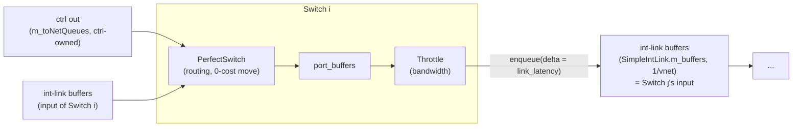
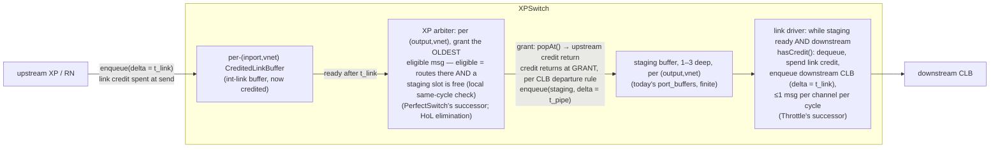

# NewSimpleNetwork — Realistic NoC / XP Modelling on SimpleNetwork

Roadmap and architecture for evolving Ruby's SimpleNetwork into a model of a
realistic CHI/CMN-style mesh: credited links, XP (crosspoint) routers with
HoL-eliminating arbitration, and physically meaningful latencies — while
keeping SimpleNetwork's configuration structure and staying easy to sync with
upstream gem5. The link-level building block is specified in
[`CreditedLinkBuffer.md`](CreditedLinkBuffer.md); this document covers the
network/router level and the execution plan.

## 1. What SimpleNetwork is today (the baseline)

One `Switch` per router, composed of two engines and three buffer layers
(`src/mem/ruby/network/simple/`):

- `PerfectSwitch` drains each input buffer **head-only**, routes via the
  `WeightBased` routing unit, gates on `areNSlotsAvailable()` of the
  intermediate `port_buffers`, and enqueues with `routing_latency`.
- `Throttle` (one per output link) models bandwidth (bytes/cycle) and applies
  `link_latency` when enqueuing into the next hop's input buffer.
- Buffer occupancy is the only backpressure; freed slots become visible through
  `MessageBuffer`'s fixed next-cycle accounting, not through a configurable
  credit-return path (the gaps G1-G5 analysed in `CreditedLinkBuffer.md`
  section 1).
- Wiring: `Topology::createLinks` → virtual
  `SimpleNetwork::make{ExtIn,ExtOut,Internal}Link` → `Switch::add{In,Out}Port`.
  Ext links have no buffers of their own: controller-owned `m_toNetQueues` /
  `m_fromNetQueues` are consumed/filled by the switch directly.

## 2. Target model — the XP router

A CMN-style XP, at message (= single-flit CHI packet) granularity. The
existing three-stage `Switch` decomposition is **kept** — it maps onto a real
XP one-to-one; each stage's flow control is what changes:

The staging buffer decouples **switch allocation** (crossbar grant) from
**link allocation** (sending onto the wire), exactly as in real XPs: a
briefly credit-starved link does not stall the crossbar, and the input slot —
and its credit — frees at grant time, not at wire time. Within the XP, the
staging-slot check stays instantaneous (`areNSlotsAvailable`): that models a
same-clock-domain register handshake one gate away, which is physical. Credits
with return latency are reserved for what crosses *distance*: the links.

| Concern            | Today                                | XP model |
|--------------------|--------------------------------------|----------|
| Wire delay         | Throttle's `link_latency` delta      | link driver's `t_link` delta (same mechanism) |
| Router pipeline    | `routing_latency` into port_buffer   | `t_pipe` into staging (same mechanism) |
| Output staging     | `port_buffers`, infinite by default  | `port_buffers` kept, finite 1–3 deep (`staging_depth`) |
| Bandwidth          | Throttle bytes/cycle                 | ≤1 msg per output-channel per cycle at the link driver (CHI is single-flit) |
| Backpressure       | instantaneous `areNSlotsAvailable` everywhere | credits + `credit_return_latency` on links; instantaneous slot check only intra-XP |
| Input buffering    | infinite by default, capacity check is the flow-control signal | CLB capacity ≥ credits, explicit delayed credit loop |
| Switching          | head-only                            | oldest-eligible (HoL elimination), per CLB sections 2.6 and 3.3 |

VC structure: vnet = CHI channel (req/snp/rsp/dat) = one CLB + one credit pool
per (link, vnet) — exactly CHI's per-channel L-credits. The existing
`physical_vnets_channels`/per-vnet bandwidth params keep their meaning
(channel count per vnet); per-vnet `credits` becomes the new sizing knob.

Endpoint (ext) links, initially uncredited: controller→XP keeps
`m_toNetQueues` as the XP's input (a plain buffer the arbiter treats as
always-credited upstream); XP→controller keeps `areNSlotsAvailable` gating on
`m_fromNetQueues`. Credited endpoint links are a later, optional phase (§5
Phase 5) because SLICC controllers call non-virtual
`MessageBuffer::areNSlotsAvailable` — supporting them means backing that call
with `hasCredit()` via a guarded branch inside MessageBuffer (default-off).

## 3. Component architecture (all new files, subclass seams)

New directory `src/mem/ruby/network/simple/xp/` (own SConscript entries):

| Component | Inherits | Role |
|-----------|----------|------|
| `CreditedLinkBuffer` | `MessageBuffer` | Credit FSM + OOO ready-set, per `CreditedLinkBuffer.md`. Disabled mode (`credits==0`) byte-identical to base. |
| `XPSwitch` | `Switch` (C++ & Python) | Keeps the Switch skeleton: the XP arbiter replaces `PerfectSwitch`'s head-only routing loop, the credit-gated link driver replaces `Throttle`'s byte counting; `port_buffers` survive as the finite staging stage (`setup_buffers` sizes them to `staging_depth`). Reuses `BasicRouter` params and the `WeightBased` routing unit. |
| `XPIntLink` | `SimpleIntLink` | `setup_buffers` creates one `CreditedLinkBuffer` per vnet (× channels) with `credits`, `credit_return_latency` params. |
| `XPExtLink` | `SimpleExtLink` | Unchanged behaviour initially; placeholder for endpoint credits. |
| `XPNetwork` | `SimpleNetwork` (C++ & Python) | Overrides the three **virtual** `make*Link` methods to wire `XPSwitch` ports directly (so `Switch`'s non-virtual `addInPort/addOutPort` never need to become virtual); keeps its own buffer list for functional access. |

Reused verbatim: `Topology`, `CustomMesh`/`rbook_4x4.py`, `BasicLink`/
`BasicRouter` params, `WeightBased` routing, vnet definitions, all SLICC/CHI
protocol code, and the Python config shape — `routers`, `int_links`,
`ext_links`, `setup_buffers()` flow are structurally identical, only the
SimObject classes are the XP subclasses. The testbench driver selects it via
`--network simple_xp` next to `garnet`/`simple`.

Stats: `XPSwitch` reproduces the Throttle/Switch stat surface (msg counts,
link utilization, stall cycles) so existing analysis scripts keep working;
CLB adds credit stalls / credit occupancy / return-count (CLB section 2.8); new
arbiter stats (grants/cycle, HoL-skip count, staging occupancy).

## 4. Upstream-sync strategy

1. **New code in new files only.** Everything in §3 lives under `xp/`;
   upstream changes to `simple/` never conflict.
2. **Enumerated, additive seams in upstream files** — each its own commit,
   default-off, easy to rebase:
   - `MessageBuffer.{hh,cc,py}`: credited-mode members + guarded branches in
     `enqueue`/`areNSlotsAvailable` (only if Option A "extend" is chosen, and
     required later for credited endpoint links). `credits==0` ⇒ untouched
     behaviour.
   - `simple/SConscript`: append-only registration of the `xp/` subdir.
   - Possibly 1–2 members of `Switch`/`SimpleNetwork` widened from `private`
     to `protected`. No virtualization of `Switch` methods needed (the
     `XPNetwork::make*Link` override route avoids it).
3. **No changes** to Topology, routing, SLICC, protocol configs, or existing
   Python configs; regressions for `simple`/`garnet` stay byte-identical.

## 5. Roadmap

**Phase 0 — CreditedLinkBuffer** (spec already written).
Implement per `CreditedLinkBuffer.md` (backend per section 5 there), with unit
tests: disabled-mode identity, credit conservation, throughput knee at
`credits == RTT_min`. Gate: full Ruby regressions + CHI testbench unchanged
with `credits==0`.

**Phase 1 — XPSwitch skeleton, behaviour-equivalent.**
`XPNetwork`/`XPSwitch`/`XPIntLink` with *plain* buffers everywhere, head-only
arbitration, infinite staging, 1 msg/channel/cycle. Because the three-stage
pipeline is preserved (`t_pipe` = `routing_latency`, staging = port_buffers,
link driver = Throttle), results should track classic `simple` closely —
quantify any residual delta (e.g. msg-size-dependent Throttle serialization
vs. 1 msg/cycle). Gate: CHI testbench (`run-memset`, `run-ping_pong`, both
rn-modes) runs and matches within the documented delta.

**Phase 2 — Credits on internal links + finite staging.**
`XPIntLink` buffers become CLBs; link driver gates on `hasCredit()` and
spends/returns credits; arbiter gates on finite staging slots; `popAt` at
grant drives the delayed upstream credit return; producer wake via credit
callback. Gate: throughput-knee sweep on a 2-XP chain; backpressure walks
upstream hop-by-hop with per-hop delay (CLB section 6.5); staging-depth sweep
(1–3) shows the expected grant/link decoupling slack.

**Phase 3 — HoL elimination.**
Arbiter from head-only to `selectEligible` (oldest eligible per output),
flag-controlled (`enable_ooo_pop`). Gate: blocked-output test — the flow to a
free output keeps draining (CLB section 6.5); A/B head-only vs OOO on testbench
scenarios.

**Phase 4 — Calibration & experiments.**
Per-vnet credits/latency/staging parameter surface in `rbook_4x4.py`; A/B vs
Garnet (matched single-flit, per-VC credits) latency–throughput curves;
CMN-like configs (per-channel credit counts, asymmetric REQ/DAT sizing);
memset and ping-pong studies.

**Phase 5 (optional) — Credited endpoint links.**
Guarded `areNSlotsAvailable` ⇒ `hasCredit()` in MessageBuffer; controller
out-queues / `m_fromNetQueues` instantiated as CLBs (RN/HN L-credit
interfaces). Only if endpoint flow control becomes the experiment's subject.

## 6. Risks / open questions

- **Two flow-control regimes in one path**: credited (links) vs.
  instantaneous (intra-XP staging). This is intentional and physical, but the
  boundary must be documented and asserted — staging must never be the
  silent bottleneck that masks credit behaviour (track staging-full stalls
  separately from credit stalls).
- **Multicast** (`output_links.size() > 1`, e.g. SNP fanout): each branch
  needs its own staging slot at grant; define grant = all-or-nothing per
  cycle.
- **Per-output bandwidth > 1** (multi-channel vnets): grant/send up to
  `channels[vnet]` msgs per output per cycle — keep Throttle's intent.
- **Deadlock**: finite credits + finite staging + cyclic dependence — vnets
  already break protocol cycles, but credit/staging sizing per vnet must be
  validated under `--allow-retryack` off (pure backpressure mode).
- **MessageBuffer backend choice** (extend vs standalone, CLB sections 5 and 3)
  trades reuse against upstream-diff size; decision deferred until Phase 0
  prototyping, as the spec allows.
