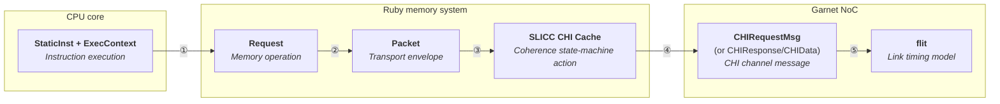
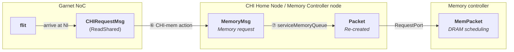

# Payload Journey: From a RISC-V Load to a Network Flit and DRAM (CHI)

**Audience:** Engineers studying gem5's Ruby memory system who want to understand
exactly what data travels through the Garnet network-on-chip and to the memory
controller — how a CPU instruction becomes CHI protocol messages, then flits, and
how the CHI Home Node bridges the NoC to DRAM.

---

## Table of Contents

1. [The Motivating Question](#1-the-motivating-question)
2. [End-to-End Overview: Six Types, Five Boundaries](#2-end-to-end-overview-six-types-five-boundaries)
3. [Stage 1 — Instruction Execution Creates a Request](#3-stage-1--instruction-execution-creates-a-request)
4. [Stage 2 — Request Is Wrapped in a Packet](#4-stage-2--request-is-wrapped-in-a-packet)
5. [Stage 3 — Packet Enters Ruby via the Sequencer](#5-stage-3--packet-enters-ruby-via-the-sequencer)
6. [Stage 4 — SLICC State Machine Creates a CHI Message](#6-stage-4--slicc-state-machine-creates-a-chi-message)
7. [CHI Messages in Depth](#7-chi-messages-in-depth)
8. [Size Classification: Control vs. Data](#8-size-classification-control-vs-data)
9. [Stage 5 — Flitization: Messages Become Flits](#9-stage-5--flitization-messages-become-flits)
10. [What the Router Sees](#10-what-the-router-sees)
11. [Reassembly at the Destination](#11-reassembly-at-the-destination)
12. [The Response Path: Flit Back to CPU](#12-the-response-path-flit-back-to-cpu)
    - [12.5. The Home-Node-to-Memory-Controller Path](#125-the-home-node-to-memory-controller-path)
13. [Virtual Networks: The Four CHI Channels](#13-virtual-networks-the-four-chi-channels)
14. [Multicast-to-Unicast Conversion](#14-multicast-to-unicast-conversion)
15. [Serialization and Deserialization (HeteroGarnet)](#15-serialization-and-deserialization-heterogarnet)
16. [Functional Access: Bypassing the Network](#16-functional-access-bypassing-the-network)
17. [Statistics: What the NI Measures](#17-statistics-what-the-ni-measures)
18. [Worked Example: ReadUnique Request (8 Bytes, 1 Flit)](#18-worked-example-readunique-request-8-bytes-1-flit)
19. [Worked Example: CompData_UC Response (72 Bytes, 5 Flits)](#19-worked-example-compdata_uc-response-72-bytes-5-flits)
20. [CHI Channel Summary](#20-chi-channel-summary)
21. [Common Misconceptions](#21-common-misconceptions)
22. [Key Ideas](#22-key-ideas)

---

## 1. The Motivating Question

You are staring at a Garnet router pipeline — five stages (IB → RC → SA → ST → LT), virtual channels,
credit-based flow control — and you wonder:
*what is actually inside those flits?*
Is it raw bytes of a cache line?
A serialized C++ object?
Some kind of header plus payload?

And stepping further back: when a RISC-V `lw` instruction executes on a CPU,
what happens to that load request as it travels through caches, CHI
coherence controllers, and the network-on-chip?
How many times is it re-packaged, and what is lost at each step?

This chapter answers both questions by tracing the complete path — from
instruction to flit and back — then zooming into each layer in detail.
Throughout, we use gem5's CHI (AMBA 5 Coherent Hub Interface) implementation
as the concrete protocol.

---

## 2. End-to-End Overview: Six Types, Five Boundaries

There are **six distinct payload types** and **five conversion boundaries**
between a CPU instruction and a Garnet flit.
Each boundary transforms the representation to serve a different abstraction
layer's needs.



Before diving into each stage, here is the summary:

1. [`StaticInst`](../../src/cpu/static_inst.hh#L88) + [`ExecContext`](../../src/cpu/exec_context.hh#L71) — Instruction execution: StaticInst provides the recipe (opcode, which registers), ExecContext provides runtime register values for effective address computation
2. [`Request`](../../src/mem/request.hh#L97) — Memory operation: physical address, size, flags, requestor
3. [`Packet`](../../src/mem/packet.hh#L294) — Transport envelope: MemCmd, data pointer, SenderState for return routing
4. [`RubyRequest`](../../src/mem/ruby/slicc_interface/RubyRequest.hh#L61) — Ruby bridge: maps Packet semantics to RubyRequestType, carries Packet back-pointer
5. [`CHIRequestMsg`](../../src/mem/ruby/protocol/chi/CHI-msg.sm#L103) — CHI channel message: CHIRequestType (ReadShared/ReadUnique/…) + address + transaction ID + destination
6. [`flit`](../../src/mem/ruby/network/garnet/flit.hh#L50) — Network timing unit: carries CHI message by pointer, adds routing and VC metadata

**The critical insight: the [`Packet`](../../src/mem/packet.hh#L294) never enters the network.**
The CHI cache state machine (boundary ④) is where CPU-world semantics are
translated into CHI-world semantics.
Everything the network carries is a CHI channel message — an address, a
transaction ID, a requestor, and a destination — wrapped in flits for
timing-accurate transport.

> **Deep Dive:** CHI's `CHIRequestMsg` is the one protocol message in gem5 that
> *does* carry a `seqReq` pointer to the original `RequestPtr`
> ([`CHI-msg.sm:115`](../../src/mem/ruby/protocol/chi/CHI-msg.sm#L115)).
> This is used for debugging and accAddr propagation, not for network routing —
> the Packet still stays in the Sequencer's request table, and the network
> never dereferences `seqReq`.

### The Home-Node-to-Memory Branch

The chain above covers the CPU → NoC path.
But when a CHI request reaches the **Home Node (HN)** and the data
is not cached in the System Level Cache (SLC), the HN must fetch from DRAM.
This creates a **branch off the main chain** with two additional payload types:



The CHI memory-controller node (the SLICC machine in
[`CHI-mem.sm`](../../src/mem/ruby/protocol/chi/CHI-mem.sm)) acts as a **gateway**:
it has MessageBuffers connected to the NoC on one side, and a standard
`RequestPort` connected directly to `MemCtrl` on the other.
The DRAM controller is **not** on the Garnet NoC — it sees only `Packet`
objects, the same interface used by Classic caches.
See [Section 12.5](#125-the-home-node-to-memory-controller-path) for the full
walkthrough.

### What Each Conversion Discards and Adds

Most conversions are **lossy projections** — they keep what the next layer needs
and drop what it doesn't (though boundaries ② and ⑤ are lossless wrappers).

| Boundary | What Is Kept | What Is Added | What Is Lost / Left Behind |
|----------|-------------|---------------|---------------------------|
| ① [`StaticInst`](../../src/cpu/static_inst.hh#L88) + [`ExecContext`](../../src/cpu/exec_context.hh#L71) → [`Request`](../../src/mem/request.hh#L97) | Effective address (from registers + immediate), size, access mode | `_requestorId`, `_pc`, `_contextId`, flag encoding | Register operands, instruction encoding, pipeline state |
| ② [`Request`](../../src/mem/request.hh#L97) → [`Packet`](../../src/mem/packet.hh#L294) | All of Request (by pointer) | `MemCmd`, `data` pointer, `SenderState` stack | Nothing lost — Packet holds `RequestPtr` |
| ③ [`Packet`](../../src/mem/packet.hh#L294) → [`RubyRequest`](../../src/mem/ruby/slicc_interface/RubyRequest.hh#L61) | Address, size, access type, PC, prefetch | `m_LineAddress` (aligned), `RubyRequestType`, `m_pkt` back-pointer | `MemCmd` mapped to `RubyRequestType` (mostly a rename); SenderState stays in Packet |
| ④ [`RubyRequest`](../../src/mem/ruby/slicc_interface/RubyRequest.hh#L61) → [`CHIRequestMsg`](../../src/mem/ruby/protocol/chi/CHI-msg.sm#L103) | Address, access mode, access size (`accAddr`, `accSize`), `seqReq` pointer | `CHIRequestType` (Load/Store/…), `txnId`, `Destination`, `requestor`, `MessageSizeType` | **Packet pointer**, PC, thread context — retained in Sequencer's request table; the RubyRequest is dequeued after `AllocateTBE_SeqRequest` |
| ⑤ [`CHIRequestMsg`](../../src/mem/ruby/protocol/chi/CHI-msg.sm#L103) → [`flit`](../../src/mem/ruby/network/garnet/flit.hh#L50) | Entire CHI message (by pointer) | `RouteInfo`, `m_vc`, `m_vnet`, `flit_type`, pipeline stage | Nothing lost — flit holds `MsgPtr` |

The most notable boundary is **④**: this is where most CPU-world information
(the [`Packet`](../../src/mem/packet.hh#L294), the PC, the thread context) is
left behind.
From this point forward, the network carries only CHI channel semantics.

The rest of this chapter walks through each stage in detail.

---

## 3. Stage 1 — Instruction Execution Creates a Request

This is where the journey begins: inside the CPU pipeline.
A RISC-V instruction like `lw x5, 0(x10)` has been fetched, decoded, and is now executing.
The CPU knows what operation to perform (a 4-byte load), and it has read the base register (`x10`) to compute an effective address.
But the CPU pipeline deals in registers, opcodes, and execution contexts — it has no concept of cache lines, coherence states, or network routing.
It must distill the instruction down to a pure memory operation: "read 4 bytes from physical address X."
That distilled representation is the `Request` object — a separation between the instruction world (which register to write, what PC we're at, what privilege mode we're in) and the memory world (what address, how many bytes, what kind of access).

The ISA decoder template calls a CPU memory-access method:

**ISA template** ([`src/arch/riscv/isa/formats/mem.isa:149`](../../src/arch/riscv/isa/formats/mem.isa#L149)):

```cpp
// LoadInitiateAcc template (simplified)
Fault %(class_name)s::initiateAcc(ExecContext *xc, ...) const
{
    Addr EA = Rs1 + offset;   // effective address from register + immediate
    return initiateMemRead(xc, traceData, EA, Mem, memAccessFlags);
}
```

For a store, the template calls `writeMemTimingLE()` instead.
These delegate to the CPU model.

**TimingSimpleCPU** ([`src/cpu/simple/timing.cc:468`](../../src/cpu/simple/timing.cc#L468)):

```cpp
RequestPtr req = std::make_shared<Request>(
    addr, size, flags, dataRequestorId(), pc, thread->contextId());
```

### What Is a Request?

A [`Request`](../../src/mem/request.hh#L97) captures the *memory operation
semantics* — what the CPU wants to do, independent of how it will be
transported:

```
┌─────────────────────────────────────────────────┐
│                   Request                       │
├─────────────────┬───────────────────────────────┤
│ _paddr          │ Physical address (after MMU)  │
│ _vaddr          │ Virtual address               │
│ _size           │ Access size (1, 2, 4, 8 bytes)│
│ _flags          │ INST_FETCH, UNCACHEABLE,      │
│                 │ LOCKED_RMW, LLSC, PREFETCH,...│
│ _requestorId    │ Who issued this (CPU0, DMA,..)│
│ _pc             │ Program counter of the insn   │
│ _contextId      │ Hardware thread ID            │
│ _byteEnable     │ Byte-enable mask for writes   │
│ atomicOpFunctor │ Lambda for AMO operations     │
└─────────────────┴───────────────────────────────┘
```

`RequestPtr` is a `std::shared_ptr<Request>` — the `Request` outlives any
single `Packet` built from it.

> **Key point:** The `Request` knows *what* memory operation to perform but
> nothing about *how* to transport it through the memory hierarchy.

---

## 4. Stage 2 — Request Is Wrapped in a Packet

The `Request` captures *what* the CPU wants from memory, but it says nothing about *how* to move that request through the interconnect.
gem5's memory system is built on a port-based architecture where components communicate by sending `Packet` objects through connected ports — every cache, crossbar, and memory controller speaks this common language.
So the CPU must wrap its `Request` inside a `Packet` before anything else in the memory hierarchy can process it.
The `Packet` adds transport machinery on top of the `Request`: a command enum (`MemCmd`), a data pointer, and a `SenderState` stack for routing responses back.
The command is derived from the `Request`'s flags — a locked load becomes `LoadLockedReq`, a prefetch becomes `SoftPFReq`, and a plain load becomes `ReadReq`.

**Packet creation** ([`src/cpu/simple/timing.cc:415`](../../src/cpu/simple/timing.cc#L415)):

```cpp
PacketPtr buildPacket(const RequestPtr &req, bool read) {
    return read ? Packet::createRead(req) : Packet::createWrite(req);
}
```

**`Packet::createRead()`** ([`src/mem/packet.hh:1037`](../../src/mem/packet.hh#L1037)):

```cpp
static PacketPtr createRead(const RequestPtr &req) {
    return new Packet(req, makeReadCmd(req));
}
```

**`makeReadCmd()`** ([`src/mem/packet.hh:993`](../../src/mem/packet.hh#L993))
inspects the Request flags to choose the right command:

```cpp
static MemCmd makeReadCmd(const RequestPtr &req) {
    if (req->isHTMCmd())         return MemCmd::HTMReq;
    else if (req->isLLSC())      return MemCmd::LoadLockedReq;
    else if (req->isPrefetch())  return MemCmd::SoftPFReq;
    else if (req->isLockedRMW()) return MemCmd::LockedRMWReadReq;
    else                         return MemCmd::ReadReq;
}
```

### What Is a Packet?

```
┌─────────────────────────────────────────────────┐
│                    Packet                       │
├─────────────────┬───────────────────────────────┤
│ cmd             │ MemCmd (ReadReq, WriteReq,    │
│                 │   LoadLockedReq, SwapReq, ..) │
│ req             │ RequestPtr → original Request │
│ addr            │ Physical address (from req)   │
│ size            │ Access size (from req)        │
│ data            │ Pointer to payload bytes      │
│                 │   (for writes and responses)  │
│ senderState     │ Stack of opaque state objects │
│                 │   (for routing responses back)│
│ headerDelay     │ Accumulated interconnect delay│
│ payloadDelay    │ Pipeline serialization delay  │
└─────────────────┴───────────────────────────────┘
```

The `Packet` adds three things the `Request` didn't have:
1. **`MemCmd`** — a transport-level command enum (`ReadReq`, `WriteReq`,
   `WritebackDirty`, etc.) derived from the Request flags
2. **`data` pointer** — for writes, points to the bytes to store;
   for read responses, points to the returned data
3. **`SenderState` stack** — an opaque linked list that lets each layer
   push its own bookkeeping so responses can be routed back

The `Packet` is the universal currency of gem5's memory system.
Every component — CPU, cache, crossbar, memory controller — speaks `Packet`.

---

## 5. Stage 3 — Packet Enters Ruby via the Sequencer

This stage is where the `Packet` crosses the boundary between gem5's generic memory system and Ruby's CHI world.
The `RubyPort` acts as an adapter: it receives the `Packet` from the CPU's port interface (the same interface a Classic cache would use) and hands it to the `Sequencer`, which is Ruby's front door.
The Sequencer maps the `Packet`'s `MemCmd` to a `RubyRequestType` — for the common cases (`ReadReq` → `LD`, `WriteReq` → `ST`) this is little more than a rename across a subsystem boundary, but `MemCmd` is a much larger enum (~60 values covering writebacks, clean evictions, cache maintenance, and other transport-level operations that never come from the CPU), so the mapping also filters down to just the request types that the CHI cache state machine cares about (loads, stores, atomics, LL/SC).
It then creates a `RubyRequest` message and enqueues it into the "mandatory queue" — the `MessageBuffer` that feeds the CHI cache controller's SLICC state machine.

**RubyPort entry** ([`RubyPort.cc:293`](../../src/mem/ruby/system/RubyPort.cc#L293)):

```cpp
bool RubyPort::MemResponsePort::recvTimingReq(PacketPtr pkt)
{
    // Push sender state so we can route the response back
    pkt->pushSenderState(new SenderState(this));

    // Delegate to the Sequencer
    RequestStatus requestStatus = owner.makeRequest(pkt);
    ...
}
```

The [`Sequencer`](../../src/mem/ruby/system/Sequencer.cc)
([`Sequencer.cc:949`](../../src/mem/ruby/system/Sequencer.cc#L949))
maps the Packet's `MemCmd` to a `RubyRequestType`:

| Packet MemCmd | RubyRequestType |
|---------------|-----------------|
| `ReadReq` | `RubyRequestType_LD` |
| `ReadReq` (ifetch) | `RubyRequestType_IFETCH` |
| `WriteReq` | `RubyRequestType_ST` |
| `LoadLockedReq` | `RubyRequestType_Load_Linked` |
| `StoreCondReq` | `RubyRequestType_Store_Conditional` |
| `SwapReq` | `RubyRequestType_ATOMIC_RETURN` |

Then `issueRequest()` ([`Sequencer.cc:1086`](../../src/mem/ruby/system/Sequencer.cc#L1086))
creates a [`RubyRequest`](../../src/mem/ruby/slicc_interface/RubyRequest.hh#L61)
message:

```cpp
msg = std::make_shared<RubyRequest>(
    clockEdge(), blk_size, m_ruby_system,
    pkt->getAddr(), pkt->getSize(),
    pc, secondary_type, RubyAccessMode_Supervisor,
    pkt, PrefetchBit_No, proc_id, core_id);
```

### What Is a RubyRequest?

`RubyRequest` inherits from `Message` (the base class for all Ruby messages).
It is a bridge between the Packet world and the SLICC protocol world:

```
┌─────────────────────────────────────────────────┐
│                 RubyRequest                     │
│            (extends Message)                    │
├─────────────────┬───────────────────────────────┤
│ m_PhysicalAddress│ Physical address (from pkt)  │
│ m_LineAddress   │ Cache-line-aligned address    │
│ m_Type          │ RubyRequestType (LD, ST, ..)  │
│ m_ProgramCounter│ PC (from Request)             │
│ m_AccessMode    │ Supervisor / User             │
│ m_Size          │ Access size (from pkt)        │
│ m_Prefetch      │ Prefetch indicator            │
│ m_pkt           │ PacketPtr → original Packet   │
│ m_contextId     │ Hardware thread ID            │
│ m_writeMask     │ Byte mask for atomics         │
│ m_WTData        │ DataBlock for write-through   │
└─────────────────┴───────────────────────────────┘
```

The `RubyRequest` is enqueued into the **mandatory queue** — a `MessageBuffer`
that connects the Sequencer to the CHI cache controller's SLICC state machine:

```cpp
// Sequencer.cc:1172
m_mandatory_q_ptr->enqueue(msg, clockEdge(), latency, ...);
```

> **Key point:** The `RubyRequest` still carries a back-pointer to the original
> `Packet` (`m_pkt`).
> This pointer is used later when the protocol completes the request — the
> Sequencer retrieves the `Packet`, fills in the response data, and sends it
> back to the CPU.
> But this pointer never enters the network.

---

## 6. Stage 4 — SLICC State Machine Creates a CHI Message

The CHI cache controller is a SLICC-generated state machine
([`CHI-cache.sm`](../../src/mem/ruby/protocol/chi/CHI-cache.sm)): it receives
the `RubyRequest` from the mandatory queue, looks up the cache line's current
coherence state, and decides what to do.
If the line is already present in the right state (for example, the cache
has it in UD and the CPU wants a store), the request can be satisfied
locally with no network traffic at all.
But on a cache miss, the state machine must ask the rest of the memory system
for help by creating a CHI request message — a `CHIRequestMsg` — and enqueuing
it into a `MessageBuffer` connected to the network.
This is the boundary where most CPU-world information (the `Packet`, the PC,
the thread context) is left behind: the `CHIRequestMsg` carries only CHI
semantics, and the Sequencer retains everything else for later completion.

### From Mandatory Queue to Internal Ready Queue

The CHI cache separates request reception into two stages: a request first
enters an internal `reqRdy` buffer (with a reserved TBE slot), and only then
is it turned into an outgoing network message.
The step from the sequencer's mandatory queue into the internal queue is
handled by `AllocateTBE_SeqRequest`.

**Mandatory queue reception**
([`CHI-cache-ports.sm:398`](../../src/mem/ruby/protocol/chi/CHI-cache-ports.sm#L398)):

```slicc
in_port(seqInPort, RubyRequest, mandatoryQueue, rank=1) {
  if (seqInPort.isReady(clockEdge())) {
    peek(seqInPort, RubyRequest) {
      trigger(Event:AllocSeqRequest, in_msg.LineAddress,
              getCacheEntry(in_msg.LineAddress),
              getCurrentActiveTBE(in_msg.LineAddress));
    }
  }
}
```

**Action `AllocateTBE_SeqRequest`**
([`CHI-cache-actions.sm:140`](../../src/mem/ruby/protocol/chi/CHI-cache-actions.sm#L140)):

```slicc
// Move request to rdy queue
peek(seqInPort, RubyRequest) {
  enqueue(reqRdyOutPort, CHIRequestMsg, allocation_latency) {
    out_msg.addr    := in_msg.LineAddress;
    out_msg.accAddr := in_msg.PhysicalAddress;
    out_msg.accSize := in_msg.Size;
    out_msg.requestor    := machineID;
    out_msg.fwdRequestor := machineID;
    out_msg.seqReq       := in_msg.getRequestPtr();
    out_msg.isSeqReqValid := true;
    out_msg.txnId := max_outstanding_transactions;

    if ((in_msg.Type == RubyRequestType:LD) ||
        (in_msg.Type == RubyRequestType:IFETCH)) {
      out_msg.type := CHIRequestType:Load;
    } else if (in_msg.Type == RubyRequestType:ST) {
      if (in_msg.Size == blockSize) {
        out_msg.type := CHIRequestType:StoreLine;
      } else {
        out_msg.type := CHIRequestType:Store;
      }
    } else if (in_msg.Type == RubyRequestType:ATOMIC_RETURN) {
      out_msg.type := CHIRequestType:AtomicLoad;
    } else if (in_msg.Type == RubyRequestType:ATOMIC_NO_RETURN) {
      out_msg.type := CHIRequestType:AtomicStore;
    }
  }
}
seqInPort.dequeue(clockEdge());
```

Note the subtlety: the CHI cache's internal `CHIRequestType:Load/Store/StoreLine`
values are *sequencer-facing* and never enter the network.
They tell the state machine what the CPU originally asked for, so that when
the transaction eventually completes, the controller knows whether to call
back a load hit, a store hit, or an atomic.

### From Internal Ready Queue to the Network

A cache miss causes the state machine to issue one of the **CHI request
types that actually travel on the network** — `ReadShared`, `ReadUnique`,
`MakeReadUnique`, `CleanUnique`, `WriteBackFull`, etc.

**Action `Send_ReadShared`**
([`CHI-cache-actions.sm:1553`](../../src/mem/ruby/protocol/chi/CHI-cache-actions.sm#L1553))
— issued on a clean read miss:

```slicc
enqueue(reqOutPort, CHIRequestMsg, request_latency) {
  if (allow_SD) {
    prepareRequest(tbe, CHIRequestType:ReadShared, out_msg);
  } else {
    prepareRequest(tbe, CHIRequestType:ReadNotSharedDirty, out_msg);
  }
  out_msg.Destination.add(mapAddressToDownstreamMachine(tbe.addr));
  out_msg.dataToFwdRequestor := false;
  allowRequestRetry(tbe, out_msg);
}
```

**Action `Send_ReadUnique`**
([`CHI-cache-actions.sm:1644`](../../src/mem/ruby/protocol/chi/CHI-cache-actions.sm#L1644))
— issued on a write miss that needs exclusive ownership:

```slicc
enqueue(reqOutPort, CHIRequestMsg, request_latency) {
  prepareRequest(tbe, CHIRequestType:ReadUnique, out_msg);
  out_msg.Destination.add(mapAddressToDownstreamMachine(tbe.addr));
  out_msg.dataToFwdRequestor := false;
  allowRequestRetry(tbe, out_msg);
}
```

**This is the critical conversion.**
The `RubyRequest` (which knows about load/store semantics, the original Packet,
the PC, the access mode) has been consumed by the sequencer-to-rdy step.
What eventually leaves the cache is a `CHIRequestMsg` on the `reqOut` channel —
a pure CHI message that knows only about a cache-line address, a CHI request
type (ReadShared/ReadUnique/CleanUnique/…), a transaction ID, a requestor ID,
and a destination.

The `CHIRequestMsg` is enqueued into the `reqOut` `MessageBuffer` (vnet 0),
which is connected to the Garnet `NetworkInterface`.

> **Key point:** While `CHIRequestMsg` does carry a `seqReq` pointer
> ([`CHI-msg.sm:115`](../../src/mem/ruby/protocol/chi/CHI-msg.sm#L115)), the
> network never dereferences it — functional reads on `CHIRequestMsg` always
> return `false`
> ([`CHI-msg.sm:131`](../../src/mem/ruby/protocol/chi/CHI-msg.sm#L131)), and
> routing uses only `Destination` and `MessageSize`.
> The Packet stays in the Sequencer's request table, indexed by address.
> When the CHI response eventually arrives and the transaction completes, the
> Sequencer looks up the address and completes the original `Packet`.
> The network never sees the `Packet` contents.

### The Back-Pointer Chain During Network Transit

At any point during network transit, you can follow the pointer chain from
a flit back to the CHI message, but the `Packet` is unreachable from the
network:

```
flit.m_msg_ptr ──▶ CHIRequestMsg
                      │
                      │ (carries seqReq pointer but NI never uses it;
                      │  routing uses only Destination + MessageSize)
                      │
                      ╳  The Packet lives in Sequencer::m_RequestTable,
                         indexed by address, unreachable from the network.
```

This is by design.
The network is a **stateless transport** — it doesn't need to know that the
ReadUnique for address `0x1000` originated from a `sw` instruction at PC
`0x8004` executed by thread 3.
It only needs to move the message from router 0 to router 3 with correct
timing.

---

## 7. CHI Messages in Depth

Now that we have seen how CHI messages are created, it is worth understanding
what they actually look like.
CHI defines three concrete `Message` subclasses — one for each of the four
network channels (REQ and SNP share the same `CHIRequestMsg` structure, just
enqueued on different vnets).
All three inherit from the common `Message` base class that provides the
minimal interface the network needs.
This means the network transports CHI messages without understanding their
contents — it only reads the base-class metadata.

### The Base Class

Every message that enters the Garnet network inherits from
[`Message`](../../src/mem/ruby/slicc_interface/Message.hh#L62).
This base class provides:

```cpp
// src/mem/ruby/slicc_interface/Message.hh (simplified)
class Message {
  public:
    virtual MsgPtr clone() const = 0;
    virtual const MessageSizeType& getMessageSize() const;
    virtual const NetDest& getDestination() const;
    int getVnet() const { return vnet; }

  private:
    Tick m_time;              // creation timestamp
    Tick m_LastEnqueueTime;   // when last enqueued
    Tick m_DelayedTicks;      // accumulated delay
    int incoming_link;        // which link delivered this
    int vnet;                 // virtual network assignment
};
```

The key contract: every message knows its **destination** (`NetDest`), its
**size category** (`MessageSizeType`), and its **virtual network** (`vnet`).

### The Three CHI Message Structures

CHI's SLICC definitions are in
[`CHI-msg.sm`](../../src/mem/ruby/protocol/chi/CHI-msg.sm).
The SLICC compiler generates C++ classes that inherit from `Message`.

**`CHIRequestMsg`** — used on both REQ (vnet 0) and SNP (vnet 1) channels.
Carries requests and snoops
([`CHI-msg.sm:103`](../../src/mem/ruby/protocol/chi/CHI-msg.sm#L103)):

```slicc
structure(CHIRequestMsg, desc="", interface="Message") {
  Addr addr,                 // cache line physical address
  Addr accAddr,              // original access address (Write*Ptl / seq)
  int  accSize,              // access size (Write*Ptl / seq)
  CHIRequestType type,       // ReadShared, ReadUnique, SnpUnique, ...
  MachineID requestor,       // who sent this
  MachineID fwdRequestor,    // DMT/DCT forward target
  bool dataToFwdRequestor,
  bool retToSrc,             // affects whether snoop resp returns data
  bool allowRetry,           // CHI retry handshake
  NetDest Destination,

  RequestPtr seqReq,         // optional back-pointer (debug only on the NoC)
  bool isSeqReqValid,

  bool is_local_pf,
  bool is_remote_pf,

  WriteMask atomic_op,       // atomic operation wrapper

  bool usesTxnId,            // true if this message uses a transaction ID
  Addr txnId,                // transaction ID
  bool ns,                   // NonSecure bit
  uint8_t lpid,              // logical processor ID

  MessageSizeType MessageSize, default="MessageSizeType_Control";
}
```

**`CHIResponseMsg`** — used on the RSP channel (vnet 2).  Carries
completions, snoop responses, retry acks, and credit grants
([`CHI-msg.sm:166`](../../src/mem/ruby/protocol/chi/CHI-msg.sm#L166)):

```slicc
structure(CHIResponseMsg, desc="", interface="Message") {
  Addr addr,
  CHIResponseType type,      // Comp_I/UC/UD_PD, CompAck, DBIDResp,
                             // SnpResp_*, RetryAck, PCrdGrant, ...
  MachineID responder,
  NetDest Destination,
  bool stale,
  bool usesTxnId,
  Addr txnId,
  Addr dbid,                 // data buffer ID for separated data/resp
  uint8_t lpid,

  MessageSizeType MessageSize, default="MessageSizeType_Control";
}
```

**`CHIDataMsg`** — used on the DAT channel (vnet 3).  Carries all payload
data: completion data, snoop response data, writeback data
([`CHI-msg.sm:217`](../../src/mem/ruby/protocol/chi/CHI-msg.sm#L217)):

```slicc
structure(CHIDataMsg, desc="", interface="Message") {
  Addr addr,
  CHIDataType type,          // CompData_UC, CompData_UD_PD, CBWrData_*,
                             // SnpRespData_*, NCBWrData, ...
  MachineID responder,
  NetDest Destination,
  DataBlock dataBlk,         // the bytes of the (partial) cache line
  WriteMask bitMask,         // which bytes of dataBlk are valid
  bool usesTxnId,
  Addr txnId,

  MessageSizeType MessageSize, default="MessageSizeType_Data";
}
```

### Key CHI-Specific Fields

Compared with a minimalist coherence message, CHI adds:

- **Transaction IDs (`txnId`, `usesTxnId`).** Each CHI transaction is
  identified by a txnId chosen by the requestor.  The ID lets responses
  reach the right outstanding transaction on the receiver without needing
  address-based lookup (important for DVM transactions, which have no
  address, and for partial data transfers that span multiple DAT flits).
- **Partial data via `WriteMask bitMask`.** A single `CHIDataMsg` may
  cover only part of a cache line.  The sender sets `bitMask` to the
  bytes it carries, and the receiver accumulates multiple `CHIDataMsg`s
  until the line is complete.  Each partial packet's network size still
  equals `data_msg_size` — this is a modeling choice, see
  [Section 8](#8-size-classification-control-vs-data).
- **Separate REQ and SNP channels sharing one structure.** The
  `CHIRequestType` enum mixes both request-from-requestor types (Read*,
  Write*, Evict, CleanUnique) and snoop types (Snp*, SnpResp routing).
  The state machine routes them to different output ports — `reqOutPort`
  for REQ, `snpOutPort` for SNP — so they land on different vnets even
  though they share a C++ class.

### What Other Protocols Look Like

| Protocol | Message Structures | CHI Equivalent |
|----------|-------------------|----------------|
| CHI | **CHIRequestMsg, CHIResponseMsg, CHIDataMsg** | — |
| Classic coherence protocols (MESI, MOESI, MI) | `RequestMsg` + `ResponseMsg` (sometimes DMA variants) | Fewer vnets, no transaction IDs, `DataBlk` embedded in response |

The rest of this chapter sticks to CHI.

---

## 8. Size Classification: Control vs. Data

Before a CHI message can be broken into flits, the network needs to know how large it is — but it does not inspect the message's C++ fields to figure this out.
Instead, every CHI message carries a `MessageSizeType` tag that the SLICC protocol assigns at creation time.
Despite a large enum of possible values, they all resolve to just two byte sizes: "control" (~8 bytes) and "data" (~72 bytes with a 64-byte cache line).
This is a modeling abstraction: the byte sizes represent what a real NoC would need to transfer on its physical links, not the size of the simulator's C++ objects.
A `CHIDataMsg` might occupy hundreds of bytes on the heap (with its `DataBlock` field, vtable pointer, and padding), but the network treats it as 72 bytes because its tag says "data."

In CHI, the defaults line up naturally:

- `CHIRequestMsg` defaults to `MessageSizeType_Control`
  ([`CHI-msg.sm:128`](../../src/mem/ruby/protocol/chi/CHI-msg.sm#L128))
- `CHIResponseMsg` defaults to `MessageSizeType_Control`
  ([`CHI-msg.sm:178`](../../src/mem/ruby/protocol/chi/CHI-msg.sm#L178))
- `CHIDataMsg` defaults to `MessageSizeType_Data`
  ([`CHI-msg.sm:227`](../../src/mem/ruby/protocol/chi/CHI-msg.sm#L227))

### The MessageSizeType Enum

The enum is defined in
[`RubySlicc_Exports.sm`](../../src/mem/ruby/protocol/RubySlicc_Exports.sm#L294):

```slicc
enumeration(MessageSizeType, desc="...") {
  Control,              desc="Control Message";
  Data,                 desc="Data Message";
  Request_Control,      desc="Request";
  Reissue_Control,      desc="Reissued request";
  Response_Data,        desc="data response";
  ResponseL2hit_Data,   desc="data response";
  ResponseLocal_Data,   desc="data response";
  Response_Control,     desc="non-data response";
  Writeback_Data,       desc="Writeback data";
  Writeback_Control,    desc="Writeback control";
  Broadcast_Control,    desc="Broadcast control";
  Multicast_Control,    desc="Multicast control";
  Forwarded_Control,    desc="Forwarded control";
  Invalidate_Control,   desc="Invalidate control";
  Unblock_Control,      desc="Unblock control";
  Persistent_Control,   desc="Persistent request activation messages";
  Completion_Control,   desc="Completion messages";
}
```

### The Size Mapping

[`Network::MessageSizeType_to_int()`](../../src/mem/ruby/network/Network.cc#L166)
maps every enum value to a byte count:

```cpp
// src/mem/ruby/network/Network.cc, line 166
uint32_t
Network::MessageSizeType_to_int(MessageSizeType size_type)
{
    switch(size_type) {
      case MessageSizeType_Control:
      case MessageSizeType_Request_Control:
      case MessageSizeType_Reissue_Control:
      case MessageSizeType_Response_Control:
      case MessageSizeType_Writeback_Control:
      case MessageSizeType_Broadcast_Control:
      case MessageSizeType_Multicast_Control:
      case MessageSizeType_Forwarded_Control:
      case MessageSizeType_Invalidate_Control:
      case MessageSizeType_Unblock_Control:
      case MessageSizeType_Persistent_Control:
      case MessageSizeType_Completion_Control:
        return m_control_msg_size;         // default: 8 bytes

      case MessageSizeType_Data:
      case MessageSizeType_Response_Data:
      case MessageSizeType_ResponseLocal_Data:
      case MessageSizeType_ResponseL2hit_Data:
      case MessageSizeType_Writeback_Data:
        return m_data_msg_size;            // default: block_size + 8 bytes
    }
}
```

### Default Sizes

The defaults come from [`Network.py`](../../src/mem/ruby/network/Network.py):

```python
# src/mem/ruby/network/Network.py, lines 54-69
control_msg_size = Param.Int(8, "")
data_msg_size = Param.Int(
    Parent.block_size_bytes,     # defaults to cache line size (typically 64)
    "Size of data messages..."
)
```

And in the C++ constructor
([`Network.cc`](../../src/mem/ruby/network/Network.cc#L62)):

```cpp
m_control_msg_size = p.control_msg_size;                     // 8
m_data_msg_size = p.data_msg_size + m_control_msg_size;      // 64 + 8 = 72
```

So with default settings:

| Message Category | Byte Size | What It Represents |
|------------------|-----------|--------------------|
| Control (CHIRequestMsg, CHIResponseMsg) | 8 bytes | Address + CHI command/header overhead |
| Data (CHIDataMsg) | 72 bytes | 64-byte cache line + 8-byte header |

> **Deep Dive:** CHI also exposes a `data_channel_size` parameter on each node
> (see [`CHI-cache.sm:116`](../../src/mem/ruby/protocol/chi/CHI-cache.sm#L116)
> and the default of 32 bytes in
> [`memory_controller.py:72`](../../src/python/gem5/components/cachehierarchies/chi/nodes/memory_controller.py#L72)).
> This parameter controls how many **CHIDataMsg packets** the protocol emits
> per cache line (a 64-byte line with `data_channel_size=32` produces two
> DAT messages), modeling CHI's beat-granular data channel.  Each of those
> DAT messages is still tagged `MessageSizeType_Data` and is flitized
> independently — so a full cache-line transfer is **two 5-flit packets**
> rather than one 9-flit packet, which changes contention behavior even
> though the total bandwidth is identical.  This is distinct from
> `data_msg_size`, which controls the **per-message** flit count.

---

## 9. Stage 5 — Flitization: Messages Become Flits

This is the final conversion in the chain, and it is where CHI messages cross into the network timing domain.
The `NetworkInterface` (NI) sits between each CHI controller and its attached Garnet router — it is the border station where `MessageBuffer` queues on each of the four CHI channels meet the flit-based network.
When a CHI message is ready to send, the NI's `flitisizeMessage()` method breaks it into one or more flits based on the message's `MessageSizeType` and the link's flit width.
The NI also handles VC allocation (stalling if no free VC is available within the message's vnet) and route computation (filling in source and destination router IDs).
What may be surprising is what flitization does *not* do — detailed below.

### Entry Point

When a CHI controller (e.g., the CHI cache) wants to send a message, it
enqueues it into a [`MessageBuffer`](../../src/mem/ruby/network/MessageBuffer.hh#L74)
that is connected to the
[`NetworkInterface`](../../src/mem/ruby/network/garnet/NetworkInterface.hh#L62)
(NI).
Each CHI node has four such MessageBuffers on the `To` side (one per CHI
channel) and four on the `From` side
([`CHI-cache.sm:189`](../../src/mem/ruby/protocol/chi/CHI-cache.sm#L189)):

```slicc
MessageBuffer * reqOut,   network="To", virtual_network="0", vnet_type="none";
MessageBuffer * snpOut,   network="To", virtual_network="1", vnet_type="none";
MessageBuffer * rspOut,   network="To", virtual_network="2", vnet_type="none";
MessageBuffer * datOut,   network="To", virtual_network="3", vnet_type="response";
```

During `GarnetNetwork::init()` ([`GarnetNetwork.cc:115`](../../src/mem/ruby/network/garnet/GarnetNetwork.cc#L115)),
each NI is connected to its node's MessageBuffers:

```cpp
for (int i = 0; i < m_nodes; i++) {
    m_nis[i]->addNode(m_toNetQueues[i], m_fromNetQueues[i]);
}
```

The `addNode()` method ([`NetworkInterface.cc:131`](../../src/mem/ruby/network/garnet/NetworkInterface.cc#L131))
stores these buffers and registers the NI as a consumer:

```cpp
void NetworkInterface::addNode(vector<MessageBuffer *>& in,
                               vector<MessageBuffer *>& out) {
    inNode_ptr = in;      // one MessageBuffer per vnet (from protocol)
    outNode_ptr = out;    // one MessageBuffer per vnet (to protocol)
    for (auto& it : in) {
        if (it != nullptr)
            it->setConsumer(this);   // NI wakes up when message arrives
    }
}
```

### The NI Wakeup

Every cycle, `NetworkInterface::wakeup()`
([`NetworkInterface.cc:192`](../../src/mem/ruby/network/garnet/NetworkInterface.cc#L192))
checks each vnet for ready messages:

```cpp
for (int vnet = 0; vnet < inNode_ptr.size(); ++vnet) {
    MessageBuffer *b = inNode_ptr[vnet];
    if (b == nullptr) continue;

    if (b->isReady(curTime)) {
        msg_ptr = b->peekMsgPtr();
        if (flitisizeMessage(msg_ptr, vnet)) {
            b->dequeue(curTime);
        }
    }
}
```

One message per vnet per cycle can be consumed.

### The Flitization Algorithm

[`NetworkInterface::flitisizeMessage()`](../../src/mem/ruby/network/garnet/NetworkInterface.cc#L374)
is where the conversion happens.
Here is the algorithm step by step:

**Step 1 — Compute flit count:**

```cpp
// NetworkInterface.cc, line 386
int num_flits = (int)divCeil(
    (float) m_net_ptr->MessageSizeType_to_int(net_msg_ptr->getMessageSize()),
    (float) oPort->bitWidth());
```

With defaults (16-byte flit width):
- `CHIRequestMsg` / `CHIResponseMsg`: $\lceil 8 / 16 \rceil = 1$ flit
- `CHIDataMsg`: $\lceil 72 / 16 \rceil = 5$ flits

**Step 2 — Allocate a virtual channel:**

```cpp
// NetworkInterface.cc, line 397
int vc = calculateVC(vnet);
if (vc == -1) return false;   // no free VC — stall, try again next cycle
```

VC allocation uses round-robin within the vnet's VC pool.
If all VCs for this vnet are occupied, the message remains in the
`MessageBuffer` until a VC frees up.

**Step 3 — Build RouteInfo:**

```cpp
// NetworkInterface.cc, line 434
RouteInfo route;
route.vnet = vnet;
route.net_dest = new_net_msg_ptr->getDestination();
route.src_ni = m_id;
route.src_router = oPort->routerID();
route.dest_ni = destID;
route.dest_router = m_net_ptr->get_router_id(destID, vnet);
route.hops_traversed = -1;   // first router increments to 0
```

**Step 4 — Create flits:**

```cpp
// NetworkInterface.cc, line 449
for (int i = 0; i < num_flits; i++) {
    flit *fl = new flit(packet_id, i, vc, vnet, route, num_flits,
                        new_msg_ptr,                          // <-- shared_ptr!
                        m_net_ptr->MessageSizeType_to_int(
                            net_msg_ptr->getMessageSize()),
                        oPort->bitWidth(), curTick());
    fl->set_src_delay(curTick() - msg_ptr->getTime());
    niOutVcs[vc].insert(fl);
}
```

### The Critical Insight: Shared Pointer, Not Serialized Data

Look at the flit constructor ([`flit.cc:46`](../../src/mem/ruby/network/garnet/flit.cc#L46)):

```cpp
flit::flit(int packet_id, int id, int vc, int vnet, RouteInfo route,
           int size, MsgPtr msg_ptr, int MsgSize, uint32_t bWidth,
           Tick curTime)
{
    m_size = size;
    m_msg_ptr = msg_ptr;      // ← stores the shared_ptr to the SAME message
    m_enqueue_time = curTime;
    m_packet_id = packet_id;
    m_id = id;                // flit index within packet (0, 1, 2, ...)
    m_vnet = vnet;
    m_vc = vc;
    m_route = route;
    m_stage.first = I_;
    m_width = bWidth;
    msgSize = MsgSize;

    if (size == 1) { m_type = HEAD_TAIL_; return; }
    if (id == 0)             m_type = HEAD_;
    else if (id == (size-1)) m_type = TAIL_;
    else                     m_type = BODY_;
}
```

Every flit in a packet stores `m_msg_ptr` — a `std::shared_ptr<Message>`
pointing to **the same original CHI message object**.
There is no byte-level serialization.
The HEAD flit, all BODY flits, and the TAIL flit all hold the same pointer.

**What does this mean?**

- **The flit count is purely a timing model.**
  A 5-flit `CHIDataMsg` occupies the link for 5 cycles (at 1 flit/cycle),
  correctly modeling the serialization latency of pushing 72 bytes through a
  16-byte-wide link.
- **No actual bytes are copied or packed.**
  The C++ `CHIDataMsg` object lives on the heap.
  Flits are lightweight wrappers that point to it.
- **Only the TAIL flit's pointer matters at the destination.**
  When the last flit arrives, the NI extracts the `MsgPtr` and delivers it to
  the CHI controller.
  The BODY flits' pointers are never used for delivery.

### Flit Type Assignment

The constructor assigns flit types based on position in the packet:

```
1-flit packet:   [HEAD_TAIL]

5-flit packet:   [HEAD] [BODY] [BODY] [BODY] [TAIL]
                  id=0   id=1   id=2   id=3   id=4
```

Only HEAD and HEAD_TAIL flits trigger route computation in the router.
BODY and TAIL flits follow the route established by their HEAD.

---

## 10. What the Router Sees

Once flits leave the NI and enter the Garnet router, the payload is completely opaque.
The router's pipeline stages — Input Buffering, Route Computation, Switch Allocation, Switch Traversal, and Link Traversal — operate entirely on flit-level metadata.
This section shows exactly which fields the router reads and which it ignores.

From the router's perspective, a flit is an opaque object with metadata:

```
┌──────────────────────────────────────────────────────┐
│                     flit                             │
├──────────────┬───────────────────────────────────────┤
│ m_type       │ HEAD_, BODY_, TAIL_, or HEAD_TAIL_    │
│ m_vnet       │ virtual network (0=REQ, 1=SNP,        │
│              │   2=RSP, 3=DAT)                       │
│ m_vc         │ virtual channel index                 │
│ m_route      │ RouteInfo {src, dest, hops}           │
│ m_outport    │ output port (set by RoutingUnit)      │
│ m_stage      │ pipeline stage + timestamp            │
│ m_packet_id  │ identifies which packet               │
│ m_id         │ flit index within packet              │
├──────────────┼───────────────────────────────────────┤
│ m_msg_ptr    │ shared_ptr<Message>  ← NEVER TOUCHED  │
│ m_width      │ flit width in bytes                   │
│ msgSize      │ original message size in bytes        │
└──────────────┴───────────────────────────────────────┘
```

The router's `InputUnit`, `SwitchAllocator`, `CrossbarSwitch`, and `OutputUnit`
**never inspect `m_msg_ptr`**.
They read only `m_type` (to know if route computation is needed), `m_vnet` and
`m_vc` (for VC management), `m_route` (for routing), and `m_stage` (for
pipeline scheduling).

This is a clean separation of concerns: CHI defines what messages mean, and
the network provides timing-accurate transport without understanding the
payload.

---

## 11. Reassembly at the Destination

"Reassembly" is a bit of a misnomer — since no byte-level serialization happened during flitization, there are no bytes to reassemble.
What the destination NI actually does is consume flits one at a time, return credits, and wait for the TAIL flit to deliver the CHI message to the protocol
([`NetworkInterface.cc:230-282`](../../src/mem/ruby/network/garnet/NetworkInterface.cc#L230)):

```cpp
flit *t_flit = inNetLink->consumeLink();
int vnet = t_flit->get_vnet();

if (t_flit->get_type() == TAIL_ || t_flit->get_type() == HEAD_TAIL_) {
    // End of packet — deliver message to protocol
    if (outNode_ptr[vnet]->areNSlotsAvailable(1, curTime)) {
        outNode_ptr[vnet]->enqueue(t_flit->get_msg_ptr(), curTime,
                                    cyclesToTicks(Cycles(1)), ...);
        // Send credit back with VC-free signal
        Credit *cFlit = new Credit(t_flit->get_vc(), true, curTick());
        iPort->sendCredit(cFlit);
        incrementStats(t_flit);
        delete t_flit;
    } else {
        // Protocol buffer full — stall
        iPort->m_stall_queue.push_back(t_flit);
    }
} else {
    // HEAD or BODY flit — consume, return credit, delete
    Credit *cFlit = new Credit(t_flit->get_vc(), false, curTick());
    iPort->sendCredit(cFlit);
    delete t_flit;
}
```

Key points:

1. **Only TAIL/HEAD_TAIL flits trigger message delivery.**
   The `MsgPtr` is extracted via `get_msg_ptr()` and enqueued into the
   CHI controller's matching inbound `MessageBuffer` (REQ→`reqIn`,
   SNP→`snpIn`, RSP→`rspIn`, DAT→`datIn`).
2. **HEAD and BODY flits are consumed for credits and deleted.**
   Their `MsgPtr` is never used — it exists only because every flit in the
   packet shares the same pointer.
3. **Credits distinguish VC-free vs. buffer-free.**
   TAIL flits send `Credit(vc, true)` — the VC is now free for reuse.
   HEAD/BODY flits send `Credit(vc, false)` — buffer space freed, but VC
   still in use.
4. **Back-pressure via stall queue.**
   If the CHI controller's `MessageBuffer` is full when the TAIL arrives,
   the flit goes into a stall queue.
   When the protocol dequeues a message, a callback
   ([`dequeueCallback()`](../../src/mem/ruby/network/garnet/NetworkInterface.cc#L145))
   reschedules the NI to retry ejection next cycle.

---

## 12. The Response Path: Flit Back to CPU

With the forward path complete, we can now trace the return journey that brings data back to the processor.
In CHI, the data comes back as one or more `CHIDataMsg` packets on vnet 3 (DAT), followed by a separate `CHIResponseMsg:CompAck` that the requestor sends to close the transaction.
This section also covers the sub-path through the memory controller node when the Home Node has no cached copy and must fetch from DRAM.

```
HN (or peer cache) SLICC action Send_CompData
    │
    │  enqueue(datOutPort, CHIDataMsg) with DataBlock + type=CompData_UC
    │  (and separately, Send_RespSepData on rspOutPort if split)
    ▼
CHIDataMsg ──▶ NI flitisizeMessage() ──▶ 5 flits (72B / 16B) on vnet 3
    │
    │  traverse Garnet routers (5 cycles on each link)
    ▼
Destination NI ──▶ reassemble ──▶ CHIDataMsg delivered to requestor's datIn
    │
    │  CHI cache action: copy DataBlock into local cache, transition to UC/UD,
    │  schedule Send_CompAck back to the HN on rspOut
    ▼
Callback_LoadHit / Callback_StoreHit in CHI cache
    │
    │  Sequencer::readCallback/writeCallback(address, ...)
    │  Look up Packet in Sequencer's request table by address
    │  Copy data from local cache line into Packet.data
    ▼
Packet (with data filled in) ──▶ RubyPort ──▶ CPU
    │
    │  Pop SenderState, route response back to requesting port
    ▼
CPU receives read response, writes data to register x5
```

The loaded data (the actual cache line bytes) travels inside the `dataBlk`
field of `CHIDataMsg`.
When the CHI cache stores it in the local array, the Sequencer copies the
relevant bytes from the cache into the Packet's `data` buffer.
The Packet then travels back to the CPU via the port system, completing the
original `lw` instruction.

> **Deep Dive:** CHI supports **Direct Memory Transfer (DMT)** — the HN can
> forward a `ReadNoSnp` downstream with `dataToFwdRequestor=true`, so the
> memory controller sends `CompData_*` directly to the requestor, bypassing
> the HN.  See `Send_ReadNoSnpDMT`
> ([`CHI-cache-actions.sm:1604`](../../src/mem/ruby/protocol/chi/CHI-cache-actions.sm#L1604)).
> DMT shortens the response path but doesn't change any of the flitization
> or size-classification logic described above.

### 12.5. The Home-Node-to-Memory-Controller Path

The response path above assumed the data was already cached (either at the
Home Node's System Level Cache or at a peer cache that got snooped).
When the HN does **not** have a cached copy, it must fetch the cache line
from DRAM.
This path introduces two additional payload types and exits the NoC entirely.

#### Topology: The DRAM Controller Is Not on the NoC

The CHI memory-controller node (defined in
[`CHI-mem.sm`](../../src/mem/ruby/protocol/chi/CHI-mem.sm)) has **two
interfaces**:

1. **NoC side** — MessageBuffers connected to the Garnet `NetworkInterface`
   on the usual four CHI channels (`reqIn`, `snpIn` (unused here), `rspOut`,
   `datOut`): incoming `CHIRequestMsg` of type `ReadNoSnp`/`WriteNoSnp` and
   outgoing `CHIDataMsg` and `CHIResponseMsg`.
2. **Memory side** — MessageBuffers that are **not** connected to the network
   (`requestToMemory` and `responseFromMemory`): carry
   [`MemoryMsg`](../../src/mem/ruby/protocol/RubySlicc_MemControl.sm#L65)
   objects, which `AbstractController` converts to `Packet` and sends through
   a direct `RequestPort` to `MemCtrl`.

In configuration
([`memory_controller.py:71`](../../src/python/gem5/components/cachehierarchies/chi/nodes/memory_controller.py#L71)):

```python
self.memory_out_port = port   # RequestPort wired directly to MemCtrl
```

#### Step 1: CHI-mem Action Creates a MemoryMsg

When the memory-node state machine receives a `ReadNoSnp`, it triggers
`sendMemoryRead`
([`CHI-mem.sm:566`](../../src/mem/ruby/protocol/chi/CHI-mem.sm#L566)):

```slicc
action(sendMemoryRead, "smr", desc="Send request to memory") {
  assert(is_valid(tbe));
  enqueue(memQueue_out, MemoryMsg, to_memory_controller_latency) {
    out_msg.addr := address;
    out_msg.Type := MemoryRequestType:MEMORY_READ;
    out_msg.Sender := tbe.requestor;
    out_msg.MessageSize := MessageSizeType:Request_Control;
    out_msg.Len := 0;
  }
}
```

For writebacks, `sendMemoryWrite`
([`CHI-mem.sm:577`](../../src/mem/ruby/protocol/chi/CHI-mem.sm#L577)) does the
same but with `MEMORY_WB` and copies the `DataBlk` from the incoming
`CHIDataMsg`.

[`MemoryMsg`](../../src/mem/ruby/protocol/RubySlicc_MemControl.sm#L65) is
defined in SLICC — it carries address, `MemoryRequestType` (MEMORY_READ or
MEMORY_WB), sender, data block, and size.
It is much simpler than CHI channel messages: no destination set, no CHI
request type, no transaction ID.

#### Step 2: MemoryMsg → Packet (boundary ⑥–⑦)

[`AbstractController::serviceMemoryQueue()`](../../src/mem/ruby/slicc_interface/AbstractController.cc#L265)
dequeues the `MemoryMsg` and converts it to a standard `Packet`:

```cpp
const MemoryMsg *mem_msg = (const MemoryMsg*)mem_queue->peek();
unsigned int req_size = m_ruby_system->getBlockSizeBytes();

RequestPtr req = std::make_shared<Request>(mem_msg->m_addr, req_size, 0, m_id);

if (mem_msg->getType() == MemoryRequestType_MEMORY_WB) {
    pkt = Packet::createWrite(req);
    pkt->allocate();
    pkt->setData(mem_msg->m_DataBlk.getData(...));
} else if (mem_msg->getType() == MemoryRequestType_MEMORY_READ) {
    pkt = Packet::createRead(req);
    pkt->dataDynamic(new uint8_t[req_size]);
}

SenderState *s = new SenderState(mem_msg->m_Sender);
pkt->pushSenderState(s);
memoryPort.sendTimingReq(pkt);
```

This is the **re-entry into gem5's standard port world**.
The `Packet` sent here is structurally identical to what a Classic cache would
send to `MemCtrl` — the DRAM controller has no idea it is connected to a CHI
network.

The `SenderState` stashes the original CHI requestor's `MachineID` so the
return path knows who asked.

#### Step 3: MemCtrl Processes the Request

`MemCtrl` receives the `Packet` through its `ResponsePort` and wraps it in a
[`MemPacket`](../../src/mem/mem_ctrl.hh#L99) — the DRAM controller's internal
representation that decodes the physical address into rank, bank, row, and
column for scheduling.

#### Step 4: DRAM Response → MemoryMsg (return path)

When DRAM completes,
[`AbstractController::recvTimingResp()`](../../src/mem/ruby/slicc_interface/AbstractController.cc#L377)
converts the response `Packet` back into a `MemoryMsg`:

```cpp
std::shared_ptr<MemoryMsg> msg =
    std::make_shared<MemoryMsg>(clockEdge(), blk_size, m_ruby_system);
(*msg).m_addr = pkt->getAddr();
(*msg).m_Sender = m_machineID;

SenderState *s = dynamic_cast<SenderState *>(pkt->senderState);
(*msg).m_OriginalRequestorMachId = s->id;

if (pkt->isRead()) {
    (*msg).m_Type = MemoryRequestType_MEMORY_READ;
    (*msg).m_MessageSize = MessageSizeType_Response_Data;
    (*msg).m_DataBlk.setData(pkt->getPtr<uint8_t>(), 0, blk_size);
}

memRspQueue->enqueue(msg, ...);
```

The `MemoryMsg` is enqueued into `responseFromMemory`, where the CHI-mem state
machine picks it up, transitions to its completion state, and sends one or
more `CHIDataMsg` (with the fetched `DataBlk`) plus the accompanying
`CHIResponseMsg:RespSepData` / `Comp_UC` back through the Garnet NoC to the
requesting CHI cache.

#### Conversion Summary: CHI-mem ↔ DRAM Controller

| Boundary | From | To | Where |
|----------|------|----|-------|
| ⑥ | `CHIRequestMsg:ReadNoSnp` | `MemoryMsg` | CHI-mem action ([`CHI-mem.sm:566`](../../src/mem/ruby/protocol/chi/CHI-mem.sm#L566)) |
| ⑦ | `MemoryMsg` | `Packet` | [`AbstractController::serviceMemoryQueue()`](../../src/mem/ruby/slicc_interface/AbstractController.cc#L265) |
| ⑦' (return) | `Packet` (DRAM response) | `MemoryMsg` | [`AbstractController::recvTimingResp()`](../../src/mem/ruby/slicc_interface/AbstractController.cc#L377) |
| ⑥' (return) | `MemoryMsg` (with data) | `CHIDataMsg` + `CHIResponseMsg` | CHI-mem action sends data/response back through NoC |

---

## 13. Virtual Networks: The Four CHI Channels

CHI generates four architecturally distinct classes of traffic — requests, snoops, responses, data — and mixing them freely on the same network resources can cause head-of-line blocking and, worse, deadlock (a response blocked behind the request it is trying to satisfy, or a snoop blocked behind a data transfer).
The CHI specification pins this down with four named channels (REQ/SNP/RSP/DAT), and gem5's Ruby/Garnet implementation realizes each channel as its own Garnet vnet: separate `MessageBuffer` queues at the endpoints, separate VC pools inside the routers, and separate buffer sizing.
The vnet assignment is fixed by the CHI cache's MessageBuffer declarations, and the NI uses it to select the correct VC pool during flitization.

### The Four CHI Vnets

For CHI (from
[`CHI-cache.sm:189-197`](../../src/mem/ruby/protocol/chi/CHI-cache.sm#L189)):

| Vnet | CHI Channel | Message Structure | Typical Messages |
|------|-------------|-------------------|------------------|
| 0 | REQ | `CHIRequestMsg` | ReadShared, ReadUnique, MakeReadUnique, CleanUnique, Evict, WriteBack*, WriteUnique*, ReadNoSnp |
| 1 | SNP | `CHIRequestMsg` | SnpShared, SnpUnique, SnpCleanInvalid, SnpOnceFwd, SnpUniqueFwd, SnpDvmOp* |
| 2 | RSP | `CHIResponseMsg` | Comp_I/UC/UD_PD/SC, CompAck, CompDBIDResp, DBIDResp, RespSepData, RetryAck, PCrdGrant |
| 3 | DAT | `CHIDataMsg` | CompData_UC/UD_PD/SC/SD_PD, CBWrData_*, NCBWrData, SnpRespData_*, DataSepResp_UC |

Note that REQ and SNP share the same C++ structure (`CHIRequestMsg`) but are
strictly separated at the vnet level.  The state machine routes REQ traffic
to `reqOutPort` and SNP traffic to `snpOutPort`, which correspond to vnets
0 and 1 respectively.

### Vnet-to-Buffer-Size Mapping

Garnet classifies each vnet as either **control** or **data** based on the
`vnet_type` tag provided in the MessageBuffer declaration.
In [`GarnetNetwork.cc:81`](../../src/mem/ruby/network/garnet/GarnetNetwork.cc#L81):

```cpp
for (int i = 0; i < m_virtual_networks; i++) {
    if (m_vnet_type_names[i] == "response")
        m_vnet_type[i] = DATA_VNET_;     // carries data (and ctrl) packets
    else
        m_vnet_type[i] = CTRL_VNET_;     // carries only ctrl packets
}
```

CHI tags only vnet 3 (DAT) as `"response"`; the other three are `"none"`
([`CHI-cache.sm:192`](../../src/mem/ruby/protocol/chi/CHI-cache.sm#L192)).
This classification controls buffer depth per VC:
- `CTRL_VNET_` → `buffers_per_ctrl_vc` (default: 1) — REQ, SNP, RSP
- `DATA_VNET_` → `buffers_per_data_vc` (default: 4) — DAT

DAT VCs get deeper buffers because `CHIDataMsg` produces more flits per
packet (5 with defaults), and shallow buffers would cause excessive
stalling.

### Vnet-to-VC Mapping

Each vnet gets its own pool of VCs.
With `vcs_per_vnet = 4` and CHI's 4 vnets:

```
Vnet 0 (REQ): VCs  0,  1,  2,  3
Vnet 1 (SNP): VCs  4,  5,  6,  7
Vnet 2 (RSP): VCs  8,  9, 10, 11
Vnet 3 (DAT): VCs 12, 13, 14, 15
         └── Total: 16 VCs per router port
```

The NI maps between them in
[`NetworkInterface.cc`](../../src/mem/ruby/network/garnet/NetworkInterface.cc#L617):

```cpp
int NetworkInterface::get_vnet(int vc) {
    for (int i = 0; i < m_virtual_networks; i++) {
        if (vc >= (i*m_vc_per_vnet) && vc < ((i+1)*m_vc_per_vnet))
            return i;
    }
}
```

---

## 14. Multicast-to-Unicast Conversion

CHI Home Nodes sometimes need to send a single message to multiple destinations — the classic example is the HN issuing snoop invalidations (`SnpCleanInvalid`, `SnpUnique`) to all sharers of a cache line in one shot.
The state machine expresses this naturally by adding multiple `MachineID`s to the `CHIRequestMsg.Destination` set.
But Garnet is a **unicast** network: each flit has exactly one destination router.
The NI bridges this gap by splitting each multicast message into separate unicast packets, one per destination
([`NetworkInterface.cc:394-428`](../../src/mem/ruby/network/garnet/NetworkInterface.cc#L394)):

```cpp
// Loop to convert all multicast messages into unicast messages
for (int ctr = 0; ctr < dest_nodes.size(); ctr++) {
    int vc = calculateVC(vnet);
    if (vc == -1) return false;        // no free VC — stall entire message

    MsgPtr new_msg_ptr = msg_ptr->clone();   // deep copy per destination
    NodeID destID = dest_nodes[ctr];

    // Rewrite destination to single node
    if (dest_nodes.size() > 1) {
        NetDest personal_dest(...);
        personal_dest.add(MachineID{type, num});
        new_net_msg_ptr->getDestination() = personal_dest;
        // Remove this dest from original so partial progress is tracked
        net_msg_ptr->getDestination().removeNetDest(personal_dest);
    }

    // Each unicast copy gets its own packet of flits
    RouteInfo route;
    route.dest_router = m_net_ptr->get_router_id(destID, vnet);
    // ... create num_flits flits with this route ...
}
```

For an HN snooping 4 sharers with `SnpCleanInvalid` (a control message, 1
flit), the NI produces 4 separate single-flit packets on vnet 1 (SNP), each
with its own VC, route, and cloned `CHIRequestMsg` pointer.

If the NI runs out of free VCs partway through, it returns `false`, and
the remaining destinations are retried next cycle (the already-removed
destinations from `NetDest` track partial progress).

---

## 15. Serialization and Deserialization (HeteroGarnet)

Real NoC designs sometimes connect components with links of different widths — for example, a wide 32-byte link between a router and the HN's large SLC, and a narrower 16-byte link between routers in a mesh.
Garnet models this through `NetworkBridge` components that sit between links of different flit widths.
This feature, known as HeteroGarnet, enables modeling of heterogeneous NoC designs where different parts of the network operate at different bandwidths.

When a flit crosses a `NetworkBridge` between links of different widths, it
must be serialized (wide → narrow) or deserialized (narrow → wide).

**Serialization** ([`flit.cc:76`](../../src/mem/ruby/network/garnet/flit.cc#L76)):

```cpp
flit* flit::serialize(int ser_id, int parts, uint32_t bWidth) {
    int ratio = divCeil(m_width, bWidth);         // e.g. 32B / 16B = 2
    int new_id = (m_id * ratio) + ser_id;         // split each flit into ratio sub-flits
    int new_size = divCeil(msgSize, bWidth);       // total flits at new width
    flit *fl = new flit(m_packet_id, new_id, m_vc, m_vnet, m_route,
                        new_size, m_msg_ptr, msgSize, bWidth, m_time);
    return fl;
}
```

A single 32-byte-wide flit carrying part of a `CHIDataMsg` becomes two
16-byte-wide flits.
The `MsgPtr` is shared — again, no actual byte packing occurs.
The flit count increases to model the additional serialization cycles.

**Deserialization** ([`flit.cc:93`](../../src/mem/ruby/network/garnet/flit.cc#L93))
is the reverse: multiple narrow flits are combined into fewer wide flits.
The ratio and flit IDs are recalculated, and the flit type (HEAD/BODY/TAIL)
is re-derived from the new ID and size.

---

## 16. Functional Access: Bypassing the Network

Garnet's shared-pointer design has a practical side benefit: it makes functional accesses straightforward.
Functional accesses are simulator-level operations that bypass the timing model to inspect or modify data that is currently "in flight" through the network — for example, reading a cache line from a `CHIDataMsg` still traversing the NoC.
If the data had been serialized into actual bytes spread across multiple flits, functional access would require reassembling the flits first — but since flits are just timing wrappers around a single heap-allocated CHI message, no reassembly is needed.

Since flits carry a `MsgPtr`, functional access simply delegates to the
message ([`flit.cc:128-140`](../../src/mem/ruby/network/garnet/flit.cc#L128)):

```cpp
bool flit::functionalRead(Packet *pkt, WriteMask &mask) {
    Message *msg = m_msg_ptr.get();
    return msg->functionalRead(pkt, mask);
}

bool flit::functionalWrite(Packet *pkt) {
    Message *msg = m_msg_ptr.get();
    return msg->functionalWrite(pkt);
}
```

The message's implementation decides whether to return data.
In CHI, `CHIRequestMsg` and `CHIResponseMsg` always return `false`
([`CHI-msg.sm:131`](../../src/mem/ruby/protocol/chi/CHI-msg.sm#L131),
[`CHI-msg.sm:181`](../../src/mem/ruby/protocol/chi/CHI-msg.sm#L181)) —
they carry no payload.
Only `CHIDataMsg::functionalRead()`
([`CHI-msg.sm:229`](../../src/mem/ruby/protocol/chi/CHI-msg.sm#L229)) inspects
the data:

```slicc
bool functionalRead(Packet *pkt) {
  if (bitMask.isFull()) {
    return testAndRead(addr, dataBlk, pkt);
  } else {
    return false;
  }
}
```

The `bitMask.isFull()` check is important: a `CHIDataMsg` may carry only a
partial cache line (this is how CHI supports beat-granular data transfers
via `data_channel_size`).  Functional reads succeed only when the message
happens to carry the full line.

A second, mask-aware overload
([`CHI-msg.sm:237`](../../src/mem/ruby/protocol/chi/CHI-msg.sm#L237)) handles
partial-data merging across multiple `CHIDataMsg` packets, accumulating
bytes into the caller's `WriteMask` until the full line is covered.
This prioritizes dirty data (e.g., `CompData_UD_PD`, `CBWrData_SD_PD`) so
that the most up-to-date bytes win.

Functional access works precisely *because* the flits carry the original
message by pointer — the `DataBlock` is still live in memory, accessible
through any of the flits that reference it.

---

## 17. Statistics: What the NI Measures

Garnet breaks network latency into three distinct components, measured at the destination NI when each flit is consumed.
These statistics appear in the simulation output under `system.ruby.network` and are useful for diagnosing whether bottlenecks are at injection, in the network fabric, or at ejection.  Because CHI dedicates one vnet to each channel (REQ/SNP/RSP/DAT), the per-vnet counters directly reveal which channel is hot.

When a flit is consumed at the destination NI,
[`incrementStats()`](../../src/mem/ruby/network/garnet/NetworkInterface.cc#L155)
records latency and hop data:

```cpp
void NetworkInterface::incrementStats(flit *t_flit) {
    int vnet = t_flit->get_vnet();

    // Per-flit latencies
    Tick network_delay   = t_flit->get_dequeue_time()
                         - t_flit->get_enqueue_time()
                         - cyclesToTicks(Cycles(1));
    Tick src_queueing    = t_flit->get_src_delay();
    Tick dest_queueing   = curTick() - t_flit->get_dequeue_time();
    Tick total_queueing  = src_queueing + dest_queueing;

    // Per-packet latencies (only on TAIL/HEAD_TAIL)
    if (t_flit->get_type() == TAIL_ || t_flit->get_type() == HEAD_TAIL_) {
        m_net_ptr->increment_received_packets(vnet);
        m_net_ptr->increment_packet_network_latency(network_delay, vnet);
        m_net_ptr->increment_packet_queueing_latency(total_queueing, vnet);
    }

    // Hop count
    m_net_ptr->increment_total_hops(t_flit->get_route().hops_traversed);
}
```

The three latency components:

```
           src_queueing          network_delay         dest_queueing
          ◄───────────►  ◄─────────────────────────►  ◄────────────►
  ┌────────┐  ┌─────┐  ┌─────────────────────────────┐  ┌─────┐  ┌─────────┐
  │CHI     │→ │NI   │→ │  Router → Link → Router →...│→ │NI   │→ │CHI      │
  │enqueue │  │queue│  │     (hops × pipeline)       │  │eject│  │dequeue  │
  └────────┘  └─────┘  └─────────────────────────────┘  └─────┘  └─────────┘
  msg_time    enqueue_time                           dequeue_time   curTick()
```

- **Source queueing delay:** Time the CHI message waited in the outbound
  `MessageBuffer` before the NI could inject it
  (`curTick() - msg_ptr->getTime()` at injection time).
- **Network delay:** Time from NI injection to NI arrival, minus one cycle
  (the subtracted cycle accounts for the flit's creation cycle).
- **Destination queueing delay:** Time from flit arrival at destination NI
  to actual ejection into the CHI inbound buffer
  (non-zero if stall queue was involved).

---

## 18. Worked Example: ReadUnique Request (8 Bytes, 1 Flit)

An L1 CHI cache needs exclusive access to address `0x1000`.
The full path from a `sw` instruction:

**CPU:** `sw x5, 0(x10)` → Request(`_paddr=0x1000, _size=4, _flags=0`)
→ Packet(`cmd=WriteReq, req→Request, data→bytes`)

**Sequencer:** Packet → RubyRequest(`m_Type=ST, m_pkt→Packet`)
→ mandatory queue

**CHI cache `AllocateTBE_SeqRequest`:** RubyRequest consumed, CHI message
with internal type `Store` (or `StoreLine`) placed on `reqRdy` with a reserved
TBE slot.  After the tag-array read, the state machine determines this is an
I+Store miss and fires `Send_ReadUnique`:

```
CHIRequestMsg {
    addr        = 0x1000,
    accAddr     = 0x1000,
    accSize     = 4,
    type        = CHIRequestType:ReadUnique,
    requestor   = L1Cache-0,
    Destination = HNF-0,
    txnId       = 7,
    allowRetry  = true,
    MessageSize = Control,
}
```

**Size classification:**

```
MessageSizeType_to_int(Control) = m_control_msg_size = 8 bytes
```

**Flitization (enqueued on reqOut, vnet 0):**

```
num_flits = ceil(8 / 16) = 1
```

A single flit is created:

```
flit {
    m_packet_id = 42,
    m_id = 0,
    m_type = HEAD_TAIL_,
    m_vnet = 0,                       // REQ channel
    m_vc = 0,                         // first VC of REQ pool
    m_route = { src_router=0, dest_router=3, vnet=0 },
    m_msg_ptr = shared_ptr → CHIRequestMsg above,
    m_width = 16,
    msgSize = 8,
}
```

**Router view:**
The router sees a single HEAD_TAIL flit on vnet 0 (REQ).
It computes the route, allocates a switch, traverses the crossbar and output
link — all in a few cycles.
It never inspects the `CHIRequestMsg` inside.

**Destination NI (at the HN):**
The flit arrives, the NI extracts `m_msg_ptr`, enqueues the `CHIRequestMsg`
into the HN's `reqIn` MessageBuffer, sends a credit back, deletes the flit.

---

## 19. Worked Example: CompData_UC Response (72 Bytes, 5 Flits)

The HN responds to the ReadUnique from Section 18 with the cache line for
address `0x1000`, in UC (Unique Clean) state.

**CHI data message:**

```
CHIDataMsg {
    addr        = 0x1000,
    type        = CHIDataType:CompData_UC,
    responder   = HNF-0,
    Destination = L1Cache-0,
    dataBlk     = <64 bytes of data>,
    bitMask     = <full mask: all 64 bytes valid>,
    txnId       = 7,
    MessageSize = Data,
}
```

**Size:**

```
MessageSizeType_to_int(Data) = m_data_msg_size = 72 bytes
```

**Flitization (enqueued on datOut, vnet 3):**

```
num_flits = ceil(72 / 16) = 5
```

Five flits are created, all pointing to the same `CHIDataMsg`:

```
Flit 0: HEAD_      m_id=0  m_msg_ptr → CHIDataMsg
Flit 1: BODY_      m_id=1  m_msg_ptr → CHIDataMsg  (same pointer)
Flit 2: BODY_      m_id=2  m_msg_ptr → CHIDataMsg  (same pointer)
Flit 3: BODY_      m_id=3  m_msg_ptr → CHIDataMsg  (same pointer)
Flit 4: TAIL_      m_id=4  m_msg_ptr → CHIDataMsg  (same pointer)
```

All five flits ride vnet 3 (DAT), which has deeper per-VC buffering
(`buffers_per_data_vc = 4`) than the other three CHI channels.

**At the destination NI:**

- Flits 0-3 (HEAD + BODY): each returns a credit, is deleted.
  The `MsgPtr` reference count stays alive because Flit 4 still holds it.
- Flit 4 (TAIL): the NI calls `outNode_ptr[3]->enqueue(t_flit->get_msg_ptr(), ...)`
  to deliver the `CHIDataMsg` to the L1 CHI cache's `datIn` buffer.
  A credit with `is_free_signal = true` is sent back.
  The flit is deleted.

The 5-flit transmission correctly models that a 72-byte message takes 5 cycles
to traverse a 16-byte-wide link.
But the "data" was never serialized into bytes — the `DataBlock` lived in the
`CHIDataMsg` object on the heap the entire time.

**Completing the transaction:**
The L1 CHI cache writes the DataBlock into the cache, updates the line's
state to UD (after the first write), and schedules `Send_CompAck` — a
1-flit `CHIResponseMsg:CompAck` on vnet 2 back to the HN, closing the
transaction from the requestor's side.
The cache then fires `Callback_StoreHit`, which calls
`Sequencer::writeCallback`.
The Sequencer looks up address `0x1000` in its request table, finds the
original `Packet`, copies the store data from `x5` into the cache line (and
into `Packet.data`), and sends the Packet back through RubyPort to the CPU.
The CPU retires the `sw` instruction.

> **Deep Dive:** If `data_channel_size < blockSize` (e.g., 32 vs. 64), the
> HN instead sends **two** `CHIDataMsg` packets — each 5 flits, each tagged
> `MessageSize_Data`, each with `bitMask` covering 32 bytes — plus one
> `RespSepData` on RSP.  Total link occupancy is 2×5 = 10 DAT flits
> rather than one 9-flit packet: more independent packets, more VC/contention
> opportunities, but the same aggregate byte count.

---

## 20. CHI Channel Summary

| Vnet | Channel | Message C++ Type | Control or Data | Typical Payload |
|------|---------|------------------|-----------------|-----------------|
| 0 | REQ | `CHIRequestMsg` | Control (8 B, 1 flit) | ReadShared, ReadUnique, MakeReadUnique, CleanUnique, Evict, WriteBackFull, WriteCleanFull, WriteEvictFull, WriteUniquePtl/Full/Zero, ReadOnce, ReadNoSnp, ReadNoSnpSep, AtomicLoad/Store/Return, StashOnce* |
| 1 | SNP | `CHIRequestMsg` | Control (8 B, 1 flit) | SnpShared, SnpUnique, SnpCleanInvalid, SnpOnce, Snp*Fwd, SnpDvmOp* |
| 2 | RSP | `CHIResponseMsg` | Control (8 B, 1 flit) | Comp_I/UC/UD_PD/SC, CompAck, CompDBIDResp, DBIDResp, RespSepData, ReadReceipt, SnpResp_*, RetryAck, PCrdGrant |
| 3 | DAT | `CHIDataMsg` | Data (72 B, 5 flits) | CompData_UC/UD_PD/SC/SD_PD/I, DataSepResp_UC, CBWrData_*, NCBWrData, SnpRespData_* |

Key CHI traits:

1. Message structures inherit from `Message`.
2. Each is tagged with a `MessageSizeType` (Control or Data).
3. Outgoing direction fixed by the port the state machine enqueues on
   (`reqOutPort` → vnet 0, `snpOutPort` → vnet 1, etc.).
4. The network treats all four channels identically at the flit level —
   opaque payloads with size tags — but gives DAT deeper VC buffering.

---

## 21. Common Misconceptions

**"Flits contain serialized cache line bytes."**
No. Flits contain a `shared_ptr<Message>` to the original C++ CHI message.
The flit count models serialization delay, but no byte packing occurs.
All flits in a packet point to the same message.

**"BODY flits carry different parts of the cache line."**
No. Every flit in a CHI data packet carries the same `MsgPtr` to the one
`CHIDataMsg` object.
BODY flits exist to occupy link bandwidth for the correct number of cycles.
Only the TAIL flit's pointer is used for message delivery.

**"The router inspects the CHI message to make routing decisions."**
No. The router reads only flit-level metadata (`m_route`, `m_vnet`, `m_vc`,
`m_type`).
The `RoutingUnit` uses `RouteInfo.dest_router` or `RouteInfo.net_dest` — both
set by the NI during flitization — not anything inside the `CHIRequestMsg` or
`CHIDataMsg`.

**"Control messages and data messages use different flit formats."**
No. The `flit` class is the same for all four CHI channels.
The only difference is *how many flits* the NI creates: 1 for an 8-byte
`CHIRequestMsg`/`CHIResponseMsg` vs. 5 for a 72-byte `CHIDataMsg` (with
default parameters).

**"Multicast is handled by the routers."**
No. Garnet routers handle only unicast.
The source NI splits multicast CHI messages (e.g., a snoop to multiple
sharers) into separate unicast packets, each with its own cloned
`CHIRequestMsg`, VC, and route.

**"The CPU's Packet travels through the network."**
No. The Packet stays in the Sequencer's request table.
The CHI cache state machine creates a fresh `CHIRequestMsg` whose only
link back to CPU-world is a `seqReq` pointer that the network never
dereferences — routing uses `Destination`, `MessageSize`, and transaction
ID only.

**"REQ and SNP are the same channel because they use `CHIRequestMsg`."**
No. They share a C++ structure but use different vnets (0 vs. 1) and
different physical MessageBuffers (`reqOut` vs. `snpOut`).  A snoop never
head-of-line-blocks behind a pending request (or vice versa).

---

## 22. Key Ideas

1. **Six payload types span CPU to network.**
   StaticInst → Request → Packet → RubyRequest → CHIRequestMsg → flit.
   Each conversion keeps what the next layer needs and drops the rest.

2. **The Packet never enters the network.**
   The CHI cache state machine is the boundary where CPU-world information
   (Packet, PC, thread context) is left behind.
   The network carries only CHI semantics (ReadShared/ReadUnique/…, address,
   transaction ID, destination).
   The Sequencer retains the Packet for completion when the response returns.

3. **Garnet is a timing model, not a data-movement model.**
   Flits carry shared pointers to CHI messages, not serialized bytes.

4. **CHI uses three concrete message classes on four vnets.**
   `CHIRequestMsg` on REQ (vnet 0) and SNP (vnet 1), `CHIResponseMsg` on
   RSP (vnet 2), `CHIDataMsg` on DAT (vnet 3).

5. **Size classification is coarse-grained.**
   Every CHI message is tagged as either Control (~8 bytes) or Data
   (~72 bytes).  This tag determines flit count.

6. **The NI is the protocol-network boundary.**
   The NetworkInterface converts CHI messages to flits (flitization) and
   flits back to messages (reassembly).
   Everything between two NIs — routers, links, credits — operates on flits
   without understanding the payload.

7. **The four CHI vnets separate traffic classes.**
   REQ/SNP/RSP/DAT each get their own VC pool and buffer sizing.  DAT gets
   deeper buffers (4 vs. 1) to match its 5-flit packets.
   This prevents deadlock and head-of-line blocking between CHI channels.

8. **Only the TAIL flit delivers the message.**
   HEAD and BODY flits are consumed for credits and discarded.
   The TAIL flit's `MsgPtr` is enqueued into the destination CHI channel's
   inbound buffer.

---
