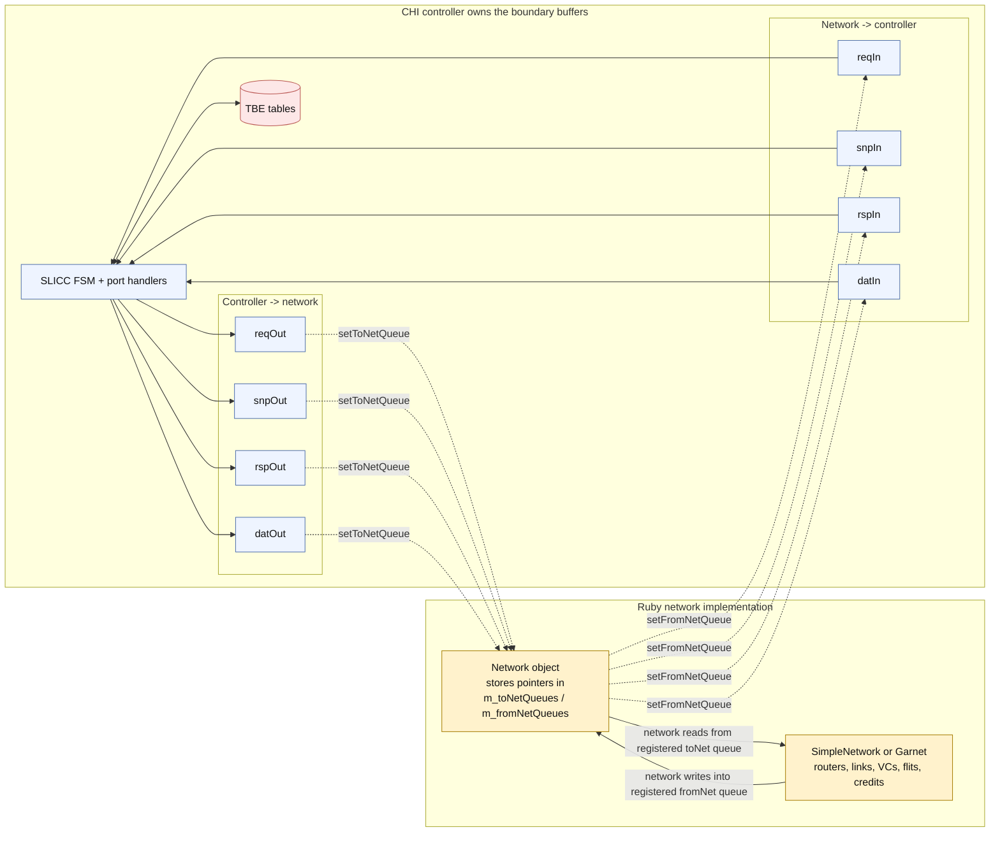
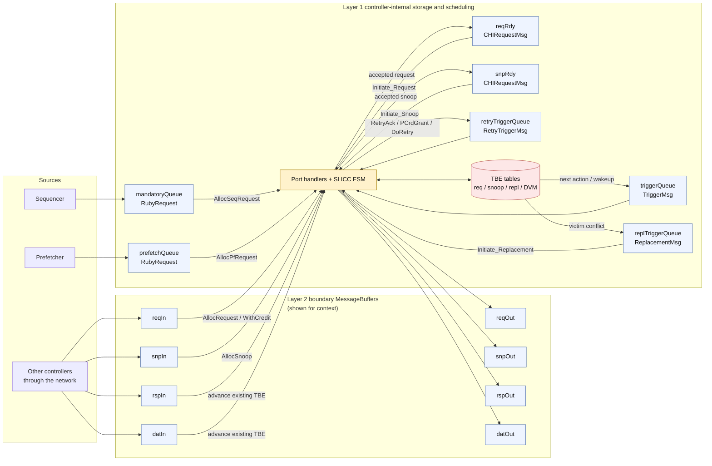
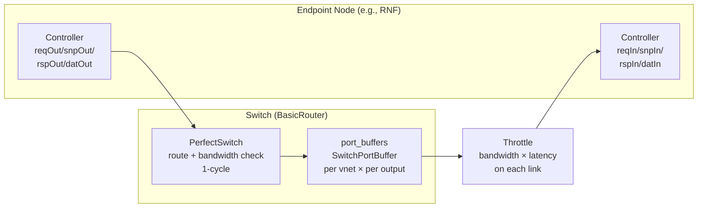
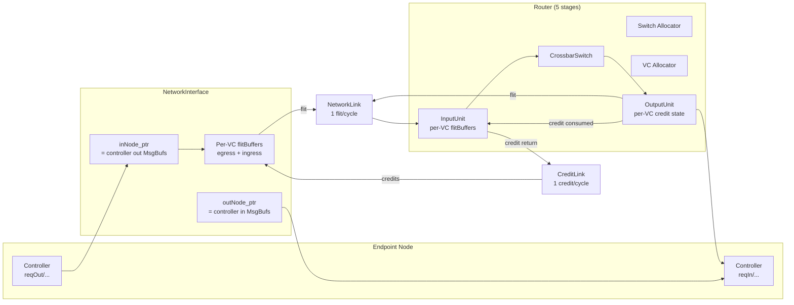
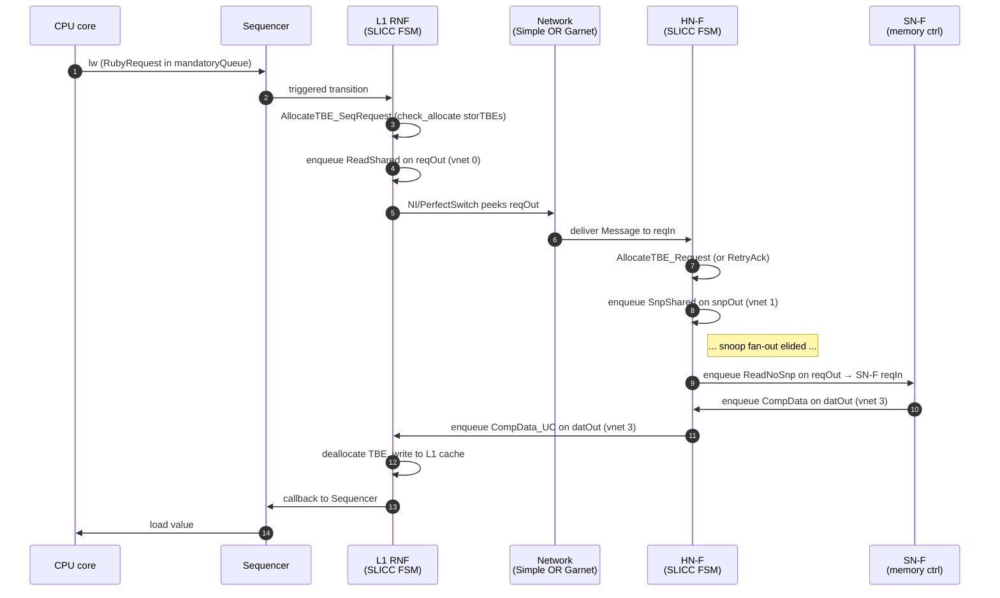

# Ruby Buffers and Backpressure: From TBE to VC Flit

**Audience:** Engineers studying gem5's Ruby memory system who want a precise
mental model of *every* storage element a CHI transaction touches — TBE tables,
MessageBuffers, switch port buffers, NI buffers, router VC buffers, link slots —
and how each of them behaves with respect to capacity and backpressure.

**Why this matters.** When you correlate a gem5 simulation against an RTL NoC,
or against silicon, you have to know exactly which queue absorbs which kind of
pressure, which queues are unbounded, and which knobs actually move the simulator's
behavior. The Ruby buffer landscape is rich: protocol-level retry credits, per-vnet
SLICC queues, switch-internal FIFOs, and Garnet's flit-level VC buffers — each
modeling a different layer of an AMBA CHI implementation, each with its own
fidelity tradeoffs.

This document walks the entire stack, names every buffer, says what it stores, what
caps it, and who pushes back when it fills. It then tackles the two practical
questions: *how close can I get to my RTL?* and *how do I switch between
SimpleNetwork and Garnet without rewriting my config?*

For the orthogonal "what does the data inside these buffers actually look like"
question, see `ruby-book/extra/RequestToFlit.md`. For Garnet pipeline internals,
see `ruby-book/extra/GarnetArch.md`. This document focuses strictly on **storage
and flow control**.

---

## Table of Contents

1. [The Three Layers and Four Units](#1-the-three-layers-and-four-units)
2. [The Common Network Interface](#2-the-common-network-interface)
3. [Layer 1: Protocol Storage Inside the Controller](#3-layer-1-protocol-storage-inside-the-controller)
4. [Layer 2: The Per-vnet MessageBuffer Boundary](#4-layer-2-the-per-vnet-messagebuffer-boundary)
5. [Layer 3: SimpleNetwork Interior](#5-layer-3-simplenetwork-interior)
6. [Layer 3: Garnet Interior](#6-layer-3-garnet-interior)
7. [Backpressure: Who Pushes Back On Whom](#7-backpressure-who-pushes-back-on-whom)
8. [RTL Correlation](#8-rtl-correlation)
9. [Swapping SimpleNetwork ↔ Garnet With Aligned Config](#9-swapping-simplenetwork--garnet-with-aligned-config)
10. [Transaction Flow at a Glance](#10-transaction-flow-at-a-glance)
11. [Per-Buffer Catalog (Quick Reference)](#11-per-buffer-catalog-quick-reference)
12. [Common Misconceptions](#12-common-misconceptions)
13. [Key Ideas](#13-key-ideas)

---

## 1. The Three Layers and Four Units

Real coherent interconnects (AMBA CHI, TileLink, OCP) are layered. A request from
a core climbs *down* the layers at the sender and *up* at the receiver:

```
┌─────────────────────────────────────────────────────────────┐
│ Protocol layer                                              │
│   Coherence FSM, transaction state, retry credits           │
│   "ReadShared from RN-F to HN-F; await CompData + DBIDResp" │
├─────────────────────────────────────────────────────────────┤
│ Network layer                                               │
│   Routing across the fabric; per-hop arbitration            │
│   "Send this DAT message from node 3 to node 7 via N→E→S"   │
├─────────────────────────────────────────────────────────────┤
│ Link layer                                                  │
│   One physical wire between two adjacent nodes;             │
│   per-channel credit (LCrdV) + flit serialization           │
└─────────────────────────────────────────────────────────────┘
```

At each layer the unit of currency is different.

| Unit | Layer | What it represents | Lifetime |
|---|---|---|---|
| **Transaction** | Protocol | One coherence operation (e.g., a load → fill → eventual replacement). May involve many messages. | Begins when a request is accepted; ends when all child snoops/responses/writebacks resolve. |
| **Message** | Protocol/Network boundary | One CHI channel send between two endpoints (REQ, SNP, RSP, or DAT). Atomic from the protocol's viewpoint. | One enqueue → one dequeue at the destination controller. |
| **Packet** *(NoC literature)* | Network | A sequence of flits comprising one Message. | One injection at NI → one ejection at NI. |
| **Flit** | Link | The unit transferred over one wire in one cycle. Smallest schedulable chunk. | One link traversal per hop. |

Two important subtleties:

- **"Packet" is not a first-class object inside Ruby's network code.** Garnet
  flitisizes Messages into HEAD/BODY/TAIL flits that share a `MsgPtr` for
  reassembly; there is no separate `Packet` SimObject between them. Conversely,
  gem5's C++ class `Packet` (`src/mem/packet.hh`) belongs to the **Classic** memory
  side and is what the Ruby `Sequencer` consumes at the boundary — it is
  unrelated to network packets in the CHI/NoC sense.
- **SimpleNetwork has no flits.** Whole Messages traverse the abstracted fabric;
  the link layer is collapsed into a bandwidth × latency model.

The rest of this document tracks each unit through gem5's storage hierarchy and
notes where the abstractions are tight, loose, or absent.

---

## 2. The Common Network Interface

Both SimpleNetwork and Garnet plug into Ruby through the abstract base class
`Network` (`src/mem/ruby/network/Network.hh`, Python class `RubyNetwork` in
`Network.py`). This is what makes them interchangeable.

A controller **does not own** the wires or routers. It owns the
**MessageBuffers** at the edge and hands them to the network at construction time
through two virtual methods:

```cpp
// src/mem/ruby/network/Network.hh
void setToNetQueue(NodeID id, bool ordered, int vnet,
                   std::string vnet_type, MessageBuffer *b);
void setFromNetQueue(NodeID id, bool ordered, int vnet,
                     std::string vnet_type, MessageBuffer *b);
```

- `setToNetQueue` registers a controller-owned outgoing MessageBuffer (e.g.,
  `reqOut`) as the **input** to the network at this node.
- `setFromNetQueue` registers a controller-owned incoming MessageBuffer (e.g.,
  `reqIn`) as the **output** of the network at this node.

In other words: the buffers at the protocol boundary belong to the *controller*,
not the network. The network just reads from and writes to them according to its
own rules.



Dashed arrows are **registration time**.
Solid arrows are **runtime message movement**.

Two consequences flow from this design:

1. **The controller is network-agnostic.** Replacing SimpleNetwork with Garnet is
   a configuration change, not a controller-code change. The same `.sm` file
   works.
2. **The MessageBuffers at the boundary are SimObjects** — full citizens of the
   gem5 hierarchy, with their own parameters (`buffer_size`, `ordered`, etc.) and
   their own semantics (priority heap of `MsgPtr`). They are the *only*
   network-touching state the controller can directly cap.

This is the sole interface contract. Everything else — VCs, flits, switches,
credits — lives below this line and is the network implementation's private
business.

---

## 3. Layer 1: Protocol Storage Inside the Controller

These structures live entirely above the network. They model the controller's
**transaction state** and **internal event scheduling**. None of them is visible
to the network layer.

### 3.1 The TBE Table — One Slot Per In-Flight Transaction

A **TBE (Transaction Buffer Entry)** records the per-address state needed to
process one coherence transaction from start to finish: tracked addresses,
pending snoop responses, data buffer, the original requester, the eventual final
state, and so on.

There is **one TBE per outstanding transaction at this controller**. When a TBE
is allocated, a transaction has begun. When it is deallocated, the transaction is
complete.

CHI separates TBE pools by request type to prevent class-against-class deadlock:

| Pool | Default param | Purpose |
|---|---|---|
| `number_of_TBEs` | (set per controller, e.g., 16/32) | Main pool for accepted **requests** (REQ vnet) |
| `number_of_snoop_TBEs` | 4–16 typical | **Snoops** (SNP vnet); CHI requires snoops to make progress independently of requests |
| `number_of_repl_TBEs` | typically equal to `number_of_TBEs` | **Writebacks/replacements**; can be unified with the request pool via `unify_repl_TBEs=true` |
| `number_of_DVM_TBEs`, `number_of_DVM_snoop_TBEs` | small | DVM (TLBI/sync) maintenance traffic |

These are declared in `src/mem/ruby/protocol/chi/CHI-cache.sm` (around lines
89–108) and assigned per-controller in `configs/ruby/CHI_config.py` (search for
`number_of_TBEs`).

**Capacity:** strict cap. **Backpressure:** modeled and load-bearing.

When a new request arrives and no TBE is available:

- At a **Home Node (HN-F)** receiving REQ traffic: a CHI **`RetryAck`** is
  returned to the requester, who must wait for a `PCrdGrant` before re-issuing.
  This is the **transaction-level credit** mechanism (see
  `max_outstanding_transactions := 1024` in `CHI-cache.sm:90`, the per-requester
  cap that bounds outstanding REQs even before TBE pressure).
- At a **Request Node (RN-F)** receiving sequencer traffic: the request stalls
  in `mandatoryQueue` (a `TransitionResult_ResourceStall`) until a TBE frees.
- For **snoops**: stall in `snpIn`. Snoops *cannot* be retried per CHI spec;
  exhausting snoop TBEs creates real congestion in the SNP vnet.

The SLICC mechanism that enforces this is `check_allocate(storTBEs)` (see
`CHI-cache-actions.sm:138`), which expands at code-gen time to:

```cpp
if (!storTBEs.areNSlotsAvailable(1, ...))
    return TransitionResult_ResourceStall;
```

### 3.2 Internal Scheduling MessageBuffers

The CHI controller declares several MessageBuffers that **never** see the
network — they exist solely to sequence work inside the FSM:

| Buffer | Role |
|---|---|
| `mandatoryQueue` | Sequencer requests (CPU-issued loads/stores) waiting for a transition |
| `prefetchQueue` | Prefetcher-generated requests |
| `triggerQueue` | Self-scheduled wake-ups (e.g., "process this address next cycle") |
| `retryTriggerQueue` | Re-fire requests previously NACK'd with `RetryAck` |
| `reqRdy` | Requests that have a TBE allocated and are now ready to act |
| `snpRdy` | Snoops that have a TBE allocated and are ready |
| `replTriggerQueue` | Writeback / replacement triggers |

Stored unit: SLICC-defined message structs (e.g., `RubyRequest`, `TriggerMsg`,
`ReplacementMsg`) — each a single in-controller event.

**Capacity:** typically `buffer_size=0` (unbounded). **Backpressure:** these are
staging buffers for already-accepted work; their fullness is bounded by the TBE
table (since a TBE is always allocated before moving an item into `reqRdy` or
`snpRdy`). Capping them is safe because the SLICC transitions that fan out into
these buffers use `check_allocate`.

### 3.3 What Lives Above the Network



Only `mandatoryQueue`, `prefetchQueue`, `reqRdy`, `snpRdy`,
`triggerQueue`, `retryTriggerQueue`, `replTriggerQueue`, and the TBE
tables are Layer 1 state.
The per-vnet `reqIn`...`datOut` MessageBuffers belong to Layer 2 and are
shown only to pin down the exact handoff.

The TBE is the **center of gravity**. Every external message is either creating
a TBE, advancing one, or releasing one. Internal queues are scratch space around
the FSM.

---

## 4. Layer 2: The Per-vnet MessageBuffer Boundary

This is where the controller meets the network. There is one MessageBuffer per
direction per CHI channel, declared at the top of `CHI-cache.sm` (lines 189–197):

```
MessageBuffer * reqOut, virtual_network="0", vnet_type="none";
MessageBuffer * snpOut, virtual_network="1", vnet_type="none";
MessageBuffer * rspOut, virtual_network="2", vnet_type="none";
MessageBuffer * datOut, virtual_network="3", vnet_type="response";
MessageBuffer * reqIn,  virtual_network="0", vnet_type="none";
MessageBuffer * snpIn,  virtual_network="1", vnet_type="none";
MessageBuffer * rspIn,  virtual_network="2", vnet_type="none";
MessageBuffer * datIn,  virtual_network="3", vnet_type="response";
```

Eight MessageBuffers per CHI cache controller. The 1:1 mapping between **CHI
channel** and **vnet** is the gem5 representation of CHI's four channel
abstraction.

### 4.1 The MessageBuffer Class

Defined in `src/mem/ruby/network/MessageBuffer.hh/.cc`, `MessageBuffer` is a
**priority heap of `MsgPtr`** (shared pointers to `Message` objects), ordered by
scheduled-delivery tick.

```cpp
std::vector<MsgPtr> m_prio_heap;   // MessageBuffer.hh:208
```

Key parameters:

| Param | Default | Meaning |
|---|---|---|
| `buffer_size` | 0 | Max number of messages in the heap. **0 = infinite.** |
| `ordered` | false | If true, FIFO ordering is enforced |
| `allow_zero_latency` | false | Whether `enqueue(..., delta=0)` is permitted |
| `randomization` | (inherited) | Whether to add jitter to delivery time |

**Unit of storage:** one whole `Message` object (a `MsgPtr`). Not a flit, not a
byte. A 64-byte data message and a 4-byte ack message each occupy **one slot**.

**Backpressure:** opt-in.

- `enqueue()` carries an unconditional assert (`MessageBuffer.cc:293`):
  `assert((m_max_size == 0) || (size <= m_max_size));`
- A capped buffer that overflows therefore **panics**, not stalls. There is no
  built-in "block on full" semantics.
- The way to get a stall is for the **caller** to gate the enqueue with
  `areNSlotsAvailable(...)`. SLICC provides the syntactic sugar
  `check_allocate(buf)` in a transition:

  ```cpp
  if (!buf.areNSlotsAvailable(n, clockEdge()))
      return TransitionResult_ResourceStall;   // re-fire next cycle
  ```

- **CHI does not use `check_allocate` on the four outbound vnet buffers.** A
  grep across `src/mem/ruby/protocol/chi/` finds five `check_allocate` calls,
  all of them on **TBE storage**, none on `reqOut`/`snpOut`/`rspOut`/`datOut`.
  This means the CHI protocol assumes those buffers are effectively infinite.
  Capping any of them today would crash on the first overflow burst.

### 4.2 Why The Inbound Request Buffer Must Not Stall

`CHI-cache-ports.sm:391` defines a custom resource-stall handler for
`reqInPort` that **panics** if anyone tries to stall it:

```cpp
bool reqInPort_rsc_stall_handler() {
    error("reqInPort must never stall\n");
}
```

This is a deliberate design choice. If REQ ingress could backpressure, it could
hold a TBE elsewhere that needs the REQ to make progress, creating a network
deadlock that violates CHI's channel-independence guarantee. Instead, when an HN
runs out of TBEs, it generates a `RetryAck` response and pops the request anyway
— the request is now the requester's problem (it must wait for `PCrdGrant`).

### 4.3 What's Stored Where (Boundary)

```
controller side                    network side
┌─────────────┐                    ┌─────────────┐
│ FSM action  │ enqueue(MsgPtr) →  │ reqOut heap │ ──┐
└─────────────┘                    └─────────────┘   │
                                                     ▼
                                            (the network reads from
                                             here on its own clock)
```

In SimpleNetwork the network side is a `PerfectSwitch` that *peeks* this heap.
In Garnet the network side is a `NetworkInterface` that *peeks* this heap. Both
treat the controller's outbound MessageBuffer as **their input port**.

---

## 5. Layer 3: SimpleNetwork Interior

SimpleNetwork (`src/mem/ruby/network/simple/`) is a **routing + bandwidth
abstraction**. It does not model flits, VCs, or per-cycle link arbitration. It
moves whole Messages and amortizes link bandwidth via per-byte delay.

### 5.1 Building Blocks



| Component | What it stores | How it pushes back |
|---|---|---|
| `PerfectSwitch` (`PerfectSwitch.cc`) | Reads from input MessageBuffers; one cycle of routing | Doesn't pop until **every** target output buffer reports `areNSlotsAvailable` ≥ 1 (`PerfectSwitch.cc:216`) |
| `SwitchPortBuffer` (a `MessageBuffer` subclass) | One Message per slot; one buffer per vnet × per output port | `buffer_size = SimpleNetwork.buffer_size` (× `physical_vnets_channels[vnet]` if used). 0 = infinite. |
| `Throttle` (`Throttle.cc`) | Drains a buffer at `endpoint_bandwidth` bytes/cycle | Refuses to dequeue until the downstream buffer has space (`Throttle.cc:186, 239, 243`) |

### 5.2 Backpressure Path — End to End

When a switch's `port_buffers[vnet]` is full and capped:

1. `PerfectSwitch::operateVnet` finds the downstream output full → does **not**
   pop the message from the upstream buffer.
2. The switch reschedules itself for the next cycle (`PerfectSwitch.cc:226`).
3. The undeleted message stays in the upstream buffer.
4. If the upstream buffer is also at its cap, *its* upstream switch can't pop
   either. Backpressure propagates hop by hop.

But the chain **stops at the controller's outbound MessageBuffer** if that buffer
is uncapped. The SLICC FSM continues to enqueue with no resistance, so the
controller-owned buffer (e.g., `reqOut`) absorbs the overflow indefinitely.

### 5.3 SimpleNetwork's Sizing Knobs

```python
class SimpleNetwork(RubyNetwork):
    buffer_size = Param.Int(0, "default internal buffer size; 0 = infinite")
    endpoint_bandwidth = Param.Int(1000, "bandwidth adjustment factor")
    physical_vnets_channels = VectorParam.Int([], "per-vnet phy channel count")
    physical_vnets_bandwidth = VectorParam.Int([], "per-vnet bandwidth factor")
```

- `buffer_size` is the depth (in **messages**) for every interior `SwitchPortBuffer`.
- `physical_vnets_channels[v]` multiplies that depth for vnet `v` (it's a
  shorthand for "this vnet has N parallel physical channels", though no actual
  parallelism is added — it just inflates capacity).
- `endpoint_bandwidth` and `physical_vnets_bandwidth` size the per-link
  bandwidth that `Throttle` enforces.

### 5.4 Fidelity Summary for SimpleNetwork

| Aspect | Modeled? |
|---|---|
| Flit-level pipelining | No |
| VCs | No (just vnets, but no per-VC buffers) |
| Per-channel link credits | No (whole-message bandwidth throttle instead) |
| Network-layer backpressure (switch ↔ switch) | **Yes**, when `buffer_size` is set |
| Backpressure into controller MessageBuffer | Only via blocking dequeue from there — no `check_allocate` exists on outbound vnets in CHI, so the FSM does not feel this pressure |
| Link bandwidth | Yes, per-byte delay via `Throttle` |
| Topology effects | Yes (latency × hops, per-link bandwidth) |

SimpleNetwork is the right tool when you care about **mean latency and
bandwidth at moderate load**, not about queueing tail or NoC-layer flow control
fidelity.

---

## 6. Layer 3: Garnet Interior

Garnet (`src/mem/ruby/network/garnet/`) is a **cycle-level, flit-level**
network model with virtual channels and credit-based flow control. This is
where flits, VCs, and per-link credits actually exist.

### 6.1 Building Blocks



### 6.2 Storage at Each Stage

| Storage | Defined in | Unit stored | Sized by |
|---|---|---|---|
| Controller out/in MessageBuffers | controller `.sm` | Message (`MsgPtr`) | `buffer_size` (per buffer) |
| NI per-VC flit buffers | `NetworkInterface.hh` | Flit (with shared `MsgPtr`) | `vcs_per_vnet` × `buffers_per_data_vc` / `buffers_per_ctrl_vc` |
| Router `InputUnit` per-VC flit buffers | `InputUnit.hh` | Flit | `vcs_per_vnet` × `buffers_per_*_vc` |
| Router `OutputUnit` credit state | `OutputUnit.hh` | Credit count per outgoing VC | `vcs_per_vnet` × `buffers_per_*_vc` |
| `NetworkLink` | `NetworkLink.hh` | At most one flit in flight per cycle | `width` (= `ni_flit_size` bits) |
| `CreditLink` | `CreditLink.hh` | At most one credit in flight per cycle | (same width) |

### 6.3 Garnet's Sizing Knobs

```python
class GarnetNetwork(RubyNetwork):
    ni_flit_size       = Param.UInt32(16, "flit size in bytes")
    vcs_per_vnet       = Param.UInt32(4,  "VCs per virtual network")
    buffers_per_data_vc = Param.UInt32(4, "buffer slots per data VC")
    buffers_per_ctrl_vc = Param.UInt32(1, "buffer slots per ctrl VC")
    routing_algorithm  = Param.Int(0,     "0: weight-table, 1: XY, 2: custom")
```

Each VC is a small flit FIFO (default 1 slot for control VCs, 4 slots for data
VCs — chosen so the largest message fits). With 4 vnets × 4 VCs × 4 slots = up
to **64 flit slots per router input port**.

### 6.4 NI Egress: Controller → Network

```cpp
// NetworkInterface.cc:208-220
for (int vnet = 0; vnet < inNode_ptr.size(); ++vnet) {
    MessageBuffer *b = inNode_ptr[vnet];
    if (b->isReady(curTime)) {
        msg_ptr = b->peekMsgPtr();
        if (flitisizeMessage(msg_ptr, vnet)) {  // success only if a free VC
            b->dequeue(curTime);                //   exists downstream
        }
    }
}
```

**`flitisizeMessage` returns false when no VC is available downstream.** That
holds the message in the controller's outbound MessageBuffer until credits
return. So Garnet **does** drain controller-side buffers at a NoC-aware rate —
unlike SimpleNetwork.

But that pressure stops at the MessageBuffer. The SLICC FSM only feels it if the
buffer is capped *and* `check_allocate` guards the enqueue — which CHI does not
do. Without that, the controller's `reqOut` can still grow unbounded if the FSM
enqueues faster than the NI drains.

### 6.5 NI Ingress: Network → Controller

```cpp
// NetworkInterface.cc:243-249
if (t_flit->get_type() == TAIL_ || t_flit->get_type() == HEAD_TAIL_) {
    if (!iPort->messageEnqueuedThisCycle &&
        outNode_ptr[vnet]->areNSlotsAvailable(1, curTime)) {
        outNode_ptr[vnet]->enqueue(t_flit->get_msg_ptr(), ...);
    } else {
        // stall the flit in the VC, do not ingest
    }
}
```

This is the **honest backpressure** Garnet uniquely provides:

- The NI **checks `areNSlotsAvailable` before ejecting a flit** into the
  controller's incoming MessageBuffer.
- If the controller's `reqIn` is capped and full, the flit stays in the VC, the
  VC keeps holding credits, and credit backpressure propagates upstream
  hop-by-hop.

This works **without** editing SLICC, because the gating is done by the NI,
not by the SLICC action. Capping `reqIn`/`snpIn`/`rspIn`/`datIn` in Garnet is
therefore safe and produces realistic ingress flow control, with one CHI-specific
caveat: REQ ingress backpressure can still create protocol deadlocks if you make
it tight (which is precisely why the SLICC `reqInPort` panics — see §4.2).

### 6.6 Per-Hop Credit Flow

```mermaid
flowchart LR
    classDef router fill:#eef4ff,stroke:#4f6fad,color:#111;
    classDef state fill:#fde7e7,stroke:#b85450,color:#111;
    classDef action fill:#fff2cc,stroke:#a67c00,color:#111;

    subgraph A["Upstream router A"]
        direction TB
        AOut[OutputUnit<br/>OutVcState[vc]<br/>credit count for B's input VC]
    end

    subgraph B["Downstream router B"]
        direction TB
        BIn[InputUnit<br/>per-VC flit buffer]
        BSA[SwitchAllocator<br/>grants this input VC]
    end

    AOut -->|if credit count > 0,<br/>send flit on NetworkLink| BIn
    BIn -->|buffered flit waits for SA| BSA
    BSA -->|flit leaves B's input VC| C[CreditLink<br/>Credit(vc, free?)]
    C -->|OutputUnit::wakeup()<br/>increment credit;<br/>free=true => mark VC IDLE| AOut

    class AOut state
    class BIn router
    class BSA,C action
```

`free=false` means one buffer slot opened.
`free=true` means the slot opened and the downstream VC itself became idle,
which happens for `TAIL_` and `HEAD_TAIL_` flits.

Every `OutputUnit` holds a `CreditCount` per VC — the number of free flit slots
in the next-hop router's `InputUnit` for that VC. Send a flit → decrement.
Receive a credit (because the next-hop popped a flit) → increment. If the count
is 0, no flit can be sent on that VC; the switch allocator will not grant the
output port to that VC.

This is a faithful model of **credit-based on-chip network flow control** as
described in Dally & Towles. It is *not* a faithful model of CHI's link-layer
credit (LCrdV) — those credits operate per CHI channel between two adjacent
nodes, with explicit `LCrdV` flits. Garnet's VCs sit above that abstraction.

---

## 7. Backpressure: Who Pushes Back On Whom

The single most important table in this document:

| Buffer | Capped by default? | Cap safe to enable? | Who enforces backpressure? | Reaches the SLICC FSM? |
|---|---|---|---|---|
| TBE table | Yes (param) | — | `check_allocate(storTBEs)` in SLICC | **Yes** — generates `RetryAck` or stalls |
| Internal MsgBufs (`reqRdy`, etc.) | No | Yes — guarded by `check_allocate` | SLICC `check_allocate` | Yes |
| Controller out MsgBuf (`reqOut`/etc.) | **No** | **No** in CHI today (would panic; CHI lacks `check_allocate` on outbound enqueue) | (Drained by NI/PerfectSwitch — depends on network) | No (until you retrofit `check_allocate` per transition) |
| Controller in MsgBuf (`reqIn`/etc.) | No | **Yes in Garnet** (NI checks `areNSlotsAvailable`); **No in SimpleNetwork** (PerfectSwitch enqueues unconditionally) | NI (Garnet) | Indirectly (causes ingress stall, may delay TBE alloc) |
| SimpleNetwork `SwitchPortBuffer` (interior) | Configurable (`buffer_size`) | Yes | `PerfectSwitch::areNSlotsAvailable` check | No — pressure stops at controller out buffer |
| Garnet NI per-VC flit buffer | Yes | — | Credits from the next router | Indirectly via NI not draining |
| Garnet router `InputUnit` per-VC flit buffer | Yes | — | Credits to upstream | Indirectly |
| Garnet `NetworkLink` | Yes (1 flit/cycle) | — | One flit per cycle is the wire | Indirectly |

**The single recurring fidelity hole:** the controller's outbound MessageBuffer
in CHI is a *de facto* infinite reservoir, because (a) the protocol doesn't cap
it and (b) the SLICC FSM doesn't gate enqueues. Capping interior switch buffers
or VCs alone just shifts the unbounded queue into the controller's outbound
MessageBuffer; the FSM keeps issuing.

This is the same problem in both networks. Garnet improves *some* aspects:

- VC credit pressure causes the NI to drain the controller buffer at a realistic
  rate.
- Ingress backpressure into the controller's incoming MsgBufs is enforced by
  the NI without protocol changes.

But neither network can stop the controller from generating outbound traffic
faster than the network can drain it, short of editing every transition that
enqueues to add `check_allocate(reqOut)` etc.

---

## 8. RTL Correlation

The point of this section is practical: **how close can my gem5 model get to a
real CHI RTL NoC, where can I match outstanding-transaction counts and buffer
depths exactly, and what should I do about the gaps?**

### 8.1 Mapping CHI Spec Concepts to gem5 Storage

| CHI spec concept | RTL implementation | gem5 SLICC CHI counterpart | Faithful? |
|---|---|---|---|
| Channel (REQ/SNP/RSP/DAT) | One physical channel between two CHI nodes | One vnet (0/1/2/3) | Yes (logically) |
| Outstanding requests at requester | Tracked by RN's transaction tracker; bounded by Tx pool depth | `max_outstanding_transactions` (1024) + TBE table | Match by setting `max_outstanding_transactions` and `number_of_TBEs` |
| RetryAck / PCrdGrant credit loop | Hardware exchange between RN and HN | Modeled in CHI SLICC; HN issues `RetryAck` when TBE exhausted, requester re-issues after `PCrdGrant` | **Yes** |
| LCrdV per-channel link credits | Per-channel hardware credit handshake at every CHI link | **Not modeled** in either SimpleNetwork or Garnet; closest analogue is Garnet's per-VC credits, which are at a different layer | **No** |
| Channel buffer depth at receiver | Buffer slots per channel per node | Controller's `reqIn`/etc. MessageBuffer; **uncapped** by default | Partial — cap incoming buffers in Garnet |
| Channel buffer depth at sender | Sender-side queue per channel | Controller's `reqOut`/etc. MessageBuffer; **uncapped** and unguarded by `check_allocate` | **No** without SLICC edits |
| Snoop filter / directory entries | Hardware snoop-filter cache | HN cache state + `number_of_snoop_TBEs` | Yes |
| Per-channel arbitration / VC arbitration | Hardware NoC arbiter | `PerfectSwitch` (Simple) / `SwitchAllocator` (Garnet) | Garnet faithful, Simple abstracted |

### 8.2 What You Can Match Today

These knobs let you tune gem5 to a target RTL configuration with reasonable fidelity:

1. **Maximum outstanding transactions per requester.**
   Set `max_outstanding_transactions` at every RNF/RNI to your RTL's transaction-tracker depth.
2. **TBE pool sizes per node type.**
   `number_of_TBEs`, `number_of_snoop_TBEs`, `number_of_repl_TBEs` per controller — match to RTL pool depths.
3. **Per-vnet bandwidth (SimpleNetwork) or flit width × routers (Garnet).**
   Match cycles per beat, link width, hop count.
4. **Topology + routing.**
   Mesh / ring / custom; match your RTL placement.
5. **In Garnet only:** per-VC buffer depth (`buffers_per_data_vc`, `buffers_per_ctrl_vc`) and VC count per channel (`vcs_per_vnet`).

### 8.3 What You Cannot Match (Without Code Changes)

1. **Channel-level link credit (LCrdV).** No model. Garnet's VC credits are
   close but operate at a different granularity. If your RTL has 8 LCredits per
   channel, there is no parameter that says "this exact handshake".
2. **Sender-side per-channel queue depth at the CHI node boundary.** Capping
   `reqOut`/`snpOut`/`rspOut`/`datOut` panics today because CHI's SLICC does not
   guard enqueues with `check_allocate`. Your RTL has finite channel queues at
   every node; gem5 does not.
3. **Burst absorption when many TBEs retire in one cycle.** Real RTL would
   serialize the resulting DAT messages over the link's credit budget; gem5's
   uncapped `datOut` absorbs the burst and bleeds it out at network rate.
4. **Per-channel virtual networks separated by physical wires** (CHI optionally
   physically separates REQ/SNP/RSP/DAT). Garnet always shares the same physical
   link across vnets, modulated by VC allocation. SimpleNetwork can simulate
   parallel channels via `physical_vnets_channels` but only as bandwidth/depth
   scaling.

### 8.4 Workarounds

| Goal | Workaround |
|---|---|
| Bound traffic generation rate to match RTL | Set `max_outstanding_transactions` *low* (= RTL Tx tracker depth). This is the cleanest knob. |
| Faithful NoC link backpressure | Use **Garnet** with `buffers_per_data_vc` and `buffers_per_ctrl_vc` matching the RTL channel buffer depth |
| Faithful ingress flow control at the controller boundary | Use **Garnet** and cap controller `reqIn`/`snpIn`/`rspIn`/`datIn` to RTL channel queue depths. (Don't cap `reqIn` smaller than the snoop-blocked-by-request-blocked dependency chain allows; CHI's `reqInPort must never stall` rule matters.) |
| Faithful egress flow control at the controller boundary | (a) Patch `CHI-cache-actions.sm` to add `check_allocate(reqOut)` etc. on every transition that enqueues, then cap the buffer; or (b) bypass SLICC entirely via **`CHIGenericController`** and the CHI-TLM bridge, plugging in an external TLM CHI model that does honest LCrdV |
| Match exact channel-level credit handshakes | Use the **CHI-TLM bridge** (`src/mem/ruby/protocol/chi/generic/`) to delegate CHI semantics to an external TLM model |
| Reproduce a tail-latency curve under saturation | Don't trust SimpleNetwork past saturation; switch to Garnet with capped VCs *and* a low `max_outstanding_transactions` |

The **CHIGenericController** path (added in gem5 22.0) is the officially-blessed
escape hatch: a pure-C++ controller that bypasses SLICC and lets you implement
CHI semantics with full credit fidelity, optionally via an Arm TLM model. See
`ruby-book/extra/ChiGenericCtrl.md` for an introduction.

### 8.5 A Practical RTL-Correlation Recipe

For each RTL CHI node, translate as follows:

```
RTL parameter                     →  gem5 parameter
──────────────────────────────────────────────────────────────────────────────
Tx tracker depth (RN)             →  max_outstanding_transactions
                                     (set in CHI-cache.sm, override per-controller)
HN home-node TBE pool             →  number_of_TBEs at HN-F controller
HN snoop-filter outstanding cap   →  number_of_snoop_TBEs at HN-F
RN snoop-tracker depth            →  number_of_snoop_TBEs at RN-F
Writeback queue depth             →  number_of_repl_TBEs (or unify_repl_TBEs=true)
Per-channel link width            →  ni_flit_size (Garnet)
                                     or endpoint_bandwidth (SimpleNetwork)
Per-channel input buffer depth    →  buffers_per_data_vc / buffers_per_ctrl_vc (Garnet)
                                     or buffer_size (SimpleNetwork)
Number of VCs per channel         →  vcs_per_vnet (Garnet); not modeled (Simple)
Number of physical channels       →  physical_vnets_channels (Simple, abstract)
Hop count / topology              →  topology + num_rows
Per-hop arbitration latency       →  router latency (BasicRouter.latency)
```

If your RTL's link layer exchanges per-channel LCrdV credits, the closest gem5
analogue is to model the channel as one vnet with `vcs_per_vnet=1` and
`buffers_per_*_vc = LCredit_count`. This conflates network and link layers, but
it does enforce a hard cap on in-flight flits per channel.

---


## 9. Transaction Flow at a Glance

A condensed view of what happens to a single load. For the full story (all six
representations, all five conversion boundaries), see
`ruby-book/extra/RequestToFlit.md`.



Mapping to storage:

| Step | Storage touched | Layer |
|---|---|---|
| 1–2 | `mandatoryQueue` | Protocol (internal) |
| 3 | TBE table | Protocol |
| 4 | `reqOut` | Protocol/Network boundary |
| 5 | (Garnet) NI flit buffers, NetworkLink, router VCs / (Simple) PerfectSwitch port_buffers, Throttle | Network + Link |
| 6 | `reqIn` at HN | Boundary |
| 7 | TBE table at HN | Protocol |
| 8–10 | `snpOut`/`datOut` etc. | Boundary; then network |
| 11 | TBE deallocation | Protocol |

---

## 10. Per-Buffer Catalog (Quick Reference)

| Buffer | Where it lives | Stores | Sized by | Capped by default? | Backpressure modeled? |
|---|---|---|---|---|---|
| TBE table (request) | Per CHI controller | Transaction state | `number_of_TBEs` | Yes | Yes (`RetryAck` at HN, stall at RN) |
| TBE table (snoop) | Per CHI controller | Transaction state | `number_of_snoop_TBEs` | Yes | Yes (stall in `snpIn`) |
| TBE table (replacement) | Per CHI controller | Transaction state | `number_of_repl_TBEs` (or unified) | Yes | Yes |
| TBE table (DVM) | Per CHI controller | Transaction state | `number_of_DVM_TBEs` | Yes | Yes |
| `mandatoryQueue` | Per controller | RubyRequest from Sequencer | `buffer_size` (default 0) | No | Optional via `check_allocate` |
| `prefetchQueue` | Per controller | RubyRequest from prefetcher | `buffer_size` | No | Optional via `check_allocate` |
| `triggerQueue` | Per controller | TriggerMsg | `buffer_size` | No | Optional via `check_allocate` |
| `retryTriggerQueue` | Per controller | RetryTriggerMsg | `buffer_size` | No | Optional via `check_allocate` |
| `reqRdy` / `snpRdy` | Per controller | CHIRequestMsg (post-TBE-alloc) | `buffer_size` | No | Optional via `check_allocate` |
| `replTriggerQueue` | Per controller | ReplacementMsg | `buffer_size` | No | Optional via `check_allocate` |
| `reqOut`, `snpOut`, `rspOut`, `datOut` | Per controller, edge with network | Message (`MsgPtr`) | `buffer_size` | No | **No on egress in CHI** (no `check_allocate`); panics if capped and overflows |
| `reqIn`, `snpIn`, `rspIn`, `datIn` | Per controller, edge from network | Message (`MsgPtr`) | `buffer_size` | No | **Yes in Garnet** (NI gates ejection); **No in SimpleNetwork** (PerfectSwitch enqueues unconditionally) |
| SimpleNetwork `SwitchPortBuffer` | Inside each `Switch`, per vnet × per output | Message (`MsgPtr`) | `SimpleNetwork.buffer_size` × `physical_vnets_channels[v]` | Configurable | Yes — `PerfectSwitch` checks `areNSlotsAvailable` |
| `Throttle` | Per SimpleNetwork link | (queues messages serially per bytes/cycle) | `endpoint_bandwidth`, `physical_vnets_bandwidth` | n/a | Yes — refuses to dequeue if downstream buf full |
| Garnet NI per-VC `flitBuffer` | Per `NetworkInterface`, per VC | Flit | `vcs_per_vnet` × `buffers_per_*_vc` | Yes | Yes — credit flow control |
| Garnet `InputUnit` per-VC `flitBuffer` | Per router input port, per VC | Flit | `vcs_per_vnet` × `buffers_per_*_vc` | Yes | Yes — credits |
| Garnet `OutputUnit` credit count | Per router output port, per VC | Credit count | derived from downstream buffer depth | Yes | Source of credit-based stall |
| `NetworkLink` | Per Garnet link | One flit/cycle in flight | `ni_flit_size` (width) | Yes (1 cycle) | Yes (link is the bandwidth limiter) |
| `CreditLink` | Per Garnet link (return path) | One credit/cycle in flight | (same) | Yes | n/a |

---

## 11. Common Misconceptions

**"Setting `buffer_size` on the controller's outbound MessageBuffer adds
realistic backpressure."**
False today for CHI. CHI's SLICC does not guard outbound enqueues with
`check_allocate`, so capping `reqOut`/`snpOut`/`rspOut`/`datOut` will assert-panic
on the first overflow, not stall the FSM.

**"Garnet's per-VC credits implement CHI's LCrdV link credits."**
False. They live at different layers. Garnet's credits flow between adjacent
routers per VC; CHI's LCrdV flow between adjacent CHI nodes per channel. They
have similar shape but different granularity and timing.

**"SimpleNetwork has VCs because CHI uses them."**
False. SimpleNetwork has *vnets* (4 logical channels) but no virtual channels in
the NoC sense. `physical_vnets_channels` lets you pretend each vnet has multiple
parallel pipes by inflating buffer depth and bandwidth, but there is no
per-channel arbitration like a real VC allocator.

**"Capping interior switch buffers in SimpleNetwork makes the controller stall."**
False. The pressure stops at the controller's outbound MessageBuffer. The FSM
doesn't see it. You need `check_allocate` on the FSM enqueue side, which CHI
doesn't do.

**"`max_outstanding_transactions` is the only knob limiting RN-side traffic."**
Partially true. `max_outstanding_transactions` is a per-requester transaction
credit cap; it bounds outstanding REQs but does not bound the number of
generated DAT/RSP messages held in `datOut`/`rspOut`. For a tight bound on
*total* in-flight traffic you also need TBE pool sizing and (ideally) capped
outbound buffers.

**"Garnet is more accurate than SimpleNetwork in every dimension."**
Mostly true for NoC fidelity. Not true for CPU time-to-result on large
configurations — Garnet is much slower. Pick the right tool for the question.

**"The `Packet` flowing in Ruby is the same as the `flit` in Garnet."**
False. Ruby's `Packet` is the Classic-memory boundary object that the Sequencer
ingests; it is not present inside Ruby's network. A Garnet `flit` is a piece of
a CHI Message, not a Ruby `Packet`.

---

## 12. Key Ideas

1. **Three layers, four units.** Protocol (Transactions), Network/boundary
   (Messages), Network interior (Packets, conceptually), Link (Flits). gem5's
   storage hierarchy maps onto this stack — but the mapping is asymmetric
   between SimpleNetwork (no flit layer) and Garnet (full flit layer).

2. **The TBE is the protocol's currency.** One TBE = one in-flight transaction.
   TBE pool sizing is the most direct way to match RTL outstanding-transaction
   limits.

3. **MessageBuffers are the only contract between controller and network.**
   The `setToNetQueue` / `setFromNetQueue` interface is what makes networks
   interchangeable. Caps on these buffers are the only way the controller can
   feel network pressure — but capping them safely requires SLICC-side
   `check_allocate`, which CHI does not currently use on outbound vnets.

4. **SimpleNetwork is bandwidth × latency. Garnet is flit × VC × credit.**
   They are not interchangeable past saturation, even with carefully matched
   buffer depths.

5. **The faithful link-layer credit (LCrdV) gap is the main RTL-correlation
   gap.** No parameter closes it within the in-Ruby CHI implementation. The
   sanctioned escape hatch is **`CHIGenericController` + CHI-TLM bridge**, which
   delegates link-layer behavior to an external TLM model.

6. **Defaults are unsafe for performance work.** `buffer_size = 0` is infinite.
   Always set explicit caps when reporting load lines, latency curves, or
   backpressure-sensitive results.

7. **Switching SimpleNetwork ↔ Garnet should be a config helper, not a
   rewrite.** Build a small factory that takes a network-agnostic intent
   (channels, buffer depth per channel, link width) and emits the right per-
   network parameters. Keep the controller config network-free.

---

## Further Reading

- `ruby-book/extra/RequestToFlit.md` — full payload-transformation walk
- `ruby-book/extra/GarnetArch.md` — Garnet pipeline internals
- `ruby-book/extra/ChiGenericCtrl.md` — pure-C++ CHI controller / TLM bridge
- `src/mem/ruby/network/MessageBuffer.{hh,cc}` — buffer mechanics
- `src/mem/ruby/protocol/chi/CHI-cache.sm` — CHI controller declaration
- `src/mem/ruby/protocol/chi/CHI-cache-actions.sm` — `check_allocate` usages
- `src/mem/ruby/network/garnet/NetworkInterface.cc` — egress / ingress flow control
- `configs/ruby/CHI_config.py` — per-node-type TBE sizing examples
