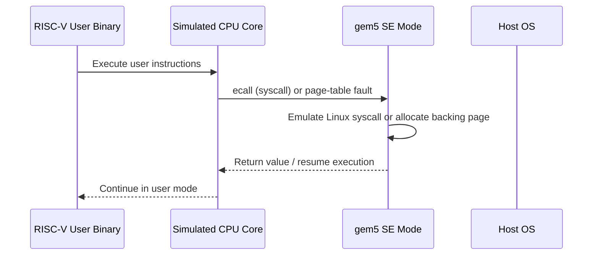

# SE Mode for Chapter 17 Test Programs

You are about to write small RISC-V binaries that exercise a 16-core CHI mesh.
If your mental model of SE mode is wrong, you will misread results before you even get to CHI.
The most common mistake is assuming SE mode behaves like "Linux, but faster to boot."
It does not.
It behaves like "user-space code plus a gem5-implemented kernel boundary plus a gem5-managed physical memory map."

This document answers the questions that matter most for writing Stage 3 test programs
in [`Ch17_FinalProject.md`](../Ch17_FinalProject.md).

---

## 1. What SE Mode Actually Is

### Intuition

In full-system mode, gem5 simulates a whole machine and boots a real kernel.
In SE mode, gem5 skips the kernel and only runs a user-space ELF binary.
The guest program still executes ISA instructions on the simulated CPU.
However, when it needs an OS service, gem5 handles the syscall in simulator code
instead of trapping into a guest Linux kernel.



### Working Model

1. Your config script creates CPUs, a [`Process`](../../src/sim/process.hh#L66), and a [`SEWorkload`](../../src/sim/se_workload.hh#L38).
2. `SEWorkload.init_compatible(binary)` picks the RISC-V Linux SE workload class
   from the binary format.
3. `ProcessParams::create()` loads the ELF and constructs a [`RiscvProcess64`](../../src/arch/riscv/process.cc#L71).
4. [`Process::initState()`](../../src/sim/process.cc#L289) writes ELF segments (`.text`, `.data`, `.bss`) into
   simulated memory via [`SETranslatingPortProxy`](../../src/mem/se_translating_port_proxy.hh#L49).
5. `RiscvProcess64::initState()` calls `argsInit<uint64_t>()` to build the
   initial stack: `argc`, `argv` pointers, `envp`, auxiliary vector.
6. The stack pointer is set, PC is set to the ELF entry point, and `m5.simulate()`
   starts the event loop.
7. When the CPU executes `ecall`, [`EmuLinux::syscall()`](../../src/arch/riscv/linux/se_workload.cc#L529) dispatches to
   the C++ handler — not into a guest kernel.

### Formal and Code

| Class | File | Role |
|-------|------|------|
| `SEWorkload` | [`se_workload.hh`](../../src/sim/se_workload.hh#L38) | System-wide: manages physical memory pools, dispatches syscalls |
| `EmuLinux` (RISC-V) | [`se_workload.cc`](../../src/arch/riscv/linux/se_workload.cc#L529) | RISC-V-specific: reads syscall number from register, routes to descriptor table |
| `Process` | [`process.hh`](../../src/sim/process.hh#L66) | Per-process state: page table, MemState (VMA list), file descriptors, PIDs |
| `RiscvProcess64` | [`process.cc`](../../src/arch/riscv/process.cc#L71) | RISC-V 64-bit address space layout (stack, heap, mmap addresses) |
| `MemState` | [`mem_state.hh`](../../src/sim/mem_state.hh#L67) | Tracks brk point, stack bounds, mmap region, VMA list |
| `EmulationPageTable` | [`page_table.hh`](../../src/mem/page_table.hh#L53) | Hash-map page table: virtual page → physical page |

### What SE Mode Is Not

- It is not a booted RISC-V Linux kernel.
- It is not a real guest scheduler with task migration and affinity enforcement.
- It is not a Linux `/proc` or `/sys` environment with complete kernel metadata.
- It is not a faithful model of every syscall that a normal glibc environment can issue.

### Failure Modes

- A syscall with no handler triggers `fatal()`, not just `-ENOSYS`.
  The simulation aborts immediately.
- If your binary expects dynamic linking, SE mode will fail long before
  your CHI experiment becomes interesting.
- If you assume kernel scheduling features exist, your placement-sensitive tests
  will quietly test the wrong thing.

---

## 2. Virtual Address Space Layout

### Intuition

There are two address spaces to keep in your head.
The guest program sees a virtual address space.
gem5 backs that virtual space with simulated physical addresses.
Then the memory system maps those physical addresses onto HN-Fs, SN-Fs,
DDR controllers, and links.

### Working Model

[`RiscvProcess64`](../../src/arch/riscv/process.cc#L71) sets up the following virtual layout
([`process.cc:71–82`](../../src/arch/riscv/process.cc#L71)):

```
High virtual addresses
0x7fff_ffff_ffff_ffff   stack_base
        |               main stack grows down
        |               max_stack_size = 64 MiB default
        v

0x7fff_ffff_ffff_ffff   next_thread_stack_base
  - 64 MiB             (reserved for thread stacks via mmap)

        ... large gap ...

0x4000_0000_0000_0000   mmap_end (mmap region grows downward)
                        Thread stacks allocated here via
                        mmap in glibc's pthread_create

        ... large gap ...

brk_point               first page after image.maxAddr()
        |               heap grows up (via brk/sbrk/malloc)
        v

ELF segments:
        .bss            (zero-initialized data)
        .data           (initialized data)
        .text           (code)
        .rodata, etc.

Low virtual addresses   (typically ~0x10000 for RISC-V)
```

### Static vs Dynamic Memory

The important difference is not "which cache they use."
After allocation, static data, heap data, stack data, and `mmap` data are all just
normal cacheable pages in the same physical memory system.
The real differences are how their virtual addresses are chosen,
when the backing pages are allocated, and who creates the region.

| Segment | When backed by physical pages | How |
|---------|-------------------------------|-----|
| `.text`, `.data`, `.rodata` | At process load | `image.write(*initVirtMem)` eagerly allocates pages |
| `.bss` | At process load | Eagerly allocated, zero-filled |
| Heap (brk) | Lazily on first access | `brk()` creates VMA; pages allocated via `fixupFault()` on first touch |
| Stack (main) | At process load | Pre-allocated in `argsInit()` for initial stack frame; grows on demand via `fixupFault()` up to `maxStackSize` |
| mmap regions | Lazily on first access | `mmap()` creates VMA; pages allocated via `fixupFault()` on first touch |
| Thread stacks | Lazily on first access | glibc calls `mmap(MAP_ANONYMOUS)` before `clone`; gem5 handles the mmap normally |

### Page Table: Not Identity-Mapped

SE mode does **not** use identity mapping.
The [`EmulationPageTable`](../../src/mem/page_table.hh#L53) is a hash map (`std::unordered_map<Addr, Entry>`)
that maps virtual page numbers to arbitrary physical page numbers
([`page_table.hh`](../../src/mem/page_table.hh#L53)):

```cpp
bool EmulationPageTable::translate(Addr vaddr, Addr &paddr)
{
    const Entry *entry = lookup(vaddr);
    if (!entry) return false;
    paddr = pageOffset(vaddr) + entry->paddr;
    return true;
}
```

Physical pages are allocated from a `MemPool` managed by [`SEWorkload`](../../src/sim/se_workload.hh#L38).
The pool is initialized from the system's `mem_ranges`
([`se_workload.cc:43`](../../src/sim/se_workload.cc#L43)):

```cpp
void SEWorkload::setSystem(System *sys) {
    Workload::setSystem(sys);
    AddrRangeList memories = sys->getPhysMem().getConfAddrRanges();
    memPools.populate(memories);
}
```

With `mem_ranges=[AddrRange("512MiB")]` in our config, the physical page pool
spans `0x0` to `0x20000000`.
Pages are allocated sequentially from this pool by [`MemPool::allocate()`](../../src/sim/mem_pool.cc#L96).

### Formal and Code

- RISC-V page size is 4 KiB from [`page_size.hh`](../../src/arch/riscv/page_size.hh#L53).
- RV64 stack base, `mmap_end`, and initial `brk_point` are set in [`process.cc`](../../src/arch/riscv/process.cc#L71).
- Heap and `mmap` VMAs are tracked by [`MemState`](../../src/sim/mem_state.hh#L67).
- The software page table is [`EmulationPageTable`](../../src/mem/page_table.hh#L53).
- Page fault handling is in [`MemState::fixupFault()`](../../src/sim/mem_state.cc#L387).

### Failure Modes

- If you think `malloc()` immediately allocates physical pages, you will
  misunderstand when pages first appear in stats.
  Physical pages are backed lazily on first touch.
- If you blow past `maxStackSize`, gem5 will `fatal` with
  "Maximum stack size exceeded."
- If you reason only about virtual addresses, you will miss that HN-F and DDR
  placement are driven by physical address bits after page table translation.

---

## 3. How Memory Maps to the Two DDR Controllers

### Intuition

The allocator does not say "this heap object goes to DDR0."
It only hands out physical addresses.
The CHI and Ruby address ranges later decode those physical addresses
into home nodes and memory controllers.

### Working Model

The Chapter 17 config creates a single physical memory range of `512MiB`.
That means the simulated physical address space is `0x00000000` through `0x1fffffff`.
There are two independent interleaving stages.

**Stage A: HN-F (directory/LLC) interleaving — 16-way**

[`CHI_config.py:636`](../../configs/ruby/CHI_config.py#L636) computes:

```python
block_size_bits = int(math.log(cache_line_size, 2))  # = 6 (64B lines)
llc_bits = int(math.log(len(hnfs), 2))               # = 4 (16 HNFs)
numa_bit = block_size_bits + llc_bits - 1             # = 9

for i, hnf in enumerate(hnfs):
    addr_range = AddrRange(
        r.start, size=r.size(),
        intlvHighBit=9,      # bits [9:6] select HN-F
        intlvBits=4,          # 4 bits → 16 HN-Fs
        intlvMatch=i,         # HN-F i handles lines where bits[9:6] == i
    )
```

Bits **[9:6]** of the physical address select which of the 16 HN-F nodes
(and their LLC slices) owns a cache line.
Consecutive 64-byte cache lines cycle through HN-F 0, 1, 2, ..., 15, 0, 1, ...

**Stage B: SN-F (DDR controller) interleaving — 2-way**

[`Ruby.py:151`](../../configs/ruby/Ruby.py#L151) and [`MemConfig.py:44`](../../configs/common/MemConfig.py#L44) compute:

```python
intlv_size = 64                              # = cacheline_size
intlv_low_bit = int(math.log(64, 2))         # = 6
intlv_bits = int(math.log(2, 2))             # = 1
# intlvHighBit = intlv_low_bit + intlv_bits - 1 = 6
```

- **DDR0** (router 0): `intlvHighBit=6, intlvBits=1, intlvMatch=0` → bit 6 = 0
- **DDR1** (router 15): `intlvHighBit=6, intlvBits=1, intlvMatch=1` → bit 6 = 1

**Bit 6** of the physical address selects the DDR controller.
Even-numbered cache lines go to DDR0; odd-numbered cache lines go to DDR1.

```
hnf_id = (paddr >> 6) & 0xf     # 16-way HN-F selection
ddr_id = (paddr >> 6) & 0x1     # 2-way DDR selection
```

### Why the SE Allocator Sees One Big Physical Range

[`SEWorkload::setSystem()`](../../src/sim/se_workload.cc#L43) calls `getPhysMem().getConfAddrRanges()`.
`PhysicalMemory::getConfAddrRanges()` merges matching interleaved ranges back
into a contiguous configured range ([`physical.cc`](../../src/mem/physical.cc)).
[`MemPools::populate()`](../../src/sim/mem_pool.cc#L156) then creates a single pool from that merged range.

The SE-mode page allocator sees one contiguous `0..512MiB` pool.
It does not know about "DDR0 pages" and "DDR1 pages."
The split happens later, when requests hit the memory-controller `AddrRange` decode.

### The Complete Path

```
Guest virtual address
    │
    ▼
EmulationPageTable::translate()    ← hash-map lookup
    │
    ▼
Physical address
    │
    ├─ bits [9:6] ──► select 1 of 16 HN-F nodes (directory + LLC slice)
    │
    └─ bit [6] ─────► select DDR0 (bit=0) or DDR1 (bit=1)
```

Note that bit 6 is shared between both interleaving schemes.
HN-F nodes 0, 2, 4, 6, 8, 10, 12, 14 (even `intlvMatch`) generate DDR misses to DDR0,
while HN-F nodes 1, 3, 5, 7, 9, 11, 13, 15 (odd `intlvMatch`) go to DDR1.
The result is balanced DDR traffic regardless of access pattern.

### Three Consequences That Matter for Experiments

1. Consecutive 64-byte cache lines alternate between DDR0 and DDR1.
2. Consecutive 64-byte cache lines cycle through all 16 HN-F slices.
3. A single 4 KiB page contains 64 cache lines, so one page spans both DDR
   controllers and all 16 HN-Fs.

That last point is the one most people miss.
A page is not "on DDR0" or "on DDR1."
Only individual cache lines are.

### Failure Modes

- If you talk about "this malloc block lives on DDR0," you are oversimplifying.
  Cache-line-level interleaving means any large allocation spans both DDR controllers.
- If you reason only with guest virtual addresses, you miss that home-node and DDR
  placement are driven by physical address bits.
- If you use one address per page, you may accidentally sample only a tiny subset
  of the HN-F and DDR pattern.
- If you stride by one cache line, you automatically distribute traffic across
  both DDR controllers and all 16 HN-F slices.

---

## 4. How Threads Work in This SE Configuration

### Intuition

In the Chapter 17 setup, gem5 gives you 16 possible hardware thread contexts
because you created 16 CPUs with one thread each.
At time zero, only the main thread is active.
Additional guest threads appear only when the guest program calls `clone`,
usually through `pthread_create`.

There is no Linux CFS scheduler here.
There is just a list of simulated thread contexts.
The first halted one wins.

### Working Model

Each `cpu.createThreads()` call creates one CPU thread context.
Those thread contexts are registered with the system in
[`BaseCPU::registerThreadContexts()`](../../src/cpu/base.cc#L493).
Because all 16 CPUs are given the same `Process` object in
[`rbook_mesh_config.py`](../../configs/example/rbook_mesh_config.py#L87), they all point at the same address space.
[`Process::initState()`](../../src/sim/process.cc#L289) activates only the first thread context.
That is why a single-threaded binary only runs on one core even though 16 CPUs exist.

When the program calls `pthread_create()`, the following happens:

1. glibc allocates a thread stack via `mmap(MAP_ANONYMOUS)`
2. glibc calls `clone3()` with `CLONE_VM | CLONE_THREAD | CLONE_FILES | ...`
3. gem5 intercepts the syscall → [`doClone()`](../../src/sim/syscall_emul.hh#L1835)
4. `doClone()` calls [`System::Threads::findFree()`](../../src/sim/system.cc#L121)
5. `findFree()` scans thread contexts linearly, returns first `Halted` one
6. New `Process` object shares parent's page table and `MemState` (`CLONE_VM`)
7. Child's registers are set, stack pointer points to mmap'd stack
8. Thread context is activated → CPU starts executing

The sharing under `CLONE_VM` is critical:

```cpp
// src/sim/process.cc:183-191
if (CLONE_VM & flags) {
    delete np->pTable;
    np->pTable = pTable;      // SAME page table pointer
    np->memState = memState;  // SAME MemState pointer
}
```

The page table is also marked `shared = true` ([`syscall_emul.hh`](../../src/sim/syscall_emul.hh#L1835)).
This means all threads see the same virtual → physical mapping,
exactly like threads in a real Linux process.

### Thread Placement Is Deterministic

[`findFree()`](../../src/sim/system.cc#L121) does a linear scan of registered thread contexts:

```cpp
ThreadContext *System::Threads::findFree()
{
    for (auto &thread: threads) {
        if (thread.context->status() == ThreadContext::Halted)
            return thread.context;
    }
    return nullptr;
}
```

In the Chapter 17 config, context 0 is the main thread.
Contexts 1 through 15 are initially halted.

So the placement rule is:

- The first `pthread_create` lands on context 1 → CPU 1 → router 1.
- The second lands on context 2 → CPU 2 → router 2.
- This continues through context 15.
- Threads do not migrate after placement — there is no guest kernel scheduler.
- If a thread exits, its context becomes reusable for the next `clone`.

This is the single most important fact for writing the false-sharing and
producer-consumer tests.

### How Many Threads Can You Create?

With 16 CPUs × 1 thread each = 16 ThreadContexts total.
One is used by `main()`, leaving **15 available for pthreads**.
If you try to create a 16th pthread, `findFree()` returns `nullptr`
and `clone` returns `-EAGAIN`.

### Practical Placement Recipe for Chapter 17

If you need "core 0 versus core 15," you cannot create one worker and expect it
on core 15 — it will land on core 1.
The most robust pattern: use the main thread as participant 0, create 15 pthreads,
and let every participant branch on its core ID.
Only the participants with IDs you care about perform the active role;
the others wait at a barrier or idle.

```c
#define NUM_THREADS 15  // main + 15 pthreads = 16 total

void *worker(void *arg) {
    int tid = (int)(long)arg;
    int cpu = gem5_cpu_id();  // see Section 5

    if (cpu == 15) {
        // This is the thread at the far corner — do the active role
    } else {
        // Idle or wait at a barrier
    }
    return NULL;
}

int main() {
    pthread_t threads[NUM_THREADS];
    for (int i = 0; i < NUM_THREADS; i++)
        pthread_create(&threads[i], NULL, worker, (void *)(long)(i + 1));

    // main thread is on CPU 0 — do its role here

    for (int i = 0; i < NUM_THREADS; i++)
        pthread_join(threads[i], NULL);

    printf("PASS\n");
    return 0;
}
```

### Formal and Code

| File | Key content |
|------|-------------|
| [`thread_context.hh`](../../src/cpu/thread_context.hh#L99) | `ThreadContext::Status` enum: `Active`, `Suspended`, `Halting`, `Halted` |
| [`system.cc:121`](../../src/sim/system.cc#L121) | `findFree()` — linear scan for first `Halted` context |
| [`syscall_emul.hh:1835`](../../src/sim/syscall_emul.hh#L1835) | `doClone()` — thread creation, `CLONE_VM` sharing |
| [`process.cc:183`](../../src/sim/process.cc#L183) | Page table and MemState sharing under `CLONE_VM` |
| [`futex_map.hh`](../../src/sim/futex_map.hh#L109) | `FutexMap` — tracks waiting threads per futex address |

### Failure Modes

- If you create only one worker thread and expect it on core 15, it lands on core 1.
- If you assume the OS will rebalance hot threads onto idle cores, nothing like
  that exists in SE mode.
- If your thread-creation order changes, your role-to-core mapping changes with it.
- If you assign a different `Process` object to each CPU, your "threads" will not
  share memory and the coherence tests will be meaningless.
- If you create more threads than available contexts, the extra `pthread_create`
  calls will fail with `EAGAIN`.

---

## 5. How to Figure Out Which Core a Thread Runs On

### Intuition

For Chapter 17, the useful identity is the system thread context ID.
In this specific config, that ID lines up with the CPU index and the mesh router index:

```
contextId == cpu_id == router_id
```

### Working Model

[`System::Threads::insert()`](../../src/sim/system.cc) assigns context IDs sequentially.
The Chapter 17 config creates `TimingSimpleCPU(cpu_id=i)` for `i = 0..15` in order.
Each CPU has exactly one thread context.
Each RN-F is attached to router `i` in the noc_config ([`rbook_4x4.py`](../../configs/example/noc_config/rbook_4x4.py)).

From inside the guest, the cleanest way to query the current core is `getcpu()`.
gem5 implements it by returning `tc->contextId()` and a fixed NUMA node `0`
([`syscall_emul.cc:1442`](../../src/sim/syscall_emul.cc#L1442)):

```cpp
SyscallReturn getcpuFunc(..., VPtr<uint32_t> cpu, VPtr<uint32_t> node, ...) {
    if (cpu)
        *cpu = htog(tc->contextId(), tc->getSystemPtr()->getGuestByteOrder());
    if (node)
        *node = 0;  // Always reports NUMA node 0
    return 0;
}
```

This helper is enough for all Stage 3 code:

```c
#include <stdint.h>
#include <sys/syscall.h>
#include <unistd.h>

static inline int gem5_cpu_id(void)
{
    unsigned cpu = 0;
    unsigned node = 0;
    long ret = syscall(SYS_getcpu, &cpu, &node, 0);
    return ret == 0 ? (int)cpu : -1;
}
```

### What Not to Use

> **Do not use `pthread_setaffinity_np()` or `sched_setaffinity()` in Chapter 17 test binaries.**

`sched_setaffinity()` is registered in the RISC-V syscall table
([`se_workload.cc:655`](../../src/arch/riscv/linux/se_workload.cc#L655)) **without a handler function**:

```cpp
{122, "sched_setaffinity"},   // no function pointer → unimplementedFunc
```

A call to it hits [`unimplementedFunc()`](../../src/sim/syscall_emul.cc#L77), which calls `fatal()` and aborts
the simulation:

```cpp
SyscallReturn unimplementedFunc(SyscallDesc *desc, ThreadContext *tc) {
    fatal("syscall %s (#%d) unimplemented.", desc->name(), desc->num());
}
```

`sched_getaffinity()` *is* implemented, but it only returns a mask saying
all configured CPUs are available.
It does not tell you which CPU the thread is currently running on.

### Failure Modes

- If you use `sched_getaffinity()` as a placement probe, you only learn the
  allowed mask, not the current location.
- If you use `pthread_setaffinity_np()`, the simulation dies immediately.
- If you later switch to a configuration with SMT or switched CPUs,
  `contextId == cpu_id` may no longer hold.

---

## 6. Synchronization Primitives

### Intuition

Threads synchronize through the same mechanisms as on real hardware: atomic memory
operations at the ISA level, and futex at the syscall level.
Pthreads mutexes, barriers, and condition variables are built on top of these
two foundations by glibc, and they work because both are supported.

### Working Model

**Atomic memory operations (AMO)**

RISC-V `amoadd.w`, `amoswap.w`, `lr`/`sc`, etc. are fully supported.
The CPU generates a memory request with an `AtomicOpFunctor` attached.
Ruby's CHI protocol ensures atomicity: the atomic operation executes at the
cache controller that holds the line in exclusive state via
[`WriteMask::performAtomic()`](../../src/mem/ruby/common/WriteMask.hh#L259).

GCC compiles C11 atomics to these instructions:

```c
__atomic_fetch_add(&counter, 1, __ATOMIC_SEQ_CST);  // → amoadd.w
__atomic_compare_exchange_strong(...);                // → lr/sc pair
```

**Futex**

The `futex` syscall is emulated ([`syscall_emul.hh`](../../src/sim/syscall_emul.hh)).
Supported operations:

| Operation | Behavior |
|-----------|----------|
| `FUTEX_WAIT` | Thread suspends (`ThreadContext` → `Suspended` state), no busy-waiting |
| `FUTEX_WAKE` | Wakes N suspended threads |
| `FUTEX_CMP_REQUEUE` | Move waiters between futexes |
| `FUTEX_WAKE_OP` | Atomic operation + conditional wake |

The [`FutexMap`](../../src/sim/futex_map.hh#L109) tracks waiting threads per futex
physical address.
Threads that call `FUTEX_WAIT` are actually suspended — they stop consuming
simulation cycles — they are not spinning.

**pthread_mutex, pthread_barrier, pthread_cond**

These are built on `futex` + atomics in glibc.
They work because both AMOs and futex are supported.
Requirements:
1. The program is statically linked (glibc's pthread implementation is in the binary).
2. Sufficient ThreadContexts exist for all threads.

### Spinning vs Suspension

For a simple atomic barrier like the one in test 3e, all threads spin:

```c
volatile int barrier_counter = 0;

void barrier_wait(int round, int num_threads) {
    int target = num_threads * (round + 1);
    __atomic_fetch_add(&barrier_counter, 1, __ATOMIC_SEQ_CST);
    while (__atomic_load_n(&barrier_counter, __ATOMIC_SEQ_CST) < target)
        ;  // spin
}
```

In SE mode, a spinning thread consumes simulation cycles on its CPU.
This is realistic behavior — it models the actual contention cost.
The futex-based suspension only happens when glibc's pthread primitives
call `futex(WAIT)` after spinning fails.
For measuring contention, spinning is what you want.

### Memory Fences (for producer-consumer)

```c
// Producer: release store
data->value = new_value;
atomic_thread_fence(memory_order_release);  // → fence rw,w
flag->ready = 1;

// Consumer: acquire load
while (!flag->ready);  // spin
atomic_thread_fence(memory_order_acquire);  // → fence r,rw
use(data->value);
```

### Failure Modes

- If you use `pthread_barrier_t` from glibc instead of a hand-rolled atomic barrier,
  it still works — but the futex-based suspension may hide some contention effects
  you want to measure.
- If you forget `-static -lpthread` when compiling, the binary either cannot be
  loaded (dynamic linking) or has no pthread support.

---

## 7. Measuring Cycles and Forcing Cache Misses

### Cycle Measurement

Use the `rdcycle` CSR.
In SE mode with `TimingSimpleCPU`, it returns the simulated cycle count:

```c
static inline unsigned long rdcycle(void) {
    unsigned long c;
    asm volatile ("rdcycle %0" : "=r"(c));
    return c;
}
```

Use `rdcycle` only for comparing code paths on the same kind of core.
It measures the simulated core's cycle count, not an abstract global latency metric.

### Forcing Cold Misses

SE mode does not support privileged cache management instructions.
To force cold misses, access a large working set that evicts previous data:

```c
// With L1 = 32 KiB and L2 = 256 KiB, reading 512 KiB of unrelated
// data between measurements flushes both levels.
volatile char eviction_buffer[512 * 1024];

void flush_caches(void) {
    volatile int sink = 0;
    for (size_t i = 0; i < sizeof(eviction_buffer); i += 64)
        sink += eviction_buffer[i];
}
```

Alternatively, use `m5_dump_reset_stats` / `m5_reset_stats` pseudo-ops
to reset statistics between phases, isolating cold-miss traffic.

### Cache Line Alignment

The Chapter 17 cache line size is 64 bytes.
Align shared data to cache line boundaries:

```c
// Separate cache lines for producer-consumer flag and data
struct aligned_data {
    int value;
    char pad[60];       // fill to 64 bytes
} __attribute__((aligned(64)));

// Or use C11
#include <stdalign.h>
alignas(64) int shared_counter;
```

Put flags and payloads on separate cache lines when you want clean
producer-consumer behavior — otherwise they may false-share.

---

## 8. How the Config Script Wires It Together

Our config ([`rbook_mesh_config.py`](../../configs/example/rbook_mesh_config.py)) follows the
**shared Process** pattern:

```python
# One Process object
process = Process(pid=100, executable=binary_path, cmd=[binary_path])

# Same Process assigned to all 16 CPUs
for cpu in system.cpu:
    cpu.workload = process
    cpu.createThreads()

# System-wide SE workload for syscall dispatch
system.workload = SEWorkload.init_compatible(binary_path)
```

This means:
- All 16 CPUs share the same Process object initially.
- CPU 0's ThreadContext runs `main()`.
- CPUs 1–15 start Halted, waiting for `pthread_create` → `clone`.
- When `clone` fires, the child gets a new Process object but with the
  same page table and MemState (shared pointers).
- The `SEWorkload` object manages the physical memory pool that all
  processes/threads allocate from.

### Memory ranges

```python
system = System(mem_ranges=[AddrRange("512MiB")], ...)
```

This gives a physical address pool of `[0x0, 0x20000000)`.
The `SEWorkload` populates its `MemPool` from this range.
Ruby's 2 SNF controllers split this range by bit 6 interleaving.
The 16 HNF controllers split it by bits [9:6] interleaving.

---

## 9. Compilation and Running

### Compiling

All tests must be statically linked:

```bash
riscv64-linux-gnu-gcc -O2 -static -lpthread -o test test.c
```

The `-static` flag is essential: SE mode does not support dynamic linking
(no `ld-linux-riscv64.so` loaded).
The shared `Makefile` in `ruby-book/final/` handles this.

### Running

```bash
./build/RISCV/gem5.opt -d m5out/rbook-<name>-$(date +%Y%m%d-%H%M%S) \
    configs/example/rbook_mesh_config.py \
    --cmd=ruby-book/final/rbook_test_<name>
```

### Verifying Results

After simulation, check:

| What to check | Where |
|----------------|-------|
| Simulation completed | `tail m5out/*/simout` — look for "PASS" |
| Per-HN-F LLC stats | `grep "hnf.*m_demand" m5out/*/stats.txt` |
| Garnet link utilization | `grep "int_link.*utilization" m5out/*/stats.txt` |
| DDR controller balance | `grep "mem_ctrls.*Reqs" m5out/*/stats.txt` |
| Simulation time | `grep "sim_seconds" m5out/*/stats.txt` |

### Debugging

```bash
# Protocol-level debugging
./build/RISCV/gem5.opt --debug-flags=Ruby,RubySlicc ...

# Network-level debugging
./build/RISCV/gem5.opt --debug-flags=Garnet ...

# Syscall and memory debugging
./build/RISCV/gem5.opt --debug-flags=SyscallAll,PageTableWalker ...
```

---

## Key Ideas

- SE mode is user-space execution plus gem5 syscall emulation, not a booted Linux kernel.
- The guest virtual layout is managed by `Process`, `MemState`, and `EmulationPageTable`.
- Static image pages are backed during load; heap and `mmap` pages are backed lazily on first touch.
- The SE allocator sees one contiguous physical pool. CHI and Ruby later decode physical addresses into HN-F (bits [9:6]) and DDR (bit 6) destinations.
- A single 4 KiB page spans both DDR controllers and all 16 HN-Fs.
- In the 16-core Chapter 17 config, `contextId == cpu_id == router_id`.
- New pthreads go to the first halted context via `findFree()` — deterministic, linear scan.
- `getcpu()` works as a placement probe. `sched_setaffinity()` is a fatal trap.
- Atomic operations (`amoadd.w`, `lr/sc`) and `futex` both work. Pthreads works because it is built on these two.
- Use `rdcycle` for timing, `alignas(64)` for cache line alignment, and large eviction sweeps for cold-miss testing.

## 1-Page Mental Model

```
                        gem5 SE Mode for Chapter 17
┌─────────────────────────────────────────────────────────────────┐
│  Your C binary                                                  │
│  - Compiled: riscv64-linux-gnu-gcc -O2 -static -lpthread       │
│  - Runs on simulated RISC-V CPUs, syscalls handled by gem5     │
│                                                                 │
│  Thread model:                                                  │
│  - 16 CPUs, 16 ThreadContexts, main gets CPU 0                │
│  - pthread_create → findFree() → first halted context          │
│  - No migration, no affinity APIs, deterministic placement     │
│                                                                 │
│  Memory model:                                                  │
│  - One shared address space (CLONE_VM)                         │
│  - Virtual pages → EmulationPageTable → physical pages         │
│  - Physical pool: 0x0 .. 0x20000000 (512 MiB)                 │
│  - Heap/mmap pages backed lazily on first touch                │
│                                                                 │
│  Address routing (physical address bits):                       │
│  - bits [9:6] → 1 of 16 HN-F (directory + LLC slice)         │
│  - bit [6]    → DDR0 (=0) or DDR1 (=1)                       │
│  - One 4 KiB page spans all 16 HN-Fs and both DDRs           │
│                                                                 │
│  Placement:                                                     │
│  - Use getcpu() to discover core ID                            │
│  - Create 15 pthreads to fill all cores, branch on cpu ID     │
│  - Do NOT use sched_setaffinity (fatal in SE mode)             │
│                                                                 │
│  Measurement:                                                   │
│  - rdcycle for latency, alignas(64) for cache lines            │
│  - Large eviction buffer for cold-miss testing                 │
│  - stats.txt for per-HN-F, per-link, per-DDR counters         │
└─────────────────────────────────────────────────────────────────┘
```

## Common Misconceptions

| Misconception | Reality |
|---------------|---------|
| "SE mode is Linux, but faster to boot" | SE mode is user-space code + gem5 syscall emulation. No kernel, no scheduler, no `/proc`. |
| "One allocation lives on one DDR controller" | Interleaving is at cache-line granularity. A single page spans both DDRs and all 16 HN-Fs. |
| "If I created 16 CPUs, my single-threaded binary runs on all 16" | Only one ThreadContext is active at boot. Others start Halted, awaiting `clone`. |
| "`pthread_setaffinity_np()` will pin to router 15" | `sched_setaffinity` is unimplemented and calls `fatal()`. Use creation order + `getcpu()`. |
| "Heap pages are fully allocated when `malloc()` returns" | `brk()` creates a VMA; physical pages are backed lazily on first access. |
| "Threads are scheduled by an OS scheduler" | There is no scheduler. `findFree()` does a linear scan. Threads never migrate. |
| "I can use `cbo.flush` to flush caches" | Privileged cache management is not supported in SE mode. Use large eviction sweeps. |

## If You Remember One Thing…

For Chapter 17, write your tests as if gem5 SE mode gives you a deterministic pool
of 16 thread contexts sharing one user address space, and let `getcpu()` plus
cache-line-level address reasoning drive your placement logic instead of relying
on Linux scheduler features.
