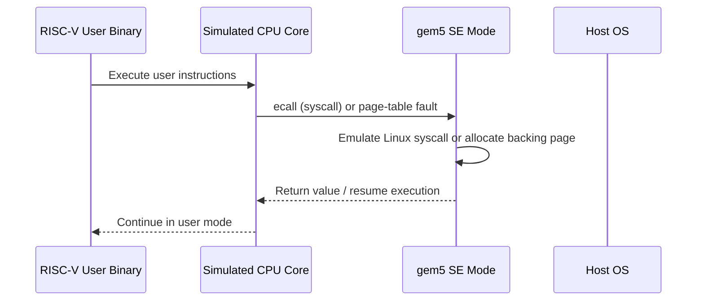

# SE Mode for Chapter 17 Test Programs

You are about to write small RISC-V binaries that exercise a 16-core CHI mesh.
If your mental model of SE mode is wrong, you will misread results before you even get to CHI.
The most common mistake is assuming SE mode behaves like "Linux, but faster to boot."
It does not.
It behaves like "user-space code plus a gem5-implemented kernel boundary plus a gem5-managed physical memory map."

This document answers the questions that matter most for writing Stage 3 test programs
in [`Ch17_FinalProject.md`](../Ch17_FinalProject.md).

---

## 1. What SE Mode Actually Emulates

### Intuition

In full-system mode, gem5 simulates a whole machine and boots a real kernel.
In SE mode, gem5 skips the kernel and only runs a user-space ELF binary.
The guest program still executes ISA instructions on the simulated CPU.
However, when it needs an OS service, gem5 handles the syscall in simulator code
instead of trapping into a guest Linux kernel.



### Working Model

1. Your config script creates CPUs, a [`Process`](../../src/sim/process.hh#L66), and a [`SEWorkload`](../../src/sim/se_workload.hh#L38).
2. `SEWorkload.init_compatible(binary)` picks the RISC-V Linux SE workload class
   from the binary format.
3. `ProcessParams::create()` loads the ELF and constructs a [`RiscvProcess64`](../../src/arch/riscv/process.cc#L71).
4. [`Process::initState()`](../../src/sim/process.cc#L289) writes ELF segments (`.text`, `.data`, `.bss`) into
   simulated memory via [`SETranslatingPortProxy`](../../src/mem/se_translating_port_proxy.hh#L49),
   while `RiscvProcess64::initState()` builds the initial stack with `argc`, `argv`,
   `envp`, and the auxiliary vector.
5. The stack pointer is set, the PC is set to the ELF entry point, and `m5.simulate()`
   starts the event loop.
6. When the CPU executes `ecall`, [`EmuLinux::syscall()`](../../src/arch/riscv/linux/se_workload.cc#L529) dispatches to
   a C++ handler, not to a guest kernel.
7. When the CPU touches an unmapped but valid SE-mode region, gem5 allocates and maps
   a backing page inline instead of taking a real kernel trap.

### Formal and Code

| Class | File | Role |
|-------|------|------|
| `SEWorkload` | [`se_workload.hh`](../../src/sim/se_workload.hh#L38) | System-wide: manages physical memory pools and dispatches syscalls |
| `EmuLinux` (RISC-V) | [`se_workload.cc`](../../src/arch/riscv/linux/se_workload.cc#L529) | RISC-V-specific: reads syscall number from the register file and routes to the descriptor table |
| `Process` | [`process.hh`](../../src/sim/process.hh#L66) | Per-process state: page table, `MemState`, file descriptors, and PIDs |
| `RiscvProcess64` | [`process.cc`](../../src/arch/riscv/process.cc#L71) | RISC-V 64-bit address-space layout: stack, heap, and `mmap` placement |
| `MemState` | [`mem_state.hh`](../../src/sim/mem_state.hh#L67) | Tracks `brk`, stack bounds, `mmap` region, and VMA list |
| `EmulationPageTable` | [`page_table.hh`](../../src/mem/page_table.hh#L53) | Hash-map page table: virtual page to physical page |

> **This is not Linux.**
>
> - It is not a booted RISC-V Linux kernel.
> - It is not a real guest scheduler with task migration or affinity enforcement.
> - It is not a Linux `/proc` or `/sys` environment with complete kernel metadata.
> - It is not a faithful model of every syscall that a normal glibc environment can issue.

### Failure Modes

- A syscall with no handler triggers `fatal()`, not just `-ENOSYS`.
  The simulation aborts immediately.
- If your binary expects dynamic linking, SE mode will fail long before
  your CHI experiment becomes interesting.
- If you assume kernel scheduling features exist, your placement-sensitive tests
  will quietly test the wrong thing.

---

## 2. The Chapter 17 System Model in One Page

### Intuition

For Chapter 17, the right mental model is not "a 16-core Linux machine."
It is "one statically linked user program, 16 thread contexts, one shared user
address space, one merged 512 MiB physical page pool, and CHI routing that only
starts after virtual-to-physical translation."

The whole configuration hangs off one shared-`Process` pattern:

```python
system = System(mem_ranges=[AddrRange("512MiB")], ...)

process = Process(pid=100, executable=binary_path, cmd=[binary_path])

for cpu in system.cpu:
    cpu.workload = process
    cpu.createThreads()

system.workload = SEWorkload.init_compatible(binary_path)
```

Read that snippet as four promises:

1. All 16 CPUs begin life pointing at the same initial `Process`.
2. Only one `ThreadContext` starts active, so `main()` begins on CPU 0.
3. Additional guest threads appear only through `clone`, usually via `pthread_create`.
4. The physical page allocator starts from one configured `512MiB` range,
   not from per-controller DDR pools.

### Working Model

| Question | Chapter 17 answer |
|----------|-------------------|
| What binary do I run? | One statically linked RISC-V ELF binary |
| What executes it? | 16 `TimingSimpleCPU` instances, each with one `ThreadContext` |
| What is shared? | One user address space, and under `CLONE_VM` the same page table and `MemState` |
| Who handles syscalls? | `SEWorkload` plus the RISC-V `EmuLinux` syscall layer |
| Where do physical pages come from? | One `MemPool` populated from the merged `[0x0, 0x20000000)` range |
| What decides HN-F and DDR placement? | Physical address bits after translation |

The Chapter 17 topology then attaches those 16 cores to a 4x4 mesh.
That is why the useful identities later become:

```text
main thread starts on context 0 -> CPU 0 -> router 0
additional threads come from clone -> free context -> matching CPU -> matching router
virtual address -> page table -> physical address -> HN-F and DDR decode
```

### Formal and Code

| File | Why it matters |
|------|----------------|
| [`rbook_mesh_config.py`](../../configs/example/rbook_mesh_config.py) | Creates the shared `Process`, the 16 CPUs, and the `SEWorkload` |
| [`process.hh`](../../src/sim/process.hh#L66) | Defines the per-process state that all guest threads conceptually share |
| [`se_workload.hh`](../../src/sim/se_workload.hh#L38) | Defines the system-wide SE workload that owns syscall dispatch and physical page pools |
| [`system.hh`](../../src/sim/system.hh) | Owns the registered `ThreadContext` list used later by `findFree()` |

### Failure Modes

- If you change the configured memory range, every later claim in this companion
  about the Chapter 17 physical pool stops being exact.

---

## 3. How Threads, Core IDs, and Placement Work

### Intuition

The first `pthread_create()` does not land on "whatever core Linux chooses."
In this configuration, it lands on CPU 1.
The next one lands on CPU 2.
This continues deterministically until CPU 15.

That gives you a practical Stage 3 rule:
if you need "core 0 versus core 15," use `main()` as participant 0,
create 15 pthreads, and branch on the current core ID inside the program.

In the stock Chapter 17 setup, the identity you care about is:

```text
contextId == cpu_id == router_id
```

### Working Model

Each `cpu.createThreads()` call creates one CPU thread context.
Those thread contexts are registered with the system in
[`BaseCPU::registerThreadContexts()`](../../src/cpu/base.cc#L493).
Because all 16 CPUs are given the same `Process` object in
[`rbook_mesh_config.py`](../../configs/example/rbook_mesh_config.py#L87), they all start from the same user-space image.
[`Process::initState()`](../../src/sim/process.cc#L289) activates only the first thread context.
That is why a single-threaded binary only runs on one core even though 16 CPUs exist.

When the guest calls `pthread_create()`, the flow is:

1. glibc allocates a thread stack via `mmap(MAP_ANONYMOUS)`.
2. glibc issues `clone3()` with `CLONE_VM | CLONE_THREAD | CLONE_FILES | ...`.
3. gem5 intercepts the syscall in [`doClone()`](../../src/sim/syscall_emul.hh#L1835).
4. `doClone()` calls [`System::Threads::findFree()`](../../src/sim/system.cc#L121).
5. `findFree()` scans thread contexts linearly and returns the first `Halted` one.
6. The child gets a new `Process` object, but under `CLONE_VM` it shares the
   parent's page table and `MemState`.
7. The child's registers are initialized, its stack pointer is pointed at the
   `mmap`-allocated stack, and the chosen thread context is activated.

The `CLONE_VM` sharing is the reason Stage 3 threads behave like one process:

```cpp
// src/sim/process.cc:183-191
if (CLONE_VM & flags) {
    delete np->pTable;
    np->pTable = pTable;      // SAME page table pointer
    np->memState = memState;  // SAME MemState pointer
}
```

`findFree()` is deliberately simple:

```cpp
ThreadContext *System::Threads::findFree()
{
    for (auto &thread: threads) {
        if (thread.context->status() == ThreadContext::Halted)
            return thread.context;
    }
    return nullptr;
}
```

In the Chapter 17 config, context 0 is the main thread.
Contexts 1 through 15 are initially halted.
So the placement rule is:

- The first `pthread_create` lands on context 1, CPU 1, router 1.
- The second lands on context 2, CPU 2, router 2.
- This continues through context 15.
- Threads do not migrate after placement because there is no guest kernel scheduler.
- If a thread exits, its context becomes reusable for the next `clone`.

With 16 CPUs times 1 thread each, you have 16 `ThreadContext`s total.
One is used by `main()`, leaving **15 available for pthreads**.
If you try to create a 16th pthread, `findFree()` returns `nullptr`
and `clone` returns `-EAGAIN`.

To identify the current core from inside the guest, use `getcpu()`.
gem5 implements it by returning `tc->contextId()` and a fixed NUMA node `0`
([`syscall_emul.cc:1442`](../../src/sim/syscall_emul.cc#L1442)):

```cpp
SyscallReturn getcpuFunc(..., VPtr<uint32_t> cpu, VPtr<uint32_t> node, ...) {
    if (cpu)
        *cpu = htog(tc->contextId(), tc->getSystemPtr()->getGuestByteOrder());
    if (node)
        *node = 0;  // Always reports NUMA node 0
    return 0;
}
```

This helper is enough for all Stage 3 code:

```c
#include <stdint.h>
#include <sys/syscall.h>
#include <unistd.h>

static inline int gem5_cpu_id(void)
{
    unsigned cpu = 0;
    unsigned node = 0;
    long ret = syscall(SYS_getcpu, &cpu, &node, 0);
    return ret == 0 ? (int)cpu : -1;
}
```

The most robust placement recipe for Chapter 17 is still:

```c
#define NUM_THREADS 15  // main + 15 pthreads = 16 total

void *worker(void *arg) {
    int tid = (int)(long)arg;
    int cpu = gem5_cpu_id();  // see Section 3

    if (cpu == 15) {
        // This is the far-corner participant.
    } else {
        // Idle or wait at a barrier.
    }
    return NULL;
}

int main() {
    pthread_t threads[NUM_THREADS];
    for (int i = 0; i < NUM_THREADS; i++)
        pthread_create(&threads[i], NULL, worker, (void *)(long)(i + 1));

    // main thread stays on CPU 0.

    for (int i = 0; i < NUM_THREADS; i++)
        pthread_join(threads[i], NULL);

    printf("PASS\n");
    return 0;
}
```

> **Do not use `pthread_setaffinity_np()` or `sched_setaffinity()` in Chapter 17 test binaries.**
>
> `sched_setaffinity()` is registered in the RISC-V syscall table
> ([`se_workload.cc:655`](../../src/arch/riscv/linux/se_workload.cc#L655)) without a handler:
>
> ```cpp
> {122, "sched_setaffinity"},   // no function pointer -> unimplementedFunc
> ```
>
> A call reaches [`unimplementedFunc()`](../../src/sim/syscall_emul.cc#L77), which calls `fatal()`.
> `sched_getaffinity()` is implemented, but it only returns the allowed mask.
> It does not tell you which CPU the thread is currently running on.

### Formal and Code

| File | Key content |
|------|-------------|
| [`thread_context.hh`](../../src/cpu/thread_context.hh#L99) | `ThreadContext::Status`: `Active`, `Suspended`, `Halting`, `Halted` |
| [`system.cc:121`](../../src/sim/system.cc#L121) | `findFree()` scans for the first `Halted` context |
| [`syscall_emul.hh:1835`](../../src/sim/syscall_emul.hh#L1835) | `doClone()` performs thread creation and `CLONE_VM` sharing |
| [`process.cc:183`](../../src/sim/process.cc#L183) | Shares page table and `MemState` under `CLONE_VM` |
| [`syscall_emul.cc:1442`](../../src/sim/syscall_emul.cc#L1442) | `getcpu()` returns `contextId()` |
| [`rbook_4x4.py`](../../configs/example/noc_config/rbook_4x4.py) | Attaches CPU-side request nodes to matching routers in the mesh |

### Failure Modes

- If you create only one worker thread and expect it on core 15, it lands on core 1.
- If you assume an OS scheduler will rebalance hot threads onto idle cores, nothing
  like that exists in SE mode.
- If your thread-creation order changes, your role-to-core mapping changes with it.
- If you assign a different `Process` object to each CPU, your "threads" will not
  share memory and the coherence tests will be meaningless.
- If you create more threads than available contexts, the extra `pthread_create`
  calls fail with `EAGAIN`.
- If you use `sched_getaffinity()` as a placement probe, you only learn the
  allowed mask, not the current location.
- If you use `pthread_setaffinity_np()` or `sched_setaffinity()`, the simulation dies.
- If you later switch to a configuration with SMT or switched CPUs,
  `contextId == cpu_id` may no longer hold.

---

## 4. How Guest Addresses Become CHI Traffic

### Intuition

A page is not "on DDR0."
A page is not "on HN-F 7."
After translation, CHI only sees physical addresses, and the Chapter 17 address
interleaving happens at cache-line granularity.

That is why one 4 KiB page spans both DDR controllers and all 16 HN-F slices.
The virtual address chooses a region such as stack, heap, or `mmap`.
The physical address bits choose the home node and the memory controller.

[`RiscvProcess64`](../../src/arch/riscv/process.cc#L71) sets up this guest virtual layout:

```text
┌──────────────────────────────────┐  0x7fff_ffff_ffff_ffff
│  Main Stack                      │  stack_base
│  (64 MiB max)                    │  ↓ grows down
├──────────────────────────────────┤
│  Thread Stack Reserve            │  next_thread_stack_base
│  (mmap'd by glibc pthread)       │  = stack_base - 64 MiB
├ ─ ─ ─ ─ ─ ─ ─ ─ ─ ─ ─ ─ ─ ─ ─ ─ ─┤
│                                  │
│           ~~~ gap ~~~            │
│                                  │
├──────────────────────────────────┤  0x4000_0000_0000_0000
│  mmap Region                     │  mmap_end
│  (shared libs, anon maps)        │  ↓ grows down
├ ─ ─ ─ ─ ─ ─ ─ ─ ─ ─ ─ ─ ─ ─ ─ ─ ─┤
│                                  │
│           ~~~ gap ~~~            │
│                                  │
├──────────────────────────────────┤  brk_point
│  Heap (brk / sbrk / malloc)      │  ↑ grows up
├──────────────────────────────────┤
│  .bss    (zero-init data)        │
│  .data   (initialized data)      │
│  .rodata (read-only data)        │
│  .text   (code)                  │
├──────────────────────────────────┤  ~0x10000
│  Unmapped / Guard                │
└──────────────────────────────────┘  0x0
```

### Working Model

The chain from guest pointer to CHI traffic has four steps.

**Step 1: choose a virtual region**

The important difference is not "which cache they use."
After allocation, static data, heap data, stack data, and `mmap` data are all
normal cacheable pages in the same physical memory system.
What changes is how the virtual region is created and when physical backing appears.

| Segment | When backed by physical pages | How |
|---------|-------------------------------|-----|
| `.text`, `.data`, `.rodata` | At process load | `image.write(*initVirtMem)` eagerly allocates pages |
| `.bss` | At process load | Eagerly allocated and zero-filled |
| Heap (`brk`) | Lazily on first access | `brk()` creates a VMA and `fixupFault()` allocates on first touch |
| Stack (main) | At process load, then on demand | `argsInit()` builds the initial frame and later growth uses `fixupFault()` up to `maxStackSize` |
| `mmap` regions | Lazily on first access | `mmap()` creates a VMA and `fixupFault()` allocates on first touch |
| Thread stacks | Lazily on first access | glibc `mmap`s them before `clone` and gem5 backs them normally |

**Step 2: translate virtual pages to physical pages**

SE mode does **not** use identity mapping.
The [`EmulationPageTable`](../../src/mem/page_table.hh#L53) is a hash map
from virtual page number to physical page number:

```cpp
bool EmulationPageTable::translate(Addr vaddr, Addr &paddr)
{
    const Entry *entry = lookup(vaddr);
    if (!entry) return false;
    paddr = pageOffset(vaddr) + entry->paddr;
    return true;
}
```

If a valid SE-mode region is unmapped, [`MemState::fixupFault()`](../../src/sim/mem_state.cc#L387)
causes gem5 to allocate and map a physical page.
That is why heap and `mmap` pages are lazy even though the binary itself has already loaded.

**Step 3: allocate from one merged physical pool**

Physical pages come from a `MemPool` owned by [`SEWorkload`](../../src/sim/se_workload.hh#L38).
The pool is initialized from the system's configured memory ranges:

```cpp
void SEWorkload::setSystem(System *sys) {
    Workload::setSystem(sys);
    AddrRangeList memories = sys->getPhysMem().getConfAddrRanges();
    memPools.populate(memories);
}
```

With `mem_ranges=[AddrRange("512MiB")]` in Chapter 17, the physical page pool
spans `0x0` through `0x20000000`.
Pages are allocated sequentially from this pool by [`MemPool::allocate()`](../../src/sim/mem_pool.cc#L96).

The important subtlety is that [`PhysicalMemory`](../../src/mem/physical.cc)
merges matching interleaved controller ranges back into one configured range
before the SE allocator sees them.
So the allocator does not know about "DDR0 pages" and "DDR1 pages."
It only sees one contiguous physical pool.

**Step 4: decode physical-address bits into HN-F and DDR destinations**

The Chapter 17 config uses a single physical memory range of `512MiB`,
so physical addresses run from `0x00000000` through `0x1fffffff`.
There are then two independent interleaving stages.

HN-F interleaving is 16-way.
[`CHI_config.py:636`](../../configs/ruby/CHI_config.py#L636) computes:

```python
block_size_bits = int(math.log(cache_line_size, 2))  # = 6 (64B lines)
llc_bits = int(math.log(len(hnfs), 2))               # = 4 (16 HNFs)
numa_bit = block_size_bits + llc_bits - 1            # = 9

for i, hnf in enumerate(hnfs):
    addr_range = AddrRange(
        r.start, size=r.size(),
        intlvHighBit=9,      # bits [9:6] select HN-F
        intlvBits=4,         # 4 bits -> 16 HN-Fs
        intlvMatch=i,
    )
```

Bits **[9:6]** of the physical address choose the HN-F and LLC slice.
Consecutive 64-byte cache lines cycle through HN-F 0, 1, 2, ..., 15, then back to 0.

SN-F interleaving is 2-way.
[`Ruby.py:151`](../../configs/ruby/Ruby.py#L151) and [`MemConfig.py:44`](../../configs/common/MemConfig.py#L44) compute:

```python
intlv_size = 64                              # = cacheline_size
intlv_low_bit = int(math.log(64, 2))         # = 6
intlv_bits = int(math.log(2, 2))             # = 1
# intlvHighBit = intlv_low_bit + intlv_bits - 1 = 6
```

- **DDR0** (router 0): `intlvHighBit=6, intlvBits=1, intlvMatch=0` -> bit 6 = 0
- **DDR1** (router 15): `intlvHighBit=6, intlvBits=1, intlvMatch=1` -> bit 6 = 1

So bit 6 selects the DDR controller.
Even-numbered cache lines go to DDR0.
Odd-numbered cache lines go to DDR1.

```text
hnf_id = (paddr >> 6) & 0xf     # 16-way HN-F selection
ddr_id = (paddr >> 6) & 0x1     # 2-way DDR selection
```

The path that matters for Stage 3 is therefore:

```text
Guest virtual address
    |
    v
EmulationPageTable::translate()    <- hash-map lookup
    |
    v
Physical address from the 512 MiB pool
    |
    +-- bits [9:6] -> select 1 of 16 HN-F nodes
    |
    +-- bit [6]   -> select DDR0 or DDR1
```

That yields three immediate experimental consequences:

1. Consecutive 64-byte cache lines alternate between DDR0 and DDR1.
2. Consecutive 64-byte cache lines cycle through all 16 HN-F slices.
3. A single 4 KiB page contains 64 cache lines, so one page spans both DDR
   controllers and all 16 HN-Fs.

That last point is the one most people miss.
Large allocations are not "placed on one controller."
Only individual cache lines are.

### Formal and Code

- RISC-V page size is 4 KiB from [`page_size.hh`](../../src/arch/riscv/page_size.hh#L53).
- RV64 stack base, `mmap_end`, and initial `brk_point` are set in [`process.cc`](../../src/arch/riscv/process.cc#L71).
- Heap and `mmap` VMAs are tracked by [`MemState`](../../src/sim/mem_state.hh#L67).
- Page fault handling is in [`MemState::fixupFault()`](../../src/sim/mem_state.cc#L387).
- The software page table is [`EmulationPageTable`](../../src/mem/page_table.hh#L53).
- The system-wide page pool is populated in [`se_workload.cc:43`](../../src/sim/se_workload.cc#L43).
- Physical frames are handed out by [`MemPool::allocate()`](../../src/sim/mem_pool.cc#L96).
- Matching interleaved controller ranges are merged by [`physical.cc`](../../src/mem/physical.cc).
- HN-F interleaving comes from [`CHI_config.py:636`](../../configs/ruby/CHI_config.py#L636).
- DDR-controller interleaving comes from [`Ruby.py:151`](../../configs/ruby/Ruby.py#L151) and [`MemConfig.py:44`](../../configs/common/MemConfig.py#L44).

### Failure Modes

- If you think `malloc()` immediately allocates physical pages, you will
  misunderstand when pages first appear in stats.
  Physical pages are backed lazily on first touch.
- If you expect lazy page allocation for `.text` and `.data`, you will miscount
  page faults.
  Those pages are eagerly backed during `initState()`.
- If you blow past `maxStackSize`, gem5 will `fatal` with
  "Maximum stack size exceeded."
- If you reason only with guest virtual addresses, you will miss that HN-F and DDR
  placement are driven by physical address bits after translation.
- If you talk about "this malloc block lives on DDR0," you are oversimplifying.
  Cache-line interleaving means any large allocation spans both DDR controllers.
- If you use one address per page, you may accidentally sample only a tiny subset
  of the HN-F and DDR pattern.
- If you stride by one cache line, you automatically distribute traffic across
  both DDR controllers and all 16 HN-F slices.

---

## 5. Which Synchronization and Measurement Primitives Are Safe

### Intuition

For Stage 3, rely on the mechanisms gem5 SE mode actually models well:
ISA-level atomics, futex-backed pthread primitives, `rdcycle`, cache-line alignment,
and eviction sweeps that create misses through normal demand traffic.

Do not rely on privileged cache-management instructions.
Do not forget that the primitive you choose changes what you are measuring.
A hand-rolled spinning barrier measures contention.
A futex-heavy pthread barrier may partly measure suspension and wakeup behavior instead.

### Working Model

**Atomic memory operations**

RISC-V `amoadd.w`, `amoswap.w`, `lr`/`sc`, and related instructions are supported.
The CPU generates a memory request with an `AtomicOpFunctor` attached.
Ruby's CHI path preserves atomicity by applying the operation at the cache controller
that owns the line in exclusive state via
[`WriteMask::performAtomic()`](../../src/mem/ruby/common/WriteMask.hh#L259).

GCC compiles C11 atomics to these instructions:

```c
__atomic_fetch_add(&counter, 1, __ATOMIC_SEQ_CST);   // -> amoadd.w
__atomic_compare_exchange_strong(...);               // -> lr/sc pair
```

**Futex**

The `futex` syscall is emulated in [`syscall_emul.hh`](../../src/sim/syscall_emul.hh).
Supported operations include:

| Operation | Behavior |
|-----------|----------|
| `FUTEX_WAIT` | Thread suspends (`ThreadContext` becomes `Suspended`), so it stops consuming cycles |
| `FUTEX_WAKE` | Wakes N suspended threads |
| `FUTEX_CMP_REQUEUE` | Moves waiters between futexes |
| `FUTEX_WAKE_OP` | Performs an atomic operation plus a conditional wake |

[`FutexMap`](../../src/sim/futex_map.hh#L109) tracks waiting threads per futex
physical address.
Threads that call `FUTEX_WAIT` are suspended.
They are not spinning in the background.

**pthread mutexes, barriers, and condition variables**

glibc builds these out of atomics plus futex.
They work in SE mode because both layers are supported.
The two practical requirements are:

1. The binary must be statically linked so glibc's pthread implementation is present.
2. The configuration must have enough `ThreadContext`s for all threads.

**Spinning versus suspension**

For the simple atomic barrier used in Stage 3e, all threads spin:

```c
volatile int barrier_counter = 0;

void barrier_wait(int round, int num_threads) {
    int target = num_threads * (round + 1);
    __atomic_fetch_add(&barrier_counter, 1, __ATOMIC_SEQ_CST);
    while (__atomic_load_n(&barrier_counter, __ATOMIC_SEQ_CST) < target)
        ;  // spin
}
```

In SE mode, a spinning thread consumes simulation cycles on its CPU.
That is realistic for a contention microbenchmark.
The futex-based suspension path only appears when a library primitive decides to sleep.

**Memory fences for producer-consumer tests**

```c
// Producer: release store
data->value = new_value;
atomic_thread_fence(memory_order_release);  // -> fence rw,w
flag->ready = 1;

// Consumer: acquire load
while (!flag->ready)
    ;  // spin
atomic_thread_fence(memory_order_acquire);  // -> fence r,rw
use(data->value);
```

**Cycle measurement**

Use the `rdcycle` CSR.
In SE mode with `TimingSimpleCPU`, it returns the simulated cycle count:

```c
static inline unsigned long rdcycle(void) {
    unsigned long c;
    asm volatile ("rdcycle %0" : "=r"(c));
    return c;
}
```

Use `rdcycle` to compare code paths on the same kind of core.
It is not an abstract global latency metric that transfers unchanged to other CPU models.

**Forcing cold misses**

SE mode does not support privileged cache-management instructions.
To force cold misses, touch a working set large enough to evict previous data
through the normal cache hierarchy:

```c
// With L1 = 32 KiB and L2 = 256 KiB, reading 512 KiB of unrelated
// data between measurements flushes both levels.
volatile char eviction_buffer[512 * 1024];

void flush_caches(void) {
    volatile int sink = 0;
    for (size_t i = 0; i < sizeof(eviction_buffer); i += 64)
        sink += eviction_buffer[i];
}
```

Alternatively, use `m5_dump_reset_stats` or `m5_reset_stats` pseudo-ops
to reset statistics between phases.
That does not flush caches, but it isolates the counters for the region you care about.

**Cache-line alignment**

The Chapter 17 cache-line size is 64 bytes.
Align shared data accordingly:

```c
// Separate cache lines for producer-consumer flag and data.
struct aligned_data {
    int value;
    char pad[60];
} __attribute__((aligned(64)));

// Or use C11.
#include <stdalign.h>
alignas(64) int shared_counter;
```

Put flags and payloads on separate cache lines when you want a clean
producer-consumer handoff.
Put them on the same line only when you intentionally want false sharing.

### Formal and Code

| File | Why it matters |
|------|----------------|
| [`WriteMask.hh`](../../src/mem/ruby/common/WriteMask.hh#L259) | Performs Ruby-side atomic updates |
| [`syscall_emul.hh`](../../src/sim/syscall_emul.hh) | Emulates `futex` and other SE syscalls |
| [`futex_map.hh`](../../src/sim/futex_map.hh#L109) | Tracks suspended waiters per futex address |
| [`se_workload.cc`](../../src/arch/riscv/linux/se_workload.cc#L655) | Shows which Linux syscalls exist in RISC-V SE mode |

### Failure Modes

- If you use `pthread_barrier_t` from glibc instead of a hand-rolled atomic barrier,
  it still works, but the futex-based suspension can hide the contention effects
  you wanted to measure.
- If you forget `-static -lpthread` when compiling, the binary either cannot be
  loaded or has no working pthread support.
- If you compare `rdcycle` results across different CPU models as if they were
  identical metrics, you will over-interpret them.
- If you expect `cbo.flush` or other privileged cache-management instructions to
  save you, SE mode is the wrong environment for that workflow.
- If you put a flag and its payload on the same cache line when you meant to
  study a clean producer-consumer handoff, you created false sharing instead.

---

## 6. Deep Dive: How ELF Segments Reach Simulated DRAM

### Intuition

By the time you reach Chapter 17, you usually no longer ask "does the ELF load?"
You ask "what exactly does gem5 do when it loads it?"

The ELF binary sits on the host filesystem.
The simulated DRAM is a `mmap`'d buffer inside the gem5 host process.
Between those endpoints lies a chain of ELF parsing, virtual-to-physical translation,
page allocation, packet construction, and functional memory access.

This section is optional for writing Stage 3 code, but it explains four facts that
often confuse readers:

- Why `.text` and `.data` are already backed before simulation starts.
- How the `EmulationPageTable` is populated before any guest instruction executes.
- Why ELF loading bypasses the timing model entirely.
- Why both DDR controllers can share one host backing store even though they are
  separate SimObjects.

### Working Model

The chain has five stages.
Each stage moves the ELF data one step closer to simulated DRAM.

**Stage 1: ELF parsing to `MemoryImage`**

The `Process` constructor ([`process.cc:161`](../../src/sim/process.cc#L161))
calls `objFile->buildImage()`.
The ELF parser ([`elf_object.cc:126`](../../src/base/loader/elf_object.cc#L126))
iterates the ELF program headers and for each `PT_LOAD` segment calls
`handleLoadableSegment()` ([`elf_object.cc:374`](../../src/base/loader/elf_object.cc#L374)).
This creates `MemoryImage::Segment` entries holding `(vaddr, data_ptr, size)`.
At this point those entries just reference the `mmap`'d ELF file data.
No copy into simulated memory has happened yet.
For BSS, where file size is smaller than memory size, a separate zero-filled segment is created.

**Stage 2: `Process::initState()` triggers the write**

[`process.cc:306`](../../src/sim/process.cc#L306) calls:

```cpp
image.write(*initVirtMem);
```

`initVirtMem` is an [`SETranslatingPortProxy`](../../src/mem/se_translating_port_proxy.hh#L49)
configured with `AllocateType::Always`.
It allocates physical pages on demand for any virtual address it encounters.

`MemoryImage::write()` ([`memory_image.cc:53`](../../src/base/loader/memory_image.cc#L53))
iterates all segments.
For each segment, `writeSegment()` ([`memory_image.cc:39`](../../src/base/loader/memory_image.cc#L39)) calls:

- `proxy.writeBlob(seg.base, seg.data, seg.size)` for data segments
- `proxy.memsetBlob(seg.base, 0, seg.size)` for BSS segments

The `seg.base` is still a **virtual address** from the ELF header.

**Stage 3: translation, fault fixup, and page allocation**

`writeBlob()` calls `tryWriteBlob()` ([`translating_port_proxy.cc:101`](../../src/mem/translating_port_proxy.cc#L101)),
which uses a `TranslationGen` to walk the request page by page.
For each chunk ([`translating_port_proxy.cc:63`](../../src/mem/translating_port_proxy.cc#L63)):

1. Ask the MMU to translate the virtual address via `translateFunctional()`.
2. If the page is unmapped, call `fixupRange()`.

`SETranslatingPortProxy::fixupRange()` ([`se_translating_port_proxy.cc:54`](../../src/mem/se_translating_port_proxy.cc#L54))
handles the fault by calling:

```cpp
process->allocateMem(range_start, range_size);
```

[`Process::allocateMem()`](../../src/sim/process.cc#L318) then does two things:

1. Ask `seWorkload->allocPhysPages(npages)` for frames from the `MemPool`.
2. Call `pTable->map(vaddr, paddr, size)` to insert vaddr-to-paddr entries.

After `fixupRange()` returns, translation retries and succeeds.
The whole fault-allocate-retry cycle is synchronous and inline.
There is no guest OS trap and no context switch.
This is the most literal sense in which "the simulator is the OS" in SE mode.

**Stage 4: functional writes through the port hierarchy**

After translation, `PortProxy::writeBlobPhys()` ([`port_proxy.cc:75`](../../src/mem/port_proxy.cc#L75))
splits the write into cache-line-sized chunks, creates a `WriteReq` packet for each
physical address, and calls `sendFunctional(pkt)`.

The packet then travels through the normal port hierarchy as a **functional** access:

```text
ThreadContext::sendFunctional()     <- cpu/thread_context.cc:159
    v
CPU DataPort -> SystemXBar
    v
MemCtrl::recvFunctional()           <- or SimpleMemory::recvFunctional()
    v
AbstractMemory::functionalAccess()  <- abstract_mem.cc:489
```

Because the access is functional, it bypasses the timing model.
No queue delays, no cache miss events, no coherence traffic, and no DRAM bank timing
are modeled during ELF loading.

**Stage 5: host-pointer arithmetic into the backing store**

[`AbstractMemory::functionalAccess()`](../../src/mem/abstract_mem.cc#L489) computes:

```cpp
uint8_t *host_addr = pmemAddr + paddr - range.start();
pkt->writeData(host_addr);   // memcpy into host buffer
```

At that point, the ELF segment data has been copied into the host buffer that
acts as simulated DRAM.

### How the Backing Store Is Set Up

[`PhysicalMemory`](../../src/mem/physical.cc#L79) owns the actual host memory.
When the `System` is constructed, it inspects the list of `AbstractMemory` objects
and notices that the Chapter 17 DDR controllers have interleaved ranges over the
same 512 MiB span.
It then:

1. Merges those ranges into one contiguous configured range.
2. Calls `createBackingStore()` once, creating one `mmap(MAP_ANON | MAP_PRIVATE)`.
3. Hands the same host pointer to both `AbstractMemory` objects via `setBackingStore()`.

Both DDR controllers therefore share one contiguous host buffer.
The interleaving is a routing concern for timing simulation, not a storage partition.

### The Complete Chain

```text
ELF on host disk
  |  mmap'd by loader
  v
MemoryImage::Segment{vaddr, data*, size}     references into ELF file
  |
  v
MemoryImage::write(proxy)                    iterate segments
  |
  v
TranslatingPortProxy::tryWriteBlob()         walk page-by-page
  |
  +-- page unmapped? --> SETranslatingPortProxy::fixupRange()
  |                         |
  |                         +-- MemPool::allocate()       bump-alloc physical frame
  |                         +-- EmulationPageTable::map() vaddr -> paddr
  |
  v
PortProxy::writeBlobPhys(paddr, data)        split into cache-line packets
  |
  v
sendFunctional(WriteReq)                     traverse port hierarchy
  |
  v
AbstractMemory::functionalAccess()           host_ptr = pmemAddr + (paddr - base)
  |                                          memcpy(host_ptr, data, size)
  v
Host mmap'd buffer  ===  Simulated DRAM      shared by both DDR controllers
```

### Formal and Code

| Class | File | Role |
|-------|------|------|
| `ElfObject` | [`elf_object.cc:374`](../../src/base/loader/elf_object.cc#L374) | Parses ELF `PT_LOAD` segments into `MemoryImage` |
| `MemoryImage` | [`memory_image.cc:39`](../../src/base/loader/memory_image.cc#L39) | Iterates segments and calls `writeBlob` or `memsetBlob` |
| `SETranslatingPortProxy` | [`se_translating_port_proxy.cc:54`](../../src/mem/se_translating_port_proxy.cc#L54) | Allocates pages on fault via `fixupRange()` |
| `TranslatingPortProxy` | [`translating_port_proxy.cc:63`](../../src/mem/translating_port_proxy.cc#L63) | Walks requests page by page and retries after allocation |
| `PortProxy` | [`port_proxy.cc:75`](../../src/mem/port_proxy.cc#L75) | Splits writes into packets and sends functional accesses |
| `PhysicalMemory` | [`physical.cc:198`](../../src/mem/physical.cc#L198) | Creates the host backing store and shares it across memories |
| `AbstractMemory` | [`abstract_mem.cc:489`](../../src/mem/abstract_mem.cc#L489) | Maps physical addresses to host pointers and copies data |
| `MemPool` | [`mem_pool.cc:96`](../../src/sim/mem_pool.cc#L96) | Bump allocator for physical frames |
| `EmulationPageTable` | [`page_table.cc:48`](../../src/mem/page_table.cc#L48) | Stores virtual-to-physical mappings |

### Failure Modes

- If you assume ELF loading goes through the timing model, you will look for cache
  miss statistics that do not exist.
  Functional access bypasses all timing.
- If you think each DDR controller has its own separate backing store, you will be
  confused by the fact that both compute the same host pointer for the same physical
  address.
  The split only matters for routing during timing simulation.

---

**Quick Reference**

All Stage 3 binaries must be statically linked:

```bash
riscv64-linux-gnu-gcc -O2 -static -lpthread -o test test.c
```

The `-static` flag is essential because SE mode does not load a dynamic linker.
The shared `Makefile` in `ruby-book/final/` already handles this.

Run with:

```bash
./build/RISCV/gem5.opt -d m5out/rbook-<name>-$(date +%Y%m%d-%H%M%S) \
    configs/example/rbook_mesh_config.py \
    --cmd=ruby-book/final/rbook_test_<name>
```

After simulation, check:

| What to check | Where |
|---------------|-------|
| Simulation completed | `tail m5out/*/simout` and look for `PASS` |
| Per-HN-F LLC stats | `grep "hnf.*m_demand" m5out/*/stats.txt` |
| Garnet link utilization | `grep "int_link.*utilization" m5out/*/stats.txt` |
| DDR controller balance | `grep "mem_ctrls.*Reqs" m5out/*/stats.txt` |
| Simulation time | `grep "sim_seconds" m5out/*/stats.txt` |

Useful debug runs:

```bash
# Protocol-level debugging
./build/RISCV/gem5.opt --debug-flags=Ruby,RubySlicc ...

# Network-level debugging
./build/RISCV/gem5.opt --debug-flags=Garnet ...

# Syscall and memory debugging
./build/RISCV/gem5.opt --debug-flags=SyscallAll,PageTableWalker ...
```

## Key Ideas

- SE mode is user-space execution plus gem5 syscall emulation, not a booted Linux kernel.
- The Chapter 17 config starts from one shared `Process`, one `SEWorkload`, 16 `ThreadContext`s, and one merged `512MiB` physical page pool.
- Only one thread context starts active, so `main()` begins on CPU 0 and later pthreads land on the first halted contexts in deterministic order.
- In the stock Chapter 17 mesh, `contextId == cpu_id == router_id`, and `getcpu()` is the right placement probe.
- `sched_setaffinity()` is an unimplemented fatal trap in this environment.
- The guest virtual layout is managed by `Process`, `MemState`, and `EmulationPageTable`.
- Static image pages are backed during load, while heap and `mmap` pages are backed lazily on first touch.
- The SE allocator sees one contiguous physical pool.
  CHI later decodes physical addresses into HN-F slices with bits `[9:6]` and DDR controllers with bit `6`.
- A single 4 KiB page spans both DDR controllers and all 16 HN-Fs.
- Atomic operations, futex-backed pthreads, `rdcycle`, alignment, and eviction sweeps are the core Stage 3 toolbox.

## 1-Page Mental Model

```text
                        gem5 SE Mode for Chapter 17
┌─────────────────────────────────────────────────────────────────┐
│  Your C binary                                                  │
│  - Compiled: riscv64-linux-gnu-gcc -O2 -static -lpthread       │
│  - Runs on simulated RISC-V CPUs, syscalls handled by gem5     │
│                                                                 │
│  Execution model:                                               │
│  - 16 CPUs, 16 ThreadContexts, one shared starting Process     │
│  - main() gets CPU 0; CPUs 1-15 start Halted                  │
│  - pthread_create -> findFree() -> first halted context        │
│  - No migration, no affinity APIs, deterministic placement     │
│                                                                 │
│  Placement model:                                               │
│  - In this config: contextId == cpu_id == router_id            │
│  - Use getcpu() to discover the current core                   │
│  - Create 15 pthreads to fill all cores, branch on cpu ID      │
│                                                                 │
│  Address model:                                                 │
│  - One shared user address space under CLONE_VM                │
│  - Virtual pages -> EmulationPageTable -> physical pages       │
│  - Physical pool: 0x0 .. 0x20000000 (512 MiB)                  │
│  - Heap and mmap pages backed lazily on first touch            │
│                                                                 │
│  CHI routing after translation:                                 │
│  - bits [9:6] -> 1 of 16 HN-F slices                           │
│  - bit [6]    -> DDR0 (=0) or DDR1 (=1)                        │
│  - One 4 KiB page spans all 16 HN-Fs and both DDRs             │
│                                                                 │
│  Toolbox:                                                       │
│  - ISA atomics and futex-backed pthreads work                  │
│  - rdcycle measures simulated cycles on this CPU model         │
│  - alignas(64) controls cache-line layout                      │
│  - eviction sweeps create cold misses without privileged ops   │
└─────────────────────────────────────────────────────────────────┘
```

## Common Misconceptions

| Misconception | Reality |
|---------------|---------|
| "SE mode is Linux, but faster to boot." | SE mode is user-space code plus gem5 syscall emulation. There is no guest kernel, no scheduler, and no full `/proc` environment. |
| "If I created 16 CPUs, my single-threaded binary runs on all 16." | Only one `ThreadContext` is active at boot. The others start `Halted` and only become runnable after `clone`. |
| "Threads are scheduled by an OS scheduler." | There is no guest scheduler here. `findFree()` does a linear scan and threads do not migrate. |
| "`pthread_setaffinity_np()` will pin a thread to router 15." | `sched_setaffinity` is unimplemented in RISC-V SE mode and calls `fatal()`. Use creation order plus `getcpu()`. |
| "Heap pages are fully allocated when `malloc()` returns." | `brk()` creates a VMA. Physical pages appear later on first touch. |
| "One allocation lives on one DDR controller." | Interleaving is at cache-line granularity. A single page spans both DDR controllers and all 16 HN-Fs. |
| "ELF loading should show up as cache and DRAM timing traffic." | ELF loading uses functional accesses during `initState()`, so it bypasses the timing model. |
| "I can use `cbo.flush` to flush caches in SE mode." | Privileged cache-management instructions are not the right mechanism here. Use large eviction sweeps instead. |

## If You Remember One Thing…

For Chapter 17, write your tests as if gem5 SE mode gives you a deterministic pool
of 16 thread contexts sharing one user address space and one physical page pool,
and let `getcpu()` plus cache-line-level physical-address reasoning drive your
placement and measurement logic instead of relying on Linux scheduler features.
