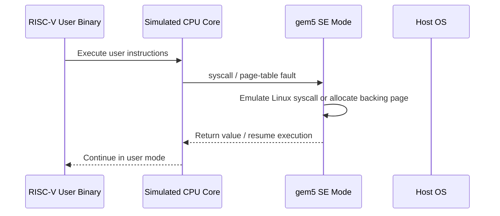

# SE Mode for Chapter 17 Test Programs

You are about to write small RISC-V binaries that are supposed to exercise a 16-core CHI mesh.
If your mental model of SE mode is wrong, you will misread the results before you even get to CHI.
The most common mistake is to assume that SE mode behaves like “Linux, but faster to boot”.
It does not.
It behaves like “user-space code plus a gem5-implemented kernel boundary plus a gem5-managed physical memory map”.

This note answers the seven questions that matter most for Stage 3 of [`Ch17_FinalProject.md`](../Ch17_FinalProject.md).

## 1. What SE Mode Actually Is

### Intuition

In full-system mode, gem5 simulates a whole machine and boots a real kernel.
In SE mode, gem5 skips the kernel and only runs a user-space ELF binary.
The guest program still executes ISA instructions on the simulated CPU.
However, when it needs an OS service, gem5 handles the syscall in simulator code instead of trapping into a guest Linux kernel.



### Working Model

1. Your config script creates CPUs, a [`Process`](../../src/sim/process.hh), and a [`SEWorkload`](../../src/sim/se_workload.hh).
2. `SEWorkload.init_compatible(binary)` picks the RISC-V Linux SE workload class from the binary format in [`src/sim/Workload.py`](../../src/sim/Workload.py) and [`src/arch/riscv/RiscvSeWorkload.py`](../../src/arch/riscv/RiscvSeWorkload.py).
3. `ProcessParams::create()` loads the ELF and constructs a [`RiscvProcess64`](../../src/arch/riscv/process.cc) or `RiscvProcess32`.
4. `Process::initState()` creates a translating proxy and writes the ELF image into target memory in [`src/sim/process.cc`](../../src/sim/process.cc).
5. Later, syscall instructions are dispatched by [`RiscvISA::EmuLinux::syscall()`](../../src/arch/riscv/linux/se_workload.cc) into the syscall table, not into a guest kernel.

### Formal and Code

- The top-level SE workload object owns the physical page allocator in [`src/sim/se_workload.cc`](../../src/sim/se_workload.cc).
- The per-process user address space is represented by [`Process`](../../src/sim/process.hh), [`MemState`](../../src/sim/mem_state.hh), and [`EmulationPageTable`](../../src/mem/page_table.hh).
- The RISC-V Linux syscall layer is in [`src/arch/riscv/linux/se_workload.cc`](../../src/arch/riscv/linux/se_workload.cc).
- The chapter-17 system installs SE mode with one shared `Process` in [`configs/example/rbook_mesh_config.py`](../../configs/example/rbook_mesh_config.py).

### What SE Mode Is Not

- It is not a booted RISC-V Linux kernel.
- It is not a real guest scheduler with task migration and affinity enforcement.
- It is not a Linux `/proc` or `/sys` environment with complete kernel metadata.
- It is not a faithful model of every syscall that a normal glibc environment can issue.

### Failure Modes

- A syscall with no handler can abort the simulation with `fatal`, not just return `-ENOSYS`.
- If your binary expects dynamic linking, SE mode will fail long before your CHI experiment becomes interesting.
- If you assume kernel scheduling features exist, your placement-sensitive tests will quietly test the wrong thing.

## 2. How Memory Is Allocated, and Where Code, Data, Heap, `mmap`, and Stack Live

### Intuition

There are two different address spaces to keep in your head.
The guest program sees a virtual address space.
gem5 backs that virtual space with simulated physical addresses.
Then the memory system maps those physical addresses onto HN-Fs, SN-Fs, DDR controllers, and links.

For RV64 in SE mode, gem5 builds the virtual layout like this.

```text
High virtual addresses
0x7fff_ffff_ffff_ffff   stack base
        |               main stack grows down
        v

        free gap

0x4000_0000_0000_0000   mmap base for RISC-V in gem5
        |               mmap region grows up
        v

brk_point = roundUp(image.maxAddr(), 4 KiB)
        |               heap grows up from here
        v

ELF text / rodata / data / bss at linked virtual addresses

Low virtual addresses
```

### Working Model

Static code and global data come from the ELF image, not from `malloc`.
gem5 loads those segments by writing the image into virtual memory through `SETranslatingPortProxy::Always`, which allocates backing pages as needed in [`src/mem/se_translating_port_proxy.cc`](../../src/mem/se_translating_port_proxy.cc).
The initial heap break is set to `roundUp(image.maxAddr(), PageBytes)` in [`src/arch/riscv/process.cc`](../../src/arch/riscv/process.cc).
The main thread stack starts at `0x7fffffffffffffff` on RV64 and is initialized in `RiscvProcess::argsInit()` in the same file.
The stack contains `argc`, `argv`, `envp`, and the auxiliary vector before the first instruction of `main`.

Dynamic regions are handled differently.
`brk()` updates the heap VMA in [`brkFunc`](../../src/sim/syscall_emul.cc), but it does not immediately allocate physical pages.
`mmap()` creates a VMA in [`mmapFunc`](../../src/sim/syscall_emul.hh), but it also does not immediately allocate physical pages.
The actual physical page backing for heap, `mmap`, and later stack growth is usually created lazily on first access through [`GenericPageTableFault::invoke()`](../../src/sim/faults.cc) and [`MemState::fixupFault()`](../../src/sim/mem_state.cc).

That gives you this split.

- ELF text, rodata, data, and bss are backed during initial program load.
- The initial main stack pages are backed during `argsInit()`.
- Heap pages are usually backed on first touch after `brk`.
- Anonymous and file-backed `mmap` pages are usually backed on first touch.
- Extra pthread stacks are allocated by the guest runtime and passed into `clone`, not auto-created by gem5 for RISC-V.

### Static vs Dynamic Data

The important difference is not “which cache they use”.
After allocation, static data, heap data, stack data, and `mmap` data are all just normal cacheable pages in the same physical memory system.
The real differences are how their virtual addresses are chosen, when the backing pages are allocated, and who creates the region.

- Static storage duration objects live in ELF image sections.
- Heap objects live in a region rooted at the program break or in anonymous `mmap` regions chosen by the C library.
- The main stack lives near the top of the user virtual space and grows downward.
- Pthread stacks are usually anonymous mappings created by the guest libc and handed to `clone`.

### Formal and Code

- RISC-V page size is 4 KiB from [`src/arch/riscv/page_size.hh`](../../src/arch/riscv/page_size.hh).
- RV64 stack base, `mmap_end`, and initial `brk_point` are set in [`src/arch/riscv/process.cc`](../../src/arch/riscv/process.cc).
- Heap and `mmap` VMAs are tracked by [`MemState`](../../src/sim/mem_state.hh).
- The software page table is [`EmulationPageTable`](../../src/mem/page_table.hh).

### Failure Modes

- If you think `malloc()` immediately allocates physical pages, you will misunderstand when pages first appear in stats.
- If you think the VMA list is a perfect Linux `/proc/self/maps` mirror, you will miss that the initial ELF image is loaded through the page table and translating proxy path.
- If you blow past `maxStackSize`, gem5 will `fatal` with “Maximum stack size exceeded”.

## 3. How Those Allocations Map to the Two DDR Controllers in the Chapter 17 System

### Intuition

The allocator does not say “this heap object goes to DDR0”.
It only hands out physical addresses.
The CHI and Ruby address ranges later decode those physical addresses into home nodes and memory controllers.

For the Chapter 17 system, the path is:

```text
guest VA
  -> software page table
  -> simulated PA
  -> HNF home slice selection
  -> if DRAM access is needed, SNF / DDR selection
```

### Working Model

The chapter-17 config creates a single physical memory range of `512MiB` in [`configs/example/rbook_mesh_config.py`](../../configs/example/rbook_mesh_config.py).
That means the simulated physical address space is `0x00000000` through `0x1fffffff`.
Ruby then creates two interleaved DDR controller ranges in [`configs/ruby/Ruby.py`](../../configs/ruby/Ruby.py) and [`configs/common/MemConfig.py`](../../configs/common/MemConfig.py).
With `cache_line_size = 64` and `num_dirs = 2`, the DDR choice is made with one interleaving bit at cache-line granularity.
In this configuration, that bit is physical address bit 6.

For the 16 HN-F slices, [`CHI_HNF.createAddrRanges()`](../../configs/ruby/CHI_config.py) uses `cache_line_size = 64` and `num_l3caches = 16`.
That means the HN-F home slice is selected by physical address bits `[9:6]`.

So, for this exact Chapter 17 system:

```text
hnf_id = (paddr >> 6) & 0xf
ddr_id = (paddr >> 6) & 0x1
```

This has three consequences that matter for experiments.

- Consecutive 64-byte cache lines alternate between DDR0 and DDR1.
- Consecutive 64-byte cache lines cycle through all 16 HN-F slices.
- A single 4 KiB page contains 64 cache lines, so one page spans both DDR controllers and all 16 HN-Fs.

That last point is the one most people miss.
A page is not “on DDR0” or “on DDR1”.
Only individual cache lines are.

### Why the SE Allocator Still Sees One Big Physical Range

`SEWorkload::setSystem()` calls `getPhysMem().getConfAddrRanges()` in [`src/sim/se_workload.cc`](../../src/sim/se_workload.cc).
`PhysicalMemory::getConfAddrRanges()` merges matching interleaved ranges back into a contiguous configured range in [`src/mem/physical.cc`](../../src/mem/physical.cc).
`MemPools::populate()` then creates a single pool from that merged range in [`src/sim/mem_pool.cc`](../../src/sim/mem_pool.cc).

So the SE-mode page allocator sees one contiguous `0..512MiB` pool.
It does not know about “DDR0 pages” and “DDR1 pages”.
The split happens later, when requests hit the memory-controller `AddrRange` decode.

### Practical Consequences for Stage 3

- Code, globals, heap, and stack all use the same physical address space, so none of them are inherently tied to one DDR controller.
- If you stride by one cache line, you automatically distribute traffic across both DDR controllers and all 16 HN-F slices.
- If you want to reason about “near” and “far” HN-F homes, you must reason at cache-line granularity, not allocation granularity.
- First-touch order matters for lazy heap and `mmap` backing, because it determines which physical page numbers get assigned.

### Failure Modes

- If you talk about “this malloc block lives on DDR0”, you are usually oversimplifying the real mapping.
- If you reason only with guest virtual addresses, you can miss that home-node and DDR placement are driven by physical address bits.
- If you use one address per page, you may accidentally sample only a tiny subset of the HN-F and DDR pattern.

## 4. How Threads Work in This SE Configuration

### Intuition

In the Chapter 17 setup, gem5 gives you 16 possible hardware thread contexts because you created 16 CPUs with one thread each.
At time zero, only the main thread is active.
Additional guest threads appear only when the guest program calls `clone`, usually through `pthread_create`.

### Working Model

Each `cpu.createThreads()` call creates one CPU thread context in [`src/cpu/BaseCPU.py`](../../src/cpu/BaseCPU.py).
Those thread contexts are registered with the system in [`BaseCPU::registerThreadContexts()`](../../src/cpu/base.cc).
Because all 16 CPUs are given the same `Process` object in [`rbook_mesh_config.py`](../../configs/example/rbook_mesh_config.py), they all point at the same address space.
`Process::initState()` activates only the first thread context in [`src/sim/process.cc`](../../src/sim/process.cc).
That is why a single-threaded binary only runs on one core even though 16 CPUs exist.

When the guest calls `clone`, gem5 executes [`doClone()`](../../src/sim/syscall_emul.hh).
If `CLONE_VM` is set, the new thread shares the same page table and `MemState`.
If `CLONE_FILES` is set, it shares file descriptors.
If `CLONE_THREAD` is set, it joins the same Linux thread group.
The child thread is then activated on a previously halted thread context.

Synchronization primitives mostly work because the RISC-V Linux syscall layer implements `clone`, `futex`, `set_tid_address`, and `exit_group`.
That is the core machinery that statically linked pthread code depends on in the common case.

The hard limit is simple.
The maximum number of concurrently runnable guest threads is the number of available thread contexts.
In this Chapter 17 system, that limit is 16.
If you try to create a 17th concurrent thread, `clone` will fail with `-EAGAIN` because `findFree()` cannot find a halted context.

### Per-Thread Stacks

The main thread stack is created by `argsInit()`.
Extra thread stacks are not automatically carved out by gem5 for RISC-V.
Instead, the guest libc allocates stack memory, usually with `mmap`, and passes the resulting stack pointer to `clone`.
RISC-V-specific clone setup in [`src/arch/riscv/linux/linux.hh`](../../src/arch/riscv/linux/linux.hh) simply copies registers and installs the new SP and TLS pointer.

### Formal and Code

- Thread-context status states are defined in [`src/cpu/thread_context.hh`](../../src/cpu/thread_context.hh).
- The default thread status is `Halted` in [`src/cpu/thread_state.cc`](../../src/cpu/thread_state.cc).
- `clone` placement and setup are in [`src/sim/syscall_emul.hh`](../../src/sim/syscall_emul.hh).
- Thread exit and `childClearTID` wakeup are in [`src/sim/syscall_emul.cc`](../../src/sim/syscall_emul.cc).

### Failure Modes

- If you assign a different `Process` object to each CPU, your “threads” will not share memory and the coherence tests will be meaningless.
- If you create more threads than contexts, the extra `pthread_create` calls will fail.
- If you assume gem5 creates pthread stacks for you, you will miss the fact that their backing still follows normal `mmap` and first-touch rules.

## 5. How to Figure Out Which Core a Thread Runs On

### Intuition

For Chapter 17, the useful identity is the system thread context ID.
In this specific config, that ID lines up with the CPU index and the mesh router index.

### Working Model

`System::Threads::insert()` assigns context IDs sequentially in [`src/sim/system.cc`](../../src/sim/system.cc).
The Chapter 17 config creates `TimingSimpleCPU(cpu_id=i)` for `i = 0..15` in order in [`rbook_mesh_config.py`](../../configs/example/rbook_mesh_config.py).
Each CPU has exactly one thread context.
Each RN-F is attached to router `i` in [`configs/example/noc_config/rbook_4x4.py`](../../configs/example/noc_config/rbook_4x4.py).

That means, for this exact setup:

```text
contextId == cpu_id == router_id
```

From inside the guest, the cleanest way to query the current core is `getcpu()`.
gem5 implements `getcpu` by returning `tc->contextId()` and a fixed NUMA node `0` in [`src/sim/syscall_emul.cc`](../../src/sim/syscall_emul.cc).

This helper is enough for Stage 3 code:

```c
#include <stdint.h>
#include <sys/syscall.h>
#include <unistd.h>

static inline int gem5_cpu_id(void)
{
    unsigned cpu = 0;
    unsigned node = 0;
    long ret = syscall(SYS_getcpu, &cpu, &node, 0);
    return ret == 0 ? (int)cpu : -1;
}
```

### What Not to Use

`sched_getaffinity()` is implemented, but it only returns a mask saying that all configured CPUs are available.
It does not tell you which CPU the thread is currently running on.
`sched_setaffinity()` is not implemented in the RISC-V syscall table in [`src/arch/riscv/linux/se_workload.cc`](../../src/arch/riscv/linux/se_workload.cc).
A call to it eventually hits `unimplementedFunc()` and aborts the simulation.

> **Practical rule:** Do not use `pthread_setaffinity_np()` or `sched_setaffinity()` in Chapter 17 test binaries.

### Failure Modes

- If you use `sched_getaffinity()` as a placement probe, you will only learn the allowed mask, not the current location.
- If you use `pthread_setaffinity_np()`, the simulation can die on the unimplemented syscall.
- If you later switch to a configuration with SMT or switched CPUs, `contextId == cpu_id` stops being a safe universal rule.

## 6. How gem5 Selects the Core for a New Thread

### Intuition

There is no Linux CFS scheduler here.
There is just a list of simulated thread contexts.
The first halted one wins.

### Working Model

`doClone()` calls `tc->getSystemPtr()->threads.findFree()` in [`src/sim/syscall_emul.hh`](../../src/sim/syscall_emul.hh).
`findFree()` scans the registered thread contexts in order and returns the first one whose status is `Halted` in [`src/sim/system.cc`](../../src/sim/system.cc).
In the Chapter 17 config, context 0 is the main thread.
Contexts 1 through 15 are initially halted.

So the placement rule is deterministic.

- The first created pthread lands on context 1, which is CPU 1 and router 1.
- The second created pthread lands on context 2.
- This continues until context 15.
- If a thread exits, its context becomes reusable for the next `clone`.
- Threads do not migrate after placement because there is no guest kernel scheduler moving them around.

This is the single most important fact for writing the false-sharing and producer-consumer tests.
If you want activity specifically on contexts 0 and 15, you cannot rely on Linux affinity APIs.
You must shape thread creation and thread roles around gem5’s deterministic `findFree()` rule.

### Practical Placement Recipe for Chapter 17

If you need “core 0 versus core 15”, the most robust pattern is to use the main thread as participant 0, create 15 more threads, and let every participant branch on `gem5_cpu_id()`.
Then only the participants with IDs you care about perform the active role, and the others wait at a barrier or idle loop.
That matches gem5’s actual placement model instead of asking for an unsupported affinity feature.

### Failure Modes

- If you create only one worker thread and expect it on core 15, it will land on core 1.
- If you assume the OS will rebalance hot threads onto idle cores, nothing like that exists in SE mode.
- If your thread-creation order changes, your role-to-core mapping changes with it.

## 7. Other Essential Topics for Writing Good Stage 3 Test Programs

### Build and Runtime Rules

- Build RISC-V binaries statically with `-static`, because dynamic linking is not a safe assumption for these SE-mode tests.
- Link multithreaded tests with `-pthread` or `-lpthread`.
- Keep syscall usage simple and intentional, because unsupported syscalls can still be fatal.

### Measurement Rules

- Use `rdcycle` only for comparing code paths on the same kind of core, because it measures the simulated core’s cycle count, not an abstract global latency metric.
- Align shared lines with `alignas(64)` or equivalent, because the Chapter 17 cache line size is 64 bytes.
- Put flags and payloads on separate cache lines when you want clean producer-consumer behavior.

### Placement Rules

- Use a single shared `Process` for shared-memory and coherence tests.
- Use `getcpu()` to discover placement, not affinity syscalls to demand it.
- Touch memory in a known order if you care about deterministic first-touch backing of heap or `mmap` pages.

### Address-Mapping Rules

- Think at cache-line granularity when you reason about HN-F or DDR placement.
- A page spans both DDRs and all 16 HN-Fs in this configuration.
- Sequential 64-byte sweeps are your friend when you want broad distribution.

### Environment Rules

- Do not expect a real `/proc/cpuinfo`, `/sys`, or kernel scheduler interface.
- Do not expect NUMA node reporting to be meaningful, because `getcpu()` always returns node 0 in SE mode.
- Do not expect affinity, cpusets, or cgroup placement controls to behave like Linux on hardware.

## Key Ideas

- SE mode is user-space execution plus gem5 syscall emulation, not a booted Linux kernel.
- The guest virtual layout is managed by `Process`, `MemState`, and `EmulationPageTable`.
- Static image pages are backed during load, while heap and `mmap` pages are usually backed lazily on first touch.
- The Chapter 17 SE allocator sees one contiguous physical pool, and CHI or Ruby later decode those physical addresses into HN-F and DDR destinations.
- In the 16-core Chapter 17 config, `contextId == cpu_id == router_id`.
- New pthreads go to the first halted context, not to an OS-chosen “best” core.
- `getcpu()` works as a placement probe, while `sched_setaffinity()` is a trap for this workload.

## Common Misconceptions

- “One allocation lives on one DDR controller.”
- “If I created 16 CPUs, my single-threaded binary automatically runs on all 16.”
- “pthread affinity APIs will let me pin to router 15.”
- “Heap pages are fully allocated when `malloc()` returns.”

## If You Remember One Thing…

For Chapter 17, write your tests as if gem5 SE mode gives you a deterministic pool of 16 thread contexts sharing one user address space, and let `getcpu()` plus cache-line-level address reasoning drive your placement logic instead of relying on Linux scheduler features.
