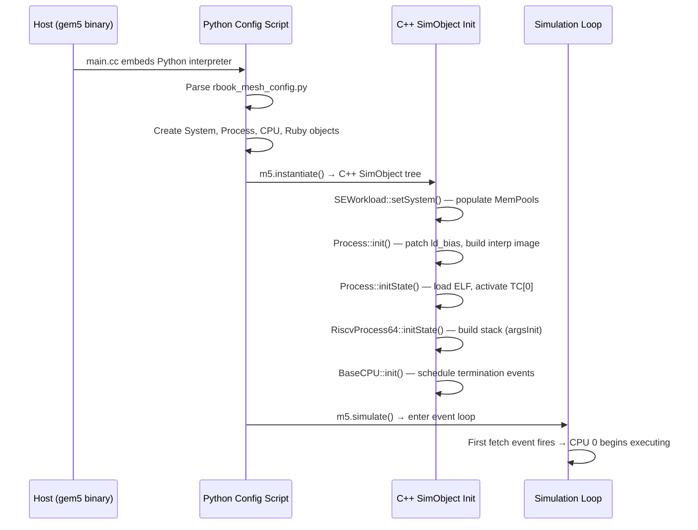
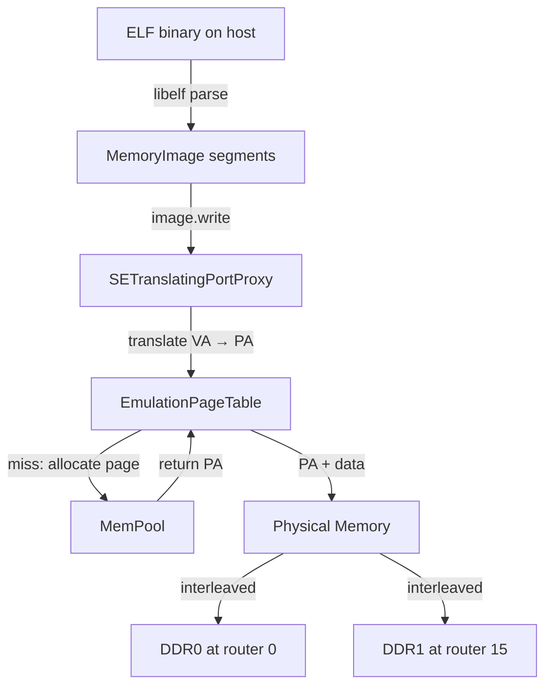
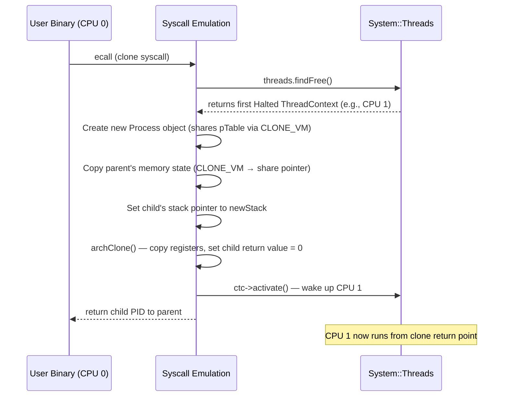

# gem5 Syscall Emulation (SE) Mode — Technical Reference

> Companion document for Chapter 17 of *Memory Architecture and NoC Modeling in gem5*.
> Covers everything needed to write and debug multi-threaded RISC-V test programs
> running on the 4x4 CHI mesh system in SE mode.

---

## Table of Contents

1. [What Is SE Mode?](#1-what-is-se-mode)
2. [SE Mode Startup Sequence](#2-se-mode-startup-sequence)
3. [Memory Allocation and Layout](#3-memory-allocation-and-layout)
4. [ELF Loading and DDR Interleaving](#4-elf-loading-and-ddr-interleaving)
5. [Static vs Dynamic Memory Allocation](#5-static-vs-dynamic-memory-allocation)
6. [Processes and Threads](#6-processes-and-threads)
7. [Thread-to-Core Mapping](#7-thread-to-core-mapping)
8. [Syscall Emulation Mechanism](#8-syscall-emulation-mechanism)
9. [Key Syscalls for Test Programs](#9-key-syscalls-for-test-programs)
10. [Atomic Operations and Memory Ordering](#10-atomic-operations-and-memory-ordering)
11. [Reading Cycle Counters and Hart ID](#11-reading-cycle-counters-and-hart-id)
12. [Console Output (printf)](#12-console-output-printf)
13. [m5 Pseudo-Operations](#13-m5-pseudo-operations)
14. [The 4x4 Mesh Configuration in Detail](#14-the-4x4-mesh-configuration-in-detail)
15. [Practical Considerations for Test Programs](#15-practical-considerations-for-test-programs)

---

## 1. What Is SE Mode?

Syscall Emulation (SE) mode runs a user-space binary on the simulated CPU
without booting an operating system.
When the binary issues a system call (RISC-V `ecall`), gem5 intercepts it and
emulates the call on the host — there is no kernel in the simulation loop.

### SE vs FS mode at a glance

```
+----------------------------------------------------------+
|                     SE Mode                              |
|  +---------------------------------------------------+  |
|  | User binary (ELF) runs on simulated CPU            |  |
|  | ecall → gem5 host-side emulation (zero sim-time)   |  |
|  | No kernel, no bootloader, no device drivers        |  |
|  +---------------------------------------------------+  |
|  Host: translates syscalls, manages page tables          |
+----------------------------------------------------------+

+----------------------------------------------------------+
|                     FS Mode                              |
|  +---------------------------------------------------+  |
|  | Full OS kernel + user binaries                     |  |
|  | ecall → kernel trap handler in simulated CPU       |  |
|  | Real page tables, interrupts, privilege levels     |  |
|  +---------------------------------------------------+  |
|  Host: provides device models, no syscall emulation      |
+----------------------------------------------------------+
```

### Benefits

- **Fast bring-up**: no kernel image, no disk image, no boot sequence.
  A statically-linked ELF binary is all you need.
- **Deterministic**: no OS jitter, no timer interrupts, no scheduler preemption.
  The same binary produces the same trace every time.
- **Simple debugging**: `printf` works out of the box (write syscall goes to
  host stdout). No serial console plumbing.
- **Minimal memory footprint**: no kernel text/data, no page cache, no
  device MMIO regions.

### Limitations

- **No kernel services**: anything beyond basic POSIX syscalls is unavailable.
  No signals (partially stubbed), no real `sched_setaffinity`, no `/proc`
  filesystem (partially faked).
- **Flat privilege model**: the CPU runs in user mode
  ([src/arch/riscv/process.cc:105](src/arch/riscv/process.cc#L105) sets
  `PRV_U`), but there is no true privilege separation.
  Supervisor and machine mode traps are not exercised.
- **Syscall timing is zero**: every `ecall` completes in the same simulation
  tick — there is no OS scheduling overhead, context switch cost, or TLB
  flush.
  This can make multi-threaded programs appear faster than they would on
  real hardware.
- **Incomplete syscall coverage**: some syscalls are stubbed
  (`ignoreFunc`), some return `-ENOSYS`, and a few (`unimplementedFunc`)
  cause a fatal error.
  The RISC-V 64-bit table is at
  [src/arch/riscv/linux/se_workload.cc:600](src/arch/riscv/linux/se_workload.cc#L600).
- **No virtual memory hardware**: page translation is handled by a software
  `EmulationPageTable`, not by a simulated TLB/MMU.
  TLB miss costs are not modeled.

---

## 2. SE Mode Startup Sequence

The boot path from `gem5.opt` command line to the first simulated instruction
involves Python configuration, C++ instantiation, and process initialization.



### Step-by-step walkthrough

**1. Entry point**
[src/sim/main.cc:48](src/sim/main.cc#L48) initializes the embedded Python
interpreter and invokes `m5.main()`.

**2. Python configuration**
The config script ([configs/example/rbook_mesh_config.py](configs/example/rbook_mesh_config.py))
creates the SimObject tree in Python:
- 16 `TimingSimpleCPU` objects
  ([rbook_mesh_config.py:66](configs/example/rbook_mesh_config.py#L66))
- One `Process` object shared across all CPUs
  ([rbook_mesh_config.py:80](configs/example/rbook_mesh_config.py#L80))
- `SEWorkload.init_compatible(binary_path)` selects the correct
  RISC-V SE workload class
  ([rbook_mesh_config.py:91](configs/example/rbook_mesh_config.py#L91))
- `Ruby.create_system()` builds the CHI cache hierarchy and Garnet mesh
  ([rbook_mesh_config.py:95](configs/example/rbook_mesh_config.py#L95))

**3. C++ instantiation** (`m5.instantiate()`)
Each Python SimObject gets a corresponding C++ object.
Key constructors:

| Object | Constructor | What it does |
|--------|------------|--------------|
| `System` | [src/sim/system.cc:55](src/sim/system.cc#L55) | Creates thread list, physical memory |
| `SEWorkload` | [src/sim/se_workload.cc:38](src/sim/se_workload.cc#L38) | Holds MemPools for physical page allocation |
| `Process` | [src/sim/process.cc:113](src/sim/process.cc#L113) | Loads ELF, creates page table, opens stdin/stdout/stderr |
| `BaseCPU` | [src/cpu/base.cc:129](src/cpu/base.cc#L129) | Registers ThreadContexts with System |

**4. SEWorkload::setSystem()**
([src/sim/se_workload.cc:42](src/sim/se_workload.cc#L42))
Populates physical memory pools from the system's configured address ranges.
With 512 MiB at `[0, 0x20000000)`, the pool has ~131072 pages (4 KiB each).

**5. Process::init()**
([src/sim/process.cc:279](src/sim/process.cc#L279))
Patches the load bias for position-independent executables and builds the
interpreter image if the binary is dynamically linked.

**6. Process::initState()**
([src/sim/process.cc:289](src/sim/process.cc#L289))
This is where the binary actually enters simulated memory:
- Gets the first `ThreadContext` associated with this process
- Calls `tc->activate()` to mark CPU 0 as runnable
- Creates an `SETranslatingPortProxy` for writing to virtual memory
- Writes the ELF image into simulated memory via `image.write(*initVirtMem)`

**7. RiscvProcess64::initState()**
([src/arch/riscv/process.cc:98](src/arch/riscv/process.cc#L98))
Architecture-specific initialization:
- Calls `argsInit<uint64_t>()` to build the initial stack
  (argc, argv, envp, auxiliary vector)
- Sets all thread contexts to user privilege mode (`PRV_U`)
- Validates ISA requirements (RV64, S+U modes present)

**8. Simulation starts**
`m5.simulate()` enters the C++ event loop
([src/sim/simulate.cc:95](src/sim/simulate.cc#L95)).
The first scheduled event is a fetch on CPU 0.
All other CPUs start in the `Halted` state — they only become active when
the running program creates threads (via `clone`).

### Which CPUs are active at startup?

Only **CPU 0** is active after `initState()`.
Despite 16 CPUs existing in the system, only the first ThreadContext in
`contextIds[0]` is activated
([src/sim/process.cc:298](src/sim/process.cc#L298)).
The remaining 15 CPUs sit in `Halted` state, consuming zero simulation
cycles.
They wake up only when the program calls `pthread_create()` (which
triggers the `clone` syscall).

---

## 3. Memory Allocation and Layout

### Virtual address space (RISC-V 64-bit)

The RISC-V 64-bit process address space is set up in
[src/arch/riscv/process.cc:71-82](src/arch/riscv/process.cc#L71):

```
Virtual Address Space (RISC-V 64)
═══════════════════════════════════════════════════════════

0x7FFFFFFFFFFFFFFF  ┌───────────────────────┐  ← stack_base
                    │        Stack           │  grows ↓
                    │  (max 8 MiB default)   │
0x7FFFFFFFFFE00000  ├───────────────────────┤  ← stack_base - max_stack_size
                    │                       │    = next_thread_stack_base
                    │    (unmapped gap)      │
                    │                       │
                    ·                       ·
                    ·                       ·
                    ·                       ·
0x4000000000000000  ├───────────────────────┤  ← mmap_end (grows ↑)
                    │    mmap region        │  pthread stacks, shared libs
                    │    (grows upward)     │
                    ├───────────────────────┤
                    │                       │
                    ·    (unmapped gap)     ·
                    ·                       ·
                    ├───────────────────────┤  ← brk_point (grows ↑)
                    │    Heap (brk)         │  malloc/new
                    ├───────────────────────┤  ← roundUp(image.maxAddr(), 4096)
                    │    .bss               │  uninitialized data (zero-filled)
                    │    .data              │  initialized global/static data
                    │    .rodata            │  read-only data, string literals
                    │    .text              │  executable code
0x0000000000010000  └───────────────────────┘  ← typical ELF load address
```

Key addresses from the constructor:
- **Stack base**: `0x7FFFFFFFFFFFFFFF`
- **Max stack size**: configurable, default from `getrlimit` (typically 8 MiB)
- **Brk point**: `roundUp(image.maxAddr(), PageBytes)` — first page after ELF
- **mmap end**: `0x4000000000000000` — mmap grows **upward** on RISC-V
  ([src/arch/riscv/process.hh:59](src/arch/riscv/process.hh#L59):
  `mmapGrowsDown()` returns `false`)

### Physical memory backing

SE mode does **not** simulate hardware page tables or a TLB.
Instead, it uses a software `EmulationPageTable`
([src/mem/page_table.hh:53](src/mem/page_table.hh#L53)) — a simple
`unordered_map<Addr, Entry>` that maps virtual page numbers to physical
page numbers.

```
 Virtual Address ──→ EmulationPageTable ──→ Physical Address
 (process-local)     (software hashmap)      (system-wide)

 Page size: 4096 bytes (12-bit offset)
 Translation: vaddr[63:12] → lookup → paddr[63:12], keep vaddr[11:0]
```

Physical pages are allocated from `MemPools`
([src/sim/mem_pool.cc:96](src/sim/mem_pool.cc#L96)),
which maintains a free list over the physical address ranges declared in
the system configuration.
With a single 512 MiB range `[0, 0x20000000)`, the pool starts with
131072 free 4 KiB pages.

The allocation call chain:
1. `MemState::mapRegion()` or `MemState::fixupFault()`
2. → `Process::allocateMem()`
   ([src/sim/process.cc:318](src/sim/process.cc#L318))
3. → `SEWorkload::allocPhysPages()`
   ([src/sim/se_workload.cc:75](src/sim/se_workload.cc#L75))
4. → `MemPool::allocate()`
   ([src/sim/mem_pool.cc:96](src/sim/mem_pool.cc#L96))

Physical pages are allocated **sequentially from the free list** — there
is no NUMA awareness or controller affinity in the allocator.
This is important for understanding DDR interleaving (see next section).

---

## 4. ELF Loading and DDR Interleaving

### How the ELF binary enters simulated memory

The ELF loader parses program headers in
[src/base/loader/elf_object.cc:109](src/base/loader/elf_object.cc#L109).
Only `PT_LOAD` segments are processed — these become `Segment` objects
in a `MemoryImage`.

During `Process::initState()`:
1. `image.write(*initVirtMem)` iterates over all segments
2. For each segment, `SETranslatingPortProxy` translates virtual to physical
3. If no physical page exists, the proxy allocates one (mode = `Always`)
4. The segment data is written through the memory system into physical memory



### Address interleaving with 2 DDR controllers

The 4x4 mesh has two levels of address interleaving:

**Level 1: HNF (LLC slice) selection — 4 bits**
Configured in [configs/ruby/CHI_config.py:636](configs/ruby/CHI_config.py#L636):

```python
block_size_bits = int(math.log(cache_line_size, 2))   # log2(64) = 6
llc_bits = int(math.log(len(hnfs), 2))                 # log2(16) = 4
numa_bit = block_size_bits + llc_bits - 1               # 6 + 4 - 1 = 9
```

Address bits `[9:6]` select which of the 16 HN-F nodes owns the cache line.

**Level 2: DDR controller selection — 1 bit**
Configured in [configs/ruby/Ruby.py:134](configs/ruby/Ruby.py#L134) and
[configs/common/MemConfig.py:44](configs/common/MemConfig.py#L44):

```python
intlv_size = options.cacheline_size   # 64 bytes (no numa_high_bit set)
intlv_low_bit = int(math.log(64, 2)) # = 6
intlv_bits = int(math.log(2, 2))     # = 1 (for 2 controllers)
# AddrRange: intlvHighBit = 6 + 1 - 1 = 6, intlvBits = 1
```

Bit 6 selects which DDR controller services a cache line.

### Interleaving bit map

```
Address bits for a 64-byte cache line:

 63                    10  9  8  7  6  5       0
┌─────────────────────┬──┬──┬──┬──┬──┬─────────┐
│    Higher bits       │H3│H2│H1│H0│  │ Offset  │
│    (tag + index)     │  │  │  │/D│  │ (6 bits)│
└─────────────────────┴──┴──┴──┴──┴──┴─────────┘
                        │  │  │  │
                        └──┴──┴──┘
                        HNF select (4 bits, [9:6])
                              │
                              └─ bit 6 also selects DDR controller
                                 0 → DDR0 (router 0)
                                 1 → DDR1 (router 15)

 H[3:0] = 0000 → HNF 0   (DDR0)    H[3:0] = 1000 → HNF 8  (DDR0)
 H[3:0] = 0001 → HNF 1   (DDR1)    H[3:0] = 1001 → HNF 9  (DDR1)
 H[3:0] = 0010 → HNF 2   (DDR0)    H[3:0] = 1010 → HNF 10 (DDR0)
 H[3:0] = 0011 → HNF 3   (DDR1)    H[3:0] = 1011 → HNF 11 (DDR1)
 H[3:0] = 0100 → HNF 4   (DDR0)    H[3:0] = 1100 → HNF 12 (DDR0)
 H[3:0] = 0101 → HNF 5   (DDR1)    H[3:0] = 1101 → HNF 13 (DDR1)
 H[3:0] = 0110 → HNF 6   (DDR0)    H[3:0] = 1110 → HNF 14 (DDR0)
 H[3:0] = 0111 → HNF 7   (DDR1)    H[3:0] = 1111 → HNF 15 (DDR1)
```

Even-numbered HNFs are served by DDR0, odd-numbered by DDR1.
Consecutive 64-byte cache lines alternate between controllers:
- Cache line at byte offset 0 → bit 6 = 0 → DDR0
- Cache line at byte offset 64 → bit 6 = 1 → DDR1
- Cache line at byte offset 128 → bit 6 = 0 → DDR0

### How the ELF program is distributed across DDR controllers

The ELF binary is written into contiguous virtual pages, and physical pages
are allocated sequentially from the free list.
The physical addresses are interleaved by cache line:

1. The `.text` segment starts at some virtual address (e.g., `0x10000`).
2. Physical pages are allocated starting from physical address `0x0`.
3. Within each 4 KiB page, the 64 cache lines alternate between DDR0 and DDR1.
4. The program's code and data are therefore **automatically spread evenly**
   across both DDR controllers — no special logic needed.

The interleaving happens at the granularity of individual cache lines (64B),
not pages.
A single 4 KiB page contains 64 cache lines, of which 32 go to DDR0 and
32 go to DDR1.

---

## 5. Static vs Dynamic Memory Allocation

SE mode uses three distinct mechanisms for allocating memory, each with
different timing relative to simulation start.

### Static allocation (ELF load time)

Happens **before the first instruction executes**, during `Process::initState()`.

| Region | Source | When allocated |
|--------|--------|----------------|
| `.text` | ELF PT_LOAD segment | `image.write()` in `initState()` |
| `.data` | ELF PT_LOAD segment | `image.write()` in `initState()` |
| `.rodata` | ELF PT_LOAD segment | `image.write()` in `initState()` |
| `.bss` | ELF PT_LOAD segment (zero-filled) | `image.write()` in `initState()` |
| Initial stack | `argsInit()` | During `initState()` |

All static regions get physical pages immediately through
`SETranslatingPortProxy` with `AllocateMode::Always`.

### Heap (brk) — dynamic, grows upward

The heap starts at `brk_point = roundUp(image.maxAddr(), PageBytes)` —
the first page boundary after the ELF image.

When the program calls `malloc()` (which calls `brk()`):
1. glibc invokes the `brk` syscall with the new break address
2. `brkFunc()` ([src/sim/syscall_emul.cc:277](src/sim/syscall_emul.cc#L277))
   calls `MemState::updateBrkRegion()`
3. `updateBrkRegion()` ([src/sim/mem_state.cc:107](src/sim/mem_state.cc#L107))
   creates a new VMA and maps pages
4. Physical pages are allocated on demand via `Process::allocateMem()`

Brk can also shrink (when `free()` returns memory):
pages are unmapped when the new brk rounds to a lower page
([src/sim/mem_state.cc:130](src/sim/mem_state.cc#L130)).

### Stack — dynamic, grows downward

The initial stack is allocated during `argsInit()` with enough space for
argc/argv/envp/auxv.
If the program accesses addresses below the current stack minimum, a page
fault triggers `MemState::fixupFault()`
([src/sim/mem_state.cc:386](src/sim/mem_state.cc#L386)):

```
fixupFault(vaddr):
  1. Check VMA list — if vaddr is in a known VMA, allocate the page
  2. Check if vaddr is in [stackMin, stackBase) — allocate the page
  3. Check if vaddr is in [stackBase - maxStackSize, stackMin) — grow stack
  4. If none match → segfault
```

Stack growth is capped at `maxStackSize` (default 8 MiB from
`ProcessParams`).
Each growth step allocates one 4 KiB page and decrements `_stackMin`.

### mmap region — dynamic, grows upward (on RISC-V)

The mmap region starts at `0x4000000000000000` and grows upward
(RISC-V overrides `mmapGrowsDown()` to return `false`).

`mmap()` is used by:
- `pthread_create()` for thread stacks (via glibc)
- Dynamic library loading
- Explicit `mmap()` calls in user code

The `mmapFunc()` implementation
([src/sim/syscall_emul.hh:2116](src/sim/syscall_emul.hh#L2116)):
1. Rounds length to page size
2. For non-`MAP_FIXED`: calls `MemState::extendMmap()`
   ([src/sim/mem_state.cc:452](src/sim/mem_state.cc#L452)) to find free VA space
3. Creates a VMA (Virtual Memory Area) in the process's VMA list
4. Physical pages are allocated lazily on first access (`fixupFault`)

### Lazy vs eager allocation

| Region | VMA created | Physical pages allocated |
|--------|-------------|--------------------------|
| ELF segments | At load time | **Eagerly** — before simulation starts |
| Stack (initial) | At `argsInit()` | **Eagerly** — before simulation starts |
| Stack (growth) | No explicit VMA | **On fault** — during simulation |
| Heap (brk) | At `brk()` call | At VMA creation time (eager via `mapRegion`) |
| mmap | At `mmap()` call | **Lazily on first access** via `fixupFault` |

> **Implication for test programs**: Heap allocations (brk) get pages
> immediately, but mmap-based allocations (including pthread stacks) get
> pages on first touch.
> The first access to an mmap'd page triggers a page fault
> that calls `allocateMem()` — this is functional (zero sim-time) but
> worth knowing when interpreting memory traces.

---

## 6. Processes and Threads

### The shared-Process pattern

The rbook mesh config uses a single `Process` object shared across all 16 CPUs:

```python
process = Process(pid=100, executable=binary_path, ...)
for cpu in system.cpu:
    cpu.workload = process    # same Process object for all
    cpu.createThreads()
```

This means:
- All 16 CPUs have a ThreadContext pointing to the same Process
- They share the same page table and file descriptors
- Only CPU 0's ThreadContext is activated at startup
- CPUs 1-15 sit in `Halted` state, waiting for threads to be created

> **Key distinction**: sharing a Process object in the config is not
> the same as running 16 independent copies of the program.
> It means 16 CPUs *can* run threads of the same process.
> Only CPU 0 actually runs at startup — the others are inert until `clone()`
> gives them work.

### Can multiple independent processes run in parallel?

Yes, but it requires a different config pattern — one `Process` per CPU:

```python
p0 = Process(pid=100, cmd=["prog_a"])
p1 = Process(pid=101, cmd=["prog_b"])
system.cpu[0].workload = p0
system.cpu[1].workload = p1
```

Each process gets its own page table, file descriptors, and address space.
They do not share memory.
This pattern is uncommon for the Ch17 tests — all test programs use
the shared-Process pattern with pthreads.

### Thread creation: how `pthread_create` works

When the binary calls `pthread_create()`, glibc issues a `clone` syscall
with flags including `CLONE_VM | CLONE_THREAD | CLONE_SIGHAND | CLONE_FS`.

The `doClone()` function
([src/sim/syscall_emul.hh:1835](src/sim/syscall_emul.hh#L1835))
handles this:



Key steps in `doClone()`:

1. **Find a free core** (line 1852): `threads.findFree()` scans all
   ThreadContexts for one in `Halted` state
2. **Create child Process** (line 1864-1891): new `ProcessParams`, new PID
3. **Assign ThreadContext** (line 1896-1898): the free TC gets the child Process
4. **Share memory** (via `CLONE_VM` flag): the child's page table pointer is
   set to the parent's — they share the same address space
   ([src/sim/process.cc:183-192](src/sim/process.cc#L183))
5. **Architecture-specific setup** (line 1970): `archClone()` copies registers,
   sets the child's stack pointer and return value
6. **Activate** (line 1974): `ctc->activate()` transitions the CPU from
   `Halted` to `Active`, and the CPU begins fetching instructions

### Thread exit

When a thread calls `pthread_exit()` or returns from its start function:
1. glibc calls `exit` syscall (not `exit_group`)
2. `exitImpl()` ([src/sim/syscall_emul.cc:127](src/sim/syscall_emul.cc#L127)):
   - Wakes any thread waiting on `childClearTID` futex
   - Checks if this is the last thread in the group
   - Halts the ThreadContext
3. The CPU returns to `Halted` state

When `main()` returns or calls `exit(0)`:
- glibc calls `exit_group` syscall
- `exitGroupFunc()` halts **all** threads in the thread group
- This ends the simulation

---

## 7. Thread-to-Core Mapping

### How gem5 selects a core for a new thread

Thread-to-core assignment is **automatic and deterministic**: `clone()`
calls `threads.findFree()` which returns the **first** ThreadContext in
`Halted` state, scanning from index 0 upward.

In the 4x4 mesh with 16 CPUs:
- CPU 0 runs the main thread (activated during `initState()`)
- First `pthread_create()` → CPU 1 (first halted TC)
- Second `pthread_create()` → CPU 2
- Third `pthread_create()` → CPU 3
- ...and so on

If all 16 ThreadContexts are active and another `clone()` is attempted,
it returns `-EAGAIN`
([src/sim/syscall_emul.hh:1852](src/sim/syscall_emul.hh#L1852)).

### Can the user control thread affinity?

**No, not meaningfully.**
The `sched_setaffinity` syscall is mapped to `unimplementedFunc` in the
RISC-V syscall table — calling it causes a **fatal error**.
The `sched_getaffinity` syscall is implemented but returns all CPUs
as available — it does not restrict placement.

Thread pinning must be achieved **implicitly** by controlling the order of
`pthread_create()` calls:
- The first thread created always goes to CPU 1
- The second to CPU 2, etc.
- If you need thread N on CPU K, create threads in the right order
  (or use the hart ID to branch to core-specific code paths)

### How a running thread can determine its core

Three methods:

**1. RISC-V `mhartid` CSR (recommended)**
Reading the `mhartid` CSR returns `tc->contextId()`
([src/arch/riscv/isa.cc:505](src/arch/riscv/isa.cc#L505)):

```c
unsigned get_hart_id(void) {
    unsigned hart;
    __asm__ volatile("csrr %0, mhartid" : "=r"(hart));
    return hart;
}
```

In SE mode, `contextId` equals the CPU index (0-15).

> **Caveat**: `mhartid` is a machine-mode CSR. On real hardware, reading it
> from user mode would trap.
> In gem5 SE mode, the read succeeds because there is no privilege checking
> on CSR reads for `MISCREG_HARTID` — the ISA implementation returns
> `contextId()` unconditionally.

**2. `getcpu` syscall**
([src/sim/syscall_emul.cc:1442](src/sim/syscall_emul.cc#L1442))
Returns the `contextId` as the CPU number:

```c
#include <sched.h>
int cpu = sched_getcpu();  // returns contextId (0-15)
```

**3. Context ID from thread creation order**
Since `findFree()` is deterministic, you know that the Nth created thread
runs on CPU N (assuming no threads have exited and been replaced).

### Mapping between contextId, cpuId, and router index

In the rbook config, these are all identical:

| contextId | cpuId | Router index | Mesh position (row, col) |
|-----------|-------|--------------|--------------------------|
| 0 | 0 | 0 | (0,0) — top-left |
| 1 | 1 | 1 | (0,1) |
| 2 | 2 | 2 | (0,2) |
| 3 | 3 | 3 | (0,3) — top-right |
| 4 | 4 | 4 | (1,0) |
| ... | ... | ... | ... |
| 12 | 12 | 12 | (3,0) — bottom-left |
| 15 | 15 | 15 | (3,3) — bottom-right |

This 1:1 mapping is established by
[configs/example/noc_config/rbook_4x4.py](configs/example/noc_config/rbook_4x4.py)
where `CHI_RNF.NoC_Params.router_list = list(range(16))`.

---

## 8. Syscall Emulation Mechanism

### How an `ecall` is handled

```
 CPU executes ecall instruction
        │
        ▼
 Decoder returns SyscallFault
 [src/arch/riscv/isa/decoder.isa:6149]
        │
        ▼
 SyscallFault::invokeSE(tc, inst)
 [src/arch/riscv/faults.cc:326]
   1. Advance PC past the ecall
   2. Call tc->getSystemPtr()->workload->syscall(tc)
        │
        ▼
 SEWorkload::syscall(tc)
 [src/sim/se_workload.cc:69]
   → tc->getProcessPtr()->syscall(tc)
        │
        ▼
 RiscvISA::EmuLinux::syscall(tc)
 [src/arch/riscv/linux/se_workload.cc:94]
   1. Read syscall number from register a7
   2. Look up in syscallDescs64 table
   3. Call desc->doSyscall(tc)
        │
        ▼
 SyscallDescABI::doSyscall(tc)
 [src/sim/syscall_desc.hh:120]
   1. Extract arguments from a0-a5 via GuestABI
   2. Call the handler function (e.g., brkFunc, cloneFunc)
   3. Write return value to a0
        │
        ▼
 CPU resumes at PC+4 (instruction after ecall)
```

### Timing impact: zero-cost syscalls

Syscall emulation is **instantaneous** — no simulation ticks are consumed.
The handler runs as host C++ code within the current event processing.
This means:
- `malloc()` costs zero simulation cycles
- `pthread_create()` costs zero cycles (the new thread just appears)
- `write()` (printf) costs zero cycles
- `futex()` wake/wait costs zero cycles

This is a fundamental difference from real hardware where:
- A syscall trap takes tens of cycles
- `clone()` involves scheduler overhead
- `futex()` involves kernel scheduling
- `write()` involves buffer copies

For the Ch17 test programs, this means the measured latencies reflect
**only the memory system** — no OS overhead contaminates the results.

---

## 9. Key Syscalls for Test Programs

The RISC-V 64-bit syscall table is defined starting at
[src/arch/riscv/linux/se_workload.cc:600](src/arch/riscv/linux/se_workload.cc#L600).

### Syscalls used by the Ch17 tests

| Syscall | Number | Handler | Used by |
|---------|--------|---------|---------|
| `clone` | 220 | `cloneBackwardsFunc` | `pthread_create` |
| `clone3` | 435 | `clone3Func` | `pthread_create` (modern glibc) |
| `futex` | 98 | `futexFunc` | `pthread_join`, mutexes, barriers |
| `brk` | 214 | `brkFunc` | `malloc`, `free` |
| `mmap` | 222 | `mmapFunc` | `pthread_create` (stack allocation) |
| `munmap` | 215 | `munmapFunc` | `pthread_join` (stack cleanup) |
| `write` | 64 | `writeFunc` | `printf` |
| `exit` | 93 | `exitFunc` | thread exit |
| `exit_group` | 94 | `exitGroupFunc` | process exit (ends simulation) |
| `set_tid_address` | 96 | `setTidAddressFunc` | glibc thread setup |
| `gettid` | 178 | `gettidFunc` | thread identity |
| `getcpu` | 168 | `getcpuFunc` | core identification |

### futex — the synchronization backbone

All pthread synchronization (mutexes, condition variables, barriers,
`pthread_join`) ultimately uses `futex()`.
The implementation ([src/sim/syscall_emul.hh:383](src/sim/syscall_emul.hh#L383))
supports:

- **FUTEX_WAIT**: suspends the calling ThreadContext on a futex address.
  The TC enters `Suspended` state — the CPU stops fetching.
- **FUTEX_WAKE**: wakes up to N threads waiting on a futex address.
  Woken TCs transition from `Suspended` to `Active`.
- **FUTEX_CMP_REQUEUE**: atomically compares and requeues waiters
  to a second futex.
- **FUTEX_WAKE_OP**: combined wake + operation on a second futex word.

The futex map is a system-wide structure (`System::futexMap`) keyed by
the physical address of the futex word and the thread group ID.

> **Timing note**: `FUTEX_WAIT` causes the CPU to suspend immediately
> (zero-cost transition). `FUTEX_WAKE` causes the target CPU to resume
> immediately. There is no scheduling latency.

### exit and exit_group

([src/sim/syscall_emul.cc:127](src/sim/syscall_emul.cc#L127))

- `exitFunc` (syscall 93): halts the calling ThreadContext only.
  Other threads in the group continue running.
  If `childClearTID` is set, wakes one waiter on that futex
  (this is how `pthread_join` gets notified).
- `exitGroupFunc` (syscall 94): sets the `exitGroup` flag and halts
  **all** ThreadContexts in the thread group.
  This is what glibc calls when `main()` returns.

When the last active ThreadContext in the system halts, the simulation
exits with "all threads halted" as the exit cause.

---

## 10. Atomic Operations and Memory Ordering

### RISC-V atomics in SE mode

The Ch17 test programs use two classes of atomic operations:

**1. AMO (Atomic Memory Operations)**: `amoadd.w`, `amoswap.w`, etc.
- Used by the barrier test (`rbook_test_barrier.c`) for `amoadd.w`
- Implemented as macro-ops that expand into micro-ops
  ([src/arch/riscv/isa/formats/amo.isa:102](src/arch/riscv/isa/formats/amo.isa#L102))
- With `.aq` (acquire): a read barrier is inserted **after** the atomic op
- With `.rl` (release): a write barrier is inserted **before** the atomic op
- With `.aqrl`: both barriers bracket the operation

**2. LR/SC (Load-Reserved / Store-Conditional)**:
- Used by `__sync_*` builtins and some `__atomic_*` sequences
- `lr.w` sets a reservation on a cache line
- `sc.w` succeeds only if the reservation is still valid
- In Ruby/CHI, these translate to exclusive-ownership requests

### How atomics interact with CHI

When a CPU executes an AMO instruction:
1. The CPU issues an atomic request through its Ruby sequencer
2. The L1 cache controller sends a CHI request to the HN-F
3. The HN-F ensures exclusive ownership and performs the operation
4. The result is returned to the requesting CPU

The CHI protocol defines specific atomic request types
([src/mem/ruby/protocol/chi/CHI-msg.sm](src/mem/ruby/protocol/chi/CHI-msg.sm)):
`AtomicLoad`, `AtomicStore`, `AtomicReturn`, `AtomicNoReturn`.
The actual operation (add, xor, etc.) is carried in a `WriteMask` object
that contains `AtomicOpFunctor` pairs.

### Memory fences

RISC-V `fence` instructions are decoded with `IsReadBarrier | IsWriteBarrier`
flags ([src/arch/riscv/isa/decoder.isa:1338](src/arch/riscv/isa/decoder.isa#L1338)).

For the Ch17 test programs:
- `fence rw,w` (release fence before store) ensures prior reads/writes are
  visible before the store
- `fence r,rw` (acquire fence after load) ensures the load completes before
  subsequent reads/writes
- `__atomic_store_n(&flag, 1, __ATOMIC_RELEASE)` compiles to
  `fence rw,w` + `sw`
- `__atomic_load_n(&flag, __ATOMIC_ACQUIRE)` compiles to
  `lw` + `fence r,rw`

With `TimingSimpleCPU`, fences serialize the pipeline — the CPU stalls
until all outstanding memory operations complete.
This is conservative but correct.

---

## 11. Reading Cycle Counters and Hart ID

### rdcycle — CPU cycle counter

The `rdcycle` pseudo-instruction reads the `cycle` CSR.
In gem5, this returns the CPU's current cycle count
([src/arch/riscv/isa.cc:507](src/arch/riscv/isa.cc#L507)):

```c
case MISCREG_CYCLE:
    return static_cast<RegVal>(tc->getCpuPtr()->curCycle());
```

Usage in test programs:

```c
static inline uint64_t rdcycle(void) {
    uint64_t val;
    __asm__ volatile("rdcycle %0" : "=r"(val));
    return val;
}
```

This is the primary timing mechanism for the hop-latency and
producer-consumer tests.
Since `TimingSimpleCPU` advances the cycle counter with each instruction
and memory access, `rdcycle` reflects the actual simulated time including
cache miss latencies and network traversal delays.

### rdinstret — instruction counter

```c
case MISCREG_INSTRET:
    return static_cast<RegVal>(tc->getCpuPtr()->totalInsts());
```

Returns the total number of committed instructions.
Useful for computing IPC (instructions per cycle).

### mhartid — hardware thread ID

```c
case MISCREG_HARTID:
    return tc->contextId();
```

Returns the ThreadContext ID, which in the rbook config equals the CPU
index (0-15) and the mesh router index.

Usage:

```c
static inline unsigned get_hart_id(void) {
    unsigned hart;
    __asm__ volatile("csrr %0, mhartid" : "=r"(hart));
    return hart;
}
```

### Relationship between cycle counter and simulation ticks

`curCycle()` returns the CPU cycle number, not the simulation tick.
With a 2 GHz CPU clock (as configured in rbook_mesh_config.py),
one cycle = 500 ps = 500 ticks (gem5's default tick resolution is 1 ps).

The Ruby/Garnet subsystem has its own clock domain
(default 1 GHz, configurable via `--ruby-clock`).
A Garnet router pipeline stage takes 1 Ruby cycle = 1 ns = 2 CPU cycles.

---

## 12. Console Output (printf)

### How printf reaches your terminal

When the program calls `printf("PASS\n")`:
1. glibc formats the string and calls `write(1, "PASS\n", 5)`
2. The `write` syscall is emulated by `writeFunc()`
   ([src/sim/syscall_emul.hh:2950](src/sim/syscall_emul.hh#L2950))
3. The handler:
   a. Translates the guest buffer to host memory via `SETranslatingPortProxy`
   b. Calls host `write(sim_fd, buf, nbytes)` where `sim_fd` is the host fd
      for stdout
   c. Calls `fsync()` to ensure immediate output
4. The text appears on the terminal running gem5

File descriptor 1 (stdout) is mapped to the host's stdout by default.
This can be redirected with `Process(output="filename")` in the config.

### Output timing

Since `write()` is a zero-cost syscall, all printf output appears
at the simulation tick when it was called — there is no buffering delay
in simulation time.
However, glibc may buffer output internally (line-buffered for ttys,
fully-buffered for files).
To ensure output appears immediately in test programs, either:
- End output with `\n` (triggers line-buffer flush)
- Call `fflush(stdout)` explicitly
- Use `fprintf(stderr, ...)` (stderr is unbuffered)

---

## 13. m5 Pseudo-Operations

gem5 provides special "pseudo-ops" that a guest program can invoke to
control the simulator from inside the simulation.
These are useful for:
- Dumping/resetting statistics at specific points in the test
- Exiting the simulation programmatically
- Creating checkpoints

### Available pseudo-ops

Declared in [include/gem5/m5ops.h](include/gem5/m5ops.h):

| Function | Effect |
|----------|--------|
| `m5_exit(ns_delay)` | Exit simulation after `ns_delay` nanoseconds |
| `m5_dump_stats(ns_delay, ns_period)` | Dump statistics snapshot |
| `m5_reset_stats(ns_delay, ns_period)` | Reset all statistics counters |
| `m5_dump_reset_stats(ns_delay, ns_period)` | Dump then reset |
| `m5_checkpoint(ns_delay, ns_period)` | Create simulation checkpoint |
| `m5_work_begin(workid, threadid)` | Mark beginning of region of interest |
| `m5_work_end(workid, threadid)` | Mark end of region of interest |

### Using m5ops in RISC-V SE mode

The RISC-V m5op encoding uses custom instructions.
The assembly implementation is in
[util/m5/src/abi/riscv/m5op.S](util/m5/src/abi/riscv/m5op.S).

To use m5ops in test programs, you need to:
1. Build the m5 utility library: `scons -C util/m5 build/riscv/out/libm5.a`
2. Include `<gem5/m5ops.h>` in your C code
3. Link against `libm5.a`
4. Cross-compile with the m5 include path

Example usage in a test program:

```c
#include <gem5/m5ops.h>

int main() {
    // ... setup code ...
    m5_reset_stats(0, 0);    // reset stats before measurement
    // ... measured workload ...
    m5_dump_stats(0, 0);     // dump stats after measurement
    m5_exit(0);              // exit simulation
}
```

### Alternative: using `rdcycle` instead of m5ops

For the Ch17 tests, `rdcycle` is simpler and avoids the m5 library
dependency.
The test programs use `rdcycle` for timing measurements and `exit()`
for termination.
m5ops are optional but useful if you want to isolate statistics to
specific code regions without including setup/teardown overhead.

---

## 14. The 4x4 Mesh Configuration in Detail

### System assembly overview

The rbook mesh config
([configs/example/rbook_mesh_config.py](configs/example/rbook_mesh_config.py))
creates the system in four phases:

**Phase 1: Shell** (lines 65-75)
```
System(cpu=[16 × TimingSimpleCPU], mem_mode="timing",
       mem_ranges=[512MiB], cache_line_size=64)
```

**Phase 2: SE Workload** (lines 77-91)
One shared `Process`, assigned to all 16 CPUs.

**Phase 3: Ruby/CHI/Garnet** (lines 95-104)
`Ruby.create_system()` delegates to `CHI.create_system()` which creates:
- 16 RNF nodes (each with L1I + L1D + L2)
- 16 HNF nodes (each with one LLC/SLC slice)
- 2 SNF nodes (DDR controllers)
- 1 MN node (DVM, inactive in SE mode)

Then `setup_memory_controllers()` creates `MemCtrl + DRAMInterface` for
each SNF and configures cache-line interleaving.

**Phase 4: Instantiate and run** (lines 108-112)

### Node placement on the mesh

```
  Col 0      Col 1      Col 2      Col 3
  ┌──────┐   ┌──────┐   ┌──────┐   ┌──────┐
  │R0    │───│R1    │───│R2    │───│R3    │  Row 0
  │RNF 0 │   │RNF 1 │   │RNF 2 │   │RNF 3 │
  │HNF 0 │   │HNF 1 │   │HNF 2 │   │HNF 3 │
  │SNF 0 │   │      │   │      │   │      │
  │(DDR0)│   │      │   │      │   │      │
  │MN 0  │   │      │   │      │   │      │
  └──┬───┘   └──┬───┘   └──┬───┘   └──┬───┘
     │          │          │          │
  ┌──┴───┐   ┌──┴───┐   ┌──┴───┐   ┌──┴───┐
  │R4    │───│R5    │───│R6    │───│R7    │  Row 1
  │RNF 4 │   │RNF 5 │   │RNF 6 │   │RNF 7 │
  │HNF 4 │   │HNF 5 │   │HNF 6 │   │HNF 7 │
  └──┬───┘   └──┬───┘   └──┬───┘   └──┬───┘
     │          │          │          │
  ┌──┴───┐   ┌──┴───┐   ┌──┴───┐   ┌──┴───┐
  │R8    │───│R9    │───│R10   │───│R11   │  Row 2
  │RNF 8 │   │RNF 9 │   │RNF 10│   │RNF 11│
  │HNF 8 │   │HNF 9 │   │HNF 10│   │HNF 11│
  └──┬───┘   └──┬───┘   └──┬───┘   └──┬───┘
     │          │          │          │
  ┌──┴───┐   ┌──┴───┐   ┌──┴───┐   ┌──┴───┐
  │R12   │───│R13   │───│R14   │───│R15   │  Row 3
  │RNF 12│   │RNF 13│   │RNF 14│   │RNF 15│
  │HNF 12│   │HNF 13│   │HNF 14│   │HNF 15│
  │      │   │      │   │      │   │SNF 1 │
  │      │   │      │   │      │   │(DDR1)│
  └──────┘   └──────┘   └──────┘   └──────┘
```

### Hop distances

With XY routing, the hop count between routers (r, c) and (r', c') is
`|r - r'| + |c - c'|`.

| From \ To | Router 0 | Router 15 | DDR0 | DDR1 |
|-----------|----------|-----------|------|------|
| Router 0 (0,0) | 0 | 6 | 0 | 6 |
| Router 3 (0,3) | 3 | 3 | 3 | 3 |
| Router 5 (1,1) | 2 | 4 | 2 | 4 |
| Router 15 (3,3) | 6 | 0 | 6 | 0 |

A coherence round-trip (e.g., load miss) involves:
1. Request: CPU → local RNF → HNF (home node for the address)
2. If HNF misses LLC: HNF → SNF (DDR controller) → HNF → RNF → CPU
3. If another RNF has the line: HNF → snoop to owner RNF → data forward → CPU

Each hop adds `router_latency + link_latency` cycles (in the Ruby clock domain).

### HNF-to-DDR mapping

Since bit 6 selects the DDR controller and bits [9:6] select the HNF:

- **Even HNFs (0, 2, 4, 6, 8, 10, 12, 14)** → DDR0 at router 0
- **Odd HNFs (1, 3, 5, 7, 9, 11, 13, 15)** → DDR1 at router 15

When HNF 14 (at router 14, position (3,2)) has an LLC miss for an address
served by DDR0 (at router 0, position (0,0)):
- Request travels 3+2 = 5 hops from router 14 to router 0
- Response travels 5 hops back
- Total: 10 router hops for the memory round-trip

When HNF 15 (at router 15, position (3,3)) misses to DDR1 (also at router 15):
- The request is local — 0 mesh hops
- This is the best case for DDR access latency

---

## 15. Practical Considerations for Test Programs

### Compilation

All test programs are cross-compiled with:

```bash
riscv64-linux-gnu-gcc -O2 -static -o rbook_test_foo rbook_test_foo.c -lpthread
```

**`-static` is mandatory**: SE mode does not support dynamic linking with
shared libraries (no `ld-linux.so`, no `LD_LIBRARY_PATH`).
Static linking embeds glibc into the binary.

**`-lpthread`** is needed for multi-threaded tests.
With static linking, glibc's pthread implementation is linked in,
which uses `clone`, `futex`, and `mmap` syscalls.

**`-O2`** is recommended: it avoids redundant memory accesses that would
obscure the coherence traffic patterns you're trying to measure.
`-O0` generates far more loads/stores, making it harder to attribute
cache misses to specific test behavior.

### Choosing addresses for HNF targeting

To target a specific HNF, you need an address whose bits [9:6] match the
HNF index.
The formula:

```c
// Address whose cache line is homed at HNF 'hnf_idx'
// (assuming the array base is page-aligned, i.e., bits [11:0] = 0)
volatile char *addr = base + (hnf_idx << 6);
```

For the hop-latency test, to access a line at HNF 0 vs HNF 15:
- HNF 0: any address where `(addr >> 6) & 0xF == 0`, e.g., `base + 0`
- HNF 15: any address where `(addr >> 6) & 0xF == 15`, e.g., `base + (15 << 6)`

> **Caution**: this works cleanly only if `base` is aligned to at least
> 1024 bytes (2^10), so that the base address does not contribute bits
> to the HNF selection field.
> Using `aligned_alloc(1024, size)` or a page-aligned allocation ensures this.

### Thread stack size

glibc's default `pthread_create` allocates an 8 MiB stack per thread via
`mmap`.
With 16 threads, that's 128 MiB of virtual address space for stacks alone.
Since pages are allocated lazily (on first touch), the actual physical memory
consumed depends on stack depth.
For the Ch17 tests, stack usage is minimal (a few KB per thread), so this
is not a concern.

If you need to reduce stack size (e.g., for simulation speed):

```c
pthread_attr_t attr;
pthread_attr_init(&attr);
pthread_attr_setstacksize(&attr, 64 * 1024);  // 64 KiB
pthread_create(&tid, &attr, func, arg);
```

### False sharing considerations

A cache line is 64 bytes.
Two variables that fall in the same 64-byte line will cause coherence
ping-pong if written by different cores.

```c
// BAD: all in the same cache line
int counters[16];  // 16 × 4 = 64 bytes, one cache line!

// GOOD: each counter in its own cache line
struct padded_counter {
    int value;
    char padding[60];
} __attribute__((aligned(64)));
struct padded_counter counters[16];
```

For the false sharing test (`rbook_test_false_sharing.c`), you
**intentionally** place two variables in the same cache line.
For the barrier test, you might want to **avoid** accidental false sharing
on per-core data.

### Synchronization patterns for SE mode

**Spin-wait with acquire load**:
```c
while (__atomic_load_n(&flag, __ATOMIC_ACQUIRE) == 0) { }
```
This compiles to a tight loop of `lw` + `fence r,rw` + `bnez`.
In SE mode with `TimingSimpleCPU`, each iteration takes a few cycles
(the load goes to L1 or the coherence network if invalidated).

**Release store**:
```c
__atomic_store_n(&flag, 1, __ATOMIC_RELEASE);
```
Compiles to `fence rw,w` + `sw`.

**Atomic increment (AMO)**:
```c
__atomic_fetch_add(&counter, 1, __ATOMIC_ACQ_REL);
```
Compiles to `amoadd.w.aqrl` — a single instruction with both acquire
and release semantics.

**Barrier using atomic increment**:
```c
void barrier(int *counter, int round, int num_threads) {
    int target = num_threads * (round + 1);
    __atomic_fetch_add(counter, 1, __ATOMIC_ACQ_REL);
    while (__atomic_load_n(counter, __ATOMIC_ACQUIRE) < target) { }
}
```

### What happens when all cores spin on the same address

When 16 cores spin-wait on the same cache line (e.g., a barrier counter):
1. One core wins exclusive access (via CHI `SnpUnique`)
2. It writes the new value, invalidating all other copies
3. All other cores' loads now miss in L1
4. 15 cores send requests to the HNF that owns the address
5. The HNF serializes these requests
6. Each request involves mesh traversal: core → HNF → owner → core

This creates a serialization bottleneck proportional to
`num_cores × hop_distance × router_pipeline_depth`.
The barrier test is specifically designed to measure this cost.

### Debugging tips

**Debug trace flags** useful for SE mode test programs:
- `SyscallVerbose`: prints every syscall with arguments and return values
- `Thread`: prints thread creation and destruction events
- `Stack`: prints stack setup details during `argsInit`
- `Vma`: prints VMA creation, unmapping, and fault handling

```bash
./build/RISCV/gem5.opt --debug-flags=SyscallVerbose,Thread \
    -d m5out/debug-test \
    configs/example/rbook_mesh_config.py --cmd=ruby-book/final/rbook_test_foo
```

**Common errors**:
- **"clone: no spare thread context"**: all 16 cores are already active.
  The test is trying to create more than 15 additional threads.
- **"fatal: syscall ... unimplemented"**: the binary uses a syscall not
  supported in SE mode. Check the syscall table and consider using a
  simpler libc function.
- **Hang (simulation runs forever)**: usually a thread synchronization bug
  (e.g., spin-waiting on a value that never gets written, or a futex
  wait that never gets woken). Use `SyscallVerbose` to check if futex
  waits are being issued but never woken.
- **"Out of memory, please increase size of physical memory"**: the 512 MiB
  physical memory pool is exhausted. This can happen if the test allocates
  large arrays or creates many threads with large stacks.

### Statistics to examine after running tests

After running a test, the key statistics files are in the output directory:

**`stats.txt`** — all counters. Key sections:

| Stat pattern | What it tells you |
|-------------|-------------------|
| `system.ruby.L1Cache_Controller*.m_demand_hits` | Per-core L1 hit count |
| `system.ruby.L1Cache_Controller*.m_demand_misses` | Per-core L1 miss count |
| `system.ruby.L3Cache_Controller*.m_demand_hits` | Per-HNF LLC hit count |
| `system.ruby.L3Cache_Controller*.m_demand_misses` | Per-HNF LLC miss count |
| `system.ruby.network.avg_flit_latency` | Average flit latency across mesh |
| `system.ruby.network.flits_injected::*` | Per-vnet flit injection count |
| `system.ruby.network.routers*.buffer_reads` | Per-router buffer utilization |
| `system.mem_ctrls*.readReqs` | Per-DDR read request count |
| `system.mem_ctrls*.writeReqs` | Per-DDR write request count |

**`config.dot`** — topology graph (use `dot -Tsvg` to visualize).

### Address computation helper

For test programs that need to target specific HNFs or DDR controllers:

```c
// Which HNF owns this cache line?
static inline int addr_to_hnf(uintptr_t addr) {
    return (addr >> 6) & 0xF;  // bits [9:6]
}

// Which DDR controller services this cache line?
static inline int addr_to_ddr(uintptr_t addr) {
    return (addr >> 6) & 0x1;  // bit 6
}
```

> **Remember**: these formulas operate on **physical** addresses.
> In SE mode, virtual and physical addresses are not the same (the
> EmulationPageTable maps them).
> However, the *offset within a page* is preserved, so for cache-line-level
> interleaving (which only looks at bits [9:0]), the virtual address bits
> [9:0] equal the physical address bits [9:0] as long as pages are 4 KiB.
>
> Bits [11:0] of virtual = bits [11:0] of physical (page offset preserved).
> Since we only need bits [9:6] for HNF selection, **virtual addresses work
> correctly** for these helper functions.

### Summary of SE mode properties for Ch17 tests

| Property | Implication for tests |
|----------|----------------------|
| Zero-cost syscalls | Measured latencies reflect only memory system |
| Deterministic thread placement | Thread N runs on CPU N (predictable routing) |
| No TLB misses | All latency is cache/network/DRAM |
| Shared page table (pthreads) | All threads see the same physical addresses |
| mhartid = contextId = CPU index | Easy core identification in test code |
| rdcycle = CPU cycles | Direct timing measurement |
| Static linking required | Larger binaries but no loader complexity |
| 4 KiB pages, lazy allocation | First touch to mmap'd memory allocates pages |

---

## Appendix A: SE Mode Initialization Call Graph

Compact reference for tracing through the source code.

```
main.cc:48  main()
 └─ m5/main.py  (Python interpreter)
     └─ rbook_mesh_config.py  (user config script)
         ├─ System()                          → src/sim/system.cc:55
         ├─ Process()                         → src/sim/process.cc:113
         │   ├─ EmulationPageTable()          → src/mem/page_table.hh:53
         │   ├─ FDArray(stdin,stdout,stderr)  → src/sim/fd_array.hh:48
         │   └─ image = objFile->buildImage() → src/base/loader/elf_object.cc:109
         ├─ SEWorkload.init_compatible()      → src/sim/se_workload.hh:38
         ├─ Ruby.create_system()              → configs/ruby/Ruby.py:223
         │   ├─ CHI.create_system()           → configs/ruby/CHI.py:66
         │   │   ├─ 16 × CHI_RNF             → configs/ruby/CHI_config.py (RNF)
         │   │   ├─ 16 × CHI_HNF             → configs/ruby/CHI_config.py:636
         │   │   ├─ 2 × CHI_SNF_MainMem      → configs/ruby/CHI_config.py (SNF)
         │   │   └─ 1 × CHI_MN               → configs/ruby/CHI_config.py (MN)
         │   ├─ CustomMesh.makeTopology()     → configs/topologies/CustomMesh.py
         │   └─ setup_memory_controllers()    → configs/ruby/Ruby.py:134
         │       └─ MemConfig.create_mem_intf()→ configs/common/MemConfig.py:44
         └─ m5.instantiate()
             ├─ SEWorkload::setSystem()       → src/sim/se_workload.cc:42
             │   └─ MemPools::populate()      → src/sim/mem_pool.cc:156
             ├─ Process::init()               → src/sim/process.cc:279
             ├─ Process::initState()          → src/sim/process.cc:289
             │   ├─ tc->activate()            (CPU 0 → Active)
             │   ├─ image.write(*initVirtMem) (ELF → simulated memory)
             │   └─ RiscvProcess64::initState()→ src/arch/riscv/process.cc:98
             │       └─ argsInit<uint64_t>()  → src/arch/riscv/process.cc:136
             └─ m5.simulate()                 → src/sim/simulate.cc:95
                 └─ Event loop starts → CPU 0 fetches first instruction
```

---

## Appendix B: RISC-V Syscall Numbers (subset for Ch17)

From the 64-bit syscall table at
[src/arch/riscv/linux/se_workload.cc:600](src/arch/riscv/linux/se_workload.cc#L600):

| # | Name | Handler | Notes |
|---|------|---------|-------|
| 29 | ioctl | ioctlFunc | Used by glibc for terminal queries |
| 56 | openat | openatFunc | File open |
| 57 | close | closeFunc | File close |
| 64 | write | writeFunc | printf → write(1, ...) |
| 66 | writev | writevFunc | Scatter-gather write |
| 93 | exit | exitFunc | Thread exit |
| 94 | exit_group | exitGroupFunc | Process exit (ends simulation) |
| 96 | set_tid_address | setTidAddressFunc | Thread setup |
| 98 | futex | futexFunc | Mutex/barrier/join |
| 99 | set_robust_list | ignoreFunc | Stubbed |
| 113 | clock_gettime | clock_gettimeFunc | Time queries |
| 131 | tgkill | tgkillFunc | Thread kill |
| 160 | uname | unameFunc | System info |
| 167 | prctl | ignoreFunc | Stubbed |
| 168 | getcpu | getcpuFunc | Returns contextId as CPU |
| 172 | getpid | getpidFunc | Process ID |
| 174 | getuid | getuidFunc | User ID |
| 175 | geteuid | geteuidFunc | Effective user ID |
| 178 | gettid | gettidFunc | Thread ID |
| 214 | brk | brkFunc | Heap management |
| 215 | munmap | munmapFunc | Free mmap'd memory |
| 220 | clone | cloneBackwardsFunc | Thread creation |
| 222 | mmap | mmapFunc | Memory mapping |
| 226 | mprotect | ignoreFunc | Stubbed (no real protection) |
| 233 | madvise | ignoreFunc | Stubbed |
| 261 | prlimit64 | prlimit64Func | Resource limits |
| 278 | getrandom | getrandomFunc | Random bytes |
| 435 | clone3 | clone3Func | Modern thread creation |

Syscalls marked `ignoreFunc` return success without doing anything.
Syscalls not in the table return `-ENOSYS` or cause a fatal error
(depending on whether they are registered as `unimplementedFunc`).

---

## Appendix C: Page Table Virtual-to-Physical Translation

The `EmulationPageTable` at
[src/mem/page_table.hh:53](src/mem/page_table.hh#L53)
is a simple hash map.
Translation works as follows:

```
Input:  virtual address VA

1. page_addr = VA & ~(PageSize - 1)        // mask off offset bits
2. offset    = VA &  (PageSize - 1)        // keep offset bits
3. entry     = pTable[page_addr]           // hash lookup
4. if entry exists:
      PA = entry.paddr | offset            // combine phys page + offset
   else:
      page fault → fixupFault(VA)
      → allocate physical page
      → insert into pTable
      → retry translation
```

With 4 KiB pages (PageSize = 4096, offset = 12 bits):
- Bits [11:0] of VA pass through unchanged to PA
- Bits [63:12] are looked up and remapped

This means **bits [9:6] are always preserved** across translation,
which is why virtual-address-based HNF targeting works correctly.

---

## Appendix D: Thread Lifecycle State Machine

```
                    ┌─────────┐
                    │ Created │  (Process::initState or doClone)
                    └────┬────┘
                         │ activate()
                         ▼
                    ┌─────────┐
              ┌────→│ Active  │←────┐
              │     └────┬────┘     │
              │          │          │
              │  suspend()│  activate()
              │          │          │
              │          ▼          │
              │     ┌─────────┐    │
              │     │Suspended│────┘
              │     └─────────┘
              │          (futex wait, vfork)
              │
     activate()│
     (thread   │
      reuse)   │
              │
              │     ┌─────────┐
              └─────│ Halted  │
                    └─────────┘
                     (exit, initial state for CPUs 1-15)
```

| State | CPU behavior | Transitions to |
|-------|-------------|----------------|
| Active | Fetching and executing instructions | Suspended (futex wait), Halted (exit) |
| Suspended | No instruction fetch, waiting for event | Active (futex wake) |
| Halted | No activity, available for new threads | Active (clone assigns thread) |

---

## Appendix E: Quick Reference — Writing a Ch17 Test Program

```c
#include <stdio.h>
#include <stdlib.h>
#include <pthread.h>
#include <stdint.h>

// --- Core identification ---
static inline unsigned get_hart_id(void) {
    unsigned hart;
    __asm__ volatile("csrr %0, mhartid" : "=r"(hart));
    return hart;
}

// --- Cycle measurement ---
static inline uint64_t rdcycle(void) {
    uint64_t val;
    __asm__ volatile("rdcycle %0" : "=r"(val));
    return val;
}

// --- HNF targeting ---
// bits [9:6] of the address select the HNF (0-15)
static inline int addr_to_hnf(uintptr_t addr) {
    return (addr >> 6) & 0xF;
}

// --- Cache-line-aligned allocation ---
// ensures base address doesn't pollute HNF selection bits
void *cacheline_alloc(size_t size) {
    void *p;
    if (posix_memalign(&p, 64, size) != 0) return NULL;
    return p;
}

// --- Synchronization ---
// Acquire load
static inline int load_acquire(volatile int *addr) {
    int val;
    __asm__ volatile("lw %0, 0(%1)\n\t"
                     "fence r, rw" : "=r"(val) : "r"(addr) : "memory");
    return val;
}

// Release store
static inline void store_release(volatile int *addr, int val) {
    __asm__ volatile("fence rw, w\n\t"
                     "sw %0, 0(%1)" : : "r"(val), "r"(addr) : "memory");
}
```

### Compilation

```bash
riscv64-linux-gnu-gcc -O2 -static -o rbook_test_foo rbook_test_foo.c -lpthread
```

### Execution

```bash
./build/RISCV/gem5.opt -d m5out/rbook-foo-$(date +%Y%m%d-%H%M%S) \
    configs/example/rbook_mesh_config.py \
    --cmd=ruby-book/final/rbook_test_foo
```

### Key constraints

1. **Max 16 threads total** (including main) — one per CPU
2. **Static linking only** (`-static`)
3. **No sched_setaffinity** — control placement via creation order
4. **No signal handlers** — signal emulation is incomplete
5. **Thread N maps to CPU N** — deterministic, use hart ID to verify
6. **rdcycle reflects memory system latency** — no OS noise
7. **printf works** — goes directly to host stdout, zero sim-time cost
