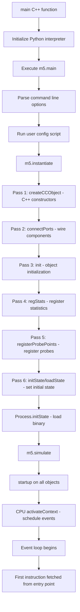

# SE Mode in gem5 — Complete Overview for Ruby Book Final Project

This document provides a comprehensive understanding of SE (syscall emulation) mode in gem5, specifically tailored for writing test cases for the 4×4 CHI mesh final project.

---

## Table of Contents

1. [SE Mode Overview](#se-mode-overview)
   - [What is SE Mode](#what-is-se-mode)
   - [Benefits of SE Mode](#benefits-of-se-mode)
   - [Limitations of SE Mode](#limitations-of-se-mode)
2. [SE Mode Startup](#se-mode-startup)
   - [Initialization Sequence](#initialization-sequence)
   - [Process Loading](#process-loading)
   - [First Instruction Execution](#first-instruction-execution)
3. [Memory Allocation](#memory-allocation)
   - [Memory Address Spaces](#memory-address-spaces)
   - [ELF Loading](#elf-loading)
   - [Address Interleaving with Multiple DDR Controllers](#address-interleaving-with-multiple-ddr-controllers)
   - [Static vs Dynamic Allocation](#static-vs-dynamic-allocation)
4. [Processes and Threads](#processes-and-threads)
   - [Multiple Process Support](#multiple-process-support)
   - [Thread-to-Core Mapping](#thread-to-core-mapping)
   - [Core Selection Mechanism](#core-selection-mechanism)
   - [Thread Identification](#thread-identification)
5. [Syscall Emulation](#syscall-emulation)
   - [Syscall Interception Flow](#syscall-interception-flow)
   - [Host vs Guest Concept](#host-vs-guest-concept)
   - [File I/O Mechanism](#file-io-mechanism)
6. [SE Mode Integration with Ruby](#se-mode-integration-with-ruby)
   - [Request Flow from CPU to Ruby](#request-flow-from-cpu-to-ruby)
   - [Ruby Sequencer Interface](#ruby-sequencer-interface)
   - [Key Bridge Components](#key-bridge-components)
7. [Debug Tooling](#debug-tooling)
   - [Core Debug Flags](#core-debug-flags)
   - [Ruby-Specific Debug Flags](#ruby-specific-debug-flags)
   - [Garnet Network Debugging](#garnet-network-debugging)
   - [Statistics for Monitoring](#statistics-for-monitoring)
8. [Essential Topics for Test Case Development](#essential-topics-for-test-case-development)
   - [Atomic Operations in SE Mode](#atomic-operations-in-se-mode)
   - [Memory Ordering and Fences](#memory-ordering-and-fences)
   - [Cache Coherence in SE Mode](#cache-coherence-in-se-mode)
   - [Timing Considerations](#timing-considerations)
   - [Common Pitfalls](#common-pitfalls)

---

## SE Mode Overview

### What is SE Mode

**SE (syscall emulation) mode** is one of gem5's two primary execution modes, designed for running user-space applications with full hardware simulation but without simulating an operating system kernel.

**Core Concept:**

```
┌─────────────────────────────────────────────────────────────┐
│                    gem5 Simulator                           │
│  ┌─────────────────────────────────────────────────────────┐│
│  │        Simulated Hardware (CPU, Caches, Memory)          ││
│  └─────────────────────────────────────────────────────────┘│
│                          ║                                   │
│                          ║  ECALL instruction (syscall)       │
│                          ▼                                   │
│  ┌─────────────────────────────────────────────────────────┐│
│  │        Syscall Emulation Layer                           ││
│  │     - Intercepts ECALL                                   ││
│  │     - Translates target syscalls → host syscalls         ││
│  │     - Returns translated results to target               ││
│  └─────────────────────────────────────────────────────────┘│
│                          ║                                   │
│                          ║                                   │
│                          ▼                                   │
│  ┌─────────────────────────────────────────────────────────┐│
│  │        Host Operating System (Linux)                     ││
│  │     - Executes actual syscalls (read, write, mmap, etc.)  ││
│  └─────────────────────────────────────────────────────────┘│
└─────────────────────────────────────────────────────────────┘

Target Program (RISC-V binary) runs entirely in gem5, but all system
calls are intercepted and executed on the host machine's OS.
```

**Key Characteristics:**

- **User-space only mode**: Only application code runs simulated; kernel code does not exist
- **Syscall forwarding**: Every syscall is intercepted, translated to host format, then executed by host OS
- **Host filesystem access**: SE mode programs directly access the host filesystem for file I/O
- **No kernel simulation**: No boot process, no device drivers, no kernel scheduler
- **Full hardware simulation**: CPU, caches, memory controllers, interconnects — all simulated in detail

**Entry Points:**

- C++ main: [src/sim/main.cc](src/sim/main.cc)
- Python main: [src/python/m5/main.py](src/python/m5/main.py):main
- SE workload base: [src/sim/se_workload.hh](src/sim/se_workload.hh)
- RISC-V SE workload: [src/arch/riscv/se_workload.hh](src/arch/riscv/se_workload.hh)

---

### Benefits of SE Mode

**1. Simpler Configuration**

No need for:
- Kernel images and bootloaders
- Disk images with filesystem
- Device trees or BIOS
- Complex bootloader scripts

A SE mode system can be configured with a single Python script:
```python
system = System()
system.workload = SEWorkload.init_compatible(binary)
process = Process()
process.cmd = [binary]
system.cpu = [TimingSimpleCPU() for _ in range(16)]
root = Root(full_system=False, system=system)
```

**2. Faster Simulation**

Eliminating kernel simulation reduces overhead significantly. SE mode is ideal for:
- Microarchitecture studies (cache designs, memory hierarchies)
- Protocol validation (Ruby coherence protocols)
- Network topology experiments (Garnet mesh performance)

Typical speedup: 2-10× faster than FS mode for CPU-bound workloads.

**3. Easier Debugging**

Smaller state space makes debugging easier:
- No kernel complexity to trace
- Direct control over application start
- Predictable timing without OS scheduler interference
- Easier to map observed behavior to code

**4. Quick Prototyping**

Perfect for rapid experimentation:
- Test new cache policies
- Try different cache sizes and associativities
- Explore Ruby protocol variations
- Evaluate Garnet router designs

**5. Ideal for the Ruby Book Final Project**

The 4×4 CHI mesh project is specifically designed for SE mode because:
- Focus is on memory system and interconnect, not OS
- Test programs are simple C binaries
- Need to understand coherence behavior without kernel interference
- Want to study interconnection network traffic patterns

---

### Limitations of SE Mode

**1. No Kernel Simulation**

Cannot study:
- OS scheduling policies
- Kernel memory management
- Interrupt handling
- System call implementation (only see emulation layer)
- Virtualization features
- Device drivers

**2. Limited Syscall Coverage**

Not all syscalls are implemented. Complex or kernel-specific syscalls may:
- Be unimplemented (return `-ENOSYS`)
- Be stubbed (do nothing)
- Have incomplete implementations
- Behave differently than on real hardware

Check: [src/sim/syscall_emul.hh](src/sim/syscall_emul.hh) for available syscalls.

**3. No Multi-OS Process Migration**

SE mode's process model differs from FS mode:
- Each process gets a unique PID
- Processes share resources in host-controlled manner
- No fork semantics for deep state duplication
- Process creation via `clone` syscall

**4. Limited Device Emulation**

Most devices need custom emulation via [EmulatedDriver](src/sim/emul_driver.hh):
- `/dev` files require explicit driver registration
- No DMA for custom devices (unless using DMA ports)
- Limited PCI/PCIe device simulation
- Network sockets use host networking directly

**5. Simplified Memory Management**

No realistic:
- Page fault handling ( faults are simulated but simple)
- Swap/pressure handling
- NUMA awareness beyond address interleaving
- Complex memory cgroup or other OS features

**6. No Boot Process**

Cannot study:
- Boot ROM/firmware behavior
- Early initialization
- POST (Power-On Self-Test)
- Reset sequences

**7. Direct Host Filesystem Access**

Programs directly access host filesystem:
- Non-deterministic when reading files that change
- `/proc` and `/sys` are emulated, not real
- Can cause security issues with privileged access
- No realistic device file semantics

**8. Fake System Information**

Returns simulated system info:
- Hostname: `sim.gem5.org`
- sysinfo: emulated values
- /proc/cpuinfo: simulated values
- /proc/meminfo: based on configured memory size

**9. Time is Simulation Time, Not Wall Clock**

Syscalls like `clock_gettime`, `nanosleep` return simulation time, not host time. This is correct for the simulation but can cause confusion.

**10. Threading Model Limitations**

- **Static thread-to-core mapping**: Threads never migrate between cores
- **No CPU affinity syscalls**: Cannot programmatically set affinity
- **First-come-first-served**: New threads assigned to next available core
- **SMT support**: Only if configured in system; standard configurations use 1 thread per core

---

## SE Mode Startup

### Initialization Sequence

SE mode startup is a multi-stage process involving both C++ and Python initialization.

**Complete Startup Timeline:**



**Key Stages in Detail:**

**Stage 1: System Instantiation** ([src/python/m5/simulate.py:_create_cpp_objects](src/python/m5/simulate.py))

```python
def _create_cpp_objects(root, ckpt_dir):
    # Pass 1: Call C++ constructors
    for obj in root.descendants():
        obj.createCCObject()

    # Pass 2: Port connections
    for obj in root.descendants():
        obj.connectPorts()

    # Pass 3: Initialize objects
    for obj in root.descendants():
        obj.init()

    # Pass 4: Statistics registration
    for obj in root.descendants():
        obj.regStats()

    # Pass 5: Probe points
    for obj in root.descendants():
        obj.registerProbePoints()

    # Pass 6: Set initial state
    for obj in root.descendants():
        if load_state:
            obj.loadState(ckpt_dir)
        else:
            obj.initState()
```

**Stage 2: Process Initialization** ([src/sim/process.cc:Process::initState](src/sim/process.cc:289-308))

```cpp
void Process::initState()
{
    ThreadContext *tc = system->threads[contextIds[0]];

    // Activate thread context
    tc->activate();

    // Initialize page table
    pTable->initState();

    // Create port proxy for memory access
    initVirtMem.reset(new SETranslatingPortProxy(
        tc, SETranslatingPortProxy::Always));

    // Load ELF binary into memory
    image.write(*initVirtMem);

    // Load interpreter if present (dynamic linking)
    interpImage.write(*initVirtMem);
}
```

**Stage 3: System Startup** ([src/python/m5/simulate.py:simulate](src/python/m5/simulate.py:257))

```python
def simulate(*args, **kwargs):
    global need_startup

    if need_startup:
        root = Root.getInstance()

        # Call startup on all objects in tree
        for obj in root.descendants():
            obj.startup()

        need_startup = False
        # ... exit handlers, stat reset, etc.

    # Start event loop
    event.main_loop.run()
```

**Startup Order Matters:**

| Order | Component | Purpose |
|-------|-----------|---------|
| 1 | `createCCObject()` | Allocate C++ objects, Python parameters already set |
| 2 | `connectPorts()` | Wire components together via port system |
| 3 | `init()` | Object-specific initialization, register callbacks |
| 4 | `regStats()` | Register statistics for collection |
| 5 | `registerProbePoints()` | Set up instrumentation points |
| 6 | `initState()` | Set initial state, load binaries |
| `simulate()` | `startup()` | Final startup actions, schedule initial events |

**Critical Dependencies:**

- Ports must be connected before any requests can flow
- Statistics must be registered before simulation begins
- `initState()` must complete before `startup()` can schedule events
- Thread contexts must be activated before CPUs can fetch instructions

---

### Process Loading

**ELF Object Loading** ([src/base/loader/elf_object.cc](src/base/loader/elf_object.cc))

1. **ELF Header Parsing**:
   ```cpp
   ElfObject::ElfObject(const char *filename, ...) {
       // Read ELF header using libelf
       e_type = ehdr.e_type;
       e_machine = ehdr.e_machine;
       e_entry = ehdr.e_entry;  // Entry point address
   }
   ```

2. **Loadable Segment Identification**:
   ```cpp
   for (int i = 0; i < ehdr.e_phnum; i++) {
       GElf_Phdr phdr;
       elf_getphdr(elf, i, &phdr);
       if (phdr.p_type == PT_LOAD) {
           handleLoadableSegment(phdr, ...);
       }
   }
   ```

3. **Segment Creation** for each `PT_LOAD`:
   ```cpp
   void ElfObject::handleLoadableSegment(GElf_Phdr phdr, ...) {
       // Segment with data (code, initialized data)
       image.addSegment({ name, phdr.p_paddr, imageData,
                          phdr.p_offset, phdr.p_filesz });

       // BSS segment (uninitialized data)
       if (phdr.p_memsz > phdr.p_filesz) {
           image.addSegment({ name + "(uninitialized)",
                              phdr.p_paddr + phdr.p_filesz,
                              phdr.p_memsz - phdr.p_filesz });
       }
   }
   ```

4. **Writing to Memory** ([src/base/loader/memory_image.cc](src/base/loader/memory_image.cc:39-50)):
   ```cpp
   void MemoryImage::write(PortProxy &memProxy) {
       for (const auto &seg : segmentList) {
           if (seg.data) {
               // Write initialized data
               memProxy.writeBlob(seg.base, seg.data, seg.size);
           } else {
               // Zero BSS segment
               memProxy.memsetBlob(seg.base, 0, seg.size);
           }
       }
   }
   ```

**RISC-V Process Setup** ([src/arch/riscv/process.cc:RiscvProcess::argsInit](src/arch/riscv/process.cc:136-263))

```cpp
void RiscvProcess::argsInit(int argc, char **argv,
                           char **envp, int64_t load_flag_mask)
{
    // Create auxiliary vector with program info
    // Stack layout (growing down):
    // [envp strings]
    // [NULL terminator]
    // [argv strings]
    // [NULL terminator]
    // [auxv entries]
    // [envp pointers]
    // [argv pointers]
    // [argc]
    // [padding]

    // Copy strings to stack
    // Build pointer arrays

    // Set registers
    tc->setReg(StackPointerReg, memState->getStackMin());
    tc->pcState(getStartPC());  // PC = entry point
}
```

**Entry Point Selection**:

```cpp
Addr Process::getStartPC()
{
    auto *interp = getInterpreter();
    // If dynamic linker present, start there
    return interp ? interp->entryPoint() : objFile->entryPoint();
}
```

---

### First Instruction Execution

**Thread Context Activation**:

Thread context is activated in `Process::initState()`:
```cpp
tc->activate();  // Marks thread as Active
```

**CPU Activation for TimingSimpleCPU** ([src/cpu/simple/timing.cc:TimingSimpleCPU::activateContext](src/cpu/simple/timing.cc:525-527)):

```cpp
void TimingSimpleCPU::activateContext(ThreadID thread_num)
{
    if (!fetchEvent.scheduled())
        schedule(fetchEvent, clockEdge(Cycles(0)));
    _status = BaseSimpleCPU::Running;
    BaseCPU::activateContext(thread_num);
}
```

**CPU Activation for AtomicSimpleCPU** ([src/cpu/simple/atomic.cc:AtomicSimpleCPU::activateContext](src/cpu/simple/atomic.cc:374-376)):

```cpp
void AtomicSimpleCPU::activateContext(ThreadID thread_num)
{
    if (!tickEvent.scheduled())
        schedule(tickEvent, clockEdge(Cycles(0)));
    _status = BaseSimpleCPU::Running;
    BaseCPU::activateContext(thread_num);
}
```

**First Instruction Fetch**:

For **TimingSimpleCPU**:
1. `fetchEvent` scheduled → `TimingSimpleCPU::fetch()` called
2. Initiates I-cache request for address in PC
3. `completeIfetch()` callback fetches next instruction when cache responds
4. Decode, execute, writeback stages follow

For **AtomicSimpleCPU**:
1. `tickEvent` scheduled → `AtomicSimpleCPU::tick()` called
2. Tick loop fetches, decodes, executes instructions atomically (single cycle)
3. No cache simulation, memory accesses directly to functional memory model

**Startup Checklist for Test Programs:**

| Component | Checkpoint |
|-----------|------------|
| Binary loaded | `Process::initState()` completes |
| Stack setup | `argsInit()` sets SP |
| PC set to entry | `tc->pcState(getStartPC())` |
| Thread activated | `tc->activate()` called |
| CPU scheduled | `fetchEvent` or `tickEvent` scheduled |
| Startup complete | `m5.simulate()` event loop begins |

---

## Memory Allocation

### Memory Address Spaces

SE mode uses a hybrid virtual/physical memory model:

```
Virtual Address Space (per process)
┌───────────────────────────────────────────────────┐
│ 0x7FFFFFFFFFFFFFFF │ Stack (grows down)           │ ← SP starts here
├───────────────────────────────────────────────────┤
│ ...                │ Unmapped / Guard region      │
├───────────────────────────────────────────────────┤
│ 0x4000000000000000 │ mmap_base (RISC-V 64-bit)   │
├───────────────────────────────────────────────────┤
│ ...                │ mmap allocations             │
├───────────────────────────────────────────────────┤
│ brk_point          │ Heap (grows up)             │ ← brk starts here
├───────────────────────────────────────────────────┤
│ ...                │ BSS (uninitialized data)     │
├───────────────────────────────────────────────────┤
│ .data              │ Initialized data             │
├───────────────────────────────────────────────────┤
│ .text              │ Code segment                 │
├───────────────────────────────────────────────────┤
│ 0x10000            │ Binary start                 │
└───────────────────────────────────────────────────┘
         ║
         ║  MMU virtual→physical translation (EmulationPageTable)
         ║
         ▼
Physical Address Space (system-wide, managed by MemPools)
┌───────────────────────────────────────────────────┐
│ DDR Controller 0 │ Interleaved addresses...      │
├───────────────────────────────────────────────────┤
│ DDR Controller 1 │ Interleaved addresses...      │
└───────────────────────────────────────────────────┘
```

**RISC-V Default Address Layout** ([src/arch/riscv/process.cc](src/arch/riscv/process.cc:71-95)):

| Region | RISC-V 64-bit | RISC-V 32-bit | Purpose |
|--------|---------------|---------------|---------|
| `stack_base` | `0x7FFFFFFFFFFFFFFF` | `0x7FFFFFFF` | Stack top |
| `mmap_end` | `0x4000000000000000` | `0x40000000` | mmap base |
| `brk_point` | After binary | After binary | Heap start |

**Key Components:**

- **EmulationPageTable** ([src/mem/page_table.hh](src/mem/page_table.hh)): Software-managed page table mapping virtual→physical addresses
- **MemState** ([src/sim/mem_state.cc](src/sim/mem_state.cc)): Tracks VMAs (Virtual Memory Areas) and region boundaries
- **MemPools** ([src/sim/mem_pool.cc](src/sim/mem_pool.cc)): Manages physical page pools (one per memory controller range)

---

### ELF Loading

**ELF Segments and Memory Placement:**

```
ELF File on Disk
┌─────────────────────────────────────────┐
│ ELF Header                              │
├─────────────────────────────────────────┤
│ Program Headers [PT_LOAD]               │ → .text → Code segment
├─────────────────────────────────────────┤   .data → Initialized data
│ Section Headers                          │   .rodata → Read-only data
├─────────────────────────────────────────┤   .bss → BSS (uninitialized)
│ .text section (code)                    │
│ .data section (initialized data)        │
│ .bss section (uninitialized)            │
│ ...                                     │
└─────────────────────────────────────────┘
         ║
         ║  elf_object.cc: handleLoadableSegment()
         ║
         ▼
Segments Added to MemoryImage
┌─────────────────────────────────────────┐
│ Segment 1: .text                         │ p_paddr, data, size
│ Segment 2: .data                         │ p_paddr, data, size
│ Segment 3: .bss                          │ p_paddr, NULL, size
└─────────────────────────────────────────┘
         ║
         ║  process.cc: image.write(*initVirtMem)
         ║
         ▼
Virtual Memory (lazy allocation)
┌─────────────────────────────────────────┐
│ VMA: 0x10000-0x20000, name=".text"     │
│ VMA: 0x20000-0x30000, name=".data"     │
│ VMA: 0x30000-0x40000, name=".bss"      │
└─────────────────────────────────────────┘
         ║
         ║  First access → page fault
         ║
         ▼
Physical Memory
┌─────────────────────────────────────────┐
│ Pages allocated on fault via           │
│ Process::allocateMem() →               │
│ SEWorkload::allocPhysPages() →         │
│ MemPools::allocate()                   │
└─────────────────────────────────────────┘
```

**Lazy Allocation Strategy:**

- **Segments registered immediately**: VMA created for each segment during `Process::initState()`
- **Physical pages allocated on demand**: Only when a page is first accessed (page fault handling)
- **BSS zeroed on access**: First access to BSS page triggers zero-filling in `fixupFault()`

**Key Source Files:**

- [src/base/loader/elf_object.cc](src/base/loader/elf_object.cc): ELF parsing and segment extraction
- [src/base/loader/memory_image.cc](src/base/loader/memory_image.cc): Segment registration and writing
- [src/sim/process.cc](src/sim/process.cc:306-307): Binary loading into virtual memory
- [src/mem/page_table.hh](src/mem/page_table.hh): Virtual→physical translation

---

### Address Interleaving with Multiple DDR Controllers

In your 4×4 CHI mesh system with two DDR controllers, addresses are interleaved to balance load across controllers.

**Interleaving Mechanism:**

```
Physical Memory Layout with 2 DDR Controllers
┌──────────────────────────────────────────────────┐
│ DDR Controller 0 (router 0)                      │
│ ┌────────────────────────────────────┐          │
│ │ Cache line 0 (addr bits: ... 0 0) │ intlvMatch=0 │
│ │ Cache line 2 (addr bits: ... 1 0) │ intlvMatch=0 │
│ │ Cache line 4 (addr bits: ... 0 0) │ intlvMatch=0 │
│ │ ...                                │          │
│ └────────────────────────────────────┘          │
├──────────────────────────────────────────────────┤
│ DDR Controller 1 (router 15)                     │
│ ┌────────────────────────────────────┐          │
│ │ Cache line 1 (addr bits: ... 1 1) │ intlvMatch=1 │
│ │ Cache line 3 (addr bits: ... 0 1) │ intlvMatch=1 │
│ │ Cache line 5 (addr bits: ... 1 1) │ intlvMatch=1 │
│ │ ...                                │          │
│ └────────────────────────────────────┘          │
└──────────────────────────────────────────────────┘

Interleaving bits with num_dirs=2 (2 DDR controllers):
- intlv_bits = log2(2) = 1
- intlv_low_bit = log2(cache_line_size) = log2(64) = 6
- intlv_high_bit = intlv_low_bit + intlv_bits - 1 = 6 + 1 - 1 = 6

Controller selection: Controller = addr[6]
- If address bit 6 = 0 → DDR Controller 0
- If address bit 6 = 1 → DDR Controller 1

All bytes in a cache line go to the same controller (guaranteed by
using bit 6, the lowest bit above block offset bits 0-5).
```

**Configuration** ([configs/ruby/Ruby.py:setup_memory_controllers](configs/ruby/Ruby.py:161-208)):

```python
def setup_memory_controllers(dir_cntrls, system, options, mem_type):
    for i, dir_cntrl in enumerate(dir_cntrls):
        for r in system.mem_ranges:
            # Create memory controller with interleaved address range
            dram_intf = MemConfig.create_mem_intf(
                mem_type, r, i,
                int(math.log(options.num_dirs, 2)),  # intlv_bits = 1
                options.cacheline_size,             # intlv_size = 64
                options.xor_low_bit,
            )
            # Bind memory port to directory controller
            dir_cntrl.memory_out_port = dram_intf.port
            dir_cntrl.addr_ranges = [dram_intf.range]
```

**Address Range Creation** ([configs/common/MemConfig.py:create_mem_intf](configs/common/MemConfig.py:44-111)):

```python
def create_mem_intf(mem_type, r, i, intlv_bits, intlv_size, xor_low_bit):
    intlv_low_bit = int(math.log(intlv_size, 2))
    interface.range = m5.objects.AddrRange(
        r.start,
        size=r.size(),
        intlvHighBit=intlv_low_bit + intlv_bits - 1,  # = 6
        xorHighBit=xor_low_bit,
        intlvBits=intlv_bits,                      # = 1
        intlvMatch=i,                              # = 0 or 1
    )
    return interface
```

**Runtime Routing** ([src/base/addr_range.hh:contains](src/base/addr_range.hh:498-517)):

```cpp
bool AddrRange::contains(Addr addr) const
{
    if (!interleaved())
        return addr >= _start && addr < _end;

    // Compute selector using XOR of masked bits
    uint64_t sel = 0;
    for (int i = 0; i < _intlvBits; i++) {
        uint64_t mask = ((uint64_t)1 << (_intlvHighBit - i)) |
                        (_xorHighBit ? ((uint64_t)1 << (_xorHighBit - i))
                                     : 0);
        sel |= ((addr & mask) != 0) << i;
    }

    return addr >= _start && addr < _end && sel == _intlvMatch;
}
```

**For Your 4×4 Mesh System:**

| Parameter | Value |
|-----------|-------|
| `--num-dirs` | 2 |
| `--num-l3caches` | 16 |
| Cache line size | 64 bytes |
| `intlv_bits` | 1 (log₂ of 2) |
| `intlv_low_bit` | 6 (log₂ of 64) |
| `intlv_high_bit` | 6 |
| `DDR0 router` | 0 |
| `DDR1 router` | 15 |
| Interleaving rule | `if (addr[6] == 0) → DDR0` else `→ DDR1` |

**Implications for Test Programs:**

- **Cache line granularity**: All bytes in a 64-byte cache line go to the same DDR controller
- **Alternating pattern**: Consecutive cache lines alternate between DDR0 and DDR1
- **Balanced access**: Sequential scanning will evenly distribute load across both controllers
- **Hop distance**: Core at router 0 accessing DDR0 is local (no network hops), but accessing DDR1 requires 6 mesh hops (0→3→0→3×2)

**Verification in Statistics:**

After running tests, check DDR controller balance:
```bash
# In stats.txt, look for:
system.ruby.cntrl15_Controller[0]    # DDR0
system.ruby.cntrl16_Controller[1]    # DDR1

# Compare:
system.ruby.cntrl15_Controller.controller_stats.readReqs
system.ruby.cntrl16_Controller.controller_stats.readReqs

# Should be roughly equal for balanced workloads
```

---

### Static vs Dynamic Allocation

**Static/Global Variables:**

```
Allocated during ELF loading
┌────────────────────────────────────┐
│ .text segment (code)                │
│ - Compiled instructions            │
│ - Size determined at compile time  │
│ - Read-only after loading          │
└────────────────────────────────────┘

┌────────────────────────────────────┐
│ .rodata segment                     │
│ - Read-only static data            │
│ - String literals, const arrays    │
│ - Loaded from ELF file            │
└────────────────────────────────────┘

┌────────────────────────────────────┐
│ .data segment                       │
│ - Initialized static/global vars   │
│ - int x = 42;                      │
│ - static char buffer[100];         │
│ - Memory zeroed on first access    │
└────────────────────────────────────┘

┌────────────────────────────────────┐
│ .bss segment                        │
│ - Uninitialized static/global vars  │
│ - static int big_array[1000];      │
│ - int global_uninit;               │
│ - VMA created, pages allocated    │
│   on first fault                   │
└────────────────────────────────────┘
```

**Allocation Timing:**

| Variable Type | When Memory Allocated | Initialization |
|---------------|----------------------|----------------|
| `.text`, `.rodata` | During `Process::initState()` | From ELF file |
| `.data` | During `Process::initState()` | VMA registered, pages on fault |
| `.bss` | During `Process::initState()` | VMA registered, pages on fault, zero on fault |
| `malloc()` | `malloc` syscall → `mmap` → pages on fault | Uninitialized |
| `new` | Same as `malloc` in C++ | Constructor runs after allocation |
| Stack variables | Stack growth on fault | Uninitialized (C warns!) |
| `brk()` | `brk` syscall → `updateBrkRegion` | Uninitialized |

**Stack Allocation** ([src/mem/mem_state.cc:fixupFault](src/mem/mem_state.cc:426-446)):

```cpp
bool MemState::fixupFault(Addr vaddr)
{
    // Stack grows down, allocate new page if accessed
    if (vaddr < _stackMin && vaddr >= _stackBase - _maxStackSize) {
        while (vaddr < _stackMin) {
            _stackMin -= _pageBytes;
            if (_stackBase - _stackMin > _maxStackSize)
                fatal("Maximum stack size exceeded\n");
            _ownerProcess->allocateMem(_stackMin, _pageBytes);
            inform("Increasing stack size by one page.");
        }
        return true;
    }
    return false;
}
```

**Heap Allocation via `brk()`** ([src/sim/syscall_emul.cc:brkFunc](src/sim/syscall_emul.cc:277-296)):

```cpp
SyscallReturn brkFunc(SyscallDesc *desc, ThreadContext *tc,
                     VPtr<> new_brk)
{
    auto p = tc->getProcessPtr();
    std::shared_ptr<MemState> mem_state = p->memState;
    Addr brk_point = mem_state->getBrkPoint();

    if (new_brk == 0 || (new_brk == brk_point))
        return brk_point;

    mem_state->updateBrkRegion(brk_point, new_brk);
    return mem_state->getBrkPoint();
}
```

**Heap Expansion Logic** ([src/mem/mem_state.cc:updateBrkRegion](src/mem/mem_state.cc:107-169)):

```cpp
void MemState::updateBrkRegion(Addr old_brk, Addr new_brk)
{
    auto page_aligned_new_brk = roundUp(new_brk, _pageBytes);
    auto page_aligned_old_brk = roundUp(old_brk, _pageBytes);

    if (new_brk < old_brk) {
        // Shrink heap: unmap pages
        const auto length = page_aligned_old_brk - page_aligned_new_brk;
        unmapRegion(page_aligned_new_brk, length);
        _brkPoint = new_brk;
    } else if (page_aligned_new_brk > page_aligned_old_brk) {
        // Grow heap: map new pages if unmapped
        auto length = page_aligned_new_brk - page_aligned_old_brk;
        if (!isUnmapped(page_aligned_old_brk, length))
            return;  // Cannot expand, would collide
        mapRegion(page_aligned_old_brk, length, "heap");
    }
    _brkPoint = new_brk;
}
```

**mmap-based Allocation** ([src/sim/syscall_emul.hh:mmapFunc](src/sim/syscall_emul.hh:2116-2199)):

```cpp
template <class OS>
SyscallReturn mmapFunc(SyscallDesc *desc, ThreadContext *tc,
                      VPtr<> start, typename OS::size_t length,
                      int prot, int tgt_flags, int tgt_fd,
                      typename OS::off_t offset)
{
    // ... validation ...

    length = roundUp(length, page_bytes);

    int sim_fd = -1;
    if (!(tgt_flags & OS::TGT_MAP_ANONYMOUS)) {
        // File-backed mapping
        auto ffdp = std::dynamic_pointer_cast<FileFDEntry>(fdep);
        sim_fd = ffdp->getSimFD();
    }

    // Allocate and map VMA
    vm_state->mmapRegion(...);
    // Physical pages allocated on first access
}
```

**Key Takeaways for Test Programs:**

- **Static arrays**: Allocated at fixed virtual addresses, useful for address mapping tests
- **Stack allocation**: Grows automatically, but has a maximum size (configurable)
- **Heap allocation**: Use `malloc()`/`new` for dynamic data, but expect page faults on first access
- **Large contiguous memory**: Use `mmap` or `brk` for guaranteed contiguity, or large static arrays
- **Page fault latency**: First access to newly allocated memory incurs page allocation overhead

---

## Processes and Threads

### Multiple Process Support

**Yes, SE mode can run multiple processes in parallel**, with these characteristics:

```
Process Model in SE Mode
┌──────────────────────────────────────┐
│ System                               │
│ ┌────────────────────────────────┐   │
│ │ Process 1 (PID=1)               │   │
│ │ - contextIds: [0, 1]            │   │ Uses ThreadContexts 0,1
│ │ - EmulationPageTable for PID1  │   │ Separate virtual→phys map
│ │ - FDArray (file descriptors)   │   │ Separate file state
│ └────────────────────────────────┘   │
│ ┌────────────────────────────────┐   │
│ │ Process 2 (PID=2)               │   │
│ │ - contextIds: [2, 3]            │   │ Uses ThreadContexts 2,3
│ │ - EmulationPageTable for PID2  │   │ Separate virtual→phys map
│ │ - FDArray (file descriptors)   │   │ Separate file state
│ └────────────────────────────────┘   │
│ ┌────────────────────────────────┐   │
│ │ ThreadContext Pool              │   │
│ │ [0,1,2,3,...,15]                │   │ All TCs from all 16 CPUs
│ └────────────────────────────────┘   │
└──────────────────────────────────────┘

Each process has:
- Independent virtual memory space (EmulationPageTable)
- Independent file descriptor table (FDArray)
- Separate PID
- Set of ThreadContext IDs it owns

Processes share physical memory (via MemPools) but not virtual mappings.
```

**Process Creation via `clone` Syscall** ([src/sim/syscall_emul.hh:doClone](src/sim/syscall_emul.hh:1835-1981)):

```cpp
template <class OS>
SyscallReturn
doClone(SyscallDesc *desc, ThreadContext *tc,
        typename OS::flags_t flags, VPtr<> child_stack,
        typename OS::pid_t *ptid, VPtr<> ctid,
        typename OS::pid_t new_tid)
{
    Process *cp, *pp;
    ThreadContext *ctc;
    ContextID cid;
    temp_pid = allocateNewPID();  // Next PID

    // Find free ThreadContext
    if (!(ctc = tc->getSystemPtr()->threads.findFree())) {
        return -EAGAIN;  // No available TCs
    }

    cid = ctc->contextId();

    // Create new Process
    ProcessParams *pp = new ProcessParams();
    pp->pid = temp_pid;
    cp = pp->create();

    // Set up process state
    cp->assignThreadContext(cid);
    cp->initState();

    // Initialize registers for new thread
    ctc->setReg(StackPointerReg, child_stack);
    ctc->pcState(...);

    // Return new PID
    return temp_pid;
}
```

**ThreadContext Allocation** ([src/sim/system.cc:Threads::findFree](src/sim/system.cc:120-128)):

```cpp
ThreadContext *System::Threads::findFree()
{
    for (auto &thread: threads) {
        if (thread.context->status() == ThreadContext::Halted)
            return thread.context;
    }
    return nullptr;  // No free TCs
}
```

**Resource Pools:**

| Resource | Scope | Description |
|----------|-------|-------------|
| ThreadContext | System-wide | Global pool, shared by all processes |
| Physical Memory | System-wide | MemPools managed by SEWorkload |
| Virtual Memory | Per-process | EmulationPageTable per Process |
| File Descriptors | Per-process | FDArray per Process |
| PID | Per-process | Unique across simulation |

---

### Thread-to-Core Mapping

**Thread-to-core mapping is static**, determined at configuration time:

```
Configuration-Time Mapping (from Python config script)
┌──────────────────────────────────────────┐
│ system.cpu = [                           │
│     TimingSimpleCPU(),  # CPU 0          │
│     TimingSimpleCPU(),  # CPU 1          │
│     ...                               │
│     TimingSimpleCPU(),  # CPU 15         │
│ ]                                        │
│                                          │
│ process = Process()                      │
│ process.cmd = [binary]                   │
│                                          │
│ for cpu in system.cpu:                   │
│     cpu.workload = process               │  ← All CPUs share same Process
│     cpu.createThreads()                  │  ← Creates ThreadContext per CPU
└──────────────────────────────────────────┘
         ║
         ║  BaseCPU::registerThreadContexts()
         ║
         ▼
Runtime Mapping (static, never changes)
┌──────────────────────────────────────────┐
│ CPU 0 (BaseCPU subclass)                 │
│ - cpuId = 0                              │
│ - threadContexts = [TC0]                 │  ← TC0 belongs to CPU 0
│                                          │
│ CPU 1                                    │
│ - cpuId = 1                              │
│ - threadContexts = [TC1]                 │  ← TC1 belongs to CPU 1
│                                          │
│ ...                                      │
│                                          │
│ CPU 15                                   │
│ - cpuId = 15                             │
│ - threadContexts = [TC15]                │  ← TC15 belongs to CPU 15
│                                          │
│ Process                                  │
│ - contextIds = [0, 1, 2, ..., 15]        │  ← All TCs belong to this Process
│ - pid = 1                                │
└──────────────────────────────────────────┘

Thread ID 0 executes on CPU 0's ThreadContext (TC0)
Thread ID 1 executes on CPU 1's ThreadContext (TC1)
...
Thread ID 15 executes on CPU 15's ThreadContext (TC15)
```

**Registration Flow** ([src/cpu/base.cc:BaseCPU::registerThreadContexts](src/cpu/base.cc:493-513)):

```cpp
void BaseCPU::registerThreadContexts()
{
    for (ThreadID tid = 0; tid < threadContexts.size(); ++tid) {
        // Each CPU has its own ThreadContext(s)
        ThreadContext *tc = threadContexts[tid];

        // Register with System's global pool
        system->registerThreadContext(tc);

        // In SE mode, assign to Process context
        if (!FullSystem) {
            tc->getProcessPtr()->assignThreadContext(tc->contextId());
        }
    }
}
```

**Configuration Example from Project**:

```python
# In rbook_mesh_config.py
system.cpu = [RiscvTimingSimpleCPU() for i in range(16)]

# Create shared process for all 16 CPUs
process = Process()
process.cmd = [binary]

# Assign same process to all CPUs
for i, cpu in enumerate(system.cpu):
    cpu.workload = process
    cpu.createThreads()
    # CPU now has ThreadContext[i] registered to Process

# At this point:
# - system.cpu[i].threadContexts[0] = TC with contextId = i
# - Process.contextIds = [0, 1, 2, ..., 15]
# - TC[i].getCpuPtr() = system.cpu[i]
# - TC[i].getProcessPtr() = process
```

---

### Core Selection Mechanism

**How the system selects which core runs which thread:**

```
Thread/Process Creation Flow
┌────────────────────────────────────────┐
│ Application calls:                     │
│   clone(CLONE_VM|CLONE_THREAD, ...)   │  ← Create new thread
│   OR fork()                            │  → Not recommended in SE mode
└────────────────────────────────────────┘
         ║
         ║  System call exception
         ║
         ▼
┌────────────────────────────────────────┐
│ Syscall fault handling                 │
│ - Read syscall number                  │
│ - Dispatch to clone handler            │
└────────────────────────────────────────┘
         ║
         ║
         ▼
┌────────────────────────────────────────┐
│ doClone()                              │
│ - Check flags (thread vs process)      │
│ - Call findFree() to get ThreadContext │
│ - Create new Process if needed         │
└────────────────────────────────────────┘
         ║
         ║
         ▼
┌────────────────────────────────────────┐
│ findFree() searches:                   │
│ system.threads[] = [TC0, TC1, ..., 15] │
│                                          │
│ Returns first ThreadContext with:       │
│   status() == ThreadContext::Halted     │
│                                          │
│ Search order: low indices first         │
│ (e.g., TC0 before TC1 before TC2...)   │
└────────────────────────────────────────┘
         ║
         ║  If TC[3] returned:
         ║
         ▼
┌────────────────────────────────────────┐
│ New thread/executing now has:           │
│ - ThreadContext = TC[3]                 │
│ - CPU = TC[3]->getCpuPtr()             │
│ - cpuId() = TC[3]->cpuId()             │  → CPU ID 3
│ - threadId() = TC[3]->threadId()       │  → Thread 0 on CPU 3
│ - contextId() = 3                       │
└────────────────────────────────────────┘
```

**findFree() Implementation** ([src/sim/system.cc:120-128](src/sim/system.cc:120-128)):

```cpp
ThreadContext *System::Threads::findFree()
{
    // Sequential search through all ThreadContexts
    for (auto &thread: threads) {
        if (thread.context->status() == ThreadContext::Halted)
            return thread.context;
    }
    return nullptr;  // None available
}
```

**ThreadContext States**:

| State | Description | When Set |
|-------|-------------|----------|
| `Halted` | Not executing, available for assignment | Initial state, after thread exit |
| `Active` | Currently executing on CPU | `activateContext()` |
| `Suspended` | Temporarily paused | `suspendContext()` |
| `Halting` | In process of halting | `haltContext()` |

For the Ruby Book project with pre-created threads:
```python
# During configuration:
for cpu in system.cpu:
    cpu.createThreads()  # Creates ThreadContext, state = Halted

# During startup (Process::initState):
for i in range(16):
    TC[i].activate()  # State changes to Active
    # Thread i now pinned to CPU i's ThreadContext
```

**No Dynamic Migration:**

Once assigned, a **ThreadContext never moves to a different CPU**:
- Static mapping for entire simulation
- No runtime CPU affinity syscalls
- First-come-first-served pool exhaustion

---

### Thread Identification

**Identifying which core executes which thread:**

```
Three-Level Identification Hierarchy
┌────────────────────────────────────────┐
│ ThreadContext                          │
│ - contextId() = 0                      │ System-wide unique ID
│ - cpuId() = system.cpu[0].cpuId → 0    │ → Which CPU core
│ - threadId() = 0                       │ → Which thread on CPU (for SMT)
│                                          │
│ TC[0] → CPU 0 → Thread 0              │
│ TC[1] → CPU 1 → Thread 1              │
│ ...                                    │
│ TC[15] → CPU 15 → Thread 15           │
└────────────────────────────────────────┘
         ║
         ║  Querying from ThreadContext pointer
         ║
         ▼
Programmatic Access (from C++ code)
┌────────────────────────────────────────┐
│ ThreadContext *tc = ...;               │
│                                          │
│ // Core identification                   │
│ BaseCPU *cpu = tc->getCpuPtr();         │  → CPU object
│ int core_num = tc->cpuId();            │  → Integer 0-15
│ ThreadID tid = tc->threadId();         │  → Thread ID on CPU (0 for SMT=1)
│ ContextID ctx_id = tc->contextId();    │  → System-wide ID (0-15)
│                                          │
│ // Process identification                │
│ Process *proc = tc->getProcessPtr();   │  → Process object
│ int pid = proc->pid();                 │  → Process ID
│                                          │
│ // Statistics path                      │
│ // Stats are at:                         │
│ // system.ruby.cpu_ruby_ports[0]       │  → For TC[0] (core 0)  │
│ // system.ruby.cpu_ruby_ports[1]       │  → For TC[1] (core 1)  │
│ // ...                                  │
│ // system.ruby.cpu_ruby_ports[15]      │  → For TC[15] (core 15) │
└────────────────────────────────────────┘
```

**From Test Programs (C/C++):**

```c
// Get CPU ID (RISC-V ISA-specific)
unsigned int get_cpu_id() {
    // RISC-V mhartid CSR (HART = Hardware Thread)
    // Read using inline assembly
    unsigned int hartid;
    __asm__ volatile("csrr %0, mhartid" : "=r"(hartid));
    return hartid;
}

// Pthread thread_id to CPU mapping (non-deterministic)
void *thread_func(void *arg) {
    int cpu_num = get_cpu_id();
    printf("Thread %lu running on CPU %d\n", pthread_self(), cpu_num);
    return NULL;
}

int main(int argc, char **argv) {
    pthread_t threads[16];
    for (int i = 0; i < 16; i++) {
        pthread_create(&threads[i], NULL, thread_func, NULL);
    }
    for (int i = 0; i < 16; i++) {
        pthread_join(threads[i], NULL);
    }
}
```

**Important Notes:**

- **get_cpu_id() returns `mhartid`**: RISC-V hardware thread ID, matches `tc->cpuId()` (0-15)
- **pthread IDs not meaningful**: `pthread_self()` returns opaque handle, not CPU number
- **Non-deterministic assignment**: If using `pthread_create`, threads assigned by findFree() in order of creation
- **Deterministic only with manual binding**: Use `setAffinity()` syscalls (if implemented) or pre-create threads

**From Statistics:**

```bash
# After simulation, stats organized by component:
system.ruby.cpu_ruby_ports[0].ruby_sequencer_stats
system.ruby.cpu_ruby_ports[1].ruby_sequencer_stats
...
system.ruby.cpu_ruby_ports[15].ruby_sequencer_stats

# Each sequencer has m_coreId:
# system.ruby.cpu_ruby_ports[i].coreId = i

# Filter stats for specific core:
grep "cpu_ruby_ports\[3\]" m5out/*/stats.txt  → Core 3 only
```

---

## Syscall Emulation

### Syscall Interception Flow

**How ECALL instructions trigger syscall emulation in SE mode:**

```
Syscall Execution Flow in RISC-V SE Mode
┌─────────────────────────────────────────┐
│ Application (RISC-V binary)            │
│                                         │
│  ecall:                                 │
│    mv a7, <syscall_num>                 │ ← a7 = syscall number
│    ecall                                │ ← ECALL instruction
│                                         │
│  <arg1 in a0, arg2 in a1, ...>         │ ← Arguments in registers
└─────────────────────────────────────────┘
         ║
         ║  ECALL instruction executed
         ║
         ▼
┌─────────────────────────────────────────┐
│ CPU raises exception                    │
│                                         │
│ PC → PC + 4 (advance past ecall)    │
│ raise exception: SyscallFault          │
└─────────────────────────────────────────┘
         ║
         ║
         ▼
┌─────────────────────────────────────────┐
│ Exception handling                      │
│                                         │
│ SyscallFault::invokeSE()               │
│   [src/arch/riscv/faults.cc:326-335]   │
│   - Get ThreadContext                  │
│   - Workload::syscall(tc)               │
└─────────────────────────────────────────┘
         ║
         ║
         ▼
┌─────────────────────────────────────────┐
│ Worklevel dispatch                      │
│                                         │
│ SEWorkload::syscall(tc)                │
│   [src/sim/se_workload.cc:69-72]       │
│   - Forward to process                  │
│   - process->syscall(tc)                │
└─────────────────────────────────────────┘
         ║
         ║
         ▼
┌─────────────────────────────────────────┐
│ ISA-specific handler                    │
│                                         │
│ RiscvISA::EmuLinux::syscall(tc, ...)   │
│   [src/arch/riscv/linux/se_workload.cc:95-107]  │
│   - Read a7 = RiscvISA::SyscallNumReg  │ ← Get syscall number
│   - Look up in table                    │
│   - EmuLinux::syscallDescs64[args]     │ ← 64-bit or 32-bit table
│   - desc->doSyscall(tc)                 │
└─────────────────────────────────────────┘
         ║
         ║
         ▼
┌─────────────────────────────────────────┐
│ Generic handler dispatch                │
│                                         │
│ SyscallDesc::doSyscall(tc)             │
│   [src/sim/syscall_desc.cc]            │
│   - Extract arguments via guest_abi     │ ← Unpack from registers
│   - Call handler function                │
│   - handler() returns SyscallReturn    │
└─────────────────────────────────────────┘
         ║
         ║
         ▼
┌─────────────────────────────────────────┐
│ Handler executes                        │
│                                         │
│ e.g., readFunc() <OS>(desc, tc, ...)   │
│   [src/sim/syscall_emul.hh:]          │
│                                         │
│   - Get file descriptor mapping         │
│   - Copy buffers: guest → host          │
│   - Call host read(sim_fd, ...)        │  ← Actual host syscall!
│   - Copy results: host → guest          │
│   - Return byte count or error          │
└─────────────────────────────────────────┘
         ║
         ║
         ▼
┌─────────────────────────────────────────┐
│ Return values written                    │
│                                         │
│ SyscallDesc::handleReturn(tc, ret)     │
│   - Store return value in a0            │ ← Standard return register
│   - Store errno if error                 │
│                                         │
│ Application continues execution        │
└─────────────────────────────────────────┘
```

**Syscall Table Lookup** ([src/arch/riscv/linux/se_workload.cc](src/arch/riscv/linux/se_workload.cc:529-894)):

```cpp
const EmuLinux::SyscallDesc64 EmuLinux::syscallDescs64[] = {
    { 0, "io_setup", ioSetupFunc },
    { 1, "io_destroy", ioDestroyFunc },
    { 3, "io_submit", ioSubmitFunc },
    // ... many more ...
    { 56, "openat", openatFunc<RiscvLinux64> },
    { 57, "close", closeFunc },
    { 63, "read", readFunc<RiscvLinux64> },
    { 64, "write", writeFunc<RiscvLinux64> },
    // ... hundreds more entries ...
    { 222, "clone", cloneFunc<RiscvLinux64> },
    { 260, "getpid", getpidFunc },
    { 261, "gettid", gettidFunc },
    // ...
    { NULL, NULL, NULL }  // Sentinel
};
```

**Argument Extraction** (`guest_abi` mechanism):

Arguments are automatically extracted from registers by `SyscallDescABI`:
- RISC-V: a0, a1, a2, a3, a4, a5, a6 (7 arguments max)
- ARM: x0-x6
- x86: different conventions per syscall

---

### Host vs Guest Concept

**The distinction between guest (simulated) and host (physical machine):**

```
Guest (Simulated)                    Host (Physical Machine)
─────────────────────────────────────────────────────────────
Address Space                  Address Space
├─ Virtual addresses (in gem5)      ├─ Virtual addresses on physical Linux
└─ Physical addresses (MemPools)    └─ Physical RAM, disks

File Descriptors                  File Descriptors
├─ Target FD (0,1,2,3,...)         ├─ Host FD (returned by open, socket)
├─ Mapped by FDArray               └─ Real OS file descriptors
└─ Only 1024 entries max           └─ System-managed

Memory Access                     Memory Access
├─ SETranslatingPortProxy          ├─ Direct pointer dereference
├─ Virtual → Phys translation      └─ MMU hardware
└─ Page faults simulated          └─ Hardware page faults

Time                              Time
├─ Simulation time (curTick())    ├─ Wall clock time
├─ Used by clock_gettime()        └─ Used by host kernel
└─ Controlled by gem5 events      └─ Controlled by CPU cycles

Files                             Files
├─ Paths relative to CWD          ├─ Real filesystem paths
├─ Relative to process PWD?       └─ Host's filesystem
└─ Host files directly            └─ Same filesystem

System Information                System Information
├─ Hostname: sim.gem5.org         ├─ Hostname: actual machine name
├─ sysinfo: emulated values       ├─ sysinfo: real machine info
├─ /proc/cpuinfo: simulated       ├─ /proc/cpuinfo: real CPUs
└─ uname: simulated               └─ uname: real kernel info

Syscalls                          Syscalls
├─ Intercepted ECALL              ├─ Direct system calls
├─ Translated to host format      └─ Native to host kernel
└─ Executed by host kernel        └─ Direct to host kernel
```

**Data Flow Pattern:**

```
Guest Program
    ↓ ECALL instruction
    [SyscallFault]
    [SEWorkload::syscall]
    [Read a7 register]
    [Lookup in syscallDescs64]
    [Get handler: readFunc]
    ↓ Extract arguments via guest_abi
    [a0=tgt_fd, a1=tgt_buf, a2=count]
Syscall Handler (readFunc)
    ↓ [Get FileFDEntry from FDArray]
    [ffdp = fdArray[tgt_fd]]
    ↓ [Get host FD]
    [sim_fd = ffdp->getSimFD()]
    ↓ [BufferArg creates host buffer]
    [host_buffer = BufferArg(tgt_buf, count)]
    ↓ [Copy from guest to host]
    [host_buffer.copyIn(tc)]
    ↓ [Call host system call]
    [bytes_read = read(sim_fd, host_buffer, count)]
    ↓ [Copy result to guest]
    [host_buffer.copyOut(tc)]
    ↓ [Return]
    [SyscallReturn(bytes_read)]
SyscallDesc::handleReturn
    ↓ [Store result in a0]
    [tc->setReg(ReturnReg, bytes_read)]
Guest Program continues with result in a0
```

**Example: `gettimeofday` syscall**

```cpp
// Guest program calls:
gettimeofday(&tv, NULL);

// Handler in [src/sim/syscall_emul.cc]:
SyscallReturn
gettimeofdayFunc(SyscallDesc *desc, ThreadContext *tc,
                 VPtr<> tv_ptr, VPtr<> tz_ptr)
{
    // Use gem5's simulation time, not host time!
    struct timespec ts = curTickFreq.toTimespec(curTick());

    // Convert to timeval format
    TimeVal tv = { .tv_sec = ts.tv_sec, .tv_usec = ts.tv_nsec/1000 };

    // Write to guest memory
    BufferArg tv_buf(tv_ptr, sizeof(TimeVal));
    tv_buf.copyIn(tv);
    tv_buf.copyOut(tc);

    return 0;  // Success
}
```

**Use Simulation Time, Not Host Time:**

For timing-critical experiments (like the hop latency test in the final project), always use:
- RISC-V `rdcycle` CSR for cycle counts ([src/arch/riscv/interrupts.hh](src/arch/riscv/interrupts.hh))
- `rdtime` CSR for time counts
- gem5's `curTick()` for simulation time (from C++ side)

These reflect the simulated execution state, not the host machine's wall clock.

---

### File I/O Mechanism

**File descriptor mapping and I/O flow:**

```
File Descriptor Architecture
┌────────────────────────────────────────┐
│ Guest Application                     │
│ fd = open("data.txt", O_READ);       │
│ read(fd, buffer, 1024);              │
└────────────────────────────────────────┘
         ║
         ║  Syscall: openat(fd=AT_FDCWD, "data.txt")
         ║
         ▼
┌────────────────────────────────────────┐
│ FDArray                                │
│ (Max 1024 entries)                    │
│ [0]=FileFDEntry for stdin             │  ← Pre-opened
│ [1]=FileFDEntry for stdout            │  ← Pre-opened
│ [2]=FileFDEntry for stderr            │  ← Pre-opened
│ [3]=FileFDEntry for data.txt          │  ← Newly opened
│ ...                                    │
│ [1023]=NULL                           │
└────────────────────────────────────────┘
         ║
         ║
         ▼
┌────────────────────────────────────────┐
│ FDEntry Hierarchy                      │
│                                        │
│ FileFDEntry:                          │
│ - Host FD (int simFD)                 │  ← Returned by host open()
│ - Open flags                           │
│ - Read/write offsets                   │
│                                        │
│ PipeFDEntry:                          │
│ - pipe[2] (read fd, write fd)         │
│ - Internal pipe buffer                  │
│                                        │
│ SocketFDEntry:                        │
│ - Host socket file descriptor          │
│ - Address family (AF_INET, etc.)       │
│                                        │
│ DeviceFDEntry:                        │
│ - EmulatedDevice driver               │
│ - Custom device read/write handlers    │
└────────────────────────────────────────┘
         ║
         ║  When reading:
         ║  read(tgt_fd=3, buf, size)
         ║
         ▼
┌────────────────────────────────────────┐
│ readFunc()                             │
│                                        │
│ 1. Get FDEntry:                        │
│    ffdp = fdArray[tgt_fd];            │
│    sim_fd = ffdp->getSimFD();         │ ← Host FD
│                                        │
│ 2. Create BufferArg:                   │
│    BufferArg buffer(buf, size);       │  ← Guest buffer
│                                        │
│ 3. Copy from guest:                    │
│    host_buffer = malloc(size);        │
│    buffer.copyIn(tc, host_buffer);    │  ← Guest→Host
│                                        │
│ 4. Call host read:                     │
│    bytes = read(sim_fd, host_buffer,  │  ← Actual host syscall!
│                  size);                │
│                                        │
│ 5. Copy to guest:                      │
│    buffer.copyOut(tc, host_buffer);   │  ← Host→Guest
│    free(host_buffer);                  │
│                                        │
│ 6. Return:                             │
│    return bytes;                       │  ← Byte count (or -errno)
└────────────────────────────────────────┘
```

**Buffer Transfer Classes** ([src/sim/syscall_emul_buf.hh](src/sim/syscall_emul_buf.hh)):

```cpp
// Untyped buffer transfer
class BufferArg {
    Addr vaddr;      // Guest virtual address
    size_t size;     // Buffer size

    void copyIn(ThreadContext *tc, void *host_buf);
    // Read from guest memory to host buffer

    void copyOut(ThreadContext *tc, const void *host_buf);
    // Write from host buffer to guest memory
};

// Typed buffer with struct access
template<typename T>
class TypedBufferArg : public BufferArg {
    T& get();
    // Access buffer as struct T

    const T& get() const;
    // Const access
};
```

**Key Source Files:**

- [src/sim/syscall_emul.hh](src/sim/syscall_emul.hh) - Generic syscall templates
- [src/sim/syscall_emul.cc](src/sim/syscall_emul.cc) - Implementations
- [src/sim/syscall_emul_buf.hh](src/sim/syscall_emul_buf.hh) - Buffer transfer
- [src/sim/fd_array.hh](src/sim/fd_array.hh) - FDArray class
- [src/sim/fd_entry.hh](src/sim/fd_entry.hh) - FDEntry types

---

## SE Mode Integration with Ruby

### Request Flow from CPU to Ruby

**How memory requests flow from SE mode CPUs through Ruby to memory controllers:**

```
Request Flow (Read/Write)
┌────────────────────────────────────────┐
│ CPU (SE mode)                          │
│ - Virtual address (VA)                 │
│ - Issue instruction fetch or data access│
└────────────────────────────────────────┘
         ║
         ║  MMU translation with EmulationPageTable
         ║
         ▼
┌────────────────────────────────────────┐
│ MMU                                    │
│ - Lookup VA in EmulationPageTable     │
│ - Return physical address (PA)         │
└────────────────────────────────────────┘
         ║
         ║  Physical address in Packet
         ║
         ▼
┌────────────────────────────────────────┐
│ CPU Port                               │
│ - TimingSimpleCPU::icachePort         │  ← Instruction reads
│ - TimingSimpleCPU::dcachePort         │  ← Data reads/writes
└────────────────────────────────────────┘
         ║
         ║  recvTimingReq() method
         ║
         ▼
┌────────────────────────────────────────┐
│ RubyPort::MemResponsePort             │
│ [src/mem/ruby/system/RubyPort.cc:249] │
│                                        │
│ - Check if physical memory address     │
│ - Check for PIO (device) vs mem       │
│ - Push SenderState for tracking       │
│ - Call Sequencer::makeRequest()       │
└────────────────────────────────────────┘
         ║
         ║
         ▼
┌────────────────────────────────────────┐
│ Sequencer                              │
│ [src/mem/ruby/system/Sequencer.cc:950] │
│                                        │
│ - Convert to RubyRequestType           │
│   (LD, ST, IFETCH, ATMOP, etc.)        │
│ - Create RubyRequest                   │
│ - Call insertRequest()                 │
└────────────────────────────────────────┘
         ║
         ║
         ▼
┌────────────────────────────────────────┐
│ Request Table Management               │
│                                        │
│ Sequencer::insertRequest()            │
│   [src/mem/ruby/system/Sequencer.cc:307] │
│                                        │
│ - Add to m_RequestTable (address map) │
│ - Check for request coalescing        │
│ - Call issueRequest()                  │
└────────────────────────────────────────┘
         ║
         ║
         ▼
┌────────────────────────────────────────┐
│ Issue to Controller                    │
│                                        │
│ Sequencer::issueRequest()             │
│   [src/mem/ruby/system/Sequencer.cc:1086] │
│                                        │
│ - Send to m_mandatory_q_ptr           │
│ → L1 Cache Controller                  │
└────────────────────────────────────────┘
         ║
         ║  SLICC protocol state machine
         ║
         ▼
┌────────────────────────────────────────┐
│ AbstractController (CHI protocol)     │
│ - L1Cache_Controller or L2/Dir         │
│ - Coherence state transitions        │
│ - Forward requests to peers           │
└────────────────────────────────────────┘
         ║
         ║  Garnet network packets (flits)
         ║
         ▼
┌────────────────────────────────────────┐
│ Garnet Network                        │
│ - Routers route packets hop-by-hop    │
│ - XY routing across mesh              │
│ - Virtual networks (REQ, SNP, RSP, DAT)│
└────────────────────────────────────────┘
         ║
         ║
         ▼
┌────────────────────────────────────────┐
│ Memory Controller / Directory         │
│ - Respond to requests                 │
│ - Supply data from DRAM               │
└────────────────────────────────────────┘
         ║
         ║  Response path (data flows back)
         ║
         ▼
┌────────────────────────────────────────┐
│ Response Callbacks                     │
│                                        │
│ Sequencer::hitCallback() /           │
│ writeCallback() / readCallback()    │   ← Data arrives
│                                        │
│ - Place data in packet                 │
│ - Schedule timing response to CPU     │
└────────────────────────────────────────┘
         ║
         ║
         ▼
┌────────────────────────────────────────┐
│ CPU completes instruction             │
└────────────────────────────────────────┘
```

**Response Flow (data returns):**

```
Memory Controller
    ↓ Data loaded from DRAM
Network (Garnet)
    ↓ Flits traverse mesh back to source
AbstractController responds
    ↓ Protocol state machine completes
Sequencer callback
    ↓ hitCallback() / writeCallback()
RubyPort::MemResponsePort::schedTimingResp()
    ↓ schedTimingResp to CPU
CPU Port::recvTimingResp()
    ↓ CPU receives packet
CPU completes instruction
```

---

### Ruby Sequencer Interface

**The key bridge CPU↔Ruby:**

```
CPU Port Connections
┌─────────────────────────────────────────┐
│ CPU (TimingSimpleCPU)                  │
│                                         │
│  icache_port ──────────┐                │  ← Instruction fetches
│                      │                 │
│  dcachePort ───────────┼─ to Ruby →    │  ← Data reads/writes
│                      ▼                 │
│           RubyPort::MemResponsePort     │
└─────────────────────────────────────────┘
         ║
         ║
         ▼
┌─────────────────────────────────────────┐
│ RubyPort (Base class)                  │
│ [src/mem/ruby/system/RubyPort.hh]     │
│                                         │
│ Inherits:                             │
│ - MemResponsePort                      │  ← Receives from CPU
│ - MemRequestPort                       │  ← Sends PIO requests
│ - PioResponsePort                      │  ← Handles device responses
│ - PioRequestPort                       │  ← Receives PIO from devices
│                                         │
│ Managed by: Sequencer                   │
└─────────────────────────────────────────┘
         ║
         ║
         ▼
┌─────────────────────────────────────────┐
│ Sequencer                              │
│ [src/mem/ruby/system/Sequencer.hh]    │
│                                         │
│ Extends RubyPort:                     │
│ + m_RequestTable (addr → pending req) │
│ + m_UnaddressedRequestTable           │
│ + m_coreId                            │
│ + Hit/miss callbacks                   │
│                                         │
│ Interfaces:                           │
│ - Mandatory queue (to L1 controller)   │
│ - Response from network                │
│ └─────────────────────────────────────┘
        Configuration Connection
        (from CHI_config.py):
        cpu.icache_port = self.inst_seq.in_ports
        cpu.dcache_port = self.data_seq.in_ports
```

**Configuration-Time Connection** ([configs/ruby/CHI_config.py:460-466](configs/ruby/CHI_config.py:460-466)):

```python
# In CHI_RNF node class
class CHI_RNF(CHI_config.CHI_RNF):
    class NoC_Params(CHI_config.CHI_RNF.NoC_Params):
        # Override router_list for 4x4 mesh
        router_list = list(range(16))

# During controller creation:
class CHI_RNF_Controller(CHI_config.CHI_RNF_Controller):
    def connectCPUPorts(self, cpus):
        for cpu in cpus:
            # Connect instruction sequencer for instruction fetches
            cpu.icache_port = self.inst_seq.in_ports
            # Connect data sequencer for data access
            for p in cpu._cached_ports:
                if str(p) != "icache_port":
                    cpu.{p} = self.data_seq.in_ports
```

**Request Coalescing** ([src/mem/ruby/system/Sequencer.cc:307](src/mem/ruby/system/Sequencer.cc:307)):

The `m_RequestTable` tracks pending cache line requests to allow coalescing:

```cpp
// If multiple requests to same cache line:
// - First request issued to controller
// - Later requests wait on first request
// - All receive same data when response arrives

Sequencer::insertRequest() {
    addr = makeLineAddress(pkt->getAddr());  // Cache-line aligned
    if (m_RequestTable.count(addr)) {
        // Already pending, add callback to existing request
        m_RequestTable[addr]->addCallback(pkt);
    } else {
        // New request, issue to controller
        RubyRequest *req = new RubyRequest(...);
        m_RequestTable[addr] = req;
        issueRequest(req);
    }
}
```

---

### Key Bridge Components

**Components that bridge SE mode and Ruby:**

| Component | File | Purpose |
|-----------|------|---------|
| RubyPort | [src/mem/ruby/system/RubyPort.hh](src/mem/ruby/system/RubyPort.hh) | Base port interface, receives CPU requests |
| Sequencer | [src/mem/ruby/system/Sequencer.hh](src/mem/ruby/system/Sequencer.hh) | Converts between CPU packets and Ruby requests |
| RubyPortProxy | [src/mem/ruby/system/RubyPortProxy.cc](src/mem/ruby/system/RubyPortProxy.cc) | System port for loading binaries |
| TimingSimpleCPU ports | [src/cpu/simple/timing.hh](src/cpu/simple/timing.hh) | CPU's icache_port, dcachePort |
| AtomicSimpleCPU ports | [src/cpu/simple/atomic.hh](src/cpu/simple/atomic.hh) | CPU ports for atomic execution |
| Ruby configuration | [configs/ruby/Ruby.py](configs/ruby/Ruby.py) | Main Ruby system builder |
| CHI configuration | [configs/ruby/CHI_config.py](configs/ruby/CHI_config.py) | CHI controller configuration |

**Physical Address Translation:**

SE mode CPUs translate virtual→physical before sending requests to Ruby:

```cpp
// In TimingSimpleCPU:
MMU *mmu = getMMUPtr();
Fault fault = mmu->translateAtomic(req, tc, BaseMMU::Read);
// req->getPaddr() now contains physical address

// Ruby receives physical addresses:
// If isPhysMemAddress(addr) == true → handle with Ruby
// Else → PIO request (device access)
```

**Integration vs Classic Caches:**

The distinction is transparent to the CPU:

```
CPU code (same for both):
┌──────────────────────────────────────┐
│ dataPort.sendTimingReq(pkt);         │  ← Doesn't know what's on
│                                      │     the other side of the port
└──────────────────────────────────────┘
         ║
         ║  Two possible configurations:
         ║
    ┌────┴────┬─────────────┐
    ▼         ▼             ▼
┌───────┐  ┌─────────┐  ┌─────────┐
│Classic│  │  Ruby   │  │  Ruby   │
│Cache  │  │Sequencer│  │Sequencer│
│       │  └─────────┘  └─────────┘
└───────┘         │            │
                 ▼            ▼
              DRAM           DRAM
            (Simple)       (Complex)
```

For the Ruby Book project, all CPUs use Ruby (through CHI protocol) for detailed memory system simulation.

---

## Debug Tooling

### Core Debug Flags

**Essential debug flags for SE mode + Ruby + CHI:**

| Flag | Purpose | Use Case |
|------|---------|----------|
| `ExecThread` | Include thread ID in execution traces | Distinguish which core is executing |
| `MemoryAccess` | Trace CPU-level memory accesses | Understand access patterns |
| `SyscallVerbose` | Trace all system calls | See what syscalls program makes |

**Enable from command line:**

```bash
./build/RISCV/gem5.opt \
    --debug-flags=ExecThread,MemoryAccess \
    -d m5out/debug-$(date +%Y%m%d-%H%M%S) \
    configs/example/rbook_mesh_config.py --cmd=test_binary
```

**Trace file location:**

- `m5out/<timestamp>/debug.txt` when using `-d`
- `stdout` if not redirecting output
- Can also use `--debug-file=custom.txt`

---

### Ruby-Specific Debug Flags

**From [src/mem/ruby/SConscript](src/mem/ruby/SConscript):**

| Flag | Purpose | Verbosity |
|------|---------|-----------|
| `Ruby` | Enable ALL Ruby debugging | Very high |
| `ProtocolTrace` | High-level request flow | High (recommended) |
| `RubyPort` | CPU↔Ruby port operations | Medium |
| `RubySequencer` | Sequencer request processing | Medium |
| `RubyCache` | Cache operations | Medium |
| `RubyHitMiss` | Cache hit/miss classification | Medium |
| `RubyNetwork` | Garnet network traffic | Medium |
| `RubyQueue` | MessageBuffer operations | Low |
| `RubySystem` | Ruby system events | Low |

**CHI-specific** ([src/mem/ruby/protocol/chi/generic/SConscript](src/mem/ruby/protocol/chi/generic/SConscript)):

| Flag | Purpose |
|------|---------|
| `RubyCHIGeneric` | Generic CHI protocol operations |
| `RubyCHIGenericVerbose` | Very verbose CHI debugging |

**Recommended combinations:**

```bash
# High-level request tracing (good for understanding protocol)
./build/RISCV/gem5.opt \
    --debug-flags=ProtocolTrace,RubySequencer,RubyHitMiss \
    -d m5out/ruby-debug \
    configs/example/rbook_mesh_config.py --cmd=test_binary

# Detailed protocol debugging (very verbose)
./build/RISCV/gem5.opt \
    --debug-flags=Ruby,RubyCHIGeneric \
    -d m5out/ruby-verbose \
    configs/example/rbook_mesh_config.py --cmd=test_binary

# Network-focused debugging
./build/RISCV/gem5.opt \
    --debug-flags=RubyNetwork,RubyPort,RubyQueue \
    -d m5out/network-debug \
    configs/example/rbook_mesh_config.py --cmd=test_binary
```

**ProtocolTrace Output Format:**

```
timestamp: [ContextID] RequestType  Address  Src>Dst  [metadata] latency
1234567: [0] Load          0x100100  Sequencer[0]>L1[0]  [PC=0x100] 42 ticks
1234678: [15] Store        0x200200  Sequencer[15]>L1[15] [PC=0x200] 38 ticks
1235789: [3] ATMOP_READ    0x300300  Sequencer[3]>L1[3]    [PC=0x300] 51 ticks
```

Where:
- `[0]`, `[15]`, `[3]` = ContextID (which core/thread)
- `Sequencer[i]` = which core's sequencer (maps to CPU i)
- `L1[i]` = L1 cache controller for core i

---

### Garnet Network Debugging

**Garnet-specific flags** (uses `RubyNetwork` flag):

```bash
./build/RISCV/gem5.opt \
    --debug-flags=RubyNetwork \
    -d m5out/garnet-debug \
    configs/example/rbook_mesh_config.py --cmd=test_binary
```

**What RubyNetwork traces:**

- Router pipeline stages (IB, VA, SA, LT)
- Link transmission events
- Virtual channel state changes
- Credit-based flow control
- Routing decisions

**Useful for:** Understanding interconnect bottlenecks, verifying routing paths, debugging link contention.

---

### Statistics for Monitoring

**Key statistics for SE mode + Ruby + CHI:**

**Sequencer Statistics** ([src/mem/ruby/system/Sequencer.hh:SequencerStats](src/mem/ruby/system/Sequencer.hh)):

```bash
# In stats.txt, per-core access:
system.ruby.cpu_ruby_ports[0].ruby_sequencer_stats:
├─ dataArrayReads            # L1 tag/dynamic array reads (per access)
├─ latencyHist               # Latency histogram (all requests)
├─ missLatencyHist           # Miss latency histogram
├─ hitLatencyHist            # Hit latency histogram
├─ readReqs                  # Number of read requests
├─ writeReqs                 # Number of write requests
├─ amoReqs                   # Number of atomic requests
└─ ...

# Per sequencer (core 0-15):
system.ruby.cpu_ruby_ports[0..15]
system.ruby.cpu_ruby_ports[0].latencyHist       # All latencies
system.ruby.cpu_ruby_ports[0].missLatencyHist   # Miss latencies
```

**Cache Memory Statistics** ([src/mem/ruby/structures/CacheMemory.hh](src/mem/ruby/structures/CacheMemory.hh)):

```bash
# L1 Cache (per core):
system.ruby.cntrl0_L1Cache[0].rubycache_L1cache.controller_stats:
├─ m_demand_hits            # Demand hits
├─ m_demand_misses          # Demand misses
├─ m_demand_accesses        # Total demand accesses
├─ numDataArrayReads        # Data array reads
├─ numDataArrayWrites       # Data array writes
├─ numTagArrayReads         # Tag array reads
└─ numTagArrayWrites        # Tag array writes

# L3 Cache / LLC (per HNF controller):
system.ruby.cntrl1_L3Cache[0..15].rubycache_L3cache.controller_stats:
├─ m_demand_hits            # Demand hits at LLC
├─ m_demand_misses          # LLC misses (to DRAM)
├─ m_demand_accesses        # Total LLC accesses
└─ ...
```

**Directory Controller Statistics:**

```bash
system.ruby.cntrl1_Directory[0..1].controller_stats:
├─ readReqs                 # Directory read requests
├─ writeReqs                # Directory write requests
├─ readSharedReqs           # ReadShared requests
├─ readExclusiveReqs        # ReadExclusive requests
└─ ...
```

**Garnet Network Statistics:**

```bash
# Per router (0-15):
system.ruby.network.routers[0..15]:
├─ avg_buffer_occupancy_vc0..vc3    # Avg occupancy per virtual channel
├─ avg_buffer_occupancy             # Overall average
├─ flits_received                   # Flits received
├─ flits_sent                       # Flits sent
└─ avg_hops                         # Average hop count

# Per link:
system.ruby.network.ext_links[i]:
├─ flits_received                   # Flits on this link
├─ flits_sent                       # Flits sent
└─ ...

# Overall network:
system.ruby.network.network_stats:
├─ total_flits                      # Total flits in network
├─ total_hops                       # Total hops traversed
└─ ...
```

**DRAM Controller Statistics**:

```bash
system.mem_ctrls[0..1]:
├─ readReqs                         # Read requests to DDR
├─ writeReqs                        # Write requests to DDR
├─ readBurstCount                   # Number of read bursts
├─ writeBurstCount                  # Number of write bursts
├─ avgRdQLen                        # Average read queue length
├─ avgWrQLen                        # Average write queue length
└─ ...
```

**Filtering Statistics:**

```bash
# Core 0 specific stats:
grep "cpu_ruby_ports\[0\]" m5out/*/stats.txt

# L3 controller 5:
grep "cntrl1_L3Cache\[5\]" m5out/*/stats.txt

# Network Router 3:
grep "routers\[3\]" m5out/*/stats.txt

# Find all DDR controllers:
grep -E "mem_ctrls\[[0-9]+\]" m5out/*/stats.txt
```

**JSON/CSV Output:**

```bash
# JSON format for scripting:
./build/RISCV/gem5.opt ... --stats-json
# Output: m5out/*/stats.json

# CSV for spreadsheets:
./build/RISCV/gem5.opt ... --stats-csv
# Output: m5out/*/stats.csv
```

---

## Essential Topics for Test Case Development

### Atomic Operations in SE Mode

**RISC-V atomic memory operations (AMOs):**

```
RISC-V AMO Instructions
───────────────────────────────────────────
lr.w  t0, (a1)           # Load-reserved (word)
sc.w  t0, t1, (a1)       # Store-conditional
amoadd.w t0, t1, (a1)   # Atomic add
amoswap.w t0, t1, (a1)  # Atomic swap
amoand.w t0, t1, (a1)   # Atomic AND
amoor.w  t0, t1, (a1)   # Atomic OR
amoxor.w t0, t1, (a1)   # Atomic XOR
amomax.w t0, t1, (a1)   # Atomic max
amomin.w t0, t1, (a1)   # Atomic min
amomaxu.w t0, t1, (a1)  # Atomic unsigned max
amominu.w t0, t1, (a1)  # Atomic unsigned min

64-bit versions:
lr.d, sc.d, amoadd.d, etc.
```

**From C/C++:**

```c
// GCC/Clang built-in atomics
#include <stdatomic.h>

int counter = 0;
int result = atomic_fetch_add(&counter, 1);  // amoadd.w

// Compare-and-swap
int expected = 100;
atomic_compare_exchange_strong(&counter, &expected, 101);

// Load-acquire (with acquire semantics)
int val = atomic_load_explicit(&counter, memory_order_acquire);

// Store-release
atomic_store_explicit(&counter, 42, memory_order_release);
```

**Ruby Handling of Atomics:**

Ruby treats atomic operations as special request types:

```cpp
// In Ruby:
RubyRequestType types:
- RubyRequestType_LB          # Load byte
- RubyRequestType_SB          # Store byte
- RubyRequestType_AMO         # Atomic memory operation
  └─ Subtypes:
     - AMO_ADD                # Atomic add
     - AMO_SWAP               # Atomic swap
     - AMO_AND/OR/XOR         # Atomic bitwise
     - AMO_MIN/MAX            # Atomic min/max
     - ATOMIC_SWAP            # Load-reserved
```

**Protocol Requirements:**

- **Coherence**: Atomic operations must obtain exclusive line ownership
- **Atomicity**: Operation must be indivisible from perspective of other cores
- **Sequential consistency**: CHI protocol enforces ordering

**Barrier Synchronization Test** (final project test 3e):

```c
struct barrier_t {
    atomic_int counter;
    pthread_barrier_t internal_barrier;  // Or custom implementation
};

void barrier_wait(struct barrier_t *b, int thread_id) {
    // Each thread atomically increments counter
    int current = atomic_fetch_add(&b->counter, 1);

    // Spin until expected count reached
    int expected = (thread_id + 1) * 16;  // For round R
    while (atomic_load(&b->counter) < expected) {
        // Busy wait (with pause if available)
        __asm__ volatile("pause" ::: "memory");
    }
}

// Or use pthread_barrier_t (simpler, but may not be available)
pthread_barrier_init(&barrier, NULL, 16);
pthread_barrier_wait(&barrier);
```

**Important Notes:**

- **AMO cache line**: Atomic operations affect entire cache line (64 bytes)
- **Performance cost**: AMOs require exclusive ownership, invalidating other copies
- **Back-to-back**: Multiple AMOs to same address are serialized
- **LL/SC**: Load-reserved/store-conditional pairs can be more efficient for read-modify-write

---

### Memory Ordering and Fences

**RISC-V memory ordering instructions:**

```
RISC-V Fences
───────────────────────────────────────────
fence  # Full memory barrier (r,w both preceding/following)
fence rw,rw  # Equivalent to fence
fence r,r  # Read-read fence (weakest)
fence w,w  # Write-write fence
fence r,w  # Read-write fence
fence w,r  # Write-read fence (store-release)

RISC-V also has fence.i (instruction fence), not relevant
for Ruby book memory ordering tests.
```

**Producer-Consumer Synchronization** (final project test 3d):

```c
// Producer core
void producer(uint64_t* data, int* flag, int n) {
    for (int i = 0; i < n; i++) {
        data[i] = compute_value(i);
        // Release store: write data, then write flag
        __asm__ volatile("fence rw,w" ::: "memory");
        flag[i] = 1;
    }
}

// Consumer core
void consumer(uint64_t* data, int* flag, int n) {
    for (int i = 0; i < n; i++) {
        // Acquire load: read flag, then read data
        while (flag[i] == 0) {
            __asm__ volatile("pause" ::: "memory");
        }
        __asm__ volatile("fence r,rw" ::: "memory");
        uint64_t val = data[i];  // Guaranteed to see producer's write
        process(val);
    }
}
```

**Ruby Handling of Fences:**

Ruby enforces ordering at protocol level:

```cpp
// fence.rw,rw (full barrier):
// - Sequencer drains all outstanding requests before accepting new ones
// - Ensures prior loads/stores complete before subsequent ones

// fence.r (acquire):
// - Ensures all prior loads complete before subsequent operations

// fence.w (release):
// - Ensures all prior writes complete before subsequent operations
```

**Key Ordering Scenarios:**

1. **Store-Release → Load-Acquire** (standard producer-consumer):
   ```c
   // Producer:
   data_buffer[i] = value;
   __asm__ volatile("fence rw,w" ::: "memory");  // Release
   flag[i] = 1;

   // Consumer:
   while (flag[i] == 0);
   __asm__ volatile("fence r,rw" ::: "memory");  // Acquire
   value = data_buffer[i];
   ```

2. **Write → Write ordering**:
   ```c
   // Without fence, writes may be reordered by compiler/hardware
   __asm__ volatile("fence rw,w" ::: "memory");  // Fence
   x = 1;
   y = 2;  // Must happen after x=1 from observer's perspective
   ```

3. **Read → Read ordering**:
   ```c
   // Without fence, reads may be reordered
   int a = *ptr1;
   __asm__ volatile("fence r,rw" ::: "memory");
   int b = *ptr2;  // Must happen after reading ptr1
   ```

**Coherence vs Consistency:**

- **Coherence**: Ensures all cores see consistent view of individual memory locations
  - Handled by CHI protocol via invalidations and snoops

- **Consistency**: Ensures ordering of multiple memory operations
  - Handled by fences at Ruby sequencer level
  - RISC-V uses release consistency model (RCsc in gem5)

**For Testing:**

- Use fences to create controlled synchronization patterns
- Measure latency of store-load pairs with fences vs without
- Test false sharing patterns where ordering matters
- Understand that mesh distance affects coherence, but fences add additional latency

---

### Cache Coherence in SE Mode

**CHI protocol maintains coherence in SE mode:**

```
CHI Coherence States (MESI-like)
───────────────────────────────────────────
Invalid (I)
Shared (S)
Unique (U)  // Modified in CHI terminology
Owned (O)   // Shared with dirty data

State Transitions:
I → S: ReadShared request (shared copy from memory or peer)
I → U: ReadUnique request (exclusive copy for write)
S → U: MakeUnique request (upgrade to exclusive)
U → S: SnoopUnique from others (downgrade on peer request)
S → I: SnoopInvalid
U → I: SnoopInvalid
```

**False Sharing Test** (final project test 3c):

```c
// Cache line: 64 bytes = 16 × 4-byte ints
#define CACHE_LINE_SIZE 64

struct maybe_shared {
    int array[16];  // Fits in one cache line
};

struct maybe_shared data __attribute__((aligned(CACHE_LINE_SIZE)));

// Thread 0 writes to array[0]
void* thread0(void* arg) {
    for (int i = 0; i < 10000; i++) {
        data.array[0]++;
        // Each write invalidates Thread 1's copy
    }
    return NULL;
}

// Thread 15 writes to array[1] (same cache line!)
void* thread15(void* arg) {
    for (int i = 0; i < 10000; i++) {
        data.array[1]++;
        // Each write invalidates Thread 0's copy
    }
    return NULL;
}

// Result: 20,000 invalidations across mesh diagonal
```

**Coherence Traffic Patterns:**

1. **Single-core access**:
   - Load miss → ReadShared → memory or peer supplies
   - Store miss → ReadUnique → memory supplies

2. **Multiple readers**:
   - Core 0 reads line A → S state
   - Core 15 reads line A → S state
   - Directory tracks both sharers

3. **Readers to writer**:
   - Core 0 reads → S state
   - Core 15 writes → ReadUnique → directory invalidates all sharers
   - Invalidations sent to all sharers (Coherent Point-to-Point or Broadcast)

4. **Writer to writer**:
   - Core 0 writes → U state
   - Core 15 writes → ReadUnique → invalidates Core 0
   - Core 0's data written back if dirty

**SN-F Memory Controller Role:**

- **Directory**: Tracks which HN-F controllers (LLC slices) have copies
- **Home agent**: Receives ReadShared/ReadUnique requests, forwards requests
- **Snooping**: Responds to Snoop requests for data

**Snoop-Forwarding Path** (producer-consumer test 3d):

```
Producer (Core 0)                     Consumer (Core 15)
    │                                      │
    │ Write data to line A [U state]       │
    ├─> Data at local LLC (HN-F 0)          │
    │                                      │
    │ Write flag = 1                        │ Reads flag = 1
    │                                      │
    │                                      │<──────────┐
    │        Read data from line A        │           │
    │ (miss in L1, forward to HN-F)        │ ReadShared request
    │                                      │           │
    │<───────────────────────────────────────┤           │
    │         SnoopShared request          │ Directory
    │         (snoop cache)                │ (checks line A)
    │                                      │           │
    │<──────────────────────────────────────┤           │
    │         DataResponse from Core 0     │ Requestor=CN15
    │         (snoop response)             │ SharerList=[CN0]
    │ forwarded through HN-F/Network       │
    │  Data traverses:                     │
    │  CN0 → HN-F0 → Mesh → HN-F15 → CN15  │
    │                                      │
    │ Consumer receives data (S state)     │
```

**Key Statistics for Coherence:**

```bash
# L1 invalidation-triggered misses:
system.ruby.cntrl0_L1Cache[i].rubycache_L1cache.controller_stats:
- Transition counts include:
  - I_A, I_M, I_O  # Invalidations received

# Directory invalidation count:
system.ruby.cntrl1_Directory[i].controller_stats:
- readExclusiveReqs  # Tracked for write invalidations

# CHI protocol statistics:
system.ruby.cntrl[i].controller_stats:
- Transition counts per state change
```

---

### Timing Considerations

**Measured latencies in final project tests:**

| Test | Latency Type | Expected Range |
|------|-------------|----------------|
| Hop latency (3b) | Local (0 hops) vs. Diagonal (6 hops) | ~100-200 cycles difference |
| False sharing (3c) | Single-core vs. write-write contention | 10-50× slowdown |
| Producer-consumer (3d) | Handoff latency | 2-6 mesh traversals |
| Barrier (3e) | 16-way atomic contention | Significant slowdown |

**Cycle Count Measurement** (RISC-V `rdcycle` CSR):

```c
// Inline assembly to read cycle counter
static inline uint64_t rdcycle() {
    uint64_t cycle;
    __asm__ volatile("rdcycle %0" : "=r"(cycle));
    return cycle;
}

// Benchmark function
void benchmark_access(int* array, int n) {
    uint64_t start = rdcycle();

    for (int i = 0; i < n; i++) {
        int val = array[i];  // Load
    }

    uint64_t end = rdcycle();
    uint64_t latency = end - start;

    printf("Latency: %lu cycles (%.2f cycles/access)\n",
           latency, (double)latency / n);
}
```

**Ruby Latency Breakdown** ([src/mem/ruby/system/Sequencer.cc](src/mem/ruby/system/Sequencer.cc)):

```bash
# Sequencer latency components:
system.ruby.cpu_ruby_ports[i].ruby_sequencer_stats:
├─ m_issueToInitialLatencyHist  # Sequencer → Controller
├─ m_initialToForwardLatencyHist  # Controller → Network
├─ m_forwardToFirstResponseLatencyHist  # Network → Network
├─ m_firstResponseToCompletionLatencyHist  # Network → CPU
└─ m_latencyHist  # Total latency

# Total latency = sum of all components
```

**Garnet Latency Calculation:**

For 4×4 mesh with XY routing:

```
Router latency (per hop):
- Pipeline stages: IB→VA→SA→LT = 4 cycles
- Link latency: 1 cycle
- Total per hop: 5 cycles

Hop count distances:
┌───┬───┬───┬───┐
│0  │1  │2  │3  │  Row 0
├───┼───┼───┼───┤
│1  │2  │3  │4  │  Row 1
├───┼───┼───┼───┤
│2  │3  │4  │5  │  Row 2
├───┼───┼───┼───┤
│3  │4  │5  │6  │  Row 3
└───┴───┴───┴───┘

Hops from router 0:
- To router 0: 0 hops (local)
- To router 3: 3 hops (same row)
- To router 12: 3 hops (same column)
- To router 15: 6 hops (diagonal)

Mesh latency (one direction):
Local: 0 hops × 5 cycles = 0 cycles (on-chip link only)
3 hops: 3 × 5 = 15 cycles
6 hops: 6 × 5 = 30 cycles

Round trip for request + response:
Diagonal: 2 × 30 = 60 mesh cycles
+ Controller/DRAM latency (~50-100 cycles)
+ Coherence protocol overhead
Total: ~150-250 cycles for diagonal access
```

**Cache Hit/Miss Latency:**

```
L1 hit: ~1-2 cycles (tag check)
LLC hit: ~50-100 cycles (includes directory + mesh)
LLC miss: ~150-300 cycles (includes DRAM access + round-trip)

Actual latencies depend on:
- Core count (contention)
- Mesh placement (hop distance to HN-F)
- DRAM controller placement (hop to DDR)
- Network congestion
- Cache replacement state (clean vs dirty)
```

**Barrier Test Expected Behavior:**

```c
// Naive barrier (inefficient)
struct simple_barrier {
    volatile int counter;
};
void barrier_wait(struct simple_barrier *b, int thread_id) {
    __sync_fetch_and_add(&b->counter, 1);
    while (b->counter < 16 * round);
}

// Issue: Every increment invalidates all 15 other copies
// Network traffic: 16 rounds × 16 cores × 15 invalidations = 3840 messages

// Optimized (reduce frequency)
void optimized_barrier_wait() {
    // Use tree barrier or sense-reversing barrier
    // Reduces invalidation frequency
}
```

---

### Common Pitfalls

**1. Wrong Memory Allocation Pattern**

```c
// BAD: Small arrays may not span cache lines
int data[16];  // 64 bytes, fits in ONE cache line

// GOOD: Use aligned allocation for large memory
int data[1024] __attribute__((aligned(4096)));

// Or use mmap for guaranteed alignment
int *data = mmap(NULL, 1024*sizeof(int), PROT_READ|PROT_WRITE,
                 MAP_PRIVATE|MAP_ANONYMOUS, -1, 0);
```

**2. Non-deterministic Core Assignment**

```c
// BAD: pthread_create() not deterministic
pthread_t threads[16];
for (int i = 0; i < 16; i++) {
    pthread_create(&threads[i], NULL, thread_func, NULL);
}
// Thread ID ≠ CPU ID!
// pthread_self() returns opaque handle, not mhartid

// GOOD: Explicitly read CPU ID in thread function
void* thread_func(void* arg) {
    int cpu_id = get_cpu_id();  // Read mhartid CSR
    // Now cpu_id is deterministic 0-15
    return NULL;
}

// ALTERNATIVE: Use gem5 affinity syscalls (if available)
// (not standard in SE mode)
```

**3. Forgetting to Compile with -static**

```bash
# BAD: Dynamic linking may fail in SE mode
riscv64-linux-gnu-gcc -O2 test.c -o test
# Runtime error: missing libc.so, linker issues

# GOOD: Static linking avoids all dependencies
riscv64-linux-gnu-gcc -O2 -static test.c -o test
# Binary is self-contained
```

**4. Wrong Address Interleaving Assumptions**

```c
// ASSUMPTION: Consecutive 64-byte addresses go to same DDR
// REALITY: With 2 DDR controllers, consecutive cache lines alternate!

// Pattern test:
addr 0x10000 (line 0, bit 6 = 0) → DDR0
addr 0x10040 (line 1, bit 6 = 1) → DDR1
addr 0x10080 (line 2, bit 6 = 0) → DDR0
...

// To force all access to same DDR:
// Access addresses with same bit 6 pattern
for (int i = 0; i < 1024; i++) {
    int offset = i * 64 * 2;  // 2 cache line stride
    data[offset / sizeof(int)]++;
    // All accesses hit line i*2, all go to same DDR controller
}
```

**5. Ignoring System Call Overhead**

```c
// BAD: printf in tight loop
for (int i = 0; i < 1000000; i++) {
    printf("Value: %d\n", i);  // syscall every iteration!
}

// GOOD: Minimize syscalls
int values[1000000];
for (int i = 0; i < 1000000; i++) {
    values[i] = compute(i);
}
// Single printf at end
for (int i = 0; i < 1000000; i++) {
    printf("%d\n", values[i]);  // Still bad!
}
// Better: accumulate, then single call
```

**6. Not Using Proper Atomic Operations**

```c
// BAD: Race condition!
int counter = 0;

void* increment(void* arg) {
    for (int i = 0; i < 10000; i++) {
        counter++;  // Not atomic! 3 separate operations
    }
}

// GOOD: Use atomic fetch-add
atomic_int counter = 0;

void* increment(void* arg) {
    for (int i = 0; i < 10000; i++) {
        atomic_fetch_add(&counter, 1);  // Single atomic operation
    }
}
```

**7. Wrong Timing Measurement**

```c
// BAD: gettimeofday uses host time, not sim time!
struct timeval tv;
gettimeofday(&tv, NULL);
// Returns host's wall clock, not simulation cycles

// GOOD: Use rdcycle CSR
uint64_t start = rdcycle();
// ... code to measure ...
uint64_t end = rdcycle();
uint64_t cycles = end - start;  // Simulation cycles
```

**8. Not Controlling Stack/Heap Placement**

```c
// UNPREDICTABLE: Stack placement varies by thread
void* thread_func(void* arg) {
    int local_array[256];  // Stack allocation, unknown placement
    // May be on different cache lines per thread
}

// BETTER: Use aligned static/global data
int __attribute__((aligned(4096))) thread_local[16][256];

void* thread_func(void* arg) {
    int cpu_id = get_cpu_id();
    int *local_array = thread_local[cpu_id];
    // Guaranteed aligned placement
}
```

**9. Forgetting Cache Flush Between Measurements**

```c
// BAD: Cached results from previous iteration
for (int iter = 0; iter < 100; iter++) {
    start = rdcycle();
    load_data(ptr);  // May hit in cache!
    end = rdcycle();
    printf("Latency: %d\n", end-start);
}

// GOOD: Flush cache between measurements
for (int iter = 0; iter < 100; iter++) {
    // Flush L1 (using fence, cache operations)
    __asm__ volatile("fence rw, rw" ::: "memory");
    // Or use __builtin___clear_cache(buf, buf+size);

    start = rdcycle();
    load_data(ptr);  // Force miss
    end = rdcycle();
    printf("Latency: %d\n", end-start);
}
```

**10. Wrong Output Path**

```bash
# BAD: Overwrites previous results
./build/RISCV/gem5.opt configs/... --cmd=test
# Output in default directory, may overwrite

# GOOD: Unique output directory per run
./build/RISCV/gem5.opt -d m5out/test-$(date +%Y%m%d-%H%M%S) \
    configs/... --cmd=test
# Each run gets unique directory
```

---

## Summary

SE mode in gem5 provides a streamlined environment for microarchitectural studies:

**Core Concepts:**
- User-space execution with syscall interception
- No kernel simulation for cleaner, faster simulation
- Full hardware accuracy (CPU, caches, interconnects, DRAM)

**For Ruby Book Final Project:**
- Perfect for testing memory system and coherence protocols
- Simple C binary workloads with predictable timing
- Direct access to CHI protocol, Garnet network, DRAM controllers
- Statistics and debug flags provide deep insight

**Key Takeaways:**
1. Use static linking (`-static`) for all test binaries
2. Understand address interleaving for multi-DDR systems
3. Use `rdcycle` CSR for timing, not `gettimeofday`
4. Read `mhartid` CSR to get deterministic CPU ID
5. Proper atomic operations (`atomic_fetch_add`) for synchronization
6. Fences (`fence rw,w`, `fence r,rw`) for memory ordering
7. Aligned data structures (`__attribute__((aligned))`) for controlled placement
8. Each run gets unique `-d` output directory
9. Debug flags (`ProtocolTrace`, `RubyNetwork`) for deep visibility
10. Statistics (`stats.txt`) for quantitative verification

With this understanding, you're equipped to write comprehensive test cases for the 4×4 CHI mesh system in the Ruby Book final project.

---

## Code References Summary

| Topic | Key Files |
|-------|-----------|
| SE mode core | [src/sim/se_workload.hh](src/sim/se_workload.hh:1), [src/sim/process.cc](src/sim/process.cc:1) |
 ELF loading | [src/base/loader/elf_object.cc](src/base/loader/elf_object.cc:1), [src/sim/process.cc](src/sim/process.cc:306) |
   Memory management | [src/sim/mem_state.cc](src/sim/mem_state.cc:1), [src/sim/mem_pool.cc](src/sim/mem_pool.cc:1) |
        Processes/threads | [src/sim/syscall_emul.hh](src/sim/syscall_emul.hh:1835), [src/sim/system.cc](src/sim/system.cc:120) |
        Syscall emulation | [src/sim/syscall_emul.hh](src/sim/syscall_emul.hh:1), [src/sim/syscall_desc.hh](src/sim/syscall_desc.hh:1) |
        Ruby integration | [src/mem/ruby/system/RubyPort.hh](src/mem/ruby/system/RubyPort.hh:1), [src/mem/ruby/system/Sequencer.hh](src/mem/ruby/system/Sequencer.hh:1) |
        Garnet network | [src/mem/ruby/network/garnet/](src/mem/ruby/network/garnet/) |
        Debug flags | [src/mem/ruby/SConscript](src/mem/ruby/SConscript:1) |
        Statistics | [src/mem/ruby/system/Sequencer.hh](src/mem/ruby/system/Sequencer.hh:269) |
        CHI protocol | [src/mem/ruby/protocol/chi/generic/](src/mem/ruby/protocol/chi/generic/) |
        Configuration | [configs/ruby/Ruby.py](configs/ruby/Ruby.py:1), [configs/ruby/CHI.py](configs/ruby/CHI.py:1), [configs/example/rbook_mesh_config.py](configs/example/rbook_mesh_config.py:1) |
        Final project tests | [ruby-book/Ch17_FinalProject.md](ruby-book/Ch17_FinalProject.md:127) |

---

*Generated for Ruby Book Final Project - SE Mode Overview*
