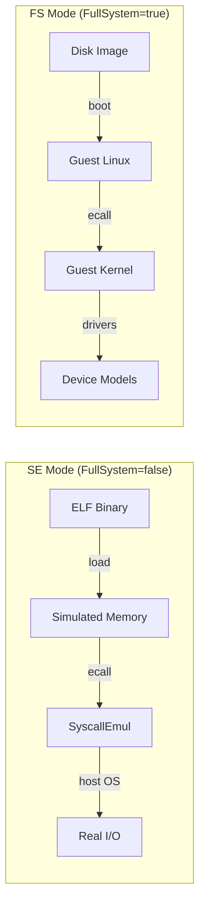
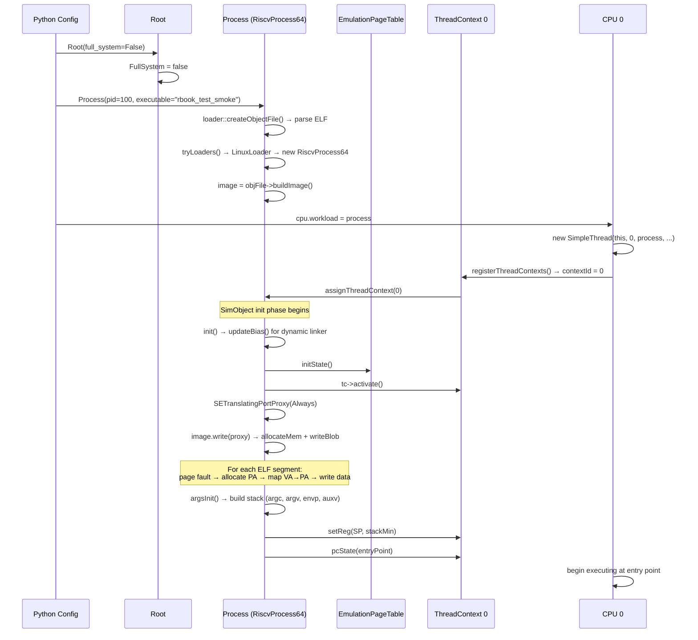
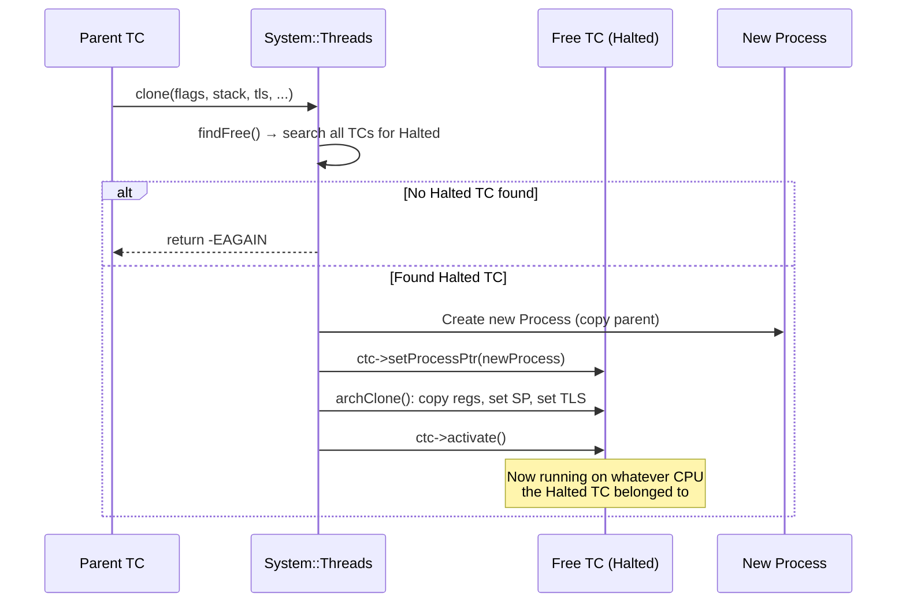
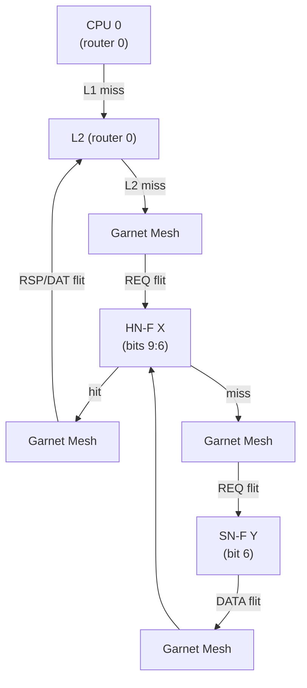
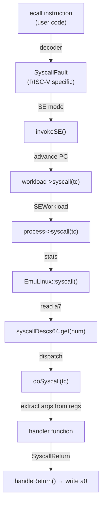

# SE Mode in gem5 — A Practitioner's Guide for the 4x4 CHI Mesh

This document explains gem5's SE (Syscall Emulation) mode in depth, with
a focus on what you need to know to write the five test programs specified in
[Ch17 Stage 3](../Ch17_FinalProject.md).

*Intuition → Working Model → Code* layering applies throughout.
Cross-references use `file:line` notation — click them in VS Code.

---

## Table of Contents

1. [What SE Mode Is](#1-what-se-mode-is)
2. [SE Mode Startup: From `m5.simulate()` to First Instruction](#2-se-mode-startup)
3. [Memory Allocation](#3-memory-allocation)
4. [Processes and Threads](#4-processes-and-threads)
5. [The 4×4 Mesh System Configuration](#5-the-4x4-mesh-system)
6. [Syscall Emulation](#6-syscall-emulation)
7. [RISC-V Specifics](#7-risc-v-specifics)
8. [Debugging, Tracing, and Statistics](#8-debugging-tracing-and-statistics)
9. [Program Termination](#9-program-termination)
10. [Practical Pitfalls and Recipes](#10-practical-pitfalls-and-recipes)

---

## 1. What SE Mode Is

### Intuition

SE mode is a *guest-kernel-less* simulation mode.
Instead of booting Linux inside the simulator, gem5 loads your ELF binary
directly and *impersonates the kernel* for every system call.
Think of it as running your program under a very thin hypervisor that only
handles `ecall`/`syscall` — no scheduler, no page fault handler, no device
drivers.

### Working Model

The global boolean `FullSystem` decides everything:
- `FullSystem == false` → SE mode (simulator = kernel)
- `FullSystem == true`  → FS mode (real guest OS = kernel)

Set during `Root` creation: [src/sim/root.cc:232](../../src/sim/root.cc#L232).



### Benefits

| Benefit | Why it matters for test programs |
|---------|---------------------------------|
| No disk image / kernel | One command to run, no rootfs setup |
| Instant startup | No 2-minute boot; you iterate fast |
| Minimal config | 16 CPUs + Ruby + binary = done |
| Host file I/O | `printf` just works on your terminal |

### Limitations

| Limitation | Impact on test programs |
|-----------|------------------------|
| No real OS | No `/proc`, no `sched_setaffinity()`, no real signals |
| No dynamic linking (RISC-V) | Must use `-static` |
| Limited syscall coverage | Avoid `prctl`, System V IPC, `epoll`, `timer_*` |
| No OS scheduler | Threads are pinned to cores at config time; no migration |
| No page protection | `mprotect` is silently ignored |
| No privilege traps | Only user-mode instructions are emulated |
| Checkpoint limits | Pipes, sockets, device state do not checkpoint |

### Code

- `FullSystem` declaration: [src/sim/full_system.hh:36](../../src/sim/full_system.hh#L36)
- `Root` sets it: [src/sim/root.cc:232](../../src/sim/root.cc#L232)
- SE mode config example: [configs/deprecated/example/se.py:297](../../configs/deprecated/example/se.py#L297)
- SE mode test: [tests/gem5/se_mode/hello_se/configs/simple_binary_run.py](../../tests/gem5/se_mode/hello_se/configs/simple_binary_run.py)

---

## 2. SE Mode Startup

### Intuition

The simulator needs to get from "a Python config script" to "CPU 0 is
executing the first instruction of `main()`". That transition involves:
(1) creating a `Process` object from the ELF, (2) mapping the binary's
segments into simulated memory, (3) building the initial stack, and
(4) setting PC and SP in the first ThreadContext.

### Working Model



### Step-by-step

**1. Root creation.** `Root(full_system=False)` sets the `FullSystem` flag.
[src/sim/root.cc:232](../../src/sim/root.cc#L232)

**2. Process creation.** `ProcessParams::create()` in
[src/sim/process.cc:571](../../src/sim/process.cc#L571):
- Calls `loader::createObjectFile(exec)` to parse the ELF
- Calls `Process::tryLoaders()` which finds the `LinuxLoader`
- `LinuxLoader` checks arch/OS and creates `RiscvProcess64` or `RiscvProcess32`
([src/arch/riscv/linux/se_workload.cc:60](../../src/arch/riscv/linux/se_workload.cc#L60))

**3. Process constructor.** [src/sim/process.cc:113](../../src/sim/process.cc#L113):
- Creates `EmulationPageTable` with `PageBytes = 4096`
- Initializes `MemState` (stack, heap, mmap boundaries)
- Builds `image = objFile->buildImage()` — the collection of ELF segments
- Registers PID with System

**4. CPU thread creation.** Each CPU creates a `SimpleThread` initialized with
`workload[i]` as its Process. For our config: all 16 CPUs share the same
`Process` object.
[src/cpu/simple/base.cc:90](../../src/cpu/simple/base.cc#L90)

**5. ThreadContext registration.** `BaseCPU::registerThreadContexts()` registers
each TC with `System::Threads`, getting a sequential `contextId` (0, 1, 2, ...).
Then links Process → TC via `assignThreadContext()`.
[src/cpu/base.cc:493](../../src/cpu/base.cc#L493)

**6. Process::initState().** [src/sim/process.cc:289](../../src/sim/process.cc#L289):
- Activates **only** `contextIds[0]` — the first ThreadContext
- Creates `SETranslatingPortProxy(Always)` — a memory proxy that auto-allocates pages on write
- Writes the ELF image into simulated memory: `image.write(*initVirtMem)`
- Each segment triggers: VA translation miss → `allocateMem()` → map page → write data

**7. RiscvProcess64::initState().** [src/arch/riscv/process.cc:97](../../src/arch/riscv/process.cc#L97):
- Calls `argsInit<uint64_t>(PageBytes)` which builds the initial stack
- Sets privilege mode to `PRV_U` for every context
- Validates MISA has both U and S modes

**8. argsInit — stack construction.** [src/arch/riscv/process.cc:135](../../src/arch/riscv/process.cc#L135):
- Writes 16 random bytes (for `AT_RANDOM` auxv)
- Pushes argv strings, envp strings
- Pushes aux vector: `AT_ENTRY`, `AT_PHNUM`, `AT_PHDR`, `AT_PAGESZ`, `AT_RANDOM`
- Pushes argc, argv pointers, envp pointers
- Sets SP = `memState->getStackMin()`
- Sets PC = `getStartPC()` (ELF entry point)

At this point CPU 0 starts fetching instructions at the ELF entry point.

### What about the other 15 CPUs?

When the **same** Process is assigned to all 16 CPUs (our config pattern),
`Process::initState()` only activates `contextIds[0]`.
The other 15 ThreadContexts remain `Halted`.
They will only start executing when:
- A `clone()` syscall picks up a Halted TC, or
- The configuration script manually activates them (not our case)

This is critical for the barrier test (3e): you cannot just assign one
Process and expect all 16 cores to start running. You need either
multi-process assignment or runtime `clone()`.

---

## 3. Memory Allocation

### 3.1 Virtual Address Space Layout (RISC-V 64-bit)

```
VA Space Layout for RiscvProcess64
═════════════════════════════════════════════════════════
0x7FFFFFFFFFFFFFFF ┌──────────────┐
                   │  Stack        │ ← stack_base, grows DOWN
                   │  (max 8 MiB)  │
                   ├──────────────┤ ← stackMin (grows on fault)
                   │              │
                   │  (free)      │
                   │              │
0x4000000000000000 ├──────────────┤ ← mmap_end
                   │  mmap region │ ← grows UPWARD (RISC-V specific!)
                   │              │
                   │  (free)      │
                   ├──────────────┤ ← brk_point (heap end)
                   │  Heap        │ ← grows UP via brk()
                   ├──────────────┤ ← roundUp(image.maxAddr(), 4096)
                   │  BSS          │ ← zero-filled (memsz > filesz)
                   │  Data         │ ← ELF PT_LOAD segment
                   │  Text         │ ← ELF PT_LOAD segment
0x10000            └──────────────┘ ← typical ELF p_paddr for RISC-V
```

Source: [src/arch/riscv/process.cc:71](../../src/arch/riscv/process.cc#L71)

**Key RISC-V oddity:** `mmapGrowsDown()` returns **false**.
Most other ISAs (x86, ARM) have mmap growing downward from just below the
stack. RISC-V grows it upward from `0x4000000000000000`.
[src/arch/riscv/process.hh:59](../../src/arch/riscv/process.hh#L59)

### 3.2 How ELF Is Loaded into Memory

```
ELF File                     Simulated Memory
════════                     ════════════════

PT_LOAD segment 0:           VA 0x10000 → PA (from pool 0)
  p_paddr = 0x10000           ├─ writeBlob(data, filesz bytes)
  p_filesz = 0x1234           └─ memsetBlob(0,   bss bytes)
  p_memsz  = 0x2000

PT_LOAD segment 1:           VA 0x12000 → PA (from pool 0)
  p_paddr = 0x12000           └─ writeBlob(data, filesz bytes)
```

The flow for each ELF segment:

1. `ElfObject::handleLoadableSegment()` creates a `MemoryImage::Segment`
   at `base = phdr.p_paddr` with the file data.
   [src/base/loader/elf_object.cc:373](../../src/base/loader/elf_object.cc#L373)

2. `Process::initState()` calls `image.write(*initVirtMem)` which calls
   `writeBlob(vaddr, data, size)` for each segment.
   [src/sim/process.cc:306](../../src/sim/process.cc#L306)

3. `writeBlob` needs to translate VA → PA. The `SETranslatingPortProxy(Always)`
   mode intercepts the translation fault and calls
   `process->allocateMem(vaddr, size)`.
   [src/mem/se_translating_port_proxy.cc:54](../../src/mem/se_translating_port_proxy.cc#L54)

4. `allocateMem()` allocates a physical page from the MemPool and maps it:
   [src/sim/process.cc:318](../../src/sim/process.cc#L318)
   - `paddr = seWorkload->allocPhysPages(npages)` — gets PA from pool 0
   - `pTable->map(page_addr, paddr, pages_size, flags)` — VA → PA mapping

5. `writeBlob` retries with the now-valid mapping and writes data to
   the physical memory.

**BSS (uninitialized data):** If `p_memsz > p_filesz`, the excess is
zero-filled via `memsetBlob(seg.base + p_filesz, 0, uninitialized)`.
[src/base/loader/memory_image.cc:38](../../src/base/loader/memory_image.cc#L38)

### 3.3 Physical Page Allocation: The MemPool System

This is where your 2-DDR-controller system matters.

**`SEWorkload::setSystem()`** populates memory pools from the system's
physical address ranges: [src/sim/se_workload.cc:43](../../src/sim/se_workload.cc#L43)

```
SEWorkload::setSystem()
  → sys->getPhysMem().getConfAddrRanges()   ← returns address ranges
  → memPools.populate(ranges)               ← one MemPool per range
```

**`MemPools::populate()`**: [src/sim/mem_pool.cc:155](../../src/sim/mem_pool.cc#L155)
```
for each range in memories:
    pools.emplace_back(pageShift, range.start, range.end)
```

**`allocPhysPages(npages, pool_id=0)`**: Always defaults to pool 0.
[src/sim/se_workload.hh:92](../../src/sim/se_workload.hh#L92)

### 3.4 Two DDR Controllers: Where Does Your Data Actually Live?

Your 4×4 mesh has 2 DDR controllers at routers 0 and 15 with address
interleaving. But the SE mode memory allocation system doesn't know about
this interleaving in the same way.

The key is `PhysicalMemory::getConfAddrRanges()`:
[src/mem/physical.cc:278](../../src/mem/physical.cc#L278)

When Ruby sets up 2 DDR controllers with interleaving (cache-line striped),
the two interleaved address ranges are **merged** into a single contiguous
range by `getConfAddrRanges()`. This merged range becomes **one** MemPool.

```
DDR0 (router 0):  even cache lines  [0x0, 0x100000000) interleaved
DDR1 (router 15): odd  cache lines  [0x0, 0x100000000) interleaved
                                      ↓
getConfAddrRanges() → single merged range [0x0, 0x200000000)
                                      ↓
MemPools::populate() → one pool covering the full 512 MiB
```

So page allocation proceeds sequentially from the start of this single
merged range. A page allocated at PA 0x0 routes to DDR0, the next page at
PA 0x1000 routes to DDR1 (because of bit-6 interleaving), and so on.

**The interleaving happens at the Ruby/network level, not at the
allocation level.** The allocator just hands out consecutive physical pages;
the mesh routing logic decides which DDR controller each cache line
reaches based on the address bits.

```
Physical Page Allocation          Cache Line Routing (bit 6)
═══════════════════════          ════════════════════════════

PA 0x0000 → pool 0              CL @ PA 0x0000 → DDR0 (bit6=0)
PA 0x1000 → pool 0              CL @ PA 0x0040 → DDR1 (bit6=1)
PA 0x2000 → pool 0              CL @ PA 0x0080 → DDR0 (bit6=0)
PA 0x3000 → pool 0              CL @ PA 0x00C0 → DDR1 (bit6=1)
...                             ...
```

This means program data (text, data, BSS, heap, stack) is **automatically
spread across both DDR controllers** at the cache-line granularity —
exactly what you want for the smoke test (3a).

### 3.5 Static vs Dynamic Memory: Text, Data, BSS, Stack, Heap

| Region | When allocated | How it grows | Physical backing |
|--------|---------------|-------------|------------------|
| **Text** | `initState()` — `image.write()` | Fixed | Immediately allocated |
| **Data** | `initState()` — `image.write()` | Fixed | Immediately allocated |
| **BSS** | `initState()` — `memsetBlob(0)` | Fixed | Immediately allocated |
| **Stack** | `argsInit()` maps initial pages | Downward on fault | Lazy: `fixupFault()` allocates on access |
| **Heap** | `brk()` syscall moves brk_point | Upward via `brk()` | Lazy: VMA created; pages on fault |
| **mmap** | `mmap()` syscall | Upward (RISC-V) | Lazy: VMA created; pages on fault |

**Lazy allocation** means that `brk()` or `mmap()` only creates a VMA
(Virtual Memory Area) entry in `MemState`. The actual page table mapping
and physical page allocation happen when the program first touches the
page, triggering a page fault handled by
`MemState::fixupFault()`: [src/sim/mem_state.cc:386](../../src/sim/mem_state.cc#L386)

### 3.6 The brk() Syscall (Heap Management)

[src/sim/syscall_emul.cc:277](../../src/sim/syscall_emul.cc#L277)

- `brk(0)` returns the current break point
- `brk(addr > current)` extends the heap: `mapRegion(old, new - old, "heap")`
- `brk(addr < current)` shrinks the heap: `unmapRegion()` for freed pages
- The initial brk point = `roundUp(image.maxAddr(), PageBytes)`

The heap starts right after the end of the ELF image.

### 3.7 The mmap() Syscall

[src/sim/syscall_emul.hh:2116](../../src/sim/syscall_emul.hh#L2116)

- `MAP_ANONYMOUS | MAP_PRIVATE`: anonymous private mapping (malloc uses this)
- `MAP_FIXED`: use exact address (unmaps existing first)
- If no free range at hint: `extendMmap(length)` grows from `mmap_end`
- For RISC-V: `mmap_end = 0x4000000000000000`, grows upward

### 3.8 Stack Growth

When a load/store accesses an address below the current `stackMin`:
1. CPU raises a `GenericPageTableFault`
2. `Process::fixupFault(vaddr)` checks if address is in stack VMA
3. If within `[stackBase - maxStackSize, stackMin)`, extends `stackMin`
   downward and calls `allocateMem()` for each new page
4. The access retries

[src/sim/mem_state.cc:386](../../src/sim/mem_state.cc#L386)

### 3.9 The EmulationPageTable

SE mode uses a **software page table** — a `std::unordered_map` from
virtual page number to `{paddr, flags}`. No multi-level hardware page table
walks, no TLB shootdowns, no ASIDs.

[src/mem/page_table.hh:53](../../src/mem/page_table.hh#L53)

Translation: `pageAlign(vaddr)` → hash lookup → `paddr = entry.paddr + pageOffset(vaddr)`
[src/mem/page_table.cc:142](../../src/mem/page_table.cc#L142)

---

## 4. Processes and Threads

### 4.1 The Three Core Classes

```
┌─────────────┐        1:N        ┌──────────────────┐
│   Process   │◄──────────────────│  ThreadContext    │
│ (SimObject) │  contextIds[]     │ (per-CPU thread)  │
└──────┬──────┘                   └────────┬─────────┘
       │                                    │
       │ shares                              │ bound to
       ▼                                    ▼
┌──────────────┐                    ┌──────────────┐
│EmulationPT   │                    │   BaseCPU    │
│ FDArray      │                    │  (cpu0...)   │
│ MemState     │                    └──────────────┘
└──────────────┘
```

- **Process** ([src/sim/process.hh:66](../../src/sim/process.hh#L66)):
  Owns page table, FD array, MemState. Has `contextIds[]` listing all TCs.
- **ThreadContext** ([src/cpu/thread_context.hh:72](../../src/cpu/thread_context.hh#L72)):
  External interface to CPU thread state. Has `cpuId()`, `contextId()`,
  `getProcessPtr()`.
- **BaseCPU** ([src/cpu/base.cc](../../src/cpu/base.cc)):
  Owns ThreadContexts. In SE mode, `workload.size() == numThreads` is required.

### 4.2 How Processes Map to CPUs at Configuration Time

The `workload` parameter on each CPU is `VectorParam.Process`:
[src/cpu/BaseCPU.py:129](../../src/cpu/BaseCPU.py#L129)

**Critical constraint** (checked in BaseCPU constructor):
[src/cpu/base.cc:185](../../src/cpu/base.cc#L185)
```
workload.size() must equal numThreads
```
In SE mode, each CPU thread gets exactly one Process.

### 4.3 Three Assignment Patterns

**Pattern A: Same Process on all CPUs** (our rbook_mesh_config.py)

```python
process = Process(pid=100, executable=binary_path, ...)
for cpu in system.cpu:
    cpu.workload = process    # same object, shared
```

- All 16 CPUs share one Process (one PID, one page table, one FD array)
- Only TC 0 is activated by `initState()`
- Other 15 TCs are Halted — available for `clone()`
- [configs/example/rbook_mesh_config.py:80](../../configs/example/rbook_mesh_config.py#L80)

**Pattern B: N Different Processes on N CPUs**

```python
for i in range(num_cpus):
    system.cpu[i].workload = multiprocesses[i]
```

- Each CPU gets its own Process (separate PID, page table, FDs)
- All N CPUs start executing immediately
- [configs/deprecated/example/se.py:241](../../configs/deprecated/example/se.py#L241)

**Pattern C: SMT (multiple processes on one O3 CPU)**

```python
system.cpu[0].workload = [proc0, proc1, ...]  # multiple on one CPU
```

- Requires `DerivO3CPU` with `numThreads > 1`
- Mutually exclusive with multiple CPUs
- O3CPU fetches round-robin among active threads

### 4.4 Can I Have Multiple Processes Running in Parallel?

**Yes.** Use Pattern B above. Each CPU gets its own Process, and all run
concurrently from tick 0. This is the simplest way to get 16 cores active
without depending on `clone()`.

### 4.5 How Threads Are Mapped to Cores

**Fixed at configuration time. No migration.**

1. CPUs register ThreadContexts in order: CPU0 registers first (gets
   contextId 0), CPU1 next (contextId 1), etc.
   [src/sim/system.cc:93](../../src/sim/system.cc#L93)

2. Each CPU's thread `i` gets `workload[i]` as its Process.
   [src/cpu/simple/base.cc:90](../../src/cpu/simple/base.cc#L90)

3. A ThreadContext is permanently bound to its CPU for the entire simulation.

```
CPU 0 (cpu_id=0) → TC(contextId=0) → Process A
CPU 1 (cpu_id=1) → TC(contextId=1) → Process A  (same Process shared)
CPU 2 (cpu_id=2) → TC(contextId=2) → Process A
...
CPU 15 (cpu_id=15) → TC(contextId=15) → Process A
```

### 4.6 How to Determine Which Core a Thread Runs On

From C code in the simulated program:

| Method | Returns | Syscall |
|--------|---------|---------|
| `sched_getcpu()` / `getcpu()` | `contextId` (NOT cpuId!) | `getcpu` syscall |
| `riscv_hwprobe()` | CPU features (not core ID) | syscall 258 |

**Warning:** `getcpu` returns `contextId`, which equals `cpuId` only when
there is exactly one thread context per CPU (no SMT).
[src/sim/syscall_emul.cc:1442](../../src/sim/syscall_emul.cc#L1442)

From the simulator (C++ or debug output):

- `tc->cpuId()` — the CPU index
- `tc->contextId()` — system-wide sequential context ID
- `tc->getCpuPtr()` — pointer to the BaseCPU

### 4.7 How clone() / pthread_create() Works

The `clone()` syscall is the mechanism for creating new threads at runtime.
[src/sim/syscall_emul.hh:1833](../../src/sim/syscall_emul.hh#L1833)



Key details:
- `findFree()` searches **all** TCs system-wide — the child could end up
  on any CPU, not necessarily the parent's CPU
  [src/sim/system.cc:120](../../src/sim/system.cc#L120)
- With `CLONE_VM`: child shares parent's page table (threads)
- With `CLONE_FILES`: child shares parent's FD array
- With `CLONE_THREAD`: child joins parent's thread group
- RISC-V `archClone()`: [src/arch/riscv/linux/linux.hh:309](../../src/arch/riscv/linux/linux.hh#L309)
  copies all registers, sets SP from `clone()` argument, sets TLS

**For our test programs (3c, 3d, 3e):**
The shared-Process pattern (Pattern A) means we start with 15 Halted TCs.
`clone()` will pick them up in order (contextId 1, 2, 3, ...).
Thread 1 runs on CPU 1, Thread 2 on CPU 2, etc. — convenient for our
router-to-core mapping.

### 4.8 How Core to Run Thread Is Selected

**Configuration time:** Deterministic. `workload[i]` → thread `i` on that CPU.

**Runtime (clone):** Whichever Halted TC `findFree()` returns. This is the
first Halted TC in the system-wide list, which is the lowest-numbered
contextId that's still Halted. Since contextIds are assigned in CPU order
(0, 1, 2, ..., 15), the first `clone()` picks CPU 1, the second picks
CPU 2, etc.

**There is no OS scheduler, no load balancing, no CPU migration.**

### 4.9 The Pattern A Activation Problem and Solutions

With Pattern A (same Process shared across all CPUs), only contextId 0
starts active. You need one of these approaches:

**Approach 1: clone() in C code (used by 3c, 3d, 3e)**
```c
pthread_create(&thread, &attr, worker_func, arg);
```
This calls `clone()` which picks up a Halted TC.

**Approach 2: N separate Processes (alternative for 3e)**
```python
for i in range(16):
    system.cpu[i].workload = Process(pid=100+i, executable=path, cmd=[path])
```
Each CPU starts independently with its own address space. But this means
they don't share memory — not useful for barrier or false sharing tests.

**Approach 3: Same binary, same Process, but rely on getcpu/clone**

This is what Ch17 uses: one Process, 16 CPUs, `clone()` to activate workers.

---

## 5. The 4×4 Mesh System

This section describes the specific system configured by
[rbook_mesh_config.py](../../configs/example/rbook_mesh_config.py)
and [rbook_4x4.py](../../configs/example/noc_config/rbook_4x4.py).

### 5.1 Topology

```
  Router Layout (row-major)
  ─────────────────────────

  0 ─── 1 ─── 2 ─── 3       DDR0 @ router 0
  │     │     │     │
  4 ─── 5 ─── 6 ─── 7       Each tile = 1 RN-F + 1 HN-F
  │     │     │     │
  8 ─── 9 ── 10 ── 11
  │     │     │     │
 12 ── 13 ── 14 ── 15       DDR1 @ router 15
```

- 16 mesh routers (row-major, 0–15)
- 16 bridge routers (one per RN-F, zero-latency)
- 48 unidirectional IntLinks (24 bidirectional pairs)
- XY dimension-ordered routing (TABLE algorithm)

### 5.2 Components

| Component | Count | Location | Key params |
|-----------|-------|----------|------------|
| TimingSimpleCPU | 16 | One per tile | 2 GHz, RV64 |
| L1 I-Cache | 16 | Per core | 32 KiB, 2-way, 1-cycle |
| L1 D-Cache | 16 | Per core | 64 KiB, 2-way, 2-cycle |
| L2 Cache | 16 | Private per core | 2 MiB, 8-way, 6-cycle |
| HN-F (LLC slice) | 16 | Co-located per tile | 1 MiB each, 16-way, 10-cycle |
| SN-F (DDR ctrl) | 2 | Routers 0, 15 | DDR3-1600 |
| MN | 1 | Router 0 | DVM only (idle in SE) |

Source: [configs/example/rbook_mesh_config.py:41](../../configs/example/rbook_mesh_config.py#L41),
[configs/ruby/CHI_config.py:62](../../configs/ruby/CHI_config.py#L62)

### 5.3 Address Interleaving

**HN-F interleaving (16 slices):**
- Bits [9:6] select which of the 16 HN-Fs owns a cache line
- `intlvHighBit = 9`, `intlvBits = 4`, `intlvMatch = HNF_index`
- LLC `start_index_bit = 10` (indexing above interleaving bits)
- [ruby-book/final/stage1-2.md:280](../final/stage1-2.md#L280)

**SN-F interleaving (2 DDR controllers):**
- Bit 6 selects which DDR controller handles a cache line
- `num_dirs = 2` → `dir_bits = 1`
- Even cache lines → DDR0 (router 0), Odd → DDR1 (router 15)

### 5.4 How a CPU Access Reaches Memory



For the hop-latency test (3b):
- HN-F 0 is at router 0 → 0 hops from CPU 0
- HN-F 15 is at router 15 → 6 hops (3 right + 3 down) from CPU 0
- Each hop = `router_latency` (1 cycle) + `link_latency` (1 cycle) per direction

### 5.5 CHI Protocol Virtual Networks

| VNet | Channel | Message types | VC count |
|------|---------|---------------|----------|
| 0 | REQ | ReadShared, ReadUnique, ... | 4 |
| 1 | SNP | SnpShared, SnpUnique, SnpCleanInvalid | 4 |
| 2 | RSP | CompAck, SnpResp, ... | 4 |
| 3 | DAT | CompData, DataSepResp | 4 |

Source: [configs/ruby/CHI.py:237](../../configs/ruby/CHI.py#L237)

### 5.6 Garnet Parameters

| Parameter | Value | Source |
|-----------|-------|--------|
| `router_latency` | 1 cycle | CHI_config.NoC_Params |
| `router_link_latency` | 1 cycle | CHI_config.NoC_Params |
| `node_link_latency` | 1 cycle | CHI_config.NoC_Params |
| `vcs_per_vnet` | 4 | Network.py |
| `link_width_bits` | 128 (16 bytes) | Network.py |
| `data_width` | 32 bytes (256 bits) | CHI_config.NoC_Params |
| `cntrl_msg_size` | 8 bytes | CHI_config.NoC_Params |
| `routing_algorithm` | 0 (TABLE) | Network.py |
| `garnet_deadlock_threshold` | 50000 | Network.py |

A 64-byte cache line = 2 data flits on the 32-byte data channel.

### 5.7 Downstream Wiring

```
RN-F (L1 controllers)
  ↓ downstream = [all 16 HN-F controllers]

HN-F (LLC controllers)
  ↓ downstream = [all 2 SN-F controllers]
```

Source: [configs/ruby/CHI.py:221](../../configs/ruby/CHI.py#L221)

---

## 6. Syscall Emulation

### 6.1 The Syscall Interception Chain



### 6.2 RISC-V Syscall Register Convention

| Register | Role | Symbolic name |
|----------|------|----------------|
| `a7` (x17) | Syscall number | `SyscallNumReg` |
| `a0`–`a5` (x10–x15) | Arguments 1–6 | `ArgumentRegs[]` |
| `a0` (x10) | Return value | `ReturnValueReg` |

Source: [src/arch/riscv/regs/int.hh:143](../../src/arch/riscv/regs/int.hh#L143)

### 6.3 RISC-V Syscall Dispatch

[src/arch/riscv/linux/se_workload.cc:94](../../src/arch/riscv/linux/se_workload.cc#L94):
1. Increment `numSyscalls` stat
2. Read syscall number from `a7`
3. Look up in `syscallDescs64` (RV64) or `syscallDescs32` (RV32)
4. `doSyscall(tc)` → execute handler → write return to `a0`

### 6.4 Syscall Handler Categories

| Category | Behavior | Examples |
|----------|----------|---------|
| **Implemented** | Executes real host operation | `write`, `read`, `openat`, `close`, `brk`, `mmap`, `clone`, `exit`, `exit_group`, `futex`, `clock_gettime`, `uname`, `getcpu`, `riscv_hwprobe` |
| **Ignored (return 0)** | Silently succeeds | `mprotect`, `msync`, `madvise`, `setrlimit`, `setuid`, `mbind` |
| **Ignored with warning** | Returns 0, warns once | `rt_sigaction`, `rt_sigprocmask`, `sched_yield`, `nanosleep`, `set_robust_list` |
| **Returns -ENOSYS** | "Not implemented" | `rseq` |
| **Unimplemented (fatal)** | Calls `fatal()` — crash | `io_setup`, `epoll_ctl`, `mount`, `pivot_root`, many more |

Source: [src/arch/riscv/linux/se_workload.cc:529](../../src/arch/riscv/linux/se_workload.cc#L529)

### 6.5 Syscalls Your Test Programs Will Use

For a statically-linked C program with pthreads:

| Syscall | Number (RV64) | Why it's called |
|---------|---------------|-----------------|
| `write` | 64 | `printf` / `puts` |
| `exit_group` | 94 | `exit()` / `return from main` |
| `brk` | 214 | `malloc` / heap growth |
| `mmap` | 222 | Thread stacks (pthread), large malloc |
| `clone` / `clone3` | 220 / 435 | `pthread_create` |
| `futex` | 98 | `pthread_mutex`, `pthread_join`, barrier |
| `mprotect` | 226 | Thread local storage setup (ignored) |
| `set_robust_list` | 99 | Thread setup (ignored) |
| `rt_sigaction` | 134 | Signal mask setup (ignored) |
| `rt_sigprocmask` | 135 | Signal mask (ignored) |
| `riscv_hwprobe` | 258 | glibc CPU feature detection |
| `set_tid_address` | 96 | Thread ID setup |
| `clock_gettime` | 113 | Timing (if using `clock()`) |
| `getrandom` | 278 | Stack canary initialization |

The "ignored" syscalls are harmless — they return 0 and your program
continues. The critical ones are `write` (for output), `exit_group` (for
termination), `brk`/`mmap` (for memory), and `clone`/`futex` (for threads).

### 6.6 Syscall Retry Mechanism

If a syscall returns `SyscallReturn::retry()`, the thread is suspended and
a retry event is scheduled ~100 CPU cycles later.
[src/sim/syscall_desc.cc:80](../../src/sim/syscall_desc.cc#L80)

This can happen with non-blocking I/O or certain timing-sensitive syscalls.
Your test programs are unlikely to hit this.

---

## 7. RISC-V Specifics

### 7.1 Process Hierarchy

```
Process
  └── RiscvProcess                    [src/arch/riscv/process.hh:51]
        ├── RiscvProcess64             [line 65]  ← our target
        └── RiscvProcess32             [line 74]
```

### 7.2 Address Space Constants (RV64)

| Constant | Value | Source |
|----------|-------|--------|
| `stack_base` | `0x7FFFFFFFFFFFFFFF` | [process.cc:75](../../src/arch/riscv/process.cc#L75) |
| `mmap_end` | `0x4000000000000000` | [process.cc:79](../../src/arch/riscv/process.cc#L79) |
| `PageBytes` | 4096 | [page_size.hh:54](../../src/arch/riscv/page_size.hh#L54) |
| `mmapGrowsDown()` | **false** | [process.hh:59](../../src/arch/riscv/process.hh#L59) |

### 7.3 Privilege Mode

SE mode runs in `PRV_U` (user mode). Both U and S modes must be enabled
in MISA, because `ecall` from U-mode triggers a trap that needs S-mode
infrastructure (even though SE mode intercepts it before real trap handling).

[src/arch/riscv/process.cc:111](../../src/arch/riscv/process.cc#L111)

### 7.4 No Hardware Page Tables

SE mode always uses `EmulationPageTable`. The `useArchPT` parameter must
be false:
[src/arch/riscv/process.cc:68](../../src/arch/riscv/process.cc#L68)

### 7.5 riscv_hwprobe Syscall

The only RISC-V-specific syscall. Returns CPU feature info. glibc calls
this at startup.
[src/arch/riscv/linux/se_workload.cc:514](../../src/arch/riscv/linux/se_workload.cc#L514)

### 7.6 rdcycle CSR for Timing

For the hop-latency test (3b), you'll use `rdcycle`:

```c
unsigned long cyc;
asm volatile("csrr %0, cycle" : "=r"(cyc));
```

`rdcycle` reads the `mcycle` CSR. In gem5, this corresponds to the
simulated cycle count. The exact relationship between CSR cycles and
simulated ticks depends on the CPU clock frequency.

### 7.7 Fence Instructions for Memory Ordering

For the producer-consumer test (3d):

| Instruction | Meaning | Use |
|-------------|---------|-----|
| `fence rw, w` | Release fence | Before writing the flag |
| `fence r, rw` | Acquire fence | After reading the flag |
| `fence iorw, iorw` | Full fence | General barrier |

In C11 atomics:
- `atomic_store_explicit(&flag, 1, memory_order_release)` → `fence rw,w` + store
- `atomic_load_explicit(&flag, memory_order_acquire)` → load + `fence r,rw`

---

## 8. Debugging, Tracing, and Statistics

### 8.1 Instruction Tracing

**Master switch:** You must enable `ExecEnable` for any instruction tracing.

| Flag | What it shows |
|------|---------------|
| `ExecEnable` | Master switch (required) |
| `ExecAll` | Everything |
| `ExecUser` | User-mode instructions only |
| `ExecEffAddr` | Effective (virtual) address |
| `ExecResult` | Result value |
| `ExecSymbol` | Symbol name (if available) |

```bash
# Trace all user instructions with addresses
./build/RISCV/gem5.opt --debug-flags=ExecEnable,ExecUser,ExecEffAddr,ExecResult \
    -d m5out/trace-$(date +%Y%m%d-%H%M%S) \
    configs/example/rbook_mesh_config.py --cmd=ruby-book/final/rbook_test_smoke
```

### 8.2 Syscall Tracing

| Flag | What it shows |
|------|---------------|
| `SyscallBase` | Entry/exit of each syscall |
| `SyscallVerbose` | Arguments and return values |
| `SyscallAll` | Both |

[src/sim/SConscript:155](../../src/sim/SConscript#L155)

```bash
./build/RISCV/gem5.opt --debug-flags=SyscallAll ...
```

### 8.3 Other Useful Debug Flags

| Flag | Purpose |
|------|---------|
| `PseudoInst` | m5ops (m5_exit, m5_reset_stats) |
| `Loader` | ELF loading details |
| `Vma` | Virtual memory area changes |
| `Context` | Thread context status changes |
| `Ruby` | Ruby cache controller events |
| `Garnet` | Network/flit-level detail |

### 8.4 Controlling Trace Output

```bash
# Time-filtered trace
--debug-start=100000 --debug-end=200000

# Redirect to file
--debug-file=trace.out

# Multiple flags
--debug-flags=SyscallAll,Ruby,Garnet
```

### 8.5 Statistics and m5ops

**From C code:**

```c
#include <gem5/m5ops.h>

m5_reset_stats(0, 0);  // reset stats from this point
// ... measurement region ...
m5_dump_stats(0, 0);   // dump stats now
```

Compile with `-DM5` and link with the m5op library, or just include the
inline assembly. For RISC-V cross-compilation:
```bash
riscv64-linux-gnu-gcc -O2 -static -DM5 -I/path/to/gem5/include \
    -L/path/to/gem5/util/m5/build/riscv -lm5 \
    -o test test.c
```

**From Python:**

After `m5.simulate()`, check `exit_event.getCode()` for the program's
exit status.

### 8.6 Key Statistics for Test Programs

For the 5 Ch17 test programs, these are the statistics to check:

**Smoke test (3a):**
- `L3Cache_Controller.m_demand_hits` + `m_demand_misses` — per-HN-F access counts
- Should be nonzero and roughly balanced across all 16 HN-Fs

**Hop latency (3b):**
- `L1_DCache_Controller.m_demand_misses` — every read is a miss (cold + flushed)
- Garnet per-link `flit_count` — verify diagonal path activation
- `average_flit_latency` — should differ between near and far

**False sharing (3c):**
- `L1_DCache_Controller` — transitions involving SnpUnique/SnpCleanInvalid
- `L3Cache_Controller` — snoop-related stats
- Garnet link traffic on diagonal path

**Producer-consumer (3d):**
- `L3Cache_Controller` — data-from-peer (snoop forward) vs data-from-memory
- Garnet flit latency for the handoff path

**Barrier (3e):**
- `L1_DCache_Controller` — atomic operation + invalidation counts
- Garnet per-router `buffer_usage` — interior vs corner routers
- DDR controller stats — balanced load between DDR0 and DDR1

### 8.7 GDB Remote Debugging

RISC-V SE mode supports remote GDB:
[src/arch/riscv/se_workload.hh:53](../../src/arch/riscv/se_workload.hh#L53)

```bash
# In simulation:
./build/RISCV/gem5.opt --remote-gdb-port=7000 ...

# In another terminal:
riscv64-linux-gnu-gdb ./rbook_test_smoke
(gdb) target remote :7000
(gdb) break main
(gdb) continue
```

---

## 9. Program Termination

### 9.1 Three Exit Mechanisms

| Mechanism | How | Exit code | When to use |
|-----------|-----|-----------|-------------|
| `exit_group(status)` | `return status;` or `exit(status)` in C | `status & 0xff` | Normal termination |
| `m5_exit(delay)` | `m5_exit(0)` from C code | 0 | Bypassing libc exit |
| `m5_fail(delay, code)` | `m5_fail(0, 1)` from C code | `code` | Explicit failure signaling |

### 9.2 exit_group Implementation

[src/sim/syscall_emul.cc:126](../../src/sim/syscall_emul.cc#L126)

1. If `childClearTID` set: futex wake at that address
2. For `exit_group`: halt all threads in the thread group
3. Send SIGCHLD to parent (if ppid != 0)
4. Close all non-stdio FDs
5. Halt the calling ThreadContext
6. If no active TCs remain: `exitSimLoop("exiting with last active thread context", status & 0xff)`

### 9.3 m5op Assembly (RISC-V)

[src/util/m5/src/abi/riscv/m5op.S:45](../../util/m5/src/abi/riscv/m5op.S#L45)

RISC-V m5ops use custom instruction encoding. The function code goes in
bits [31:25] of the instruction word.

### 9.4 Exit Code Interpretation

```python
exit_event = m5.simulate()
code = exit_event.getCode()
cause = exit_event.getCause()

# code == 0 and "exiting with last active thread context" → clean exit
# code != 0 → program exited with error
# "m5_exit instruction encountered" → m5_exit() was called
```

### 9.5 Practical Advice

For test programs, prefer `m5_exit(0)` over `return 0;` because:
- It doesn't depend on `exit_group` being the last active thread
- It works even if other threads haven't halted yet
- It's more explicit about intent

But for the barrier test (3e) where all 16 threads synchronize, `return 0;`
from the main thread after `pthread_join` is fine because all workers have
exited.

---

## 10. Practical Pitfalls and Recipes

### 10.1 Compilation Checklist

```bash
# Required flags for RISC-V SE mode binaries:
riscv64-linux-gnu-gcc -O2 -static -lpthread -DM5 \
    -I${GEM5}/include \
    -L${GEM5}/util/m5/build/riscv -lm5 \
    -o rbook_test_xxx rbook_test_xxx.c
```

- `-static`: **Non-negotiable**. SE mode cannot run dynamic executables.
- `-O2`: Optimization avoids some libc startup paths that invoke obscure
  syscalls.
- `-lpthread`: Required for tests 3c, 3d, 3e (clone, futex, join).
- `-DM5` + m5 library: For `m5_exit()`, `m5_reset_stats()`, etc.

### 10.2 Common Fatal Errors

| Error | Cause | Fix |
|-------|-------|-----|
| `fatal: syscall N unimplemented` | Program uses an unimplemented syscall | Avoid that syscall; link statically; minimize libc |
| `fatal: RISC V SE mode can't run without supervisor and user privilege modes` | MISA missing U or S | Ensure CPU has both U and S mode |
| `fatal: Page table fault when accessing virtual address X` | Access to unmapped memory | Check address calculations; use `--debug-flags=ExecAll` |
| `fatal: Number of processes != number of threads` | `workload.size() != numThreads` | Match process count to CPU thread count |
| `fatal: Out of memory` | Physical memory exhausted | Increase `mem_size` |

### 10.3 Ignored Syscalls That Might Surprise You

These silently return 0 but do nothing. If your program depends on their
effects, it will behave incorrectly:

- `mprotect` — no page permission changes. JIT code won't work.
- `rt_sigaction` / `rt_sigprocmask` — no signal delivery.
- `sched_yield` — no effect (no scheduler).
- `madvise` — no advice taken.
- `setrlimit` — no limits enforced.

### 10.4 Threading Gotchas

**1. Not enough ThreadContexts for clone():**
If you `pthread_create` more threads than available Halted TCs, `clone()`
returns `-EAGAIN` and `pthread_create` fails. With 16 CPUs sharing one
Process, you have 15 Halted TCs (one is active). So max 15 additional threads.

**2. The "main thread runs on contextId 0" constraint:**
From the gem5 threads test:
[tests/test-progs/threads/src/threads.cpp:84](../../tests/test-progs/threads/src/threads.cpp#L84)
One thread must always run on the original (main) ThreadContext. The `-1`
in thread count accounts for this.

**3. clone() may place child on any CPU:**
`findFree()` returns the first Halted TC system-wide. With sequential
contextId assignment, this effectively gives you round-robin placement
across CPUs — which is what you want for the barrier test.

### 10.5 Understanding Your 4×4 Mesh Address Mapping

For the smoke test (3a) and hop-latency test (3b), you need to predict
which HN-F owns a given cache line.

**HN-F selection:** Bits [9:6] of the physical address select the HN-F.
With 16 HN-Fs and 4 interleaving bits:

```
PA bits [9:6] = HN-F index (0–15)
PA bits [5:0] = cache line offset (0–63)
```

To target HN-F 0 (local to CPU 0 at router 0):
```c
// Any address where bits[9:6] == 0, e.g.:
volatile char *p = (char *)0x10000;  // bits[9:6] = 0
```

To target HN-F 15 (router 15, diagonal):
```c
// Any address where bits[9:6] == 15 (0xF), e.g.:
volatile char *p = (char *)(0x10000 + 0xF * 64);  // bits[9:6] = 0xF
```

**But wait — these are virtual addresses.** The EmulationPageTable maps
them to physical addresses. The VA→PA mapping is NOT identity. However,
since Ruby's address interleaving uses **physical** address bits, and the
VA→PA mapping is created by `allocateMem()` which allocates sequential
physical pages, you can reason about it:

- VA page N maps to PA page N (sequential allocation from pool start)
- Within a 4 KiB page, VA offset == PA offset
- So the cache line at VA `X` is at PA = `pTable[vpage].paddr + pageOffset(X)`
- The HN-F is selected by bits [9:6] of that **physical** address

For practical purposes in your test programs, you can allocate a large
array and observe that sequential cache lines at 64-byte stride will
interleave across HN-Fs in a round-robin fashion. You don't need to
compute exact physical addresses — the interleaving is deterministic.

### 10.6 Flushing L1/L2 for Cold Reads

For the hop-latency test (3b), you need to force L1 and L2 misses.
In SE mode there is no privilege instruction to flush caches. Options:

**Option A: Use m5ops (if supported by Ruby cache model)**
`m5_reset_stats()` does not flush caches. There is no `m5_flush_cache()`
m5op in standard gem5.

**Option B: Access a large evicting buffer**
```c
// Allocate a buffer larger than L2 (2 MiB)
char evict[2 * 1024 * 1024 + 64];
// Sweep through it to evict all L2 lines
for (int i = 0; i < sizeof(evict); i += 64) {
    volatile char sink = evict[i];
}
```

**Option C: Access addresses that map to different cache sets**
With a 2 MiB, 8-way L2, accessing 9+ addresses that map to the same set
will evict your target line.

**Recommended:** Use Option B. It's simple and reliable, though it adds
extra traffic that may appear in statistics.

### 10.7 Atomic Operations for the Barrier Test

For test 3e, you need `amoadd.w` (atomic add word):

```c
#include <stdatomic.h>

atomic_int barrier_counter;
// Each thread:
int old = atomic_fetch_add(&barrier_counter, 1);  // amoadd.w
while (atomic_load(&barrier_counter) < 16 * round) {
    // spin
}
```

The `atomic_fetch_add` compiles to `amoadd.w` on RISC-V, which is a
hardware atomic that goes through the Ruby cache coherence protocol.
It requires exclusive ownership of the cache line, triggering invalidation
of all other copies — exactly what we want to measure.

### 10.8 Pinning Threads to Cores

SE mode has no `sched_setaffinity()` (it's ignored). But with the
shared-Process + clone pattern, threads are placed sequentially:

```
clone() call 1 → contextId 1 → CPU 1 (router 1)
clone() call 2 → contextId 2 → CPU 2 (router 2)
...
clone() call 15 → contextId 15 → CPU 15 (router 15)
```

So if you create threads in order, the i-th thread runs on CPU i.
This is deterministic and matches the router layout — no explicit
affinity needed.

To verify: use `sched_getcpu()` which returns `contextId` via the
`getcpu` syscall.

### 10.9 Output: Where printf Goes

By default, `stdout` and `stderr` from the simulated program go to the
host simulator's stdout/stderr. You can redirect:

```python
process = Process(
    executable=binary_path,
    cmd=[binary_path],
    output="out.txt",      # redirect stdout
    errout="err.txt",      # redirect stderr
    input="in.txt",        # redirect stdin
)
```

[src/sim/Process.py:61](../../src/sim/Process.py#L61)

### 10.10 Recipe: Running the Tests

```bash
# Build gem5
scons build/RISCV/gem5.opt -j$(nproc)

# Build test binaries
make -C ruby-book/final

# Run smoke test
./build/RISCV/gem5.opt -d m5out/rbook-smoke-$(date +%Y%m%d-%H%M%S) \
    configs/example/rbook_mesh_config.py \
    --cmd=ruby-book/final/rbook_test_smoke

# Run with syscall tracing
./build/RISCV/gem5.opt --debug-flags=SyscallAll \
    -d m5out/rbook-smoke-syscall-$(date +%Y%m%d-%H%M%S) \
    configs/example/rbook_mesh_config.py \
    --cmd=ruby-book/final/rbook_test_smoke

# Run with instruction tracing (warning: very large output)
./build/RISCV/gem5.opt --debug-flags=ExecEnable,ExecUser,ExecEffAddr \
    -d m5out/rbook-smoke-exec-$(date +%Y%m%d-%H%M%S) \
    configs/example/rbook_mesh_config.py \
    --cmd=ruby-book/final/rbook_test_smoke
```

---

## Appendix A: Key File Reference

### Core SE Mode Infrastructure

| File | Key Lines | Purpose |
|------|-----------|---------|
| [src/sim/full_system.hh](../../src/sim/full_system.hh) | 36–47 | `FullSystem` flag |
| [src/sim/root.cc](../../src/sim/root.cc) | 220–236 | Sets FullSystem |
| [src/sim/se_workload.hh](../../src/sim/se_workload.hh) | 38–100 | SEWorkload (MemPools, syscall dispatch) |
| [src/sim/se_workload.cc](../../src/sim/se_workload.cc) | 38–97 | SEWorkload implementation |
| [src/sim/process.hh](../../src/sim/process.hh) | 66–316 | Process class |
| [src/sim/process.cc](../../src/sim/process.cc) | 113–345 | Process constructor, initState, allocateMem |
| [src/sim/mem_state.hh](../../src/sim/mem_state.hh) | 67–293 | MemState (address space tracking) |
| [src/sim/mem_state.cc](../../src/sim/mem_state.cc) | 106–477 | updateBrkRegion, mapRegion, fixupFault, extendMmap |
| [src/sim/mem_pool.hh](../../src/sim/mem_pool.hh) | 46–116 | MemPool, MemPools |
| [src/sim/mem_pool.cc](../../src/sim/mem_pool.cc) | 95–160 | Page allocation |
| [src/mem/page_table.hh](../../src/mem/page_table.hh) | 53–201 | EmulationPageTable |
| [src/mem/page_table.cc](../../src/mem/page_table.cc) | 47–153 | Page table operations |
| [src/mem/se_translating_port_proxy.cc](../../src/mem/se_translating_port_proxy.cc) | 49–71 | Auto-allocate on write |

### RISC-V Specific

| File | Key Lines | Purpose |
|------|-----------|---------|
| [src/arch/riscv/process.hh](../../src/arch/riscv/process.hh) | 51–83 | RiscvProcess, RiscvProcess64, mmapGrowsDown |
| [src/arch/riscv/process.cc](../../src/arch/riscv/process.cc) | 62–263 | VA layout, argsInit, stack setup |
| [src/arch/riscv/page_size.hh](../../src/arch/riscv/page_size.hh) | 53–55 | PageBytes = 4096 |
| [src/arch/riscv/se_workload.hh](../../src/arch/riscv/se_workload.hh) | 44–107 | RiscvSEWorkload |
| [src/arch/riscv/linux/se_workload.hh](../../src/arch/riscv/linux/se_workload.hh) | 45–63 | RiscvEmuLinux (syscall tables) |
| [src/arch/riscv/linux/se_workload.cc](../../src/arch/riscv/linux/se_workload.cc) | 60–1233 | LinuxLoader, syscall tables |
| [src/arch/riscv/linux/linux.hh](../../src/arch/riscv/linux/linux.hh) | 42–497 | RiscvLinux64/32 types, archClone |
| [src/arch/riscv/faults.cc](../../src/arch/riscv/faults.cc) | 60–335 | SyscallFault::invokeSE |
| [src/arch/riscv/regs/int.hh](../../src/arch/riscv/regs/int.hh) | 143–150 | Syscall register names |

### Syscall Emulation

| File | Key Lines | Purpose |
|------|-----------|---------|
| [src/sim/syscall_desc.hh](../../src/sim/syscall_desc.hh) | 69–217 | SyscallDesc, SyscallDescABI |
| [src/sim/syscall_desc.cc](../../src/sim/syscall_desc.cc) | 41–103 | doSyscall, handleReturn |
| [src/sim/syscall_emul.hh](../../src/sim/syscall_emul.hh) | 1–3425 | All syscall handler functions |
| [src/sim/syscall_emul.cc](../../src/sim/syscall_emul.cc) | 1–1468 | Non-template handlers |
| [src/sim/syscall_return.hh](../../src/sim/syscall_return.hh) | 56–131 | SyscallReturn class |

### CPU and Threading

| File | Key Lines | Purpose |
|------|-----------|---------|
| [src/cpu/thread_context.hh](../../src/cpu/thread_context.hh) | 72–131 | ThreadContext interface |
| [src/cpu/thread_state.hh](../../src/cpu/thread_state.hh) | 47–139 | ThreadState (process, cpu pointers) |
| [src/cpu/base.cc](../../src/cpu/base.cc) | 185–513 | BaseCPU: workload check, registerTCs |
| [src/cpu/simple/base.cc](../../src/cpu/simple/base.cc) | 90–104 | SimpleThread creation with workload[i] |
| [src/sim/system.cc](../../src/sim/system.cc) | 93–128 | Thread registration, findFree |

### Configuration

| File | Key Lines | Purpose |
|------|-----------|---------|
| [configs/example/rbook_mesh_config.py](../../configs/example/rbook_mesh_config.py) | 1–112 | 16-core CHI mesh system |
| [configs/example/noc_config/rbook_4x4.py](../../configs/example/noc_config/rbook_4x4.py) | 1–61 | 4×4 mesh NoC params |
| [configs/ruby/CHI.py](../../configs/ruby/CHI.py) | 90–257 | CHI system builder |
| [configs/ruby/CHI_config.py](../../configs/ruby/CHI_config.py) | 62–684 | CHI cache types, controllers |
| [configs/ruby/Ruby.py](../../configs/ruby/Ruby.py) | 134–208 | setup_memory_controllers |
| [configs/deprecated/example/se.py](../../configs/deprecated/example/se.py) | 75–298 | Legacy SE mode config |

---

## Appendix B: Quick-Reference: What Happens When...

| Event | What gem5 does in SE mode |
|-------|--------------------------|
| Program calls `printf(...)` | `write(1, buf, len)` → host write to stdout |
| Program calls `malloc(n)` | `brk(addr)` → extend heap VMA; pages on fault |
| Program calls `pthread_create(...)` | `clone(...)` → find Halted TC, create child Process, activate |
| Program calls `pthread_mutex_lock(...)` | `futex(addr, FUTEX_WAIT, ...)` → host futex (may spin) |
| Program calls `exit(0)` | `exit_group(0)` → halt all TCs in group → exitSimLoop |
| Program dereferences unmapped pointer | PageTableFault → `fixupFault()` → if in VMA: allocate page; else: fatal |
| Program executes `ecall` | SyscallFault → invokeSE → dispatch syscall by number |
| Program reads `rdcycle` CSR | Returns simulated cycle count from CPU |
| Program executes `amoadd.w` | Ruby handles: request exclusive → invalidate others → complete |
| All threads exit | `exitSimLoop()` → Python gets exit code |

---

## Appendix C: Diagram — Complete SE Mode Data Flow

```
┌─────────────────────────────────────────────────────────────────────┐
│                        Python Configuration                         │
│                                                                     │
│  System(mem_ranges, cpu=[0..15])                                   │
│  Process(pid=100, executable="rbook_test_smoke")                    │
│  SEWorkload.init_compatible(binary)                                 │
│  for cpu in cpus: cpu.workload = process                            │
│  Root(full_system=False)                                           │
└────────────────────────┬────────────────────────────────────────────┘
                         │ m5.instantiate()
                         ▼
┌─────────────────────────────────────────────────────────────────────┐
│                     C++ Initialization                              │
│                                                                     │
│  1. Root::Root() → FullSystem = false                              │
│  2. Process::Process() → parse ELF, build image, init MemState      │
│  3. BaseCPU::registerThreadContexts() → assign contextIds           │
│  4. Process::initState() → activate TC0, write image to memory     │
│     ├─ SETranslatingPortProxy(Always)                              │
│     ├─ image.write() → for each segment:                           │
│     │    allocateMem(va) → allocPhysPages(pool=0) → pTable.map()   │
│     │    writeBlob(va, data) → functional write to phys mem         │
│     └─ argsInit() → build stack, set SP, set PC                    │
│  5. CPU 0 starts fetching at entry point                           │
└────────────────────────┬────────────────────────────────────────────┘
                         │ CPU executes instructions
                         ▼
┌─────────────────────────────────────────────────────────────────────┐
│                      Runtime Loop                                   │
│                                                                     │
│  User instruction → CPU fetch/decode/execute                        │
│  ├── Load/Store → L1 → L2 → (Ruby) → HN-F → SN-F → DRAM          │
│  ├── ecall → SyscallFault → invokeSE() → syscall dispatch          │
│  │   ├── write(1,...) → host printf                                │
│  │   ├── brk(addr)   → extend heap                                │
│  │   ├── clone(...)  → findFree TC → new Process → activate       │
│  │   ├── futex(...)   → host futex                                 │
│  │   └── exit_group(0) → halt TCs → exitSimLoop()                 │
│  ├── Page fault → fixupFault() → allocateMem() → retry             │
│  └── m5ops → pseudo_inst.cc → reset_stats/dump_stats/exit          │
└─────────────────────────────────────────────────────────────────────┘
```

---

## Appendix D: Checklist for Each Test Program

Before writing each of the five test programs, verify:

- [ ] Binary compiles with `riscv64-linux-gnu-gcc -O2 -static`
- [ ] Binary runs in SE mode without fatal errors
- [ ] Program prints "PASS" on success
- [ ] `exit_group` or `m5_exit` cleanly terminates simulation
- [ ] For threaded tests: `pthread_create` succeeds (enough Halted TCs)
- [ ] For threaded tests: `pthread_join` works (futex-based)
- [ ] For atomic tests: `stdatomic.h` or inline asm for `amoadd.w`
- [ ] For timing tests: `rdcycle` CSR access compiles
- [ ] For memory-ordering tests: `fence` instructions present in disassembly
- [ ] No reliance on ignored syscalls for correctness
- [ ] No unimplemented syscalls in the code path (test with `--debug-flags=SyscallAll`)
