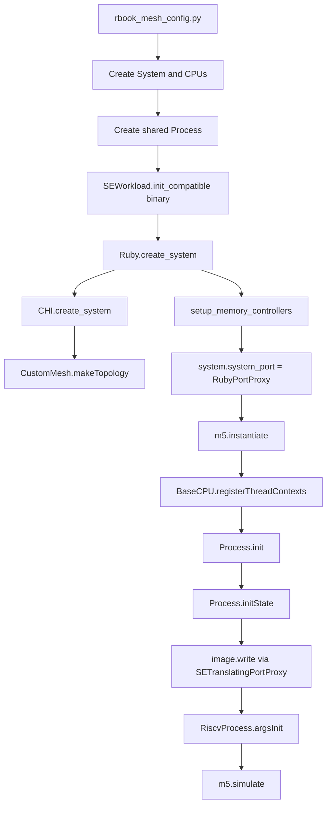

# SE Mode Overview for Chapter 17

This document explains gem5 syscall-emulation mode from the perspective of the Chapter 17 final project.
It focuses on the exact system built by [`configs/example/rbook_mesh_config.py`](../../configs/example/rbook_mesh_config.py#L1-L112) and [`configs/example/noc_config/rbook_4x4.py`](../../configs/example/noc_config/rbook_4x4.py#L1-L61).
The goal is not to re-explain gem5 generically.
The goal is to give you the mental model you need to write good Stage 3 test programs for [`ruby-book/Ch17_FinalProject.md`](../Ch17_FinalProject.md#L127-L239).
The most important theme is this.
SE mode gives you a userspace process model, not a full machine model.
That is exactly why it is lightweight and productive for micro-tests.
That is also why some things you might expect from Linux on real hardware do not exist, or exist only approximately.

## How to Read This

If you only need the short version, read these sections first.

- [One-Page Mental Model](#one-page-mental-model)
- [The Chapter 17 System in One Picture](#the-chapter-17-system-in-one-picture)
- [Thread Placement Reality Check](#thread-placement-reality-check)
- [Address Mapping Rules You Will Actually Use](#address-mapping-rules-you-will-actually-use)
- [Checklist for Writing Test Programs](#checklist-for-writing-test-programs)

If you are debugging startup, read [What Happens During SE Startup](#what-happens-during-se-startup).
If you are debugging memory layout, read [How Memory Exists in SE Mode](#how-memory-exists-in-se-mode).
If you are debugging thread behavior, read [How Processes and Threads Work in SE Mode](#how-processes-and-threads-work-in-se-mode).

## Scope

This document is about RISC-V Linux SE mode in this branch.
It is not about full-system mode.
It is not about ARM or x86 specific details except where comparison clarifies a limitation.
It is not a guide to the gem5 standard library APIs beyond what helps explain the underlying implementation.
It assumes the Chapter 17 final-project configuration.
That configuration is a 16-core RISC-V timing system with Ruby CHI, Garnet, a 4x4 mesh, 16 HN-Fs, and 2 SN-F main-memory nodes at opposite corners.
Relevant chapter references are:

- [`ruby-book/Ch17_FinalProject.md`](../Ch17_FinalProject.md#L7-L337)
- [`ruby-book/final/stage1-2.md`](../final/stage1-2.md#L1-L518)

## One-Page Mental Model

SE mode is a user-process sandbox built inside gem5.
gem5 pretends to be just enough of an OS kernel to load a program, create a process, emulate syscalls, allocate memory, and let a CPU model execute userspace instructions.
There is no simulated kernel boot.
There is no simulated page-table walker for Linux-managed process state in this RISC-V SE path.
There are no simulated kernel threads scheduled by a full Linux scheduler.
Instead, gem5 binds guest threads to pre-created hardware thread contexts and emulates the userspace-visible effects of a subset of Linux syscalls.
The Chapter 17 system uses one guest `Process` shared by all 16 CPUs.
That is why `pthread`-style shared-memory tests make sense there.
The binary is loaded into the process image by gem5 itself.
Its ELF segments become writes into the simulated address space during `Process::initState()`.
Those writes eventually land in the system physical memory through the Ruby system port proxy.
There is still one global physical memory space from the guest point of view.
The 2 DDR controllers are not separate software-visible NUMA nodes.
They are interleaved memory backends selected by physical address bits.
The 16 HN-Fs are also selected by address bits.
For this Chapter 17 mesh:

- HN-F selection is by bits `[9:6]` of the address.
- DDR controller selection is by bit `[6]` of the address.
- Consecutive 64-byte cache lines alternate between DDR0 and DDR1.
- Consecutive groups of 64-byte lines are striped across all 16 HN-Fs.

This means your Stage 3 tests can choose addresses that target specific home nodes by construction.
That is the most useful practical fact in this document.

## The Chapter 17 System in One Picture

The top-level config is [`rbook_mesh_config.py`](../../configs/example/rbook_mesh_config.py#L41-L112).
The placement file is [`rbook_4x4.py`](../../configs/example/noc_config/rbook_4x4.py#L21-L61).
The CHI hierarchy is built by [`configs/ruby/CHI.py`](../../configs/ruby/CHI.py#L85-L257).
The mesh is built by [`configs/topologies/CustomMesh.py`](../../configs/topologies/CustomMesh.py#L262-L389).

```text
Guest program(s)
    |
    v
One gem5 SE Process object
    |
    +--> 16 CPU objects each hold a ThreadContext
    |
    +--> one shared guest virtual address space
    |
    +--> syscall emulation instead of a real kernel
    |
    v
Ruby CHI memory hierarchy
    |
    +--> 16 RN-Fs, one per CPU tile
    +--> 16 HN-Fs, one per mesh tile
    +--> 2 SN-F main-memory nodes, at routers 0 and 15
    +--> 1 MN at router 0
    |
    v
Garnet 4x4 mesh
    |
    v
2 DDR controllers interleaved by address
```

The exact hardcoded defaults are in [`rbook_mesh_config.py`](../../configs/example/rbook_mesh_config.py#L41-L52).
The most important ones are:

- `num_cpus=16`
- `num_l3caches=16`
- `num_dirs=2`
- `topology="CustomMesh"`
- `network="garnet"`
- `cpu_type="RiscvTimingSimpleCPU"`
- `mem_size="512MiB"`

The placement file maps:

- RN-F routers to `0..15` in [`rbook_4x4.py`](../../configs/example/noc_config/rbook_4x4.py#L26-L29)
- HN-F routers to `0..15` in [`rbook_4x4.py`](../../configs/example/noc_config/rbook_4x4.py#L31-L34)
- SN-F main-memory routers to `[0, 15]` in [`rbook_4x4.py`](../../configs/example/noc_config/rbook_4x4.py#L41-L44)
- MN router to `[0]` in [`rbook_4x4.py`](../../configs/example/noc_config/rbook_4x4.py#L36-L39)

In plain English:
Every tile has one CPU-side requester and one LLC/home node.
Only two tiles also have a path to DRAM.
That makes mesh distance observable.
That is why the Stage 3 tests are interesting.

## 1. Overall Concept of SE Mode

### Intuition

Think of SE mode as a stripped-down operating-system substitute living inside gem5.
Its job is to let one or more userspace programs run without booting a real kernel.
It loads the executable.
It builds an initial stack with `argc`, `argv`, `envp`, and `auxv`.
It gives the process a software-managed virtual memory map.
It intercepts syscalls.
It creates new guest threads when the program calls `clone` through `pthread_create`.
It maps guest virtual pages to simulated physical pages.
It does all of this without simulating Linux kernel code.

### Working Model

The Python config creates a `System`, some CPUs, a workload object, and one or more `Process` objects.
The workload object is an `SEWorkload` subclass chosen to match the binary format and ISA.
For RISC-V Linux, the loader path is in [`src/arch/riscv/linux/se_workload.cc`](../../src/arch/riscv/linux/se_workload.cc#L60-L84).
The config assigns each CPU a workload `Process` via the CPU's `workload` parameter.
For Chapter 17 that happens here: [`rbook_mesh_config.py`](../../configs/example/rbook_mesh_config.py#L77-L90).
The `Root` object is created with `full_system=False` in [`rbook_mesh_config.py`](../../configs/example/rbook_mesh_config.py#L108-L110).
That single flag is the high-level switch that says, "this is SE mode, not full-system mode."
When execution reaches a syscall instruction, gem5 does not trap into a simulated Linux kernel image.
Instead, the active `SEWorkload` decodes the syscall number and calls a C++ syscall-emulation handler.
For RISC-V Linux that dispatcher is [`EmuLinux::syscall`](../../src/arch/riscv/linux/se_workload.cc#L94-L107).

### Formal and Code

The Python-side `SEWorkload` selection entry point is [`src/sim/Workload.py`](../../src/sim/Workload.py#L134-L177).
That code inspects the object file and constructs the only compatible SE workload class.
The C++ base SE-workload object is [`src/sim/se_workload.hh`](../../src/sim/se_workload.hh#L38-L96) with implementation in [`src/sim/se_workload.cc`](../../src/sim/se_workload.cc#L38-L96).
`SEWorkload::setSystem()` populates the physical-page allocator from the system's configured physical memory ranges in [`src/sim/se_workload.cc`](../../src/sim/se_workload.cc#L42-L54).
The per-program execution object is [`gem5::Process`](../../src/sim/process.hh#L66-L235) implemented in [`src/sim/process.cc`](../../src/sim/process.cc#L113-L587).
For RISC-V the concrete process classes are [`RiscvProcess64`](../../src/arch/riscv/process.cc#L71-L82) and [`RiscvProcess32`](../../src/arch/riscv/process.cc#L84-L95).

### Benefits

SE mode starts fast.
There is no bootloader, kernel decompression, device enumeration, or userspace init sequence.
SE mode is easy to control.
You can load a tiny single-purpose microbenchmark directly.
SE mode is ideal for experiments where you care about CPU, cache, coherence, and NoC behavior more than OS behavior.
SE mode is very practical for Chapter 17 because the goal is to study request flow through CHI, Garnet, and DRAM, not Linux kernel behavior.
SE mode is reproducible.
You control the exact binary, arguments, environment, and memory size directly from the config script.
SE mode exposes a simple mental path from guest load/store to Ruby/CHI statistics.
That is valuable for teaching and for focused debugging.

### Limitations

SE mode is not a faithful model of a full OS stack.
It cannot answer questions that depend on real kernel scheduling, page-cache behavior, interrupts, drivers, kernel page tables, or kernel services beyond the emulated syscall layer.
Syscall coverage is incomplete.
Many syscalls are stubbed, ignored, warn-once, or unimplemented.
Examples for RISC-V include `set_robust_list`, `rt_sigaction`, `rt_sigprocmask`, `mprotect`, and `madvise` in [`src/arch/riscv/linux/se_workload.cc`](../../src/arch/riscv/linux/se_workload.cc#L631-L668) and [`src/arch/riscv/linux/se_workload.cc`](../../src/arch/riscv/linux/se_workload.cc#L759-L766).
RISC-V SE mode in this tree does not use architectural page tables for the guest process.
`RiscvProcess` explicitly rejects `useArchPT` in [`src/arch/riscv/process.cc`](../../src/arch/riscv/process.cc#L62-L69).
Dynamic linking is not the normal happy path.
The standard-library board helper explicitly warns that dynamically linked executables are only partially supported when host and guest ISA match in [`src/python/gem5/components/boards/se_binary_workload.py`](../../src/python/gem5/components/boards/se_binary_workload.py#L242-L245).
For your RISC-V-on-x86-host workflow, static linking is the practical default.
SE mode does not expose your 2 DDR controllers as guest-visible NUMA nodes.
`getcpu()` reports a fixed NUMA node `0` in [`src/sim/syscall_emul.cc`](../../src/sim/syscall_emul.cc#L1442-L1453).
This matters because software inside the test program cannot discover “DDR0 vs DDR1” as separate OS nodes.
It only sees one process address space.

## 2. What Happens During SE Startup

### High-Level Startup Timeline

At a very high level, Chapter 17 startup is:

1. Python creates the `System`, CPUs, and one shared `Process`.
2. Python sets `system.workload` to an `SEWorkload` compatible with the binary.
3. Python asks Ruby to build the CHI hierarchy and the mesh.
4. `m5.instantiate()` constructs C++ SimObjects.
5. CPU thread contexts are registered with the system.
6. The `Process` initializes virtual memory and writes ELF segments into it.
7. The RISC-V process code builds the initial userspace stack and sets PC and SP.
8. The first thread context is activated.
9. Simulation begins.

The interesting part is that steps 6 and 7 happen before the guest program executes its first instruction.

### Step 1. Python Builds the Shell System

The Chapter 17 script creates a `System` with 16 `TimingSimpleCPU`s and one memory range in [`rbook_mesh_config.py`](../../configs/example/rbook_mesh_config.py#L65-L70).
The physical memory range is one contiguous `AddrRange("512MiB")`.
This is important.
The guest sees one physical memory space even though the Ruby memory backend is ultimately realized by two DDR controllers.
The script then creates a `Process` with `pid=100`, the target executable path, and `cmd=[binary_path]` in [`rbook_mesh_config.py`](../../configs/example/rbook_mesh_config.py#L79-L85).
It assigns that same `Process` to all CPUs in [`rbook_mesh_config.py`](../../configs/example/rbook_mesh_config.py#L87-L90).
That is the defining Chapter 17 choice.
You are not modeling 16 unrelated programs.
You are modeling one shared-memory process that can create multiple threads.

### Step 2. `createThreads()` Creates CPU-Side Thread Objects

Each CPU calls `createThreads()` in [`rbook_mesh_config.py`](../../configs/example/rbook_mesh_config.py#L87-L90).
For Python-side CPUs that method lives in [`src/cpu/BaseCPU.py`](../../src/cpu/BaseCPU.py#L231-L245).
It creates ISA and decoder objects for however many hardware threads the CPU exposes.
For your `TimingSimpleCPU` setup this is one hardware thread per CPU.
At this point you have 16 CPUs and 16 hardware thread contexts available to host guest execution.

### Step 3. `SEWorkload.init_compatible()` Picks the Right SE World

The script does:
[`system.workload = SEWorkload.init_compatible(binary_path)`](../../configs/example/rbook_mesh_config.py#L91-L91)
`SEWorkload.init_compatible()` calls `find_compatible()`, which uses the object-file loader to inspect the binary in [`src/sim/Workload.py`](../../src/sim/Workload.py#L145-L177).
The RISC-V Linux loader lives in [`src/arch/riscv/linux/se_workload.cc`](../../src/arch/riscv/linux/se_workload.cc#L60-L84).
It checks the object-file architecture and OS.
If the binary is `Riscv64` or `Riscv32` and the OS is Linux, it creates `RiscvProcess64` or `RiscvProcess32`.

### Step 4. Ruby Builds the Memory Hierarchy

The Chapter 17 script calls [`Ruby.create_system(args, False, system)`](../../configs/example/rbook_mesh_config.py#L95-L95).
The protocol-agnostic Ruby wrapper is [`configs/ruby/Ruby.py`](../../configs/ruby/Ruby.py#L223-L303).
That code:

- creates the Ruby system object
- creates the Garnet network
- calls the CHI protocol-specific builder
- builds the topology
- attaches the system port proxy
- creates memory controllers

The CHI builder is [`configs/ruby/CHI.py`](../../configs/ruby/CHI.py#L85-L257).
For `CustomMesh`, it imports the placement classes from [`rbook_4x4.py`](../../configs/example/noc_config/rbook_4x4.py#L18-L61).
It creates RN-F nodes from CPUs in [`CHI.py`](../../configs/ruby/CHI.py#L122-L135).
It creates the HN-F list and sets their interleaved address ranges in [`CHI.py`](../../configs/ruby/CHI.py#L157-L176).
It creates the two SN-F main-memory shells in [`CHI.py`](../../configs/ruby/CHI.py#L177-L192).
Then `CustomMesh.makeTopology()` places those nodes on the 4x4 mesh in [`CustomMesh.py`](../../configs/topologies/CustomMesh.py#L262-L389).

### Step 5. CPU Thread Contexts Register with the System

When the C++ objects come up, each CPU registers its thread contexts.
The generic logic is in [`BaseCPU::registerThreadContexts()`](../../src/cpu/base.cc#L492-L512).
In SE mode that function calls `tc->getProcessPtr()->assignThreadContext(tc->contextId())` for each thread context in [`src/cpu/base.cc`](../../src/cpu/base.cc#L505-L509).
That is how the `Process` learns which hardware contexts belong to it.
The system stores thread contexts in order of insertion.
`System::Threads::insert()` assigns consecutive `contextId`s in [`src/sim/system.cc`](../../src/sim/system.cc#L93-L104).
That fact becomes important later when we discuss how newly cloned guest threads pick a core.

### Step 6. `Process::init()` Handles Interpreter Bias if Needed

`Process::init()` first calls `updateBias()` in [`src/sim/process.cc`](../../src/sim/process.cc#L278-L286).
If the ELF has an interpreter and that interpreter is relocatable, gem5 reserves process virtual-address-space room for it and updates its load bias in [`src/sim/process.cc`](../../src/sim/process.cc#L497-L520).
This is the dynamic-linker-related path.
In your Chapter 17 use case you should normally avoid depending on it by using static binaries.

### Step 7. `Process::initState()` Builds the Initial Memory Image

The generic per-process initialization is in [`Process::initState()`](../../src/sim/process.cc#L289-L308).
It does four crucial things.
First, it grabs the first associated thread context.
Second, it activates that context so execution can later begin.
Third, it initializes the software page table.
Fourth, it creates an `SETranslatingPortProxy` and writes the executable image and interpreter image into guest memory.
That write happens here:

- [`image.write(*initVirtMem)`](../../src/sim/process.cc#L305-L306)
- [`interpImage.write(*initVirtMem)`](../../src/sim/process.cc#L306-L307)

The ELF image itself is built from PT_LOAD segments.
The parser that records PT_LOAD and PT_INTERP segments is [`src/base/loader/elf_object.cc`](../../src/base/loader/elf_object.cc#L125-L142).
Those segments are represented by `MemoryImage::Segment` objects in [`src/base/loader/memory_image.hh`](../../src/base/loader/memory_image.hh#L52-L163).

### Step 8. RISC-V `argsInit()` Builds the Initial Stack and PC

After `Process::initState()`, the RISC-V-specific `initState()` runs.
For RV64 that path is [`RiscvProcess64::initState()`](../../src/arch/riscv/process.cc#L97-L115).
It calls `argsInit<uint64_t>(PageBytes)`.
`argsInit()` is the code that actually builds the userspace entry environment in [`src/arch/riscv/process.cc`](../../src/arch/riscv/process.cc#L135-L263).
It:

- computes stack usage for random bytes, `argv`, `envp`, and `auxv`
- maps the stack region
- writes `AT_RANDOM`
- copies argument strings and environment strings
- writes the `argc`, `argv`, `envp`, and `auxv` tables
- sets the stack pointer register
- sets the initial PC to the process start PC

This is the moment when the guest program gains something equivalent to the state Linux would normally set up before entering `_start`.

### Step 9. First User Instruction Runs

After instantiation, the script calls `m5.simulate()` in [`rbook_mesh_config.py`](../../configs/example/rbook_mesh_config.py#L108-L112).
At that point the first active thread context starts executing guest instructions from the program entry point.
No kernel image is involved.
No `/sbin/init` is involved.
No boot memory image is involved for this Chapter 17 SE system.

### Startup Call Graph



### Why This Matters for Chapter 17

This startup path explains several practical rules.
If the binary format does not match a supported RISC-V Linux SE workload, startup fails before simulation meaningfully begins.
If the mesh topology is misconfigured, startup can still fail before the guest executes because Ruby builds before `m5.simulate()`.
If the binary is dynamically linked in a way this host cannot support, startup may fail while loading the interpreter or setting up the image.
If stack setup or memory mapping is wrong, the first user instructions can fail immediately even though Ruby built correctly.

## 3. How Memory Exists in SE Mode

### Big Picture

SE mode memory has three layers you should keep separate in your head.
Layer 1 is guest virtual memory.
This is what your RISC-V program uses.
Layer 2 is gem5's SE software page table.
This maps guest virtual pages to simulated physical pages.
Layer 3 is the system's physical memory objects.
In Chapter 17, that physical memory is one 512 MiB address space implemented behind Ruby by two interleaved DDR controllers.

### Guest Virtual Memory Is Per Process

The process object owns a `MemState` and an `EmulationPageTable`.
The `MemState` class tracks the logical guest VM layout in [`src/sim/mem_state.hh`](../../src/sim/mem_state.hh#L67-L187) and [`src/sim/mem_state.cc`](../../src/sim/mem_state.cc#L44-L496).
The `EmulationPageTable` is the SE virtual-to-physical map in [`src/mem/page_table.hh`](../../src/mem/page_table.hh#L53-L200) and [`src/mem/page_table.cc`](../../src/mem/page_table.cc#L47-L183).
For RISC-V, `RiscvProcess64` creates a `MemState` with:

- stack base `0x7fffffffffffffff`
- `brk` starting at `roundUp(image.maxAddr(), PageBytes)`
- `mmap` base `0x4000000000000000`

Those values are in [`src/arch/riscv/process.cc`](../../src/arch/riscv/process.cc#L71-L82).

### Simulated Physical Memory Is Global to the System

The `SEWorkload` owns physical-page pools.
`SEWorkload::setSystem()` populates them from the system physical memory ranges in [`src/sim/se_workload.cc`](../../src/sim/se_workload.cc#L42-L54).
That means all SE processes in the system allocate from the same configured physical memory pool unless explicitly separated into different pools.
In your Chapter 17 config there is only one physical range, `AddrRange("512MiB")`, in [`rbook_mesh_config.py`](../../configs/example/rbook_mesh_config.py#L65-L70).
So from SE mode's point of view there is one 512 MiB physical memory.
The fact that Ruby later binds that range to two controllers is a backend routing detail.
It does not create two guest-visible address spaces.

### Memory Allocation Path

Whenever a virtual page must be backed by physical memory, `Process::allocateMem()` allocates physical pages from `SEWorkload` and inserts mappings into the emulation page table in [`src/sim/process.cc`](../../src/sim/process.cc#L317-L345).
The key line is:
[`const Addr paddr = seWorkload->allocPhysPages(npages);`](../../src/sim/process.cc#L339-L340)
That means virtual pages do not directly choose DDR0 or DDR1.
They choose physical pages from the global SE pool.
The later memory-system routing for each access depends on that physical address.

### The Three Main Guest Regions

The guest process normally uses three growth mechanisms.
The executable image provides text, rodata, data, and BSS-like segment ranges.
The `brk` region provides the classic heap.
The `mmap` region provides mapped files and anonymous mappings.
The stack region provides thread stacks.
These are conceptually different in SE mode just as they are in Linux userspace.
They are not routed to different physical memories by type.
They are all just virtual regions that eventually map to physical pages.

### Where Code and Static Data Live

Your executable's loadable ELF segments are parsed from PT_LOAD entries in [`src/base/loader/elf_object.cc`](../../src/base/loader/elf_object.cc#L125-L142).
Those segments become a `MemoryImage` in [`src/base/loader/memory_image.hh`](../../src/base/loader/memory_image.hh#L52-L163).
When `Process::initState()` calls `image.write(*initVirtMem)`, each segment is written into the guest address space in [`src/sim/process.cc`](../../src/sim/process.cc#L302-L307).
The port proxy used there is an `SETranslatingPortProxy` created with allocation mode `Always` in [`src/sim/process.cc`](../../src/sim/process.cc#L302-L303).
That is important.
`Always` means writes can allocate missing pages during initialization.
The policy is implemented in [`src/mem/se_translating_port_proxy.cc`](../../src/mem/se_translating_port_proxy.cc#L49-L71).
When a write touches an unmapped region during image loading, the proxy calls `process->allocateMem()`.
So static text and static data are not pre-mapped by some separate kernel step.
They are materialized as the ELF image gets written.

### What About BSS

BSS is normally represented by a loadable memory range whose file-backed content is smaller than its in-memory size.
From the SE-mode point of view the important thing is that the relevant address range exists in the process image and gets backed by pages as needed.
Freshly allocated pages are assumed to be zero-filled.
That assumption is called out in [`MemState::fixupFault()`](../../src/sim/mem_state.cc#L398-L404).
That is the mechanism that makes zero-initialized data behave sensibly.

### Where the Initial Stack Lives

The initial stack base and max size come from `RiscvProcess64` or `RiscvProcess32` in [`src/arch/riscv/process.cc`](../../src/arch/riscv/process.cc#L71-L95).
`argsInit()` then decides how much of the top of stack is immediately used and maps the needed region as `"stack"` in [`src/arch/riscv/process.cc`](../../src/arch/riscv/process.cc#L168-L170).
The process writes random bytes, argument strings, environment strings, pointer tables, and auxv records into that region in [`src/arch/riscv/process.cc`](../../src/arch/riscv/process.cc#L172-L255).
Additional stack pages can be grown lazily on fault.
That logic is in [`MemState::fixupFault()`](../../src/sim/mem_state.cc#L420-L448).

### Where the Heap Lives

The initial `brk` point is `roundUp(image.maxAddr(), PageBytes)` in [`src/arch/riscv/process.cc`](../../src/arch/riscv/process.cc#L75-L81).
That means the classic heap starts immediately after the loaded program image, page aligned.
The `brk` syscall is handled by [`brkFunc`](../../src/sim/syscall_emul.cc#L277-L295).
It updates the heap mapping through [`MemState::updateBrkRegion()`](../../src/sim/mem_state.cc#L107-L169).
When the heap grows into new pages, `mapRegion(..., "heap")` records them as VMAs in [`src/sim/mem_state.cc`](../../src/sim/mem_state.cc#L165-L169).
Physical pages may still be allocated lazily when first touched.

### Where `mmap` Allocations Live

RISC-V SE mode uses an upward-growing `mmap` area.
`mmapGrowsDown()` returns false in [`src/arch/riscv/process.hh`](../../src/arch/riscv/process.hh#L58-L60).
The initial `mmap` end is `0x4000000000000000` for RV64 in [`src/arch/riscv/process.cc`](../../src/arch/riscv/process.cc#L79-L81).
The `mmap` syscall handler is in [`src/sim/syscall_emul.hh`](../../src/sim/syscall_emul.hh#L2113-L2253).
When it needs a new anonymous mapping, it extends the VMA list using [`MemState::extendMmap()`](../../src/sim/mem_state.cc#L451-L477).
Again, the VMA appears first.
Actual physical pages are typically allocated on first access.

### Lazy Allocation on Fault

SE mode is not simply “everything is allocated up front.”
Page faults can be fixed up in software.
For RISC-V translation, the MMU path calls `process->fixupFault(vaddr)` before raising a page-table fault.
The subagent found that path in [`src/arch/riscv/tlb.cc`](../../src/arch/riscv/tlb.cc#L663-L678).
The real work happens in [`MemState::fixupFault()`](../../src/sim/mem_state.cc#L386-L448).
If the faulting address lies inside an existing VMA, gem5 allocates a physical page and maps it.
If the address lies just below the current stack minimum but within the maximum stack range, gem5 grows the stack by pages.
If it lies outside all allowed regions, the fault is not fixed and execution fails.

### Static Data vs Stack vs Heap

From the software-visible point of view, yes, there is a meaningful difference.
Static text/data comes from ELF PT_LOAD segments.
Heap growth comes from `brk` or `mmap`.
Stack growth comes from initial setup plus lazy stack expansion.
From the physical-memory-routing point of view, no, there is no special “stack goes to DDR0” or “heap goes to DDR1” rule.
All of them become guest virtual pages backed by simulated physical pages.
Which HN-F and which DDR controller serve a given line depends on the physical address bits after mapping, not on the allocation class.

### Memory Layout Sketch

```text
High virtual addresses
0x7fffffffffffffff   initial stack base
        |\
        | \__ active stack contents built by argsInit()
        |
        |    lazy stack growth downward on demand
        |
...
0x4000000000000000   mmap area base for RV64
        |
        |    anonymous/file mappings grow upward
        |
...
brk_point = roundUp(image.maxAddr(), PageBytes)
        |
        |    heap via brk grows upward
        |
...
ELF PT_LOAD segments
        |
        |    text / rodata / data / bss-like image ranges
        |
low virtual addresses
```

### How the ELF Image Reaches the Two DDR Controllers

This is the question that matters most for Chapter 17.
The answer is subtle but simple.
The ELF is not loaded “into DDR0 first” and “then maybe copied to DDR1.”
The ELF is written into the guest address space one segment at a time through `SETranslatingPortProxy` in [`Process::initState()`](../../src/sim/process.cc#L289-L308).
That proxy allocates physical pages as needed in [`src/mem/se_translating_port_proxy.cc`](../../src/mem/se_translating_port_proxy.cc#L60-L68).
Each allocated page gets a physical address from the `SEWorkload` physical-page pool in [`src/sim/process.cc`](../../src/sim/process.cc#L339-L345).
The physical address is in the one global physical address space defined by `system.mem_ranges`.
Later, when Ruby memory controllers are created, each SN-F gets an interleaved address range in [`configs/ruby/Ruby.py`](../../configs/ruby/Ruby.py#L161-L203) using [`configs/common/MemConfig.py`](../../configs/common/MemConfig.py#L44-L111).
For `num_dirs=2` and 64-byte cache lines, the DDR controller select rule is:
`ddr_id = (paddr >> 6) & 0x1`
So consecutive 64-byte physical cache lines alternate between controller 0 and controller 1.
Therefore:
The ELF image naturally ends up distributed across both DDR controllers according to the physical addresses of its pages and the per-line interleaving rule.
There is no separate software loop that says, “half the binary goes to each controller.”
The distribution falls out of address interleaving.

### Important Consequence

Do not think of the two Chapter 17 DDR controllers as two separate RAM sticks that software explicitly opens or maps.
Think of them as two backends that jointly implement one guest physical memory.
That is the right mental model for SE mode in this system.

## 4. Address Mapping Rules You Will Actually Use

This section is the practical heart of the document.
If you are designing Chapter 17 microbenchmarks, these are the address formulas that matter.

### HN-F Selection Rule

HN-F address slicing is created by [`CHI_HNF.createAddrRanges()`](../../configs/ruby/CHI_config.py#L635-L652).
For 16 HN-Fs and 64-byte cache lines:

- `block_size_bits = 6`
- `llc_bits = 4`
- `numa_bit = 9`

Each HN-F gets an interleaved address range with `intlvHighBit=9`, `intlvBits=4`, and `intlvMatch=i`.
That means:
`hnf_id = (addr >> 6) & 0xF`
So address bits `[9:6]` choose the home node.
Because `rbook_4x4.py` maps HN-F `i` to router `i`, this also tells you the home-node router directly.

### DDR Selection Rule

SN-F-backed memory controllers are created by [`setup_memory_controllers()`](../../configs/ruby/Ruby.py#L134-L204) and [`create_mem_intf()`](../../configs/common/MemConfig.py#L44-L111).
For `num_dirs=2`, `cacheline_size=64`, and default settings:

- `intlv_size = 64`
- `intlv_bits = 1`
- `intlvHighBit = 6`

That means:
`ddr_id = (addr >> 6) & 0x1`
So bit `[6]` chooses the DDR controller.

### Composition of the Two Rules

In this Chapter 17 system, DDR selection is the low bit of the HN-F ID.
Because:

- HN-F uses bits `[9:6]`
- DDR uses bit `[6]`

Therefore:
`ddr_id = hnf_id & 0x1`
So:

- HN-F 0, 2, 4, ..., 14 route to DDR0
- HN-F 1, 3, 5, ..., 15 route to DDR1

This is an extremely useful mental shortcut.

### How to Construct Addresses for a Specific HN-F

If you want a line homed at HN-F `k`, pick an address whose bits `[9:6]` equal `k`.
The simplest family is:
`addr = base + (k << 6) + (m << 10)`
Here:

- the `k << 6` part fixes bits `[9:6]`
- the `m << 10` part changes higher bits without disturbing the home-node bits

This is exactly the kind of arithmetic you want for Stage 3b.

### Examples

If `base` is aligned and chosen so that low bits are zero:

- `addr = base + 0x000` homes at HN-F 0 and DDR0
- `addr = base + 0x040` homes at HN-F 1 and DDR1
- `addr = base + 0x080` homes at HN-F 2 and DDR0
- `addr = base + 0x3C0` homes at HN-F 15 and DDR1

For Chapter 17's row-major 4x4 numbering in [`rbook_4x4.py`](../../configs/example/noc_config/rbook_4x4.py#L3-L15), HN-F 0 is the top-left tile and HN-F 15 is the bottom-right tile.
So addresses with bits `[9:6]=0` are “local home node” for core 0.
Addresses with bits `[9:6]=15` are “diagonal home node” for core 0.

### Mesh Hop Count in the 4x4 Layout

Routers are numbered row-major in [`rbook_4x4.py`](../../configs/example/noc_config/rbook_4x4.py#L3-L15).
The Manhattan distance from router 0 to router 15 is 6 hops.
That is the “near vs far” contrast Chapter 17 calls out in [`Ch17_FinalProject.md`](../Ch17_FinalProject.md#L160-L175).
ASCII view:

```text
0  - 1  - 2  - 3
|    |    |    |
4  - 5  - 6  - 7
|    |    |    |
8  - 9  - 10 - 11
|    |    |    |
12 - 13 - 14 - 15
```

### What “Local” Means in This System

Because each tile has both an RN-F and an HN-F, “local” for a core usually means “the request homes at the HN-F attached to the same mesh router as that core's RN-F.”
For core 0, that is HN-F 0.
For core 15, that is HN-F 15.
This is a property of the Chapter 17 placement file.
It is not a generic CHI fact.

### What This Does Not Mean

An address homed at HN-F 0 does not guarantee the data comes from DRAM controller 0 on every access.
If the line is cached in another core, coherence may forward data from a peer cache.
If the line hits in the LLC slice, DRAM is not involved at all.
The address bits tell you who the home node is and which memory controller owns backing DRAM for misses.
They do not force every access to travel to DRAM.

## 5. How Processes and Threads Work in SE Mode

### First Distinction: Process vs Thread vs Hardware Context

In SE mode, a `Process` is the guest program state.
A guest thread is usually another `Process` object created by `clone()` that may share important substructures with the original.
A hardware context is a gem5 `ThreadContext` attached to a CPU.
These are not the same thing.
They are related by binding.

### What the Chapter 17 Config Actually Does

The Chapter 17 config gives all 16 CPUs the same `Process` object in [`rbook_mesh_config.py`](../../configs/example/rbook_mesh_config.py#L87-L90).
This means the CPUs all start life pointed at the same process image.
That is exactly the right setup for a single multithreaded guest program.
It is not the only possible SE-mode pattern.
It is just the one chosen for this project.

### `Process` Contains Linux-Like Thread-Group State

The `Process` constructor sets `pid`, `ppid`, `pgid`, and initially `tgid = pid` in [`src/sim/process.cc`](../../src/sim/process.cc#L141-L165).
The comments there explain Linux thread-group semantics.
When `clone` is called with `CLONE_THREAD`, the new child process gets the original thread-group ID in [`src/sim/process.cc`](../../src/sim/process.cc#L251-L255).
So guest threads are represented using process objects with shared state, not some completely separate “lightweight thread” object.

### How `clone()` Works in gem5 SE Mode

The main implementation is [`doClone()`](../../src/sim/syscall_emul.hh#L1833-L1980).
That function:

1. validates clone flags
2. finds a free hardware thread context in the system
3. builds a new `ProcessParams`
4. creates a new child `Process`
5. rebinds the chosen `ThreadContext` to the new child process
6. marks page tables as shared for thread-style clone
7. calls `cp->initState()`
8. calls `p->clone(...)` to share or copy memory and files according to flags
9. copies registers and sets TLS and stack according to the ISA-specific clone helper
10. returns `0` in the child and the child PID in the parent

The RISC-V register copy and TLS/SP setup is in [`RiscvLinux::archClone()`](../../src/arch/riscv/linux/linux.hh#L309-L320).
The generic memory/file sharing behavior is in [`Process::clone()`](../../src/sim/process.cc#L167-L263).

### Shared Address Space vs Copied Address Space

If the guest uses `CLONE_VM`, the child shares the parent's address space.
That happens by reusing the page-table pointer and `memState` pointer in [`src/sim/process.cc`](../../src/sim/process.cc#L183-L193).
If `CLONE_VM` is absent, gem5 copies mappings and replicates pages in [`src/sim/process.cc`](../../src/sim/process.cc#L194-L209).
For `pthread_create`, the expected path is a thread-like clone with shared VM.
That is why Chapter 17's barrier and false-sharing tests make sense.

### Can I Have Multiple Processes Running in Parallel

Yes, but you need to be precise about what that means.
At the config level, yes, SE mode can run different `Process` objects on different CPUs.
The deprecated example config shows that directly in [`configs/deprecated/example/se.py`](../../configs/deprecated/example/se.py#L241-L247).
The stdlib board helper also has a “one binary per core” path in [`src/python/gem5/components/boards/se_binary_workload.py`](../../src/python/gem5/components/boards/se_binary_workload.py#L151-L225).
So “multiple processes in parallel” is absolutely possible in SE mode.
However, the Chapter 17 config does not do that.
It explicitly uses one shared `Process` across all 16 CPUs.
So the intended Stage 3 style is one program, many threads, one shared address space.

### How Threads Are Mapped to Cores

This is the most important threading question for your tests.
gem5 does not run a full Linux scheduler in SE mode.
A new guest thread is mapped to a free gem5 `ThreadContext` when `clone()` happens.
`doClone()` asks the system for `threads.findFree()` in [`src/sim/syscall_emul.hh`](../../src/sim/syscall_emul.hh#L1851-L1856).
`System::Threads::findFree()` simply scans for the first `ThreadContext` whose status is `Halted` in [`src/sim/system.cc`](../../src/sim/system.cc#L120-L128).
That means the placement rule is not “choose the least loaded core” or “respect Linux affinity policy.”
It is much simpler.
It is “pick the first halted hardware context in system order.”

### What Determines System Order

Thread contexts get consecutive `contextId`s when inserted into the system in [`src/sim/system.cc`](../../src/sim/system.cc#L93-L104).
CPUs register their thread contexts in [`BaseCPU::registerThreadContexts()`](../../src/cpu/base.cc#L492-L512).
In a simple configuration like Chapter 17, that typically means context IDs follow CPU creation order.
The CPUs themselves are created as `[TimingSimpleCPU(cpu_id=i) for i in range(args.num_cpus)]` in [`rbook_mesh_config.py`](../../configs/example/rbook_mesh_config.py#L65-L66).
So the practical expectation is:

- the main thread starts on the first active context
- newly created threads tend to bind to the next free contexts in increasing order

This is deterministic enough to be useful for controlled microbenchmarks.
But it is not Linux scheduling.

### Thread Placement Reality Check

If your test plan assumes `pthread_setaffinity_np()` can pin a thread to core 15, stop and verify that assumption.
For RISC-V SE mode in this tree, `sched_setaffinity` is not implemented in the syscall table entries shown in [`src/arch/riscv/linux/se_workload.cc`](../../src/arch/riscv/linux/se_workload.cc#L651-L657) and [`src/arch/riscv/linux/se_workload.cc`](../../src/arch/riscv/linux/se_workload.cc#L1018-L1024).
`sched_getaffinity` is implemented, but it simply reports that all system threads are available in [`src/sim/syscall_emul.hh`](../../src/sim/syscall_emul.hh#L3138-L3161).
That means guest-visible affinity control is not the mechanism you should rely on.
For Chapter 17 tests, the more reliable model is:

- create threads in a controlled order
- use each thread's observed CPU ID to decide its role
- or use one process per core if you truly need hard-wired placement

This is the single biggest practical caveat for your Stage 3 test-program design.

### How Can I Figure Out Which Core a Thread Runs On

The cleanest guest-visible query is `getcpu()`.
gem5 implements that in [`src/sim/syscall_emul.cc`](../../src/sim/syscall_emul.cc#L1442-L1453).
It writes `tc->contextId()` into the guest's `cpu` output field.
It always reports NUMA node `0`.
So in this SE system:

- `getcpu().cpu` is effectively the gem5 context ID
- `getcpu().node` is not useful for distinguishing DDR controllers

That means your test program can learn which hardware context it actually received.
For the Chapter 17 1-thread-per-core setup, that is usually the same number you will think of as the core ID.

### Is `cpuId()` the Same as `contextId()`

Not always in every possible gem5 configuration.
But in your Chapter 17 setup, where each CPU has one hardware thread, they line up closely enough to treat them as “core IDs” for practical test design.
The generic CPU ID accessor is in [`src/cpu/base.hh`](../../src/cpu/base.hh#L212-L216).
The generic thread-state CPU/context/thread accessors are in [`src/cpu/thread_state.hh`](../../src/cpu/thread_state.hh#L59-L77).
For `getcpu()`, gem5 uses `contextId()`, not `cpuId()`, in [`src/sim/syscall_emul.cc`](../../src/sim/syscall_emul.cc#L1445-L1448).
In your system, one thread context per CPU makes this easy.

### How Core Selection Really Happens for New Threads

The short answer is:
the first halted hardware context wins.
That rule comes from [`System::Threads::findFree()`](../../src/sim/system.cc#L120-L128).
So if you start with CPU0 active and CPUs 1..15 halted, the first clone tends to get CPU1's context, the next clone CPU2's context, and so on.
This is why a controlled “spawn N threads in order” pattern can work for deterministic placement experiments.
It is also why a test that assumes a full Linux-style run queue or migration policy will be misleading.

### Can Threads Migrate Later

There is no full Linux scheduler here to migrate them among cores according to affinity, fairness, or load balancing.
A guest thread is bound to the `ThreadContext` chosen during clone.
That is the right default mental model unless you are explicitly using more advanced CPU-switching features.

### What If `clone()` Runs Out of Free Contexts

Then clone fails with `-EAGAIN`.
That comes directly from [`doClone()`](../../src/sim/syscall_emul.hh#L1851-L1856).
So your Stage 3 test should not try to create more than 16 simultaneous threads in the Chapter 17 system.
If you do, the failure mode is not “Linux schedules them later.”
It is “there is no spare gem5 hardware context.”

## 6. How Memory and Threads Interact in Chapter 17

### One Shared Address Space Across the 16 CPUs

Because the Chapter 17 script assigns one `Process` to all CPUs in [`rbook_mesh_config.py`](../../configs/example/rbook_mesh_config.py#L87-L90), they all begin with access to the same virtual-memory map.
That is why a global array, a heap allocation, or an `mmap`ed shared region is naturally visible to all participating threads.
You do not need shared-memory OS setup beyond normal in-process allocation.

### What Happens When a New Thread Touches a Page First

If the page is already mapped in the shared process address space, it just uses it.
If the page has a VMA but no physical page yet, the first touch can trigger `fixupFault()` and allocate the page.
Because the page belongs to the shared address space, later accesses by other cores see the same backing data.
This is exactly the behavior you want for barrier counters and false-sharing test data.

### Why Coherence Still Matters Even in SE Mode

SE mode only changes how the process and syscalls are modeled.
It does not short-circuit the memory hierarchy.
Once the guest program executes normal loads, stores, atomics, and fences, those memory operations still go through the configured CPU model, Ruby, CHI, Garnet, and the memory controllers.
That is why SE mode is still perfectly valid for studying false sharing, producer-consumer handoff, and barrier contention.
The missing kernel does not invalidate those user-level coherence behaviors.

## 7. How the Chapter 17 CHI Mesh Is Actually Built

### RN-F Nodes

`CHI.py` creates one RN-F per CPU in [`configs/ruby/CHI.py`](../../configs/ruby/CHI.py#L122-L135).
The RN-F construction logic in [`configs/ruby/CHI_config.py`](../../configs/ruby/CHI_config.py#L476-L617) gives each CPU tile:

- an L1I sequencer/controller/cache
- an L1D sequencer/controller/cache
- a private L2 controller/cache

So each core contributes one request node with private caches.

### HN-F Nodes

The HN-F wraps an LLC slice and the CHI home/directory role.
The implementation is [`CHI_HNF`](../../configs/ruby/CHI_config.py#L620-L685).
This is a critical conceptual point.
In this CHI setup, the HN-F is the home node.
There is not a separate generic Ruby “directory controller” object for the LLC home function.
`CHI.py` explicitly notes that it does not define a `Directory_Controller` type in [`configs/ruby/CHI.py`](../../configs/ruby/CHI.py#L177-L180).

### SN-F Main-Memory Nodes

The SN-F main-memory wrapper is [`CHI_SNF_MainMem`](../../configs/ruby/CHI_config.py#L790-L801).
`CHI.py` creates `options.num_dirs` of them in [`configs/ruby/CHI.py`](../../configs/ruby/CHI.py#L181-L192).
For Chapter 17, `num_dirs=2`, so there are 2 SN-F main-memory endpoints.
The actual `MemCtrl` objects are created later by [`setup_memory_controllers()`](../../configs/ruby/Ruby.py#L134-L204).

### The Memory-Side Naming Confusion

Ruby's protocol-agnostic code still uses the name `dir_cntrls` for the list of memory-side CHI controllers passed into `setup_memory_controllers()`.
In Chapter 17, those are really the SN-F main-memory controllers, not the HN-F home nodes.
So `num_dirs=2` here means “2 memory endpoints,” not “2 home nodes.”
The home nodes are the 16 HN-Fs.
This naming mismatch is worth remembering when reading the Ruby glue code.

### Mesh Construction

`CustomMesh.makeTopology()` creates 16 mesh routers for a 4x4 grid in [`configs/topologies/CustomMesh.py`](../../configs/topologies/CustomMesh.py#L265-L336).
It creates East-West and North-South links in [`CustomMesh._makeMesh()`](../../configs/topologies/CustomMesh.py#L60-L164).
Then it distributes RN-F, HN-F, MN, and SN-F nodes onto those routers in [`configs/topologies/CustomMesh.py`](../../configs/topologies/CustomMesh.py#L352-L369).
RN-F nodes get an extra bridge router created by [`_createRNFRouter()`](../../configs/topologies/CustomMesh.py#L169-L199).
Non-RNF nodes attach directly to the mesh router.

### Why RN-Fs Use an Extra Router

This is mostly a topology-organization detail.
An RN-F contains multiple network-visible controllers and sequencers.
The extra bridge router collects those node-side controllers before reaching the main mesh router.
For your mental model, the main consequence is simple.
Core-side requests are not attached to the mesh router by a single trivial edge.
There is a small RN-F-side bridge structure first.

### Tile-by-Tile View

For a non-corner tile, the placement is roughly:

```text
CPU_i
  |
RN-F_i bridge router
  |
Mesh router i
  |
HN-F_i
```

For tile 0:

```text
CPU_0
  |
RN-F_0 bridge router
  |
Mesh router 0
  |-- HN-F_0
  |-- SN-F_0
  `-- MN
```

For tile 15:

```text
CPU_15
   |
RN-F_15 bridge router
   |
Mesh router 15
   |-- HN-F_15
   `-- SN-F_1
```

### Request Directionality

`CHI.py` sets RN-F downstream destinations to all HN-Fs in [`configs/ruby/CHI.py`](../../configs/ruby/CHI.py#L220-L223).
It sets each HN-F downstream to the memory destinations in [`configs/ruby/CHI.py`](../../configs/ruby/CHI.py#L228-L229).
So the general flow is:
RN-F private cache miss -> chosen HN-F home node -> SN-F/DRAM if needed.
Coherence can of course involve snoops to peer caches and data forwarding.
But the home-node routing rule still starts from the address bits described earlier.

## 8. How Binary Loading Interacts with Ruby and the System Port

### The System Port Exists So gem5 Can Initialize Memory

`Ruby.create_system()` creates a `RubyPortProxy` and assigns it to `system.system_port` in [`configs/ruby/Ruby.py`](../../configs/ruby/Ruby.py#L276-L289).
That is the path used for binary loading and similar functional accesses.
The C++ class is [`RubyPortProxy`](../../src/mem/ruby/system/RubyPortProxy.hh#L38-L116).
Its file comment says exactly what it is.
It is “a trivial wrapper that allows the system port to connect to Ruby and use nothing but functional accesses.”
That comment is in [`src/mem/ruby/system/RubyPortProxy.hh`](../../src/mem/ruby/system/RubyPortProxy.hh#L38-L44).

### Functional Access Is Not the Same as a Timed CPU Access

This is another important subtlety.
Loading the ELF image uses functional memory accesses.
That means gem5 is initializing state.
It is not yet modeling request contention or NoC timing for the bootstrapping writes.
This is what you want.
Otherwise just loading the binary would pollute the statistics you care about.

### But the Data Still Lands in the Simulated Memory System

Even though the load is functional, the bytes are still placed into the simulated address space and backed by the configured physical memory objects.
So when timed execution later begins, the program image is already present where the guest expects it.
In other words:
functional initialization decides initial memory contents.
timed execution decides measured behavior.
That separation is healthy.

### Practical Consequence for Stage 3 Measurements

Do not attribute startup-time image loading traffic to Garnet timing statistics for your benchmark phase.
The measured coherence and NoC behavior should come from the user-level workload after simulation starts meaningfully executing guest code.
If you care about warmup effects, create an explicit warmup phase in the test program.
Do not rely on ELF loading as an implicit warm cache state.

## 9. Essential SE-Mode Topics for Chapter 17 Test Programs

This section answers the practical questions that matter when writing the Stage 3 binaries.

### 9.1 Static Linking Is the Safe Default

For your RISC-V microbenchmarks, use static binaries.
The standard-library helper explicitly calls dynamic linking only partially supported in [`se_binary_workload.py`](../../src/python/gem5/components/boards/se_binary_workload.py#L242-L245).
The Stage 1-2 project notes also call `-static` essential in [`ruby-book/final/stage1-2.md`](../final/stage1-2.md#L299-L308).
Static linking removes a large class of startup ambiguity.
It avoids dependence on an interpreter path and host-side loader setup.
It makes the program image simpler to reason about.

### 9.2 `pthread` Usually Means `clone + futex`

If your C test uses `pthread_create`, `pthread_join`, mutexes, or barriers, gem5 SE mode usually supports that through a combination of `clone` and `futex` syscall emulation.
The RISC-V syscall table maps `futex` at entry 98 and `clone` at entry 220 in [`src/arch/riscv/linux/se_workload.cc`](../../src/arch/riscv/linux/se_workload.cc#L626-L632) and [`src/arch/riscv/linux/se_workload.cc`](../../src/arch/riscv/linux/se_workload.cc#L747-L756).
`futexFunc` is in [`src/sim/syscall_emul.hh`](../../src/sim/syscall_emul.hh#L378-L399) and continues below that range.
This is why simple pthread microbenchmarks usually work in SE mode.

### 9.3 Some libc Behavior Is Approximate

Several syscalls are ignored or simplified.
If your library depends on them for correctness, your test may break in ways that have nothing to do with CHI or the mesh.
Examples already mentioned include signal-related syscalls and memory-policy calls.
`sched_getparam` is faked to priority 0 in [`src/sim/syscall_emul.cc`](../../src/sim/syscall_emul.cc#L1456-L1465).
`getcpu()` always returns NUMA node 0.
`sched_getaffinity()` reports that all simulated CPUs are available.
So prefer plain C and simple pthread usage over advanced Linux tuning APIs.

### 9.4 Use In-Process Shared Memory, Not OS Shared Memory Features

For Chapter 17 you do not need `shm_open`, `mmap`ed files, or multiple UNIX processes to create sharing.
A global variable, `malloc`, or anonymous `mmap` inside one process is enough because all pthreads share the same address space.
That is simpler and usually more reliable in SE mode.

### 9.5 Use Explicit Alignment

Your tests care about cache-line placement.
Use 64-byte alignment because the Chapter 17 system uses `cache_line_size=64` in [`rbook_mesh_config.py`](../../configs/example/rbook_mesh_config.py#L65-L70).
Without explicit alignment, a false-sharing test can accidentally become a no-sharing test or vice versa.

### 9.6 Use Explicit Fences When Measuring Handoff

The producer-consumer test in Chapter 17 correctly calls for release and acquire ordering in [`Ch17_FinalProject.md`](../Ch17_FinalProject.md#L196-L208).
That is not just pedagogy.
It makes your measured handoff latency correspond to a well-defined synchronization event instead of a compiler or memory-order accident.

### 9.7 Atomics Matter for Barrier Tests

The barrier test design in Chapter 17 uses atomic increments in [`Ch17_FinalProject.md`](../Ch17_FinalProject.md#L210-L225).
That is the right shape for worst-case line ping-pong because it forces exclusive ownership movement.
A naive non-atomic barrier counter would be incorrect and would also measure something less interesting.

### 9.8 Warmup and Measurement Must Be Separated

If your test prints one number, make sure you know whether it includes cold-start misses, allocation faults, first-touch placement, and synchronization startup.
For example, a producer-consumer benchmark should usually have:

- thread creation/setup phase
- optional warmup iterations
- measured steady-state iterations
- final correctness check

Otherwise you may end up measuring `pthread_create` costs rather than CHI handoff costs.

### 9.9 `rdcycle` Measures Core Cycles, Not Wall Time

The Chapter 17 plan uses `rdcycle` for latency measurement in [`Ch17_FinalProject.md`](../Ch17_FinalProject.md#L164-L170).
That is a good choice in a single-clock-domain setup.
The Stage 1-2 plan intentionally uses a shared 2 GHz clock for CPUs and Ruby in [`ruby-book/final/stage1-2.md`](../final/stage1-2.md#L240-L252).
That means “cycles” are directly comparable across CPU-side and NoC-side latency discussions.

### 9.10 Config-Dot and Config-Ini Are Worth Using

For startup and topology sanity checking, `config.dot` and `config.ini` are often faster than diving into C++.
The Stage 1-2 notes already emphasize `config.dot` in [`ruby-book/final/stage1-2.md`](../final/stage1-2.md#L309-L330).
Use them to verify that your mental model matches the instantiated mesh.

### 9.11 SE Mode Does Not Give You Real NUMA APIs Here

Even though the hardware model has two memory controllers, the guest sees one NUMA node.
That means you should not design tests that depend on Linux NUMA placement policies or per-node allocation APIs.
Instead, steer placement through address arithmetic and coherence structure.
That is the correct level of control in this system.

## 10. Thread Placement Reality Check

This section is intentionally blunt because it affects how you should write the tests.

### What Chapter 17 Wants Conceptually

The chapter text often speaks in terms like “thread pinned to core 0” and “thread pinned to core 15” in [`Ch17_FinalProject.md`](../Ch17_FinalProject.md#L176-L190).
That is the right conceptual experiment.
But the implementation details of RISC-V SE mode matter.

### What gem5 Actually Gives You Reliably

It reliably gives you:

- 16 hardware contexts created in a fixed order
- deterministic `clone()` binding to the first free halted context
- `getcpu()` to report the assigned context ID

It does not reliably give you Linux affinity management APIs.

### Recommended Practical Strategy for Stage 3

For tests that need specific roles on specific cores, prefer one of these strategies.
Strategy A.
Create all threads in a deterministic order and let each thread call `getcpu()`.
Assign the role based on the observed CPU ID.
Strategy B.
Create exactly as many threads as needed and enforce that the test aborts unless the observed CPU IDs match the intended arrangement.
Strategy C.
If you need truly fixed one-thread-per-core placement with no ambiguity, consider a config style that maps one process per core instead of one pthreaded process.
That is possible in SE mode, but it is a different setup from Chapter 17's shared-process pattern.

### Why This Is Better Than Pretending Affinity Works

If you assume affinity pinning exists when it does not, your false-sharing or producer-consumer “diagonal corner” experiment may accidentally run on nearby cores.
Then the results will still look plausible, but your interpretation will be wrong.
That is worse than an immediate failure.

### Minimal Reliable Rule

In this Chapter 17 SE configuration, always validate core assignment inside the guest program before trusting a hop-count conclusion.
That one rule will save you hours.

## 11. What Happens on a Syscall in SE Mode

### Trap to SE Workload, Not to Linux Kernel Code

On RISC-V, the guest executes `ecall`.
The SE workload path handles it rather than a real kernel image.
The dispatcher is [`EmuLinux::syscall()`](../../src/arch/riscv/linux/se_workload.cc#L94-L107).
It reads the syscall number from the RISC-V syscall-number register and looks up the matching descriptor.
The generic syscall descriptor framework is in [`src/sim/syscall_desc.hh`](../../src/sim/syscall_desc.hh#L69-L187) and [`src/sim/syscall_desc.cc`](../../src/sim/syscall_desc.cc#L42-L100).

### What This Means for Benchmark Design

SE mode can handle user-level program setup and synchronization syscalls.
It is not the right mode if your experiment depends on kernel scheduling policy, page-cache writeback, interrupts, signal delivery fidelity, or driver IO paths.
For Chapter 17 tests, this is mostly a benefit.
Your benchmark logic is in user space.
The hardware behavior you care about is below the syscall layer.

## 12. Other Essential Topics for Productive Stage 3 Work

### 12.1 Functional Correctness Comes Before Statistics

A surprising number of mesh/coherence experiments fail because the binary itself is wrong.
Before interpreting any CHI or Garnet stat, confirm that the program's own correctness checks pass.
Chapter 17 already pushes this pattern with `PASS`-style checks in [`Ch17_FinalProject.md`](../Ch17_FinalProject.md#L146-L225).
Keep that discipline.

### 12.2 First-Touch Effects Are Real

If a page is allocated lazily on first touch, the first thread to touch it may pay page-allocation overhead and establish its initial cache residency.
That can pollute measurements.
For clean data, initialize shared structures in a deliberate phase before the timed section.

### 12.3 Not Every Miss Goes to DRAM

When you pick a line homed at HN-F 15, you are choosing its home node.
You are not guaranteeing a DRAM access on every read.
Possible paths include:

- local L1/L2 hit
- HN-F / LLC hit
- peer-cache forwarding through coherence
- DRAM miss path via SN-F

That is why Stage 3b explicitly suggests flushing private caches between measured accesses in [`Ch17_FinalProject.md`](../Ch17_FinalProject.md#L164-L170).

### 12.4 The HN-F Owns the Directory-Like Home Role

If you are tracing a producer-consumer handoff, the crucial path is not simply “consumer asks producer.”
The home node mediates coherence decisions.
That is why Stage 3d describes the path as consumer -> HN-F -> producer -> consumer in [`Ch17_FinalProject.md`](../Ch17_FinalProject.md#L204-L208).
That explanation matches the CHI configuration.

### 12.5 The Two DDR Controllers Are a Capacity/Bandwidth Backend, Not a Software Partition

Do not design tests that expect “address range 0..X is DDR0 and X..Y is DDR1.”
That is not how Chapter 17 memory is split.
The split is cache-line interleaving by address bit `[6]`.

### 12.6 `num_dirs=2` Does Not Mean Two LLC Slices

This is a very common misread.
The Chapter 17 system has 16 LLC/home slices because `num_l3caches=16` in [`rbook_mesh_config.py`](../../configs/example/rbook_mesh_config.py#L41-L45).
It has 2 memory endpoints because `num_dirs=2` in the same file.
If you conflate those, your interpretation of HN-F statistics will be wrong.

### 12.7 One Clock Domain Makes Cycle Comparisons Easier

The Stage 1-2 notes intentionally keep CPUs and Ruby on a shared clock domain in [`ruby-book/final/stage1-2.md`](../final/stage1-2.md#L240-L252).
That means you can talk about “extra cycles due to more hops” without performing clock-domain conversions.
This is especially useful for `rdcycle`-based tests.

### 12.8 SE Mode Uses Functional Initialization, So Benchmark Warmup Is on You

The system boots with the binary already placed in memory.
That does not mean your caches, directories, or router queues are in a representative state for the measured phase.
If you need a known warm or cold condition, create it explicitly in the program.

### 12.9 Check the Output Cause

The Chapter 17 script prints the exit cause after simulation in [`rbook_mesh_config.py`](../../configs/example/rbook_mesh_config.py#L109-L112).
Always check it.
An early unexpected exit or panic can easily masquerade as a benchmark result if you only skim stdout.

### 12.10 Some “OS” Features Are Purely Synthetic

For example, `sched_getaffinity()` saying all CPUs are available does not imply a real scheduler or migration policy exists.
Treat these APIs as compatibility shims, not as evidence that Linux behavior is being fully modeled.

## 13. What Each Stage 3 Test Is Really Probing

This section ties the SE-mode understanding back to the actual final-project tests.

### 13.1 Smoke Test

Purpose.
Validate the whole path from userspace allocation and access to HN-F distribution and back.
SE-mode interpretation.
The most important thing is that a single shared process can allocate a large array and touch many lines without any special OS setup.
Hardware interpretation.
Bits `[9:6]` should spread those lines across all 16 HN-Fs.
Practical note.
Make sure the access pattern is line-granular, not byte-dense, so each touch has a chance to expose HN-F striping clearly.

### 13.2 Hop-Latency Test

Purpose.
Show that home-node distance changes load latency.
SE-mode interpretation.
Address arithmetic is the real control knob.
You do not need OS support to place memory “near” or “far.”
You choose near vs far by choosing the HN-F bits.
Practical note.
Private-cache flush or pollution between timed accesses is essential, or you will measure L1/L2 hits instead of mesh traversal.

### 13.3 False-Sharing Test

Purpose.
Force repeated exclusive ownership transfer of one cache line between distant cores.
SE-mode interpretation.
The shared address space makes this easy.
A single global or heap-allocated line is visible to both threads.
Placement caveat.
Thread-to-core identity must be verified inside the guest, not assumed from affinity APIs.

### 13.4 Producer-Consumer Test

Purpose.
Measure coherence-mediated handoff latency.
SE-mode interpretation.
The producer and consumer are ordinary user threads in one process.
Release/acquire synchronization happens entirely in userspace.
The handoff latency you care about is below the syscall layer.

### 13.5 Barrier Test

Purpose.
Create many-core contention on one line.
SE-mode interpretation.
This works well in SE mode because the synchronization primitive is user-level and the line is in one shared process.
Practical note.
Barrier startup and thread creation overhead should be excluded from the measured rounds if you want a clean contention number.

## 14. Checklist for Writing Test Programs

Use this as the design checklist for each Stage 3 binary.

### Binary and Build

- Build statically.
- Keep libc usage simple.
- Avoid APIs that depend on signals, advanced affinity, or NUMA policy.
- Prefer simple pthreads, atomics, and plain syscalls.

### Memory Layout

- Align shared structures to 64 bytes.
- Separate flags and payload lines when the test needs that distinction.
- Use address arithmetic deliberately when targeting a chosen HN-F.
- Warm pages before timing if page-fault overhead would distort the result.

### Thread Placement

- Do not trust `pthread_setaffinity_np()` here.
- Discover actual CPU/context ID with `getcpu()`.
- Abort or report clearly if the observed placement does not match the intended experiment.
- Use deterministic creation order if you rely on `clone()` choosing the next free context.

### Timing

- Separate setup, warmup, timed phase, and verification.
- Use `rdcycle` consistently.
- Keep the timed region as small and explicit as possible.

### Interpretation

- Relate each observed latency or traffic increase back to a specific path in the mesh.
- Distinguish home-node distance from DRAM distance.
- Distinguish coherence traffic from capacity/conflict misses.
- Confirm the program's correctness before trusting the stats.

## 15. Common Misconceptions

### “SE mode is just like Linux userspace, only faster.”

No.
It is Linux-like userspace behavior built on syscall emulation, with many approximations and omissions.

### “The two DDR controllers are two NUMA nodes visible to the guest.”

No.
The guest sees one process address space and one reported NUMA node.
The two controllers are an interleaved memory backend.

### “`num_dirs=2` means there are two home nodes.”

No.
The 16 HN-Fs are the home nodes.
The 2 SN-Fs are the memory endpoints.

### “If I allocate on the heap, the data will probably go to one DDR controller.”

No.
Heap pages still map into the one physical address space, and cache lines alternate between controllers by address bit `[6]`.

### “I can pin threads to exact cores with standard Linux affinity APIs.”

Not reliably in this RISC-V SE setup.
Validate placement using `getcpu()` and the known clone binding rule instead.

### “ELF loading traffic is part of the benchmarked NoC behavior.”

No.
Binary loading uses functional accesses through the Ruby system-port proxy.
The benchmarked behavior begins with timed user execution.

### “A line homed at HN-F 15 always means a DRAM access to the controller near router 15.”

No.
It means HN-F 15 is the home node and DDR1 is the backing controller for memory misses.
The actual data source on a given access might be a private cache, the LLC slice, or a peer cache.

## 16. Open Questions You Do Not Need to Solve First

These topics exist, but they are not the first-order blockers for Chapter 17 tests.

### Dynamic Loader Nuances

Yes, the ELF path can involve PT_INTERP and load bias handling.
But for static RISC-V microbenchmarks you usually do not need to care.

### Full RISC-V Fault-Handling Internals

Yes, the MMU and TLB path matters if you are debugging page faults deeply.
But for test-program authoring, the practical rule is just to avoid accidental lazy-allocation overhead in the timed region.

### Detailed CHI State-Machine Edges

For the false-sharing and producer-consumer tests, you eventually will want protocol-state detail.
But you can write correct tests before enumerating every Snp/Resp transition.

## 17. Quick Reference Tables

### Core Files

| Topic | File |
|---|---|
| Chapter 17 system shell | [`configs/example/rbook_mesh_config.py`](../../configs/example/rbook_mesh_config.py#L1-L112) |
| Chapter 17 mesh placement | [`configs/example/noc_config/rbook_4x4.py`](../../configs/example/noc_config/rbook_4x4.py#L1-L61) |
| Ruby top-level creation | [`configs/ruby/Ruby.py`](../../configs/ruby/Ruby.py#L223-L303) |
| CHI hierarchy builder | [`configs/ruby/CHI.py`](../../configs/ruby/CHI.py#L85-L257) |
| HN-F address slicing | [`configs/ruby/CHI_config.py`](../../configs/ruby/CHI_config.py#L635-L652) |
| Custom mesh topology | [`configs/topologies/CustomMesh.py`](../../configs/topologies/CustomMesh.py#L262-L389) |
| SE workload base | [`src/sim/se_workload.cc`](../../src/sim/se_workload.cc#L38-L96) |
| Generic process code | [`src/sim/process.cc`](../../src/sim/process.cc#L113-L587) |
| RISC-V process layout | [`src/arch/riscv/process.cc`](../../src/arch/riscv/process.cc#L62-L263) |
| RISC-V syscall dispatch | [`src/arch/riscv/linux/se_workload.cc`](../../src/arch/riscv/linux/se_workload.cc#L94-L107) |
| Clone implementation | [`src/sim/syscall_emul.hh`](../../src/sim/syscall_emul.hh#L1833-L1980) |
| `getcpu()` implementation | [`src/sim/syscall_emul.cc`](../../src/sim/syscall_emul.cc#L1442-L1453) |

### Key Address Rules

| Meaning | Rule |
|---|---|
| Cache line size | `64 B` |
| HN-F ID | `(addr >> 6) & 0xF` |
| DDR ID | `(addr >> 6) & 0x1` |
| HN-F bits | `[9:6]` |
| DDR bit | `[6]` |
| HN-F count | `16` |
| DDR controller count | `2` |

### Guest-Visible Thread Facts

| Question | Practical answer |
|---|---|
| How many concurrent guest threads can run | Up to the number of free gem5 `ThreadContext`s, which is 16 here |
| How is a new thread placed | First free halted context via `findFree()` |
| Can I rely on Linux affinity APIs | No |
| How do I see where I landed | `getcpu()` |
| Does guest NUMA node distinguish DDR0 vs DDR1 | No, node is always 0 |

## 18. One-Page Mental Model

Chapter 17 SE mode is one multithreaded RISC-V userspace program running on 16 gem5 CPU contexts.
gem5 loads the ELF itself.
gem5 builds the initial stack itself.
gem5 emulates syscalls instead of running a Linux kernel.
The guest process uses a software-managed virtual memory system.
Virtual pages are backed by a global simulated physical memory pool.
That physical memory is one 512 MiB address space in the config.
Ruby then realizes that physical space with 16 CHI home nodes and 2 interleaved DDR controllers.
The home node for a line is selected by address bits `[9:6]`.
The DDR controller is selected by address bit `[6]`.
So you control HN-F placement mostly with address arithmetic.
You do not control DDR placement with NUMA APIs.
New guest threads are bound to the first free halted gem5 hardware context.
You should verify thread placement using `getcpu()`, not assume Linux affinity works.
This model is exactly good enough to write focused shared-memory tests that expose CHI and mesh behavior.
It is not meant to model full OS behavior.

## 19. If You Remember One Thing

For Chapter 17, think of SE mode as “one shared userspace process mapped onto 16 fixed gem5 hardware contexts, with address-bit-controlled home-node placement and syscall emulation standing in for Linux.”
If you keep that sentence true in your head, most design decisions for the Stage 3 tests become straightforward.

## 20. Suggested Next Reading

Read these in this order if you want to go deeper.

1. [`ruby-book/Ch17_FinalProject.md`](../Ch17_FinalProject.md#L127-L239) for the intended experiments.
2. [`configs/example/rbook_mesh_config.py`](../../configs/example/rbook_mesh_config.py#L1-L112) for the exact system shell.
3. [`configs/example/noc_config/rbook_4x4.py`](../../configs/example/noc_config/rbook_4x4.py#L1-L61) for tile placement.
4. [`configs/ruby/CHI.py`](../../configs/ruby/CHI.py#L122-L229) for node creation and downstream paths.
5. [`configs/ruby/CHI_config.py`](../../configs/ruby/CHI_config.py#L635-L652) for HN-F address slicing.
6. [`src/sim/process.cc`](../../src/sim/process.cc#L278-L345) and [`src/arch/riscv/process.cc`](../../src/arch/riscv/process.cc#L97-L263) for SE process startup.
7. [`src/sim/syscall_emul.hh`](../../src/sim/syscall_emul.hh#L1833-L1980) for thread creation semantics.
