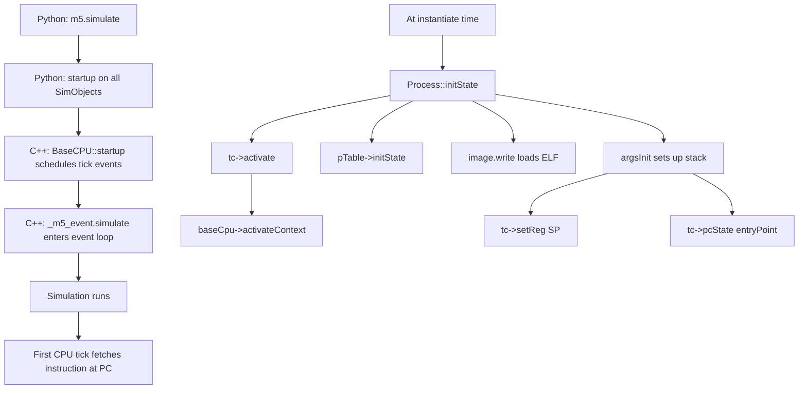

# SE Mode Deep Dive for gem5 Test Development

> **Purpose**: Comprehensive reference for writing test programs targeting gem5's Syscall Emulation (SE) mode, specifically for multi-core Ruby/CHI systems with 4x4 mesh topologies.

---

## 1. SE Mode: Concept and Architecture

### 1.1 What is SE Mode?

**Syscall Emulation (SE) mode** is a lightweight simulation paradigm where gem5 loads and executes user-space binaries directly without booting a full operating system kernel.

```
┌─────────────────────────────────────────────────────────────────────────────┐
│                          SE Mode Architecture                                │
├─────────────────────────────────────────────────────────────────────────────┤
│                                                                              │
│  ┌──────────────────────┐          ┌─────────────────────────────────────┐  │
│  │   User Binary (ELF)  │          │          gem5 Simulator              │  │
│  │                      │          │                                      │  │
│  │  ┌────────────────┐  │          │  ┌───────────────────────────────┐   │  │
│  │  │   Code Segment │  │──────────┼──┤  SEWorkload ("OS" emulator)   │   │  │
│  │  ├────────────────┤  │          │  │  • Syscall dispatch           │   │  │
│  │  │   Data Segment │  │          │  │  • Memory pool management     │   │  │
│  │  ├────────────────┤  │          │  │  • Physical page allocation   │   │  │
│  │  │   BSS Segment  │  │          │  └───────────────────────────────┘   │  │
│  │  └────────────────┘  │          │              │                        │  │
│  │          │           │          │              ▼                        │  │
│  │  ┌────────────────┐  │          │  ┌───────────────────────────────┐   │  │
│  │  │   Syscalls     │  │──────────┼──┤  Process (address space)      │   │  │
│  │  │  (ecall/trap)  │  │          │  │  • Page table (EmuPageTable)  │   │  │
│  │  └────────────────┘  │          │  │  • File descriptors           │   │  │
│  │                      │          │  │  • argv/envp                  │   │  │
│  └──────────────────────┘          │  └───────────────────────────────┘   │  │
│                                    │              │                        │  │
│                                    │              ▼                        │  │
│                                    │  ┌───────────────────────────────┐   │  │
│                                    │  │  ThreadContext (arch state)   │   │  │
│                                    │  │  • PC, SP, registers          │   │  │
│                                    │  │  • Thread status              │   │  │
│                                    │  └───────────────────────────────┘   │  │
│                                    │              │                        │  │
│                                    │              ▼                        │  │
│                                    │  ┌───────────────────────────────┐   │  │
│                                    │  │  CPU (execution engine)       │   │  │
│                                    │  │  • Fetch/Decode/Execute       │   │  │
│                                    │  │  • Event-driven simulation    │   │  │
│                                    │  └───────────────────────────────┘   │  │
│                                    │                                      │  │
│                                    └─────────────────────────────────────┘  │
└─────────────────────────────────────────────────────────────────────────────┘
```

### 1.2 SE Mode vs Full System (FS) Mode

| Aspect | SE Mode | FS Mode |
|--------|---------|---------|
| **OS Kernel** | None - syscalls emulated by simulator | Full kernel (Linux, etc.) |
| **Startup Time** | Near-instant (load binary and go) | Slow (full boot sequence) |
| **Hardware Modeling** | Minimal (sufficient for syscalls only) | Complete device tree |
| **Binary Compatibility** | Requires syscall ABI compatibility | Any OS-compatible binary |
| **Realism** | Lower - approximates syscall behavior | Higher - real kernel behavior |
| **Performance** | Faster (no kernel overhead) | Slower (realistic system) |
| **Use Cases** | CPU microarchitecture, cache studies, early protocol validation | OS research, driver development, full-system validation |

### 1.3 Core Components

#### SEWorkload (`src/sim/se_workload.hh`, `src/sim/se_workload.cc`)

Acts as the "operating system" in SE mode:

- **Physical memory management**: [`MemPools`](src/sim/mem_pool.hh) allocate physical pages from system memory ranges
- **Syscall dispatch**: [`SEWorkload::syscall()`](src/sim/se_workload.cc:62) routes syscalls to the appropriate Process
- **Architecture abstraction**: Architecture-specific subclasses (e.g., [`RiscvISA::EmuLinux`](src/arch/riscv/linux/se_workload.hh)) provide syscall tables

#### Process (`src/sim/process.hh`, `src/sim/process.cc`)

Represents a single user process with:

- **Virtual address space**: [`EmulationPageTable* pTable`](src/sim/process.hh:143) maps virtual to physical addresses
- **Binary metadata**: [`loader::ObjectFile* objFile`](src/sim/process.hh:144) stores ELF headers and entry point
- **Thread tracking**: [`std::vector<ContextID> contextIds`](src/sim/process.hh:138) lists threads belonging to this process
- **File descriptors**: [`FDArray fds`](src/sim/process.hh:163) manages open files

#### ThreadContext (`src/cpu/thread_context.hh`)

Interface to per-thread architectural state:

- **Register access**: Read/write integer, floating-point, and control registers
- **PC/SP management**: Program counter and stack pointer state
- **Status tracking**: [`Active`, `Suspended`, `Halting`, `Halted`](src/cpu/thread_context.hh:99)
- **Process binding**: [`getProcessPtr()`](src/cpu/thread_context.hh:120) retrieves owning Process

#### SETranslatingPortProxy (`src/mem/se_translating_port_proxy.hh`)

Translates virtual addresses to physical on-demand:

- Used for loading ELF segments into simulated memory
- Handles page faults by allocating physical pages via [`MemState::fixupFault()`](src/sim/mem_state.cc:387)
- Creates VMA (Virtual Memory Area) entries dynamically

### 1.4 Benefits of SE Mode

1. **Rapid iteration**: No kernel boot time—binaries execute immediately after load
2. **Deterministic results**: Removes OS scheduling variability for reproducible studies
3. **Focused studies**: Ideal for microarchitecture research where OS effects are noise
4. **Simplified debugging**: Easier tracing without kernel complexity
5. **Lower resource overhead**: No disk images, kernel memory, or device models
6. **Sampling support**: Native SimPoint/LoopPoint integration for representative simulation

### 1.5 Limitations of SE Mode

1. **Limited syscall coverage**: Only common syscalls implemented; esoteric syscalls fail
2. **No kernel behavior**: Cannot model scheduling, interrupts, or kernel contention
3. **Threading constraints**: Multi-threaded support functional but less robust than FS mode
4. **Simplified I/O**: Device drivers emulated simplistically
5. **Dynamic linking**: Requires host ISA == simulated ISA for dynamic linking support
6. **No system effects**: OS/page table overhead, syscall latency not modeled
7. **Memory model**: Simplified allocation—no realistic kernel memory management

> **Critical for Ch17**: Multi-threaded programs work but require careful thread management. Thread-to-core binding is static once established.

---

## 2. SE Mode Startup Sequence

### 2.1 High-Level Flow



### 2.2 Detailed Initialization Phases

All SimObjects follow a strict initialization order ([`_create_cpp_objects()`](src/python/m5/simulate.py:147)):

| Phase | Function | Purpose |
|-------|----------|---------|
| 1 | C++ Constructor | Create object, initialize basic members |
| 2 | [`obj.init()`](src/sim/sim_object.cc:204) | Cross-object references, port connections |
| 3 | [`obj.regStats()`](src/sim/sim_object.cc:215) | Register statistics |
| 4 | [`obj.regProbePoints()`](src/sim/sim_object.cc:223) | Register probe points |
| 5 | [`obj.regProbeListeners()`](src/sim/sim_object.cc:228) | Connect probe listeners |
| 6 | [`obj.initState()`](src/sim/sim_object.cc:240) | Initialize runtime state |
| 7 | [`obj.startup()`](src/sim/sim_object.cc:268) | Called once before simulation starts |

### 2.3 SE Mode-Specific Initialization

#### Process::initState() (`src/sim/process.cc:289`)

```cpp
void Process::initState()
{
    // Activate first thread context
    ThreadContext *tc = system->threads[contextIds[0]];
    tc->activate();                    // Mark thread as Active

    pTable->initState();               // Initialize page table

    // Create memory proxy for loading executable
    initVirtMem.reset(new SETranslatingPortProxy(tc, Always));

    // Load object file into target memory
    image.write(*initVirtMem);
    interpImage.write(*initVirtMem);
}
```

#### RiscvProcess64::initState() (`src/arch/riscv/process.cc:98`)

Architecture-specific initialization for RISC-V:

```cpp
void RiscvProcess64::initState()
{
    Process::initState();           // Call base (activates thread)

    argsInit<uint64_t>(PageBytes);  // Set up stack, argc/argv/envp

    for (ContextID ctx: contextIds) {
        auto *tc = system->threads[ctx];
        tc->setMiscRegNoEffect(MISCREG_PRV, PRV_U);  // User mode

        // Verify CPU supports U/S privilege levels
        MISA misa = tc->readMiscRegNoEffect(MISCREG_ISA);
        fatal_if(!(misa.rvu && misa.rvs), "Need U/S modes");
    }
}
```

### 2.4 Thread Activation Sequence

1. **[`tc->activate()`](src/cpu/simple_thread.cc:131)**: Marks thread status as `Active`
2. **[`baseCpu->activateContext()`](src/cpu/base.cc:369)**: Notifies CPU to start executing this thread
3. **[`argsInit()`](src/arch/riscv/process.cc:135)**: Sets up initial stack frame with argc, argv, envp, auxv
4. **Register initialization**: Sets SP to stack base and PC to ELF entry point

### 2.5 First Instruction Fetch

Once the event loop starts:

```
CPU::tick() -> Fetch::tick() -> fetch first instruction at PC (ELF entry point)
```

The CPU begins executing from the address specified in the ELF header's `e_entry` field.

---

## 3. Memory Allocation in SE Mode

### 3.1 Physical Memory Pools

SE mode uses [`MemPools`](src/sim/mem_pool.hh) to manage physical memory:

```cpp
// SEWorkload::setSystem() (se_workload.cc:47)
void SEWorkload::setSystem(System *sys)
{
    Workload::setSystem(sys);
    AddrRangeList memories = sys->getPhysMem().getConfAddrRanges();
    memPools.populate(memories);  // Creates MemPool per memory controller
}
```

Each memory controller's address range becomes a separate physical memory pool.

### 3.2 Virtual Address Space Layout

#### RISC-V 64-bit Layout (`src/arch/riscv/process.cc:71`)

```
0x7FFF_FFFF_FFFF_FFFF  +------------------+
                       |      Stack       |  Grows downward
                       |  (argc/argv/    |  Initialized with auxv
                       |   envp/auxv)    |
                       +------------------+
                       |                  |
                       |   Free Space     |
                       |                  |
                       +------------------+
                       |       Heap       |  Grows upward via brk()
                       |   (data end)     |
                       +------------------+
                       |                  |
                       | Code/Data/BSS    |  Loaded from ELF PT_LOAD
                       |                  |
0x0000_0000_0000_0000  +------------------+
```

Key addresses:
- **Stack base**: `0x7FFFFFFFFFFFFFFF` (top of user space)
- **Mmap end**: `0x4000000000000000` (mmap grows downward from here)
- **brk point**: End of loaded data segment (rounded to page boundary)

### 3.3 ELF Loading Process

#### Phase 1: ELF Parsing (`src/base/loader/elf_object.cc:109`)

```cpp
void ElfObject::handleLoadableSegment(GElf_Phdr phdr, int seg_num) {
    // PT_LOAD segment: map file contents to memory
    image.addSegment({ name, phdr.p_paddr, imageData,
                       phdr.p_offset, phdr.p_filesz });

    // Handle BSS (uninitialized data)
    if (uninitialized) {
        image.addSegment({ name + "(uninitialized)",
                           phdr.p_paddr + phdr.p_filesz,
                           uninitialized });
    }
}
```

#### Phase 2: Memory Writing (`src/sim/process.cc:305`)

```cpp
// In Process::initState():
image.write(*initVirtMem);
interpImage.write(*initVirtMem);
```

The [`MemoryImage::write()`](src/base/loader/memory_image.hh) iterates through segments and writes to simulated memory using the translating proxy.

#### Phase 3: Page Fault Handling (`src/sim/mem_state.cc:387`)

When a virtual address is accessed without a backing physical page:

```cpp
bool MemState::fixupFault(Addr vaddr, int npages, bool allocate)
{
    // Allocate physical pages
    Addr paddr = seWorkload->allocPhysPages(npages);

    // Map in page table
    pTable->map(vaddr, paddr, npages * PageBytes);

    // Create VMA entry
    return true;
}
```

Physical pages are allocated lazily on first access via page faults.

### 3.4 Multiple DDR Controllers (Critical for 4x4 Mesh)

**Important Limitation**: By default, SE mode allocates from **pool_id=0 only**:

```cpp
// Process::allocateMem() calls:
const Addr paddr = seWorkload->allocPhysPages(npages);  // pool_id defaults to 0
```

This means **with 2 DDR controllers in your 4x4 mesh, the program loads entirely into the first memory controller** unless you explicitly stripe allocations.

**To use multiple DDRs**, you would need to:
1. Modify allocation logic to round-robin across pools
2. Or manually assign different processes to different pools
3. Or use NUMA-aware allocation (not natively supported in SE mode)

### 3.5 Stack Initialization (`src/arch/riscv/process.cc:135`)

The [`argsInit()`](src/arch/riscv/process.cc:135) template function creates the initial stack frame:

```cpp
template<class IntType> void RiscvProcess::argsInit(int pageSize) {
    // 1. Calculate stack top
    Addr stack_top = memState->getStackMin();
    stack_top -= RandomBytes;  // 16 bytes for AT_RANDOM

    // 2. Reserve space for argv/envp strings
    for (const std::string& arg: argv)
        stack_top -= arg.size() + 1;
    for (const std::string& env: envp)
        stack_top -= env.size() + 1;

    // 3. Build auxiliary vector (auxv)
    std::vector<gem5::auxv::AuxVector<IntType>> auxv;
    auxv.emplace_back(gem5::auxv::Entry, objFile->entryPoint());
    auxv.emplace_back(gem5::auxv::Phnum, elfObject->programHeaderCount());
    auxv.emplace_back(gem5::auxv::Phent, elfObject->programHeaderSize());
    auxv.emplace_back(gem5::auxv::Phdr, elfObject->programHeaderTable());
    auxv.emplace_back(gem5::auxv::Pagesz, PageBytes);
    auxv.emplace_back(gem5::auxv::Random, stack_top);
    auxv.emplace_back(gem5::auxv::Null, 0);

    // 4. Map stack region
    memState->mapRegion(roundDown(stack_top, pageSize),
                        roundUp(memState->getStackSize(), pageSize), "stack");

    // 5. Write data to stack
    // ... write random bytes, argv strings, envp strings ...

    // 6. Set up stack frame (pushed in reverse order)
    // pushOntoStack(argc)
    // pushOntoStack(argv[0] pointer)
    // pushOntoStack(argv[1] pointer)
    // ...
    // pushOntoStack(NULL)  // argv terminator
    // pushOntoStack(envp[0] pointer)
    // ...
    // pushOntoStack(NULL)  // envp terminator
    // pushOntoStack(auxv[0].type)
    // pushOntoStack(auxv[0].value)
    // ...

    // 7. Set initial registers
    tc->setReg(StackPointerReg, memState->getStackMin());
    tc->pcState(getStartPC());
}
```

**Stack contents (high to low addresses):**
```
[  argc  ]  <-- Stack Pointer (SP) points here
[ argv[0] pointer ]
[ argv[1] pointer ]
...
[ NULL ]  (argv terminator)
[ envp[0] pointer ]
[ envp[1] pointer ]
...
[ NULL ]  (envp terminator)
[ auxv[0].type ]
[ auxv[0].value ]
...
[ auxv[NULL].type ]
[ auxv[NULL].value ]
[ argv[0] string data ]
[ argv[1] string data ]
...
[ envp[0] string data ]
[ envp[1] string data ]
...
[ 16 random bytes for AT_RANDOM ]
```

### 3.6 Static vs Dynamic Allocation

| Aspect | Static Allocation | Dynamic Allocation |
|--------|-------------------|-------------------|
| **When** | Process initialization | During execution |
| **Source** | ELF PT_LOAD segments | System calls (brk/mmap) |
| **Physical pages** | Allocated on first access | Allocated on demand |
| **Key code** | [`Process::initState()`](src/sim/process.cc:289) | [`brkFunc()`](src/sim/syscall_emul.cc:277), [`mmapFunc()`](src/sim/syscall_emul.hh:2116) |
| **Direction** | Fixed at load time | Heap grows up, mmap grows down |
| **VMA tracking** | Created in [`MemState`](src/sim/mem_state.hh) at init | Created dynamically in [`MemState`](src/sim/mem_state.hh) |

#### Heap Management (brk)

```cpp
// syscall_emul.cc:277
SyscallReturn brkFunc(SyscallDesc *desc, ThreadContext *tc, VPtr<> new_brk) {
    auto p = tc->getProcessPtr();
    std::shared_ptr<MemState> mem_state = p->memState;
    Addr brk_point = mem_state->getBrkPoint();

    if (new_brk == 0 || (new_brk == brk_point))
        return brk_point;  // Query current break

    // Expand or contract heap
    mem_state->updateBrkRegion(brk_point, new_brk);
    return mem_state->getBrkPoint();
}
```

#### Mmap Management

```cpp
// syscall_emul.hh:2116
template <class OS>
SyscallReturn mmapFunc(SyscallDesc *desc, ThreadContext *tc, ...) {
    // Find suitable address if not MAP_FIXED
    if (!(tgt_flags & OS::TGT_MAP_FIXED)) {
        start = p->memState->extendMmap(length);
    }

    // Map region
    p->memState->mapRegion(start, length, region_name, sim_fd, offset);
    return (Addr)start;
}
```

---

## 4. Processes and Threads in SE Mode

### 4.1 Component Relationships

```
┌─────────────────────────────────────────────────────────────────────────────┐
│                              System                                          │
│  ┌─────────────────────────────────────────────────────────────────────┐   │
│  │                      threads (vector<ThreadContext*>)                │   │
│  │  ┌──────────────┐  ┌──────────────┐  ┌──────────────┐              │   │
│  │  │ Thread 0     │  │ Thread 1     │  │ Thread 2     │  ...         │   │
│  │  │ (ContextID 0)│  │ (ContextID 1)│  │ (ContextID 2)│              │   │
│  │  └──────────────┘  └──────────────┘  └──────────────┘              │   │
│  │         │                 │                 │                       │   │
│  │         └─────────────────┴─────────────────┘                       │   │
│  │                           │                                          │   │
│  │                    getProcessPtr()                                   │   │
│  │                           │                                          │   │
│  │                           ▼                                          │   │
│  │  ┌────────────────────────────────────────────────────────────────┐  │   │
│  │  │                        Process                                  │  │   │
│  │  │  • contextIds = [0, 1, 2]  (threads belonging to process)      │  │   │
│  │  │  • pTable (EmuPageTable)                                       │  │   │
│  │  │  • fds (file descriptors)                                      │  │   │
│  │  └────────────────────────────────────────────────────────────────┘  │   │
│  └─────────────────────────────────────────────────────────────────────┘   │
│                                     │                                       │
│                                     │ getCpuPtr()                           │
│                                     ▼                                       │
│  ┌─────────────────────────────────────────────────────────────────────┐   │
│  │                         CPU                                        │   │
│  │  • cpuId (hardware ID)                                             │   │
│  │  • threadContexts[] (TCs bound to this CPU)                        │   │
│  └─────────────────────────────────────────────────────────────────────┘   │
└─────────────────────────────────────────────────────────────────────────────┘
```

### 4.2 Multiple Processes Support

**Yes**, SE mode supports multiple processes with limitations:

#### Static Multi-Process Configuration

```python
# Each CPU can run a different process
for i in range(num_cpus):
    system.cpu[i].workload = processes[i]
    system.cpu[i].createThreads()
```

#### Dynamic Process Creation (clone)

Threads are created dynamically via the [`clone()`](src/sim/syscall_emul.hh:1833) syscall:

```cpp
// syscall_emul.hh:1851
ThreadContext *ctc;
if (!(ctc = tc->getSystemPtr()->threads.findFree())) {
    return -EAGAIN;  // No free thread context available
}

// Copy thread state and activate
// ... setup new thread context ...
ctc->activate();
```

**Limitation**: The number of thread contexts is fixed at configuration time. If all contexts are active, `clone()` fails with `-EAGAIN`.

### 4.3 Thread-to-Core Mapping

#### Static Mapping (Configuration Time)

Each CPU owns specific ThreadContexts:

```cpp
// base.cc:492
void BaseCPU::registerThreadContexts() {
    for (ThreadID tid = 0; tid < threadContexts.size(); ++tid) {
        ThreadContext *tc = threadContexts[tid];

        system->registerThreadContext(tc);  // Assigns global ContextID

        if (!FullSystem)  // SE mode
            tc->getProcessPtr()->assignThreadContext(tc->contextId());
    }
}
```

**Key point**: Threads are bound to the CPU that owns their ThreadContext. There is **no dynamic migration** between cores.

#### Finding Free Thread Contexts

```cpp
// system.cc:120
ThreadContext* findFree() {
    for (ThreadContext *tc: threads) {
        if (tc->status() == ThreadContext::Halted)
            return tc;  // Reuse halted context
    }
    return nullptr;  // No free contexts
}
```

### 4.4 Determining Thread's Core

#### From Simulated Program

Use the [`getcpu()`](src/sim/syscall_emul.cc:1441) syscall:

```cpp
// syscall_emul.cc:1441
SyscallReturn getcpuFunc(SyscallDesc *desc, ThreadContext *tc,
                         VPtr<> cpu, VPtr<> node) {
    if (cpu)
        *cpu = htog(tc->contextId(), tc->getSystemPtr()->getGuestByteOrder());
    return 0;
}
```

From C/C++ code:
```c
#include <sched.h>

int main() {
    unsigned cpu, node;
    getcpu(&cpu, &node);  // cpu = ContextID
    printf("Running on CPU %u\n", cpu);
    return 0;
}
```

#### From C++ Simulation Code

```cpp
ThreadContext *tc = ...;

// Get CPU ID
int cpu_id = tc->cpuId();           // Hardware CPU ID

// Get system-wide context ID
ContextID ctx_id = tc->contextId(); // Unique across all threads

// Get thread ID within CPU
ThreadID tid = tc->threadId();      // Per-CPU unique ID
```

### 4.5 Thread Scheduling

SE mode has **no true OS scheduling**. Threads execute cooperatively:

#### Thread States

```cpp
// thread_context.hh:99
enum Status {
    Active,      // Executing instructions
    Suspended,   // Temporarily inactive (waiting on futex)
    Halting,     // Preparing to exit
    Halted       // Permanently shut down, context available for reuse
};
```

#### Activation Flow

```cpp
// simple_thread.cc:131
void SimpleThread::activate() {
    if (status() == ThreadContext::Active)
        return;

    lastActivate = curTick();
    _status = ThreadContext::Active;
    baseCpu->activateContext(_threadId);  // Notify CPU to schedule this thread
}
```

#### Synchronization via Futex

```cpp
// syscall_emul.hh:382
SyscallReturn futexFunc(SyscallDesc *desc, ThreadContext *tc, ...) {
    switch (op) {
        case FUTEX_WAIT:
            // Suspend thread until woken
            futex_map.suspend(tc, uaddr, timeout);
            break;
        case FUTEX_WAKE:
            // Wake waiting threads
            futex_map.wakeup(uaddr, val);
            break;
    }
}
```

### 4.6 Thread Affinity (sched_setaffinity)

**Limited support**: The [`sched_setaffinity`](src/arch/riscv/linux/se_workload.cc:655) syscall is **ignored** in SE mode:

```cpp
// RISC-V SE syscall table (se_workload.cc:655)
{122, "sched_setaffinity"},  // No handler = ignored
```

**Workarounds**:

1. **Static assignment**: Assign processes to specific CPUs at configuration time
2. **ContextID awareness**: Use `getcpu()` to determine current core
3. **Custom syscall handler**: Implement affinity checking against ContextIDs

### 4.7 Writing Multi-Threaded SE Mode Programs

#### Compilation Requirements

```bash
# Static linking REQUIRED for SE mode
riscv64-linux-gnu-g++ -static -pthread -std=c++11 -O2 \
    threads.cpp -o threads.riscv
```

Key flags:
- `-static`: Essential (no dynamic linker support)
- `-pthread`: Enables pthread support
- `-O2`: Optimization level (adjust as needed)

#### Threading Pattern for SE Mode

```cpp
// tests/test-progs/threads/src/threads.cpp pattern
#include <thread>
#include <vector>
#include <iostream>

void worker_thread(int tid) {
    // Thread work here
    std::cout << "Thread " << tid << " running\n";
}

int main() {
    unsigned num_threads = std::thread::hardware_concurrency();
    std::vector<std::thread> threads;

    // Create N-1 threads (last thread runs on main context)
    for (unsigned i = 0; i < num_threads - 1; ++i) {
        threads.emplace_back(worker_thread, i);
    }

    // Run last thread's work on main context
    worker_thread(num_threads - 1);

    // Join all threads
    for (auto& t : threads) {
        t.join();
    }

    return 0;
}
```

**Critical pattern**: Create `num_cores - 1` threads; run the last thread's work on the main context. This avoids exhausting thread contexts in SE mode.

---

## 5. Essential Topics for Test Development

### 5.1 m5ops (Simulator Control)

m5ops provide simulator control from within the simulated program:

| m5op | Function | Use Case |
|------|----------|----------|
| `m5_exit()` | End simulation | Clean exit with status code |
| `m5_dump_stats()` | Dump statistics | Checkpoint performance data |
| `m5_reset_stats()` | Reset statistics | Start measuring from this point |
| `m5_work_begin()` | Mark work start | Region-of-interest begin |
| `m5_work_end()` | Mark work end | Region-of-interest end |
| `m5_fail()` | Fail simulation | Error conditions |

**Usage example**:
```c
#include <gem5/m5ops.h>

int main() {
    m5_reset_stats();      // Clear stats

    // ... workload ...

    m5_dump_stats();       // Save stats
    m5_exit(0);            // Exit simulation
    return 0;
}
```

**Compilation**:
```bash
# Include path for m5ops.h
-I$GEM5/include

# Link with m5ops (static library)
-L$GEM5/util/m5/build/riscv/out -lm5
```

### 5.2 Memory Access Patterns for Coherence Testing

#### False Sharing Pattern

```cpp
// threads.cpp demonstrates false sharing
const int array_size = 1024 * 1024;
int data[array_size];  // Shared array

void worker(int tid, int num_threads) {
    // Each thread touches adjacent elements (false sharing)
    for (int i = tid; i < array_size; i += num_threads) {
        data[i]++;  // Cache line bounces between cores
    }
}
```

#### Private Data Pattern

```cpp
void worker(int tid) {
    int local_data[1024];  // Stack-allocated (thread-private)

    for (int i = 0; i < 1024; i++) {
        local_data[i] = tid * 1000 + i;  // No coherence traffic
    }
}
```

#### True Sharing Pattern

```cpp
volatile int shared_counter = 0;
std::mutex mtx;

void worker() {
    for (int i = 0; i < 1000; i++) {
        std::lock_guard<std::mutex> lock(mtx);
        shared_counter++;  // Serialized access
    }
}
```

### 5.3 Traffic Generators for Network Testing

For pure NoC studies without CPU complexity:

```python
# tests/gem5/traffic_gen/configs/simple_traffic_run.py
from gem5.components.processors.traffic_generator import TrafficGenerator

traffic_gen = TrafficGenerator(
    duration="1ms",
    rate="100GB/s",
    num_packets=10000,
    min_addr=0x1000,
    max_addr=0x1000000,
    block_size=64,  # Cache line size
)
```

Traffic patterns:
- **Uniform Random**: Random destination per packet
- **Bit Complement**: Dest = ~Src
- **Bit Reverse**: Dest = reverse_bits(Src)
- **Transpose**: Swap high/low bits
- **Tornado**: (Src + cores/2 - 1) % cores

### 5.4 Ruby/CHI Protocol Selection

#### Available Protocols

| Protocol | Coherence Model | Use Case |
|----------|----------------|----------|
| MESI Two Level | Invalidate-based | General-purpose SMP |
| MOESI | Ownership-based | Directory protocols |
| MSI | Basic invalidate | Teaching, simple validation |
| MI | Minimal | Smoke testing, baseline |
| CHI | AMBA CHI spec | ARM ecosystem, modern systems |

#### CHI Configuration Example

```python
from gem5.coherence_protocol import CoherenceProtocol
from gem5.components.cachehierarchies.chi.private_l1_cache_hierarchy import (
    PrivateL1CacheHierarchy,
)

requires(isa_required=ISA.RISCV,
         coherence_protocol_required=CoherenceProtocol.CHI)

cache_hierarchy = PrivateL1CacheHierarchy(
    size="512KiB",
    assoc=8,
)

# CHI uses specific topology configurations
# See: tests/gem5/chi_protocol/configs/chi-with-isa.py
```

### 5.5 Statistics and Debugging

#### Key Statistics for Memory Studies

```
sim_ticks                 # Total simulation time
system.cpu*.numCycles     # CPU cycle count
system.cpu*.numLoadInsts  # Load instruction count
system.cpu*.numStoreInsts # Store instruction count

# Ruby-specific
system.ruby.*.m_cache.*.numDataReads
system.ruby.*.m_cache.*.numDataWrites
system.ruby.*.m_cache.*.numMisses

# NoC-specific (Garnet)
system.ruby.network.*.avg_flit_latency
system.ruby.network.*.avg_network_latency
system.ruby.network.*.avg_hops
```

#### Debug Flags

```bash
# Enable debug tracing
./build/RISCV/gem5.opt --debug-flags=RubyCache,RubyQueue \
    configs/example/ruby_random_test.py

# Useful flags for memory debugging:
# - RubyCache: Cache controller events
# - RubyQueue: Message buffer activity
# - RubyNetwork: Network traffic
# - RubyPort: Port interface events
# - MemoryAccess: Physical memory accesses
```

### 5.6 Checkpoint and Restore

For long-running simulations:

```python
# Create checkpoint
m5.checkpoint("checkpoint_dir/")

# Restore from checkpoint
# (Specify checkpoint directory as argument to simulation script)
```

**Note**: SE mode checkpoints capture process state but may have limitations with open file descriptors and thread states.

### 5.7 Test Program Templates

#### Template 1: Basic Memory Bandwidth Test

```cpp
// bandwidth.cpp
#include <cstring>
#include <chrono>

void bandwidth_test(char* src, char* dst, size_t size, int iterations) {
    for (int i = 0; i < iterations; i++) {
        memcpy(dst, src, size);
    }
}

int main() {
    const size_t BUFFER_SIZE = 64 * 1024 * 1024;  // 64 MB
    char* src = new char[BUFFER_SIZE];
    char* dst = new char[BUFFER_SIZE];

    // Initialize with pattern
    memset(src, 0xAB, BUFFER_SIZE);

    m5_reset_stats();
    bandwidth_test(src, dst, BUFFER_SIZE, 100);
    m5_dump_stats();

    delete[] src;
    delete[] dst;
    return 0;
}
```

#### Template 2: Latency Test (Pointer Chasing)

```cpp
// latency.cpp
#include <random>
#include <vector>

struct Node {
    Node* next;
    char padding[64 - sizeof(Node*)];  // Cache line sized
};

uint64_t pointer_chase(Node* head, int iterations) {
    volatile uint64_t sum = 0;
    Node* current = head;

    for (int i = 0; i < iterations; i++) {
        sum += (uint64_t)current;
        current = current->next;
    }

    return sum;
}

int main() {
    const int NUM_NODES = 1000000;
    std::vector<Node> nodes(NUM_NODES);

    // Create random linked list
    std::vector<int> indices(NUM_NODES);
    for (int i = 0; i < NUM_NODES; i++) indices[i] = i;
    std::random_shuffle(indices.begin(), indices.end());

    for (int i = 0; i < NUM_NODES - 1; i++) {
        nodes[indices[i]].next = &nodes[indices[i + 1]];
    }
    nodes[indices[NUM_NODES - 1]].next = &nodes[indices[0]];  // Circular

    m5_reset_stats();
    pointer_chase(&nodes[0], 10000000);
    m5_dump_stats();

    return 0;
}
```

#### Template 3: Synchronization Stress Test

```cpp
// sync_stress.cpp
#include <thread>
#include <atomic>
#include <vector>

std::atomic<int> counter{0};
const int ITERATIONS = 100000;

void worker() {
    for (int i = 0; i < ITERATIONS; i++) {
        counter.fetch_add(1, std::memory_order_seq_cst);
    }
}

int main() {
    unsigned num_threads = std::thread::hardware_concurrency();
    std::vector<std::thread> threads;

    m5_reset_stats();

    for (unsigned i = 0; i < num_threads - 1; i++) {
        threads.emplace_back(worker);
    }
    worker();  // Main thread participates

    for (auto& t : threads) t.join();

    m5_dump_stats();

    printf("Final counter: %d (expected: %d)\n",
           counter.load(), ITERATIONS * num_threads);
    return 0;
}
```

### 5.8 Compilation and Running Recipes

#### Cross-Compilation Setup

```bash
# Ubuntu/Debian
sudo apt-get install gcc-riscv64-linux-gnu g++-riscv64-linux-gnu

# Compile for RISC-V SE mode
riscv64-linux-gnu-g++ -static -O2 -o program.riscv program.cpp

# With pthread support
riscv64-linux-gnu-g++ -static -pthread -O2 -o program.riscv program.cpp

# With m5ops
riscv64-linux-gnu-g++ -static -O2 \
    -I$GEM5/include \
    -o program.riscv program.cpp \
    -L$GEM5/util/m5/build/riscv/out -lm5
```

#### Running Tests

```bash
# Basic SE mode run
./build/RISCV/gem5.opt -d m5out/test \
    configs/example/ruby_random_test.py \
    --num-cpus=4 \
    --mem-size=4GB \
    --cmd=tests/test-progs/hello/bin/riscv/linux/hello

# Multi-core with CHI
./build/RISCV/gem5.opt -d m5out/chi_test \
    tests/gem5/chi_protocol/configs/chi-with-isa.py \
    --isa=RISCV \
    --binary=path/to/program.riscv \
    --num-cores=16

# With custom Ruby topology (4x4 mesh)
./build/RISCV/gem5.opt -d m5out/mesh_test \
    configs/example/garnet_synth_traffic.py \
    --topology=Mesh_XY \
    --num-cpus=16 \
    --num-dirs=4 \
    --mesh-rows=4
```

---

## 6. Common Pitfalls and Solutions

### 6.1 Dynamic Linking Errors

**Problem**: Program fails with "cannot find shared library"

**Solution**: Always compile with `-static` flag for SE mode.

### 6.2 Thread Context Exhaustion

**Problem**: `clone()` returns `-EAGAIN`

**Solution**: Ensure number of threads ≤ number of CPUs configured. Use the `num_threads - 1` pattern for pthread programs.

### 6.3 Memory Controller Imbalance

**Problem**: All traffic goes to first DDR controller

**Solution**: SE mode allocates from pool 0 by default. For balanced traffic, use multiple processes assigned to different address ranges or modify allocation logic to stripe across pools.

### 6.4 Stack Overflow

**Problem**: Program crashes with stack corruption

**Solution**: Increase stack size in Process parameters or reduce stack usage in program.

### 6.5 Syscall Not Implemented

**Problem**: "syscall X not implemented" warning

**Solution**: Check syscall compatibility. May need to implement custom handler or modify program to avoid that syscall.

---

## 7. Quick Reference: Key File Paths

| Component | Header | Implementation |
|-----------|--------|----------------|
| SEWorkload | [`src/sim/se_workload.hh`](src/sim/se_workload.hh) | [`src/sim/se_workload.cc`](src/sim/se_workload.cc) |
| Process | [`src/sim/process.hh`](src/sim/process.hh) | [`src/sim/process.cc`](src/sim/process.cc) |
| ThreadContext | [`src/cpu/thread_context.hh`](src/cpu/thread_context.hh) | [`src/cpu/simple_thread.cc`](src/cpu/simple_thread.cc) |
| MemPools | [`src/sim/mem_pool.hh`](src/sim/mem_pool.hh) | [`src/sim/mem_pool.cc`](src/sim/mem_pool.cc) |
| MemState | [`src/sim/mem_state.hh`](src/sim/mem_state.hh) | [`src/sim/mem_state.cc`](src/sim/mem_state.cc) |
| Syscall Emulation | [`src/sim/syscall_emul.hh`](src/sim/syscall_emul.hh) | [`src/sim/syscall_emul.cc`](src/sim/syscall_emul.cc) |
| RISC-V Process | [`src/arch/riscv/process.hh`](src/arch/riscv/process.hh) | [`src/arch/riscv/process.cc`](src/arch/riscv/process.cc) |
| RISC-V SE Workload | [`src/arch/riscv/linux/se_workload.hh`](src/arch/riscv/linux/se_workload.hh) | [`src/arch/riscv/linux/se_workload.cc`](src/arch/riscv/linux/se_workload.cc) |
| SE Binary Workload | — | [`src/python/gem5/components/boards/se_binary_workload.py`](src/python/gem5/components/boards/se_binary_workload.py) |

---

## 8. Summary: Writing Tests for Chapter 17

For your 4x4 mesh Ruby system with 2 DDR controllers:

1. **Compile all test programs with `-static -pthread`**
2. **Use the N-1 threading pattern** for pthread programs
3. **Expect all allocations from first DDR** unless you implement pool striping
4. **Use `getcpu()` syscall** to verify thread-to-core mapping
5. **Use m5ops** for clean simulation boundaries and statistics collection
6. **Start with simple patterns** (bandwidth, latency) before complex coherence tests
7. **Enable Ruby debug flags** when tests fail to understand protocol behavior

**Next Steps**: See [`ruby-book/Ch17_FinalProject.md`](ruby-book/Ch17_FinalProject.md) for specific test requirements and validation criteria.
