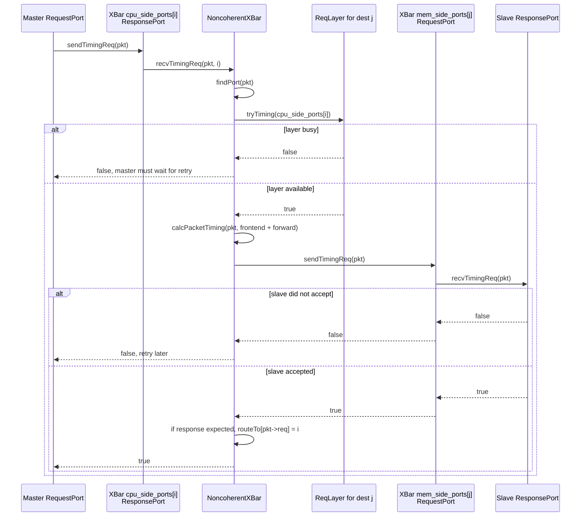
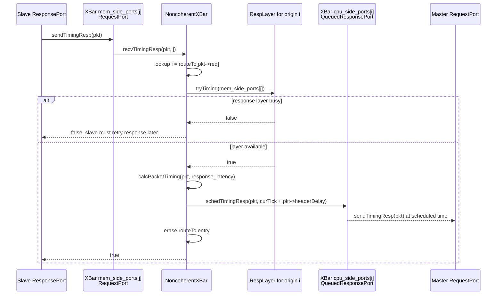
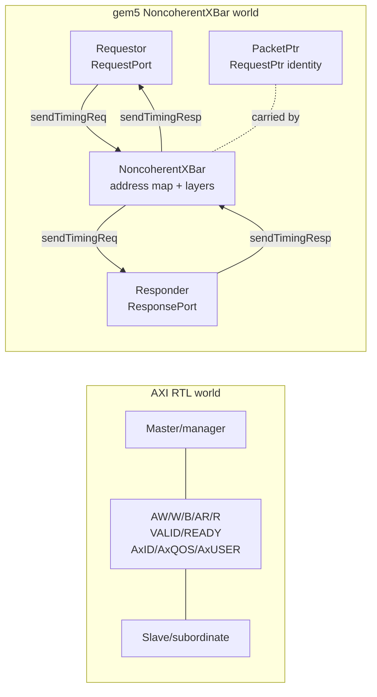

# Modeling a Non-Coherent AXI Crossbar with gem5 NoncoherentXBar

**Audience:** Engineers who know AMBA AXI crossbars and want to use gem5's
classic memory-system crossbar as the closest built-in model for a plain
non-coherent AXI interconnect.

**Scope.** This document explains what `NoncoherentXBar` is, how masters and
slaves connect to it at the Python and C++ levels, what interface those peers
use, and where the model stops being an AXI-channel model. All gem5 behavior
described here is grounded in the source files listed below. AXI-specific
channel terminology is grounded in the AMBA AXI crossbar notes in
[`crossbars_axi.md`](crossbars_axi.md), which cite the AMBA AXI specification
and common AXI crossbar implementations.

**Primary code anchors:**
- [`src/mem/XBar.py`](../../src/mem/XBar.py) - Python SimObject declarations
  for `BaseXBar`, `NoncoherentXBar`, and `IOXBar`.
- [`src/mem/noncoherent_xbar.hh`](../../src/mem/noncoherent_xbar.hh) /
  [`noncoherent_xbar.cc`](../../src/mem/noncoherent_xbar.cc) - C++ ports and
  timing/atomic/functional forwarding logic.
- [`src/mem/xbar.hh`](../../src/mem/xbar.hh) /
  [`xbar.cc`](../../src/mem/xbar.cc) - shared crossbar layers, address map,
  default port, retries, packet timing, and stats.
- [`src/mem/port.hh`](../../src/mem/port.hh),
  [`src/mem/protocol/timing.hh`](../../src/mem/protocol/timing.hh),
  [`atomic.hh`](../../src/mem/protocol/atomic.hh), and
  [`functional.hh`](../../src/mem/protocol/functional.hh) - gem5
  `RequestPort`/`ResponsePort` transport contracts.
- [`src/python/m5/params/port_params.py`](../../src/python/m5/params/port_params.py)
  and [`src/python/m5/SimObject.py`](../../src/python/m5/SimObject.py) -
  Python-level port assignment, vector-port append behavior, and C++ binding.
- [`src/learning_gem5/part2/simple_memobj.hh`](../../src/learning_gem5/part2/simple_memobj.hh)
  / [`simple_memobj.cc`](../../src/learning_gem5/part2/simple_memobj.cc) -
  small request/response port implementation example.
- [`configs/learning_gem5/part1/simple-riscv.py`](../../configs/learning_gem5/part1/simple-riscv.py),
  [`configs/ruby/Ruby.py`](../../configs/ruby/Ruby.py), and
  [`src/dev/Device.py`](../../src/dev/Device.py) - practical connection
  examples, including `BadAddr`.
- [`src/mem/coherent_xbar.hh`](../../src/mem/coherent_xbar.hh) /
  [`coherent_xbar.cc`](../../src/mem/coherent_xbar.cc) and
  [`src/systemc/tlm_bridge/TlmBridge.py`](../../src/systemc/tlm_bridge/TlmBridge.py)
  - relevant alternatives when non-coherent packet routing is not enough.

## Contents

1. [Short Answer](#1-short-answer)
2. [Terminology Map: AXI vs gem5](#2-terminology-map-axi-vs-gem5)
3. [Python-Level Connection Mechanics](#3-python-level-connection-mechanics)
4. [C++ Port Construction Inside NoncoherentXBar](#4-c-port-construction-inside-noncoherentxbar)
5. [What a Master Must Implement](#5-what-a-master-must-implement)
6. [What a Slave Must Implement](#6-what-a-slave-must-implement)
7. [Request Flow Through NoncoherentXBar](#7-request-flow-through-noncoherentxbar)
8. [Response Flow Through NoncoherentXBar](#8-response-flow-through-noncoherentxbar)
9. [Address Decoding and Default Routing](#9-address-decoding-and-default-routing)
10. [Timing, Bandwidth, and Contention](#10-timing-bandwidth-and-contention)
11. [Atomic and Functional Accesses](#11-atomic-and-functional-accesses)
12. [What NoncoherentXBar Can Model for an AXI Crossbar](#12-what-noncoherentxbar-can-model-for-an-axi-crossbar)
13. [What It Does Not Model](#13-what-it-does-not-model)
14. [When Existing NoncoherentXBar Is Enough](#14-when-existing-noncoherentxbar-is-enough)
15. [When You Need a More Detailed Custom SimObject](#15-when-you-need-a-more-detailed-custom-simobject)
16. [When You Need SystemC/TLM or RTL Co-Simulation](#16-when-you-need-systemctlm-or-rtl-co-simulation)
17. [Options for Matching RTL AXI Crossbar Cycle-Accurate Latency and Bandwidth](#17-options-for-matching-rtl-axi-crossbar-cycle-accurate-latency-and-bandwidth)
18. [Mental Model](#18-mental-model)
19. [Checklist for Connecting a New Master and Slave](#19-checklist-for-connecting-a-new-master-and-slave)
20. [Common Pitfalls](#20-common-pitfalls)
21. [Bottom Line](#21-bottom-line)

---

## 1. Short Answer

For a plain, non-coherent AXI-style crossbar in gem5, use:

- `NoncoherentXBar` when you want to specify `width`, `frontend_latency`,
  `forward_latency`, and `response_latency` explicitly.
- `IOXBar` when you want gem5's predefined non-coherent I/O crossbar defaults.
  `IOXBar` is a subclass of `NoncoherentXBar` in `src/mem/XBar.py`.
  In this tree those defaults are `width = 16` bytes,
  `frontend_latency = 2`,
  `forward_latency = 1`, and `response_latency = 2`.

The C++ source comment for `NoncoherentXBar` explicitly describes it as a
template for PCIe, non-coherent AMBA, and OCP buses, and says it is typically
used for I/O buses. It also says no snoops reach any mem-side port on the
non-coherent crossbar itself.

At the interface level, this is **not** an RTL AXI interface. A master does not
drive AW/W/B/AR/R signals into the crossbar. Instead:

- A gem5 requestor/master owns a `RequestPort`.
- A gem5 responder/slave owns a `ResponsePort`.
- A `RequestPort` sends `Packet` objects to a peer `ResponsePort`.
- A `ResponsePort` receives requests and sends responses back to the peer
  `RequestPort`.

`NoncoherentXBar` sits between those peers:

```text
requestor/master                 NoncoherentXBar                  responder/slave
----------------                 ----------------                  ---------------
                 request path, routed by address
RequestPort  ----------------------------------------------------------> ResponsePort
   ^                              cpu_side_ports[i]        mem_side_ports[j]   |
   |                              (xbar ResponsePort)      (xbar RequestPort)  |
   |                                                                           |
   +----------------------------------------------------------- send response --+
                 response path, routed by original RequestPtr
```

The left-side `RequestPort` is one master port, not two ports. A gem5
`RequestPort` both sends requests and receives responses. Likewise, a gem5
`ResponsePort` receives requests and sends responses.

This is the most important interface difference from AXI terminology: gem5's
`RequestPort` and `ResponsePort` are not unidirectional wires. They are paired
C++ protocol objects with methods for request, response, retry, address-range,
atomic, and functional traffic.

The confusing part is intentional gem5 naming:

- `cpu_side_ports` are on the side closer to CPUs/requestors. The xbar exposes
  them as `VectorResponsePort`, because the xbar receives requests there.
- `mem_side_ports` are on the side closer to memory/responders. The xbar exposes
  them as `VectorRequestPort`, because the xbar sends requests there.

---

## 2. Terminology Map: AXI vs gem5

| AXI term | gem5 classic memory term | Concrete gem5 interface |
|---|---|---|
| Master / manager | Requestor | `RequestPort` |
| Slave / subordinate | Responder | `ResponsePort` |
| AXI transaction | gem5 memory operation identity plus transport packet | `Request` plus `Packet` |
| AXI address decode | xbar destination lookup | `BaseXBar::findPort()` and `portMap` |
| AXI default slave / decode error | default responder | xbar `default` port, often connected to `BadAddr.pio` |
| AXI response routing | route response to originating requestor | `BaseXBar::routeTo[RequestPtr]` |
| AXI per-output contention | xbar layer contention | `ReqLayer` per mem-side destination, `RespLayer` per cpu-side destination |
| AXI channel handshakes | gem5 timing protocol retry handshake | `sendTimingReq/Resp` and retry callbacks |

This mapping is useful for architecture-level modeling, but it is not a signal
mapping. `NoncoherentXBar` has no AW, W, B, AR, or R pins.

---

## 3. Python-Level Connection Mechanics

### 3.1 The xbar ports declared in Python

`BaseXBar` declares these Python ports in `src/mem/XBar.py`:

```python
cpu_side_ports = VectorResponsePort(
    "Vector port for connecting mem side ports"
)
mem_side_ports = VectorRequestPort(
    "Vector port for connecting cpu side ports"
)
default = RequestPort("Port for connecting an optional default responder")
```

Read the type names, not only the attribute names:

- `VectorResponsePort` means "many responder-side ports." A peer requestor can
  send requests into each element.
- `VectorRequestPort` means "many requestor-side ports." Each element sends
  requests onward to a peer responder.
- `default` is a scalar `RequestPort`. It connects to a default responder's
  `ResponsePort`.

`NoncoherentXBar` itself adds no new Python ports. It inherits these from
`BaseXBar`. `IOXBar` inherits `NoncoherentXBar` and only sets default width and
latency parameters: `width = 16` bytes, `frontend_latency = 2`,
`forward_latency = 1`, and `response_latency = 2`.

### 3.2 Basic connection pattern

For a requestor/master:

```python
requestor_port = xbar.cpu_side_ports
```

For a responder/slave:

```python
responder_port = xbar.mem_side_ports
```

In a real config this looks like:

```python
from m5.objects import *

system.xbar = NoncoherentXBar(
    width=16,
    frontend_latency=1,
    forward_latency=1,
    response_latency=1,
)

# Requestors / AXI masters connect to cpu_side_ports.
system.cpu.icache_port = system.xbar.cpu_side_ports
system.cpu.dcache_port = system.xbar.cpu_side_ports
system.system_port = system.xbar.cpu_side_ports

# Responders / AXI slaves connect to mem_side_ports.
system.mem_ctrl.port = system.xbar.mem_side_ports
system.uart.pio = system.xbar.mem_side_ports
```

If you use the predefined I/O crossbar:

```python
system.iobus = IOXBar()
system.device.pio = system.iobus.mem_side_ports
system.device.dma = system.iobus.cpu_side_ports
```

The direction follows the operation, not the device class:

- A PIO register bank is a responder, so its `pio` `ResponsePort` connects to
  `xbar.mem_side_ports`.
- A DMA engine is a requestor when it initiates memory reads/writes, so its
  `dma` `RequestPort` connects to `xbar.cpu_side_ports`.

### 3.3 Vector-port append behavior

Python assignment to an xbar vector port appends a new port element.
This behavior is implemented in `VectorPortRef.connect()` in
`src/python/m5/params/port_params.py`.

These two snippets are equivalent in intent:

```python
system.cpu.icache_port = system.xbar.cpu_side_ports
system.cpu.dcache_port = system.xbar.cpu_side_ports
```

```python
system.cpu.icache_port = system.xbar.cpu_side_ports[0]
system.cpu.dcache_port = system.xbar.cpu_side_ports[1]
```

The explicit-index form is useful when you want stable ordering in the config
file. The implicit form is common in existing gem5 configs.

Python also allows assigning a list or tuple to a vector port; each element is
appended in order. The implementation comment says this is append behavior, not
replacement behavior.

### 3.4 Python port compatibility

gem5's Python port layer gives ports roles:

- `RequestPort` and `VectorRequestPort` have role `"GEM5 REQUESTOR"`.
- `ResponsePort` and `VectorResponsePort` have role `"GEM5 RESPONDER"`.
- `Port.compat("GEM5 REQUESTOR", "GEM5 RESPONDER")` makes the two roles
  compatible.

An assignment connects two compatible port references symmetrically. If you try
to connect two requestor ports or two responder ports, the Python port layer
will reject the connection.

### 3.5 How Python connections become C++ ports

The Python `SimObject.__setattr__()` path recognizes assignments to port
attributes and calls the corresponding `PortRef.connect()` method. Later, during
instantiation, `SimObject.connectPorts()` calls `PortRef.ccConnect()` for each
configured port reference.

`PortRef.ccConnect()` performs the C++ binding:

```python
port = self.simobj.getPort(self.name, self.index)
peer_port = peer.simobj.getPort(peer.name, peer.index)
port.bind(peer_port)
```

The real bidirectional memory-port hookup happens when the `RequestPort` side
is bound. `RequestPort::bind()` checks that the peer is a `ResponsePort`, stores
the response-port pointer, and calls `ResponsePort::responderBind()` so the
response port stores the request-port pointer. `ResponsePort::bind()` itself is
a no-op in `src/mem/port.hh`; the request port owns that part of the binding
protocol.

For `NoncoherentXBar`, the C++ `getPort()` implementation is inherited from
`BaseXBar`. It returns:

- `mem_side_ports[idx]` for `if_name == "mem_side_ports"`.
- `cpu_side_ports[idx]` for `if_name == "cpu_side_ports"`.
- the default request port for `if_name == "default"`.

The important consequence is that the Python object graph decides how many C++
vector-port elements the xbar constructs.

---

## 4. C++ Port Construction Inside NoncoherentXBar

The `NoncoherentXBar` constructor uses the generated params connection counts:

- `p.port_mem_side_ports_connection_count`
- `p.port_cpu_side_ports_connection_count`
- `p.port_default_connection_count`

It then creates the actual C++ port objects.

For every connected `mem_side_ports` element, it creates:

```cpp
NoncoherentXBarRequestPort
```

That class inherits `RequestPort`. It is the xbar's downstream requestor-side
interface. It forwards:

- `recvTimingResp(pkt)` to `NoncoherentXBar::recvTimingResp(pkt, id)`.
- `recvRangeChange()` to `NoncoherentXBar::recvRangeChange(id)`.
- `recvReqRetry()` to `NoncoherentXBar::recvReqRetry(id)`.

For every connected `cpu_side_ports` element, it creates:

```cpp
NoncoherentXBarResponsePort
```

That class inherits `QueuedResponsePort`. It is the xbar's upstream responder-side
interface. It forwards:

- `recvTimingReq(pkt)` to `NoncoherentXBar::recvTimingReq(pkt, id)`.
- `recvAtomic(pkt)` and `recvAtomicBackdoor(pkt, ...)` to the xbar atomic path.
- `recvFunctional(pkt)` to the xbar functional path.
- `getAddrRanges()` to `BaseXBar::getAddrRanges()`.

If the default port is connected, the xbar creates one more
`NoncoherentXBarRequestPort` and records its ID in `defaultPortID`.

The resulting interface table is:

| Python xbar port | C++ xbar port class | Peer port type | Normal peer example |
|---|---|---|---|
| `cpu_side_ports[i]` | `NoncoherentXBarResponsePort` | `RequestPort` | CPU cache port, DMA port, `Bridge.mem_side_port` |
| `mem_side_ports[j]` | `NoncoherentXBarRequestPort` | `ResponsePort` | memory controller, PIO device, `Bridge.cpu_side_port` |
| `default` | `NoncoherentXBarRequestPort` | `ResponsePort` | `BadAddr.pio` or another default responder |

So the xbar's own port type is the opposite of the peer's type: a master
requestor connects its `RequestPort` to the xbar's `ResponsePort`, and a slave
responder connects its `ResponsePort` to the xbar's `RequestPort`.

---

## 5. What a Master Must Implement

A gem5 master/requestor that connects to `xbar.cpu_side_ports` uses a
`RequestPort`.

At C++ level, a requestor normally needs to:

1. Own a class derived from `RequestPort`.
2. Call `sendTimingReq(pkt)` to issue timing-mode requests.
3. Implement `recvTimingResp(pkt)` to receive timing-mode responses.
4. Implement `recvReqRetry()` if it can be blocked by a failed
   `sendTimingReq(pkt)`.
5. Optionally use `sendAtomic(pkt)` or `sendFunctional(pkt)` for the atomic or
   functional access modes.
6. If it cares about range changes from downstream responders, override
   `recvRangeChange()`. The default `RequestPort` implementation ignores range
   changes.

The learning-gem5 `SimpleMemobj::MemSidePort` is a small example. Its
`MemSidePort` inherits `RequestPort`, calls `sendTimingReq(pkt)`, stores a
blocked packet if the send fails, and retries from `recvReqRetry()`.

Requestor-side timing contract:

```text
RequestPort::sendTimingReq(pkt)
    calls peer ResponsePort::recvTimingReq(pkt)
    returns true if accepted
    returns false if the sender must wait for recvReqRetry()
```

So when a requestor is attached to a `NoncoherentXBar`, the peer
`ResponsePort::recvTimingReq()` is one element of `xbar.cpu_side_ports`.

---

## 6. What a Slave Must Implement

A gem5 slave/responder that connects to `xbar.mem_side_ports` uses a
`ResponsePort`.

At C++ level, a responder normally needs to:

1. Own a class derived from `ResponsePort` or `QueuedResponsePort`.
2. Implement `recvTimingReq(pkt)` to receive timing-mode requests.
3. Send timing responses with `sendTimingResp(pkt)`.
4. Implement `recvRespRetry()` if its response send can fail.
5. Implement `getAddrRanges()` and return the address ranges served by this
   responder.
6. Override `recvAtomic(pkt)` and `recvFunctional(pkt)`. Even unsupported modes
   need a defined implementation, commonly a `panic()` in simple examples.
7. Optionally override `recvAtomicBackdoor()` and `recvMemBackdoorReq()` if the
   responder provides memory backdoors. `ResponsePort` supplies defaults that
   warn and fall back or return without providing a backdoor.
8. Call `sendRangeChange()` when its address ranges change.

`SimpleMemory` declares a `ResponsePort` named `port`. `MemCtrl` also exposes a
responder port named `port`. `PioDevice` exposes a `ResponsePort` named `pio`.
Those are typical things to connect to `xbar.mem_side_ports`.

Responder-side timing contract:

```text
ResponsePort::sendTimingResp(pkt)
    calls peer RequestPort::recvTimingResp(pkt)
    returns true if accepted
    returns false if the responder must wait for recvRespRetry()
```

When a responder is attached to a `NoncoherentXBar`, the peer
`RequestPort::recvTimingResp()` is one element of `xbar.mem_side_ports`.

---

## 7. Request Flow Through NoncoherentXBar

Timing-mode request flow in `NoncoherentXBar::recvTimingReq()`:



Important details from the source:

- The destination is selected by `findPort(pkt)`, which uses the xbar address
  map and optional default port.
- The request layer is indexed by destination mem-side port ID. This means
  contention is modeled at each downstream target.
- If the layer is busy, the layer records the source port and the send returns
  `false`.
- If the downstream responder cannot accept the request, the xbar restores the
  previous `pkt->headerDelay`, records that it is waiting for the peer, and
  returns `false`.
- If the request expects a response and the packet is not already
  cache-responding, the xbar stores `routeTo[pkt->req] = cpu_side_port_id`.

`routeTo` is keyed by the packet's underlying `RequestPtr`, not by an AXI ID.
The comment in `BaseXBar` says this relies on the underlying `Request` pointer
inside the `Packet` staying constant.

For timing requests that expect responses, the source must not have another
live xbar-routed request with the same `RequestPtr`: `recvTimingReq()` asserts
that `routeTo` does not already contain `pkt->req` before inserting it. This is
gem5 request identity tracking, not AXI outstanding-ID tracking.

For different `RequestPtr` values, `routeTo` is just a map of response
destinations. The non-coherent xbar does not impose AXI-style per-ID ordering
or same-ID serialization across downstream responders.

---

## 8. Response Flow Through NoncoherentXBar

Timing-mode response flow in `NoncoherentXBar::recvTimingResp()`:



`NoncoherentXBarResponsePort` is a `QueuedResponsePort`, so the xbar can
schedule the upstream response rather than requiring the upstream master to
accept it immediately in the same call chain.

The non-coherent xbar source comments also state that responses never block on
forwarding them in the request retry path; request retries come from ports to
which the xbar tried to forward a request.

---

## 9. Address Decoding and Default Routing

### 9.1 Where address ranges come from

Responders advertise address ranges through `ResponsePort::getAddrRanges()`.
The base `ResponsePort` API says response ports must override this function and
return the ranges they respond to. For xbar routing, normal downstream
responders need usable ranges; a default responder's ranges matter only when
`use_default_range = True`.

The xbar sees ranges through its downstream `RequestPort` peers:

```cpp
AddrRangeList ranges = memSidePorts[mem_side_port_id]->getAddrRanges();
```

Each range is inserted into `BaseXBar::portMap`. If insertion fails because a
range overlaps another non-default responder, the xbar calls `fatal()`.
The lookup uses `pkt->getAddrRange()`, so the destination range must contain
the packet's whole address range, not just its starting byte address.

### 9.2 Range-change propagation

When a responder changes its address ranges, it calls `sendRangeChange()`.
The xbar's downstream request port receives that as `recvRangeChange(id)`.
`BaseXBar::recvRangeChange()` rebuilds the address map and then notifies all
upstream cpu-side ports by calling `sendRangeChange()` on them.

This is how address-range knowledge flows back toward requestors and upstream
interconnects.

### 9.3 Default port behavior

`BaseXBar` has an optional `default` request port.

There are two modes:

- `use_default_range = False`: if no normal responder range matches and a
  default port is connected, the xbar sends unmatched requests to the default
  port. The default responder's advertised range is not used for this routing
  decision.
- `use_default_range = True`: the default responder must provide exactly one
  range. In the C++ `findPort()` implementation in this tree, normal responder
  ranges are checked first; if none matches, the default port is used only when
  the packet range is a subset of the default range. Addresses outside all
  normal ranges and outside the default range are fatal.

`BadAddr` in `src/dev/Device.py` is a practical default responder. It subclasses
`IsaFake` with `ret_bad_addr = True`, so it is useful for catching unmapped
accesses.

Example:

```python
system.badaddr_responder = BadAddr()
system.xbar.default = system.badaddr_responder.pio
```

---

## 10. Timing, Bandwidth, and Contention

`NoncoherentXBar` is a timing-level model when the system runs in timing mode.
It models delay and contention by annotating `Packet` timing fields and by
occupying internal layers.

The latency parameters are not RTL pipeline registers. `XBar.py` documents that
the crossbar annotates latency on the packet and leaves the neighboring modules
to account for it. In the C++ paths below, that annotation appears as changes
to `pkt->headerDelay` and `pkt->payloadDelay`.

### 10.1 Latency parameters

`BaseXBar` exposes these params in `XBar.py`:

- `frontend_latency`: cycles for arbitration and initial decision work.
- `forward_latency`: cycles after the forwarding decision for requests.
- `response_latency`: cycles for responses.
- `width`: datapath width per port, in bytes.
- `header_latency`: documented as layer occupancy for packet header transfer.
  The Python default for `header_latency` is 1 cycle.

`NoncoherentXBar::recvTimingReq()` uses:

```cpp
Tick xbar_delay = (frontendLatency + forwardLatency) * clockPeriod();
calcPacketTiming(pkt, xbar_delay);
```

`NoncoherentXBar::recvTimingResp()` uses:

```cpp
Tick xbar_delay = responseLatency * clockPeriod();
calcPacketTiming(pkt, xbar_delay);
```

`BaseXBar::calcPacketTiming()` adds the header delay and, if the packet has
data, sets `payloadDelay` to at least:

```cpp
ceil(pkt->getSize() / width) * clockPeriod()
```

### 10.2 Layer occupancy

`BaseXBar` defines a `Layer` as an internal arbitration point. The source
comment says that instantiating one layer per destination port and per packet
type models full crossbar structures like AXI, ACE, and PCIe.

For `NoncoherentXBar`:

- `reqLayers[j]` models request contention converging at mem-side destination
  `j`.
- `respLayers[i]` models response contention converging at cpu-side destination
  `i`.

Because there is one request layer per downstream destination, two requests to
different mem-side ports can occupy different layers at the same time. Two
requests to the same mem-side port contend for that port's single request layer.
The same pattern applies in reverse for response layers.

In this source tree, `NoncoherentXBar` occupies a layer until:

```cpp
clockEdge(Cycles(1)) + pkt->payloadDelay
```

That is a fixed one-cycle header component plus serialized payload delay.
Although `BaseXBar` has a `header_latency` param, the non-coherent xbar request
and response paths in this tree use `Cycles(1)` directly. The coherent xbar
paths use `headerLatency`.

### 10.3 Arbitration policy

`BaseXBar::Layer` has three states: `IDLE`, `BUSY`, and `RETRY`.

If a layer is busy, new source ports are pushed to `waitingForLayer`.
When the layer becomes idle, it retries the port at the front of that deque.
The implementation therefore gives a queue-ordered retry behavior among blocked
sources. There is no Python parameter for AXI-style fixed priority,
round-robin, weighted arbitration, or AxQOS-based arbitration.

---

## 11. Atomic and Functional Accesses

gem5 has three memory access modes on the same port wiring:

- **Timing:** detailed event timing and retry flow control.
- **Atomic:** state is updated in zero simulated interleaving time, and the call
  returns an estimated latency.
- **Functional:** debug-style access that updates or reads current state without
  modeling timing effects.

These modes are protocol mixins on `RequestPort` and `ResponsePort`:

- `AtomicRequestProtocol` / `AtomicResponseProtocol`
- `TimingRequestProtocol` / `TimingResponseProtocol`
- `FunctionalRequestProtocol` / `FunctionalResponseProtocol`

For atomic access, `NoncoherentXBar::recvAtomicBackdoor()` finds the destination
by address and calls `sendAtomic()` or `sendAtomicBackdoor()` on the selected
mem-side port. It updates xbar stats, and if the packet becomes a response it
updates stats again.

For functional access, `NoncoherentXBar::recvFunctional()` first checks queued
cpu-side responses with `trySatisfyFunctional(pkt)`. If no queued response
satisfies the access, it routes the packet by address and calls
`sendFunctional(pkt)` on the selected mem-side port.

Atomic and functional accesses do not exercise the same contention and retry
behavior as timing accesses.

---

## 12. What NoncoherentXBar Can Model for an AXI Crossbar

The existing xbar is useful for architecture-level questions where the important
object is a memory transaction, not a cycle-by-cycle AXI signal.

| AXI-crossbar concern | Covered by existing `NoncoherentXBar`? | Source-grounded detail |
|---|---|---|
| Multiple masters/requestors | Yes | `cpu_side_ports` is a `VectorResponsePort`; Python vector assignment appends connections. |
| Multiple slaves/responders | Yes | `mem_side_ports` is a `VectorRequestPort`; each responder advertises ranges through `getAddrRanges()`. |
| Address decoding | Yes | `findPort()` searches `portMap`, then optional default routing. |
| Unmapped-address default target | Yes | `default` request port plus optional `BadAddr` responder. |
| Non-overlapping range enforcement | Yes | `recvRangeChange()` fatals on conflicting normal responder ranges. |
| Per-destination request contention | Yes, approximate | One `ReqLayer` per mem-side destination. |
| Per-origin response contention | Yes, approximate | One `RespLayer` per cpu-side destination. |
| Request latency | Yes, approximate | `frontend_latency + forward_latency` is added to packet header delay. |
| Response latency | Yes, approximate | `response_latency` is added to packet header delay. |
| Datapath bandwidth | Yes, approximate | `width` contributes to packet `payloadDelay` for data packets. |
| Response routing to original master | Yes | `routeTo[pkt->req]` maps response back to the originating cpu-side port. |
| Outstanding-response bookkeeping | Partly | The xbar tracks response destination for in-flight requests, but has no AXI ID table, no configurable outstanding depth, and no reorder policy. |
| Stats for path usage | Yes | `pktCount` and `pktSize` are indexed by cpu-side and mem-side port IDs. |
| No snoops inside this xbar | Yes | `NoncoherentXBar` comment says no snoops reach any mem-side port on the non-coherent xbar itself. |

This is enough for questions like:

- How does an address map split traffic among memory controllers or devices?
- What happens when several requestors contend for one responder?
- How much latency should a high-level interconnect add?
- What is the effect of a narrower or wider interconnect on packet payload
  serialization?
- What traffic volume crosses each requestor/responder pair?
- What default target catches unmapped MMIO?

---

## 13. What It Does Not Model

The important limitation is that `NoncoherentXBar` is transaction-level, not RTL
AXI-channel-level.

AMBA AXI crossbars expose five independent channels: AW, W, B, AR, and R. The
AXI notes in [`crossbars_axi.md`](crossbars_axi.md) describe that channel-level
structure and the VALID/READY handshake requirement. `NoncoherentXBar` exposes
gem5 ports that move `Packet` objects. It does not expose or internally model
the five AXI channels as independent signal paths.

| AXI feature | Existing `NoncoherentXBar` support | Why |
|---|---|---|
| Separate AW/W/B/AR/R handshakes | No | The C++ interface is `sendTimingReq` / `sendTimingResp` carrying `PacketPtr`, not five AXI channels. |
| Independent read-address, read-data, write-address, write-data, write-response arbitration | No | There is one request direction and one response direction per relevant layer; reads and writes do not get separate AXI channel arbiters. |
| AW-to-W coupling and W routing based on accepted AW | No | gem5 packets do not split a write transaction into independent AW and W channel activity. |
| AXI beat-level burst handshakes | No | `payloadDelay` approximates transfer time by size and xbar width; it does not emit per-beat VALID/READY events. |
| AxID prepending or ID widening | No | Response routing uses `RequestPtr`, not an AXI ID field. |
| Same-ID cross-slave stalls | No | There is no AXI ID table and no same-ID-to-different-slave ordering rule in `NoncoherentXBar`. |
| AxQOS-based arbitration | No | No AxQOS signal and no QoS arbitration parameter exist on `NoncoherentXBar`. |
| AxREGION decode | No | Address lookup uses `AddrRange`; there is no AxREGION sideband in this xbar path. |
| AxUSER propagation | No | No AXI user sideband is modeled by the xbar. |
| Per-master/per-slave sparse connectivity matrix | No | `findPort()` uses a global address map, not a per-source reachability matrix. |
| Per-master address maps or access permissions | No | The xbar does not inspect the source port when choosing an address destination, except for response routing. |
| Address remap or overlapping normal decode priority | No | Normal responder ranges that overlap cause `fatal()`; only the optional default range has special handling. |
| CDC FIFOs | No | The xbar is a `ClockedObject` with latency parameters; it does not instantiate async channel FIFOs. |
| AXI data-width conversion | No | `width` is a bandwidth/timing parameter; the xbar does not transform packet data width or split/merge beats. |
| Burst splitting | No | The xbar forwards a packet; it does not split an AXI burst into protocol-compliant child bursts. |
| AXI reorder buffers | No | `routeTo` stores response destination; it does not resequence out-of-order AXI responses by ID. |
| AXI protocol conversion | No | The xbar is not an AXI3/AXI4/AXI4-Lite protocol converter. |
| AXI exclusive monitor | No, not in the xbar | Some memory objects implement load-locked/store-conditional behavior, but `NoncoherentXBar` is not an AXI exclusive monitor. |

The practical reading is:

- Existing xbar: good for transaction routing, approximate contention,
  approximate latency, approximate bandwidth, and default routing.
- Existing xbar: not good for validating AXI signal-level correctness,
  channel-level throughput, ID-ordering microarchitecture, or exact RTL
  deadlock behavior.

---

## 14. When Existing NoncoherentXBar Is Enough

Use `NoncoherentXBar` or `IOXBar` when your question can be stated in gem5
packet terms:

- "This CPU, DMA, or bridge issues memory transactions."
- "This memory controller or device responds to an address range."
- "The interconnect adds N cycles of request latency and M cycles of response
  latency."
- "Only one packet can use a destination layer at a time, and data payloads are
  serialized by xbar width."
- "Unmapped accesses should go to a default responder."
- "I need non-coherent traffic; snoops are not part of this interconnect."

Typical examples:

```python
# Simple non-coherent transaction fabric.
system.xbar = NoncoherentXBar(
    width=16,
    frontend_latency=2,
    forward_latency=1,
    response_latency=2,
)

system.dma0.dma = system.xbar.cpu_side_ports
system.dma1.dma = system.xbar.cpu_side_ports
system.mem_ctrl0.port = system.xbar.mem_side_ports
system.mem_ctrl1.port = system.xbar.mem_side_ports
```

```python
# I/O-style fabric using gem5's defaults.
system.iobus = IOXBar()
system.uart.pio = system.iobus.mem_side_ports
system.ethernet.pio = system.iobus.mem_side_ports
system.ethernet.dma = system.iobus.cpu_side_ports
```

Ruby also uses `IOXBar` in `configs/ruby/Ruby.py` when a directory controller
needs to connect to multiple memory ranges/controllers. That use is still a
classic gem5 port xbar between a controller and memory controllers, not a Ruby
network topology and not an RTL AXI channel model.

If the traffic must participate in classic gem5 snooping/coherence, this is no
longer the `NoncoherentXBar` use case. The built-in coherent alternative is
`CoherentXBar` or one of its configured subclasses such as `SystemXBar` or
`L2XBar`; those add snoop and snoop-response paths. They still use gem5
`Packet` transport, not AXI/ACE signal channels.

---

## 15. When You Need a More Detailed Custom SimObject

Write or extend a SimObject when the behavior you need is still transaction
level, but it is not implemented by `NoncoherentXBar`.

Examples:

- You need a configurable arbitration policy: fixed priority, round-robin with
  a particular grant rule, weighted arbitration, or age-based promotion.
- You need per-requestor or per-destination outstanding-transaction limits.
- You need a per-master connectivity matrix or per-master address permissions.
- You need address remapping, overlapping decode priority, or default routing
  that depends on the originating requestor.
- You need to throttle traffic by class or by a sideband that your requestor
  can encode in a gem5 `Request`, `Packet`, extension, or custom object.
- You need to model a security/firewall decision at transaction level.
- You need to add extra latency for a width-conversion block, but do not need
  beat-accurate upsizing/downsizing.
- You need a transaction-level approximation of same-ID ordering and you are
  willing to define what "ID" means in your gem5 traffic source.

This keeps you inside the gem5 port model:

```text
RequestPort / ResponsePort
PacketPtr
sendTimingReq / recvTimingReq
sendTimingResp / recvTimingResp
retry callbacks
getAddrRanges / sendRangeChange
```

In other words, a custom SimObject is appropriate when `Packet` is still the
right unit of modeling.

The learning-gem5 `SimpleMemobj` is the minimal pattern:

- declare ports in a Python SimObject file;
- implement matching C++ `RequestPort` and/or `ResponsePort` subclasses;
- override `getPort()`;
- forward packets;
- implement retry handling;
- forward address-range changes if the object sits in the middle of the memory
  hierarchy.

---

## 16. When You Need SystemC/TLM or RTL Co-Simulation

Use a more detailed external model when a `Packet` is no longer the right unit.

You need a SystemC/TLM or RTL-style model if the question depends on:

- exact AW, W, B, AR, and R channel independence;
- VALID/READY cycle timing;
- register slices on individual AXI channels;
- CDC FIFO depth, pointer synchronization, or clock-ratio effects;
- W-channel routing after AW acceptance;
- exact burst splitting behavior;
- exact upsizer/downsizer beat packing;
- AxID widening, compression, stripping, or same-ID cross-slave blocking;
- reorder-buffer allocation and response resequencing;
- AxQOS arbitration semantics;
- AxREGION or AxUSER behavior;
- AXI protocol-conversion correctness.

gem5 has SystemC/TLM bridge SimObjects under `src/systemc/tlm_bridge/`, with
Python declarations in `TlmBridge.py`. Those bridges expose gem5
`RequestPort`/`ResponsePort` interfaces on one side and TLM sockets on the other
side. They are the source-grounded path in this tree for connecting gem5's
packet-level memory system to an external TLM component.

That bridge does not by itself make the model AXI-cycle-accurate. The fidelity
comes from the external SystemC/TLM or RTL component you connect to it. A TLM
AXI model can remain transaction-level; an RTL co-simulation model is the
appropriate choice when individual AXI signals and cycles are the object of
study.

If the required behavior is RTL signal-level behavior, the model must preserve
the AXI signal channels outside `NoncoherentXBar`. `NoncoherentXBar` itself
cannot be configured into that level of detail.

---

## 17. Options for Matching RTL AXI Crossbar Cycle-Accurate Latency and Bandwidth

This section consolidates the practical options for modeling a real AXI
crossbar in gem5 at higher fidelity than `NoncoherentXBar` provides out of the
box. The problem space was raised directly on the gem5 project's own Q&A board
in
[Discussion #2785 "AXI protocol simulation in gem5"](https://github.com/orgs/gem5/discussions/2785)
(November 2025), where user `mytbk` identified three gaps:

- No ARID/AWID modeling.
- "AXI read and write are two channels, but it seems that each port in XBar
  and memory (e.g. SimpleMemory) only receive one request in a cycle in timing
  mode."
- No AXI-style interconnect arbitration for bursts.

gem5 maintainer `giactra` responded the same day, acknowledging these are
non-trivial and pointing to three constructive paths: `Request`/`Packet`
extensions, custom non-`Packet` ports (with the existing CHI-TLM port as a
worked example), and Arm's open-source AMBA TLM library. gem5 already ships a
CHI-TLM integration in
[`src/mem/ruby/protocol/chi/tlm/`](../../src/mem/ruby/protocol/chi/tlm/) that
serves as the pattern for an AXI-TLM peer.

An earlier gem5-users thread from March 2016 ([narkive
archive](https://gem5-users.gem5.narkive.com/h1BGfQdK/about-the-xbar-and-arm-axi-bus))
documents Andreas Sandberg (Arm, principal gem5 maintainer) describing
`NoncoherentXBar` as "similar to an AXI multi-layer bus" and confirming that
gem5 does not restrict AXI-style ordering and has no AXI ID field. A February
2024 gem5-users thread ["Dual load cause xbar busy"](https://www.mail-archive.com/gem5-users@gem5.org/msg22257.html)
shows a user hitting the same shared-layer serialization with two concurrent
loads; the community answer there is to add more physical paths at the
topology level, because the existing xbar does not offer a configurable
policy.

### 17.1 Recap: what `NoncoherentXBar` serializes and what it parallelizes

Before choosing an option, it helps to be precise about the baseline, because
"`NoncoherentXBar` serializes reads and writes" is only half true.

Within `BaseXBar::Layer` (`src/mem/xbar.cc:146-313`), each layer is a simple
`IDLE / BUSY / RETRY` state machine with a FIFO deque of waiting source
ports. `NoncoherentXBar` instantiates:

```cpp
std::vector<ReqLayer*>  reqLayers;   // one per mem-side (slave) port
std::vector<RespLayer*> respLayers;  // one per cpu-side (master) port
```

What this gives you:

- **Request direction and response direction are independent.** A read request
  and an unrelated read response on the same master can overlap in wall time
  because they live on different layer objects.
- **Different mem-side ports are independent.** Two requests to two different
  memory controllers run on two different `ReqLayer` objects in parallel.

What it does not give you:

- **Reads and writes to the same slave share a single `ReqLayer`.** No AXI
  AW/AR independence at a given destination.
- **Write completions (B) and read responses (R) to the same master share a
  single `RespLayer`.** No independent B/R bandwidth at a given origin.

Bandwidth is modeled only through `width` (bytes) via
`payloadDelay = ceil(pkt->getSize() / width) * clockPeriod()` in
`BaseXBar::calcPacketTiming()` (`src/mem/xbar.cc:108-143`), applied once per
data-bearing packet. Backpressure is `sendTimingReq` returning `false` when
the destination layer is `BUSY`, plus a FIFO `waitingForLayer` deque for
retries. There is no configurable arbitration policy, no per-port bandwidth
knob separate from `width`, and no outstanding-transaction depth limit.

One behavioral wart is worth flagging here: `NoncoherentXBar` hard-codes the
layer header occupancy at `Cycles(1)` in `src/mem/noncoherent_xbar.cc:139` and
`src/mem/noncoherent_xbar.cc:215`, ignoring the inherited `header_latency`
parameter. Only `CoherentXBar` honors `headerLatency`. Setting
`header_latency=3` on a `NoncoherentXBar` changes nothing.

### 17.2 Options at a glance

| Option | What changes | R/W parallelism | AxID ordering | Per-beat fidelity | New code |
|---|---|---|---|---|---|
| A. Use `NoncoherentXBar` as-is, tune `width`/latencies | none | no | no | no | none |
| B. Two `NoncoherentXBar` instances (read + write) with Splitter/Merger SimObjects | topology + two new SimObjects | yes | no | no | Splitter + Merger |
| C. Internal R/W layer split inside `NoncoherentXBar` | C++ change to one file | yes | no | no | patch xbar |
| D. Arm AMBA TLM library + SystemC/TLM bridge (AXI peer of existing CHI-TLM) | TLM integration layer | yes | yes (library-level) | transaction-level | AXI-TLM integration |
| E. RTL co-simulation via `libsystemctlm-soc` + TLM bridge | external RTL xbar | yes | yes (cycle-exact) | yes | none in gem5 |

Options A through C stay in gem5 `Packet` land. Options D and E leave it.

### 17.3 Option A: accept the approximation

Use `NoncoherentXBar` or `IOXBar` with `width`, `frontend_latency`,
`forward_latency`, `response_latency`, and the parent `clk_domain.clock` tuned
to your AXI xbar's aggregate throughput and round-trip latency.

Appropriate when:

- Your analysis target is workload-level throughput or latency, not AXI
  channel microarchitecture.
- Your traffic is dominated by one direction at a time, so the shared-layer
  approximation does not distort first-order results.
- You do not need AxID, burst, or QoS behavior.

This is the option Arm's own `IOXBar` preset implements and the one every
mainline gem5 accelerator study (gem5-Aladdin, gem5-SALAM, Gem5-AcceSys)
relies on today.

### 17.4 Option B: two xbars, one for reads and one for writes

Instantiate two `NoncoherentXBar` objects. Route read packets through one and
write packets through the other. Each xbar keeps its own `reqLayers[dst]` and
`respLayers[origin]` vectors, so read traffic and write traffic no longer
contend at a shared slave, and B responses do not share bandwidth with R
responses.

Topology:

```text
master.RequestPort
      |
      v
  Splitter   <- inspects pkt->isRead() / pkt->isWrite()
  /      \
 v        v
read_xbar.cpu_side_ports    write_xbar.cpu_side_ports
   |                            |
   v                            v
read_xbar.mem_side_ports    write_xbar.mem_side_ports
   |                            |
   +------------+---------------+
                v
             Merger
                |
                v
         slave.ResponsePort
```

This maps 1:1 to a real AXI crossbar: the read xbar corresponds to (AR, R) and
the write xbar corresponds to (AW, W, B).

gem5 does not ship a Splitter or Merger SimObject. Both can be written in the
style of `src/mem/bridge.cc` or `src/mem/comm_monitor.cc`. Essentials:

- **Splitter:** one upstream `ResponsePort`, two downstream `RequestPort`s.
  `recvTimingReq(pkt)` dispatches on `pkt->isRead()` vs `pkt->isWrite()`.
  `recvTimingResp(pkt)` forwards upward. Tracks `blockedRead` and
  `blockedWrite` state independently so retry callbacks only release the
  correct path.
- **Merger:** two upstream `ResponsePort`s, one downstream `RequestPort`.
  Advertises the downstream slave's ranges on both upstream ports and forwards
  `sendRangeChange()` upward on both.

Things to decide:

- **Atomics, AMOs, locked accesses.** `MemCmd::SwapReq`, `LoadLockedReq`,
  `StoreCondReq`, FP atomics, and similar are neither pure reads nor pure
  writes. Choose a single path for them (typically the read xbar, to keep them
  ordered with loads to the same address) and document the choice.
- **Ordering.** The two xbars give you no ordering between an outstanding read
  and an outstanding write. If the upstream master enforces ordering (CPU
  fences, memory consistency model), this is fine. If a device relies on
  in-interconnect read-write ordering at the slave, add an explicit ordering
  mechanism in the slave or in the Merger.
- **Stats.** Layer occupancy and packet counts now split across two xbars.
  Scripts that aggregated at `system.membus.*` need updating.

Strengths: no changes to `NoncoherentXBar`; purely additive; easy to A/B test
against the single-xbar baseline. Weaknesses: two new SimObjects to maintain;
gives up some stats convenience; atomics handled only by convention.

### 17.5 Option C: internal R/W layer split inside `NoncoherentXBar`

Modify `NoncoherentXBar` so that each destination has two `ReqLayer` objects
(one for reads, one for writes) and each origin has two `RespLayer` objects
(one for read responses, one for write responses). Dispatch on `pkt->isRead()`
and `pkt->isWrite()` inside `recvTimingReq` and `recvTimingResp`.

Sketch in `src/mem/noncoherent_xbar.hh`:

```cpp
std::vector<ReqLayer*>  reqReadLayers;
std::vector<ReqLayer*>  reqWriteLayers;
std::vector<RespLayer*> respReadLayers;
std::vector<RespLayer*> respWriteLayers;
```

And in `src/mem/noncoherent_xbar.cc::recvTimingReq`:

```cpp
auto& layers = pkt->isWrite() ? reqWriteLayers : reqReadLayers;
if (!layers[mem_side_port_id]->tryTiming(src_port))
    return false;
```

This matches the change `mytbk` proposed in gem5 Discussion #2785.

Strengths: one file touched; same Python config, same address map, same
default-port handling, same stats infrastructure; cleanest shape for upstream
review; atomics automatically route through one path (`pkt->isRead()`
classifies most of them as reads) with no extra SimObject.

Weaknesses: still does not model AxID, bursts, or per-beat handshakes. Still
`Packet`-level; `payloadDelay` is a scalar, not a beat stream.

### 17.6 Option D: Arm AMBA TLM library integration

This is the path `giactra` pointed to in gem5 Discussion #2785 and the path
that matches how CHI is already integrated. gem5 ships
[`src/mem/ruby/protocol/chi/tlm/`](../../src/mem/ruby/protocol/chi/tlm/) with:

- `controller.cc` / `controller.hh` - translates between gem5 packets and CHI
  TLM transactions.
- `generator.cc` / `generator.hh` - traffic generation for the TLM side.
- `port.hh` - a custom gem5 port that carries CHI TLM transactions rather
  than gem5 `Packet`s.
- `tlm_chi.cc` - the CHI TLM integration glue.
- Python wrappers `TlmController.py` / `TlmGenerator.py`.

An AXI integration would follow the same shape:

- Define an `AxiTlmPort` that carries AXI TLM transactions with full
  five-channel semantics (AW, W, B, AR, R).
- Instantiate an Arm AMBA AXI TLM crossbar on the TLM side.
- Write translators that convert gem5 `Packet`s into AXI transactions on the
  requestor side and the reverse on the responder side.
- Attach via the existing gem5 SystemC/TLM bridge infrastructure in
  [`src/systemc/tlm_bridge/`](../../src/systemc/tlm_bridge/).

The Arm AMBA TLM library is at
[developer.arm.com/documentation/101459](https://developer.arm.com/documentation/101459/latest).
It is open source and covers both CHI and AXI.

Strengths: library-provided AXI data structures, AxID semantics, burst
arbitration, QoS, ordering rules. Reuses a pattern already accepted upstream
(CHI). Officially recommended by a gem5 maintainer. Faster than RTL
co-simulation.

Weaknesses: the largest integration effort among the in-gem5 options.
Transaction-level, not cycle-exact at the beat level: a TLM AXI model
typically does not emit per-cycle VALID/READY events even though it preserves
five-channel semantics.

### 17.7 Option E: RTL co-simulation via libsystemctlm-soc

For strictly cycle-accurate AXI modeling, attach an RTL AXI crossbar (for
example `pulp-platform/axi`'s `axi_xbar`, a vendor IP, or your own design) to
gem5 via two links:

1. [`src/systemc/tlm_bridge/`](../../src/systemc/tlm_bridge/) - gem5's
   in-tree bridge between `RequestPort`/`ResponsePort` and SystemC TLM-2.0
   sockets. Described in Menard et al., *"System simulation with gem5 and
   SystemC: The keystone for full interoperability"* (DATE/SAMOS 2017).
2. Xilinx's
   [`libsystemctlm-soc`](https://github.com/Xilinx/libsystemctlm-soc) - a
   maintained SystemC TLM-to-RTL bridge library with AXI, ACE, and CHI
   adapters, including RTL bridges for driving Verilog/SystemVerilog designs
   from SystemC.

Topology:

```text
gem5 master
  --RequestPort-->
    TlmBridge
      --TLM-->
        libsystemctlm-soc AXI adapter
          --RTL signals-->
            Verilator/VCS RTL AXI xbar
              --signals-->
                RTL slave or TLM slave
                  --TLM-->
                    gem5 slave
```

The gem5 TLM bridge itself is not AXI-specific; the AXI fidelity comes from
the external RTL or TLM model. Menard et al. reported about 7.6% TLM-side
simulation overhead; RTL co-simulation adds significantly more depending on
RTL size.

Strengths: the only option that validates against signal-level AXI. Lets you
instantiate exactly the RTL AXI xbar under study (AW/AR independence,
register slices, reorder buffers, exclusive monitors, AxQOS arbitration).

Weaknesses: simulation cost; build-system complexity (SystemC,
Verilator or VCS, `libsystemctlm-soc`); only worth it when the question depends
on signal-level behavior that no TLM abstraction preserves.

### 17.8 Choosing an option

Decision guide, in order of decreasing practicality:

1. If your analysis target is workload throughput and the R-vs-W concurrency
   approximation is not a first-order error for your traffic mix:
   **Option A**.
2. If you need independent R and W bandwidth and you want the smallest local
   change: **Option C** (internal split). Keeps the public interface and
   config stable.
3. If you need the same bandwidth model as Option C but prefer purely additive
   code in a fork, or you want to A/B test against Option A in the same
   binary: **Option B** (two xbars plus Splitter and Merger).
4. If you also need AxID and burst arbitration and want to reuse a
   library-backed implementation: **Option D** (AMBA TLM). The upstream-
   friendly long-term answer.
5. If the question depends on per-cycle AXI signals or the exact RTL xbar's
   microarchitecture: **Option E** (RTL co-simulation).

Options B and C compose with D; nothing prevents you from building a B or C
model today and migrating to D later.

### 17.9 What none of these fix

No option above gives you all of the following without additional work:

- AxID-driven same-ID cross-slave stalls cross-referenced with your specific
  AXI master's outstanding-ID discipline (you still have to tell the model
  what "ID" means for each master).
- AxQOS-based arbitration with configurable policies.
- AxREGION or AxUSER semantics.
- Burst splitting, data-width conversion, or AXI protocol conversion
  (AXI3 <-> AXI4 <-> AXI4-Lite) unless you are in Option D or E.
- CDC FIFO depth and clock-ratio effects unless you are in Option E.

These gaps are why gem5 Discussion #2785 is still open.

---

## 18. Mental Model



The existing xbar is a good fit when your AXI crossbar is being abstracted to:

```text
who sends a transaction?
which address range receives it?
how much latency and bandwidth does the interconnect add?
who contends with whom?
where does the response go?
```

It is not a good fit when your AXI crossbar is being studied as:

```text
which channel handshakes in which cycle?
which ID is widened or stalled?
which burst beat is accepted?
which channel FIFO is full?
which READY path closes timing?
```

---

## 19. Checklist for Connecting a New Master and Slave

### Python checklist

1. Instantiate an xbar:

   ```python
   system.xbar = IOXBar()
   ```

   or:

   ```python
   system.xbar = NoncoherentXBar(
       width=16,
       frontend_latency=2,
       forward_latency=1,
       response_latency=2,
   )
   ```

2. Connect every requestor/master `RequestPort` to `xbar.cpu_side_ports`:

   ```python
   system.my_dma.dma = system.xbar.cpu_side_ports
   ```

3. Connect every responder/slave `ResponsePort` to `xbar.mem_side_ports`:

   ```python
   system.my_device.pio = system.xbar.mem_side_ports
   system.mem_ctrl.port = system.xbar.mem_side_ports
   ```

4. Connect an optional default responder:

   ```python
   system.badaddr_responder = BadAddr()
   system.xbar.default = system.badaddr_responder.pio
   ```

5. Make sure every normal downstream responder returns valid address ranges
   from `getAddrRanges()`. If `use_default_range = True`, the default responder
   must also return exactly one range.

### C++ checklist for a new requestor/master

1. Derive an internal port from `RequestPort`.
2. Implement `recvTimingResp(PacketPtr pkt)`.
3. Implement `recvReqRetry()`.
4. Call `sendTimingReq(pkt)` to issue a request.
5. If a send returns `false`, hold the packet and resend it only after
   `recvReqRetry()`.
6. Expose the port in `getPort(if_name, idx)`.
7. Declare the matching Python port as `RequestPort("...")`.

### C++ checklist for a new responder/slave

1. Derive an internal port from `ResponsePort` or `QueuedResponsePort`.
2. Implement `recvTimingReq(PacketPtr pkt)`.
3. Implement `getAddrRanges() const`.
4. Send responses with `sendTimingResp(pkt)`.
5. Implement `recvRespRetry()` if response sends can fail.
6. Override `recvAtomic(PacketPtr pkt)` and `recvFunctional(PacketPtr pkt)`,
   even if unsupported modes only call `panic()`.
7. Optionally override backdoor methods if the responder supports memory
   backdoors.
8. Call `sendRangeChange()` if your ranges change.
9. Expose the port in `getPort(if_name, idx)`.
10. Declare the matching Python port as `ResponsePort("...")`.

---

## 20. Common Pitfalls

**Pitfall: connecting a master to `mem_side_ports`.**

That is backwards for a normal request initiator. A master/requestor owns a
`RequestPort`; it must connect to the xbar's `cpu_side_ports`, because those are
the xbar's `ResponsePort`s.

**Pitfall: connecting a slave to `cpu_side_ports`.**

That is backwards for a normal responder. A slave/responder owns a
`ResponsePort`; it must connect to the xbar's `mem_side_ports`, because those
are the xbar's `RequestPort`s.

**Pitfall: assuming `width` is an AXI data bus converter.**

`width` affects timing by contributing to `payloadDelay`. It does not change the
packet payload format, split beats, merge beats, or implement an AXI upsizer or
downsizer.

**Pitfall: assuming `routeTo` is an AXI ID table.**

`routeTo` maps `RequestPtr` to the originating cpu-side port. It does not
prepend, compare, compress, or reorder AXI IDs.

**Pitfall: assuming address decode is per master.**

`findPort()` uses a global address map. The built-in xbar does not have a
per-master connectivity matrix or per-master decode table.

**Pitfall: assuming `IOXBar` is special hardware.**

`IOXBar` is just a `NoncoherentXBar` subclass with predefined width and latency
defaults in Python.

**Pitfall: confusing Ruby topologies with this xbar.**

Ruby topology files such as `configs/topologies/Crossbar.py` describe a Ruby
message-network topology. `NoncoherentXBar` is a classic gem5 memory-system
SimObject that routes `Packet` objects through `RequestPort` and `ResponsePort`
connections.

---

## 21. Bottom Line

Use `NoncoherentXBar` as the built-in gem5 model for a non-coherent AXI-style
crossbar when the modeling target is transaction routing, approximate latency,
approximate bandwidth, per-destination contention, address decoding, and default
response behavior.

Do not use it as an AXI RTL replacement. It cannot model AW/W/B/AR/R channel
handshakes, AxID mechanics, same-ID cross-slave stalls, AxQOS/AxREGION/AxUSER,
per-master sparse connectivity, CDC FIFOs, width converters, burst splitters,
or AXI reorder buffers. For those features, stay in gem5 only if a
transaction-level custom SimObject is enough; otherwise connect a detailed
SystemC/TLM or RTL model through an appropriate co-simulation path.
