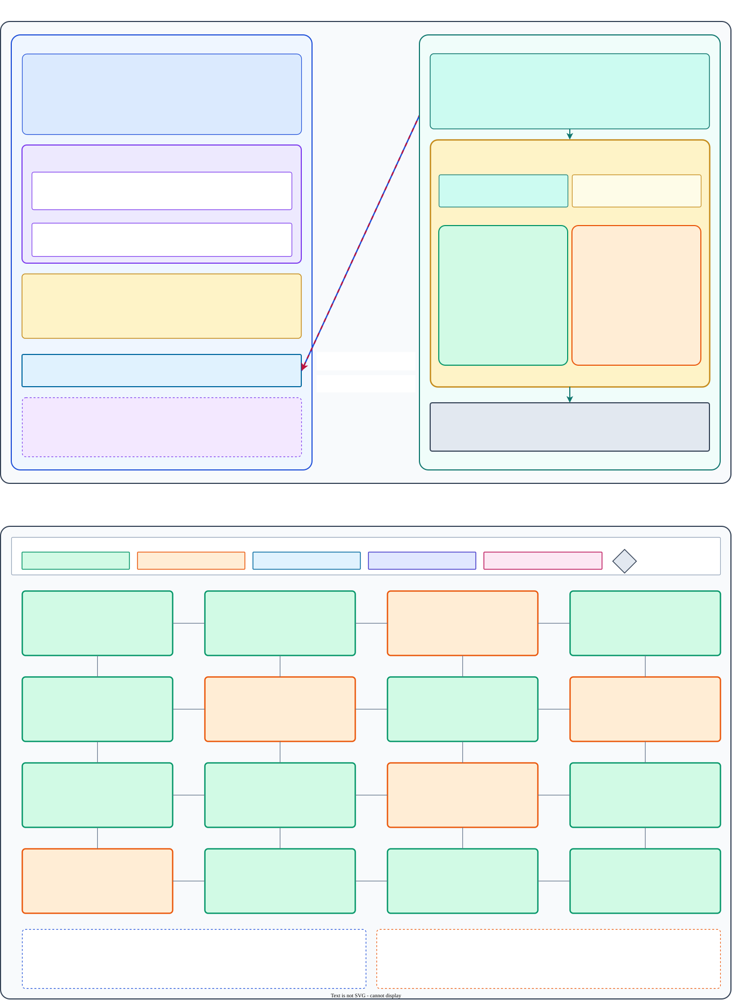

# chi_testbench_gem5 — CPU-less CHI/Garnet testbench (pure gem5 APIs)

A CPU-less stimulus testbench for the Chapter 17 4×4 CHI/Garnet mesh.
Each tile is a gem5 `ClockedObject` (`ChiSeqDriver`) whose sequence
runs on a `Fiber` and issues `Packet`s directly into a tile-local
Ruby sequencer. A single parameterized driver class plays any
registered sequence — no per-scenario C++ classes, no adapters.

## Layout

| Path | Role |
|------|------|
| `driver/rbook_testbench_gem5.py` | Top-level config: 4×4 CHI mesh + scenario dispatch + RN-mode wiring |
| `driver/cfg_rn.py`               | `CHI_Tile` node + configurable `CHI_TileCacheController` (rnf_l2 / rni modes, direct-mesh attach) |
| `driver/address_planner.py`      | HNF-aware cache-line address math |
| `scenarios/*.py`                 | One Python module per scenario; exports `build(args, planner) -> [ChiSeqDriver × 16]` |
| `Makefile`                       | Per-scenario `run-*` targets + `run-all` |
| `src/chi_testbench_gem5/` *(out of tree)* | All C++ — ChiSeqDriver, SeqThread (Fiber subclass), sync primitives, 10 registered sequences |

## How to run

```bash
scons build/RISCV/gem5.opt -j$(nproc) PROTOCOL=CHI

# one scenario (default RN_MODE=rnf_l2; override with rni)
make -C ruby-book/final/chi_testbench_gem5 run-smoke_read
make -C ruby-book/final/chi_testbench_gem5 run-smoke_read RN_MODE=rni

# all scenarios
make -C ruby-book/final/chi_testbench_gem5 run-all
make -C ruby-book/final/chi_testbench_gem5 run-all RN_MODE=rni  # skips opcode_walk / read_ex_walk
```

Each run creates `m5out/rbook-tb-gem5-<scenario>-<RN_MODE>-<timestamp>/`
with gem5's usual outputs and updates a convenience symlink
`m5out/last-<scenario>-<RN_MODE>`.

## Module architecture

### Wiring (per tile)

```
                                           gem5 domain
┌──────────────────────────────────────────────────────────────┐
│ system.cpu[i] = ChiSeqDriver       (ClockedObject)           │
│   ├─ sequence="..."     (Python param)                       │
│   ├─ tile_id, addresses, iterations, ...                     │
│   ├─ SeqThread  (Fiber subclass, per-driver)                 │
│   ├─ DataPort   (RequestPort)  ──▶ system.ruby._cpu_ports[i] │
│   │                                    .in_ports             │
│   └─ kick/wake/xfer events (EventFunctionWrapper)            │
└──────────────────────────────────────────────────────────────┘
                              ↓
       system.ruby.rnf[i] = CHI_Tile
                                                       ┌─────────────────┐
          RubySequencer ── CHI_TileCacheController ──▶ │ Mesh Router[i]  │
             (in_ports)    (mode=rni | rnf_l2)         └─────────────────┘
                                                       (direct ExtLink,
                                                         no side router)
```

One sequencer, one configurable cache controller, one ExtLink to a
mesh router. `CHI_Tile` is classified by `CustomMesh.distributeNodes`
(`configs/topologies/CustomMesh.py:235`) as a non-`CHI_RNF` node, so
the intermediate "node router" that bundles multi-controller RNFs is
skipped. `ChiSeqDriver` being a `ClockedObject` satisfies the
sequencer's stat-namespace parent requirement with no adapter.

The drawio-rendered diagram below zooms in on the same path: panel 1
breaks each of the four boxes above into the sub-objects a sequence
author actually touches (Fiber, event callbacks, port, the mode-split
parameter cards), and panel 2 shows how 16 of these tiles populate the
4×4 mesh with per-tile sequence assignments alongside the HN-F, SN-F,
and MN nodes that share the same routers.



The drawio source is at
[`ruby-book/resources/chi_testbench_gem5_arch.drawio`](../../resources/chi_testbench_gem5_arch.drawio);
regenerate with `ruby-book/export_drawio.sh` after editing.

### RN attachment mode (`--rn-mode`)

Both modes share the `CHI_Cache_Controller` SLICC automaton; only the
allocation/coherence parameters differ. See `driver/cfg_rn.py` for the
parameter table.

| | `rnf_l2` | `rni` |
|---|---|---|
| `alloc_on_seq_acc` | True | False |
| `alloc_on_readshared/unique/writeback` | True | False |
| `allow_SD`, `send_evictions` | True | False |
| Cache | 256 KiB, 8-way | 128 B dummy, 1-way |
| Wire opcodes on a read | ReadShared / ReadUnique | ReadOnce / ReadOnceCleanInvalid |
| Wire opcodes on a write | CleanUnique + WriteBackFull / WriteUnique | WriteNoSnpFull |
| RN participates in snoops | Yes (SnpShared, SnpUnique, SnpCleanInvalid) | No |
| Supports `opcode_walk` / `read_ex_walk` | Yes | No — guard raises `m5.fatal` |

Pass the mode via `RN_MODE` to the Makefile:

```bash
make run-smoke_read                     # default RN_MODE=rnf_l2
make run-smoke_read RN_MODE=rni
make run-all RN_MODE=rni                # skip the two coherence-only scenarios
```

Output directories are keyed by mode so both can coexist:
`m5out/last-<scenario>-<rn_mode>/` (symlink).

### Component reference

| Component | Kind | Role |
|-----------|------|------|
| `ChiSeqDriver`        | `ClockedObject` (single C++ class)  | **The only driver class.** Generic — its `sequence` param is a polymorphic `ChiSequence` (Strategy pattern); each concrete sequence subclass owns its own typed Params. Owns one `SeqThread` and one `RequestPort`. |
| `SeqThread`           | `Fiber` subclass                    | Stack-switching thread that runs `sequence->run(driver)`. Each blocking call yields to gem5's main event loop; response callbacks resume the fiber. |
| `ChiSequence` + concrete subclasses | Abstract `SimObject` + one subclass per scenario (`MemcpySequence`, `PingPongSequence`, …) | Strategy interface. Each subclass declares only the parameters its body actually uses; adding a scenario means dropping one `<name>.{hh,cc}` plus one Python class in `ChiSequence.py` — no edit to `ChiSeqDriver`. Mirrors gem5's `BaseReplacementPolicy` / `LRURP` pattern. |
| `Latch`               | C++ class                           | 1-to-1 notify/wait with pending-notify semantics (notify-before-wait is consumed on the next wait). |
| `Barrier` (`ChiGem5Barrier`) | C++ class + `SimObject` wrapper | Counter-based completion barrier. Last `signal_finish()` calls `exitSimLoop()` to terminate. Pass by pointer via Python param. |
| `ChiEventBus` (`ChiGem5EventBus`) | `SimObject`                | Named-`Latch` registry shared between drivers. Drivers call `drv.wait_on(name)` / `drv.notify(name)`; lookups are by string and lazy. |
| `Semaphore`, `Mailbox<T>` | C++ (library)                   | Stubs for counted-resource and 1-slot FIFO rendezvous. Not used by the current 9 scenarios; available to sequence authors. |

### Sync model and the cross-fiber wake

Every sync primitive wakes fibers through the same `SeqThread::run()`
entry point, but the path differs depending on who calls whom:

- **Same-fiber wake** (primary → this driver's fiber): direct
  `seq_thread.run()` call from a gem5 event callback. This is how
  `recvTimingResp` and the scheduled wake event return control to
  the fiber after a blocking read/write or a `wait_ticks`.
- **Cross-fiber wake** (fiber A → fiber B): scheduled event. A
  direct `run()` call from inside fiber A would transfer control to
  B and leave A's stack frame dangling (the caller's function would
  never return). Instead `Latch::notify()` calls
  `waiter->drv().schedule_xfer_wake()`, which schedules a zero-delay
  event; the current fiber keeps running, and B resumes from the
  primary fiber when the event fires. This is the one place where
  the fiber plumbing becomes user-visible — everywhere else the
  sequence body reads as plain imperative code.

### Transport modes

| Mode | API | What it does |
|------|-----|-------------|
| Blocking | `drv.read(a,b,l)` `drv.write(a,b,l)` `drv.read_exclusive(a,b,l)` | Build a `Packet`, `sendTimingReq`, yield fiber; `recvTimingResp` wakes it. One outstanding per fiber. |
| Non-blocking | `drv.async_read[_exclusive]` `drv.async_write` `drv.resolve(h)` `drv.resolve_all()` | Multi-outstanding. Each call returns a `Handle`; `resolve(h)` yields until that handle's response arrives. |
| Time / rendezvous | `drv.wait_ticks(t)` `drv.wait_on(name)` `drv.notify(name)` | Schedule a wake event / latch hand-off. |

`read_exclusive()` is indistinguishable from `read()` at runtime
today: gem5's Ruby CHI sequencer maps both `MemCmd::ReadReq` and
`MemCmd::ReadExReq` to `RubyRequestType_LD`, which becomes a CHI
`ReadShared` on the wire. The name preserves caller intent in case
Ruby CHI starts honoring it. To acquire exclusive ownership without
issuing data, use `write()` from a tile that doesn't hold the line —
that produces a `CleanUnique` upgrade (or `ReadUnique` on a cold
line). See the `read_ex_walk` scenario for the canonical pattern.

## Python shell (`driver/rbook_testbench_gem5.py`)

1. Parse args (standard `common.Options` + `--scenario` +
   `--scenario-iterations` + `--rn-mode`).
2. Resolve `scenarios/<name>.py` and call `build(args, planner)`; get
   a list of 16 `ChiSeqDriver` objects.
3. Build `System`, assign the drivers to `system.cpu` (drivers are
   themselves ClockedObjects).
4. Install `system._rnf_gen = CHI_Tile.make_generator(args.rn_mode)`
   and a `system._mn_gen` that provides a DVM Misc Node with no
   upstream L1Ds (our tiles have none, and DVM is idle in SE mode).
5. `Ruby.create_system(args, False, system)` attaches the RN tiles
   plus HNFs and SNFs, building the Garnet mesh.
6. Wire `drv.port = system.ruby._cpu_ports[i].in_ports` per tile.
7. `Root(full_system=False, system=system)`, `m5.instantiate()`,
   `m5.simulate()`.

## Scenarios and results

Last-observed signatures (fresh runs; both modes):

| Scenario | Drivers | Mechanism | `simTicks` — `rnf_l2` | `simTicks` — `rni` |
|----------|---------|-----------|----------------------:|-------------------:|
| `smoke_read`        | Tile 0 only | Blocking `read`          |    1 509 001 |    1 501 501 |
| `smoke_write`       | Tile 0 only | Blocking `write`         |    1 509 001 |      561 501 |
| `smoke_opcode_mix`  | 16 tiles, private stripes | Blocking mixed R/W |  848 501 |      762 501 |
| `ping_pong`         | Tiles 0 & 15 alternating | Blocking `write` + `ChiEventBus` rendezvous | 14 251 501 | 7 899 001 |
| `false_sharing`     | Tiles 0 & 15 same line  | Blocking `write(1 byte)` | 14 782 501 |   72 490 001 |
| `memcpy`            | Tile 7                  | `async_read` + `async_write` pipelined | 18 759 001 | 18 471 501 |
| `memset`            | Tile 7                  | `async_write` pipelined  |    8 107 001 |    7 854 501 |
| `opcode_walk`       | Tile 3                  | Scripted LD/ST/evict walk with per-byte asserts |  196 976 501 | *guarded* |
| `read_ex_walk`      | Tiles 0 / 8 / 15 as A / B / C | `read_exclusive` + `write` with 3-way bus rendezvous | 368 001 | *guarded* |

Mode-dependent differences worth noting:

- `false_sharing` is dramatically slower under `rni` (72 M vs 14 M
  ticks) because every single-byte write crosses the mesh to the HNF.
  In `rnf_l2` the line lives in the tile's leaf cache and the two
  tiles ping-pong it via `SnpUnique` — far fewer hops per iteration.
- `smoke_write` is faster under `rni` because there is no write
  miss-fill (no cache allocation), no CleanUnique upgrade round-trip.
- `smoke_read` and `memcpy` are about the same — the first access
  always misses the HNF in either mode, and the leaf cache doesn't
  see reuse in these scenarios.
- `read_ex_walk` under `rnf_l2` produces the CHI opcode sequence the
  scenario asserts (`SendReadShared` / `SendCleanUnique` /
  `SnpCleanInvalid` counters visible in `stats.txt`). Under `rni`
  the per-tile cache doesn't hold a line between accesses, so the
  scenario's premise doesn't apply and a guard exits fast.

## Reading stats.txt

| Metric (glob) | Question it answers |
|---------------|---------------------|
| `system.ruby.hnfN.cntrl.cache.m_demand_{hits,misses}` | Per-HNF demand pressure |
| `system.ruby.rnfN.cntrl.cache.m_demand_{hits,misses}` | Per-tile leaf-cache hits/misses (`rnf_l2`; always 0 misses under `rni`) |
| `system.ruby.rnfN.cntrl.outTransLatHist.Send<Op>::total` | CHI opcode each tile emitted |
| `system.ruby.rnfN.cntrl.inTransLatHist.Snp<Op>::total`   | Snoops each tile received (`rnf_l2` only) |
| `system.ruby.network.average_flit_latency`        | End-to-end flit timing |
| `system.ruby.network.int_linkN.flits_received`    | Per-link flit traffic |
| `system.simTicks`                                 | Wall-clock of the simulated run |
