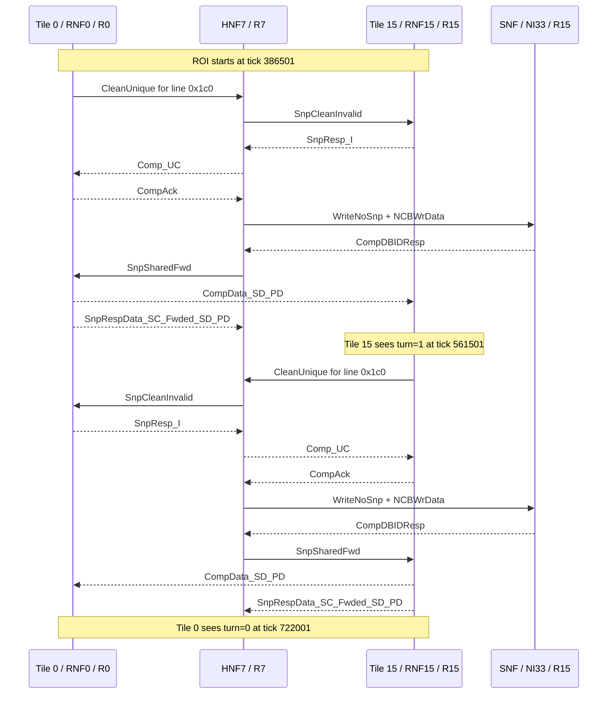

# Ping-Pong ROI Latency Breakdown

This report breaks down one `ping_pong` ROI iteration from the
CPU-less CHI/Garnet gem5 testbench.

Run under analysis:

```sh
make -C ruby-book/final/chi_testbench_gem5 run-ping_pong
```

Baseline result reproduced:

```text
ping_pong_roi: begin tick 386501 tile 0 line 0x1c0 iteration 0
ping_pong_roi: ponger_seen tick 561501 tile 15 line 0x1c0 iteration 0
ping_pong_roi: end tick 722001 tile 0 line 0x1c0 iteration 0 latency 671.00 L3 clocks
ping_pong: tile 0 line 0x1c0 iterations 100 avg_iteration 335485.00 ticks 670.97 L3 clocks
```

The Ruby/L3 clock period in this run is 500 ticks, so the measured ROI
window is `(722001 - 386501) / 500 = 671.00` L3 clocks.

## Key Result

The 671 L3 clocks are the wall-clock time for one complete hand-off and
return:

| Component | Start tick | End tick | L3 clocks | What happens |
|---|---:|---:|---:|---|
| Tile 0 writes turn=1 | 386501 | 456001 | 139 | Tile 0 issues a store, performs a `CleanUnique` ownership transfer through HNF7, and gets its write response. |
| Tile 15 observes turn=1 | 456001 | 561501 | 211 | Tile 15 is polling. The read that finally sees tile 0's value started earlier at tick 421001 and completes at 561501. |
| Tile 15 writes turn=0 | 561501 | 631001 | 139 | Tile 15 issues its store, performs the symmetric ownership transfer through HNF7, and gets its write response. |
| Tile 0 observes turn=0 | 631001 | 722001 | 182 | Tile 0 is polling. The read that finally sees tile 15's value started at tick 596001 and completes at 722001. |
| Total measured ROI | 386501 | 722001 | 671 | Matches the reported single-iteration latency. |

Important overlap: after tile 15 finishes its ROI write, it immediately
starts the next iteration's polling loop. Those tile 15 local reads are
visible between ticks 631001 and 720501 and overlap the final tile 0
read. This is not debug noise; it is the steady-state behavior measured
by the existing benchmark.

## Transaction Timeline

Sequencer transactions seen in the ROI trace:

| Tile | Transaction type | Count | Notable latency |
|---:|---|---:|---|
| 0 | Store (`ST`) | 1 | 138 Ruby cycles in `ProtocolTrace`, tick 386501 to 456000. |
| 0 | Load (`LD`) | 31 | Mostly 8-cycle local polling hits; final read is 251 Ruby cycles, tick 596001 to 722000. |
| 15 | Store (`ST`) | 1 | 138 Ruby cycles in `ProtocolTrace`, tick 561501 to 631000. |
| 15 | Load (`LD`) | 28 completed responses in window | Mostly 8-cycle local polling hits; hand-off read is 280 Ruby cycles, tick 421001 to 561500. |

Driver-level M5 packets in the debug window:

| Tile | Requests sent | Responses received |
|---:|---:|---:|
| 0 | 1 `WriteReq` + 31 `ReadReq` | 1 `WriteResp` + 31 `ReadResp` |
| 15 | 1 `WriteReq` + 28 `ReadReq` | 1 `WriteResp` + 28 `ReadResp` |
| Total | 61 requests | 61 responses |

Most driver packets are local polling reads and do not inject CHI/Garnet
network traffic. The expensive packets are the two ownership-changing
stores and the two polling reads that miss/forward across the mesh.

## CHI Messages, Packets, Flits, Hops

The ROI debug trace was recorded with:

```sh
./util/run_with_timeout.sh ./build/RISCV/gem5.opt \
  --debug-start=386501 \
  --debug-end=722001 \
  --debug-file=ping_pong_roi.trace \
  --debug-flags=ChiTestbenchGem5,ProtocolTrace,RubyNetwork \
  -d m5out/rbook-tb-gem5-ping_pong-rnf_l2-debugfile-20260512-000000 \
  ruby-book/final/chi_testbench_gem5/driver/rbook_testbench_gem5.py \
  --scenario=ping_pong --rn-mode=rnf_l2
```

Within the ROI trace, CHI messages map one-to-one to Garnet packets.
Data messages are 3 flits; control messages are 1 flit.

| Metric | Count |
|---|---:|
| CHI messages / Garnet packets scheduled in the ROI trace | 32 |
| Control flits | 20 |
| Data flits | 36 |
| Total flits | 56 |
| Packet-hops, Manhattan on the 4x4 mesh | 100 |
| Flit-hops, flits weighted by packet route length | 188 |

Breakdown by virtual network:

| VNet | Meaning | Messages | Flits | Packet-hops | Flit-hops |
|---:|---|---:|---:|---:|---:|
| 0 | Requests | 6 | 6 | 16 | 16 |
| 1 | Snoops | 4 | 4 | 12 | 12 |
| 2 | Responses | 10 | 10 | 28 | 28 |
| 3 | Data | 12 | 36 | 44 | 132 |
| Total |  | 32 | 56 | 100 | 188 |

Breakdown by CHI message type:

| CHI message type | Messages | Flits | Packet-hops | Flit-hops |
|---|---:|---:|---:|---:|
| `CleanUnique` | 2 | 2 | 6 | 6 |
| `SnpCleanInvalid` | 2 | 2 | 6 | 6 |
| `SnpResp_I` | 2 | 2 | 6 | 6 |
| `ReadShared` | 2 | 2 | 6 | 6 |
| `Comp_UC` | 2 | 2 | 6 | 6 |
| `CompAck` | 4 | 4 | 12 | 12 |
| `WriteNoSnp` | 2 | 2 | 4 | 4 |
| `CompDBIDResp` | 2 | 2 | 4 | 4 |
| `NCBWrData` | 4 | 12 | 8 | 24 |
| `SnpSharedFwd` | 2 | 2 | 6 | 6 |
| `CompData_SD_PD` | 4 | 12 | 24 | 72 |
| `SnpRespData_SC_Fwded_SD_PD` | 4 | 12 | 12 | 36 |
| Total | 32 | 56 | 100 | 188 |

The terminal `CompAck` at tick 722000 is included in the table because
it is scheduled inside the debug window. It is generated as part of
protocol cleanup after tile 0 receives the data that ends the measured
ROI, so it is not on the critical path to waking the driver.

## Critical Message Flow

The measured latency is dominated by two symmetric ownership transfers.
Tile 0 and tile 15 are at routers 0 and 15. The line homes at HNF7,
router 7. The `WriteNoSnp`/`NCBWrData` pair goes to the SNF/memory-side
node at NI33 on router 15, not to tile 15's RNF.



## Best Methodology

Use the existing ROI timestamps to define the exact debug window first.
For this run the useful window is `--debug-start=386501` and
`--debug-end=722001`.

Prefer targeted debug flags over full Ruby debug. For this question,
`ChiTestbenchGem5,ProtocolTrace,RubyNetwork` is sufficient: it gives the
driver M5 packets, sequencer transaction begin/end, CHI message type,
packet id, flit count, source/destination NI, and source/destination
router.

Treat stats as a cross-check, not the primary source, unless the stats
reset and dump are exactly aligned to the ROI. The current scenario
resets stats at `ponger_wait`, which is tick 295501, before the measured
ROI begins at tick 386501. That makes the ROI stats useful for sanity
checking but not clean enough for final attribution.

For high-confidence latency attribution, parse the debug trace into three
layers: driver packets (`send`/`recv`), `ProtocolTrace` sequencer
transactions, and `RubyNetwork` CHI/Garnet packet/flit records. Use the
driver timeline for wall-clock components, protocol trace for transaction
latencies, and network trace for message/flit/hop counts.

When reporting hops, state the convention. This report uses Manhattan
router hops on the 4x4 mesh from the trace's source and destination
router IDs. If comparing directly against Garnet's `average_hops`, align
the stats reset/dump window first and be aware that in-flight packets at
the window boundary can shift packet/flit counts by one.
