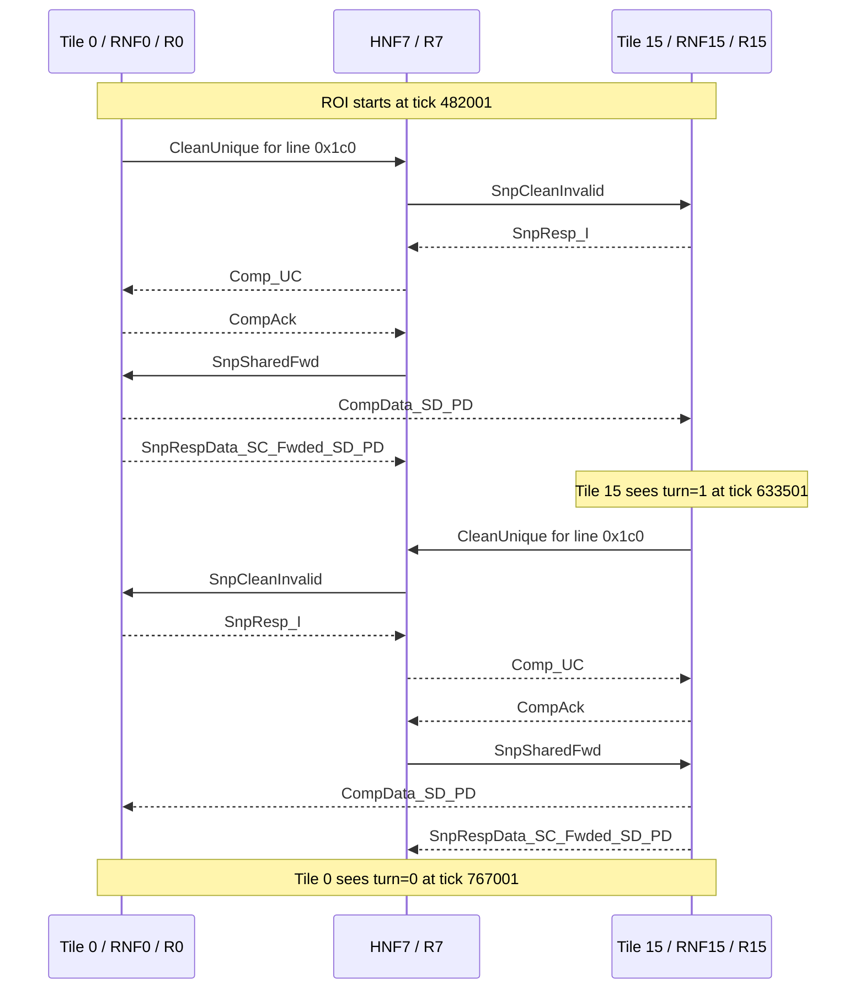

# Ping-Pong No-SNF ROI Latency Breakdown

This report covers the `ping_pong_no_snf` variation. It was added to
measure the same tile 0 / tile 15 shared-line ping-pong while excluding
the SNF/memory-controller node from the measured post-warmup hand-offs.

## Variant

The original `ping_pong` ROI showed SNF traffic on every measured
iteration:

| SNF-facing type | Original ROI count |
|---|---:|
| `WriteNoSnp` | 2 messages |
| `NCBWrData` | 4 messages |
| `CompDBIDResp` | 2 messages |

I first tested full-line turn writes by themselves. That did not remove
SNF traffic; the trace still showed the same `WriteNoSnp` / `NCBWrData`
/ `CompDBIDResp` sequence.

The working variant uses two changes:

| Change | Purpose |
|---|---|
| `PingPongSequence.full_line_writes=True` | Avoid the byte-store partial-write path in the scenario. |
| `hnf.cntrl.dealloc_on_unique=False` only for `ping_pong_no_snf` | Keep HNF data resident when ownership moves to an RNF, avoiding dirty home-node write-through to SNF on every hand-off. |

The second change is the decisive one. With the default HNF config,
`dealloc_on_unique=True`, HNF drops dirty data during unique ownership
transfer and `MaintainCoherence` writes it downstream to SNF. Keeping HNF
unique data resident removes that path after warmup.

## Reproduction

Build:

```sh
scons build/RISCV/gem5.opt -j$(nproc)
```

Run:

```sh
make -C ruby-book/final/chi_testbench_gem5 run-ping_pong_no_snf
```

Observed result:

```text
ping_pong_roi: ponger_wait tick 418001 tile 15 line 0x1c0 iteration 0
ping_pong_roi: begin tick 482001 tile 0 line 0x1c0 iteration 0
ping_pong_roi: ponger_seen tick 633501 tile 15 line 0x1c0 iteration 0
ping_pong_roi: end tick 767001 tile 0 line 0x1c0 iteration 0 latency 570.00 L3 clocks
ping_pong: tile 0 line 0x1c0 iterations 100 avg_iteration 284990.00 ticks 569.98 L3 clocks
```

The Ruby/L3 clock period is 500 ticks, so the measured ROI window is
`(767001 - 482001) / 500 = 570.00` L3 clocks.

ROI trace command:

```sh
./util/run_with_timeout.sh ./build/RISCV/gem5.opt \
  --debug-start=482001 \
  --debug-end=767001 \
  --debug-file=ping_pong_no_snf_roi.trace \
  --debug-flags=ChiTestbenchGem5,ProtocolTrace,RubyNetwork \
  -d m5out/rbook-tb-gem5-ping_pong_no_snf-rnf_l2-debug-20260512-001324 \
  ruby-book/final/chi_testbench_gem5/driver/rbook_testbench_gem5.py \
  --scenario=ping_pong_no_snf --rn-mode=rnf_l2
```

## Key Result

| Component | Start tick | End tick | L3 clocks | What happens |
|---|---:|---:|---:|---|
| Tile 0 writes turn=1 | 482001 | 551501 | 139 | Tile 0 issues the ownership-changing store and receives `WriteResp`. |
| Tile 15 observes turn=1 | 551501 | 633501 | 164 | Tile 15 polling read eventually receives forwarded data and sees tile 0's turn value. |
| Tile 15 writes turn=0 | 633501 | 703001 | 139 | Tile 15 issues the symmetric ownership-changing store and receives `WriteResp`. |
| Tile 0 observes turn=0 | 703001 | 767001 | 128 | Tile 0 polling read eventually receives forwarded data and sees tile 15's turn value. |
| Total measured ROI | 482001 | 767001 | 570 | Matches the reported single-iteration latency. |

Compared with the original 671-cycle ROI, the measured no-SNF variant is
101 L3 clocks faster.

## Transaction Timeline

Sequencer transactions in the ROI trace:

| Tile | Transaction type | Count | Notable latency |
|---:|---|---:|---|
| 0 | Store (`ST`) | 1 | 138 Ruby cycles in `ProtocolTrace`, tick 482001 to 551500. |
| 0 | Load (`LD`) | 26 | Mostly 8-cycle local polling hits; final read is 197 Ruby cycles, tick 668001 to 767000. |
| 15 | Store (`ST`) | 1 | 138 Ruby cycles in `ProtocolTrace`, tick 633501 to 703000. |
| 15 | Load (`LD`) | 21 completed responses in window | Mostly 8-cycle local polling hits; hand-off read is 233 Ruby cycles, tick 516501 to 633500. |

Driver-level M5 packets in the debug window:

| Tile | Requests sent | Responses received |
|---:|---:|---:|
| 0 | 1 `WriteReq` + 26 `ReadReq` | 1 `WriteResp` + 26 `ReadResp` |
| 15 | 1 `WriteReq` + 22 `ReadReq` | 1 `WriteResp` + 22 `ReadResp` |
| Total | 50 requests | 50 responses |

## CHI Messages, Packets, Flits, Hops

Within the ROI trace, each CHI message maps to one Garnet packet. Data
messages are 3 flits; control messages are 1 flit.

| Metric | Count |
|---|---:|
| CHI messages / Garnet packets scheduled in the ROI trace | 24 |
| Control flits | 16 |
| Data flits | 24 |
| Total flits | 40 |
| Packet-hops, Manhattan on the 4x4 mesh | 84 |
| Flit-hops, flits weighted by packet route length | 156 |
| SNF-facing messages | 0 |

Breakdown by virtual network:

| VNet | Meaning | Messages | Flits | Packet-hops | Flit-hops |
|---:|---|---:|---:|---:|---:|
| 0 | Requests | 4 | 4 | 12 | 12 |
| 1 | Snoops | 4 | 4 | 12 | 12 |
| 2 | Responses | 8 | 8 | 24 | 24 |
| 3 | Data | 8 | 24 | 36 | 108 |
| Total |  | 24 | 40 | 84 | 156 |

Breakdown by CHI message type:

| CHI message type | Messages | Flits | Packet-hops | Flit-hops |
|---|---:|---:|---:|---:|
| `CleanUnique` | 2 | 2 | 6 | 6 |
| `SnpCleanInvalid` | 2 | 2 | 6 | 6 |
| `SnpResp_I` | 2 | 2 | 6 | 6 |
| `ReadShared` | 2 | 2 | 6 | 6 |
| `Comp_UC` | 2 | 2 | 6 | 6 |
| `CompAck` | 4 | 4 | 12 | 12 |
| `SnpSharedFwd` | 2 | 2 | 6 | 6 |
| `CompData_SD_PD` | 4 | 12 | 24 | 72 |
| `SnpRespData_SC_Fwded_SD_PD` | 4 | 12 | 12 | 36 |
| `WriteNoSnp` | 0 | 0 | 0 | 0 |
| `NCBWrData` | 0 | 0 | 0 | 0 |
| `CompDBIDResp` | 0 | 0 | 0 | 0 |
| Total | 24 | 40 | 84 | 156 |

## Critical Message Flow

Tile 0 and tile 15 are at routers 0 and 15. The line homes at HNF7,
router 7. No SNF/memory-controller participant appears in the measured
ROI trace.



## Comparison

| Metric | Original `ping_pong` | `ping_pong_no_snf` | Change |
|---|---:|---:|---:|
| ROI latency | 671 L3 clocks | 570 L3 clocks | -101 |
| CHI/Garnet packets | 32 | 24 | -8 |
| Flits | 56 | 40 | -16 |
| Packet-hops | 100 | 84 | -16 |
| Flit-hops | 188 | 156 | -32 |
| SNF-facing messages | 8 | 0 | -8 |

The removed messages are exactly the two per-direction SNF write-through
sequences: `WriteNoSnp`, two `NCBWrData` data packets, and
`CompDBIDResp`.

## Methodology

The best way to gather this latency information is to first run without
debug and record the ROI timestamps printed by the scenario. Then rerun
with `--debug-start` and `--debug-end` matching that window and use only
the needed flags: `ChiTestbenchGem5,ProtocolTrace,RubyNetwork`.

Use `ChiTestbenchGem5` for driver-level M5 packet timing,
`ProtocolTrace` for sequencer transaction begin/end and transaction
latencies, and `RubyNetwork` for CHI message type, Garnet packet id,
flit count, source/destination NI, and source/destination router.

Use stats as a cross-check. For exact attribution, prefer parsing the
ROI debug trace because stats dumps can include traffic from before the
measured ROI if the reset point is earlier than `ping_pong_roi: begin`.

When validating SNF exclusion, search the ROI trace for
`WriteNoSnp`, `NCBWrData`, and `CompDBIDResp`, and confirm that no
messages target the SNF/memory-side NI. In this run those counts are all
zero inside `482001..767001`.
