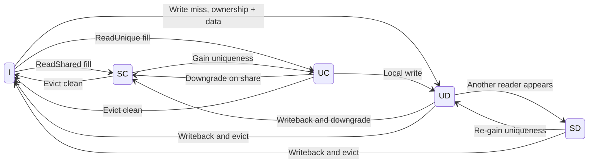
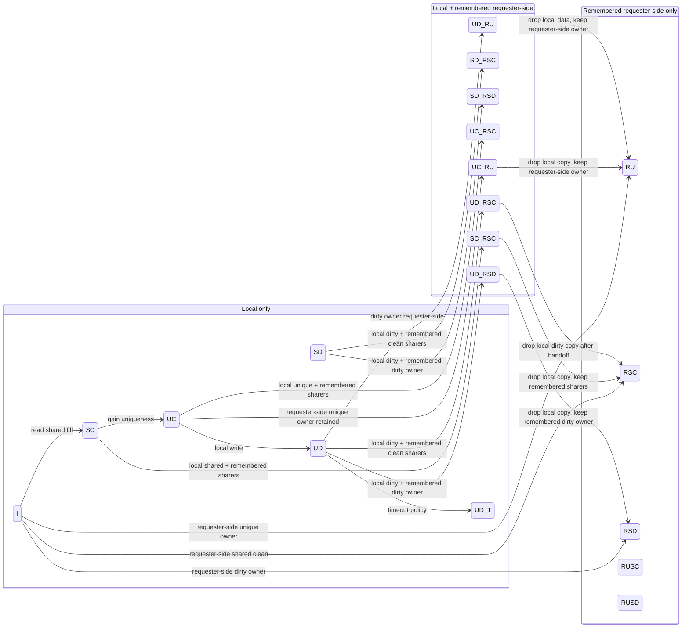

# CHI Cache States in gem5

This note summarizes the non-DVM stable and transient states from gem5's CHI cache controller.

The same state vocabulary is used by the same SLICC machine for requester-side cache controllers and for the home node controller. The role is selected by the `is_HN` parameter.

Scope:
- Source state definitions come from `src/mem/ruby/protocol/chi/CHI-cache.sm`.
- This excludes all `Dvm*` states.
- This excludes the debug-only `null` state.

## Introduction

This document is easier to read if you separate three questions.

The first question is whether this controller has usable data locally. The second question is whether some requester-side cache also has a copy. The third question is whether the line is in a stable resting state or in the middle of a transaction. If you answer those three questions, most of the names stop looking cryptic.

### Layer 1: Intuition

Start with the familiar core. `SC`, `UC`, `SD`, and `UD` are the states you would expect from a CHI or MOESI-like protocol. They describe whether the line is shared or unique, and whether the data is clean or dirty.

Before looking at remembered requester-side states, it helps to isolate the core local stable states that most readers already expect from a cache-coherence protocol.

This diagram is deliberately simplified.

It shows the core local resting states only: `I`, `SC`, `UC`, `SD`, and `UD`.

It ignores remembered requester-side states such as `RSC` and mixed states such as `UD_RSC`.

It also omits transient states such as `BUSY_INTR` and `BUSY_BLKD`.

So the point of this first diagram is not to be complete.

The point is to anchor the reader in the basic local coherence story before we add directory memory and in-flight behavior.

Then gem5 adds a second dimension. The controller may need to remember what the requester side has, even when the local copy is gone or when both local and requester-side copies exist. That is where the `R*` and `X_R*` states come from.

Finally, gem5 adds transient states. Those are the `BUSY_*` states. They exist because coherence does not happen in one instantaneous jump. Requests are sent, snoops come back later, data returns later still, and acknowledgments may arrive even later.

### Layer 2: Working Model

You can think of the stable states as three families.

Family 1 is `local only`. Those are states such as `SC`, `UC`, `SD`, and `UD`. The controller is describing what it has in its own tag and data arrays.

Family 2 is `remembered requester-side only`. Those are states such as `RU`, `RSC`, and `RSD`. The controller does not have a usable local copy, but its directory knowledge says the requester side still does.

Family 3 is `local plus remembered requester-side`. Those are states such as `SC_RSC`, `UC_RU`, and `UD_RSC`. The controller has a local state and also carries directory knowledge about requester-side copies.

That extra bookkeeping is what lets the protocol avoid redundant evictions, preserve ownership facts, and handle inclusive or mostly-inclusive behavior cleanly.

### Layer 3: Formal Naming Rule

Read a state name from left to right. The left side tells you the controller's local cache state. The `R...` part tells you the remembered requester-side state.

So `UD_RSC` means: this controller locally has `Unique Dirty`, and it also remembers requester-side `Shared Clean` copies. If a state starts with `R`, such as `RSD`, read it as: there is no usable local copy here, but the controller remembers requester-side `Shared Dirty` ownership.

## Stable States Only

The diagram below is intentionally illustrative, not exhaustive. It shows only the stable states and the main conceptual moves between the three families. It does not try to draw every legal transition in the full FSM.

One useful way to read the diagram is this. Horizontal movement means the controller is changing how much of the truth it keeps locally versus how much it is only remembering in the directory. Within a family, the `S/U` and `C/D` parts tell you the usual coherence meaning. Across families, the main new idea is not cache permission. It is where the protocol's knowledge lives.

## Why the Transient States Exist

The stable-state diagram is not enough to implement a real controller. A real coherence action is spread over time. The controller may have sent a request downstream, be waiting for snoop responses from requesters, be waiting for data from memory, and be waiting for a final completion or acknowledgment.

During that interval, the old stable state is no longer fully true, but the new stable state is not true yet either. That is why the machine needs explicit transient states.

### The Core Problem

Suppose a line is in `UD`. Now another agent issues a request that forces ownership to move. The controller cannot atomically jump from `UD` to some final state in one cycle.

It may need to do all of the following.

- send a coherence request
- wait for credits or retries
- wait for snoop acknowledgments
- wait for data beats to arrive or depart
- update directory metadata
- update the local cache tag and data arrays
- finalize the transaction only after all obligations are complete

While this is happening, a new snoop might arrive. If the controller lied and claimed the line was already in its final stable state, that snoop could be answered incorrectly. If the controller lied and claimed the old stable state was still fully true, that would also be incorrect.

So the protocol needs a third category: `in flight`.

### Why Two Busy States Instead of One

gem5 uses two generic transient states for the non-DVM cache FSM.

`BUSY_INTR` means the transaction is in flight, but snoops can still be safely processed. The stable meaning is suspended, yet the TBE contains enough information for the controller to respond correctly to an incoming snoop.

`BUSY_BLKD` means the transaction is in flight and snoops must be blocked. The controller is in a fragile point of the sequence where servicing a snoop immediately would violate ordering or state assumptions.

So the distinction is not just `busy` versus `not busy`. It is whether external coherence traffic may still safely interact with the line before finalization.

### Layered Example

Intuition:

Think of `BUSY_INTR` as "the controller is renovating the house, but visitors can still be let into the hallway under supervision." Think of `BUSY_BLKD` as "the floor is open and wet concrete is curing, so nobody may enter."

Working model:

The TBE is carrying the future state, expected responses, pending actions, and partial data validity. The cache entry alone is no longer enough to explain the line. That is why the transient state name is generic while the real details live in the TBE.

Formal and code view:

`CHI-cache.sm` defines `BUSY_INTR` and `BUSY_BLKD` as the generic transient states. The comments there say the final stable state is defined by information in the TBE. That is the key implementation idea.

## Shared Decoding Rules

Interpretation key:
- `local` = the tag and data entry physically held by this controller
- `requester side` = the side closer to CPUs and requester caches
- `home or memory side` = the side closer to the HN-F, SN-F, and memory
- `S/U` = `Shared` / `Unique`
- `C/D` = `Clean` / `Dirty`
- leading `R` = `Remembered requester-side state`, not `Read`
- leading `R` also implies there is no usable local copy in this controller
- suffix like `_RSC` = local state plus remembered requester-side state

How to decode a state name:
- `RU` = remembered requester-side unique owner
- `RSC` = remembered requester-side shared-clean copy
- `RSD` = remembered requester-side shared-dirty owner
- `RUSC` = remembered requester-side shared-clean state while exclusivity is still confined to that requester-side subtree
- `RUSD` = remembered requester-side shared-dirty state while exclusivity is still confined to that requester-side subtree
- `UD_RSC` = local `UD` plus remembered requester-side `RSC`
- `SC_RSC` = local `SC` plus remembered requester-side `RSC`

Reading rule of thumb:
- If the name starts with `R`, read it as: "I do not have a usable local copy, but I remember what the requester side has."
- If the name contains `_R...`, read it as: "I have a local copy, and I also remember a requester-side state."

## Part 1: RN-F Cache Perspective

This view reads the states as they appear in a requester-side cache controller, such as an RN-F-side cache.

Here, `local` means the RN-F cache's own line. Here, `requester side` means any child requester-side cache below it in the hierarchy.

For a leaf L1, many `R*` states are less central because it usually has no child caches. For an RN-F-side shared cache, those `R*` states matter because the controller may cache data locally and also remember what lower requester caches still hold.

| State | RN-F Meaning |
|---|---|
| `I` | The RN-F cache does not hold the line locally and is not tracking requester-side child copies for it. |
| `SC` | The RN-F cache holds a clean shared copy locally. It may serve local reads, but it does not have exclusive write permission. |
| `UC` | The RN-F cache holds a unique clean copy locally. It has exclusive permission and may write without another ownership acquisition. The first write usually turns it into `UD`. |
| `SD` | The RN-F cache holds dirty authoritative data locally, but the line may also be shared. This is the practical `Owned`-like state in gem5's CHI model. Other caches may read shared copies, but this RN-F cache is still responsible for supplying or writing back the authoritative data. |
| `UD` | The RN-F cache holds the only writable authoritative copy locally, and it is dirty. Memory or the home side is stale. Eviction requires a writeback or another ownership-changing transaction. |
| `UD_T` | Same ownership and data meaning as `UD`, but a use timeout is active. The line has remained dirty long enough that gem5 may force writeback behavior. |
| `RU` | The RN-F cache no longer has a usable local copy, but it remembers that a requester-side child holds the line uniquely. Future coherence actions should be directed to that child owner. |
| `RSC` | The RN-F cache no longer has a usable local copy, but it remembers that requester-side child caches hold one or more clean shared copies. |
| `RSD` | The RN-F cache no longer has a usable local copy, but it remembers that a requester-side child subtree contains the dirty authoritative owner, possibly along with other shared-clean children. |
| `RUSC` | The RN-F cache no longer has a usable local copy, but it remembers requester-side shared-clean presence and also knows that exclusivity is still confined to that requester-side subtree. This is a directory optimization state that preserves stronger permission knowledge than plain `RSC`. |
| `RUSD` | The RN-F cache no longer has a usable local copy, but it remembers requester-side dirty ownership and also knows that exclusivity is still confined to that requester-side subtree. |
| `SC_RSC` | The RN-F cache has a local clean shared copy and also remembers that requester-side child caches have clean shared copies. This is useful for clusivity and silent clean eviction decisions. |
| `SD_RSC` | The RN-F cache has local dirty authoritative data, while requester-side child caches have clean shared copies. The child copies are readers, but this RN-F cache remains the source of truth. |
| `SD_RSD` | The RN-F cache has local dirty shared data and also remembers requester-side dirty-sharing state. The key point is that dirty responsibility is no longer a simple single-local-owner story. The controller must account for requester-side dirty authority as well. |
| `UC_RSC` | The RN-F cache has a local unique clean copy and also remembers requester-side clean shared copies. The RN-F cache still has write permission, but the directory also records downstream sharing information. |
| `UC_RU` | The RN-F cache may still physically retain the line, but the authoritative unique owner is requester-side. Protocol-wise, the local copy is not the usable owner anymore. This is a bookkeeping state rather than an ordinary hit state. |
| `UD_RU` | Similar to `UC_RU`, but the authoritative unique copy requester-side is dirty. The RN-F cache may retain data for replacement or writeback handling, but the child owner is the protocol-visible owner. |
| `UD_RSD` | The RN-F cache has a usable local dirty unique copy and also remembers requester-side dirty-sharing state. Think of it as local dirty ownership with additional remembered dirty context in the child subtree. |
| `UD_RSC` | The RN-F cache has the local dirty authoritative writable copy, and requester-side child caches have remembered clean shared copies. The RN-F cache is the source of truth, while the child copies are readers. |
| `BUSY_INTR` | A transient request is in flight. The stable outcome is stored in the TBE, not in the state name. Snoops may still be handled safely while the transaction is incomplete. |
| `BUSY_BLKD` | A transient request is in flight, but snoops must be blocked because processing them immediately would break protocol invariants. |

RN-F mental model:
- `SC`, `UC`, `SD`, `UD` = what this RN-F cache has locally
- `R*` = what this RN-F cache remembers about child requester caches when it does not hold the line locally
- `X_R*` = both local residency and remembered child-cache state
- `BUSY_*` = in-flight transient states

## Part 2: HN-F Perspective

This view reads the same state names from the home node controller's point of view.

Here, `local` means the HN-F's own cache or directory-backed resident line. Here, `requester side` means RN-F caches that sit above the HN-F in the coherence hierarchy.

At the HN-F, the `R*` and `X_R*` states are often especially important because the HN-F is the main place that remembers who currently has the line.

| State | HN-F Meaning |
|---|---|
| `I` | The HN-F has no usable local line and is not currently tracking requester-side sharers or owners for this address. From the home node's point of view, the line is absent from the coherent requester side. |
| `SC` | The HN-F keeps a local clean shared copy and is not currently recording requester-side copies. The home node can supply a clean copy itself. |
| `UC` | The HN-F keeps a local unique clean copy and no requester-side owner is currently recorded. This state exists in the machine, although HN-F policy may make it less common than requester-side use. |
| `SD` | The HN-F keeps dirty authoritative data locally, while no requester-side owner is currently recorded. This means the HN-F itself is the place that must answer with the latest data. |
| `UD` | The HN-F keeps the only writable authoritative copy locally and it is dirty. The latest data is at the home node itself. |
| `UD_T` | Same as `UD`, but the home node has marked the line with a use timeout so it may be pushed toward writeback or cleanup policy. |
| `RU` | The HN-F does not have a usable local copy, but it remembers that one RN-F requester-side cache is the unique owner. This is the classic home-node directory fact: the owner is out in the requester side. |
| `RSC` | The HN-F does not have a usable local copy, but it remembers one or more RN-F shared-clean copies. There is no dirty requester-side owner to fetch modified data from. |
| `RSD` | The HN-F does not have a usable local copy, but it remembers that requester-side RN-F caches contain a dirty authoritative owner, possibly along with additional clean sharers. Requests that need the latest data must involve that requester-side owner. |
| `RUSC` | The HN-F does not have a usable local copy, but it remembers requester-side clean sharing and also knows that exclusivity remains confined to that requester-side subtree. This preserves stronger ordering and permission information than plain `RSC`. |
| `RUSD` | The HN-F does not have a usable local copy, but it remembers requester-side dirty ownership and still knows that exclusivity remains confined to that requester-side subtree. |
| `SC_RSC` | The HN-F has a local clean shared copy and also remembers requester-side RN-F clean shared copies. This is a natural home-node state for mostly inclusive behavior: both the HN-F and requester side may hold clean shared copies. |
| `SD_RSC` | The HN-F keeps the authoritative dirty data locally, while requester-side RN-F caches keep clean shared copies. The HN-F is still the source of truth. |
| `SD_RSD` | The HN-F keeps dirty shared data locally and also remembers requester-side dirty-sharing state. This means dirty responsibility is distributed across the HN-F's own local state and requester-side directory state. |
| `UC_RSC` | The HN-F has a local unique clean line and also remembers requester-side clean sharers. The local HN-F copy still carries strong permission, but the directory records RN-F sharing as well. |
| `UC_RU` | The HN-F may still physically retain a local copy, but the protocol-visible unique owner is requester-side. In other words, the HN-F remembers the owner rather than acting as the owner. |
| `UD_RU` | The HN-F may still physically retain local data, but the requester-side RN-F owner is the protocol-visible unique dirty owner. The HN-F tracks that ownership rather than treating itself as the active owner. |
| `UD_RSD` | The HN-F has a local dirty unique copy and also remembers requester-side dirty-sharing state. This is a mixed local-plus-directory state where the home node's own data and the requester-side ownership facts must both be respected. |
| `UD_RSC` | The HN-F has the local dirty authoritative copy and also remembers requester-side clean shared copies. This is a straightforward home-node state for `home has the truth, RN-Fs have read-only copies.` |
| `BUSY_INTR` | The HN-F is in the middle of a coherence transaction, but it may still process incoming snoops or related events safely. The real future stable state lives in the TBE until finalization. |
| `BUSY_BLKD` | The HN-F is in the middle of a coherence transaction and must temporarily block snoops because processing them immediately would violate protocol sequencing or state assumptions. |

HN-F mental model:
- plain local states like `SC` or `UD` mean the home node itself is holding the meaningful resident state
- `R*` means the home node is acting as a directory that remembers RN-F ownership or sharing without holding a usable local copy
- `X_R*` means the home node both keeps a local line and remembers requester-side sharers or owners
- `BUSY_*` means the home node is between stable states and the TBE is carrying the real transaction context

## Source Anchors

- `src/mem/ruby/protocol/chi/CHI-cache.sm`
- `src/mem/ruby/protocol/chi/CHI-cache-funcs.sm`
- `src/mem/ruby/protocol/chi/CHI-cache-actions.sm`
- `configs/ruby/CHI_config.py`
