<!--
========================================================================================
>>> SLIDE 1
>>> Title (new deck)
========================================================================================
-->

<!-- _class: hero -->
<!-- _paginate: false -->

# CHI in gem5
## From Protocol to Ruby and Garnet

**Memory Architecture and NoC Modeling in gem5**


---

<!--
========================================================================================
>>> SLIDE 2
>>> Coherence and consistency — the two contracts underneath CHI
========================================================================================
-->

## Coherence and Consistency

<div class="comparison-grid smaller">
<div class="card compact accent-blue">
<p class="eyebrow">Cache coherence</p>
<h3>All caches agree on each individual line</h3>
<ul>
<li>Tracks ownership and sharing for one cache line at a time.</li>
<li>Allows many clean readers or one writable owner.</li>
<li>Prevents a cache from using a stale valid copy after another agent writes the line.</li>
</ul>
<span class="pill req">ownership</span>
<span class="pill rsp">per line</span>
</div>
<div class="card compact accent-violet">
<p class="eyebrow">Memory consistency</p>
<h3>Software gets rules for observing operations</h3>
<ul>
<li>Defines which load/store orderings a program can rely on.</li>
<li>Covers operations to different addresses, not just one line.</li>
<li>Uses fences, barriers, atomics, and memory types to demand stronger order.</li>
</ul>
<span class="pill dat">visibility</span>
<span class="pill neutral">program order</span>
</div>
</div>

<div class="metric-strip">
<div class="metric">
<strong>X</strong>
<span>coherence asks: who owns this line, and can this cached copy still be used?</span>
</div>
<div class="metric">
<strong>X,Y</strong>
<span>consistency asks: can Y be seen before X?</span>
</div>
<div class="metric">
<strong>Fence</strong>
<span>turns a required software order into hardware work.</span>
</div>
<div class="metric">
<strong>Device</strong>
<span>registers often need endpoint-visible order.</span>
</div>
</div>

<div class="takeaway">
Coherence makes each line sensible; consistency makes a program's sequence of operations meaningful. CHI carries mechanisms for both.
</div>

<!-- Speaker Notes:
Before introducing CHI node types and message channels, establish the two
contracts that the protocol is trying to support.

Cache coherence is about one location. Imagine cache line X is present in
two private caches. If one core wants to write X, the system must first make
sure the other cached copies are no longer valid writable data. The common
summary is "single writer or multiple readers." Coherence gives every cache
line a well-defined ownership story, and it serializes writes to that line.

Memory consistency is about a program observing many operations. Consider
the classic message-passing example: core 0 writes data to X and then writes
a flag to Y. Core 1 reads Y and, if the flag is set, reads X. Coherence keeps
X coherent and Y coherent separately, but it does not by itself say whether
another core is allowed to observe the flag before the data. That question
belongs to the memory consistency model.

The bottom row is the practical checklist.

X means a single-address question: which value of this line is valid, and
who owns it? That is coherence.

X and Y means a cross-address question: can a later store or load become
visible before an earlier one? That is consistency.

Fence represents the bridge from software intent to hardware behavior. When
software needs stronger order than the default memory model gives, it uses a
fence, barrier, or ordered atomic. The implementation then has to stop,
drain, or order the relevant requests.

Device is the other important case. A peripheral may require writes to two
different registers to arrive in the order software issued them. That is not
just cache-line ownership; it is endpoint-visible ordering.

This is the vocabulary for the rest of the deck. CHI is primarily a
coherent interconnect protocol, but it also has transaction-ordering
mechanisms because a scalable packet fabric does not give a single global
order for free.
-->

---

<!--
========================================================================================
>>> SLIDE 3
>>> Scoping CHI — what it owns, what it leaves open
========================================================================================
-->

## Scoping CHI: what it owns, what it leaves open

<div class="columns">
<div>

### CHI does more than coherence

- **Layered by design** — what a message *means* is separate from how it is *delivered*
- Shares the fabric with **uncached I/O, atomics, and cache-maintenance** traffic
- **Atomics can execute in the fabric**, not only in the core
- **Ordering is an explicit contract** — each transaction declares how strictly it must complete
- **And more** — virtual-memory sync, producer hints, persistence, security tagging, in-band RAS signals

</div>
<div>

### CHI leaves these to you

- **Home-node internals** — CHI names the home node but not its shape:
  - directory size → system-wide back-invalidations
  - tracker depth → retry pressure
  - address hashing → mesh hotspots
- **The interconnect network (ICN) is implementation-defined** — topology, routing, buffers are yours; CHI mandates only per-channel non-blocking at each link
- **Not one CHI** — features like DMT/DCT and atomics vary by issue (B/D/E/C2C) and by what the implementer turns on

</div>
</div>

<div class="takeaway">
Left side is <em>why</em> the CHI spec is so large. Right side is <em>why</em> two CHI systems that send the same messages can perform very differently.
</div>

<!-- Speaker Notes:
The motivation slide gave the reason CHI exists. This slide gives the bound-
ary. CHI reaches further than many first-time readers expect, and it also
stops short in some of the places that matter most for performance. Both
edges matter, because both show up in gem5 as Ruby or Garnet configuration.

Four points on the left.

First, CHI is a layered protocol. The spec separates "what a message means"
from "how that message gets delivered over the wire." That sounds academic
until you debug gem5. Ruby owns the meaning — requests, snoops, responses,
data. Garnet owns the delivery — flits, routers, link-level credits. If you
confuse the layers, the spec diagrams stop matching your trace.

Second, CHI's channels carry more than coherent loads and stores. Uncached
I/O, atomic operations, TLB shoot-downs, and cache-maintenance hints all ride
the same four channels. CHI is the envelope for everything that crosses the
coherent fabric, not just cache-line traffic.

Third, atomic read-modify-writes can execute inside the fabric — at the home
node or at the memory node — not only in the core. That changes how you model
atomic performance.

Fourth, ordering is an explicit contract. On a shared snoop bus,
transactions serialized by accident — whoever grabbed the bus first won.
CHI's separated channels reorder freely, so each transaction carries an
explicit field saying how strict its ordering must be. That gives the
core's memory-consistency model concrete hooks to bind to, instead of
relying on the bus to serialize implicitly.

Fifth, the list does not stop there. The spec also reaches into distributed
virtual-memory sync, producer-to-consumer hints, persistence, security
tagging, and in-band RAS. The deck skips most of these — just know the
surface area is larger than any one slide can show.

Now the right side — where the spec deliberately stops.

First: home-node internals. CHI names the home node as the entity where
coherence decisions happen, but does not pick its shape. Three dials
dominate. The directory tracks who holds each line; undersize it, and
every entry the directory evicts forces a back-invalidation across every
cache that still holds that line. Trackers hold in-flight transactions at
the home node; when the table fills, CHI's retry mechanism kicks in and
the home node tells the requester to come back later. Address hashing
decides which home node owns which line; a bad hash concentrates traffic
on one corner of the mesh, a good hash distributes it. All three are out
of spec, and any one can dominate the performance curve.

Second: the interconnect itself. Topology, routing, VC allocation, buffer
sizes, and credit counts are all implementation-defined — none of it is in
the AMBA document. The one rule CHI mandates is per-channel non-blocking
at each link: flits on one channel cannot block flits on another between
transmitter and receiver. That guarantee does not extend across multi-hop
paths for free — collapse channels at a switch or share a credit pool
badly and it silently dies. A naive Garnet configuration can still wedge.

Third: not one CHI. The spec has issues — B, D, E, and CHI-C2C — and
each changes what is on the menu. Direct transfers DMT and DCT, atomic
coverage, MPAM tags, persistence hints — all vary by issue, and for the
optional features, by what the implementer turned on. Two CHI systems may
both be "same spec" and still have different feature sets.

The rest of the deck lives inside this frame. The last slide was the moti-
vation for leaving bus coherence behind; this slide is the checklist for
what CHI standardizes and what it leaves to the system designer. Ruby imple-
ments the left side; Garnet wraps the right side; the single RISC-V CHI
system that ships with gem5 is where we will see both in action.
-->

---

<!--
========================================================================================
>>> SLIDE 4
>>> CHI Node Types — a typical system
========================================================================================
-->

## CHI Node Types — a typical system


<!-- Speaker Notes:
Time budget: 3 minutes.

This is a typical CHI system, with every node type the spec defines.

In the middle, ICN — the Interconnect Network. CHI is carried over
it but does not specify it. The spec's own wording is "IMPLEMENTATION
SPECIFIC": topology, fabric, routing, buffering are all yours. Every
other node plugs into ICN through the four CHI channels we'll see on
the next slide.

Top-left, two RN-Fs: Fully Coherent Request Nodes. CPU cores with
hardware-coherent caches — drawn as the internal "CPU" and "L1 / L2"
boxes. An RN-F generates every transaction type and responds to every
snoop type.

Top-right, RN-I with a GPU inside: IO Coherent Request Node. Section
B13.6.1.3 of the spec literally names this use case, quote: "a GPU or
IO bridge". An RN-I holds no hardware-coherent cache and receives
neither snoops nor DVM — the driver manages any on-GPU cache and TLB
explicitly.

Left column, top: a second RN-I with a PCIe bridge inside — same node
type, different device. Any non-caching I/O requester fits here.

Left column, bottom, RN-D: IO Coherent Request Node with DVM support.
The "D" is DVM, Distributed Virtual Memory. Put an accelerator here
when its SMMU walks the CPU's page tables directly, so CPU-side TLB
invalidations must reach it in hardware. RN-D does receive snoops —
but the spec restricts them: "use of the SNP channel is limited to
DVM transactions". DVM snoops only, never cache-coherence snoops. So
a driver-managed GPU stays RN-I; a hardware-SVM GPU moves to RN-D.

Right side, MN: Miscellaneous Node. Where DVM traffic terminates and
fans out to every RN-F and every RN-D in the system.

Bottom row, two HN-Fs: Fully Coherent Home Nodes. The Point of
Coherence. Every cache line maps to exactly one home, usually by
address hashing. Two optional internal pieces: SF, a snoop filter or
directory, which the spec explicitly lists as optional; and LLC
slice, an implementation-specific last-level cache. The home
serializes conflicting requests, sends snoops, grants ownership, and
forwards data.

Next to the HN-Fs, SN-F: Subordinate Node. Note the spec uses
"Subordinate", not "Slave". The memory-side node. It receives
ReadNoSnp and WriteNoSnp from the homes and returns data. CHI stops
at SN-F — attached on the side you see MC, the memory controller,
and behind it DRAM. Whatever MC speaks to DRAM is outside the CHI
spec.

Color coding we'll reuse throughout the deck: RN-F blue, RN-I teal,
RN-D gold, HN-F violet, MN slate, SN-F green.
-->

---

<!--
========================================================================================
>>> SLIDE 5
>>> Port, Link, and Channel
========================================================================================
-->

## Link layer: Port, Link, and Channel


<!-- Speaker Notes:
Time budget: 3 minutes.

Before we look at any packet or router, three terms need to be
crisp: channel, link, and port. They form a hierarchy, and this
diagram shows how they fit together at the interface between a
Request Node and the Interconnect.

Start from the bottom — a channel. Section B13.4 of the spec. A
channel is a defined path over which flits of one traffic class
move. CHI defines exactly four: REQ, RSP, SNP, DAT. These are not
labels — they are different kinds of traffic with different
dependency, progress, and buffering rules. REQ carries requests that
start or advance a transaction. RSP carries non-data responses like
completion or acceptance. SNP carries snoop requests sent to caches.
DAT carries the data payload — cache-line fills, write data, snoop
data. DAT usually consumes the most bandwidth.

One level up — a link, sections B13.1 and B13.2. A link is a
unidirectional connection from one transmitter to one receiver. Each
link bundles some set of channels. Two-way communication between two
nodes takes a pair of links. A link has finite bandwidth, nonzero
latency, and link-layer credits that apply hop by hop. Internally a
link may cross several routers and wires, but at the CHI
architectural interface it still exposes exactly this channel
structure.

Top of the hierarchy — a port, section B13.6. A port is the set of
all links at one node's interface. The whole interface bundle.

Now read the diagram. The two outer boxes, Port (RN) on the left and
Port (ICN) on the right, are the ports. Between them, two link
boxes. The top one is the outbound link: RN transmits, ICN receives.
It carries three channels — REQ for requests, DAT for write data,
and RSP for responses like CompAck. Pin names on the RN side start
with TX because the RN transmits; on the ICN side they start with RX
because the ICN receives.

The bottom link is the inbound link: ICN transmits, RN receives.
Different channel set — SNP for snoops, RSP for completions, DAT for
read data. Pins are reversed — RX on the RN side, TX on the ICN
side.

Which channels appear on a link depends on the node types at either
end. An RN-to-SN inbound link, for example, has no SNP channel —
SN-Fs do not generate snoops.

One last caveat. Inside the ICN, what the spec calls a "link" may
be realized by many routers and wires with a different
microarchitecture — wider channels, virtual channels, whatever the
implementer chose. The architectural link abstraction is what the
spec guarantees at the port interface, not what happens inside.
-->

---

<!--
========================================================================================
>>> SLIDE 6
>>> Network layer — addressing and routing
========================================================================================
-->

## Network layer: addressing and routing

<div class="columns">
<div>

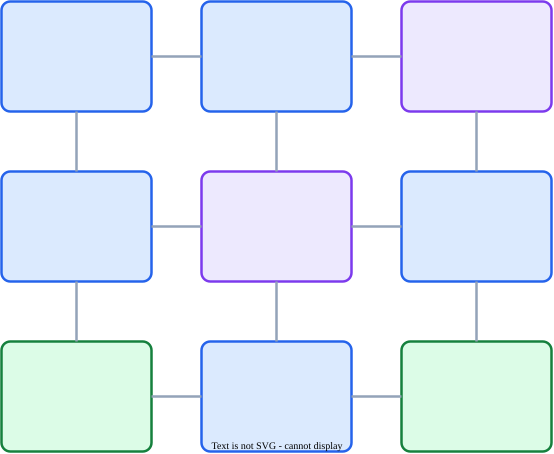


</div>
<div>

<div class="sam-viz">
<div class="sam-viz-title">System Address Map — <code>address → NodeID</code></div>

<div class="sam-addr"><span class="sam-tag">0x0000_0000_5</span><span class="sam-hash">0</span><span class="sam-offset">40</span></div>

<div class="sam-legend">tag · <span class="sam-legend-hash">hash bits</span> · line offset</div>

<div class="sam-arrow-v">▼</div>

<div class="sam-box">RN SAM — hash + range decode</div>

<div class="sam-arrow-v">▼&nbsp;&nbsp;&nbsp;&nbsp;▼</div>

<div class="sam-outputs">
<span class="sam-out">HN0<span class="sam-nid">NID = 5</span></span>
<span class="sam-out">HN1<span class="sam-nid">NID = 6</span></span>
</div>
</div>

<div class="sam-rules">
<p><b>Packet header</b> — the RN stamps <code>SrcID</code>, <code>TgtID</code>, <code>ReturnNID</code>, and <code>TxnID</code> into every REQ.</p>
<p><b>Two SAMs per request</b> — on a miss, the HN runs its <em>own</em> SAM: <code>address → SN NodeID</code>.</p>
<p><b>Routing is implementation-defined</b> — meshes often use deterministic XY, but other algorithms exist.</p>
<p><b>ICN may remap <code>TgtID</code></b> — for HN hot-spare, load balancing, or partition reconfiguration. <code>SrcID</code> is preserved.</p>
<p><b>Responses skip the SAM</b> — TgtID is copied from the trigger: <code>SrcID</code> · <code>ReturnNID</code> · <code>HomeNID</code> · <code>FwdNID</code>.</p>
<p><b>Snoops carry no <code>TgtID</code></b> — snoop routing is IMPL-DEFINED (typically a snoop filter or a bit-vector multicast).</p>
</div>

</div>
</div>

<!-- Speaker Notes:
Time budget: 3 minutes.

Chapter B3 of the CHI spec is the thinnest of the four layers, and
the most often skipped. It answers one question — how does a packet
know where to go — and the answer has three moving parts. That is
the whole of the network layer.

Part one — names. Every port on the interconnect is assigned a
NodeID. The field is 7 to 16 bits wide, configured once for a given
implementation. A port can carry multiple NodeIDs; a NodeID can
belong to exactly one port. That is all the spec says. How IDs are
assigned to real silicon nodes is implementation defined.

Part two — the System Address Map, SAM. The SAM is the table that
turns an address into a TgtID, the destination NodeID stamped on the
packet. Every Request Node has a SAM — that is how it knows which
Home Node to talk to. Every Home Node has a SAM too — how else
would the HN know which memory-side SN owns the line it just missed
on. The spec does not prescribe the SAM format. It can be a handful
of fixed-range decoders, a programmable interleave, or something
fancier. What the spec demands is only that the SAM covers the
entire address space, and that unmapped addresses go somewhere that
can answer with an error response.

On the diagram: RN0 has a mini SAM showing two rows, address to HN.
HN-F1 has its own SAM showing address to SN. Pedagogically these
are tiny. In a real system each SAM is bigger and usually hash- or
interleave-based.

The `(x,y)` labels on the tiles are there to make mesh routing
examples concrete. A common mesh choice is deterministic XY routing:
move in X first, then Y.

Part three — the interconnect may remap TgtID. The fabric is
allowed to rewrite the TgtID of the incoming request. In the
diagram, RN0 stamps HN0 but the ICN retargets to HN1. This is not
an error, not a hack — it is a first-class feature. It is how a
chip supports HN hot-spare, dynamic HN load-balancing, snoop-filter
partitioning, or address-range reconfiguration after a reset. The
SrcID is preserved. Only TgtID moves.

Now flip to the response side — this is the load-bearing insight.
Responses do not look up a destination. They copy it from a named
field of the message that caused them. Data comes back to
ReturnNID. Comp comes back to the request's SrcID. The
requester's CompAck goes to the HomeNID stored in the data or
completion message — which is the real home, including the
remapped one, not the original HN the RN targeted. That is how
remapping stays transparent to the requester.

One last exception. Snoops have no TgtID at all. The spec does not
say how snoops are routed — that is entirely up to the fabric. In
real systems a snoop filter at the HN narrows snoop destinations to
exactly the caches that could hold the line. In gem5, Garnet uses a
simple NetDest bit-vector instead.

One implication for gem5. The SAM the book cares about is the HN
SAM, built from Python parameters in CHI_config.py. The RN-side SAM
is implicit — Ruby addresses directly by home. Remapping is not
modeled. Keep that in mind when your trace looks simpler than
silicon.
-->

---

<!--
========================================================================================
>>> SLIDE 7
>>> Transaction, Message, Packet, and Flit
========================================================================================
-->

## Transaction, Message, Packet, and Flit

<div class="columns">
<div>

### Hierarchy — `ReadClean`, 64 B line, 128-bit `Data_Width`, `ExpCompAck=1`

```text
Transaction (ReadClean, line clean-shared at home)
├── REQ message
│   └── ReadClean      → flit   (REQ chan, outbound)
├── DAT message
│   ├── CompData_SC    → flit   (DAT chan, inbound, DataID=0)
│   ├── CompData_SC    → flit   (DataID=1)
│   ├── CompData_SC    → flit   (DataID=2)
│   └── CompData_SC    → flit   (DataID=3)
└── RSP message
    └── CompAck        → flit   (RSP chan, outbound)
```

</div>
<div>

### Ratios at each boundary

| Boundary                | Layer(s)            | Ratio |
|-------------------------|---------------------|-------|
| Transaction → Message   | Protocol            | 1 : N |
| Message → Packet        | Protocol → Network  | 1 : N |
| Packet → Flit           | Network → Link      | 1 : 1 |

- **Transaction** (B1.3) — one coherence op; `TxnID` at RN, `DBID` at home.
- **Message** — one protocol step on one channel.
- **Packet** (B1.1, B13.3) — routing granule with independent metadata.
- **Flit** (B13.3) — link-layer unit; architecturally 1:1 with a protocol packet.

</div>
</div>

<!-- Speaker Notes:
Time budget: 3 minutes.

When you read a CHI trace, you'll see four terms nested inside each
other: transaction, message, packet, and flit.

At the top, a transaction. Section B1.3. One complete coherence
operation — everything that happens between a Requester, its
Completer, and any snooped nodes to fulfil a single request. A
transaction is identified by TxnID at the Requester and DBID at the
Completer. The example on the left is a ReadClean — REQ opcode 0x02
per table B13.12 — fetching one 64-byte line. The request asserts
ExpCompAck=1, so the home will expect a CompAck at the end. We're
showing the simple non-snooping path where the home serves from its
LLC or memory; add snoops on top if other RNs hold the line.

One level down: a message. One protocol communication step, carried
on one channel — a request, a snoop, a response, or a data transfer.
A transaction generates multiple messages. Our ReadClean has three: a
ReadClean REQ on the outbound link, a CompData DAT on the inbound
link, and a CompAck RSP on the outbound link.

Next: a packet. Sections B1.1 and B13.3. The granule of transfer
across the interconnect — carries the metadata needed to route
independently. A message can comprise one packet or many. The REQ
and RSP messages here are single-packet. The DAT message splits into
four CompData packets because the link's Data_Width is 128 bits and
a 64-byte line needs four transfers — each packet carries one
DataID from 0 to 3. Each of the four CompData packets encodes
Resp = CompData_SC to tell the Requester the line is arriving in
Shared-Clean state. At 256-bit Data_Width it would be two packets;
at 512-bit, one.

Finally a flit — the Link-layer transfer unit. Every protocol packet
maps to exactly one protocol flit at the architectural interface.
That 1:1 is part of the CHI abstraction — unlike generic NoC
protocols, CHI does not do multi-flit wormhole splitting. The spec
also defines link flits, non-protocol flits used for credit return
during link deactivation, but those do not carry protocol packets.

Closing the loop: the CompAck on the RSP channel echoes the DBID
that the home supplied in CompData, and its TgtID matches the home's
HomeNID. That is how the home knows which outstanding transaction
just completed.

The right-side table summarises the three boundaries. The two "N"
ratios are where variability enters: a transaction can spawn many
messages, and a message can split into many packets. The single
"1:1" ratio is an architectural guarantee — at the CHI port
interface, the spec does not let implementations split a packet into
multiple flits.
-->

---

<!--
========================================================================================
>>> SLIDE 8
>>> REQ Flit Fields
========================================================================================
-->

## REQ flit fields

<div class="columns" style="font-size: 14px; line-height: 1.25;">
<div>

| Name         | W  | Description                          |
|--------------|----|--------------------------------------|
| QoS          | 4  | Priority for fabric arbitration       |
| TgtID        | 7  | Target node (NODE_ID_W: 7..16)       |
| SrcID        | 7  | Source node (NODE_ID_W)              |
| TxnID        | 12 | Transaction identifier                |
| ReturnNID    | 7  | DMT: where SN sends the data         |
| ReturnTxnID  | 12 | DMT: TxnID echoed on data response   |
| Opcode       | 7  | REQ opcode (Table B13.12)             |
| Size         | 3  | Bytes = 2^Size (1..64)                |
| Addr         | 44 | Physical addr (REQ_ADDR_W: 44..52)   |
| PAS          | 3  | Physical Address Space (security)     |

</div>
<div>

| Name         | W  | Description                          |
|--------------|----|--------------------------------------|
| LikelyShared | 1  | Cache-placement hint                  |
| AllowRetry   | 1  | Target may issue Retry                |
| Order        | 2  | Ordering contract                     |
| PCrdType     | 4  | Retry credit type                     |
| MemAttr      | 4  | Cacheability (AXI AxCACHE-like)      |
| SnpAttr      | 1  | Snoop hint                            |
| LPID         | 5  | Logical processor — *optional*        |
| Excl         | 1  | Exclusive monitor — *optional*        |
| ExpCompAck   | 1  | CompAck mandated                      |
| TraceTag     | 1  | Trace/debug tag                       |

</div>
</div>

<div class="takeaway">
Field <em>order</em> in Table B13.6 is architectural — implementations may not reshuffle bit positions. What the implementer controls is field <em>widths</em> (<code>NODE_ID_W</code>, <code>REQ_ADDR_W</code>, <code>DATA_W</code>) and which optional features (stashing, DMT, tagging, MPAM, RME, exclusives) contribute extra fields.
</div>

<!-- Speaker Notes:
Time budget: 3 minutes.

A flit is the packetised bundle of control fields that carries one
protocol message across a CHI link. Spec Table B13.6 pins down
exactly which fields appear in a REQ flit, their order, and their
widths. The slide lists them in bit order, QoS first at bit 0,
ExpCompAck last. Two design-time parameters set the variable widths:
NodeID_Width, spec B16.1.12, defaults to 7 and can go up to 16;
Req_Addr_Width, B16.1.11, defaults to 44 and can go up to 52.

Walk the table top-down.

QoS, 4 bits at bit 0, is the priority that fabric arbitration
consumes.

TgtID and SrcID, 7 bits each by default, name the destination and
source nodes. QoS, TgtID, and SrcID together are what the
interconnect needs to route and schedule the flit without
understanding the protocol.

TxnID, 12 bits, is unique at the Requester. Every downstream message
in this transaction is keyed back to this TxnID.

ReturnNID and ReturnTxnID are the DMT pair — Direct Memory Transfer.
When the HN forwards a read to an SN and wants the SN to reply
directly to the Requester, it fills ReturnNID with the Requester's
NodeID and ReturnTxnID with the Requester's TxnID. The SN's
CompData then targets ReturnNID carrying ReturnTxnID. Both are zero
when DMT is not used.

Opcode, 7 bits. The What: ReadClean, ReadUnique, WriteUnique,
WriteBackFull, CleanInvalid, and dozens more. Spec Table B13.12 is
the opcode dictionary.

Size, 3 bits. Bytes moved encoded as a power of two: bytes equals
2 to the Size, so 1, 2, 4, 8, 16, 32, or 64. A 64-byte cache-line
read encodes 0b110.

Addr, 44 bits by default, is the physical address.

Then the attribute group. PAS, 3 bits, is the Physical Address Space
— Secure / Non-secure / Realm / Root per RME. LikelyShared, 1 bit,
is a hint telling the home this line is probably shared, biasing
allocation and directory policy. AllowRetry, 1 bit, tells the target
whether it may issue a RetryAck; when AllowRetry = 0, the Requester
must already own a PCrdType it can consume. Order, 2 bits, asks the
home for an ordering contract, typically for device accesses.
PCrdType, 4 bits, pairs with AllowRetry on the retry mechanism.
MemAttr, 4 bits, selects cacheable/non-cacheable, bufferable,
early-write-acknowledge — same concept as AXI's AxCACHE. SnpAttr,
1 bit, is the snoop hint.

Three control bits at the end. LPID, 5 bits, names a logical
processor within a multi-threaded node — paired with SrcID and Excl
it uniquely identifies an exclusive-monitor reservation; optional.
Excl marks the request as part of an exclusive-monitor pair — the
CHI equivalent of LR/SC; also optional. ExpCompAck — already relied
on for ReadClean — tells the home the Requester will close the
transaction with a CompAck; always present.

Three structural points to close. One, the field order in Table
B13.6 is architectural — implementations may not reshuffle bit
positions. Two, what the implementer controls is widths — only
NodeID_Width, Req_Addr_Width, and for DAT flits Data_Width are
parameterised. Three, which optional fields appear depends on
enabled features — stashing, DMT, tagging, trace, MPAM, RME,
exclusives — each contributes extra fields the spec lists in the
same table but that only materialise when the feature is on.
-->

---

<!--
========================================================================================
>>> SLIDE 9
>>> CHI Cache States — Standard FSM per §B4.1
========================================================================================
-->

## CHI Cache States — Standard FSM (spec §B4.1)

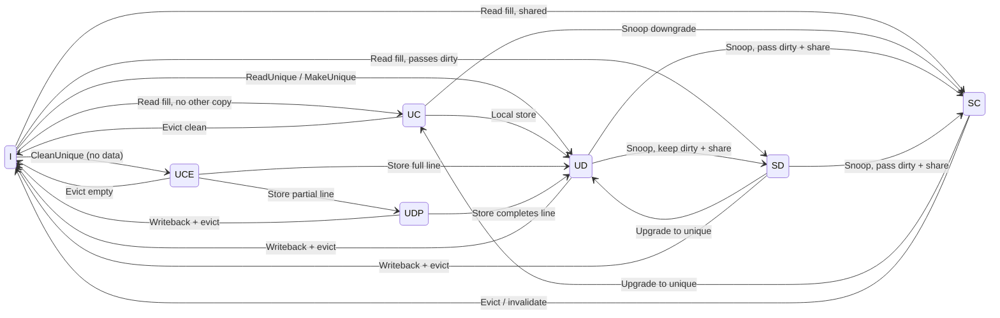

<div class="takeaway">
IHI0050H §B4.1 defines seven cache line states along two familiar axes — Unique/Shared and Clean/Dirty — plus two "empty/partial" unique states (UCE, UDP) for store-without-data ownership.
</div>

<!-- Speaker Notes:
Time budget: 3 minutes.

Before we dive into the gem5 HN-F controller, let's anchor on what the
CHI specification itself prescribes. Section B4.1 of IHI0050H defines
the cache line state vocabulary that every compliant CHI cache must
speak at its boundary, regardless of how the controller is built
internally.

There are seven states, organized along two familiar axes plus one
extra concept. The first axis is Unique versus Shared — does this
cache hold the only copy of the line, or could peers also have it.
The second axis is Clean versus Dirty — is this cache responsible for
writing the data back to memory on eviction, or can it be dropped.
Combine those two axes and you get the four "Full" states: UC, UD,
SC, SD. A full state means all bytes of the line are valid. These
four are the MOESI-like core: Unique Clean is Exclusive, Unique Dirty
is Modified, Shared Clean is Shared, Shared Dirty is Owned.

The extra concept is empty or partial ownership. CHI lets a requester
obtain store permission *without* pulling valid data from memory —
useful before a full-line write, because it saves a read. That gives
two additional unique states. UCE, Unique Clean Empty, is unique
ownership with zero valid bytes; a CleanUnique from Invalid lands
here. UDP, Unique Dirty Partial, is unique ownership after some but
not all bytes have been written — reached silently from UCE when a
store writes only part of the line. On eviction, UDP must merge with
memory to form a complete line.

And of course, Invalid — the line is not present in the cache.

That's all seven: I, UC, UCE, UD, UDP, SC, SD.

The arrows on this diagram are not the whole transaction system — B4.7
and B4.8 of the spec describe those in full — but they illustrate why
each state exists. Reads fill into SC, UC, SD, or UD depending on
whether the line is shared and whether dirty responsibility is being
passed. CleanUnique from Invalid parks in UCE. A partial store on UCE
drops the line into UDP; a full store or a follow-up store that
completes the line moves it to UD. Snoops downgrade unique to shared,
with or without passing dirty responsibility. Evictions writeback-
if-dirty and return to Invalid.

Key sentence from the spec: "A cache is permitted to implement a subset
of these states." That is the opening we need for the next slide. A
real implementation — like gem5's HN-F — layers extra internal states
on top of this vocabulary to track in-flight transactions, upstream
sharers, and transient bookkeeping. The B4.1 seven are what appears
on the wire; what follows is what the controller carries internally.
-->

---

<!--
========================================================================================
>>> SLIDE 10
>>> Directory Controller — the HN-F's coherence book
========================================================================================
-->

## Directory Controller — what the HN-F remembers

<div class="columns">
<div>

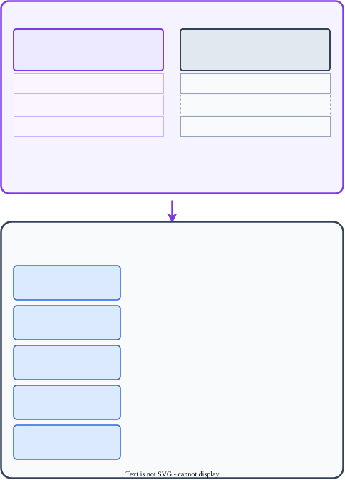


</div>
<div>

### What the directory answers

- *Who upstream has this line, and in what state?*
- Who, if anyone, can **supply data** without going to memory?
- Which RNs need **snoops** on the next write?

### In gem5

- Lives inside `CHI-cache.sm`; **no separate `*-dir.sm`** — the `is_HN` flag turns it on
- Entry fields above are declared at `CHI-cache.sm:590`
- `PerfectCacheMemory` = **unbounded** map — no capacity, no evictions, no back-invalidations modeled
- `sharers` is a **full bit-vector** of RN IDs — exact, not coarse-vector or pointer+overflow
- One HN-F per slice; line address routed by the NUMA interleave bits set in `CHI_config.py`

</div>
</div>

<div class="takeaway">
Directory = what the home <em>knows</em>. LLC = what the home <em>holds</em>. Same address, different storage — a line can be tracked without being cached, and cached without being shared.
</div>

<!-- Speaker Notes:
Time budget: 3 minutes.

Up to here we have talked about channels and flit fields — what travels
on the wire. Now we open one of the nodes and look at what it has to
remember.

The directory lives inside the home node. In CHI that is the HN-F — the
Fully coherent Home Node. Only HN-F owns a directory. The other home
nodes you saw on the node-types slide, HN-I for I/O and MN for
miscellaneous, do not participate in coherence, so they have no sharer
tracking to do.

Why does the HN-F need a directory at all? Because CHI is
directory-based, not snoop-broadcast. When a read arrives for line
0x40, the HN-F has to answer two questions before it can respond. Does
any cache upstream own a dirty copy of this line? And who, if anyone,
is sharing it? The directory is the book that answers those two
questions.

Now the fields in the diagram.

`state` is the coherence state from the home node's point of view — I,
SC, SD, UC, UD. Important: this is the HN's state, not the state at
any particular RN. A line can be SC at the home while each sharer
independently thinks of its own copy as SC.

`sharers` is a bit-vector — Ruby calls the type NetDest — over all
upstream RN IDs in the system. Every RN that might have a valid copy
has its bit set. Bit-vectors are exact but expensive; real silicon
typically uses a compressed representation like coarse-vector or
pointer-plus-overflow. gem5 prefers exactness over realism here.

`owner` plus `ownerExists` and `ownerIsExcl` pin down who, if anyone,
holds the line in a state that can supply data. `ownerIsExcl`
distinguishes an exclusive UD or UC owner from a shared-dirty SD
owner. Those are the flags the HN uses to pick a snoop opcode and to
decide whether it still needs to go to memory.

Now two things about gem5 that usually surprise people.

First, there is no `*-dir.sm` file. Most textbook descriptions of Ruby
show cache and directory as separate controllers with separate state
machines. CHI in gem5 does not do that. The directory is folded into
`CHI-cache.sm`, gated by the `is_HN` configuration flag. The same
source file runs as a private L1 with `is_HN` false, and as an HN-F
with `is_HN` true. You will not find a standalone directory controller
anywhere in the CHI protocol tree.

Second, the directory is a `PerfectCacheMemory` — an unbounded hash
map from line address to DirEntry. No capacity. No eviction. No
conflict misses. That matters both ways. It simplifies modeling — the
HN never forgets who has a line, so you never debug a bug that was
really a directory overflow. But it is also a deliberate
simplification. In silicon, directory overflow forces
back-invalidations, and that is one of the largest performance effects
in real CHI systems. gem5 does not give you that cost out of the box —
if you want it, you have to add it.

The LLC slice next to the directory is a conventional `CacheMemory` —
finite rows and ways, NUMA-interleaved across HN-F slices using the
address bits set up in `CHI_config.py`. Directory and LLC share the
line address but not the storage. A line can be tracked by the
directory without being present in the LLC — and a line can be in the
LLC without any RN currently sharing it.
-->

---

<!--
========================================================================================
>>> SLIDE 11
>>> gem5 HN-F FSM — full state vocabulary
========================================================================================
-->

## gem5 HN-F FSM (CHI-cache.sm) — full state vocabulary

<div class="columns" style="font-size: 14px; line-height: 1.25;">
<div>

**Local only** — what this controller physically holds

| State | Meaning |
|---|---|
| `I` | No local copy; no upstream tracking |
| `SC` | Local Shared Clean; reads only |
| `UC` | Local Unique Clean; may write (→ `UD`) |
| `SD` | Local Shared Dirty; the Owned-like state |
| `UD` | Local Unique Dirty; only writable copy in system |
| `UD_T` | `UD` locked under "use timeout" (LL/SC livelock guard) |

**Remembered upstream only** — local copy gone, directory tracks RNs

| State | Meaning |
|---|---|
| `RU` | One upstream unique owner (in `UC` or `UD`) |
| `RSC` | Upstream shared-clean sharers |
| `RSD` | Upstream dirty owner (+ maybe `SC` sharers) |
| `RUSC` | `RSC` + this node still holds system-wide exclusive access |
| `RUSD` | `RSD` + this node still holds system-wide exclusive access |

</div>
<div>

**Local + remembered upstream** — both dimensions live at once

| State | Meaning |
|---|---|
| `SC_RSC` | Local `SC` + upstream `SC` sharers |
| `SD_RSC` | Local dirty owner + upstream readers |
| `SD_RSD` | Local `SD` + upstream dirty owner; split responsibility |
| `UC_RSC` | Local `UC` + upstream `SC` sharers |
| `UC_RU` | Upstream is the unique owner; local copy is residue (`Invalid` perm) |
| `UD_RU` | Same as `UC_RU` but local residue is dirty |
| `UD_RSD` | Local `UD` + upstream dirty owner (transient overlap) |
| `UD_RSC` | Local `UD` + upstream readers; HN-F is source of truth |

**Transient** — TBE carries the future stable state

| State | Meaning |
|---|---|
| `BUSY_INTR` | In flight; snoops may still be processed safely |
| `BUSY_BLKD` | In flight; snoops blocked until finalization |

</div>
</div>

<!-- Speaker Notes:
Time budget: 3 minutes.

This is the full non-DVM vocabulary the HN-F can be in. Twenty-one
states, grouped into four families. Do not try to memorize the table —
just learn how to *decode* a name, and then any name on the slide
makes sense.

Decoding rule, left to right. The left side names the controller's
local cache state — exactly the I/SC/UC/SD/UD/UD_T from the previous
slide. An `_R...` suffix adds what the directory remembers about the
upstream subtree. A leading `R` means there is no usable local copy at
all and the only knowledge is the remembered upstream state.

Family one — local only — needs no surprises. The one new state is
`UD_T`. It is just `UD` plus a "use timeout" set by `Callback_Miss`
after a store miss. The point of the timer is to prevent LL/SC
livelocks: while it is active, coherence snoops on the line are
stalled (`StallSnoop_NoTBE`). An eviction request does not stall — it
cancels the timer and transitions to plain `UD`, and then normal
eviction handling runs. The natural exit is the `UseTimeout` event,
which fires `UD_T -> UD`.

Family two — remembered upstream only — is where the HN-F earns its
keep as a directory node. `RU` collapses both clean-unique and
dirty-unique upstream owners into one stable state; the source comment
literally says "Upstream requester has line in UD/UC". The clean
versus dirty distinction lives in the TBE flag
`dataMaybeDirtyUpstream`, not in the state name. `RSC` and `RSD` are
the analogous shared cases.

The interesting pair is `RUSC` and `RUSD`. Read the leading `U` very
carefully. It does *not* mean the upstream copies are unique. It means
the source comment in `CHI-cache.sm`: "RSC + this node still has
exclusive access" — that is, the HN-F's directory records that no
peer outside this subtree has the line, so a later upstream upgrade to
`UC` or `UD` can be granted without further peer snooping. They are
permission-preserving directory states, not "exclusive" upstream
copies.

Family three — local plus remembered upstream — is what makes the
mostly-inclusive HN-F policies work. The straightforward ones are
`SC_RSC`, `SD_RSC`, `UC_RSC`, `UD_RSC`: local data of one kind plus
upstream readers. The two unusual ones are `UC_RU` and `UD_RU`. Their
`AccessPermission` is `Invalid` — the local copy is *not* the
authoritative owner anymore. The HN-F may still physically retain
data in the LLC slice, but the protocol-visible owner has moved
upstream. Treat these as bookkeeping states for replacement and
writeback handling, not as ordinary cache hits. `UD_RSD` and `SD_RSD`
are transient overlap states where dirty data exists both locally and
in an upstream owner; the controller has to respect both during
finalization.

Family four — transient — is gem5's choice to use exactly two generic
in-flight states instead of one per outcome. `BUSY_INTR` lets snoops
proceed because the TBE carries enough information to answer them
correctly. `BUSY_BLKD` is the fragile point of a sequence where a
servicing snoop would violate ordering or state assumptions. Both
states resolve via the `Final` event: the actions and the next stable
state are computed from `makeFinalState` in `CHI-cache-funcs.sm`,
which assembles the cache half (`UD/UC/SD/SC/UD_T`) and the directory
half (`RU/RSC/RSD/RUSC/RUSD`) and then calls `makeFinalStateHelper`
to combine them into one of the names on this slide.

The complete written derivation, with both RN-F and HN-F perspective
columns, is in `ruby-book/slides/CHIStates.md`. The source anchors
are `src/mem/ruby/protocol/chi/CHI-cache.sm` for the state
declarations, `CHI-cache-funcs.sm` for `makeFinalState`,
`CHI-cache-actions.sm` for action callbacks (including the
`Callback_Miss` that produces `UD_T`), and `CHI-cache-transitions.sm`
for the actual `transition(...)` rules.
-->

---

<!--
========================================================================================
>>> SLIDE 12
>>> Data-provider fast paths — DCT, DMT, DWT
========================================================================================
-->

## Data-provider fast paths — who may send data directly

<div style="text-align: center;">

</div>

<!-- Speaker Notes:
Time budget: 4 minutes.

We now have a home node with a directory and an LLC. Every read and
every write is logically a conversation with the home — it knows who
shares what, it decides who to snoop, and it decides whether data has
to come from a peer cache or from memory. The straightforward way to
build this is: every data transfer passes through the home. The
requester asks the home, the home either supplies data from its LLC,
or it fetches data from a peer or from memory, and then the home
forwards that data back to the requester. Correct, but expensive. Two
hops on the data path, twice the latency, twice the bandwidth booked
at the home, and the home's data buffers become the bottleneck of the
whole interconnect.

CHI's answer is not to move coherence out of the home — coherence
still lives there — but to let *data* skip the home on the common
paths. The spec calls out three such fast paths, and this diagram
shows all three at once. Direct Cache Transfer, DCT, for data that
lives in a peer cache. Direct Memory Transfer, DMT, for reads that
miss to memory. And Direct Write-data Transfer, DWT, for writes whose
data is ultimately going to memory anyway.

Start with DCT, the red arrow across the top. A requester issues a
read. The home looks in its directory, sees a peer RN-F has the line,
and instead of asking the peer to send the data back to the home, it
sends a *forwarding-type* snoop — SnpSharedFwd, SnpUniqueFwd, and
friends. That snoop carries two extra fields, FwdNID and FwdTxnID,
pointing at the original requester. The snoopee sends its CompData
directly to the requester and tells the home what it did with a
SnpRespFwded or SnpRespDataFwded, so the home can still retire the
transaction and update its directory. One data hop instead of two, and
the home's buffers never touch the line.

DMT is the violet arrow from the subordinate up to the requester. When
the home decides the data has to come from memory — either there is
no snoop, or the snoops came back empty — it forwards the read to the
SN-F as a ReadNoSnp, and it stamps the original requester's ID and
TxnID into the ReturnNID and ReturnTxnID fields. The subordinate sends
CompData straight to the requester. The home does not route the data
at all; it only needs a ReadReceipt or a CompAck to know the
transaction is done.

DWT is the mirror image, the green arrow going the other way. The
home takes a downstream write and sets DoDWT equal to one in the
request to the subordinate, again stamping the requester's ID into
ReturnNID and ReturnTxnID. The subordinate allocates a buffer and
sends DBIDResp straight to the requester, which then streams
NonCopyBackWriteData straight to the subordinate. The home sees the
Comp from the subordinate, sends its own Comp to the requester, and is
done — without the write data ever passing through it.

Notice what has changed and what has not. What has changed is the
data plane: DAT flits bypass the home on every one of these three
paths. What has *not* changed is the control plane. Every transaction
still starts at the home. The home still reads its directory, still
issues snoops, still owns the coherence decision, still decides when
the transaction is complete. The only reason this works is that CHI
carries the forwarding identity inside the control messages — FwdNID,
FwdTxnID for DCT, ReturnNID, ReturnTxnID for DMT and DWT — so the
peer or the subordinate knows where to send data without going through
the home again.

Two practical notes. First, these are capabilities, not defaults.
Each component advertises Direct_Cache_Transfer, Direct_Memory_Transfer,
and DoDWT support in its configuration, and the home only uses a fast
path when every party on the path supports it. Atomics, partial reads,
passing-exclusive reads, and error paths all fall back to the classic
home-in-the-middle flow. Second, DCT and DMT are recommended but not
mandatory — the same request can be served the slow way if the home
chooses. You will see both in the two practice transactions later: a
plain ReadShared that goes through the home, and the DCT variant
where the peer shortcuts to the requester.
-->

---

<!--
========================================================================================
>>> SLIDE 13
>>> Allocating Read — B2.3.1.1 / Figure B2.1
========================================================================================
-->

## Practice Transaction 1 — Allocating Read (B2.3.1.1, Fig B2.1)

<div class="columns">
<div>

**Alt 1 — Data cached at Home**

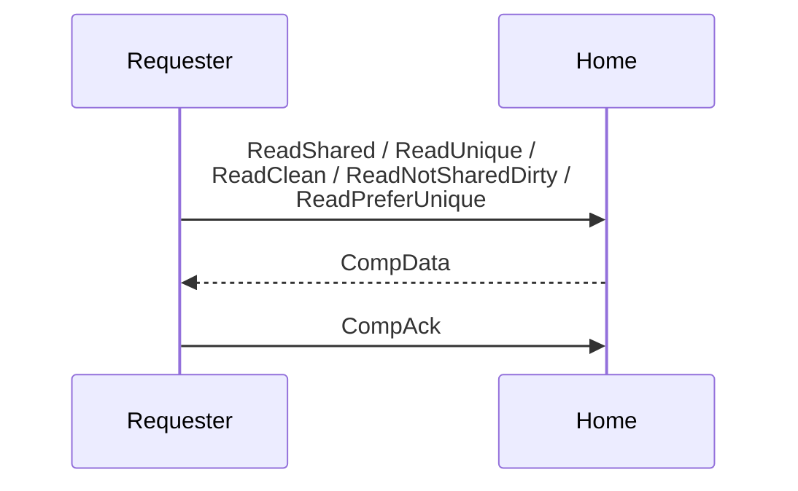

Home holds a usable copy and returns response + data in a single `CompData` flit.

</div>
<div>

**Alt 3 — DMT from Subordinate**

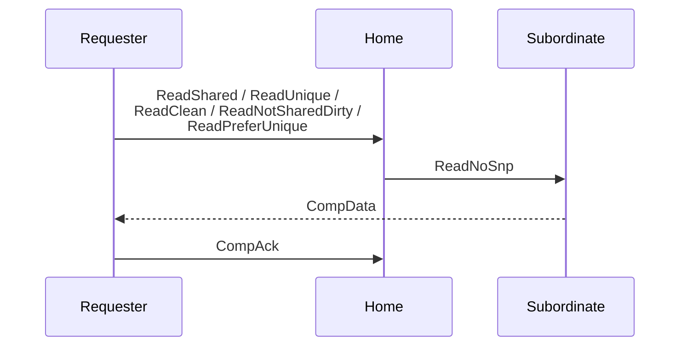

Home forwards to memory; Subordinate sends `CompData` straight to the Requester, bypassing Home on the return leg.

</div>
</div>

<!-- Speaker Notes:
This is the first of three practice transactions. Allocating Read is the bread-and-butter
coherent read: the Requester intends to put the line into a coherent cache state (SC, UC, UD,
or SD) and must therefore close the loop with CompAck. Spec section B2.3.1.1, Figure B2.1.

The full Figure B2.1 encodes six alternatives (1, 2, 3, 4, 5a–d, 6) between four lifelines
(Requester, Home, Subordinate, Snoopee). On this slide we show only the two that come up
most often in practice — Alt 1 and Alt 3 — and summarize the rest verbally. For the full
decision tree, see the spec figure or the companion note SequenceHowTo.md.

Actors in the full figure. Requester is always an RN-F for these opcodes (Allocating Reads
can only come from a fully coherent Request Node). Home is HN-F acting as Point of Coherence
and Point of Serialization. Subordinate is SN-F (memory side). Snoopee is a peer RN-F that
holds or might hold the line.

In-scope opcodes (listed on both arrows). The spec lists six: ReadClean, ReadNotSharedDirty,
ReadShared, ReadUnique, ReadPreferUnique, and MakeReadUnique. The slide shows five — we
omit MakeReadUnique from the label because MakeReadUnique uses its own dedicated
Alternative 6 (Comp instead of CompData) and does not belong to either of the two paths
shown here.

Fields that affect the flow. For Allocating Reads, CompAck is always required from an RN-F
(per B2.7.3), so ExpCompAck is effectively pinned to 1 and is not a selector the way it is
for Non-allocating Reads. The choice among Alt 1–5 is a Home-local decision based on where
the line lives.

Left column — Alt 1 "Combined response from Home". The Home already has a usable copy of the
line (typically because an inclusive or mostly-inclusive cache inside the interconnect holds
it, or because the directory confirms there is no dirty peer and Home can construct the line
itself). Home returns a single CompData flit on RDAT, carrying both the response (cache state:
SC, UC, UD, SD — possibly with the _PD "PassDirty" bit) and the 64-byte payload in one flit
sequence. The Requester fills its cache in the returned state and sends CompAck on SRSP to
close the loop. This is the shortest possible Allocating Read — three flits end-to-end and
no Subordinate involvement.

Right column — Alt 3 "Combined response from Subordinate (DMT)". The Home does not have the
line and the directory says no peer RN-F does either, so Home must fetch from memory. Under
Direct Memory Transfer, Home issues a downstream ReadNoSnp to the Subordinate, and the
Subordinate sends CompData straight to the Requester, bypassing Home on the return leg. This
saves one NoC hop and one buffer allocation at Home. The Requester still sends CompAck to
Home (not to Subordinate) — Home remains the Point of Serialization even under DMT. We are
showing the unordered sub-case (Order = 00); for ordered reads (Order = 10 or 11) the
Subordinate also returns a ReadReceipt to Home to confirm the downstream request will not
be retried, but that message is optional from the figure's perspective and we have elided
it here.

Why these two. Every real coherent load miss follows either "Home served it from its own
cache" (Alt 1) or "Home had to go to DRAM" (Alt 3). Alt 2 and Alt 4 are latency-optimized
variants of Alt 1 and Alt 3 respectively — they split the single CompData into separate
RespSepData (permissions) and DataSepResp (payload) so the Requester can send CompAck as
soon as permissions arrive, freeing Home to snoop the same line for the next request sooner.
Whether Alt 2/4 or Alt 1/3 is used depends on implementation choice.

The other four alternatives, in one line each.

• Alt 2 — RespSepData + DataSepResp from Home. Latency-optimized Alt 1. Home has the line
but splits the response to let the Requester send CompAck earlier.

• Alt 4 — RespSepData from Home, DataSepResp from Subordinate (DMT). Latency-optimized
Alt 3. Home sends permissions immediately (because the directory already knows them) while
the data is fetched from memory in parallel.

• Alt 5 — DCT via Snp*Fwd forwarding snoop. The directory indicates a peer RN-F holds the
line in a forwardable state. Home issues SnpSharedFwd, SnpUniqueFwd, SnpNotSharedDirtyFwd,
SnpCleanFwd, or SnpOnceFwd to the Snoopee, which responds in one of four ways: 5a forward
CompData to Requester + SnpRespFwded to Home; 5b same + SnpRespDataFwded with a data copy
to Home; 5c or 5d refuse the forward (SnpResp or SnpRespData/Ptl to Home), forcing Home to
fall back to Alt 1–4. DCT is opportunistic, not guaranteed.

• Alt 6 — MakeReadUnique only. The Requester is about to overwrite the full line, so it
asks for unique permission without data. Home returns a bare Comp instead of CompData.
Illegal for the other five opcodes.

Closing the loop. A single CompAck from Requester to Home terminates the transaction in
every alternative. It is legal to send CompAck as soon as CompData (Alts 1, 3, 5a, 5b),
Comp (Alt 6), or RespSepData (Alts 2, 4) arrives — the Requester does not have to wait for
DataSepResp. CompAck release lets Home forward a queued snoop for the same line to this
Requester.

Common misreadings. (1) The Subordinate and Snoopee lifelines only exist on certain
alternatives — don't assume all four actors are always active. (2) Under DMT (Alt 3/4),
CompAck still goes to Home, never to Subordinate. (3) Alt 5c/5d are legitimate outcomes,
not error cases — DCT is opportunistic. (4) For ordered requests on Alt 3, a ReadReceipt
from Sub to Home appears in the original figure as an opt block — we have elided it in the
slide because the typical RN-F load miss uses Order = 00.
-->

---

<!--
========================================================================================
>>> SLIDE 14
>>> Allocating Read with DCT — B2.3.1.1 Alt 5 / Figure B2.1
========================================================================================
-->

## Practice Transaction 2 — Allocating Read with DCT (B2.3.1.1 Alt 5, Fig B2.1)

<div class="columns">
<div>

**Alt 5a — Snoopee held Clean**

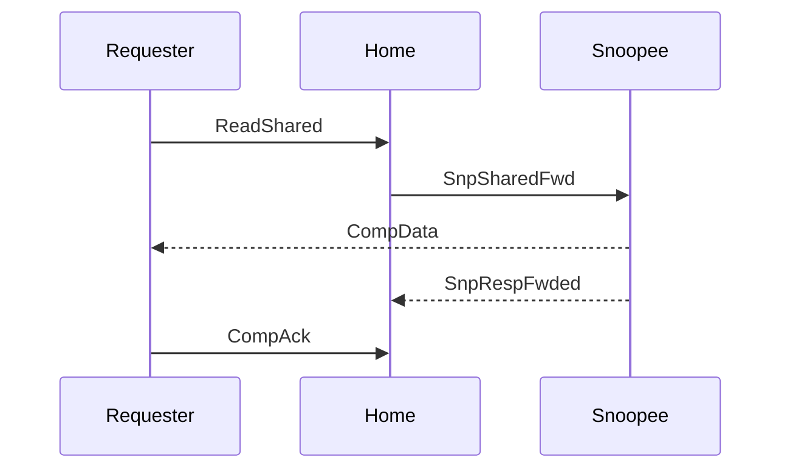

Snoopee forwards data to the Requester and updates Home with an RSP-only `SnpRespFwded`. No data copy goes to Home.

</div>
<div>

**Alt 5c — Snoopee refuses, fallback to DMT**

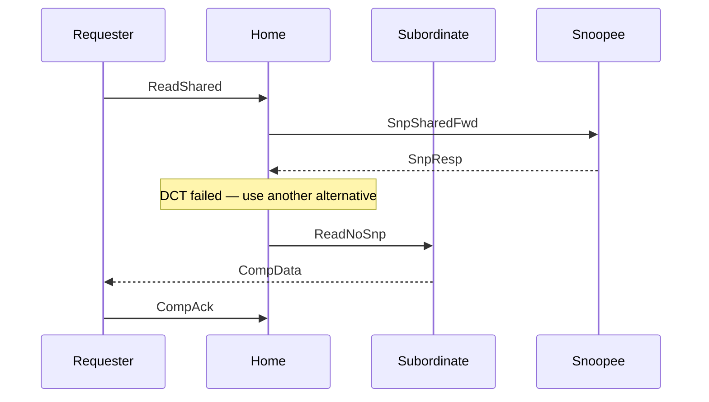

Snoopee returns `SnpResp` on RSP with no data (e.g. it had silently evicted). Home must fall back to Alt 1–4; here we show a DMT fallback via Subordinate.

</div>
</div>

<!-- Speaker Notes:
Second practice transaction — same transaction class as slide 14 (Allocating Read,
B2.3.1.1) but this time we focus on Alternative 5: the DCT path where the data comes from
a peer RN-F, not from Home's cache or from DRAM. Two actors become three: Requester, Home,
Snoopee. The Subordinate is dormant here.

What triggers this path. Home's directory shows that a peer RN-F holds the line in a state
that can serve it. Instead of snooping, pulling the data back, and then forwarding to the
Requester, Home issues a forwarding snoop (the Snp*Fwd family) that instructs the Snoopee
to send the data directly. This saves one NoC hop and the Home's data buffer.

The Snp*Fwd family. Which forwarding snoop Home picks depends on the original request; the
mapping is defined in B4.4 "Request transactions and corresponding Snoop requests":

• ReadShared          → SnpSharedFwd
• ReadUnique          → SnpUniqueFwd
• ReadClean           → SnpCleanFwd
• ReadNotSharedDirty  → SnpNotSharedDirtyFwd
• ReadPreferUnique    → SnpPreferUniqueFwd
• ReadOnce*           → SnpOnceFwd (IO-coherent variant)

We use ReadShared → SnpSharedFwd on both slides as a concrete, familiar example.

Left column — Alt 5a "With response to Home" (SnpRespFwded).

Setup. The Snoopee holds the line in a Clean state — SC (Shared Clean) or UC (Unique
Clean). The Requester asked for a shared copy.

Flow.
• R → H: REQ ReadShared.
• H → N: SNP SnpSharedFwd. Home provides its own NID in FwdNID and the Requester's TxnID
  in FwdTxnID so the Snoopee knows who to forward to.
• N → R: DAT CompData. The Snoopee sends the cache line directly to the Requester with a
  Resp field that says SC. HomeNID in the data flit tells the Requester where to send
  CompAck (it goes to Home, not the Snoopee).
• N → H: RSP SnpRespFwded. A response-channel message only — no data. It tells Home the
  snoop succeeded, which peer state changed, and what state the Requester will end up in.
• R → H: SRSP CompAck. Closes the transaction.

Typical state transitions.
• Snoopee: SC → SC (clean sharer stays), or UC → SC (gives up uniqueness).
• Requester: I → SC.

When 5a is used. Snoopee had a clean copy, and Home either already has the line or does not
need a refresh. The line has no dirty responsibility to re-home.

Right column — Alt 5c "Failed through RSP channel, must use alternative."

Setup. Home tried DCT based on its directory, but the Snoopee cannot honour the forward —
most commonly because the peer silently evicted the line between Home's directory lookup
and the snoop's arrival, so it no longer holds anything to send. Stale directory entries,
transient states at the peer, and certain MSHR/TBE conflicts are the usual culprits.

Flow (as drawn on the slide — Alt 5c refusal, followed by Alt 3 DMT as the fallback).

• R → H: REQ ReadShared.
• H → N: SNP SnpSharedFwd. Home optimistically asks for a forward.
• N → H: RSP SnpResp. Response-channel only, no data. The Resp field carries the
  Snoopee's final state (typically I — the peer confirms it has nothing). Crucially, no
  data reaches the Requester on this leg.
• Fallback. The spec text for 5c says explicitly: "The Home must use another alternative
  described in this section to complete the transaction to the Requester." Home picks one
  of Alts 1, 2, 3, or 4. We illustrate Alt 3 (combined response from Subordinate via DMT),
  which is the typical fallback when the peer has nothing and Home also has nothing cached.
• H → S: REQ ReadNoSnp. Home issues a downstream read.
• S → R: DAT CompData. Subordinate sends the line straight to the Requester (DMT).
• R → H: SRSP CompAck. Closes the transaction.

Why this is an important scenario to see. It is the canonical example of a single Read
transaction touching all four actors — Requester, Home, Snoopee, and Subordinate — within
one logical transaction. The CHI spec's figure semantics allow this because Alt 5 sits at
the top level and its failure branches explicitly re-enter Alt 1–4; the Snoopee interaction
is not an "independent transaction" in the 5c/5d case but part of the same transaction flow.

Alternatives Home could pick as the fallback.
• Alt 1 — if Home can now satisfy the read from an internal cache state that changed while
  the snoop was in flight.
• Alt 2 — the RespSepData / DataSepResp variant of Alt 1.
• Alt 3 (shown) — DMT, the common case when nobody has the data.
• Alt 4 — Home returns RespSepData immediately, Subordinate returns DataSepResp.

Alt 5d in one line. Sibling of 5c where the refusal carries a data payload up to Home
(SnpRespData or SnpRespDataPtl on the DAT channel). Home still cannot treat this as a
forward — it must execute a follow-up alternative to deliver the data to the Requester.
Useful when the peer has a partially valid copy and Home wants to absorb it for a later
use, but the immediate transaction still needs a Home-issued completion.

5a vs 5c in one sentence. 5a is the happy path — Snoopee forwards `CompData` to the
Requester and the transaction ends quickly; 5c is the refusal path — Home spent a snoop
round-trip in vain and must still go to Home's own cache or to memory to serve the
Requester.

Common misreadings.

(1) The Subordinate lifeline in 5c is not an "independent transaction" in the same sense
as snoops Home fires during Alt 1–4. It is part of the same transaction flow because 5c's
fallback is explicitly specified as "use another alternative described in this section."

(2) CompAck goes to Home, not to the Subordinate (even under DMT). Home is still the
Point of Serialization.

(3) "DCT saves two hops" — no, it saves one. Without DCT it would be R → H → N → H → R
(4 hops); with DCT (5a) it is R → H, H → N, N → R plus N → H for the response — still 4
hops but one is a cheap RSP message instead of a full data payload, and Home's data buffer
is skipped. When DCT fails (5c), the round-trip to the Snoopee is pure overhead.

(4) `SnpResp` in 5c is not an error response — it is a legitimate "I don't have the line
in a forwardable state" reply. Home is required to handle it.

In gem5 — DCT is gated by the `enable_DCT` parameter on the HN-F controller. It is enabled
by default in the standard CHI configurations. When the SLICC protocol observes a 5c-style
refusal (for example because the directory was optimistic), it executes the fallback by
issuing the downstream `ReadNoSnp`, matching the diagram shown here.
-->

---

<!--
========================================================================================
>>> SLIDE 15
>>> Write with DWT — B2.3.2.1 Alt 1 / B2.3.2.4 Alt 1
========================================================================================
-->

## Practice Transaction 3 — Write with DWT: Plain vs Combined + CMO (B2.3.2.1, B2.3.2.4)

<div class="columns">
<div>

**Immediate Write (B2.3.2.1 Alt 1 — DWT)**

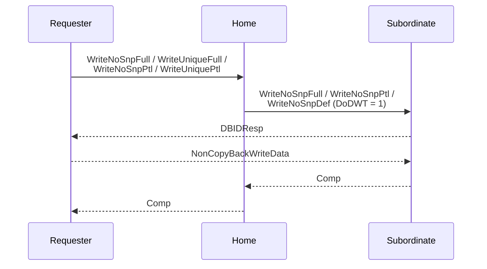

Home delegates to Subordinate. Data flows straight R → S; Home never buffers the payload. Sub issues `DBIDResp`, receives data, returns `Comp` to Home. Home mirrors `Comp` to Requester.

</div>
<div>

**Combined Write + CMO (B2.3.2.4 Alt 1 — DWT)**

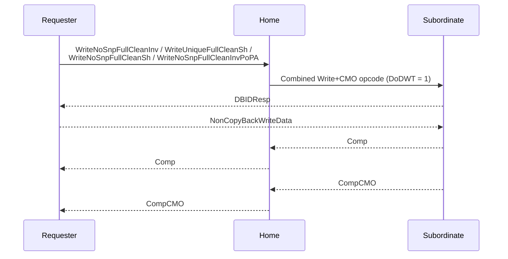

Same DWT skeleton; the combined opcode carries **write + CMO** together. Sub returns two completions — `Comp` for the write half, `CompCMO` for the CMO half. Home mirrors both to the Requester.

</div>
</div>

<!-- Speaker Notes:
Third practice transaction. The theme is "data flowing down to memory": we show the DWT
(Direct Write-data Transfer) path for two different write families. Left column is the
plain Immediate Write from B2.3.2.1 Alt 1; right column is the Combined Immediate Write
and CMO from B2.3.2.4 Alt 1. Three actors in each — Requester, Home, Subordinate. No
Snoopee lifeline: any snoops Home fires to enforce coherence are independent transactions
from the Home (see B2.3.9) and deliberately not drawn.

What DWT is. Direct Write-data Transfer lets the Requester's write data bypass Home on
the WDAT channel. Home delegates the write to the Subordinate by setting the DoDWT bit on
the downstream request. The Subordinate, not Home, issues DBIDResp to the Requester, and
the Requester sends NonCopyBackWriteData directly to the Subordinate. Home stays in the
loop for completion bookkeeping but never touches the payload. That is the whole
bandwidth argument for DWT.

Why these two columns. The left column is the foundational DWT shape — the simplest
concrete demonstration of "data flows straight to Subordinate." The right column shows
that the same skeleton scales naturally to combined Write+CMO transactions, with one new
element: the CompCMO response that acknowledges the CMO half of the combined operation.

Left column — Immediate Write via DWT (B2.3.2.1 Alt 1).

In-scope opcodes. The spec lists seven for B2.3.2.1: WriteNoSnpPtl, WriteNoSnpFull,
WriteNoSnpDef, WriteUniquePtl, WriteUniqueFull, WriteUniquePtlStash, WriteUniqueFullStash.
Home strips the snoop aspect of WriteUnique* before sending downstream; the opcode that
actually lands at Sub is always WriteNoSnpPtl, WriteNoSnpFull, or WriteNoSnpDef — with
DoDWT = 1.

Flow (on the slide, step by step).
• R → H: REQ carrying the original write opcode.
• H → S: REQ with DoDWT = 1. Home forwards downstream.
• S → R: CRSP DBIDResp. Critical — the buffer grant comes from Sub, not Home. DBIDResp
  carries the DBID that the Requester must echo back as TxnID in the data flit.
• R → S: WDAT NonCopyBackWriteData (or WriteDataCancel if the Requester aborts). Only
  legal after DBIDResp arrives.
• S → H: CRSP Comp. Sub signals that the write has been accepted. Sub is permitted, but
  not required, to wait for the write data (or WriteDataCancel) from the Requester before
  sending Comp.
• H → R: CRSP Comp. Home mirrors the completion. Home is permitted, but not required,
  to wait for the S→H Comp before returning Comp to the Requester.

What we have elided. The spec figure also shows an opt [TagOp == Match] branch with a
TagMatch response from Sub to R for memory-tagged writes. For TagOp != Match — the
common case — that arrow is not sent and is not drawn on this slide.

Right column — Combined Immediate Write and CMO via DWT (B2.3.2.4 Alt 1).

What a "Combined Write and CMO" is. One transaction carries both a write payload and a
Cache Maintenance Operation. Example: WriteNoSnpFullCleanInv — write these 64 bytes, then
run a CleanInvalid across any downstream caches. The opcode packages the write and the
CMO into a single atomically-scheduled operation.

In-scope opcodes (10 total in B2.3.2.4):
• WriteNoSnpPtlCleanInv / WriteNoSnpFullCleanInv
• WriteNoSnpPtlCleanSh / WriteNoSnpFullCleanSh
• WriteUniquePtlCleanSh / WriteUniqueFullCleanSh
• WriteNoSnpPtlCleanInvPoPA / WriteNoSnpFullCleanInvPoPA
• WriteUniqueFullCleanInvStrg / WriteNoSnpFullCleanInvStrg

TagOp constraint. For Combined Write + CMO, TagOp = Match is not permitted (spec note in
B2.3.2.4). So no TagMatch response ever appears in this figure — TagOp does not affect
the flow.

Flow (on the slide, step by step).
• R → H: REQ carrying the combined Write+CMO opcode.
• H → S: REQ with DoDWT = 1. Unlike plain Immediate Write, the downstream opcode is the
  full combined opcode (WriteNoSnpFullCleanInv, etc.), not a stripped-down WriteNoSnp.
  Sub therefore sees both the write and the CMO intent.
• S → R: CRSP DBIDResp.
• R → S: WDAT NonCopyBackWriteData (or WriteDataCancel).
• S → H: CRSP Comp. Acknowledges the write half. Sub may send this before or after the
  write data arrives.
• H → R: CRSP Comp. Home mirrors the write completion.
• S → H: CRSP CompCMO. Acknowledges the CMO half. Sub may send CompCMO before or after
  write data.
• H → R: CRSP CompCMO. Home mirrors the CMO completion. One subtle ordering constraint:
  if there is an observer downstream of Home (a deeper subordinate, or a persistence
  point), Home must wait for CompCMO from Sub before returning CompCMO to the Requester.
  Otherwise Home is free to forward it earlier.

Why two completions. Comp means "the write is accepted and observable at this level."
CompCMO means "the CMO has been completed — any caches below this point that needed a
Clean or Invalidate have done so." They are independent acknowledgements and arrive
separately because they complete at different times: the CMO may have to propagate
through additional downstream observers before it is truly done.

The other B2.3.2.4 alternatives, in one line each (not drawn on the slide).

• Alt 2 — Non-combined Write to Subordinate with DWT. Home splits the combined opcode
  into a plain WriteNoSnp (DoDWT = 1) down to Sub, and handles the CMO half itself. Sub
  returns only Comp; Home returns Comp + CompCMO to the Requester. Used when the
  Subordinate does not support the combined opcode variant.

• Alt 3 — Without DWT. Home handles everything locally: the Requester sends
  NonCopyBackWriteData to Home, not to Sub. Sub-alternatives 3a1/3a2, 3b1/3b2/3b2a/3b2b
  cover DBIDResp/Comp packaging and optional CompAck handling for OWO ordering.

Common misreadings.

(1) The downstream opcode differs between the two columns. Left — always one of
WriteNoSnpPtl / WriteNoSnpFull / WriteNoSnpDef. Right — the full combined opcode
(WriteNoSnpFullCleanInv etc.). Readers often assume Home always strips to a plain
WriteNoSnp; that is only true for B2.3.2.1 Alt 1.

(2) DBIDResp under DWT comes from Subordinate, not Home. Readers who internalized the
Home-centric view of non-DWT writes (Alt 3 in either section) often expect Home to issue
DBIDResp. Under DWT, Home is out of the data path AND out of the buffer-grant path.

(3) WriteDataCancel is a legal substitute for NonCopyBackWriteData. The Requester can
abort after receiving DBIDResp — both Comp and CompCMO still arrive and the transaction
completes cleanly, just without the write landing.

(4) ExpCompAck and DWT. Under DWT (both columns), no CompAck message is shown even if
ExpCompAck was set in the original request. Sub closes the write half of the transaction
loop at Home, and Home closes the loop at the Requester via Comp (and CompCMO for the
combined case). CompAck appears only in the No-DWT Alt 3 sub-trees of B2.3.2.4.

(5) The CompCMO arrow pair is NOT a second retry of Comp. Comp and CompCMO are
semantically different responses that both ride CRSP; students who miss this sometimes
read the right column as "the same Comp sent twice for reliability." It is not — Comp
acknowledges the write, CompCMO acknowledges the CMO.

In gem5. The CHI-cache and HN-F controllers implement the DWT decision as a bit on the
downstream request generated from the original write. For combined Write + CMO, the CHI
SLICC file threads both Comp and CompCMO responses through the HN-F transition table
before releasing the Requester. Search for "CompCMO" under src/mem/ruby/protocol/chi/
for the SLICC machinery.
-->

---

<!--
========================================================================================
>>> SLIDE 16
>>> Request Retry — the P-Credit handshake
========================================================================================
-->

## Request Retry — the P-Credit handshake

<style scoped>
.retry-layout {
  display: flex;
  gap: 28px;
  align-items: flex-start;
}
.retry-layout > div:first-child { flex: 3; min-width: 0; }
.retry-layout > div:last-child  { flex: 2; min-width: 0; font-size: 14px; line-height: 1.3; }
.retry-layout img { max-height: 486px; max-width: 90%; width: 90%; }
</style>

<div class="retry-layout">
<div>

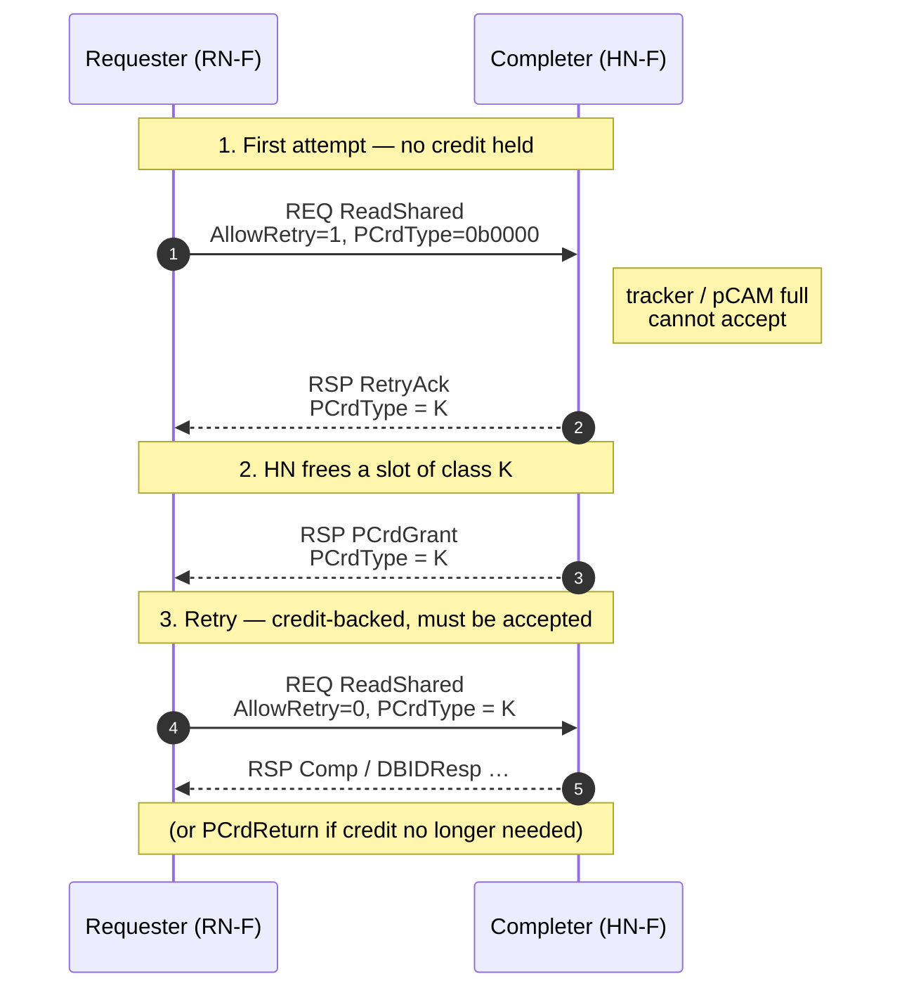

</div>
<div>

**Field invariants** *(B2.10.2.2)*

| AllowRetry | PCrdType         | Meaning           |
|------------|------------------|-------------------|
| `1`        | `0b0000`         | First attempt    |
| `0`        | value from grant | Credit-backed retry |

**Channels:** <span class="pill req">REQ</span> original + reissue, `PCrdReturn` &nbsp;·&nbsp; <span class="pill rsp">RSP</span> `RetryAck`, `PCrdGrant`

**Per-type credits — 4 b ⇒ 16 classes**

- Partition Completer resources (trackers, snoop filters, write buffers, QoS bands).
- One saturated class can't starve another.
- Class semantics are **IMPLEMENTATION SPECIFIC**; single-class designs use `0b0000`.

<p style="margin-top: 10px; font-size: 12px; line-height: 1.25;"><strong>gem5 note:</strong> This slide shows the full CHI spec view. Ruby CHI models <code>AllowRetry</code>, <code>RetryAck</code>, and <code>PCrdGrant</code>, but most paths use a simplified single-class retry scheme.</p>

</div>
</div>

<div class="takeaway" style="margin-top: 12px; font-size: 14px; line-height: 1.35; padding: 10px 14px;">
Retry is a three-step handshake on REQ + RSP: <code>RetryAck</code> tells the Requester <em>which</em> credit class to wait on, <code>PCrdGrant</code> hands that credit over, and the reissued request consumes it with <code>AllowRetry=0</code>. The Completer is then obliged to accept — that obligation is the only forward-progress guarantee CHI gives you.
</div>

<!-- Speaker Notes:
Time budget: 4 minutes.

The Request Retry flow is CHI's flow-control valve. Without it, a
Home Node with a full tracker has nowhere to put a back-pressure
signal — REQ has no ready/valid back-pressure semantics beyond
link-level credits, and link credits guard the channel, not the
protocol resources behind it. Retry is how the Completer says
"I heard you, I cannot serve you yet, here is how to wait."

Walk the diagram top to bottom.

Step 1. The Requester sends its original transaction — say a
ReadShared. AllowRetry is 1, meaning "I have no credit, please
serve me if you can, otherwise tell me to retry." PCrdType must be
all zeros on this first attempt; that is a hard rule from B2.10.2.2.
The Completer looks at its resources — pCAM slot, snoop filter
entry, response buffer, QoS quota — and decides it cannot accept.
It returns RetryAck on the RSP channel and stamps a PCrdType value
on it, call it K. K is the Completer's choice; it identifies which
credit pool the Requester must wait on.

Step 2. Time passes. Eventually a transaction of class K completes
at the Completer and frees its resource. The Completer then sends
PCrdGrant on RSP, also tagged with PCrdType = K. This is the
moment the credit transfers — the Requester now owns one P-Credit
of class K.

Step 3. The Requester reissues the original request on REQ. Two
fields change from the first attempt: AllowRetry flips to 0, and
PCrdType is set to K. That combination tells the Completer
"this is credit-backed — you promised to accept it." The Completer
is obliged. From here the transaction proceeds normally — Comp,
DBIDResp, data, CompAck, whatever the opcode requires.

One escape hatch worth knowing: PCrdReturn. If the Requester ends
up not needing the credit — say the request was killed by software,
or coalesced with another transaction — it returns the credit using
the PCrdReturn opcode on REQ, also stamped with PCrdType = K. This
prevents credit leakage across the fabric. A real implementation
must track outstanding granted credits per type to know whether a
return is owed.

Two design points to anchor.

First, why per-type credits. The PCrdType field is 4 bits, so up
to 16 independent credit classes. The intent is to partition the
Completer's resource pool — separate trackers for reads vs writes,
separate buffers per QoS band, separate snoop-filter entries vs
data-buffer entries. Without classification, a flood of writes
could starve reads even after the Completer freed a read slot,
because the Requester would have no way to know which class of
credit it was holding. Classification gives the Completer fine-
grained back-pressure that does not break ordering or fairness
between request types. The actual mapping of K values to resource
classes is implementation-specific — the spec only mandates the
handshake, not the semantics of K. Single-class implementations
are encouraged to use 0b0000 for everything.

Second, this is the only forward-progress guarantee in CHI.
Once a PCrdGrant is sent, the Completer must accept the matching
retry. That obligation is what lets the Requester treat the retry
as a guaranteed-success transaction. Verification engineers spend
real effort on credit accounting bugs: lost grants cause hangs,
double-grants cause spec violations, and PCrdReturn leaks slowly
exhaust the Completer's pool. When a CHI system wedges, the retry
ledger is the first place to look — it sits at the intersection of
REQ and RSP and touches every flow that can ever back-pressure.

In gem5's CHI model the handshake is present (PCrdGrant appears as
an RSP opcode in CHI-msg.sm) but the multi-class typing is
simplified — most paths use the single-class convention.
-->

---

<!--
========================================================================================
>>> SLIDE 17
>>> Memory Subsystem Modeling Levels in gem5
========================================================================================
-->

<style scoped>
section h2 { margin: 0 0 6px 0; font-size: 26px; }
.levels-img { text-align: center; margin: 0; }
.levels-img img { max-height: 580px; max-width: 100%; }
</style>

## Memory subsystem modeling levels in gem5

<div class="levels-img">


</div>

<!-- Speaker Notes:
Time budget: 5–6 minutes.

Before we walk into the gem5 implementation of CHI, step back and look
at the modeling menu gem5 actually offers and where CHI fits.

The diagram has three columns, each modeling the same logical hardware
— two cores, their L1 caches, an interconnect, and a home / memory
tier. The rows line up across all three columns deliberately: cores at
the top, caches just below, then the INTERCONNECT band, then the home
and memory tier. What changes from left to right is precision. Read it
as a fidelity ladder.

Start on the **left, Classic** stack — `src/mem/cache/` and
`coherent_xbar.cc`. Notice the colour cue: it is the *L1 cache* boxes
that are red, not the crossbar. That is deliberate, and it is where
new readers usually get the picture wrong. **MOESI state lives in the
cache**, encoded as three flag bits per block — `valid`, `writable`,
`dirty` — on `CacheBlk`. The five MOESI states fall out of those
flags: M = `1·1·1`, O = `0·1·1`, E = `1·0·1`, S = `0·0·1`,
I = `0·0·0`. The state machine that *transitions* those flags is
distributed across `Cache::access`, `Cache::handleSnoop`, and `MSHR`
— there is no DSL declaring "in state O on event SnpInvalidate go to
state I", just C++ control flow that mutates the bits. The "alphabet"
of the protocol is the `MemCmd` enum on packets — `ReadReq`,
`ReadExReq`, `UpgradeReq`, `InvalidateReq`, the writeback variants —
and the cache's choice of `MemCmd` plus its block flags is the entire
state machine. *That* is what makes Classic rigid: the protocol is
implicit in the C++ of multiple methods plus an enum, with no
extension point.

The grey box below — `CoherentXBar` — is the broadcast fabric. It
takes a request from a CPU-side port, calls `forwardTiming()` to
deliver snoops to peer caches, aggregates snoop responses, and routes
the final reply. It does *not* own coherence state. Optionally it
hosts a `SnoopFilter` SimObject — a hash-map keyed by line address
holding two 256-bit bitmasks per entry: `requested` (in-flight) and
`holder` (currently caching). With a filter wired in, the crossbar
snoops only the ports that might hold the line; without it, it
broadcasts to everyone. The filter tracks **presence**, never state —
it cannot tell M from S — and it is exact except for one wrinkle:
silent clean evictions are not always notified, so the filter is
mildly pessimistic. The caption summarises this: the crossbar is a
fabric plus an optional presence-tracking filter; no FSM, no virtual
channels, no flits. Pick this stack when the CPU pipeline is the
research subject — branch-predictor studies, ISA experiments —
because Classic is the fastest to simulate and the protocol on the
wire is not the question being asked.

Move to the **middle, Ruby + SimpleNetwork**. Cores and L1 boxes are
the same logical hardware, but their interior has changed: the L1 is
now a SLICC controller — a state machine written in a domain-specific
language with explicit states, events, and actions. You pick which
protocol — MI, MESI, MOESI, CHI — at SCons build time, and SLICC
generates the C++. That flexibility costs nothing visually; the L1
box just gets a new label. Now look at the interconnect. The
SimpleNetwork box has been opened up to show its actual queue
structure: four horizontal lanes, one per virtual network — REQ, SNP,
RSP, DAT. Inside each lane is a row of `MessageBuffer` slots, and at
the right end a small Throttle gate. That is the gem5 reality: every
`Switch` allocates **one `MessageBuffer` per output-port × per-vnet**
(`Switch.cc:115` calls them "intermediary queues"), and a per-link
Throttle gates dequeue rate by the link's bandwidth budget. There are
no flits, no VC allocators — messages move atomically per vnet.
Contention shows up in three places: (1) **PerfectSwitch arbitration**
between input ports for the same output-port-and-vnet, with priority
groups, (2) **Throttle bandwidth saturation** per link, and (3)
**buffer-full backpressure** if you set `buffer_size > 0`. Crucially,
by default all four vnets share one bandwidth pool. Setting
`physical_vnets_channels` and `physical_vnets_bandwidth` partitions
the link so REQ / SNP / RSP / DAT each get their own bandwidth budget
and saturate independently — useful when you want to know whether
your data network or your request network is the bottleneck. This is
the right stack when the *protocol* is the research subject and the
NoC microarchitecture is not.

Now the **right, Ruby + Garnet**. Same cores. Same L1 SLICC
controllers — except now the controller exposes that it has four VNets
out, one per CHI channel. Then look down: there is a `NI`
(NetworkInterface) row that did not exist in the middle column, and
below it the interconnect is no longer one box — it is two routers,
`R0` and `R1`, each opened up to show the per-cycle pipeline:
`RC` route compute, `VA` virtual-channel allocator, `SA` switch
allocator, `XB` crossbar — and below those an `OutBuf` per-VC flit
queue. Flits are the unit of transfer here, and they walk through that
pipeline cycle by cycle. Between the routers you see two arrows: the
solid violet one carries flit data forward, and the dashed green one
carries credits back. That is credit-based flow control, the
fundamental backpressure mechanism of any real NoC. This is the
slowest stack to simulate, because every byte of every cache line is
chopped into flits and walked through routers. It is also the *only*
stack where you can ask "what is my NoC latency under contention" or
"does this routing algorithm deadlock" and get an architecturally
faithful answer. **CHI in gem5 lives here**, and the rest of this deck
runs in this column.

A **fourth stack** exists but has no column on this slide because it
has no caches and no protocol: Garnet standalone. The
`Garnet_standalone-cache.sm` and `-dir.sm` files are intentionally
trivial — their only job is to inject synthetic traffic patterns into
Garnet routers for NoC microbenchmarking. Routing algorithms, mesh
topologies, deadlock studies — that work happens without a real
protocol on top.

Three things worth saying out loud, because they trip people up.

First, Classic and Ruby are *mutually exclusive at the cache level*.
They do not share abstractions: Classic moves whole `Packet` objects
across `Port` pairs; Ruby moves typed `Message` objects through
`MessageBuffer`s. There is no incremental upgrade path. You commit
when you wire the system in Python.

Second, Garnet is not an alternative to Ruby. Ruby is the protocol
framework; Garnet is one of two network back-ends Ruby can use. The
other is SimpleNetwork. You cannot run "just Garnet" against classic
caches — there is no NetworkInterface, no MessageBuffer on the
classic side. The pragmatic mixed pattern — classic L1/L2 above a
RubyPort, with Ruby+Garnet below — is supported and is what you reach
for when you want NoC realism without rebuilding your core
configuration.

Third, why CHI is in Ruby and not in Classic. The CHI cache controller
is 228 transition blocks across roughly ten thousand lines of SLICC,
with four virtual channels and dozens of states. Recall the Classic
side encodes its protocol as a `MemCmd` enum plus block-flag
mutations spread across `Cache::access` and `handleSnoop` — there is
no controller object to subclass, no DSL to extend, no
multi-virtual-channel buffer system. To bring CHI into the Classic
tree you would invent all of that from scratch: a controller class,
typed messages, four virtual networks, atomic transitions with
rollback on backpressure, dispatch tables. SLICC already provides all
of that — it generates the dispatch, the wakeup, the message-buffer
scheduling, and it enforces atomicity. So CHI's home is the rightmost
column not by accident — it is the only column with the machinery
the protocol needs.

The next slide opens the implementation half of the deck: how a CPU
instruction crosses from the Classic side into Ruby, becomes a
RubyRequest on `mandatoryQueue`, and gets picked up by a SLICC
controller. From there we dissect the Ruby controller, then the Garnet
router. Everything that follows assumes the third column.
-->

---

<!--
========================================================================================
>>> SLIDE 18
>>> From CPU ISA to a RubyRequest
========================================================================================
-->

<style scoped>
section h2 { margin: 0 0 10px 0; font-size: 26px; }
section h3 { font-size: 15px; margin: 2px 0 4px 0; color: var(--chi-blue-deep); font-weight: 700; }
section table { font-size: 13.5px; border-collapse: collapse; width: 100%; margin: 0; }
section th, section td { padding: 2px 8px; line-height: 1.35; border-bottom: 1px solid var(--chi-border); }
section th { background: #eef3fb; color: var(--chi-blue-deep); font-size: 12.5px; text-transform: uppercase; letter-spacing: 0.04em; }
section code { font-size: 12.5px; padding: 0 1px; background: transparent; }
section h2 code, section h2 em, section h2 strong { font-size: inherit; font-weight: inherit; font-style: inherit; letter-spacing: inherit; }
section h3 code { font-size: inherit; font-weight: inherit; }
.isa-diagram { text-align: center; margin: 0 0 10px 0; }
.isa-diagram img { max-height: 180px; }
.isa-cards .channel-card { padding: 9px 13px; margin-bottom: 7px; font-size: 12.5px; line-height: 1.38; }
.isa-cards .channel-card strong { color: var(--chi-blue-deep); }
.columns { gap: 22px; align-items: stretch; }
.columns > div:first-child { flex: 1.25; }
.isa-take { margin-top: 8px; padding: 10px 14px; font-size: 14px; line-height: 1.35; }
</style>

## Crossing over — from CPU ISA to a `RubyRequest` on `mandatoryQueue`

<div class="isa-diagram">

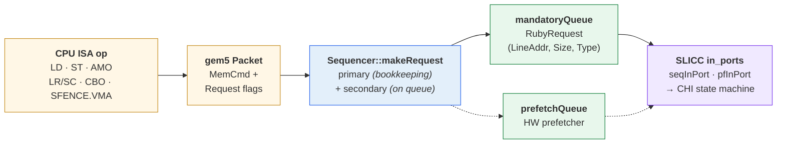

</div>

<div class="columns">
<div>

### What actually lands on the queue — RISC-V focus

| RISC-V instruction | `secondary_type` |
|---|---|
| `L{B,H,W,D}` / `C.L*` / FP loads | `LD` |
| `S{B,H,W,D}` / `C.S*` / FP stores | `ST` |
| instruction fetch | `IFETCH` |
| `LR.W/D` · `SC.W/D` | `LD` · `ST`  *(demoted)* |
| `AMO*` with `rd ≠ x0` | `ATOMIC_RETURN` |
| `AMO*` with `rd == x0` | `ATOMIC_NO_RETURN` |
| `CBO.inval` / `clean` / `flush` | `FLUSH` &nbsp;❌&nbsp;*fatal* |
| `SFENCE.VMA` | *(local TLB — no packet)* |

</div>
<div class="isa-cards">

<div class="channel-card req">
<strong>Narrow accept list.</strong> CHI's <code>seqInPort</code> dispatches only
<code>LD · IFETCH · ST · ATOMIC_*</code>. Everything else fatals at
<code>AllocateTBE_SeqRequest</code>.
</div>

<div class="channel-card snp">
<strong>Exclusivity is erased.</strong> LL/SC, x86 locked-RMW, and generic RMW
all collapse to plain <code>LD/ST</code>. CHI never sees an <code>Excl</code> attribute &mdash;
the Sequencer serialises via a block list instead.
</div>

<div class="channel-card dat">
<strong>RISC-V-only view.</strong> <code>TLBI_*</code> (ARM DVM) and
<code>HTM_*</code> (ARM TME) exist in the enum but no RISC-V core emits them.
<code>SFENCE.VMA</code> is a local TLB op &mdash; it never reaches Ruby.
</div>

</div>
</div>

<div class="takeaway isa-take">
One pipe, five accepted types. Every coherent memory op a RISC-V gem5 CPU
can execute arrives at the CHI cache controller as exactly one of
<code>LD · IFETCH · ST · ATOMIC_RETURN · ATOMIC_NO_RETURN</code>.
</div>

<!-- Speaker Notes:
Time budget: 3 to 4 minutes.

Up to this slide, the deck has been all CHI, all the time. Channels,
opcodes, transactions, retry. From here on the question shifts. Which CPU
instruction becomes which CHI transaction? And it turns out every RISC-V
program you ever run on a gem5 CHI system funnels through one narrow
pipe on its way to the protocol — that pipe is the mandatoryQueue. This
slide is the map of that pipe.

Walk the diagram left to right.

The CPU retires a memory instruction — a load, a store, an atomic, an
LR or SC, a CBO line maintenance op, or an SFENCE.VMA. The core builds a
gem5 Packet with a Request object carrying flags like isRead, isWrite,
isLLSC, isAtomicOp, isFlush, isInstFetch, isTlbiCmd. That packet is
handed to the Sequencer's makeRequest method. This is where the
classification happens. The Sequencer picks two things: a primary_type,
which it keeps for its own bookkeeping — profiling, LL/SC tracking,
locked-RMW blocking — and a secondary_type, which is the thing that
actually gets written into the RubyRequest on the queue.

From the CHI cache controller's perspective, that secondary type is all
it will ever see. It does not know whether the CPU issued an LR or a
plain LD. It does not see LOCK prefixes. It does not know about
exclusivity. It gets a line address, an access size, and a small enum
value — that is it.

Now look at the table. Left column is every relevant RISC-V instruction.
Right column is the secondary_type value that lands on the queue.

Plain loads and stores pass through as LD and ST — no surprise.
Instruction fetches get their own tag, IFETCH, because the CHI
controller can use it later to pick a clean-only fill policy.

LR and SC — Load Reserved and Store Conditional — are the first
surprise. The Sequencer tags them internally as Load_Linked and
Store_Conditional for the primary type, so the LL/SC blocking logic
works. But the secondary type, what the CHI controller actually sees,
is just plain LD and plain ST. The CHI ProtocolInfo returns false for
the useSecondaryLoadLinked and useSecondaryStoreConditional flags, so
the demotion happens every time. If you were hoping to see a CHI
ReadClean with the Excl attribute fire off the wire — sorry, it never
happens. RISC-V LL/SC is enforced entirely above the protocol, using
the same Locked_RMW block list x86 uses for its LOCK-prefixed loop.

AMOs split on the return-value question. If rd is non-zero, the AMO
wants its old value back, and the Sequencer tags it ATOMIC_RETURN. If
rd is x0, nothing comes back, so it is ATOMIC_NO_RETURN. Both pass
straight through to the queue. These two, plus LD, IFETCH, and ST, are
the only secondary types CHI accepts. Five values. That is the entire
accept list.

Now the two rows that do NOT work, and they are a bit embarrassing.

CBO.inval, CBO.clean, and CBO.flush from the RISC-V Zicbom extension
all set the isFlush flag on the request. The Sequencer dutifully
translates this to RubyRequestType FLUSH. The packet reaches the CHI
mandatoryQueue. And then — boom — AllocateTBE_SeqRequest looks at the
type, does not find a handler, and fatals with "Invalid
RubyRequestType". So if your RISC-V binary does a CBO.flush on a
CHI-coherent system today, you will not get a wire CMO — you will get
a simulation crash. That is a genuine gap.

SFENCE.VMA is the opposite story. It does not reach the queue at all
because the RISC-V tlb.cc handles it entirely locally — no packet is
ever emitted. So CHI's DVM transport stays dormant for RISC-V workloads
even though the protocol wires are in place.

The three cards on the right summarise the three rules you should walk
away with. One, the accept list is narrow. Two, exclusivity is erased
on the way down. Three, anything that feels ARM-specific — DVM, HTM —
is not reachable from a RISC-V CPU, and CBO is a known crash today.

The takeaway at the bottom is the one-line version. Five accepted
types. That is the whole interface between the CPU and CHI.

References. Sequencer dispatch is in src/mem/ruby/system/Sequencer.cc
around line 966. The RubyRequestType enum is in
src/mem/ruby/protocol/RubySlicc_Exports.sm line 171. The CHI accept
list is in src/mem/ruby/protocol/chi/CHI-cache-actions.sm line 163.
Zicbom decode is in src/arch/riscv/isa/decoder.isa around line 1348.
-->

---

<!--
========================================================================================
>>> SLIDE 19
>>> Ruby CHI Cache Controller Architecture
========================================================================================
-->

## Anatomy of a Ruby CHI cache controller


<!-- Speaker Notes:
Time budget: 5 minutes.

This slide is the one-picture map of a Ruby CHI cache controller. Everything in
the previous slides — channels, messages, transactions, state machines — lands
somewhere on this diagram. The example I will narrate is an RN-F, the coherent
request node that sits in front of a CPU and holds private caches. The same
machine definition — `machine(MachineType:Cache)` in `CHI-cache.sm` — is also
instantiated as the L2 in an RN-F and as the HN-F at the system level cache.
The controller has one set of knobs, and the knob settings tell it which role
to play. `is_HN=true` and `enable_DMT=true` make it a home node; the opposite
makes it an RN-F L1.

Start on the far left. A CPU issues a load or a store, and the corresponding
`RubyRequest` lands in the controller's **mandatoryQueue**. This is a plain
MessageBuffer allocated by the configuration code in `CHI_config.py` and
attached to the controller. The SLICC `in_port` named **seqInPort** (rank=1)
peeks this queue every cycle. For a normal sequencer request seqInPort fires
`AllocSeqRequest`, which allocates a slot in the main TBE table and copies the
request into the internal `reqRdy` queue. The Sequencer itself is a separate
SimObject — it owns the in-flight request table that maps line addresses back
to the original gem5 `Packet`. The controller never carries the Packet; it
carries only the distilled `RubyRequest` fields.

Directly below is the **prefetchQueue**, a second user-visible entry point.
Whatever prefetcher object you bolt onto the controller (`prefetch::Base`)
pushes its predictions here, and **pfInPort** (rank=0) drains them with
`AllocPfRequest`. Prefetches are second-class citizens — they get the lowest
rank so demand requests and every inbound network port wake up first.

Move to the right column. This is the **network boundary** — the eight
per-VNet MessageBuffers that every CHI controller exposes, declared at the top
of `CHI-cache.sm`: `reqIn/Out`, `snpIn/Out`, `rspIn/Out`, `datIn/Out`. One
MessageBuffer per CHI channel per direction. Four inbound, four outbound,
color-coded by channel: REQ blue, SNP gold, RSP green, DAT violet. The
`virtual_network=` attribute on each declaration is what Ruby hands to the
network at wire-up time via `setToNetQueue` / `setFromNetQueue`. From the
controller's point of view, these buffers *are* the network interface — the
network is a black box that drains one side and fills the other.

Now look at the `in_port` ranks stamped on each inbound boundary buffer.
They are not cosmetic. The SLICC code generator emits them as a priority list:
each cycle, ports are checked from highest rank to lowest, and the first ready
port fires. So `rspInPort` at rank 10 and `datInPort` at rank 9 drain
ahead of every other port. Responses and data can never stall — they are
always consumed. If they could stall, a TBE somewhere would hold a line
waiting for a response that the network is trying to deliver, and you would
deadlock. That is why `CHI-cache-ports.sm` hard-wires `rspInPort_rsc_stall_handler`
and `datInPort_rsc_stall_handler` to `error(...)`.

Next rank down is `snpRdyPort` at rank 8, then `snpInPort` at rank 7. Notice
that snoops have two stages. When a fresh snoop arrives from the network, it
lands in `snpIn`. `snpInPort` allocates a slot in the **storSnpTBEs** table
and moves the snoop into the internal `snpRdy` queue. Only then does the
real work happen — `snpRdyPort` dequeues from `snpRdy` and drives the state
machine. Two stages because CHI requires independent progress for snoops, and
the allocation step is cheap and non-blocking. If the snoop TBE table is full,
`snpInPort` stalls the snoop channel. Snoops cannot be retried at the
protocol level, so this is the one ingress channel where real backpressure can
propagate upstream.

Same pattern for requests. `reqInPort` at rank 2 is the network-facing side;
it allocates a main-pool TBE and moves the request to `reqRdy`. `reqRdyPort`
at rank 3 drains `reqRdy` and fires the actual request event into the FSM.
The pattern — allocate on inbound, execute on internal ready queue — gives
the FSM clean, one-shot transitions and lets allocation failure generate
`RetryAck` immediately without touching the request's real semantics.
`reqInPort` also has a `must-never-stall` handler: if a home node runs out
of TBEs, it pops the request and returns `RetryAck` rather than leaving the
message in `reqIn`.

Between the two columns sits the **SLICC FSM**. This is a large C++ file that
SLICC generates from `CHI-cache.sm`, `CHI-cache-transitions.sm`, and
`CHI-cache-actions.sm`. Logically it is a big switch on (state, event). The
states are the CHI coherence states — I, UC, UD, SC, SD, UD_T, plus two
transient BUSY states and a long list of DVM states. The events come from the
in_port handlers. Each transition runs an ordered list of *actions*: allocate
a TBE, look up the cache, send a message on one of the outbound VNets, schedule
a trigger, deallocate. Inside the FSM box, you can see the five internal
**scheduling MessageBuffers**. `reqRdy` and `snpRdy` are the TBE-backed ready
queues we already met. `triggerQueue` is how the FSM schedules the *next step*
of a multi-step transaction — when a request is waiting for data, the FSM
posts a trigger to re-enter the transition after the data message arrives.
`retryTriggerQueue` holds the three retry-related events — SendRetryAck,
SendPCrdGrant, DoRetry — that CHI's transaction-credit machinery uses when
TBEs are exhausted downstream. `replTriggerQueue` wakes the FSM when a
replacement needs to happen: a new fill displaces a victim, and the FSM has
to walk the victim through writeback before the new line can settle.

Below the FSM are the **TBE tables**. A TBE — Transaction Buffer Entry — is
the per-address state record for one in-flight transaction. It holds the
original requestor, the request type, the expected-response map, the data
block being assembled, the list of actions still to execute, and the final
stable state the line will settle into. One TBE is allocated when a
transaction starts; it is freed when the last response is consumed and the
cache or directory is updated. The structure is declared in `CHI-cache.sm`
around line 644 and has on the order of 50 fields.

CHI splits TBEs into separate pools so that classes of traffic cannot
starve each other. **storTBEs** is the main pool for incoming requests —
typically 16 at an L1, 32 at an L2 or HN-F, sized by `number_of_TBEs`.
**storSnpTBEs** is a smaller separate pool for incoming snoops — typically 4
to 16 — so a burst of requests can never block snoops from progressing.
**storReplTBEs** handles victim writebacks triggered by new fills; it can be
unified with the request pool with `unify_repl_TBEs=true`. **storDvmTBEs**
and **storDvmSnpTBEs** are the DVM analogues for TLBI and sync traffic. Each
pool is a `TBEStorage` object, a thin counter wrapper around a `TBETable`.
The SLICC helper `check_allocate(storTBEs)` is what enforces the cap: if no
slot is free, the transition returns `TransitionResult_ResourceStall` and
either recycles the port or, at the network-facing entry, pops the request
and emits a `RetryAck`. TBE exhaustion is the one place in the whole
controller where real backpressure becomes visible to the rest of the
system.

On the bottom left is the **line storage** — external SimObject pointers the
controller holds on its own. `cache : CacheMemory` is the tag array plus data
array for the lines this controller caches locally. The `CacheEntry`
structure carries the stable SLICC state, the DataBlock, a requestor ID for
the first filler, and a hardware-prefetch hint. `CacheMemory` is a normal
gem5 SimObject with its own tag and data access latencies, banking, and
replacement policy. The L1 in an RN-F might be 32 KiB four-way; an HN-F's
SLC might be megabytes. `directory : PerfectCacheMemory` is the snoop filter
/ coherence directory. It is only used when `is_HN=true`; at RN-F
controllers, it sits unused. It is modeled as perfect — unbounded, no
evictions — so that any home-node directory pressure you want to model has
to come from somewhere else, typically from tracker-table caps in Garnet or
from directly controlling the HN's TBE pool.

Finally, the little tile near the FSM core labeled **useTimerTable** at
rank 11 is the last wrinkle. When a store misses and the line fills in UD,
CHI locks the line for a short window so the pending store commit cannot be
beaten by an incoming snoop. `useTimerTable` tracks those timeouts. It wakes
up at the highest rank so timeouts fire before anything else.

Three things to remember from this slide.

First: every box here is addressable configuration. Each MessageBuffer is a
SimObject whose `buffer_size`, `ordered`, and `randomization` you can tune.
Each TBE pool is an integer parameter on the controller. The cache and the
directory are SimObjects in their own right. That is why CHI is usable as
L1, L2, and HN-F — the shape is identical; the knobs differ.

Second: the ingress side splits into *allocate* and *execute*. New requests
and snoops are moved through an internal ready queue once a TBE has been
reserved. The FSM never executes a transition without a TBE backing it.

Third: the four outbound MessageBuffers are the *only* thing the controller
writes to the network. Everything else — state, actions, triggers, retries —
is internal. When you read a `ruby.debug` trace, every outbound line
corresponds to a single enqueue onto one of those four buffers, and every
inbound line corresponds to a single dequeue from one of the four inbound
buffers.

References. The machine definition, TBE structures, and queue declarations
are in `src/mem/ruby/protocol/chi/CHI-cache.sm`. The in_port handlers and
their ranks are in `src/mem/ruby/protocol/chi/CHI-cache-ports.sm`. Transitions
and actions live in `CHI-cache-transitions.sm` and `CHI-cache-actions.sm`.
The CHI-flavored RN-F wire-up with TBE sizes is in `configs/ruby/CHI_config.py`.
Deeper treatment of buffering and backpressure is in
`ruby-book/extra/RubyBuffersModeling.md`.
-->

---

<!--
========================================================================================
>>> SLIDE 20
>>> Garnet Router Architecture
========================================================================================
-->

## Anatomy of a Garnet router


<!-- Speaker Notes:
Time budget: 5 minutes.

This slide is the one-picture map of a Garnet NoC node. It continues the RN-F
example from the previous slide and shows where each CHI message physically
lands once the SLICC controller has handed it off. The four columns read
left-to-right: the protocol controller, the NetworkInterface, the Router, and
a mini-mesh that anchors the zoomed router in its neighborhood. Everything
lives under `src/mem/ruby/network/garnet/`, with the top-level SimObject being
`GarnetNetwork` (`GarnetNetwork.hh/cc`).

Start at the far left. The **RN-F controller** is the same box we dissected on
slide 19, collapsed here to just its eight per-VNet MessageBuffers:
`reqOut/snpOut/rspOut/datOut` going out, `reqIn/snpIn/rspIn/datIn` coming
back. These are the only things the controller writes to and reads from the
network — everything else is internal. Each MessageBuffer is bound to one
virtual network: REQ=0, SNP=1, RSP=2, DAT=3. That binding is what the
`virtual_network=` keyword on the SLICC declaration records, and it survives
all the way to the flit on the wire.

Move right into the **NetworkInterface**, the SimObject declared in
`NetworkInterface.hh/cc` and `GarnetNetwork.py` as `GarnetNetworkInterface`.
One NI per controller — the two objects talk through plain MessageBuffer
pointers, exactly as they would talk to any other SLICC machine. The NI is
the last place in Garnet that understands SLICC `Message` objects; downstream
of it, everything is flits.

The NI column is split into an ingress half — protocol to network — and an
egress half — network back to protocol — separated by a dashed line. On
ingress, the NI peeks `inNode_ptr[vnet]`, one pointer per outbound
MessageBuffer. When it finds a ready message, `flitisizeMessage(msg, vnet)`
sizes the message in bytes (CHI requests are small, CHI data responses carry
a full cache line) and chops it into `ceil(bytes / m_ni_flit_size)` flits —
the first HEAD, the last TAIL, middles BODY; a single-flit packet is
HEAD_TAIL. `m_ni_flit_size` defaults to sixteen bytes, set at the
`GarnetNetwork` level.

Then `calculateVC(vnet)` picks one VC from the vnet's VC range, round-robin.
Two important things about that pick. First, it happens once per packet, at
HEAD time, and every BODY/TAIL inherits the same VC so flits of one message
stay together. Second, it only returns a VC that is currently `IDLE_` on the
downstream router — the NI reads its local `outVcState[vc]` mirror to decide.
If every VC in that vnet is busy, `calculateVC` returns −1 and the flit sits
in `niOutVcs[vc]` until a credit comes back.

The chosen flit lands in `niOutVcs[vc]` — one `flitBuffer` per VC. From
there `scheduleOutputLink()` moves one flit per cycle into the `OutputPort`'s
outFlitQueue, which *is* the upstream end of the ExtLink. That is the
boundary between NI and Router.

The egress side is the mirror. Flits arrive on the `InputPort` one per cycle,
the NI accumulates them by `packet_id`, and on TAIL arrival it unwraps the
shared `MsgPtr` carried by every flit and enqueues it onto the protocol
controller's matching inbound MessageBuffer via `outNode_ptr[vnet]`. Zero
copy — the `MsgPtr` has ridden along on every flit as a shared pointer since
the source NI minted it.

`outVcState[vc]` deserves a moment. It is the NI's *mirror* of the downstream
router's VC state — how many credits each downstream VC has left, and whether
it is IDLE / VC_AB / ACTIVE. When the router consumes a flit out of a VC, it
sends a Credit back on the reverse CreditLink; the NI applies it via
`increment_credit(vc)`, and on `is_free_signal` flips the VC back to IDLE.
This is the back-pressure that keeps the NI honest about what the wire can
actually take.

Now the main event — the **Router** itself, `Router.hh/cc`, extends
`BasicRouter + Consumer`. This is the cycle-accurate switch. For a mesh node,
it has five physical ports: one Local port facing the NI plus one each for
North, East, South, West. `m_latency=2` by default — two cycles per hop, one
for Switch Allocation, one for Switch Traversal.

The top strip shows the InputUnits. There is one `InputUnit` per physical
inport, each owning the incoming `NetworkLink` and the outgoing `CreditLink`
back to the upstream router. The Local IU is shown in full — you can see
its `virtualChannels[num_vcs]` pool, partitioned per vnet. For CHI with
four vnets and say two VCs per vnet, the Local IU has eight VCs total: two
in the REQ range, two SNP, two RSP, two DAT. Each VC is a `flitBuffer` plus a
small state machine (IDLE / VC_AB / ACTIVE) plus the `m_output_port` and
`m_output_vc` the RoutingUnit and SwitchAllocator will fill in. The
`creditQueue` on the IU drains credits back to the upstream router once flits
leave a VC.

The four small IU[N]/E/S/W tiles to the right are structurally identical.
Each has its own VC pool, its own credit path back upstream, its own
wakeup. They are drawn small because per-cycle behavior is the same as IU
Local; only the upstream endpoint differs.

When a HEAD flit arrives at any InputUnit, the IU calls
`m_router->route_compute(...)` which delegates to the **RoutingUnit** — the
red stripe across the middle. There is exactly one RoutingUnit per Router,
no per-cycle state. `outportCompute(route, inport, dirn)` takes the flit's
destination and returns the outport id via one of three algorithms:
`TABLE_`, `XY_`, or `CUSTOM_`. For the classic CHI mesh, `XY_` is the
default — dimension-order routing, which is the canonical deadlock-free
choice. The result is stored back in the VC, and every BODY/TAIL flit of
the same packet inherits it.

Below that is the **SwitchAllocator** — the linchpin of Garnet's cycle
accuracy. It runs every router cycle and does two rounds of arbitration.
In **SA-I**, each inport picks one ready VC round-robin, where 'ready'
means the flit is at stage SA_ and the downstream VC has a credit to spend.
HEAD flits additionally require a free downstream VC in the target vnet.
In **SA-II**, each outport picks one inport round-robin among those that
asked for it in SA-I. For HEAD flits SA-II also allocates the downstream
outvc via `select_free_vc(vnet)`, decrements the credit on the outvc, and
enqueues a Credit back to the upstream InputUnit so the upstream VC can be
reused. Per cycle the router can grant at most min(num_inports, num_outports)
flits through — five in our mesh node.

The **CrossbarSwitch** is the thin stripe below. It has one small flitBuffer
per inport and does no arbitration — all contention was resolved in
SwitchAllocator. Its only job is to move each winning flit from
`switchBuffers[inport]` into the chosen OutputUnit's `outBuffer`, which
advances the flit's stage from SA_ to ST_.

The bottom strip shows the **OutputUnits**. One per outport. OU Local is
drawn in full — `outBuffer` holding flits on their way to the outgoing
NetworkLink, plus `outVcState[num_vcs]` tracking the *downstream* VC state.
Every VC on the downstream neighbor has a credit count here, updated when a
Credit arrives on the reverse CreditLink. The four OU[N]/E/S/W tiles behave
identically — each owns the outgoing NetworkLink to one mesh neighbor and
the incoming CreditLink from that neighbor.

Two things about credits. First: credits never cross between IU and OU
*inside the same router*. An IU sends its credits *upstream* to the router
on the other side of its inbound link, not to the OU next to it. An OU
receives credits *from downstream*, not from the IU next to it. The green
dashed arrow on the diagram from IU[Local] back to the NI's outVcState is
exactly that flow — credits returning to the upstream endpoint, which
happens to be the NI in this case. Second: the `outVcState[vc]` on OU[Local]
is the Router's mirror of the *NI's* input VC state, where outgoing flits
are headed. The NI's own `outVcState[vc]` mirrors the downstream Router.
Both mirrors keep their respective senders from over-flowing their
receivers' buffers.

The mini-mesh on the far right places R4, our zoomed router, in a 3×3 CHI
mesh alongside three other RN-Fs, three HN-Fs, and an SN-F. The dashed
violet outline on R4 marks 'you are here'. Every solid line in the mini-mesh
is a GarnetIntLink, which is internally a pair: a NetworkLink carrying flits
and a CreditLink carrying credits back. R4's four mesh ports connect to
R1 (North), R5 (East), R7 (South), R3 (West), and the ExtLink on the left
side of R4 goes to R4's NI and to the RN-F controller we just dissected. The
two arrows between OU[E]/IU[E] and R4's mesh cell highlight that: IntLinks
come in pairs, one per direction, and physically each one is a NetworkLink
plus a CreditLink.

Three takeaways.

First: the Router has *five* ports, not four. The Local port is how the NI
attaches. A mesh corner router has three mesh ports; a mesh edge router has
four; every router has exactly one Local port.

Second: the virtual channel pool is striped across vnets. A flit on vnet 0
can only land in a VC whose index is in `[0, m_vc_per_vnet)`. That is what
makes CHI's REQ / SNP / RSP / DAT flows deadlock-independent — they never
share a buffer, not even inside one Router.

Third: every credit the network handles exists to close *one* buffer-write /
buffer-read pair. Every NetworkLink has a matching CreditLink. Every
`flitisizeMessage` on the NI has a matching accumulate-by-packet_id on the
receiving NI. If you can keep that paired mental model, the rest is just
parameters: `m_latency`, `m_vc_per_vnet`, `m_buffers_per_ctrl_vc`,
`m_buffers_per_data_vc`, `m_ni_flit_size`, routing_algorithm, bit_width.

References. `GarnetNetwork.hh/cc`, `NetworkInterface.hh/cc`, `Router.hh/cc`,
`InputUnit.hh/cc`, `VirtualChannel.hh/cc`, `RoutingUnit.hh/cc`,
`SwitchAllocator.hh/cc`, `CrossbarSwitch.hh/cc`, `OutputUnit.hh/cc`,
`NetworkLink.hh/cc`, and `NetworkBridge.hh/cc`, all under
`src/mem/ruby/network/garnet/`. The Python parameters are in
`GarnetNetwork.py`. A chapter-length treatment is in
`ruby-book/extra/GarnetArch.md`; the NI's flit packetization and VC
round-robin are in `ruby-book/extra/RequestToFlit.md`.
-->

---

<!--
========================================================================================
>>> SLIDE 21
>>> Backup divider — content below is the archived v1 deck
========================================================================================
-->

<!-- _paginate: false -->

<style scoped>
section {
  display: flex;
  flex-direction: column;
  justify-content: center;
  align-items: center;
}
h1 {
  font-size: 96px;
  letter-spacing: -0.03em;
}
</style>

# Backup

---

<!--
========================================================================================
>>> SLIDE 22 (BACKUP)
>>> DAT Flit Fields
========================================================================================
-->

## DAT flit fields

<div class="columns" style="font-size: 14px; line-height: 1.25;">
<div>

| Name       | W   | Description                               |
|------------|-----|-------------------------------------------|
| QoS        | 4   | Priority for fabric arbitration            |
| TgtID      | 7   | Target node (NODE_ID_W: 7..16)            |
| SrcID      | 7   | Source node (NODE_ID_W)                   |
| TxnID      | 12  | Transaction identifier                     |
| HomeNID    | 7   | Home node — target for CompAck            |
| Opcode     | 4   | DAT opcode (CompData, WriteData, …)        |
| RespErr    | 2   | Error status (OK / ExOK / DERR / NDERR)   |
| Resp       | 3   | Cache state (I / SC / UC / UD / SD / PD)  |
| DBID       | 12  | Data Buffer ID — echoed by CompAck        |
| DataSource | 8   | Hint: which node supplied the data        |

</div>
<div>

| Name       | W   | Description                               |
|------------|-----|-------------------------------------------|
| FwdState   | 3   | State forwarded — snoop-fwd *only*        |
| CCID       | 2   | Critical Chunk Identifier                  |
| DataID     | 2   | Packet index (0..3 for 128-bit DATA_W)    |
| CBusy      | 3   | Completer busy hint                        |
| TraceTag   | 1   | Trace/debug tag                            |
| BE         | 16  | Byte enables (DATA_W/8)                   |
| Data       | 128 | Payload (DATA_W: 128 / 256 / 512)         |
| DataCheck  | 16  | RAS: per-byte data integrity (*optional*) |
| Poison     | 2   | RAS: per-64-bit poison bit (*optional*)   |

</div>
</div>

<div class="takeaway">
DAT flit is much wider than REQ because it carries the payload. <code>DATA_W</code> is the main design-time knob (128/256/512). One DAT message fills <code>line_size / (DATA_W/8)</code> flits, each tagged with <code>DataID</code> — that's how a 64 B line becomes 4 DAT packets at 128-bit <code>DATA_W</code>.
</div>

<!-- Speaker Notes:
Time budget: 3 minutes.

This is the DAT flit — same story as REQ, but wider because it
carries the data payload. Spec Table B13.9 defines the format.
DAT_W is the key design-time parameter: 128, 256, or 512 bits. At
128-bit default the full flit is roughly 240 bits of control +
16 bits of byte-enable + 128 bits of data.

Left column, the routing and response core.

QoS, TgtID, SrcID and TxnID mean the same thing they did in REQ:
priority, destination, source, transaction identifier. The
interesting new field is HomeNID — it names the Home node the
Requester must target its final CompAck back to. For CompData
arriving at the Requester, HomeNID is how the Requester knows where
to close the transaction.

Opcode is only 4 bits on DAT, not 7 — the DAT channel has far fewer
opcode values: CompData, DataSepResp, NonCopyBackWriteData,
CopyBackWriteData, SnpRespData, and a few more. Table B13.16 is the
dictionary.

RespErr, 2 bits, reports transport-level errors: OK, Exclusive OK,
DERR for data error, NDERR for non-data error. Separate from Resp
by design — one says "did the transfer succeed", the other says
"what coherence state is the line in".

Resp, 3 bits, carries the cache state the Requester should install:
Invalid, Shared-Clean, Unique-Clean, Unique-Dirty, Shared-Dirty,
Partial-Dirty. For the ReadClean example two slides back, Resp =
SC.

Right column, the data-path metadata.

DBID, 12 bits, is the home's data-buffer identifier. It pairs with
HomeNID: the Requester echoes DBID on CompAck to close the
transaction at the home.

DataSource, 8 bits, is a hint telling the Requester which node
actually supplied the data — useful for NoC analytics and for
DCT/DMT paths.

FwdState is only populated on snoop-forward responses —
SnpRespDataFwded tells the Home what state the snoopee has
forwarded directly to the Requester.

CCID, 2 bits, is the Critical Chunk Identifier — which 16-byte
chunk of the line the Requester's core is actually waiting on. The
home can send that chunk first to unblock the core.

DataID, 2 bits, numbers the packets within one DAT message. At
128-bit DATA_W a 64-byte line becomes four DAT packets with
DataID = 0, 1, 2, 3. That is the same ReadClean we walked earlier.

CBusy, 3 bits, is a busy hint from the Completer — the Requester
can throttle or route around a hot node.

BE, 16 bits at default, is the byte-enable mask — one bit per byte
of the data payload. Crucial for partial writes.

Data — the payload itself, DATA_W bits wide.

The last two are RAS-optional. DataCheck carries one integrity bit
per data byte — DATA_W/8 bits — typically used to hold parity or a
compressed ECC syndrome computed at the producer. Poison carries
one bit per 64-bit chunk — DATA_W/64 bits — marking that chunk as
containing a known-bad value that must not be silently consumed;
downstream hardware propagates the poison rather than trapping on it.
Both fields are zero-width when the implementation does not enable
data integrity or poisoning.

Three points to close. One, the field order is architectural just
like REQ. Two, DATA_W is the main parameter; at 256 bits the Data
field doubles and BE goes from 16 to 32, DataCheck from 16 to 32,
Poison from 2 to 4. Three, stashing fields (DataPull, Tag) add more
bits when enabled.
-->

---

<!--
========================================================================================
>>> SLIDE 23 (BACKUP)
>>> RSP Flit Fields
========================================================================================
-->

## RSP flit fields

<div class="columns" style="font-size: 14px; line-height: 1.25;">
<div>

| Name    | W  | Description                                   |
|---------|----|-----------------------------------------------|
| QoS     | 4  | Priority for fabric arbitration                |
| TgtID   | 7  | Target node (NODE_ID_W: 7..16)                |
| SrcID   | 7  | Source node (NODE_ID_W)                       |
| TxnID   | 12 | Transaction identifier                         |
| Opcode  | 5  | RSP opcode (CompAck, RetryAck, PCrdGrant, …) |
| Resp    | 3  | Cache state (I / SC / UC / UD / SD / PD)      |
| RespErr | 2  | Error status (OK / ExOK / DERR / NDERR)       |

</div>
<div>

| Name        | W  | Description                                 |
|-------------|----|---------------------------------------------|
| DBID        | 12 | Data Buffer ID — paired with Data path      |
| PCrdType    | 4  | Credit type — RetryAck / PCrdGrant flow     |
| CBusy       | 3  | Completer busy hint                          |
| FwdState    | 3  | State forwarded — snoop-fwd *only*          |
| TraceTag    | 1  | Trace/debug tag                              |
| CacheLineID | 6  | Bundle line index — *optional*              |
| TagOp       | 2  | Memory-tagging op — *optional*              |

</div>
</div>

<div class="takeaway">
RSP carries no payload — it is all control. The same response channel services completions (<code>Comp</code>, <code>CompAck</code>), retry handshakes (<code>RetryAck</code> + <code>PCrdGrant</code>), and data-less snoop responses (<code>SnpResp</code>). Opcode (5 b) is the discriminator; <code>DBID</code> and <code>PCrdType</code> switch roles depending on which flow this flit belongs to.
</div>

<!-- Speaker Notes:
Time budget: 3 minutes.

RSP is the response channel. Unlike DAT, it carries no payload —
the whole point is control flow. Spec Table B13.7 defines the
format. At default NodeID_Width = 7 the always-present fields add
up to about 56 bits, compared to 240+ for DAT.

Left column — routing, identity, and the response trio.

QoS, TgtID, SrcID, TxnID are the same four we've seen on REQ and
DAT. Priority, destination, source, transaction identifier.

Opcode is 5 bits on RSP — slightly wider than DAT's 4 bits because
the RSP channel serves several distinct flows. The opcode dictionary
in spec Table B13.14 includes: Comp for generic completion, CompAck
for a Requester's acknowledgement to the home, CompDBIDResp which
combines completion with DBID assignment, RetryAck where a Completer
tells the Requester to retry later, PCrdGrant which grants a
protocol credit for that retry, ReadReceipt for early acknowledgement
of a ReadNoSnp, SnpResp for a data-less snoop response, and
SnpRespFwded for a forwarded snoop response.

Resp, 3 bits, carries the cache state — same encoding as DAT.
Present on snoop responses too: tells the home what state the
snoopee ended up in after servicing the snoop.

RespErr, 2 bits, reports transport errors — OK, Exclusive OK,
Data Error, Non-Data Error.

Right column — data-path identifiers and flow control.

DBID, 12 bits, is the Data Buffer ID. On the home's DBIDResp or
CompDBIDResp it tells the Requester which DBID to echo on its
subsequent WriteData or CompAck. On a Requester's CompAck it carries
that echoed DBID back.

PCrdType, 4 bits, is the star of the retry flow. When a Completer
sends RetryAck because it cannot accept the request right now, it
names a PCrdType on the RSP. Later it sends a PCrdGrant on RSP
naming the same PCrdType — the Requester then reissues the original
request with AllowRetry = 0 and that PCrdType value, and the
Completer is obliged to accept it.

CBusy, 3 bits, is a busy hint from the Completer.

FwdState, 3 bits, is used only on SnpRespFwded — tells the home
what state the snoopee forwarded directly to the Requester via the
DAT path.

Two feature-gated fields for completeness: CacheLineID, 6 bits,
names a line within a multi-request bundle when MultiReq is used.
TagOp, 2 bits, applies when memory tagging is enabled.

One closing point. The RSP channel is where the retry handshake and
CompAck closure live — two flows a seasoned designer will always
probe first when a CHI system hangs.
-->

---

<!--
========================================================================================
>>> SLIDE 24 (BACKUP)
>>> SNP Flit Fields
========================================================================================
-->

## SNP flit fields

<div class="columns" style="font-size: 14px; line-height: 1.25;">
<div>

| Name    | W  | Description                                   |
|---------|----|-----------------------------------------------|
| QoS     | 4  | Priority for fabric arbitration                |
| SrcID   | 7  | Home issuing the snoop (NODE_ID_W)            |
| TxnID   | 12 | Transaction identifier                         |
| Opcode  | 5  | SNP opcode (SnpShared, SnpUnique, SnpDVMOp, …) |
| Addr    | 41 | Cache-line address — REQ_ADDR_W − 3           |
| PAS     | 3  | Physical Address Space (security)              |

</div>
<div>

| Name        | W  | Description                                 |
|-------------|----|---------------------------------------------|
| FwdNID      | 7  | DCT: forward target (*SnpXxxFwd only*)      |
| FwdTxnID    | 12 | DCT: forwarded TxnID (*SnpXxxFwd only*)     |
| DoNotGoToSD | 1  | Inhibit Shared-Dirty transition              |
| RetToSrc    | 1  | Home wants the data returned to it           |
| VMIDExt     | 8  | DVM VMID — *SnpDVMOp only*                  |
| TraceTag    | 1  | Trace tagging                                |

</div>
</div>

<div class="takeaway">
Two things make SNP different: <strong>no <code>TgtID</code></strong> — the target is the RN-F that receives the flit (the ICN handles routing); and <strong>address is 3 bits narrower</strong> — snoops are cache-line granular, no byte offset. The <code>FwdNID</code> / <code>FwdTxnID</code> pair is what enables Direct Cache Transfer: the snoopee sends data straight to the original Requester.
</div>

<!-- Speaker Notes:
Time budget: 3 minutes.

SNP is the snoop channel — messages the Home sends to RN-Fs and
DVM-capable RN-Ds to check, invalidate, or extract cached lines.
Spec Table B13.8 defines the format. Two structural differences
from the other channels make SNP distinctive.

First, there is no TgtID field. The snoop target is whichever
RN-F receives the flit. The interconnect routes it — the flit itself
does not name the destination. That saves bits on a channel that
needs to broadcast or multicast.

Second, Addr is 41 bits instead of 44. The spec uses
Req_Addr_Width minus 3 because a snoop always operates on a full
cache line — there is no byte offset to carry.

Left column, the routing and identity core.

QoS is the priority. SrcID names the Home sending the snoop — the
RN-F that responds will target its response back to this SrcID.
TxnID is the Home's transaction identifier. PAS carries the
security domain — Secure, Non-secure, Realm, Root.

Opcode is 5 bits. The snoop-opcode dictionary in spec Table B13.15
covers three families. First, the basic coherence snoops —
SnpShared, SnpClean, SnpOnce, SnpUnique, SnpCleanInvalid,
SnpMakeInvalid. Second, the Forward variants — SnpSharedFwd,
SnpCleanFwd, SnpOnceFwd, SnpUniqueFwd. These are what enable Direct
Cache Transfer, DCT: the snoopee sends data straight to the
original Requester instead of back through the home. Third,
SnpDVMOp for the DVM path — TLB invalidations and virtual-memory
synchronisation.

Right column, snoop behaviour and DCT fields.

FwdNID and FwdTxnID are the DCT pair — present only on the Forward
snoop opcodes. FwdNID names the Requester's node, FwdTxnID carries
that Requester's TxnID. The snoopee's DAT response goes directly to
FwdNID tagged with FwdTxnID.

DoNotGoToSD is a 1-bit flag that tells the snoopee not to end up in
Shared-Dirty state — used in certain protocol corners where SD is
undesirable.

RetToSrc tells the snoopee whether the Home also wants the data
returned on the Home's CompData path, independent of any DCT
forward.

VMIDExt is 8 bits of VMID extension, populated only for SnpDVMOp.

TraceTag is the usual 1-bit debug trace flag.

Everything carrying data back — CompData, SnpRespData,
SnpRespDataFwded — rides on the DAT channel you saw two slides
back. SNP by itself is always data-less.
-->

---

<!--
========================================================================================
>>> SLIDE 25 (BACKUP)
>>> CHI Transaction Encyclopedia
========================================================================================
-->

<style scoped>
section h2 { margin: 0 0 4px 0; font-size: 24px; }
section h3 { font-size: 13px; margin: 4px 0 1px 0; padding: 0; color: #1f6feb; font-weight: 600; }
section table { font-size: 10.5px; margin: 0 0 2px 0; border-collapse: collapse; width: 100%; }
section th, section td { padding: 0px 5px; line-height: 1.15; border-bottom: 1px solid #e1e4e8; }
section th { background: #eef3fb; }
section code { font-size: 10px; padding: 0 1px; background: transparent; }
.columns { gap: 18px; }
</style>

## CHI Transactions — a tour of what the protocol offers

<div class="columns">
<div>

### Coherent (allocating) Reads — B4.2.1

| Opcode | Purpose |
|---|---|
| `ReadShared` | Coherent load; accepts UC/UD/SC/SD |
| `ReadNotSharedDirty` | Coherent load; SD state not permitted |
| `ReadClean` | Load into clean-only cache (e.g. I-cache); UC/SC only |
| `ReadUnique` | Load-to-store; returns UC or UD |
| `ReadPreferUnique` | Prefer Unique; accepts Shared during exclusive sequences |
| `MakeReadUnique` | Upgrade SC/SD → Unique; data return optional |

### Non-coherent / IO-coherent Reads — B4.2.1

| Opcode | Purpose |
|---|---|
| `ReadNoSnp` | Read to Non-snoopable region, or Home→Sub memory fetch |
| `ReadOnce` | IO-coherent snapshot; not cached coherently |
| `ReadOnceCleanInvalid` | Snapshot + hint to clean-invalidate other copies |
| `ReadOnceMakeInvalid` | Snapshot + hint to invalidate (may drop Dirty) |

### Dataless — ownership & CMO — B4.2.2

| Opcode | Purpose |
|---|---|
| `CleanUnique` | Upgrade to Unique; Dirty sharers must writeback |
| `MakeUnique` | Upgrade to Unique; overwrite whole line; Dirty discarded |
| `Evict` | "Clean line dropped" — directory hint, no data |
| `CleanShared` | CMO: flush Dirty to memory; keep Clean copies |
| `CleanSharedPersist` / `…Sep` | CMO: flush to Point of Persistence (PoP) |
| `CleanInvalid` | CMO: invalidate all; Dirty must be written to memory |
| `CleanInvalidPoPA` | CMO: invalidate + push past Point of Physical Aliasing |
| `CleanInvalidStorage` | CMO: invalidate + push to Point of Persistent Storage |
| `MakeInvalid` | CMO: invalidate all; Dirty may be discarded |

### Atomics — B4.2.5

| Opcode | Purpose |
|---|---|
| `AtomicStore` | Op-and-store (ADD/CLR/EOR/SET/SMAX/SMIN/UMAX/UMIN); no data returned |
| `AtomicLoad` | Same 8 ops; returns original value |
| `AtomicSwap` | Unconditional swap; returns original value |
| `AtomicCompare` | Compare-and-swap; returns original (half outbound size) |

</div>
<div>

### Immediate (Non-CopyBack) Writes — B4.2.3.1

| Opcode | Purpose |
|---|---|
| `WriteNoSnpFull` / `WriteNoSnpPtl` | Non-coherent write to Non-snoopable region |
| `WriteNoSnpDef` | Deferrable non-coherent write; multiple outstanding OK |
| `WriteNoSnpZero` / `WriteUniqueZero` | Write zero without transferring data bytes |
| `WriteUniqueFull` / `WriteUniquePtl` | Coherent write from I; Home invalidates sharers |
| `WriteUniqueFullStash` / `…PtlStash` | WriteUnique + Stash injection into target cache |

### CopyBack Writes (writeback / eviction) — B4.2.3.2

| Opcode | Purpose |
|---|---|
| `WriteBackFull` / `WriteBackPtl` | Dirty writeback (UD→I or SD→I) |
| `WriteCleanFull` | Flush Dirty but keep a Clean copy in cache |
| `WriteEvictFull` | UC eviction carrying data; stays in Snoop domain |
| `WriteEvictOrEvict` | Eviction — Home chooses whether to accept data |

### Combined Write + CMO — B4.2.4 (examples)

| Opcode | Purpose |
|---|---|
| `WriteNoSnpFullCleanInv` | Non-coh write + CleanInvalid, atomically |
| `WriteUniqueFullCleanSh` | Coherent write + CleanShared |
| `WriteBackFullCleanInv` | Dirty writeback + CleanInvalid |
| `WriteNoSnpFullCleanInvPoPA` | Write + cross-PAS invalidation |
| `WriteBackFullCleanShPerSep` | Writeback + CleanSharedPersistSep (PCMO) |

### Stash / DVM / Prefetch / System — B4.2.2, B4.2.6

| Opcode | Purpose |
|---|---|
| `StashOnceUnique` / `…SepUnique` | Inject line into target cache for write-intent |
| `StashOnceShared` / `…SepShared` | Inject line into target cache for read-intent |
| `DVMOp` | TLB / I-cache / branch-predictor maintenance broadcast |
| `PrefetchTgt` | Warm memory controller; no response expected |
| `PCrdReturn` | Return an unused Protocol Credit to the Completer |

### Child requests spawned by Home — B4.3, B2.3.9

| Opcode | Where it fires |
|---|---|
| `ReadNoSnp` / `ReadNoSnpSep` | Home → Sub for any Read's memory fetch |
| `WriteNoSnp*` with `DoDWT = 1` | Home → Sub for DWT on Immediate Writes |
| `SnpShared` / `SnpUnique` / `SnpCleanInvalid` | Non-forwarding snoops (downgrade, invalidate, pull Dirty) |
| `SnpSharedFwd` / `SnpUniqueFwd` / `SnpCleanFwd` | Forwarding snoops — power DCT (slide 15 Alt 5) |
| `SnpMakeInvalid` | Invalidate without pulling Dirty (MakeUnique, stash non-targets) |
| `SnpStashUnique` / `SnpStashShared` | Stash injection snoops |
| `SnpDVMOp` | DVM broadcast (2 snoops per `DVMOp`; 1 combined response) |
| `SnpQuery` | State-probe only; does not change Snoopee state |

</div>
</div>

<!-- Speaker Notes:
This slide is deliberately an encyclopedia, not a walkthrough. The aim is to show the
breadth of the CHI protocol — how much territory a single "transaction opcode" field covers.
All definitions here are condensed directly from IHI0050H B4.2 (Request types) and B4.3
(Snoop request types); section references are in each table header so the listener can
drop into the spec for any row.

Reading the slide top-down by column.

Left column.

(1) Coherent Allocating Reads. These are the six opcodes an RN-F uses when it will put the
line into a coherent cache state. They differ mainly in which final states the Requester
can accept. ReadShared is the permissive case (any of UC/UD/SC/SD), ReadNotSharedDirty
tightens that to UC/UD/SC (no SD), ReadClean is for caches that do not support Dirty lines
(instruction caches — UC/SC only), ReadUnique is the load-to-store variant that demands
UC or UD, ReadPreferUnique is the exclusive-sequence optimizer, and MakeReadUnique is the
upgrade-without-data variant.

(2) Non-coherent / IO-coherent Reads. ReadNoSnp is the Home→Sub fetch workhorse: all
memory requests the Home issues downstream use it. ReadOnce and its two invalidating
variants are for IO / DMA engines that want to see coherent data but do not intend to
cache it. The CleanInvalid / MakeInvalid suffixes are hints, not guarantees — the spec is
explicit that these do not replace proper CMOs.

(3) Dataless — ownership and CMO. This box mixes two related families because both
complete without a data response. CleanUnique, MakeUnique, and Evict change coherence
ownership without moving data. The seven CMOs below are the software-cache-management
toolkit: CleanShared / CleanSharedPersist / CleanSharedPersistSep push Dirty data out to
memory or to the Point of Persistence; CleanInvalid and its PoPA and Storage variants
invalidate plus push to progressively deeper memory hierarchy points; MakeInvalid is the
"I do not care about the Dirty data, just invalidate" hammer.

(4) Atomics. Four top-level opcodes. AtomicStore and AtomicLoad each cover eight named
operations (ADD/CLR/EOR/SET plus signed/unsigned MAX/MIN). AtomicSwap and AtomicCompare
are the full read-modify-write primitives; AtomicCompare is CAS and is the only one where
inbound data size is half the outbound size (because the inbound is just the old value,
not the compare-value side).

Right column.

(5) Immediate (Non-CopyBack) Writes. These are writes where the Requester ships new data
that is not a writeback of a previously-cached dirty line. The Requester must be in state
I when sending any of these. WriteNoSnp* are for Non-snoopable regions; WriteUnique* are
coherent and cause Home to fire invalidating snoops. The …Stash variants add a Stash
injection hint alongside the write.

(6) CopyBack Writes. Writebacks and evictions. These move cached lines down the hierarchy.
WriteBackFull / WriteBackPtl push Dirty data; WriteCleanFull pushes Dirty but keeps a
Clean copy; WriteEvictFull pushes a UC line that must stay within the Snoop domain;
WriteEvictOrEvict lets Home decide whether data is actually needed (this is the Alt 1a /
Alt 1b branch we covered in our earlier practice slides).

(7) Combined Write + CMO. The Write+CMO fusion family from B4.2.4 with ten concrete
opcodes. The table shows representative examples: each opcode packages a write and a CMO
against the same address into one transaction, so that ordering is trivial and DWT can
be used for both halves. The PerSep suffix indicates a PCMO with a separate Persist
response (CleanSharedPersistSep).

(8) Stash / DVM / Prefetch / System. Everything else. StashOnce* let a producer hint
"cache this line at that consumer" to reduce the consumer's first-touch latency. DVMOp is
the TLBI / instruction-cache / branch-predictor invalidation broadcast primitive.
PrefetchTgt is the speculative memory-warm operation — fire-and-forget, no response.
PCrdReturn closes the protocol-credit loop when a retried request is abandoned.

(9) Child requests — the last table. This is the answer to "what does Home actually
issue while processing any of the above?" Two families: downstream Sub-side requests
(ReadNoSnp, ReadNoSnpSep, WriteNoSnp* with DoDWT), and peer-side snoops. The snoop list
itself shows the same three-way split that the Allocating Read figure showed us:
non-forwarding snoops when Home will serve data itself, forwarding snoops for DCT, and
the specialty snoops — stash, DVM broadcast, probe-only SnpQuery.

Concluding point. Every opcode on this slide fits somewhere on one of the three axes CHI
exposes: (a) data movement direction (in to the Requester, out from the Requester, or
zero data), (b) coherence domain (coherent, IO-coherent, non-coherent), and (c) side
effect (cache state change, CMO propagation, Stash injection, DVM broadcast, persistence).
Any new CHI opcode introduced in a future revision of the spec will slot into the same
grid.

References. Definitions on the slide are drawn from IHI0050H sections:
B4.2.1 (Read), B4.2.2 (Dataless + CMO), B4.2.3 (Write), B4.2.4 (Combined Write),
B4.2.5 (Atomic), B4.2.6 (DVM / Prefetch), B4.3 (Snoop), B2.3.9 (Home-initiated child
transactions).
-->

---

<!--
========================================================================================
>>> SLIDE 26 (BACKUP)
>>> Ordering in CHI
========================================================================================
-->

<style scoped>
section h2 { margin: 0 0 8px 0; font-size: 25px; }
section h3 { font-size: 13.5px; margin: 2px 0 4px 0; color: var(--chi-blue-deep); font-weight: 700; letter-spacing: 0.01em; }
section p { margin: 0 0 6px 0; font-size: 13px; line-height: 1.38; }
section ul { margin: 2px 0 6px 16px; padding: 0; font-size: 12.5px; line-height: 1.38; }
section ul li { margin: 0 0 2px 0; }
section table { font-size: 11.5px; border-collapse: collapse; width: 100%; margin: 0 0 4px 0; }
section th, section td { padding: 2px 7px; line-height: 1.25; border-bottom: 1px solid var(--chi-border); vertical-align: top; }
section th { background: #eef3fb; color: var(--chi-blue-deep); font-size: 10.5px; text-transform: uppercase; letter-spacing: 0.04em; }
section code { font-size: 11.5px; padding: 0 1px; background: transparent; }
section h2 code, section h2 em, section h2 strong { font-size: inherit; font-weight: inherit; font-style: inherit; letter-spacing: inherit; }
section h3 code { font-size: inherit; font-weight: inherit; }
.columns { gap: 20px; align-items: stretch; }
.ord-modes .card { padding: 6px 11px; margin-bottom: 5px; font-size: 12px; line-height: 1.35; border-radius: 8px; border: 1px solid var(--chi-border); background: linear-gradient(180deg, white 0%, var(--chi-surface) 100%); }
.ord-modes .card strong { color: var(--chi-blue-deep); }
.ord-modes .card .tag { display: inline-block; margin-right: 7px; padding: 1px 7px; border-radius: 999px; background: #e7f0ff; color: var(--chi-blue-deep); font-size: 10.5px; font-weight: 700; letter-spacing: 0.02em; }
.ord-modes .card.owo .tag { background: #f0e9ff; color: #5d33bf; }
.ord-modes .card.ep  .tag { background: #ffe5cc; color: #c2410c; }
.ord-modes .card.acc .tag { background: #e8f7ec; color: #17603a; }
.ord-modes .card.none .tag { background: #edf2f7; color: var(--chi-muted); }
.ord-mech .channel-card { padding: 6px 11px; margin-bottom: 5px; font-size: 12px; line-height: 1.35; }
.ord-mech .channel-card strong { color: var(--chi-blue-deep); }
.ord-callout { margin-top: 6px; padding: 8px 13px; font-size: 12.5px; line-height: 1.35; }
</style>

## Ordering in CHI — why the protocol cares about when, not just what

<div class="columns">
<div>

### The problem (§B2.7)

CHI is **non-blocking**: a Requester may keep many transactions in flight
on REQ, RSP, DAT, and SNP at once, and the fabric is free to reorder them.
But software and devices still need **same-agent order** (PCIe writes,
MMIO, lock releases), **multi-copy atomicity** across coherent caches,
and **observation order** so one agent's CompAck cannot race a peer's
Snoop to the same line. Ordering is the rule set that layers those
guarantees on top of an otherwise reorderable fabric.

### The four `Order[1:0]` modes — Table B2.9 / B13.22

| Order | Meaning | Where legal |
|---|---|---|
| `0b00` | No ordering required | All channels |
| `0b01` | **Request Accepted** — positive ack only | HN→SN only |
| `0b10` | **Request Order** / **OWO** (if `ExpCompAck=1`) | RN↔HN, HN-I↔SN-I |
| `0b11` | **Endpoint Order** — same endpoint range | RN↔HN, HN-I↔SN-I |

<div class="ord-modes">

<div class="card none"><span class="tag">NONE</span>
<strong>No order.</strong> Default for coherent Reads & CopyBack — the cache
FSM and CompAck already serialise same-line access (§B2.7.3).</div>

<div class="card"><span class="tag">REQ ORD</span>
<strong>Request Order.</strong> Same source, same address: next request
waits for <code>ReadReceipt</code> (reads) or <code>DBIDResp*</code>
(writes) before leaving (§B2.7.5.1).</div>

<div class="card ep"><span class="tag">EP ORD</span>
<strong>Endpoint Order.</strong> Stronger: order preserved across the whole
endpoint address range — used by device/MMIO regions.</div>

<div class="card owo"><span class="tag">OWO</span>
<strong>Ordered Write Observation.</strong> `WriteUnique`/`WriteNoSnp`
streams with `ExpCompAck=1`: Home must not expose write-B until
write-A's `CompAck` — PCIe-style producer–consumer ordering (§B2.7.5.3).</div>

</div>

</div>
<div class="ord-mech">

### The four mechanisms that enforce it

<div class="channel-card rsp">
<strong><code>Comp</code> / <code>CompData</code> — §B2.7.2.</strong>
"Observable to any later same-location transaction." The baseline
ordering contract for every coherent Read, Write, Dataless, and Atomic.
</div>

<div class="channel-card rsp">
<strong><code>CompAck</code> — §B2.7.3.</strong> Closes the
completion→snoop race: Home must not send a later snoop to the same
line until it receives `CompAck`. Required on RN-F coherent Reads;
mandatory for OWO Writes.
</div>

<div class="channel-card req">
<strong><code>ReadReceipt</code> — §B2.7.5.1.</strong> Gate for the next
**ordered** `ReadNoSnp`/`ReadOnce*`: tells the Requester the prior read
has reached the PoS and won't be retried.
</div>

<div class="channel-card dat">
<strong><code>DBIDResp</code> / <code>DBIDRespOrd</code> — §B2.7.5.1.</strong>
Gate for the next ordered Write: buffer is allocated *and* the write is
serialised at the PoS. `DBIDRespOrd` additionally orders all later
same-address requests — even non-Writes — behind this one.
</div>

<div class="channel-card snp">
<strong><code>RespSepData</code> — §B2.7.4.</strong> For split
completion, RespSepData acts as the ordering point; DataSepResp alone
does not permit <code>CompAck</code>.
</div>

### In gem5 Ruby CHI

No explicit `Order[1:0]` field in <code>CHI-msg.sm</code> — ordering is
encoded in the FSM: per-address TBE hazards, `WaitCompAck` states,
`ReadReceipt` on `ReadNoSnpSep` (<code>CHI-mem.sm:722</code>), and
blocking until `CompAck` before deallocating. Streaming OWO and
`DBIDRespOrd` are not modelled.

</div>
</div>

<div class="callout warning ord-callout">
<strong>Takeaway.</strong> The <em>address</em> tells Home <em>what</em>
line to touch; the <em>Order field + completion handshake</em> tells Home
<em>when</em> the Requester (and every other observer) is allowed to see
the effect. Coherence ≠ ordering — CHI spells both out, separately.
</div>

<!-- Speaker Notes:
Time budget: 3 minutes for the backup walk-through.

Why this slide exists. Every preceding slide has shown CHI as a set of
channels and transactions — a vocabulary for describing *what* a line
movement is. This slide is the *when*. Coherence alone (MESI/MOESI
invariants) only tells you that at any instant at most one copy is
Dirty and writers are unique. It does not tell you that write-A is
observable before write-B, or that an MMIO read finished before the
next CSR poke leaves the core. Ordering is the layer that makes
software memory models, device drivers, and persistent-memory flushes
work on top of a non-blocking, multi-channel fabric.

The problem, concretely. CHI lets a Requester fire REQ-A, REQ-B, REQ-C
back to back without waiting for responses — that is the whole point of
separate REQ/RSP/DAT/SNP channels with independent credit. The fabric
can route them through different HN-F slices on different Garnet paths.
Snoop responses and completions can return in any order. Without
additional rules:
  (a) two writes to the same peripheral from the same core could be
      applied in the wrong order at the endpoint;
  (b) a snoop caused by RN-B's later write could arrive at RN-A before
      RN-A's own Comp for its earlier read — RN-A would see its line
      invalidated before it thought its own transaction was done;
  (c) producer–consumer PCIe traffic from an RN-I could expose the flag
      write before the payload write.
CHI §B2.7 fixes all three, but with different mechanisms — and this is
the slide that names them.

Left column walk-through.

(1) Table B2.9 — the Order field encoding. Two bits in every REQ flit.
The REQ flit slide earlier in this deck showed you this field; here we
finally use it. Four encodings. `0b00` "no ordering required" is the
default — it's what coherent Reads and CopyBacks use. `0b01` "Request
Accepted" is a Subordinate-side ack used only on the HN→SN leg; it
guarantees the request is taken and will not be retried. `0b10` does
double duty: on RN↔HN it means Request Order *or* OWO depending on
whether ExpCompAck is set, and on HN-I↔SN-I it's Request Order.
`0b11` is Endpoint Order — the strongest, used for device MMIO regions.

(2) The four mode cards. Request Order is the classic "same source,
same address, next request waits for a receipt". Endpoint Order widens
that to "same endpoint range" — the spec leaves the range
implementation-defined, typically the size of the peripheral. OWO —
Ordered Write Observation — is a narrower but subtler contract: it
promises that a sequence of WriteUnique or WriteNoSnp from one agent
become visible to any other agent in issue order. That is exactly what
PCIe non-relaxed ordering expects, and it is why a root complex RN-I
sets Order=0b10 with ExpCompAck=1 on its coherent write stream.

Right column walk-through — the five signals that actually carry
ordering on the wire.

(3) Comp / CompData, B2.7.2. The foundational rule: once a Requester
receives Comp for a transaction, that transaction is observable to any
later transaction from any agent to the same location. This is the
multi-copy atomicity contract. Every coherent Read, Write, Dataless and
Atomic uses it. This is not "extra" ordering — it is the minimum every
CHI transaction gets.

(4) CompAck, B2.7.3. This is the one most often missed. CompAck is how
CHI avoids the race between *your* completion and *someone else's*
snoop to the same cache line. Rule: Home does not send a same-line
snoop until it has your CompAck. For an RN-F coherent Read — ReadShared,
ReadUnique, etc. — CompAck is mandatory. For OWO Writes, CompAck is
also mandatory and it is additionally the visibility trigger: Home
must not expose the write until CompAck arrives. For CopyBacks with a
Home-chosen Comp path, CompAck is required regardless of ExpCompAck.

(5) ReadReceipt, B2.7.5.1. The lightweight "next-ordered-read can go"
token. Used on ReadNoSnp / ReadOnce* when the Order field is non-zero.
Its job is to tell the Requester the prior read has reached the PoS
and will not see a RetryAck. In split-completion flows, a RespSepData
can subsume the ReadReceipt.

(6) DBIDResp / DBIDRespOrd. The write-side analogue of ReadReceipt. On
an ordered WriteNoSnp, the Requester cannot send the next ordered
write until it receives DBIDResp. DBIDRespOrd is stronger: sending
DBIDRespOrd commits the Completer to ordering *all* later same-address
same-source requests — not just Writes — behind this one. DBIDRespOrd
is how Home handles a write-then-read-to-same-line sequence without
needing an additional fence.

(7) RespSepData, B2.7.4. In the split-completion flow, the ordering
point is the RespSepData response from Home — not the data. The
Requester must receive RespSepData before sending CompAck.

Bottom-right — gem5 Ruby CHI. Two honest things to say. First, Ruby's
CHI message definition in src/mem/ruby/protocol/chi/CHI-msg.sm does not
carry an Order[1:0] field at all. The ordering guarantees are encoded
in the state machine: per-address transaction buffer entries (TBE)
block concurrent same-line activity, the WaitCompAck and SendCompAck
actions enforce the completion-then-snoop rule, ReadNoSnpSep triggers
sendReadReceipt in CHI-mem.sm, and BUSY_BLKD / BUSY_INTR states
serialise the critical window. Second, what is *not* modelled: the
Streaming Ordered Writes optimisation — specifically DBIDRespOrd's
ability to order a future read against a pending write — and the
Endpoint-Order-vs-Request-Order distinction. For a coherent RN-F
workload you will not notice; for PCIe-style RN-I traffic or a device
model, you would.

Bottom callout. Coherence and ordering are two distinct contracts in
CHI, spelled out in two separate specs-within-the-spec — B4 for
coherence, B2.7 for ordering. Address says *what*; Order + completion
says *when*. Every CHI transaction participates in both.

References. IHI0050H spec:
  B2.7 Ordering (umbrella)
  B2.7.1 Multi-copy atomicity
  B2.7.2 Completion response and ordering (Table B2.7)
  B2.7.3 Completion acknowledgment (Table B2.8)
  B2.7.4 Ordering semantics of RespSepData / DataSepResp
  B2.7.5 Transaction ordering — Request / Endpoint / OWO / Accepted
  B2.7.5.3 Streaming Ordered Writes
  B13.10.26 Ordering requirements, Order (Table B13.22)
gem5 code pointers:
  src/mem/ruby/protocol/chi/CHI-msg.sm — no explicit Order field
  src/mem/ruby/protocol/chi/CHI-mem.sm:722 — sendReadReceipt on
      ReadNoSnpSep
  src/mem/ruby/protocol/chi/CHI-cache-transitions.sm:1166-1210 —
      SendCompAck / WaitCompAck / ExpectCompAck
  src/mem/ruby/protocol/chi/CHI-cache-transitions.sm:1484 —
      ReadReceipt reception, BUSY_INTR → BUSY_BLKD
-->

---

<!--
========================================================================================
>>> SLIDE 27 (BACKUP)
>>> From RubyRequest to the CHI wire opcode
========================================================================================
-->

<style scoped>
section h2 { margin: 0 0 10px 0; font-size: 26px; }
section h3 { font-size: 14px; margin: 2px 0 4px 0; color: var(--chi-blue-deep); font-weight: 700; }
section p { margin: 2px 0 8px 0; font-size: 14.5px; line-height: 1.35; }
section table { font-size: 13px; border-collapse: collapse; width: 100%; margin: 0; }
section th, section td { padding: 2px 7px; line-height: 1.3; border-bottom: 1px solid var(--chi-border); }
section th { background: #eef3fb; color: var(--chi-blue-deep); font-size: 12px; text-transform: uppercase; letter-spacing: 0.04em; }
section code { font-size: 12.5px; padding: 0 1px; background: transparent; }
section h2 code, section h2 em, section h2 strong { font-size: inherit; font-weight: inherit; font-style: inherit; letter-spacing: inherit; }
section h3 code { font-size: inherit; font-weight: inherit; }
.columns { gap: 22px; align-items: stretch; }
.columns > div:first-child { flex: 1.4; }
.op-cards .card { padding: 9px 13px; margin-bottom: 6px; font-size: 12.5px; line-height: 1.35; border-radius: 10px; border: 1px solid var(--chi-border); background: linear-gradient(180deg, white 0%, var(--chi-surface) 100%); }
.op-cards .card .pill { margin: 0 6px 0 0; font-size: 12px; padding: 2px 8px; vertical-align: 1px; }
.op-cards .card strong { color: var(--chi-blue-deep); }
.op-knob { margin-top: 8px; padding: 9px 13px; font-size: 12.5px; line-height: 1.35; background: var(--chi-surface-2); border-left: 4px solid var(--chi-blue); border-radius: 8px; }
.op-take { margin-top: 8px; padding: 10px 14px; font-size: 14px; line-height: 1.35; }
</style>

## Where the opcode is picked — state × event, not the ISA

The FSM looks up *(current state, internal event, clusivity knobs)* and
picks the outbound CHI opcode. The CPU has no say — a single `Load`
event can become `ReadShared`, `ReadOnce`, `ReadNotSharedDirty`, or
nothing at all.

<div class="columns">
<div>

### State × event → outbound CHI (B4.2.1 – B4.2.5)

| Sequencer event | Local state | Outbound CHI request |
|---|---|---|
| `Load` *(hit)* | `UD/UC/SC/SD` | — *local callback* |
| `Load` *(miss)* — cache-fill | `I` | `ReadShared` / `ReadNotSharedDirty` |
| `Load` *(miss)* — bypass | `I` | `ReadOnce` |
| `Store` *(hit)* | `UD/UC` | — *local callback* |
| `Store` *(upgrade)* | `SC/SD` | `CleanUnique` |
| `Store` *(miss)* — cache-fill | `I` | `ReadUnique` |
| `Store` *(miss)* — bypass | `I` | `WriteUnique{Full,Ptl,Zero}` |
| `AtomicLoad/Store` *(hit)* | `UC/UD` | — *near-execute* |
| Atomic miss — `policy=0` | any | `ReadUnique` + local execute |
| Atomic miss — `policy=1,2` | any | `AtomicReturn` / `AtomicNoReturn` |
| Replacement — dirty line | — | `WriteBackFull` / `WriteCleanFull` |
| Replacement — clean line | — | `WriteEvictFull` / `Evict` |
| HN → Sub memory fetch | at HN | `ReadNoSnp` / `ReadNoSnpSep` |

</div>
<div class="op-cards">

### Three data-provider fast-paths

<div class="card accent-blue">
<span class="pill req">DMT</span><strong>Sub → RN direct.</strong><br/>
Gated at the HN: <code>tbe.use_DMT := is_HN && enable_DMT</code>.
HN emits <code>ReadNoSnp</code> or <code>ReadNoSnpSep</code> with the RN's NID
as forward target.
</div>

<div class="card accent-gold">
<span class="pill snp">DCT</span><strong>Peer RN → RN direct.</strong><br/>
Gated anywhere: <code>tbe.use_DCT := enable_DCT</code>. HN issues a forwarding
snoop (<code>Snp*Fwd</code>); the snoopee ships data straight to the requester.
</div>

<div class="card accent-violet">
<span class="pill dat">DWT</span><strong>RN → Sub direct.</strong><br/>
HN tunnels the write with <code>WriteNoSnp*</code> carrying <code>DoDWT = 1</code>
on the HN → Sub leg of coherent <code>WriteUnique*</code> flows.
</div>

<div class="op-knob">
<strong>Clusivity knobs</strong> (<code>CHI-cache.sm</code> L152–165):
<code>alloc_on_*</code> and <code>dealloc_on_*</code> flip
<code>doCacheFill</code> and decide the post-transaction state. The same SLICC
<code>machine(Cache)</code> becomes L1, L2, or HN-F by knob settings alone.
</div>

</div>
</div>

<div class="takeaway op-take">
The CPU drives events. The <em>controller</em> picks opcodes &mdash; one
<code>Load</code> fans out into four distinct wire behaviours, chosen by
state and the six <code>alloc_on_*</code> flags. No ISA knob ever names a
CHI opcode directly.
</div>

<!-- Speaker Notes:
Time budget: 5 minutes.

The previous slide got a RubyRequest onto the mandatoryQueue. This slide
shows how that queue entry becomes a specific CHI wire opcode — and the
surprising thing is that the CPU has no part in that decision.

Here is the shape of the machinery. The CHI controller's seqInPort
handler receives the RubyRequest, reserves a TBE, tags the message with
a small internal label — Load, Store, StoreLine, AtomicLoad,
AtomicStore — and drops it on an internal ready queue called reqRdy.
One cycle later the reqRdy port fires an event into the state machine.
The event has the internal label, the current state has the coherence
status of the line, and a set of controller knobs — the six alloc_on
flags, is_HN, enable_DMT, enable_DCT, policy_type, allow_SD — decides
which of about 20 possible CHI opcodes actually goes out on the wire.
That lookup is the entirety of what this slide captures.

Walk the table top to bottom.

A Load that hits a valid cached state needs no outbound request at all.
The controller reads the data from its own data array and calls the
Sequencer back. Nothing appears on the REQ channel. Good — the happy
path costs zero network traffic.

A Load miss branches on whether the line will be cached. The
doCacheFill bit, computed from the alloc_on_* flags, decides. If yes,
we go coherent with ReadShared — or ReadNotSharedDirty if the controller
does not accept SD as a final state. If no, we bypass with ReadOnce. One
event, three possible opcodes.

A Store in UD or UC is the dream: we have write permission, we write
locally, nobody on the wire cares. A Store on shared state, SC or SD,
needs an upgrade — we have the data but not ownership — so the
controller sends a dataless CleanUnique. A Store miss splits again: if
we will cache, ReadUnique pulls the line in with ownership, and the
store merges into the fill; if we will not cache, WriteUnique bypasses —
Full if the store covers the line, Ptl if it does not, Zero for the
write-zero optimization.

The atomic rows are where gem5 gives you real policy control. Atomics
on UC or UD are always executed locally — the line is yours, the AMO is
purely arithmetic. Atomic misses are where policy_type rules. Zero is
ALL-NEAR: every atomic is pulled to the L1 via ReadUnique and executed
there. One and two are UNIQUE-NEAR and PRESENT-NEAR — the atomic itself
flies to the Home or Slave as a CHI-native AtomicReturn or
AtomicNoReturn. The spec defines both modes per B4.2.5; policy_type is
the gem5 dial to choose between them.

The replacement rows are not triggered by the Sequencer at all — they
come from the replacement path when the cache evicts a victim. I include
them to round out the picture. Dirty victims produce WriteBackFull or
WriteCleanFull depending on dealloc policy; clean exclusive victims
produce WriteEvictFull; clean shared victims produce a lightweight Evict.

The last row is the Home-Node-to-Subordinate leg. When the HN has to
actually fetch from memory, it emits ReadNoSnp, or ReadNoSnpSep if
enable_DMT_early_dealloc is true. This is also where DMT lives on the
wire — the HN's downstream read doubles as the RN's data fetch when
DMT is on.

Right column. Three data-provider fast-paths. This is where the
protocol's DMT, DCT, and DWT actually come from in code.

DMT is a pure HN switch. It means "let the Subordinate answer the
Requester directly, skip me." In gem5 the gate is literally one line:
tbe.use_DMT equals is_HN AND enable_DMT. At an RN-F L1, DMT is always
off because an L1 is never a Home. At the HN, it is on whenever the
system configuration asks for it. The mechanism is simple: the HN's
ReadNoSnp carries the original requester's NodeID as the forward
target, and the Subordinate ships the CompData directly back.

DCT is peer-to-peer. It is gated anywhere by enable_DCT. When the HN
decides during a read-with-snoops that a peer cache has the line, it
sends a forwarding snoop — SnpSharedFwd, SnpUniqueFwd,
SnpNotSharedDirtyFwd — and the snooped node ships data directly to the
original requester. In gem5 the action is Send_SnpShared_Fwd and
siblings.

DWT is the Home-to-Sub fast-path for Immediate Writes. The HN passes
the write straight through to the Subordinate in one message by
emitting a WriteNoSnp carrying the DoDWT bit.

Clusivity knobs are the last explainer card. The six alloc_on_* flags
plus the two dealloc_on_* flags control doCacheFill and the final
stable state. Flipping them is what turns one machine(Cache) definition
into an L1 at the top, an L2 in the middle, and an HN-F at the system
level cache. This is a real gem5 trick — there is literally one SLICC
file, configured three different ways.

The takeaway at the bottom is the headline. The CPU issues one event,
and the controller picks one of about 20 possible CHI opcodes. The
mapping is entirely state, internal type, and knob. No ISA-level field
ever names a CHI opcode directly — by design.

References. Internal type tagging — CHI-cache-actions.sm line 138.
State × event transitions — CHI-cache-transitions.sm line 618.
Opcode emitters — CHI-cache-actions.sm line 1553. DMT/DCT gating —
CHI-cache-actions.sm line 273. Clusivity knobs — CHI-cache.sm line 152.
Spec — IHI0050H B4.2.1 through B4.2.5.
-->

---

<!--
========================================================================================
>>> SLIDE 28 (BACKUP)
>>> CHI features the gem5 CPU path never drives
========================================================================================
-->

<style scoped>
section h2 { margin: 0 0 10px 0; font-size: 26px; }
section h3 { font-size: 15px; margin: 2px 0 6px 0; color: var(--chi-blue-deep); font-weight: 700; }
section p { margin: 0 0 6px 0; font-size: 13.5px; line-height: 1.4; }
section code { font-size: 12.5px; padding: 0 1px; background: transparent; }
section h2 code, section h2 em, section h2 strong { font-size: inherit; font-weight: inherit; font-style: inherit; letter-spacing: inherit; }
section h3 code { font-size: inherit; font-weight: inherit; }
.columns { gap: 22px; align-items: stretch; }
.gap-list .gap-row { padding: 7px 12px; margin-bottom: 6px; border-left: 4px solid var(--chi-muted); background: var(--chi-surface-2); border-radius: 0 8px 8px 0; font-size: 12.5px; line-height: 1.4; }
.gap-list .gap-row .tag { display: inline-block; margin-right: 8px; padding: 2px 9px; border-radius: 999px; background: #e7f0ff; color: var(--chi-blue-deep); font-size: 11.5px; font-weight: 700; letter-spacing: 0.02em; }
.gap-list .gap-row.cmo .tag { background: #fff3d6; color: #8a5a00; }
.gap-list .gap-row.read .tag { background: #e8f7ec; color: #17603a; }
.gap-list .gap-row.write .tag { background: #f0e9ff; color: #5d33bf; }
.gap-list .gap-row.stash .tag { background: #ffe5cc; color: #c2410c; }
.gap-list .gap-row.excl .tag { background: #edf2f7; color: var(--chi-muted); }
.isa-gaps .channel-card { padding: 9px 13px; margin-bottom: 7px; font-size: 12.5px; line-height: 1.4; }
.isa-gaps .channel-card strong { color: var(--chi-blue-deep); }
.gap-warn { margin-top: 8px; padding: 10px 14px; font-size: 14px; line-height: 1.35; }
</style>

## CHI features the gem5 CPU path never drives

<div class="columns">
<div class="gap-list">

### Never emitted from a sequencer today

<div class="gap-row cmo"><span class="tag">CMO</span>
<code>CleanShared</code>, <code>CleanSharedPersist</code>(<code>Sep</code>),
<code>CleanInvalid</code>, <code>CleanInvalidPoPA/Storage</code>, <code>MakeInvalid</code> —
no dispatch path. <em>B4.2.2</em>
</div>

<div class="gap-row read"><span class="tag">READ</span>
<code>ReadClean</code>, <code>ReadPreferUnique</code>, <code>ReadOnceCleanInvalid</code>,
<code>ReadOnceMakeInvalid</code> — load path emits only
<code>ReadShared</code> / <code>ReadNotSharedDirty</code> / <code>ReadOnce</code>. <em>B4.2.1</em>
</div>

<div class="gap-row write"><span class="tag">WRITE</span>
<code>MakeUnique</code> (dataless upgrade), <code>WriteNoSnpDef</code>,
<code>WriteBackPtl</code>, <code>WriteEvictOrEvict</code>, all Combined
Write+CMO opcodes. <em>B4.2.3 · B4.2.4</em>
</div>

<div class="gap-row stash"><span class="tag">STASH / PF</span>
<code>StashOnce*</code>, <code>SnpStash*</code>, <code>PrefetchTgt</code> —
received only; HW prefetch becomes an ordinary <code>Load</code>. <em>B4.2.2 · B4.2.6.2</em>
</div>

<div class="gap-row excl"><span class="tag">EXCL / DVM</span>
CHI <code>Excl</code> attribute unused; <code>DVMOp</code> / <code>SnpDVMOp</code>
wired but dormant on RISC-V. <em>B2.9 · B4.2.6.1</em>
</div>

</div>
<div class="isa-gaps">

### Why — the ISA side

<div class="channel-card req">
<strong>RISC-V Zicbom</strong> — <code>CBO.flush/clean/inval</code> set
<code>isFlush</code>; the Sequencer translates to <code>FLUSH</code>;
CHI dispatch <strong>fatals</strong>. No CMO ever leaves an RN-F.
</div>

<div class="channel-card snp">
<strong>SFENCE.VMA</strong> is a local TLB op in
<code>arch/riscv/tlb.cc</code>. No memory packet is emitted, so the CHI
DVM transport stays dormant on every RISC-V system today.
</div>

<div class="channel-card rsp">
<strong>LR/SC, locked-RMW</strong> are demoted to <code>LD/ST</code>
upstream of CHI. Exclusivity is tracked by the Sequencer's
<code>Locked_RMW</code> block list &mdash; CHI never sees Excl.
</div>

<div class="channel-card dat">
<strong>HTM / TME</strong> is ARM-only in gem5
(<code>arch/arm/insts/tme64ruby.cc</code>). There is no RISC-V hardware
transactional memory, and CHI has no HTM wiring regardless.
</div>

</div>
</div>

<div class="callout warning gap-warn">
<strong>Want to exercise one of these features?</strong> The three
options are: extend the Sequencer dispatch with a new
<code>RubyRequestType</code>, attach a DMA engine that emits the target
opcode class directly, or drive the controller from a directed traffic
generator like <code>Ruby_random_tester</code> or <code>protocol_tester</code>.
</div>

<!-- Speaker Notes:
Time budget: 3 minutes.

This is the closing slide of the three-part bridge between CPU and CHI.
Slide 17c told you how a CPU instruction becomes a RubyRequest. Slide 17d
told you how a RubyRequest becomes a CHI opcode. This slide tells you the
honest part: if you look at the CHI Encyclopedia on slide 17 and compare
it to what slide 17d actually produces, a lot of the protocol is dark.
Gem5's CPU path drives roughly a dozen request opcodes. The spec defines
several dozen. Here are the gaps.

The five-row left column groups the unreachable opcodes by family, so
you can spot what kind of feature you would lose touch with.

CMO family. Cache Maintenance Operations — CleanShared, CleanSharedPersist
and its Sep variant, CleanInvalid and its PoPA and Storage variants, and
MakeInvalid. This is the entire B4.2.2 software-cache-management toolkit,
and gem5's sequencer path generates none of it. Zicbom CBO.* in RISC-V
does produce flush-flagged packets, but those get squashed at
AllocateTBE_SeqRequest with "Invalid RubyRequestType". So software that
relies on cache management instructions — think persistent-memory code,
or DMA-cache-coherence code — cannot be modelled faithfully on a
CHI-coherent gem5 system today. That is a real, practical gap.

Read family. ReadClean for instruction-cache-only consumers;
ReadPreferUnique for exclusive-access sequencing; the two
ReadOnceCleanInvalid and ReadOnceMakeInvalid variants for IO-coherent
DMA. None of them is emitted. The load path has only three outputs:
ReadShared, ReadNotSharedDirty, ReadOnce. Functionally complete for a
well-behaved RN-F, but narrower than what the spec allows.

Write family. MakeUnique is the big one — a dataless upgrade that lets a
requester overwrite a whole line without pulling data off the wire. Gem5
does the functional equivalent via ReadUnique followed by local merge,
so the upgrade works, but more bytes cross the fabric than the spec
requires. WriteNoSnpDef, WriteBackPtl, WriteEvictOrEvict are similarly
absent. Combined Write+CMO — the whole B4.2.4 fusion family, ten
opcodes — is not generated either.

Stash and Prefetch. StashOnceShared, StashOnceUnique, and the matching
SnpStash* snoops appear in CHI-msg.sm and the FSM knows how to receive
them, but nothing in gem5 builds one from a CPU instruction.
PrefetchTgt is the really interesting one: CHI has a native
fire-and-forget memory-warm request, and gem5 does not use it. The
hardware prefetcher instead emits a normal load-shaped RubyRequest that
becomes an ordinary ReadShared or ReadOnce. Functionally equivalent,
spec-ly different.

Exclusive and DVM. The CHI Excl attribute on reads and dataless requests
would let the protocol participate in an exclusive-access monitor per
B2.9. Gem5 does not use it — all exclusivity is tracked upstream. DVM
is wired up in full; there is a CHI-dvm-misc-node machine and the
CHI-cache FSM has SnpDvmOp transitions. But only ARM64 instructions
call xc->initiateMemMgmtCmd — RISC-V SFENCE.VMA is handled locally by
the TLB. So on a RISC-V gem5 system today, the DVM transport is
dormant from boot.

Right column summarises the four ISA-side gaps as cards, in one
sentence each. Zicbom fatals. SFENCE.VMA is local. LR/SC is demoted.
HTM is ARM-only.

The bottom warning is the practical rule. If you need a feature that is
not reachable through the CPU path, you have three levers. The cleanest
is to extend the Sequencer — add a new RubyRequestType value, a decode
branch in makeRequest, and a dispatch case in AllocateTBE_SeqRequest.
The second is a DMA-shaped SimObject that hangs off the interconnect
and emits the opcode directly. The third is a directed traffic
generator — Ruby_random_tester and protocol_tester live in the
tests/configs/example directory and are designed exactly for driving
corners the CPU path cannot reach.

Why does any of this matter? Two reasons. First, benchmark relevance —
if your workload relies on CMOs or DMA stash for performance, a
gem5 CHI run today will not model the benefit. Second, verification
scope — if you are co-designing a new CHI-connected device and you
want to exercise Stash or PrefetchTgt at system level, you need to know
up front that the CPU side will not help you.

References. RubyRequestType — RubySlicc_Exports.sm line 171. CHI accept
list — CHI-cache-actions.sm line 163. Prefetch proxy —
RubyPrefetcherProxy.cc line 106. DVM origin — arch/arm/isa/insts/
misc64.isa. Zicbom decode — arch/riscv/isa/decoder.isa line 1348.
Spec — IHI0050H B4.2.1 through B4.2.6.2.
-->

---

<!--
========================================================================================
>>> SLIDE 29 (BACKUP)
>>> RISC-V memory/cache ISA features unmodeled in gem5
========================================================================================
-->

<style scoped>
section h2 { margin: 0 0 6px 0; font-size: 24px; }
section h3 { font-size: 13.5px; margin: 2px 0 4px 0; color: var(--chi-blue-deep); font-weight: 700; }
section p { margin: 0 0 6px 0; font-size: 13px; line-height: 1.35; }
section table { font-size: 11px; border-collapse: collapse; width: 100%; margin: 0; }
section th, section td { padding: 2px 7px; line-height: 1.25; border-bottom: 1px solid var(--chi-border); vertical-align: top; }
section th { background: #eef3fb; color: var(--chi-blue-deep); font-size: 10.5px; text-transform: uppercase; letter-spacing: 0.04em; }
section code { font-size: 10.5px; padding: 0 1px; background: transparent; }
section h2 code, section h2 em, section h2 strong { font-size: inherit; font-weight: inherit; font-style: inherit; letter-spacing: inherit; }
section h3 code { font-size: inherit; font-weight: inherit; }
.columns { gap: 20px; align-items: stretch; }
.columns > div:first-child { flex: 1.75; }
.rvca-cards .card { padding: 8px 12px; margin-bottom: 6px; font-size: 12px; line-height: 1.35; border-radius: 10px; border: 1px solid var(--chi-border); background: linear-gradient(180deg, white 0%, var(--chi-surface) 100%); }
.rvca-cards .card strong { color: var(--chi-blue-deep); }
.rvca-take { margin-top: 6px; padding: 9px 13px; font-size: 13px; line-height: 1.35; }
.rvca-intro { font-size: 13px; line-height: 1.35; color: var(--chi-ink); margin-bottom: 8px; }
.fatal { color: var(--chi-red); font-weight: 700; }
.ok { color: var(--chi-green); font-weight: 700; }
</style>

## RISC-V memory/cache ISA extensions unmodeled in gem5 Ruby CHI

<p class="rvca-intro">A decade of RISC-V memory/cache extensions ratified 2022&ndash;2025 &mdash;
RVA23 requires most of them. Today, gem5&rsquo;s Ruby CHI lands only a fraction onto
real CHI transactions; the rest either fatal, NOP, or go through as plain LD/ST.</p>

<div class="columns">
<div>

### Ratified extensions &rarr; CHI-faithful lowering &rarr; gem5 today

| Extension | RISC-V ops | gem5 Ruby CHI reality |
|---|---|---|
| `Zicbom` (2022) | `CBO.clean` · `CBO.flush` · `CBO.inval` | Decoded in `arch/riscv/isa/decoder.isa`; <span class="fatal">fatals</span> at the CHI boundary — `CleanInvalidReq` → `FLUSH` → `error` in `AllocateTBE_SeqRequest`; `InvalidateReq`/`CleanSharedReq` → `panic` in `Sequencer::makeRequest`. No CMO opcode ever crosses the wire. |
| `Zicboz` (2022) | `CBO.zero` | Decoded with `CACHE_BLOCK_ZERO` flag; reaches the sequencer as plain `ST`. No `WriteUniqueZero` (B4.2.3.1) dataless optimisation — 64 B of zeros would cross on DAT if the ST ever ran. |
| `Zicbop` (2022) | `PREFETCH.R/W/I` | Decoded (`decoder.isa` L1636); emitted as `SoftPFReq`/`SoftPFExReq`; reaches the CHI controller as ordinary `Load` → `ReadShared`/`ReadOnce`. **No distinct `PrefetchTgt`** (B4.2.6.2), so no fire-and-forget memory warm-up. |
| `Zihintntl` (2022) | `NTL.{P1,PALL,S1,ALL}` | **Not decoded** &mdash; executes as `ADD x0,x0,xN` HINT NOP. No `MemAttr.Allocate=0`, no promotion to `ReadOnce*`. Locality hints vanish before the sequencer. |
| `Zalrsc` (2024) | `LR.{W,D}` · `SC.{W,D}` | Decoded; Sequencer demotes to plain `LD`/`ST`. **No CHI `Excl=1`** attribute, no HN-F PoC monitor &mdash; exclusivity lives in the Sequencer&rsquo;s `Locked_RMW` block list. |
| `Zacas` (2024) | `AMOCAS.{W,D,Q}` | **Not decoded** in RISC-V. No distinct CHI `AtomicCompare` opcode in gem5 either (only `AtomicReturn`/`AtomicNoReturn`) &mdash; the asymmetric CAS data shape is unreachable on both sides. |
| `Zabha` (2024) | `AMO*.{B,H}` · `AMOCAS.{B,H}` | **Not decoded**. Byte/half-lane ALU at HN not modelled. Narrow far-atomics cannot be studied. |
| `Zalasr` (2025) | `L{B,H,W,D}.AQ` · `S{B,H,W,D}.RL` | **Not decoded**. Moot because CHI&rsquo;s four-valued `Order` field (`00/01/10/11`) is not modelled either &mdash; release/acquire semantics would collapse to Sequencer drain. |
| `Ztso` · RVWMO | `FENCE`, `FENCE.TSO`, `.aq`/`.rl` | `FENCE` decoded; enforced as a CPU-local drain + Sequencer wait-on-outstanding. **CHI `Order` field never set** &mdash; every REQ goes out with `Order=00`; no `RequestOrder`/`EndpointOrder` serialisation. |
| `Svinval` (2022) | `SINVAL.VMA`, `SFENCE.W.INVAL`, `SFENCE.INVAL.IR`, `HINVAL.*` | Partially decoded (`sinval_vvma`: `warn("not implemented")`); no opportunistic `DVMOp(TLBI)` emission. Cross-hart shootdown stays IPI-driven. |
| `Zawrs` (2022) | `WRS.NTO` · `WRS.STO` | **Not decoded** in RISC-V. No reservation-driven stall &mdash; HN-F PoC wake path is moot since LR/SC has no PoC monitor in gem5. |

</div>
<div class="rvca-cards">

### Three ways gem5 fidelity leaks

<div class="card accent-red">
<strong>Software cache control is unreachable.</strong>
Zicbom + Zicboz fatal or degrade silently. DMA coherence, persistent
memory (`CleanSharedPersistSep`), and userspace `memset` optimisations
cannot be studied in gem5 CHI today &mdash; a real blocker for DPDK,
SPDK, and PMEM workloads.
</div>

<div class="card accent-gold">
<strong>Atomics are half a story.</strong>
Plain AMOs work near (<code>ReadUnique</code>&thinsp;+&thinsp;local) or far
(<code>AtomicReturn/NoReturn</code>). <em>But:</em> LR/SC uses no
<code>Excl=1</code>, <code>AMOCAS</code>/byte-AMOs aren&rsquo;t decoded,
and far-atomic CAS has no distinct <code>AtomicCompare</code> opcode.
</div>

<div class="card accent-slate">
<strong>Ordering is flat, DVM is dormant.</strong>
CHI&rsquo;s <code>Order</code> field and DVM broadcast both sit idle on
RISC-V. Zalasr, Ztso, and Svinval lose their wire-level fingerprint &mdash;
reproducing an RVA23-class memory-model study requires custom SLICC.
</div>

</div>
</div>

<div class="takeaway rvca-take">
A faithful RVA23-on-CHI model needs: a CMO dispatch path (extend
<code>AllocateTBE_SeqRequest</code>), a <code>PrefetchTgt</code> emitter,
<code>Excl=1</code> plumbing for LR/SC, an <code>Order</code>-field-aware
RN-F, and an opportunistic DVM path for Svinval.
</div>

<!-- Speaker Notes:
Time budget: 3 to 4 minutes.

Slides 17c, d, and e came at this bridge from the CPU side outward. CPU
instruction becomes RubyRequest, RubyRequest becomes CHI opcode, and
here are the CHI opcodes that never fire. This slide tips the question
over: which RISC-V memory and cache ISA extensions does gem5 Ruby CHI
actually model faithfully, and which ones are left on the floor?

The short answer is that most of the 2022 to 2025 wave of ratified
extensions is unreachable. RVA23 pulls these in as mandatory or
recommended, so if you are modelling a modern RISC-V workload on a CHI
NoC, you will bump into at least one of these rows.

Walk the table top to bottom.

Row one, Zicbom. CBO dot clean, CBO dot flush, CBO dot inval. These
are decoded in the RISC-V decoder — the `decoder.isa` file has all
three — but the resulting packet carries CLEAN or INVALIDATE flags,
which the Sequencer translates either into RubyRequestType FLUSH, which
hits an error in AllocateTBE_SeqRequest, or leaves in a form that
falls through to a straight panic in makeRequest. Three different
paths, all fatal. No CMO ever leaves the RN-F.

Row two, Zicboz. CBO dot zero. This one is decoded with a
CACHE_BLOCK_ZERO flag and reaches the Sequencer as a plain ST —
because it has neither CLEAN nor INVALIDATE bits, only the ZERO bit.
The gem5 decoder also writes only one byte in the semantic, not a full
64 byte block, but even if that were fixed, nothing in the Ruby CHI
path promotes it to a WriteUniqueZero dataless optimisation. So CBO dot
zero either misbehaves or wastes a data-channel round trip on a
64 byte zero payload.

Row three, Zicbop. The three prefetches. Here is the most common
surprise: Zicbop IS decoded in gem5 and DOES generate memory traffic.
PREFETCH.R and .I map to SoftPFReq, PREFETCH.W maps to SoftPFExReq.
Both reach the Sequencer as Load and emit ReadShared or ReadOnce on
the wire. So you do get warm lines — just ordinary coherent reads.
What is missing is the distinct CHI PrefetchTgt opcode, the
fire-and-forget memory-warm request with no response. If you are
measuring the cost of a PrefetchTgt round-trip absence on chiplet
traffic, you cannot do it in gem5 today.

Row four, Zihintntl. The non-temporal locality hints. NOT decoded in
the RISC-V frontend at all. They execute as ADD x0 comma x0 comma xN,
which is a legal NOP. So the locality hint never even reaches the
cache-allocation machinery. On a faithful CHI implementation you would
set MemAttr dot Allocate to zero or promote the read to a deallocating
variant; in gem5 the hint evaporates.

Row five, Zalrsc. LR and SC. This is the one we covered on Slide 17c.
Decoded, but the Sequencer demotes them to plain LD and ST. No CHI Excl
equals 1 attribute is ever set. Exclusivity is tracked at the Sequencer
level using a Locked_RMW block list. That means you cannot model a
RISC-V LR slash SC contention pattern against a hardware PoC monitor at
an HN-F, because gem5 does not have such a monitor. Which is a pretty
fundamental gap for RVA23 lock-contention studies.

Rows six and seven, Zacas and Zabha. AMOCAS at W, D, Q and byte-half
granular AMOs. NOT decoded. Even if you extended the decoder, gem5's
CHIRequestType enum does not have a distinct AtomicCompare — AMOCAS
would have to fold into AtomicReturn, and the CHI asymmetric CAS data
shape, where the outbound data is twice the inbound return, would be
lost. For byte and halfword AMOs the HN's byte-lane ALU is also not
modelled.

Rows eight and nine, Zalasr and Ztso RVWMO. The release-acquire and
TSO extensions. Zalasr is not decoded. RVWMO's fence is decoded and
works as a local CPU drain, but the CHI Order field, four-valued
`00/01/10/11`, is never set on any REQ — gem5 always emits Order=00 and
relies on Sequencer serialisation for ordering. So RequestOrder and
EndpointOrder semantics, particularly important for device memory
banks, are not there.

Row ten, Svinval. The batched TLB invalidation bracket. gem5 has a
partial sinval_vvma decode that literally warns "not implemented".
Even if it were implemented, there is no opportunistic DVMOp TLBI
emission. Cross-hart TLB shootdown stays IPI-driven. On a real CHI
system this is where RISC-V deliberately does not use DVM because the
ISA does not require it; but as a performance optimisation a real
implementation might emit DVM anyway — not in gem5.

Row eleven, Zawrs. WRS NTO and STO. The reservation-driven stall-wait
pattern. Not decoded in gem5 RISC-V. Even if added, its wake path
depends on the PoC monitor that gem5 does not model — so Zawrs is
deeply coupled to the Zalrsc gap.

Right column, three summary cards. Software cache control is
unreachable — Zicbom plus Zicboz blockers. Atomics are half a story —
plain AMOs work, LR slash SC and CAS do not. Ordering is flat, DVM is
dormant — CHI's richest fidelity machinery simply is not used.

The takeaway closes the argument. To build a faithful RVA23-on-CHI
model in gem5 you need five things: a CMO dispatch path, a PrefetchTgt
emitter, Excl equals 1 plumbing, an Order-field-aware RN-F, and an
opportunistic DVM path for Svinval. None of these are trivial. All
five are tractable with SLICC extensions. This is the honest roadmap
for anyone who wants to publish performance numbers on a modern
RISC-V CHI system using gem5.

References. The compass artefact at ruby-book slash slides slash
compass_artifact_wf-d63250d0 dot text_markdown dot md is the primary
source for the CHI-faithful lowering column. gem5 reality is from
`arch/riscv/isa/decoder.isa` around lines 1348, 1414, 1636, 6308;
`src/mem/ruby/system/Sequencer.cc` line 966; and
`src/mem/ruby/protocol/chi/CHI-cache-actions.sm` line 163.
-->

---

<!--
========================================================================================
>>> SLIDE 30
>>> CHI in the AMBA Family
========================================================================================
-->

## CHI in the AMBA Family

<div class="comparison-grid smaller">
<div class="card compact accent-blue">
<p class="eyebrow">AXI</p>
<h3>Point-to-point baseline</h3>
<p>No coherence, minimal semantics, and one master-slave link at a time.</p>
<span class="pill neutral">Single link scale</span>
</div>
<div class="card compact accent-gold">
<p class="eyebrow">ACE</p>
<h3>Shared-bus coherence</h3>
<p>Snoop-based and easy to reason about, but every transaction leans on one shared fabric.</p>
<span class="pill neutral">2-8 cores</span>
</div>
<div class="card compact accent-teal">
<p class="eyebrow">ACE-Lite</p>
<h3>I/O coherency edge case</h3>
<p>Useful when devices participate in coherence without becoming full cache peers.</p>
<span class="pill neutral">Peripheral focused</span>
</div>
<div class="card compact accent-violet">
<p class="eyebrow">CHI</p>
<h3>NoC-native coherence</h3>
<p>Packetized channels, targeted snoops, and credit flow control for large meshes.</p>
<span class="pill req">REQ</span>
<span class="pill snp">SNP</span>
<span class="pill rsp">RSP</span>
<span class="pill dat">DAT</span>
</div>
</div>

<div class="takeaway">
<p><strong>Why CHI feels different:</strong> it keeps ACE-style functionality, but moves it onto transport lanes and directory lookups that scale with a packet network.</p>
</div>

<!-- Speaker Notes:
This slide places CHI in context. If you have worked with ARM SoCs before, you likely know AXI and ACE.

AXI is the workhorse point-to-point interface. It has no coherence — you use it for memory-mapped
peripherals, DMA engines, and simple master-slave connections.

ACE extended AXI with full cache coherence. ACE uses a shared bus where all masters snoop every
transaction. This works up to about 8 cores, but the bus bandwidth is a hard ceiling.

ACE-Lite provides one-way coherency — I/O devices can participate but don't have full caches.
It is used for things like GPU coherency.

CHI is the next generation. It replaces the shared bus with a packetized network-on-chip. Instead
of broadcasting, it uses directory-based coherence. Instead of bus arbitration, it uses credit-based
flow control. And it is designed from the ground up for mesh, ring, and crossbar topologies.

The key architectural difference: CHI separates the four channels completely. In ACE, a response
might carry data, blocking the bus. In CHI, responses go on the RSP channel and data goes on the
DAT channel. They can flow in parallel on different physical links. This is a huge throughput win.

Think of it this way: ACE is like a conference call where everyone hears everything.
CHI is like a messaging system where you send targeted messages on dedicated lanes.
-->

---

<!--
========================================================================================
>>> SLIDE 31
>>> Message Types Overview
========================================================================================
-->

## Message Types at a Glance

<div class="card-grid three smaller">
<div class="card compact accent-blue">
<p class="eyebrow">44 request types</p>
<h3>Requests express intent</h3>
<ul>
<li>Reads: <code>ReadShared</code>, <code>ReadUnique</code>, <code>ReadOnce</code></li>
<li>Writes: <code>WriteUniqueFull</code>, <code>WriteBackFull</code></li>
<li>Maintenance: <code>Evict</code>, DVM initiates, atomics</li>
</ul>
</div>
<div class="card compact accent-green">
<p class="eyebrow">18 response types</p>
<h3>Responses close control flow</h3>
<ul>
<li>Completions: <code>Comp_I</code>, <code>Comp_SC</code>, <code>Comp_UD_PD</code></li>
<li>Write acknowledgements: <code>DBIDResp</code>, <code>CompDBIDResp</code></li>
<li>Flow control: <code>RetryAck</code>, <code>PCrdGrant</code></li>
</ul>
</div>
<div class="card compact accent-violet">
<p class="eyebrow">24 data types</p>
<h3>Data carries the payload story</h3>
<ul>
<li>Completion + data: <code>CompData_SC</code>, <code>CompData_UD_PD</code></li>
<li>Copyback traffic: <code>CBWrData_*</code></li>
<li>Snoop-returned data: <code>SnpRespData_*</code> variants</li>
</ul>
</div>
</div>

<!-- Speaker Notes:
This is the full taxonomy of CHI message types as implemented in gem5's CHI-msg.sm file.
Let me explain the naming convention because it tells you everything about what each
message does.

Request types follow the pattern: <Action><SharingHint>. For example:
- ReadShared means "I want to read, I am okay sharing this line"
- ReadUnique means "I want to write, I need exclusive ownership"
- ReadOnce means "I want to read once, don't cache it"
- WriteUniqueFull means "I have exclusive ownership, write the full line"

Response types encode the resulting cache state. Comp_SC means "your request completed,
you now have the line in Shared Clean state." SnpResp_UD_Fwded_I means "snoop response:
I had Unique Dirty, I forwarded the data to the requester, and now I am Invalid."

Data types combine completion state with data payload. CompData_SC carries both the
Shared Clean state indication and the actual cache line data.

The number of variants — 44 requests, 18 responses, 24 data types — reflects the
richness of the protocol. Every combination of sharing state, data presence, and
forwarding behavior has its own message type. This eliminates ambiguity at the
receiving end. The receiver knows exactly what happened without needing additional
state lookups.

In gem5's CHI-msg.sm, these are SLICC enumerations: CHIRequestType, CHIResponseType,
and CHIDataType. The SLICC state machine uses these to make decisions in transitions.

A practical note: you rarely use all 44 request types. A typical CPU cache controller
uses ReadShared, ReadUnique, WriteUniqueFull, WriteBackFull, CleanUnique, and Evict.
The others exist for I/O, atomics, DVM, and edge cases.
-->

---

<!--
========================================================================================
>>> SLIDE 32
>>> Request Opcodes Deep Dive
========================================================================================
-->

## Request Opcodes — Choosing the Right One

<div class="comparison-grid smaller">
<div class="card accent-blue">
<p class="eyebrow">Read path</p>
<h3>Choose how much ownership you need</h3>
<ul>
<li><code>ReadShared</code>: normal load, lands in <code>SC</code></li>
<li><code>ReadUnique</code>: pre-store fetch, lands in <code>UC/UD</code></li>
<li><code>ReadOnce</code>: non-allocating read, leaves line uncached</li>
<li><code>ReadNotSharedDirty</code>: optimized shared read when SD is unlikely</li>
</ul>
</div>
<div class="card accent-teal">
<p class="eyebrow">Upgrade path</p>
<h3>Avoid moving data when ownership is enough</h3>
<ul>
<li><code>CleanUnique</code>: SC to UC without fetching data again</li>
<li><code>MakeReadUnique</code>: invalidate peer sharers for exclusive access</li>
<li><code>WriteUniqueFull</code>: send ownership request and full data together</li>
<li><code>WriteUniquePtl</code>: same idea, but with a byte mask</li>
</ul>
</div>
<div class="card accent-gold">
<p class="eyebrow">Eviction path</p>
<h3>Tell the HN-F exactly what leaves the cache</h3>
<ul>
<li><code>WriteBackFull</code>: dirty victim, data returns to the home path</li>
<li><code>Evict</code>: clean victim, just update ownership metadata</li>
</ul>
</div>
<div class="card accent-violet">
<p class="eyebrow">Naming rule</p>
<h3>Opcode names are mini-protocol specs</h3>
<p>The action and the final intent live in the opcode itself, so the HN-F does not need an extra negotiation round.</p>
</div>
</div>

**Pattern**: Request name encodes both the *action* and the *intent* — the HN-F knows what to do without additional negotiation.

<!-- Speaker Notes:
Let's spend a moment understanding the most important request opcodes. As a system designer,
choosing the right request type is critical for performance.

ReadShared is the workhorse. Every normal CPU load generates a ReadShared. It tells the
HN-F: "I want to read this line and I might cache it." The HN-F will return data in SC
state if others share it, or UC if the requester is the sole owner.

ReadUnique is what you send before a store. "I need exclusive ownership to write." The
HN-F will invalidate all other copies and return the line in UC or UD state depending
on whether any other cache had a dirty copy.

ReadOnce is for non-allocating reads — the CPU wants data but won't cache it. Useful
for DMA-style reads or debugging.

CleanUnique is an optimization. If you already have the line in SC state and want to
write, you don't need data — you just need everyone else invalidated. CleanUnique does
exactly that, saving the DAT channel bandwidth.

WriteUniqueFull and WriteUniquePtl are unique to CHI. In older protocols, writes always
required a two-step process: get ownership, then write. In CHI, WriteUnique combines
both: it carries the data (or byte mask) along with the write request. The HN-F processes
it atomically. This saves a round trip for stores.

WriteBackFull is for eviction of dirty lines. The RN-F hands the dirty data to the HN-F.
Evict is for clean lines — just a notification, no data transfer needed.

The naming convention is important: each request type carries enough semantic information
for the HN-F to know exactly what to do. There is no ambiguity. This is a design philosophy
of CHI — the protocol is explicit, not implicit.

In gem5, the sequencer maps CPU loads/stores to these request types automatically.
The mapping logic is in CHI-cache-funcs.sm, in functions like processNextState().
-->

---

<!--
========================================================================================
>>> SLIDE 33
>>> ReadShared Transaction
========================================================================================
-->

## Transaction Flow: ReadShared (Hit in Memory)

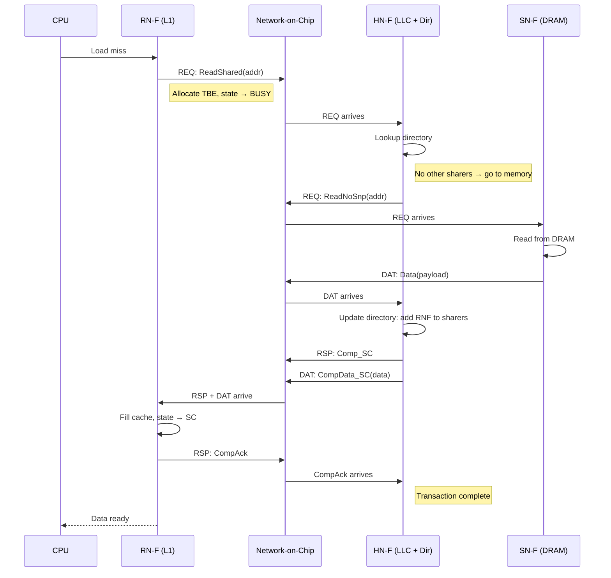

<!-- Speaker Notes:
Let's trace a complete ReadShared transaction — the most common operation in any multi-core
system. This is what happens when a CPU core does a load that misses its L1 cache.

Step 1: The CPU issues a load that misses. The RN-F allocates a Transaction Buffer Entry (TBE)
to track this in-flight operation and transitions the cache line state to a BUSY transient state.

Step 2: The RN-F sends a ReadShared request on the REQ channel through the NoC to the HN-F.
The HN-F is determined by address hashing — each cache line maps to exactly one HN-F.

Step 3: The HN-F looks up its directory for this address. In this case, no other RN-F has the
line, so the HN-F needs to fetch from memory. It sends ReadNoSnp to the SN-F.

Step 4: The SN-F reads from DRAM and returns the data on the DAT channel.

Step 5: The HN-F updates its directory to record that this RN-F now shares the line. Then it
sends two messages back: Comp_SC on the RSP channel (your request completed, you have SC state)
and CompData_SC on the DAT channel (here is the data).

Step 6: The RN-F receives both messages, fills its cache with the data in SC state, and sends
CompAck on the RSP channel to confirm receipt.

Step 7: When the HNF receives CompAck, the transaction is complete.

Key observations:
- The RSP and DAT messages travel independently on separate channels
- The HN-F is the serialization point — it ensures ordering
- The TBE at the RN-F allows the cache to handle other requests while waiting
- CompAck is the final handshake — without it, the HN-F cannot complete the transaction

In gem5, this entire flow is encoded in the CHI-cache-transitions.sm file as a series of
(state, event) → action mappings. Each arrow in this diagram corresponds to one or more
transition rules.
-->

---

<!--
========================================================================================
>>> SLIDE 34
>>> ReadShared with Dirty Forwarding (DCT)
========================================================================================
-->

## Transaction Flow: ReadShared with DCT

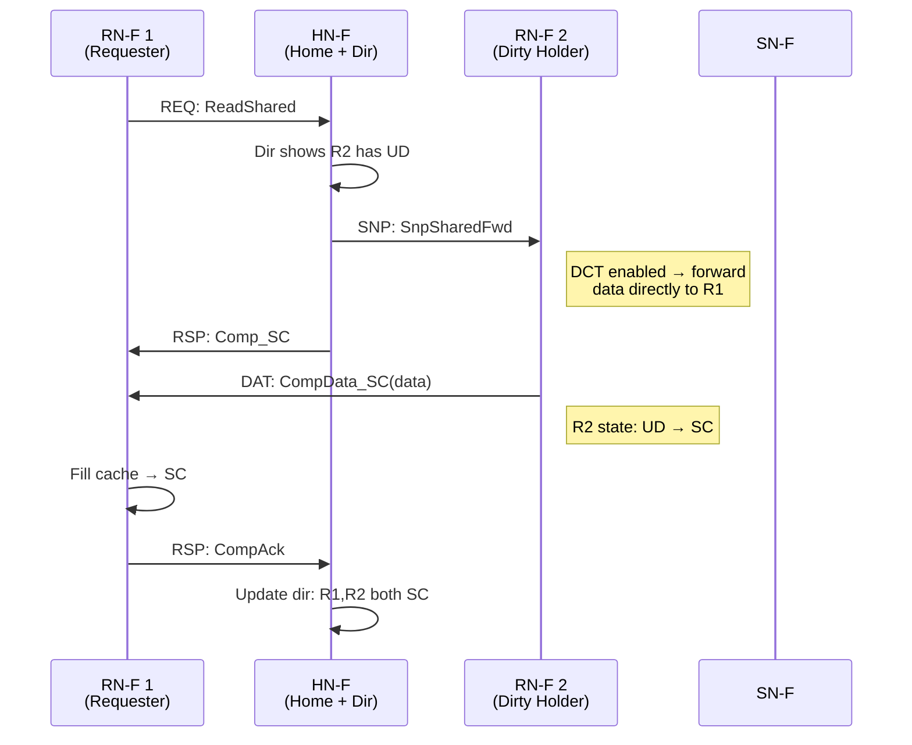

**DCT (Direct Cache Transfer)**: Data flows R2 → R1, bypassing HN-F cache. Saves one hop and HN-F bandwidth.

<!-- Speaker Notes:
Now let's see what happens when another core has the line dirty. This is where CHI's Direct
Cache Transfer (DCT) optimization shines.

The scenario: RN-F 1 sends ReadShared. The HN-F's directory shows that RN-F 2 has the line
in Unique Dirty state. The authoritative data is not in memory or the HN-F — it's in RN-F 2's
cache.

Without DCT, the flow would be: HN-F snoops R2, R2 sends data to HN-F, HN-F sends data to R1.
That's two hops for the data, and the HN-F cache bandwidth is consumed.

With DCT enabled (the `enable_DCT` flag in gem5), the HN-F sends a special snoop:
SnpSharedFwd. The "Fwd" suffix means "forward the data directly to the requester."
R2 sends the data straight to R1, bypassing the HN-F entirely.

The HN-F still sends Comp_SC to R1 on the RSP channel. But the data comes directly
from R2 on the DAT channel. R1 fills its cache in SC state.

After the transfer: R2 transitions from UD to SC (it still has the line, but it's now
shared and clean). R1 has SC. The HN-F directory records both as sharers.

The benefit is clear: one less hop for the data path, and the HN-F doesn't need to
buffer the data at all. In a mesh NoC with multiple hops between R2 and HN-F, this
can save 3-5 cycles of latency.

However, DCT requires careful ordering. The Comp_SC from HN-F and the CompData from
R2 must both arrive at R1 before the transaction completes. The TBE at R1 tracks
which messages are expected using an ExpectedMap data structure.

In gem5, DCT is controlled by the `enable_DCT` parameter on the HN-F controller.
It defaults to True in the standard configurations.
-->

---

<!--
========================================================================================
>>> SLIDE 35
>>> Write Transaction
========================================================================================
-->

## Write Transaction: WriteUnique Flow

<div class="columns">
<div>

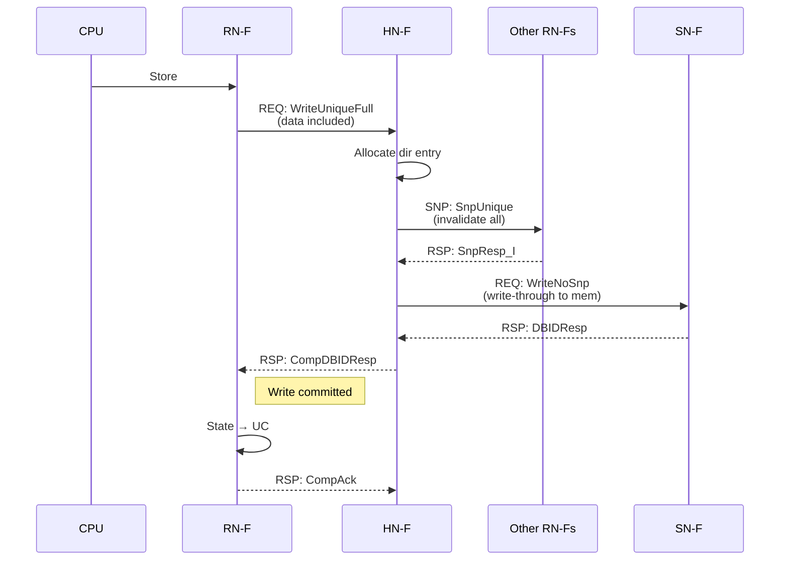

</div>
<div>

**WriteUnique combines ownership request + data**

Advantages over two-phase write:
- Single round-trip instead of ReadUnique then Write
- Data piggybacks on request — saves DAT channel
- HN-F can write-through to memory immediately

**CompDBIDResp**: Combines completion + write buffer allocation. The RN-F knows the write is committed when it receives this.

</div>
</div>

<!-- Speaker Notes:
Now let's look at writes. CHI's WriteUnique is one of its most clever design decisions.

In older protocols like MESI, a write is always two phases: first get exclusive ownership
(ReadUnique / GetM), then perform the write. This requires two round trips to the home node.

CHI collapses this into one operation: WriteUniqueFull. The RN-F sends both the request AND
the data in a single message on the REQ channel. The HN-F receives ownership transfer and
data simultaneously.

Here's the flow:
1. CPU does a store. RN-F sends WriteUniqueFull with the data included.
2. HN-F allocates a directory entry and issues SnpUnique to all current sharers.
3. Each sharer responds with SnpResp_I (I am now Invalid).
4. HN-F writes the data through to memory (WriteNoSnp to SN-F). This is optional
   depending on the write policy, but in gem5's default config, writes go to memory.
5. HN-F sends CompDBIDResp — this combines two things: Comp (your write is complete)
   and DBIDResp (here is a write buffer ID). The RN-F knows the write is committed.
6. RN-F transitions to UC (or UD if it was already dirty) and sends CompAck.

The key insight is CompDBIDResp. In CHI, every write needs a DBID (Data Buffer ID)
from the HN-F to ensure ordering. Combining the completion with the DBID grant saves
one message.

WriteUniquePtl is the partial-write variant — it includes a byte mask indicating which
bytes within the cache line are being written. The rest are don't-care or unchanged.

For the RN-F, WriteUnique means "I already know I have unique access (from a previous
CleanUnique or ReadUnique), so I'm just informing the HN-F of the write."
If the RN-F doesn't have unique access, it must first obtain it.

In gem5, the cache controller decides between WriteUnique and the two-phase approach
based on whether it already has ownership. The logic is in CHI-cache-funcs.sm.
-->

---

<!--
========================================================================================
>>> SLIDE 36
>>> Snoop Operations
========================================================================================
-->

## Snoop Operations

<div class="columns smaller">
<div>

<div class="card accent-violet">
<p class="eyebrow">Forwarding snoops</p>
<h3>DCT path: data goes to the requester</h3>
<ul>
<li><code>SnpSharedFwd</code>: holder downgrades to <code>SC</code> and forwards data</li>
<li><code>SnpUniqueFwd</code>: holder invalidates and forwards the dirty line</li>
<li><code>SnpOnceFwd</code>: one-shot forward without retaining the line</li>
<li><code>SnpNotSharedDirtyFwd</code>: forward while preserving SD-specific ownership rules</li>
</ul>
</div>

<div class="card accent-gold">
<p class="eyebrow">Non-forwarding snoops</p>
<h3>Classical home-node return path</h3>
<ul>
<li><code>SnpShared</code>: probe for a clean shared copy</li>
<li><code>SnpUnique</code>: invalidate and hand ownership back</li>
<li><code>SnpOnce</code>: send data without invalidating</li>
<li><code>SnpCleanInvalid</code>: fast clean invalidate when no data transfer is needed</li>
</ul>
</div>

</div>
<div>

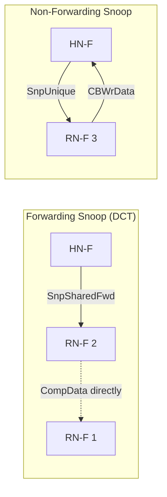

**Snoop ordering rule**: Snoops on the same address must be processed in order at the RN-F. This is guaranteed by the SNP channel ordering.

</div>
</div>

<!-- Speaker Notes:
Snoop operations are how the Home Node maintains coherence. When a new request arrives for a
line that other caches might hold, the HN-F sends snoops. Let's distinguish the two categories.

Forwarding snoops are used with DCT. The "Fwd" suffix means "forward your data directly to
the requester." The HN-F includes the requester's ID in the snoop so the holder knows where
to send data. This is the key optimization — data bypasses the HN-F entirely.

Non-forwarding snoops are the traditional model. The holder responds to the HN-F, which
then forwards to the requester. Simpler but slower.

SnpSharedFwd: "Do you have this line? If so, send a copy directly to the requester and
keep your copy in Shared Clean." Used when the HN-F wants to serve a ReadShared request
and knows a holder has clean data.

SnpUniqueFwd: "Give up your copy entirely, forward data to the requester, and go Invalid."
Used when the HN-F needs to grant exclusive ownership to someone else.

SnpUnique: "Invalidate your copy and send data back to me." Used when the HN-F needs to
collect dirty data before granting exclusive access to a third party.

SnpCleanInvalid: "If your copy is clean, just invalidate silently. If dirty, send data back."
This is an optimization for clean invalidation — no data transfer needed if the line is clean.

A critical ordering rule: snoops for the same address must be processed in order at each RN-F.
The SNP channel in CHI guarantees this ordering. If the HN-F sends SnpShared then SnpUnique
for the same address, the RN-F will process them in that order. This prevents race conditions
in the coherence protocol.

In gem5, snoop processing is handled by the CHI-cache-actions.sm file, specifically in
actions like sendSnpResponse, sendDataToReq, and various snoop-specific actions.
The snoop queues are separate from the request queues to avoid deadlock.
-->

---

<!--
========================================================================================
>>> SLIDE 37
>>> DMT - Direct Memory Transfer
========================================================================================
-->

## Direct Memory Transfer (DMT)

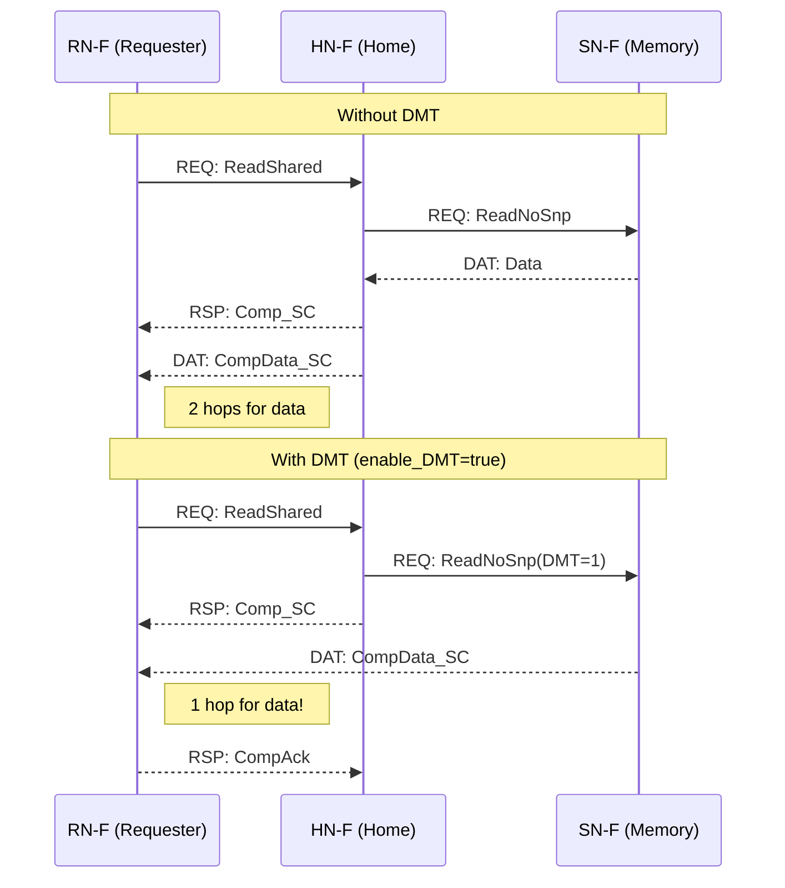

**DMT eliminates the HN-F hop for data from memory.** Data flows SN-F → RN-F directly.

<!-- Speaker Notes:
Direct Memory Transfer is the companion optimization to DCT. While DCT bypasses the HN-F
when another cache has dirty data, DMT bypasses the HN-F when the data comes from memory.

Without DMT: Memory sends data to HN-F, HN-F sends data to RN-F. Two hops.
With DMT: Memory sends data directly to RN-F. One hop.

In a mesh NoC, the HN-F might be several hops away from both the RN-F and the SN-F.
Without DMT, data travels SN-F → (N hops) → HN-F → (M hops) → RN-F. With DMT,
data travels SN-F → (K hops) → RN-F where K is typically less than N+M.

The mechanism: The HN-F sends ReadNoSnp to the SN-F with a flag indicating DMT.
The SN-F reads from DRAM and sends the data directly to the RN-F (not to the HN-F).
The HN-F sends Comp_SC to the RN-F on the RSP channel.
When the RN-F receives both Comp_SC and CompData_SC, the transaction completes.

DMT is controlled by the `enable_DMT` flag on the HN-F controller. In gem5's default
CHI configuration, it is enabled.

There's an advanced variant: `enable_DMT_early_dealloc`. This uses ReadNoSnpSep (separated
read) where the SN-F sends the data directly to the RN-F and a separate acknowledgment
to the HN-F. This allows the HN-F to deallocate its TBE before the data reaches the
RN-F, saving TBE resources. But it adds complexity because the HN-F must be prepared
to handle retry and error cases without the TBE.

In gem5, DMT is implemented in CHI-cache-actions.sm. The key action is sendReadToMemory
which checks enable_DMT and chooses between ReadNoSnp (no DMT) and ReadNoSnp with
direct data routing.

Performance impact: DMT typically saves 5-10 cycles on memory reads in a 4x4 mesh,
depending on the placement of the RN-F, HN-F, and SN-F.
-->

---

<!--
========================================================================================
>>> SLIDE 38
>>> Clusivity
========================================================================================
-->

## Clusivity — Controlling Cache Inclusion

<div class="columns">
<div>

<div class="comparison-grid smaller">
<div class="card compact accent-blue">
<p class="eyebrow">Strict inclusive</p>
<h3>Easy snoop filtering</h3>
<p>Every child line must live upstream too.</p>
<p><code>alloc_on_* = all</code>, minimal deallocation.</p>
</div>
<div class="card compact accent-teal">
<p class="eyebrow">Mostly inclusive</p>
<h3>Pragmatic default</h3>
<p>Keep shared lines for filtering, but do not over-commit to write-private data.</p>
</div>
<div class="card compact accent-gold">
<p class="eyebrow">Exclusive</p>
<h3>Capacity first</h3>
<p>L1 and L2 avoid duplicate copies, at the cost of more back-invalidations and tracking.</p>
</div>
<div class="card compact accent-violet">
<p class="eyebrow">Non-inclusive</p>
<h3>Policy driven</h3>
<p>No hard guarantee either way. Allocate and drop based on workload goals.</p>
</div>
</div>

</div>
<div>

<div class="card accent-teal smaller">
<p class="eyebrow">gem5 knobs</p>
<h3>Allocation and deallocation are explicit</h3>
<p><code>alloc_on_readshared</code>, <code>alloc_on_readunique</code>, <code>alloc_on_readonce</code>, and <code>alloc_on_writeback</code> decide when an upstream level keeps a line.</p>
<p><code>dealloc_on_unique</code> and <code>dealloc_on_shared</code> decide when that level lets go after a child gains ownership.</p>
</div>

<div class="takeaway smaller">
<p><strong>Trade-off:</strong> inclusive hierarchies simplify snoop filtering, while exclusive hierarchies reclaim capacity and push more work into metadata and invalidation logic.</p>
</div>

</div>
</div>

<!-- Speaker Notes:
Clusivity — whether a cache level is inclusive, exclusive, or non-inclusive with respect
to the level below it — is one of the most important configuration decisions in a cache
hierarchy.

Strict inclusive means every line in L1 must also be in L2. When L2 evicts a line, it
must invalidate the corresponding L1 entry (back-invalidaton). The advantage: when a
snoop arrives at L2, if L2 doesn't have the line, neither does L1, so no need to snoop
L1. This is a snoop filter.

Exclusive means L1 and L2 never hold the same line simultaneously. When a line is
allocated in L1, it is removed from L2. The advantage: total effective cache capacity
is L1_size + L2_size, not just L2_size. The disadvantage: every snoop must check L1
because L2 doesn't track L1's contents.

Non-inclusive means no guarantees. The cache can choose to allocate or not based on
dynamic criteria.

In gem5's CHI implementation, clusivity is controlled by a set of boolean parameters:
- alloc_on_readshared, alloc_on_readunique, etc.: These control when the cache allocates
  a directory entry for a transaction. If alloc_on_readshared is true, the cache will
  keep a copy of the line when a ReadShared is processed.
- dealloc_on_unique, dealloc_on_shared: These control when the cache evicts a line
  because its child cache (downstream) has obtained the line. If dealloc_on_unique is
  true and the L1 gets Unique access, the L2 drops its copy.

The default gem5 CHI HN-F configuration uses "mostly inclusive for shared, exclusive for
unique": alloc_on_readshared=True, alloc_on_readunique=True, dealloc_on_unique=True.
This means the LLC keeps copies of shared data (for snoop filtering) but drops copies
when a core gets exclusive ownership (to save capacity).

This is a pragmatic compromise. Shared reads are the common case, so the snoop filter
works most of the time. Writes are less common, and giving the LLC capacity back when
a core is actively writing to a line improves performance.

The clusivity parameters interact with the upstream tracking states we discussed earlier.
When dealloc_on_unique is true, the HN-F transitions to RU or RSC states instead of
keeping the line in a local state.
-->
