<!-- ================================================================== -->
<!-- SLIDE 1: Title (new deck) -->
<!-- ================================================================== -->

<!-- _class: hero -->
<!-- _paginate: false -->

# CHI in gem5
## From Protocol to Ruby and Garnet

**Memory Architecture and NoC Modeling in gem5**


---

<!-- ================================================================== -->
<!-- SLIDE 2: Scoping CHI — what it owns, what it leaves open -->
<!-- ================================================================== -->

## Scoping CHI: what it owns, what it leaves open

<div class="columns">
<div>

### CHI does more than coherence

- **Layered by design** — what a message *means* is separate from how it is *delivered*
- Shares the fabric with **uncached I/O, atomics, and cache-maintenance** traffic
- **Atomics can execute in the fabric**, not only in the core
- **Ordering is an explicit contract** — each transaction declares how strictly it must complete
- **And more** — virtual-memory sync, producer hints, persistence, security tagging, in-band RAS signals

</div>
<div>

### CHI leaves these to you

- **Home-node internals** — CHI names the home node but not its shape:
  - directory size → system-wide back-invalidations
  - tracker depth → retry pressure
  - address hashing → mesh hotspots
- **The interconnect network (ICN) is implementation-defined** — topology, routing, buffers are yours; CHI mandates only per-channel non-blocking at each link
- **Not one CHI** — features like DMT/DCT and atomics vary by issue (B/D/E/C2C) and by what the implementer turns on

</div>
</div>

<div class="takeaway">
Left side is <em>why</em> the CHI spec is so large. Right side is <em>why</em> two CHI systems that send the same messages can perform very differently.
</div>

<!-- Speaker Notes:
Before we look at any messages or state machines, set the scope. CHI is a
standard, and like most standards it has edges — places where it reaches
further than you might expect, and places where it stops short. Both edges
matter, because both edges show up in gem5 as Ruby or Garnet configuration.

Four points on the left.

First, CHI is a layered protocol. The spec separates "what a message means"
from "how that message gets delivered over the wire." That sounds academic
until you debug gem5. Ruby owns the meaning — requests, snoops, responses,
data. Garnet owns the delivery — flits, routers, link-level credits. If you
confuse the layers, the spec diagrams stop matching your trace.

Second, CHI's channels carry more than coherent loads and stores. Uncached
I/O, atomic operations, TLB shoot-downs, and cache-maintenance hints all ride
the same four channels. CHI is the envelope for everything that crosses the
coherent fabric, not just cache-line traffic.

Third, atomic read-modify-writes can execute inside the fabric — at the home
node or at the memory node — not only in the core. That changes how you model
atomic performance.

Fourth, ordering is an explicit contract. On a shared snoop bus,
transactions serialized by accident — whoever grabbed the bus first won.
CHI's separated channels reorder freely, so each transaction carries an
explicit field saying how strict its ordering must be. That gives the
core's memory-consistency model concrete hooks to bind to, instead of
relying on the bus to serialize implicitly.

Fifth, the list does not stop there. The spec also reaches into distributed
virtual-memory sync, producer-to-consumer hints, persistence, security
tagging, and in-band RAS. The deck skips most of these — just know the
surface area is larger than any one slide can show.

Now the right side — where the spec deliberately stops.

First: home-node internals. CHI names the home node as the entity where
coherence decisions happen, but does not pick its shape. Three dials
dominate. The directory tracks who holds each line; undersize it, and
every entry the directory evicts forces a back-invalidation across every
cache that still holds that line. Trackers hold in-flight transactions at
the home node; when the table fills, CHI's retry mechanism kicks in and
the home node tells the requester to come back later. Address hashing
decides which home node owns which line; a bad hash concentrates traffic
on one corner of the mesh, a good hash distributes it. All three are out
of spec, and any one can dominate the performance curve.

Second: the interconnect itself. Topology, routing, VC allocation, buffer
sizes, and credit counts are all implementation-defined — none of it is in
the AMBA document. The one rule CHI mandates is per-channel non-blocking
at each link: flits on one channel cannot block flits on another between
transmitter and receiver. That guarantee does not extend across multi-hop
paths for free — collapse channels at a switch or share a credit pool
badly and it silently dies. A naive Garnet configuration can still wedge.

Third: not one CHI. The spec has issues — B, D, E, and CHI-C2C — and
each changes what is on the menu. Direct transfers DMT and DCT, atomic
coverage, MPAM tags, persistence hints — all vary by issue, and for the
optional features, by what the implementer turned on. Two CHI systems may
both be "same spec" and still have different feature sets.

The rest of the deck lives inside this frame. Ruby implements the left side;
Garnet wraps the right side; the single RISC-V CHI system that ships with
gem5 is where we will see both in action.
-->

---

<!-- ================================================================== -->
<!-- SLIDE 3: CHI Node Types — a typical system -->
<!-- ================================================================== -->

## CHI Node Types — a typical system

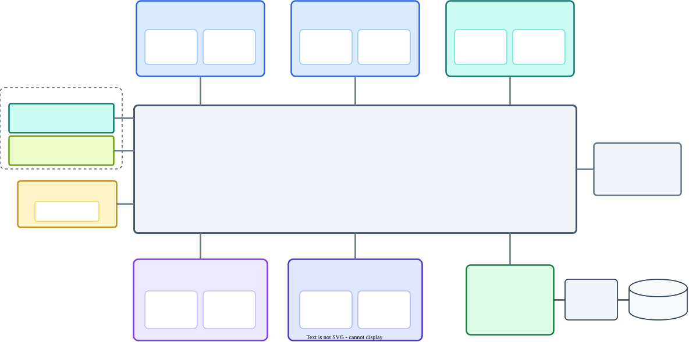

<!-- Speaker Notes:
Time budget: 3 minutes.

This is a typical CHI system, with every node type the spec defines.

In the middle, ICN — the Interconnect Network. CHI is carried over
it but does not specify it. The spec's own wording is "IMPLEMENTATION
SPECIFIC": topology, fabric, routing, buffering are all yours. Every
other node plugs into ICN through the four CHI channels we'll see on
the next slide.

Top-left, two RN-Fs: Fully Coherent Request Nodes. CPU cores with
hardware-coherent caches — drawn as the internal "CPU" and "L1 / L2"
boxes. An RN-F generates every transaction type and responds to every
snoop type.

Top-right, RN-I with a GPU inside: IO Coherent Request Node. Section
B13.6.1.3 of the spec literally names this use case, quote: "a GPU or
IO bridge". An RN-I holds no hardware-coherent cache and receives
neither snoops nor DVM — the driver manages any on-GPU cache and TLB
explicitly.

Left column, top: a second RN-I with a PCIe bridge inside — same node
type, different device. Any non-caching I/O requester fits here.

Left column, bottom, RN-D: IO Coherent Request Node with DVM support.
The "D" is DVM, Distributed Virtual Memory. Put an accelerator here
when its SMMU walks the CPU's page tables directly, so CPU-side TLB
invalidations must reach it in hardware. RN-D does receive snoops —
but the spec restricts them: "use of the SNP channel is limited to
DVM transactions". DVM snoops only, never cache-coherence snoops. So
a driver-managed GPU stays RN-I; a hardware-SVM GPU moves to RN-D.

Right side, MN: Miscellaneous Node. Where DVM traffic terminates and
fans out to every RN-F and every RN-D in the system.

Bottom row, two HN-Fs: Fully Coherent Home Nodes. The Point of
Coherence. Every cache line maps to exactly one home, usually by
address hashing. Two optional internal pieces: SF, a snoop filter or
directory, which the spec explicitly lists as optional; and LLC
slice, an implementation-specific last-level cache. The home
serializes conflicting requests, sends snoops, grants ownership, and
forwards data.

Next to the HN-Fs, SN-F: Subordinate Node. Note the spec uses
"Subordinate", not "Slave". The memory-side node. It receives
ReadNoSnp and WriteNoSnp from the homes and returns data. CHI stops
at SN-F — attached on the side you see MC, the memory controller,
and behind it DRAM. Whatever MC speaks to DRAM is outside the CHI
spec.

Color coding we'll reuse throughout the deck: RN-F blue, RN-I teal,
RN-D gold, HN-F violet, MN slate, SN-F green.
-->

---

<!-- ================================================================== -->
<!-- SLIDE 4: Port, Link, and Channel -->
<!-- ================================================================== -->

## Port, Link, and Channel

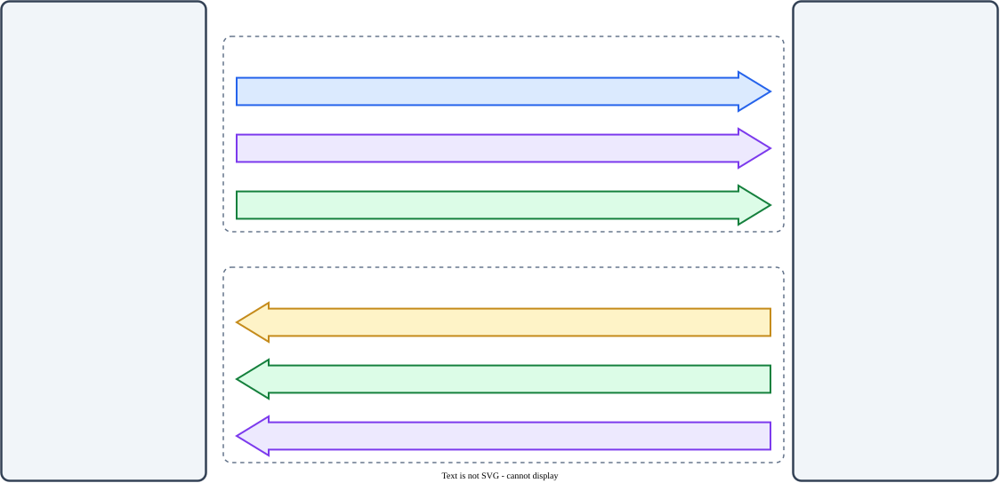

<!-- Speaker Notes:
Time budget: 3 minutes.

Before we look at any packet or router, three terms need to be
crisp: channel, link, and port. They form a hierarchy, and this
diagram shows how they fit together at the interface between a
Request Node and the Interconnect.

Start from the bottom — a channel. Section B13.4 of the spec. A
channel is a defined path over which flits of one traffic class
move. CHI defines exactly four: REQ, RSP, SNP, DAT. These are not
labels — they are different kinds of traffic with different
dependency, progress, and buffering rules. REQ carries requests that
start or advance a transaction. RSP carries non-data responses like
completion or acceptance. SNP carries snoop requests sent to caches.
DAT carries the data payload — cache-line fills, write data, snoop
data. DAT usually consumes the most bandwidth.

One level up — a link, sections B13.1 and B13.2. A link is a
unidirectional connection from one transmitter to one receiver. Each
link bundles some set of channels. Two-way communication between two
nodes takes a pair of links. A link has finite bandwidth, nonzero
latency, and link-layer credits that apply hop by hop. Internally a
link may cross several routers and wires, but at the CHI
architectural interface it still exposes exactly this channel
structure.

Top of the hierarchy — a port, section B13.6. A port is the set of
all links at one node's interface. The whole interface bundle.

Now read the diagram. The two outer boxes, Port (RN) on the left and
Port (ICN) on the right, are the ports. Between them, two link
boxes. The top one is the outbound link: RN transmits, ICN receives.
It carries three channels — REQ for requests, DAT for write data,
and RSP for responses like CompAck. Pin names on the RN side start
with TX because the RN transmits; on the ICN side they start with RX
because the ICN receives.

The bottom link is the inbound link: ICN transmits, RN receives.
Different channel set — SNP for snoops, RSP for completions, DAT for
read data. Pins are reversed — RX on the RN side, TX on the ICN
side.

Which channels appear on a link depends on the node types at either
end. An RN-to-SN inbound link, for example, has no SNP channel —
SN-Fs do not generate snoops.

One last caveat. Inside the ICN, what the spec calls a "link" may
be realized by many routers and wires with a different
microarchitecture — wider channels, virtual channels, whatever the
implementer chose. The architectural link abstraction is what the
spec guarantees at the port interface, not what happens inside.
-->

---

<!-- ================================================================== -->
<!-- SLIDE 5: Transaction, Message, Packet, and Flit -->
<!-- ================================================================== -->

## Transaction, Message, Packet, and Flit

<div class="columns">
<div>

### Hierarchy — `ReadClean`, 64 B line, 128-bit `Data_Width`, `ExpCompAck=1`

```text
Transaction (ReadClean, line clean-shared at home)
├── REQ message
│   └── ReadClean      → flit   (REQ chan, outbound)
├── DAT message
│   ├── CompData_SC    → flit   (DAT chan, inbound, DataID=0)
│   ├── CompData_SC    → flit   (DataID=1)
│   ├── CompData_SC    → flit   (DataID=2)
│   └── CompData_SC    → flit   (DataID=3)
└── RSP message
    └── CompAck        → flit   (RSP chan, outbound)
```

</div>
<div>

### Ratios at each boundary

| Boundary                | Layer(s)            | Ratio |
|-------------------------|---------------------|-------|
| Transaction → Message   | Protocol            | 1 : N |
| Message → Packet        | Protocol → Network  | 1 : N |
| Packet → Flit           | Network → Link      | 1 : 1 |

- **Transaction** (B1.3) — one coherence op; `TxnID` at RN, `DBID` at home.
- **Message** — one protocol step on one channel.
- **Packet** (B1.1, B13.3) — routing granule with independent metadata.
- **Flit** (B13.3) — link-layer unit; architecturally 1:1 with a protocol packet.

</div>
</div>

<!-- Speaker Notes:
Time budget: 3 minutes.

When you read a CHI trace, you'll see four terms nested inside each
other: transaction, message, packet, and flit.

At the top, a transaction. Section B1.3. One complete coherence
operation — everything that happens between a Requester, its
Completer, and any snooped nodes to fulfil a single request. A
transaction is identified by TxnID at the Requester and DBID at the
Completer. The example on the left is a ReadClean — REQ opcode 0x02
per table B13.12 — fetching one 64-byte line. The request asserts
ExpCompAck=1, so the home will expect a CompAck at the end. We're
showing the simple non-snooping path where the home serves from its
LLC or memory; add snoops on top if other RNs hold the line.

One level down: a message. One protocol communication step, carried
on one channel — a request, a snoop, a response, or a data transfer.
A transaction generates multiple messages. Our ReadClean has three: a
ReadClean REQ on the outbound link, a CompData DAT on the inbound
link, and a CompAck RSP on the outbound link.

Next: a packet. Sections B1.1 and B13.3. The granule of transfer
across the interconnect — carries the metadata needed to route
independently. A message can comprise one packet or many. The REQ
and RSP messages here are single-packet. The DAT message splits into
four CompData packets because the link's Data_Width is 128 bits and
a 64-byte line needs four transfers — each packet carries one
DataID from 0 to 3. Each of the four CompData packets encodes
Resp = CompData_SC to tell the Requester the line is arriving in
Shared-Clean state. At 256-bit Data_Width it would be two packets;
at 512-bit, one.

Finally a flit — the Link-layer transfer unit. Every protocol packet
maps to exactly one protocol flit at the architectural interface.
That 1:1 is part of the CHI abstraction — unlike generic NoC
protocols, CHI does not do multi-flit wormhole splitting. The spec
also defines link flits, non-protocol flits used for credit return
during link deactivation, but those do not carry protocol packets.

Closing the loop: the CompAck on the RSP channel echoes the DBID
that the home supplied in CompData, and its TgtID matches the home's
HomeNID. That is how the home knows which outstanding transaction
just completed.

The right-side table summarises the three boundaries. The two "N"
ratios are where variability enters: a transaction can spawn many
messages, and a message can split into many packets. The single
"1:1" ratio is an architectural guarantee — at the CHI port
interface, the spec does not let implementations split a packet into
multiple flits.
-->

---

<!-- ================================================================== -->
<!-- SLIDE 6: Flit Fields -->
<!-- ================================================================== -->

## REQ flit fields

<div class="columns" style="font-size: 14px; line-height: 1.25;">
<div>

| Name         | W  | Description                          |
|--------------|----|--------------------------------------|
| QoS          | 4  | Priority for fabric arbitration       |
| TgtID        | 7  | Target node (NODE_ID_W: 7..16)       |
| SrcID        | 7  | Source node (NODE_ID_W)              |
| TxnID        | 12 | Transaction identifier                |
| Opcode       | 7  | REQ opcode (Table B13.12)             |
| Size         | 3  | Bytes = 2^Size (1..64)                |
| Addr         | 44 | Physical addr (REQ_ADDR_W: 44..52)   |
| PAS          | 3  | Physical Address Space (security)     |
| LikelyShared | 1  | Cache-placement hint                  |

</div>
<div>

| Name         | W  | Description                          |
|--------------|----|--------------------------------------|
| AllowRetry   | 1  | Target may issue Retry                |
| Order        | 2  | Ordering contract                     |
| PCrdType     | 4  | Retry credit type                     |
| MemAttr      | 4  | Cacheability (AXI AxCACHE-like)      |
| SnpAttr      | 1  | Snoop hint                            |
| LPID         | 5  | Logical processor — *optional*        |
| Excl         | 1  | Exclusive monitor — *optional*        |
| ExpCompAck   | 1  | CompAck mandated                      |
| TraceTag     | 1  | Trace/debug tag                       |

</div>
</div>

<div class="takeaway">
Field <em>order</em> in Table B13.6 is architectural — implementations may not reshuffle bit positions. What the implementer controls is field <em>widths</em> (<code>NODE_ID_W</code>, <code>REQ_ADDR_W</code>, <code>DATA_W</code>) and which optional features (stashing, DMT, tagging, MPAM, RME, exclusives) contribute extra fields.
</div>

<!-- Speaker Notes:
Time budget: 3 minutes.

A flit is the packetised bundle of control fields that carries one
protocol message across a CHI link. Spec Table B13.6 pins down
exactly which fields appear in a REQ flit, their order, and their
widths. The slide lists them in bit order, QoS first at bit 0,
ExpCompAck last. Two design-time parameters set the variable widths:
NodeID_Width, spec B16.1.12, defaults to 7 and can go up to 16;
Req_Addr_Width, B16.1.11, defaults to 44 and can go up to 52.

Walk the table top-down.

QoS, 4 bits at bit 0, is the priority that fabric arbitration
consumes.

TgtID and SrcID, 7 bits each by default, name the destination and
source nodes. QoS, TgtID, and SrcID together are what the
interconnect needs to route and schedule the flit without
understanding the protocol.

TxnID, 12 bits, is unique at the Requester. Every downstream message
in this transaction is keyed back to this TxnID.

Opcode, 7 bits. The What: ReadClean, ReadUnique, WriteUnique,
WriteBackFull, CleanInvalid, and dozens more. Spec Table B13.12 is
the opcode dictionary.

Size, 3 bits. Bytes moved encoded as a power of two: bytes equals
2 to the Size, so 1, 2, 4, 8, 16, 32, or 64. A 64-byte cache-line
read encodes 0b110.

Addr, 44 bits by default, is the physical address.

Then the attribute group. PAS, 3 bits, is the Physical Address Space
— Secure / Non-secure / Realm / Root per RME. LikelyShared, 1 bit,
is a hint telling the home this line is probably shared, biasing
allocation and directory policy. AllowRetry, 1 bit, tells the target
whether it may issue a RetryAck; when AllowRetry = 0, the Requester
must already own a PCrdType it can consume. Order, 2 bits, asks the
home for an ordering contract, typically for device accesses.
PCrdType, 4 bits, pairs with AllowRetry on the retry mechanism.
MemAttr, 4 bits, selects cacheable/non-cacheable, bufferable,
early-write-acknowledge — same concept as AXI's AxCACHE. SnpAttr,
1 bit, is the snoop hint.

Three control bits at the end. LPID, 5 bits, names a logical
processor within a multi-threaded node — paired with SrcID and Excl
it uniquely identifies an exclusive-monitor reservation; optional.
Excl marks the request as part of an exclusive-monitor pair — the
CHI equivalent of LR/SC; also optional. ExpCompAck — already relied
on for ReadClean — tells the home the Requester will close the
transaction with a CompAck; always present.

Three structural points to close. One, the field order in Table
B13.6 is architectural — implementations may not reshuffle bit
positions. Two, what the implementer controls is widths — only
NodeID_Width, Req_Addr_Width, and for DAT flits Data_Width are
parameterised. Three, which optional fields appear depends on
enabled features — stashing, DMT, tagging, trace, MPAM, RME,
exclusives — each contributes extra fields the spec lists in the
same table but that only materialise when the feature is on.
-->

---

<!-- ================================================================== -->
<!-- SLIDE 7: DAT Flit Fields -->
<!-- ================================================================== -->

## DAT flit fields

<div class="columns" style="font-size: 14px; line-height: 1.25;">
<div>

| Name       | W   | Description                               |
|------------|-----|-------------------------------------------|
| QoS        | 4   | Priority for fabric arbitration            |
| TgtID      | 7   | Target node (NODE_ID_W: 7..16)            |
| SrcID      | 7   | Source node (NODE_ID_W)                   |
| TxnID      | 12  | Transaction identifier                     |
| HomeNID    | 7   | Home node — target for CompAck            |
| Opcode     | 4   | DAT opcode (CompData, WriteData, …)        |
| RespErr    | 2   | Error status (OK / ExOK / DERR / NDERR)   |
| Resp       | 3   | Cache state (I / SC / UC / UD / SD / PD)  |

</div>
<div>

| Name       | W   | Description                               |
|------------|-----|-------------------------------------------|
| DBID       | 12  | Data Buffer ID — echoed by CompAck        |
| DataSource | 8   | Hint: which node supplied the data        |
| FwdState   | 3   | State forwarded — snoop-fwd *only*        |
| CCID       | 2   | Critical Chunk Identifier                  |
| DataID     | 2   | Packet index (0..3 for 128-bit DATA_W)    |
| CBusy      | 3   | Completer busy hint                        |
| TraceTag   | 1   | Trace/debug tag                            |
| BE         | 16  | Byte enables (DATA_W/8)                   |
| Data       | 128 | Payload (DATA_W: 128 / 256 / 512)         |

</div>
</div>

<div class="takeaway">
DAT flit is much wider than REQ because it carries the payload. <code>DATA_W</code> is the main design-time knob (128/256/512). One DAT message fills <code>line_size / (DATA_W/8)</code> flits, each tagged with <code>DataID</code> — that's how a 64 B line becomes 4 DAT packets at 128-bit <code>DATA_W</code>.
</div>

<!-- Speaker Notes:
Time budget: 3 minutes.

This is the DAT flit — same story as REQ, but wider because it
carries the data payload. Spec Table B13.9 defines the format.
DAT_W is the key design-time parameter: 128, 256, or 512 bits. At
128-bit default the full flit is roughly 240 bits of control +
16 bits of byte-enable + 128 bits of data.

Left column, the routing and response core.

QoS, TgtID, SrcID and TxnID mean the same thing they did in REQ:
priority, destination, source, transaction identifier. The
interesting new field is HomeNID — it names the Home node the
Requester must target its final CompAck back to. For CompData
arriving at the Requester, HomeNID is how the Requester knows where
to close the transaction.

Opcode is only 4 bits on DAT, not 7 — the DAT channel has far fewer
opcode values: CompData, DataSepResp, NonCopyBackWriteData,
CopyBackWriteData, SnpRespData, and a few more. Table B13.16 is the
dictionary.

RespErr, 2 bits, reports transport-level errors: OK, Exclusive OK,
DERR for data error, NDERR for non-data error. Separate from Resp
by design — one says "did the transfer succeed", the other says
"what coherence state is the line in".

Resp, 3 bits, carries the cache state the Requester should install:
Invalid, Shared-Clean, Unique-Clean, Unique-Dirty, Shared-Dirty,
Partial-Dirty. For the ReadClean example two slides back, Resp =
SC.

Right column, the data-path metadata.

DBID, 12 bits, is the home's data-buffer identifier. It pairs with
HomeNID: the Requester echoes DBID on CompAck to close the
transaction at the home.

DataSource, 8 bits, is a hint telling the Requester which node
actually supplied the data — useful for NoC analytics and for
DCT/DMT paths.

FwdState is only populated on snoop-forward responses —
SnpRespDataFwded tells the Home what state the snoopee has
forwarded directly to the Requester.

CCID, 2 bits, is the Critical Chunk Identifier — which 16-byte
chunk of the line the Requester's core is actually waiting on. The
home can send that chunk first to unblock the core.

DataID, 2 bits, numbers the packets within one DAT message. At
128-bit DATA_W a 64-byte line becomes four DAT packets with
DataID = 0, 1, 2, 3. That is the same ReadClean we walked earlier.

CBusy, 3 bits, is a busy hint from the Completer — the Requester
can throttle or route around a hot node.

BE, 16 bits at default, is the byte-enable mask — one bit per byte
of the data payload. Crucial for partial writes.

And Data — the payload itself, DATA_W bits wide.

Three points to close. One, the field order is architectural just
like REQ. Two, DATA_W is the main parameter; at 256 bits the Data
field doubles and BE goes from 16 to 32. Three, RAS options —
Poison and DataCheck — and stashing fields (DataPull, Tag) add more
bits when enabled.
-->

---

<!-- ================================================================== -->
<!-- SLIDE 8: RSP flit fields -->
<!-- ================================================================== -->

## RSP flit fields

<div class="columns" style="font-size: 14px; line-height: 1.25;">
<div>

| Name    | W  | Description                                   |
|---------|----|-----------------------------------------------|
| QoS     | 4  | Priority for fabric arbitration                |
| TgtID   | 7  | Target node (NODE_ID_W: 7..16)                |
| SrcID   | 7  | Source node (NODE_ID_W)                       |
| TxnID   | 12 | Transaction identifier                         |
| Opcode  | 5  | RSP opcode (CompAck, RetryAck, PCrdGrant, …) |
| Resp    | 3  | Cache state (I / SC / UC / UD / SD / PD)      |
| RespErr | 2  | Error status (OK / ExOK / DERR / NDERR)       |

</div>
<div>

| Name        | W  | Description                                 |
|-------------|----|---------------------------------------------|
| DBID        | 12 | Data Buffer ID — paired with Data path      |
| PCrdType    | 4  | Credit type — RetryAck / PCrdGrant flow     |
| CBusy       | 3  | Completer busy hint                          |
| FwdState    | 3  | State forwarded — snoop-fwd *only*          |
| TraceTag    | 1  | Trace/debug tag                              |
| CacheLineID | 6  | Bundle line index — *optional*              |
| TagOp       | 2  | Memory-tagging op — *optional*              |

</div>
</div>

<div class="takeaway">
RSP carries no payload — it is all control. The same response channel services completions (<code>Comp</code>, <code>CompAck</code>), retry handshakes (<code>RetryAck</code> + <code>PCrdGrant</code>), and data-less snoop responses (<code>SnpResp</code>). Opcode (5 b) is the discriminator; <code>DBID</code> and <code>PCrdType</code> switch roles depending on which flow this flit belongs to.
</div>

<!-- Speaker Notes:
Time budget: 3 minutes.

RSP is the response channel. Unlike DAT, it carries no payload —
the whole point is control flow. Spec Table B13.7 defines the
format. At default NodeID_Width = 7 the always-present fields add
up to about 56 bits, compared to 240+ for DAT.

Left column — routing, identity, and the response trio.

QoS, TgtID, SrcID, TxnID are the same four we've seen on REQ and
DAT. Priority, destination, source, transaction identifier.

Opcode is 5 bits on RSP — slightly wider than DAT's 4 bits because
the RSP channel serves several distinct flows. The opcode dictionary
in spec Table B13.14 includes: Comp for generic completion, CompAck
for a Requester's acknowledgement to the home, CompDBIDResp which
combines completion with DBID assignment, RetryAck where a Completer
tells the Requester to retry later, PCrdGrant which grants a
protocol credit for that retry, ReadReceipt for early acknowledgement
of a ReadNoSnp, SnpResp for a data-less snoop response, and
SnpRespFwded for a forwarded snoop response.

Resp, 3 bits, carries the cache state — same encoding as DAT.
Present on snoop responses too: tells the home what state the
snoopee ended up in after servicing the snoop.

RespErr, 2 bits, reports transport errors — OK, Exclusive OK,
Data Error, Non-Data Error.

Right column — data-path identifiers and flow control.

DBID, 12 bits, is the Data Buffer ID. On the home's DBIDResp or
CompDBIDResp it tells the Requester which DBID to echo on its
subsequent WriteData or CompAck. On a Requester's CompAck it carries
that echoed DBID back.

PCrdType, 4 bits, is the star of the retry flow. When a Completer
sends RetryAck because it cannot accept the request right now, it
names a PCrdType on the RSP. Later it sends a PCrdGrant on RSP
naming the same PCrdType — the Requester then reissues the original
request with AllowRetry = 0 and that PCrdType value, and the
Completer is obliged to accept it.

CBusy, 3 bits, is a busy hint from the Completer.

FwdState, 3 bits, is used only on SnpRespFwded — tells the home
what state the snoopee forwarded directly to the Requester via the
DAT path.

Two feature-gated fields for completeness: CacheLineID, 6 bits,
names a line within a multi-request bundle when MultiReq is used.
TagOp, 2 bits, applies when memory tagging is enabled.

One closing point. The RSP channel is where the retry handshake and
CompAck closure live — two flows a seasoned designer will always
probe first when a CHI system hangs.
-->

---

<!-- ================================================================== -->
<!-- SLIDE 9: SNP flit fields -->
<!-- ================================================================== -->

## SNP flit fields

<div class="columns" style="font-size: 14px; line-height: 1.25;">
<div>

| Name    | W  | Description                                   |
|---------|----|-----------------------------------------------|
| QoS     | 4  | Priority for fabric arbitration                |
| SrcID   | 7  | Home issuing the snoop (NODE_ID_W)            |
| TxnID   | 12 | Transaction identifier                         |
| Opcode  | 5  | SNP opcode (SnpShared, SnpUnique, SnpDVMOp, …) |
| Addr    | 41 | Cache-line address — REQ_ADDR_W − 3           |
| PAS     | 3  | Physical Address Space (security)              |

</div>
<div>

| Name        | W  | Description                                 |
|-------------|----|---------------------------------------------|
| FwdNID      | 7  | DCT: forward target (*SnpXxxFwd only*)      |
| FwdTxnID    | 12 | DCT: forwarded TxnID (*SnpXxxFwd only*)     |
| DoNotGoToSD | 1  | Inhibit Shared-Dirty transition              |
| RetToSrc    | 1  | Home wants the data returned to it           |
| VMIDExt     | 8  | DVM VMID — *SnpDVMOp only*                  |
| TraceTag    | 1  | Trace tagging                                |

</div>
</div>

<div class="takeaway">
Two things make SNP different: <strong>no <code>TgtID</code></strong> — the target is the RN-F that receives the flit (the ICN handles routing); and <strong>address is 3 bits narrower</strong> — snoops are cache-line granular, no byte offset. The <code>FwdNID</code> / <code>FwdTxnID</code> pair is what enables Direct Cache Transfer: the snoopee sends data straight to the original Requester.
</div>

<!-- Speaker Notes:
Time budget: 3 minutes.

SNP is the snoop channel — messages the Home sends to RN-Fs and
DVM-capable RN-Ds to check, invalidate, or extract cached lines.
Spec Table B13.8 defines the format. Two structural differences
from the other channels make SNP distinctive.

First, there is no TgtID field. The snoop target is whichever
RN-F receives the flit. The interconnect routes it — the flit itself
does not name the destination. That saves bits on a channel that
needs to broadcast or multicast.

Second, Addr is 41 bits instead of 44. The spec uses
Req_Addr_Width minus 3 because a snoop always operates on a full
cache line — there is no byte offset to carry.

Left column, the routing and identity core.

QoS is the priority. SrcID names the Home sending the snoop — the
RN-F that responds will target its response back to this SrcID.
TxnID is the Home's transaction identifier. PAS carries the
security domain — Secure, Non-secure, Realm, Root.

Opcode is 5 bits. The snoop-opcode dictionary in spec Table B13.15
covers three families. First, the basic coherence snoops —
SnpShared, SnpClean, SnpOnce, SnpUnique, SnpCleanInvalid,
SnpMakeInvalid. Second, the Forward variants — SnpSharedFwd,
SnpCleanFwd, SnpOnceFwd, SnpUniqueFwd. These are what enable Direct
Cache Transfer, DCT: the snoopee sends data straight to the
original Requester instead of back through the home. Third,
SnpDVMOp for the DVM path — TLB invalidations and virtual-memory
synchronisation.

Right column, snoop behaviour and DCT fields.

FwdNID and FwdTxnID are the DCT pair — present only on the Forward
snoop opcodes. FwdNID names the Requester's node, FwdTxnID carries
that Requester's TxnID. The snoopee's DAT response goes directly to
FwdNID tagged with FwdTxnID.

DoNotGoToSD is a 1-bit flag that tells the snoopee not to end up in
Shared-Dirty state — used in certain protocol corners where SD is
undesirable.

RetToSrc tells the snoopee whether the Home also wants the data
returned on the Home's CompData path, independent of any DCT
forward.

VMIDExt is 8 bits of VMID extension, populated only for SnpDVMOp.

TraceTag is the usual 1-bit debug trace flag.

Everything carrying data back — CompData, SnpRespData,
SnpRespDataFwded — rides on the DAT channel you saw two slides
back. SNP by itself is always data-less.
-->

---

<!-- ================================================================== -->
<!-- SLIDE 10: TBD -->
<!-- ================================================================== -->

## TBD

<!-- Speaker Notes:
Time budget: 3 minutes.
-->

---

<!-- ================================================================== -->
<!-- SLIDE 11: TBD -->
<!-- ================================================================== -->

## TBD

<!-- Speaker Notes:
Time budget: 3 minutes.
-->

---

<!-- ================================================================== -->
<!-- SLIDE 12: TBD -->
<!-- ================================================================== -->

## TBD

<!-- Speaker Notes:
Time budget: 3 minutes.
-->

---

<!-- ================================================================== -->
<!-- SLIDE 13: TBD -->
<!-- ================================================================== -->

## TBD

<!-- Speaker Notes:
Time budget: 3 minutes.
-->

---

<!-- ================================================================== -->
<!-- SLIDE 14: TBD -->
<!-- ================================================================== -->

## TBD

<!-- Speaker Notes:
Time budget: 3 minutes.
-->

---

<!-- ================================================================== -->
<!-- SLIDE 15: TBD -->
<!-- ================================================================== -->

## TBD

<!-- Speaker Notes:
Time budget: 3 minutes.
-->

---

<!-- ================================================================== -->
<!-- SLIDE 16: TBD -->
<!-- ================================================================== -->

## TBD

<!-- Speaker Notes:
Time budget: 3 minutes.
-->

---

<!-- ================================================================== -->
<!-- SLIDE 17: TBD -->
<!-- ================================================================== -->

## TBD

<!-- Speaker Notes:
Time budget: 3 minutes.
-->

---

<!-- ================================================================== -->
<!-- SLIDE 18: TBD -->
<!-- ================================================================== -->

## TBD

<!-- Speaker Notes:
Time budget: 3 minutes.
-->

---

<!-- ================================================================== -->
<!-- SLIDE 19: TBD -->
<!-- ================================================================== -->

## TBD

<!-- Speaker Notes:
Time budget: 3 minutes.
-->

---

<!-- ================================================================== -->
<!-- SLIDE 20: TBD -->
<!-- ================================================================== -->

## TBD

<!-- Speaker Notes:
Time budget: 3 minutes.
-->

---

<!-- ================================================================== -->
<!-- SLIDE 21: TBD -->
<!-- ================================================================== -->

## TBD

<!-- Speaker Notes:
Time budget: 3 minutes.
-->

---

<!-- ================================================================== -->
<!-- SLIDE 1b: Backup divider — content below is the archived v1 deck -->
<!-- ================================================================== -->

<!-- _paginate: false -->

<style scoped>
section {
  display: flex;
  flex-direction: column;
  justify-content: center;
  align-items: center;
}
h1 {
  font-size: 96px;
  letter-spacing: -0.03em;
}
</style>

# Backup

---

<!-- ================================================================== -->
<!-- SLIDE 1c: v1 Title (archived) -->
<!-- ================================================================== -->

<!-- _class: hero -->
<!-- _paginate: false -->

# AMBA 5 CHI Protocol
## Coherent Hub Interface for scalable coherence and gem5 modeling

**Memory Architecture and NoC Modeling in gem5**

<p class="note">Third-party marks are the property of their respective owners. ARM and AMBA are trademarks of Arm Limited.</p>


<!-- Speaker Notes:
Welcome everyone. Today we are diving into the AMBA 5 CHI protocol — the Coherent Hub Interface.
This is Arm's latest interconnect coherence protocol, designed for high-performance, scalable
multi-core systems. We will cover the protocol specification, its implementation in the gem5
simulator, and show you how to build and configure CHI-based systems.

CHI is the backbone of modern Arm-based server and mobile SoCs. Understanding it is essential
for anyone working in cache coherence, NoC design, or system-level simulation. This presentation
is based on the AMBA 5 CHI Architecture Specification Issue D, and the gem5 implementation
comprising over 11,000 lines of SLICC protocol description plus C++ infrastructure.

We will proceed from motivation through protocol mechanics to hands-on gem5 modeling.
-->

---

<!-- ================================================================== -->
<!-- SLIDE 2: Why CHI? -->
<!-- ================================================================== -->

## Why CHI? The Scalability Wall

<div class="columns">
<div>

**The Problem**
- Traditional bus-based coherence does not scale past 4–8 cores
- MOESI snooping on a shared wire $\Rightarrow$ bandwidth wall
- Multi-socket, mesh NoC systems need a *different* protocol

**CHI's Answer**
- Point-to-point packetized channels (not broadcast wires)
- Directory-based coherence at the Home Node
- Separated request, snoop, response, and data lanes
- Direct transfers bypass intermediate hops (DMT/DCT)

</div>
<div>

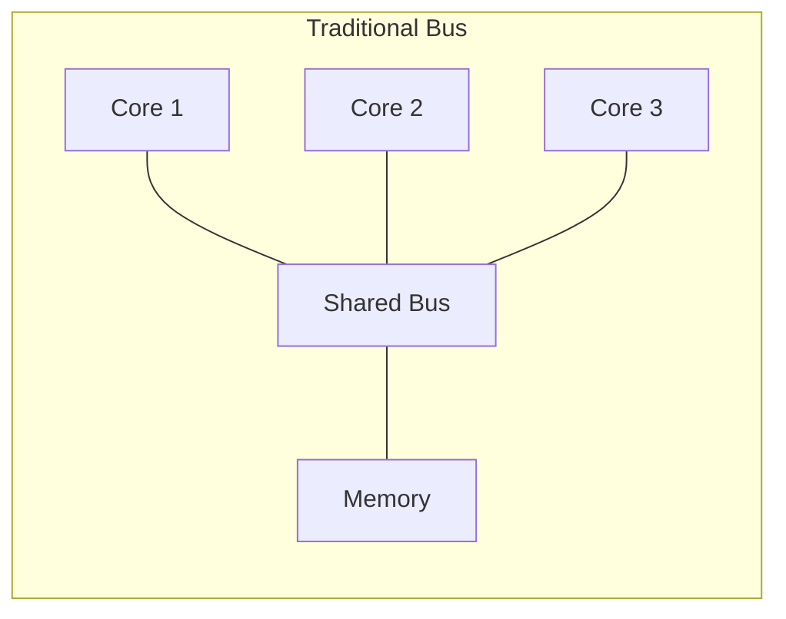

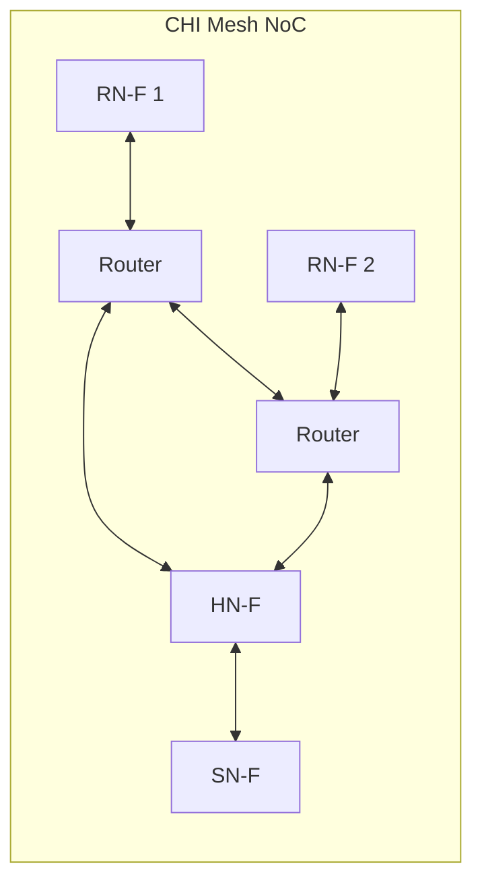

</div>
</div>

<!-- Speaker Notes:
Let's start with why CHI exists. If you have designed or studied multi-core systems with 2 or 4 cores,
you may have used a shared bus where every coherence transaction is broadcast to all participants.
This works at small scale — the bus is simple, snooping is straightforward.

But at 16, 64, or 128 cores? That shared bus becomes your bottleneck. Every transaction touches every
agent, bandwidth is consumed by coherence traffic that most agents do not care about, and latency
explodes because the bus is a single serialization point.

CHI solves this with three key ideas:

First, packetized channels. Instead of broadcasting on a wire, you send structured packets over
a network-on-chip. The four channels — REQ, SNP, RSP, DAT — can flow independently, allowing
out-of-order completion and better link utilization.

Second, directory-based coherence. A Home Node (HN-F) maintains a directory of who has each cache
line. Snoops are sent only to relevant nodes, not to everyone. This is the fundamental shift from
snooping to directory protocols.

Third, direct transfers. The Data Direct Transfer (DCT) lets a dirty cache line go straight from
one core's cache to another, bypassing the home node's cache. Direct Memory Transfer (DMT) lets
memory data go straight to the requester. These optimizations cut latency and bandwidth
dramatically.

As you can see in the diagrams, the left shows a traditional shared bus — all cores serialize
through one wire. The right shows a CHI mesh where cores talk to routers, routers talk to the
home node, and the home node talks to memory. Every link is independent and pipelined.
-->

---

<!-- ================================================================== -->
<!-- SLIDE 3: CHI in the AMBA Family -->
<!-- ================================================================== -->

## CHI in the AMBA Family

<div class="comparison-grid smaller">
<div class="card compact accent-blue">
<p class="eyebrow">AXI</p>
<h3>Point-to-point baseline</h3>
<p>No coherence, minimal semantics, and one master-slave link at a time.</p>
<span class="pill neutral">Single link scale</span>
</div>
<div class="card compact accent-gold">
<p class="eyebrow">ACE</p>
<h3>Shared-bus coherence</h3>
<p>Snoop-based and easy to reason about, but every transaction leans on one shared fabric.</p>
<span class="pill neutral">2-8 cores</span>
</div>
<div class="card compact accent-teal">
<p class="eyebrow">ACE-Lite</p>
<h3>I/O coherency edge case</h3>
<p>Useful when devices participate in coherence without becoming full cache peers.</p>
<span class="pill neutral">Peripheral focused</span>
</div>
<div class="card compact accent-violet">
<p class="eyebrow">CHI</p>
<h3>NoC-native coherence</h3>
<p>Packetized channels, targeted snoops, and credit flow control for large meshes.</p>
<span class="pill req">REQ</span>
<span class="pill snp">SNP</span>
<span class="pill rsp">RSP</span>
<span class="pill dat">DAT</span>
</div>
</div>

<div class="takeaway">
<p><strong>Why CHI feels different:</strong> it keeps ACE-style functionality, but moves it onto transport lanes and directory lookups that scale with a packet network.</p>
</div>

<!-- Speaker Notes:
This slide places CHI in context. If you have worked with ARM SoCs before, you likely know AXI and ACE.

AXI is the workhorse point-to-point interface. It has no coherence — you use it for memory-mapped
peripherals, DMA engines, and simple master-slave connections.

ACE extended AXI with full cache coherence. ACE uses a shared bus where all masters snoop every
transaction. This works up to about 8 cores, but the bus bandwidth is a hard ceiling.

ACE-Lite provides one-way coherency — I/O devices can participate but don't have full caches.
It is used for things like GPU coherency.

CHI is the next generation. It replaces the shared bus with a packetized network-on-chip. Instead
of broadcasting, it uses directory-based coherence. Instead of bus arbitration, it uses credit-based
flow control. And it is designed from the ground up for mesh, ring, and crossbar topologies.

The key architectural difference: CHI separates the four channels completely. In ACE, a response
might carry data, blocking the bus. In CHI, responses go on the RSP channel and data goes on the
DAT channel. They can flow in parallel on different physical links. This is a huge throughput win.

Think of it this way: ACE is like a conference call where everyone hears everything.
CHI is like a messaging system where you send targeted messages on dedicated lanes.
-->

---

<!-- ================================================================== -->
<!-- SLIDE 4: Node Types -->
<!-- ================================================================== -->

## CHI Node Types

<div class="columns">
<div>

<div class="card-grid two smaller">
<div class="card compact accent-blue">
<p class="eyebrow">RN-F</p>
<h3>Fully coherent requester</h3>
<p>CPU-side node with private caches and full snoop participation.</p>
<p><code>CHI_RNF</code></p>
</div>
<div class="card compact accent-teal">
<p class="eyebrow">RN-I</p>
<h3>I/O requester</h3>
<p>Peripheral-side access path that needs protocol awareness without full caching.</p>
<p><code>CHI_RNI_IO</code></p>
</div>
<div class="card compact accent-gold">
<p class="eyebrow">RN-D</p>
<h3>DMA requester</h3>
<p>Scatter-gather traffic source tuned for data movers rather than CPUs.</p>
<p><code>CHI_RNI_DMA</code></p>
</div>
<div class="card compact accent-violet">
<p class="eyebrow">HN-F</p>
<h3>Home + directory slice</h3>
<p>Serialization point for address ownership, snoop targeting, and optimizations.</p>
<p><code>CHI_HNF</code></p>
</div>
<div class="card compact accent-slate">
<p class="eyebrow">MN</p>
<h3>Misc node</h3>
<p>Coordinates DVM and TLB maintenance traffic across the coherent domain.</p>
<p><code>CHI_MN</code></p>
</div>
<div class="card compact accent-slate">
<p class="eyebrow">SN-F</p>
<h3>Memory-side slave</h3>
<p>Gateway from CHI requests into DRAM service and memory timing models.</p>
<p><code>CHI_SNF_MainMem</code></p>
</div>
</div>

</div>
<div>

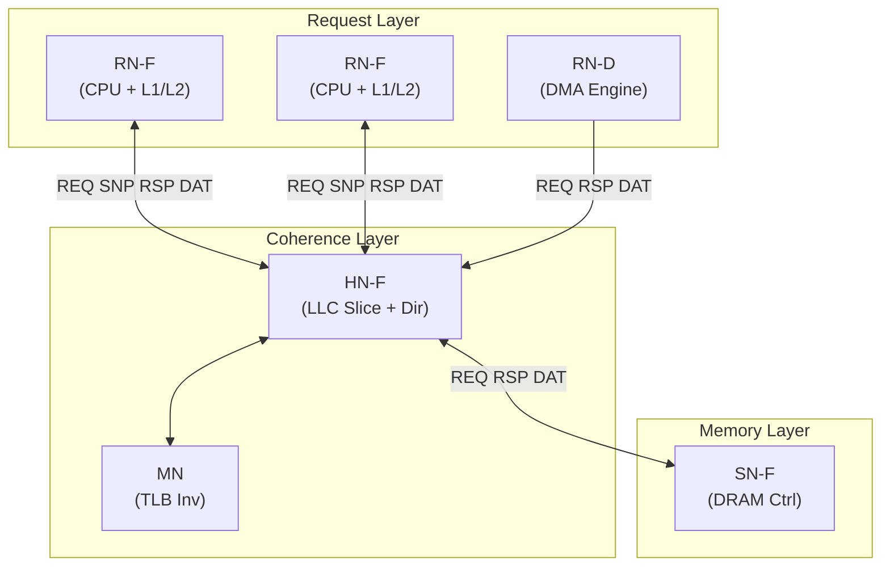

</div>
</div>

<!-- Speaker Notes:
CHI defines several node types, each with a specific role in the coherence hierarchy.
Let me walk through them.

RN-F — Request Node Fully-coherent. This is your CPU core with its private caches.
An RN-F has L1 instruction and data caches, optionally a private L2. It issues coherent
requests like ReadShared, ReadUnique, WriteUnique. It also responds to snoops from the
Home Node. In gem5, the CHI_RNF class creates an L1I, L1D, and optional L2 controller.

RN-I — Request Node I/O. This is for I/O devices that need non-coherent access.
Think of peripherals that read/write memory but don't cache.

RN-D — Request Node DMA. Used for DMA engines. Also non-coherent, but with different
semantics for scatter-gather operations.

HN-F — Home Node Fully-coherent. This is the heart of the coherence system. Each cache
line has a designated HN-F based on address hashing. The HN-F maintains the directory
for its address range, handles snoops, tracks sharers, and manages data movement.
In gem5, the HNF is configured with is_HN=True and can enable DMT and DCT optimizations.

MN — Misc Node. This handles Distributed Virtual Memory operations, specifically TLB
invalidation (TLBI) and DVM synchronization. When a core changes a page table, it sends
a DVM request through the MN which broadcasts to all RN-Fs.

SN-F — Slave Node Fully-coherent. This is the memory controller. It handles ReadNoSnp
and WriteNoSnp requests from the HN-F. In gem5, this wraps a DRAM controller model.

The diagram shows the layered architecture: request nodes at the top, coherence in the
middle, memory at the bottom. All communication flows through the four CHI channels.
-->

---

<!-- ================================================================== -->
<!-- SLIDE 5: Four Channels -->
<!-- ================================================================== -->

## The Four CHI Channels

<div class="columns">
<div>

<div class="card-grid two smaller">
<div class="channel-card compact req">
<p class="eyebrow">REQ · VNet 0</p>
<h3>Requests</h3>
<p>RN to HN traffic that starts transactions: <code>ReadShared</code>, <code>WriteUnique</code>, atomics, and maintenance ops.</p>
</div>
<div class="channel-card compact snp">
<p class="eyebrow">SNP · VNet 1</p>
<h3>Snoops</h3>
<p>HN to RN probes that invalidate, downgrade, or forward data from existing holders.</p>
</div>
<div class="channel-card compact rsp">
<p class="eyebrow">RSP · VNet 2</p>
<h3>Lightweight responses</h3>
<p>Completions, write acknowledgements, retry control, and protocol credits.</p>
</div>
<div class="channel-card compact dat">
<p class="eyebrow">DAT · VNet 3</p>
<h3>Data payloads</h3>
<p>Cache-line transfers such as <code>CompData</code>, copybacks, and forwarded snoop data.</p>
</div>
</div>

</div>
<div>

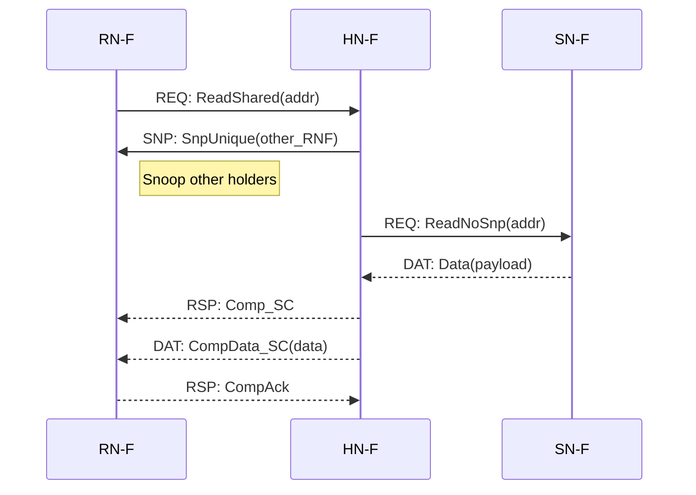

</div>
</div>

**Key insight**: RSP and DAT are separate — acknowledgements do not block data transfer.

<!-- Speaker Notes:
The four-channel design is arguably the most important architectural decision in CHI.
Let me explain each one and why the separation matters.

REQ channel (Virtual Network 0): Carries requests from requesters to the home node.
ReadShared, ReadUnique, WriteUnique, CleanUnique, atomics — all go here. This is the
initiation channel. In gem5, these are CHIRequestMsg objects flowing on vnet 0.

SNP channel (Virtual Network 1): Carries snoop requests from the home node to requesters.
When the HN-F needs to check if a requester has a line, or needs to invalidate it,
the snoop goes on this channel. Important: snoops only go to nodes the directory
knows have the line — this is not a broadcast.

RSP channel (Virtual Network 2): Carries responses — acknowledgements, completions,
snoop responses, credit grants. Comp means "your request is complete." CompAck confirms
the requester received the data. DBIDResp grants a write buffer ID. These are lightweight
messages without data payload.

DAT channel (Virtual Network 3): Carries actual cache line data. CompData combines
a completion response with data. CBWrData carries writeback data. This channel carries
the heavy payload — 32 or 64 bytes per message.

Why separate RSP and DAT? In older protocols like ACE, a response might carry data,
which blocks the response path for other transactions. In CHI, you can send a lightweight
Comp response immediately and the heavy CompData separately. This allows the home node
to acknowledge a request before data is ready, improving pipelining.

The sequence diagram shows a typical ReadShared: REQ out, snoop to current holder,
read from memory, then both RSP and DAT flow back to the requester independently.

In gem5, each channel maps to a Ruby virtual network, and Garnet routes them through
the NoC as separate flit classes.
-->

---

<!-- ================================================================== -->
<!-- SLIDE 6: Message Types Overview -->
<!-- ================================================================== -->

## Message Types at a Glance

<div class="card-grid three smaller">
<div class="card compact accent-blue">
<p class="eyebrow">44 request types</p>
<h3>Requests express intent</h3>
<ul>
<li>Reads: <code>ReadShared</code>, <code>ReadUnique</code>, <code>ReadOnce</code></li>
<li>Writes: <code>WriteUniqueFull</code>, <code>WriteBackFull</code></li>
<li>Maintenance: <code>Evict</code>, DVM initiates, atomics</li>
</ul>
</div>
<div class="card compact accent-green">
<p class="eyebrow">18 response types</p>
<h3>Responses close control flow</h3>
<ul>
<li>Completions: <code>Comp_I</code>, <code>Comp_SC</code>, <code>Comp_UD_PD</code></li>
<li>Write acknowledgements: <code>DBIDResp</code>, <code>CompDBIDResp</code></li>
<li>Flow control: <code>RetryAck</code>, <code>PCrdGrant</code></li>
</ul>
</div>
<div class="card compact accent-violet">
<p class="eyebrow">24 data types</p>
<h3>Data carries the payload story</h3>
<ul>
<li>Completion + data: <code>CompData_SC</code>, <code>CompData_UD_PD</code></li>
<li>Copyback traffic: <code>CBWrData_*</code></li>
<li>Snoop-returned data: <code>SnpRespData_*</code> variants</li>
</ul>
</div>
</div>

<!-- Speaker Notes:
This is the full taxonomy of CHI message types as implemented in gem5's CHI-msg.sm file.
Let me explain the naming convention because it tells you everything about what each
message does.

Request types follow the pattern: <Action><SharingHint>. For example:
- ReadShared means "I want to read, I am okay sharing this line"
- ReadUnique means "I want to write, I need exclusive ownership"
- ReadOnce means "I want to read once, don't cache it"
- WriteUniqueFull means "I have exclusive ownership, write the full line"

Response types encode the resulting cache state. Comp_SC means "your request completed,
you now have the line in Shared Clean state." SnpResp_UD_Fwded_I means "snoop response:
I had Unique Dirty, I forwarded the data to the requester, and now I am Invalid."

Data types combine completion state with data payload. CompData_SC carries both the
Shared Clean state indication and the actual cache line data.

The number of variants — 44 requests, 18 responses, 24 data types — reflects the
richness of the protocol. Every combination of sharing state, data presence, and
forwarding behavior has its own message type. This eliminates ambiguity at the
receiving end. The receiver knows exactly what happened without needing additional
state lookups.

In gem5's CHI-msg.sm, these are SLICC enumerations: CHIRequestType, CHIResponseType,
and CHIDataType. The SLICC state machine uses these to make decisions in transitions.

A practical note: you rarely use all 44 request types. A typical CPU cache controller
uses ReadShared, ReadUnique, WriteUniqueFull, WriteBackFull, CleanUnique, and Evict.
The others exist for I/O, atomics, DVM, and edge cases.
-->

---

<!-- ================================================================== -->
<!-- SLIDE 7: Request Opcodes Deep Dive -->
<!-- ================================================================== -->

## Request Opcodes — Choosing the Right One

<div class="comparison-grid smaller">
<div class="card accent-blue">
<p class="eyebrow">Read path</p>
<h3>Choose how much ownership you need</h3>
<ul>
<li><code>ReadShared</code>: normal load, lands in <code>SC</code></li>
<li><code>ReadUnique</code>: pre-store fetch, lands in <code>UC/UD</code></li>
<li><code>ReadOnce</code>: non-allocating read, leaves line uncached</li>
<li><code>ReadNotSharedDirty</code>: optimized shared read when SD is unlikely</li>
</ul>
</div>
<div class="card accent-teal">
<p class="eyebrow">Upgrade path</p>
<h3>Avoid moving data when ownership is enough</h3>
<ul>
<li><code>CleanUnique</code>: SC to UC without fetching data again</li>
<li><code>MakeReadUnique</code>: invalidate peer sharers for exclusive access</li>
<li><code>WriteUniqueFull</code>: send ownership request and full data together</li>
<li><code>WriteUniquePtl</code>: same idea, but with a byte mask</li>
</ul>
</div>
<div class="card accent-gold">
<p class="eyebrow">Eviction path</p>
<h3>Tell the HN-F exactly what leaves the cache</h3>
<ul>
<li><code>WriteBackFull</code>: dirty victim, data returns to the home path</li>
<li><code>Evict</code>: clean victim, just update ownership metadata</li>
</ul>
</div>
<div class="card accent-violet">
<p class="eyebrow">Naming rule</p>
<h3>Opcode names are mini-protocol specs</h3>
<p>The action and the final intent live in the opcode itself, so the HN-F does not need an extra negotiation round.</p>
</div>
</div>

**Pattern**: Request name encodes both the *action* and the *intent* — the HN-F knows what to do without additional negotiation.

<!-- Speaker Notes:
Let's spend a moment understanding the most important request opcodes. As a system designer,
choosing the right request type is critical for performance.

ReadShared is the workhorse. Every normal CPU load generates a ReadShared. It tells the
HN-F: "I want to read this line and I might cache it." The HN-F will return data in SC
state if others share it, or UC if the requester is the sole owner.

ReadUnique is what you send before a store. "I need exclusive ownership to write." The
HN-F will invalidate all other copies and return the line in UC or UD state depending
on whether any other cache had a dirty copy.

ReadOnce is for non-allocating reads — the CPU wants data but won't cache it. Useful
for DMA-style reads or debugging.

CleanUnique is an optimization. If you already have the line in SC state and want to
write, you don't need data — you just need everyone else invalidated. CleanUnique does
exactly that, saving the DAT channel bandwidth.

WriteUniqueFull and WriteUniquePtl are unique to CHI. In older protocols, writes always
required a two-step process: get ownership, then write. In CHI, WriteUnique combines
both: it carries the data (or byte mask) along with the write request. The HN-F processes
it atomically. This saves a round trip for stores.

WriteBackFull is for eviction of dirty lines. The RN-F hands the dirty data to the HN-F.
Evict is for clean lines — just a notification, no data transfer needed.

The naming convention is important: each request type carries enough semantic information
for the HN-F to know exactly what to do. There is no ambiguity. This is a design philosophy
of CHI — the protocol is explicit, not implicit.

In gem5, the sequencer maps CPU loads/stores to these request types automatically.
The mapping logic is in CHI-cache-funcs.sm, in functions like processNextState().
-->

---

<!-- ================================================================== -->
<!-- SLIDE 8: Coherence States -->
<!-- ================================================================== -->

## Coherence States — MOESI in CHI

<div class="columns">
<div>

<div class="state-grid smaller">
<div class="state-card compact accent-red">
<h3><code>I</code></h3>
<p>Invalid. No local copy, no access rights.</p>
</div>
<div class="state-card compact accent-blue">
<h3><code>SC</code></h3>
<p>Shared clean. Readable, but not writable.</p>
</div>
<div class="state-card compact accent-teal">
<h3><code>UC</code></h3>
<p>Unique clean. Exclusive ownership before the line turns dirty.</p>
</div>
<div class="state-card compact accent-violet">
<h3><code>UD</code></h3>
<p>Unique dirty. Sole owner and authoritative data source.</p>
</div>
<div class="state-card compact accent-gold">
<h3><code>SD</code></h3>
<p>Shared dirty. Shared readers exist, but this node owes the eventual writeback.</p>
</div>
</div>

<div class="comparison-grid smaller">
<div class="card compact accent-blue">
<h3><code>BUSY_INTR</code></h3>
<p>Transaction in flight, but snoops may still proceed safely.</p>
</div>
<div class="card compact accent-red">
<h3><code>BUSY_BLKD</code></h3>
<p>Transaction in flight and snoops must wait to preserve protocol invariants.</p>
</div>
</div>

</div>
<div>

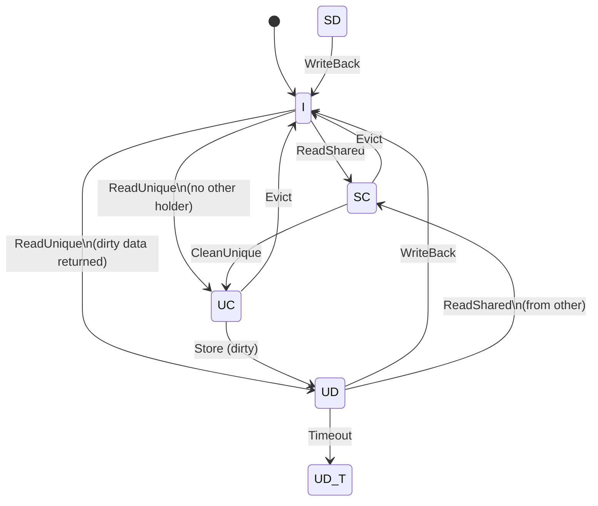

</div>
</div>

<!-- Speaker Notes:
CHI uses a MOESI-compatible state machine, but the naming is slightly different from
what you might be used to. Let me walk through each state.

I — Invalid. The line is not in this cache. Any access triggers a new request.

SC — Shared Clean. The line is present and readable, but multiple caches might have it.
You cannot write in SC — you need to upgrade to UC or UD first.

UC — Unique Clean. Exclusive ownership, but the data is clean (matches memory or
the home node has the authoritative copy). You can read and write. After writing,
you transition to UD.

UD — Unique Dirty. Exclusive ownership with dirty data. You are the sole owner
and the data in memory is stale. When you evict, you must write back.

SD — Shared Dirty. This is the interesting one. It means you are sharing the line
with others, but you are the one responsible for writing it back. If someone else
needs exclusive access, the HN-F will snoop you because you have the authoritative
data. This is gem5's MOESI — the O state is not explicitly named, but SD serves
the same role.

UD_T — Unique Dirty with Timeout. The line has been dirty for too long without
being written back. This triggers automatic writeback.

Transient states: BUSY_INTR means a transaction is in flight but snoops from the
HN-F can still be processed (the cache entry is in an intermediate state but
snoop processing won't corrupt it). BUSY_BLKD means snoops are blocked because
processing them would violate protocol invariants.

The state diagram shows the main transitions. The key path is:
I → ReadShared → SC → CleanUnique → UC → Store → UD → WriteBack → I

In gem5's CHI-cache.sm, these states are defined as SLICC State declarations.
Each state has an associated AccessPermission used by Ruby for correctness checks.
-->

---

<!-- ================================================================== -->
<!-- SLIDE 9: Upstream Tracking States -->
<!-- ================================================================== -->

## Advanced States — Upstream Tracking & Clusivity

<div class="columns smaller">
<div>

**Upstream States** (line not local, but tracked)

| State | Meaning |
|-------|---------|
| `RU` | Upstream has UD/UC |
| `RSC` | Upstream has SC |
| `RSD` | Upstream has SD |
| `RUSC` | RSC + this node has exclusive |
| `RUSD` | RSD + this node has exclusive |

**Combined Local + Upstream**

| State | Meaning |
|-------|---------|
| `SC_RSC` | Local SC + upstream SC |
| `SD_RSC` | Local SD + upstream SC |
| `UD_RU` | Local UD + upstream has copy |
| `UD_RSC` | Local UD + upstream SC |

</div>
<div>

**Why track upstream state?**

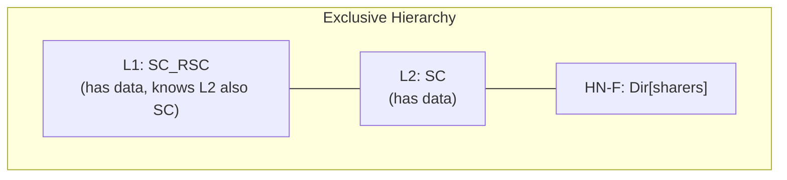

When L1 evicts cleanly:
- Without upstream tracking → send Evict to L2
- With `SC_RSC` → skip Evict, L2 already has it

**Benefit**: Eliminates redundant messages on clean eviction in inclusive hierarchies.

</div>
</div>

<!-- Speaker Notes:
This slide covers one of the more sophisticated aspects of CHI's state machine in gem5:
upstream tracking states and clusivity.

In a typical multi-level cache hierarchy, when an L1 cache has a line, the L2 (its upstream
neighbor toward memory) might also have a copy. In a strictly inclusive hierarchy, L2 always
has a superset of L1's contents. But even in non-inclusive or exclusive hierarchies, it is
useful for L1 to know whether L2 also has the line.

Why? Consider a clean eviction from L1. If L1 knows L2 has the line (state SC_RSC), it can
silently drop the line without sending an Evict message. This saves message bandwidth and
reduces latency.

The R-prefixed states mean "Remembered" — the line is not in the local cache anymore, but
the directory entry remembers the upstream state. RU means upstream has Unique (exclusive).
RSC means upstream has Shared Clean. RSD means upstream has Shared Dirty.

The combined states like SC_RSC mean "I have the line locally in SC state AND I know my
upstream also has SC." When I evict, I don't need to tell anyone because upstream already
has a copy.

In gem5, these states are defined in CHI-cache.sm and the transition logic is in
CHI-cache-transitions.sm. The clusivity parameters — alloc_on_readshared, dealloc_on_shared,
etc. — control when the cache allocates and deallocates entries, which determines which
upstream states are used.

This is an optimization that most protocol tutorials skip, but it matters for real
performance. In a 16-core system, eliminating unnecessary Evict messages on every L1
clean eviction saves significant network bandwidth.
-->

---

<!-- ================================================================== -->
<!-- SLIDE 10: ReadShared Transaction -->
<!-- ================================================================== -->

## Transaction Flow: ReadShared (Hit in Memory)

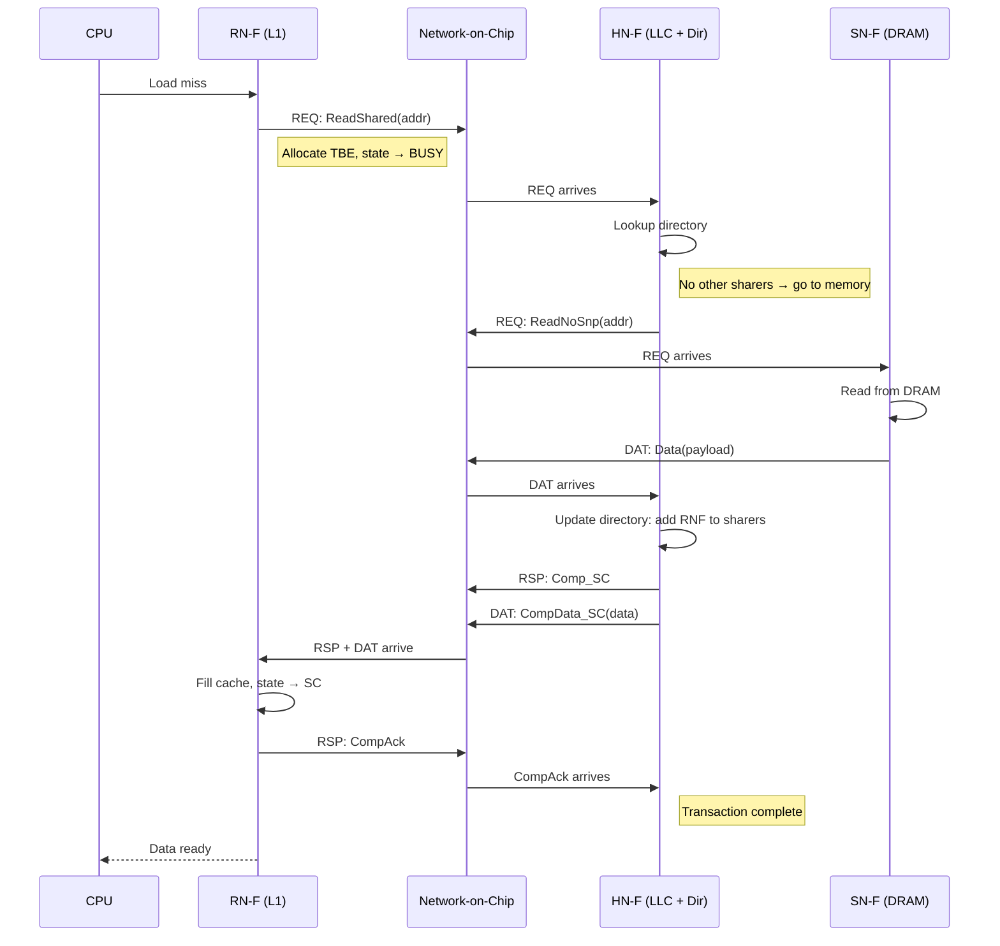

<!-- Speaker Notes:
Let's trace a complete ReadShared transaction — the most common operation in any multi-core
system. This is what happens when a CPU core does a load that misses its L1 cache.

Step 1: The CPU issues a load that misses. The RN-F allocates a Transaction Buffer Entry (TBE)
to track this in-flight operation and transitions the cache line state to a BUSY transient state.

Step 2: The RN-F sends a ReadShared request on the REQ channel through the NoC to the HN-F.
The HN-F is determined by address hashing — each cache line maps to exactly one HN-F.

Step 3: The HN-F looks up its directory for this address. In this case, no other RN-F has the
line, so the HN-F needs to fetch from memory. It sends ReadNoSnp to the SN-F.

Step 4: The SN-F reads from DRAM and returns the data on the DAT channel.

Step 5: The HN-F updates its directory to record that this RN-F now shares the line. Then it
sends two messages back: Comp_SC on the RSP channel (your request completed, you have SC state)
and CompData_SC on the DAT channel (here is the data).

Step 6: The RN-F receives both messages, fills its cache with the data in SC state, and sends
CompAck on the RSP channel to confirm receipt.

Step 7: When the HNF receives CompAck, the transaction is complete.

Key observations:
- The RSP and DAT messages travel independently on separate channels
- The HN-F is the serialization point — it ensures ordering
- The TBE at the RN-F allows the cache to handle other requests while waiting
- CompAck is the final handshake — without it, the HN-F cannot complete the transaction

In gem5, this entire flow is encoded in the CHI-cache-transitions.sm file as a series of
(state, event) → action mappings. Each arrow in this diagram corresponds to one or more
transition rules.
-->

---

<!-- ================================================================== -->
<!-- SLIDE 11: ReadShared with Dirty Forwarding (DCT) -->
<!-- ================================================================== -->

## Transaction Flow: ReadShared with DCT

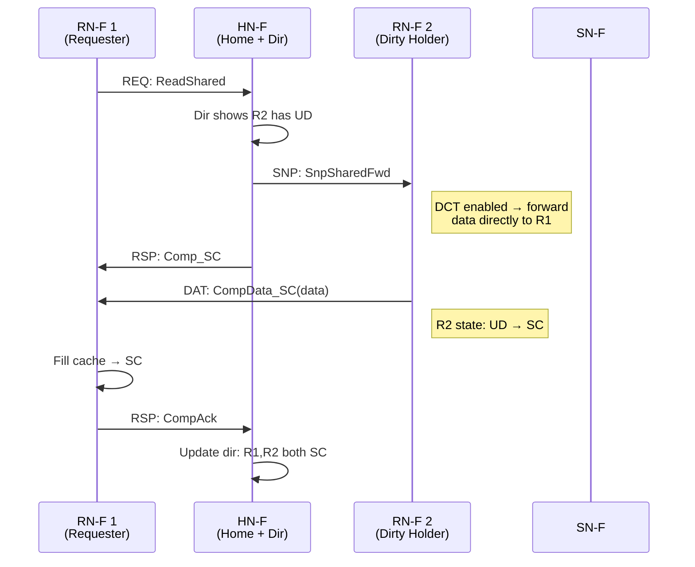

**DCT (Direct Cache Transfer)**: Data flows R2 → R1, bypassing HN-F cache. Saves one hop and HN-F bandwidth.

<!-- Speaker Notes:
Now let's see what happens when another core has the line dirty. This is where CHI's Direct
Cache Transfer (DCT) optimization shines.

The scenario: RN-F 1 sends ReadShared. The HN-F's directory shows that RN-F 2 has the line
in Unique Dirty state. The authoritative data is not in memory or the HN-F — it's in RN-F 2's
cache.

Without DCT, the flow would be: HN-F snoops R2, R2 sends data to HN-F, HN-F sends data to R1.
That's two hops for the data, and the HN-F cache bandwidth is consumed.

With DCT enabled (the `enable_DCT` flag in gem5), the HN-F sends a special snoop:
SnpSharedFwd. The "Fwd" suffix means "forward the data directly to the requester."
R2 sends the data straight to R1, bypassing the HN-F entirely.

The HN-F still sends Comp_SC to R1 on the RSP channel. But the data comes directly
from R2 on the DAT channel. R1 fills its cache in SC state.

After the transfer: R2 transitions from UD to SC (it still has the line, but it's now
shared and clean). R1 has SC. The HN-F directory records both as sharers.

The benefit is clear: one less hop for the data path, and the HN-F doesn't need to
buffer the data at all. In a mesh NoC with multiple hops between R2 and HN-F, this
can save 3-5 cycles of latency.

However, DCT requires careful ordering. The Comp_SC from HN-F and the CompData from
R2 must both arrive at R1 before the transaction completes. The TBE at R1 tracks
which messages are expected using an ExpectedMap data structure.

In gem5, DCT is controlled by the `enable_DCT` parameter on the HN-F controller.
It defaults to True in the standard configurations.
-->

---

<!-- ================================================================== -->
<!-- SLIDE 12: Write Transaction -->
<!-- ================================================================== -->

## Write Transaction: WriteUnique Flow

<div class="columns">
<div>

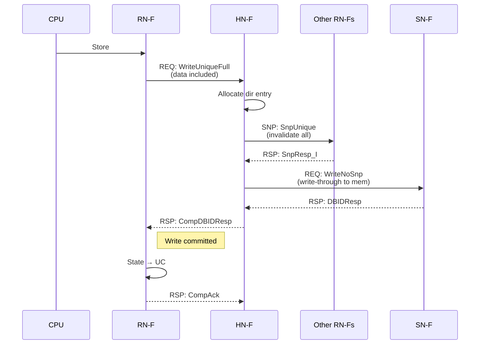

</div>
<div>

**WriteUnique combines ownership request + data**

Advantages over two-phase write:
- Single round-trip instead of ReadUnique then Write
- Data piggybacks on request — saves DAT channel
- HN-F can write-through to memory immediately

**CompDBIDResp**: Combines completion + write buffer allocation. The RN-F knows the write is committed when it receives this.

</div>
</div>

<!-- Speaker Notes:
Now let's look at writes. CHI's WriteUnique is one of its most clever design decisions.

In older protocols like MESI, a write is always two phases: first get exclusive ownership
(ReadUnique / GetM), then perform the write. This requires two round trips to the home node.

CHI collapses this into one operation: WriteUniqueFull. The RN-F sends both the request AND
the data in a single message on the REQ channel. The HN-F receives ownership transfer and
data simultaneously.

Here's the flow:
1. CPU does a store. RN-F sends WriteUniqueFull with the data included.
2. HN-F allocates a directory entry and issues SnpUnique to all current sharers.
3. Each sharer responds with SnpResp_I (I am now Invalid).
4. HN-F writes the data through to memory (WriteNoSnp to SN-F). This is optional
   depending on the write policy, but in gem5's default config, writes go to memory.
5. HN-F sends CompDBIDResp — this combines two things: Comp (your write is complete)
   and DBIDResp (here is a write buffer ID). The RN-F knows the write is committed.
6. RN-F transitions to UC (or UD if it was already dirty) and sends CompAck.

The key insight is CompDBIDResp. In CHI, every write needs a DBID (Data Buffer ID)
from the HN-F to ensure ordering. Combining the completion with the DBID grant saves
one message.

WriteUniquePtl is the partial-write variant — it includes a byte mask indicating which
bytes within the cache line are being written. The rest are don't-care or unchanged.

For the RN-F, WriteUnique means "I already know I have unique access (from a previous
CleanUnique or ReadUnique), so I'm just informing the HN-F of the write."
If the RN-F doesn't have unique access, it must first obtain it.

In gem5, the cache controller decides between WriteUnique and the two-phase approach
based on whether it already has ownership. The logic is in CHI-cache-funcs.sm.
-->

---

<!-- ================================================================== -->
<!-- SLIDE 13: Snoop Operations -->
<!-- ================================================================== -->

## Snoop Operations

<div class="columns smaller">
<div>

<div class="card accent-violet">
<p class="eyebrow">Forwarding snoops</p>
<h3>DCT path: data goes to the requester</h3>
<ul>
<li><code>SnpSharedFwd</code>: holder downgrades to <code>SC</code> and forwards data</li>
<li><code>SnpUniqueFwd</code>: holder invalidates and forwards the dirty line</li>
<li><code>SnpOnceFwd</code>: one-shot forward without retaining the line</li>
<li><code>SnpNotSharedDirtyFwd</code>: forward while preserving SD-specific ownership rules</li>
</ul>
</div>

<div class="card accent-gold">
<p class="eyebrow">Non-forwarding snoops</p>
<h3>Classical home-node return path</h3>
<ul>
<li><code>SnpShared</code>: probe for a clean shared copy</li>
<li><code>SnpUnique</code>: invalidate and hand ownership back</li>
<li><code>SnpOnce</code>: send data without invalidating</li>
<li><code>SnpCleanInvalid</code>: fast clean invalidate when no data transfer is needed</li>
</ul>
</div>

</div>
<div>

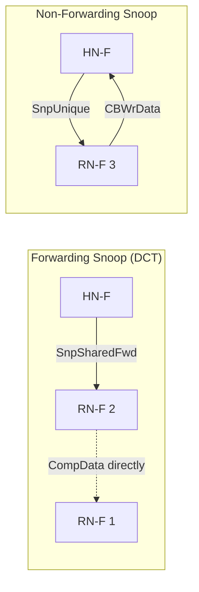

**Snoop ordering rule**: Snoops on the same address must be processed in order at the RN-F. This is guaranteed by the SNP channel ordering.

</div>
</div>

<!-- Speaker Notes:
Snoop operations are how the Home Node maintains coherence. When a new request arrives for a
line that other caches might hold, the HN-F sends snoops. Let's distinguish the two categories.

Forwarding snoops are used with DCT. The "Fwd" suffix means "forward your data directly to
the requester." The HN-F includes the requester's ID in the snoop so the holder knows where
to send data. This is the key optimization — data bypasses the HN-F entirely.

Non-forwarding snoops are the traditional model. The holder responds to the HN-F, which
then forwards to the requester. Simpler but slower.

SnpSharedFwd: "Do you have this line? If so, send a copy directly to the requester and
keep your copy in Shared Clean." Used when the HN-F wants to serve a ReadShared request
and knows a holder has clean data.

SnpUniqueFwd: "Give up your copy entirely, forward data to the requester, and go Invalid."
Used when the HN-F needs to grant exclusive ownership to someone else.

SnpUnique: "Invalidate your copy and send data back to me." Used when the HN-F needs to
collect dirty data before granting exclusive access to a third party.

SnpCleanInvalid: "If your copy is clean, just invalidate silently. If dirty, send data back."
This is an optimization for clean invalidation — no data transfer needed if the line is clean.

A critical ordering rule: snoops for the same address must be processed in order at each RN-F.
The SNP channel in CHI guarantees this ordering. If the HN-F sends SnpShared then SnpUnique
for the same address, the RN-F will process them in that order. This prevents race conditions
in the coherence protocol.

In gem5, snoop processing is handled by the CHI-cache-actions.sm file, specifically in
actions like sendSnpResponse, sendDataToReq, and various snoop-specific actions.
The snoop queues are separate from the request queues to avoid deadlock.
-->

---

<!-- ================================================================== -->
<!-- SLIDE 14: DMT - Direct Memory Transfer -->
<!-- ================================================================== -->

## Direct Memory Transfer (DMT)

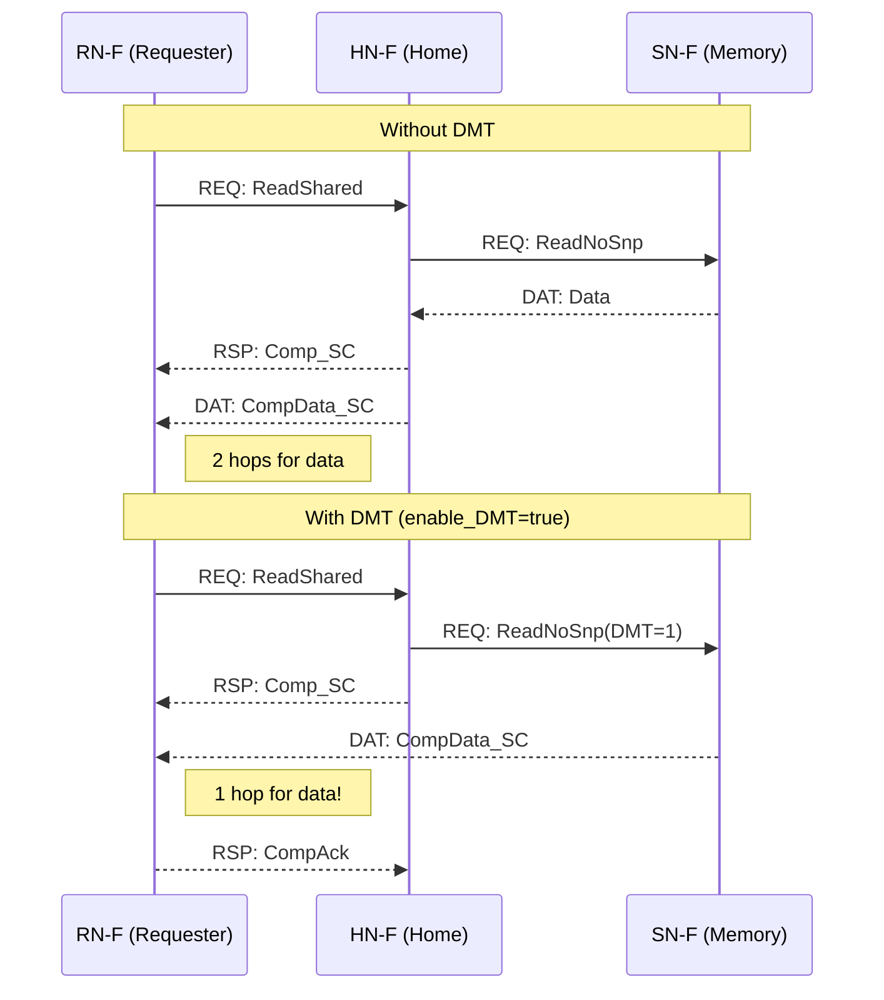

**DMT eliminates the HN-F hop for data from memory.** Data flows SN-F → RN-F directly.

<!-- Speaker Notes:
Direct Memory Transfer is the companion optimization to DCT. While DCT bypasses the HN-F
when another cache has dirty data, DMT bypasses the HN-F when the data comes from memory.

Without DMT: Memory sends data to HN-F, HN-F sends data to RN-F. Two hops.
With DMT: Memory sends data directly to RN-F. One hop.

In a mesh NoC, the HN-F might be several hops away from both the RN-F and the SN-F.
Without DMT, data travels SN-F → (N hops) → HN-F → (M hops) → RN-F. With DMT,
data travels SN-F → (K hops) → RN-F where K is typically less than N+M.

The mechanism: The HN-F sends ReadNoSnp to the SN-F with a flag indicating DMT.
The SN-F reads from DRAM and sends the data directly to the RN-F (not to the HN-F).
The HN-F sends Comp_SC to the RN-F on the RSP channel.
When the RN-F receives both Comp_SC and CompData_SC, the transaction completes.

DMT is controlled by the `enable_DMT` flag on the HN-F controller. In gem5's default
CHI configuration, it is enabled.

There's an advanced variant: `enable_DMT_early_dealloc`. This uses ReadNoSnpSep (separated
read) where the SN-F sends the data directly to the RN-F and a separate acknowledgment
to the HN-F. This allows the HN-F to deallocate its TBE before the data reaches the
RN-F, saving TBE resources. But it adds complexity because the HN-F must be prepared
to handle retry and error cases without the TBE.

In gem5, DMT is implemented in CHI-cache-actions.sm. The key action is sendReadToMemory
which checks enable_DMT and chooses between ReadNoSnp (no DMT) and ReadNoSnp with
direct data routing.

Performance impact: DMT typically saves 5-10 cycles on memory reads in a 4x4 mesh,
depending on the placement of the RN-F, HN-F, and SN-F.
-->

---

<!-- ================================================================== -->
<!-- SLIDE 15: Retry & Credit Flow Control -->
<!-- ================================================================== -->

## Retry Mechanism & Protocol Credits

<div class="columns">
<div>

**Problem**: What if the HN-F is overwhelmed?

**Solution**: CHI uses a credit-based retry mechanism.

```
RN-F                        HN-F
  |                           |
  |--- REQ: ReadShared ----->| (queue full!)
  |<-- RSP: RetryAck --------|
  |   (please retry later)    |
  |                           |
  |   ... time passes ...     |
  |                           |
  |<-- RSP: PCrdGrant -------| (credit granted)
  |   (you may retry now)     |
  |                           |
  |--- REQ: ReadShared ----->| (re-accepted)
```

</div>
<div>

**How it works:**

1. Every request has `allowRetry=true` by default
2. HN-F sends `RetryAck` if it cannot accept
3. RN-F queues the request for retry
4. HN-F sends `PCrdGrant` when capacity frees
5. RN-F replays the exact same request

**In gem5:**
- `throttle_req_on_retry` blocks new requests to busy HN-Fs
- `RetryQueueEntry` tracks pending retries
- Each HN-F has independent retry queues

</div>
</div>

> **Design trade-off**: Retry adds latency on congestion but avoids deadlock. Without it, the HN-F would need unbounded buffers.

<!-- Speaker Notes:
Flow control in CHI is critical. Unlike a shared bus where arbitration naturally throttles
requesters, a packetized NoC can deliver bursts of requests that overwhelm the HN-F.

CHI's solution is elegant: the RetryAck + PCrdGrant mechanism. Let's walk through it.

Every request message has an `allowRetry` flag. When set to true, the HN-F has the option
to reject the request if it's too busy. The HN-F sends back a RetryAck, which means
"I cannot handle this right now, please try again later."

The RN-F queues the original request in a retry queue. It does NOT retry immediately —
that would just re-congest the HN-F.

When the HN-F has capacity, it sends a PCrdGrant (Protocol Credit Grant) to the RN-F.
This is the green light to retry. The RN-F then re-sends the exact same request.

PCrdGrant includes a credit type that can specify which category of request can be retried.
This allows the HN-F to prioritize certain request types during recovery.

In gem5, the implementation is in CHI-cache-actions.sm. The key parameters:
- `throttle_req_on_retry`: When set, the RN-F blocks ALL new requests to the same
  destination while a retry is pending. This prevents retry starvation.
- The `RetryQueueEntry` tracks the original request address, type, and destination.
- Each HN-F maintains independent retry state per requester.

A subtle point: the retried request must be the EXACT same message. The RN-F cannot
change the request type or data. This ensures the protocol state machine remains
consistent. The HN-F knows it's a retry, not a new request.

Deadlock prevention: Without retry, the HN-F would need infinite buffers or would
deadlock when all buffers fill. Retry provides backpressure without deadlock because
the PCrdGrant breaks the dependency cycle.

In practice, retries are rare in well-provisioned systems but critical for correctness
under load spikes — exactly when you need the protocol to not crash.
-->

---

<!-- ================================================================== -->
<!-- SLIDE 16: Clusivity -->
<!-- ================================================================== -->

## Clusivity — Controlling Cache Inclusion

<div class="columns">
<div>

<div class="comparison-grid smaller">
<div class="card compact accent-blue">
<p class="eyebrow">Strict inclusive</p>
<h3>Easy snoop filtering</h3>
<p>Every child line must live upstream too.</p>
<p><code>alloc_on_* = all</code>, minimal deallocation.</p>
</div>
<div class="card compact accent-teal">
<p class="eyebrow">Mostly inclusive</p>
<h3>Pragmatic default</h3>
<p>Keep shared lines for filtering, but do not over-commit to write-private data.</p>
</div>
<div class="card compact accent-gold">
<p class="eyebrow">Exclusive</p>
<h3>Capacity first</h3>
<p>L1 and L2 avoid duplicate copies, at the cost of more back-invalidations and tracking.</p>
</div>
<div class="card compact accent-violet">
<p class="eyebrow">Non-inclusive</p>
<h3>Policy driven</h3>
<p>No hard guarantee either way. Allocate and drop based on workload goals.</p>
</div>
</div>

</div>
<div>

<div class="card accent-teal smaller">
<p class="eyebrow">gem5 knobs</p>
<h3>Allocation and deallocation are explicit</h3>
<p><code>alloc_on_readshared</code>, <code>alloc_on_readunique</code>, <code>alloc_on_readonce</code>, and <code>alloc_on_writeback</code> decide when an upstream level keeps a line.</p>
<p><code>dealloc_on_unique</code> and <code>dealloc_on_shared</code> decide when that level lets go after a child gains ownership.</p>
</div>

<div class="takeaway smaller">
<p><strong>Trade-off:</strong> inclusive hierarchies simplify snoop filtering, while exclusive hierarchies reclaim capacity and push more work into metadata and invalidation logic.</p>
</div>

</div>
</div>

<!-- Speaker Notes:
Clusivity — whether a cache level is inclusive, exclusive, or non-inclusive with respect
to the level below it — is one of the most important configuration decisions in a cache
hierarchy.

Strict inclusive means every line in L1 must also be in L2. When L2 evicts a line, it
must invalidate the corresponding L1 entry (back-invalidaton). The advantage: when a
snoop arrives at L2, if L2 doesn't have the line, neither does L1, so no need to snoop
L1. This is a snoop filter.

Exclusive means L1 and L2 never hold the same line simultaneously. When a line is
allocated in L1, it is removed from L2. The advantage: total effective cache capacity
is L1_size + L2_size, not just L2_size. The disadvantage: every snoop must check L1
because L2 doesn't track L1's contents.

Non-inclusive means no guarantees. The cache can choose to allocate or not based on
dynamic criteria.

In gem5's CHI implementation, clusivity is controlled by a set of boolean parameters:
- alloc_on_readshared, alloc_on_readunique, etc.: These control when the cache allocates
  a directory entry for a transaction. If alloc_on_readshared is true, the cache will
  keep a copy of the line when a ReadShared is processed.
- dealloc_on_unique, dealloc_on_shared: These control when the cache evicts a line
  because its child cache (downstream) has obtained the line. If dealloc_on_unique is
  true and the L1 gets Unique access, the L2 drops its copy.

The default gem5 CHI HN-F configuration uses "mostly inclusive for shared, exclusive for
unique": alloc_on_readshared=True, alloc_on_readunique=True, dealloc_on_unique=True.
This means the LLC keeps copies of shared data (for snoop filtering) but drops copies
when a core gets exclusive ownership (to save capacity).

This is a pragmatic compromise. Shared reads are the common case, so the snoop filter
works most of the time. Writes are less common, and giving the LLC capacity back when
a core is actively writing to a line improves performance.

The clusivity parameters interact with the upstream tracking states we discussed earlier.
When dealloc_on_unique is true, the HN-F transitions to RU or RSC states instead of
keeping the line in a local state.
-->

---

<!-- ================================================================== -->
<!-- SLIDE 17: DVM - Distributed Virtual Memory -->
<!-- ================================================================== -->

## DVM — Distributed Virtual Memory Operations

<div class="columns">
<div>

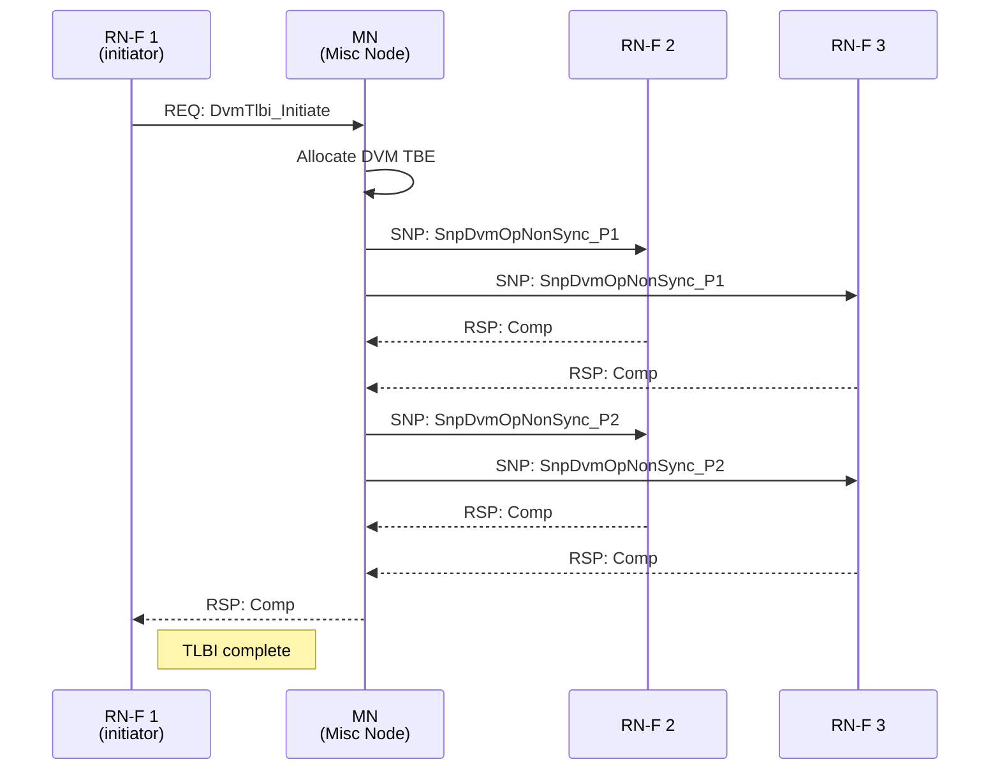

</div>
<div>

**What is DVM?**
- TLB Invalidation (TLBI) across all cores
- Page table changes must invalidate stale TLB entries
- Requires *ordered* delivery to all RN-Fs

**Two-phase snoop:**
- **P1** (Phase 1): Prepare — RN-F marks TLB entry for invalidation
- **P2** (Phase 2): Commit — RN-F applies the invalidation

**DVM Sync**: Barrier ensuring all prior TLBIs are visible before proceeding. Required before re-using freed page tables.

**gem5**: `CHI_MNController` handles this via `CHI-dvm-misc-node*.sm`

</div>
</div>

<!-- Speaker Notes:
Distributed Virtual Memory operations are CHI's mechanism for maintaining TLB coherence
across multiple cores. This is essential when an operating system changes page tables.

Consider this scenario: The OS running on core 1 frees a page frame and maps it to a
different virtual address. Core 2's TLB still has the old mapping. If core 2 accesses
the old virtual address, it must NOT use the stale TLB entry. DVM ensures all cores
see the new mapping.

The Misc Node (MN) is the DVM coordinator. When core 1 (RN-F 1) needs to invalidate
a TLB entry, it sends a DvmTlbi_Initiate request to the MN.

The MN then broadcasts DVM snoops to all RN-Fs. This is done in two phases:

Phase 1 (P1): The MN sends SnpDvmOpNonSync_P1 to each RN-F. This is the "prepare"
phase. The RN-F identifies the affected TLB entry and marks it as pending invalidation,
but doesn't actually invalidate yet. The RN-F responds with Comp.

Phase 2 (P2): The MN sends SnpDvmOpNonSync_P2. This is the "commit" phase. The RN-F
now actually invalidates the TLB entry. After responding with Comp, the entry is gone.

Why two phases? Because some implementations need to quiesce in-flight translations
before invalidating. Phase 1 says "stop new translations using this entry." Phase 2
says "now remove it." This ensures no in-flight memory access uses a stale translation.

DVM Sync is a barrier operation. When the OS does a TLB invalidation and then frees
a page table, it must ensure all cores have completed the invalidation before reusing
the physical page. DvmSync guarantees this ordering. The MN sends DvmSync snoops,
waits for all completions, and then confirms to the initiator.

In gem5, the DVM state machine is in CHI-dvm-misc-node.sm (380 lines). The Misc Node
has its own TBE structure partitioned for sync and non-sync operations. The
`early_nonsync_comp` parameter allows the MN to complete non-sync operations before
all P2 responses arrive, improving DVM throughput.

The MN is a unique node type in CHI — it doesn't handle data, only control messages
for TLB coherence. It's small but critical for virtualized and multi-process workloads.
-->

---

<!-- ================================================================== -->
<!-- SLIDE 18: CHI in gem5 — Architecture -->
<!-- ================================================================== -->

## CHI Implementation in gem5

<div class="columns smaller">
<div>

**Protocol Source** (`src/mem/ruby/protocol/chi/`)

| File | Lines | Purpose |
|------|-------|---------|
| `CHI-msg.sm` | 268 | Message type definitions |
| `CHI-cache.sm` | 905 | Cache controller states |
| `CHI-cache-ports.sm` | 490 | Channel ↔ buffer wiring |
| `CHI-cache-funcs.sm` | 1,532 | Helper functions |
| `CHI-cache-actions.sm` | 4,157 | Action implementations |
| `CHI-cache-transitions.sm` | 1,810 | State transition rules |
| `CHI-mem.sm` | 810 | Memory controller (SN-F) |
| `CHI-dvm-misc-node*.sm` | ~1,600 | DVM Misc Node |
| **Total SLICC** | **~11,500** | |

</div>
<div>

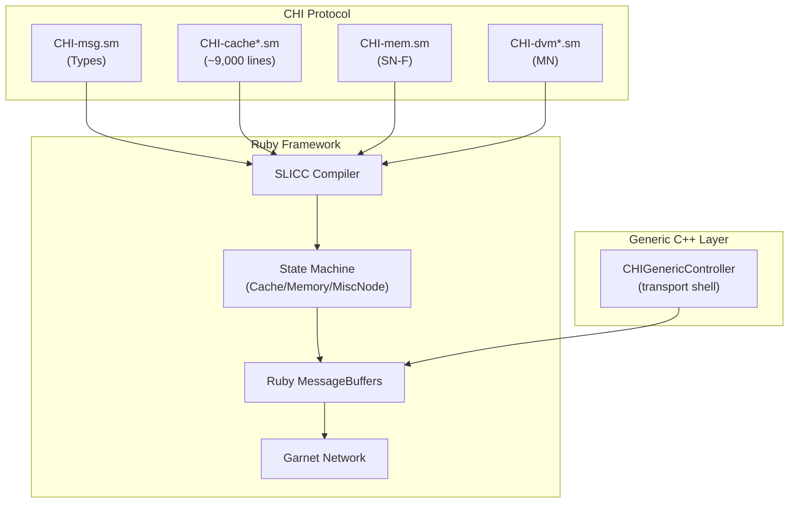

</div>
</div>

<!-- Speaker Notes:
Let me give you a tour of how CHI is implemented in gem5. This is important if you
want to modify the protocol or understand its behavior.

The protocol is written in SLICC — a domain-specific language for cache coherence
state machines. SLICC files have the .sm extension and are compiled by the SLICC
compiler into C++ code that links with the Ruby framework.

The protocol is split across 13 files totaling about 11,500 lines:

CHI-msg.sm defines all the message types as SLICC structures and enumerations.
This is the "vocabulary" of the protocol — 44 request types, 18 response types,
24 data types, and the message structures that carry them.

CHI-cache.sm is the main cache controller. It defines states (I, SC, UC, UD, SD,
BUSY, etc.), events (request arrivals, snoop arrivals, timeouts), and data
structures (CacheEntry, DirEntry, TBE).

CHI-cache-actions.sm is the largest file at 4,157 lines. It contains all the
action code — what to do when a transition fires. Sending messages, allocating
TBEs, updating directory entries, handling DCT/DMT, etc.

CHI-cache-transitions.sm maps (state, event) pairs to action sequences. This is
the transition table. Each row says: "when in state X and event Y fires, execute
actions A, B, C and transition to state Z."

CHI-mem.sm is the memory controller (SN-F) state machine. Much simpler — it
handles read and write requests from the HN-F.

The CHI-dvm-misc-node files implement the Misc Node for DVM operations.

There's also a C++ layer: CHIGenericController. This is NOT a SLICC machine.
It's a hand-written C++ abstract class that provides a transport shell — it
connects four CHI channel ports to the Ruby message buffers and dispatches
incoming messages to virtual methods. It's used for custom controllers that
don't use SLICC.

The entire protocol is compiled at build time by SLICC into C++ classes that
inherit from Ruby's state machine base classes. These classes interact with
Ruby's MessageBuffers and the Garnet network to move packets through the NoC.
-->

---

<!-- ================================================================== -->
<!-- SLIDE 19: Configuring CHI Systems -->
<!-- ================================================================== -->

## Configuring CHI Systems in gem5

<div class="columns smaller">
<div>

**Modern stdlib API** (recommended):

```python
from gem5.components.cachehierarchies.chi import (
    PrivateL1CacheHierarchy,
    PrivateL1PrivateL2CacheHierarchy,
)
from gem5.components.boards import SimpleBoard

hierarchy = PrivateL1CacheHierarchy()
board = SimpleBoard(
    clk_freq="3GHz",
    processor=processor,
    memory=memory,
    cache_hierarchy=hierarchy,
)
```

**Legacy Ruby API** (full control):

```python
from configs.ruby.CHI import create_system

system = create_system(
    num_rnf=16,          # 16 fully-coherent cores
    num_hnf=16,          # 16 LLC slices
    num_snf=2,           # 2 memory controllers
    topology="CustomMesh",
    network="garnet",
    chi_config="rbook_4x4.py",
)
```

</div>
<div>

**Node configuration** (from `CHI_config.py`):

| Node | Key Parameters |
|------|---------------|
| **L1 (RN-F)** | MOESI, strict inclusive, 16 TBEs, 4 snoop TBEs |
| **L2 (RN-F)** | MOESI, strict inclusive, 32 TBEs |
| **HNF** | `is_HN=True`, DMT+DCT enabled, mostly inclusive |
| **MN** | 16 DVM TBEs, `early_nonsync_comp` |
| **SN-F** | Wraps DRAM controller |

**Build & Run:**

```bash
scons build/RISCV/gem5.opt -j$(nproc)
./build/RISCV/gem5.opt \
  configs/example/rbook_mesh_config.py \
  --num-cpus=16 --topology=CustomMesh
```

</div>
</div>

<!-- Speaker Notes:
Now let's look at how you actually build and run CHI systems in gem5. There are two
configuration APIs.

The modern stdlib API is the recommended approach. You import cache hierarchy classes
from gem5.components.cachehierarchies.chi and plug them into a Board. The stdlib handles
all the wiring — node creation, network setup, address range interleaving. You can be
running a CHI simulation in about 10 lines of Python.

Two hierarchy types are available: PrivateL1CacheHierarchy gives each core a private
L1 with a shared directory (HNF). PrivateL1PrivateL2CacheHierarchy adds private L2 caches.
Both use point-to-point networks by default.

The legacy Ruby API gives you full control over every parameter. You use create_system()
from configs/ruby/CHI.py and specify the number of each node type, the topology, and
the network type. This is what the book's 4x4 mesh example uses.

For the 4x4 mesh in the book's final project:
- 16 RN-Fs (cores with L1 and L2)
- 16 HN-Fs (LLC slices, each handling 1/16 of the address space)
- 2 SN-Fs (memory controllers)
- 1 MN (DVM coordinator)
- CustomMesh topology with Garnet routers

The key parameters per node type:

L1 controllers use MOESI with strict inclusion. 16 TBEs for in-flight transactions,
16 replacement TBEs, and 4 snoop TBEs. The low snoop TBE count is fine because
L1 snoops are rare in a mesh — only the HN-F sends snoops.

L2 controllers have 32 TBEs for their larger transaction window.

HN-F controllers have is_HN=True which enables directory tracking. DMT and DCT
are enabled by default. Clusivity is "mostly inclusive for shared, exclusive for
unique."

To build and run: compile for RISC-V, then run the config script. The book's
rbook_mesh_config.py script sets up the full 16-core mesh.

For testing, there's also tests/gem5/chi_protocol/ which runs CHI across ARM, X86,
and RISC-V with 1, 2, and 4 cores to validate correctness.
-->

---

<!-- ================================================================== -->
<!-- SLIDE 20: Summary & Key Takeaways -->
<!-- ================================================================== -->

## Summary — What to Remember

<div class="columns">
<div>

**Five Key Ideas**

1. **Four channels** (REQ/SNP/RSP/DAT) separate concerns and enable parallelism
2. **Directory at HN-F** targets snoops instead of broadcasting
3. **DCT + DMT** bypass the home node for latency-critical data paths
4. **MOESI states** + upstream tracking optimize inclusive hierarchies
5. **Retry + credits** provide deadlock-free backpressure

</div>
<div>

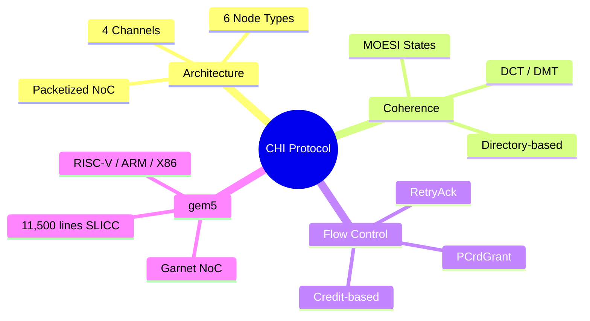

</div>
</div>

> **If you remember one thing**: CHI replaces broadcast snooping with targeted directory lookups on four independent channels, enabling scalability to hundreds of cores.

<!-- Speaker Notes:
Let me close with the five key ideas from this presentation.

First: four channels. This is the architectural foundation. REQ carries requests, SNP
carries snoops, RSP carries lightweight responses, DAT carries heavy data. They flow
independently on separate physical links. This separation enables pipelining and
out-of-order completion that is simply impossible with a shared bus.

Second: directory-based coherence. The HN-F maintains a directory of who has each cache
line. Snoops are targeted — only sent to nodes that actually have the line. This is the
fundamental scalability mechanism. A 256-core system does not generate 256 snoop messages
for every transaction.

Third: direct transfers. DCT lets cache-to-cache data bypass the home node. DMT lets
memory-to-cache data bypass the home node. These optimizations eliminate the home node
as a data bottleneck, which is crucial at scale.

Fourth: the state machine is rich but purposeful. MOESI states cover the basic sharing
semantics. Upstream tracking states optimize inclusive hierarchies. Transient states
handle in-flight operations safely. Every state exists because it solves a specific
problem.

Fifth: flow control is deadlock-free by design. The retry mechanism ensures that no
component needs unbounded buffers. Under load, requests are rejected and retried rather
than causing deadlock. This is a protocol-level guarantee, not an implementation detail.

In gem5, the CHI protocol is implemented as 11,500 lines of SLICC code compiled into
C++ state machines. It runs on the Garnet network-on-chip model and supports RISC-V,
ARM, and X86 ISAs.

If you want to explore further, the book's final project in Chapter 17 walks you through
building a 4x4 CHI mesh with 16 RISC-V cores, measuring latency, bandwidth, and
backpressure behavior.

Thank you. Are there any questions?
-->

---

<!-- ================================================================== -->
<!-- APPENDIX: Resources -->
<!-- ================================================================== -->

## Resources & References

**Primary Specification**
- ARM AMBA 5 CHI Architecture Specification, Issue D
- `https://developer.arm.com/documentation/ihi0050/latest`

**gem5 Source Code**
- `src/mem/ruby/protocol/chi/` — Protocol implementation
- `configs/ruby/CHI.py`, `CHI_config.py` — System configuration
- `src/python/gem5/components/cachehierarchies/chi/` — Stdlib API

**Book References**
- *Memory Architecture and NoC Modeling in gem5* — Chapters 12–15
- `ruby-book/extra/ChiGenericCtrl.md` — CHIGenericController deep dive

**Exercises**

1. Modify the HNF to disable DCT. Measure the latency impact on a 4-core system.
2. Add a custom snoop type `SnpInvalidateIfClean` and trace its handling.
3. Build a 4x4 mesh, run the hotspot test, and explain which channels saturate first.
4. Enable `enable_DMT_early_dealloc` and measure TBE occupancy reduction.

<!-- Speaker Notes:
This final slide provides resources for further study.

The ARM specification is the definitive reference. All message type names, encoding
formats, and ordering rules come from this document. The gem5 implementation follows
Issue D of the specification.

The gem5 source code is the best way to understand the protocol in action. Start with
CHI-msg.sm to see the message types, then CHI-cache.sm for the state machine structure,
then CHI-cache-actions.sm for the implementation details.

The book chapters provide a guided walk through the code with diagrams and explanations.
Chapter 12 covers the protocol structure, Chapter 13 covers system configuration,
and Chapter 17 is the hands-on final project.

The exercises are designed to force transfer of knowledge — you need to understand
the protocol well enough to modify it, not just describe it.

Exercise 1: Disabling DCT forces all data through the HN-F. This should increase
latency for cache-to-cache transfers. Measure the difference and explain why.

Exercise 2: Adding a custom snoop type requires understanding the snoop handling
actions and transitions. This exercises your knowledge of the state machine.

Exercise 3: The hotspot test targets a single HN-F with many requesters. Which
channel saturates first and why? This tests your understanding of channel capacity
and flow control.

Exercise 4: Early deallocation reduces TBE occupancy but adds complexity. Measure
the occupancy reduction and explain the trade-off.

Thank you for your attention. I'm happy to take questions.
-->
