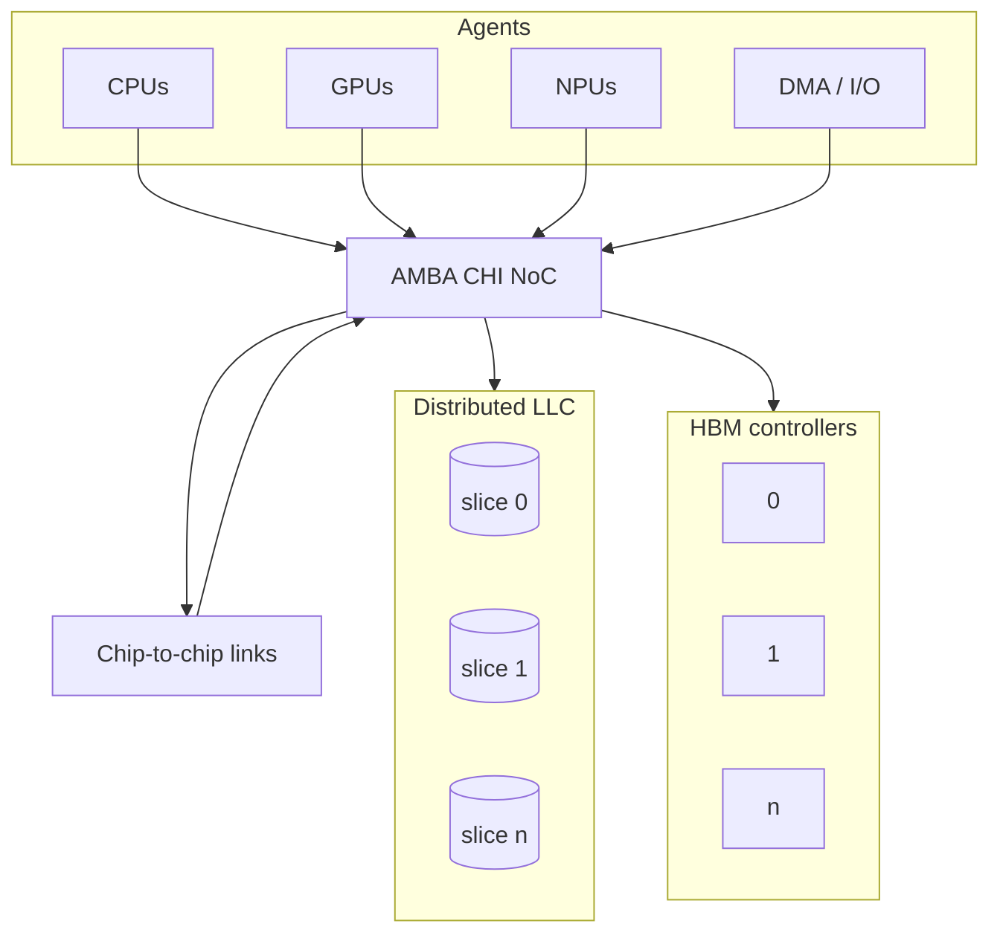
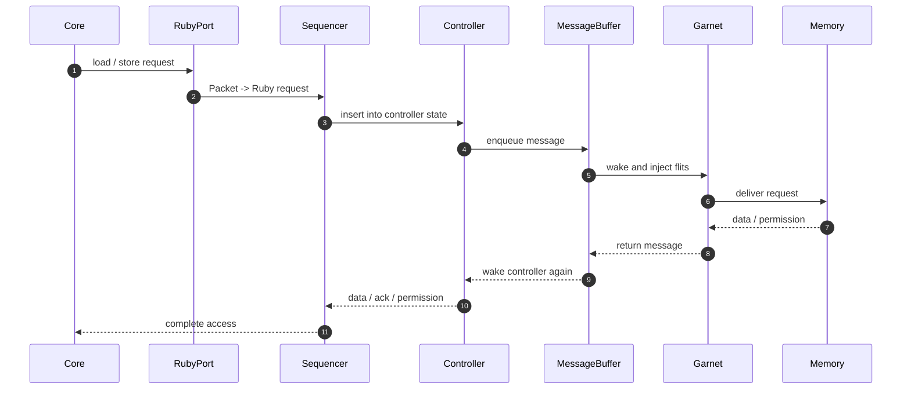

# Modeling memory architecture in gem5

Modern SoCs combine many agents, shared cache slices, NoC fabrics, and
remote memory paths.



The model question is not just where data sits.
It is where requests queue, where arbitration happens, and which links expose
bandwidth or latency bottlenecks.

---
zoom: 0.7
---

## Lifetime of one message in gem5 / Ruby / Garnet

The path is short in code and long in time.



- `Sequencer` tracks the outstanding request.
- `MessageBuffer` exposes controller queueing.
- Garnet adds router, link, VC, and credit behavior.
- One logical access becomes several events and several flits.

> **Failure mode:** It is easy to collapse the whole path into a single
> "Ruby latency".
> In practice, the latency is a sum of controller work, queueing, network
> transport, and memory service.

---
zoom: 0.7
---

# `src/mem/protocol/`: the access-semantics layer

The three files in this directory define the baseline execution model.

```text
src/mem/protocol/
  atomic.hh / atomic.cc
  timing.hh / timing.cc
  functional.hh / functional.cc
```

`atomic`
- Completes the access immediately and skips detailed time.
- Useful when the question is "does it work?" rather than "how long did it take?"

`timing`
- Models packets, events, queueing, and backpressure.
- This is the path used when latency and contention matter.

`functional`
- Performs side-effect-free reads and writes for debug, boot, and inspection
  paths.
- It is not a faster timing model.

> **Common trap:** This directory is not the Ruby coherence tree.
> The coherence protocols live under `src/mem/ruby/`, while
> `src/mem/protocol/` defines the baseline access semantics that everything
> else builds on.
