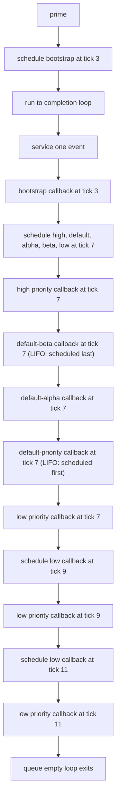

# Lesson 1: C++ Simulation Kernel Fundamentals

This lesson is a small, runnable C++ example that introduces gem5's event
kernel by using real APIs from `src/sim/eventq.hh`.

The goal is to make four ideas concrete:

1. gem5 time is modeled in `Tick` units.
2. Work is performed by scheduling `Event`s onto an `EventQueue`.
3. If two events have the same `Tick`, priority decides order.
4. If two events have the same `Tick` **and** the same priority, they execute
   in LIFO (last-in-first-out) order -- the most recently scheduled one runs
   first.

## Source map

- Lesson API and state:
  `src/tutorial/lesson01/event_timeline.hh`
- Lesson behavior and scheduling:
  `src/tutorial/lesson01/event_timeline.cc`
- Unit test and event queue setup:
  `src/tutorial/lesson01/event_timeline.test.cc`
- Build integration for this lesson test:
  `src/tutorial/SConscript`
- Sphinx wrapper page that includes this file:
  `docs/tutorial/lesson-01-cpp-simulation-kernel.md`

## Build and run

Build the lesson test binary:

```bash
scons build/NULL/tutorial/lesson01_event_timeline.test.debug
```

Run the binary:

```bash
./build/NULL/tutorial/lesson01_event_timeline.test.debug
```

Run only this lesson's test case:

```bash
./build/NULL/tutorial/lesson01_event_timeline.test.debug \
  --gtest_filter=EventTimelineTest.ProcessesCallbacksByTickThenPriority
```

## Mental model: event execution timeline

`prime()` schedules one bootstrap callback at tick 3. That callback then
schedules three callbacks at tick 7 with different priorities. One of those
callbacks self-reschedules twice more.

```text
Time (Tick) ---> 3 ------------------- 7 ----------- 9 ----------- 11

At tick 3:
  bootstrap
    schedules for tick 7 (in this order):
      high_priority    (EventBase::Delayed_Writeback_Pri = -1)
      default_priority (EventBase::Default_Pri = 0)
      default_alpha    (EventBase::Default_Pri = 0)
      default_beta     (EventBase::Default_Pri = 0)
      low_priority     (EventBase::Progress_Event_Pri = 95)

At tick 7 (ordered by priority, then LIFO within same priority):
  high_priority -> default_beta -> default_alpha -> default_priority
                                                        -> low_priority
                                                             \
                                                    reschedule at tick 9

At tick 9:
  low_priority
    reschedule low_priority at tick 11

At tick 11:
  low_priority
```

gem5 ordering rules from `sim/eventq.hh`:

- Earlier `when()` (tick) runs first.
- For equal `when()`, lower numeric priority runs first.
  Example: `-1` runs before `0`, and `0` runs before `95`.
- For equal `when()` **and** equal priority, events execute in **LIFO** order.
  The event queue uses a stack per priority bin, so the last event inserted
  runs first. In this lesson, `default`, `alpha`, `beta` are scheduled in
  that order but execute as `beta`, `alpha`, `default`.

## Event flow diagram



## gem5 APIs used in this lesson

### 1) `EventQueue` (`src/sim/eventq.hh`)

Used API surface:

- `schedule(Event*, Tick when)`: enqueue work at an absolute tick.
  `when` must be `>= getCurTick()`.
- `empty()`: check if the queue has pending events.
- `serviceOne()`: pop and execute exactly one scheduled event.
- `getCurTick()`: query queue-local current tick (used in the test).

Behavior this lesson relies on:

- `serviceOne()` advances queue time to the event's tick before calling
  `event->process()`.
- Event sorting is by `(when, priority)`.
- Within the same `(when, priority)` bin, events form a LIFO stack: the
  most recently scheduled event executes first.

### 2) `EventManager` (`src/sim/eventq.hh`)

`EventTimeline` inherits `EventManager`, which holds an `EventQueue*` and
provides convenience overloads:

- `schedule(Event&, Tick)`
- `deschedule(Event&)`
- `reschedule(Event&, Tick, bool always = false)`

That is why lesson code can call `schedule(bootstrapEvent, 3)` directly inside
`EventTimeline` methods.

### 3) `EventFunctionWrapper` (`src/sim/eventq.hh`)

Each callback event in the lesson is an `EventFunctionWrapper`:

- wraps a `std::function<void(void)>` callback,
- has a debug-friendly event name,
- can set a priority via constructor argument.

Lesson instances:

- `bootstrapEvent`: default priority.
- `highPriorityEvent`: `EventBase::Delayed_Writeback_Pri` (`-1`).
- `defaultPriorityEvent`: `EventBase::Default_Pri` (`0`).
- `defaultPriorityAlphaEvent`: `EventBase::Default_Pri` (`0`).
- `defaultPriorityBetaEvent`: `EventBase::Default_Pri` (`0`).
- `lowPriorityPulseEvent`: `EventBase::Progress_Event_Pri` (`95`).

The three `Default_Pri` events demonstrate LIFO ordering within a priority
bin. They are scheduled in order `default -> alpha -> beta`, but execute
in reverse: `beta -> alpha -> default`.

### 4) `curTick()` (`src/sim/cur_tick.hh`)

`appendTrace()` uses `curTick()` to record the exact simulation tick where each
callback executes:

- trace format: `tick=<n> label=<callback-label>`.

`curTick()` resolves through thread-local state set by `curEventQueue(...)`.
In this lesson, the test installs a dedicated queue as the current one.

### 5) `curEventQueue(...)` (`src/sim/eventq.hh`)

The test fixture calls:

- `savedQueue = curEventQueue();`
- `curEventQueue(&queue);` in `SetUp()`
- `curEventQueue(savedQueue);` in `TearDown()`

This keeps the test isolated and ensures `curTick()` refers to the fixture's
queue.

## Lesson code walkthrough

### Header (`event_timeline.hh`)

`EventTimeline` owns:

- trace state: `eventTrace`, `callbackCount`, `pulseCount`
- six `EventFunctionWrapper` event objects

Public methods:

- `prime()`: seed the first event.
- `runToCompletion()`: drain the queue with `serviceOne()`.
- read-only accessors: `trace()`, `callbacksExecuted()`.

Private callbacks model phases of a tiny timeline:

- `onBootstrap()`
- `onHighPriorityPhase()`
- `onDefaultPriorityPhase()`
- `onDefaultPriorityAlpha()`
- `onDefaultPriorityBeta()`
- `onLowPriorityPulse()`

### Implementation (`event_timeline.cc`)

1. Constructor wires each event wrapper to a member callback.
2. `prime()` schedules bootstrap at tick 3.
3. `onBootstrap()` appends trace, then schedules five events at tick 7.
4. `onLowPriorityPulse()` appends trace and self-reschedules twice:
   ticks 9 and 11.
5. `runToCompletion()` executes one event at a time until queue is empty.

Important detail:

- `schedule(..., 7)` is absolute tick scheduling.
- `schedule(..., curTick() + 2)` is relative-by-calculation.

## Test walkthrough

`EventTimelineTest.ProcessesCallbacksByTickThenPriority` validates:

1. queue is non-empty after `prime()`,
2. queue is empty after `runToCompletion()`,
3. final queue tick is `11`,
4. callbacks executed is `8`,
5. full trace lines match expected order exactly.

Expected trace:

1. `tick=3 label=bootstrap`
2. `tick=7 label=high-priority-phase`
3. `tick=7 label=default-priority-beta`   (LIFO: scheduled last, runs first)
4. `tick=7 label=default-priority-alpha`  (LIFO: scheduled second)
5. `tick=7 label=default-priority-phase`  (LIFO: scheduled first, runs last)
6. `tick=7 label=low-priority-pulse`
7. `tick=9 label=low-priority-pulse`
8. `tick=11 label=low-priority-pulse`

## Why this lesson matters for later lessons

Everything in later lessons (SimObjects, ports, timing, Python-configured
systems) still runs on this same event kernel:

- model behavior becomes event callbacks,
- simulation time advances by processing events,
- deterministic ordering depends on tick, priority, and insertion order (LIFO
  within the same priority bin).
