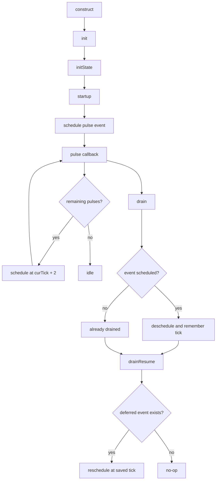

# Lesson 2: C++ SimObject Anatomy

This lesson is a runnable C++ SimObject example that builds on Lesson 1's
EventQueue fundamentals.

The goal is to make four ideas concrete:

1. SimObjects are configured through generated `Params` structs.
2. Lifecycle hooks are explicit (`init`, `initState`, `startup`).
3. Runtime behavior is still event-driven callbacks on an event queue.
4. `drain`/`drainResume` preserve in-flight work across pauses.

## Source map

- Python SimObject declaration and parameters:
  `src/tutorial/lesson02/TutorialLifecycle.py`
- Lesson API and lifecycle hooks:
  `src/tutorial/lesson02/simobject_lifecycle.hh`
- Lesson behavior and event scheduling:
  `src/tutorial/lesson02/simobject_lifecycle.cc`
- Unit test and queue setup:
  `src/tutorial/lesson02/simobject_lifecycle.test.cc`
- Build integration (SimObject + gtest target):
  `src/tutorial/SConscript`
- Sphinx wrapper page that includes this file:
  `docs/tutorial/lesson-02-cpp-simobject-anatomy.md`

## Build and run

Build the lesson test binary:

```bash
scons build/NULL/tutorial/lesson02_simobject_lifecycle.test.debug
```

Run the binary:

```bash
./build/NULL/tutorial/lesson02_simobject_lifecycle.test.debug
```

List test cases:

```bash
./build/NULL/tutorial/lesson02_simobject_lifecycle.test.debug \
  --gtest_list_tests
```

Run one test case:

```bash
./build/NULL/tutorial/lesson02_simobject_lifecycle.test.debug \
  --gtest_filter=TutorialLifecycleDemoTest.DrainResumeRestoresDeferredEvent
```

## Mental model: SimObject lifecycle plus event callbacks

For the main test path (`startup_delay=4`, `pulse_count=3`):

```text
Hook phase (tick 0):
  construct -> init -> initState -> startup
  startup schedules pulse-1 at tick 4

Time (Tick) ---> 0 -------- 4 -------- 6 -------- 8
Callbacks:
               pulse-1     pulse-2     pulse-3
```

For the drain/resume test path (`startup_delay=4`, `pulse_count=4`):

```text
Time (Tick) ---> 0 -------- 4 -------- 6 -------- 8 -------- 10
Action:
  startup schedules first pulse at 4
  pulse-1 runs at 4 and schedules pulse-2 at 6
  drain at tick 4 deschedules pending pulse-2 and records its tick
  drainResume at tick 4 reschedules pulse-2 at tick 6
  remaining callbacks run at 6, 8, 10
```

## Event + lifecycle flow diagram



## gem5 APIs used in this lesson

### 1) Python SimObject declaration (`TutorialLifecycle.py`)

`TutorialLifecycleDemo` defines:

- `type`: generated params class key.
- `cxx_header` and `cxx_class`: bind Python metadata to C++ class.
- `startup_delay` (`Param.Tick`) and `pulse_count` (`Param.Unsigned`).

This declaration drives generated files like `params/TutorialLifecycleDemo.hh`.

### 2) `SimObject` (`src/sim/sim_object.hh`)

`TutorialLifecycleDemo` inherits `SimObject` and overrides these hooks:

- `init()`: called after all C++ SimObjects are created/connected.
- `initState()`: called for cold-start initialization.
- `startup()`: final pre-simulation hook, ideal for first event schedule.
- `drain()` / `drainResume()`: pause and restore in-flight state.

### 3) `PARAMS(TutorialLifecycleDemo)`

The `PARAMS(...)` macro gives typed parameter access:

- `using Params = TutorialLifecycleDemoParams`
- `params()` accessor returning the derived params struct.

The constructor stores key parameters (`startup_delay`, `pulse_count`) in C++
member state to define runtime behavior.

### 4) `EventFunctionWrapper` and `EventManager`

The lesson uses one event wrapper (`pulseEvent`) bound to `onPulse()`.
Scheduling uses `SimObject`'s inherited `EventManager` helpers:

- `schedule(event, tick)`
- `deschedule(event)`

Callbacks are traced as `tick=<n> label=pulse-<k>`.

### 5) `Event::when()` during drain

When `drain()` sees a scheduled callback, it captures the pending tick with
`pulseEvent.when()`, deschedules the event, and marks it as deferred.
`drainResume()` restores the same callback at that exact tick.

### 6) `getEventQueue(...)` and `curEventQueue(...)` in tests

The test fixture uses main event queue index 0 and installs it as the current
thread-local queue so `curTick()` is valid and deterministic.

## Lesson code walkthrough

### Header (`simobject_lifecycle.hh`)

`TutorialLifecycleDemo` owns:

- lifecycle trace (`lifecycleLog`) and callback trace (`callbackLog`),
- parameter-backed runtime state (`startupDelay`, `remainingPulses`),
- drain bookkeeping (`deferredByDrain`, `deferredTick`),
- one callback event (`pulseEvent`).

Public helper methods (`serviceOne`, `runToCompletion`) keep tests compact.

### Implementation (`simobject_lifecycle.cc`)

1. Constructor records a normalized "construct" trace line with parameters.
2. `startup()` schedules first callback at `curTick() + startupDelay`.
3. `onPulse()` logs a callback, decrements remaining work, and self-schedules.
4. `drain()` captures and removes pending callback if one exists.
5. `drainResume()` restores the deferred callback tick exactly.

## Test walkthrough

### `RunsLifecycleAndCallbacksInOrder`

Validates cold-start lifecycle order and callback schedule:

1. hook trace at tick 0 (`construct`, `init`, `initState`, `startup`),
2. callback trace at ticks 4/6/8,
3. final queue tick is 8,
4. exactly 3 callbacks executed.

### `DrainResumeRestoresDeferredEvent`

Validates pause/resume behavior:

1. run first callback at tick 4,
2. `drain()` removes scheduled callback at tick 6,
3. `drainResume()` restores callback at tick 6,
4. full callback trace is ticks 4/6/8/10.

## Why this lesson matters for later lessons

Later components (ports, timing objects, and Python-configured systems) all use
this same shape:

- Python params define the object boundary,
- C++ SimObject hooks initialize model state,
- event callbacks implement behavior over simulated time,
- drain/resume preserves correctness during transitions.
