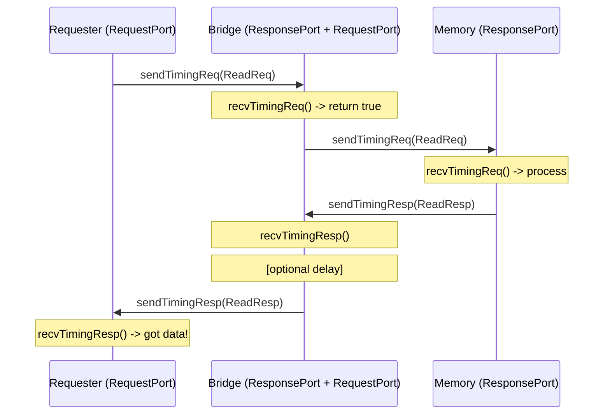
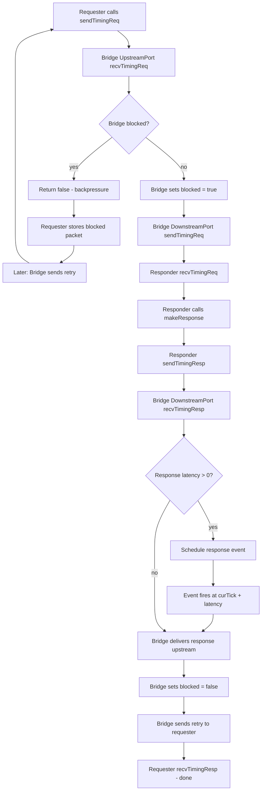

# Lesson 3: Ports, Packets, and Memory Request Flow

## Why this lesson exists

In Lessons 1 and 2 you learned that gem5 is an event-driven simulator: work
happens inside callbacks on an event queue. But events alone do not explain
how a CPU talks to a cache, how a cache talks to memory, or how any two
components exchange data at all.

The answer is **ports**. Ports are gem5's universal interconnect abstraction.
Every memory-system interaction -- from a CPU issuing a load to a cache
controller fetching a line from DRAM -- flows through a pair of connected
ports using a well-defined request/response protocol.

Understanding ports is essential because:

- **Every memory-system component has ports.** CPUs, caches, buses, memory
  controllers, and even accelerators all communicate through port pairs.
- **Ports enforce a discipline.** They separate *who initiates* a transaction
  (the requester) from *who fulfills* it (the responder). This separation
  makes it possible to swap components without rewriting the rest of the
  system.
- **Flow control lives in the port protocol.** Backpressure, retries, and
  blocking are handled at the port level, not buried inside ad-hoc
  component logic.

This lesson builds a small, runnable C++ example -- a **TutorialMemoryBridge**
-- that sits between a requester and a responder, forwarding requests
downstream and responses upstream. Along the way you will see exactly how
packets are created, how timing requests and responses traverse port
connections, and how backpressure works when a component is busy.

---

## The big picture: how components talk in gem5

### The client/server analogy

Think of a CPU issuing a memory read. In everyday terms:

1. The CPU is the **client** -- it initiates the request.
2. The memory controller is the **server** -- it fulfills the request and
   returns data.

gem5 models this with two port types:

| Port type        | Role           | Real-world analogy            |
|------------------|----------------|-------------------------------|
| **RequestPort**  | Sends requests | The client-side socket        |
| **ResponsePort** | Receives requests, sends responses | The server-side socket |

A `RequestPort` always connects to a `ResponsePort`, and vice versa.
Communication is always **bidirectional**: requests flow in one direction,
responses flow back.

### A minimal system

```text
  +----------+          +------------------+          +--------+
  |   CPU    |          |     Bridge       |          | Memory |
  |          |          |                  |          |        |
  | [ReqPort]---bind--->[RespPort] [ReqPort]---bind--->[RespPort]
  |          |          |                  |          |        |
  +----------+          +------------------+          +--------+

  Request flow:  CPU ---> Bridge ---> Memory
  Response flow: CPU <--- Bridge <--- Memory
```

Every arrow is a port connection. The bridge in the middle is what this
lesson implements: `TutorialMemoryBridge`.

### A realistic system

Real gem5 configurations chain many components together:

```text
  +------+   +-------+   +-----+   +-------+   +------+
  | CPU  |-->| L1-D$ |-->| Bus |-->| L2-$  |-->| DRAM |
  |      |   |       |   |     |   |       |   |      |
  +------+   +-------+   +-----+   +-------+   +------+
                            |
  +------+   +-------+     |
  | CPU  |-->| L1-I$ |---->+
  |      |   |       |
  +------+   +-------+
```

Every `-->` is a `RequestPort`-to-`ResponsePort` binding. The bus has
multiple ResponsePorts (one per upstream connection) and one or more
RequestPorts facing downstream. Caches have a ResponsePort on the CPU side
and a RequestPort on the memory side.

The protocol is the same everywhere: timing requests flow downstream,
timing responses flow back upstream, and flow control uses the retry
mechanism you will see in this lesson.

---

## Conceptual foundations

### What is a Packet?

A **Packet** (`src/mem/packet.hh`) is the unit of communication between
ports. It represents a single transfer: a read request, a write request, a
read response, etc.

A packet carries:

- **A memory command** (`MemCmd`): `ReadReq`, `WriteReq`, `ReadResp`,
  `WriteResp`, etc.
- **A Request object** (`RequestPtr`): the underlying memory request with
  address, size, and flags.
- **Data** (optional): a pointer to the payload bytes for reads/writes.
- **Timing metadata**: header delay, payload delay, snoop delay.

Key operations on packets:

| Operation            | What it does                                    |
|----------------------|-------------------------------------------------|
| `Packet(req, cmd)`   | Create a packet from a request and a command    |
| `pkt->getAddr()`     | Get the physical address                        |
| `pkt->getSize()`     | Get the request size in bytes                   |
| `pkt->isRead()`      | True if this is a read command                  |
| `pkt->isWrite()`     | True if this is a write command                 |
| `pkt->isRequest()`   | True if this is a request (not a response)      |
| `pkt->isResponse()`  | True if this is a response                      |
| `pkt->makeResponse()`| Convert request packet into response in place   |
| `pkt->allocate()`    | Allocate a data buffer for the packet           |

### What is a Request?

A **Request** (`src/mem/request.hh`) is the persistent description of a
memory operation. It lives for the duration of the transaction and carries:

- **Physical address** and **size**.
- **Flags** (e.g., `UNCACHEABLE`, `INST_FETCH`, `PREFETCH`).
- **Requestor ID**: who initiated this request (for statistics/debugging).

Requests are reference-counted (`RequestPtr = std::shared_ptr<Request>`)
and shared between the request packet and its response packet.

### The three access protocols

gem5 ports support three protocols for different simulation modes:

```text
+--------------------------------------------------------------------+
|  Protocol   |  Speed  |  Flow control  |  Use case                 |
|-------------|---------|----------------|---------------------------|
|  Atomic     |  Fast   |  None (blocks) |  Warm-up, fast-forward    |
|  Timing     |  Slow   |  Yes (retries) |  Detailed cycle-accurate  |
|  Functional |  Instant|  None          |  Debugging, initialization|
+--------------------------------------------------------------------+
```

**Atomic** mode completes a memory access in zero simulation time. The
requester calls `sendAtomic(pkt)`, which synchronously returns a latency
estimate. No events are scheduled. This mode is used for fast-forwarding
past uninteresting simulation phases.

**Timing** mode is the main simulation mode. Requests and responses are
separate events. `sendTimingReq(pkt)` returns a boolean: `true` if the
request was accepted, `false` if the responder is busy (backpressure). In
the latter case, the requester must wait for a `recvReqRetry()` callback
before trying again. This protocol models realistic contention and queuing.

**Functional** mode bypasses timing entirely for debugging. It reads or
writes memory instantaneously without affecting simulation state. Used by
debuggers and for loading binaries.

This lesson focuses on **timing** mode because it is the most important
and the most complex.

---

## The timing protocol in depth

### Request flow: step by step

```text
     Requester                                         Responder
   (RequestPort)                                     (ResponsePort)
        |                                                  |
        |--- sendTimingReq(pkt) ------>  recvTimingReq(pkt)|
        |                               returns true/false|
        |                                                  |
        |   (if false: must wait)                          |
        |<-- recvReqRetry() ----------  sendRetryReq()     |
        |--- sendTimingReq(pkt) ------>  recvTimingReq(pkt)|
        |                                                  |
```

1. The requester calls `sendTimingReq(pkt)` on its `RequestPort`.
2. This directly invokes `recvTimingReq(pkt)` on the connected
   `ResponsePort`.
3. The responder returns `true` (accepted) or `false` (busy).
4. If `false`, the requester **must not** send again until it receives a
   `recvReqRetry()` callback. The responder calls `sendRetryReq()` when
   it has capacity again.

### Response flow: step by step

```text
     Requester                                         Responder
   (RequestPort)                                     (ResponsePort)
        |                                                  |
        | recvTimingResp(pkt) <------  sendTimingResp(pkt) |
        | returns true/false                               |
        |                                                  |
        |   (if false: must wait)                          |
        | sendRetryResp()     ------->  recvRespRetry()    |
        | recvTimingResp(pkt) <------  sendTimingResp(pkt) |
        |                                                  |
```

1. The responder calls `sendTimingResp(pkt)` on its `ResponsePort`.
2. This directly invokes `recvTimingResp(pkt)` on the connected
   `RequestPort`.
3. The requester returns `true` (accepted) or `false` (busy).
4. If `false`, the responder waits for `recvRespRetry()`.

### The retry contract

The retry mechanism is gem5's **flow control**. It prevents lost packets and
models realistic backpressure:

- A port that returns `false` is **blocked**. The sender must stop.
- The blocked port will eventually call `sendRetryReq()` or
  `sendRetryResp()` to unblock the sender.
- Only **one** retry notification per rejection. No polling, no busy-waiting.

This is similar to TCP flow control: the receiver says "stop sending" and
later says "you may resume."

### Putting it all together



---

## The getPort() contract

Every SimObject that has ports must override `getPort()`:

```cpp
Port &getPort(const std::string &if_name,
              PortID idx = InvalidPortID) override;
```

This method maps **Python port names** to **C++ port objects**. When the
Python configuration connects `bridge.upstream = cpu.port`, gem5 calls
`bridge.getPort("upstream")` to get the actual C++ port to bind.

Rules:

- `if_name` is the port name from the Python SimObject declaration.
- `idx` is used for **vector ports** (e.g., a bus with N connections).
  For single ports, `idx` is `InvalidPortID`.
- Fall through to `SimObject::getPort()` for unrecognized names.

### Python port declarations

In the Python SimObject file, ports are declared as class attributes:

```python
class TutorialMemoryBridge(SimObject):
    upstream = ResponsePort("Port facing the requester")
    downstream = RequestPort("Port facing memory")
```

These declarations tell gem5's configuration system:

- The object has two ports named `upstream` and `downstream`.
- `upstream` is a `ResponsePort` (receives requests).
- `downstream` is a `RequestPort` (sends requests).

The names in Python **must match** the string comparisons in `getPort()`.

---

## Address ranges

Every `ResponsePort` must implement `getAddrRanges()`:

```cpp
AddrRangeList getAddrRanges() const override;
```

This tells the system which addresses this port responds to. In a realistic
system:

- A DRAM controller responds to addresses `0x0000_0000` to `0x7FFF_FFFF`.
- A device responds to memory-mapped IO at `0x1000_0000` to `0x1000_0FFF`.
- A bridge passes through the ranges of whatever is on its downstream side.

When a `ResponsePort` changes its address ranges (e.g., after initialization),
it calls `sendRangeChange()` to notify the upstream `RequestPort`.

---

## Modeling guidelines

### 1. Keep port subclasses minimal

Define inner `class MyResponsePort : public ResponsePort` and
`class MyRequestPort : public RequestPort` inside your SimObject. These
subclasses implement the protocol methods (`recvTimingReq`, etc.) and
delegate real work to the owning SimObject via a back-pointer.

### 2. Separate protocol from policy

The port subclass handles **protocol** (flow control, retries, blocked
packets). The owning SimObject handles **policy** (should this request be
forwarded? cached? delayed?). This separation keeps code modular and
testable.

### 3. Blocking vs. non-blocking

A **blocking** component handles one request at a time. If a new request
arrives while one is in flight, it returns `false` and the requester must
retry. This is simpler to implement and reason about.

A **non-blocking** component has internal buffers (e.g., an MSHR queue) and
can handle multiple in-flight requests. This is more realistic but more
complex.

This lesson implements a **blocking** bridge. Real caches are typically
non-blocking.

### 4. Always handle the retry path

If your `recvTimingReq` can return `false`, you **must** eventually call
`sendRetryReq()` when you have capacity again. Forgetting to send retries
is a common source of simulation deadlocks.

### 5. Use makeResponse() to convert packets

When a responder finishes processing a request, it calls
`pkt->makeResponse()` to flip the command from request to response (e.g.,
`ReadReq` -> `ReadResp`). This modifies the packet in place -- do not
create a new packet for the response.

### 6. Events and ports work together

In timing mode, a response often cannot be sent immediately. The responder
schedules an event for the response delivery tick, and sends the response
from the event callback. This is how latency is modeled: the gap between
receiving the request and scheduling the response event is the component's
access latency.

---

## Source map

- Python SimObject declaration and port parameters:
  `src/tutorial/lesson03/TutorialMemoryBridge.py`
- Lesson API, port subclasses, and bridge state:
  `src/tutorial/lesson03/memory_ports.hh`
- Lesson behavior, request forwarding, and response delivery:
  `src/tutorial/lesson03/memory_ports.cc`
- Unit test with mock requester and responder:
  `src/tutorial/lesson03/memory_ports.test.cc`
- Build integration (SimObject + gtest target):
  `src/tutorial/SConscript`
- Sphinx wrapper page that includes this file:
  `docs/tutorial/lesson-03-cpp-memory-and-ports.md`

## Build and run

Build the lesson test binary:

```bash
scons build/NULL/tutorial/lesson03_memory_ports.test.debug
```

Run the binary:

```bash
./build/NULL/tutorial/lesson03_memory_ports.test.debug
```

List test cases:

```bash
./build/NULL/tutorial/lesson03_memory_ports.test.debug \
  --gtest_list_tests
```

Run one test case:

```bash
./build/NULL/tutorial/lesson03_memory_ports.test.debug \
  --gtest_filter=MemoryPortsTest.BackpressureBlocksSecondRequest
```

---

## Mental model: request/response through the bridge

For a single read with zero response latency:

```text
Time (Tick) ---> 0

At tick 0:
  requester sends ReadReq(addr=0x100)
    -> bridge.upstream.recvTimingReq()
    -> bridge forwards via bridge.downstream.sendTimingReq()
    -> responder.recvTimingReq() processes and calls makeResponse()
    -> responder.sendTimingResp(ReadResp)
    -> bridge.downstream.recvTimingResp()
    -> bridge.upstream.sendTimingResp(ReadResp)
    -> requester.recvTimingResp() -- done!
```

For a single read with `response_latency=10`:

```text
Time (Tick) ---> 0 ------------------------------ 10

At tick 0:
  requester sends ReadReq(addr=0x100)
    -> bridge receives from responder but delays response
    -> bridge schedules response event at tick 10

At tick 10:
  response event fires
    -> bridge.upstream.sendTimingResp(ReadResp)
    -> requester.recvTimingResp() -- done!
```

For backpressure (two requests, `response_latency=5`):

```text
Time (Tick) ---> 0 ------------ 5 ------------ 10

At tick 0:
  requester sends ReadReq(addr=0x100) -> accepted, bridge blocked
  requester sends ReadReq(addr=0x200) -> rejected! (backpressure)

At tick 5:
  response event fires for first request
    -> bridge delivers response, unblocks, sends retry
    -> requester retries ReadReq(addr=0x200) -> accepted
    -> bridge schedules response at tick 10

At tick 10:
  response event fires for second request
    -> requester gets second response
```

## Request/response flow diagram



---

## gem5 APIs used in this lesson

### 1) `RequestPort` and `ResponsePort` (`src/mem/port.hh`)

The two port types that form every memory-system connection.

**RequestPort** sends requests and receives responses:
- `sendTimingReq(pkt)` -> returns `bool` (accepted or rejected)
- `sendAtomic(pkt)` -> returns `Tick` (latency estimate)
- `sendFunctional(pkt)` -> void (debug access)
- `sendRetryResp()` -> notify responder that it may retry a response
- `recvTimingResp(pkt)` -> **override** to handle incoming responses
- `recvReqRetry()` -> **override** to handle retry notifications

**ResponsePort** receives requests and sends responses:
- `sendTimingResp(pkt)` -> returns `bool`
- `sendRetryReq()` -> notify requester that it may retry a request
- `getAddrRanges()` -> **override** to declare address ranges
- `recvTimingReq(pkt)` -> **override** to handle incoming requests
- `recvAtomic(pkt)` -> **override** for atomic protocol
- `recvFunctional(pkt)` -> **override** for functional protocol
- `recvRespRetry()` -> **override** to handle response retry

### 2) `Packet` and `MemCmd` (`src/mem/packet.hh`)

The unit of communication between ports.

Key commands used in this lesson:
- `MemCmd::ReadReq` / `MemCmd::ReadResp`
- `MemCmd::WriteReq` / `MemCmd::WriteResp`

Key methods:
- `Packet(req, cmd)` -- constructor from Request and command
- `pkt->makeResponse()` -- convert request to response in place
- `pkt->getAddr()` -- physical address
- `pkt->cmd.toString()` -- human-readable command name
- `pkt->allocate()` -- allocate data buffer

### 3) `Request` (`src/mem/request.hh`)

The underlying memory operation descriptor.

Construction:
```cpp
auto req = std::make_shared<Request>(
    addr,       // physical address
    size,       // bytes
    flags,      // Request::Flags()
    requestorId // who is making this request
);
```

`RequestPtr` is `std::shared_ptr<Request>`, so requests are
reference-counted and automatically freed.

### 4) `SimObject::getPort()` (`src/sim/sim_object.hh`)

Maps Python port names to C++ port objects:
```cpp
Port &getPort(const std::string &if_name,
              PortID idx = InvalidPortID) override;
```

### 5) `AddrRange` and `AddrRangeList` (`src/base/addr_range.hh`)

Address range representation used by `getAddrRanges()`:
```cpp
AddrRangeList getAddrRanges() const override {
    return {AddrRange(0x0, 0x1000)};
}
```

### 6) `EventFunctionWrapper` (from Lessons 1-2)

Used in the bridge to schedule delayed response delivery:
```cpp
EventFunctionWrapper responseEvent(
    [this]() { processResponseEvent(); },
    name() + ".response_event");

// Later, in handleResponse:
schedule(responseEvent, curTick() + responseLatency);
```

---

## Lesson code walkthrough

### Python declaration (`TutorialMemoryBridge.py`)

The SimObject declares two ports and one parameter:

- `upstream` (`ResponsePort`): faces the requester.
- `downstream` (`RequestPort`): faces memory.
- `response_latency` (`Param.Tick`): extra ticks of delay before
  forwarding a response upstream. Defaults to 0.

### Header (`memory_ports.hh`)

`TutorialMemoryBridge` owns:

- **Two inner port classes**: `UpstreamPort` (ResponsePort) and
  `DownstreamPort` (RequestPort).
- **Bridge state**: `blocked` flag, `responseLatency`, `pendingResponse`.
- **An event wrapper**: `responseEvent` for delayed response delivery.
- **Trace state**: `traceLog`, `forwardedCount`, `deliveredCount`.

Public interface:
- `getPort()`: maps "upstream" and "downstream" to port objects.
- `init()`: propagates address ranges after binding.
- `runToCompletion()`: test helper to drain the event queue.
- `eventLog()`: returns the trace of bridge operations.

### Implementation (`memory_ports.cc`)

**Constructor** initializes ports, blocked state, response latency, and
the response event callback. Records a "construct" trace entry.

**getPort()** maps port names to the two port member objects.

**init()** propagates address ranges from downstream to upstream.

**handleRequest()** is called by the upstream port when a timing request
arrives:

1. If `blocked`, log "backpressure" and return `false`.
2. Otherwise, set `blocked = true`, increment `forwardedCount`, log
   the forwarded request, and send it downstream.

**handleResponse()** is called by the downstream port when a timing
response arrives:

1. If `responseLatency > 0`, store the packet and schedule
   `responseEvent` at `curTick() + responseLatency`.
2. If zero latency, deliver immediately: set `blocked = false`, increment
   `deliveredCount`, send response upstream, and try sending retry to
   any blocked requester.

**processResponseEvent()** fires after the latency delay and performs
the same delivery logic: unblock, deliver, retry.

### UpstreamPort (ResponsePort)

- `recvTimingReq()`: delegates to `bridge.handleRequest()`. If rejected,
  sets `needRetry = true` so a retry will be sent later.
- `recvAtomic()`: passes through to downstream `sendAtomic()`.
- `recvFunctional()`: passes through to downstream `sendFunctional()`.
- `recvRespRetry()`: re-sends a previously blocked response packet.
- `getAddrRanges()`: delegates to bridge, which queries downstream.
- `sendPacket()`: wraps `sendTimingResp()` with blocked-packet tracking.
- `trySendRetry()`: sends `sendRetryReq()` if the requester was rejected
  and the port is now free.

### DownstreamPort (RequestPort)

- `recvTimingResp()`: delegates to `bridge.handleResponse()`.
- `recvReqRetry()`: re-sends a previously blocked request packet.
- `recvRangeChange()`: propagates range changes upstream.
- `sendPacket()`: wraps `sendTimingReq()` with blocked-packet tracking.

---

## Test walkthrough

The test file (`memory_ports.test.cc`) creates two mock components to
test the bridge in isolation:

### MockRequesterPort (RequestPort)

A test-only requester that:
- Builds and sends `ReadReq` or `WriteReq` packets.
- Records received responses in `responseLog`.
- Handles retry via `recvReqRetry()`.
- Tracks whether it was ever blocked (`wasBlocked`).

### MockResponderPort (ResponsePort)

A test-only memory that:
- Immediately converts any timing request into a response
  (`pkt->makeResponse()`) and sends it back.
- Declares a configurable address range.
- Counts received requests.

### Test setup

Each test creates a bridge, a mock requester, and a mock responder, then
binds them:

```text
MockRequester <--bind--> Bridge.upstream
Bridge.downstream <--bind--> MockResponder
```

### ForwardsReadRequestAndResponse

Sends a single `ReadReq` through the bridge and verifies:
- The responder received exactly one request.
- The requester received exactly one `ReadResp`.
- The bridge counters show 1 forwarded and 1 delivered.

### ForwardsWriteRequestAndResponse

Same as above but with `WriteReq` / `WriteResp`.

### BackpressureBlocksSecondRequest

Uses `response_latency=5` so the bridge stays blocked after the first
request. Sends a second request and verifies:
- The second request is rejected (backpressure).
- After draining the event queue (delivering the first response), the
  retry mechanism allows the second request through.
- Both responses are eventually delivered.

### ResponseLatencyAddsDelay

Uses `response_latency=10` and verifies:
- The response is not delivered at tick 0.
- After `runToCompletion()`, the queue tick is 10.
- The response arrives at tick 10.

### EventLogTracksRequestFlow

Sends a read and inspects the bridge's `eventLog()` to verify the trace
entries: construct, init, forward-req, recv-resp, deliver-resp.

---

## Common mistakes and how to avoid them

### Deadlock from missing retries

**Symptom**: simulation hangs forever.

**Cause**: your `recvTimingReq()` returned `false` but you never called
`sendRetryReq()` later.

**Fix**: when your component unblocks (e.g., finishes processing a
response), always check if there is a pending retry and send it:

```cpp
void trySendRetry() {
    if (needRetry && blockedPacket == nullptr) {
        needRetry = false;
        sendRetryReq();
    }
}
```

### Sending when blocked

**Symptom**: assertion failure or double-send.

**Cause**: calling `sendTimingReq()` or `sendTimingResp()` again before
receiving a retry notification.

**Fix**: after a send returns `false`, store the packet and wait for the
retry callback.

### Forgetting getAddrRanges()

**Symptom**: compile error or runtime panic.

**Cause**: `getAddrRanges()` is pure virtual in `ResponsePort`. Every
ResponsePort subclass must implement it.

**Fix**: return the address ranges your component handles:

```cpp
AddrRangeList getAddrRanges() const override {
    return owner->getAddrRanges();
}
```

### Mismatched port names

**Symptom**: "Could not find port" error during Python configuration.

**Cause**: the string in `getPort()` does not match the Python port
attribute name.

**Fix**: ensure exact string match between Python declaration and
`getPort()`:

```python
# Python
upstream = ResponsePort("...")
```

```cpp
// C++
if (if_name == "upstream") return upstreamPort;
```

---

## Why this lesson matters for later lessons

The port protocol you learned here is the foundation for everything that
follows:

- **Lesson 4 (Clock Domains)**: `ClockedObject` inherits `SimObject` and
  uses the same port infrastructure, but converts between cycle and tick
  units for latency.
- **Lesson 6 (Timing and CPU Hooks)**: CPU models use `RequestPort` to
  issue instruction fetches and data accesses through the memory hierarchy.
- **Lessons 8-9 (Python Config)**: port connections declared in Python
  (`system.cpu.port = system.bus.cpu_side`) invoke `getPort()` and `bind()`
  under the hood.
- **Lesson 13 (Capstone)**: the full simulator wires CPUs, caches, buses,
  and memory together using the exact same port protocol.

Every component you build from now on will have ports. The request/response
pattern, the retry contract, and the separation between protocol and policy
are the shared language of the entire gem5 memory system.
