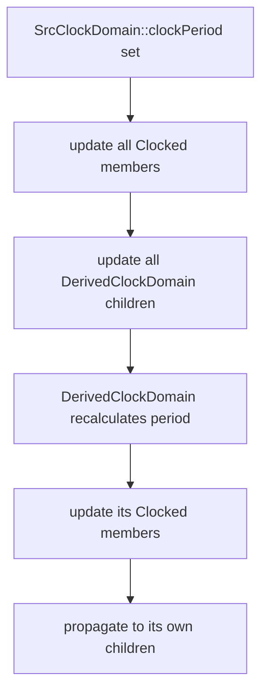
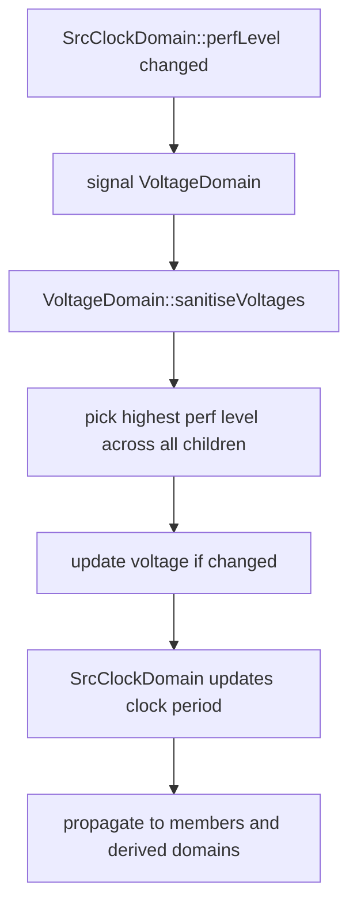

# Lesson 4: C++ Clock Domains

This lesson explores gem5's clock domain infrastructure by using real APIs
from `src/sim/clock_domain.hh` and `src/sim/clocked_object.hh`.

The goal is to make four ideas concrete:

1. gem5 supports multiple independent clock domains, each with its own
   frequency (period in ticks).
2. `ClockedObject` binds a SimObject to a clock domain and provides
   cycle/tick conversion helpers.
3. `DerivedClockDomain` creates hierarchical clocks with integer frequency
   dividers that automatically propagate parent frequency changes.
4. `VoltageDomain` coordinates voltage levels across clock domains and
   enables DVFS (Dynamic Voltage and Frequency Scaling).

## Status

Placeholder. Code examples will be authored in a later change.

## Planned scope

1. Creating `SrcClockDomain` and `VoltageDomain` instances.
2. Binding a `ClockedObject` to a clock domain.
3. Using cycle/tick conversion: `clockEdge()`, `clockPeriod()`, `curCycle()`,
   `cyclesToTicks()`, `ticksToCycles()`.
4. Building a `DerivedClockDomain` hierarchy with integer dividers.
5. Observing clock propagation when a parent domain changes frequency.
6. DVFS performance-level switching across voltage/frequency points.

## Key gem5 classes

### `ClockDomain` (`src/sim/clock_domain.hh`)

Abstract base class that owns a clock period and notifies registered
members and child domains when the period changes.

### `SrcClockDomain` (`src/sim/clock_domain.hh`)

A root clock domain configured with one or more frequency operating points
(for DVFS). Each point pairs with a voltage level from an associated
`VoltageDomain`.

### `DerivedClockDomain` (`src/sim/clock_domain.hh`)

A child clock domain whose period is `parent.clockPeriod() * clk_divider`.
When the parent's frequency changes, derived domains automatically
recompute and propagate the new period to all their members and children.

### `VoltageDomain` (`src/sim/voltage_domain.hh`)

Manages voltage operating points and coordinates voltage selection across
all `SrcClockDomain` children sharing the same voltage rail.

### `ClockedObject` (`src/sim/clocked_object.hh`)

Inherits both `SimObject` and `Clocked`. Every clocked component in gem5
(CPUs, caches, memory controllers, etc.) inherits from this class. It
provides:

- `clockPeriod()`: domain's clock period in ticks.
- `clockEdge(Cycles n)`: absolute tick of the nth future clock edge.
- `curCycle()`: current cycle number.
- `cyclesToTicks(Cycles)` / `ticksToCycles(Tick)`: conversions.
- `frequency()`: clock frequency derived from period.
- `nextCycle()`: tick of the next rising clock edge.

### Python configuration (`ClockDomain.py`, `VoltageDomain.py`)

```python
from m5.objects import *

# Root clock at 2 GHz
sys_clk = SrcClockDomain(clock="2GHz",
                          voltage_domain=VoltageDomain())

# Derived clock at half frequency (1 GHz)
mem_clk = DerivedClockDomain(clk_domain=sys_clk, clk_divider=2)
```

Objects default to `Parent.clk_domain`, so children automatically inherit
their parent's clock unless explicitly overridden.

## Mental model: multiple clock domains

```text
VoltageDomain (1.0V)
 |
 +-- SrcClockDomain "sys_clk" (2 GHz, period = 500 ticks)
 |    |
 |    +-- CPU (ClockedObject, inherits sys_clk)
 |    +-- L1 Cache (ClockedObject, inherits sys_clk)
 |    |
 |    +-- DerivedClockDomain "mem_clk" (divider=2 -> 1 GHz, period = 1000)
 |         |
 |         +-- Memory Controller (ClockedObject, inherits mem_clk)
 |
 +-- SrcClockDomain "io_clk" (500 MHz, period = 2000 ticks)
      |
      +-- I/O Bridge (ClockedObject, inherits io_clk)
```

Each domain ticks independently. Events scheduled by objects in different
domains fire at their respective clock edges, all on the same global
`EventQueue` tick timeline from Lesson 1.

## Clock change propagation



## DVFS flow



## Why this lesson matters for later lessons

Clock domains are foundational for any timing-accurate simulation:

- Lesson 5 builds on clock domains to model latency and timing modes.
- Python configuration (Lessons 6-7) uses `SrcClockDomain` and
  `DerivedClockDomain` to wire up multi-frequency systems.
- DVFS support enables power/performance research workflows in later
  lessons.
